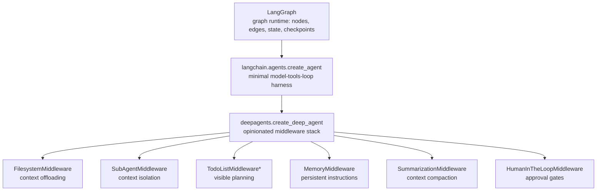

# DeepAgents Mastery — From LangGraph Practitioner to Production Agent-Runtime Architect

## Course Overview

You already know how to build stateful, checkpointed, multi-agent systems with **LangGraph**, expose tools over **MCP**, and ship production LLM services on **FastAPI** and **Bedrock**. This course does not re-teach any of that. It teaches **DeepAgents** — the `deepagents` Python package from LangChain — as what it actually is: a specific, opinionated **middleware stack on top of `langchain.agents.create_agent`** (itself a thin harness over a LangGraph `StateGraph`) that bundles four things you would otherwise hand-roll yourself every time you built a "deep" agent: a virtual/pluggable **filesystem for context offloading**, a **subagent delegation tool** for context isolation, a **planning tool** for visible multi-step execution, and a **persistent-memory convention**.

The framing matters. Most tutorials teach DeepAgents as "an autonomous agent framework." That framing will actively mislead you, because it hides the one fact that makes DeepAgents debuggable and production-usable: **everything it does is a composition of ordinary LangGraph and LangChain primitives you already understand** — `AgentMiddleware` hooks, `CompiledStateGraph`, `Checkpointer`, `BaseStore`, `interrupt`/`Command(resume=...)`. This course teaches DeepAgents by continuously mapping it back onto those primitives, so that when something breaks in production, you know exactly which layer to open up.

By the end, you will be able to:
- Explain precisely what `create_deep_agent()` builds — the exact middleware assembly order — and why each piece exists
- Design filesystem-backed context strategies (`StateBackend`, `FilesystemBackend`, `StoreBackend`, `CompositeBackend`) so agents can work with more data than fits in a context window
- Architect subagent hierarchies for genuine context isolation, not just "more prompts"
- Wire persistent, cross-thread memory correctly — and know the difference between the SDK's `MemoryMiddleware` and the `deepagents-code` CLI's `AGENTS.md` convention, which most tutorials conflate
- Add human-in-the-loop approval gates and durable checkpointing to agents that touch real systems
- Integrate MCP servers, custom tools, and custom middleware into a deep agent without fighting the framework
- Deploy, test, secure, and operate a DeepAgents-based service at the same standard you already hold your FastAPI/LangGraph services to

## Why DeepAgents, and Why Now

LangGraph gives you graphs, state, and checkpoints. LangChain's `create_agent` gives you a minimal, standard agentic loop (model → tools → model) built as one of those graphs. Neither gives you an opinionated answer to three problems that show up the moment an agent's task runs long: **(1)** the conversation grows past the context window because the agent is reading files, search results, or logs it doesn't need verbatim forever, **(2)** a single flat tool-calling loop degrades once ten kinds of subtasks are jammed into one system prompt, and **(3)** "remembering" anything across a restart or across users requires you to invent your own convention. DeepAgents is LangChain's packaged answer to exactly these three problems — nothing more mystical than that.

*`TodoListMiddleware` actually ships from `langchain`, inherited "for free" via `create_agent` — Chapter 4 explains this precisely.

## Prerequisites

- **Python**: async/await, type hints, TypedDict/Pydantic, decorators (assumed from your background)
- **LangGraph**: `StateGraph`, checkpointers, `Command`, `interrupt()`, the Pregel execution model — this course does not re-explain these; see the companion [LangGraph course](../langgraph-course/00-index.md) if any of that is unfamiliar
- **LangChain Core**: `Runnable`, messages, tools, `bind_tools` — see the companion [LangChain Core course](../langchain-core-course/00-index.md) if needed
- **MCP**: comfortable with MCP servers/clients and tool exposure (assumed from your background)
- **An LLM provider**: Bedrock, Anthropic, or OpenAI credentials for running the code examples

## Quick Self-Assessment

Before starting, you should be able to answer "yes" to most of these — if not, spend an hour with the linked companion course first:

| Question | If "no", read first |
|---|---|
| Can you explain what a LangGraph checkpointer does and name two implementations? | [LangGraph Ch. 9](../langgraph-course/09-checkpointing-and-durable-execution.md) |
| Do you know the difference between `interrupt()` and a `Command(resume=...)`? | [LangGraph Ch. 12](../langgraph-course/12-human-in-the-loop.md) |
| Can you write a LangChain tool with `@tool` and explain `bind_tools`? | [LangChain Core Ch. 7](../langchain-core-course/07-tools-and-tool-calling.md) |
| Do you know what a LangGraph `Store`/`BaseStore` is for, versus a checkpointer? | [LangGraph Ch. 10](../langgraph-course/10-memory-management.md) |
| Have you wired an MCP client's tools into a LangChain agent before? | Your own MCP server experience — this course assumes it |

## Estimated Learning Timeline (3–4 Weeks, faster given your background)

| Week | Chapters | Theme |
|---|---|---|
| 1 | 01–06 | Mental model, internals, first agent, planning, filesystem context, backends |
| 2 | 07–10 | Memory, subagents, human-in-the-loop, checkpointing |
| 3 | 11–14 | MCP integration, multi-agent systems, custom middleware, skills/advanced context |
| 4 | 15–21 | Best practices, pitfalls, testing, production deployment, security, capstones, interviews |

## Complete Chapter Index

| # | Chapter | Description |
|---|---|---|
| 00 | [Index](./00-index.md) | This page |
| 01 | [Introduction & Prerequisites](./01-introduction-and-prerequisites.md) | Agent vs. workflow, why DeepAgents exists, package relationships, installation |
| 02 | [Architecture & Internals](./02-architecture-and-internals.md) | `create_deep_agent()` internals: exact middleware assembly, `CompiledStateGraph`, harness profiles |
| 03 | [Your First Deep Agent](./03-your-first-deep-agent.md) | `create_deep_agent()` signature, models, tools, `system_prompt`, invoke/stream/astream |
| 04 | [Planning System & Todos](./04-planning-system-and-todos.md) | `write_todos`, the `Todo` schema, where planning actually lives |
| 05 | [Filesystem-Backed Context](./05-filesystem-backed-context.md) | `ls/read_file/write_file/edit_file/glob/grep`, token eviction |
| 06 | [Backends & Storage Architecture](./06-backends-and-storage-architecture.md) | `StateBackend`, `FilesystemBackend`, `StoreBackend`, `CompositeBackend`, sandboxes |
| 07 | [Memory & Persistence](./07-memory-and-persistence.md) | `MemoryMiddleware`, cross-thread `Store`, SDK memory vs. CLI `AGENTS.md` |
| 08 | [Subagent Orchestration](./08-subagent-orchestration.md) | `SubAgent`/`CompiledSubAgent`/`AsyncSubAgent`, the `task` tool, context isolation |
| 09 | [Human-in-the-Loop](./09-human-in-the-loop.md) | `interrupt_on`, `FilesystemPermission`, approve/edit/reject/respond, resume |
| 10 | [Checkpointing & Durable Execution](./10-checkpointing-and-durable-execution.md) | Checkpointer choice, `thread_id`, crash recovery |
| 11 | [MCP Integration](./11-mcp-integration.md) | `MultiServerMCPClient`, wiring MCP tools into a deep agent |
| 12 | [Multi-Agent Systems](./12-multi-agent-systems.md) | Coordinator + specialized subagents, sync vs. async subagents |
| 13 | [Custom Tools & Middleware](./13-custom-tools-and-middleware.md) | Writing your own `AgentMiddleware`, harness profiles, prompt caching |
| 14 | [Skills & Advanced Context Engineering](./14-skills-and-advanced-context-engineering.md) | `SkillsMiddleware`, summarization tuning, structured `response_format` |
| 15 | [Best Practices](./15-best-practices.md) | Production-grade patterns across every component |
| 16 | [Common Mistakes & Pitfalls](./16-common-mistakes-and-pitfalls.md) | The failure modes that bite in real deployments |
| 17 | [Testing & Evaluation](./17-testing-and-evaluation.md) | Unit-testing tools/subagents, LangSmith evals |
| 18 | [Production Deployment](./18-production-deployment.md) | FastAPI, streaming, retries, observability, cost, Docker/K8s, scaling |
| 19 | [Security & Governance](./19-security-and-governance.md) | Sandboxing `execute`, filesystem permissions, prompt injection, secrets |
| 20 | [Capstone Projects](./20-capstone-projects.md) | Four tiered projects: chatbot → PR reviewer → autonomous researcher → production platform |
| 21 | [Interview Preparation](./21-interview-preparation.md) | FAQ, scenario questions, system design, troubleshooting |

## Milestones

- [ ] **Milestone 1 (Week 1)**: Build and stream a working deep agent with custom tools, and explain its exact middleware stack from memory
- [ ] **Milestone 2 (Week 2)**: Ship an agent with cross-thread memory, a subagent hierarchy, checkpointed durability, and at least one human-approval gate
- [ ] **Milestone 3 (Week 3)**: Integrate a real MCP server and build a multi-agent coordinator with mixed sync/async subagents
- [ ] **Milestone 4 (Week 4)**: Deploy a tested, observable, secured DeepAgents service behind FastAPI and complete all four capstone tiers

## Recommended Resources

- [DeepAgents Overview (LangChain Docs)](https://docs.langchain.com/oss/python/deepagents/overview)
- [`langchain-ai/deepagents` GitHub repository](https://github.com/langchain-ai/deepagents) — read `libs/deepagents/deepagents/graph.py` directly; it's the ground truth for every claim in this course
- [DeepAgents Human-in-the-Loop docs](https://docs.langchain.com/oss/python/deepagents/human-in-the-loop)
- [Memory & Skills docs (note: this page documents the `deepagents-code` CLI, not the SDK — Chapter 7 explains the distinction)](https://docs.langchain.com/oss/python/deepagents/code/memory-and-skills)
- [`langchain-mcp-adapters` on GitHub](https://github.com/langchain-ai/langchain-mcp-adapters)
- Related course in this repo: [LangGraph Mastery](../langgraph-course/00-index.md) — the runtime everything here sits on
- Related course in this repo: [LangChain Core](../langchain-core-course/00-index.md) — the `Runnable`/tool primitives DeepAgents composes

## Learning Priority (80/20)

If time is short, focus on these in order:

1. **Architecture & Internals** (Ch. 2) ⭐⭐⭐⭐⭐ — the mental model that makes everything else legible
2. **Filesystem-Backed Context + Backends** (Ch. 5–6) ⭐⭐⭐⭐⭐ — DeepAgents' actual differentiator
3. **Subagent Orchestration** (Ch. 8) ⭐⭐⭐⭐ — how context isolation really works
4. **Memory & Persistence** (Ch. 7) ⭐⭐⭐⭐ — get the SDK-vs-CLI distinction right or you'll build the wrong thing
5. **Human-in-the-Loop + Checkpointing** (Ch. 9–10) ⭐⭐⭐⭐ — what makes a deep agent safe to run unattended
6. **MCP Integration + Multi-Agent Systems** (Ch. 11–12) ⭐⭐⭐ — apply everything to your existing MCP servers
7. **Production Deployment + Security** (Ch. 18–19) ⭐⭐⭐ — ship it responsibly
8. Capstones + Interview Prep (Ch. 20–21) — solidify and demonstrate mastery

A note on trust: every technical claim in this course (function signatures, defaults, middleware order, tool schemas) was verified directly against the `langchain-ai/deepagents` source on GitHub rather than paraphrased from marketing copy, because the package is young and moves fast. Where the docs and the source disagreed, or where something couldn't be confirmed, the relevant chapter says so explicitly instead of guessing.

  
  <a href="./00-index.md">🏠 Index</a>
  <a href="./01-introduction-and-prerequisites.md">Next: Introduction & Prerequisites →</a>

