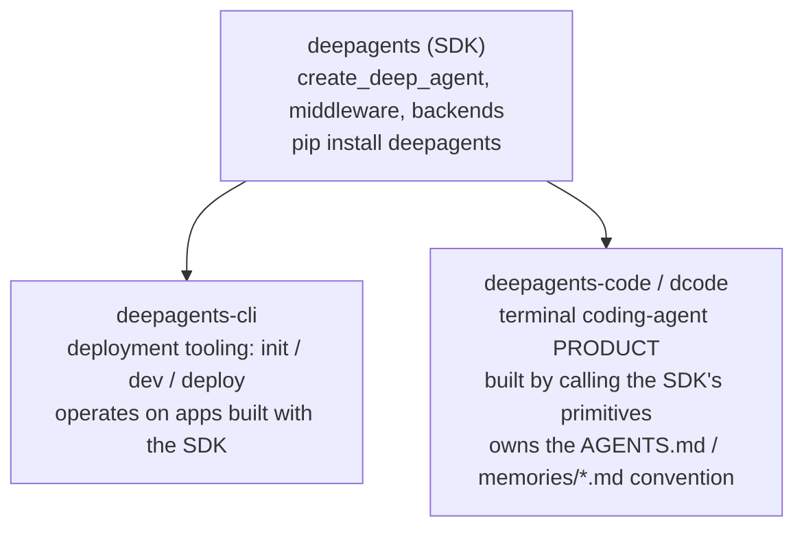

# Introduction & Prerequisites

> "A workflow is a graph you designed. An agent is a graph the model steers." DeepAgents exists for the moment that steering has to survive a task too long to fit in one context window.

## Learning Objectives

By the end of this chapter, you will be able to:

- State precisely what `deepagents` is and is not, and explain the agent-vs-workflow distinction in terms you'd use to justify the choice to a staff engineer reviewing your design
- Name the three concrete problems DeepAgents exists to solve, and map each one to the specific middleware that solves it
- Distinguish the `deepagents` SDK from `deepagents-cli` and from `deepagents-code`/`dcode` without ambiguity — this distinction prevents a recurring mistake later in the course (Chapter 7, memory/`AGENTS.md`)
- Draw and explain the layering: LangGraph → `langchain.agents.create_agent` → `deepagents.create_deep_agent`
- Install the SDK correctly, including the extras relevant to a Bedrock-based production stack
- Run a self-assessment against this course's assumed prerequisites and know exactly where to fill any gap
- Judge, from requirements alone, whether a given task actually warrants DeepAgents or whether a plain LangGraph graph or LCEL chain is the better engineering call

---

## Prerequisites for This Chapter

This is the first content chapter, so there's no prior DeepAgents chapter behind it — but the course assumes real, working fluency in everything DeepAgents is built from, and does not re-teach any of it:

- **LangGraph**: `StateGraph`, checkpointers, `Command`, `interrupt()`, `BaseStore`, the Pregel execution model, `stream_mode`s. If any of this is shaky, the companion [LangGraph course](../langgraph-course/00-index.md) covers it in depth — this course leans on it constantly without re-explaining it.
- **LangChain Core**: `Runnable`, messages, `@tool`/`bind_tools`, structured output. See the companion [LangChain Core course](../langchain-core-course/00-index.md) if needed.
- **MCP**: comfortable building or consuming MCP servers and wiring their tools into an agent.
- **FastAPI and production AI systems**: you've shipped an LLM-backed service behind an API before and have opinions about streaming, retries, and observability.
- **Bedrock**: you can instantiate a Bedrock-backed chat model and reason about its cost/latency trade-offs against Anthropic's or OpenAI's direct APIs.

None of this is re-derived here. What follows is DeepAgents-specific: what problem it solves, what it's made of, and when to reach for it at all.

---

## 1. What DeepAgents Is

`deepagents` is a Python SDK, published on PyPI, that assembles a specific, opinionated stack of `AgentMiddleware` on top of `langchain.agents.create_agent` — itself a thin harness over a LangGraph `StateGraph` — to produce agents equipped, out of the box, with a virtual filesystem for offloading context, a subagent-delegation tool for isolating work, a visible planning tool, and a convention for persistent memory. `create_deep_agent()` is a *graph assembler*: it takes your model, tools, and subagent definitions, wires in the middleware stack, and hands back an ordinary `CompiledStateGraph` — invoked, streamed, and checkpointed exactly like any other LangGraph graph you've already built.

### 1.1 Workflow vs. agent, precisely

You've built LangGraph applications where **you** designed the graph: node A always runs before node B, a conditional edge routes based on a value you computed, and the shape of execution is fixed at `compile()` time even if the *data* varies at runtime. Call this a **workflow**: a fixed graph of steps, designed by an engineer, where the LLM (if present at all) fills in content within slots you defined.

An **agent**, in the sense this course — and the DeepAgents/`create_agent` ecosystem — uses the word, is a loop where the **model itself decides the next tool call**. You don't encode "first search, then summarize, then write the file" as fixed edges; you give the model a set of tools and a system prompt, and at every turn the model's output — not your graph topology — determines what happens next. You've almost certainly already built the minimal version of this:

```python
# The ReAct loop you've likely already hand-built or used create_react_agent for:
#   model call -> did it request a tool? -> yes: run tool(s), go back to model
#                                        -> no: return final answer
```

That loop, on its own, is *sufficient* for short-to-medium tasks: a handful of tool calls, a bounded conversation, a context window that never gets close to full. DeepAgents does not replace this loop — `create_deep_agent()` builds essentially this same model-tool loop via `langchain.agents.create_agent` internally. What DeepAgents adds is everything that loop starts lacking once the **task itself is long**: many tens of tool calls, verbose intermediate results (file contents, search results, logs), several genuinely distinct subtasks bundled into one request, and — often — a need to remember something from a previous run. That's the specific niche: **DeepAgents is a harness for agents whose tasks are long enough that context management, planning visibility, and subtask isolation stop being optional.**

### 1.2 A concrete contrast

Say you've already built a plain LangGraph ReAct-style research agent: one system prompt, a handful of tools (web search, a calculator), a loop until the model stops calling tools. That works well for "look up two facts and compare them." It starts to strain the moment the task becomes "research this topic across twenty sources, keep a running plan, write a structured report, and remember my citation-style preference next time I ask." At that point you're not missing a *smarter* model — you're missing infrastructure: somewhere to put the twenty sources' raw text that isn't the live conversation, a way to see (and let the model see) what's been done and what's left, a way to isolate "read and summarize source 14" so it doesn't pollute the main conversation with its own noisy tool calls, and a place to persist "always cite in APA style" past the end of the thread. Building all four by hand, for every project, is exactly the tax DeepAgents exists to remove.

### 1.3 The same agent, two ways

To make the contrast concrete rather than abstract, here's the shape of the hand-rolled version you've likely already written, next to its DeepAgents equivalent, so you can see exactly what moved and what didn't.

**What you've likely already built** — a `StateGraph` with a model node, a conditional edge, and a tool node, looping until the model stops requesting tools:

```python
from langgraph.graph import StateGraph, START, END
from langgraph.graph.message import add_messages
from langgraph.prebuilt import ToolNode
from typing import Annotated, TypedDict


class AgentState(TypedDict):
    messages: Annotated[list, add_messages]


def call_model(state: AgentState) -> dict:
    response = model_with_tools.invoke(state["messages"])
    return {"messages": [response]}


def should_continue(state: AgentState) -> str:
    last = state["messages"][-1]
    return "tools" if last.tool_calls else END


builder = StateGraph(AgentState)
builder.add_node("agent", call_model)
builder.add_node("tools", ToolNode(tools))
builder.add_edge(START, "agent")
builder.add_conditional_edges("agent", should_continue, {"tools": "tools", END: END})
builder.add_edge("tools", "agent")
graph = builder.compile(checkpointer=checkpointer)
```

Everything about this — the state schema, the node/edge split, the checkpointer — is standard LangGraph you already own. It has no filesystem, no subagent delegation, no memory convention, and (by default) LangGraph's usual `recursion_limit=25`, which a genuinely long agent run can hit without the task being anywhere near done.

**The DeepAgents equivalent**, once the task has grown into the territory Section 1.2 describes:

```python
from deepagents import create_deep_agent

graph = create_deep_agent(
    model=model,          # same BaseChatModel you already had
    tools=tools,          # same tool list you already had
    system_prompt="You are a research analyst producing cited reports.",
    memory=["/memory/citation-style.md"],
    checkpointer=checkpointer,   # the same checkpointer you already had
)
```

The model, the tools, and the checkpointer carry over unchanged — that's deliberate; DeepAgents is not asking you to re-learn LangGraph's execution model. What you gained by switching harnesses: `ls`/`read_file`/`write_file`/`edit_file`/`glob`/`grep` tools and automatic tool-result eviction (`FilesystemMiddleware`), a `task` tool for subagent delegation (`SubAgentMiddleware`), a `write_todos` planning tool (inherited `TodoListMiddleware`), persistent instructions loaded from `/memory/citation-style.md` (`MemoryMiddleware`), and a recursion limit raised to 9999. Chapter 3 walks through this same construction in full depth, including every parameter; the point here is only to make the "same building blocks, more middleware" claim from Section 4 tangible before you've seen the internals.

---

## 2. Why DeepAgents Exists: Three Problems, Three Middleware

Neither LangGraph nor `create_agent` gives you an opinionated answer to three problems that show up specifically once an agent's task runs long. DeepAgents' entire value proposition is a packaged, tested answer to these three — nothing more mystical than that. (Exactly *how* each middleware works internally is Chapter 2's job; here, just the mapping.)

### 2.1 Problem 1 — Context window exhaustion from verbose tool results

A `read_file` on a 5,000-line log, a web search returning ten full pages of HTML-stripped text, a shell command's stdout — any of these can consume more tokens than the rest of the conversation combined, and a flat message-list agent has no answer besides "let it grow until it errors or gets truncated." **`FilesystemMiddleware`** is the answer: tool results (and even overly long human messages) that exceed a token threshold get auto-evicted to a virtual filesystem, with only a reference left in the conversation. The agent reads exactly the slice it needs later via `read_file(offset=..., limit=...)`, `grep`, or `glob` instead of holding the whole thing in-context permanently.

### 2.2 Problem 2 — Single flat-prompt degradation on multi-part tasks

One system prompt trying to cover "plan the work," "write code," "review code," and "summarize findings" degrades — instructions for one sub-role bleed into and distract from another, and the main conversation fills up with the noisy back-and-forth of a subtask nobody but that subtask needs to see. **`SubAgentMiddleware`**, exposed via the built-in `task` tool, is the answer: work gets delegated to a subagent with its own system prompt, its own tool subset, and a genuinely isolated context — the parent sees only the subagent's final report, not its intermediate tool calls. This is context *isolation*, not just "more prompts stacked together."

### 2.3 Problem 3 — No built-in convention for cross-session persistence

A checkpointer gives you durability *within* a thread. It gives you nothing for "remember, across completely different threads and users, that this agent should always cite APA style" — you'd otherwise invent your own bespoke read-a-file-into-the-prompt convention, badly, on every project. **`MemoryMiddleware`**, driven by the `memory=[...]` parameter (a list of file paths), is the answer: those files get downloaded via the configured backend and injected into the system prompt inside `<agent_memory>`/`<memory_guidelines>` blocks, and the model is instructed to `edit_file` the source path directly to persist anything it learns — no separate `save_memory` tool, no bespoke store schema to design yourself.

| Problem | Symptom you'd otherwise hand-roll a fix for | Middleware that solves it |
|---|---|---|
| Context window exhaustion | Manually truncating tool outputs, praying summarization doesn't drop something important | `FilesystemMiddleware` |
| Flat-prompt degradation on multi-part tasks | One giant system prompt, tangled instructions, noisy shared conversation | `SubAgentMiddleware` (+ the `task` tool) |
| No cross-session persistence convention | Ad hoc "stuff a preferences string into the system prompt" hacks per project | `MemoryMiddleware` |

Two more middleware round out the stack but aren't "problems DeepAgents invented an answer to" so much as things it inherits or composes cleanly: **planning visibility** (the `write_todos` tool, actually shipped by LangChain's own `TodoListMiddleware` and inherited for free via `create_agent` — Chapter 4 covers this precisely) and **approval gates** (`HumanInTheLoopMiddleware`, driven by `interrupt_on=` and `permissions=`, covered in Chapter 9). Chapter 2 is where the full assembly order of all of these is dissected middleware-by-middleware.

### 2.4 Why "bundled" matters more than "available"

None of these four capabilities — a virtual filesystem, subagent delegation, todo tracking, memory injection — is something LangGraph or LangChain Core makes *impossible* to build yourself. You could write your own eviction logic in a custom node, your own delegation tool that spins up a nested `.invoke()` call, your own todo-list field in state, your own file-path-to-system-prompt injection. Teams did exactly this, repeatedly, before DeepAgents existed — which is the actual origin story: DeepAgents packages a pattern that kept getting re-invented, badly, across different teams' agent codebases, the same way FastAPI packaged a pattern (routing, validation, dependency injection) that everyone building HTTP APIs on raw ASGI kept re-inventing. The value isn't "capability you couldn't have built" — it's "capability you no longer have to build, test, and maintain yourself, with a consistent tool surface across every project that uses it."

---

## 3. The Package Landscape: SDK vs. CLI vs. Coding-Agent Product

This is the single most common source of confusion once you start reading blog posts, GitHub issues, or the docs site — and it causes a *concrete* mistake later in this course (Chapter 7, when `AGENTS.md` and `~/.deepagents/<agent>/memories/*.md` come up), so get it precise now.

| | `deepagents` | `deepagents-cli` | `deepagents-code` (`dcode`) |
|---|---|---|---|
| **What it is** | The Python SDK this entire course is about | Deployment tooling for deepagents-based services | A Claude-Code-style terminal coding agent, built **on top of** the SDK |
| **Install** | `pip install deepagents` | separate package | separate package |
| **Primary interface** | `create_deep_agent()` and the classes/functions it exports | CLI commands: `deepagents init`, `deepagents dev`, `deepagents deploy` | a terminal application (`dcode`) you run interactively, like a coding assistant |
| **What you get** | `AgentMiddleware` stack, backends, subagent primitives — building blocks | scaffolding, local dev server, deployment workflow for a deepagents app | a finished product: file editing, shell execution, memory files, skills — assembled *using* the SDK's primitives |
| **`AGENTS.md` / `memories/*.md`** | Not an SDK concept at all | Not relevant | A **CLI product convention** (`~/.deepagents/<agent>/AGENTS.md`, `~/.deepagents/<agent>/memories/*.md`) built by composing the SDK's `MemoryMiddleware` and filesystem primitives — it is not part of the `deepagents` API surface itself |
| **Relevant chapters here** | Every chapter in this course | Out of scope — this course is SDK-only | Referenced only where necessary to avoid confusion (Chapter 7) |

The relationship is layered, not parallel: `deepagents-code` is *a specific application* built by calling `create_deep_agent()` (and friends) with a particular set of tools, a particular `memory=[...]` file-path convention, and a particular skills setup — the same way a specific FastAPI application is built by calling FastAPI's primitives, not a separate framework. When you later read `deepagents-code`'s documentation about `AGENTS.md` conventions, remember: that's product behavior of a CLI, not a parameter or class the `deepagents` SDK ships. If your own service needs cross-session memory, you reach for `MemoryMiddleware` and `memory=[...]` directly (Chapter 7) — you are not obligated to reproduce `deepagents-code`'s exact file-naming scheme unless it happens to suit you.

One more landmine worth flagging explicitly: **`deepagentsdk.dev` is not an official LangChain domain.** If you land on it via search, treat it the same as any other unofficial third-party write-up — cross-check anything it claims against the actual source (`github.com/langchain-ai/deepagents`) or the official docs at `docs.langchain.com`.

### 3.1 Why the "Claude-Code-style" comparison for `deepagents-code`

If you haven't used Claude Code (Anthropic's terminal coding agent) directly, the useful mental model is: `deepagents-code`/`dcode` is a similarly-shaped terminal product — you run it in a project directory, it reads and edits files, runs shell commands, and maintains its own persistent notes about your codebase and preferences across sessions — except it's built by composing the `deepagents` SDK's primitives (`FilesystemMiddleware` for file/shell access, `MemoryMiddleware` for the persistent notes, subagents for delegating pieces of a task) rather than being a from-scratch implementation. This matters for exactly one reason in this course: documentation, blog posts, and community discussion about "DeepAgents memory" very often mean *this product's* `~/.deepagents/<agent>/AGENTS.md` and `~/.deepagents/<agent>/memories/*.md` file-naming convention specifically — not a generic SDK feature you get by default. Chapter 7 draws this line again, in detail, once `MemoryMiddleware` itself is on the table.

### 3.2 Layering the three packages visually



Read the arrows as "depends on downward," not "imports from" in a strict code sense — both `deepagents-cli` and `deepagents-code` exist *because* the SDK exists, but neither is a dependency the SDK itself needs. This course only ever installs and imports the top box.

---

## 4. How the Pieces Fit: LangGraph → `create_agent` → `create_deep_agent`

Stated precisely, from the SDK's own README FAQ (paraphrased faithfully): LangGraph is the graph runtime. LangChain's `create_agent` is a minimal agent harness on top of it — the model-tool loop, nothing more. `create_deep_agent` is a more opinionated harness on top of `create_agent` — same building blocks, plus filesystem, subagents, context management, and skills bundled in by default.

```mermaid
graph TD
    A["LangGraph<br/>StateGraph, checkpointers, Command, interrupt()<br/>(you already know this layer)"] --> B["langchain.agents.create_agent<br/>minimal model &#8596; tool-loop harness<br/>(NOT the deprecated create_react_agent)"]
    B --> C["deepagents.create_deep_agent<br/>opinionated middleware stack, returns a CompiledStateGraph"]
    C --> M1["FilesystemMiddleware<br/>always present &#8212; context offloading"]
    C --> M2["SubAgentMiddleware<br/>always present &#8212; the task tool, context isolation"]
    C --> M3["TodoListMiddleware*<br/>inherited from langchain via create_agent"]
    C --> M4["MemoryMiddleware<br/>present only if memory=[...] is passed"]
    C --> M5["HumanInTheLoopMiddleware<br/>present only if interrupt_on / permissions given"]
```


*`TodoListMiddleware` ships from `langchain` itself, not `deepagents` — it arrives "for free" because `create_agent` includes it. Chapter 2 gives the full, ordered assembly (which middleware always runs vs. conditionally, and in what sequence) — this diagram is deliberately just the "what sits where," not the exact ordering.

Concretely, `create_deep_agent()` is a Python function that returns a compiled LangGraph graph:

```python
from deepagents import create_deep_agent

agent = create_deep_agent(
    model="anthropic:claude-sonnet-4-6",
    tools=[my_search_tool],
    system_prompt="You are a senior research analyst.",
)

# Everything after this line is 100% standard LangGraph CompiledStateGraph API —
# nothing deepagents-specific about invocation itself.
result = agent.invoke({"messages": [{"role": "user", "content": "Research X"}]})
```

Nothing about `.invoke()`, `.ainvoke()`, `.stream()`, or `.astream()` changes because the graph came from `create_deep_agent` instead of `StateGraph(...).compile()` directly — the standard `stream_mode` values (`"values"`, `"updates"`, `"messages"`, `"custom"`, `"debug"`) all apply unchanged. One default *is* different and worth knowing now: the returned graph is configured with `.with_config({"recursion_limit": 9999, ...})` — raised from LangGraph's usual default of 25, because a deep agent legitimately doing planning, filesystem I/O, and subagent delegation can take far more turns than a small ReAct loop before it's actually done.

There is also no separate `create_async_deep_agent()` — the same `CompiledStateGraph` object serves both sync and async call sites, exactly like every other compiled LangGraph graph you've used behind a FastAPI async route.

### 4.1 The full signature, as a map (not yet a tutorial)

You don't need to memorize this yet — Chapter 3 walks through each parameter with worked examples — but seeing the complete shape now grounds everything this chapter has described in an actual API surface, sourced directly from `libs/deepagents/deepagents/graph.py`:

```python
def create_deep_agent(
    model: str | BaseChatModel | None = None,
    tools: Sequence[BaseTool | Callable | dict[str, Any]] | None = None,
    *,
    system_prompt: str | SystemMessage | None = None,
    middleware: Sequence[AgentMiddleware[StateT_co, ContextT]] = (),
    subagents: Sequence[SubAgent | CompiledSubAgent | AsyncSubAgent] | None = None,
    skills: list[str] | None = None,
    memory: list[str] | None = None,
    permissions: list[FilesystemPermission] | None = None,
    backend: BackendProtocol | None = None,
    interrupt_on: dict[str, bool | InterruptOnConfig] | None = None,
    response_format: ResponseFormat[ResponseT] | type[ResponseT] | dict[str, Any] | None = None,
    state_schema: type[DeepAgentState] | None = None,
    context_schema: type[ContextT] | None = None,
    checkpointer: Checkpointer | None = None,
    store: BaseStore | None = None,
    debug: bool = False,
    name: str | None = None,
    cache: BaseCache | None = None,
) -> CompiledStateGraph[...]
```

A quick map of which parameter answers which of this chapter's concerns, so the signature reads as familiar rather than overwhelming: `tools`/`system_prompt`/`model` are the same three things any `create_agent` call needs; `subagents` is Section 2's answer to flat-prompt degradation (Chapter 8); `memory` is Section 2's answer to cross-session persistence (Chapter 7); `backend` chooses *where* the filesystem middleware actually reads/writes (Chapter 6); `interrupt_on`/`permissions` are the approval-gate middleware (Chapter 9); `checkpointer`/`store` are the exact LangGraph primitives you already know, passed straight through (Chapters 7 and 10); `state_schema`/`context_schema`/`response_format` extend or constrain the graph's typed state and structured output (Chapter 14); `skills` is covered in Chapter 14 as well.

### 4.2 The default tool surface

Every deep agent, even one built with `tools=None` and no `subagents`, comes with a baseline tool surface — this is worth knowing now because it explains what a brand-new deep agent can already do before you've added a single custom tool:

| Tool | Purpose |
|---|---|
| `ls`, `read_file`, `write_file`, `edit_file`, `glob`, `grep` | File operations against whichever `backend` is configured (Chapter 5, Chapter 6) |
| `execute` | Runs a shell command — but only actually executes anything if `backend` implements `SandboxBackendProtocol`; otherwise it returns an error string rather than silently no-op'ing (Chapter 6, Chapter 19) |
| `task` | Subagent delegation — routes to a named subagent (a default `general-purpose` one is auto-added unless disabled) (Chapter 8) |

Note the `execute` behavior specifically: it is not a capability you "turn on" with a flag — it's a capability that appears automatically the moment your `backend` happens to satisfy `SandboxBackendProtocol`, and silently degrades to a safe error otherwise. This is a security-relevant detail Chapter 19 returns to directly.

---

## 5. Installation

### 5.1 Base install

```bash
pip install deepagents
```

Stable releases on PyPI are around the 0.6.12 line as of this writing; the `main` branch on GitHub already tracks the upcoming 0.7.0 line, so if you're reading source directly rather than installed package code, expect minor drift — this course flags anywhere that distinction matters.

### 5.2 Runtime dependencies (pinned ranges you should know)

```text
langchain>=1.3.14,<2.0.0
langchain-core>=1.5.0,<2.0.0
```

These come along automatically with `pip install deepagents` — called out here because `create_deep_agent`'s internal call into `langchain.agents.create_agent` (Section 4) only works against these `langchain` versions; an older pinned `langchain` elsewhere in your dependency tree is a common source of import errors when adding `deepagents` to an existing project.

### 5.3 Extras relevant to this course's reader

```bash
# Bedrock — directly relevant given this course assumes a Bedrock background
pip install "deepagents[aws]"        # pulls in langchain-aws for ChatBedrockConverse

# Sandboxed JS execution support for certain tool/backend combinations
pip install "deepagents[quickjs]"

# Video-related tooling
pip install "deepagents[video]"
```

The `[aws]` extra is the one you'll reach for immediately: it installs `langchain-aws` so you can pass a `ChatBedrockConverse` instance directly as `model=`, instead of a bare provider string:

```python
from langchain_aws import ChatBedrockConverse
from deepagents import create_deep_agent

bedrock_model = ChatBedrockConverse(
    model="anthropic.claude-sonnet-4-6-v1:0",
    region_name="us-east-1",
)

agent = create_deep_agent(
    model=bedrock_model,
    system_prompt="You are a production support triage agent.",
)
```

Note the explicit `model=` in both examples above — `model=None` (which falls back to `ChatAnthropic("claude-sonnet-4-6")`) has been **deprecated since 0.5.3**. Always pass a model explicitly: a provider string (`"anthropic:claude-sonnet-4-6"`, in `init_chat_model`-style syntax), or a concrete `BaseChatModel` instance such as `ChatBedrockConverse`. This isn't a style preference — relying on the default silently pulls in Anthropic-specific behavior and credentials you may not have configured, and the deprecation means it may be removed outright in a future release.

### 5.4 Sanity-check install

```python
from deepagents import (
    create_deep_agent,
    DeepAgentState,
    SubAgent,
    CompiledSubAgent,
    AsyncSubAgent,
    FilesystemMiddleware,
    FilesystemPermission,
    FsToolName,
    MemoryMiddleware,
    HarnessProfile,
    HarnessProfileConfig,
    register_harness_profile,
    ProviderProfile,
    register_provider_profile,
)
print("deepagents import surface OK")
```

If this import succeeds, your environment has everything the rest of this course's code samples assume.

### 5.5 Extras at a glance

| Extra | Installs | Reach for it when |
|---|---|---|
| `[aws]` | `langchain-aws` (`ChatBedrockConverse`, etc.) | Your model provider is Bedrock — directly relevant to this course's assumed background |
| `[quickjs]` | A sandboxed JS runtime dependency | A tool or backend combination needs sandboxed JavaScript execution |
| `[video]` | Video-handling dependencies | Tools or subagents need to process video input/output |

Combine extras with `pip install "deepagents[aws,quickjs]"` when a project needs more than one — pip's bracket syntax accepts a comma-separated list.

### 5.6 A minimal project layout

Nothing about this differs from a well-structured LangGraph project, because a deep agent *is* a LangGraph project underneath — keep the same discipline of separating concerns you'd apply to any `StateGraph`:

```text
my-deepagent-service/
├── .venv/
├── requirements.txt        # pins langchain, langchain-core, deepagents[aws]
├── app/
│   ├── __init__.py
│   ├── tools.py             # your custom @tool functions and MCP-sourced tools
│   ├── subagents.py         # SubAgent / CompiledSubAgent / AsyncSubAgent definitions
│   ├── agent.py              # the create_deep_agent(...) call itself
│   └── main.py                # FastAPI app, wires agent.ainvoke/astream into routes
└── tests/
    └── test_agent.py
```

Chapter 18 revisits this layout in full once checkpointer choice, streaming, and observability are all on the table — for now, the discipline worth adopting immediately is keeping the `create_deep_agent(...)` call itself in one place (`agent.py`), separate from tool definitions and subagent definitions, so the "what middleware and parameters is this agent actually running with" question always has one obvious file to answer it.

---

## 6. Prerequisites Self-Check

Before continuing, you should be able to answer "yes" to each of these from direct experience — not just recognition. If any is "no," resolve it before Chapter 2, since this course builds on top of it without re-explaining.

| Can you… | If not, review |
|---|---|
| Explain what a LangGraph checkpointer does and name at least two concrete implementations? | [LangGraph Ch. 9 — Checkpointing & Durable Execution](../langgraph-course/09-checkpointing-and-durable-execution.md) |
| Explain the difference between `interrupt()` and `Command(resume=...)`, and when each fires? | [LangGraph Ch. 12 — Human-in-the-Loop](../langgraph-course/12-human-in-the-loop.md) |
| Write a LangChain tool with `@tool` and explain what `bind_tools` actually does to a model? | [LangChain Core Ch. 7 — Tools & Tool Calling](../langchain-core-course/07-tools-and-tool-calling.md) |
| Explain what a LangGraph `BaseStore`/`Store` is for, and how it differs from a checkpointer? | [LangGraph Ch. 10 — Memory Management](../langgraph-course/10-memory-management.md) |
| Wire an MCP server's tools into a LangChain/LangGraph agent, end to end? | Your own MCP server experience — this course assumes it and does not re-teach MCP basics |
| Stand up a Bedrock-backed chat model and reason about its latency/cost against a direct provider API? | Your own Bedrock production experience — assumed background for this course |

If all six are solid, you're correctly positioned for Chapter 2, which opens the middleware stack itself.

---

## 7. When NOT to Reach for DeepAgents

DeepAgents is an engineering trade-off, not a strict upgrade over a plain LangGraph agent — it adds a virtual filesystem, subagent plumbing, and (optionally) memory and HIL middleware that are pure overhead when a task doesn't need them. Reach for something simpler when:

- **The task is a fixed, short pipeline.** "Classify this ticket, then draft a templated reply" is a single-pass, bounded-turn job — a plain LCEL chain or a small hand-built LangGraph graph is simpler to write, debug, and reason about, and adding `create_deep_agent`'s middleware stack buys you nothing you'll ever use.
- **Tool outputs are small and few.** If nothing a tool returns is ever large enough to threaten the context window, `FilesystemMiddleware`'s auto-eviction is dead weight — you gain a virtual filesystem your agent never needs to touch.
- **There's genuinely one task, not several.** If the agent never needs to hand off a self-contained subtask, `SubAgentMiddleware`'s `task` tool is an unused capability sitting in the tool list, one more thing the model could (incorrectly) decide to invoke.
- **Nothing needs to persist past this thread.** A checkpointer alone (no `memory=[...]`) is sufficient for anything that only needs to survive within a conversation; don't reach for `MemoryMiddleware` to solve a problem a checkpointer already solves.
- **You need tight, predictable latency/cost per call.** More middleware means more system-prompt injection, more potential tool-call turns (recall the 9999 recursion-limit default), and less predictable total token usage per request — a concern for a chat-latency-sensitive endpoint the way it isn't for a background research job.

A practical rule of thumb, mirroring the one you'd already apply to "LCEL chain vs. LangGraph graph": **if you can fully specify the sequence of steps at design time, and nothing in the task produces context large enough to threaten the window, you don't need DeepAgents — you need a smaller tool.** DeepAgents earns its overhead specifically when the *model* needs to decide how to break down and manage a task too large for one flat prompt and one flat conversation.

### 7.1 Decision table

| Situation | Reach for | Why |
|---|---|---|
| Fixed sequence, no tool result ever large, single-purpose | LCEL chain | No looping, no context pressure — a chain is strictly simpler |
| Model must decide next tool call, but the task is short (a handful of turns, small results) | Plain LangGraph `create_agent`/hand-built ReAct loop | You need the loop, not the filesystem/subagent/memory overhead |
| Model must decide next tool call, task is long, tool results are verbose, or several distinct subtasks exist | `create_deep_agent` | This is the exact niche Section 2 describes |
| Task additionally needs to persist preferences/knowledge across unrelated threads | `create_deep_agent` with `memory=[...]` | `MemoryMiddleware` is the built-in answer, versus a bespoke convention |
| Latency-critical, cost-sensitive, single-turn endpoint | LCEL chain or minimal `create_agent` call | Every added middleware is additional system-prompt tokens and potential tool-call turns |

---

## Real-World Scenario

**Migrating a Bedrock/FastAPI support-ops assistant that's starting to fail on long tickets.** Picture an existing production assistant: FastAPI endpoint, a hand-built LangGraph ReAct loop, `ChatBedrockConverse` as the model, a handful of tools (ticket lookup, knowledge-base search, a runbook-execution tool). It works fine for simple tickets. It starts failing — truncated context, the model losing track of earlier steps, occasional context-length errors — on tickets that require reading several long runbooks, cross-referencing three past incidents, and drafting a structured postmortem. That's precisely the shape DeepAgents targets: verbose tool results (runbook text, incident logs) that shouldn't all live in the live conversation forever, a multi-part task (investigate → cross-reference → draft) that benefits from delegation rather than one sprawling prompt, and a real, recurring need to remember team-specific conventions (postmortem template, escalation contacts) across tickets and shifts.

The migration path, concretely: swap the hand-built loop's model-and-tools setup into `create_deep_agent(model=bedrock_model, tools=[...existing tools...], subagents=[...])`, keep the existing `ChatBedrockConverse` instance as-is (Section 5.3), keep the existing checkpointer wired through `checkpointer=` unchanged, and add `memory=["s3://.../team-conventions.md"]` (or a local path, depending on backend — Chapter 6) once a `StoreBackend` or `FilesystemBackend` is chosen. Nothing about the FastAPI route, the Bedrock credentials, or the checkpointing story needs to be re-architected — only the agent-assembly call changes, which is exactly the kind of "swap the harness, keep everything around it" migration this course is structured to teach.

**The counter-scenario, deliberately included: the same team, a different endpoint.** The same support-ops platform also has a `/classify-ticket` endpoint that assigns one of eight fixed severity labels to an incoming ticket, using a single Bedrock call and returning in well under a second. Nothing about Section 7's criteria points toward DeepAgents here: the sequence is fully known at design time (classify, done), no tool result is ever large, there's exactly one subtask, and nothing needs to persist beyond the response. Rebuilding this endpoint on `create_deep_agent` would add a filesystem, a `task` tool nobody calls, and a 9999-turn recursion ceiling to a call that should take one turn — the same mistake as wrapping a single `prompt | model | parser` chain in a `StateGraph` for no structural reason. Keeping this endpoint as a plain LCEL chain, right next to the DeepAgents-based investigation endpoint in the same codebase, is the correct engineering call, not an inconsistency to "fix."

---

## Best Practices

- **Always pass `model=` explicitly.** Relying on the deprecated `None` default silently assumes Anthropic credentials and a specific model version you may not intend — pass a provider string or a concrete `BaseChatModel` (Section 5.3) every time.
- **Decide "agent vs. workflow" before writing any code**, using Section 1.1's test: does the *model* need to decide the next step, or do *you* already know the sequence? Misclassifying a fixed pipeline as an "agent problem" is the single most common reason teams reach for DeepAgents when a chain would have been simpler and cheaper.
- **Map every symptom back to Section 2's table before reaching for a fix.** If you're tempted to hand-roll truncation logic, ask first whether `FilesystemMiddleware` already solves it; if you're tempted to cram five roles into one prompt, ask whether that's a subagent-delegation problem instead.
- **Keep the SDK/CLI/coding-agent distinction (Section 3) straight from day one.** Conflating `deepagents-code`'s `AGENTS.md` conventions with the SDK's actual `memory=[...]` API is a concrete, avoidable mistake this course calls out again in Chapter 7 — don't let a blog post's terminology bleed into your production code's mental model.
- **Pin your `langchain`/`langchain-core` versions explicitly** in `requirements.txt`, given the `>=1.3.14,<2.0.0` / `>=1.5.0,<2.0.0` constraints (Section 5.2) — `deepagents`' internal call into `create_agent` is sensitive to this range, and an unrelated dependency bump elsewhere in a large project can silently break it.
- **Treat `docs.langchain.com` and `github.com/langchain-ai/deepagents` as your only sources of truth.** This course's own ground truth was checked directly against the source for the same reason — third-party recaps (including `deepagentsdk.dev`, which is not an official domain) go stale fast on a young, fast-moving package.

---

## Common Mistakes

- **Building a fixed, short pipeline with `create_deep_agent` out of habit.** If every step is known at design time and no tool result is ever large, you've added a virtual filesystem, a `task` tool, and a raised recursion limit to a job that needed none of them (Section 7).
- **Confusing `deepagents-code`'s `AGENTS.md`/`memories/*.md` conventions with SDK API.** These are CLI product features layered on top of `MemoryMiddleware` and the filesystem primitives — the SDK itself has no `AGENTS.md` concept, no dedicated `save_memory` tool, and no opinion about that specific file-naming scheme (Section 3; revisited hard in Chapter 7).
- **Leaving `model=None`.** It still works today (with a deprecation warning), but it silently pins you to `ChatAnthropic("claude-sonnet-4-6")` — a choice you should be making explicitly, especially if your production stack is Bedrock-based.
- **Citing or trusting `deepagentsdk.dev` as if it were official.** It is not a LangChain domain; use `docs.langchain.com` and the GitHub source instead.
- **Assuming `create_deep_agent` uses the older `create_react_agent`.** It calls `langchain.agents.create_agent` internally — a different, newer harness. Code or blog posts describing internals in terms of `create_react_agent`'s API are describing the wrong thing.
- **Forgetting the raised recursion limit is a default, not a guarantee of correctness.** 9999 turns headroom means a genuinely broken loop (e.g., a subagent that never terminates its own reasoning) can burn a lot of tokens and wall-clock time before hitting any limit at all — don't treat "it didn't hit the recursion limit" as evidence the agent is behaving correctly.

---

## Summary

- DeepAgents is an SDK that assembles an opinionated `AgentMiddleware` stack on top of `langchain.agents.create_agent` (itself on top of LangGraph), returned as an ordinary `CompiledStateGraph`. Invocation (`invoke`/`ainvoke`/`stream`/`astream`) is 100% standard LangGraph API.
- **Workflow** = a graph you designed, fixed at compile time. **Agent** = a loop where the model decides the next tool call. DeepAgents specifically targets agents whose tasks are long enough that context management, planning visibility, and subtask isolation stop being optional — not every agent needs it.
- Three problems, three middleware: context exhaustion → `FilesystemMiddleware`; flat-prompt degradation on multi-part tasks → `SubAgentMiddleware` (+ `task` tool); no cross-session persistence convention → `MemoryMiddleware`. Planning (`write_todos`) is inherited from `langchain`'s own `TodoListMiddleware`, not authored by `deepagents`.
- `deepagents` (the SDK) ≠ `deepagents-cli` (deployment tooling: `init`/`dev`/`deploy`) ≠ `deepagents-code`/`dcode` (a terminal coding-agent *product* built on the SDK, whose `AGENTS.md`/`memories/*.md` conventions are CLI features, not SDK API).
- Install with `pip install deepagents`; add `[aws]` for Bedrock via `langchain-aws`, `[quickjs]`, or `[video]` as needed. Runtime deps pin `langchain>=1.3.14,<2.0.0` and `langchain-core>=1.5.0,<2.0.0`. Always pass `model=` explicitly — the `None` default is deprecated.
- DeepAgents is a deliberate trade-off, not a default choice: a fixed, short pipeline with small tool outputs and no cross-session persistence need is better served by a plain LangGraph graph or LCEL chain (Section 7).

---

## Knowledge Check

1. In your own words, define "agent" and "workflow" as this course uses the terms, and give one example of each from your own past LangGraph work.
2. Name the three problems DeepAgents exists to solve, and for each, name the specific middleware that addresses it. Which of the five middleware named in Section 4's diagram is *not* authored by `deepagents` itself, and where does it actually come from?
3. A colleague says, "I read that DeepAgents stores an `AGENTS.md` file and lets the model edit it to remember things — is that an SDK feature I can rely on in my `create_deep_agent()` call?" How do you correct this precisely?
4. What replaces `create_async_deep_agent()` for running a deep agent asynchronously inside a FastAPI route?
5. Why is `model=None` discouraged even though it still technically works? What does it default to, and why might that default be wrong for a Bedrock-based production stack?
6. Given a task description of "summarize these three short, fixed-format incident reports into one paragraph, no follow-up questions, run nightly," argue — using Section 7's criteria, not general intuition — whether this warrants `create_deep_agent` or a simpler tool.

---

## Hands-On Exercise

1. **Environment setup and import check.** Create a virtual environment, run `pip install "deepagents[aws]"`, and execute the sanity-check import from Section 5.4. Confirm it prints successfully, and note the exact `deepagents` and `langchain-core` versions `pip show deepagents langchain-core` reports in your environment.
2. **Build the smallest possible deep agent.** Using either `"anthropic:claude-sonnet-4-6"` or a `ChatBedrockConverse` instance (your choice, based on which credentials you have available), call `create_deep_agent(model=..., system_prompt="You are a terse assistant that answers in one sentence.")` with no tools and no subagents, and run `.invoke({"messages": [{"role": "user", "content": "What is DeepAgents, one sentence?"}]})`. Confirm the result is a standard LangGraph state dict with a `messages` key — nothing about the return shape should surprise you given your LangGraph background.
3. **Classification drill.** For each of the following, decide "plain LangGraph/LCEL" or "DeepAgents," and justify using Section 1 and Section 7's criteria specifically (not "DeepAgents is more powerful"): (a) an endpoint that classifies a support ticket into one of six fixed categories; (b) an agent that must read an entire multi-thousand-line codebase, plan a multi-file refactor, delegate two independent subtasks, and remember a team's coding-style preferences across sessions; (c) a nightly job that reformats yesterday's structured JSON logs into a CSV; (d) an on-call assistant that investigates an incident across several long runbooks and drafts a postmortem, referencing prior incidents by their historical write-ups.

---

## Further Reading

- [DeepAgents Overview (LangChain Docs)](https://docs.langchain.com/oss/python/deepagents/overview) — the official conceptual reference this course tracks
- [`langchain-ai/deepagents` GitHub repository](https://github.com/langchain-ai/deepagents) — read `libs/deepagents/deepagents/graph.py` directly for the ground truth behind `create_deep_agent`'s signature and defaults
- Related course in this repo: [LangGraph Mastery](../langgraph-course/00-index.md) — the runtime layer everything in this course sits on
- Related course in this repo: [LangChain Core](../langchain-core-course/00-index.md) — the `Runnable`/tool primitives DeepAgents composes underneath `create_agent`

---

<div style="display:flex;justify-content:space-between;align-items:center;">
  <span></span>
  <a href="./00-index.md">🏠 Index</a>
  <a href="./02-architecture-and-internals.md">Next: Architecture & Internals →</a>
</div>
