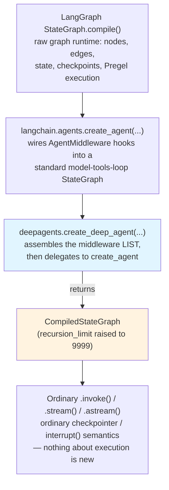
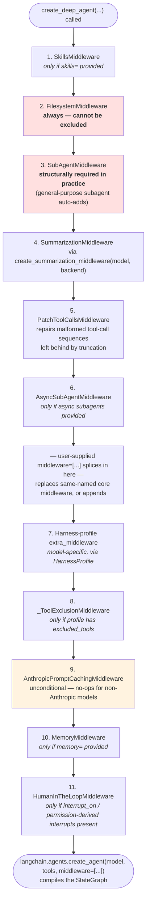

# Architecture & Internals

> "`create_deep_agent()` does not run anything. It builds a list of `AgentMiddleware` objects and hands them to `langchain.agents.create_agent()`, which compiles a LangGraph `StateGraph`. Everything you already know about `.invoke()`, `.stream()`, checkpointers, and `interrupt()` still applies unmodified." — the one sentence this chapter exists to justify.

## Learning Objectives

By the end of this chapter, you will be able to:

- State precisely what `create_deep_agent()` returns and what it does internally, without resorting to "it's an autonomous agent framework" hand-waving
- Explain the `AgentMiddleware` lifecycle hooks (`before_agent`, `wrap_model_call`/`awrap_model_call`, `modify_request`) and how a middleware stack composes around the model-call loop, including where the analogy to ASGI/FastAPI middleware holds and where it breaks down
- Reproduce, from memory, the exact 11-step middleware assembly order `create_deep_agent()` builds, and justify *why* each middleware sits where it does relative to the others
- Distinguish structurally-required middleware (`FilesystemMiddleware`, `SubAgentMiddleware`) from configuration-gated middleware (`SkillsMiddleware`, `MemoryMiddleware`, `HumanInTheLoopMiddleware`, `AsyncSubAgentMiddleware`) and predict which ones a given `create_deep_agent()` call will instantiate
- Explain why the returned graph's `recursion_limit` is raised from LangGraph's default of 25 to 9999, with a concrete example of a task shape that would blow past 25
- Use `HarnessProfile` / `register_harness_profile` to exclude tools or middleware for a specific model, and explain what `_ToolExclusionMiddleware` does with that configuration
- Place `create_react_agent`, `langchain.agents.create_agent`, and `deepagents.create_deep_agent` on a single ladder of "what each layer adds over the one below it"
- Trace a real `create_deep_agent(...)` call, argument by argument, to the exact ordered list of middleware instances it produces

---

## Prerequisites for This Chapter

Before this chapter, you should have read **[Chapter 1: Introduction & Prerequisites](./01-introduction-and-prerequisites.md)**, where you covered:

- Why DeepAgents exists — the three problems (context growth, flat tool-calling loops, no memory convention) it packages a standard answer to
- The package landscape: `deepagents` (the SDK, this course's subject), `deepagents-cli` (deployment tooling), `deepagents-code`/`dcode` (a terminal coding agent built *on top of* the SDK — its `AGENTS.md`/memories conventions are CLI features, not SDK API)
- Installation (`pip install deepagents`) and the runtime dependency floor (`langchain>=1.3.14,<2.0.0`, `langchain-core>=1.5.0,<2.0.0`)

You should also already be comfortable, from your existing background, with:

- **LangGraph's `StateGraph`, `CompiledStateGraph`, checkpointers, and `interrupt()`/`Command(resume=...)`** — this chapter leans on all of these as known primitives and maps DeepAgents concepts back onto them constantly
- **LangChain Core `Runnable`s, tools, and `bind_tools`** — the model-call loop this chapter dissects is built from these
- The general shape of **ASGI/WSGI or FastAPI middleware chains** — used purely as an intuition pump in Section 2, not as a technical dependency

No new installation is required. Every code snippet in this chapter is written to the exact `deepagents` API surface documented in the ground-truth fact sheet this course was built from — if you run it against a different SDK version and see a discrepancy, the source (`libs/deepagents/deepagents/graph.py` on GitHub) is the tiebreaker, not this text.

---

## 1. The Core Insight: A Middleware-Stack Builder, Not a New Runtime

Read the `create_deep_agent()` signature once, ignoring what each parameter *means* for a moment, and just look at its return type:

```python
def create_deep_agent(
    model: str | BaseChatModel | None = None,
    tools: Sequence[BaseTool | Callable | dict[str, Any]] | None = None,
    *,
    system_prompt: str | SystemMessage | None = None,
    middleware: Sequence[AgentMiddleware[StateT_co, ContextT]] = (),
    subagents: Sequence[SubAgent | CompiledSubAgent | AsyncSubAgent] | None = None,
    skills: list[str] | None = None,
    memory: list[str] | None = None,
    permissions: list[FilesystemPermission] | None = None,
    backend: BackendProtocol | None = None,
    interrupt_on: dict[str, bool | InterruptOnConfig] | None = None,
    response_format: ResponseFormat[ResponseT] | type[ResponseT] | dict[str, Any] | None = None,
    state_schema: type[DeepAgentState] | None = None,
    context_schema: type[ContextT] | None = None,
    checkpointer: Checkpointer | None = None,
    store: BaseStore | None = None,
    debug: bool = False,
    name: str | None = None,
    cache: BaseCache | None = None,
) -> CompiledStateGraph[...]
```

It returns a `CompiledStateGraph`. Not a `DeepAgent` object, not a custom runtime, not a wrapper class with its own `.run()` method — the exact same type you get back from `StateGraph(...).compile()` anywhere else in LangGraph. That return type is the whole architectural thesis of this chapter, stated in code rather than prose.

Here is what actually happens inside the function body, at the level of detail that matters:

1. It looks at every keyword argument you passed (`skills`, `subagents`, `memory`, `interrupt_on`, `permissions`, `middleware`, ...) and, for each one that implies a capability, constructs the corresponding `AgentMiddleware` instance — `SkillsMiddleware` if you passed `skills`, `MemoryMiddleware` if you passed `memory`, and so on.
2. It assembles all of those middleware instances, plus a handful that are *always* present regardless of what you passed, into a single ordered list — the subject of Section 3.
3. It calls `langchain.agents.create_agent(model=model, tools=tools, middleware=assembled_middleware, ...)`.
4. `create_agent` — itself just a minimal harness — builds a `StateGraph` whose nodes implement a standard model-call loop (call the model, execute any tool calls, repeat until the model stops calling tools) and wires each middleware's hooks into that loop at the appropriate points, then compiles it.
5. `create_deep_agent` takes the resulting `CompiledStateGraph` and calls `.with_config({"recursion_limit": 9999, ...})` on it before handing it back to you (Section 5).

Nowhere in that sequence does a new execution model appear. The graph that runs your deep agent is compiled by the exact same LangGraph machinery that compiles any `StateGraph` you'd build by hand — same Pregel-style super-step execution, same checkpointer contract, same `interrupt()` semantics, same streaming API. **What changes is not how the graph executes — it's which middleware are wired into the model-call loop before it's compiled.**

This reframing has an immediate, practical payoff: every debugging technique you already have for a LangGraph `StateGraph` — inspecting checkpointed state, tracing which node produced which update, setting `debug=True`, walking the graph's node/edge structure — applies to a deep agent exactly as it applies to any other graph. There is no separate "deep agent debugger" to learn, because there is no separate "deep agent runtime" underneath it.



If you take away nothing else from this chapter: **`create_deep_agent()` is a factory for an `AgentMiddleware` list.** Everything else — filesystem tools, subagent delegation, memory injection, human approval gates — is a consequence of *which* middleware ends up in that list and *where*. The rest of this chapter is about that list: what's in it, in what order, and why.

---

## 2. `AgentMiddleware`, Precisely

`AgentMiddleware` (from `langchain.agents.middleware.types`) is the extension point every deep-agent capability is built from. Before looking at DeepAgents' own middleware, it's worth being precise about what a middleware *is*, because "middleware" is a word you already have a strong — and only partially correct — intuition for from web frameworks.

### 2.1 The lifecycle hooks

An `AgentMiddleware` subclass can implement any of these hooks (a middleware can implement none, one, or all of them):

- **`before_agent`** — runs once, before the model-call loop starts for this invocation. This is where a middleware inspects or seeds initial state — for example, `MemoryMiddleware` downloading memory files from the backend before the model ever sees a prompt.
- **`wrap_model_call` / `awrap_model_call`** — wraps *each individual model call* inside the loop, sync and async variants. A middleware implementing this hook can inspect and modify the request going into the model, and inspect and modify (or short-circuit) the response coming back, on every turn of the loop — not just once per invocation.
- **`modify_request`** — a narrower hook for middleware that only needs to alter the outgoing request (e.g., injecting a system-prompt fragment, trimming messages) without needing full control over the call and response.

A middleware stack composes these hooks the way you'd expect from the name: each middleware gets a chance to act before handing control to the next one in the stack, and again on the way back out — an onion, not a flat list of callbacks.

### 2.2 The ASGI/FastAPI analogy — and where it breaks

If you've written FastAPI middleware, the shape is genuinely familiar:

```python
# FastAPI middleware — request/response, once per HTTP call
@app.middleware("http")
async def add_process_time_header(request: Request, call_next):
    start = time.time()
    response = await call_next(request)          # delegate down the stack
    response.headers["X-Process-Time"] = str(time.time() - start)
    return response
```

```python
# AgentMiddleware — conceptually parallel shape
from langchain.agents.middleware.types import AgentMiddleware

class TimingMiddleware(AgentMiddleware):
    async def awrap_model_call(self, request, handler):
        start = time.time()
        response = await handler(request)          # delegate down the stack
        # ... record response.duration_ms, log, etc.
        return response
```

`handler(request)` plays the same role as `call_next(request)` — it's how a middleware delegates to the next layer (eventually, the actual model call) and gets a result back to inspect or transform. That's a legitimate, useful intuition to import.

Here's where the analogy stops holding, and holding onto it too tightly will actively mislead you:

| | ASGI/FastAPI middleware | `AgentMiddleware` |
|---|---|---|
| Runs | **Once** per HTTP request/response | `wrap_model_call` runs **once per model call inside a loop** — a single agent invocation may trigger it a dozen times as the model calls tools and gets called again |
| What it wraps | A stateless request → response function | A **stateful, tool-call-loop-aware** interaction — the middleware can see and influence conversation state, tool results, and prior turns, not just "this one request" |
| Side channel | Response headers, status codes | Full read/write access to graph **state** (messages, todos, files, custom state keys) via `before_agent` and the request/response objects |
| Can it pause execution? | No native concept | Yes — via `HumanInTheLoopMiddleware`, a middleware can trigger an `interrupt()` that suspends the entire graph mid-loop, awaiting a human decision, then resume later from a checkpoint |
| Composition granularity | Per HTTP call | Per model call **and** middleware can react differently on turn 1 vs. turn 12 of the same invocation (e.g., summarization firing only once a token threshold is crossed) |

The practical upshot: think of an `AgentMiddleware` stack as ASGI middleware that wraps *every iteration* of an inner loop, with full access to a rich, evolving state object, and the ability to suspend the whole computation — not a single request/response pair. That's a strictly more powerful, and more stateful, composition model than the HTTP analogy suggests, and it's exactly why DeepAgents can build filesystem eviction, subagent delegation, and HITL approval entirely as middleware rather than needing custom graph nodes.

---

## 3. The Exact Middleware Assembly Order

This is the section to memorize. `create_deep_agent()`'s own docstring specifies the assembly order precisely, and the order is not incidental — each position is chosen so that middleware earlier in the stack see the *effects* of middleware later in the stack correctly, or vice versa. Here is the full sequence:



*(Red = structurally required and protected from exclusion. Orange = unconditional but a no-op for unrelated providers. Everything else is present only when its triggering parameter is supplied.)*

Walking through **why** each position is where it is:

**1. `SkillsMiddleware` goes first.** Skills are `SKILL.md`-based progressive-disclosure documents that shape what the agent knows about *how to approach tasks* before it does anything else — conceptually, they're closest to system-prompt-adjacent context, so they're loaded before any tool or delegation machinery is wired in.

**2. `FilesystemMiddleware` comes early and is always present.** Nearly everything downstream depends on a filesystem existing: subagents need a backend to share files with the parent through, memory needs a backend to read/write memory files from, and summarization needs somewhere to evict large tool outputs to. Filesystem access has to be established before any of those consumers are constructed.

**3. `SubAgentMiddleware` immediately follows.** Subagent delegation (the `task` tool) is layered directly on top of the filesystem, since each subagent gets its own `FilesystemMiddleware` sharing the same backend as the parent (Chapter 8 covers this in full) — it needs the filesystem concept to already exist conceptually before it can be wired up.

**4. `SummarizationMiddleware` comes *after* filesystem and subagents, not before.** This ordering answers a question worth asking explicitly: why would you compact/summarize conversation history *after* the middleware that generate a lot of the content being summarized (large tool outputs, subagent results) rather than before? Because summarization needs to operate on the *actual* message stream those middleware produce — including any content the `FilesystemMiddleware`'s own eviction already offloaded to disk. Summarization is a late-stage compaction pass over what the earlier middleware already shaped, not an independent, unrelated concern competing with them.

**5. `PatchToolCallsMiddleware` immediately follows summarization.** This is a deepagents-internal repair middleware: once summarization has truncated or rewritten message history, it's possible to end up with a dangling tool call whose matching tool result got summarized away, or vice versa — a state the model-call loop would choke on. `PatchToolCallsMiddleware` exists specifically to repair those sequences *right after* the middleware that could have caused the damage, before anything else runs.

**6. `AsyncSubAgentMiddleware` closes out the "core" block**, present only if you passed `AsyncSubAgent` entries — it routes to remote/LangSmith-deployed subagent graphs via a separate mechanism from the synchronous `task` tool, and is kept adjacent to the synchronous `SubAgentMiddleware` above it.

**— the splice point —** Your own `middleware=[...]` argument is inserted here: any middleware you supply with the same name as a core middleware *replaces* it in place; anything else is appended at this position. This is deliberate — it's late enough that your custom middleware can assume filesystem, subagents, summarization, and tool-call patching already exist, but early enough that it still runs *before* provider-specific and configuration-gated middleware get a chance to see the request.

**7–8. Harness-profile middleware and `_ToolExclusionMiddleware`** come next, because they're model-specific adjustments that should apply *after* your own general-purpose customization, not compete with it — a harness profile is meant to correct for a specific model's quirks (missing tool-calling support for a tool type, token-window peculiarities), which only makes sense to apply once the "real" middleware stack is otherwise settled.

**9. `AnthropicPromptCachingMiddleware` is unconditional** — it's always in the list (as are the Bedrock/Fireworks variants, when those integration packages are installed), but it no-ops for non-matching providers. It sits late because prompt caching wants to see the *final* shape of the system prompt and message structure — inserted by every middleware before it (skills content, memory-derived instructions haven't been added yet at this point, notably — see next item) — before deciding what to mark cacheable.

**10. `MemoryMiddleware` comes after prompt caching, not before.** This is worth sitting with: memory content (the `<agent_memory>`/`<memory_guidelines>` blocks injected into the system prompt) is added *after* the caching middleware has already run. In practice this means memory-injected content is among the least stable, most-recently-appended part of the prompt — consistent with memory being per-thread/session-relevant context rather than the kind of large, stable system-prompt boilerplate you'd want cached across many calls.

**11. `HumanInTheLoopMiddleware` is last.** HITL needs to see the *fully-formed* tool-call request — after filesystem, subagents, summarization, tool-call patching, harness-profile adjustments, caching, and memory injection have all had their say — because it's deciding whether to interrupt execution based on the actual tool call the model is about to make, not an intermediate, not-yet-finalized version of it.

---

## 4. Structurally Required vs. Optional Middleware

Not everything in the stack is negotiable. The fact sheet is explicit that two middleware are protected:

- **`FilesystemMiddleware`** — always present. Attempting to exclude it (for example, via a `HarnessProfile(excluded_middleware=...)` that names it) raises a `ValueError`. It's treated as structurally load-bearing: too much of the rest of the stack (subagents, memory, summarization eviction) assumes a filesystem exists for `create_deep_agent()` to allow it to be silently removed.
- **`SubAgentMiddleware`** — structurally required in practice, because the default `general-purpose` subagent is auto-added unless a `HarnessProfile` explicitly disables it, and the middleware itself is protected the same way `FilesystemMiddleware` is.

```python
from deepagents import HarnessProfile, register_harness_profile

# This is the kind of configuration that raises ValueError at construction time —
# FilesystemMiddleware is structurally required and cannot be excluded this way.
broken_profile = HarnessProfile(
    excluded_middleware=["FilesystemMiddleware"],
)
register_harness_profile("some-model-spec", broken_profile)

agent = create_deep_agent(model="some-model-spec", tools=[])
# -> raises ValueError: FilesystemMiddleware cannot be excluded
```

Contrast that with everything else in the stack, which is **purely configuration-gated** — present only if you supply the parameter that implies it:

| Middleware | Present when... |
|---|---|
| `SkillsMiddleware` | `skills=[...]` is passed |
| `FilesystemMiddleware` | always (cannot be excluded) |
| `SubAgentMiddleware` | always in practice (cannot be excluded; general-purpose auto-adds) |
| `SummarizationMiddleware` | always (deepagents wires this via its own `create_summarization_middleware` helper) |
| `PatchToolCallsMiddleware` | always (deepagents-internal, unconditional) |
| `AsyncSubAgentMiddleware` | `subagents=[...]` includes at least one `AsyncSubAgent` |
| harness-profile `extra_middleware` | a `HarnessProfile` is registered for the resolved model spec and declares extra middleware |
| `_ToolExclusionMiddleware` | the resolved harness profile has non-empty `excluded_tools` |
| `AnthropicPromptCachingMiddleware` (+ provider variants) | always present in the list; behaviorally a no-op unless the model matches |
| `MemoryMiddleware` | `memory=[...]` is passed |
| `HumanInTheLoopMiddleware` | `interrupt_on=...` is passed, or `permissions=[...]` includes an entry with `mode="interrupt"` |

The practical mental model: **"always in the assembled list" is not the same as "always doing something."** `AnthropicPromptCachingMiddleware`, for instance, is unconditionally in the stack for every deep agent regardless of provider — it simply has nothing to do when the model isn't Anthropic's. Compare that to `MemoryMiddleware` or `HumanInTheLoopMiddleware`, which aren't instantiated *at all* unless you pass the parameter that implies them — there's no middleware object sitting there doing nothing; it's simply absent from the list.

---

## 5. The Returned Object: `CompiledStateGraph` with `recursion_limit=9999`

`create_deep_agent()` returns a `CompiledStateGraph` — the exact type `StateGraph(...).compile()` produces anywhere in LangGraph — configured via `.with_config({"recursion_limit": 9999, ...})`. Two things worth being precise about.

### 5.1 Why raise the recursion limit at all?

LangGraph's default `recursion_limit` is 25 — a sane ceiling for graphs where 25 super-steps is already unusual. A deep agent's model-call loop, by contrast, treats **each individual tool call as its own super-step**: the model calls `write_todos`, that's one step; it calls `read_file`, another step; it delegates to a subagent via `task`, another step (whose *own* internal steps don't count against the parent's limit, since the subagent is a separate compiled graph invocation); it edits three files, three more steps; and so on. A genuinely multi-stage task — "research this topic across five files, write a report, revise it twice based on a critique subagent's feedback" — can easily accumulate 40–80 tool-call turns before the model decides it's done. Twenty-five would throttle nearly every non-trivial deep-agent task before it finishes, forcing you to either raise the limit yourself on every single agent you build, or watch agents die mid-task with a `GraphRecursionError`. Raising it to 9999 by default reflects a considered judgment: for this class of agent, the *default* ceiling should be "essentially unbounded in practice" rather than "the same conservative default that suits a small, fixed-shape workflow graph."

### 5.2 Concrete example of exceeding the old default

```python
# A single subagent-delegating research task, tool-call by tool-call:
# 1.  write_todos          (plan the task)
# 2.  ls("/research")
# 3.  read_file("brief.md")
# 4.  task(description="...", subagent_type="general-purpose")   # one parent-graph step
# 5.  write_file("draft.md", ...)
# 6.  write_todos          (mark step complete, add follow-ups)
# 7.  grep("TODO", path="/research")
# 8.  read_file("source_1.md")
# 9.  read_file("source_2.md")
# 10. edit_file("draft.md", ...)
# 11. task(description="critique this draft", subagent_type="general-purpose")
# 12. edit_file("draft.md", ...)          # apply critique
# 13. edit_file("draft.md", ...)          # a second revision pass
# 14. write_todos          (final status update)
# ... a moderately involved task is already at 14+ steps before the model
#     even considers the task done, and a genuinely deep research task with a few
#     revision cycles and several subagent delegations will comfortably clear 25.
```

Fourteen steps into a modest example and still not done — it's easy to see how a real multi-file research-and-revise task, or anything involving retries after a tool error, clears LangGraph's default 25-step ceiling well before the agent naturally terminates. `recursion_limit=9999` isn't a "let it run forever" escape hatch; it's an acknowledgment that a deep agent's *natural* stopping point (the model deciding it's done, or explicit turn/token budgets you configure separately) is the real backstop, not an arbitrary step count tuned for a different class of graph.

You can still override it, exactly as with any other `CompiledStateGraph`:

```python
agent = create_deep_agent(model=model, tools=tools)
agent = agent.with_config({"recursion_limit": 500})   # tighten it for a bounded-cost use case
```

### 5.3 Introspecting the compiled graph

Because the return value is an ordinary `CompiledStateGraph`, every LangGraph introspection technique you already rely on works unmodified — there is no separate "deep agent inspector" API to learn:

```python
agent = create_deep_agent(model=model, tools=tools, debug=True)

# Same graph-introspection surface as any other compiled LangGraph graph:
agent.get_graph().print_ascii()          # visualize node/edge structure
for step in agent.stream({"messages": [...]}, stream_mode="values"):
    ...                                    # ordinary streaming, one state snapshot per super-step
```

`debug=True` is passed straight through to the underlying `create_agent`/`StateGraph` compilation, exactly like the `debug` flag on any `StateGraph.compile(...)` call — it enables the same verbose per-step execution logging you'd get from a hand-built graph, which is worth reaching for the first time you're trying to confirm which middleware actually fired for a given tool call, rather than guessing from Section 3's list alone.

---

## 6. `HarnessProfile` and Model-Specific Customization

Different models have different tool-calling quirks, context windows, and provider-specific optimizations available. Rather than forcing every `create_deep_agent()` call site to hand-roll workarounds, DeepAgents exposes a registration mechanism: `HarnessProfile` plus `register_harness_profile`.

```python
from deepagents import HarnessProfile, register_harness_profile

# Example shape: a profile that disables the auto-added general-purpose subagent
# and excludes a tool this particular model spec doesn't handle well.
lean_profile = HarnessProfile(
    excluded_tools=["execute"],   # this model/environment shouldn't get sandbox execution
)

register_harness_profile("some-vendor:some-model-id", lean_profile)

agent = create_deep_agent(
    model="some-vendor:some-model-id",
    tools=[...],
)
# Every agent built against this resolved model spec now has `execute` excluded
# via `_ToolExclusionMiddleware`, and gets any `extra_middleware` the profile declares —
# without every call site needing to repeat that configuration.
```

Two things this buys you architecturally:

- **Centralized, model-keyed configuration.** Instead of every team building a deep agent against a given model needing to remember "oh, that model doesn't support the `execute` tool well, exclude it," the exclusion lives once, registered against the model spec, and applies automatically to every `create_deep_agent()` call that resolves to that model.
- **`_ToolExclusionMiddleware` as the enforcement mechanism.** When a resolved harness profile declares `excluded_tools`, `create_deep_agent()` inserts `_ToolExclusionMiddleware` into the stack (position 8 in Section 3's ordering) specifically to strip those tools from what the model is offered — it's a dedicated middleware, not an ad-hoc filter bolted onto tool assembly, which keeps the exclusion visible and debuggable in the same stack you already inspect for everything else.

The related `ProviderProfile` / `register_provider_profile` pair works one level up — provider-level rather than specific-model-level tuning (the kind of thing the built-in Anthropic/Bedrock/Fireworks prompt-caching variants are examples of). Treat both registration mechanisms as the sanctioned way to bake in model- or provider-specific corrections *once*, rather than repeating `if model_name == "...": ...` branches at every `create_deep_agent()` call site in your codebase.

---

## 7. Comparison: `create_react_agent` vs. `create_agent` vs. `create_deep_agent`

You've already used LangGraph's prebuilt agent constructors before this course; here's exactly where each one sits relative to DeepAgents, and what each layer adds over the one beneath it.

| Layer | What it is | What it adds over the layer below |
|---|---|---|
| **LangGraph `StateGraph`** | The raw graph runtime | Nodes, edges, shared state, checkpoints, streaming, `interrupt()` — no agent-specific semantics of any kind |
| **`create_react_agent`** *(deprecated)* | A legacy prebuilt ReAct-style loop | One fixed model → tools → model graph shape, built before the `AgentMiddleware` hook system existed; no composable extension point — customization meant forking the implementation |
| **`langchain.agents.create_agent`** | A minimal, standard agent harness | The `AgentMiddleware` hook system itself (`before_agent`, `wrap_model_call`, `modify_request`), a structured tool-calling loop, and `TodoListMiddleware` wired in by default — but no filesystem, no subagent delegation, no memory convention, no HITL wiring: you assemble any of that yourself, middleware by middleware |
| **`deepagents.create_deep_agent`** | An opinionated harness on top of `create_agent` | Pre-assembles the middleware stack this chapter just walked through: filesystem-backed context offloading, subagent delegation with context isolation, automatic summarization, tool-call-sequence repair, prompt caching, optional memory and HITL — "batteries included" for the specific shape of problem a long-running, tool-heavy agent runs into |

The important nuance from Section 1 generalizes here too: this is a strict layering, not a set of alternatives that duplicate each other's work. `create_deep_agent()` doesn't reimplement the model-call loop `create_agent` already provides — it calls `create_agent` internally, passing it a richer middleware list. If you ever find yourself needing something DeepAgents' opinionated stack doesn't give you a knob for, dropping down to `langchain.agents.create_agent` directly and hand-assembling only the middleware you need is a legitimate, supported move — not an escape hatch out of a black box, since you already understand every piece deepagents itself would have assembled for you.

### 7.1 What "one call" actually saves you

To make the layering concrete rather than abstract, contrast the one-line call you actually write against roughly what it saves you from assembling by hand if you started from `create_agent` directly:

```python
# What you write:
from deepagents import create_deep_agent

agent = create_deep_agent(
    model=model,
    tools=[web_search_tool],
    subagents=[research_subagent],
    memory=["/memories/agent.md"],
)
```

```python
# Roughly what create_deep_agent() is doing on your behalf — illustrative only,
# not something you'd normally write yourself, and simplified relative to the
# real internal helpers (create_summarization_middleware, PatchToolCallsMiddleware, etc.):
from langchain.agents import create_agent
from deepagents.middleware.filesystem import FilesystemMiddleware
from deepagents.middleware.subagents import SubAgentMiddleware
from deepagents.middleware.memory import MemoryMiddleware
# ... plus the summarization helper, tool-call-patching middleware, and the
#     unconditional prompt-caching middleware, each with its own construction details ...

middleware_stack = [
    FilesystemMiddleware(backend=resolved_backend),
    SubAgentMiddleware(subagents=[research_subagent], backend=resolved_backend),
    # SummarizationMiddleware(...) via create_summarization_middleware(model, backend),
    # PatchToolCallsMiddleware(),
    # AnthropicPromptCachingMiddleware(),  # unconditional, in every stack
    MemoryMiddleware(paths=["/memories/agent.md"], backend=resolved_backend),
]

agent = create_agent(model=model, tools=[web_search_tool], middleware=middleware_stack)
agent = agent.with_config({"recursion_limit": 9999})
```

Neither snippet does anything the other one doesn't — that's precisely the point. `create_deep_agent()` isn't hiding capability behind a black box; it's hiding *bookkeeping*: resolving a shared backend across every middleware that needs one, getting the assembly order right (Section 3), remembering the recursion-limit override, and wiring in the unconditional middleware you'd otherwise forget exists at all. The moment you need behavior outside what `create_deep_agent()`'s parameters expose, this is exactly the escape hatch — you already know every ingredient in the list, so extending it is additive, not archaeological.

---

## 8. Worked Example: Tracing a Real Call Through the Stack

Consider a concrete `create_deep_agent()` call — the kind of thing you'd actually write for a research-and-report agent with one specialist subagent, cross-session memory, and an approval gate on writes:

```python
from deepagents import create_deep_agent, SubAgent

research_subagent: SubAgent = {
    "name": "researcher",
    "description": "Runs focused research over the provided sources and returns a synthesis.",
    "system_prompt": (
        "You are a research specialist. Read the relevant files, cross-check claims, "
        "and return a concise, sourced synthesis. Do not write files yourself."
    ),
    # `tools` omitted -> inherits the parent's tools
}

agent = create_deep_agent(
    model=model,                       # a BaseChatModel instance, e.g. an Anthropic chat model
    tools=[web_search_tool, fetch_url_tool],
    system_prompt="You are a lead research analyst. Plan, delegate, write, and revise a report.",
    subagents=[research_subagent],
    memory=["/memories/lead_analyst.md"],
    interrupt_on={
        "write_file": {"allowed_decisions": ["approve", "edit", "reject"]},
        "execute": True,
    },
)
```

Trace this call, argument by argument, against the assembly order from Section 3:

1. **`skills` not passed** → no `SkillsMiddleware` instantiated. Skip position 1 entirely.
2. **`FilesystemMiddleware`** → always present. Position 2, regardless of anything passed.
3. **`SubAgentMiddleware`** → always present. It's populated with two subagents: the explicit `researcher` `SubAgent`, plus the auto-added `general-purpose` subagent (since nothing disabled it via a harness profile). The `task` tool the model sees now offers both `subagent_type` choices.
4. **`SummarizationMiddleware`** → always present, built via `create_summarization_middleware(model, backend)`, using whatever default trigger/keep fractions apply for the resolved model (or a model-specific preset, if one is registered).
5. **`PatchToolCallsMiddleware`** → always present, position 5, unconditional.
6. **`AsyncSubAgentMiddleware`** → **not** instantiated — `subagents` contains only a plain `SubAgent` TypedDict, no `AsyncSubAgent` entries. Skip position 6.
7. **Splice point** → `middleware=()` (the default, not passed here) — nothing to splice in.
8. **Harness-profile `extra_middleware`** → depends on whether a `HarnessProfile` happens to be registered for this resolved model spec; assume none is here (the common case for a call with no explicit profile registration) — nothing added at position 7.
9. **`_ToolExclusionMiddleware`** → not added; no profile, so no `excluded_tools` to enforce. Position 8 skipped.
10. **`AnthropicPromptCachingMiddleware`** → always present at position 9; if `model` resolves to an Anthropic model, it's actively marking cache breakpoints; if not, it's a no-op that's still in the list.
11. **`MemoryMiddleware`** → **present**, because `memory=["/memories/lead_analyst.md"]` was passed. Position 10. It downloads that file via the resolved backend and injects `<agent_memory>`/`<memory_guidelines>` content into the system prompt; the model can subsequently call `edit_file` on that same path to update its own memory.
12. **`HumanInTheLoopMiddleware`** → **present**, because `interrupt_on` was passed. Position 11, last in the stack — `write_file` calls will pause for `approve`/`edit`/`reject` decisions, and every `execute` call interrupts unconditionally (`True` shorthand for "always interrupt, default decisions").

Final assembled middleware list, in order, for this exact call:

```
[FilesystemMiddleware,
 SubAgentMiddleware,
 SummarizationMiddleware,
 PatchToolCallsMiddleware,
 AnthropicPromptCachingMiddleware,
 MemoryMiddleware,
 HumanInTheLoopMiddleware]
```

That list — not "an autonomous research agent," but this specific, orderable, individually-inspectable sequence of seven middleware objects — is what `langchain.agents.create_agent()` receives and wires into the compiled graph. Every capability this agent exhibits (delegating research, remembering across sessions, pausing before risky writes) traces back to exactly one entry in that list.

---

## Real-World Scenario

A platform team ships a deep agent that automates dependency-upgrade PRs: it reads a repo's manifest files, researches breaking changes for outdated packages (via a `researcher` subagent), applies edits, and opens a PR. Early in development, they configure `interrupt_on={"execute": True}` for shell commands but leave file writes unguarded, reasoning that "editing files is safe, only *running* things is risky."

In staging, the agent's task runs long — several rounds of "read manifest, research, edit, re-check" — and hits `GraphRecursionError` at the default LangGraph limit before finishing a single upgrade, because the team had constructed the underlying graph via `langchain.agents.create_agent` directly during an early prototype (before switching to `create_deep_agent`) and never raised `recursion_limit` themselves. Switching to `create_deep_agent()` — which raises the limit to 9999 automatically — fixes the symptom immediately, but a teammate reviewing the change asks the more useful question: *why* did a single dependency upgrade need 30+ tool-call turns in the first place? Tracing the middleware stack (Section 3) surfaces the answer: the `researcher` subagent's own tool calls don't count against the parent's recursion budget (each `task` invocation is one step from the parent's perspective, however much work the subagent does internally) — so the 30+ steps were *all* parent-graph activity: repeated `read_file`/`edit_file` cycles across a dozen manifest files, each one a separate super-step. That insight — informed directly by understanding the assembly order and how subagent delegation is accounted for — leads the team to batch manifest edits per package rather than per file, cutting real turn count substantially, instead of just accepting "raise the limit and move on" as the fix.

Separately, a security review later flags the original asymmetry — `execute` gated, `write_file` not — as exactly backwards for this workload: the agent's actual blast radius is the code it edits and commits, not shell execution it barely uses. They add `write_file` to `interrupt_on` with `allowed_decisions: ["approve", "edit", "reject"]`, which — per Section 3 — inserts `HumanInTheLoopMiddleware` at position 11, after everything else has already shaped the request, exactly where an approval gate belongs: reviewing the *final* tool call the model is about to make, not an intermediate draft of it.

---

## Best Practices

- **Reach for `create_deep_agent()` by default for any tool-heavy, multi-turn agent**, and only drop to raw `langchain.agents.create_agent` when you specifically need to omit filesystem/subagent middleware entirely — which, given both are structurally protected in DeepAgents, is itself a signal you may not actually want DeepAgents for that use case.
- **Reason about behavior in terms of "which middleware is present," not "what the agent does."** When a deep agent behaves unexpectedly (a tool call gets interrupted, memory doesn't update, output gets truncated oddly), your first diagnostic step should be reconstructing the assembled middleware list for that exact `create_deep_agent()` call, using Section 3's order as your checklist.
- **Use `HarnessProfile`/`register_harness_profile` for anything model-specific you'd otherwise repeat at every call site** — tool exclusions, extra middleware for a model's quirks — rather than scattering `if model == "...":` branches through application code.
- **Don't fight the structurally-required middleware.** If you find yourself wanting to exclude `FilesystemMiddleware` or `SubAgentMiddleware`, that's a strong signal you want `langchain.agents.create_agent` directly, not a workaround around DeepAgents' protection.
- **Splice in custom middleware deliberately, respecting the ordering.** Because your `middleware=[...]` argument is inserted after the core block (filesystem, subagents, summarization, tool-call patching) but before harness-profile, caching, memory, and HITL middleware, write custom middleware assuming those earlier concerns are already handled, and assuming yours runs *before* provider-specific adjustments and HITL — plan accordingly if your middleware needs to see the truly final request.
- **Treat `recursion_limit=9999` as "effectively unbounded by default," not "no limit needed."** For cost- or latency-bounded production paths, override it explicitly (`agent.with_config({"recursion_limit": N})`) to a value that reflects your actual SLA, rather than relying on the model's own judgment to stop.
- **When debugging, remember subagent tool calls don't inflate the parent's recursion budget per internal step** — a `task()` call is one step to the parent, however many steps the subagent's own compiled graph takes internally. If you're chasing "which steps are actually costing me my recursion budget," count parent-graph tool calls, not subagent-internal ones.

---

## Common Mistakes

- **Describing DeepAgents as "a new agent runtime" instead of "a middleware-stack builder over `create_agent`."** This framing mistake cascades into real debugging mistakes — people go looking for a DeepAgents-specific execution model when the actual behavior is ordinary LangGraph execution with a particular middleware list wired in.
- **Assuming you can exclude `FilesystemMiddleware` or `SubAgentMiddleware` via a `HarnessProfile`.** Both raise `ValueError` — they're structurally protected, not merely "on by default."
- **Forgetting that `AnthropicPromptCachingMiddleware` (and its provider siblings) is always in the assembled list, even for non-matching providers.** It's a no-op there, but its presence is not conditional on provider the way `MemoryMiddleware` or `HumanInTheLoopMiddleware` are — don't assume "the middleware list will be shorter for a Bedrock model" without checking which entries are genuinely absent versus merely inert.
- **Assuming your custom `middleware=[...]` runs first or last, rather than at the specific splice point** between the core block and harness-profile/caching/memory/HITL middleware — this matters if your custom middleware needs to see (or precede) memory injection or HITL interruption.
- **Treating `recursion_limit=9999` as evidence that deep agents "run forever" or need no cost controls.** It only removes an *arbitrary* ceiling tuned for a different graph shape; you still need your own turn/token/cost budgets for production, typically via `interrupt_on`, timeouts on `execute`, or application-level turn counting.
- **Registering a `HarnessProfile` against the wrong model-spec string** and being confused when exclusions don't apply — the profile is keyed to the resolved model spec `create_deep_agent()` sees, so it must match exactly what you pass as `model=`.
- **Conflating harness-profile model-specific tuning with provider-level tuning (`ProviderProfile`)** — the former targets a specific model spec, the latter a provider family; using the wrong one means your customization either over- or under-applies.

---

## Summary

- `create_deep_agent()` is a **middleware-stack builder**: it assembles an ordered list of `AgentMiddleware` instances and hands it to `langchain.agents.create_agent()`, which compiles an ordinary LangGraph `StateGraph`. Nothing about execution, streaming, checkpointing, or interrupts is reinvented.
- `AgentMiddleware` hooks — `before_agent`, `wrap_model_call`/`awrap_model_call`, `modify_request` — compose around the model-call loop the way ASGI/FastAPI middleware compose around a request, except **per model call inside a loop**, with full state access and the ability to suspend execution via `interrupt()`.
- The assembly order is exact and load-bearing: `SkillsMiddleware` → `FilesystemMiddleware` → `SubAgentMiddleware` → `SummarizationMiddleware` → `PatchToolCallsMiddleware` → `AsyncSubAgentMiddleware` → *(your `middleware=[...]`)* → harness-profile `extra_middleware` → `_ToolExclusionMiddleware` → `AnthropicPromptCachingMiddleware` → `MemoryMiddleware` → `HumanInTheLoopMiddleware`.
- `FilesystemMiddleware` and `SubAgentMiddleware` are **structurally required** — attempting exclusion raises `ValueError`. Everything else is present only when its triggering configuration (`skills`, `memory`, `interrupt_on`/`permissions`, async subagents, a registered harness profile) is supplied.
- The returned `CompiledStateGraph` has `recursion_limit` raised to **9999** (from LangGraph's default 25), because deep-agent tasks routinely accumulate dozens of tool-call turns — planning, file operations, subagent delegation, and revision cycles each count as separate super-steps.
- `HarnessProfile`/`register_harness_profile` (and the provider-level `ProviderProfile`/`register_provider_profile`) let you bake model- or provider-specific middleware/tool adjustments in once, keyed to a model spec, rather than repeating them at every call site; `_ToolExclusionMiddleware` is the enforcement mechanism for a profile's `excluded_tools`.
- On the ladder of agent constructors: **`create_react_agent`** (deprecated, fixed shape, no middleware system) → **`create_agent`** (minimal harness, gives you the `AgentMiddleware` system and a default `TodoListMiddleware`, but no filesystem/subagents/memory/HITL) → **`create_deep_agent`** (pre-assembles all of the above as an opinionated stack).

---

## Knowledge Check

1. `create_deep_agent()` returns a `CompiledStateGraph`. Explain precisely why this fact alone tells you that streaming, checkpointing, and `interrupt()` behavior are unchanged from ordinary LangGraph — what would have to be true instead if that weren't the case?
2. Put these in the correct assembly order and identify which two cannot be excluded via a `HarnessProfile`: `HumanInTheLoopMiddleware`, `SubAgentMiddleware`, `SummarizationMiddleware`, `FilesystemMiddleware`, `MemoryMiddleware`.
3. A teammate says "`AnthropicPromptCachingMiddleware` only appears in the middleware list if you're using an Anthropic model." Correct this statement precisely, distinguishing "present in the list" from "does something."
4. You call `create_deep_agent(model=m, tools=[...], subagents=[my_subagent])` with no `skills`, `memory`, `interrupt_on`, or custom `middleware`, and no `HarnessProfile` registered for `m`. List the exact ordered middleware stack this produces.
5. Explain, using the assembly-order rationale from Section 3, why `SummarizationMiddleware` sits *after* `FilesystemMiddleware`/`SubAgentMiddleware` rather than before them, and why `HumanInTheLoopMiddleware` sits last of all.
6. A task involves five rounds of "delegate to a research subagent, then edit a report file based on its findings." Explain why the subagent's own internal tool calls don't consume the parent graph's recursion budget the same way the parent's own `edit_file` calls do, and what that implies about where recursion-limit pressure actually comes from in a subagent-heavy design.

---

## Hands-On Exercise

Using only the ground truth from this chapter (no external API calls needed — this is a design/tracing exercise):

1. **Trace a full call.** Write out (as a comment block, not runnable code) a `create_deep_agent(...)` call that passes `skills=["research-skill"]`, two `SubAgent`s, one `AsyncSubAgent`, `memory=["/memories/agent.md"]`, and `interrupt_on={"delete": True}`, with no custom `middleware=[...]` and no registered `HarnessProfile`. Produce the exact ordered middleware list this call assembles, referencing Section 3's positions by number.
2. **Diagnose a `ValueError`.** A colleague's code registers `HarnessProfile(excluded_middleware=["SubAgentMiddleware"])` against a model spec, then calls `create_deep_agent(model=that_spec, tools=[])` and hits a `ValueError` at construction time. Explain, in a short paragraph, exactly why this fails and what the colleague should do instead if their real goal is "don't let this agent delegate to subagents" (hint: reconsider whether excluding the middleware is really the right lever, versus simply not passing `subagents=` and disabling the auto-added general-purpose subagent via the profile's other configuration surface).
3. **Justify an ordering decision.** Write two or three sentences defending why `MemoryMiddleware` sits *after* `AnthropicPromptCachingMiddleware` in the stack rather than before it, connecting your answer to what each middleware actually does to the system prompt.
4. **Recursion-limit sizing.** For a deep agent that does, on average, 3 subagent delegations and 15 direct file operations per task, with occasional retries after tool errors adding roughly 20% more direct steps, estimate a reasonable custom `recursion_limit` you'd set via `.with_config(...)` for a cost-bounded production deployment, and explain your reasoning — including why subagent delegations barely factor into your estimate.

---

## Further Reading

- [DeepAgents Overview — LangChain Docs](https://docs.langchain.com/oss/python/deepagents/overview) — official conceptual overview of the SDK this chapter dissects
- [`langchain-ai/deepagents` on GitHub](https://github.com/langchain-ai/deepagents) — read `libs/deepagents/deepagents/graph.py` directly; it is the ground truth for the exact assembly order and every signature in this chapter
- Related chapter in this course: **[Chapter 3: Your First Deep Agent](./03-your-first-deep-agent.md)** — the full `create_deep_agent()` parameter walkthrough this chapter deliberately deferred
- Related chapter in this course: **[Chapter 4: Planning System & Todos](./04-planning-system-and-todos.md)** — why `TodoListMiddleware` isn't in DeepAgents' own assembly list at all
- Related chapter in this course: **[Chapter 8: Subagent Orchestration](./08-subagent-orchestration.md)** — the full mechanics of `SubAgentMiddleware`/`AsyncSubAgentMiddleware` only previewed here
- Related chapter in this course: **[Chapter 13: Custom Tools & Middleware](./13-custom-tools-and-middleware.md)** — writing your own `AgentMiddleware` and harness profiles in depth
- Companion course in this repo: [LangGraph Mastery](../langgraph-course/00-index.md) — the `StateGraph`/`CompiledStateGraph`/checkpointer primitives this chapter assumes throughout

<div style="display:flex;justify-content:space-between;align-items:center;">
  <a href="./01-introduction-and-prerequisites.md">← Previous: Introduction & Prerequisites</a>
  <a href="./00-index.md">🏠 Index</a>
  <a href="./03-your-first-deep-agent.md">Next: Your First Deep Agent →</a>
</div>
