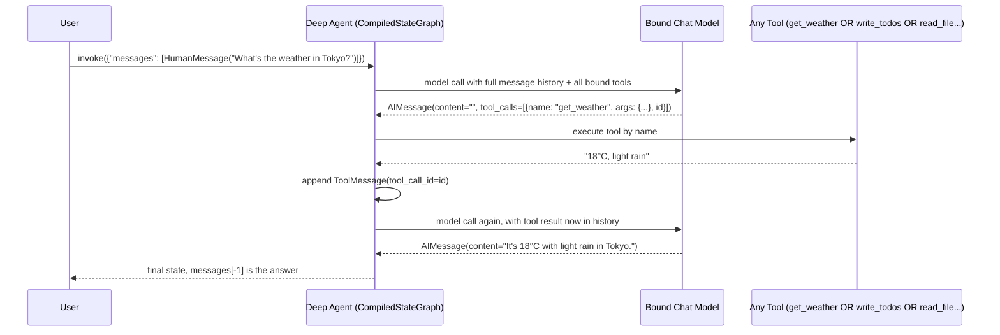

# Your First Deep Agent

## Learning Objectives

By the end of this chapter, you will be able to:

- Call `create_deep_agent()` correctly for a real, runnable agent, using explicit `model`, `tools`, and
  `system_prompt` arguments — and explain why leaving `model` unset is a deprecated trap, not a convenience
- Configure `create_deep_agent()` with both an Anthropic model string and a Bedrock `ChatBedrockConverse`
  instance, since you'll likely run one of these in production
- Write `@tool`-decorated functions whose docstrings double as the model-facing tool description, and wire
  three of them (weather, calculator, search) into a working "Simple AI Assistant"
- Trace the full request lifecycle — user message, model call, tool-call request, tool execution, tool result,
  second model call, final response — as one concrete loop, and explain why built-in tools like `write_todos` or
  `read_file` are structurally identical to your own tools in that loop
- Invoke a compiled deep agent synchronously (`.invoke`), with streaming (`.stream`, both `stream_mode="values"`
  and `stream_mode="messages"`), and asynchronously (`.ainvoke`/`.astream`)
- Inspect a compiled deep agent's registered tools to verify which built-ins are present, for debugging
- Reason correctly about what `system_prompt` actually contributes to the final prompt the model sees — a
  fragment, not the whole thing

---

## Prerequisites for This Chapter

This chapter assumes you've read **Chapter 1 (Introduction & Prerequisites)** and **Chapter 2 (Architecture &
Internals)**. Specifically, you should already know:

- Why DeepAgents exists at all: it's an opinionated `AgentMiddleware` stack — filesystem context offloading,
  subagent delegation, visible planning, persistent memory — built on top of `langchain.agents.create_agent`,
  itself a thin harness over a LangGraph `StateGraph` (Ch. 1–2)
- That `create_deep_agent()` returns a compiled `CompiledStateGraph`, and that invocation is 100% standard
  LangGraph API — nothing bespoke about `.invoke`/`.stream` themselves (Ch. 2)
- The rough middleware assembly order (Filesystem, SubAgent, Summarization, PatchToolCalls, optionally
  Skills/Memory/HITL) — you don't need the full ordering memorized for this chapter; Chapter 2 already covered
  it and later chapters (4–9) revisit each middleware in depth

This chapter does not re-explain LangGraph's `StateGraph`, checkpointers, or the Pregel execution model, nor
LangChain Core's `@tool`/`bind_tools` mechanics, nor MCP — all assumed background per the course prerequisites.

---

## 1. Installation Recap

Chapter 1 covered installation in full; the one-line version: `pip install deepagents` pulls in the SDK against
`langchain>=1.3.14,<2.0.0` and `langchain-core>=1.5.0,<2.0.0`. If you're running models through Bedrock, add the
`[aws]` extra — `pip install "deepagents[aws]"` — which pulls in `langchain-aws` for `ChatBedrockConverse`. If any
of that install step is unfamiliar or failed, go back to [Chapter 1](./01-introduction-and-prerequisites.md)
before continuing — everything below assumes a working `deepagents` import.

With that out of the way, let's build something.

---

## 2. `create_deep_agent()`, Argument by Argument (First-Agent Subset)

The full signature has fifteen-plus parameters — checkpointer, store, `interrupt_on`, `response_format`,
`context_schema`, harness profiles, and more, each earning its own later chapter (7, 9, 10, 13, 14). For your
*first* agent, exactly three arguments matter:

```python
def create_deep_agent(
    model: str | BaseChatModel | None = None,
    tools: Sequence[BaseTool | Callable | dict[str, Any]] | None = None,
    *,
    system_prompt: str | SystemMessage | None = None,
    # ...everything else defaults sanely for a first run
) -> CompiledStateGraph[...]:
    ...
```

### 2.1 `model`

`model` accepts one of two shapes:

1. An `init_chat_model`-style provider string, e.g. `"anthropic:claude-sonnet-4-6"` — deepagents resolves this
   internally to a concrete `BaseChatModel` instance.
2. A prebuilt `BaseChatModel` instance you construct yourself — e.g. `ChatAnthropic(...)` or, for this learner's
   Bedrock-heavy background, `ChatBedrockConverse(model="anthropic.claude-...", region_name="us-east-1")`.

Both are first-class. Passing a live instance is the better default in production, because it's the only way to
control provider-specific parameters (`temperature`, `max_tokens`, `region_name`, retry policy, prompt-caching
flags) that a bare string can't express.

### 2.2 `tools`

A sequence of ordinary LangChain tools — `@tool`-decorated functions, `StructuredTool` instances, or bare
callables (deepagents will coerce a bare callable the same way `create_agent` does). Nothing deepagents-specific
here: if you've written a tool for a LangGraph agent or wrapped an MCP tool as a thin `@tool` function before
(per your existing background), it plugs into `tools=` unchanged. These are added *alongside* the built-in
`ls`/`read_file`/`write_file`/`edit_file`/`glob`/`grep`/`execute`/`task` tools — you are never replacing the
built-ins by passing `tools=`, only extending the toolset.

### 2.3 `system_prompt`

A string or `SystemMessage` that becomes **your** contribution to the agent's overall system prompt. Note the
name carefully: it's `system_prompt`, not `instructions` — a naming detail that trips people up when porting
code from other frameworks or from memory of unrelated SDKs. Section 8 below covers exactly how this fragment
combines with what the middleware stack injects; for now, treat it as "the part of the system prompt that
describes *your* agent's persona and task," not the entire prompt the model receives.

---

## 3. The `model=None` Trap

Here is the single most common mistake copied from stale tutorials and blog posts: calling
`create_deep_agent()` with no `model` argument at all.

```python
# DO NOT DO THIS — deprecated since deepagents 0.5.3
from deepagents import create_deep_agent

agent = create_deep_agent(tools=[...])  # model defaults silently
```

Omitting `model` falls back to `ChatAnthropic("claude-sonnet-4-6")` under the hood — a default that has been
**deprecated since 0.5.3**. It still works today (which is exactly why it keeps propagating through outdated
tutorials), but it is silent, unpinned to any version you control, and liable to change or be removed in a
future release without your code visibly breaking until it does. There's no upside to relying on it: you get no
control over the model version, no control over provider, and a future upgrade could resolve to a different
model without a single line of your code changing.

**The correct pattern is to always pass `model` explicitly** — every example for the rest of this course does
this without exception.

### 3.1 Explicit Anthropic

```python
from deepagents import create_deep_agent

agent = create_deep_agent(
    model="anthropic:claude-sonnet-4-6",
    tools=[...],
    system_prompt="You are a helpful, precise assistant.",
)
```

### 3.2 Explicit Bedrock (`ChatBedrockConverse`)

Since you already run production workloads on Bedrock, this is the pattern you'll reach for most:

```python
from deepagents import create_deep_agent
from langchain_aws import ChatBedrockConverse

model = ChatBedrockConverse(
    model="anthropic.claude-sonnet-4-6-v1:0",
    region_name="us-east-1",
    temperature=0,
)

agent = create_deep_agent(
    model=model,
    tools=[...],
    system_prompt="You are a helpful, precise assistant.",
)
```

Requires the `[aws]` extra (`pip install "deepagents[aws]"`) so `langchain-aws` is importable. Everything from
here forward in the chapter works identically regardless of which of these two you choose — deepagents doesn't
care which concrete `BaseChatModel` subclass it's holding, only that it satisfies the interface.

---

## 4. Building the Simple AI Assistant

Let's build a complete, runnable agent with three custom tools: weather, calculator, and search. The
implementations below are intentionally stubbed (no real API keys required to run this chapter's code), but the
tool *shape* — type hints, docstrings, return types — is exactly what you'd ship in production.

### 4.1 The tools

```python
from langchain_core.tools import tool


@tool
def get_weather(city: str) -> str:
    """Get the current weather conditions for a given city.

    Use this whenever the user asks about temperature, rain, wind, or general
    weather conditions for a specific named place. Do not use this for
    historical weather or forecasts more than a day out.

    Args:
        city: The city name to look up, e.g. "Tokyo" or "San Francisco".
    """
    # Stubbed for illustration — swap for a real weather API call in production.
    fake_data = {
        "tokyo": "18°C, light rain",
        "san francisco": "16°C, foggy",
        "new york": "24°C, clear skies",
    }
    return fake_data.get(city.strip().lower(), f"No weather data available for '{city}'.")


@tool
def calculator(expression: str) -> str:
    """Evaluate a basic arithmetic expression and return the numeric result.

    Use this for any math the user asks for — addition, subtraction,
    multiplication, division, or parenthesized combinations of these. Do not
    use this for symbolic algebra or calculus.

    Args:
        expression: A valid arithmetic expression, e.g. "12 * (3 + 4)" or "847 / 11".
    """
    try:
        # NOTE: eval() is for illustration only. In production, use a safe
        # expression parser (e.g. `asteval` or a hand-rolled recursive-descent
        # evaluator) rather than Python's eval — this is a well-known
        # injection surface once the input is attacker-influenced.
        allowed_chars = set("0123456789+-*/(). ")
        if not set(expression) <= allowed_chars:
            return f"Error: expression contains disallowed characters: '{expression}'"
        return str(eval(expression))
    except Exception as exc:
        return f"Error evaluating expression '{expression}': {exc}"


@tool
def search_web(query: str, max_results: int = 3) -> str:
    """Search the web for up-to-date information and return a short summary.

    Use this whenever the user asks about current events, facts you might not
    know precisely, or anything time-sensitive — the model's own knowledge has
    a training cutoff and cannot reflect what happened after it.

    Args:
        query: The search query, e.g. "latest LangChain release notes".
        max_results: Maximum number of results to summarize. Defaults to 3.
    """
    # Stubbed for illustration — swap for a real search API (e.g. Tavily,
    # Bing, or an internal search MCP server) in production.
    return (
        f"[stubbed search result for '{query}', top {max_results} results]: "
        "No live search backend configured in this example."
    )
```

Notice these are ordinary LangChain tools — the same `@tool` decorator, the same docstring-becomes-description
mechanism, the same type-hint-becomes-JSON-Schema mechanism you already rely on. DeepAgents adds nothing new at
the tool-authoring layer; it only adds more tools *alongside* yours (Section 6).

### 4.2 Assembling the agent

```python
from deepagents import create_deep_agent

SYSTEM_PROMPT = """You are a helpful personal assistant. You have access to
tools for checking weather, doing arithmetic, and searching the web. Use a
tool whenever the user's question depends on information you don't already
have with certainty — don't guess at weather, calculations, or current
events."""

agent = create_deep_agent(
    model="anthropic:claude-sonnet-4-6",
    tools=[get_weather, calculator, search_web],
    system_prompt=SYSTEM_PROMPT,
)
```

That's it — `agent` is now a fully compiled `CompiledStateGraph`, indistinguishable in kind from any LangGraph
graph you've built by hand, just pre-wired with the DeepAgents middleware stack from Chapter 2.

---

## 5. The Request Lifecycle, Concretely

Everything a deep agent does — including its built-in filesystem and planning tools — reduces to the same
model-tools-loop you already know from LangChain Core tool calling. Nothing about `write_todos`, `ls`, or
`read_file` is structurally different from `get_weather` in this loop: **the model sees a flat list of tool
schemas and picks one by name.** It has no notion of "built-in" versus "user-supplied" — that distinction exists
only in your Python code, not in the model's view of the world.

### 5.1 The loop, step by step

1. **User message arrives** — appended to `messages` in the agent's state.
2. **Model call** — the model, with the full tool list bound (yours + built-ins), reasons over the conversation
   and either answers directly or requests a tool call.
3. **Model requests a tool call** — returned as an `AIMessage` with `content=""` (or partial reasoning) and a
   populated `.tool_calls` list, exactly per the LangChain Core tool-calling contract.
4. **Tool executes** — the middleware-wrapped agent loop looks up the tool by name (could be `get_weather`,
   could be `write_todos`, could be `read_file`) and invokes it.
5. **Tool result appended** — as a `ToolMessage`, keyed to the originating `tool_call_id`.
6. **Model call again** — the model now sees its own request and the tool's answer, and either produces a final
   text response or requests another tool call (the loop repeats from step 3 as many times as needed).
7. **Final response** — a plain `AIMessage` with real text content and an empty `.tool_calls` list, returned to
   the user.

### 5.2 Sequence diagram



The critical thing to internalize from this diagram: swap `get_weather` for `write_todos` or `read_file` in the
"Tool" participant, and the diagram doesn't change at all. The model doesn't reason differently about a
filesystem tool versus your weather tool — it reasons about *names, descriptions, and schemas*, exactly as
Chapter 2 described the middleware stack injecting those built-in tools into the same bound-tools list your
custom tools live in. Chapters 4–5 dig into what `write_todos`, `read_file`, etc. actually do once called; this
chapter's point is narrower and more foundational — *the calling mechanism is identical either way.*

---

## 6. Invocation: Sync, Streaming, and Async

Because `create_deep_agent()` returns an ordinary `CompiledStateGraph`, every invocation pattern you already
know from LangGraph applies unchanged. There is nothing deepagents-specific about `.invoke`, `.stream`,
`.ainvoke`, or `.astream` themselves.

### 6.1 Synchronous `.invoke`

```python
from langchain_core.messages import HumanMessage

result = agent.invoke({
    "messages": [HumanMessage(content="What's the weather in Tokyo, and what's 847 * 293?")]
})

print(result["messages"][-1].content)
```

`result` is the full final state — a dict containing (at minimum) the accumulated `messages` list, plus
whatever filesystem/todo state the middleware stack maintains (Chapters 4–5). `result["messages"][-1]` is the
final `AIMessage`.

### 6.2 Streaming with `stream_mode="values"`

`"values"` emits the **full state** after every graph step — useful when you want to observe the whole
conversation growing turn by turn, including every intermediate tool call and tool result:

```python
for chunk in agent.stream(
    {"messages": [HumanMessage(content="What's the weather in Tokyo?")]},
    stream_mode="values",
):
    # chunk is the full state dict at this point in execution
    last_message = chunk["messages"][-1]
    print(type(last_message).__name__, "->", last_message.content or last_message.tool_calls)
```

### 6.3 Streaming with `stream_mode="messages"`

`"messages"` gives you **token-level streaming** — the granularity you want for a chat UI where text should
appear incrementally as the model generates it, rather than waiting for a complete message:

```python
for message_chunk, metadata in agent.stream(
    {"messages": [HumanMessage(content="What's the weather in Tokyo?")]},
    stream_mode="messages",
):
    # message_chunk is a partial AIMessageChunk; metadata carries node/graph info
    if message_chunk.content:
        print(message_chunk.content, end="", flush=True)
```

These are the standard LangGraph `stream_mode` values (`"values"`, `"updates"`, `"messages"`, `"custom"`,
`"debug"`) — deepagents introduces no new stream modes of its own.

### 6.4 Async: `.ainvoke` / `.astream`

There is **no separate `create_async_deep_agent()`** — the same compiled graph returned by
`create_deep_agent()` supports both sync and async invocation. This matters directly for your FastAPI work
(foreshadowing **Chapter 18: Production Deployment**), where you'll want `.ainvoke`/`.astream` inside an `async
def` request handler rather than blocking the event loop with the sync variants:

```python
import asyncio
from langchain_core.messages import HumanMessage

async def run_agent():
    result = await agent.ainvoke({
        "messages": [HumanMessage(content="What's the weather in Tokyo?")]
    })
    print(result["messages"][-1].content)

    async for chunk in agent.astream(
        {"messages": [HumanMessage(content="What's 847 * 293?")]},
        stream_mode="messages",
    ):
        message_chunk, metadata = chunk
        if message_chunk.content:
            print(message_chunk.content, end="", flush=True)

asyncio.run(run_agent())
```

Same graph object, same state shape, same tools — only the calling convention changes. Chapter 18 builds a full
FastAPI streaming endpoint on top of exactly this `.astream(stream_mode="messages")` pattern.

---

## 7. Inspecting Registered Tools

A common early-debugging need: verifying which tools actually exist on your compiled agent, especially to
confirm the built-ins (`ls`, `read_file`, `task`, etc.) are present even though you never explicitly passed
them. The compiled graph exposes its nodes and the underlying tool node holds the bound tool list; the most
direct and version-stable way to inspect this is to walk the graph's node names and, where a tools node exists,
its registered tool objects:

```python
# Print every node name in the compiled graph — useful to confirm the
# overall shape (agent node, tools node, any subagent-related nodes).
print(list(agent.get_graph().nodes.keys()))

# Most deep agent graphs expose a "tools" node backed by a ToolNode-like
# object holding the bound tools. Inspect it directly:
tools_node = agent.get_graph().nodes["tools"].data
if hasattr(tools_node, "tools_by_name"):
    print(sorted(tools_node.tools_by_name.keys()))
    # Expect something like:
    # ['calculator', 'edit_file', 'execute', 'get_weather', 'glob', 'grep',
    #  'ls', 'read_file', 'search_web', 'task', 'write_file', 'write_todos']
```

The exact attribute name on the tools node can shift between `langchain`/`deepagents` releases — treat this as
a debugging technique, not a stable public API to build production logic on. The point to verify, regardless of
exact attribute path: your three custom tools (`get_weather`, `calculator`, `search_web`) sit in the **same
flat list** as `ls`, `read_file`, `write_file`, `edit_file`, `glob`, `grep`, `execute`, `task`, and
`write_todos` — direct, inspectable proof of Section 5's claim that nothing distinguishes "built-in" from
"yours" at the tool-calling layer.

If `execute` errors when called, that's expected without a sandbox-capable `backend` configured — Chapter 6
covers backends in depth; for this chapter's Simple AI Assistant, we never call `execute`.

---

## 8. `system_prompt` Design for Deep Agents

Your `system_prompt` string is **one fragment** of a larger, assembled system prompt — not the entirety of what
the model sees. `create_deep_agent()` builds its middleware stack (Chapter 2) and each active middleware
component can inject its own prompt fragment: filesystem-tool usage guidance (when `FilesystemMiddleware` is
active), todo/planning usage guidance (inherited from `langchain`'s todo-list middleware via `create_agent`),
and memory-block content (when `MemoryMiddleware` is configured). Your `system_prompt` is composed alongside
these, not instead of them.

Practically, this means:

- **Don't re-explain what the built-in tools do** in your own `system_prompt` — the middleware stack already
  injects usage guidance for `write_todos`, the filesystem tools, and memory conventions. Duplicating that
  guidance in your own prompt wastes tokens and risks drifting out of sync with the actual injected text.
- **Do use your `system_prompt` for what's genuinely yours to specify**: persona, domain-specific instructions,
  when to prefer one of *your* tools over another, tone, and any constraints specific to your product (e.g.
  "never recommend a competitor's product," "always cite the source city name in weather answers").
- **Expect your text to appear as one section among several**, not verbatim as "the" system prompt — if you're
  debugging a surprising model behavior and suspect prompt content, don't assume your `system_prompt` string is
  the only place to look.

The exact assembly order (which fragment comes first, how memory blocks are positioned relative to your text)
is middleware-implementation detail that Chapter 2 already walked through at the internals level — this section
is deliberately not re-deriving that ordering, only flagging that it exists so you don't write a `system_prompt`
under the false assumption that it's the model's entire instruction set.

---

## Real-World Scenario

A team building an internal support chatbot ports an existing LangGraph ReAct-style agent to `deepagents`,
expecting a drop-in swap. Their first attempt:

```python
# Copied from an old tutorial, several major versions old
agent = create_deep_agent(tools=[lookup_ticket, escalate_to_human])
```

Two problems surface within a day of testing:

1. **No `system_prompt` at all** — the agent falls back to whatever default persona a bare model produces,
   and support staff report it "doesn't sound like our product" and occasionally answers questions about
   completely unrelated domains, because nothing constrains it to the support context.
2. **No `model`** — the team notices, a week later while debugging an unrelated latency spike, that they never
   pinned a model version. Every agent invocation had been silently resolving to the deprecated default
   (`ChatAnthropic("claude-sonnet-4-6")`), which meant a routine dependency upgrade could change model behavior
   under them with zero visible diff in their own code — exactly the trap Section 3 warns about.

The fix is exactly the pattern this chapter builds:

```python
from langchain_aws import ChatBedrockConverse
from deepagents import create_deep_agent

model = ChatBedrockConverse(
    model="anthropic.claude-sonnet-4-6-v1:0",
    region_name="us-east-1",
)

agent = create_deep_agent(
    model=model,
    tools=[lookup_ticket, escalate_to_human],
    system_prompt=(
        "You are a support assistant for Acme Corp's billing product. "
        "Only answer questions about Acme billing, invoices, and account "
        "status. Escalate to a human whenever a request involves a refund "
        "over $500 or a legal threat."
    ),
)
```

Once the model is pinned explicitly and the `system_prompt` states the actual domain constraints, both symptoms
disappear — not because deepagents behaved differently, but because the team stopped relying on undocumented
defaults for the two arguments that most directly control agent behavior.

---

## Best Practices

- **Always pass `model` explicitly** — never rely on the deprecated `None` default, even in a quick prototype;
  prototypes have a habit of becoming production code.
- **Construct a live `BaseChatModel` instance (not just a provider string) whenever you need provider-specific
  control** — temperature, `region_name`, retry policy, or prompt caching are only configurable this way.
- **Write tool docstrings for the model, not for a human maintainer** — exactly as in plain LangChain tool
  authoring; deepagents changes nothing about this discipline.
- **Keep `system_prompt` focused on what's genuinely yours** — persona, domain scope, tool-preference guidance
  — and trust the middleware stack to describe its own built-in tools (Section 8).
- **Use `stream_mode="messages"` for user-facing chat UIs** and `stream_mode="values"` for debugging/observing
  full state transitions — they serve different purposes, not interchangeable defaults.
- **Prefer `.ainvoke`/`.astream` inside any async web framework handler** (FastAPI, in particular) rather than
  calling the sync variants and blocking the event loop.
- **Inspect the compiled graph's tool list during development** (Section 7) whenever behavior seems to involve
  a tool you didn't expect — it's a fast way to confirm exactly what's bound, built-in and custom alike.

---

## Common Mistakes

- **Calling `create_deep_agent()` with no `model` argument**, silently landing on the deprecated
  `ChatAnthropic("claude-sonnet-4-6")` default — the single most common copy-pasted mistake from outdated
  tutorials (Section 3).
- **Confusing `system_prompt` with `instructions`** — the parameter name is `system_prompt`; guessing the wrong
  name from memory of another framework produces a `TypeError`, not silently ignored input.
- **Assuming `system_prompt` is the entire prompt the model receives** — it's one fragment among several
  middleware-injected sections (Section 8); debugging prompt-driven behavior by reading only your own string
  misses the rest of the picture.
- **Treating `execute` as always available** — it's registered by default, but only functional with a
  sandbox-capable `backend`; calling it without one errors, which is expected behavior, not a bug (Chapter 6
  covers backends).
- **Forgetting that built-in tools share the same bound-tools list as custom tools** — and therefore debugging
  "why did it call `write_todos` instead of my tool" as if it were a different kind of mechanism, rather than
  the same tool-selection-by-description problem covered for ordinary tools in the LangChain Core course.
- **Using `.invoke`/`.stream` inside an `async def` FastAPI handler** instead of `.ainvoke`/`.astream`, blocking
  the event loop under load — a mistake that only shows up under concurrency, not in a quick local test.

---

## Summary

- `create_deep_agent()`'s three most important arguments for a first agent are `model`, `tools`, and
  `system_prompt` — everything else defaults sanely and is covered chapter-by-chapter later in the course.
- `model=None` is a **deprecated** fallback to `ChatAnthropic("claude-sonnet-4-6")`; always pass a model
  explicitly, either a provider string (`"anthropic:claude-sonnet-4-6"`) or a live `BaseChatModel` instance
  (`ChatBedrockConverse(...)` for Bedrock).
- Custom `tools=` are ordinary LangChain tools (`@tool`, `StructuredTool`, bare callables) added *alongside*
  the built-in `ls`/`read_file`/`write_file`/`edit_file`/`glob`/`grep`/`execute`/`task` tools — nothing about
  tool authoring changes.
- The request lifecycle is the same model-tools loop from plain LangChain tool calling: message in, model
  requests a tool call, tool executes, `ToolMessage` appended, model called again, final answer — and
  built-in tools like `write_todos` participate in this exact same loop with no structural difference from a
  user-defined tool.
- Invocation is 100% standard LangGraph `CompiledStateGraph` API: `.invoke`, `.stream` (`"values"` for full
  state, `"messages"` for token-level streaming), and their async twins `.ainvoke`/`.astream` — no
  deepagents-specific invocation surface exists.
- You can inspect a compiled agent's actual registered tools to confirm which built-ins exist — useful for
  debugging unexpected tool-selection behavior.
- Your `system_prompt` is one **fragment** of the full assembled system prompt; middleware injects the rest
  (todo guidance, filesystem guidance, memory blocks) — write your fragment for what's genuinely yours to
  specify, and don't duplicate what the middleware already states.

---

## Knowledge Check

1. Why is calling `create_deep_agent(tools=[...])` with no `model` argument a real production risk, and not
   just a stylistic nitpick? What specifically could change under you if you rely on it?
2. Name the two accepted shapes for the `model` argument, and give one concrete reason you'd choose a live
   `BaseChatModel` instance (e.g. `ChatBedrockConverse`) over a plain provider string.
3. Walk through, in order, the exact message-level steps that occur between a user asking "What's the weather
   in Tokyo?" and the agent producing its final text answer, for the Simple AI Assistant built in this chapter.
4. Why does the model treat `write_todos` and `get_weather` identically at the moment it decides which tool to
   call? What in the tool-calling contract makes this true?
5. When would you choose `stream_mode="values"` over `stream_mode="messages"`, and vice versa? Give a concrete
   scenario for each.
6. Is there a separate `create_async_deep_agent()` function? What is the actual pattern for running a deep
   agent asynchronously, and why does this matter for a FastAPI integration?

---

## Hands-On Exercise

Extend the Simple AI Assistant built in Section 4 with a **fourth tool**, and verify streaming still works
end-to-end.

1. **Write a fourth `@tool`-decorated function**, `unit_converter(value: float, from_unit: str, to_unit: str)
   -> str`, that converts between a small set of units you choose (e.g. `"km"`/`"miles"`, `"celsius"`/
   `"fahrenheit"`, `"kg"`/`"lbs"`). Give it a docstring precise enough that a model with no other context could
   correctly decide when to call it instead of `calculator` — this is the same discipline from Section 4.1 and
   the LangChain Core course's tool-authoring chapter.

2. **Add it to the agent's `tools=` list** alongside `get_weather`, `calculator`, and `search_web`, keeping
   `model` and `system_prompt` unchanged (update the `system_prompt` only if you think the new tool changes
   what the assistant should mention it can do).

3. **Re-run Section 7's inspection code** and confirm `unit_converter` now appears in the tools node's
   registered tool names alongside the built-ins and your other three custom tools.

4. **Invoke synchronously** with a query that plausibly needs the new tool (e.g. "Convert 100 km to miles") and
   confirm the final answer is correct.

5. **Verify `stream_mode="messages"` still streams token-by-token** for a query that exercises the new tool —
   confirm you see partial content chunks arriving before the final answer completes, not just one chunk at the
   end. If you only see one chunk, check that you're iterating `agent.astream(..., stream_mode="messages")`
   inside an `async def`, not accidentally calling the sync `.stream` and expecting async chunking behavior.

6. **Bonus:** Trigger a query that plausibly needs two of your four tools in the same turn (e.g. "Convert 100 km
   to miles, then tell me if that number is bigger than 50 using the calculator") and, using
   `stream_mode="values"`, observe the full state growing across each intermediate tool call — write down how
   many `ToolMessage`s appear before the final `AIMessage`.

---

## Further Reading

- [DeepAgents Overview (LangChain Docs)](https://docs.langchain.com/oss/python/deepagents/overview) — official
  overview of `create_deep_agent()` and its defaults
- [`langchain-ai/deepagents` GitHub repository](https://github.com/langchain-ai/deepagents) — read
  `libs/deepagents/deepagents/graph.py` directly for the exact, current `create_deep_agent()` signature and
  defaults, since the package moves fast
- Related chapter in this course: [Chapter 2 — Architecture & Internals](./02-architecture-and-internals.md) —
  the full middleware assembly order that produces the system-prompt fragments referenced in Section 8
- Related chapter in this course: [Chapter 4 — Planning System & Todos](./04-planning-system-and-todos.md) —
  what `write_todos` actually does once the model calls it, building directly on Section 5's tool-calling loop
- Related course in this repo: [LangChain Core, Chapter 7 — Tools & Tool Calling](../langchain-core-course/07-tools-and-tool-calling.md)
  — the full tool-authoring and tool-calling-loop mechanics this chapter builds on without re-deriving

---

<div style="display:flex;justify-content:space-between;align-items:center;">
  <a href="./02-architecture-and-internals.md">← Previous: Architecture & Internals</a>
  <a href="./00-index.md">🏠 Index</a>
  <a href="./04-planning-system-and-todos.md">Next: Planning System & Todos →</a>
</div>
