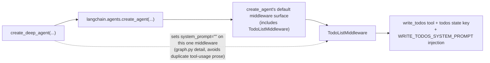
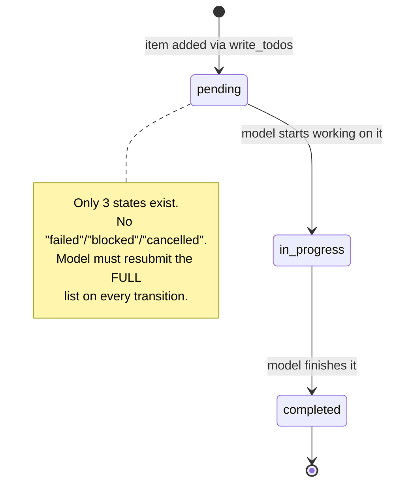

# Planning System & Todos

> "The plan isn't in the prompt. It's in the state." — the one sentence that explains why `write_todos` behaves the way it does.

## Learning Objectives

By the end of this chapter, you will be able to:

- State precisely where `write_todos` comes from — **`langchain`'s `TodoListMiddleware`**, not `deepagents` — and explain the exact composition chain (`create_deep_agent` → `langchain.agents.create_agent` → default middleware surface) that pulls it in
- Explain, in terms of failure modes you've actually seen in long tool-calling loops, *why* a visible, stateful todo list improves multi-step task reliability over a model that "just starts doing things"
- Recite the exact `Todo` TypedDict schema, its three (and only three) status values, and the whole-list-replace semantics of every `write_todos` call
- Trace the state mechanics precisely: how `Command(update={...})` lands a new `todos` list on graph state and appends a `ToolMessage` the model reads back like any other tool result
- Build a multi-tool deep agent (the "Travel Planner") whose natural task structure causes the model to invoke `write_todos` unprompted, and read the todo list evolving turn by turn
- Stream a running agent with `stream_mode="values"` and extract `state["todos"]` from each chunk, as the foundation of a live progress UI
- Explain why todos being *state* rather than *prompt text* is what makes them survive a crash-and-resume cycle once a checkpointer is attached (forward reference to Chapter 10)

---

## Prerequisites for This Chapter

This chapter assumes you've internalized the mental model built in **Chapter 1** (what `deepagents` is and isn't), **Chapter 2** (the exact middleware assembly order inside `create_deep_agent()`), and **Chapter 3** (constructing and invoking your first deep agent — `create_deep_agent(model, tools=..., system_prompt=..., ...)`, then `.invoke({"messages": [...]})` / `.stream(...)`).

Two things from Chapter 2 matter directly here:

- `create_deep_agent()` does not build a bespoke LangGraph graph from scratch. It calls `langchain.agents.create_agent(...)` under the hood and adds its own middleware stack (filesystem, subagents, memory, summarization, human-in-the-loop) on top of whatever `create_agent` already brings by default.
- Middleware in this stack is ordinary `AgentMiddleware` — hooks that can add tools, modify state schema, and rewrite prompts. Nothing about planning requires new mental machinery beyond what Chapter 2 already gave you for middleware in general.

If either of those is fuzzy, a quick re-read of Chapter 2's middleware-assembly diagram before continuing will make this chapter click faster.

---

## 1. The Critical Correction: `write_todos` Is Not `deepagents` Code

Here is the fact almost every blog post, tutorial video, and even some internal onboarding docs get wrong: **`write_todos` is not implemented inside the `deepagents` package.** Search `libs/deepagents/deepagents/` on GitHub for a `todo.py`, a `TodoTool`, or a `write_todos` function definition, and you will not find one. What you will find, if you look at `graph.py`, is `deepagents` quietly configuring a middleware it imported from somewhere else.

The tool is implemented in **`langchain/agents/middleware/todo.py`**, inside the `langchain-ai/langchain` repository, as `TodoListMiddleware`. `deepagents` gets it "for free" through exactly this chain:



`create_deep_agent()` does exactly one thing to this middleware: it sets its `system_prompt=""`. That's it. The reason is prosaic, not architectural — `deepagents`' own filesystem and subagent guidance already covers general tool-usage conventions in the assembled system prompt, and the middleware's default prose would otherwise duplicate that. The tool itself, its schema, its state key, its usage-guidance injection — all of it is unmodified `langchain` code.

### 1.1 Why this distinction actually matters, practically

This isn't pedantic. It changes where you go when something about planning breaks in production:

- **If `write_todos` behaves unexpectedly** — say, the model calls it with a malformed `todos` list, or the status values look wrong, or you want to understand exactly what text gets injected into the system prompt to instruct the model on *when* to call it — the fix or the answer is in `langchain/agents/middleware/todo.py`, not anywhere in `deepagents`. Opening a `deepagents` GitHub issue about `write_todos` internals will get redirected upstream.
- **If you ever build an agent directly on `langchain.agents.create_agent(...)`** — no `deepagents` involved at all, just a LangGraph practitioner reaching for LangChain's own agent harness — **you get the exact same planning tool, for free, with the exact same schema.** This is the single most useful consequence of the correction: understanding `write_todos` is not a `deepagents`-specific skill. It's a `langchain.agents.create_agent` skill that `deepagents` happens to inherit.
- **Debugging surface is `langchain`, not `deepagents`.** When you need to read source to understand exact behavior (as you should, per this course's stated philosophy of verifying claims against source rather than trusting docs), the file to open is in the `langchain-ai/langchain` repo, under `libs/langchain/langchain/agents/middleware/todo.py` — not anywhere under `libs/deepagents/`.

A useful mental test: if you find yourself grepping the `deepagents` repository for `write_todos` and coming up empty, that's not a sign you're looking in the wrong place inside `deepagents` — it's confirmation the tool genuinely isn't defined there. The empty search result *is* the finding.

### 1.2 What `deepagents` actually owns, for contrast

To sharpen the boundary: `deepagents` *does* own the filesystem tools (`ls`, `read_file`, `write_file`, `edit_file`, `glob`, `grep` — Chapter 5), the subagent `task` tool (Chapter 8), the memory convention (Chapter 7), and its own summarization/human-in-the-loop middleware wiring. Planning is the one piece in the "four things deepagents bundles" list (from this course's index) that isn't actually deepagents' own implementation — it's an inherited default that happens to be exactly what a deep agent needs, so `deepagents` doesn't reinvent it. That's a deliberate, sensible reuse decision, not an accident — but it's one you should be able to name.

---

## 2. Why Visible Planning Exists At All

It's worth being precise about the actual failure mode a todo list prevents, because "agents need a planning tool" is often stated as received wisdom without the underlying mechanism being spelled out.

### 2.1 The failure mode of a plan-free agent

Consider a deep agent given a genuinely multi-step task — "book a flight, then a hotel, then build a day-by-day itinerary, then compute a total budget" — but with **no** planning tool available (imagine, hypothetically, a middleware stack with `TodoListMiddleware` removed). The model still has all the individual tools. What tends to go wrong in practice, across long tool-calling loops in general (not specific to any one model), falls into three recognizable patterns:

1. **Losing track of what's left.** After four or five tool calls interleaved with reasoning, the model's "working memory" of the overall goal is only as good as what it can reconstruct from re-reading the conversation history each turn. Nothing forces it to keep an explicit, up-to-date accounting of remaining subtasks — so it may skip a step it already implicitly committed to.
2. **Redoing work.** Without an explicit record of "flight: done, hotel: done," a model that gets confused about state may re-invoke a tool it already called, wasting calls and potentially producing inconsistent results (e.g., booking two hotels).
3. **Declaring premature success.** The most costly failure mode: the model produces a plausible-sounding final answer — "Your trip is booked!" — having actually completed only some of the subtasks, because nothing in its own generation forced it to check its work against an explicit checklist before concluding.

None of these are exotic — they're the ordinary failure modes of any long, unstructured sequential-decision process without an externalized state representation, whether the "agent" is an LLM or a person trying to hold a six-item plan entirely in their head.

### 2.2 Side by side: plan-free vs. plan-visible

To make this concrete rather than abstract, here's an illustrative contrast between how a model tends to narrate the same four-part travel-planning task with and without a planning tool available. This is reasoned-through prose, not an execution trace, but it reflects a real, observable pattern.

**Without a planning tool** (hypothetical middleware stack with `TodoListMiddleware` removed), a plausible tool-calling sequence:

```
AIMessage: "I'll start by finding flights." → find_flights(...)
ToolMessage: "Found 2 flights ..."
AIMessage: "Great, let me also check hotels." → book_hotel(...)
ToolMessage: "Booked 'Lisbon Riverside Inn' ..."
AIMessage: "Here's your trip: flights found and hotel booked. Let me know if you need anything else!"
```

Notice what's missing: the itinerary and the budget estimate — two of the four originally requested subtasks — were never attempted, and nothing in the model's own generation flagged the gap. The final message *reads* confident and complete, which is exactly what makes this failure mode dangerous: a human skimming the response has no signal that half the request was silently dropped.

**With `write_todos` available**, the same request tends to produce:

```
AIMessage: tool_calls=[write_todos(4 items, all "pending")]
ToolMessage: "Updated todo list to [...]"
AIMessage: "Starting with flights." → find_flights(...)
ToolMessage: "Found 2 flights ..."
AIMessage: tool_calls=[write_todos(4 items, item 1 "completed", item 2 "in_progress")]
ToolMessage: "Updated todo list to [...]"
AIMessage: "Now booking a hotel." → book_hotel(...)
... (continues through itinerary and budget) ...
AIMessage: tool_calls=[write_todos(4 items, all "completed")]
ToolMessage: "Updated todo list to [...]"
AIMessage: "Here's your complete trip plan: flights, hotel, itinerary, and budget, all done."
```

The explicit list acts as a running checklist the model has to actively clear before it can truthfully claim `completed` on all four items — it doesn't *guarantee* the model won't lie about a status, but it removes the easier failure mode of simply never noticing two subtasks were dropped.

### 2.3 What externalizing the plan into state buys you

A todo list forces the model to externalize its plan into **state** rather than leaving it implicit in its own latent reasoning. Three concrete properties follow directly from that:

- **(a) Inspectable mid-run.** Because `todos` is a key on graph state (not just something mentioned once in a chat message and then forgotten), a human or a UI can read it *at any point during execution* — not just after the run finishes. Section 6 of this chapter builds exactly this with `stream_mode="values"`.
- **(b) Survives an interruption.** Because it's state, not just conversation flavor text, it's checkpointed along with everything else if a checkpointer is configured (Chapter 10). A crash mid-task doesn't lose the plan — it resumes from wherever the `todos` list last stood.
- **(c) Disciplines completion-checking.** Because the tool's own usage guidance (injected via `WRITE_TODOS_SYSTEM_PROMPT`) nudges the model toward marking items `completed` as it goes and toward re-submitting the full list rather than silently dropping items, the model is nudged toward an explicit "is this actually done?" check before concluding, rather than an implicit one.

None of this makes the model *incapable* of ignoring its own todo list — nothing forces execution to follow the plan (more on this in Common Mistakes) — but it substantially raises the odds that a long task self-corrects rather than silently drifting.

---

## 3. The `Todo` Schema, Precisely

This is the ground-truth schema, unmodified, from `langchain/agents/middleware/todo.py`:

```python
class Todo(TypedDict):
    content: str
    status: Literal["pending", "in_progress", "completed"]

class PlanningState(AgentState[ResponseT]):
    todos: Annotated[NotRequired[list[Todo]], OmitFromInput]

@tool(description=WRITE_TODOS_TOOL_DESCRIPTION)
def write_todos(todos: list[Todo], tool_call_id: Annotated[str, InjectedToolCallId]) -> Command[Any]:
    return Command(update={
        "todos": todos,
        "messages": [ToolMessage(f"Updated todo list to {todos}", tool_call_id=tool_call_id)],
    })
```

Four facts to internalize from this, in order of how often they're gotten wrong:

### 3.1 Exactly three status values — no more

`Literal["pending", "in_progress", "completed"]`. That's the complete set. There is no `"cancelled"`, no `"blocked"`, no `"failed"`, no `"skipped"`. If a task genuinely can't be completed (Section 8's "Hands-On Exercise" builds exactly this scenario), the model's only schema-valid options are to leave it `pending`, mark it `in_progress` indefinitely, or mark it `completed` with content that notes the caveat — there's no dedicated status slot for "attempted and failed." Any tutorial or diagram you see with a fourth status is describing something other than this middleware's actual schema.

### 3.2 The whole list is replaced, every call — it is not a patch

This is the single most consequential behavioral fact, and the one most likely to trip you up if you assume PATCH-like semantics from a REST background. Look again at the `Command`:

```python
return Command(update={"todos": todos, ...})
```

`todos` here is the **entire argument the model passed in this call** — not a diff, not an appended item, not a partial update merged with the previous list. Whatever `list[Todo]` the model supplies becomes the complete new value of the `todos` state key, full stop. If the model wants to mark item 2 of 4 as `completed` while leaving items 1, 3, and 4 unchanged, it must resubmit **all four** todos in the same call, with only item 2's status field changed.

This has a direct practical consequence: **the model is expected to have "remembered" (from its own prior tool call, visible in message history) what the full list looked like before, and to reconstruct it faithfully.** If the model instead calls `write_todos` with only the one item it wants to change, the previous three items are simply gone from state — not preserved, not merged, gone. This is a real failure mode you can watch for in transcripts (see Common Mistakes, and the Hands-On Exercise).

### 3.3 Todos live in `PlanningState`, mixed into overall agent state

`PlanningState(AgentState[ResponseT])` is a state schema mixin, exactly the same mechanism you already know from LangGraph's typed state channels. It adds one field, `todos`, typed as `Annotated[NotRequired[list[Todo]], OmitFromInput]` — `NotRequired` because a fresh thread has no todos yet, `OmitFromInput` because a caller invoking the graph doesn't supply `todos` as part of their input message payload; it only ever gets populated by the tool itself. This mixin is folded into the overall state schema the compiled graph uses, the same way `deepagents`' own filesystem state (Chapter 5) and subagent state (Chapter 8) are folded in as their own mixins.

### 3.4 The tool call and its result are ordinary messages — no side channel

The `Command` updates two things simultaneously: the `todos` state key, and `messages` (appending a `ToolMessage`). This means the model's own prior plan is visible to it on the next turn **the exact same way any other tool's result is visible** — by reading back through `messages`. There is no separate, hidden planning channel the model consults; `write_todos` is a `Command`-returning tool exactly like any custom tool you might write yourself that needs to update state directly (a pattern you've likely already used in raw LangGraph work). The `ToolMessage` content is literally `f"Updated todo list to {todos}"` — a string rendering of the full list the model just submitted, which is what re-appears in context for the model to read on its next turn.

---

## 4. State Mechanics: Tracing One `write_todos` Call

Let's trace a single call through precisely, connecting the schema in Section 3 to what actually happens on the graph.

Suppose the model, mid-task, decides to submit its initial plan:

```python
# What the model's AIMessage.tool_calls contains:
{
    "name": "write_todos",
    "args": {
        "todos": [
            {"content": "Find flights to Lisbon", "status": "pending"},
            {"content": "Book a hotel in Lisbon", "status": "pending"},
            {"content": "Draft a 4-day itinerary", "status": "pending"},
            {"content": "Estimate total trip budget", "status": "pending"},
        ]
    },
    "id": "call_plan_001",
}
```

When the graph executes this tool call, `write_todos` runs with `todos` bound to that list and `tool_call_id="call_plan_001"` (injected automatically via `InjectedToolCallId` — the model never supplies this itself, exactly like any other injected-argument tool you've built). It returns:

```python
Command(update={
    "todos": [
        {"content": "Find flights to Lisbon", "status": "pending"},
        {"content": "Book a hotel in Lisbon", "status": "pending"},
        {"content": "Draft a 4-day itinerary", "status": "pending"},
        {"content": "Estimate total trip budget", "status": "pending"},
    ],
    "messages": [
        ToolMessage(
            "Updated todo list to [{'content': 'Find flights to Lisbon', 'status': 'pending'}, ...]",
            tool_call_id="call_plan_001",
        )
    ],
})
```

Two things land on state in the same atomic update: `state["todos"]` now holds the four-item list, and `state["messages"]` gains one more `ToolMessage` at the end. On the next model turn, the model sees that `ToolMessage` in its context — the same mechanism as any tool result — and can decide to submit an updated list (e.g., marking "Find flights to Lisbon" `in_progress`) by calling `write_todos` again with the full four-item list, item 1's status changed.

```mermaid
sequenceDiagram
    participant Model as Model (LLM)
    participant Graph as Compiled Graph (state)
    participant MW as TodoListMiddleware / write_todos

    Model->>Graph: AIMessage(tool_calls=[write_todos(4 items, all "pending")])
    Graph->>MW: execute write_todos(todos=[...], tool_call_id="call_plan_001")
    MW-->>Graph: Command(update={"todos": [...], "messages": [ToolMessage(...)]})
    Graph->>Graph: state["todos"] = [...]; state["messages"].append(ToolMessage)
    Model->>Graph: (next turn) reads ToolMessage in context, calls book_flight tool
    Graph-->>Model: flight booked, ToolMessage returned
    Model->>Graph: AIMessage(tool_calls=[write_todos(4 items, item 1 now "completed")])
    Graph->>MW: execute write_todos(todos=[... item1 completed ...])
    MW-->>Graph: Command(update={"todos": [...updated...], "messages": [ToolMessage(...)]})
    Graph->>Graph: state["todos"] fully replaced (not merged)
```

The state-transition shape each individual `Todo` moves through (in the common case where the model follows the intended usage pattern) is a strict linear progression:



Nothing in the schema *enforces* this progression — a model could technically jump straight from `pending` to `completed`, or (in principle) revert a `completed` item back to `pending` on a later call, since the tool has no validation beyond the `Literal` type check. The diagram shows the intended, prompted-for usage pattern, not a hard constraint.

---

## 5. Building the Travel Planner

Let's build an agent whose task is naturally multi-step enough that the model reaches for `write_todos` on its own, without being told to. We'll mock four tools: finding flights, booking a hotel, drafting an itinerary, and estimating a budget.

### 5.1 The tools

```python
from langchain_core.tools import tool

@tool
def find_flights(origin: str, destination: str, date: str) -> str:
    """Search for available flights between two cities on a given date.

    Args:
        origin: Departure city, e.g. "New York".
        destination: Arrival city, e.g. "Lisbon".
        date: Travel date in YYYY-MM-DD format.
    """
    # Mocked — a real implementation would call a flights API.
    return (
        f"Found 2 flights {origin} -> {destination} on {date}: "
        f"TAP Air Portugal ($612, nonstop, 7h05m), "
        f"United ($548, 1 stop, 10h40m)."
    )

@tool
def book_hotel(city: str, check_in: str, check_out: str, budget_per_night: float = 150.0) -> str:
    """Book a hotel in the given city for the given date range, within a nightly budget.

    Args:
        city: City to book in, e.g. "Lisbon".
        check_in: Check-in date, YYYY-MM-DD.
        check_out: Check-out date, YYYY-MM-DD.
        budget_per_night: Maximum nightly rate in USD. Defaults to 150.0.
    """
    # Mocked — a real implementation would call a hotel booking API.
    return f"Booked 'Lisbon Riverside Inn' in {city}, {check_in} to {check_out}, $132/night."

@tool
def create_itinerary(city: str, num_days: int) -> str:
    """Draft a day-by-day sightseeing itinerary for a city.

    Args:
        city: The destination city, e.g. "Lisbon".
        num_days: Number of days to plan for.
    """
    # Mocked — a real implementation might consult a POI database or search API.
    days = [f"Day {i + 1}: explore a different {city} neighborhood" for i in range(num_days)]
    return "\n".join(days)

@tool
def estimate_budget(flight_cost: float, nightly_hotel_rate: float, nights: int, daily_spend: float = 80.0) -> str:
    """Estimate total trip cost from flight, hotel, and daily spending money.

    Args:
        flight_cost: Round-trip flight cost in USD.
        nightly_hotel_rate: Hotel cost per night in USD.
        nights: Number of nights.
        daily_spend: Estimated daily spending money (food, transit, activities). Defaults to 80.0.
    """
    total = flight_cost + (nightly_hotel_rate * nights) + (daily_spend * nights)
    return f"Estimated total trip cost: ${total:,.2f}"
```

### 5.2 Assembling the deep agent

```python
from deepagents import create_deep_agent

travel_planner_tools = [find_flights, book_hotel, create_itinerary, estimate_budget]

agent = create_deep_agent(
    model="anthropic:claude-sonnet-4-6",
    tools=travel_planner_tools,
    system_prompt=(
        "You are a meticulous travel planning assistant. When given a multi-part "
        "trip-planning request, break it into concrete subtasks before executing, "
        "and keep your task list updated as you complete each part."
    ),
)
```

Note that this `system_prompt` doesn't need to mention `write_todos` by name or explain its schema — that guidance is already injected by `TodoListMiddleware` itself (Section 1). This custom prompt is additive on top of that injected guidance, not a replacement for it (Chapter 2/3 cover the full assembled-prompt picture); here it's just nudging the model's general planning *disposition*, which reinforces rather than duplicates what the middleware already provides.

### 5.3 Running it and reading the plan evolve

```python
result = agent.invoke({
    "messages": [{
        "role": "user",
        "content": (
            "Plan a trip from New York to Lisbon, departing 2026-09-10 and "
            "returning 2026-09-17. Find flights, book a hotel under $150/night, "
            "build a 6-day itinerary, and tell me the total estimated budget."
        ),
    }]
})

print(result["todos"])
```

A representative (illustrative, not executed) trace of how `result["todos"]` evolves across the run:

**After the model's first move — plan the whole task before touching any booking tool:**

```python
[
    {"content": "Find flights New York -> Lisbon for 2026-09-10 / 2026-09-17", "status": "pending"},
    {"content": "Book a hotel in Lisbon under $150/night", "status": "pending"},
    {"content": "Draft a 6-day Lisbon itinerary", "status": "pending"},
    {"content": "Estimate total trip budget", "status": "pending"},
]
```

**Mid-run, after calling `find_flights` and starting `book_hotel` — note ALL four items are resubmitted, not just the one that changed:**

```python
[
    {"content": "Find flights New York -> Lisbon for 2026-09-10 / 2026-09-17", "status": "completed"},
    {"content": "Book a hotel in Lisbon under $150/night", "status": "in_progress"},
    {"content": "Draft a 6-day Lisbon itinerary", "status": "pending"},
    {"content": "Estimate total trip budget", "status": "pending"},
]
```

**At the end of the run, once every tool has actually been called and the model has synthesized a final answer:**

```python
[
    {"content": "Find flights New York -> Lisbon for 2026-09-10 / 2026-09-17", "status": "completed"},
    {"content": "Book a hotel in Lisbon under $150/night", "status": "completed"},
    {"content": "Draft a 6-day Lisbon itinerary", "status": "completed"},
    {"content": "Estimate total trip budget", "status": "completed"},
]
```

Nothing in `create_deep_agent`'s configuration told the model to call `write_todos` at all in this example — the four-part, clearly-decomposable nature of the request combined with the middleware's own injected usage guidance was enough for a capable model to reach for it unprompted. This is the practical payoff of Section 2's argument: a request shaped like "do A, then B, then C, then D" is exactly the shape that triggers spontaneous planning behavior.

---

## 6. Observing Todos Mid-Stream

`result["todos"]` above only shows you the *final* state, after the whole run finished. For a live UI — the kind you'll build in Chapter 18 behind a FastAPI streaming endpoint — you want to observe the todo list changing **while the agent is still running**, not just at the end.

`stream_mode="values"` is the tool for this: each streamed chunk is the **full current state** at that point in execution (as opposed to `stream_mode="updates"`, which gives you only the incremental diff per step). Because `todos` is an ordinary state key, it's simply present in every chunk once it's been set.

```python
previous_todos = None

for chunk in agent.stream(
    {"messages": [{"role": "user", "content": (
        "Plan a trip from New York to Lisbon, departing 2026-09-10 and "
        "returning 2026-09-17. Find flights, book a hotel under $150/night, "
        "build a 6-day itinerary, and tell me the total estimated budget."
    )}]},
    stream_mode="values",
):
    current_todos = chunk.get("todos")
    if current_todos != previous_todos:
        print("--- todo list updated ---")
        for item in current_todos or []:
            marker = {"pending": "[ ]", "in_progress": "[~]", "completed": "[x]"}[item["status"]]
            print(f"  {marker} {item['content']}")
        previous_todos = current_todos
```

Illustrative output as the run progresses:

```
--- todo list updated ---
  [ ] Find flights New York -> Lisbon for 2026-09-10 / 2026-09-17
  [ ] Book a hotel in Lisbon under $150/night
  [ ] Draft a 6-day Lisbon itinerary
  [ ] Estimate total trip budget
--- todo list updated ---
  [x] Find flights New York -> Lisbon for 2026-09-10 / 2026-09-17
  [~] Book a hotel in Lisbon under $150/night
  [ ] Draft a 6-day Lisbon itinerary
  [ ] Estimate total trip budget
--- todo list updated ---
  [x] Find flights New York -> Lisbon for 2026-09-10 / 2026-09-17
  [x] Book a hotel in Lisbon under $150/night
  [~] Draft a 6-day Lisbon itinerary
  [ ] Estimate total trip budget
--- todo list updated ---
  [x] Find flights New York -> Lisbon for 2026-09-10 / 2026-09-17
  [x] Book a hotel in Lisbon under $150/night
  [x] Draft a 6-day Lisbon itinerary
  [x] Estimate total trip budget
```

### 6.1 Why this matters for a FastAPI streaming endpoint

If you're building a background reader for the production chapters ahead (Chapter 18 covers this in depth), the pattern above is directly the mechanism you'd wrap in an `async for` loop over `agent.astream(..., stream_mode="values")`, pushing each todo-list delta out over an SSE or WebSocket connection as a structured progress event. Because the diffing logic here only depends on comparing successive `chunk["todos"]` snapshots — ordinary Python dict/list equality — there's no deep-agents-specific serialization concern; it's the same "diff two state snapshots and emit an event" pattern you'd write for any LangGraph `stream_mode="values"` consumer, todos or otherwise.

---

## 7. Todos and Checkpointing: A Forward Reference

One sentence deserves to be pulled out on its own, because it's the concrete payoff of everything in Section 3.3: **because todos live in state and not in a system prompt string, they are checkpointed along with the rest of the graph state whenever a checkpointer is configured on `create_deep_agent(..., checkpointer=...)`.**

Practically, this means: if your Travel Planner agent crashes (or is deliberately interrupted for a human-in-the-loop approval, Chapter 9) after marking "Find flights" `completed` and "Book a hotel" `in_progress`, resuming that same `thread_id` against a durable checkpointer restores `state["todos"]` exactly as it stood — the model doesn't have to re-derive its plan from scratch, and doesn't risk silently forgetting the two items it hadn't started yet. This is one of the concrete, mechanical reasons "plans are state, not prompt text" is a better design than, say, an agent that keeps its plan only as prose inside its own generated text — prose that a checkpointer would still persist as a message, but that the model would have to *re-parse* from natural language on resume rather than reading back as structured, directly inspectable data. Chapter 10 covers checkpointer selection and the full crash-recovery story in depth; for now, the takeaway is narrower and worth holding onto: todos are one concrete instance of the general principle that state survives, and prompts alone don't.

---

## 8. Real-World Scenario

**Scenario:** A team building an internal ops-automation deep agent (routine tasks like "rotate this API key across three environments and update the on-call runbook") notices something odd in their logs: occasionally, the todo list the agent reports at the end of a run has *fewer* items than the plan it started with — not because items were completed, but because they silently vanished partway through.

**Investigating:** Reading the raw message history for one of these runs (not just the final `todos` state), the team finds the sequence:

1. `write_todos` called with 5 items, all `pending`.
2. Three tool calls happen, then `write_todos` is called again — but this time with only **2** items: the one just finished (now `completed`) and the one about to start (now `in_progress`). The other three items from the original plan are absent from this call's `todos` argument.
3. From this point on, `state["todos"]` only ever has 2 entries. The three "lost" items are never executed, and the model's final summary claims the task is done.

**Root cause:** the model (in a moment of context-compression or just an imprecise generation) treated `write_todos` as if it were a partial update — "here's what changed" — rather than a full replace. Because the middleware has no way to distinguish "the model deliberately dropped these three items" from "the model forgot them," it does exactly what the schema says: replaces the whole list with whatever was submitted. The three original items are gone from state, not paused or hidden.

**The fix the team applied:** two complementary mitigations, neither of which changes the middleware itself (since, per Section 1, that's `langchain` code, not something they'd patch):

1. **Tightened the custom `system_prompt`** passed to `create_deep_agent` with an explicit, additive reminder: *"When updating the todo list, always resubmit the complete list of all items, not just the ones that changed — write_todos replaces the entire list on every call."* This doesn't change the tool's behavior, but it does directly counter the specific misunderstanding the model was exhibiting.
2. **Added a lightweight application-layer check** after each run: compare the number of items in the *first* `write_todos` call (extractable from message history) against the *last* one, and flag (for human review) any run where the count shrank without a corresponding increase in `completed` items — a signal that items were silently dropped rather than finished.

**Lesson:** the whole-list-replace semantics (Section 3.2) aren't a documentation footnote — they're a live failure mode you should actively watch for in production transcripts, especially on longer plans (5+ items) where the temptation to "just send the diff" is stronger, both for models and for the humans reading model behavior who might otherwise assume PATCH semantics from web-API habits.

---

## 9. Best Practices

- **Never assume `write_todos` patches — always verify the full list is being resubmitted** when reviewing transcripts of longer multi-step tasks; a shrinking item count between calls without a matching rise in `completed` items is a red flag (Section 8).
- **Let the model plan unprompted before nudging it explicitly.** A well-decomposable request (Section 5) will often trigger `write_todos` on its own, courtesy of the middleware's injected guidance — reserve explicit "make a plan first" instructions in your custom `system_prompt` for cases where you've observed the model skipping planning on tasks that clearly need it.
- **Treat `todos` as a first-class piece of observable state**, not an implementation detail — read it in `stream_mode="values"` chunks (Section 6) for live progress UIs, and log it alongside the final response for post-hoc debugging of long runs.
- **Pair planning with checkpointing for anything long-running or interruptible** (Section 7) — the reliability payoff of a visible todo list is largest precisely in the runs most likely to be interrupted.
- **Remember the schema lives in `langchain`, not `deepagents`**, when you need to check exact tool-description wording or debug an edge case — go to `langchain/agents/middleware/todo.py` directly rather than searching the `deepagents` repository.
- **Don't conflate "the todo list says completed" with "the task actually succeeded."** The status is only as trustworthy as the model's own self-report — it's a discipline mechanism, not a verification mechanism. Pair it with your own application-level checks for anything consequential (the Hands-On Exercise below builds exactly this distinction).

---

## 10. Common Mistakes

- **Assuming `write_todos` patches the existing list.** It replaces it entirely, every call (Section 3.2). Code or prompts that assume partial updates will misbehave the moment the model (correctly, per the actual schema) submits a full list and your application logic tries to "merge" it with a previous partial one.
- **Assuming a fourth status exists** (`"cancelled"`, `"blocked"`, `"failed"`, etc.). Only `"pending"`, `"in_progress"`, and `"completed"` are valid per the `Literal` type — any code branching on a status outside this set is handling a case the schema cannot actually produce.
- **Expecting the plan to auto-execute itself.** `write_todos` only ever *records* intent — it does not schedule, enforce, or verify that the corresponding tool calls actually happen. A model can write a beautiful 5-item plan and then never call the tools for items 3–5, marking them `completed` anyway on the final call. The todo list is a discipline aid and an observability surface, not a task scheduler or a guarantee of execution.
- **Looking for `write_todos`'s implementation inside `deepagents`.** It lives in `langchain`'s `TodoListMiddleware` (Section 1) — searching the wrong repository wastes debugging time and can lead to incorrectly concluding a behavior is "a deepagents bug" when it's inherited, unmodified `langchain` behavior.
- **Writing a custom `system_prompt` that tries to fully re-explain tool usage for `write_todos`.** The middleware already injects its own usage guidance (`WRITE_TODOS_SYSTEM_PROMPT`); your custom prompt is additive on top of it, not a replacement — redundant re-explanation just adds tokens without changing behavior, and risks contradicting the injected guidance if wording drifts.
- **Treating a `completed` status as proof of correctness.** It only reflects the model's own belief that the step is done — a model can mark a step `completed` after a tool call that silently failed or returned an error string, if it doesn't reason carefully about the tool's result. Validate consequential completions independently rather than trusting the todo list at face value.

---

## Summary

- `write_todos` is **not** `deepagents` code — it's `langchain`'s `TodoListMiddleware` (`langchain/agents/middleware/todo.py`), inherited because `create_deep_agent()` delegates to `langchain.agents.create_agent(...)`, whose default middleware surface already includes it. `deepagents` only sets this middleware's `system_prompt=""` to avoid duplicating its own tool-usage prose.
- This matters practically: the same planning tool is available "for free" to anyone building directly on `langchain.agents.create_agent`, and debugging its behavior means reading `langchain` source, not `deepagents` source.
- Visible planning exists to counter three concrete failure modes of long, plan-free tool-calling loops: losing track of remaining work, redoing completed work, and declaring premature success. Externalizing the plan into **state** makes it inspectable mid-run, checkpoint-durable, and a discipline mechanism for completion-checking.
- The schema is exactly `Todo = TypedDict{content: str, status: Literal["pending", "in_progress", "completed"]}` — three statuses, no more — held in a `todos` key added to state via the `PlanningState` mixin.
- Every `write_todos` call **replaces the entire list** — it is not a patch. The model must resubmit the full list, with only the changed item(s) updated, on every call.
- The tool returns `Command(update={"todos": ..., "messages": [ToolMessage(...)]})` — the same `Command` pattern any state-updating custom tool uses — so the model reads its own prior plan back through ordinary message history, with no separate side-channel.
- The Travel Planner example showed a naturally decomposable, four-tool task causing a capable model to invoke `write_todos` unprompted, with the list evolving from all-`pending` through a `completed`/`in_progress`/`pending` mix to all-`completed`.
- `stream_mode="values"` lets you read `state["todos"]` from every streamed chunk — the mechanism for a live plan-progress UI, directly reusable in a FastAPI streaming endpoint (Chapter 18).
- Because todos are state, not prompt text, they're checkpointed and resume correctly across a crash or interruption once a checkpointer is configured (Chapter 10) — the concrete payoff of treating plans as data.

---

## Knowledge Check

1. Trace the exact call chain that causes `write_todos` to be available on a `deepagents` agent, naming each layer. What single configuration change does `deepagents` itself make to this middleware, and why?
2. A colleague says "I built an agent directly on `langchain.agents.create_agent`, no `deepagents` involved, and it still has a `write_todos` tool — that seems like a bug." Explain why this is expected, not a bug.
3. List the three valid `status` values for a `Todo`. A reviewer's diagram shows a fourth state labeled `"blocked"` reachable from `"in_progress"` — what's wrong with that diagram?
4. A model calls `write_todos` with a 2-item list, right after an earlier call had submitted a 5-item list where only 1 item was `completed`. What happens to the state of the other 4 items, and why? Is this necessarily a bug in the middleware?
5. Explain, using the actual `Command` return value from `todo.py`, how the model "sees" its own previous todo list on the next turn. Is there a separate planning channel it consults?
6. Why does a todo list surviving a checkpointer restart matter more than, say, a plan the model only ever stated once in a chat message? Frame your answer around the "state vs. prompt text" distinction.

---

## Hands-On Exercise

Extend the Travel Planner from Section 5 to include a tool that can fail partway through, and observe how the model's todo list handles it.

1. **Add a fifth tool, `check_visa_requirement(nationality: str, destination_country: str) -> str`**, that raises an exception (or returns an explicit error string — try both variants) for a hard-coded subset of inputs, e.g. raise when `destination_country == "Lisbon"` is actually mistyped as a country name instead of `"Portugal"` (a deliberately realistic "wrong argument shape" failure), or simulate a downstream API timeout for a specific nationality value.

2. **Extend the system prompt's task** to: "...and check whether a US passport holder needs a visa for Portugal before finalizing the itinerary" — a fifth subtask that plausibly gets added to the todo list alongside the original four.

3. **Run the agent and capture the full `todos` evolution** using the `stream_mode="values"` loop from Section 6. Specifically watch for:
   - Does the model add a fifth todo item for the visa check *before* or *after* it discovers the tool fails?
   - When `check_visa_requirement` fails, what status does the model assign to that todo item on its next `write_todos` call? (Recall from Section 3.1 there is no `"failed"` status — see what the model actually does given only 3 valid options.)
   - Does the model's final summary to the user correctly reflect that the visa check did not succeed, or does it get marked `completed` regardless (connecting back to Section 10's point about `completed` not being proof of correctness)?

4. **Compare the exception-raising variant against the error-string-returning variant.** Does the model's todo-list handling differ depending on whether the tool raised (and your application layer had to catch it and synthesize a `ToolMessage`) versus the tool itself returning a graceful `"Error: ..."` string? Write down which variant produced a todo list you'd trust more, and why.

5. **Bonus:** Add your own lightweight validation layer (as the team in Section 8's Real-World Scenario did) that inspects the message history after the run and flags any todo item marked `completed` whose corresponding tool call actually returned an error string — a simple heuristic for catching the "completed but not actually correct" failure mode without modifying the middleware itself.

---

## Further Reading

- [DeepAgents Overview (LangChain Docs)](https://docs.langchain.com/oss/python/deepagents/overview) — official SDK overview; cross-reference against this chapter's correction on where planning actually lives
- [`langchain-ai/deepagents` GitHub repository](https://github.com/langchain-ai/deepagents) — confirm for yourself that `write_todos` is absent from `libs/deepagents/deepagents/`, per Section 1
- [`langchain-ai/langchain` GitHub repository](https://github.com/langchain-ai/langchain) — read `libs/langchain/langchain/agents/middleware/todo.py` directly; this is the actual ground truth for every schema and behavior claim in this chapter

---

<div style="display:flex;justify-content:space-between;align-items:center;">
  <a href="./03-your-first-deep-agent.md">← Previous: Your First Deep Agent</a>
  <a href="./00-index.md">🏠 Index</a>
  <a href="./05-filesystem-backed-context.md">Next: Filesystem-Backed Context →</a>
</div>
