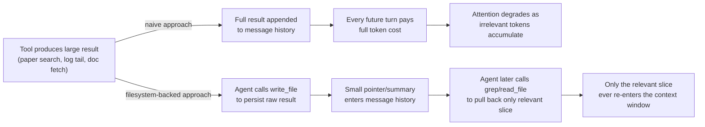
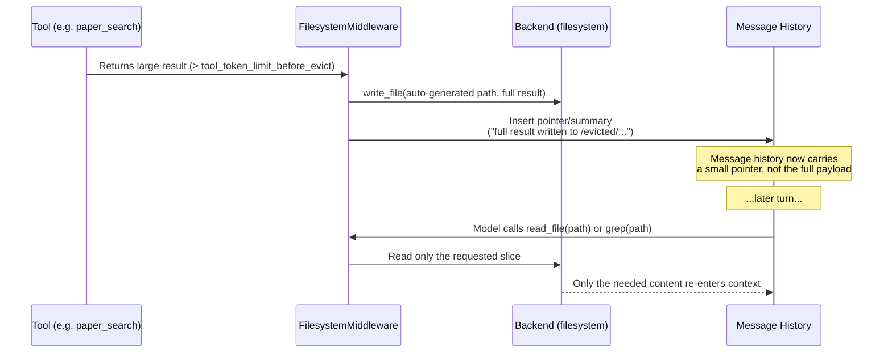

# Filesystem-Backed Context

## Learning Objectives

By the end of this chapter, you will be able to:

- Explain precisely why an LLM context window is a scarce resource and how that framing motivates every design
  decision in `FilesystemMiddleware`
- Use all eight filesystem tools (`ls`, `read_file`, `write_file`, `edit_file`, `delete`, `glob`, `grep`,
  `execute`) with their exact schemas, and predict the specific ways each one fails or behaves unexpectedly
- Explain the "must-read-before-edit" constraint on `edit_file` and why it exists
- State the two automatic-eviction thresholds from memory and describe, mechanically, what eviction does to the
  message history
- Build a multi-step agent that deliberately offloads large intermediate results to files and re-reads only the
  slices it needs
- Restrict the filesystem tool surface with `FilesystemMiddleware(tools=[...])` and know which tool can never be
  excluded, and why

## Prerequisites for This Chapter

This chapter assumes you've read:

- **Chapter 1** (Introduction & Prerequisites) — the four-pillar framing of DeepAgents (filesystem, subagents,
  planning, memory) and how `deepagents` sits on top of `langchain.agents.create_agent`
- **Chapter 2** (Architecture & Internals) — the exact middleware assembly inside `create_deep_agent()`, and how
  to compose additional middleware via the `middleware=` parameter
- **Chapter 3** (Your First Deep Agent) — the `create_deep_agent(model, tools, system_prompt, ...)` call shape
  and `.invoke`/`.stream`
- **Chapter 4** (Planning System & Todos) — `write_todos` and how visible planning coexists with tool execution;
  filesystem tools are the other half of "how a deep agent manages a long task," and the two middlewares are
  designed to be used together

If you can't recall the exact middleware assembly order from Chapter 2, skim it again before continuing — this
chapter treats `FilesystemMiddleware` as one named box in that stack, not as a standalone feature.

## The Core Problem: Context Is Not Free

You already know, from working with long-context LLMs, that a bigger context window is not the same thing as a
*free* context window. Two costs stack on top of each other every time something stays in the message history:

1. **Token cost, paid repeatedly.** Every token in the conversation is retransmitted and re-billed on *every*
   subsequent model call in that thread — not once. A 50-page PDF dumped into a tool result on turn 2 is still
   sitting there, in full, on turn 40, costing money on every one of those 38 intervening calls whether or not
   the model needs it again.
2. **Attention cost, paid silently.** You've seen the "lost in the middle" literature and the practical
   degradation that shows up once a context grows past a few tens of thousands of tokens of low-signal content —
   the model's ability to locate and weight the *relevant* few hundred tokens gets worse as the irrelevant
   majority grows. A context window full of a raw log dump doesn't just cost tokens; it actively degrades
   reasoning quality on everything that comes after it.

Both costs are invisible in a demo (short conversations, small tool outputs) and become dominant in production
(long-running agents, large search results, whole-file reads, tool outputs from real systems). The naive fix —
"just increase the context window" or "summarize aggressively" — doesn't address the actual failure mode, which
is that the agent has no way to *choose* what stays present versus what gets set aside for later.

DeepAgents' answer is the same one a human engineer already uses instinctively: **give the agent a filesystem.**
When you need to work with a log file too large to read comfortably, you don't paste it into a chat message — you
`grep` it for the lines that matter, and you paginate through the file `read` a screenful at a time. You reach
for the filesystem as an external, addressable store that is *not* part of your working memory, and you pull only
the specific slice you need into working memory when you need it. `FilesystemMiddleware` gives an agent the same
capability, with the same tools (`ls`, `grep`, `read_file` paging) mapped onto LLM tool calls.

This reframes what "the filesystem" is for in a deep agent. It is not primarily about persistence (that's
`StoreBackend`'s job — Chapter 6) and it is not primarily about giving the agent a place to "save its work" for
human consumption (though it can be used that way). Its primary job in this chapter's scope is **context
offloading**: moving bulk data out of the message history and leaving behind an address the model can use to
retrieve exactly the part it needs, on demand.



Two mechanisms deliver this in `FilesystemMiddleware`: the **deliberate** path, where the agent's own system
prompt instructs it to write large tool results to files and read back only what's needed, and the **automatic**
safety net, where the middleware itself evicts oversized content once token thresholds are crossed. We'll cover
the tools first, then the eviction mechanism, because the eviction behavior only makes sense once you know what
`write_file`/`read_file` actually do.

## The Filesystem Tool Surface

`FilesystemMiddleware` exposes up to eight tools. All of them operate against whatever `backend` was configured
(default: `StateBackend`, meaning files live in LangGraph state and are checkpointed with everything else,
ephemeral per thread). **The tool call surface below is identical no matter which backend is behind it** — the
model calls the same `read_file(file_path=...)` whether the file physically lives in graph state, on real disk,
or in a cross-thread `Store`. Only the storage medium changes; that's the entire subject of Chapter 6. Don't let
backend questions distract you here — this chapter is entirely about the tool contracts themselves.

```python
FsToolName = Literal["ls", "read_file", "write_file", "edit_file", "delete", "glob", "grep", "execute"]
```

### `ls(path: str)`

Lists a directory. `path` **must be absolute** — there's no implicit "current working directory" concept for the
model to lean on, because there is no shell session backing this; every path is resolved fresh against the
backend on every call. Use it the way you'd use `ls` at a shell prompt: to orient before you `read_file` or
`glob` something more specific.

### `read_file(file_path: str, offset: int = 0, limit: int = 100)`

Reads a page of a file and returns it as numbered lines — the same `cat -n` style output you get from Claude
Code's own Read tool, which you already have direct experience with as a user of this CLI. `offset` is a
**0-indexed line number**, and `limit` caps how many lines come back, defaulting to 100.

The paging default is not an arbitrary implementation detail — it's the mechanism that keeps `read_file` itself
from being the thing that blows the context window. If `read_file` returned an entire 10,000-line file in one
call by default, it would defeat the exact purpose the filesystem tools exist to serve: you'd have moved the data
out to a file only to immediately re-inline all of it. The 100-line default forces a deliberate choice — the
agent (or its system prompt) has to explicitly ask for more, or explicitly page through, rather than accidentally
re-inhaling an entire file at once.

For non-text content — images, audio, video, PDF — `read_file` returns **multimodal content blocks** instead of
numbered text lines, so the same tool serves both "read this log file" and "look at this diagram" use cases. When
the video extra is installed, there's a video-aware variant where `offset`/`limit` are reinterpreted as
**seconds** rather than lines — worth knowing if you're building an agent over video content, but not something
to worry about for a typical text/JSON research pipeline.

```python
# First page: lines 0-99
read_file(file_path="/research/raw_results.json")

# Next page: lines 100-149
read_file(file_path="/research/raw_results.json", offset=100, limit=50)
```

### `write_file(file_path: str, content: str)`

Creates a file, or **fully overwrites** an existing one. There is no partial-write, append, or patch mode on this
tool — if the file exists and you call `write_file` again, whatever was there before is gone. This matters
operationally: `write_file` is the right tool for "produce this file from scratch" (a report, a fresh JSON dump),
and the *wrong* tool for "make one change to a file I already care about" — that's what `edit_file` is for.

### `edit_file(file_path: str, old_string: str, new_string: str, replace_all: bool = False)`

Exact **string** replacement — not regex, no wildcards. `old_string` must be a byte-for-byte substring of the
file's current content, and it must be **unique** within the file unless `replace_all=True`, in which case every
occurrence is replaced. If `old_string` isn't found, or isn't unique and `replace_all` wasn't set, the call fails.

The constraint that gets new users every time: **`edit_file` requires the target file to have already been read
via `read_file` earlier in the same session.** This is enforced by the middleware, not a suggestion — attempting
to `edit_file` a file the agent hasn't `read_file`'d yet raises/fails. This mirrors Claude Code's own Edit tool
contract exactly (you've hit this yourself as a Claude Code user: you can't Edit a file you haven't Read), and the
rationale is identical in both places: it forces the model to have *seen the current content* before it mutates
that content. Without this, a model could hallucinate what a file currently contains and blindly patch a string
that isn't actually there, or worse, silently corrupt a file whose real content diverged from the model's stale
mental model of it. "Look before you leap" is enforced at the tool layer, not left as a prompting best-practice
the model might skip under pressure.

```python
# This fails: /research/notes.md has never been read_file'd this session
edit_file(file_path="/research/notes.md", old_string="TODO", new_string="Done")
# -> error: file must be read before it can be edited

# Correct sequence
read_file(file_path="/research/notes.md")
edit_file(file_path="/research/notes.md", old_string="TODO", new_string="Done")
```

### `delete(file_path: str)`

Deletes a file, or a directory **recursively**. Only available if the configured backend supports deletion — not
every backend necessarily implements every operation (backend capability differences are a Chapter 6 topic).

### `glob(pattern: str, path: str | None = None)`

Shell-style filename matching — `*`, `**`, `?` are all supported, exactly like you'd expect from Python's
`pathlib.Path.glob` or shell globbing. Use it to enumerate files by name/extension pattern before reading them:

```python
glob(pattern="**/*.md", path="/research")
```

### `grep(pattern, path=None, glob=None, output_mode="files_with_matches", max_count=None)`

This is the tool with the sharpest edge in the whole surface, so read this section even if you skim the rest of
the chapter.

**`grep` here is a literal string search. It is explicitly NOT regex.** This is a deliberate design choice, and
it is also the single most common point of confusion for anyone coming from shell `grep`, which *is*
regex-based by default. If you (or, more importantly, the model, acting on a system prompt you wrote) expect
`.`, `*`, `[...]`, `(...)`, or `\d` to mean anything special, you will get either a silent zero-match result or a
match on the literal characters `.`/`*`/etc. — not the pattern-matching behavior you're used to.

Concrete wrong-expectation example: searching a set of papers you've written to `/research/raw_results.json` for
any mention of a version-like token:

```python
# What a shell-grep habit expects: matches "GPT-3", "GPT-4", "GPT3.5", etc. as a class
grep(pattern="GPT-\\d", path="/research")
# Actual behavior: searches for the LITERAL 8-character substring "GPT-\d"
# (backslash, d, and all) — this will almost certainly match nothing.

# What actually works: search for the literal substring you expect
grep(pattern="GPT-4", path="/research")
```

If you need real regex behavior, the correct move is to `read_file` the candidate files (found via `grep` on a
literal substring, or via `glob`) and let the model reason over the content directly, or to give the agent a
dedicated regex-search tool of your own — `grep` in this middleware is intentionally the simple, cheap, literal
tool, not a regex engine.

`output_mode` controls the shape of the response:

- `"files_with_matches"` (default) — just the matching file paths, for a first pass over a large tree
- `"content"` — the matching lines themselves, with presumably enough surrounding context to be useful
- `"count"` — match counts per file, useful for triage before deciding what to `read_file`

There's a built-in ceiling: **a default cap of 1000 total matches**, controlled by `grep_max_count` on
`FilesystemMiddleware` and overridable per call via the `max_count` parameter. This exists for the same reason
`read_file`'s 100-line default exists — an unbounded `grep` across a large corpus could itself return enough
content to blow the context window, which would be an absurd way for a "context management" tool to behave.

### `execute(command: str, timeout: int | None = None)`

Runs an arbitrary command — but **only** if the configured `backend` implements `SandboxBackendProtocol`; against
a backend that doesn't (which includes the default `StateBackend`), it returns an error string rather than
executing anything. The default ceiling is `max_execute_timeout=3600` seconds. Full backend and sandboxing detail
is out of scope here (Chapter 6 covers backend protocols, and Chapter 19 covers sandboxing/security in depth) — the
one thing to retain from this chapter is that `execute` exists in the same tool family, is gated on backend
capability, and is not something you get "for free" just by allowlisting it.

### The allowlist rule: `read_file` is mandatory

`FilesystemMiddleware(tools=[...])` accepts a subset of `FsToolName` (or the literal `"all"`, which is the
default when `tools` isn't passed). Whatever subset you choose, **`read_file` must be present** — omitting it
raises `ValueError` at construction time, not at call time. This isn't an arbitrary restriction: every other
filesystem tool's usefulness (and, for `edit_file`, its very ability to run) depends on the model being able to
read file content back. A filesystem the agent can write to but never read from isn't a smaller filesystem — it's
a broken one, so the middleware refuses to construct it. We'll build a concrete example of restricting the
*other* tools in the "Customizing the Available Tools" section below.

## Automatic Context Eviction

Everything above describes tools the agent chooses to call because its system prompt tells it to. But
`FilesystemMiddleware` also runs a mechanism that requires no cooperation from the agent's prompt at all: it
watches tool outputs and human-message content as they flow through, and when either crosses a size threshold, it
evicts the oversized content to a file automatically, replacing it in the conversation with something much
smaller.

Two independent thresholds drive this, both configurable on `FilesystemMiddleware.__init__`:

- **`tool_token_limit_before_evict: int | None = 20000`** — if a single tool call's *result* exceeds roughly this
  many tokens, the middleware writes that result out to a file and replaces it in the message history with a
  pointer/summary referencing the file, instead of leaving the full result inline.
- **`human_message_token_limit_before_evict: int | None = 50000`** — a running-total threshold across
  human-message content; once cumulative human-message content crosses this, the same eviction behavior kicks in
  for that content.

Concretely, "eviction" means: the middleware takes content that would otherwise sit in the message history
verbatim, forever, on every subsequent LLM call — and instead writes it to a file via the same filesystem
mechanism the agent itself uses, then substitutes a much smaller pointer (a file path and/or a short summary) in
its place in the conversation. The model can still get at the full content later, deliberately, via `read_file`
or `grep` against that path — it just isn't paying the full token cost for it on every intervening turn.



Set either threshold to `None` to disable that particular eviction check — but be deliberate about doing so; it
removes the safety net entirely for that dimension, not just tunes it.

### Eviction is a safety net, not a strategy

This is the point most worth internalizing from this chapter: **automatic eviction exists as a backstop for tool
outputs whose size you didn't anticipate or control** — a third-party API that occasionally returns something
much larger than usual, an MCP tool you don't own the implementation of, a search result set that varies wildly
in size. It is not a substitute for the agent *deliberately* writing planned large outputs to files with
`write_file` and reading back only what it needs.

The difference matters because of *where the pointer text comes from* and *how much control you have over it*. A
deliberate `write_file` call is driven by your system prompt — you control exactly what gets written, to what
path, and what the agent is told to do next (extract sections, grep for keywords, etc.). Automatic eviction is a
generic middleware behavior operating on content it didn't design the shape of — it's there to stop the bleeding
when something oversized shows up unexpectedly, not to replace a well-designed data pipeline. Treat the two
thresholds as insurance, and design your research/data-heavy agents to hit `write_file` on purpose, on your terms,
long before eviction would ever trigger.

## Project: The Research Agent

Let's build the running example for this chapter — a research agent that searches papers, dumps raw results to
the filesystem, extracts what's relevant, and writes a final report. This is the shape of agent where filesystem
offloading stops being optional: paper search APIs routinely return large JSON blobs (abstracts, metadata,
sometimes full text) that you never want sitting in the conversation in full.

### The mocked paper-search tool

```python
from langchain_core.tools import tool

# Mocked for this chapter — in a real system this would call Semantic Scholar,
# arXiv, or an internal paper index over MCP (Chapter 11 covers wiring MCP tools
# into a deep agent).
@tool
def paper_search(query: str, max_results: int = 20) -> str:
    """Search academic papers by query. Returns raw JSON results including
    title, authors, abstract, and year for each hit."""
    import json

    # Simulated large result set — in production this is exactly the kind
    # of payload that's too big to leave inline turn after turn.
    results = [
        {
            "id": f"paper-{i}",
            "title": f"Attention Variant {i}: Efficient Long-Context Transformers",
            "authors": ["A. Researcher", "B. Researcher"],
            "year": 2023 + (i % 3),
            "abstract": (
                "We present a method for improving long-context attention "
                "efficiency by ... " * 20  # long, realistic abstract
            ),
        }
        for i in range(max_results)
    ]
    return json.dumps({"query": query, "results": results}, indent=2)
```

### Building the agent

```python
from deepagents import create_deep_agent

research_system_prompt = """You are a research assistant that investigates a topic
across multiple papers and produces a concise Markdown report.

Follow this exact workflow:
1. Call paper_search with the user's topic.
2. IMMEDIATELY write_file the raw JSON result to /research/raw_results.json.
   Do not try to reason over the raw JSON directly in your response — it is large.
3. read_file /research/raw_results.json in pages (100 lines at a time) to review
   titles and abstracts.
4. As you find relevant papers, write_file /research/notes.md with your running
   notes: title, year, and a one-sentence relevance note per paper. Use edit_file
   (not write_file) to append further notes once notes.md already exists, since
   write_file would overwrite what you already wrote.
5. Use grep against /research/raw_results.json to re-locate a specific paper's
   abstract by an exact keyword or phrase (remember: grep is literal-string, not
   regex) instead of re-reading the whole file.
6. Once you've reviewed enough papers, write_file the final report to
   /research/report.md: a short synthesis with a "Papers Reviewed" section.

Always prefer reading back a specific slice of a file over re-running paper_search."""

research_agent = create_deep_agent(
    model=model,  # your configured chat model, e.g. a Bedrock or Anthropic model
    tools=[paper_search],
    system_prompt=research_system_prompt,
)
```

`create_deep_agent` already wires in `FilesystemMiddleware` (default `tools="all"`, default `StateBackend`) as
part of its standard middleware stack — you don't construct `FilesystemMiddleware` yourself unless you're
customizing it, which is the next section.

### A realistic transcript

```
User: Research recent work on efficient long-context attention mechanisms.

Agent -> paper_search(query="efficient long-context attention", max_results=20)
Tool  -> {"query": "...", "results": [ ... 20 papers, ~18,000 tokens of JSON ... ]}

Agent -> write_file(file_path="/research/raw_results.json", content="{... full JSON ...}")
Tool  -> "File written: /research/raw_results.json"

Agent -> read_file(file_path="/research/raw_results.json", offset=0, limit=100)
Tool  -> "     1  {\n     2    \"query\": \"efficient long-context attention\",\n     3    \"results\": [\n     4      {\n     5        \"id\": \"paper-0\",\n ..."

Agent -> read_file(file_path="/research/raw_results.json", offset=100, limit=100)
Tool  -> " ... next page of numbered lines ... "

Agent -> write_file(
           file_path="/research/notes.md",
           content="# Research Notes\n\n- Attention Variant 0 (2023): proposes a sparse "
                    "attention pattern for long-context efficiency.\n"
         )
Tool  -> "File written: /research/notes.md"

Agent -> read_file(file_path="/research/notes.md")
Tool  -> "     1  # Research Notes\n     2  \n     3  - Attention Variant 0 (2023): ..."

Agent -> edit_file(
           file_path="/research/notes.md",
           old_string="proposes a sparse attention pattern for long-context efficiency.\n",
           new_string="proposes a sparse attention pattern for long-context efficiency.\n"
                       "- Attention Variant 3 (2024): revisits linear attention with a "
                       "learned decay term.\n"
         )
Tool  -> "File edited: /research/notes.md"

Agent -> grep(pattern="learned decay", path="/research", output_mode="content")
Tool  -> "/research/raw_results.json:   \"abstract\": \"We present a method ... learned decay term ...\""

Agent -> write_file(
           file_path="/research/report.md",
           content="# Efficient Long-Context Attention: A Survey\n\n"
                    "## Summary\n...\n\n## Papers Reviewed\n"
                    "- Attention Variant 0 (2023)\n- Attention Variant 3 (2024)\n"
         )
Tool  -> "File written: /research/report.md"

Agent -> "I've reviewed 20 papers on efficient long-context attention and written
          a report to /research/report.md. Key findings: ..."
```

Notice what never happened: the full 20-paper JSON blob never appeared twice in the message history, and the
final response to the user is a short synthesis, not a copy-paste of the report. The report itself lives on the
filesystem, addressable by path, for as long as the backend keeps it around (which backend, and for how long, is
Chapter 6's subject).

### The resulting directory structure

```
/research/
├── raw_results.json   # full paper_search output, written once, read in pages
├── notes.md           # running notes, built up via write_file then edit_file
└── report.md          # final synthesized Markdown report
```

This three-file pattern — raw dump, working notes, final artifact — recurs constantly in deep-agent design:
separate "space I dump big things into" from "space I curate as I go" from "space that holds the deliverable,"
and let the tool contracts (`write_file` for the first and third, `edit_file` for the second) match that
separation naturally.

## Customizing the Available Tools

Not every agent should have the full filesystem tool surface. A read-only research agent — one that should never
mutate or destroy files, only search and read them — is a common and useful restriction. Pass a `FilesystemMiddleware`
configured with a `tools=[...]` allowlist to `create_deep_agent` via the `middleware=` parameter, the same
composition point covered in Chapter 2:

```python
from deepagents import create_deep_agent
from deepagents.middleware.filesystem import FilesystemMiddleware

readonly_research_agent = create_deep_agent(
    model=model,
    tools=[paper_search],
    system_prompt=research_system_prompt,
    middleware=[
        FilesystemMiddleware(tools=["read_file", "ls", "glob", "grep"]),
    ],
)
```

This agent can still browse and inspect the filesystem — `ls`, `glob` to find files, `grep`/`read_file` to search
and read them — but it has no way to call `write_file`, `edit_file`, or `delete`. If the underlying model tries to
invoke one of those tools anyway (say, because a prompt injection attempt in a fetched document tries to get it
to write a file), the tool simply isn't in its bound tool set — the model can't call what wasn't exposed to it.
This is a meaningfully stronger guarantee than a system-prompt instruction like "don't write files," which the
model could be argued or confused out of; an excluded tool isn't a suggestion, it doesn't exist in the tool
schema the model was given.

**`read_file` can never be excluded.** If you try:

```python
FilesystemMiddleware(tools=["write_file", "edit_file"])  # forgot read_file
# -> raises ValueError at construction time
```

you get a `ValueError` immediately, at `FilesystemMiddleware.__init__` time — not a confusing runtime failure the
first time the agent tries to inspect a file it just wrote. This is deliberate: every other tool in the family is
either directly dependent on reading (`edit_file`'s read-before-edit contract) or nonsensical without it (writing
files the agent can never verify or reference back). The mandatory-`read_file` rule keeps `tools=[...]` from
producing a filesystem middleware that's silently broken by construction.

## Tuning `grep_max_count` and `custom_tool_descriptions`

Two more constructor parameters worth knowing beyond the tool allowlist:

**`grep_max_count: int | None = 1000`** overrides the default 1000-total-match cap for every `grep` call this
middleware instance exposes (per-call `max_count` still overrides it further for an individual call). Lower it
for agents operating over huge corpora where even "give me every matching file" could return an unmanageable
list; raise it (or set `None` to remove the cap) for agents you trust to handle larger match sets deliberately —
though be aware `None` removes the safety net the same way it does for the eviction thresholds.

```python
FilesystemMiddleware(tools="all", grep_max_count=200)
```

**`custom_tool_descriptions: Mapping[str, str] | None = None`** lets you override the description text the model
sees for any of these tools, without touching their behavior. This is useful when your agent's domain gives a
tool a more specific meaning than its generic description conveys — for example, telling the model explicitly
that `grep` in *this* agent's filesystem is scoped to research notes, not general-purpose code search, which can
measurably change how eagerly/correctly the model reaches for it:

```python
FilesystemMiddleware(
    tools="all",
    custom_tool_descriptions={
        "grep": (
            "Literal-string search (NOT regex) over files under /research. "
            "Use this to re-locate a specific phrase in raw_results.json instead "
            "of re-reading the whole file."
        ),
    },
)
```

Reiterating the literal-string caveat directly in the tool description, as shown above, is a cheap and effective
way to reduce the single most common mistake models (and their prompt authors) make with this tool family.

## Real-World Scenario

You're building an internal "incident investigator" agent for an on-call rotation: given an incident timestamp,
it should query several log sources (each potentially returning tens of thousands of lines), correlate what it
finds, and produce a root-cause summary. Without filesystem offloading, three or four log-fetching tool calls
would blow past most context windows before the agent even starts correlating anything, and the model's
attention would already be degrading by the time it needs to reason about which five log lines actually matter.

With `FilesystemMiddleware`, the system prompt instructs the agent to `write_file` each log source's fetch result
under `/incident/logs/<source>.log`, then use `grep` (matching on literal error codes or exact exception class
names — not regex) to locate candidate lines, `read_file` with a small `offset`/`limit` window around each match
to get surrounding context, and finally `write_file` a `/incident/summary.md`. Because `tool_token_limit_before_evict`
is also active, even a log source that returns an unexpectedly enormous payload gets evicted to a file
automatically rather than blowing the budget — but the deliberate `write_file`-per-source design means eviction is
rarely the thing actually doing the work; it's there in case one log source behaves unexpectedly. You'd likely
also restrict this agent's tools to exclude `delete` (no reason an investigator needs to delete anything) and
tune `custom_tool_descriptions` so `grep`'s description reminds the model, in-domain, that it's searching log
lines by literal substring.

## Best Practices

- **Design the deliberate write/read pattern first; treat eviction as a backstop, not a plan.** Your system
  prompt should explicitly tell the agent when to `write_file` large outputs and how to page/`grep` them back —
  don't rely on the 20,000-token eviction threshold to do this work for you.
- **Always page `read_file`, don't fight the default.** If you find yourself repeatedly raising `limit` to huge
  values, that's a signal the agent should be using `grep` to narrow down *where* to read first, not reading more
  at once.
- **Use `write_file` for "produce fresh," `edit_file` for "modify existing."** Reaching for `write_file` to make
  a small change to a file you already built up with `edit_file` will silently discard everything else in that
  file.
- **Make the `grep`-is-literal caveat part of your system prompt**, not just something you know as the developer.
  The model is exactly as likely to assume shell-`grep` regex semantics as a new team member would be.
- **Restrict the tool surface to match the agent's actual job.** A read-only research/investigation agent should
  not have `write_file`/`edit_file`/`delete` bound at all — don't rely on prompting alone to keep it read-only.
- **Remember the backend is swappable but the tool contracts aren't.** Everything in this chapter holds
  identically whether files end up in `StateBackend`, `FilesystemBackend`, or `StoreBackend` — design your
  system prompt against the tool contracts, and treat the backend choice as a separate, later decision
  (Chapter 6).

## Common Mistakes

1. **Assuming `grep` supports regex.** It's a literal string search. `grep(pattern="error\\d+")` searches for
   the literal 8-character string `error\d+`, not "error" followed by digits. This is the single most common
   mistake with this tool family, precisely because shell `grep` trained the opposite intuition.
2. **Calling `edit_file` on a file the agent hasn't `read_file`'d yet in the current session.** The middleware
   enforces read-before-edit; this fails immediately, and the fix is always "call `read_file` first," never
   "find a way around the check."
3. **Relying on automatic eviction to handle large *planned* outputs.** If you know a tool will regularly return
   a large payload (a paper search, a full-file fetch), design your system prompt to `write_file` it deliberately.
   Waiting for eviction means you don't control the pointer/summary text, and you've effectively let the
   middleware make a design decision your prompt should be making.
4. **Using `write_file` when you meant `edit_file`.** `write_file` has no partial-write mode — calling it on an
   existing file silently discards prior content. This is especially easy to trigger by accident when an agent
   is "updating notes" across multiple turns and picks the wrong tool.
5. **Trying to construct `FilesystemMiddleware(tools=[...])` without `read_file` in the list.** This raises
   `ValueError` at construction — if you hit this, the fix is to add `"read_file"` to the allowlist, not to look
   for a workaround; the mandatory inclusion is intentional.
6. **Forgetting that `execute` needs a sandbox-capable backend.** Allowlisting `"execute"` doesn't make it work —
   against the default `StateBackend` (or any backend that doesn't implement `SandboxBackendProtocol`), calls to
   it return an error string. Confirm the backend before depending on `execute` in a design.

## Summary

`FilesystemMiddleware` exists to solve a real, measurable problem: an LLM context window is a scarce, degrading
resource, and every large tool result left inline pays a token cost on every subsequent turn while crowding out
the model's ability to find what matters. It gives a deep agent eight tools — `ls`, `read_file`, `write_file`,
`edit_file`, `delete`, `glob`, `grep`, `execute` — that let the agent offload bulk data to an addressable store
and read back only the slice it needs, on its own terms. `read_file` pages by default (0-indexed `offset`,
100-line `limit`) precisely so that reading doesn't recreate the problem writing solved. `edit_file` does exact,
non-regex string replacement and refuses to run against a file the agent hasn't read first in-session — the same
contract Claude Code's own Edit tool enforces, for the same reason: no blind mutation of unseen content. `grep` is
literal-string search, not regex, capped at 1000 total matches by default via `grep_max_count`. On top of all of
this, automatic token-based eviction (`tool_token_limit_before_evict=20000`,
`human_message_token_limit_before_evict=50000`) acts as a safety net that writes oversized content out to a file
and leaves a pointer behind — a backstop for the unexpected, not a substitute for deliberately designing the
write/read pattern into your system prompt. `FilesystemMiddleware(tools=[...])` lets you restrict the exposed
tool surface (for example, a read-only research agent), with the single hard rule that `read_file` can never be
excluded. Every behavior in this chapter is backend-agnostic — Chapter 6 covers what actually changes when you
swap `StateBackend` for `FilesystemBackend`, `StoreBackend`, or `CompositeBackend`.

## Knowledge Check

1. Why does `read_file` default to a 100-line page instead of returning a whole file? What would happen to the
   filesystem-offloading strategy if it didn't page by default?
2. You call `edit_file` on `/notes/plan.md` in a fresh session and get a failure. The file definitely exists.
   What's the most likely cause, and what's the one-line fix?
3. An agent's system prompt tells it to `grep(pattern="user_id=\\d+")` to find log lines with a numeric user ID.
   Will this work as the prompt author intended? Explain precisely what `grep` will actually search for.
4. What are the two threshold parameters that drive automatic context eviction, what are their default values,
   and which one is keyed on cumulative content versus a single tool result?
5. Why is relying solely on automatic eviction considered a mistake for large, *predictable* tool outputs, even
   though eviction would technically prevent a context blowup?
6. You want a research agent that can `read_file`, `grep`, and `glob`, but must never write, edit, or delete
   anything. Write the `FilesystemMiddleware(...)` construction call for this, and then write one that would
   fail with `ValueError`, and say why.

## Hands-On Exercise

Take the `research_agent` built earlier in this chapter and restrict it to a read-only tool surface:

1. Construct a new agent, `readonly_research_agent`, using `FilesystemMiddleware(tools=["read_file", "ls", "glob", "grep"])`
   passed via `middleware=` to `create_deep_agent`, keeping the same `paper_search` tool and system prompt.
2. Run it against the same query used in this chapter's transcript. Confirm in the trace that it can still
   `write_file`... actually, confirm that it *cannot* — verify the model either never attempts `write_file`
   (because it's not in its bound tools) or, if your model tries anyway, that the tool call fails cleanly because
   the tool isn't exposed, rather than silently succeeding.
3. Now deliberately try to break the mandatory-`read_file` rule: construct
   `FilesystemMiddleware(tools=["write_file", "edit_file", "glob"])` (note: no `"read_file"`) and observe the
   `ValueError` raised at construction time. Read the exact exception message your installed version of
   `deepagents` produces, and confirm it references the missing `read_file` requirement.
4. As a stretch goal: add `custom_tool_descriptions` to the read-only agent's `FilesystemMiddleware` that
   explicitly states `grep` is literal-string search, then compare whether the model's `grep` calls change (fewer
   attempts at regex-shaped patterns) versus the default description.

## Further Reading

- [DeepAgents Overview (LangChain Docs)](https://docs.langchain.com/oss/python/deepagents/overview)
- [`langchain-ai/deepagents` GitHub repository](https://github.com/langchain-ai/deepagents) — `middleware/filesystem.py`
  is the ground truth for every tool schema and default in this chapter

<div style="display:flex;justify-content:space-between;align-items:center;">
  <a href="./04-planning-system-and-todos.md">← Previous: Planning System & Todos</a>
  <a href="./00-index.md">🏠 Index</a>
  <a href="./06-backends-and-storage-architecture.md">Next: Backends & Storage Architecture →</a>
</div>
