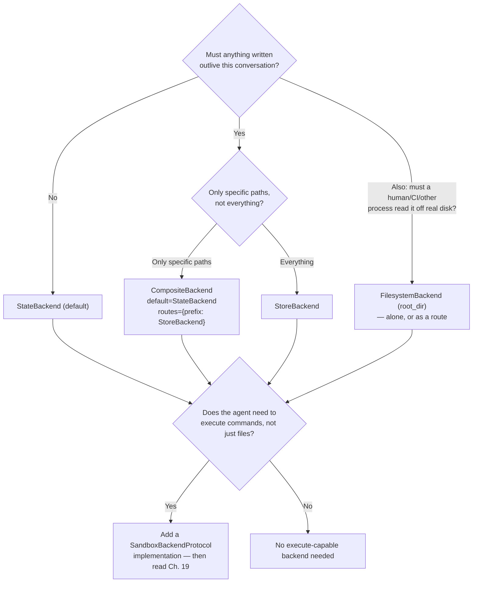
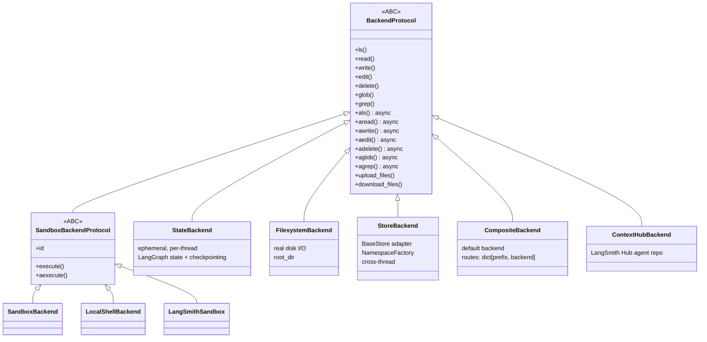
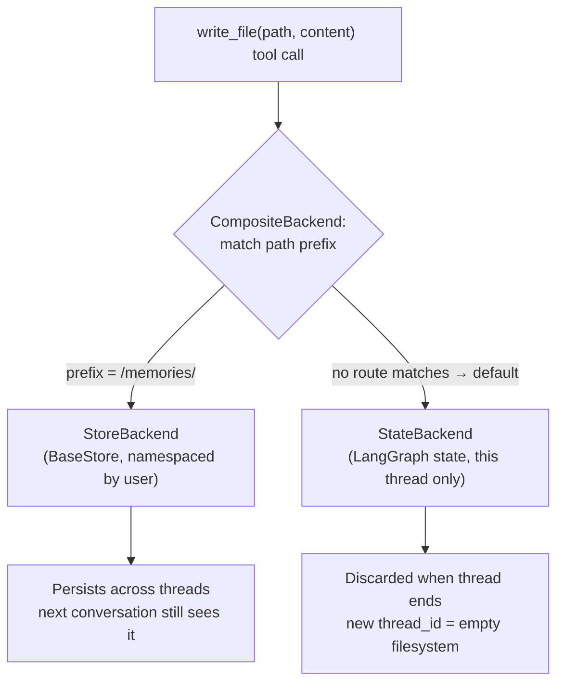

# Backends & Storage Architecture

## Learning Objectives

By the end of this chapter, you will be able to:

- Explain the split between the filesystem **tool surface** (`ls`, `read_file`, `write_file`, `edit_file`, `delete`, `glob`, `grep`, `execute`) and the **backend** that actually implements where those bytes live
- Read and reason about `BackendProtocol` the same way you'd read any storage-abstraction ABC you'd design yourself, including why it ships both sync and async method pairs plus a bulk-transfer surface
- Choose the correct backend — `StateBackend`, `FilesystemBackend`, `StoreBackend`, `CompositeBackend`, or `ContextHubBackend` — for a given persistence requirement, instead of defaulting to whatever `create_deep_agent()` gives you for free
- Wire a `CompositeBackend` that routes specific path prefixes (e.g. `/memories/`) to cross-thread persistent storage while everything else stays ephemeral
- Explain why the `execute` tool errors out of the box, and what `SandboxBackendProtocol` adds to make it work
- Avoid the most common backend-selection mistakes, including assuming `StateBackend` survives a new `thread_id` and inventing backends that don't exist in the source

## Prerequisites for This Chapter

- Chapter 1 (Introduction & Prerequisites) — package layout and installation
- Chapter 2 (Architecture & Internals) — how `create_deep_agent()` assembles its middleware stack, since `FilesystemMiddleware` is where a backend gets wired in
- Chapter 3 (Your First Deep Agent) — the `create_deep_agent()` signature you'll extend here with `backend=`
- Chapter 4 (Planning System & Todos) — not strictly required, but assumed as prior context
- **Chapter 5 (Filesystem-Backed Context) is the direct prerequisite.** That chapter fixed the tool surface — `ls`, `read_file`, `write_file`, `edit_file`, `delete`, `glob`, `grep` — and the token-eviction behavior of working with files instead of raw text in context. This chapter deliberately did not explain where those files actually live. That's what you're here for.

---

## The Interface Ch. 5 Left Unopened

Chapter 5 handed you seven tool names and told you they behave the same regardless of what's underneath them. That claim only holds because of one design decision: DeepAgents separates *the tool contract* from *the storage medium* via an ABC, `BackendProtocol` (`backends/protocol.py`). Every backend in the SDK — the ephemeral one, the disk-backed one, the cross-thread one, the composite router, the LangSmith Hub one — implements the same method surface:

```python
class BackendProtocol(ABC):
    """Pluggable storage for the deep agent filesystem tools."""

    # synchronous
    def ls(self, ...): ...
    def read(self, ...): ...
    def write(self, ...): ...
    def edit(self, ...): ...
    def delete(self, ...): ...
    def glob(self, ...): ...
    def grep(self, ...): ...

    # async counterparts — same contract, awaited
    async def als(self, ...): ...
    async def aread(self, ...): ...
    async def awrite(self, ...): ...
    async def aedit(self, ...): ...
    async def adelete(self, ...): ...
    async def aglob(self, ...): ...
    async def agrep(self, ...): ...

    # bulk transfer across the tool/host boundary
    def upload_files(self, ...): ...
    def download_files(self, ...): ...
```

`FilesystemMiddleware(backend=...)` is the thing that actually binds a concrete backend instance to the `ls`/`read_file`/`write_file`/etc. tool implementations the model calls. The tools never know or care which concrete class is behind them — they call the protocol methods and return whatever comes back. Swap `StateBackend()` for `FilesystemBackend(root_dir="/repo")` and not one line of tool-calling logic changes; only the constructor argument to `create_deep_agent()` does.

If you've ever designed a `StorageBackend` interface at work — one with an S3 implementation for production and a local-disk implementation for tests and local dev, both conforming to the same `get`/`put`/`delete`/`list` contract, plus maybe a batch-upload helper for seeding a bucket — you've already built this exact pattern. `BackendProtocol` is that same move, applied to an LLM agent's working filesystem instead of your application's file storage. The payoff is identical too: you write your agent's tool-calling logic and system prompt once, then decide *where the bytes actually live* as a pure configuration choice, without touching a single tool definition or a single line of prompt.

This is worth sitting with, because it's easy to skim past as boilerplate. The reason DeepAgents can claim "the same filesystem tools work whether you're doing scratch reasoning, building a real repo checkout, or persisting user memory across sessions" is *entirely* because of this interface. There is no special-casing inside the tool implementations for "oh, this is the persistent one, let me do something different." The backend is the only thing that changes.

```python
from deepagents import create_deep_agent
from deepagents.backends.state import StateBackend
from deepagents.backends.filesystem import FilesystemBackend

# Same tools, same prompts, different storage medium — just a constructor argument.
agent_ephemeral = create_deep_agent(model=model, backend=StateBackend())
agent_on_disk = create_deep_agent(model=model, backend=FilesystemBackend(root_dir="/workspace/repo"))
```

Omit `backend=` entirely and you get `StateBackend` — that's the SDK's default, not a null value. `create_deep_agent()`'s relevant surface for this chapter is `create_deep_agent(model, tools=None, *, backend=None, store=None, checkpointer=None, ...)` — always pass `model` explicitly, and note that `store=` and `backend=StoreBackend(...)` are related but distinct levers, covered below.

### Orthogonal to Chapter 5's Concerns, Not a Replacement for Them

It's worth being precise about what changed and what didn't between these two chapters, because they're easy to blur together. Chapter 5 was about *how much* context the agent keeps in the live conversation versus offloaded to a file — the token-eviction behavior of reading a large search result into a file instead of the message list, and reading it back only when needed. That concern is about context-window economics, and it is completely orthogonal to which backend is active: whether a file lives in `StateBackend`'s ephemeral state channel or `StoreBackend`'s durable store, the *reason* the agent chose to write it to a file instead of keeping it inline in the conversation doesn't change at all.

This chapter is about a different axis entirely: *how long the bytes survive, and who else can see them* once they've been offloaded to a file. A file can be token-cheap (Chapter 5's concern) and also completely ephemeral (this chapter's concern) at the same time — that's exactly what `StateBackend` scratch files are. Or a file can be token-cheap and durable across threads — that's a `/memories/`-routed file under `CompositeBackend`. The two chapters compose: Chapter 5 decides *whether* something becomes a file at all; this chapter decides *where that file lives once it exists*. Neither one substitutes for the other, and conflating them is a common source of confusion — "the agent is using files efficiently" (Ch. 5) tells you nothing about whether those files will still be there tomorrow (Ch. 6).

### Why Sync *and* Async Method Pairs

This learner's background is FastAPI and production LangGraph, so the `ls`/`als`, `read`/`aread`, ... pairing needs no LangChain-101 explanation — it's the same rationale as any I/O-bound interface you'd expose to an event loop: a synchronous graph invocation calls the sync methods, an `astream`/`ainvoke` path calls the async ones, and a backend that talks to real disk, a network-backed store, or a remote sandbox needs both so it doesn't block the event loop under concurrent tool calls. What's worth internalizing is that this is a property of the *protocol*, not of any one backend — every concrete implementation is expected to honor both halves, which is exactly what lets you swap `StateBackend` for `StoreBackend` under either an `invoke()` or `ainvoke()` call site without auditing the call path for a sync/async mismatch.

### `upload_files` / `download_files`: Crossing the Tool/Host Boundary

The protocol also defines `upload_files`/`download_files` — a bulk-transfer surface distinct from the per-call `read`/`write` tools. This is the mechanism for getting data *into* the agent's filesystem from outside the conversation (e.g., seeding a coding agent's workspace with an initial repo snapshot before the run starts) and getting data *out* again afterward (e.g., pulling the final set of edited files back to the host process once the agent finishes) — without doing it one `write_file` tool call at a time. Whether this matters to you depends entirely on which backend you picked: it's a natural fit for `FilesystemBackend`-style workflows where "the files" are a real artifact you want to move in bulk, and less relevant for `StateBackend` scratch work you never intend to export.

### `store=` vs. `backend=StoreBackend(...)`: Two Related, Distinct Levers

Because both names contain the word "store," it's easy to conflate two separate configuration points on `create_deep_agent(model, tools=None, *, backend=None, store=None, checkpointer=None, ...)`:

- **`store=`** is the general LangGraph mechanism for wiring a `BaseStore` into the compiled graph at all — the same lever you'd use for any LangGraph application that needs a cross-thread store, independent of DeepAgents entirely. It's what makes `get_store()` resolvable from inside the graph in the first place.
- **`backend=StoreBackend(...)`** (or a `CompositeBackend` route pointing at a `StoreBackend`) is what makes the *filesystem tools specifically* — `write_file`, `read_file`, and friends — read and write through that store, scoped by a `NamespaceFactory`, instead of through `StateBackend`'s ephemeral state channel.

In other words: `store=` answers "does this graph have a durable store available at all," and `backend=StoreBackend(...)` answers "should the agent's *filesystem* use that store." You can have a `store=` configured for other purposes (e.g., a custom middleware that reads/writes store keys directly, outside the filesystem tools) without ever pointing `backend=` at it — and conversely, `StoreBackend` resolving its store via `get_store()`/`get_runtime()` is exactly why the two levers need to agree: a `StoreBackend` with no compatible store reachable through `get_store()` has nothing to resolve.

## The Backends, One Decision at a Time

Rather than treating this as a class-by-class API tour, walk through it the way you'd actually decide during design: *what does this specific agent need to survive, and for how long?*

### `StateBackend` — the default; ephemeral, per-thread, checkpointed

Source: `backends/state.py`. Docstring, verbatim in intent: *"Backend that stores files in agent state (ephemeral). Uses LangGraph's state management and checkpointing. Files persist within a conversation thread but not across threads."*

Mechanically, this is not a toy in-memory dict living off to the side — it is genuinely LangGraph-state-backed. Reads and writes route through LangGraph's `CONFIG_KEY_READ`/`CONFIG_KEY_SEND` config machinery as channel writes into a `files` key in graph state. That means:

- Files written mid-conversation are checkpointed along with the rest of the graph state (assuming you've configured a checkpointer — Chapter 10 covers this) — so within a single `thread_id`, a crash-and-resume will still see the files, in exactly the same way any other piece of graph state survives a resume.
- A **new `thread_id` starts with an empty filesystem**, full stop. There is no cross-thread visibility, no matter how good your checkpointer is or how durable its backing store is, because the files live under that thread's state, not in some shared store the checkpointer happens to also use.
- Nothing about `StateBackend` talks to disk or a network store at all — the "storage medium" is purely LangGraph's own state-channel machinery, which is also why it's the zero-configuration default: there's no external resource to provision.

**When you'd reach for it**: this is correct any time the filesystem is scratch space for *this conversation only* — an agent building up an outline, a set of intermediate search results it doesn't want re-fetched, a working draft it revises across several turns of the same session. It's also simply what you get if you say nothing, so understand it well enough to know when it's wrong — the single most common backend-selection bug in this SDK is expecting `StateBackend` to behave like `StoreBackend` just because the agent "seemed to remember things" during testing (testing that, invariably, never left one `thread_id`).

```python
from deepagents import create_deep_agent

# Explicit for clarity — this is identical to omitting `backend=` entirely.
from deepagents.backends.state import StateBackend

scratch_agent = create_deep_agent(model=model, backend=StateBackend())
```

### `FilesystemBackend` — real disk

Source: `backends/filesystem.py`. Docstring intent: *"Read and write files directly from the filesystem."* This is not an abstraction over disk — it *is* disk I/O, rooted at a `root_dir` you configure, with its own glob/grep timeout handling, because unlike walking a state dict, globbing and grepping a real directory tree can be slow, can hit permission errors, or can hang on a pathological pattern — problems `StateBackend` structurally cannot have.

**When you'd reach for it**: any time a human, a CI pipeline, another process, or a second agent needs to consume the output *outside the conversation* — a coding agent that edits an actual repository checkout so you can run tests and open a diff, a report-generation agent whose Markdown output needs to land in a directory a separate build step picks up, a data-processing agent whose output files a downstream ETL job reads. If "can I `cat` the result after the agent finishes, with no export step" needs to be "yes," this is your backend.

```python
from deepagents.backends.filesystem import FilesystemBackend

coding_agent = create_deep_agent(
    model=model,
    backend=FilesystemBackend(root_dir="/workspace/checked-out-repo"),
)
```

Treat `root_dir` as exactly what it is: a trust boundary. Every `write_file`/`edit_file`/`delete` call the model makes lands on real disk under that root. If that root is a live repo checkout or a shared volume, the same review discipline you'd apply to any automated commit or script-driven file change applies here too — this backend gives an LLM a real, persistent write surface on your host, which is precisely its value and precisely its risk.

### `StoreBackend` — cross-thread, LangGraph `BaseStore`

Source: `backends/store.py`. Docstring intent: *"Adapter for LangGraph's `BaseStore` (persistent, cross-thread)."* It wraps `langgraph.store.base.BaseStore`, resolved via `get_store()`/`get_runtime()` inside the graph, and is configured with a `NamespaceFactory: Callable[[Runtime], tuple[str, ...]]` so you can scope storage — e.g., derive a per-user namespace from whatever's in the request context at runtime, rather than writing every user's files into one shared flat namespace.

This is the backend that actually answers "how do I make files survive into the *next* conversation" — a different `thread_id`, the same user coming back tomorrow, a different user entirely if your namespace factory scopes by tenant instead of by user. Nothing about `StateBackend` or `FilesystemBackend` gets you this on its own; `StateBackend` is thread-scoped by construction, and `FilesystemBackend` is durable but has no per-user/per-thread partitioning built in — you'd be hand-rolling that with directory-naming conventions if you tried to use it for the same job.

```python
from langgraph.store.memory import InMemoryStore
from deepagents.backends.store import StoreBackend

def namespace_by_user(runtime) -> tuple[str, ...]:
    user_id = runtime.context.get("user_id", "anonymous")
    return ("memories", user_id)

memory_backend = StoreBackend(store=InMemoryStore(), namespace=namespace_by_user)
```

> The constructor keyword names shown above (`store=`, `namespace=`) are illustrative of the confirmed contract — a `BaseStore` instance plus a `NamespaceFactory` for scoping — rather than a verbatim signature quoted from the source. Confirm exact kwarg names against your installed `deepagents` version's `backends/store.py` before shipping. What *is* confirmed: `StoreBackend` resolves its store via `get_store()`/`get_runtime()`, and scoping happens through a `NamespaceFactory` callable that receives the `Runtime` and returns a namespace tuple.

`InMemoryStore` is fine for development and for exercises like the one at the end of this chapter; for anything that must actually survive a process restart you need a durable `BaseStore` implementation wired at the graph level (typically via the `store=` argument to `create_deep_agent()` or to the underlying graph compilation, which `StoreBackend` then resolves through `get_store()`). Per the ground truth for this course: Postgres/Redis-backed stores exist at the broader LangGraph ecosystem level, but they are **not confirmed as tested against the `deepagents` repo specifically** — treat that combination as "verify for your specific store backend," not as an assumed-supported path. Don't let a store class merely being importable from `langgraph` convince you it's been exercised against `deepagents`'s `StoreBackend` code path.

### `CompositeBackend` — the practical answer for most production agents

Source: `backends/composite.py`. Docstring intent: *"routes file operations by path prefix... e.g., state for temp files, persistent store for memories."* This is the backend most real deployments actually want, because "everything ephemeral" and "everything persistent" are both wrong answers for a nontrivial agent — you want ephemeral scratch space by default, with a small number of deliberately chosen path prefixes routed to something durable.

```python
from deepagents.backends.state import StateBackend
from deepagents.backends.store import StoreBackend
from deepagents.backends.composite import CompositeBackend
from langgraph.store.memory import InMemoryStore

backend = CompositeBackend(
    default=StateBackend(),
    routes={
        "/memories/": StoreBackend(store=InMemoryStore(), namespace=namespace_by_user),
    },
)

agent = create_deep_agent(model=model, backend=backend)
```

With this wiring, the model's behavior falls out of nothing more than *which path it writes to*:

- `write_file("/tmp/scratch.json", ...)` → no route matches → falls through to `default=StateBackend()` → gone the moment the thread ends
- `write_file("/memories/user_prefs.md", ...)` → matches the `/memories/` route → `StoreBackend` → still there next conversation, next day, next `thread_id`

There is no separate API for "persistent write" vs. "ephemeral write" — the model doesn't call a different tool, and you don't add a `persist=True` kwarg anywhere. The routing is entirely a path-prefix convention that you teach the model through the system prompt (e.g., *"store anything that should be remembered across sessions under `/memories/`"*). This is exactly the mechanism Chapter 7's memory system is built on top of — when you get there, you'll recognize `/memories/` as this same `CompositeBackend` routing table, just with the system prompt and the `MemoryMiddleware` conventions layered on top.

Nothing stops you from adding more routes than one. A single composite backend could plausibly route `/memories/` to a `StoreBackend`, `/repo/` to a `FilesystemBackend` rooted at a real checkout, and leave everything else on the `StateBackend` default — three storage media, one filesystem tool surface, zero prompt-visible complexity beyond "here are the paths that matter."

### `ContextHubBackend` — LangSmith-centric teams

Source: `backends/context_hub.py`. Stores files in a LangSmith Hub agent repo — persistent, but specific to teams already centralizing prompts and context artifacts in LangSmith Hub. If that's not your team's stack, the other four backends cover essentially every case; don't reach for this one just because it exists in the import path.

**When you'd reach for it**: your organization already treats LangSmith Hub as the system of record for prompts, few-shot examples, or shared context artifacts across multiple agents and teams, and you want a deep agent's filesystem to read from and write back to that same system of record instead of standing up a parallel store. Outside of that specific organizational context, prefer `CompositeBackend` over `StoreBackend`/`InMemoryStore` (or a production `BaseStore`) — it gets you the same persistence guarantee without coupling your agent's storage to a LangSmith-specific product surface.

## Sandboxed Execution Backends and Why `execute` Errors by Default

None of the four backends above implement `execute`/`aexecute`. That's the point, not an oversight: `SandboxBackendProtocol` is a separate, stricter protocol that *extends* the base contract with `execute`/`aexecute` plus an `id` property, and only backends that explicitly implement it make the `execute` tool actually work. Attach a plain `StateBackend` or `FilesystemBackend` and call `execute`, and it errors — deliberately, because letting an LLM run arbitrary shell commands is not something the SDK will hand you by accident.

The SDK ships concrete sandboxed/remote implementations for when you *do* want this:

- `backends/sandbox.py` — a general sandbox execution backend
- `backends/local_shell.py` — local shell execution
- `backends/langsmith.py` — `LangSmithSandbox`, a LangSmith-hosted execution environment

Any of these gets you a working `execute` tool for a coding agent that genuinely needs to run tests, install packages, or shell out:

```python
from deepagents.backends.langsmith import LangSmithSandbox

sandboxed_backend = LangSmithSandbox(...)  # execute/aexecute now function
coding_agent = create_deep_agent(model=model, backend=sandboxed_backend)
```

Wiring one up is necessary but not sufficient for safety — Chapter 19 (Security & Governance) covers how to pair sandboxed execution with permissions and human-in-the-loop approval gates so "the agent can run shell commands" doesn't silently become "the agent can run *any* shell command with no oversight." For this chapter, the takeaway is narrower: no execute-capable backend means no working `execute` tool, and that's the SDK protecting you from yourself until you opt in. If you see `execute` fail in a demo, the first question is not "what's broken" but "which backend is this agent using, and does it implement `SandboxBackendProtocol`."

Notice also that `SandboxBackendProtocol` adds an `id` property alongside `execute`/`aexecute`, not just the two methods. That's not incidental: a sandbox is a stateful resource — a running container, a remote session, a shell process — and something in your system needs a stable handle to know which sandbox instance a given `execute` call is running against, so it can be reused across multiple tool calls in one conversation, torn down when the agent finishes, or garbage-collected if it's leaked. When you get to Chapter 18 (Production Deployment), the `id` property is exactly what you'll hook into for sandbox lifecycle management under real concurrent load — you cannot responsibly run a fleet of coding agents against ad hoc, unidentified sandbox processes.

## Design-Time Checklist Before You Pick a Backend

Before wiring `backend=` for a new agent, answer these in order — they map directly onto the backends above:

1. **Does anything written to the filesystem need to outlive this single conversation?** If no, `StateBackend` (the default) is correct and you're done.
2. **If yes, does it need to outlive it for every path the agent writes, or only specific ones?** If every path, a bare `StoreBackend` might suffice; if only specific ones (the common case), you want `CompositeBackend` with `StateBackend` as `default=` and `StoreBackend` on the routes that matter.
3. **Does a human, CI job, or separate process need to read the output directly off disk, with no export step?** If yes, that consumer's needs point at `FilesystemBackend` — either as the whole backend or as another `CompositeBackend` route.
4. **Does the agent need to actually execute code/commands, not just read and write files?** If yes, none of the four storage backends alone will do it — you need a `SandboxBackendProtocol` implementation, and a trip to Chapter 19 before it goes anywhere near production.
5. **Is your team already centralizing prompts/context in LangSmith Hub?** If yes and the use case fits, `ContextHubBackend` is worth evaluating; if you're not already there, it's not worth adopting just for this.
6. **Will this backend need to be swapped or extended later (a new persistent route, a move from disk to a store)?** If the honest answer is "probably," start with `CompositeBackend` even if you only need one route today — adding a second route later is a config change; retrofitting a single-backend agent into a composite one after the fact means revisiting every place that assumed one storage medium.

## Diagram: Backend Selection Decision Flow



## Diagram: `BackendProtocol` and Its Implementations



## Diagram: A `CompositeBackend` Routing Table in Action



## Comparison Table: Backend vs. Persistence vs. Use Case vs. Checkpoint Behavior

| Backend | Persistence Scope | Typical Use Case | Checkpoint Behavior | Configuration Surface |
|---|---|---|---|---|
| `StateBackend` (default) | Ephemeral — survives within one `thread_id` only | Scratch reasoning, working drafts, intermediate search results within a single conversation | Stored as LangGraph state (`files` key); checkpointed with the rest of graph state if a checkpointer is configured — survives crash/resume *within* the thread, not across threads | None — zero-configuration default |
| `FilesystemBackend` | Durable on disk, not thread-scoped at all — governed by whatever `root_dir` you point it at | Coding agents editing a real repo checkout; output a human or CI must consume directly | No LangGraph checkpointing involved — durability is whatever your filesystem/backup story already is | `root_dir`; its own glob/grep timeout handling |
| `StoreBackend` | Persistent, explicitly cross-thread via `BaseStore` + `NamespaceFactory` | Learned user preferences, a knowledge base built up over many sessions, anything that must survive into tomorrow's conversation | Not part of graph-state checkpointing; durability depends entirely on the `BaseStore` implementation (`InMemoryStore` = none across process restarts; a real durable store = yes, but verify per-implementation) | A `BaseStore` (resolved via `get_store()`/`get_runtime()`) plus a `NamespaceFactory` |
| `CompositeBackend` | Mixed — per path prefix | The default choice for most production agents: ephemeral scratch space plus a small number of deliberately persistent path prefixes | Inherits the checkpoint behavior of whichever backend a given path routes to | A `default=` backend plus a `routes={prefix: backend}` mapping |
| `ContextHubBackend` | Persistent, LangSmith Hub-scoped | Teams already centralizing prompts/context in LangSmith Hub | Governed by LangSmith Hub's own storage, not LangGraph checkpointing | LangSmith Hub agent repo configuration |
| Sandbox backends (`SandboxBackendProtocol`) | N/A for file storage — adds `execute`/`aexecute` for command execution | Coding agents that must actually run shell commands/tests | Not a file-persistence concern; see Chapter 19 for safety wiring | Backend-specific (local shell, remote sandbox, LangSmith-hosted) |

## Failure Modes: What Breaks When the Wrong Backend Is Chosen

| Mistake | Symptom in Production | Root Cause |
|---|---|---|
| Using `StateBackend` where cross-thread memory was needed | "The agent keeps forgetting what I told it yesterday" | A new `thread_id` per session means a new, empty `files` state — there was never anywhere for yesterday's write to persist to |
| Using `StoreBackend` (or a `CompositeBackend` route) for everything, including true scratch work | Store namespace fills with disposable intermediate junk; storage costs and lookup times creep up over time | Nothing was ever routed back to `StateBackend`, so short-lived working files are treated as if they need to survive forever |
| `CompositeBackend` route prefixes that don't match what the system prompt teaches the model | A file the user expected to persist (per the prompt's stated convention) silently doesn't, or vice versa | The routing table (code) and the path convention (prompt) drifted apart — they must be kept in lockstep, since the model only knows the convention from the prompt |
| Assuming `FilesystemBackend` output is safe to trust without review | Agent-authored changes land directly in a shared repo/volume with no gate | `FilesystemBackend` performs real disk I/O the moment the tool is called — there's no built-in approval step; that has to come from HITL middleware (Ch. 9) layered on top |
| Assuming `execute` "should just work" once a backend is configured | `execute` tool calls error on every attempt, even though `ls`/`read_file`/`write_file` work fine | The configured backend implements `BackendProtocol` but not `SandboxBackendProtocol` — file operations and command execution are governed by two different protocols |
| Treating an unconfirmed store (e.g., a community Postgres/Redis `BaseStore`) as production-verified for `StoreBackend` | Intermittent cross-thread memory loss or corruption traced back to store-adapter edge cases nobody tested against `deepagents` specifically | The store implementation was verified generically at the LangGraph level, not against `StoreBackend`'s specific `get_store()`/`get_runtime()` resolution path |

## Real-World Scenario

You're building an internal support-triage agent for a helpdesk product. Requirements, translated into backend decisions:

1. **Per-ticket scratch work stays per-ticket.** While triaging a single ticket, the agent pulls in logs, related tickets, and draft responses — none of this should leak into the next ticket's context or persist anywhere once the ticket is resolved. That's `StateBackend` territory, and it's also what you get for free by doing nothing.
2. **Team style guides should improve over time.** The agent learns a per-team "how we usually respond to billing disputes" convention over many tickets, and that should be available on the *next* ticket too, regardless of `thread_id`. That's `StoreBackend`, namespaced by team rather than by individual ticket.
3. **One agent, one prompt, no branching logic.** You don't want two backend instances and two sets of prompts to maintain depending on whether a ticket is "routine" or "style-guide-relevant" — you want one agent whose system prompt says *"scratch notes go anywhere; team style guides go under `/memories/{team}/"*. That's exactly the `CompositeBackend` shown earlier: `StateBackend()` as default, `{"/memories/": StoreBackend(...)}` for the routed prefix, with the namespace factory reading the team ID out of runtime context instead of a user ID:

```python
def namespace_by_team(runtime) -> tuple[str, ...]:
    team_id = runtime.context.get("team_id", "default-team")
    return ("memories", team_id)

triage_backend = CompositeBackend(
    default=StateBackend(),
    routes={"/memories/": StoreBackend(store=production_store, namespace=namespace_by_team)},
)

triage_agent = create_deep_agent(model=model, backend=triage_backend)
```

4. **Reproducing a bug means running code.** Later, product asks for the agent to actually re-run a failing customer script to reproduce a reported bug. That requires `execute`, which means picking a `SandboxBackendProtocol` implementation (e.g., `LangSmithSandbox` or a local sandbox backend) and — per Chapter 19 — putting a human-in-the-loop approval gate in front of it before it goes anywhere near a customer's data or a shared environment.

Notice that steps 1–3 required zero new tool code. The filesystem tool surface from Chapter 5 didn't change at all; only the `backend=` argument to `create_deep_agent()` did, and the namespace factory swapped from "scope by user" to "scope by team" with a one-line change to what it reads out of `runtime.context`.

Wiring this into the FastAPI service you already know how to build looks like ordinary request handling — the backend and its namespace factory are constructed once at startup, and the per-request `team_id` flows in through the LangGraph runtime context you're already passing at invoke time:

```python
from fastapi import FastAPI
from pydantic import BaseModel

app = FastAPI()

# Constructed once — the CompositeBackend instance and its routes don't change per request.
triage_backend = CompositeBackend(
    default=StateBackend(),
    routes={"/memories/": StoreBackend(store=production_store, namespace=namespace_by_team)},
)
triage_agent = create_deep_agent(model=model, backend=triage_backend, checkpointer=checkpointer)

class TriageRequest(BaseModel):
    ticket_id: str
    team_id: str
    message: str

@app.post("/triage")
async def triage(req: TriageRequest):
    config = {
        "configurable": {"thread_id": req.ticket_id},
        "context": {"team_id": req.team_id},
    }
    result = await triage_agent.ainvoke({"messages": [("user", req.message)]}, config=config)
    return {"response": result["messages"][-1].content}
```

Every ticket gets its own `thread_id` (so `StateBackend` scratch state never bleeds between tickets), and every team's `/memories/` route resolves to the same durable namespace regardless of which ticket or `thread_id` triggered it — which is exactly the cross-thread guarantee `StoreBackend` exists to provide.

## Best Practices

- **Default to `CompositeBackend` for anything shipping to production.** Pure `StateBackend` silently loses everything on a new thread; pure `StoreBackend` for everything persists scratch junk you didn't mean to keep forever. Composite lets you be deliberate about both, and lets you add more routes later without redesigning the agent.
- **Teach the path convention in the system prompt, explicitly.** The model only writes to `/memories/...` because you told it to. If your prompt doesn't state the convention — and state it consistently with the actual `routes={}` keys — don't expect the model to guess which paths matter.
- **Namespace `StoreBackend` by something meaningful at runtime** (user ID, team ID, tenant ID) via the `NamespaceFactory` — a flat, unscoped store is a fast path to one user's data leaking into another's context.
- **Treat `FilesystemBackend`'s `root_dir` as a trust boundary.** If the agent can write anywhere under that root, and that root is a real repo or shared volume, apply the same review discipline you'd apply to any automated commit.
- **Don't assume a store implementation is durable just because it's a `BaseStore`.** `InMemoryStore` is explicitly for development — verify what you're actually running in production, and don't assume Postgres/Redis-backed stores have been exercised against `deepagents`'s `StoreBackend` code path just because they exist at the LangGraph level.
- **Never wire an execute-capable backend without also reading Chapter 19 first.** A working `execute` tool with no permission gate is a working arbitrary-command tool.
- **Keep the number of `CompositeBackend` routes small and deliberate.** Each route is a persistence promise you're making to whoever reads the system prompt; a sprawling routing table is a sign the design needs simplifying, not a sign of thoroughness.
- **Exercise both the sync and async method pairs in your test suite if your service calls the agent both ways.** A backend that's only ever been driven through `ainvoke()` in production but only tested through `invoke()` in CI has an entire untested half of `BackendProtocol` — Chapter 17 (Testing & Evaluation) covers this in more depth for the SDK generally.
- **Pick the backend before you pick the checkpointer, not after.** Checkpointing behavior for `StateBackend` is a consequence of your checkpointer choice (Chapter 10); it is not a substitute for choosing `StoreBackend`/`CompositeBackend` when cross-thread persistence is the actual requirement.

## Common Mistakes

- **Assuming `StateBackend` persists across threads.** It doesn't, by design — a new `thread_id` is an empty filesystem, checkpointer or not. If you need cross-thread survival, that's a `StoreBackend` (directly or via `CompositeBackend` routing), not a "more aggressive" checkpointer configuration. This is the single most common source of "the agent forgot everything" bug reports.
- **Assuming `execute` works out of the box.** No default backend implements `SandboxBackendProtocol`. If `execute` errors, that's the SDK's safety default working as intended — it means you haven't opted into a sandbox backend, not that something is broken.
- **Inventing a "Composio backend."** There is no such backend in the `deepagents` source. If you've seen this claimed somewhere, it's not something this course's ground truth can confirm — don't design around it, and don't let a blog post or forum comment override what's actually in `libs/deepagents/deepagents/backends/`.
- **Treating `CompositeBackend` routes as an afterthought instead of a documented contract.** If the system prompt and the actual `routes={}` dict drift apart (e.g., the prompt says `/knowledge/` but the code routes `/memories/`), the model will write persistent-looking paths that actually land in ephemeral state, and you'll only notice when a "remembered" fact vanishes on the next thread.
- **Assuming any `BaseStore` you can import is production-ready for `StoreBackend`.** The confirmed, tested path is at the LangGraph level generically; specific backing stores beyond `InMemoryStore` need their own verification against your actual deployment before you rely on them for cross-thread agent memory.
- **Citing `deepagentsdk.dev` as a source.** It is not the official documentation for this package; use `docs.langchain.com/oss/python/deepagents` and the `langchain-ai/deepagents` GitHub repository instead.
- **Reaching for `ContextHubBackend` or a custom exotic backend before the four common ones fit your case.** Most requirements are fully covered by `StateBackend`, `FilesystemBackend`, `StoreBackend`, and `CompositeBackend` combined; reach for `ContextHubBackend` only when your team's context already lives in LangSmith Hub, and write a custom `BackendProtocol` implementation only when none of the shipped ones can be composed to fit.

## Migrating Between Backends Later

Backend choice is not permanent, but it is not free to change either, and this learner's production instincts around swapping storage backends behind an interface apply directly here. Two migrations come up in practice:

- **`StateBackend` → `CompositeBackend` with a `StoreBackend` route.** This is the common trajectory: an agent starts as pure scratch-space (`StateBackend`, the default) and later needs a persistent slice once memory requirements show up (Chapter 7). Because `BackendProtocol` is the same contract either way, the *tool surface and prompt structure don't change* — but anything already written under `StateBackend` for existing threads does **not** retroactively move to the new `StoreBackend` route. Existing in-flight threads keep whatever they already had in state; only paths written *after* the `CompositeBackend` routing is deployed land in the persistent store. If you need historical data carried forward, that's a one-time backfill you write yourself, not something the backend swap does for you.
- **`FilesystemBackend` → `StoreBackend`/`CompositeBackend`, or vice versa.** Moving from real disk to a `BaseStore` (or back) means the bytes physically live in a different medium — there's no shared substrate between "files under `root_dir`" and "records in a `BaseStore` namespace." Any migration here is an explicit ETL step: read everything out of the old backend via `ls`/`read` (or `download_files`), write it into the new backend via `write` (or `upload_files`), and only then cut the agent over.

The practical rule: swapping `backend=` is safe and cheap for *new* data going forward, precisely because of the shared protocol; it is never free for *existing* data, because the whole point of having multiple backend implementations is that they store bytes in genuinely different places.

## Testing Backends in Isolation

Chapter 17 (Testing & Evaluation) covers testing DeepAgents more broadly, but backend choice has a specific testing implication worth flagging here: because `BackendProtocol` is a clean interface, each backend is independently testable without ever invoking a model. You can drive a backend's `read`/`write`/`edit`/`delete`/`glob`/`grep` methods directly in a unit test, exactly as you'd unit-test any storage adapter:

```python
import pytest
from deepagents.backends.filesystem import FilesystemBackend

def test_filesystem_backend_write_then_read(tmp_path):
    backend = FilesystemBackend(root_dir=str(tmp_path))
    backend.write("/notes.md", "hello from a test")
    assert backend.read("/notes.md") == "hello from a test"

def test_filesystem_backend_glob(tmp_path):
    backend = FilesystemBackend(root_dir=str(tmp_path))
    backend.write("/a/one.py", "# one")
    backend.write("/a/two.py", "# two")
    matches = backend.glob("/a/*.py")
    assert len(matches) == 2
```

For `StoreBackend`, `InMemoryStore` makes this equally cheap — you don't need a real Postgres/Redis instance to verify namespace-scoping logic, only to verify it's the *same* namespace factory you intend to run in production:

```python
from langgraph.store.memory import InMemoryStore
from deepagents.backends.store import StoreBackend

def test_store_backend_namespace_isolation():
    store = InMemoryStore()

    def ns_for(fake_user_id):
        return lambda runtime: ("memories", fake_user_id)

    backend_u1 = StoreBackend(store=store, namespace=ns_for("u1"))
    backend_u2 = StoreBackend(store=store, namespace=ns_for("u2"))

    backend_u1.write("/memories/notes.md", "u1's note")
    with pytest.raises(FileNotFoundError):
        backend_u2.read("/memories/notes.md")
```

The point of testing at this level is that a namespace-isolation bug, or a routing-table/system-prompt drift bug, is far cheaper to catch with a direct backend-level unit test than by driving a full model round-trip and hoping the agent happens to exercise the right path. Reserve the full agent-level test (model + prompt + tools + backend together) for confirming the model actually *uses* the path convention correctly — that's a distinct concern from confirming the backend *honors* the convention once a path is given to it.

## Where This Fits Next

The pattern this chapter keeps returning to — `CompositeBackend` with an ephemeral default and a `/memories/`-style persistent route — is not a side example. It is the load-bearing mechanism for Chapter 7 (Memory & Persistence), where `MemoryMiddleware` and the SDK's memory conventions are built directly on top of exactly this routing behavior, with the system prompt teaching the model the same path convention shown here. Similarly, the `SandboxBackendProtocol` gap this chapter deliberately leaves open is closed properly in Chapter 19 (Security & Governance), once you have the human-in-the-loop machinery from Chapter 9 to gate it safely. If you take one thing forward from this chapter, make it this: **backend choice is a persistence-and-trust decision, made once at construction time, that every other chapter in this course either depends on or has to work around.**

## Quick Reference: Source Files

When you go to the source (which the fact sheet backing this course explicitly recommends over trusting any paraphrase, including this one), this is where each piece lives inside `libs/deepagents/deepagents/`:

| Concern | File | What to look for |
|---|---|---|
| The interface itself | `backends/protocol.py` | `BackendProtocol` ABC — the full method list this chapter is built around |
| Default ephemeral backend | `backends/state.py` | `StateBackend` — the `CONFIG_KEY_READ`/`CONFIG_KEY_SEND` channel-write mechanics |
| Real disk backend | `backends/filesystem.py` | `FilesystemBackend` — `root_dir`, glob/grep timeout handling |
| Cross-thread backend | `backends/store.py` | `StoreBackend` — `get_store()`/`get_runtime()` resolution, `NamespaceFactory` |
| Path-prefix router | `backends/composite.py` | `CompositeBackend` — `default=`/`routes=` dispatch logic |
| LangSmith Hub backend | `backends/context_hub.py` | `ContextHubBackend` |
| Sandbox protocol | `backends/protocol.py` (or a dedicated sandbox module, depending on version) | `SandboxBackendProtocol` — `execute`/`aexecute`/`id` |
| Generic sandbox execution | `backends/sandbox.py` | A general sandbox execution backend implementation |
| Local shell execution | `backends/local_shell.py` | Local shell-based `execute` implementation |
| LangSmith-hosted execution | `backends/langsmith.py` | `LangSmithSandbox` |
| Where a backend gets wired to tools | `middleware` layer (see Ch. 2) | `FilesystemMiddleware(backend=...)` |

## Summary

`BackendProtocol` is the single ABC that lets every filesystem tool from Chapter 5 stay identical while the actual storage medium changes underneath it — exactly the interface/implementation split you'd design for swapping S3 and local disk behind one class, complete with paired sync/async methods and a bulk `upload_files`/`download_files` surface for crossing the tool/host boundary in bulk. `StateBackend` is the default: ephemeral, checkpointed within a thread, gone on a new `thread_id`. `FilesystemBackend` puts files on real disk for agents whose output must be consumed outside the conversation, rooted at a `root_dir` you should treat as a trust boundary. `StoreBackend` wraps a LangGraph `BaseStore` for genuine cross-thread persistence, scoped by a `NamespaceFactory`. `CompositeBackend` routes by path prefix and is the practical default for production agents — ephemeral scratch space plus a handful of deliberately persistent prefixes like `/memories/`, a pattern Chapter 7 builds directly on. `ContextHubBackend` serves LangSmith Hub-centric teams. `execute` only works when the active backend implements `SandboxBackendProtocol` — a deliberate default-off safety posture, not a gap to route around casually, and one that Chapter 19 shows how to pair with real permission gates.

## Knowledge Check

1. What does `BackendProtocol` define, and why does it let the filesystem tools stay identical across every backend? Why does the protocol define both sync and async method pairs?
2. If an agent writes a file mid-conversation using `StateBackend`, then the process restarts and resumes the same `thread_id` from a checkpoint, does the file survive? What if it's a *new* `thread_id`?
3. You need an agent to edit files in an actual git checkout so a separate CI job can run tests against the result. Which backend, and why not `StateBackend`?
4. Design a `CompositeBackend` for an agent that should keep per-user notes under `/notes/` permanently, but treat everything else as disposable. What goes in `default=` and what goes in `routes={}`?
5. An agent calls the `execute` tool and gets an error even though the agent otherwise works fine. What's the most likely cause, and is it a bug?
6. Why is asserting "there's a Composio backend in deepagents" a mistake, and what should you do instead if someone on your team makes that claim in a design review?

<details>
<summary>Answer notes (expand after attempting the questions yourself)</summary>

1. `BackendProtocol` defines `ls/read/write/edit/delete/glob/grep` in both sync and async form, plus `upload_files`/`download_files`. The tools stay identical because they call these protocol methods, never a concrete class directly — swap the backend, and the tool implementations don't change at all. Sync/async pairs exist so the same backend works correctly whether the agent is driven through a synchronous `invoke()` or an `ainvoke()`/`astream()` call path without blocking the event loop.
2. It survives the crash/resume within the *same* `thread_id`, because `StateBackend` files are LangGraph state, checkpointed like any other state. A *new* `thread_id` starts with an empty filesystem — `StateBackend` has no cross-thread storage at all, regardless of checkpointer durability.
3. `FilesystemBackend`, rooted at the checkout's path via `root_dir`. `StateBackend` is wrong because its files live only in LangGraph state for one thread — a separate CI process has no way to read graph state directly off "disk," because there is no disk involved.
4. `default=StateBackend()` for everything else (disposable), `routes={"/notes/": StoreBackend(store=..., namespace=...)}` for the persistent prefix — namespaced per user so one user's `/notes/` doesn't leak into another's.
5. Most likely cause: the active backend does not implement `SandboxBackendProtocol` (e.g., it's a `StateBackend` or `FilesystemBackend`). Not a bug — no backend implements `execute` by default, precisely so arbitrary command execution requires an explicit opt-in.
6. There is no "Composio backend" anywhere in the `deepagents` source (`libs/deepagents/deepagents/backends/`). The right move in a design review is to check the actual source/GitHub repository rather than a secondary blog post or marketing page, and to note that `deepagentsdk.dev` in particular is not the official docs and shouldn't be treated as authoritative.

</details>

## Hands-On Exercise

Build and verify cross-thread routing behavior with a `CompositeBackend`:

1. Construct a backend with `StateBackend()` as the default and `{"/memories/": StoreBackend(store=InMemoryStore(), namespace=<your NamespaceFactory>)}` as the only route:

```python
from langgraph.store.memory import InMemoryStore
from deepagents import create_deep_agent
from deepagents.backends.state import StateBackend
from deepagents.backends.store import StoreBackend
from deepagents.backends.composite import CompositeBackend

def namespace_by_user(runtime) -> tuple[str, ...]:
    return ("memories", runtime.context.get("user_id", "anonymous"))

backend = CompositeBackend(
    default=StateBackend(),
    routes={"/memories/": StoreBackend(store=InMemoryStore(), namespace=namespace_by_user)},
)

system_prompt = (
    "Scratch work goes under /tmp/. Anything that should be remembered for "
    "future conversations goes under /memories/."
)

agent = create_deep_agent(model=model, backend=backend, system_prompt=system_prompt)
```

2. In thread A (`thread_id="thread-a"`), have the agent write two files: one under `/tmp/scratch.json` and one under `/memories/user_prefs.md`:

```python
config_a = {"configurable": {"thread_id": "thread-a"}, "context": {"user_id": "u1"}}
agent.invoke(
    {"messages": [("user", "Write /tmp/scratch.json with {\"note\": \"scratch\"} "
                            "and /memories/user_prefs.md with 'prefers concise answers'.")]},
    config=config_a,
)
```

3. Start a fresh conversation in thread B (`thread_id="thread-b"`, same `user_id`) and ask the agent to `ls` the filesystem, then `read_file("/memories/user_prefs.md")` and attempt `read_file("/tmp/scratch.json")`:

```python
config_b = {"configurable": {"thread_id": "thread-b"}, "context": {"user_id": "u1"}}
agent.invoke({"messages": [("user", "ls the filesystem, then read /memories/user_prefs.md "
                                     "and try to read /tmp/scratch.json.")]}, config=config_b)
```

4. Confirm the expected result: `/memories/user_prefs.md` is readable and unchanged in thread B (`"prefers concise answers"`); `/tmp/scratch.json` does not exist in thread B and the `ls`/`read_file` call reports it missing, because a fresh `StateBackend`-backed thread starts empty — only the `/memories/` route survived because it was routed to `StoreBackend`, not `StateBackend`.
5. As a stretch, swap the `NamespaceFactory` to scope by a fake `user_id` from `runtime.context`, run the same test as two different simulated users, and confirm neither sees the other's `/memories/` content — this is the isolation guarantee Chapter 7's memory system depends on.
6. As a second stretch, add a `FilesystemBackend(root_dir=...)` route for a third prefix (e.g., `/export/`) and confirm that files written there show up as real files on disk after the run — proof that a single `CompositeBackend` can genuinely mix three different storage media behind one unchanged tool surface.

## Further Reading

- [DeepAgents Overview (LangChain Docs)](https://docs.langchain.com/oss/python/deepagents/overview)
- [`langchain-ai/deepagents` GitHub repository](https://github.com/langchain-ai/deepagents) — read `libs/deepagents/deepagents/backends/*.py` directly for the exact `BackendProtocol`, `StateBackend`, `FilesystemBackend`, `StoreBackend`, `CompositeBackend`, `ContextHubBackend`, and sandbox implementations referenced in this chapter

<div style="display:flex;justify-content:space-between;align-items:center;">
  <a href="./05-filesystem-backed-context.md">← Previous: Filesystem-Backed Context</a>
  <a href="./00-index.md">🏠 Index</a>
  <a href="./07-memory-and-persistence.md">Next: Memory & Persistence →</a>
</div>
