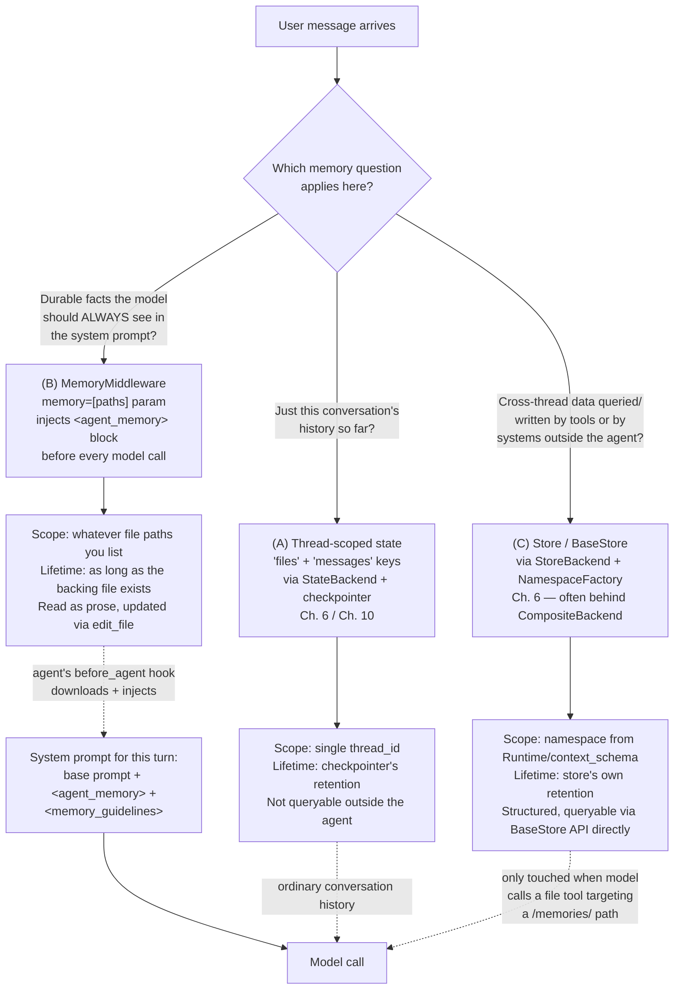
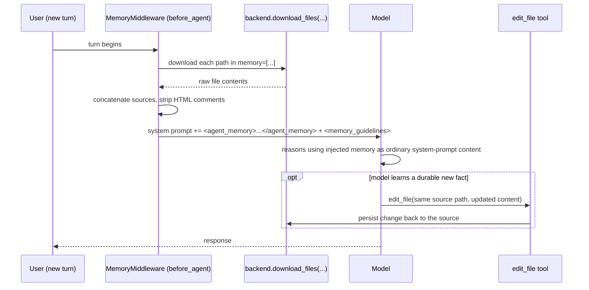

# Memory & Persistence

> The single most common point of confusion in the DeepAgents ecosystem is not a hard technical concept — it's a naming collision. Get the SDK-vs-CLI distinction settled before a single line of code, or everything that follows will be built on the wrong mental model.

## Learning Objectives

By the end of this chapter, you will be able to:

- State, without hedging, why `MemoryMiddleware` (the SDK mechanism this chapter teaches) and `deepagents-code`'s `AGENTS.md`/`memories/*.md` convention (a CLI product feature) are not the same thing, and why one is built on top of the other
- Choose correctly between three distinct memory mechanisms — thread-scoped state, `MemoryMiddleware`-injected system-prompt content, and `Store`/`StoreBackend`-backed cross-thread storage — for a given requirement
- Explain `MemoryMiddleware`'s exact mechanics: the `before_agent` hook, `download_files`, concatenation, HTML-comment stripping, the `<agent_memory>`/`<memory_guidelines>` injection template, and how the model is expected to persist new facts
- Wire `memory=[...]` correctly with a `FilesystemBackend`, and explain what `add_cache_control=True` actually does and why it matters for a Bedrock/Anthropic production cost profile
- Build a per-user "Personal Assistant" whose preferences survive across conversations, in both a simple prompt-injected form and a more production-realistic `CompositeBackend` + `StoreBackend` form, and articulate the tradeoff between the two
- Recite the `MemoryMiddleware` security warning verbatim and connect it to concrete mitigations covered later in the course

---

## Prerequisites for This Chapter

This chapter assumes you've completed Chapters 1–6 and, in particular, that Chapter 6's backend vocabulary is fresh:

- **Chapter 2 (Architecture & Internals)**: the middleware assembly order inside `create_deep_agent()`, and that `MemoryMiddleware` is present only when `memory=[...]` is passed.
- **Chapter 5 (Filesystem-Backed Context)**: the `ls`/`read_file`/`write_file`/`edit_file`/`glob`/`grep` tool surface — `MemoryMiddleware` leans on the ordinary `edit_file` tool for persistence, it does not add a new one.
- **Chapter 6 (Backends & Storage Architecture)**: `StateBackend`, `FilesystemBackend`, `StoreBackend`, `CompositeBackend`, and `NamespaceFactory`. This chapter uses all four without re-explaining them.
- **LangGraph background (assumed from your prior experience)**: `BaseStore`/`InMemoryStore`, `Runtime`, `context_schema`, and the general LangGraph `Store` API for cross-thread persistence.

If any of Chapter 6's backend classes are hazy, re-read it before continuing — this chapter is essentially "what you can build with those backends when the goal is memory specifically."

---

## 1. SDK vs. CLI — Settle This First

Before any code: the `deepagents` SDK (`create_deep_agent()`, the subject of this entire course) and `deepagents-code`/`dcode` (a separate, Claude-Code-style terminal coding agent *built on top of* the SDK) implement memory very differently, and public documentation routinely blurs the line between them. The docs page `docs.langchain.com/oss/python/deepagents/code/memory-and-skills` documents **`deepagents-code`, the CLI product** — its `~/.deepagents/<agent_name>/AGENTS.md` file, its `~/.deepagents/<agent_name>/memories/*.md` directory, and its `/skill:<name>` slash commands are all product conventions of that terminal application. None of that is `create_deep_agent()` API surface. If you cite that docs page while writing SDK code, you will look for parameters that don't exist.

| | SDK (`deepagents`, THIS course) | `deepagents-code` CLI (`dcode`) |
|---|---|---|
| **Mechanism** | `MemoryMiddleware` + `memory=[paths]` param on `create_deep_agent` | A product convention built on top of the SDK's own `MemoryMiddleware` |
| **File location** | Any path(s) you choose, resolved via your configured `backend` | Fixed: `~/.deepagents/<agent_name>/AGENTS.md`, `~/.deepagents/<agent_name>/memories/*.md` |
| **How it's invoked** | You write the Python that passes `memory=[...]` | Automatic, baked into the CLI's fixed research/response/learning workflow |
| **Skills** | Separate `skills=` param + `SkillsMiddleware`, `SKILL.md` files, progressive disclosure (Chapter 14) | `/skill:<name>` slash commands in the terminal UI |

The relationship is layered, exactly like Chapter 1's SDK/CLI/product framing: `deepagents-code` is one specific application that happens to call `create_deep_agent(memory=[...])` internally, with a fixed file-naming scheme and a fixed set of file paths baked into the product. Understanding `MemoryMiddleware` — the actual subject of this chapter — is precisely what lets you build your own version of `deepagents-code`'s memory behavior, with your own file locations, your own naming conventions, and your own backend choice, inside your own product. You are never obligated to reproduce `~/.deepagents/<agent_name>/AGENTS.md` specifically; that path is a CLI implementation detail, not a spec.

One more reminder from Chapter 1 worth repeating here because memory discussions are exactly where it resurfaces: **`deepagentsdk.dev` is not an official LangChain domain.** Nothing in this chapter cites it, and neither should your own research — cross-check anything from an unofficial source against `github.com/langchain-ai/deepagents` or `docs.langchain.com` directly.

---

## 2. Three Memory Mechanisms, One Decision Framework

"Memory" in a deep agent actually refers to three unrelated mechanisms that happen to share a common-sense English word. Conflating them is the second most common mistake in this space (right behind the SDK/CLI confusion above). Ask these three questions, in order, about whatever you're trying to build:

**(A) "Does the agent just need to remember what's already happened in this conversation?"** That's ordinary LangGraph checkpointed state — the `files` key (via `StateBackend`, Chapter 6) and the `messages` key, both scoped to a `thread_id` and persisted by whatever checkpointer you configured (Chapter 10). There is nothing DeepAgents-specific here at all: it's exactly the checkpointing behavior you already know from LangGraph, and it is **not** cross-thread and **not** cross-user. Close one thread, open a new one, and none of it is visible unless you explicitly carry it over yourself.

**(B) "Does the agent need durable instructions or preferences injected into every system prompt, regardless of which thread it's in?"** That's `MemoryMiddleware` — Section 3 below, the main subject of this chapter. It's about content living inside the system prompt, not about a tool-callable store. The model sees it on every turn without asking for it.

**(C) "Does something outside the agent (a dashboard, another service, a different agent) need to query or write this data too, across threads and users, without going through system-prompt injection at all?"** That's LangGraph's `Store`/`BaseStore`, wired through DeepAgents' own `StoreBackend` (Chapter 6) so that file-tool operations (`read_file`/`write_file`/etc.) target the store instead of ephemeral state. This is genuinely queryable, structured, cross-thread storage — not prompt content.



None of these three replace each other — a production agent commonly uses all three at once: (A) automatically via the checkpointer, (B) for lightweight always-visible preferences, (C) for anything you also want to inspect, edit, or query from outside the agent entirely (an admin dashboard, an analytics job, a different service).

### 2.1 "Why not just hardcode preferences into `system_prompt`?"

A reasonable first instinct is to skip all of this and just f-string a user's preferences into the `system_prompt=` argument at agent-construction time. That works until you notice what it costs you compared to (B): the `system_prompt` string is fixed at construction time, so updating a preference means rebuilding the agent (or at least re-deriving the prompt string) rather than the model simply calling `edit_file`; there's no built-in stripping of authoring comments; and you've reinvented, badly, exactly the "bespoke read-a-file-into-the-prompt convention" Chapter 1 called out as the tax `MemoryMiddleware` exists to remove. `memory=[...]` gives you the same net effect — content injected ahead of the model call — but with a standard update path (`edit_file`), a standard injection template (`<agent_memory>`/`<memory_guidelines>`), and a standard caching hook (`add_cache_control`) you'd otherwise have to build yourself.

### 2.2 Memory injection vs. message-history summarization

It's worth being precise about what `MemoryMiddleware` does *not* touch: it operates on the **system prompt**, at the `before_agent` hook, independently of whatever `SummarizationMiddleware` (Chapter 14) does to the **message history**. Summarization compacts old turns in `state["messages"]` when the conversation grows long; `MemoryMiddleware` re-downloads and re-injects the `<agent_memory>` block fresh on every turn regardless of how much (or how little) message-history compaction has happened. The two are orthogonal concerns that happen to both be about "managing what the model sees" — don't assume tuning one affects the other.

---

## 3. `MemoryMiddleware` — Mechanics, Precisely

`MemoryMiddleware` (source: `middleware/memory.py` in the `deepagents` repo) is the SDK's mechanism for durable, **system-prompt-level** content — instructions or preferences the agent should see on every single turn without having to ask for them via a tool call. It is present in the middleware stack only when you pass `memory=[...]` to `create_deep_agent()` (Chapter 2's assembly diagram marks it as conditional for exactly this reason).

### 3.1 What `memory=[...]` actually is

It's a list of **file paths** — not directory names, not a boolean feature flag, not a store namespace. Each entry is a path resolved through whatever `backend` you configured (Chapter 6):

```python
from deepagents import create_deep_agent
from deepagents.backends import FilesystemBackend

agent = create_deep_agent(
    model="anthropic:claude-sonnet-4-6",
    memory=["./agent_memory/AGENTS.md"],
    backend=FilesystemBackend(root_dir="./agent_memory"),
)
```

Nothing stops you from listing more than one source — later sources are appended after earlier ones, so ordering is meaningful if you're layering, say, a team-wide conventions file ahead of a per-user preferences file:

```python
agent = create_deep_agent(
    model="anthropic:claude-sonnet-4-6",
    memory=[
        "./agent_memory/team-conventions.md",
        "./agent_memory/user-preferences.md",
    ],
    backend=FilesystemBackend(root_dir="./agent_memory"),
)
```

### 3.2 The `before_agent` lifecycle hook

`MemoryMiddleware` does its work at the `before_agent` middleware lifecycle hook — before the model is called at all, on every turn:

1. **Download.** For each path in `memory=[...]`, it calls the active `backend`'s `download_files(...)`. This is why the backend matters here at all: a `FilesystemBackend` reads real files off disk (or wherever its `root_dir` points), while other backends (Chapter 6) resolve the same call differently.
2. **Concatenate.** The content of all downloaded sources is joined together into `state["memory_contents"]`, later sources appended after earlier ones — the ordering from Section 3.1 is exactly this concatenation order.
3. **Strip HTML comments.** Any `<!-- ... -->` blocks in the source files are stripped out before injection — a convenient place to leave yourself authoring notes in the memory file that the model never sees.
4. **Inject into the system prompt** inside a fixed template: an `<agent_memory>...</agent_memory>` block wrapping the concatenated content, plus a `<memory_guidelines>` block (the `MEMORY_SYSTEM_PROMPT` constant) instructing the model how to use and update it.
5. **Guidelines direct the model to persist new facts via `edit_file`.** This is the detail that surprises people coming from other "AI memory" products: **there is no dedicated `save_memory` tool.** The guidelines explicitly tell the model that when it learns something durable — a stated preference, a correction, a fact worth remembering next time — it should call the ordinary `edit_file` tool (Chapter 5) on the same source path that was loaded into `memory=[...]`. Persistence is entirely a convention layered on top of the filesystem tools you already have, not a new API surface.



### 3.3 `add_cache_control` — tie this to your prompt-caching instincts

`MemoryMiddleware` accepts `add_cache_control=True`, which tags the injected memory content block with an Anthropic `cache_control: {"type": "ephemeral"}` breakpoint:

```python
from deepagents import create_deep_agent
from deepagents.backends import FilesystemBackend

agent = create_deep_agent(
    model="anthropic:claude-sonnet-4-6",
    memory=["./agent_memory/AGENTS.md"],
    backend=FilesystemBackend(root_dir="./agent_memory"),
    add_cache_control=True,
)
```

This is directly relevant to the prompt-caching economics you already reason about on Bedrock/Anthropic in production: the exact same memory block gets re-injected into the system prompt on **every turn**, for **every thread**, for **every user** sharing that memory source. That's precisely the shape of content Anthropic's prompt caching exists to make cheap — stable, repeated, prefix-position content. Without `add_cache_control=True`, you're paying full input-token price for that block on every single request; with it, repeated calls within the cache TTL hit a cached read instead. Chapter 18 (Production Deployment) returns to this as part of a broader cost-optimization discussion — file this away now as the specific, concrete case where it applies.

### 3.4 Security warning — repeat this, don't paraphrase it away

The `MemoryMiddleware` module's own docstring carries a warning that deserves to be quoted verbatim, not softened, because `memory=[...]` combined with a `FilesystemBackend` means the agent is reading and writing real files on a real filesystem:

> **"FilesystemBackend allows reading/writing from the entire filesystem. Either ensure the agent is running within a sandbox OR add human-in-the-loop (HIL) approval to file operations."**

Concretely: if the backend behind your `memory=[...]` paths is a `FilesystemBackend`, the same `edit_file`/`write_file`/`read_file` tools that persist memory can, absent other controls, touch anything else on that filesystem the process has permissions for — not just the memory file you intended. This chapter doesn't implement the mitigation (that's Chapter 9's human-in-the-loop machinery and Chapter 19's sandboxing/security treatment in full), but it must be said here, explicitly, every time `FilesystemBackend` is used for memory: either run the agent inside a sandbox, or gate file operations behind HIL approval (`interrupt_on`, Chapter 9). Don't let "it's just a memory file" reasoning talk you out of this — the tool has no narrower permission than "the whole filesystem," regardless of which path you intended it to stay within.

### 3.5 Inspecting the injected system prompt directly

Because `MemoryMiddleware`'s output is, ultimately, just system-prompt text handed to the model, the most reliable way to verify it's working — and the technique the Hands-On Exercise asks you to use — is to inspect the literal request sent to the model provider rather than trust the model's *answer* to imply the memory was present. Two practical options, both of which you likely already use for debugging LangChain agents:

```python
import logging

# Most LangChain chat model integrations will emit the fully-assembled
# request (including the system prompt) at DEBUG level via httpx/boto3
# logging — enable it narrowly rather than globally to avoid noise:
logging.getLogger("httpx").setLevel(logging.DEBUG)
```

or, more directly, invoke the agent with `stream_mode="debug"` (standard LangGraph, unchanged by DeepAgents per Chapter 1) and inspect the assembled messages passed into the model node before the call — the `<agent_memory>` and `<memory_guidelines>` blocks should be visible verbatim inside whatever the system prompt resolves to for that turn. If they're not there, the fault is almost always one of: the `backend` you passed can't resolve the path in `memory=[...]` (wrong `root_dir`, wrong route on a `CompositeBackend`), or the memory middleware simply isn't in the stack because `memory=` was never passed (Chapter 2's conditional-assembly point resurfaces here directly).

---

## 4. Project: The Personal Assistant

The goal: an agent that remembers a user's favorite programming language, coding-style preferences, timezone, and general preferences **across separate conversations** — not just within one thread. Two implementations follow, in increasing order of production-readiness, so the tradeoff between them is concrete rather than abstract.

### 4.1 Version 1 — `memory=[...]` + `FilesystemBackend`, one file per user

The simplest version: a per-user file on disk, loaded via `memory=[...]`, with a `FilesystemBackend` rooted at a per-user directory.

```python
from pathlib import Path
from deepagents import create_deep_agent
from deepagents.backends import FilesystemBackend


def build_personal_assistant(user_id: str):
    user_root = Path(f"./user_data/{user_id}")
    user_root.mkdir(parents=True, exist_ok=True)

    memory_path = user_root / "preferences.md"
    if not memory_path.exists():
        memory_path.write_text(
            "# User Preferences\n\n"
            "(No preferences recorded yet — the agent should ask and then "
            "update this file via edit_file as it learns them.)\n"
        )

    return create_deep_agent(
        model="anthropic:claude-sonnet-4-6",
        system_prompt=(
            "You are a personal coding assistant. Use the injected "
            "<agent_memory> content to recall this user's favorite "
            "programming language, coding-style preferences, timezone, "
            "and general preferences across conversations."
        ),
        memory=[str(memory_path)],
        backend=FilesystemBackend(root_dir=str(user_root)),
        add_cache_control=True,
    )
```

First conversation:

```python
agent = build_personal_assistant(user_id="akash")
agent.invoke({
    "messages": [{
        "role": "user",
        "content": (
            "I prefer Python with type hints everywhere, 4-space "
            "indentation, and I'm in IST (UTC+5:30). Remember this."
        ),
    }],
    "thread_id": "conversation-1",
})
```

Given the `<memory_guidelines>` instructions, the model is expected to call `edit_file` on `./user_data/akash/preferences.md`, writing the stated preferences into it. A brand-new thread later — a different `thread_id`, no shared checkpointer state at all — still sees those preferences, because `MemoryMiddleware` re-reads and re-injects that same file on every turn, regardless of thread:

```python
agent.invoke({
    "messages": [{"role": "user", "content": "Write me a quick function."}],
    "thread_id": "conversation-2",   # a genuinely new thread
})
```

The model's system prompt on this second, unrelated thread already contains the `<agent_memory>` block with the IST/Python/4-space preferences from conversation 1 — that's mechanism (B) from Section 2 working exactly as designed: durable, but purely prompt-injected.

### 4.2 Version 2 — `CompositeBackend` routing `/memories/` to a `StoreBackend`

Version 1 works, but the preference data lives only as prose inside a system prompt — nothing outside the agent can query "what's this user's timezone" without invoking the agent and parsing its output. A more production-realistic design routes memory-path operations to a `StoreBackend` (Chapter 6) via `CompositeBackend`, so preferences are also directly queryable through the `BaseStore` API, namespaced per user.

```python
from langgraph.store.memory import InMemoryStore
from deepagents import create_deep_agent
from deepagents.backends import CompositeBackend, StoreBackend, FilesystemBackend


def user_namespace(runtime) -> tuple[str, ...]:
    # NamespaceFactory: Callable[[Runtime], tuple[str, ...]] — Chapter 6
    user_id = runtime.context.get("user_id", "anonymous")
    return ("memories", user_id)


store = InMemoryStore()  # dev-only; see the caveat below for production stores

backend = CompositeBackend(
    default=FilesystemBackend(root_dir="./workspace"),
    routes={
        "/memories/": StoreBackend(store=store, namespace=user_namespace),
    },
)

agent = create_deep_agent(
    model="anthropic:claude-sonnet-4-6",
    system_prompt=(
        "You are a personal coding assistant. Use the injected "
        "<agent_memory> content, and keep it updated via edit_file "
        "on /memories/preferences.md as you learn durable facts."
    ),
    memory=["/memories/preferences.md"],
    backend=backend,
    store=store,
    add_cache_control=True,
)
```

Invocation now carries `user_id` through `context` so the `NamespaceFactory` can scope correctly per user (`Runtime`/`context_schema`, assumed LangGraph background):

```python
agent.invoke(
    {
        "messages": [{
            "role": "user",
            "content": "I prefer Go over Python actually, and I'm in PST now.",
        }],
        "thread_id": "conversation-7",
    },
    context={"user_id": "akash"},
)
```

`MemoryMiddleware` still injects `<agent_memory>` into the system prompt exactly as in Version 1 — `download_files` on `/memories/preferences.md` is simply resolved by `CompositeBackend` to the `StoreBackend` route instead of `FilesystemBackend`. The model still calls `edit_file` the same way, per the same guidelines. What's different is that the underlying storage is now `store`, a `BaseStore`, namespaced as `("memories", "akash")` — so a completely separate process (an admin tool, a batch analytics job, a different agent entirely) can read or write that same preference data directly through the `BaseStore` API, with no need to invoke the agent or parse a Markdown file's prose at all.

**Unconfirmed, say so plainly:** `InMemoryStore` is fine for development, but is not durable and not shared across processes. Postgres- and Redis-backed `BaseStore` implementations exist at the LangGraph ecosystem level, but their compatibility with `deepagents` specifically was **not confirmed** in the source reviewed for this course — verify compatibility for your specific store implementation before depending on it in production, rather than assuming broad support.

### 4.3 The tradeoff, stated plainly

| | Version 1: `memory=[...]` + `FilesystemBackend` | Version 2: `CompositeBackend` + `StoreBackend` |
|---|---|---|
| Setup complexity | Minimal — one file, one backend | Higher — a `Store`, a `NamespaceFactory`, `CompositeBackend` routing (Chapter 6) |
| Queryable outside the agent | No — it's prose inside a system prompt | Yes — directly through the `BaseStore` API |
| Grows the system prompt over time | Yes, unboundedly, as more preferences accumulate in the file | Same injection still happens for whatever's routed through `memory=[...]`, but the store itself can hold far more than what you choose to surface in the prompt |
| Cross-thread | Yes, as long as the same file path is loaded | Yes, and additionally cross-*process* |
| Infrastructure required | A filesystem the process can write to | A `BaseStore` deployment (Postgres/Redis compatibility unconfirmed for deepagents specifically — verify before relying on it) |

Neither is strictly better — Version 1 is the right starting point for a single-process prototype or an internal tool; Version 2 is the shape you reach for once preference data needs to be inspected, edited, or queried by something other than the agent itself, or once you're running multiple agent processes that need to share the same durable facts.

### 4.4 Layering both approaches together

Nothing forces an all-or-nothing choice between Version 1 and Version 2 — `memory=[...]` accepts multiple paths (Section 3.1), and `CompositeBackend` can route different path prefixes to entirely different backends (Chapter 6). A common production shape combines a team-wide, rarely-changing conventions file served straight off disk with a per-user, frequently-updated preferences path served from the store:

```python
backend = CompositeBackend(
    default=FilesystemBackend(root_dir="./workspace"),
    routes={
        "/memories/": StoreBackend(store=store, namespace=user_namespace),
    },
)

agent = create_deep_agent(
    model="anthropic:claude-sonnet-4-6",
    memory=[
        "./workspace/team-conventions.md",   # resolved by the default FilesystemBackend
        "/memories/preferences.md",          # resolved by the StoreBackend route
    ],
    backend=backend,
    store=store,
    add_cache_control=True,
)
```

`MemoryMiddleware` doesn't care that the two sources resolve through different backends underneath `CompositeBackend` — it just calls `download_files` for each path in order and concatenates the results, exactly as Section 3.2 describes. The team-conventions content ends up first in `<agent_memory>` (since it's listed first), the per-user preferences appended after it, and both are refreshed on every turn regardless of which backend actually served them.

---

## Real-World Scenario

A support-ops team (continuing the Bedrock/FastAPI scenario from Chapter 1) wants their triage assistant to remember, per on-call engineer, their preferred escalation contacts and postmortem template — durable facts that should be visible on every ticket, not something the engineer re-explains each shift. The team starts with Version 1: one Markdown file per engineer, loaded via `memory=[f"./oncall/{engineer_id}/prefs.md"]`, with `add_cache_control=True` because the same file is re-injected on every ticket during a shift and the team already tracks Bedrock input-token costs closely. Because the process runs inside the team's existing containerized deployment (not an open sandbox), they also gate `edit_file`/`write_file` behind HIL approval (`interrupt_on`, Chapter 9) from day one, per Section 3.4's warning — a deliberate choice, not an afterthought, given `FilesystemBackend` is otherwise whole-filesystem-scoped.

Three months in, two new requirements surface at once: an internal dashboard needs to display each engineer's recorded preferences without invoking the agent, and the platform team wants preferences survivable across a container restart without depending on a persistent volume mount for `./oncall/`. Both point the same direction — at that point the team migrates to Version 2, wiring a `CompositeBackend` that routes `/memories/` to a `StoreBackend` backed by a `Store` implementation the platform team already operates, namespaced by `engineer_id` via a `NamespaceFactory`. Before committing to a specific backing store for that `BaseStore`, they explicitly verify it against `deepagents` in a staging environment first, precisely because Postgres/Redis compatibility isn't confirmed at the deepagents-repo level (Section 4.2) — they don't take it on faith just because it's a standard LangGraph `BaseStore`. The migration otherwise doesn't touch `MemoryMiddleware`'s behavior at all — the `<agent_memory>` injection, the `edit_file`-based update convention, and the HIL/security posture (Section 3.4) are unchanged; only where the bytes physically live changes.

---

## Best Practices

- **Pick the right mechanism using Section 2's three questions before writing any code.** Don't reach for `MemoryMiddleware` to solve something a checkpointer already solves, and don't reach for a `Store` deployment when a single Markdown file and `memory=[...]` would do.
- **Always pair `FilesystemBackend`-backed memory with a sandbox or HIL approval.** Repeat the Section 3.4 warning to yourself every time you wire `memory=[...]` to a real filesystem path — the tool surface underneath it is "the whole filesystem," not "just this one memory file."
- **Turn on `add_cache_control=True` whenever the same memory content is being re-injected across many turns or many users.** This is close to free correctness-wise and can meaningfully cut input-token cost on Anthropic/Bedrock (Chapter 18 goes deeper on the numbers).
- **Namespace per user from day one if you're using `StoreBackend`.** Retrofitting a `NamespaceFactory` after preferences from different users have already commingled in one namespace is far more painful than designing it in from the start.
- **Keep memory files small and curated, not a running transcript.** `MemoryMiddleware` concatenates and injects the *entire* content of every listed source on every turn — an ever-growing preferences file is an ever-growing system prompt, not a bigger long-term-memory budget.
- **Verify your specific `BaseStore` implementation against deepagents directly** rather than assuming Postgres/Redis compatibility because it's a standard LangGraph `BaseStore` — this course could not confirm that combination at the deepagents-repo level.

---

## Common Mistakes

- **Conflating SDK `MemoryMiddleware` with the `deepagents-code` CLI's `AGENTS.md` convention.** They are related (one is built using the other) but not the same API — `create_deep_agent()` has no `AGENTS.md` concept, no fixed `~/.deepagents/<agent_name>/` path, and no opinion about your file-naming scheme. Section 1's table is the fix if this ever gets fuzzy again.
- **Assuming a `save_memory` tool exists.** It doesn't. Persistence happens because the injected `<memory_guidelines>` instruct the model to call the ordinary `edit_file` tool on the same path that was loaded into `memory=[...]` — there is no separate memory-writing API.
- **Forgetting the security warning.** `memory=[...]` plus `FilesystemBackend` is full filesystem read/write, not a scoped memory sandbox, unless you add one yourself (Chapter 9's HIL, Chapter 19's sandboxing).
- **Treating `memory=[...]` as a directory or a feature flag.** It's a list of concrete file paths, resolved by whatever `backend` is configured — passing a directory name or `memory=True` is not the API.
- **Expecting mechanism (A) — thread-scoped state — to survive a new `thread_id`.** It won't, by design; that's precisely why (B) and (C) exist.
- **Assuming broad Postgres/Redis `Store` support with deepagents without checking.** This course flags it as unconfirmed rather than asserting it works — verify before depending on it in production.

---

## Summary

- The SDK (`deepagents`, `create_deep_agent()`) and `deepagents-code`/`dcode` (a CLI product built on top of it) implement "memory" differently. `~/.deepagents/<agent_name>/AGENTS.md` and `memories/*.md` are CLI product conventions, not SDK API — the docs page covering them documents the CLI, not `create_deep_agent()`.
- Three distinct mechanisms answer three distinct questions: (A) thread-scoped state — the `files`/`messages` keys, via checkpointing, not cross-thread; (B) `MemoryMiddleware` — durable system-prompt content via `memory=[paths]`; (C) `Store`/`StoreBackend` — genuinely cross-thread, queryable, structured storage, usually wired through `CompositeBackend`.
- `MemoryMiddleware` runs at the `before_agent` hook: downloads each `memory=[...]` path via `backend.download_files(...)`, concatenates sources, strips HTML comments, injects into `<agent_memory>`/`<memory_guidelines>`, and relies on the model calling ordinary `edit_file` to persist new facts — there is no `save_memory` tool.
- `add_cache_control=True` tags the injected block with an Anthropic `cache_control: {"type": "ephemeral"}` breakpoint — directly useful for prompt-caching cost savings on repeated, stable memory content (Chapter 18).
- The Personal Assistant project showed both a simple `memory=[...]` + `FilesystemBackend` version and a more production-realistic `CompositeBackend` + `StoreBackend` version — prompt-injected memory is simple but unqueryable and grows the prompt; store-backed memory scales and is queryable, but needs more infrastructure, and Postgres/Redis-backed stores are unconfirmed specifically for deepagents.
- The security warning is non-negotiable: `FilesystemBackend` grants whole-filesystem read/write — sandbox the agent or gate file operations with HIL approval (Chapters 9, 19).

---

## Knowledge Check

1. A colleague read `docs.langchain.com/oss/python/deepagents/code/memory-and-skills` and wants to pass `agents_md="~/.deepagents/support-bot/AGENTS.md"` to `create_deep_agent()`. What's wrong with this, and what should they pass instead?
2. Given a requirement — "the agent should remember, within this one conversation only, that the user already provided their account number" — which of the three memory mechanisms (A/B/C) applies, and why do the other two not apply?
3. Walk through, in order, everything `MemoryMiddleware` does at the `before_agent` hook, from `download_files` through system-prompt injection.
4. Why is there no `save_memory` tool in the SDK? What tool does the model actually call to persist a newly learned preference, and where does the `<memory_guidelines>` instruction to do so come from?
5. What does `add_cache_control=True` actually change about the request sent to the model provider, and why is repeated `memory=[...]` content specifically a good candidate for it?
6. You're asked to make a user's preferences queryable from an internal admin dashboard without invoking the agent. Which of the two Personal Assistant versions in this chapter satisfies that requirement, and what backend composition makes it possible?
7. Does `MemoryMiddleware`'s injection depend on how much of the message history `SummarizationMiddleware` (Chapter 14) has compacted? Explain why or why not, referencing which part of the state each middleware actually touches.
8. Your `memory=[...]` file exists but the model's responses show no sign of the preferences it should contain. Name two concrete, checkable causes before assuming the model is simply ignoring the content.

---

## Hands-On Exercise

1. **Build Version 1.** Using Section 4.1's `build_personal_assistant(user_id=...)`, create an agent for a test user, and in a first thread (`thread_id="conversation-1"`) tell it your favorite programming language, a coding-style preference, and your timezone, instructing it to remember them.
2. **Verify persistence across threads.** Start a brand-new `thread_id` (`"conversation-2"`) with an unrelated message, and inspect the actual system prompt sent to the model (via your model client's request logging, or by checking what content the model received) to confirm the `<agent_memory>` block containing your stated preferences is present — not just that the model's *answer* happens to reference them.
3. **Inspect the memory file directly.** Open `./user_data/<user_id>/preferences.md` after step 1 and confirm the model persisted your preferences into it via `edit_file`, including that any HTML comments you deliberately add to the file are stripped from what's injected but remain in the file itself.
4. **Turn on `add_cache_control=True`** (if not already) and, using your model provider's response metadata, confirm a cache-write occurs on the first call and a cache-read occurs on a second call with the same memory content within the cache TTL.
5. **Optional — build Version 2.** Wire an `InMemoryStore`, a `NamespaceFactory` keyed on a `user_id` passed via `context`, and a `CompositeBackend` routing `/memories/` to a `StoreBackend`, per Section 4.2. Confirm you can read the same preference data directly via the `store` object's own API (bypassing the agent entirely), and articulate — in your own words — why that wasn't possible in Version 1.

---

## Further Reading

- [DeepAgents Overview (LangChain Docs)](https://docs.langchain.com/oss/python/deepagents/overview) — the official conceptual reference for the SDK
- [Memory & Skills docs](https://docs.langchain.com/oss/python/deepagents/code/memory-and-skills) — **caveat: this page documents the `deepagents-code` CLI product's `AGENTS.md`/`memories/*.md`/`/skill:<name>` conventions, not the `create_deep_agent()` SDK function covered in this chapter.** Read it only to understand the CLI product, not as SDK reference.
- [`langchain-ai/deepagents` GitHub repository](https://github.com/langchain-ai/deepagents) — under `libs/deepagents/`, read `middleware/memory.py` directly for the ground truth behind everything in Section 3
- Related course in this repo: [LangGraph Mastery, Ch. 10 — Memory Management](../langgraph-course/10-memory-management.md) — the `BaseStore`/`Store` primitives `StoreBackend` sits on top of

---

<div style="display:flex;justify-content:space-between;align-items:center;">
  <a href="./06-backends-and-storage-architecture.md">← Previous: Backends & Storage Architecture</a>
  <a href="./00-index.md">🏠 Index</a>
  <a href="./08-subagent-orchestration.md">Next: Subagent Orchestration →</a>
</div>
