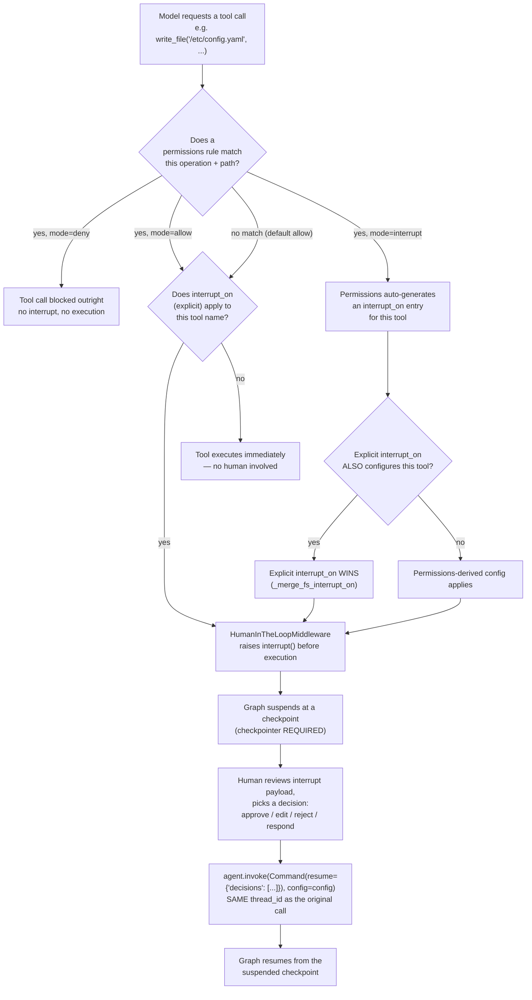

# Human-in-the-Loop

## Learning Objectives

By the end of this chapter, you will be able to:

- State precisely what DeepAgents adds on top of LangGraph's `interrupt()`/`Command(resume=...)` mechanism you
  already know: nothing new at the primitive level, only a tool-name-keyed configuration layer built by composing
  LangChain's own `HumanInTheLoopMiddleware` into `create_deep_agent()`'s middleware stack
- Configure `interrupt_on` to require human approval for specific tools, using `InterruptOnConfig` to constrain
  which decisions (`approve`/`edit`/`reject`/`respond`) are valid for a given tool
- Explain how `permissions` (`FilesystemPermission`, `mode="interrupt"`) auto-generates `interrupt_on` entries,
  and how those generated entries merge with — and lose to — any explicit `interrupt_on` you also pass
- Predict, precisely, whether a given `SubAgent`/`CompiledSubAgent`/`AsyncSubAgent` inherits the parent's
  `interrupt_on` configuration, and avoid the silent-loss-of-protection gotcha this produces
- Build a working "Deployment Agent" that pauses for human approval before calling a destructive `deploy` tool,
  and correctly resumes on both the approve and reject paths using the exact same `thread_id`
- Diagnose the two most common HITL failures in a deep agent: a missing checkpointer, and a resume call that
  drifts to a different `thread_id`

---

## Prerequisites for This Chapter

This chapter assumes you've read **Chapters 1–8**, and in particular:

- Chapter 2's middleware assembly order — you should already know that `create_deep_agent()` conditionally adds
  a HITL middleware only when `interrupt_on` or `permissions` is actually passed (Ch. 2, Ch. 1 §2.3)
- Chapter 3's `create_deep_agent()` argument-by-argument treatment, and the discipline of always passing `model`
  explicitly
- Chapter 8's `SubAgent` / `CompiledSubAgent` / `AsyncSubAgent` distinction — this chapter builds directly on it
  in Section 4, and assumes you can already tell the three apart without re-explanation
- Chapter 6's backend discussion, referenced briefly when this chapter turns to `FilesystemPermission`

Critically, this chapter also assumes real, working fluency with **LangGraph's `interrupt()` and
`Command(resume=...)`** — pausing a graph mid-execution, persisting that pause via a checkpointer, and resuming
it later with a value the interrupted node reads as `interrupt()`'s return value. **This chapter does not
re-explain any of that.** If it's shaky, stop and read
[LangGraph Ch. 12 — Human-in-the-Loop](../langgraph-course/12-human-in-the-loop.md) first; everything below
builds directly on top of it without repeating the fundamentals.

---

## 1. What DeepAgents Actually Adds

Here is the one sentence to hold onto for the rest of this chapter: **DeepAgents does not reimplement
human-in-the-loop.** `graph.py` imports `HumanInTheLoopMiddleware` and `InterruptOnConfig` directly from
`langchain.agents.middleware` — this is LangChain's own middleware, the same one you could attach to a bare
`create_agent()` call with no `deepagents` import anywhere in sight. `create_deep_agent()`'s job is narrower than
"build HITL": it takes your `interrupt_on=`/`permissions=` arguments, decides whether a
`HumanInTheLoopMiddleware` instance belongs in the stack at all, configures it, and slots it into the middleware
order Chapter 2 already walked through.

What that means concretely: the actual pause-and-resume mechanics — a tool call becoming a suspended graph node,
a checkpoint capturing that suspension, `Command(resume=...)` unsuspending it — are **100% the LangGraph
primitive you already know**. Nothing about `interrupt()` itself is different inside a deep agent. What's new,
and what this chapter is actually about, is the **configuration surface**: instead of hand-writing an
`interrupt()` call inside a tool function yourself, you declare *which tool names* should pause execution, *what
human decisions are valid* for each, and *under what filesystem-permission conditions* a pause should
automatically happen — all by passing arguments to `create_deep_agent()`, not by writing interrupt-handling code.

Reframe the rest of this chapter, then, as: "here's the tool-name-keyed configuration layer DeepAgents adds on
top of the primitive you already know" — not a re-derivation of what an interrupt is.

---

## 2. Two Configuration Surfaces: `interrupt_on` vs. `permissions`

DeepAgents gives you two different ways to arrive at the same underlying `HumanInTheLoopMiddleware`
configuration, aimed at two different mental models of "when should a human get a say."

### 2.1 `interrupt_on` — direct, tool-name keyed

```python
def create_deep_agent(
    model: str | BaseChatModel,
    tools: Sequence[BaseTool | Callable | dict[str, Any]] | None = None,
    *,
    interrupt_on: dict[str, bool | InterruptOnConfig] | None = None,
    permissions: list[FilesystemPermission] | None = None,
    checkpointer: Checkpointer | None = None,
    subagents: Sequence[SubAgent | CompiledSubAgent | AsyncSubAgent] | None = None,
    # ...
) -> CompiledStateGraph[...]:
    ...
```

`interrupt_on` is a `dict` keyed by **tool name** — `"write_file"`, `"execute"`, or any custom tool name you've
registered — mapping to either:

- **`True`** — interrupt before this tool executes, using `HumanInTheLoopMiddleware`'s default config (all four
  decisions allowed).
- **`False` or simply omitted from the dict** — never interrupt this tool; it runs immediately, exactly like
  today.
- **An `InterruptOnConfig` instance** — interrupt, but with finer control over which decisions are valid and
  (optionally) a predicate deciding *whether* to interrupt at all (Section 3).

Per the `create_deep_agent` docstring, this config **always applies to the main agent** — it's not conditional
on anything else being configured. The subagent-inheritance nuance is Section 4's entire topic.

```python
from deepagents import create_deep_agent
from langchain.agents.middleware import InterruptOnConfig

agent = create_deep_agent(
    model="anthropic:claude-sonnet-4-6",
    tools=[deploy],
    interrupt_on={
        "deploy": InterruptOnConfig(allowed_decisions=["approve", "reject"]),
        "write_file": True,   # interrupt with default config — all decisions allowed
    },
)
```

### 2.2 `permissions` — path/operation based, `mode="interrupt"` generates `interrupt_on` for you

`permissions` takes a different starting question: not "which *tool* needs a human," but "which *filesystem
operation on which path* needs a human." Each entry is a `FilesystemPermission`:

```python
from deepagents import FilesystemPermission

FilesystemPermission(
    operations=[...],   # which filesystem ops this rule covers (e.g. "write", "edit")
    paths=[...],         # which paths this rule covers (e.g. "/secrets/**", everything outside "/tmp/")
    mode="allow" | "deny" | "interrupt",
)
```

Rules evaluate **in declaration order, first match wins**; if nothing in the list matches a given call, the
default is **allow**. `mode="interrupt"` is the one relevant to this chapter: it doesn't just block or pass the
call through — it **auto-installs a `HumanInTheLoopMiddleware`**, generating `interrupt_on` entries for the
filesystem tools that rule covers.

Crucially, `FilesystemMiddleware` enforces `permissions` **at the tool level**, not the backend level — meaning
this works identically no matter which backend from Chapter 6 (`StateBackend`, `FilesystemBackend`,
`StoreBackend`, `CompositeBackend`) is actually active. You are not re-deriving per-backend permission logic;
one `permissions` list governs the tool call regardless of where the bytes ultimately land.

### 2.3 How They Merge

This is the detail that trips people up: `permissions`-derived `interrupt_on` entries and your own explicit
`interrupt_on=` argument are **not mutually exclusive** — they **merge**, via what the source calls
`_merge_fs_interrupt_on`. The merge rule is simple and worth memorizing exactly:

> Permissions-derived interrupt configuration and explicit `interrupt_on=` **coexist**. Where both configure the
> *same tool*, **your explicit `interrupt_on=` wins**.

So you can lean on `permissions` for a broad, path-based policy ("any write outside `/tmp/` needs approval") and
still carve out a tool-specific override via `interrupt_on=` without the two fighting each other — the explicit
argument is always the tiebreaker. Section 6 and the Hands-On Exercise both exercise this merge directly.

### 2.4 The Decision Flow

The diagram below is the mental model to carry through the rest of this chapter: every tool call a deep agent's
model requests passes through this same decision sequence before it either executes or pauses.



Read the middle of this diagram as the answer to "which of the two surfaces actually decided to interrupt this
call": it could be your explicit `interrupt_on=`, or it could be a `permissions` rule with `mode="interrupt"` —
and if both apply to the same tool, the explicit one wins per Section 2.3. Everything below the interrupt node
is pure LangGraph/LangChain HITL mechanics you already know — this diagram's entire novelty is everything above
it.

---

## 3. `InterruptOnConfig` and the Four Decisions

`InterruptOnConfig` is where you control *what a human is allowed to do* once a tool call has been flagged for
interruption:

```python
from langchain.agents.middleware import InterruptOnConfig

InterruptOnConfig(
    allowed_decisions=["approve", "edit", "reject", "respond"],
    when=None,  # optional predicate — Section 3.5
)
```

`allowed_decisions` is a `list[Literal["approve", "edit", "reject", "respond"]]` — restricting which of the four
standard HITL decisions are valid responses for *this specific tool's* interrupt. A destructive tool, for
instance, might reasonably allow only `["approve", "reject"]` — no silent `edit`, because letting a human quietly
rewrite the arguments to a `deploy` call without an explicit approval step is its own risk. Here's each decision,
concretely, against a realistic destructive-tool scenario.

### 3.1 `approve` — let the original tool call through unchanged

The human reviews exactly what the model wants to do and says "yes, run it as proposed."

```python
agent = create_deep_agent(
    model="anthropic:claude-sonnet-4-6",
    tools=[execute],
    interrupt_on={
        "execute": InterruptOnConfig(allowed_decisions=["approve", "edit", "reject"]),
    },
)

# ... agent.invoke(...) raises an interrupt for a proposed
#     execute(command="rm -rf /var/cache/build/*") call ...

result = agent.invoke(
    Command(resume={"decisions": [{"type": "approve"}]}),
    config=config,
)
# The command runs exactly as the model proposed it — no argument changes.
```

### 3.2 `edit` — the human modifies the tool call's arguments before it executes

The human agrees the tool *should* run, but not with those exact arguments — e.g. the model proposed writing to
the wrong path, or a shell command needs a safety flag added.

```python
result = agent.invoke(
    Command(resume={
        "decisions": [{
            "type": "edit",
            "edited_action": {
                "name": "execute",
                "args": {"command": "rm -rf /var/cache/build/* --dry-run"},
            },
        }],
    }),
    config=config,
)
# The tool executes with the human-supplied args, not the model's original ones.
```

### 3.3 `reject` — the tool call is blocked, and the agent is told why

The human decides the call must not happen at all. The agent doesn't crash — it receives the rejection as
information and can react (e.g. explain the situation to the end user, propose an alternative).

```python
result = agent.invoke(
    Command(resume={
        "decisions": [{
            "type": "reject",
            "message": "Do not clear the build cache during business hours — reschedule for the nightly window.",
        }],
    }),
    config=config,
)
# The execute call never runs; the model sees the rejection message and continues the conversation.
```

### 3.4 `respond` — the human answers directly, bypassing the tool entirely

Sometimes the right response isn't "run the tool" or "don't run the tool" — it's "the human just answers this
directly and the tool call is skipped altogether."

```python
result = agent.invoke(
    Command(resume={
        "decisions": [{
            "type": "respond",
            "message": "The cache was already cleared manually an hour ago — no action needed.",
        }],
    }),
    config=config,
)
# execute() never runs at all; the model treats this as if a tool had returned that message.
```

For a write-to-a-sensitive-path example: imagine `write_file` targeting `/etc/nginx/sites-enabled/` gated with
`InterruptOnConfig(allowed_decisions=["approve", "edit", "reject"])` (deliberately no `respond` — a config write
either happens as proposed, happens with corrected content, or doesn't happen; "just tell the model something
instead" doesn't make sense for a file write the way it does for a status check). `allowed_decisions` isn't
cosmetic — it's how you shape which human interventions make sense for *this specific tool's* blast radius.

### 3.5 `when` — conditional interrupts

`when: Callable[[ToolCallRequest], bool]` lets you interrupt *some* calls to a tool but not others, instead of an
all-or-nothing per-tool switch:

```python
def only_outside_tmp(request) -> bool:
    """Interrupt write_file only when the target path is outside /tmp/."""
    path = request.tool_call["args"].get("file_path", "")
    return not path.startswith("/tmp/")

agent = create_deep_agent(
    model="anthropic:claude-sonnet-4-6",
    interrupt_on={
        "write_file": InterruptOnConfig(
            allowed_decisions=["approve", "edit", "reject"],
            when=only_outside_tmp,
        ),
    },
)
```

Scratch-space writes under `/tmp/` proceed without interruption; anything else pauses for review. This is the
`interrupt_on`-side equivalent of the path-based reasoning `FilesystemPermission` gives you natively — Section 6
shows the same idea expressed the other way, as a `permissions` rule.

---

## 4. Subagent Inheritance: The Rule You Must Get Right

Chapter 8 covered the three subagent shapes — `SubAgent`, `CompiledSubAgent`, `AsyncSubAgent`. HITL inheritance
behaves differently across all three, and getting this wrong silently removes an approval gate you thought was
still in place.

### 4.1 Declarative `SubAgent` — inherits, unless it defines its own (full override, not merge)

A declarative `SubAgent` **inherits the top-level `interrupt_on`** by default. But if the `SubAgent` definition
itself includes an `interrupt_on` key, that key **fully replaces** the parent's configuration for that
subagent — it does **not** merge the two. Defining even one entry in a subagent's own `interrupt_on` means every
tool the parent was protecting, that the subagent doesn't re-list, is now **unprotected inside that subagent.**

### 4.2 `CompiledSubAgent` / `AsyncSubAgent` — no inheritance at all

These two subagent types **do not inherit `interrupt_on` under any circumstances.** A `CompiledSubAgent` is
already a compiled runnable handed to `create_deep_agent()` — HITL for it must be configured **inside that
compiled graph itself**, before you ever pass it in as a subagent. An `AsyncSubAgent` points at a remote graph
(e.g. a separately deployed LangGraph service) — HITL for it must be configured **on the remote graph**, which
this chapter's `create_deep_agent()` call has no visibility into at all. If you need an approval gate on either
of these subagent shapes, it is on you to have built it in at the point of compilation/deployment — there is no
top-level knob that reaches them.

### 4.3 The Gotcha, Concretely

Here's the parent configuration you'd write expecting protection everywhere:

```python
from deepagents import create_deep_agent, SubAgent
from langchain.agents.middleware import InterruptOnConfig

review_subagent = SubAgent(
    name="release-notes-writer",
    description="Drafts release notes and writes them to the docs directory.",
    system_prompt="You draft release notes and save them via write_file.",
    # NOTE: this subagent defines its OWN interrupt_on — see the problem below.
    interrupt_on={
        "execute": InterruptOnConfig(allowed_decisions=["approve", "reject"]),
    },
)

agent = create_deep_agent(
    model="anthropic:claude-sonnet-4-6",
    interrupt_on={
        "write_file": InterruptOnConfig(allowed_decisions=["approve", "edit", "reject"]),
        "execute": InterruptOnConfig(allowed_decisions=["approve", "reject"]),
    },
    subagents=[review_subagent],
)
```

The engineer who wrote `review_subagent` was thinking about `execute` specifically and added `interrupt_on` to
be explicit about it — but the moment `review_subagent.interrupt_on` exists at all, it **fully overrides** the
parent's `interrupt_on` for that subagent, not merges with it. The result: `write_file` calls made *by this
subagent* now execute **with no approval gate whatsoever** — the exact protection the parent agent has for
`write_file` silently does not apply inside `release-notes-writer`, even though nothing in the code looks wrong
at a glance and the parent agent's own `write_file` protection continues to work correctly for everything the
*main* agent does directly.

**The fix** — either don't define `interrupt_on` on the subagent at all (let it inherit the parent's full
config), or, if the subagent genuinely needs a different policy, restate every tool that matters, not just the
one you were thinking about:

```python
review_subagent = SubAgent(
    name="release-notes-writer",
    description="Drafts release notes and writes them to the docs directory.",
    system_prompt="You draft release notes and save them via write_file.",
    interrupt_on={
        "write_file": InterruptOnConfig(allowed_decisions=["approve", "edit", "reject"]),
        "execute": InterruptOnConfig(allowed_decisions=["approve", "reject"]),
    },
)
```

Or, simpler still when the subagent doesn't need a different policy from the parent, omit `interrupt_on` on the
`SubAgent` entirely:

```python
review_subagent = SubAgent(
    name="release-notes-writer",
    description="Drafts release notes and writes them to the docs directory.",
    system_prompt="You draft release notes and save them via write_file.",
    # No interrupt_on here at all — inherits the parent's config in full.
)
```

Treat "does this `SubAgent` define its own `interrupt_on`?" as a question worth asking on every code review that
touches subagent definitions — it's an easy, silent regression to introduce.

---

## 5. Project: The Deployment Agent

Let's build a small but complete agent whose entire job is to generate a deployment plan and then require human
approval before actually touching production — the canonical shape of this chapter's HITL pattern.

### 5.1 The mocked `deploy` tool and agent setup

```python
from langchain_core.tools import tool
from langchain_core.messages import HumanMessage
from langgraph.checkpoint.memory import MemorySaver
from langgraph.types import Command
from langchain.agents.middleware import InterruptOnConfig
from deepagents import create_deep_agent


@tool
def deploy(service: str, environment: str, image_tag: str) -> str:
    """Deploy a service to an environment.

    This performs a real, irreversible production deployment when called.
    Always requires explicit human approval before it may run.

    Args:
        service: The service name to deploy, e.g. "billing-api".
        environment: Target environment, e.g. "staging" or "production".
        image_tag: The container image tag to deploy, e.g. "v2.4.1".
    """
    # Mocked for this chapter — swap for a real deployment API call in production.
    return f"Deployed {service}:{image_tag} to {environment}."


agent = create_deep_agent(
    model="anthropic:claude-sonnet-4-6",
    tools=[deploy],
    system_prompt=(
        "You are a deployment assistant. When asked to deploy a service, "
        "propose a deployment plan and call the deploy tool with the exact "
        "service, environment, and image_tag. Never call deploy more than "
        "once per user request."
    ),
    interrupt_on={
        "deploy": InterruptOnConfig(allowed_decisions=["approve", "reject"]),
    },
    checkpointer=MemorySaver(),
)
```

Two choices here are load-bearing, not stylistic:

- `allowed_decisions=["approve", "reject"]` deliberately **excludes** `edit` and `respond` — a deployment either
  happens exactly as proposed or it doesn't happen at all; letting a human silently rewrite `image_tag` mid-flow
  without a fresh approval step is a worse failure mode than just rejecting and re-asking the model.
- `checkpointer=MemorySaver()` is **required**, not optional — interrupt/resume has nothing to suspend to or
  resume from without a durable checkpoint. `MemorySaver()` is the simplest checkpointer for local dev/testing;
  Chapter 10 covers production-grade checkpointer choices (Postgres, etc.) in depth. Skip this argument entirely
  and the interrupt still fires, but the *resume* call in Section 5.4 has nothing to resume — Section covers this
  exact failure in Common Mistakes below.

### 5.2 First Invoke — Hitting the Interrupt

```python
from uuid import uuid4  # or uuid7 per the documented pattern, if your project already depends on it

config = {"configurable": {"thread_id": str(uuid4())}}

result = agent.invoke(
    {"messages": [HumanMessage(content="Deploy billing-api version v2.4.1 to production.")]},
    config=config,
)
```

The documented example pattern from the DeepAgents human-in-the-loop page uses `str(uuid7())` for `thread_id`
generation per conversation — either a time-ordered UUIDv7 or a plain `uuid4()` works mechanically; the point
that matters is generating **one fresh `thread_id` per conversation** and then **reusing that exact same
`thread_id` for every resume call within that conversation** (Section 5.4, and Common Mistakes below).

Because `deploy` is configured to interrupt, `result` doesn't contain a final answer — the graph has suspended.

### 5.3 Inspecting the Interrupt Payload

```python
print(result["__interrupt__"])
# [Interrupt(value=[{
#     "action_request": {
#         "action": "deploy",
#         "args": {"service": "billing-api", "environment": "production", "image_tag": "v2.4.1"},
#     },
#     "config": {"allowed_decisions": ["approve", "reject"]},
#     "description": "...",
# }], resumable=True, ns=[...])]
```

This is the same `Interrupt` object shape LangGraph's `interrupt()` always produces — nothing deep-agent-specific
about its structure. What's worth confirming before approving anything: `action_request["args"]` shows exactly
what `deploy` was about to be called with — this is your actual approval surface, and in a real system this is
what you'd render to a human reviewer (a Slack approval message, an internal ops UI, a CLI prompt) rather than
printing to stdout.

### 5.4 Resuming — the Approve Path

```python
approved_result = agent.invoke(
    Command(resume={"decisions": [{"type": "approve"}]}),
    config=config,  # SAME config/thread_id as the original .invoke() call
)

print(approved_result["messages"][-1].content)
# e.g. "Deployed billing-api:v2.4.1 to production. Deployment complete."
```

The `deploy` tool now actually executes with the model's originally proposed arguments, its result is appended
as a `ToolMessage`, and the model produces its final response referencing the real deployment outcome.

### 5.5 Resuming — the Reject Path

Starting a fresh conversation to show the other branch (same `deploy` call proposed, this time rejected):

```python
config2 = {"configurable": {"thread_id": str(uuid4())}}

result2 = agent.invoke(
    {"messages": [HumanMessage(content="Deploy billing-api version v2.4.1 to production.")]},
    config=config2,
)
# Interrupts again, identically to Section 5.2.

rejected_result = agent.invoke(
    Command(resume={
        "decisions": [{
            "type": "reject",
            "message": "Production deploys are frozen until the incident review completes.",
        }],
    }),
    config=config2,  # SAME thread_id as this conversation's original call
)

print(rejected_result["messages"][-1].content)
# e.g. "Understood — I won't deploy billing-api to production right now. Let me know once
#       the deploy freeze is lifted."
```

`deploy` never executes on this path. The model receives the rejection message as real information in the
conversation and responds accordingly — this is ordinary LangGraph HITL behavior, not something DeepAgents
changes; the only thing DeepAgents contributed to this entire example is the `interrupt_on={"deploy": ...}`
declaration that got `deploy` gated in the first place.

---

## 6. Filesystem Permissions for HITL

Section 2.2 introduced `permissions` mechanically; here's the pattern applied to a real policy: require approval
for any `write_file` call targeting a path outside `/tmp/`, without hand-writing a `when=` predicate yourself.

```python
from deepagents import create_deep_agent, FilesystemPermission

agent = create_deep_agent(
    model="anthropic:claude-sonnet-4-6",
    tools=[deploy],
    permissions=[
        FilesystemPermission(
            operations=["write", "edit"],
            paths=["/tmp/**"],
            mode="allow",
        ),
        FilesystemPermission(
            operations=["write", "edit"],
            paths=["**"],
            mode="interrupt",
        ),
    ],
    interrupt_on={
        "deploy": InterruptOnConfig(allowed_decisions=["approve", "reject"]),
    },
    checkpointer=MemorySaver(),
)
```

Declaration order matters here (Section 2.2): the `/tmp/**` allow rule is listed **first**, so writes under
`/tmp/` match it and proceed with no interruption; anything else falls through to the second rule and gets
`mode="interrupt"`, auto-generating an `interrupt_on` entry for the filesystem write tools. Your own explicit
`interrupt_on={"deploy": ...}` targets a completely different tool name, so there's no conflict in this
particular example — but if you *did* also explicitly configure `write_file` in `interrupt_on`, Section 2.3's
rule applies: your explicit entry wins over whatever `permissions` generated. The Hands-On Exercise below has you
construct exactly that conflict on purpose and confirm the winner.

This is a narrower slice of a much larger topic — sandboxing `execute`, the full `FilesystemPermission`
surface, and the broader security posture for a deep agent touching real infrastructure is **Chapter 19**'s
subject; treat this section as the HITL-specific corner of that larger picture, not the complete story.

---

## Real-World Scenario

A platform team builds a ChatOps-style deep agent that lets on-call engineers say "deploy the hotfix for
`payments-api`" in Slack instead of running a CLI by hand. Their first version wires `deploy` in with no
`interrupt_on` at all — it works in the demo, then someone typos an environment name in a fast-moving incident
and the agent deploys a hotfix to the wrong cluster before anyone reads its response message. The fix is exactly
Section 5's pattern: `interrupt_on={"deploy": InterruptOnConfig(allowed_decisions=["approve", "reject"])}` plus a
real checkpointer (Postgres in their case, once past local dev — Chapter 10), with the interrupt payload rendered
as an interactive Slack approval message instead of a printed dict. The on-call engineer now sees the exact
`service`/`environment`/`image_tag` the model is about to deploy before it happens, and a rejected or
mis-specified plan costs a Slack reply, not a production incident. When the team later adds a `docs-writer`
subagent for auto-generating post-incident write-ups, a review catches — before it ships — that the subagent's
own `interrupt_on={"write_file": ...}` definition would have silently dropped the parent's `execute` protection
inside that one subagent, exactly the Section 4.3 gotcha; they fix it by restating `execute`'s config in the
subagent rather than assuming inheritance.

---

## Best Practices

- **Default to `interrupt_on` for tool-specific gates, `permissions` for path/operation-wide policy.** Reach for
  `interrupt_on` when the question is "does calling *this tool* ever need review"; reach for `permissions` when
  the question is "does writing to *this kind of path* need review, regardless of which filesystem tool does it."
- **Restrict `allowed_decisions` to what actually makes sense for the tool's blast radius.** A destructive,
  effectful tool like `deploy` rarely needs `edit`/`respond` — `["approve", "reject"]` forces a clean re-ask
  instead of a silently modified irreversible action.
- **Always pass a real `checkpointer`.** `MemorySaver()` is fine for local dev; a durable, production-grade
  checkpointer (Chapter 10) is required anywhere an approval might take minutes, hours, or span a process
  restart — an in-memory checkpointer loses all pending interrupts the moment the process exits.
- **Generate one `thread_id` per conversation and never let it drift across a resume call** — the documented
  pattern uses `str(uuid7())`; the specific UUID version matters less than the discipline of capturing it once
  and reusing the identical value for every subsequent `.invoke(Command(resume=...))` in that conversation.
- **Treat every `SubAgent`'s `interrupt_on` key as a full override, and audit it explicitly on review.** If a
  subagent defines `interrupt_on` at all, verify every tool the parent was protecting that the subagent can also
  call is restated, not just the one the author had in mind (Section 4.3).
- **Remember `CompiledSubAgent`/`AsyncSubAgent` need HITL built in at their own layer.** Don't assume a top-level
  `interrupt_on` reaches into a precompiled graph or a remote deployment — it doesn't, for either shape.
- **Let explicit `interrupt_on` be the intentional override over `permissions`-derived config**, and design your
  `permissions` list's declaration order deliberately — first match wins, default is allow.

---

## Common Mistakes

- **Defining `interrupt_on` on a declarative `SubAgent` without restating every tool the parent protects** —
  this fully replaces (not merges with) the parent's config for that subagent, silently dropping protection for
  every tool not explicitly re-listed (Section 4.3). This is the single easiest HITL regression to introduce and
  the hardest to notice in a quick read of the code.
- **Forgetting a checkpointer entirely.** Without `checkpointer=` (or with none configured anywhere in the
  invocation stack), there is nothing to suspend the graph to — interrupts either fail outright or cannot
  meaningfully resume once the process holding in-memory state is gone. A checkpointer is not an optimization
  here; it's a hard requirement for interrupt/resume to function at all.
- **Resuming with a new or different `thread_id`.** `Command(resume=...)` only reconnects to a suspended
  execution if `config` carries the **exact same `thread_id`** the original interrupting call used. A fresh
  `uuid4()` on the resume call, or accidentally reusing `config` from an unrelated conversation, does not resume
  anything — it starts a new thread with no pending interrupt to satisfy.
- **Assuming `CompiledSubAgent`/`AsyncSubAgent` inherit the parent's `interrupt_on`.** They don't, under any
  configuration — HITL for a precompiled graph must be built into that graph before it's handed to
  `create_deep_agent()`, and HITL for a remote `AsyncSubAgent` must live on the remote graph itself.
- **Allowing `edit` or `respond` on a tool where neither decision makes sense**, e.g. allowing `respond` on a
  file write — a human "just answering instead" doesn't correspond to any sensible outcome for a write that was
  supposed to happen. Restrict `allowed_decisions` to decisions that are actually meaningful for that tool.
- **Believing `permissions` and `interrupt_on` are mutually exclusive configuration mechanisms.** They merge, per
  `_merge_fs_interrupt_on`, with explicit `interrupt_on` winning conflicts — treating them as an either/or choice
  leads to surprise when both happen to touch the same tool.

---

## Summary

- DeepAgents' HITL is LangChain's own `HumanInTheLoopMiddleware` (`langchain.agents.middleware`), composed into
  `create_deep_agent()`'s stack via `interrupt_on=`/`permissions=` — not a reimplementation of anything, and not
  a new primitive beyond what LangGraph's `interrupt()`/`Command(resume=...)` already gives you.
- `interrupt_on: dict[str, bool | InterruptOnConfig]` maps tool names directly to interrupt behavior; `True` uses
  default config, `InterruptOnConfig` lets you restrict `allowed_decisions` and add a `when=` predicate for
  conditional interrupts.
- `permissions: list[FilesystemPermission]` reasons in terms of operations and paths; rules evaluate in
  declaration order, first match wins, default is allow, and `mode="interrupt"` auto-generates `interrupt_on`
  entries that **merge** with your explicit ones — with explicit `interrupt_on` winning any per-tool conflict.
- `InterruptOnConfig.allowed_decisions` restricts which of `approve`/`edit`/`reject`/`respond` are valid
  responses for a given tool's interrupt — pick decisions that actually make sense for that tool's blast radius,
  not the full set by default.
- Declarative `SubAgent`s inherit the parent's `interrupt_on` **unless they define their own**, in which case
  it's a **full override, not a merge** — restate every protected tool if you define any `interrupt_on` on a
  subagent at all. `CompiledSubAgent`/`AsyncSubAgent` never inherit it, period.
- Resume mechanics are pure LangGraph: `agent.invoke(Command(resume={"decisions": [...]}), config=config)`, with
  the exact same `config`/`thread_id` as the interrupting call, and a real checkpointer is mandatory for any of
  this to function.

---

## Knowledge Check

1. In one sentence, what does `create_deep_agent()` actually add on top of `HumanInTheLoopMiddleware`, and what
   doesn't it change about how `interrupt()`/`Command(resume=...)` work?
2. You configure `interrupt_on={"deploy": InterruptOnConfig(allowed_decisions=["approve", "reject"])}` on the
   parent agent, and give a declarative `SubAgent` its own `interrupt_on={"execute": InterruptOnConfig(...)}`.
   Does the subagent still require approval to call `deploy`? Justify your answer precisely.
3. A `FilesystemPermission` rule with `mode="interrupt"` covers `write_file` calls to any path, and you also pass
   `interrupt_on={"write_file": InterruptOnConfig(allowed_decisions=["approve"])}` explicitly. Which
   configuration governs a `write_file` call, and why?
4. Why does a checkpointer being absent break human-in-the-loop specifically, rather than merely being a
   performance concern?
5. A resume call uses `config = {"configurable": {"thread_id": str(uuid4())}}` freshly generated at resume time,
   rather than reusing the `config` from the original interrupting `.invoke()` call. What actually happens, and
   why does it not resume the pending interrupt?
6. Give one concrete tool/decision pairing where allowing `respond` would be a design mistake, and explain why.

---

## Hands-On Exercise

Extend the Deployment Agent built in Section 5 to combine `permissions` and `interrupt_on`, and verify the merge
rule from Section 2.3 directly rather than taking it on faith.

1. **Add a `permissions` list** to the Section 5.1 agent requiring interrupt-mode approval for any filesystem
   write outside `/tmp/`, mirroring Section 6's pattern:

   ```python
   permissions=[
       FilesystemPermission(operations=["write", "edit"], paths=["/tmp/**"], mode="allow"),
       FilesystemPermission(operations=["write", "edit"], paths=["**"], mode="interrupt"),
   ]
   ```

2. **Extend the agent's tools** with a `write_file`-adjacent scenario: ask it to save a deployment log to
   `/tmp/deploy.log` (should proceed without interruption per the allow rule) and, separately, to
   `/var/log/deploy.log` (should interrupt, since it falls through to the second rule).

3. **Confirm both behaviors** with two separate `.invoke()` calls (fresh `thread_id` each) and inspect
   `result.get("__interrupt__")` — it should be empty/absent for the `/tmp/` write and populated for the
   `/var/log/` write.

4. **Now add an explicit `interrupt_on` entry for `write_file`** with a *different* `allowed_decisions` set than
   whatever the `permissions`-derived entry would produce, e.g.
   `interrupt_on={"write_file": InterruptOnConfig(allowed_decisions=["approve"])}` (no `edit`, no `reject`).

5. **Trigger the `/var/log/` write again** and inspect the interrupt payload's `config["allowed_decisions"]` —
   confirm it reflects your **explicit** `interrupt_on` value (`["approve"]`), not whatever the
   `permissions`-derived default would have been, directly verifying Section 2.3's "explicit `interrupt_on` wins
   on conflicts" rule with your own eyes rather than trusting the fact sheet.

6. **Bonus:** repeat Section 4.3's gotcha on purpose — give a `SubAgent` its own `interrupt_on` that only
   mentions `execute`, confirm (via the same `__interrupt__` inspection) that a `write_file` call made *by that
   subagent* now executes with no interruption at all, then fix it per Section 4.3 and confirm the interrupt
   returns.

---

## Further Reading

- [DeepAgents Human-in-the-Loop (LangChain Docs)](https://docs.langchain.com/oss/python/deepagents/human-in-the-loop)
  — the official reference for `interrupt_on`, `InterruptOnConfig`, and `permissions`
- [DeepAgents Overview (LangChain Docs)](https://docs.langchain.com/oss/python/deepagents/overview) — the
  official conceptual reference this course tracks throughout
- Related chapter in this course: [Chapter 2 — Architecture & Internals](./02-architecture-and-internals.md) —
  where `HumanInTheLoopMiddleware`'s place in the full middleware assembly order was first introduced
- Related chapter in this course: [Chapter 8 — Subagent Orchestration](./08-subagent-orchestration.md) — the
  `SubAgent`/`CompiledSubAgent`/`AsyncSubAgent` distinction this chapter's Section 4 builds directly on
- Related chapter in this course: [Chapter 10 — Checkpointing & Durable Execution](./10-checkpointing-and-durable-execution.md)
  — production-grade checkpointer choice, forward-referenced throughout this chapter
- Related chapter in this course: [Chapter 19 — Security & Governance](./19-security-and-governance.md) — the
  full `FilesystemPermission` surface and broader security posture this chapter's Section 6 only previewed
- Companion course: [LangGraph Ch. 12 — Human-in-the-Loop](../langgraph-course/12-human-in-the-loop.md) — the
  `interrupt()`/`Command(resume=...)` fundamentals this entire chapter assumes and builds directly on top of

---

<div style="display:flex;justify-content:space-between;align-items:center;">
  <a href="./08-subagent-orchestration.md">← Previous: Subagent Orchestration</a>
  <a href="./00-index.md">🏠 Index</a>
  <a href="./10-checkpointing-and-durable-execution.md">Next: Checkpointing & Durable Execution →</a>
</div>
