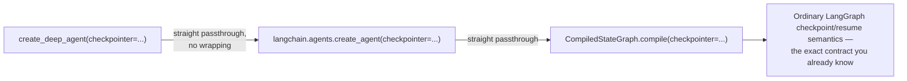
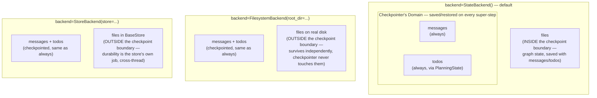
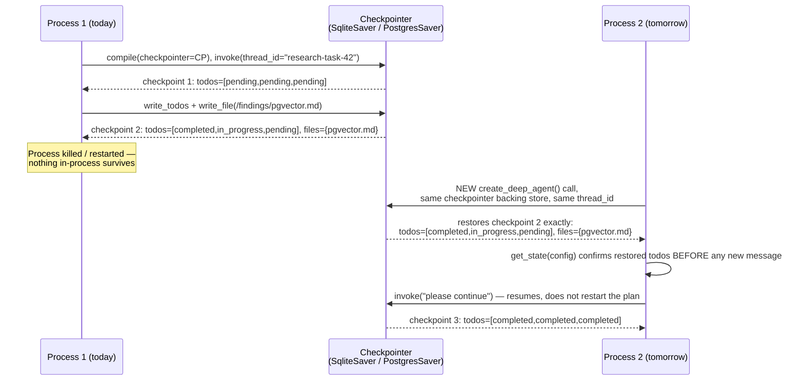

# Checkpointing & Durable Execution

> "There is no `deepagents` checkpointer." — the one sentence this entire chapter exists to unpack.

## Learning Objectives

By the end of this chapter, you will be able to:

- State precisely why `checkpointer=` on `create_deep_agent()` is pure passthrough to LangGraph, with zero DeepAgents-specific mechanism sitting on top of it
- Enumerate exactly what gets checkpointed for a *deep* agent specifically — `messages`, `todos`, and conditionally `files` — and explain why that list differs from a plain `create_agent` checkpoint
- Reason correctly about the interaction between `checkpointer=` and `backend=`: which backend choices make checkpointing relevant to file survival, and which make it irrelevant
- Choose `MemorySaver`, `SqliteSaver`, or `PostgresSaver` for a given deployment shape, and articulate the production failure mode of picking wrong
- Build and run a durable, resumable multi-step agent — the "Long Running Research Agent" — that survives a simulated process restart with its `todos` state intact
- Design `thread_id` generation and mapping for a real application, anticipating Chapter 18's FastAPI integration
- Explain, precisely, why Chapter 9's `interrupt_on` human-in-the-loop gates do not function at all without a checkpointer

## Prerequisites for This Chapter

- Chapter 1 (Introduction & Prerequisites) — package layout and installation
- Chapter 2 (Architecture & Internals) — how `create_deep_agent()` assembles its middleware stack and passes arguments through to `langchain.agents.create_agent`
- Chapter 4 (Planning System & Todos) — the exact `Todo` schema and `PlanningState` mixin; this chapter shows what happens to that state across a crash/restart
- Chapter 6 (Backends & Storage Architecture) — `StateBackend` vs. `FilesystemBackend` vs. `StoreBackend`; this chapter depends directly on that distinction to explain what "checkpointed" means for files
- Chapter 9 (Human-in-the-Loop) — `interrupt_on` and `Command(resume=...)`; this chapter explains the durability layer those interrupts depend on
- **Your own LangGraph checkpointer knowledge.** This course assumes you already know what a `Checkpointer` is, how `MemorySaver`/`SqliteSaver`/`PostgresSaver` differ, how `thread_id` scopes state, and how checkpoint/resume works mechanically at the Pregel level. None of that is re-taught here. If any of it is rusty, the companion [LangGraph course, Chapter 9](../langgraph-course/09-checkpointing-and-durable-execution.md) covers it from zero — treat it as an aside, not a required detour, before continuing.

---

## The Headline Fact: Zero New Mechanism

Every other chapter in this course so far has had a "here's the DeepAgents-specific thing layered on top of LangGraph" angle — a middleware, a tool, a state mixin, a routing convention. Checkpointing does not. Look at the signature:

```python
def create_deep_agent(
    model,
    tools=None,
    *,
    checkpointer: Checkpointer | None = None,
    backend=None,
    subagents=None,
    # ...
):
```

`checkpointer` is accepted here, forwarded untouched to `langchain.agents.create_agent(...)`, which forwards it untouched to the underlying LangGraph graph's own `.compile(checkpointer=...)` step. There is no `DeepAgentCheckpointer` class, no deepagents-specific serialization format, no wrapping, no restriction on which implementations are valid. The type is exactly LangGraph's own `langgraph.types.Checkpointer` contract. Anything that satisfies that contract works here, with no adapter layer in between:

- `langgraph.checkpoint.memory.MemorySaver`
- `langgraph.checkpoint.sqlite.SqliteSaver`
- `langgraph.checkpoint.postgres.PostgresSaver`
- any other LangGraph-compatible checkpointer you already use elsewhere in your stack

If you've wired a checkpointer into a raw `StateGraph` before, you already know 100% of the mechanism this chapter covers. So why does this chapter exist at all, instead of a one-line "see the LangGraph docs"? Because **what gets checkpointed** is different for a deep agent than for a graph you hand-rolled yourself, and that difference has real production consequences you need to reason about explicitly. That's the actual content of this chapter: not a new mechanism, but a new answer to "what's inside the box that gets saved."



## What Actually Gets Checkpointed for a Deep Agent

A checkpointer saves *graph state* at each super-step. For a plain `create_agent` graph with no `deepagents` middleware involved, that state is essentially just `messages`. A deep agent's compiled graph has a richer state schema, because `deepagents` folds in additional `AgentState` mixins via its middleware stack (Chapter 2 covered this assembly in detail). Whatever ends up in that combined `TypedDict` state schema is what a configured checkpointer will serialize and restore. Concretely, for a deep agent:

1. **`messages`** — always checkpointed, exactly as in any LangGraph agent. No difference here.

2. **`todos`** — checkpointed because `PlanningState` (Chapter 4) is folded into the deep agent's overall state schema. This is the detail worth sitting with: if the process crashes — or you deliberately stop it, as the project below does — mid-plan, with two todos `completed`, one `in_progress`, and one still `pending`, resuming from the same `thread_id` against the same checkpointer restores that *exact* status breakdown. The agent does not re-derive the plan from scratch, and it does not have to re-read the conversation to reconstruct what it had already finished. The `todos` list comes back exactly as it was written by the last `write_todos` call before the interruption.

3. **`files` — conditionally.** This is the one that trips people up, because whether files are checkpointed at all depends entirely on the `backend=` choice from Chapter 6:
   - If `backend=StateBackend()` (the SDK's default), files are stored as a `files` key inside the same LangGraph graph state that `messages` and `todos` live in. That means they are checkpointed and restored by exactly the same mechanism — a file an agent wrote mid-task, mid-crash, comes back on resume the same way a half-finished todo list does.
   - If `backend=FilesystemBackend(...)`, files live on real disk, entirely outside graph state. The checkpointer never sees them, never saves them, and never restores them — and it doesn't need to, because they were never lost in the first place. A process restart doesn't touch the filesystem; the files were durable independently the whole time.
   - If `backend=StoreBackend(...)`, files live in a LangGraph `BaseStore`, which has its own persistence story (cross-thread, keyed by namespace) that is completely orthogonal to the checkpointer. The checkpointer doesn't manage store durability; that's the store implementation's job, exactly as Chapter 6 described.

This is the DeepAgents-specific angle promised at the top of this chapter: the mechanism is unchanged LangGraph, but the *shape* of what gets saved is unique to a deep agent's richer state schema, and one part of that shape (`files`) is itself conditional on a decision you made back in Chapter 6.

### Diagram: Checkpoint Boundary by Backend Choice



The one-sentence version: **`messages` and `todos` are always inside the checkpoint boundary; `files` is inside it only when `StateBackend` is in play, and outside it — independently durable or independently cross-thread — for every other backend.**

### Inspecting a Deep Agent's Checkpoint State Directly

Because this is ordinary LangGraph state under the hood, every inspection tool you already reach for on a raw `StateGraph` works unchanged here — `create_deep_agent` didn't hide the state schema behind anything. `agent.get_state(config)` returns a `StateSnapshot` whose `.values` is the same dict shape you'd expect from Chapter 4 and Chapter 6, just observed from the checkpointer's point of view instead of from a tool call's return value:

```python
snapshot = agent.get_state(config)

print(snapshot.values.keys())
# dict_keys(['messages', 'todos', 'files', ...])  — 'files' present only under StateBackend

print(snapshot.values["todos"])
# [{'content': 'Compare pgvector', 'status': 'completed'},
#  {'content': 'Compare Pinecone', 'status': 'in_progress'},
#  {'content': 'Compare Weaviate', 'status': 'pending'}]

print(list(snapshot.values["files"].keys()))
# ['/findings/pgvector.md']  — only if backend=StateBackend()
```

`agent.get_state_history(config)` gives you the same thing across every super-step the checkpointer recorded, which is a genuinely useful debugging tool specific to deep agents: you can watch the exact turn at which `todos` transitioned an item from `pending` to `in_progress` to `completed`, correlated with the `messages` entries around it, without re-running anything. This is the same `StateSnapshot`/history API you already use for any LangGraph graph — nothing deep-agent-specific about the API, only about what's worth looking at once you know `todos` and (conditionally) `files` are in there alongside `messages`.

```python
for snap in agent.get_state_history(config):
    todo_statuses = [t["status"] for t in snap.values.get("todos", [])]
    print(snap.metadata.get("step"), todo_statuses)
# 4 ['completed', 'completed', 'completed']
# 3 ['completed', 'in_progress', 'pending']
# 2 ['completed', 'pending', 'pending']
# 1 ['pending', 'pending', 'pending']
```

### Decision Matrix: Checkpointer × Backend

The two decisions — which checkpointer, which backend — are independent axes, but they interact when you're reasoning about "what actually survives what." A quick reference for pairing them:

| | `MemorySaver` | `SqliteSaver` | `PostgresSaver` |
|---|---|---|---|
| **`backend=StateBackend()`** (default) | `messages`/`todos`/`files` all lost on restart — fine for a demo, dangerous in prod | `messages`/`todos`/`files` all survive a restart on the same box | `messages`/`todos`/`files` all survive across any instance |
| **`backend=FilesystemBackend(...)`** | `messages`/`todos` lost on restart; files on disk untouched either way | `messages`/`todos` survive; files were already durable regardless | `messages`/`todos` survive across instances; files durable regardless, but note: disk files aren't automatically shared across instances unless the disk itself is (e.g., a shared volume) — that's an infrastructure concern, not a checkpointer one |
| **`backend=StoreBackend(...)`** | `messages`/`todos` lost on restart; store durability is a separate question (depends on the `BaseStore` implementation) | `messages`/`todos` survive; store durability still separate | `messages`/`todos` survive across instances; store durability still separate — pick a durable `BaseStore` implementation independently |

The recurring theme in the right-hand column of every row: once you've moved past `MemorySaver`, the *checkpointer* stops being the thing you worry about for `messages`/`todos` durability — it just works, the same as it would for any LangGraph graph. What's left to reason about is backend-specific, and that reasoning is exactly Chapter 6's, not new territory here.

## Checkpointer Choice for Production

Since `deepagents` adds no restriction, the decision is exactly the LangGraph decision you already know how to make — but it's worth re-grounding it against what's now at stake for a deep agent specifically: a crashed `MemorySaver`-backed agent doesn't just lose conversation history, it loses the entire todo plan and (with the default backend) every file it had written.

| Checkpointer | Durability | Fits | The DeepAgents-specific stake |
|---|---|---|---|
| `MemorySaver` | In-process memory only — gone on process exit | Dev/test, the docs' own HITL examples, local experimentation | Losing this on restart means losing `todos` and (if `StateBackend`) `files` too, not just chat history — a bigger loss than it looks in a quick demo |
| `SqliteSaver` | A single file on disk, survives process restarts | Single-instance production deployments, small-scale services, local durability without standing up Postgres | Fine as long as you genuinely have one process/instance; the plan and files survive a crash-and-restart on that one box |
| `PostgresSaver` | A real database, survives process restarts and works across multiple instances | Multi-instance production deployments — almost certainly your target given a FastAPI/Bedrock production background | The one that actually matches "any of N replicas can pick up `thread_id=X` and see the same `todos`/`files` state" |

This maps directly onto the deployment shape this course assumes you're heading toward (Chapter 18, forward-referenced here): a FastAPI service behind a load balancer, potentially multiple worker processes or pods, is the scenario `MemorySaver` and even `SqliteSaver` quietly fail in — not because either checkpointer is broken, but because "in this process" or "on this disk" stops being a meaningful guarantee the moment a second instance can pick up the same `thread_id`. `PostgresSaver` (or another real, network-accessible durable store from the LangGraph ecosystem) is the one built for that shape.

A note on scope, per this course's own trust standard: the exact production-grade Postgres/Redis checkpointer package names and versions were not verified specifically against the `deepagents` repository for this chapter — they're standard LangGraph-ecosystem packages you would already reach for in any LangGraph service, and `deepagents` imposes no additional constraint on them. Treat them as "the LangGraph checkpointer packages you'd already reach for," not as something `deepagents`-specific that's been separately tested.

## `thread_id` for a Deep Agent — No New Semantics, Same Discipline

`thread_id` maps to conversation/checkpoint state exactly as in vanilla LangGraph — there is nothing deep-agent-specific to learn here beyond recognizing that a *thread's* checkpoint now includes `todos` and possibly `files`, per the previous section. You pass it the same way you always have:

```python
config = {"configurable": {"thread_id": thread_id}}
agent.invoke({"messages": [...]}, config=config)
```

The documented example from the human-in-the-loop docs page generates `thread_id` via `str(uuid7())` — worth adopting as a default convention if you don't already have one, since it gives you sortable, collision-resistant IDs without coordinating an external ID generator.

```python
from uuid_extensions import uuid7  # or any UUIDv7-compatible generator you already use
import uuid

thread_id = str(uuid7())
# or, if you don't have a uuid7 implementation handy:
thread_id = str(uuid.uuid4())
```

## The Long Running Research Agent Project

The scenario: a research agent is given a multi-step research task, uses `write_todos` to lay out its plan (Chapter 4) and the filesystem tools to save intermediate findings (Chapter 5, `backend=StateBackend()` so those findings are checkpointed too), gets deliberately "killed" partway through — simulating an actual process restart, not just a Python-level pause — and is then resumed the next day from a fresh process using the *same* `thread_id` against the *same* checkpointer backing store.

We use `SqliteSaver` here because it gives you a real, runnable, single-file example of exactly the durability property `PostgresSaver` gives you in a multi-instance deployment — the mechanism demonstrated is identical, only the backing store differs.

### Step 1 — First "process": start the research task

```python
# process_one.py — simulates the first process/session
from deepagents import create_deep_agent
from deepagents.backends.state import StateBackend
from langgraph.checkpoint.sqlite import SqliteSaver

DB_PATH = "research_agent_checkpoints.db"

with SqliteSaver.from_conn_string(DB_PATH) as checkpointer:
    agent = create_deep_agent(
        model=model,  # your configured chat model (Bedrock/Anthropic/OpenAI)
        backend=StateBackend(),  # default, but explicit here since it matters to this chapter
        checkpointer=checkpointer,
        system_prompt=(
            "You are a research agent. Break multi-step research requests into "
            "todos with write_todos, save findings to files as you go, and mark "
            "each todo completed only once its findings file is written."
        ),
    )

    thread_id = "research-task-42"  # in real code: str(uuid7())
    config = {"configurable": {"thread_id": thread_id}}

    result = agent.invoke(
        {
            "messages": [
                {
                    "role": "user",
                    "content": (
                        "Research the current landscape of vector database options "
                        "for RAG: compare pgvector, Pinecone, and Weaviate on cost, "
                        "operational complexity, and hybrid search support. Write "
                        "findings for each to its own file as you finish it."
                    ),
                }
            ]
        },
        config=config,
    )

    print("Todos after first run:", result.get("todos"))
    # e.g. pgvector: completed, Pinecone: in_progress, Weaviate: pending
```

At this point, imagine the process is killed — a deploy, a crash, an intentional shutdown for the night — right after the `pgvector` findings file was written and the `Pinecone` todo was marked `in_progress`. Nothing further runs. The `with SqliteSaver.from_conn_string(...)` block exiting (or the process dying) is the "process restart" being simulated; the `research_agent_checkpoints.db` file on disk is what survives it.

### Step 2 — "The next day": a fresh process, same `thread_id`

```python
# process_two.py — simulates a brand-new process the next day
from deepagents import create_deep_agent
from deepagents.backends.state import StateBackend
from langgraph.checkpoint.sqlite import SqliteSaver

DB_PATH = "research_agent_checkpoints.db"  # same file, nothing shared in-process

with SqliteSaver.from_conn_string(DB_PATH) as checkpointer:
    # A genuinely new create_deep_agent() call — nothing carried over from
    # process_one.py except the checkpointer's backing SQLite file and the
    # thread_id string, exactly as would be true across a real restart.
    agent = create_deep_agent(
        model=model,
        backend=StateBackend(),
        checkpointer=checkpointer,
        system_prompt=(
            "You are a research agent. Break multi-step research requests into "
            "todos with write_todos, save findings to files as you go, and mark "
            "each todo completed only once its findings file is written."
        ),
    )

    thread_id = "research-task-42"  # MUST match the original thread_id exactly
    config = {"configurable": {"thread_id": thread_id}}

    # Inspect state BEFORE sending any new instruction, to prove continuity.
    state_before = agent.get_state(config)
    print("Todos restored on resume:", state_before.values.get("todos"))
    # Expect: pgvector completed, Pinecone in_progress, Weaviate pending —
    # exactly the statuses from the moment the first process stopped.

    result = agent.invoke(
        {"messages": [{"role": "user", "content": "Please continue the research."}]},
        config=config,
    )

    print("Todos after resume:", result.get("todos"))
    # e.g. all three now completed — the agent picked up where it left off,
    # it did not restart the plan or re-fetch what pgvector already covered.
```

What proves durability here is the `state_before` inspection: it's read *before* any new message is sent, straight off `agent.get_state(config)`, and it already shows the exact prior `todos` breakdown — two statuses set by a process that no longer exists, recovered purely from the SQLite file and the shared `thread_id`. The subsequent `.invoke()` call isn't "starting a new research task that happens to look similar" — it's the same graph-state thread continuing, with the model's own prior `write_todos` history visible to it in `messages` exactly as Chapter 4 described, plus `pgvector`'s findings file still readable via `read_file` because `StateBackend`'s `files` key rode along in the same checkpoint.

### Diagram: The Crash-and-Resume Sequence



The only two things that cross the gap between "Process 1" and "Process 2" in this diagram are the checkpointer's backing store (the `.db` file, or the Postgres connection) and the `thread_id` string. Nothing else — no Python object, no in-memory reference — needs to survive, which is exactly what makes this a legitimate simulation of a real process restart rather than a shortcut.

### What this would look like with `PostgresSaver`

For a real multi-instance deployment, the only change is the checkpointer construction — everything about `thread_id` handling, `create_deep_agent()` usage, and the resume semantics is identical:

```python
from langgraph.checkpoint.postgres import PostgresSaver

with PostgresSaver.from_conn_string(DATABASE_URL) as checkpointer:
    agent = create_deep_agent(model=model, backend=StateBackend(), checkpointer=checkpointer)
    # same thread_id discipline, same invoke/resume pattern
```

Any instance of your FastAPI service, anywhere behind the load balancer, that receives a request carrying `thread_id="research-task-42"` reconstructs the identical `todos`/`files`/`messages` state — which is precisely the property `SqliteSaver` cannot give you once there's more than one process in the picture.

## `thread_id` Design for Real Applications

The pattern to carry into Chapter 18's FastAPI integration: one `thread_id` per logical conversation or task, generated once and then threaded through every subsequent call for that same unit of work.

- **Generate once, at task/conversation creation.** A `POST /research-tasks` endpoint would mint `thread_id = str(uuid7())` when the task is created, store it alongside whatever task-tracking row your application already keeps, and return it to the caller.
- **Every subsequent call for that task reuses it.** A `POST /research-tasks/{thread_id}/continue` endpoint takes the `thread_id` from the URL/path, builds `config={"configurable": {"thread_id": thread_id}}`, and invokes the same way — this is the exact mechanism the Long Running Research Agent project above just demonstrated manually across two "processes."
- **Don't conflate `thread_id` with `user_id` or `session_id`** unless a user genuinely only ever has one task at a time. If a user can have multiple concurrent or historical research tasks, each gets its own `thread_id`; `user_id` becomes metadata in your own application tables (or a `StoreBackend` namespace, per Chapter 6) rather than the checkpoint key itself.
- **Persist the mapping from your application's own identifiers to `thread_id` in your own database**, not just in your head — a FastAPI service restarting doesn't lose LangGraph's checkpoint (that's the whole point of a real checkpointer), but it will lose an in-memory dict mapping `task_id -> thread_id` if that mapping isn't itself durable.

A light sketch of the shape this takes in a FastAPI service — not the full integration (that's Chapter 18), just enough to show where the discipline above actually lands in request-handling code:

```python
# Illustrative only — Chapter 18 builds the complete version with
# background execution, streaming, and error handling.

@app.post("/research-tasks")
def create_research_task(req: CreateTaskRequest, db: Session = Depends(get_db)):
    thread_id = str(uuid7())
    task_row = ResearchTask(id=thread_id, user_id=req.user_id, status="created")
    db.add(task_row)
    db.commit()

    config = {"configurable": {"thread_id": thread_id}}
    agent.invoke({"messages": [{"role": "user", "content": req.prompt}]}, config=config)
    return {"task_id": thread_id}


@app.post("/research-tasks/{task_id}/continue")
def continue_research_task(task_id: str, req: ContinueTaskRequest, db: Session = Depends(get_db)):
    task_row = db.get(ResearchTask, task_id)  # your own durable task_id -> thread_id record
    if task_row is None:
        raise HTTPException(404, "unknown task_id")

    config = {"configurable": {"thread_id": task_row.id}}  # reuse, never regenerate
    result = agent.invoke({"messages": [{"role": "user", "content": req.message}]}, config=config)
    return {"todos": result.get("todos")}
```

The `task_id` in the URL and the `thread_id` in `config` are the same string by construction — the database row is what makes that mapping durable across the FastAPI process itself restarting, which is a separate concern from whether the *agent's* checkpoint survives (that's `PostgresSaver`'s job, per the table above).

Chapter 18 builds the full FastAPI wiring — request/response models, background task execution, streaming — on top of exactly this `thread_id` discipline; nothing here changes once that layer is added.

### A Note on Async Invocation

Everything above used `.invoke()`/`config=` for clarity, but the same `thread_id`-scoped checkpoint contract applies identically to `.ainvoke()` and `.astream()` — a fact worth calling out explicitly given a FastAPI background, where async request handlers are the default rather than the exception:

```python
result = await agent.ainvoke(
    {"messages": [{"role": "user", "content": req.message}]},
    config={"configurable": {"thread_id": task_row.id}},
)
```

The checkpointer instance itself needs to support whichever call style you use — `SqliteSaver`/`PostgresSaver` expose sync and async-compatible construction paths in the LangGraph ecosystem, same as any other LangGraph graph you've deployed behind an async FastAPI handler. Nothing about `deepagents` changes this; it's the identical sync/async checkpointer consideration you already navigate outside of `deepagents`.

## Tie-In to Chapter 9: No Checkpointer, No Interrupts

Chapter 9 established `interrupt_on` as the mechanism for human-in-the-loop approval gates. That mechanism is built on LangGraph's own `interrupt()`/`Command(resume=...)` primitive, and that primitive has a hard requirement this chapter makes explicit: **an interrupt has to suspend execution into *something* durable, and resume has to read its state back out of that same something.** That something is the checkpointer. Without one configured, there is nothing for the graph to suspend into.

```python
# No checkpointer configured at all:
agent = create_deep_agent(
    model=model,
    tools=[dangerous_tool],
    # checkpointer intentionally omitted
)
```

If this agent's middleware stack has an `interrupt_on` gate wired up (Chapter 9), attempting to run past that gate without a checkpointer configured does not produce a working pause-and-resume flow — there is no checkpoint for the interrupt to suspend into, so the resume half of the contract (`agent.invoke(Command(resume=...), config=config)`) has nothing to attach to. This is standard LangGraph interrupt semantics, not a `deepagents`-specific restriction: the same requirement applies to any raw LangGraph graph using `interrupt()` without a `checkpointer=` at compile time. The practical rule for this course: **any deep agent using Chapter 9's `interrupt_on` must be built with a real checkpointer from the start** — `MemorySaver` is acceptable for dev/test HITL flows (as the docs' own examples do), but something durable is required the moment approvals need to survive past a single in-process run.

Resuming correctly also means reusing the same `config`/`thread_id` as the original call, exactly as this chapter's `thread_id` discipline already requires:

```python
from langgraph.types import Command

# Original call hit an interrupt and returned control here.
# Resume with the SAME config used for the original invoke:
result = agent.invoke(
    Command(resume={"decisions": [{"type": "approve"}]}),
    config=config,  # same thread_id as the interrupted call — not a new one
)
```

## Real-World Scenario

A compliance-review agent (built across Chapters 4–9: todos for the review checklist, filesystem tools for drafting findings, an `interrupt_on` gate before any finding gets published) runs as part of a FastAPI service with several worker processes behind a load balancer, because review volume requires more than one instance. The team prototyped the whole thing locally with `MemorySaver` — fast iteration, no infrastructure to stand up — and it worked perfectly in every demo, which is exactly the trap: nothing about a single-process demo ever exercises the failure mode that matters. The first time a deploy rolled a new pod mid-review, every in-flight compliance check silently reset to an empty `todos` list and a missing findings draft, with no error raised anywhere — because from LangGraph's point of view, that `thread_id` had simply never been seen before. Three checkpointing decisions, made correctly before that deploy rather than after it, are what this chapter covered:

1. **Checkpointer**: `PostgresSaver`, not `SqliteSaver` — any worker process might pick up the next request for a given review's `thread_id`, and only a networked, shared-database checkpointer gives every worker the same view of that review's `todos` and in-progress findings files.
2. **Backend**: `StateBackend()` is fine for the scratch findings the agent drafts before a human approves them — Chapter 6's `CompositeBackend` pattern could route a `/approved/` prefix to a `StoreBackend` if approved findings need to survive independently of the review thread, but the in-flight draft doesn't need that; it only needs to survive a crash *within* the same review, which `StateBackend` plus `PostgresSaver` already gives it.
3. **Interrupts**: the `interrupt_on` gate in front of "publish this finding" requires the same `PostgresSaver` checkpointer to actually suspend and later resume — a reviewer approving a finding an hour later, possibly against a different worker process than the one that raised the interrupt, is exactly the scenario a real checkpointer (not `MemorySaver`) makes work correctly.

## Best Practices

- **Never ship `MemorySaver` past local dev/test.** It is explicitly what the docs' own HITL examples use for exactly that reason — convenient to run, not durable.
- **Match checkpointer to deployment topology, not to "what's easiest to install."** Single instance, single disk you control → `SqliteSaver` is legitimate. Anything with more than one process or instance that can serve the same `thread_id` → `PostgresSaver` or another networked, LangGraph-compatible durable checkpointer.
- **Remember `files` is only checkpointed under `StateBackend`.** If you've switched to `FilesystemBackend` or `StoreBackend` for other reasons (Chapter 6), don't keep reasoning about file durability in checkpointer terms — it's now a disk-durability or store-durability question instead.
- **Treat `thread_id` as a first-class identifier in your own data model**, generated once per logical task/conversation and persisted in your own application's storage, not reconstructed or guessed at call time.
- **Never wire `interrupt_on` (Chapter 9) without a real checkpointer already decided.** The two are inseparable in practice — an approval gate you can't durably suspend into is not a working approval gate.
- **When testing crash-and-resume, actually kill the process** (or at least drop all in-memory references and re-`create_deep_agent()`), not just call `.invoke()` twice in the same Python session — that's the only way to catch a `MemorySaver` mistake before production does.

## Common Mistakes

- **Using `MemorySaver` in production and being surprised state vanishes on restart.** This is the single most common checkpointing mistake with deep agents specifically, because the loss is bigger than it looks in a quick demo: it's not just chat history, it's the entire `todos` plan and, under the default `StateBackend`, every file the agent had written. A restart with `MemorySaver` doesn't degrade the conversation — it erases the task.
- **Generating a NEW `thread_id` on "resume" instead of reusing the original.** A fresh `thread_id` against even the most durable checkpointer produces a brand-new, empty thread — there is nothing to resume, because nothing is being looked up. This mistake is easy to make by accident if `thread_id` generation lives inside a request handler instead of being read from wherever the original task's ID was persisted.
- **Assuming `FilesystemBackend` files are checkpointed when they're actually independent of the checkpointer.** Files on real disk under `FilesystemBackend` survive a restart on their own — that's a property of the disk, not of whatever checkpointer is or isn't configured. Conversely, don't assume removing the checkpointer "stops persisting" `FilesystemBackend` files; the two are unrelated. The confusion runs both directions, and Chapter 6's backend/checkpoint distinction is the fix either way.
- **Wiring `interrupt_on` (Chapter 9) with no checkpointer at all** and being confused when resume doesn't behave as a real pause/resume flow. There's nothing durable for the interrupt to suspend into — fix by configuring any LangGraph-compatible checkpointer before relying on interrupts.
- **Reasoning about `StoreBackend` durability as if the checkpointer were responsible for it.** Cross-thread persistence is the store's job (Chapter 6); a missing or ephemeral checkpointer has no bearing on whether `StoreBackend` content survives.

## Summary

`checkpointer=` on `create_deep_agent()` is exact, unmodified LangGraph passthrough — no new class, no wrapping, no deepagents-specific restriction on which `Checkpointer` implementation you use. What changes for a deep agent is the *shape* of what a configured checkpointer saves: always `messages`, always `todos` (so an interrupted plan resumes with its exact prior statuses, tying directly back to Chapter 4's `PlanningState`), and — only if `backend=StateBackend()`, the SDK's default — the `files` state key too, meaning files written mid-task survive a crash-and-resume the same way messages do. `FilesystemBackend` and `StoreBackend` files are durable or cross-thread-persistent by their own independent mechanisms and are outside the checkpoint boundary entirely (Chapter 6's territory, not this chapter's). Choosing a checkpointer for production is the same LangGraph decision you already know how to make, sharpened by the deep-agent stake: `MemorySaver` for dev/test only, `SqliteSaver` for single-instance production, `PostgresSaver` for the multi-instance deployment shape this course assumes you're building toward (Chapter 18). `thread_id` discipline — one per logical task, generated once, reused on every resume — is unchanged from vanilla LangGraph and is also the hard prerequisite for Chapter 9's `interrupt_on` gates to function at all: no checkpointer means no durable place for an interrupt to suspend into.

## Knowledge Check

1. Why is it accurate to say `deepagents` adds "zero new mechanism" for checkpointing, and where exactly does `checkpointer=` get forwarded to?
2. Name the three things checkpointed for a deep agent, and explain why one of the three is conditional on a choice made in Chapter 6.
3. An agent using `backend=FilesystemBackend(root_dir="/data")` writes a file, and the process then crashes with no checkpointer configured at all. Does the file survive? Would your answer change under `backend=StateBackend()`?
4. You're deploying a deep agent behind a FastAPI service with four worker processes, any of which may receive the next request for an existing `thread_id`. Which checkpointer would you pick, and why does `SqliteSaver` fall short here specifically?
5. A developer calls `.invoke()` to "resume" a conversation but generates `thread_id = str(uuid7())` fresh on every request. What will actually happen, and why does this look like a bug in the checkpointer when it isn't one?
6. Why does `interrupt_on` (Chapter 9) require a checkpointer to function, and what specifically breaks if one isn't configured?

## Hands-On Exercise

Run the Long Running Research Agent project end to end and prove durability yourself:

1. Write `process_one.py` per this chapter's first code block, using `SqliteSaver.from_conn_string("research_agent_checkpoints.db")` and `backend=StateBackend()`. Give the agent a genuinely multi-step research prompt (at least three distinct sub-topics) so it produces a multi-item `todos` list via `write_todos` and writes at least one findings file before you stop it.
2. Run `process_one.py`, let it get partway through (one todo `completed`, at least one still `pending` or `in_progress`), then **actually stop the process** — `Ctrl+C` or let the script exit — rather than just moving to the next cell in a notebook. The point is to prove nothing in-process was relied upon.
3. Write `process_two.py` per this chapter's second code block: a fresh `create_deep_agent()` call, the same `SqliteSaver` file, and — critically — the exact same `thread_id` string used in step 1.
4. Before sending any new message, call `agent.get_state(config)` and print `state_before.values.get("todos")`. Confirm the statuses match exactly what `process_one.py` had produced — this is the proof of continuity, independent of any new model call.
5. Send a follow-up instruction ("please continue the research") and confirm the agent resumes the remaining sub-topics rather than restarting the whole plan, and that `read_file` can still retrieve the findings file written by `process_one.py`.
6. As a stretch: repeat the exercise but omit `checkpointer=` entirely from both processes, and observe that `process_two.py`'s `agent.get_state(config)` returns no prior `todos` at all — a clean demonstration of exactly what a missing checkpointer costs a deep agent specifically.

## Further Reading

- [DeepAgents Overview (LangChain Docs)](https://docs.langchain.com/oss/python/deepagents/overview)
- [`langchain-ai/deepagents` GitHub repository](https://github.com/langchain-ai/deepagents) — read `libs/deepagents/deepagents/graph.py` to confirm the `checkpointer=` passthrough directly, and `backends/state.py` to see the `files`-in-state mechanism this chapter builds on
- Companion [LangGraph course, Chapter 9 — Checkpointing & Durable Execution](../langgraph-course/09-checkpointing-and-durable-execution.md) — the from-zero treatment of `Checkpointer`, `MemorySaver`/`SqliteSaver`/`PostgresSaver`, and Pregel-level checkpoint/resume semantics this chapter deliberately did not re-teach
- Chapter 6 of this course (Backends & Storage Architecture) — the `StateBackend`/`FilesystemBackend`/`StoreBackend` distinction this chapter's checkpoint-boundary diagram depends on
- Chapter 9 of this course (Human-in-the-Loop) — `interrupt_on` and `Command(resume=...)`, the mechanism whose durability requirement this chapter made explicit

<div style="display:flex;justify-content:space-between;align-items:center;">
  <a href="./09-human-in-the-loop.md">← Previous: Human-in-the-Loop</a>
  <a href="./00-index.md">🏠 Index</a>
  <a href="./11-mcp-integration.md">Next: MCP Integration →</a>
</div>
