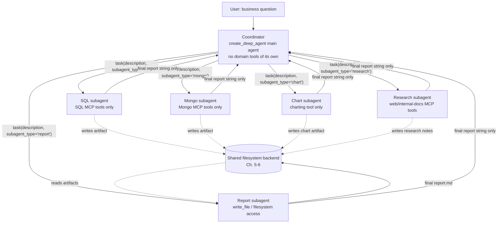
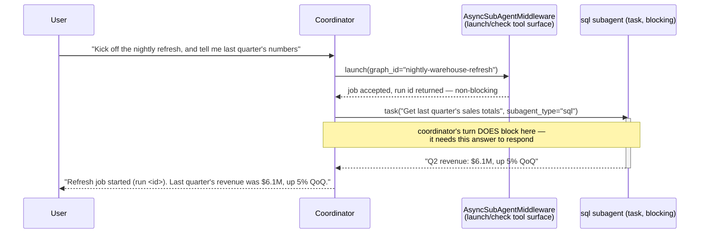
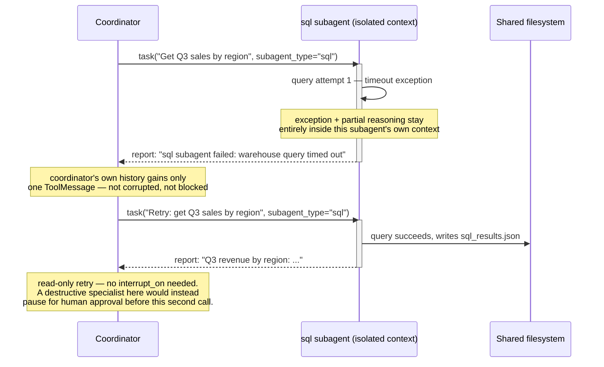

# Multi-Agent Systems

> There is no new primitive in this chapter. There is only what happens when you stop using `task()` to delegate one focused subtask at a time and start using it to run an entire organization chart.

## Learning Objectives

By the end of this chapter, you will be able to:

- Explain why "multi-agent system" in a DeepAgents context is an **architecture pattern applied to Chapter 8's primitives**, not a separate feature surface — there is no `create_multi_agent()` function, no new middleware class introduced here
- Design a coordinator/specialist topology: one main agent whose `system_prompt` teaches it *when* to delegate to *which* `subagent_type`, backed by narrowly-scoped declarative subagents each carrying only the tools its specialty needs
- Make the sync-vs-async subagent decision deliberately: `SubAgent`/`CompiledSubAgent` via the synchronous `task` tool for anything the coordinator needs an answer to before continuing, `AsyncSubAgent` for background work the coordinator (or the user) will check on later
- Build the **Enterprise BI Assistant** — a coordinator plus `"sql"`, `"mongo"`, `"chart"`, and `"report"` subagents — that decomposes a single business question into an ordered sequence of `task` calls, with the `"report"` subagent assembling a final Markdown file from artifacts the other subagents left on the shared filesystem
- Reason correctly about failure isolation: why a subagent's internal exception doesn't corrupt the coordinator's own message history, what the coordinator actually sees when a subagent fails, and where `interrupt_on` approval belongs before letting a coordinator retry a subagent's destructive action automatically

---

## Prerequisites for This Chapter

This chapter is a direct extension of **Chapter 8 (Subagent Orchestration)** — if any of the following is fuzzy, stop and re-read Chapter 8 before continuing, because this chapter deliberately does not re-derive it:

- The three subagent shapes: `SubAgent` (declarative dict — `name`, `description`, `system_prompt`, optional `tools`/`model`/`middleware`/`interrupt_on`/`skills`/`permissions`/`response_format`), `CompiledSubAgent` (bring-your-own compiled `Runnable`), and `AsyncSubAgent` (`TypedDict` with required `graph_id`, optional `url`/`headers`).
- The single synchronous `task(description, subagent_type)` tool the coordinator calls to dispatch to any `SubAgent`/`CompiledSubAgent`.
- **Context isolation**: each subagent invocation is stateless — it starts with a fresh context window, does its work, and only a final report string returns to the coordinator. The coordinator's own message history never sees the subagent's intermediate tool calls, reasoning, or errors.

You'll also be drawing on:

- **Chapter 5 (Filesystem-Backed Context)** and **Chapter 6 (Backends & Storage Architecture)**: `write_file`/`read_file` as the mechanism subagents use to hand artifacts to each other via a shared backend, rather than through the coordinator's context.
- **Chapter 9 (Human-in-the-Loop)**: `interrupt_on` as the gate you'll want before a coordinator is allowed to retry a subagent's destructive action unattended.
- **Chapter 11 (MCP Integration)**: the pattern of wiring a specific MCP server's tools onto one subagent's `tools=[...]` list — the SQL and Mongo specialists below are a direct continuation of that Analytics Agent.

If Chapter 8 is solid, this chapter should feel like a design exercise, not new API surface — because it is one.

---

## 1. This Is Application, Not a New Mechanism

Get this framing straight before anything else, because it changes what you should expect to find if you go looking for a "multi-agent" class or parameter in the `deepagents` source: **you won't find one.** There is no `MultiAgentMiddleware`, no `create_multi_agent()`, no dedicated "coordinator" type. Everything this chapter builds is the same `create_deep_agent(subagents=[...])` call from Chapter 8, used at a larger scale, with a `system_prompt` written for a specific job: deciding *when* to delegate and *to whom*, rather than doing domain work itself.

If you've built supervisor/orchestrator topologies in plain LangGraph — a router node dispatching to worker subgraphs via conditional edges — this is the same idea, expressed through a different substrate. What you'd otherwise hand-roll as graph edges, conditional routing functions, and manual state-passing between subgraphs, DeepAgents gives you for free through:

| Hand-rolled LangGraph multi-agent | DeepAgents equivalent |
|---|---|
| A router node with conditional edges to worker subgraphs | The coordinator's `system_prompt` + the `task(description, subagent_type)` tool |
| Manually serializing/passing state between subgraphs | Context isolation — the subagent gets a fresh context, returns a final report (Ch. 8) |
| A shared `Store` or state key for exchanging large artifacts between subgraphs | The filesystem backend (Ch. 5–6) — one subagent's `write_file`, another's `read_file` |
| A `Send` for fire-and-forget background work | `AsyncSubAgent` — a genuinely separate deployed graph, routed through its own middleware |
| Hand-written retry/error-handling around each worker invocation | The coordinator treating a bad subagent report like any other tool result it can react to (Section 5) |

The payoff of recognizing this: nothing here requires new debugging instincts. When a coordinator misroutes a task, you inspect its `system_prompt` and the subagent `description` fields it's choosing between — exactly the same category of problem as a misrouted conditional edge, just expressed in natural language instead of a Python predicate.

### 1.1 What actually changes as specialist count grows

Chapter 8 covered a single subagent, or perhaps two, as the teaching example — the coordinating logic barely needed to be a design decision at all when there were only one or two `subagent_type` choices. Once you're at five specialists, two things that were negligible at small scale start to matter:

- **The coordinator's own `system_prompt` becomes a genuine routing specification, not a one-line mention of a subagent.** At two specialists, "delegate SQL questions to `sql`, everything else to `mongo`" is a complete routing policy. At five, you need explicit statements of scope *and* ordering dependencies (Section 4.2's coordinator prompt does both), because the model has meaningfully more ways to choose wrong.
- **Every specialist added to `subagents=[...]` is a specialist the coordinator's `system_prompt` needs to actually mention**, by name and by scope, or it effectively doesn't exist from the coordinator's point of view — being present in the list is necessary but not sufficient for the coordinator to reliably reach for it. This is the exact gap the Hands-On Exercise's step 2 forces you to close for the fifth specialist: adding an entry to `subagents=[...]` without updating the coordinator's prompt produces a subagent nothing ever routes to.

Neither point is a new mechanism — both are just consequences of the coordinator's routing logic living entirely in natural-language prompt content, scaling the same way any prompt-engineering surface scales: more cases to state explicitly as the number of cases grows.

---

## 2. The Coordinator + Specialist Topology

The shape this chapter builds toward: one coordinator, five narrowly-scoped specialists, each reachable only through `task`, each starting from a clean context window, each carrying only the tools relevant to its job.



Five things to notice in this diagram before writing any code:

1. **The coordinator has no domain tools of its own.** It doesn't hold SQL MCP tools, Mongo MCP tools, or a charting tool directly — its entire job is deciding which specialist handles which piece of the question, and its own `tools=[...]` list (if non-empty at all) should stay limited to genuinely cross-cutting concerns, not domain work that belongs to a specialist.
2. **Each arrow into a subagent is a `task` call** — the same single tool from Chapter 8, parameterized by a different `subagent_type` each time. There is no separate dispatch mechanism per specialist.
3. **Each specialist is context-isolated** (Ch. 8) — the SQL subagent's intermediate reasoning about which table to query never enters the coordinator's context; only its final report string does.
4. **Artifacts move sideways through the filesystem backend, not through the coordinator.** A chart image or a large query result set would blow up the coordinator's context if it were relayed as a report string — instead, a subagent writes it to a shared path, and a downstream subagent (here, `"report"`) reads it directly.
5. **Different specialists can run different models.** The `"chart"` subagent formatting a plotting call doesn't need the same model tier as the `"sql"` subagent reasoning about a join — Chapter 8's per-subagent `model=` override applies exactly the same way here, just now motivated by a concrete cost/latency tradeoff across five specialists instead of one.

### 2.1 The `description` field is the entire routing signal — treat it accordingly

There is exactly one piece of information the coordinator has for choosing a `subagent_type`: each specialist's `description` string, surfaced to it the same way a tool's docstring is surfaced for ordinary tool selection. There is no separate routing table, no keyword matcher, no confidence score — it's the model reading five short strings and picking one, informed further by whatever the coordinator's own `system_prompt` says about sequencing. This means two `description` fields that overlap in scope produce genuinely nondeterministic routing, not a bug in the framework:

| Specialist | Weak `description` (ambiguous) | Strong `description` (disambiguated) |
|---|---|---|
| `"sql"` | "Handles data questions." | "Query the relational sales warehouse (orders, regions, products) for historical sales, revenue, order counts, or region/product breakdowns." |
| `"mongo"` | "Handles data questions." | "Query the operational MongoDB store (support tickets, reviews, session logs) for qualitative or document-shaped data not in the SQL warehouse." |

Given the weak pair, a question like "why did Central region underperform in Q3" could plausibly route to either specialist — both descriptions claim "data questions" with no boundary drawn between structured/relational data and unstructured/document data. Given the strong pair, the same question routes deterministically to `"sql"` first (it's a quantitative regional question) with `"mongo"` reserved for a natural follow-up like "what are support tickets from that region saying." Writing specialist `description`s is consequently not a documentation afterthought — it's the primary lever you have over routing correctness, and it deserves the same iteration and testing as a tool's docstring in Chapter 8's single-subagent case, just now under the added pressure of *other* descriptions competing for the same request.

---

## 3. Sync vs. Async Subagents: An Explicit Architecture Decision

Chapter 8 introduced `AsyncSubAgent` as a third subagent shape alongside `SubAgent`/`CompiledSubAgent`. In a multi-agent system, choosing between them stops being a syntax question and becomes an architecture decision you make once per specialist, up front:

**Ask: does the coordinator's own tool-calling turn need to block on this specialist's answer before it can decide what to do next?**

- **Yes → sync subagent** (`SubAgent`/`CompiledSubAgent`, dispatched via `task`). The SQL specialist answering "what were Q3 sales by region" is exactly this: the coordinator cannot decide whether to hand off to the chart specialist until it has the SQL specialist's numbers. Blocking here is correct — there's nothing useful for the coordinator to do concurrently.
- **No → async subagent** (`AsyncSubAgent`, routed through `AsyncSubAgentMiddleware`). A nightly warehouse-refresh job, or a long-running "build a 40-page deep-dive report" task the user will check on tomorrow, has no reason to occupy the coordinator's synchronous turn. `AsyncSubAgentMiddleware` is only installed at all when `subagents=[...]` includes at least one `AsyncSubAgent` — and it hangs its own separate tool surface off the agent for launching, checking status on, updating, cancelling, and listing these remote tasks. (The exact tool names aren't part of the confirmed ground truth for this course — treat this as a capability set, not a fixed API to memorize; verify current tool names against the `deepagents` source before depending on a specific name in code.)

The two are architecturally different, not just two flavors of the same call: `task` executes a subagent inline, as part of the same graph run, and the coordinator's turn doesn't continue until it returns. An `AsyncSubAgent` is a genuinely separate, typically LangSmith-deployed graph (`graph_id`, optional `url`/`headers`) that the coordinator *launches* and can come back to *check on* in a later turn — it is explicitly **not** invoked through `task`.

A coordinator is free to mix both in the same `subagents=[...]` list:

```python
from deepagents import create_deep_agent

coordinator = create_deep_agent(
    model="anthropic:claude-sonnet-4-6",
    system_prompt=COORDINATOR_SYSTEM_PROMPT,  # Section 4 builds this out in full
    subagents=[
        # --- Synchronous specialists: the coordinator needs their answer now ---
        sql_subagent,        # SubAgent — Section 4
        mongo_subagent,      # SubAgent — Section 4
        chart_subagent,      # SubAgent — Section 4
        report_subagent,     # SubAgent — Section 4

        # --- Async specialist: background work, checked on later, not via task ---
        {
            "graph_id": "nightly-warehouse-refresh",
            "url": "https://my-langsmith-deployment.example.com",
        },
    ],
)
```

The four declarative `SubAgent`s remain reachable only through `task(description, subagent_type=...)`, exactly as in Chapter 8. The `AsyncSubAgent` entry is never a valid `subagent_type` argument to `task` — it's dispatched and monitored through the separate tool surface `AsyncSubAgentMiddleware` installs, precisely because installing even one `AsyncSubAgent` in the list is what causes that middleware to be added at all.

| | Sync (`SubAgent`/`CompiledSubAgent`) | Async (`AsyncSubAgent`) |
|---|---|---|
| Dispatched via | `task(description, subagent_type)` | Separate launch/check/update/cancel/list tool surface |
| Blocks coordinator's turn | Yes — coordinator waits for the final report | No — coordinator can continue, or end its turn, and check back later |
| Where it runs | Inline, in-process, part of the same graph invocation | A separately deployed graph (`graph_id`, `url`/`headers`) |
| Right for | Quick, focused work the next decision depends on | Long-running background jobs (nightly refresh, multi-hour report builds) |
| Example in this chapter | `"sql"`, `"mongo"`, `"chart"`, `"report"` | `nightly-warehouse-refresh` |

A coordinator's single turn can mix both dispatch styles without contradiction — a user might ask "kick off the nightly refresh, and while that's running, tell me last quarter's numbers" in one message. The two calls don't compete for the same blocking behavior:



Notice the asymmetry: the `launch` call to the async middleware returns immediately with an acknowledgment, while the `task` call to `"sql"` genuinely blocks the coordinator's turn until the specialist's report comes back — because the user's question can't be answered without it. A later message ("did the refresh finish?") would trigger a check-status call against the same async tool surface, on a completely separate turn, with no `task` involved at all.

---

## 4. Project: The Enterprise BI Assistant

The goal: a coordinator that takes a single business question — *"What were Q3 sales trends by region, chart it, and write a report"* — and decomposes it into an ordered sequence of `task` calls to four specialists, with the last specialist assembling a Markdown report from files the others left behind. This extends the Analytics Agent introduced with MCP tooling in Chapter 11: same specialists, now explicitly composed under one coordinator.

### 4.1 The four sync specialists

Each subagent gets a narrow `system_prompt` and a `tools` list scoped to exactly its job — the Chapter 11 pattern of assigning specific MCP tool subsets per subagent, applied to four specialists at once instead of one.

```python
from deepagents import create_deep_agent, SubAgent

# sql_mcp_tools and mongo_mcp_tools are assumed already wired via
# MultiServerMCPClient, exactly as in Chapter 11 — only the relevant
# server's tools are handed to the specialist that needs them.

sql_subagent: SubAgent = {
    "name": "sql",
    "description": (
        "Query the relational sales warehouse (orders, regions, products) "
        "and return a factual summary of the numbers requested. Use for any "
        "question about historical sales, revenue, order counts, or region/"
        "product breakdowns backed by the SQL warehouse."
    ),
    "system_prompt": (
        "You are a SQL analyst. You have access only to the SQL warehouse "
        "MCP tools. Write precise queries, verify row counts look sane "
        "before reporting them, and write your raw result set to "
        "/workspace/sql_results.json via write_file before summarizing. "
        "Your final report to the coordinator should be a concise prose "
        "summary of the numbers, not the raw rows."
    ),
    "tools": sql_mcp_tools,
}

mongo_subagent: SubAgent = {
    "name": "mongo",
    "description": (
        "Query the operational MongoDB store (customer support tickets, "
        "product reviews, session logs) for anything not backed by the SQL "
        "warehouse. Use for qualitative or document-shaped data."
    ),
    "system_prompt": (
        "You are a MongoDB analyst. You have access only to the Mongo MCP "
        "tools. Write your raw findings to /workspace/mongo_results.json "
        "via write_file, then return a concise prose summary."
    ),
    "tools": mongo_mcp_tools,
}

chart_subagent: SubAgent = {
    "name": "chart",
    "description": (
        "Render a chart image from data that has already been gathered by "
        "the sql or mongo specialists. Use only after the relevant data "
        "already exists on the filesystem — this subagent does not query "
        "any data source itself."
    ),
    "system_prompt": (
        "You are a charting specialist. Read the relevant JSON artifact "
        "(e.g. /workspace/sql_results.json) via read_file, call the "
        "render_chart tool to produce an image, and save it to "
        "/workspace/charts/<descriptive-name>.png. Report back the exact "
        "file path you wrote, and nothing else — the report specialist "
        "will read it from there."
    ),
    "tools": [render_chart_tool],
}

report_subagent: SubAgent = {
    "name": "report",
    "description": (
        "Assemble a final Markdown report from artifacts other specialists "
        "have already written to the shared filesystem. Use as the last "
        "step, once the data and chart subtasks are complete."
    ),
    "system_prompt": (
        "You are a report writer. Use read_file to pull in whatever JSON "
        "and chart artifacts under /workspace/ are relevant to the "
        "requested report, then use write_file to produce a polished "
        "Markdown report at /workspace/reports/<descriptive-name>.md, "
        "embedding chart images by their file path and summarizing the "
        "sql/mongo findings in prose. Report back the final report's file "
        "path."
    ),
    "tools": [],  # filesystem tools (read_file/write_file) — Ch. 5-6
}
```

Two design choices worth calling out explicitly:

- **`chart` and `report` don't get MCP data-source tools at all.** They only ever operate on artifacts already written by `sql`/`mongo` — this is a deliberate narrowing, not an oversight, and it's exactly the "focused tool subset per subagent" discipline this chapter's Common Mistakes section returns to.
- **The filesystem is the hand-off mechanism between subagents, not the coordinator.** The coordinator never sees the contents of `sql_results.json` or the chart PNG — only each subagent's short prose report. This keeps the coordinator's own context small even as the underlying data volume grows, which is precisely the "final report only" context-isolation guarantee from Chapter 8 doing useful work at the system level, not just the single-subagent level.

### 4.2 The coordinator's system prompt

The coordinator's entire job is decomposition and sequencing — teaching it *when* to delegate to *which* `subagent_type`, and in what order, given that `chart` depends on `sql`/`mongo` having already run, and `report` depends on everything else:

```python
COORDINATOR_SYSTEM_PROMPT = """\
You are a BI coordinator. You do not query data sources, render charts, or \
write reports yourself — you decompose the user's business question into \
an ordered sequence of task() calls to your specialist subagents, and \
synthesize their reports into a final answer.

Your specialists:
- "sql": relational sales-warehouse questions (revenue, orders, regions, products).
- "mongo": qualitative/document data (support tickets, reviews, session logs).
- "chart": renders a chart image, but ONLY from data sql/mongo have already \
  written to the filesystem — always delegate to sql/mongo for the underlying \
  data BEFORE delegating to chart.
- "report": assembles a final Markdown report from artifacts already on the \
  filesystem — always delegate to this LAST, after every other needed \
  subtask has completed.

For a request like "what were Q3 sales trends by region, chart it, and \
write a report":
1. task("Get Q3 sales totals broken down by region from the sales warehouse", \
   subagent_type="sql")
2. task("Render a bar chart of Q3 sales by region from /workspace/sql_results.json", \
   subagent_type="chart")
3. task("Write a Markdown report on Q3 regional sales trends, embedding the \
   chart at the path the chart subagent reported", subagent_type="report")

Only call "mongo" when the question involves qualitative or document data. \
Never call "chart" or "report" before the data subtasks they depend on have \
completed successfully.
"""

coordinator = create_deep_agent(
    model="anthropic:claude-sonnet-4-6",
    system_prompt=COORDINATOR_SYSTEM_PROMPT,
    subagents=[sql_subagent, mongo_subagent, chart_subagent, report_subagent],
)
```

### 4.3 Running it

```python
result = coordinator.invoke({
    "messages": [{
        "role": "user",
        "content": "What were Q3 sales trends by region? Chart it and write me a report.",
    }],
})

print(result["messages"][-1].content)
```

A representative (illustrative, not executed) trace of the coordinator's own tool calls — note that this is the *coordinator's* message history, three `task` calls and their returned reports, none of the underlying SQL queries or chart-rendering tool calls the specialists made internally:

```
AIMessage: tool_calls=[task(
    description="Get Q3 sales totals broken down by region from the sales warehouse",
    subagent_type="sql",
)]
ToolMessage: "Q3 revenue by region: West $2.1M (+12% QoQ), East $1.8M (+4% QoQ), \
Central $1.4M (-3% QoQ), South $0.9M (+18% QoQ). Full result set written to \
/workspace/sql_results.json."

AIMessage: tool_calls=[task(
    description="Render a bar chart of Q3 sales by region from /workspace/sql_results.json",
    subagent_type="chart",
)]
ToolMessage: "Chart written to /workspace/charts/q3_sales_by_region.png."

AIMessage: tool_calls=[task(
    description="Write a Markdown report on Q3 regional sales trends, embedding \
the chart at /workspace/charts/q3_sales_by_region.png",
    subagent_type="report",
)]
ToolMessage: "Report written to /workspace/reports/q3_sales_by_region.md."

AIMessage: "Q3 sales trended up in three of four regions, led by South (+18% \
QoQ) and West (+12% QoQ); Central was the one region in decline (-3% QoQ). \
Full report: /workspace/reports/q3_sales_by_region.md."
```

Everything the SQL specialist actually did to get to "$2.1M (+12% QoQ)" — which tables it queried, how many attempts it took, whatever reasoning it did about date ranges — is invisible here by design. The coordinator's context stays proportional to the number of specialists it consulted, not to the volume of data any one of them touched.

### 4.4 Adding the async specialist

Extending this coordinator with a background nightly refresh is additive — nothing about the four sync specialists changes:

```python
coordinator = create_deep_agent(
    model="anthropic:claude-sonnet-4-6",
    system_prompt=COORDINATOR_SYSTEM_PROMPT + """

You also have access to a background warehouse-refresh job. If the user \
asks you to "kick off" or "check on" the nightly refresh, use the \
async-task tools for the "nightly-warehouse-refresh" job rather than task() \
— it is not one of your task() subagent_types.
""",
    subagents=[
        sql_subagent, mongo_subagent, chart_subagent, report_subagent,
        {"graph_id": "nightly-warehouse-refresh", "url": "https://my-langsmith-deployment.example.com"},
    ],
)
```

The coordinator's prompt now explicitly distinguishes the two dispatch mechanisms in its own words — a direct, necessary consequence of Section 3's architectural distinction: a model that has only ever been taught about `task()` has no way to infer, unprompted, that a different tool surface exists for the async job.

### 4.5 Observing the coordinator's delegation trace

Chapter 4 built a pattern for watching `state["todos"]` evolve turn by turn via `stream_mode="values"`. The same pattern applies directly here, just reading `messages` instead of `todos` — useful both for debugging a misrouted request and for the verification step in this chapter's Hands-On Exercise:

```python
for chunk in coordinator.stream(
    {"messages": [{
        "role": "user",
        "content": "What were Q3 sales trends by region? Chart it and write me a report.",
    }]},
    stream_mode="values",
):
    last = chunk["messages"][-1]
    if getattr(last, "tool_calls", None):
        for call in last.tool_calls:
            if call["name"] == "task":
                print(f"  -> delegating to subagent_type={call['args']['subagent_type']!r}")
```

Illustrative output, confirming both the specialists chosen and the order:

```
  -> delegating to subagent_type='sql'
  -> delegating to subagent_type='chart'
  -> delegating to subagent_type='report'
```

This is a genuinely useful production debugging tool, not just a teaching aid: if a request that should have triggered `"mongo"` never shows up in this trace, the fix is almost always in the `description`/`system_prompt` wording (Section 2.1), not in the framework — the trace tells you *what* the coordinator decided, which is the first thing to check before assuming something is broken at the middleware level.

### 4.6 Tuning cost and latency per specialist

Because each `SubAgent` can carry its own `model=` override (Ch. 8), a five-specialist system is exactly where that override starts paying for itself — the specialists doing simple, mechanical work don't need the same model tier as the ones doing open-ended reasoning:

| Specialist | Nature of the work | A defensible model choice |
|---|---|---|
| `"sql"` | Multi-step reasoning: table selection, join logic, sanity-checking results | Larger/frontier model |
| `"mongo"` | Similar reasoning over document queries | Larger/frontier model |
| `"chart"` | Mostly mechanical: read a known-shaped JSON file, call one charting tool | Smaller/cheaper model |
| `"report"` | Templated assembly of already-summarized content into Markdown | Smaller/cheaper model |
| Coordinator | Routing decisions from short descriptions, low reasoning depth per turn | Smaller/cheaper model, unless routing itself is getting decisions wrong |

```python
chart_subagent: SubAgent = {
    "name": "chart",
    "description": "...",
    "system_prompt": "...",
    "tools": [render_chart_tool],
    "model": "anthropic:claude-haiku-4-5",  # cheaper tier — mechanical work
}
```

Treat this table as a starting hypothesis, not a rule — if the `"chart"` specialist starts producing malformed file paths or mis-reading the JSON schema on a cheaper model, that's direct evidence it needs the more capable tier after all. The point of per-subagent `model=` isn't "always use the cheapest model that runs" — it's matching model capability to the actual reasoning demands of each specialist's narrow job, instead of paying frontier-model rates uniformly across a five-specialist system where four of the five jobs don't need it.

### 4.7 Gating the destructive step with `interrupt_on`

The `"report"` specialist's `write_file` call is the one genuinely destructive action in this whole topology — it can silently overwrite an existing report a business user already opened and forwarded to their VP. Chapter 9's `interrupt_on` is a per-`SubAgent` field (Section "Prerequisites" above, and Ch. 8's schema), so gating it lives entirely on the `"report"` specialist's own definition, without touching the coordinator or any other specialist:

```python
report_subagent: SubAgent = {
    "name": "report",
    "description": (
        "Assemble a final Markdown report from artifacts other specialists "
        "have already written to the shared filesystem. Use as the last "
        "step, once the data and chart subtasks are complete."
    ),
    "system_prompt": (
        "You are a report writer. Use read_file to pull in whatever JSON "
        "and chart artifacts under /workspace/ are relevant to the "
        "requested report, then use write_file to produce a polished "
        "Markdown report at /workspace/reports/<descriptive-name>.md..."
    ),
    "tools": [],
    "interrupt_on": {
        "write_file": True,  # human approval required before any write, incl. overwrites
    },
}
```

With this in place, a coordinator-initiated retry of a failed `"report"` call still pauses for human approval on the specialist's `write_file` step, exactly as a first attempt would — the retry gets no special unattended treatment just because "the model already decided to try again." This is precisely the mitigation Section 5 argues for below, applied concretely to the one specialist in this project where it matters; the read-only `"sql"`/`"mongo"`/`"chart"` specialists have no comparable destructive step and so carry no `interrupt_on` entry at all.

---

## 5. Failure Isolation

Context isolation (Ch. 8) has a direct, useful consequence for failure handling that's easy to underappreciate until you've watched it in practice: **a subagent's internal exception is confined to that subagent's own execution — it cannot corrupt the coordinator's own message history**, because the coordinator never had that history in its context to begin with. All the coordinator ever sees is whatever final report the subagent invocation produced (or whatever error surfaces as that report).

Concretely, if the `"sql"` subagent's tool call against the warehouse MCP server times out or throws mid-query, that failure and whatever partial reasoning led to it live entirely inside the `"sql"` subagent's own isolated run. The coordinator's context still only gains one thing: a `ToolMessage` result from its `task(..., subagent_type="sql")` call — just now, that result is an error report instead of a clean summary, something like `"sql subagent failed: warehouse query timed out after 30s."` The coordinator's own prior messages, its own plan, its own reasoning about the other three specialists it's about to call — none of it is touched.

This has a practical payoff: **the coordinator can reasonably retry.** Because the failure arrives as an ordinary tool result rather than a corrupted context, the coordinator can react to it exactly the way it reacts to any other tool result it doesn't like — by calling `task` again, either at the same specialist (transient timeout, worth one retry) or a different one (if, say, `"mongo"` can answer a fallback version of the same question the warehouse timeout blocked). This is qualitatively better than the failure mode you'd get from a flat, non-isolated tool-calling loop, where a mid-call exception can leave a half-formed tool result wedged into the *coordinator's own* history, confusing every subsequent turn.

Where this gets dangerous is if the retried action is destructive rather than read-only. A `"sql"` specialist that only reads is safe to retry freely. A hypothetical specialist that writes to a production system, kicks off a real financial transaction, or deletes something is not — an automatic, unattended coordinator retry of a failed destructive subagent call is exactly the kind of action Chapter 9's `interrupt_on` gating exists for. Concretely: give the specialist itself an `interrupt_on` configuration (Ch. 8's `SubAgent` fields include it directly) covering its destructive tool(s), so that a human approves the *retry* attempt the same way they'd approve the original attempt — rather than letting "the first call failed, so obviously try again" become an unattended, unreviewed second attempt at a side-effecting action. Section 4.7 applies exactly this to the Enterprise BI Assistant's `"report"` specialist.

Retrying at a *different* specialist is the same mechanism, just with the coordinator choosing a different `subagent_type` on the second `task` call instead of repeating the first one:

```
AIMessage: tool_calls=[task("Get Q3 support-ticket volume by region", subagent_type="mongo")]
ToolMessage: "mongo subagent failed: connection to document store refused."

AIMessage: tool_calls=[task(
    "Get Q3 support-ticket volume by region — mongo is unavailable, check if "
    "the sql warehouse has a ticket-count summary table as a fallback",
    subagent_type="sql",
)]
ToolMessage: "sql subagent: found a `support_ticket_summary` table with weekly "
"aggregate counts by region — reporting from that instead."
```

This only works because the coordinator's own prompt (or its own reasoning, for a capable enough model) treats a failed report as *information to act on*, not as an opaque stop signal. It's worth being honest about the limit here, too: the coordinator can only infer as much as the failing specialist's report tells it. A `"mongo"` specialist that returns a bare `"error"` string gives the coordinator nothing to reason a fallback from; one that returns `"mongo subagent failed: connection to document store refused"` gives it enough detail to recognize *this specific failure* is a connectivity issue worth trying a fallback path for, rather than, say, a malformed query worth retrying identically. Specialist system prompts should be written with this in mind — a failure report is itself an interface contract with the coordinator, not an afterthought.



---

## Real-World Scenario

A retail analytics team already has the Chapter 11 Analytics Agent — one deep agent with SQL and Mongo MCP tools directly bound to it, answering ad hoc data questions in Slack. As usage grows, two problems show up: business users start asking compound questions ("pull the numbers, chart them, and send me something I can forward to my VP"), and the single agent's system prompt has grown unwieldy trying to cover query-writing conventions, charting conventions, and report-formatting conventions all in one place, with the model occasionally blending them — writing chart-description prose where a query result was expected.

The team restructures without touching the underlying MCP tool wiring or business logic: they split query-writing (`"sql"`, `"mongo"`), chart-rendering (`"chart"`), and report-assembly (`"report"`) into four separate declarative subagents, each with its own narrow system prompt, and stand up a coordinator whose sole job is deciding which of the four to call and in what order. The compound Slack request now decomposes cleanly into the sequence from Section 4.3, and — because each specialist's context never grows past its own single job — the team also notices meaningfully lower per-request token cost, since the SQL specialist's context never has to carry chart-formatting instructions it never needed, and vice versa.

A rough edge shows up almost immediately: for the first week, roughly one in six requests that should have gone to `"mongo"` (a support-ticket-sentiment question) got routed to `"sql"` instead, which dutifully tried and failed to find sentiment data in the warehouse. Pulling the coordinator's delegation trace (Section 4.5) makes the cause obvious — both specialists' original `description` fields said some variant of "answers data questions" without drawing a structured/unstructured boundary. Tightening the descriptions per Section 2.1's comparison table fixes the misroute without touching a single line of routing logic, because there isn't any — the fix lives entirely in two strings.

Three months later, the team adds an `AsyncSubAgent` for a genuinely long nightly warehouse-materialization job that previously ran as a cron script outside the agent entirely — now the coordinator can report on its status in the same conversation, without ever blocking a synchronous question on it. When a well-meaning engineer later proposes letting the coordinator auto-retry a failed `"report"` write (the specialist occasionally overwrites an existing report file with the same name on retry), the team declines to automate that specific case: the `"report"` subagent's `write_file` call is destructive by nature, and an unattended retry risks silently clobbering a report a business user already opened. They add `interrupt_on` on the `"report"` specialist's write path instead (Ch. 9), so a human confirms before any retry that overwrites an existing file.

---

## Best Practices

- **Give the coordinator zero or near-zero domain tools.** Its job is routing, not doing — if you find yourself binding a SQL tool directly to the coordinator "just in case," that's a sign a fifth specialist is missing, not a reason to skip building one.
- **Write specialist `description` fields as carefully as the coordinator's `system_prompt`.** The coordinator's only signal for choosing a `subagent_type` is that field — a vague or overlapping `description` between two specialists (e.g. both `"sql"` and `"mongo"` claiming to handle "sales data") produces genuinely nondeterministic routing.
- **Encode sequencing dependencies explicitly in the coordinator's prompt**, as Section 4.2 does ("always delegate to sql/mongo before chart; report last"). Nothing in the framework enforces subagent call ordering — it's entirely a property of how well the coordinator's prompt states the dependency graph.
- **Use the filesystem, not the coordinator, to move large artifacts between specialists.** A chart image or a full query result set relayed as a `task` report string defeats the whole point of context isolation — write it once, hand back a path, let the next specialist read it directly (Ch. 5–6).
- **Make the sync/async decision once per specialist, deliberately, using Section 3's question** — "does the coordinator need this answer before its next decision?" — rather than defaulting everything to `task` out of familiarity.
- **Gate destructive subagent actions — and their retries — behind `interrupt_on`.** Read-only specialists can be retried freely on failure; anything that writes, deletes, or triggers a downstream side effect should require human approval before a coordinator-initiated retry, not just before the first attempt.
- **Write specialist failure reports as an interface contract, not an afterthought.** A coordinator can only make a sensible retry-or-fallback decision from the detail a failing specialist actually returns — instruct every specialist's `system_prompt` to report *what* failed and *why* in its final message, not just that something went wrong.
- **Assign a model per specialist based on the actual reasoning demand of its job, not uniformly.** A `"chart"` or `"report"` specialist doing templated, mechanical work is a strong candidate for a cheaper model tier; a `"sql"`/`"mongo"` specialist doing open-ended query reasoning usually isn't (Section 4.6).

---

## Common Mistakes

- **Using a sync subagent for genuinely long background work, blocking the coordinator unnecessarily.** A multi-hour report build or a nightly data-warehouse refresh dispatched via `task` ties up the coordinator's turn for the entire duration — that work belongs behind an `AsyncSubAgent`, launched and checked on later, not synchronously awaited.
- **Giving every subagent every tool "to be safe."** A `"chart"` specialist holding SQL MCP tools it never needs isn't harmless — it's a larger attack surface, a larger context footprint per invocation, and a standing invitation for the model to blur specialist boundaries (e.g. querying data directly from inside the chart subagent instead of reading the artifact the SQL specialist already wrote). Assign the narrowest tool subset each specialist's job actually requires, as Section 4.1 does.
- **Forgetting that subagent failures need their own handling.** The coordinator does not see a subagent's internal stack trace, retry attempts, or partial tool-call history — only the final report string that invocation produced. If that report is vague on failure (e.g. a bare `"error"` with no detail), the coordinator has nothing useful to react to. Write specialist system prompts that explicitly instruct the subagent to report failures in enough detail for the coordinator to make a sensible retry-or-fallback decision.
- **Letting a coordinator retry a destructive subagent call unattended just because the first attempt failed.** "It failed once, try again" is a reasonable default for read-only work and a dangerous default for anything with side effects — gate the retry behind `interrupt_on` exactly as you would the original call (Ch. 9).
- **Treating `AsyncSubAgent` as a faster `task`.** It is a different tool surface entirely, backed by a separately deployed graph — a coordinator whose prompt never mentions the distinction will simply never use it, or will try to pass it as a `subagent_type` to `task` and fail.
- **Letting a specialist's failure report collapse to a bare `"error"` string.** A coordinator that receives no more detail than "it failed" has no basis for choosing between "retry the same specialist," "fall back to a different one," or "give up and tell the user" — that decision quality is bounded entirely by how much the failing specialist's own system prompt instructs it to explain itself on failure.
- **Writing overlapping `description` fields between two specialists** (Section 2.1) and then being surprised routing is inconsistent. The coordinator has no tie-breaking mechanism beyond the model's own read of those strings — ambiguity in the descriptions *is* ambiguity in the routing, not a separate bug to hunt for elsewhere.

---

## Summary

- Multi-agent systems in DeepAgents are an **application** of Chapter 8's subagent primitives — coordinator + specialists, sync `task` dispatch, context isolation — not a new mechanism or a new middleware class.
- The topology: one coordinator with no domain tools of its own, five specialists (Research, SQL, Mongo, Chart, Report in this chapter's running example), each reachable only through `task(description, subagent_type)`, each context-isolated, each carrying only the tools its job needs.
- Sync (`SubAgent`/`CompiledSubAgent` via `task`) vs. async (`AsyncSubAgent`, via its own separate tool surface) is a deliberate architecture decision per specialist: block the coordinator only when its next decision genuinely depends on the answer; push anything long-running or backgroundable to an `AsyncSubAgent` instead.
- The Enterprise BI Assistant composed four sync specialists — `"sql"`, `"mongo"`, `"chart"`, `"report"` — under one coordinator whose `system_prompt` encodes both *which* specialist handles which subtask and the *order* dependencies between them (data before chart, everything before report), with artifacts handed off between specialists through the shared filesystem backend rather than through the coordinator's own context.
- Failure isolation is a direct, useful consequence of context isolation: a subagent's internal exception never corrupts the coordinator's own history, only surfaces as that invocation's final (error) report — which the coordinator can react to by retrying, same specialist or different, exactly like any other tool result. Destructive subagent actions need `interrupt_on` gating before an automatic retry, not just before the first attempt.
- Two levers do most of the practical work in a system like this: each specialist's `description` string (the coordinator's entire routing signal — Section 2.1) and each specialist's failure-report wording (the coordinator's entire basis for retry-or-fallback decisions — Section 5). Both are just strings you write and iterate on, not framework configuration.
- Per-specialist `model=` overrides (Ch. 8) are worth revisiting deliberately in a multi-specialist system: mechanical specialists (`"chart"`, `"report"`) are strong candidates for a cheaper tier, while specialists doing open-ended query reasoning (`"sql"`, `"mongo"`) usually aren't (Section 4.6).

---

## Knowledge Check

1. A teammate asks where in the `deepagents` source the "multi-agent" feature is implemented. What's the accurate answer, and what existing Chapter 8 primitive is actually doing the work?
2. In the Enterprise BI Assistant, why does the `"chart"` subagent not get any MCP data-source tools, even though it needs data to render a chart?
3. Explain, using Section 3's decision question, why a nightly warehouse refresh belongs behind an `AsyncSubAgent` rather than being one more `SubAgent` the coordinator reaches via `task`.
4. The coordinator's `system_prompt` in Section 4.2 explicitly states an ordering constraint ("always delegate to sql/mongo before chart"). What enforces this ordering at the framework level? What happens if the prompt omits it?
5. The `"sql"` subagent's warehouse query times out. Describe exactly what does and does not appear in the coordinator's own message history as a result, and why that's the direct consequence of Chapter 8's context-isolation guarantee.
6. Why should a coordinator's automatic retry of a failed subagent call be treated differently depending on whether that subagent's action was read-only versus destructive? Which chapter's mechanism closes the gap for the destructive case?
7. Two specialists, `"sql"` and `"mongo"`, both have a `description` that says "handles data questions about sales." A request arrives that a human would obviously send to `"mongo"` (a support-ticket sentiment question), but the coordinator routes it to `"sql"` instead. Where does the fix belong, and where does it specifically not belong?

---

## Hands-On Exercise

Extend the Enterprise BI Assistant with a fifth specialist — `"research"` — completing the five-specialist topology from Section 2's diagram.

1. **Define the `"research"` `SubAgent`.** Give it a `description` scoped to gathering external or internal-docs context that isn't in the SQL warehouse or Mongo store (e.g. industry benchmarks, a company wiki page on regional market conditions) — wire whatever search/retrieval tool you have available (a web-search MCP tool, an internal-docs MCP tool, or a mocked tool for this exercise) onto its `tools=[...]`, and write a `system_prompt` instructing it to write its findings to `/workspace/research_notes.md` via `write_file` before returning a short summary.
2. **Update the coordinator's `system_prompt`** to describe when `"research"` should be consulted (e.g. only when the user's question references external context the warehouse/Mongo specialists can't answer — "how does our Q3 regional performance compare to industry benchmarks") and where it fits in the ordering relative to `"sql"`/`"mongo"`/`"chart"`/`"report"`.
3. **Add `"research"` to `subagents=[...]`** alongside the existing four.
4. **Verify correct delegation.** Ask the coordinator a question that should trigger `"research"` (one referencing external/benchmark context) and a question that shouldn't (a pure internal-numbers question), and confirm from the coordinator's tool-call trace that it delegates to `"research"` only in the first case — this is the practical test of whether your `description`/`system_prompt` wording actually disambiguates the specialist correctly, per this chapter's Best Practices.
5. **Extend the `"report"` subagent's prompt** to also read `/workspace/research_notes.md` when present, and confirm a report generated from a research-triggering question includes a section drawing on it, while a report from a pure-numbers question does not.
6. **Use Section 4.5's streaming trace pattern** to print the coordinator's `subagent_type` delegation sequence for both test questions from step 4, and confirm the printed sequence matches what you expected before running it — this is the same debugging technique you'd reach for in production if a sixth specialist's routing ever needs troubleshooting later.

---

## Further Reading

- [DeepAgents Overview (LangChain Docs)](https://docs.langchain.com/oss/python/deepagents/overview) — the official conceptual reference for the SDK
- [`langchain-ai/deepagents` GitHub repository](https://github.com/langchain-ai/deepagents) — read `libs/deepagents/deepagents/middleware/subagents.py` (and the async-subagent middleware alongside it) directly for the ground truth behind every claim in this chapter and Chapter 8
- Related course in this repo: [LangGraph Mastery](../langgraph-course/00-index.md) — the supervisor/orchestrator multi-agent patterns this chapter's coordinator design directly parallels, expressed through hand-rolled graph edges instead of subagent middleware

---

<div style="display:flex;justify-content:space-between;align-items:center;">
  <a href="./11-mcp-integration.md">← Previous: MCP Integration</a>
  <a href="./00-index.md">🏠 Index</a>
  <a href="./13-custom-tools-and-middleware.md">Next: Custom Tools & Middleware →</a>
</div>
