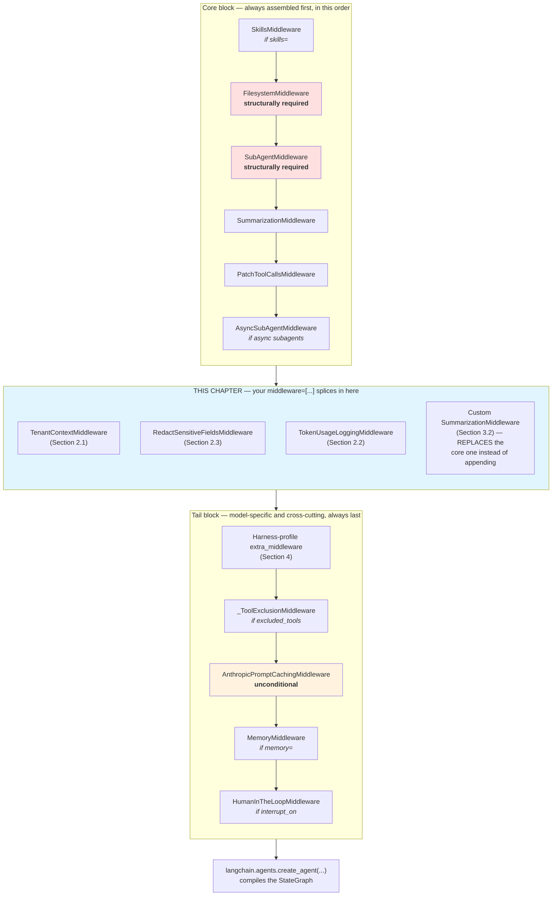

# Custom Tools & Middleware

> A custom tool needs nothing from you except an entry in `tools=`. A custom *middleware* needs you to understand exactly one thing precisely: where, in Chapter 2's eleven-position assembly order, your code will actually run relative to everything DeepAgents already wired in. Get that placement right and everything else — tenant scoping, cost telemetry, redaction, model-specific tool exclusion — is ordinary `AgentMiddleware` code you already know how to write.

## Learning Objectives

By the end of this chapter, you will be able to:

- State precisely why a custom tool is *not* a special case in DeepAgents — it is subject to the exact same `interrupt_on`/`permissions` gating and subagent-assignment mechanics as any built-in tool — and stop looking for a registration API that doesn't exist
- Write a custom `AgentMiddleware` using each of the three lifecycle hooks (`before_agent`, `wrap_model_call`/`awrap_model_call`, `modify_request`), matched to a concrete production need: request-scoped tenant injection, per-call token-usage logging, and field-level redaction
- Splice custom middleware into `create_deep_agent(middleware=[...])` and explain, using Chapter 2's exact assembly order, precisely where it lands — and why that position matters for what your middleware can see and influence
- Distinguish *replacing* a core middleware (by constructing your instance with the same factory/identity DeepAgents itself uses) from *appending* a new one, and pick correctly between them
- Register a `HarnessProfile` for a specific model spec that excludes an unsupported tool and disables the auto-added `general-purpose` subagent, and explain exactly why excluding `FilesystemMiddleware` or `SubAgentMiddleware` the same way raises `ValueError`
- Explain why `AnthropicPromptCachingMiddleware` is unconditionally present in every assembled stack, how Bedrock/Fireworks-aware variants activate, and how this composes with `MemoryMiddleware`'s own `add_cache_control` option

---

## Prerequisites for This Chapter

This chapter is a direct extension of **[Chapter 2: Architecture & Internals](./02-architecture-and-internals.md)** — if Section 3's eleven-position assembly order (`SkillsMiddleware` → `FilesystemMiddleware` → `SubAgentMiddleware` → `SummarizationMiddleware` → `PatchToolCallsMiddleware` → `AsyncSubAgentMiddleware` → *your `middleware=[...]`* → harness-profile `extra_middleware` → `_ToolExclusionMiddleware` → `AnthropicPromptCachingMiddleware` → `MemoryMiddleware` → `HumanInTheLoopMiddleware`) isn't fresh, re-read it before continuing. This chapter does not re-derive that order — it assumes you have it and shows you what to build *at* the splice point Chapter 2 already identified.

You should also have on hand, or be comfortable forward-referencing:

- **Chapter 8 (Subagent Orchestration)** and **Chapter 12 (Multi-Agent Systems)** — the subagent-assignment patterns (giving a tool to one subagent but not the parent, or vice versa) apply to custom tools identically to built-in ones; this chapter assumes that mechanic without re-explaining it.
- **Chapter 9 (Human-in-the-Loop)** — `interrupt_on` and `FilesystemPermission`-driven gating apply to any tool name, custom or built-in, uniformly; this chapter leans on that fact in Section 1 rather than re-teaching HITL mechanics.
- **Chapter 7 (Memory & Persistence)**, Section 3.3 — `MemoryMiddleware`'s `add_cache_control=True` option, which Section 5 of this chapter ties directly to `AnthropicPromptCachingMiddleware`.

And, as always, your existing background: you've written LangChain tools with `@tool` and reasoned about `bind_tools` before this course started, and you already understand ASGI/FastAPI-style middleware composition well enough that Chapter 2, Section 2 could lean on it as an analogy. This chapter assumes both without re-teaching them.

A note on precision: the exact keyword-argument names on `HarnessProfile`/`GeneralPurposeSubagentProfile` and the exact parameter lists on the `before_agent`/`modify_request` hooks were not independently confirmed down to the last field name in the research this course is built from. Where that's true, this chapter says so explicitly rather than asserting false precision — treat those specific spots as illustrative shape, and `libs/deepagents/deepagents/` on GitHub as the tiebreaker, exactly as Chapter 2 asked you to.

---

## 1. Custom Tools: There Is No Special Case

Here is the entire answer to "how does a custom tool differ from a built-in deepagents tool like `read_file` or `execute`?": **it doesn't.** A tool you wrote — a `@tool`-decorated function wrapping an internal billing API, an MCP-exposed tool from Chapter 11, a plain `BaseTool` subclass — is just another callable in the `tools=` sequence you pass to `create_deep_agent()`. There is no `register_custom_tool()` function, no special base class your tool needs to inherit from to be "deep-agent-aware," and no separate registry it needs to be added to.

```python
from langchain_core.tools import tool
from deepagents import create_deep_agent

@tool
def lookup_account_balance(account_id: str) -> str:
    """Look up the current balance for a billing account by ID."""
    # ... your existing FastAPI-service-backed implementation ...
    return f"Account {account_id}: balance $1,204.55"

agent = create_deep_agent(
    model=model,
    tools=[lookup_account_balance],   # exactly like any built-in tool would sit here
)
```

That's the whole registration story. Everything downstream of this — how the tool interacts with the rest of the stack — follows mechanics you've already met or will meet in nearby chapters, and none of them special-case "custom" versus "built-in":

- **`interrupt_on` gating (Chapter 9) applies by tool *name*, not by tool *origin*.** `interrupt_on={"lookup_account_balance": True}` interrupts your custom tool exactly the way `interrupt_on={"execute": True}` interrupts the built-in shell tool — `HumanInTheLoopMiddleware` doesn't know or care whether a tool name resolves to something DeepAgents shipped or something you wrote.
- **`FilesystemPermission`-derived interrupts (Chapter 9) are scoped to the filesystem tools specifically** (`read_file`, `write_file`, `edit_file`, and friends) — a custom tool that doesn't touch the configured `backend` simply isn't in scope for that mechanism, exactly as a built-in tool that didn't touch the filesystem wouldn't be.
- **Subagent assignment (Chapters 8, 11, 12) treats your tool like any other.** Give a `SubAgent`'s `tools` list a mix of built-ins and your own custom tools, or give the parent agent tools a subagent doesn't get — the assignment mechanics don't distinguish tool provenance at all.
- **Harness-profile tool exclusion (Section 4 below) works by tool name too.** `HarnessProfile(excluded_tools=["lookup_account_balance"])` is exactly as valid a configuration as excluding `execute` — model-specific tool suppression doesn't care who wrote the tool.

The reason this is worth stating explicitly, rather than assuming it's obvious, is that "custom tool integration" is a phrase that invites people newly arriving from other agent frameworks to go looking for an SDK-specific onboarding ceremony — a decorator, a manifest entry, a capability flag. DeepAgents deliberately has none of that for tools. The actual extension surface this chapter is about — the one with real mechanics worth learning — is **middleware**, not tools. That's Section 2 onward.

To make the subagent-assignment point concrete rather than asserted, here's the same custom tool from above, given to one subagent but withheld from the parent — the exact pattern Chapters 8/11/12 cover in depth, applied without modification to a tool you wrote instead of a built-in one:

```python
from deepagents import create_deep_agent, SubAgent

billing_subagent: SubAgent = {
    "name": "billing-specialist",
    "description": "Handles account-balance and billing lookups.",
    "system_prompt": "You answer billing questions using the tools available to you.",
    "tools": [lookup_account_balance],   # only this subagent gets it
}

agent = create_deep_agent(
    model=model,
    tools=[],                       # the parent itself never sees lookup_account_balance
    subagents=[billing_subagent],   # only reachable by delegating via `task`
)
```

Nothing about `lookup_account_balance` changed to make this possible — the same `tools` list on a `SubAgent` TypedDict that scopes built-in tools to a specific subagent scopes custom tools identically, because from the assembly logic's point of view, a tool is a tool.

---

## 2. Writing a Custom `AgentMiddleware`

Chapter 2 introduced `AgentMiddleware` (from `langchain.agents.middleware.types`) and its three lifecycle hooks at a conceptual level. This section writes one middleware per hook, each tied to a concrete production need this learner's FastAPI/Bedrock background makes immediately legible.

### 2.1 `before_agent` + `modify_request`: request-scoped tenant context

A multi-tenant FastAPI service typically resolves a tenant ID once per request — from a JWT claim, a subdomain, a header — and then needs every downstream operation scoped to it. The DeepAgents equivalent of "once per request" is **once per agent invocation**, which is exactly what `before_agent` is for: it runs a single time, before the model-call loop starts, which is the natural place to pull tenant context out of the invocation and seed it into state.

Chapter 2 was explicit that `modify_request` is the hook meant for altering the *outgoing request* — "e.g., injecting a system-prompt fragment, trimming messages" — which is the more precise tool for the actual system-prompt mutation than `before_agent` alone. The idiomatic split, then, is: `before_agent` resolves and seeds the tenant context into state once; `modify_request` reads it back out and stitches it into the request that's about to go to the model, on every model call in the loop (so it survives however many tool-calling turns the invocation takes):

```python
from langchain.agents.middleware.types import AgentMiddleware
from deepagents import DeepAgentState


class TenantContextMiddleware(AgentMiddleware):
    """Resolves a request-scoped tenant ID once per invocation (before_agent),
    then stitches a tenant-scoping instruction into every outgoing model
    request for the rest of the loop (modify_request).

    tenant_id is expected to arrive via the invocation's `context` — the same
    Runtime.context surface Chapter 7's NamespaceFactory reads a user_id from.
    """

    def before_agent(self, state: DeepAgentState, runtime) -> dict | None:
        tenant_id = runtime.context.get("tenant_id", "unknown-tenant")
        return {"tenant_id": tenant_id}

    def modify_request(self, request, state, runtime):
        tenant_id = state.get("tenant_id", "unknown-tenant")
        tenant_fragment = (
            f"\n\n<tenant_context>\n"
            f"You are operating on behalf of tenant `{tenant_id}`. Every "
            f"filesystem and tool operation you perform this turn is scoped "
            f"to this tenant only — never reference or infer data belonging "
            f"to a different tenant.\n"
            f"</tenant_context>"
        )
        # Exact request-mutation surface (appending to a system message vs.
        # a dedicated field) depends on your installed langchain-core version;
        # the shape below is illustrative of the intent, not a pinned API.
        request.system_prompt = (request.system_prompt or "") + tenant_fragment
        return request
```

Wiring it in is the same `middleware=[...]` argument you already know from `create_deep_agent()`'s signature (Chapter 3):

```python
from deepagents import create_deep_agent

agent = create_deep_agent(
    model=model,
    tools=[lookup_account_balance],
    middleware=[TenantContextMiddleware()],
)

agent.invoke(
    {"messages": [{"role": "user", "content": "What's my current balance?"}]},
    context={"tenant_id": "acme-corp"},
)
```

Notice what this buys you over hand-rolling tenant scoping into `system_prompt=` at construction time (the same argument Chapter 7, Section 2.1 made against hardcoding memory into the prompt string): the tenant ID is resolved **per invocation**, from `context`, not baked into the agent object at build time — one `create_deep_agent()` call, reused safely across every tenant's requests, exactly the pattern you already use for a single FastAPI dependency-injected service shared across tenants.

### 2.2 `wrap_model_call`/`awrap_model_call`: per-call token-usage logging

`wrap_model_call` (and its async twin `awrap_model_call`) is the hook that runs **once per model call inside the loop**, with full control over the request going in and the response coming back — the same shape Chapter 2's `TimingMiddleware` example used. Cost telemetry (the subject Chapter 18 covers in full production depth) is one of the most direct uses of this hook: every model call the loop makes is an opportunity to record token counts before they've had a chance to disappear into an aggregate you can no longer attribute to a specific tool-calling turn.

```python
import logging
from langchain.agents.middleware.types import AgentMiddleware

logger = logging.getLogger("agent.cost")


class TokenUsageLoggingMiddleware(AgentMiddleware):
    """Logs per-model-call token usage for cost tracking. Forward-referenced
    in full in Chapter 18 (Production Deployment) — this is the middleware-
    level hook that telemetry pipeline ultimately taps."""

    async def awrap_model_call(self, request, handler):
        response = await handler(request)

        # The exact attribute usage metadata surfaces under (response_metadata,
        # usage_metadata, or a provider-specific key) differs slightly by model
        # integration (Anthropic vs. Bedrock vs. an OpenAI-compatible wrapper) —
        # extract defensively and confirm the precise key for your integration.
        usage = getattr(response, "usage_metadata", None) or getattr(
            response, "response_metadata", {}
        ).get("usage")

        if usage:
            logger.info(
                "model_call_tokens",
                extra={
                    "input_tokens": usage.get("input_tokens"),
                    "output_tokens": usage.get("output_tokens"),
                    "total_tokens": usage.get("total_tokens"),
                },
            )
        return response
```

The reason this hook — not `before_agent` — is the right one for cost logging: `before_agent` fires once per *invocation*, but a single invocation can trigger a dozen model calls as the loop reads files, delegates to subagents, and iterates on a draft (Chapter 2, Section 5.2 walked through exactly this kind of turn count). Logging at `before_agent` would give you one log line per user request; logging at `wrap_model_call` gives you one per actual billed model call, which is the granularity cost attribution and per-turn debugging both need.

### 2.3 `modify_request`: redacting a field before it reaches the model

The narrower `modify_request` hook is also the right tool for output-side (well, request-side) redaction — stripping or masking a field before it leaves your process and reaches the model provider at all, rather than trusting the model to "not mention" something sensitive after having already seen it. Chapter 19 (Security & Governance) covers this class of problem in full; this is the middleware mechanic that chapter's redaction pattern sits on top of.

```python
import re
from langchain.agents.middleware.types import AgentMiddleware

_SSN_PATTERN = re.compile(r"\b\d{3}-\d{2}-\d{4}\b")


class RedactSensitiveFieldsMiddleware(AgentMiddleware):
    """Redacts SSN-shaped substrings from every outgoing message before the
    request reaches the model provider. A minimal illustration of the pattern
    Chapter 19 builds out into full field-level governance."""

    def modify_request(self, request, state, runtime):
        for message in request.messages:
            if isinstance(message.content, str):
                message.content = _SSN_PATTERN.sub("[REDACTED-SSN]", message.content)
        return request
```

The key property that makes this the *right* hook, not `wrap_model_call`: redaction has to happen **before** `handler(request)` is invoked — by the time a `wrap_model_call` middleware calls `handler(request)`, the request has already been sent. `modify_request` runs strictly before that dispatch, which is exactly the ordering guarantee redaction needs.

```mermaid
sequenceDiagram
    participant Loop as Model-call loop (one turn)
    participant Redact as RedactSensitiveFieldsMiddleware<br/>(modify_request)
    participant Log as TokenUsageLoggingMiddleware<br/>(wrap_model_call)
    participant Model as Model provider

    Loop->>Redact: outgoing request (raw messages)
    Redact->>Redact: strip SSN-shaped substrings
    Redact-->>Log: sanitized request
    Log->>Model: handler(request) — actual dispatch
    Model-->>Log: response (+ usage_metadata)
    Log->>Log: log input/output/total tokens
    Log-->>Loop: response, unmodified
```

Both middleware can coexist in the same `middleware=[...]` list without conflict — `modify_request` implementations run against the outgoing request before it's dispatched, and `wrap_model_call` implementations wrap the dispatch itself, so a redaction middleware and a logging middleware compose cleanly regardless of their relative order in your list, as long as both are present before the request actually reaches `handler(...)`.

### 2.4 Testing a custom middleware in isolation

One advantage of `AgentMiddleware` being an ordinary class, not a framework-managed object you can only observe through a full agent invocation, is that you can unit-test its logic the same way you already unit-test a FastAPI dependency or a plain LangChain `Runnable` — by constructing it directly and calling its hook methods with hand-built inputs, no `create_deep_agent()` call or model call required:

```python
def test_tenant_context_middleware_seeds_tenant_id():
    middleware = TenantContextMiddleware()

    class FakeRuntime:
        context = {"tenant_id": "acme-corp"}

    state_update = middleware.before_agent(state={}, runtime=FakeRuntime())
    assert state_update == {"tenant_id": "acme-corp"}


def test_redact_middleware_strips_ssn():
    middleware = RedactSensitiveFieldsMiddleware()

    class FakeMessage:
        content = "Customer SSN is 123-45-6789, please assist."

    class FakeRequest:
        messages = [FakeMessage()]

    result = middleware.modify_request(FakeRequest(), state={}, runtime=None)
    assert "123-45-6789" not in result.messages[0].content
    assert "[REDACTED-SSN]" in result.messages[0].content
```

This is exactly the level Chapter 17 (Testing & Evaluation) expects you to be operating at before reaching for a full end-to-end agent test: verify each middleware's hook logic in isolation, with fakes standing in for `state`/`runtime`/`request`, and reserve full `agent.invoke(...)` tests for confirming the *composition* — that your middleware actually lands at the splice point you expect and interacts correctly with the rest of the assembled stack.

---

## 3. Slotting Custom Middleware into the Assembly Order

This is the part of the chapter that makes Chapter 2's Section 3 pay off directly. `create_deep_agent(middleware: Sequence[AgentMiddleware] = ())` is the extension point, and your entries splice in at **exactly one position**: after the core block (`SkillsMiddleware`, `FilesystemMiddleware`, `SubAgentMiddleware`, `SummarizationMiddleware`, `PatchToolCallsMiddleware`, `AsyncSubAgentMiddleware`), and before the tail block (harness-profile `extra_middleware`, `_ToolExclusionMiddleware`, `AnthropicPromptCachingMiddleware`, `MemoryMiddleware`, `HumanInTheLoopMiddleware`).



### 3.1 What this position guarantees your middleware sees

Because your custom middleware runs **after** the core block, you can write it assuming, without checking:

- The filesystem backend and `SubAgentMiddleware` are already wired — a custom tool your middleware interacts with can safely assume `read_file`/`write_file`/`task` already work the way Chapters 5, 6, and 8 describe.
- Summarization and tool-call-sequence repair have already run for this turn — the message history your `wrap_model_call`/`modify_request` middleware sees has already had any necessary truncation and repair applied; you're not responsible for handling a dangling tool call left over from mid-summarization damage.

And because it runs **before** the tail block, you should *not* assume:

- Harness-profile exclusions or extra middleware have run yet — if a `HarnessProfile` strips a tool via `_ToolExclusionMiddleware`, that happens *after* your middleware, so don't write logic that depends on a tool already being absent from the request at your middleware's position.
- `AnthropicPromptCachingMiddleware` has marked cache breakpoints yet — if your `modify_request` middleware mutates the system prompt (as `TenantContextMiddleware` does), that mutation happens *before* the caching middleware decides what to mark cacheable, which is exactly the ordering you want: caching should see the *final* prompt shape, tenant fragment included, not an intermediate one.
- `MemoryMiddleware`'s `<agent_memory>` block has been injected yet — your middleware runs before memory content lands in the prompt, so don't write assertions or redaction patterns that assume memory content is already present at your splice position.
- `HumanInTheLoopMiddleware` has decided whether to interrupt yet — your middleware isn't the place to implement approval-gate logic; that's `interrupt_on`'s job, and it runs strictly after everything your custom middleware does.

### 3.2 Replacing a core middleware instead of appending one

Everything in Section 2 *appended* new middleware to the splice point. The other mode — **replacing** a same-named core middleware — is how you override the default `SummarizationMiddleware`'s trigger/keep behavior (the exact tuning knobs are Chapter 14's subject) without hand-building summarization from scratch. The mechanism: DeepAgents' core `SummarizationMiddleware` entry is itself built by calling the same `create_summarization_middleware(model, backend)` helper Chapter 2 named as the internal construction path. Calling that same helper yourself, with different configuration, and placing the result in your `middleware=[...]` list produces an entry the assembly logic recognizes as the same middleware by name — so it **replaces** the core one in place rather than sitting alongside it as a second, redundant summarization pass:

```python
from deepagents.middleware.summarization import create_summarization_middleware
from deepagents import create_deep_agent

# Built with the exact same factory the core stack itself uses — this is what
# makes it a REPLACEMENT rather than an additional, competing summarization
# middleware. The specific trigger/keep tuning surface is Chapter 14's subject;
# this chapter only needs the replacement mechanism itself.
tighter_summarization = create_summarization_middleware(
    model=model,
    backend=backend,
)

agent = create_deep_agent(
    model=model,
    tools=[lookup_account_balance],
    backend=backend,
    middleware=[tighter_summarization],   # replaces the default SummarizationMiddleware
)
```

Contrast this with `TenantContextMiddleware`, `RedactSensitiveFieldsMiddleware`, and `TokenUsageLoggingMiddleware` from Section 2 — none of those share a name with anything in the core block, so all three simply **append** at the splice point alongside whatever core middleware DeepAgents already assembled:

```python
agent = create_deep_agent(
    model=model,
    tools=[lookup_account_balance],
    backend=backend,
    middleware=[
        TenantContextMiddleware(),            # appended
        RedactSensitiveFieldsMiddleware(),     # appended
        TokenUsageLoggingMiddleware(),         # appended
        tighter_summarization,                 # replaces core SummarizationMiddleware
    ],
)
```

The list order you pass matters for how your own middleware compose with each other (Section 2.3's sequence diagram), but not for *where* the whole block lands relative to the core/tail stacks — that position is fixed by Chapter 2's assembly order regardless of how you order entries within your own list.

---

## 4. `HarnessProfile`: Model-Specific Middleware and Tool Exclusion

Chapter 2, Section 6 introduced `HarnessProfile`/`register_harness_profile` at a conceptual level. This section works a complete, realistic example: a model you don't trust with shell access, registered so that every `create_deep_agent()` call resolving to it automatically gets the right restrictions — without repeating `if model == "...":` branches at every call site.

### 4.1 Worked example: excluding a tool and disabling the general-purpose subagent

```python
from deepagents import (
    HarnessProfile,
    register_harness_profile,
    GeneralPurposeSubagentProfile,
    create_deep_agent,
    SubAgent,
)

# A model spec you've decided shouldn't get raw shell access, and shouldn't
# silently gain a general-purpose subagent it could delegate execute-adjacent
# work to either.
restricted_shell_model = "vendor:cost-optimized-small-model"

file_auditor_subagent: SubAgent = {
    "name": "file-auditor",
    "description": "Reads and reports on repository files. Never executes code.",
    "system_prompt": (
        "You are a read-only file auditor. Read files, summarize findings, "
        "and never attempt to run or execute anything."
    ),
}

restricted_profile = HarnessProfile(
    excluded_tools=["execute"],
    # GeneralPurposeSubagentProfile(enabled=False) is the documented mechanism
    # for turning off the auto-added `general-purpose` default subagent for
    # this profile. The exact keyword this attaches under on HarnessProfile
    # wasn't independently confirmed at the field-name level in the research
    # this course draws from — confirm against your installed version if the
    # constructor rejects this shape.
    general_purpose_subagent=GeneralPurposeSubagentProfile(enabled=False),
)

register_harness_profile(restricted_shell_model, restricted_profile)

agent = create_deep_agent(
    model=restricted_shell_model,
    tools=[lookup_account_balance],
    # Required: with the general-purpose subagent disabled, `task` would have
    # nothing to dispatch to unless an explicit subagent is supplied.
    subagents=[file_auditor_subagent],
)
```

Trace what this does to the assembled stack, using Section 3's diagram: at position 8 (`_ToolExclusionMiddleware`), `execute` is stripped from what the model is offered for every `create_deep_agent()` call that resolves to `restricted_shell_model` — regardless of which team or call site builds the agent. Because the profile also disables the general-purpose subagent, the `task` tool only offers `file-auditor` as a delegation target; had `subagents=[...]` been left empty here, the agent would have a `task` tool with no viable subagent to route to, which is exactly why the fact sheet is explicit that disabling the general-purpose subagent is **only viable when explicit sync subagents are already supplied**.

### 4.2 The `ValueError` guard on structurally-required middleware

Chapter 2 already showed this failure mode for `FilesystemMiddleware`; the same guard applies identically to `SubAgentMiddleware`, and it's worth seeing the second case explicitly since "disable subagents entirely" is a more common (and more wrong) instinct than "disable the filesystem":

```python
from deepagents import HarnessProfile, register_harness_profile, create_deep_agent

# WRONG: trying to remove subagent delegation entirely by excluding the
# middleware that implements it.
broken_profile = HarnessProfile(
    excluded_middleware=["SubAgentMiddleware"],
)
register_harness_profile("vendor:no-delegation-model", broken_profile)

agent = create_deep_agent(model="vendor:no-delegation-model", tools=[])
# -> raises ValueError: SubAgentMiddleware cannot be excluded
```

`SubAgentMiddleware` is structurally required in practice — enough of the rest of the stack (the `task` tool's existence, the auto-added `general-purpose` default) assumes it's present that `create_deep_agent()` refuses to build a stack without it, the same way it refuses to omit `FilesystemMiddleware`. If your actual goal is "this model shouldn't be able to delegate to subagents," the correct lever isn't excluding the middleware at all — it's simply never passing `subagents=[...]` for that model and disabling the general-purpose default via `GeneralPurposeSubagentProfile(enabled=False)`, exactly as in Section 4.1. That configuration leaves `SubAgentMiddleware` structurally present (satisfying the constraint) while leaving the `task` tool with nothing to dispatch to in practice — the outcome you actually wanted, reached through a supported knob instead of a rejected one.

### 4.3 `ProviderProfile`: provider-level, not model-level

`HarnessProfile`/`register_harness_profile` key off a specific **model spec** — the exact string you pass as `model=`. The related `ProviderProfile`/`register_provider_profile` pair works one level up: **provider-level** rather than model-specific tuning, the kind of thing you'd reach for to apply a default across every Anthropic model your service uses, rather than repeating the same `HarnessProfile` registration once per Claude model ID. Beyond that conceptual scope — provider-wide defaults, registered once, applying to any model spec that resolves to that provider — this course did not independently confirm `ProviderProfile`'s field-level API in enough depth to demonstrate it in worked code without guessing at parameter names, so this chapter deliberately stops at the conceptual description rather than fabricating a constructor signature. Treat `HarnessProfile` as the tool for "this one model needs a correction" and `ProviderProfile` as the tool for "every model from this vendor needs a correction," and confirm the latter's exact surface against `libs/deepagents/deepagents/profiles/harness/harness_profiles.py` on GitHub before depending on specific fields in production.

### 4.4 `excluded_tools` vs. `interrupt_on`: two different questions

It's worth being precise about why `HarnessProfile(excluded_tools=[...])` and `interrupt_on={...}` (Chapter 9) are not two ways of writing the same restriction, because they answer genuinely different questions and combining them incorrectly leaves gaps:

| | `excluded_tools` (`HarnessProfile`) | `interrupt_on` (Chapter 9, `HumanInTheLoopMiddleware`) |
|---|---|---|
| Question it answers | "Can this model even be offered this tool?" | "Should a human approve this specific call before it runs?" |
| Enforced by | `_ToolExclusionMiddleware`, position 8 | `HumanInTheLoopMiddleware`, position 11 (last) |
| Scope | Keyed to a model spec via `HarnessProfile` — applies regardless of who's asking | Applies to whichever agent's `interrupt_on=` config says so, independent of model |
| What the model sees | The tool never appears in what's offered at all — the model can't even attempt to call it | The tool is offered normally; the call is made, then paused for a decision |
| Right for | "This model's tool-calling is unreliable/unsupported for this tool" | "This tool is powerful enough that a human should sign off, regardless of model" |

A model excluded from `execute` via `HarnessProfile` because it can't be trusted to format shell commands correctly is a *capability* problem — no amount of human approval fixes a malformed tool call the model was never going to produce correctly in the first place. A `write_file` call gated behind `interrupt_on` on a fully-capable model is a *governance* problem — the model can call it fine; you just want a human in the loop before it lands. Conflating the two — for instance, using `excluded_tools` where what you actually wanted was an approval gate — silently removes a capability rather than adding oversight to it, which is a much larger behavior change than intended.

---

## 5. Prompt-Caching Middleware and Production Cost

`AnthropicPromptCachingMiddleware` sits at position 9 in Chapter 2's assembly order — added **unconditionally**, to every assembled stack, regardless of which model you pass. For a non-Anthropic model, it simply no-ops: it's present in the list (Chapter 2's Section 4 distinction between "in the list" and "doing something" applies directly here), but there's nothing for it to mark.

For this learner's Bedrock/Anthropic production context, three things are worth being precise about:

1. **It's unconditional, not opt-in.** You don't pass a flag to get `AnthropicPromptCachingMiddleware` into the stack — it's simply always constructed as part of `create_deep_agent()`'s tail block. The only lever you have over it is which model you point `model=` at; there's no `enable_prompt_caching=` parameter to toggle it off for an Anthropic model specifically.
2. **Bedrock/Fireworks-aware variants activate via integration extras.** When the corresponding integration package is installed — concretely, the `[aws]` extra (`pip install "deepagents[aws]"`) for Bedrock — a Bedrock-aware prompt-caching middleware variant becomes available in the same tail position, handling the provider-specific cache-control mechanics Bedrock's Anthropic-model-hosting API expects, which differ at the wire level from calling Anthropic's API directly. If you're running Claude models through Bedrock in production (the common shape for this learner's stack) and you're not seeing expected cache-hit behavior, the `[aws]` extra being installed is one of the first things worth confirming — not just that your model spec looks like an Anthropic model.
3. **It composes with, and is distinct from, `MemoryMiddleware`'s `add_cache_control`.** Chapter 7, Section 3.3 covered `MemoryMiddleware(add_cache_control=True)` — a separate, narrower cache-control hook that tags specifically the injected `<agent_memory>` block. `AnthropicPromptCachingMiddleware` operates on the request more broadly (position 9, before memory injection even happens at position 10); `MemoryMiddleware`'s own flag is a second, more targeted cache breakpoint for content that's re-injected on every turn for every user sharing that memory source. Turning on `add_cache_control=True` doesn't duplicate what `AnthropicPromptCachingMiddleware` already does — it marks a cache boundary the broader middleware wouldn't otherwise know is worth its own breakpoint, since memory content lands in the prompt *after* the caching middleware has already run.

```python
from deepagents import create_deep_agent
from deepagents.backends import FilesystemBackend

# AnthropicPromptCachingMiddleware is in this stack unconditionally — no
# argument here turns it on or off. If `model` resolves to an Anthropic model
# (directly, or via Bedrock with the [aws] extra installed), it's active;
# otherwise it's a harmless no-op entry in the assembled list.
agent = create_deep_agent(
    model="anthropic:claude-sonnet-4-6",
    tools=[lookup_account_balance],
    memory=["./agent_memory/AGENTS.md"],
    backend=FilesystemBackend(root_dir="./agent_memory"),
    add_cache_control=True,   # the narrower, memory-specific breakpoint (Ch. 7)
)
```

Full production cost measurement — cache-write versus cache-read accounting, tying this back to per-call token logging from Section 2.2 — is Chapter 18's subject. What matters here is the mental model: one unconditional, provider-detecting middleware at position 9, plus one optional, memory-specific flag at position 10, targeting two different parts of the same request for two related but distinct caching purposes.

---

## Real-World Scenario

A platform team runs the same dependency-upgrade agent from Chapter 2's Real-World Scenario across three deployment tiers: a cheap, cost-optimized small model for routine patch-version bumps, and a full Claude model (via Bedrock) for anything touching a major-version upgrade. The cheap model has no reliable shell-execution behavior and shouldn't be trusted with `execute` at all; it also doesn't need its own delegation hierarchy, since patch bumps are single-file, single-step tasks.

The team registers a `HarnessProfile` for the cheap model's spec: `excluded_tools=["execute"]` plus `GeneralPurposeSubagentProfile(enabled=False)`, with an explicit `file-editor` subagent supplied at every call site that targets that model (satisfying the constraint that disabling the general-purpose default requires explicit subagents already being present). Every `create_deep_agent()` call anywhere in the codebase that happens to resolve to that cheap model spec now automatically gets both restrictions — no call site has to remember to repeat them.

Separately, the team adds a `TenantContextMiddleware` (Section 2.1) to every tier, since upgrade jobs run per-repository and the agent needs to know which repo's file boundaries it's scoped to for the turn, and a `TokenUsageLoggingMiddleware` (Section 2.2) to the full Claude tier specifically, since that's the tier whose Bedrock invoice the team is actively trying to optimize — confirming, via the `[aws]` extra and per-call logging together, that `AnthropicPromptCachingMiddleware`'s Bedrock-aware variant is actually landing cache hits on the large, repeated system-prompt boilerplate shared across every upgrade job, rather than assuming it's working because the model happens to be Anthropic's.

---

## Best Practices

- **Stop looking for tool-registration ceremony.** A custom tool is `tools=[my_tool]`, full stop — the same `interrupt_on`/`permissions`/subagent-assignment mechanics apply whether the tool is built-in or yours.
- **Match the hook to the guarantee you actually need.** `before_agent` for once-per-invocation setup (resolving request-scoped context like a tenant ID); `wrap_model_call`/`awrap_model_call` for anything that needs to see every model call and its response (cost logging, retries, response inspection); `modify_request` for anything that must run strictly *before* dispatch (redaction, system-prompt injection) without needing full response visibility.
- **Write custom middleware assuming the core block already ran, and the tail block hasn't yet.** That's the entire content of Section 3.1 — internalize it as a checklist every time you add an entry to `middleware=[...]`.
- **Replace by construction, not by subclassing or monkeypatching.** To override `SummarizationMiddleware`'s behavior, call the same `create_summarization_middleware(...)` factory DeepAgents itself uses, with your own tuning — don't try to reach into the assembled stack after the fact.
- **Centralize model-specific corrections in `HarnessProfile`, not scattered conditionals.** If you find yourself writing `if model_name == "...": tools = [t for t in tools if t.name != "execute"]` at more than one call site, that's exactly the pattern `register_harness_profile` exists to remove.
- **Don't fight the `ValueError` guard — redesign around it.** Wanting to exclude `FilesystemMiddleware`/`SubAgentMiddleware` is a signal you want a different lever (no `subagents=`, `GeneralPurposeSubagentProfile(enabled=False)`, or dropping to raw `langchain.agents.create_agent`), not a bug in the SDK.
- **Verify Bedrock prompt caching with actual per-call telemetry, not model-name inspection.** Section 5's `[aws]`-extra dependency is easy to miss; pair `TokenUsageLoggingMiddleware`-style logging with your provider's cache-hit metadata before assuming caching is active in production.

---

## Common Mistakes

- **Assuming a custom tool needs special registration beyond `tools=`.** There is no capability manifest, no decorator beyond the ordinary LangChain `@tool`, and no separate list to add it to — Section 1 is the complete story.
- **Trying to exclude a structurally-required middleware and hitting the `ValueError`.** `FilesystemMiddleware` and `SubAgentMiddleware` cannot be named in `excluded_middleware` — Section 4.2 shows the exact failure and the correct alternative lever.
- **Forgetting that `middleware=` order relative to the core stack matters.** Your entries always land after the core block and before the tail block, regardless of where in your own list you place them — don't write a custom middleware that assumes it runs before `FilesystemMiddleware`/`SubAgentMiddleware`, or after `HumanInTheLoopMiddleware`.
- **Redacting or logging in the wrong hook.** Implementing redaction as `wrap_model_call` post-dispatch logic doesn't prevent the unredacted content from reaching the model — it has to be `modify_request`, which runs strictly before `handler(request)` is called.
- **Disabling the general-purpose subagent without supplying explicit subagents.** `GeneralPurposeSubagentProfile(enabled=False)` with no `subagents=[...]` leaves `task` with nothing to delegate to — a self-inflicted dead-end, not a DeepAgents bug.
- **Confusing `HarnessProfile` (model-specific) with `ProviderProfile` (provider-wide).** Registering a `HarnessProfile` against one Claude model ID doesn't apply to every Anthropic model you use — that's what `ProviderProfile`/`register_provider_profile` is for, at the conceptual level Section 4.3 describes.
- **Assuming `AnthropicPromptCachingMiddleware`'s Bedrock-awareness is automatic without the `[aws]` extra installed.** The base middleware is always in the stack; the Bedrock-specific behavior additionally requires the integration package to be present.

---

## Summary

- A custom tool is not a special case: it's an entry in `tools=`, subject to the same `interrupt_on`/`permissions` gating (Chapter 9) and subagent-assignment patterns (Chapters 8, 11, 12) as any built-in tool.
- `AgentMiddleware`'s three hooks map to three distinct production needs: `before_agent` (once-per-invocation setup, e.g. resolving a tenant ID), `wrap_model_call`/`awrap_model_call` (per-model-call visibility, e.g. token-usage logging), and `modify_request` (pre-dispatch request mutation, e.g. redaction or system-prompt injection).
- `middleware=[...]` splices in at exactly one position: after the core block (Skills/Filesystem/SubAgent/Summarization/PatchToolCalls/AsyncSubAgent) and before the tail block (harness-profile extras/tool-exclusion/prompt-caching/memory/HITL) — write custom middleware assuming the former has already run and the latter hasn't yet.
- Constructing your custom middleware with the same factory/identity as a core middleware (e.g., `create_summarization_middleware(...)`) **replaces** that core entry; anything else in your list **appends** alongside the core stack.
- `HarnessProfile`/`register_harness_profile` bake model-specific `excluded_tools`, `excluded_middleware`, and `extra_middleware` in once, keyed to a model spec; `GeneralPurposeSubagentProfile(enabled=False)` disables the auto-added default subagent, but only safely when explicit sync subagents are already supplied.
- `FilesystemMiddleware` and `SubAgentMiddleware` cannot be excluded via `excluded_middleware` — attempting it raises `ValueError`; the correct lever for "no subagent delegation" is omitting `subagents=` and disabling the general-purpose default, not excluding the middleware.
- `ProviderProfile`/`register_provider_profile` is the provider-wide sibling to `HarnessProfile`'s model-specific scope — its exact field-level API wasn't independently confirmed here, so it's described conceptually rather than demonstrated.
- `AnthropicPromptCachingMiddleware` is unconditionally in every assembled stack (a no-op for non-Anthropic models); Bedrock/Fireworks-aware variants activate when the corresponding integration package (e.g., the `[aws]` extra) is installed, and this composes with — rather than duplicates — `MemoryMiddleware`'s own `add_cache_control=True` breakpoint on the injected memory block specifically.

---

## Knowledge Check

1. A teammate asks "how do I register my custom tool so DeepAgents knows about it?" What's the precise answer, and what two gating/assignment mechanisms (from Chapters 8/9) apply to it identically to a built-in tool?
2. You write a middleware that needs to strip a sensitive field from every message before the model ever sees it. Which hook — `before_agent`, `wrap_model_call`, or `modify_request` — is correct, and why would `wrap_model_call` alone be insufficient for this specific requirement?
3. Given the assembly order from Section 3, explain why a custom `middleware=[...]` entry cannot assume `MemoryMiddleware`'s `<agent_memory>` content is already present in the prompt it sees.
4. What specifically distinguishes "replacing" a core middleware from "appending" a new one when you pass `middleware=[...]`? Walk through the `create_summarization_middleware(...)` example and explain what makes it a replacement rather than an addition.
5. A colleague registers `HarnessProfile(excluded_middleware=["SubAgentMiddleware"])` to stop a model from delegating to subagents, and hits a `ValueError`. What should they do instead, and why does that alternative achieve the same practical goal without violating the structural constraint?
6. Explain the difference in scope between `HarnessProfile`/`register_harness_profile` and `ProviderProfile`/`register_provider_profile`, and give an example of a correction that belongs in each.

---

## Hands-On Exercise

Write a `wrap_model_call` middleware, `TokenBudgetMiddleware`, that:

1. Maintains a running total of tokens consumed across every model call in a single agent invocation (use `state` to accumulate this — `before_agent` is a reasonable place to initialize a `total_tokens` counter to `0` for the invocation, if your state schema allows a custom key).
2. On each `wrap_model_call`/`awrap_model_call` invocation, after calling `handler(request)`, extracts the token usage from the response (following the same defensive-extraction pattern as Section 2.2's `TokenUsageLoggingMiddleware`) and adds it to the running total.
3. Accepts a `budget_tokens: int` constructor argument. Once the running total exceeds `budget_tokens`, logs a clearly-flagged warning (e.g., `logger.warning("token budget exceeded: %d / %d", total, budget_tokens)`) on every subsequent model call for the remainder of the invocation — but does **not** raise an exception or otherwise interrupt the loop; this is a cost-visibility signal, not a hard stop (a hard stop would be a job for `interrupt_on`/HITL, Chapter 9, which this exercise deliberately doesn't reach for).
4. Wire it into a `create_deep_agent(middleware=[TokenBudgetMiddleware(budget_tokens=50_000)])` call and reason through, in a short comment block, where in Chapter 2's assembly order this middleware lands, and whether it should run before or after a hypothetical custom `RedactSensitiveFieldsMiddleware` in the same list (hint: revisit Section 2.3's sequence diagram — does token counting need to see the request before or after redaction has run, and does the answer actually matter for *this* middleware the way it did for the logging example?).

---

## Further Reading

- [DeepAgents Overview — LangChain Docs](https://docs.langchain.com/oss/python/deepagents/overview) — official conceptual overview of the SDK this chapter extends
- [`langchain-ai/deepagents` on GitHub](https://github.com/langchain-ai/deepagents) — read `libs/deepagents/deepagents/graph.py` for the assembly/splice logic this chapter builds on, and `libs/deepagents/deepagents/profiles/harness/harness_profiles.py` for `HarnessProfile`'s exact field-level API
- Related chapter in this course: **[Chapter 2: Architecture & Internals](./02-architecture-and-internals.md)** — the exact assembly order and structurally-required-middleware constraints this entire chapter is built on top of
- Related chapter in this course: **[Chapter 7: Memory & Persistence](./07-memory-and-persistence.md)** — `MemoryMiddleware`'s `add_cache_control` option, tied to Section 5's prompt-caching discussion
- Related chapter in this course: **[Chapter 9: Human-in-the-Loop](./09-human-in-the-loop.md)** — the `interrupt_on`/`FilesystemPermission` gating Section 1 leans on
- Related chapter in this course: **[Chapter 14: Skills & Advanced Context Engineering](./14-skills-and-advanced-context-engineering.md)** — the `SummarizationMiddleware` trigger/keep tuning surface this chapter deferred in Section 3.2
- Related chapter in this course: **[Chapter 18: Production Deployment](./18-production-deployment.md)** — full cost-tracking and prompt-caching economics, of which Section 2.2's and Section 5's examples are the middleware-level building blocks

<div style="display:flex;justify-content:space-between;align-items:center;">
  <a href="./12-multi-agent-systems.md">← Previous: Multi-Agent Systems</a>
  <a href="./00-index.md">🏠 Index</a>
  <a href="./14-skills-and-advanced-context-engineering.md">Next: Skills & Advanced Context Engineering →</a>
</div>
