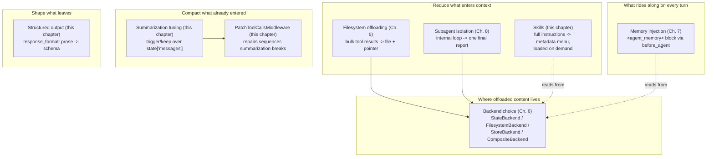
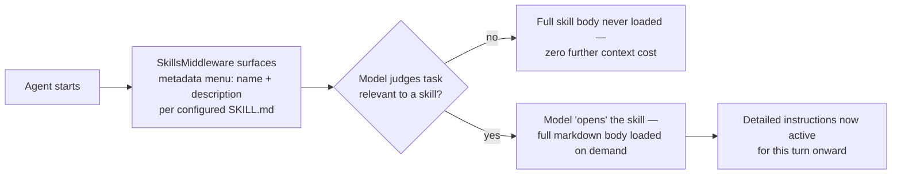

# Skills & Advanced Context Engineering

## Learning Objectives

By the end of this chapter, you will be able to:

- Explain **progressive disclosure** as `SkillsMiddleware` implements it, and connect it explicitly to the same
  "don't pay context cost for what you don't need" logic behind Chapter 5's filesystem eviction
- Write a realistic `SKILL.md` file (YAML frontmatter + markdown body) and wire it into an agent via
  `skills=[...]`, and scope a skill to a single subagent via `SubAgent`'s own `skills=` key
- State the default `SummarizationMiddleware` trigger/keep behavior from memory, describe the token-based preset
  alternative, and explain precisely why `PatchToolCallsMiddleware` sits immediately after it in the assembly
  order (Chapter 2)
- Supply a custom summarization middleware via `middleware=[...]` to replace the default, and justify a
  different `trigger`/`keep` choice for a specific agent's context profile
- Use `response_format` — both at the top level of `create_deep_agent()` and per-subagent — to force a
  structured, schema-conforming final output instead of free-text prose, and recognize when doing so is the
  wrong call
- Design a subagent topology that routes cheap/fast models to simple sub-tasks and a strong model to the
  coordinator or hardest reasoning step — recognizing this as a composition of primitives you already have
  (`SubAgent.model`, harness profiles), not a new API
- Run through a complete context-engineering checklist spanning every lever this course has covered, from
  filesystem eviction thresholds through structured output

## Prerequisites for This Chapter

This chapter assumes you've read:

- **Chapter 5** (Filesystem-Backed Context) — the token-eviction mechanism and the "context is not free" framing
  this chapter reuses almost verbatim, applied to a different kind of content (instructions, not tool results)
- **Chapter 6** (Backends & Storage Architecture) — `StateBackend`/`FilesystemBackend`/`StoreBackend`/
  `CompositeBackend`, since skills and summarization both read/write through whatever `backend` an agent is
  configured with
- **Chapter 8** (Subagent Orchestration) — the `SubAgent` `TypedDict` shape, in particular its optional `skills`,
  `model`, and `response_format` keys, all of which this chapter puts to direct use
- **Chapter 12** (Multi-Agent Systems) — the Enterprise BI Assistant coordinator-plus-specialists design this
  chapter revisits for both the structured-output and dynamic-model-routing sections
- **Chapter 13** (Custom Tools & Middleware) — the `middleware=[...]` splice point and `register_harness_profile`,
  both of which this chapter's summarization-tuning and model-routing sections build directly on top of

If you can't recall the exact eleven-position middleware assembly order from Chapter 2, skim it again — this
chapter treats `SkillsMiddleware` (position 1), `SummarizationMiddleware` (position 4), and
`PatchToolCallsMiddleware` (position 5) as three named boxes in that stack, not as standalone features you're
meeting for the first time.

## The Remaining Context-Engineering Levers

Chapters 5 and 8 already gave you two of the most consequential context-engineering levers in `deepagents`:
**filesystem offloading** (move bulk data out of the message history, leave an address behind) and **subagent
isolation** (give a sub-task its own private context window, and let only a final report cross back). Chapter 6
added the storage layer those depend on, and Chapter 7 added a third, narrower lever — **memory injection** — for
content that should ride along in the system prompt on every turn without being re-fetched by a tool call.

This chapter closes out the set with the three levers that don't fit any of those buckets, because each one acts
on a different part of the request/response cycle than "what's in the message history":

| Lever | Acts on | Question it answers |
|---|---|---|
| Skills (`SkillsMiddleware`) | What instructions the model sees **before it acts** | "Does this reusable instruction set need to be fully loaded right now, or can its existence just be advertised?" |
| Summarization tuning (`SummarizationMiddleware`) | The **message history itself**, after it's already accumulated | "Once history is too large, what gets compacted away, and how much gets kept?" |
| Structured output (`response_format`) | **What leaves** the agent as its final answer | "Is the consumer of this output a human reading prose, or a system that needs a schema?" |

None of these three is a bigger or smaller lever than filesystem offloading or subagent isolation — they're
levers for a different axis of the same underlying problem: an LLM context window (and an LLM's output channel)
are both scarce, and every design decision in `deepagents` is ultimately about deciding, deliberately, what
occupies that scarce space and in what shape. By the end of this chapter you'll have every lever this course
teaches in one place, in the closing checklist.



## Skills — Progressive Disclosure for Reusable Instructions

### The problem skills solve

Every deep agent you've built so far in this course carries its behavioral instructions in exactly one place:
`system_prompt`. That works cleanly when an agent has one job. It stops working cleanly the moment an agent
needs to be *capable* of many different specialized procedures — "how to write a safe database migration," "how
to triage a P1 incident," "how to draft a compliance-reviewed customer email" — without needing *all* of them
active in every single turn's attention budget.

The naive fix is the one you'd guess: concatenate every procedure into `system_prompt`. This is exactly the same
mistake Chapter 5 opened with, just relocated from tool results to instructions. A system prompt carrying six
fully-written procedures pays their full token cost on every model call in the thread, whether or not the
current task touches five of those six — and it degrades the model's ability to locate the one procedure that
actually matters, for the same "lost in the middle" reason a context window full of raw log output does.

### Progressive disclosure, mechanically

`SkillsMiddleware` (source: `middleware/skills.py`) is only installed when you pass `skills=[...]` to
`create_deep_agent()` — it's the first middleware in the assembly order (Chapter 2, position 1), constructed
before filesystem, subagent, or summarization middleware, because skills shape what the model knows about *how
to approach tasks* before any of the machinery for actually doing them is wired in.

It loads `SKILL.md` files — YAML frontmatter plus a markdown body — from whatever sources you configure, and it
applies the same "don't pay context cost for what you don't need" logic Chapter 5 taught you for tool results,
applied here to reusable instruction sets instead:

- At startup, the model is shown a **menu**: each skill's `name` and `description` from its frontmatter — small,
  cheap, always present.
- The **full body** of a given `SKILL.md` — the actual detailed instructions — is loaded only when the model
  chooses to "open" that skill, because it judged the current task relevant to it.

This is deliberately the same shape as filesystem eviction: a small pointer sits in context at all times (a file
path there, a name+description here), and the expensive payload (file contents there, full skill instructions
here) is paid for only on demand. Where Chapter 5's eviction is a middleware *reacting* to content that turned
out to be too large, `SkillsMiddleware`'s progressive disclosure is a *proactive* design choice you make at
authoring time: you already know a given skill's full body is too expensive to keep resident for every turn, so
you structure it as metadata-now, content-later from the start.



### A realistic `SKILL.md`

Here's a skill for a procedure that genuinely benefits from being written once, in full detail, and kept out of
every agent's resident system prompt until it's actually relevant: safely writing a database migration.

```markdown
---
name: safe-database-migration
description: >
  How to write, review, and roll out a schema migration against a production
  database without downtime or data loss. Use this whenever a task involves
  ALTER TABLE, adding or dropping a column, changing a column's type or
  nullability, adding an index to a large table, or backfilling a new column.
---

# Safe Database Migration

## Before writing any migration

1. Confirm the target table's approximate row count. Anything under a
   few thousand rows can usually take a straightforward blocking migration;
   larger tables need the online/expand-contract approach below.
2. Check whether the column being touched has a default value, a NOT NULL
   constraint, or existing indexes — each changes which migration pattern
   is safe.
3. Never write a migration that both alters a column's type AND backfills
   data in the same step. Split these into separate migrations.

## The expand-contract pattern (default choice for any production table)

For anything beyond a trivial table, use three separate migrations rather
than one:

1. **Expand**: add the new column/index as nullable, with no default that
   requires a table rewrite. Deploy and let it sit — this step alone should
   never lock the table for longer than acquiring the schema-change lock
   itself.
2. **Backfill**: populate the new column in batches (a few thousand rows per
   transaction, with a short sleep between batches), never in one single
   UPDATE across the whole table. Verify the backfill completed and matches
   expected row counts before proceeding.
3. **Contract**: only after the backfill is verified complete and the
   application code has been deployed to read/write the new column, add the
   NOT NULL constraint (if needed) and drop the old column/index in a
   separate, final migration.

## Rollback discipline

Every migration must have a corresponding down-migration that is safe to run
even if the up-migration only partially completed. Never write a
down-migration that assumes the up-migration ran to completion.

## Red flags — stop and ask for human review if you see any of these

- A migration that adds a NOT NULL column with no default to a table with
  any existing rows
- A migration that combines a type change with a data backfill
- Any migration touching a table you have not confirmed the row count for
- A migration with no corresponding down-migration
```

Note what this skill does *not* need beyond `name` and `description` in its frontmatter — the exact frontmatter
schema wasn't pinned down beyond those two fields for this course, so treat `name`/`description` as the safe
baseline and check your installed `deepagents` version if you're relying on additional frontmatter keys.

### Wiring it in

At the top level:

```python
from deepagents import create_deep_agent

agent = create_deep_agent(
    model=model,
    tools=[read_file, write_file, edit_file, execute],
    skills=["skills/safe-database-migration"],
)
```

`skills=[...]` takes a list of paths — pointing at either a skill directory (containing a `SKILL.md`) or a
`SKILL.md` file directly. Passing this parameter is what causes `create_deep_agent()` to construct
`SkillsMiddleware` at all (Chapter 2's assembly order); omit `skills` entirely and no such middleware exists in
the stack — there's no "skills, but empty" state to reason about.

### Scoping skills to a specific subagent

`SubAgent`'s own optional `skills` key (introduced in Chapter 8's key table) lets you give one subagent access to
a skill without exposing it to the parent or to other subagents — exactly the same isolation instinct Chapter 8
taught you for `tools`, applied to instructions instead:

```python
from deepagents import SubAgent

migrations_subagent: SubAgent = {
    "name": "migrations",
    "description": (
        "Writes and reviews database schema migrations. Use this whenever a "
        "task requires altering a production database's schema — adding "
        "columns, indexes, or backfilling data."
    ),
    "system_prompt": (
        "You are a database migration specialist. Consult the "
        "safe-database-migration skill before writing any migration, and "
        "follow its expand-contract pattern for any non-trivial table."
    ),
    "tools": [read_file, write_file, edit_file, execute],
    "skills": ["skills/safe-database-migration"],
}
```

A coordinator delegating to `migrations` doesn't need this skill's menu entry cluttering its own metadata
surface — only the subagent that actually does migration work needs to know the skill exists, which is exactly
what a per-subagent `skills=` list buys you.

### A note on the CLI's `/skill:<name>` command

If you've seen `deepagents-code`'s `/skill:<name>` slash command mentioned elsewhere, don't treat it as a
separate mechanism to learn. It's a CLI product convenience built directly on top of the `SkillsMiddleware` this
section just covered — the same SDK-vs-CLI distinction Chapter 7 drew for `AGENTS.md`/memories applies here: the
SDK middleware is the actual mechanism, and `dcode`'s slash command is one particular product's way of letting a
human explicitly force-open a skill rather than waiting for the model to decide relevance on its own.

## Summarization Tuning — Compacting the Message History Itself

### Where this sits relative to everything else

Skills and filesystem offloading both work by keeping things *out* of the message history in the first place.
Summarization is different in kind: it's the middleware that reaches into `state["messages"]` **after** content
has already accumulated there and compacts it down. Every `create_deep_agent()` call has a `SummarizationMiddleware`
instance in its stack unconditionally (Chapter 2, position 4) — built via `deepagents`' own
`create_summarization_middleware(model, backend)` helper, not something you opt into the way you opt into
`SkillsMiddleware` or `MemoryMiddleware`.

Its position in the assembly order is deliberate, and worth restating from Chapter 2: it comes **after**
`FilesystemMiddleware` and `SubAgentMiddleware`, because it needs to operate on the actual message stream those
earlier middleware produce — including content those middleware have already offloaded to disk via eviction.
Summarization is a late-stage compaction pass over what earlier middleware already shaped, not an independent
concern racing them for the same content.

### The default trigger/keep behavior

Out of the box, `SummarizationMiddleware` fires on a **fraction-of-context-window** basis:

- **`trigger=("fraction", 0.85)`** — once the accumulated message history reaches roughly 85% of the model's
  context window, summarization kicks in.
- **`keep=("fraction", 0.10)`** — when it does, history is compacted down to roughly the last 10% of the context
  window's worth of content, with everything older than that folded into a summary.

Some model-specific presets use an entirely different shape instead — an **absolute-token trigger paired with a
fixed-message-count keep**:

- **`trigger=("tokens", 170000)`**
- **`keep=("messages", 6)`**

The two shapes answer the same question ("when do we compact, and how much survives?") with different units —
fraction-of-window versus absolute tokens for the trigger, fraction-of-window versus a fixed message count for
what's kept. Neither is universally "more correct"; which one fits depends on whether you want the trigger to
scale automatically with a given model's context window (the fraction form) or to fire at a specific, predictable
token budget regardless of which model is behind the call (the tokens form) — the same tradeoff you already
reason about when choosing between percentage-based and absolute alerting thresholds in any other system.

### Supplying a custom summarization middleware

Because `middleware=[...]` splices in at the point Chapter 13 described — after the core block
(filesystem/subagents/summarization/patch), before harness-profile and provider-specific middleware — a
middleware you supply there with the same identity as a core middleware **replaces** it rather than stacking
alongside it. This is exactly how you override the default trigger/keep behavior: build your own summarization
middleware with `create_summarization_middleware` and pass it through `middleware=[...]`.

Consider the research agent from Chapter 5. Its context is dominated by **file pointers**, not raw content — the
system prompt drives it to `write_file` large search results immediately and keep only paths and short notes in
the message history. That's precisely the profile where you'd want summarization to be *less* eager to discard
history than the default: there's comparatively little raw bulk sitting in messages to begin with (Chapter 5's
eviction and the agent's own discipline already keep it small), so a larger fraction of "kept" history is cheap,
and losing it costs you the thread of reasoning about *which* files matter and why — reasoning that isn't
sitting on disk anywhere, only in the conversation.

```python
from deepagents import create_deep_agent
from deepagents.middleware.summarization import create_summarization_middleware

research_summarization = create_summarization_middleware(
    model=model,
    backend=backend,
    trigger=("fraction", 0.85),   # keep the default trigger point
    keep=("fraction", 0.30),      # keep substantially more than the 0.10 default —
                                  # this agent's context is pointer-heavy, not bulk-heavy,
                                  # so more history survives compaction at a similar cost
)

research_agent = create_deep_agent(
    model=model,
    tools=[paper_search],
    backend=backend,
    system_prompt=research_system_prompt,
    middleware=[research_summarization],
)
```

This composes directly with Chapter 5's eviction: eviction already keeps any individual oversized tool result
from bloating the message history in the first place, which is exactly what makes it *safe* to tell
summarization "keep more" here — you're not asking it to retain more raw bulk, you're asking it to retain more of
the comparatively cheap pointer-and-reasoning trail that eviction left behind.

### `PatchToolCallsMiddleware` — the safety net right after

Chapter 2 placed `PatchToolCallsMiddleware` at position 5, immediately following summarization, and now you have
the context to see exactly why it has to sit there. Summarization can truncate or rewrite message history in a
way that leaves a **dangling tool call** — an `AIMessage` with a tool call whose matching `ToolMessage` result got
summarized away, or vice versa. A model-call loop handed a message history with an orphaned tool call/result pair
doesn't just produce a slightly-off summary; it can choke outright, since the standard tool-calling contract
assumes every tool call has a corresponding result immediately following it.

`PatchToolCallsMiddleware` exists specifically to repair those sequences — right after the middleware that could
have caused the damage, before anything else (harness-profile adjustments, caching, memory injection, HITL) gets
a chance to operate on a message history that might still be malformed. Whether you're using the default
trigger/keep or a custom one like the research agent's above, `PatchToolCallsMiddleware` is unconditionally
present and doing this repair work regardless — it isn't something you configure, only something you should know
is there catching a specific class of problem your custom `trigger`/`keep` choices could otherwise make worse if
tuned carelessly (more on that in Common Mistakes).

## Structured Output — Shaping What Leaves the Agent

### The problem `response_format` solves

Every deep agent example so far in this course ends its work with a free-text final `AIMessage` — prose a human
reads. That's the right shape when a human *is* the consumer. It's the wrong shape the moment a deep agent's
output is actually consumed by another system: an API response a frontend deserializes, a row written to a
database, or another agent's `task` call expecting a specific field to route on. Parsing structure back out of
prose you asked a model to write informally is exactly the kind of brittle, regex-shaped problem you already
know to avoid in ordinary API design — you wouldn't design a REST endpoint to return "some paragraphs describing
the result" when the caller is code.

`response_format: ResponseFormat[ResponseT] | type[ResponseT] | dict[str, Any] | None = None` is
`create_deep_agent()`'s answer: pass a Pydantic model (or an equivalent schema), and it's threaded straight
through to `langchain.agents.create_agent`, which constrains the final agent response to conform to that shape
rather than emitting a free-text message.

### A triage classification example

```python
from typing import Literal
from pydantic import BaseModel, Field

class TicketClassification(BaseModel):
    category: Literal["billing", "technical", "account", "other"]
    priority: Literal["low", "medium", "high", "urgent"]
    requires_human_review: bool = Field(
        description="True if this ticket involves a refund, legal threat, or "
                     "security concern and must not be auto-resolved."
    )
    summary: str = Field(description="One-sentence summary of the customer's issue.")
```

```python
from deepagents import create_deep_agent

triage_agent = create_deep_agent(
    model=model,
    tools=[lookup_customer_account, search_knowledge_base],
    system_prompt="Classify the incoming support ticket precisely.",
    response_format=TicketClassification,
)

result = triage_agent.invoke({
    "messages": [{"role": "user", "content": ticket_text}]
})
# result's structured final output now conforms to TicketClassification —
# a downstream router can read `.category`/`.priority` directly, no parsing.
```

### Per-subagent structured output

`SubAgent`'s own `response_format` key (Chapter 8's optional-keys table) constrains a *specific* subagent's final
report shape, independently of whatever the parent or coordinator returns. Revisit the Enterprise BI Assistant
from Chapter 12: its `report` subagent produces the artifact a dashboard or downstream job ingests, not prose a
person reads directly.

```python
from deepagents import SubAgent

class ReportSummary(BaseModel):
    title: str
    key_findings: list[str]
    metrics: dict[str, float]
    recommended_actions: list[str]

report_subagent: SubAgent = {
    "name": "report",
    "description": (
        "Synthesizes query results and prior analysis into a structured "
        "business report. Use this as the final step once analysis is complete."
    ),
    "system_prompt": (
        "You are a BI reporting specialist. Given the analysis results "
        "provided, produce a structured report: a title, the key findings as "
        "a bullet list, the relevant metrics as name/value pairs, and "
        "concrete recommended actions."
    ),
    "tools": [read_file],
    "response_format": ReportSummary,
}
```

Because this subagent's final report is consumed by the coordinator (and potentially forwarded on to a
dashboard's own ingestion API), forcing it into `ReportSummary` rather than free markdown means the coordinator
never has to parse prose to extract `metrics` or `recommended_actions` — it reads structured fields directly, the
same way you'd expect any internal service boundary to hand off data.

### When *not* to reach for `response_format`

The single most important judgment call in this section is recognizing when the consumer is a **human**, not a
system. If the triage agent above were instead a chatbot explaining to a support agent, in prose, why a ticket
was escalated — with nuance, caveats, and a conversational tone — forcing that final message into a rigid
Pydantic schema would actively make the output worse: you'd either cram explanatory nuance into a single
`summary: str` field (losing the natural structure prose gives you for that) or bloat the schema with fields that
exist only to simulate what a paragraph already does more naturally. `response_format` is for agent-to-agent and
agent-to-API boundaries; a human-facing final answer is usually better served by ordinary prose (optionally
still steered by strong system-prompt formatting instructions, but not schema-constrained).

## Dynamic Model Routing — A Design Pattern, Not New API

This section introduces no new `deepagents` surface area. It's worth calling out explicitly as a **design
pattern** because it's easy to mistake for a feature you're missing, when it's actually a straightforward
composition of two primitives you already have from earlier chapters:

- **`SubAgent.model`** (Chapter 8) — overrides the parent's model for one specific subagent.
- **Harness profiles are model-keyed** (`register_harness_profile`, Chapter 13) — configuration (tool exclusions,
  extra middleware) is registered *per resolved model spec*, which means your model choices and your
  model-specific corrections compose naturally at the same granularity.

"Dynamic model routing," in `deepagents` terms, means designing your subagent topology so that cheap/fast models
handle simple, well-scoped work and an expensive/capable model handles the coordinator or the hardest reasoning
step — an architecture decision, not an API call.

Revisit the Enterprise BI Assistant from Chapter 12 with this lens:

```python
from deepagents import create_deep_agent, SubAgent

ticket_classifier_subagent: SubAgent = {
    "name": "ticket-classifier",
    "description": "Classifies an incoming BI query request by report type and urgency.",
    "system_prompt": "Classify the request precisely using the schema provided.",
    "tools": [],
    "model": "anthropic:claude-haiku-4-6",       # cheap, fast — classification is mechanical
    "response_format": TicketClassification,
}

report_subagent: SubAgent = {
    "name": "report",
    "description": "Synthesizes query results into a structured business report.",
    "system_prompt": "...",
    "tools": [read_file],
    "model": "anthropic:claude-opus-4-6",         # strongest available — the actual analysis work
    "response_format": ReportSummary,
}

bi_assistant = create_deep_agent(
    model="anthropic:claude-opus-4-6",            # coordinator: also strong — it plans and routes
    subagents=[ticket_classifier_subagent, report_subagent],
    system_prompt="You are a BI assistant coordinator. Classify each request, "
                  "run the relevant analysis, then delegate to 'report' for synthesis.",
)
```

The classification subagent's job — "read a short request, assign it a category and urgency" — doesn't get
meaningfully better with a stronger, more expensive model; it's the same class of "mechanical search-and-summarize"
work Chapter 8 already told you to route to a cheap model. The `report` subagent and the coordinator, by
contrast, are doing the correctness-critical reasoning — synthesizing numbers into recommendations, deciding
which specialist to invoke next — exactly where a stronger model's cost is worth paying. Nothing about this
topology invents a new `deepagents` concept; it's `SubAgent.model` (Chapter 8) applied with cost-conscious
judgment, the same judgment you already apply when choosing instance sizes for different microservices in a
FastAPI-based system rather than provisioning every service identically.

## Context Engineering Checklist

Every lever this course has taught for managing what an agent sees, keeps, and produces, in one place:

| Lever | Chapter | Key knob | What it decides |
|---|---|---|---|
| Filesystem eviction thresholds | Ch. 5 | `tool_token_limit_before_evict` (default 20000), `human_message_token_limit_before_evict` (default 50000) | When an oversized tool result or human message gets auto-offloaded to a file |
| Backend choice | Ch. 6 | `StateBackend` / `FilesystemBackend` / `StoreBackend` / `CompositeBackend` (+ `ContextHubBackend`) | Where offloaded files, memory content, and subagent-shared artifacts physically live, and whether they persist across threads |
| Memory injection | Ch. 7 | `memory=[...]` file paths | What content rides along in the system prompt on every turn, independent of message-history size |
| Subagent isolation | Ch. 8 | `subagents=[...]`, `SubAgent.tools`/`.model`/`.response_format` | Which internal work never re-enters the parent's context window, and at what per-subagent capability/model tier |
| Skills progressive disclosure | This chapter | `skills=[...]`, per-subagent `SubAgent.skills` | Which reusable instruction sets are advertised cheaply now versus loaded in full only on demand |
| Summarization trigger/keep | This chapter | `trigger=("fraction"\|"tokens", ...)`, `keep=("fraction"\|"messages", ...)` via `create_summarization_middleware` | How aggressively accumulated message history gets compacted once it grows large, and how much survives |
| Structured output | This chapter | `response_format` (top-level and per-subagent) | Whether the final output is free prose for a human or a schema-conforming payload for a system |

A useful discipline when designing a new deep agent: walk this table top to bottom and make a **deliberate**
choice at every row, rather than accepting whatever the defaults happen to produce. Not every agent needs every
lever tuned away from its default — plenty of agents are well served by `StateBackend`, the default eviction
thresholds, and the default summarization trigger/keep — but "I didn't think about it" and "I decided the default
is right for this agent" should feel like different decisions, and the second one is the one worth being able to
defend in a design review.

## Real-World Scenario

The Enterprise BI Assistant from Chapter 12 goes to production, and three problems surface in the first two weeks
that this chapter's levers, taken together, resolve.

**Problem 1 — every analyst-facing agent instance carried the same six analysis "playbooks" (how to reconcile
a revenue discrepancy, how to attribute a metric drop to a specific upstream change, and so on) fully written
into `system_prompt`.** Most requests only ever touched one playbook, but every request paid the token cost of
all six. Converting each playbook into its own `SKILL.md` and passing `skills=[...]` instead cut the resident
system-prompt cost dramatically — the coordinator now sees six name/description entries instead of six full
procedures, and only loads the one relevant to the current request.

**Problem 2 — the coordinator's context grew unpredictably on long analysis sessions** (an analyst iterating
across a dozen follow-up questions in one thread), and the default `trigger=("fraction", 0.85)` /
`keep=("fraction", 0.10)` summarization occasionally discarded an earlier clarification the analyst had given
three questions ago, causing the `report` subagent to regenerate a report that ignored it. Because this
coordinator's context — much like the research agent earlier in this chapter — was already dominated by file
pointers to query results rather than raw data (thanks to filesystem offloading), the team supplied a custom
`create_summarization_middleware(model, backend, trigger=("fraction", 0.85), keep=("fraction", 0.25))` via
`middleware=[...]`, keeping meaningfully more conversational context without meaningfully increasing raw-token
cost.

**Problem 3 — the `report` subagent's Markdown output was being parsed by a downstream dashboard ingestion job
with a brittle regex**, breaking every time the model varied its formatting slightly. Switching the `report`
subagent to `response_format=ReportSummary` eliminated the parsing step entirely — the dashboard job now reads
`.metrics` and `.recommended_actions` directly. Meanwhile, the analyst-facing chat surface itself — where a human
reads the coordinator's own conversational replies — was deliberately **left** as free prose; the team considered
and rejected forcing that channel into a schema, since a human, not another system, is the consumer of the
coordinator's direct replies.

## Best Practices

- **Treat skills as the place for procedures that are occasionally relevant, not the place for core identity or
  always-needed instructions.** If a piece of guidance is genuinely needed on every turn, it belongs in
  `system_prompt` or `memory=[...]`, not behind a skill's on-demand disclosure — you'd be adding a discovery step
  to something that should already be resident.
- **Write skill `description` fields with the same discipline as a tool docstring or a subagent `description`.**
  It's the model's only signal for deciding whether to open a given skill — vague descriptions produce skills
  that never get used, or get opened when irrelevant.
- **Scope skills to the subagent that actually needs them** via `SubAgent.skills`, rather than exposing every
  skill to every agent in a multi-agent system — the same isolation instinct Chapter 8 taught for `tools`.
- **Don't tune `trigger`/`keep` in isolation from what the agent's context actually contains.** An agent whose
  context is pointer-heavy (aggressive filesystem offloading already in place) can safely keep more history than
  one whose context still carries substantial raw content — check Chapter 5's eviction discipline first.
- **Reach for `response_format` at exactly the boundary where a system, not a human, reads the output** — a
  subagent's report consumed by a coordinator or a downstream API, a triage classification consumed by a router.
  Leave human-facing final replies as prose.
- **Route models per subagent based on task difficulty, extending the same judgment from Chapter 8** — dynamic
  model routing is that judgment applied at the level of an entire topology, not a new mechanism to configure.
- **Revisit the full context-engineering checklist for every new agent design**, even when the answer for a
  given row is "leave the default" — the point is a deliberate pass, not a fixed set of overrides you always
  apply.

## Common Mistakes

1. **Cramming every instruction into the system prompt instead of using skills' progressive disclosure.** This
   is the exact mistake Chapter 5 warned against for tool results, recurring at the instruction layer: an agent
   with six fully-written procedures resident in `system_prompt` pays their combined token cost on every turn,
   whether the current task touches one of them or all six, and the model's attention degrades trying to hold
   all six active simultaneously. If a procedure is only occasionally relevant, it belongs in a `SKILL.md`, not
   inline in the prompt.
2. **Tuning summarization too aggressively and losing needed context.** Lowering `keep` far below what an
   agent's actual context profile can tolerate — or raising `trigger` so high that summarization fires too late
   to prevent a blowup — can silently discard a clarification, constraint, or decision from earlier in the
   conversation that later turns still depend on, exactly as it did for the BI Assistant's coordinator in the
   Real-World Scenario above. Tune `keep` relative to how much of the agent's context is already pointers
   (safe to compact more) versus raw content the agent still needs verbatim (compact less).
3. **Using `response_format` when the consumer is actually a human who'd be better served by prose.** Forcing a
   conversational, nuance-carrying final reply into a rigid Pydantic schema doesn't make the output more
   reliable — it either strips the nuance down to fit a field that wasn't designed for it, or forces you to keep
   adding schema fields to simulate what a paragraph already expresses more naturally. Reserve `response_format`
   for agent-to-agent and agent-to-API boundaries.
4. **Assuming a custom summarization middleware you pass via `middleware=[...]` stacks alongside the default
   rather than replacing it.** Per the Chapter 13 splice-point rule, supplying your own summarization middleware
   with the same identity as the core one **replaces** it in the assembly — you don't end up with two
   summarization passes running.
5. **Forgetting `PatchToolCallsMiddleware` exists and misdiagnosing a tool-call error as a bug in your own tools**
   after a summarization pass, when the actual cause was a dangling tool-call/result pair the middleware is
   specifically designed to repair — check whether the failure correlates with a recent summarization event
   before assuming your tool implementation is at fault.
6. **Writing a skill `description` too vaguely for the model to reliably decide when to open it** — the same
   failure mode Chapter 8 already warned about for subagent `description` fields, recurring here because the
   underlying mechanism (a model reading a short string to make a routing decision) is the same.

## Summary

This chapter closed out the context-engineering toolkit with the three levers that didn't fit filesystem
offloading (Ch. 5), backend choice (Ch. 6), memory injection (Ch. 7), or subagent isolation (Ch. 8):

- **Skills** (`SkillsMiddleware`, position 1 in the assembly order, present only when `skills=[...]` is passed)
  apply progressive disclosure to reusable instruction sets: a cheap name/description menu is always resident,
  and a skill's full markdown body loads only when the model judges it relevant — the same "don't pay for what
  you don't need" logic as Chapter 5's eviction, applied to instructions instead of tool results. A `SubAgent`'s
  own `skills=` key scopes which skills a specific subagent can draw on.
- **Summarization tuning** (`SummarizationMiddleware`, always present via `create_summarization_middleware(model,
  backend)`) defaults to `trigger=("fraction", 0.85)` / `keep=("fraction", 0.10)`, with some model-specific
  presets instead using `trigger=("tokens", 170000)` / `keep=("messages", 6)`. A custom instance with different
  `trigger`/`keep` values, supplied via `middleware=[...]`, **replaces** the default at the Chapter 13 splice
  point — appropriate for agents like a filesystem-disciplined research agent whose context is pointer-heavy
  enough to safely keep more history. `PatchToolCallsMiddleware` immediately follows summarization in the
  assembly to repair tool-call sequences truncation can leave dangling.
- **Structured output** (`response_format`, top-level and per-`SubAgent`) shapes the final response into a
  Pydantic-model or schema-conforming payload instead of free text, threaded straight through to
  `langchain.agents.create_agent`. It belongs at agent-to-agent and agent-to-API boundaries (a triage
  classification, a BI report subagent's output) — not at boundaries where a human is the actual reader.
- **Dynamic model routing** is a design pattern, not new API surface: composing `SubAgent.model` (Ch. 8) with
  model-keyed harness profiles (Ch. 13) to route cheap/fast models to simple, well-scoped subagent work and
  strong/expensive models to a coordinator or hard-reasoning subagent.
- The **context engineering checklist** ties every lever from Chapters 5–8 and this chapter into one deliberate
  pass you should walk through for every new deep agent design, even when the answer is "keep the default."

## Knowledge Check

1. Explain the parallel between `FilesystemMiddleware`'s automatic eviction (Chapter 5) and `SkillsMiddleware`'s
   progressive disclosure. What exactly is the "small pointer" in each case, and what is the "expensive payload"
   it stands in for?
2. What are the default `trigger` and `keep` values for `SummarizationMiddleware`, and what alternative shape do
   some model-specific presets use instead? Which of the two forms would you prefer for an agent whose primary
   deployment target is unknown in advance, and why?
3. A teammate supplies a custom summarization middleware via `middleware=[...]` and is confused to find only one
   summarization pass running instead of two. Explain why, referencing the Chapter 13 splice-point rule.
4. Why does `PatchToolCallsMiddleware` sit immediately after `SummarizationMiddleware` in the assembly order,
   rather than somewhere else in the stack?
5. You're deciding whether to apply `response_format` to a subagent's final output. What's the one question that
   should drive that decision, and what's the risk of applying it to the wrong side of that boundary?
6. The Enterprise BI Assistant's `ticket-classifier` subagent uses a cheap model and the `report` subagent uses a
   strong one. Explain why this isn't "a new `deepagents` feature for model routing," and name the two primitives
   from earlier chapters this pattern composes.

## Hands-On Exercise

Extend the Code Review Agent (or the Enterprise BI Assistant, if you've already built it from Chapter 12) with a
skill-backed migration subagent:

1. **Write a `SKILL.md`** at `skills/safe-database-migration/SKILL.md` for the "safe database migration"
   procedure — YAML frontmatter with `name` and `description`, and a markdown body covering at minimum: the
   expand-contract pattern for non-trivial tables, rollback discipline, and at least three concrete red-flag
   conditions that should trigger a human-review pause. Use the example earlier in this chapter as a structural
   template, but write your own detail.
2. **Add a `migrations` subagent** to your Chapter 8/12 subagent list, giving it `tools=[read_file, write_file,
   edit_file, execute]` and `skills=["skills/safe-database-migration"]`.
3. **Update your coordinator's `system_prompt`** to route any schema-migration-shaped request to
   `subagent_type="migrations"`.
4. **Verify progressive disclosure empirically**, not just by assumption: trace a request that has nothing to do
   with database migrations and confirm the skill's full body never loads (only its name/description entry is
   present in what the model saw), then trace a request that *does* involve a schema change and confirm the full
   `SKILL.md` body appears in the `migrations` subagent's own context before it acts.
5. **Stretch goal**: give the `migrations` subagent its own `response_format` — a small Pydantic model capturing
   `migration_files_written: list[str]`, `requires_human_review: bool`, and `red_flags: list[str]` — and update
   the coordinator to check `requires_human_review` before treating the migration as complete.

## Further Reading

- [DeepAgents Overview (LangChain Docs)](https://docs.langchain.com/oss/python/deepagents/overview)
- [`langchain-ai/deepagents` GitHub repository](https://github.com/langchain-ai/deepagents) — `middleware/skills.py`
  and the summarization helper are the ground truth for every default and signature in this chapter
- Related chapter in this course: [Chapter 5 — Filesystem-Backed Context](./05-filesystem-backed-context.md) —
  the eviction mechanism this chapter's progressive-disclosure section draws its central parallel from
- Related chapter in this course: [Chapter 8 — Subagent Orchestration](./08-subagent-orchestration.md) — the
  `SubAgent` shape (`skills`, `model`, `response_format` keys) this chapter builds directly on
- Related chapter in this course: [Chapter 12 — Multi-Agent Systems](./12-multi-agent-systems.md) — the
  Enterprise BI Assistant this chapter revisits for structured output and model routing
- Related chapter in this course: [Chapter 13 — Custom Tools & Middleware](./13-custom-tools-and-middleware.md) —
  the `middleware=[...]` splice point and `register_harness_profile` this chapter's summarization and
  model-routing sections depend on

<div style="display:flex;justify-content:space-between;align-items:center;">
  <a href="./13-custom-tools-and-middleware.md">← Previous: Custom Tools & Middleware</a>
  <a href="./00-index.md">🏠 Index</a>
  <a href="./15-best-practices.md">Next: Best Practices →</a>
</div>
