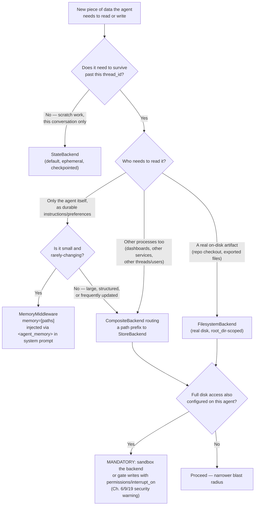

# Best Practices

## Learning Objectives

By the end of this chapter, you will be able to:

- Apply a single, consistent decision framework — across model selection, backends, memory, subagents, HITL, and
  MCP — for choosing the production-grade default instead of whatever `create_deep_agent()` happens to do when an
  argument is omitted
- Distinguish the ephemeral/cross-thread/system-prompt-injected axis that governs every data-persistence decision
  in a deep agent, and place any new requirement on it without re-deriving the backend/memory chapters from
  scratch
- Audit an existing deep agent — your own, or one of this course's earlier projects — against a compact
  pre-production checklist and produce a concrete, prioritized punch list of gaps
- Recognize the "wrong default" anti-pattern in each dimension of this chapter well enough to catch it in a code
  review, without needing Chapter 16's full failure-mode treatment yet

---

## Prerequisites for This Chapter

This is a **synthesis chapter**. It assumes you've read **Chapters 1–14 in full** and introduces no new
`deepagents` API surface — every function signature, middleware name, and default value referenced below was
already established in an earlier chapter, cited by number. If a citation below doesn't ring a bell, that's the
signal to go back to that chapter rather than take this one's summary as the full story. In particular, this
chapter leans on:

- Ch. 2's exact middleware assembly order and `HarnessProfile` mechanism
- Ch. 3's `create_deep_agent()` argument-by-argument signature and streaming modes
- Ch. 5–6's filesystem tools, eviction thresholds, and the four backend classes
- Ch. 4's `write_todos` replace-not-patch semantics
- Ch. 7's `MemoryMiddleware` vs. `StoreBackend` distinction, and the SDK-vs-CLI memory conflation warning
- Ch. 8's three subagent shapes and per-subagent `model=`/`tools=` scoping
- Ch. 9–10's `interrupt_on`/`permissions` composition and checkpointer selection
- Ch. 11–13's MCP tool wiring, multi-agent coordination, and custom middleware/harness profiles

Nothing here is new mechanics. It is a distillation: for each dimension, "here is the rule of thumb a senior
engineer applies by default, and here is why the naive default is usually wrong."

---

## 1. Model & Invocation

**Always pass `model` explicitly.** `model=None` silently falls back to a deprecated `ChatAnthropic` default
(Ch. 3) — a call site that omits `model` is not "using the default," it's depending on an implicit fallback that
the SDK itself flags as deprecated. Treat a missing `model=` argument the same way you'd treat a missing
`region_name` on a boto3 client: technically works today, a landmine for whoever touches this code next.

**Choose deliberately between a provider string and a live `BaseChatModel` instance** — this is a real decision,
not a style preference:

- A provider string (`"anthropic:claude-sonnet-4-6"`) is right when you have nothing provider-specific to
  configure — it's the terse path and `create_deep_agent()` resolves it for you.
- A live instance (`ChatBedrockConverse(model="anthropic.claude-...", region_name="us-east-1")`) is required the
  moment you need anything the string form can't express: a specific Bedrock region, cross-account role
  assumption, custom retry/timeout configuration, or a `guardrail_config`. For this learner's Bedrock-heavy
  background, this is the common case in practice, not the exception — reach for `ChatBedrockConverse` by default
  in any AWS-hosted deployment rather than starting with a string and discovering the config gap later.

```python
from langchain_aws import ChatBedrockConverse
from deepagents import create_deep_agent

model = ChatBedrockConverse(
    model="anthropic.claude-sonnet-4-6-v1:0",
    region_name="us-east-1",
    # provider_config, guardrail_config, etc. — anything the string form cannot express
)

agent = create_deep_agent(model=model, tools=[...])
```

**Pick `stream_mode` for the consumer, not out of habit.** `stream_mode="messages"` (Ch. 3 §6.3) streams
token-by-token and is the right choice for anything rendering to a human in real time — a chat UI, a FastAPI SSE
endpoint (Ch. 18 builds exactly this). `stream_mode="values"` emits the full accumulated state after each step
and is the right choice when you (or an internal dashboard) need to *observe* state growth — intermediate
`todos`, filesystem mutations, subagent reports — rather than render prose incrementally. Defaulting to
`"values"` for a chat UI produces a visibly worse user experience (long pauses, then a wall of text); defaulting
to `"messages"` for a debugging/observability path throws away the state visibility you actually need. Don't pick
one and use it everywhere.

```python
# UI-facing: token-by-token, minimal per-chunk overhead
async for chunk in agent.astream(
    {"messages": [HumanMessage(content=user_input)]},
    config=config,
    stream_mode="messages",
):
    yield chunk  # e.g. into an SSE response, Ch. 18's FastAPI pattern

# Debugging/observability: full state snapshot after each step
for state in agent.stream(
    {"messages": [HumanMessage(content=user_input)]},
    config=config,
    stream_mode="values",
):
    log_todo_progress(state.get("todos"))   # inspect planning state as it evolves
    log_filesystem_writes(state)            # inspect what the agent wrote, when
```

A subtler cost dimension worth naming here rather than in the streaming section alone: model choice and
`stream_mode` interact with prompt caching (Ch. 13's `AnthropicPromptCachingMiddleware`, always last-but-one in
the assembly order per Ch. 2). A live `BaseChatModel` instance you reconstruct on every request — instead of
holding one long-lived instance per process — can defeat provider-side prompt caching benefits entirely if it
also resets connection-level state; construct your model instance once at process startup, not per-request.

---

## 2. Filesystem & Backends

**Default to `StateBackend`, promote the instant anything must survive a thread.** `StateBackend` (the
zero-configuration default, Ch. 6) is correct for scratch work scoped to one conversation — an outline, staged
search results, an in-progress draft. The moment *any* piece of data needs to exist in the *next* conversation, a
different user's session, or after a process restart, `StateBackend` is categorically the wrong tool — not
"suboptimal," wrong, because nothing about it persists past the `thread_id` it was written under. Promote to a
`CompositeBackend` routing the specific paths that need durability to a `StoreBackend` (or `FilesystemBackend`
for real-disk artifacts), leaving everything else on the `StateBackend` default:

```python
from deepagents.backends.state import StateBackend
from deepagents.backends.store import StoreBackend
from deepagents.backends.composite import CompositeBackend
from langgraph.store.memory import InMemoryStore

backend = CompositeBackend(
    default=StateBackend(),
    routes={"/memories/": StoreBackend(store=InMemoryStore(), namespace=namespace_by_user)},
)
```

This is a one-way ratchet, not a toggle you flip back and forth per environment: once a path needs cross-thread
durability in production, it needs it in every environment that exercises that code path, including staging.

**Tune the eviction thresholds deliberately for your actual workload**, don't accept
`tool_token_limit_before_evict=20000` / `human_message_token_limit_before_evict=50000` (Ch. 5) as universal
constants. A workload reading large log files or big API payloads routinely will thrash — eviction firing on
nearly every tool call, generating pointer noise instead of a rare safety net — unless you either lower the
threshold intentionally (evict more aggressively, keep the context leaner) or raise it because your tool outputs
are legitimately large and mostly signal. Treat these two numbers as workload-specific tuning knobs you set once
you understand your typical payload sizes, not defaults you inherit blindly. And remember eviction is a **safety
net for outputs you didn't control the size of** (Ch. 5) — a subagent whose whole job is reading a 200K-token log
file should be *designed* to write that file out and read back only the relevant slice, not rely on automatic
eviction to paper over an unplanned dump into message history.

**Never assume `grep` is regex.** It's a literal-string search (Ch. 5). Code that pipes a regex pattern into
`grep` because that's the Unix instinct will silently return zero matches — worth a standing note in any
onboarding doc for engineers coming from a shell-scripting background.

---

## 3. Planning

**Don't fight `write_todos`' replace-not-patch semantics — always resend the full list.** `write_todos` (in
reality `TodoListMiddleware`, Ch. 4) replaces the entire todo list on every call; there is no "mark item 3
complete" operation. Any custom logic you build around the model's todo usage — a system prompt reminder, a
wrapper tool — needs to reinforce "call this with the complete list, every time," because a model that's been
prompted like a typical patch-based task tracker will naturally try to send only the delta and quietly wipe out
the rest of the list.

**Use todos for UI progress surfacing, not as a substitute for actual task decomposition.** `state["todos"]`
(Ch. 4) is genuinely useful for rendering a live progress view to an end user watching a long-running agent work.
It is not a substitute for structuring genuinely decomposable work into subagents (Ch. 8) — a coordinator that
tracks five items in a todo list but executes all five itself, in one flat context, gets none of Ch. 8's context
isolation benefit. If the work is decomposable enough to list as discrete todo items with different concerns
(research vs. implementation vs. verification), that's usually also a signal it's decomposable enough to be three
subagents, not one flat agent narrating its own checklist.

---

## 4. Memory

**Default to `MemoryMiddleware` + `memory=[paths]` for simple durable preferences.** This is the right starting
point for "remember this user prefers metric units" or "remember the team's coding style guide" — content that's
genuinely small, changes rarely, and only needs to be *read* by the agent itself, injected as an
`<agent_memory>` system-prompt block (Ch. 7). It updates via `edit_file`, not a dedicated save tool — don't go
looking for one.

**Graduate to `StoreBackend`-backed memory once you need cross-thread querying from outside the agent.** The
moment a requirement appears like "let the admin dashboard show a user's stored preferences without invoking the
agent," `MemoryMiddleware`'s prompt-injection model can't satisfy it — that content only becomes visible by
running the agent and reading its system prompt. A `CompositeBackend` route to `StoreBackend` (Ch. 6–7) makes
that same data queryable by any process with access to the underlying `BaseStore`, agent or not. Pick based on
*who* needs to read the data, not on how much of it there is.

**Always pair filesystem-backed memory with sandboxing or HITL.** The security warning from Ch. 6/Ch. 19's
territory applies with extra force to memory specifically: `FilesystemBackend` combined with full disk access and
no sandbox or approval gate means a model with a subtly-poisoned memory file (or a prompt-injected instruction
telling it to write one) has a durable, silent foothold that survives restarts. Memory paths are exactly the
kind of path a `permissions=[FilesystemPermission(..., mode="interrupt")]` rule (Ch. 9) should cover in any
agent that also has broad disk access.

**Keep the SDK-vs-CLI distinction straight in your own docs.** `MemoryMiddleware`'s `<agent_memory>` mechanism is
a completely different convention from the `deepagents-code` CLI's `AGENTS.md` file (Ch. 7). If your team's
internal documentation cites the CLI's memory docs page while your service uses `create_deep_agent()`
programmatically, you will ship an implementation that doesn't match what your own docs describe.

---

## 5. Subagents

**Keep each subagent's `tools=` narrow and its `system_prompt` focused.** The Ch. 8 Code Review Agent is the
reference shape: `research` gets read-only tools (`grep, glob, read_file, ls`), `coding` additionally gets
`write_file`/`edit_file`, and only `testing` gets `execute`. A subagent whose `tools=` list is a superset of what
its `system_prompt` actually asks it to do is a standing invitation for the model to reach for a tool nobody
intended it to use in that role — narrow scoping isn't just tidiness, it's the tool-level enforcement of "this
subagent's job is X, not X-and-everything-else."

**Use `model=` overrides for cost control, matched to task difficulty.** A `research` subagent doing mechanical
grep/read work is a good fit for a cheap, fast model (`claude-haiku-4-6`); a `coding` subagent doing the actual
fix generation justifies the strongest model available (Ch. 8's example uses `claude-opus-4-6` there). Picking
one model for every subagent in the hierarchy because it's simpler to configure is a real cost decision, not a
neutral one — you are paying opus-tier prices for haiku-tier work on every `research` delegation.

**Never assume `interrupt_on` inherits silently — audit it per subagent, every time.** This is the single
highest-leverage rule in this whole chapter, because the failure mode is *silent*: a declarative `SubAgent` that
defines its own `interrupt_on` **fully replaces**, not merges with, the parent's configuration for that subagent
(Ch. 9 §4). An engineer adding a narrow `interrupt_on={"execute": ...}` to a subagent, thinking only about
`execute`, silently strips the parent's `write_file` protection from that one subagent without touching a single
line that looks obviously wrong. Make "does this `SubAgent` define its own `interrupt_on`, and if so, does it
restate every tool the parent protects?" a standing code-review question, not a one-time audit. `CompiledSubAgent`
and `AsyncSubAgent` don't inherit `interrupt_on` under any configuration — HITL for those must be built in at
compile time or on the remote graph itself (Ch. 9 §4.2).

---

## 6. Human-in-the-Loop & Checkpointing

**Never ship `MemorySaver` to production.** It's the right choice for local dev and the exercises in this course
(Ch. 9's Deployment Agent uses it deliberately, for that reason) — and the wrong choice anywhere an approval
might take minutes, span a process restart, or need to survive a pod being rescheduled. A production checkpointer
(`PostgresSaver` or equivalent, Ch. 10) is a hard requirement, not an optimization, the moment a real human is on
the other end of an `interrupt()` — an in-memory checkpointer loses every pending interrupt the instant the
process holding it exits.

**Design `thread_id` generation deliberately — map it to a real session/request concept, not a `uuid4()` you
generate and discard the mapping for.** The documented pattern generates one ID per conversation and reuses it
for every subsequent resume call (Ch. 9 §5.2) — but the harder production question is *where that ID comes
from*. Map it to something your system already has a concept of: a chat session ID, a support ticket ID, a
deployment request ID. A `thread_id` with no durable mapping back to "which real-world conversation is this" is
unrecoverable the moment the process that generated it forgets — you cannot resume an interrupt for a session you
have no record of.

**Pick `allowed_decisions` per tool risk level, not uniformly.** Ch. 9's `deploy` example deliberately restricts
to `["approve", "reject"]` — no silent `edit`, because letting a human quietly rewrite a production deploy's
arguments without a fresh approval step is its own risk. A read-adjacent status-check tool might reasonably allow
`respond` (a human can just answer instead of running it); a destructive infra tool almost never should. Setting
`allowed_decisions` to the full four-decision default everywhere because it's less code to write is a security
posture decision disguised as a shortcut.

---

## 7. MCP & Tools

**Assign MCP tools to specific subagents rather than dumping everything on the coordinator.** There's no
first-class MCP parameter on `create_deep_agent()` (Ch. 11) — MCP tools arrive as ordinary tools via
`langchain-mcp-adapters`, which means they compose with subagent `tools=` scoping exactly like any other tool.
A coordinator holding every MCP server's entire tool surface reproduces the flat-context-degradation problem
Ch. 8 opened with; splitting an MCP client's tools across the subagents that actually need them (a `jira` MCP
server's tools going only to a `triage` subagent, a `github` MCP server's tools going only to a `pr-writer`
subagent) is the same discipline as Ch. 8's narrow-`tools=` rule, just applied to externally-sourced tools instead
of hand-written ones.

```python
# Wrong default: every MCP tool handed to the coordinator directly
all_mcp_tools = await mcp_client.get_tools()
coordinator = create_deep_agent(model=model, tools=all_mcp_tools)  # flat, unscoped

# Production default: partition by which subagent's job actually needs each server
jira_tools = [t for t in all_mcp_tools if t.name.startswith("jira_")]
github_tools = [t for t in all_mcp_tools if t.name.startswith("github_")]

triage_subagent: SubAgent = {
    "name": "triage",
    "description": "Reads and updates Jira tickets for incoming issues.",
    "system_prompt": "You triage issues by reading and updating Jira tickets only.",
    "tools": jira_tools,
    "model": "anthropic:claude-haiku-4-6",
}

pr_writer_subagent: SubAgent = {
    "name": "pr-writer",
    "description": "Opens and updates GitHub pull requests for approved fixes.",
    "system_prompt": "You open and update GitHub PRs for changes already approved by triage.",
    "tools": github_tools,
    "model": "anthropic:claude-sonnet-4-6",
    "interrupt_on": {"github_merge_pr": InterruptOnConfig(allowed_decisions=["approve", "reject"])},
}

coordinator = create_deep_agent(
    model=model,
    subagents=[triage_subagent, pr_writer_subagent],
    system_prompt="Delegate Jira work to 'triage' and GitHub work to 'pr-writer'. Never call MCP tools yourself.",
)
```

Note `pr_writer_subagent` restates its own `interrupt_on` — per Section 5's rule, this is a full override for
that subagent, so if the parent coordinator also protects other tools this subagent can reach, they must be
restated here too, not assumed inherited.

**Gate write-capable MCP tools with `interrupt_on`/`permissions` exactly like filesystem writes.** An MCP tool
that files a support ticket, merges a PR, or posts to a customer-facing channel is no less destructive than
`execute` or `write_file` — it just arrived from a different registration path. `interrupt_on` keys on tool name
(Ch. 9), so an MCP-sourced tool named `create_deployment` gates identically to a hand-written one:
`interrupt_on={"create_deployment": InterruptOnConfig(allowed_decisions=["approve", "reject"])}`. Treat "is this
tool destructive" as the question that decides HITL coverage, never "did I write this tool myself or did it come
from an MCP server."

---

## 8. Middleware & Harness Profiles

**Prefer a registered `HarnessProfile` over ad hoc per-call tool filtering when the exclusion is model-specific
and reusable.** If you find yourself writing `if model_name == "...": tools = [t for t in tools if ...]` at more
than one call site, that's the signal to register a `HarnessProfile`/`register_harness_profile` (Ch. 2 §6)
instead — keyed to the resolved model spec, applied automatically by `_ToolExclusionMiddleware` everywhere that
model is used, rather than scattered conditionals that drift out of sync across call sites. Remember the two
structural exceptions: `FilesystemMiddleware` and `SubAgentMiddleware` cannot be excluded via any `HarnessProfile`
— both raise `ValueError` if you try (Ch. 2). If the real goal behind "disable subagents for this model" is "this
model shouldn't be able to delegate," the fix is not passing `subagents=` and disabling the auto-added
`general-purpose` subagent through the profile's other configuration surface, not attempting to exclude the
middleware itself.

```python
from deepagents import HarnessProfile, register_harness_profile

# Wrong default: scattered per-call-site conditionals that drift out of sync
def build_agent(model_spec: str):
    tools = base_tools
    if model_spec.startswith("anthropic:claude-haiku"):
        tools = [t for t in tools if t.name != "execute"]  # repeated at every call site
    return create_deep_agent(model=model_spec, tools=tools)

# Production default: register once, applied automatically everywhere
register_harness_profile(
    "anthropic:claude-haiku-4-6",
    HarnessProfile(excluded_tools=["execute"]),  # this model shouldn't run arbitrary shell commands
)

def build_agent(model_spec: str):
    return create_deep_agent(model=model_spec, tools=base_tools)  # exclusion applied automatically
```

The profile is keyed to the exact model spec string `create_deep_agent()` resolves — a common failure here isn't
architectural, it's a typo: register against `"anthropic:claude-haiku-4-6"` and call with a differently-cased or
differently-versioned string, and the exclusion silently never applies (Ch. 2).

---

## 9. The Decision Tree: Where Does This Data Belong?

Every persistence decision in this chapter — memory, backends, subagent state — collapses to the same three-way
fork. Use this before reaching for any specific mechanism:



---

## Real-World Scenario

A team ships a customer-support deep agent that started as a Ch. 8-style single coordinator with no subagent
structure, `StateBackend` by default, no `interrupt_on`, and `MemorySaver()`. It works fine in the demo. Three
things happen in the first month of real traffic: (1) support agents start asking it to "remember that this
customer is on the enterprise plan and always route their tickets to tier 2" — a preference that needs to survive
past the current conversation, which `StateBackend` cannot do, so they add a `CompositeBackend` route to
`StoreBackend` scoped by customer ID; (2) an MCP-sourced `close_ticket` tool gets called on the wrong ticket
during a demo, because nothing gated it, so they add
`interrupt_on={"close_ticket": InterruptOnConfig(allowed_decisions=["approve", "reject"])}`; (3) a pod restart
during a deploy drops a pending approval that a support lead had been about to act on, because `MemorySaver()`
kept it only in process memory, so they move to a `PostgresSaver` checkpointer (Ch. 10) with `thread_id` mapped to
their existing support-ticket ID rather than a throwaway `uuid4()`. None of these three fixes required new
`deepagents` mechanics — every one of them is a "pick the production-grade default instead of the zero-config
one" decision from this chapter, applied a few weeks too late instead of during the initial design review. The
team's retrospective action item was exactly this chapter's pre-production checklist, now run *before* the next
service ships rather than reactively.

---

## Anti-Patterns to Avoid

A compact list of the **wrong default** per dimension — deliberately brief; Chapter 16 covers each failure mode
in full depth.

- **Model**: relying on `model=None`'s deprecated fallback, or using a bare provider string when you actually
  need Bedrock-specific config (region, guardrails, cross-account role) that only a live `ChatBedrockConverse`
  instance can express.
- **Backend**: leaving everything on `StateBackend` and discovering in production that "the agent forgot
  everything" the first time a real user returns in a new thread.
- **Planning**: treating `write_todos` like a patchable task tracker and sending partial updates, silently
  wiping the rest of the list.
- **Memory**: reaching for `MemoryMiddleware` when the real requirement is "queryable from outside the agent" —
  or conflating it with the `deepagents-code` CLI's `AGENTS.md` convention in your own docs.
- **Subagents**: a coordinator holding every tool for every task instead of scoping `tools=` per subagent, or
  giving a subagent its own `interrupt_on` without restating every tool the parent was protecting.
- **HITL/checkpointing**: shipping `MemorySaver()` past local dev, or minting a `thread_id` with no durable
  mapping back to a real session concept.
- **MCP**: dumping an entire MCP server's tool surface onto the coordinator, or leaving a write-capable MCP tool
  ungated because it "isn't a filesystem tool."
- **Middleware**: hand-rolling `if model == "...":` tool-filtering conditionals at every call site instead of a
  single registered `HarnessProfile`.

---

## Pre-Production Checklist

Run this literally, top to bottom, before any deep agent that touches real users or real systems ships.

- [ ] **Model**: `model=` passed explicitly everywhere (no `None` fallback); a live `BaseChatModel` instance used
      wherever provider-specific config (region, guardrails, retries) is actually needed
- [ ] **Checkpointer**: a durable, production-grade checkpointer configured (never `MemorySaver` past local dev);
      required unconditionally if any `interrupt_on`/`permissions` is configured
- [ ] **`thread_id` strategy**: mapped deliberately to a real session/request/ticket concept, documented, and
      reused consistently across every resume call in a conversation
- [ ] **Backend choice**: every path that needs cross-thread durability is explicitly routed off `StateBackend`
      via a `CompositeBackend`; nothing that "seemed to work in testing" is silently relying on
      `StateBackend`'s ephemeral behavior
- [ ] **Eviction thresholds**: `tool_token_limit_before_evict`/`human_message_token_limit_before_evict` reviewed
      against real payload sizes for this workload, not left at defaults unexamined
- [ ] **HITL coverage of destructive tools**: every tool capable of an irreversible or costly side effect —
      filesystem writes outside a scratch path, `execute`, destructive MCP tools — has an `interrupt_on` or
      `permissions` entry, with `allowed_decisions` matched to that tool's actual blast radius
- [ ] **Subagent `interrupt_on` audit**: every declarative `SubAgent` with its own `interrupt_on` has been checked
      to restate every tool the parent protects, not just the one the author was thinking about;
      `CompiledSubAgent`/`AsyncSubAgent` HITL verified at their own layer
- [ ] **Memory security posture**: any filesystem-backed memory path is either sandboxed or covered by an
      interrupt-mode `permissions` rule if the agent also has broad disk access
- [ ] **Subagent tool scoping**: each subagent's `tools=` list is a narrow subset matching its `system_prompt`'s
      actual job, not a superset "just in case"
- [ ] **Model cost tuning**: `model=` overrides applied per subagent based on task difficulty, not uniformly
      defaulted to the coordinator's model
- [ ] **MCP tool assignment**: MCP-sourced tools distributed to the specific subagents that need them, not held
      entirely by the coordinator; write-capable MCP tools gated identically to filesystem writes
- [ ] **Harness profiles**: any model-specific tool/middleware exclusion expressed as a registered
      `HarnessProfile`, not ad hoc per-call-site conditionals

---

## Summary

- Every dimension of a deep agent — model, backend, memory, subagents, HITL, MCP, middleware — has a
  zero-configuration default that is correct for local development and quietly wrong for production; this
  chapter's job was naming the production-grade default for each.
- The persistence question always collapses to the same fork: ephemeral (`StateBackend`) vs. cross-thread
  (`StoreBackend`/`CompositeBackend`) vs. system-prompt-injected (`MemoryMiddleware`) — decide based on *who else
  needs to read the data* and *whether it must survive past this `thread_id`*, not habit.
- The single highest-leverage recurring risk across this entire chapter is `interrupt_on` non-inheritance on
  declarative `SubAgent`s — audit it on every subagent that defines its own, every time, as a standing code-review
  question rather than a one-time check.
- `MemorySaver`, a deliberate `thread_id` strategy, and HITL coverage matched to each tool's actual risk level are
  the three checkpointing/HITL decisions that separate a demo from a production deployment.
- Narrow `tools=`, focused `system_prompt`s, and per-subagent `model=` overrides apply identically whether a
  subagent's tools are hand-written or MCP-sourced — scope by task, not by where the tool came from.
- The pre-production checklist above is meant to be run literally, not read once — treat it as a release gate.

---

## Knowledge Check

1. A colleague argues `StateBackend` is "basically the same as `StoreBackend` since both persist data within a
   run." What's wrong with that framing, and what's the concrete failure mode of relying on it?
2. You inherit an agent where a `SubAgent` named `docs-writer` defines `interrupt_on={"write_file": True}` and
   nothing else, while the parent agent's `interrupt_on` also protects `execute`. What's the actual HITL coverage
   for `execute` calls made by `docs-writer`, and why?
3. Why is `MemorySaver()` an acceptable choice in Chapter 9's Deployment Agent example but a checklist failure in
   production? What specifically breaks if it isn't swapped out?
4. A team wants to make a write-capable MCP tool require human approval. Walk through exactly which mechanism
   from Chapter 9 applies, and explain why it doesn't matter that the tool came from an MCP server rather than
   being hand-written.
5. Give a concrete scenario where `tool_token_limit_before_evict`'s default of `20000` is actively harmful, and
   what you'd change it to and why.
6. Why does this chapter recommend a registered `HarnessProfile` over per-call-site `if model == "...":`
   conditionals for model-specific tool exclusions, and what are the two middleware that no `HarnessProfile` can
   ever exclude?

---

## Hands-On Exercise

Audit the **Code Review Agent** from Chapter 8 (Section 8, the `research`/`coding`/`testing` coordinator) against
the Pre-Production Checklist above. Don't just answer in the abstract — go back to Chapter 8's actual code and
check each item against what's really there.

1. **Model.** Each of the three subagents already passes `model=` explicitly with a deliberate tier
   (`claude-haiku-4-6` for `research`, `claude-opus-4-6` for `coding`, `claude-sonnet-4-6` for `testing`). Confirm
   this checklist item passes as-is, and note it as the one dimension already done well.

2. **Checkpointer and `thread_id`.** Re-read Chapter 8 Section 8.4's `create_deep_agent()` call. Is a
   `checkpointer=` passed at all? What does its absence mean for this agent's ability to support any future
   `interrupt_on` addition, and what would you add before this could run unattended in production?

3. **HITL coverage of destructive tools.** The `testing` subagent has `execute` in its `tools=` list, and
   `coding` has `write_file`/`edit_file`. Is there any `interrupt_on` or `permissions` configuration anywhere in
   the Chapter 8 project? Propose a concrete `interrupt_on` addition to the coordinator's `create_deep_agent()`
   call that gates `execute` with `allowed_decisions=["approve", "reject"]`, and explain why `edit`/`respond`
   don't make sense for that specific tool.

4. **Subagent tool scoping.** Confirm each subagent's `tools=` list actually matches its stated job in
   `system_prompt` — is `research`'s read-only scoping (no `write_file`, no `execute`) consistent with its
   description saying it "never writes files"? Is there any tool granted to a subagent that its system prompt
   never asks it to use?

5. **Backend and sandbox.** Chapter 8's project never explicitly configures `backend=`. Given `testing` calls
   `execute`, what backend requirement does this imply (Ch. 6's `SandboxBackendProtocol`), and what happens today
   if no sandbox-capable backend is attached?

6. **Write the punch list.** Produce a short, prioritized list (3–6 items) of what must change before this
   specific agent could pass the full checklist — ordered by risk, with the highest-risk gap (likely the missing
   HITL gate on `execute`) first.

---

## Further Reading

- [DeepAgents Overview (LangChain Docs)](https://docs.langchain.com/oss/python/deepagents/overview) — the
  official conceptual reference this course tracks throughout
- [`langchain-ai/deepagents` GitHub repository](https://github.com/langchain-ai/deepagents) — the ground-truth
  source for every default and signature cited in this chapter
- Related chapter in this course: [Chapter 6 — Backends & Storage Architecture](./06-backends-and-storage-architecture.md)
  — the full backend decision framework this chapter's Section 2 and diagram distill
- Related chapter in this course: [Chapter 7 — Memory & Persistence](./07-memory-and-persistence.md) — the
  Personal Assistant project referenced in Section 4
- Related chapter in this course: [Chapter 8 — Subagent Orchestration](./08-subagent-orchestration.md) — the
  Code Review Agent audited in this chapter's Hands-On Exercise
- Related chapter in this course: [Chapter 9 — Human-in-the-Loop](./09-human-in-the-loop.md) — the
  `interrupt_on` inheritance rule this chapter's Section 5 treats as its highest-leverage warning
- Related chapter in this course: [Chapter 10 — Checkpointing & Durable Execution](./10-checkpointing-and-durable-execution.md)
  — production checkpointer selection referenced in Section 6
- Next chapter: [Chapter 16 — Common Mistakes & Pitfalls](./16-common-mistakes-and-pitfalls.md) — the full-depth
  treatment of every anti-pattern this chapter only listed briefly

---

<div style="display:flex;justify-content:space-between;align-items:center;">
  <a href="./14-skills-and-advanced-context-engineering.md">← Previous: Skills & Advanced Context Engineering</a>
  <a href="./00-index.md">🏠 Index</a>
  <a href="./16-common-mistakes-and-pitfalls.md">Next: Common Mistakes & Pitfalls →</a>
</div>
