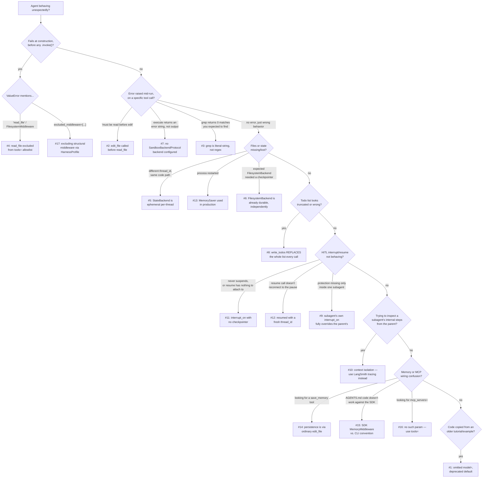

# Common Mistakes & Pitfalls

> "Everything in this chapter is a place where the SDK's actual behavior diverges from the behavior a reasonable
> LangGraph/LangChain expert would guess." — the operating premise of this chapter.

## Learning Objectives

By the end of this chapter, you will be able to:

- Diagnose, from a symptom alone, which of DeepAgents' seventeen most common failure modes you're looking at, and
  jump directly to the mechanic (Ch. 2–14) responsible rather than debugging from first principles every time
- Distinguish failures that are **DeepAgents-specific design decisions** (e.g., `grep` being literal-string, whole-
  list `write_todos` replacement) from failures that are **ordinary LangGraph/LangChain mechanics** wearing a
  DeepAgents costume (e.g., checkpointer requirements for `interrupt()`, `thread_id` scoping)
- Read a `ValueError` raised at `create_deep_agent()` construction time and immediately know which structurally
  required middleware or tool the call is fighting
- Correctly reason about persistence across `thread_id` boundaries for every backend from Chapter 6, instead of
  assuming "the filesystem" behaves like a single shared disk
- Audit a subagent hierarchy for silently dropped `interrupt_on` protection, and know exactly which subagent
  shapes inherit HITL config and which never do
- Tell apart the SDK's `MemoryMiddleware` from the `deepagents-code` CLI's `AGENTS.md`/`memories/*.md` convention
  on sight, so code copied from the wrong docs page doesn't waste an afternoon

---

## Prerequisites for This Chapter

This chapter assumes you've read **Chapters 1–15** in full — it does not re-derive any mechanic, only catalogs
where that mechanic's real-world behavior surprises people. In particular, it leans on:

- **Chapter 2** (Architecture & Internals) — the exact middleware assembly order, structurally-required vs.
  configuration-gated middleware, and `HarnessProfile`/`register_harness_profile`
- **Chapter 3** (Your First Deep Agent) — the full `create_deep_agent()` argument list and the `model=None`
  deprecation
- **Chapter 4** (Planning System & Todos) — the `Todo` schema and `write_todos`'s whole-list-replace semantics
- **Chapter 5** (Filesystem-Backed Context) — the eight filesystem tools, `edit_file`'s read-before-edit
  constraint, and `grep`'s literal-string contract
- **Chapter 6** (Backends & Storage Architecture) — `StateBackend`/`FilesystemBackend`/`StoreBackend`/
  `CompositeBackend`, and `SandboxBackendProtocol` for `execute`
- **Chapter 7** (Memory & Persistence) — `MemoryMiddleware`'s `before_agent` mechanics and the SDK-vs-CLI
  distinction
- **Chapter 8** (Subagent Orchestration) — `SubAgent`/`CompiledSubAgent`/`AsyncSubAgent`, and context isolation
- **Chapter 9** (Human-in-the-Loop) — `interrupt_on`, `InterruptOnConfig`, subagent HITL inheritance rules
- **Chapter 10** (Checkpointing & Durable Execution) — checkpointer choice and `thread_id` scoping
- **Chapter 11** (MCP Integration) — why there's no `mcp_servers=` parameter
- **Chapters 13–15** (Custom Tools & Middleware, Skills & Advanced Context Engineering, Best Practices) — the
  production patterns this chapter's pitfalls are the *failure* side of

If any of the above feels shaky rather than merely "a detail I'd need to look up," go back to that chapter first —
this one assumes you can place every pitfall below in its correct mechanical context without re-explanation.

---

## How to Use This Chapter

Each pitfall below follows the same three-part shape:

- **Symptom** — what you actually observe: an exception, a silent wrong behavior, a support ticket
- **Root Cause** — the specific DeepAgents mechanic responsible, with a pointer back to the chapter that covers it
  in full
- **Fix** — the concrete code or configuration change, with a before/after snippet wherever the fix is more than
  a one-line change of mind

Pitfalls are grouped thematically (Model & Invocation, Filesystem & Backends, Planning, Subagents, Human-in-the-
Loop & Checkpointing, Memory, MCP & Middleware) rather than presented as one flat list, because most real
debugging sessions start with "something in this *area* is broken," not "I wonder about pitfall #11 specifically."

---

## 1. Diagnostic Flowchart: Where to Look First

Before diving into the catalog, use this as a triage tool. Start at the top with whatever you're actually
observing, and follow the branch that matches — each leaf names the pitfall number to jump to.



Keep this diagram bookmarked — most real incidents map onto exactly one of these leaves within the first thirty
seconds of looking at a traceback or a transcript.

---

## Common Mistakes

### Model & Invocation

#### 1. Omitting `model=` and Silently Landing on the Deprecated Default

**Symptom**: An agent behaves differently than expected — a different model's tool-calling quirks show up, a cost
spike appears on the Anthropic bill for a service the team thought was configured for a different provider or a
different model version — and nobody on the team can point to where the active model is actually chosen. Often
surfaces during a routine dependency bump: nothing in the diff touches the model, yet behavior changes.

**Root Cause**: Chapter 3 covers this directly: `create_deep_agent(model=None, ...)` — i.e., simply not passing
`model` at all — is accepted and **silently falls back to `ChatAnthropic("claude-sonnet-4-6")`**, a default path
that has been deprecated since deepagents 0.5.3 but still works today. This is the single most common
copy-pasted mistake from outdated tutorials, quick-start snippets, and Stack Overflow answers written against an
older or hypothetical version of the API. It compiles, it runs, and it gives zero indication anything is wrong
until someone asks "wait, which model is this actually using?"

**Fix**: Always pass `model` explicitly — a provider string or a live `BaseChatModel` instance — at every
`create_deep_agent()` call site, with no exceptions for "just a quick prototype."

```python
# WRONG — relies on the deprecated model=None fallback
from deepagents import create_deep_agent

agent = create_deep_agent(
    tools=[my_tool],
    system_prompt="You are a helpful assistant.",
)
# Silently resolves to ChatAnthropic("claude-sonnet-4-6") under the hood.
```

```python
# CORRECT — model is explicit, every time
from deepagents import create_deep_agent

agent = create_deep_agent(
    model="anthropic:claude-sonnet-4-6",   # or a live BaseChatModel instance
    tools=[my_tool],
    system_prompt="You are a helpful assistant.",
)
```

A useful team-level guard: a lint rule or code-review checklist item that flags any `create_deep_agent(` call
site missing a `model=` keyword argument — this is cheap to catch mechanically and expensive to catch by
production surprise.

---

### Filesystem & Backends

#### 2. Calling `edit_file` on a File You Haven't `read_file`'d Yet

**Symptom**: `edit_file(...)` fails immediately with an error to the effect of "file must be read before it can
be edited" — even though the file definitely exists and the path is correct.

**Root Cause**: Chapter 5's read-before-edit constraint: `FilesystemMiddleware` **enforces**, not merely
suggests, that a file must have been `read_file`'d earlier in the same session before `edit_file` will touch it.
This mirrors Claude Code's own Edit-tool contract intentionally — it forces the model to have seen the file's
actual current content before mutating it, rather than blindly patching a string against a stale or hallucinated
mental model of what the file contains.

**Fix**: `read_file` first, in the same session, before any `edit_file` call — every time, even for a file the
model "should already know about" from earlier context.

```python
# WRONG — edit_file called on a file never read_file'd this session
edit_file(file_path="/research/notes.md", old_string="TODO", new_string="Done")
# -> error: file must be read before it can be edited
```

```python
# CORRECT — read_file first, in the same session
read_file(file_path="/research/notes.md")
edit_file(file_path="/research/notes.md", old_string="TODO", new_string="Done")
```

If you're writing a custom tool or subagent wrapper that programmatically calls `edit_file` on the model's
behalf, this ordering constraint applies to *your* code too — there is no bypass for tool-orchestrated calls
versus model-issued ones.

---

#### 3. Assuming `grep` Supports Regex

**Symptom**: A `grep(pattern="error\\d+")` call the model (or your own code) expected to match "error" followed
by digits returns zero matches — or worse, matches only the literal 9-character string `error\d+` if that exact
sequence happens to appear somewhere in the file.

**Root Cause**: Chapter 5 states this explicitly and it bears repeating because it is the single most common
point of confusion in this entire SDK: **`grep` is a literal string search, not a regex engine.** This is a
deliberate design choice, and it directly contradicts the instinct anyone with shell `grep` muscle memory brings
to the tool. There is no `.`, `*`, `[...]`, `(...)`, or `\d` special-character behavior — every character in
`pattern` is matched exactly as written. It's also capped at 1000 total matches by default (`grep_max_count`).

**Fix**: Search for the exact literal substring you expect, and if you genuinely need pattern matching, do it
after reading the file back with `read_file` rather than expecting `grep` to do it for you. If you're writing the
agent's `system_prompt`, state this constraint explicitly — it measurably changes how often the model attempts
regex-shaped patterns.

```python
# WRONG — treating grep as a regex engine
grep(pattern="error\\d+", path="/logs/app.log")
# Searches for the literal 8-character string "error\d+" — not "error" + digits.
```

```python
# CORRECT — search for the exact literal text, or read and filter yourself
grep(pattern="error 404", path="/logs/app.log")      # exact substring match
# or, when you actually need pattern logic:
content = read_file(file_path="/logs/app.log")
# ... apply real regex client-side against the returned content ...
```

```python
# In a system prompt — make the constraint explicit to steer the model
system_prompt = (
    "When searching files, use grep only for exact literal text or keyword "
    "matches — it is NOT a regex engine. For pattern-based searches, "
    "read_file the relevant slice and reason over it directly."
)
```

---

#### 4. Excluding `read_file` from a `tools=` Allowlist

**Symptom**: `create_deep_agent(...)` raises a `ValueError` at construction time — before any invocation — the
moment you try to restrict the filesystem tool surface (e.g., for a write-only ingestion agent, or a locked-down
research agent).

**Root Cause**: Chapter 5's `FilesystemMiddleware(tools=[...])` allowlist has exactly one hard rule: **`read_file`
must always be present**, regardless of which other tools you include or exclude. Omitting it isn't a smaller
filesystem — from the middleware's perspective it's a broken one, since `edit_file`'s very ability to function
depends on files having been read first (Pitfall #2), and every other filesystem tool's usefulness assumes the
model can read content back. The middleware refuses to construct rather than silently producing a crippled tool
set.

**Fix**: Always include `"read_file"` in any custom `tools=[...]` allowlist passed to `FilesystemMiddleware` (or
to `create_deep_agent(tools=[...])` when it's implicitly configuring the filesystem tool surface) — restrict the
*other* tools freely, but never this one.

```python
# WRONG — raises ValueError at construction time
from deepagents.middleware.filesystem import FilesystemMiddleware

fs_middleware = FilesystemMiddleware(
    tools=["ls", "write_file", "glob"],   # read_file omitted
)
# -> ValueError: read_file must be included in the tool allowlist
```

```python
# CORRECT — read_file always present, restrict everything else freely
fs_middleware = FilesystemMiddleware(
    tools=["ls", "read_file", "write_file", "glob"],
)
```

This is worth checking first whenever a locked-down or "principle of least tool" agent configuration fails
construction with an unfamiliar `ValueError` — it's almost always this.

---

#### 5. Assuming `StateBackend` Persists Across Different `thread_id`s

**Symptom**: A file the agent wrote in one conversation is simply gone when the "same agent" is invoked again —
but only sometimes, and the team can't reproduce it reliably in a quick REPL session (because a quick REPL session
tends to accidentally reuse the same `thread_id` the whole time, masking the bug).

**Root Cause**: Chapter 6's most consequential fact about the default backend: **`StateBackend` is ephemeral and
scoped per-thread.** Its own docstring says it plainly — files persist within a conversation thread but not
across threads. This is the SDK's zero-configuration default (omitting `backend=` entirely gives you
`StateBackend`), which means any agent built without a deliberate backend choice inherits this behavior whether
or not anyone intended it. "The filesystem" reads as a persistent disk in casual conversation about the SDK, but
under the default backend it is nothing more durable than LangGraph's own per-thread state channel.

**Fix**: If anything written to the filesystem needs to outlive a single conversation, route it through
`StoreBackend` (directly, or via `CompositeBackend`) — not `StateBackend`.

```python
# WRONG — expects "the agent's filesystem" to remember things across threads
from deepagents import create_deep_agent
from deepagents.backends.state import StateBackend

agent = create_deep_agent(
    model="anthropic:claude-sonnet-4-6",
    backend=StateBackend(),   # the default — files vanish once thread_id changes
)

agent.invoke({"messages": [...]}, config={"configurable": {"thread_id": "conv-1"}})
# writes /notes/summary.md

agent.invoke({"messages": [...]}, config={"configurable": {"thread_id": "conv-2"}})
# /notes/summary.md does not exist here — different thread_id, StateBackend is ephemeral per-thread
```

```python
# CORRECT — route paths that must survive across threads to a StoreBackend
from deepagents.backends.state import StateBackend
from deepagents.backends.store import StoreBackend
from deepagents.backends.composite import CompositeBackend
from langgraph.store.memory import InMemoryStore

backend = CompositeBackend(
    default=StateBackend(),
    routes={
        "/memories/": StoreBackend(store=InMemoryStore(), namespace=namespace_by_user),
    },
)

agent = create_deep_agent(model="anthropic:claude-sonnet-4-6", backend=backend)
# /memories/** now survives across thread_id values; everything else stays scratch-space ephemeral.
```

The Hands-On Exercise at the end of this chapter has you reproduce this exact failure on purpose before fixing
it — trust the reproduction, not the fact sheet.

---

#### 6. Assuming `FilesystemBackend` Needs a Checkpointer to Persist

**Symptom**: An engineer skips wiring a real checkpointer ("we're not using HITL, so why bother"), then separately
worries that files written via `FilesystemBackend` will be lost on a process restart the same way `StateBackend`'s
files would be — and either overengineers a checkpointing solution for a problem that doesn't exist, or
under-trusts a backend that was already durable the whole time.

**Root Cause**: Chapter 6 (and Chapter 10) draw this distinction precisely: `FilesystemBackend` writes directly
to **real disk**, rooted at a `root_dir` you configure. It is not an abstraction sitting on top of LangGraph state
— it *is* disk I/O. Nothing about it is "checkpointed" in the LangGraph sense, and nothing needs to be: the bytes
are already durable the instant `write_file` returns, entirely independent of whether a checkpointer exists at
all, and independent of `messages`/`todos` state, which *is* inside the checkpoint boundary. A process restart
doesn't touch these files, because they were never inside anything a checkpointer manages in the first place.

**Fix**: Don't reason about `FilesystemBackend` durability in terms of checkpointer choice at all — they are
orthogonal concerns. Reason about checkpointer choice purely in terms of `messages`/`todos` durability and HITL
requirements (Chapter 10's table), and about `FilesystemBackend` durability purely in terms of "is `root_dir`
itself durable storage" (a real disk, a persistent volume — an infrastructure question, not a `deepagents`
question).

```python
# Misconception: "I need SqliteSaver or the files will disappear on restart"
from deepagents.backends.filesystem import FilesystemBackend
from langgraph.checkpoint.memory import MemorySaver

agent = create_deep_agent(
    model="anthropic:claude-sonnet-4-6",
    backend=FilesystemBackend(root_dir="/workspace/checked-out-repo"),
    checkpointer=MemorySaver(),   # fine for messages/todos; irrelevant to the files themselves
)
# The files under /workspace/checked-out-repo/ survive a process restart regardless of
# which checkpointer (or none) is configured — they were never inside the checkpoint boundary.
```

The actual question worth asking for a `FilesystemBackend`-backed agent is: is `root_dir` itself on durable,
shared storage (a real volume, not an ephemeral container filesystem that disappears on redeploy)? That's an
infrastructure decision, not a `deepagents` API choice.

---

#### 7. Expecting `execute` to Work Without a Sandbox Backend

**Symptom**: The model calls `execute(command="...")`, expecting a working shell, and gets back an error string
instead of real command output — often mistaken for a bug in the tool itself, or in the model's ability to form
the right command.

**Root Cause**: Chapter 6 is explicit: none of the four storage-only backends (`StateBackend`, `FilesystemBackend`,
`StoreBackend`, `CompositeBackend`) implement `execute`/`aexecute` at all. This is deliberate, not an oversight —
letting an LLM run arbitrary shell commands is not something the SDK hands you by accident. `execute` only
becomes a real, working shell when the configured `backend` implements the stricter `SandboxBackendProtocol`
(which extends the base contract with `execute`/`aexecute` plus an `id` property for sandbox lifecycle
management).

**Fix**: If the agent genuinely needs to execute code or shell commands, configure a backend that implements
`SandboxBackendProtocol` — and read Chapter 19 before deploying it, since sandboxed execution is a security
surface, not just a capability toggle.

```python
# WRONG — expecting execute to "just work" with a plain storage backend
from deepagents.backends.state import StateBackend

agent = create_deep_agent(
    model="anthropic:claude-sonnet-4-6",
    backend=StateBackend(),
)
# agent calls execute("pytest tests/") -> returns an error string, not test output.
# StateBackend does not implement SandboxBackendProtocol.
```

```python
# CORRECT — a SandboxBackendProtocol-implementing backend actually runs commands
# (exact class/import depends on your chosen sandbox provider — illustrative shape below)
from my_sandbox_provider import DockerSandboxBackend

agent = create_deep_agent(
    model="anthropic:claude-sonnet-4-6",
    backend=DockerSandboxBackend(image="python:3.12-slim"),
)
# agent calls execute("pytest tests/") -> runs for real, inside the sandboxed environment.
```

If `execute` fails in a demo, the first diagnostic question is never "what's broken in the tool" — it's "which
backend is this agent using, and does it implement `SandboxBackendProtocol`?"

---

### Planning

#### 8. Assuming `write_todos` Patches Instead of Replaces (or That a Fourth Status Exists)

**Symptom**: A custom middleware or tool wrapper that tries to "merge" a single todo update loses the rest of the
list — three of four items simply vanish from state after what looked like a small, single-item update. Or:
someone designs a workflow expecting a `"cancelled"`/`"blocked"`/`"failed"` status and finds the schema rejects it.

**Root Cause**: Chapter 4 is precise on both points. First, `write_todos(todos: list[Todo], ...)` treats `todos`
as **the entire new value of the state key**, every single call — not a diff, not an append, not a merge with
whatever was there before. If the model (or your own code calling the tool programmatically) submits only the one
item it wants to change, the other items aren't preserved; they're simply gone. Second, the `Todo` schema's
`status` field is `Literal["pending", "in_progress", "completed"]` — exactly three values, full stop. There is no
`"cancelled"`, `"blocked"`, `"failed"`, or `"skipped"` slot; a task that genuinely can't be completed has no
dedicated status for that outcome in this schema.

**Fix**: Always resubmit the **complete** list on every `write_todos` call, with only the fields that actually
changed different from the previous submission. If you need to represent "this can't be done," encode that as a
`completed` item whose `content` notes the caveat, or leave it `pending`/`in_progress` — don't invent a fourth
status value anywhere in code that constructs `Todo` objects directly.

```python
# WRONG — a custom wrapper that "patches" just one item
def mark_done(todo_content: str):
    # Only sends the one changed item — the other three vanish from state.
    write_todos(todos=[{"content": todo_content, "status": "completed"}])
```

```python
# CORRECT — always resubmit the full list, only the target item's status changed
def mark_done(current_todos: list[dict], todo_content: str):
    updated = [
        {**t, "status": "completed"} if t["content"] == todo_content else t
        for t in current_todos
    ]
    write_todos(todos=updated)   # full list, one field changed
```

```python
# WRONG — inventing a fourth status
{"content": "Deploy to prod", "status": "blocked"}   # not a valid Literal value — schema-invalid
```

```python
# CORRECT — represent "can't proceed" within the three real statuses
{"content": "Deploy to prod (blocked on infra ticket INFRA-482 — leaving in_progress)", "status": "in_progress"}
```

---

### Subagents

#### 9. A Subagent's Own `interrupt_on` Silently Overriding the Parent's

**Symptom**: A destructive tool (e.g., `execute`, `write_file` to a sensitive path) is correctly gated with human
approval at the parent agent level — but calls made from *inside one specific subagent* execute with no
approval step at all, even though nothing in a quick read of the code looks wrong.

**Root Cause**: Chapter 9, Section 4: a declarative `SubAgent` **inherits** the parent's `interrupt_on` by
default — but only if it doesn't define its own. The moment a `SubAgent` definition includes even one
`interrupt_on` entry, that entry **fully replaces**, rather than merges with, the parent's configuration for that
subagent. Every tool the parent was protecting that the subagent doesn't re-list becomes unprotected inside that
one subagent — a regression that's easy to introduce (an engineer adds `interrupt_on` thinking only about the one
tool they care about) and hard to notice in review.

**Fix**: Either omit `interrupt_on` on the subagent entirely (full inheritance), or, if it genuinely needs a
different policy, restate **every** tool the parent protects that this subagent can also call — not just the one
tool that prompted the change.

```python
# WRONG — subagent's own interrupt_on silently drops the parent's write_file protection
from deepagents import create_deep_agent, SubAgent
from langchain.agents.middleware import InterruptOnConfig

release_notes_writer = SubAgent(
    name="release-notes-writer",
    description="Drafts release notes and writes them to the docs directory.",
    system_prompt="You draft release notes and save them via write_file.",
    interrupt_on={
        "execute": InterruptOnConfig(allowed_decisions=["approve", "reject"]),
        # write_file is NOT listed here — but the parent below protects it.
    },
)

agent = create_deep_agent(
    model="anthropic:claude-sonnet-4-6",
    interrupt_on={
        "write_file": InterruptOnConfig(allowed_decisions=["approve", "edit", "reject"]),
        "execute": InterruptOnConfig(allowed_decisions=["approve", "reject"]),
    },
    subagents=[release_notes_writer],
)
# write_file calls made BY release-notes-writer now execute with NO approval gate at all.
```

```python
# CORRECT — restate every tool the parent protects, or omit interrupt_on entirely
release_notes_writer = SubAgent(
    name="release-notes-writer",
    description="Drafts release notes and writes them to the docs directory.",
    system_prompt="You draft release notes and save them via write_file.",
    interrupt_on={
        "write_file": InterruptOnConfig(allowed_decisions=["approve", "edit", "reject"]),
        "execute": InterruptOnConfig(allowed_decisions=["approve", "reject"]),
    },
)

# — or, simpler, when no different policy is actually needed:
release_notes_writer_v2 = SubAgent(
    name="release-notes-writer",
    description="Drafts release notes and writes them to the docs directory.",
    system_prompt="You draft release notes and save them via write_file.",
    # No interrupt_on key at all — inherits the parent's full config.
)
```

Also worth restating from Chapter 9: `CompiledSubAgent` and `AsyncSubAgent` **never** inherit the parent's
`interrupt_on`, under any configuration — HITL for those two shapes must be built in at the point the graph was
compiled, or on the remote graph itself, respectively. There is no top-level knob that reaches either one.

---

#### 10. Trying to "Peek" at a Subagent's Intermediate Reasoning from the Parent

**Symptom**: A debugging session tries to inspect what a subagent "was thinking" mid-task — its intermediate tool
calls, its own chain of reasoning — by looking at the parent agent's `messages` state after the `task` call
returns, and finds none of it there. Sometimes escalates into an attempt to hack around this by modifying the
subagent's system prompt to "always report your intermediate steps," which defeats the isolation benefit the
subagent existed for in the first place (Chapter 8's Real-World Scenario covers exactly this anti-pattern).

**Root Cause**: Chapter 8's core architectural point: subagent context isolation is not a visibility restriction
you can toggle — it is structural. A subagent runs as a **separate compiled graph invocation** with its own fresh
internal message history; only the single **extracted final report** is returned to the parent via a state
update. The subagent's intermediate tool calls, reasoning steps, and full internal transcript are never part of
the parent's context window, by design — that's the entire mechanism that makes subagent delegation useful for
context management in the first place. There is no parent-side API that exposes them.

**Fix**: Stop looking in the parent's `messages` state — it structurally cannot contain what you're looking for.
If you need to observe a subagent's internal execution (for debugging, auditing, or building trust in its
behavior), use **LangSmith tracing** against the subagent's own compiled graph run, which does capture the full
internal trajectory independently of what the parent ever sees.

```python
# WRONG — expecting a subagent's internal steps to show up in the parent's transcript
result = agent.invoke({"messages": [HumanMessage(content="Review this PR via the coding subagent.")]})
for m in result["messages"]:
    print(m)   # only the parent's own messages + the subagent's FINAL report appear here —
               # never the subagent's internal read_file/execute/reasoning steps.
```

```python
# CORRECT — inspect the subagent's actual execution via LangSmith tracing,
# not by searching the parent's message history for something that isn't there.
# (Conceptually: open the trace for this run in LangSmith, find the child run
#  corresponding to the `task` tool call that invoked the subagent, and inspect
#  ITS OWN message history there — it is a separate traced graph execution.)
```

If what you actually need is "the subagent should surface more information in its report," the fix is a prompt
change to that subagent's `system_prompt` describing exactly what belongs in the final report — not an attempt to
break isolation and dump the full internal transcript back into the parent's context, which reinflates the
parent's context window and defeats the entire reason the subagent existed.

---

### Human-in-the-Loop & Checkpointing

#### 11. Using `interrupt_on` Without a Checkpointer

**Symptom**: An agent is configured with `interrupt_on={"deploy": ...}` but no `checkpointer=` argument anywhere
in the call. Either the interrupt behaves unpredictably, or the follow-up `agent.invoke(Command(resume=...), ...)`
call has nothing to reconnect to.

**Root Cause**: Chapter 9 and Chapter 10 both land on the same requirement: human-in-the-loop is built entirely on
LangGraph's own `interrupt()`/`Command(resume=...)` primitive, and that primitive has a hard requirement — an
interrupt has to suspend execution into *something durable*, and resume has to read state back out of that same
something. That something is the checkpointer. Skip it, and there is nothing for the graph to suspend into or
resume from. This is standard LangGraph interrupt semantics, not a `deepagents`-specific restriction — but it's an
easy thing to forget specifically in a DeepAgents context, because `interrupt_on` reads like a self-contained
configuration flag rather than a dependency on another constructor argument entirely.

**Fix**: Any deep agent using `interrupt_on` (or `permissions` with `mode="interrupt"`) must be built with a real
checkpointer from the start — `MemorySaver()` is acceptable for local dev/test HITL flows, but it must be present.

```python
# WRONG — interrupt_on configured, no checkpointer anywhere
from deepagents import create_deep_agent
from langchain.agents.middleware import InterruptOnConfig

agent = create_deep_agent(
    model="anthropic:claude-sonnet-4-6",
    tools=[deploy],
    interrupt_on={
        "deploy": InterruptOnConfig(allowed_decisions=["approve", "reject"]),
    },
    # No checkpointer= — the interrupt has nothing to suspend into.
)
```

```python
# CORRECT — checkpointer present, matched to your actual durability needs (Chapter 10)
from langgraph.checkpoint.memory import MemorySaver

agent = create_deep_agent(
    model="anthropic:claude-sonnet-4-6",
    tools=[deploy],
    interrupt_on={
        "deploy": InterruptOnConfig(allowed_decisions=["approve", "reject"]),
    },
    checkpointer=MemorySaver(),   # or SqliteSaver/PostgresSaver for anything durable — see Pitfall #13
)
```

---

#### 12. Resuming With a Fresh `thread_id` Instead of the Original

**Symptom**: `agent.invoke(Command(resume={"decisions": [...]}), config=config)` doesn't resume the pending
interrupt at all — instead it appears to start a brand-new conversation from scratch, or errors that there's
nothing to resume.

**Root Cause**: Chapter 9 and Chapter 10 both flag this as the single easiest HITL mistake to make by accident:
`Command(resume=...)` only reconnects to a suspended execution if `config` carries the **exact same `thread_id`**
the original interrupting call used. A fresh `uuid4()` generated at resume time (common when `thread_id`
generation lives inside a request handler instead of being read back from wherever the original task's ID was
persisted) produces a new, empty thread with no pending interrupt to satisfy — not an error exactly, just
silently the wrong thread.

**Fix**: Capture the `thread_id` once, at the start of a conversation, persist it (in your own database, not just
in a Python variable that dies with the process), and reuse that exact same value for every subsequent resume
call in that conversation.

```python
# WRONG — generates a fresh thread_id on "resume"
from uuid import uuid4

config = {"configurable": {"thread_id": str(uuid4())}}
result = agent.invoke({"messages": [...]}, config=config)   # interrupts

# ... later, in a different request handler ...
resume_config = {"configurable": {"thread_id": str(uuid4())}}   # BUG: brand-new thread_id
resumed = agent.invoke(Command(resume={"decisions": [{"type": "approve"}]}), config=resume_config)
# Nothing to resume — this starts an unrelated new thread.
```

```python
# CORRECT — capture thread_id once, persist it, reuse it for the resume call
from uuid import uuid4

thread_id = str(uuid4())
config = {"configurable": {"thread_id": thread_id}}
result = agent.invoke({"messages": [...]}, config=config)   # interrupts
# db.save(task_id=my_task_id, thread_id=thread_id)  — persist the mapping yourself

# ... later, in a different request handler, reading the SAME thread_id back ...
thread_id = db.get(task_id=my_task_id).thread_id
resume_config = {"configurable": {"thread_id": thread_id}}   # SAME thread_id
resumed = agent.invoke(Command(resume={"decisions": [{"type": "approve"}]}), config=resume_config)
# Correctly resumes the suspended execution.
```

---

#### 13. Using `MemorySaver` in Production

**Symptom**: A deployed agent loses its entire conversation history, todo plan, and (under the default
`StateBackend`) every file it had written — not gradually, but all at once, the moment the process restarts for
any reason (a deploy, a crash, a routine scale-down).

**Root Cause**: Chapter 10 is unambiguous: `MemorySaver` is **in-memory only** — state lives inside the Python
process and is gone the instant that process exits. This is fine, even correct, for local dev and test HITL flows
(the docs' own examples use it for exactly that reason — it's convenient to run with zero setup). It is a
production mistake specifically because the loss is bigger than it looks in a quick demo: it's not just chat
history, it's the entire `todos` plan and, with the default backend, every file the agent had written. A restart
with `MemorySaver` doesn't degrade a conversation — it erases the task.

**Fix**: Match the checkpointer to deployment topology, not to "what's easiest to install." Single-instance,
single-disk-you-control deployments can legitimately use `SqliteSaver`; anything with more than one process or
instance that might serve the same `thread_id` needs `PostgresSaver` (or another networked, LangGraph-compatible
durable checkpointer).

```python
# WRONG — production service using MemorySaver
from langgraph.checkpoint.memory import MemorySaver

agent = create_deep_agent(
    model="anthropic:claude-sonnet-4-6",
    checkpointer=MemorySaver(),   # gone on every restart — fine for dev, not for prod
)
```

```python
# CORRECT — durable checkpointer matched to deployment shape
from langgraph.checkpoint.postgres import PostgresSaver

with PostgresSaver.from_conn_string(DATABASE_URL) as checkpointer:
    agent = create_deep_agent(
        model="anthropic:claude-sonnet-4-6",
        checkpointer=checkpointer,
    )
    # Any instance behind the load balancer reconstructs identical state for a given thread_id.
```

When testing crash-and-resume behavior, actually kill the process (or at minimum drop all in-memory references
and re-`create_deep_agent()`) — calling `.invoke()` twice in the same Python session will not catch a `MemorySaver`
mistake before production does.

---

### Memory

#### 14. Expecting a `save_memory` Tool to Exist

**Symptom**: An engineer designing an agent with `memory=[...]` looks for a dedicated tool the model can call to
"save this to memory" — something named like `save_memory`, `remember`, or `update_memory` — and finds no such
tool anywhere in the agent's tool list, despite `MemoryMiddleware` clearly being active.

**Root Cause**: Chapter 7's mechanics: `MemoryMiddleware` operates at the `before_agent` hook, downloading and
injecting the content of every `memory=[paths]` source into an `<agent_memory>` block ahead of every model call,
alongside an injected `<memory_guidelines>` block. Those guidelines instruct the model that persisting a new
durable fact means calling the **ordinary `edit_file` tool** (Chapter 5) on the same source path that was loaded
into `memory=[...]` — there is no separate memory-writing API. This surprises people coming from other "AI
memory" products that do ship a dedicated save-memory tool; DeepAgents deliberately reuses the filesystem tool
surface instead of adding a new one.

**Fix**: Don't build custom tooling around a nonexistent `save_memory` tool. Trust the documented convention: the
model persists memory via `edit_file` on the configured memory path, guided by the injected
`<memory_guidelines>` text. If you need to verify this is actually happening, inspect the assembled system prompt
(e.g., via `stream_mode="debug"`) for the literal `<agent_memory>`/`<memory_guidelines>` blocks rather than
looking for a tool call that will never appear.

```python
# WRONG — building a custom "save_memory" tool because you assumed one should exist
@tool
def save_memory(fact: str) -> str:
    """Persist a fact to long-term memory."""
    # ... this duplicates what edit_file + MemoryMiddleware already does, badly ...
```

```python
# CORRECT — just configure memory=[...] and let the model use edit_file per convention
from deepagents import create_deep_agent

agent = create_deep_agent(
    model="anthropic:claude-sonnet-4-6",
    memory=["./agent_memory/AGENTS.md"],
)
# The model calls edit_file("./agent_memory/AGENTS.md", ...) on its own, per the
# injected <memory_guidelines> — no custom tool required or expected.
```

---

#### 15. Conflating the SDK's `MemoryMiddleware` With the `deepagents-code` CLI's `AGENTS.md` Convention

**Symptom**: Code copied from a docs page that references `~/.deepagents/<agent_name>/AGENTS.md`,
`~/.deepagents/<agent_name>/memories/*.md`, or `/skill:<name>` slash commands doesn't work when adapted into an
SDK `create_deep_agent(...)` call — there's no `agents_md=` parameter, no fixed path convention, nothing matching
what the docs page described.

**Root Cause**: Chapter 7 draws this distinction explicitly because public documentation blurs it constantly: the
**SDK** (`deepagents`, `create_deep_agent()` — the subject of this entire course) implements memory via
`MemoryMiddleware` and the `memory=[paths]` parameter, where you choose the file location(s) freely. The
`deepagents-code`/`dcode` **CLI** is a separate, Claude-Code-style terminal coding agent *built on top of* the SDK,
with its own fixed product conventions: `~/.deepagents/<agent_name>/AGENTS.md` and
`~/.deepagents/<agent_name>/memories/*.md`. The docs page at
`docs.langchain.com/oss/python/deepagents/code/memory-and-skills` documents the **CLI product**, not the
`create_deep_agent()` API surface — and treating it as SDK reference sends you looking for parameters that were
never part of the function signature.

**Fix**: Know which of the two you're building. If you're calling `create_deep_agent()` directly in your own
Python service, use `memory=[paths]` with paths of your own choosing — there is no fixed naming scheme to match.
If you're actually using the `deepagents-code` CLI product itself (not writing SDK code), then the
`AGENTS.md`/`memories/*.md` convention is the right reference, but recognize it as CLI product behavior, not an
API contract you can rely on inside your own `create_deep_agent()` calls.

```python
# WRONG — treating the CLI's fixed convention as an SDK parameter
agent = create_deep_agent(
    model="anthropic:claude-sonnet-4-6",
    agents_md="~/.deepagents/support-bot/AGENTS.md",   # not a real create_deep_agent() parameter
)
```

```python
# CORRECT — SDK memory is memory=[paths], your own path choice, no fixed naming scheme
agent = create_deep_agent(
    model="anthropic:claude-sonnet-4-6",
    memory=["./support_bot_memory/preferences.md"],   # any path(s) you choose
)
```

---

### MCP & Middleware

#### 16. Looking for a Nonexistent `mcp_servers=` Parameter

**Symptom**: A search of the `create_deep_agent()` signature for `mcp_servers=`, `mcp_config=`, or anything
MCP-shaped comes up empty, and the developer concludes MCP integration must require some undocumented escape
hatch or a different function entirely.

**Root Cause**: Chapter 11 is direct about this: `create_deep_agent()` has **no MCP-specific parameter at all**.
This is by design, not a gap — MCP tools, once fetched via `langchain-mcp-adapters`' `MultiServerMCPClient`, are
just ordinary `BaseTool` instances, indistinguishable from a hand-written `@tool` function. They belong in exactly
the same place any other tool does: the standard `tools=` argument.

**Fix**: Fetch tools with `MultiServerMCPClient` (async `get_tools()`), and pass the resulting list into the
ordinary `tools=` argument — mixed freely with hand-written tools if needed.

```python
# WRONG — searching for an MCP-specific constructor argument that doesn't exist
agent = create_deep_agent(
    model="anthropic:claude-sonnet-4-6",
    mcp_servers={"filesystem": {"command": "npx", "args": [...]}},   # no such parameter
)
```

```python
# CORRECT — fetch MCP tools via langchain-mcp-adapters, pass them through tools=
from langchain_mcp_adapters.client import MultiServerMCPClient
from deepagents import create_deep_agent

mcp_client = MultiServerMCPClient({
    "filesystem": {"command": "npx", "args": ["-y", "@modelcontextprotocol/server-filesystem", "/data"]},
})
mcp_tools = await mcp_client.get_tools()

agent = create_deep_agent(
    model="anthropic:claude-sonnet-4-6",
    tools=mcp_tools + [render_chart],   # MCP tools mixed freely with ordinary Python tools
)
```

Note this is distinct from the `deepagents-cli` product's own `mcp-servers add`/`tools.json` mechanism — that's a
CLI-deployed-agent feature for runtime tool discovery, not the SDK pattern this pitfall covers.

---

#### 17. Trying to Exclude `FilesystemMiddleware`/`SubAgentMiddleware` via a `HarnessProfile`

**Symptom**: `create_deep_agent(...)` raises a `ValueError` at construction time after registering a
`HarnessProfile` with `excluded_middleware=["FilesystemMiddleware"]` or `["SubAgentMiddleware"]` — even though
other middleware exclusions via the same mechanism work fine.

**Root Cause**: Chapter 2 marks these two middleware as **structurally required**, not merely "on by default."
`FilesystemMiddleware` comes early in the assembly order because nearly everything downstream depends on a
filesystem existing — subagents share a backend through it, memory reads/writes through it, summarization evicts
to it. `SubAgentMiddleware` is protected the same way, in part because the default `general-purpose` subagent is
auto-added unless explicitly disabled through other configuration. Naming either one in a `HarnessProfile`'s
`excluded_middleware` raises `ValueError` at construction — the SDK refuses to build an agent missing either
piece.

**Fix**: If the real goal is "this agent should never delegate to subagents," don't try to exclude
`SubAgentMiddleware` — instead, simply don't pass `subagents=` and disable the auto-added general-purpose
subagent through the harness profile's other configuration surface. If the goal is genuinely "no filesystem
concept at all," that's a signal you want `langchain.agents.create_agent()` directly — a bare LangChain agent with
no `deepagents` involved — rather than fighting `create_deep_agent()`'s structural guarantees.

```python
# WRONG — raises ValueError at construction time
from deepagents import HarnessProfile, register_harness_profile

broken_profile = HarnessProfile(
    excluded_middleware=["FilesystemMiddleware"],
)
register_harness_profile("my-model-spec", broken_profile)

agent = create_deep_agent(model="my-model-spec", tools=[])
# -> ValueError: FilesystemMiddleware cannot be excluded
```

```python
# CORRECT — achieve "no subagent delegation" without fighting structural middleware
no_delegation_profile = HarnessProfile(
    disable_general_purpose_subagent=True,   # illustrative — use the profile's actual
                                              # documented knob for this, not excluded_middleware
)
register_harness_profile("my-model-spec", no_delegation_profile)

agent = create_deep_agent(
    model="my-model-spec",
    tools=[],
    # No subagents= passed at all — nothing to delegate to.
)
```

```python
# If you truly want zero filesystem concept: drop to the underlying LangChain harness directly
from langchain.agents import create_agent

agent = create_agent(model="my-model-spec", tools=[])   # no deepagents involved at all
```

---

## Real-World Scenario

A platform team ships an internal "Ops Copilot" deep agent: it answers infrastructure questions, drafts
remediation plans, and — after human approval — can call a `restart_service` tool against production. Three
months in, an on-call engineer reports that a restart happened without the Slack approval message ever
appearing. The investigation surfaces three of this chapter's pitfalls stacked on top of each other.

First, the team finds that `restart_service` calls made through the `incident-triage` subagent never interrupted
at all, while calls made by the main agent correctly paused for approval — Pitfall #9. A recent change had given
`incident-triage` its own `interrupt_on={"execute": ...}` to add a *new* protection around a diagnostic shell tool,
without noticing that this fully replaced the parent's `interrupt_on`, silently dropping `restart_service`'s
approval gate inside that one subagent. The fix is exactly Chapter 9's Section 4.3 pattern: restate every tool the
parent protects inside the subagent's own `interrupt_on`, not just the one the author was thinking about.

Second, while testing the fix in staging, the team notices approvals granted from a different on-call
engineer's laptop never seem to reconnect — the Slack bot generates a **new** `thread_id` for every approval
button click instead of reading back the `thread_id` persisted alongside the original interrupt payload
(Pitfall #12). The bot's own database already had a `task_id -> thread_id` mapping recorded at interrupt time;
the bug was simply never reading it back on the resume path. Once fixed, resumes correctly reconnect regardless of
which engineer's session handles the approval.

Third, a post-incident review turns up that the whole approval flow had been running on `MemorySaver()` since the
prototype phase — nobody had migrated it to `PostgresSaver` before the internal launch (Pitfall #13). Every
approval that took longer than one deploy cycle to review had actually been silently un-resumable the whole time;
it only hadn't been caught earlier because most approvals happened quickly, within the same process lifetime.
Migrating to `PostgresSaver`, matched to the FastAPI service's multi-instance deployment topology (Chapter 10),
closes the gap for good — any of the service's replicas can now pick up a pending approval regardless of which
instance originally raised the interrupt.

None of these three pitfalls, individually, would have been catastrophic on its own. Stacked together, they
produced exactly the failure mode HITL exists to prevent: a production-affecting action executing with no human
actually in the loop.

---

## Best Practices

- **Check which backend is active before assuming anything about persistence.** "The filesystem" is not one
  thing — `StateBackend`, `FilesystemBackend`, `StoreBackend`, and `CompositeBackend` all behave differently
  across thread and process boundaries (Chapter 6). Never reason about durability from vibes; check the actual
  `backend=` argument.
- **Log the assembled middleware stack in debug mode.** Chapter 2's exact assembly order determines which
  middleware exists at all for a given `create_deep_agent()` call — when something behaves unexpectedly, print or
  log the compiled graph's middleware list before guessing at causes further downstream.
- **Treat every `SubAgent`'s `interrupt_on` key as a full override, and audit it on every code review** that
  touches subagent definitions — it is the single easiest silent regression in this SDK to introduce.
- **Persist `thread_id` in your own database, not in a request-scoped variable.** A fresh `thread_id` generated
  by accident at resume time is indistinguishable, mechanically, from starting an unrelated new conversation.
- **Reproduce a suspected pitfall before trusting a fix.** Don't take "StateBackend doesn't persist across
  threads" on faith — write a file under one `thread_id`, invoke under a different one, and watch it actually be
  gone (the Hands-On Exercise below does exactly this).
- **Grep this chapter's diagnostic flowchart (Section 1) before debugging from first principles** — most
  DeepAgents-specific incidents map onto exactly one of its seventeen leaves within seconds.
- **Never cite deepagentsdk.dev.** It is not an official LangChain domain. Treat `docs.langchain.com` and the
  `langchain-ai/deepagents` GitHub source as the only authoritative references, per this course's standing
  practice since Chapter 1.

---

## Summary

- Seventeen concrete, DeepAgents-specific failure modes were cataloged across seven themes: Model & Invocation,
  Filesystem & Backends, Planning, Subagents, Human-in-the-Loop & Checkpointing, Memory, and MCP & Middleware.
- Several pitfalls are pure DeepAgents design decisions worth memorizing exactly: `grep` is literal-string, not
  regex; `write_todos` replaces the whole list every call with exactly three valid statuses; `edit_file` requires
  a prior `read_file` in the same session; `read_file` can never be excluded from a `FilesystemMiddleware` tool
  allowlist.
- Several others are ordinary LangGraph/LangChain mechanics that happen to bite harder inside a deep agent because
  more state rides on them: a missing checkpointer breaks HITL entirely, not just durability; a fresh `thread_id`
  on resume reconnects to nothing; `MemorySaver` in production loses the entire `todos` plan and (under
  `StateBackend`) every file, not just chat history.
- Subagent-related pitfalls are the subtlest to catch in review: a `SubAgent`'s own `interrupt_on` is a full
  override, not a merge, and subagent context isolation means intermediate reasoning is structurally invisible to
  the parent — LangSmith tracing, not the parent's `messages`, is the correct tool for inspecting it.
- Two pitfalls are pure "this parameter/tool doesn't exist" traps: there is no `mcp_servers=` parameter (use
  `tools=` with `langchain-mcp-adapters`) and no `save_memory` tool (persistence happens via ordinary `edit_file`
  per the injected `<memory_guidelines>`).
- The SDK's `MemoryMiddleware` and the `deepagents-code` CLI's `AGENTS.md`/`memories/*.md` convention are related
  but distinct — code written against one docs page will not directly apply to the other.

---

## Knowledge Check

1. A colleague's `create_deep_agent()` call has no `model=` argument at all and "still works." Explain precisely
   what it's actually doing under the hood, and why this is a deprecated path rather than a safe convenience.
2. Why does resuming with a freshly generated `thread_id` fail to resume a pending interrupt, mechanically —
   what is `Command(resume=...)` actually looking up, and why does a new `thread_id` have nothing to find?
3. A `SubAgent` defines its own `interrupt_on={"execute": InterruptOnConfig(...)}`, and the parent agent
   separately protects `write_file`. Does the subagent's `write_file` calls still require approval? Justify your
   answer precisely, and name which subagent shape(s) this rule doesn't even apply to (because they never
   inherit `interrupt_on` in the first place).
4. A file written under `thread_id="a"` with the default backend is missing when the same agent is invoked under
   `thread_id="b"`. Is this a bug? What backend change would fix it, and why doesn't switching checkpointers
   alone solve it?
5. Explain why `FilesystemBackend` durability and checkpointer choice are orthogonal concerns — what state lives
   inside the checkpoint boundary, and what doesn't, for that specific backend?
6. A teammate wants to inspect "what the coding subagent was thinking" during a run by grepping the parent
   agent's `result["messages"]`. Why won't this work, and what should they use instead?

---

## Hands-On Exercise

Reproduce Pitfall #5 on purpose, confirm the failure with your own eyes, then fix it.

1. **Build a minimal agent on the default backend** (no `backend=` argument at all, so it resolves to
   `StateBackend`):

   ```python
   from deepagents import create_deep_agent

   agent = create_deep_agent(
       model="anthropic:claude-sonnet-4-6",
       system_prompt="When asked to save a note, use write_file to save it to /notes/note.md.",
   )
   ```

2. **Invoke it under one `thread_id`**, asking it to write a note, and confirm the write succeeded (read it back
   with `read_file` in the same conversation):

   ```python
   from uuid import uuid4
   from langchain_core.messages import HumanMessage

   thread_a = str(uuid4())
   config_a = {"configurable": {"thread_id": thread_a}}

   agent.invoke(
       {"messages": [HumanMessage(content="Save a note: 'Renew the TLS cert by Friday.'")]},
       config=config_a,
   )
   result = agent.invoke(
       {"messages": [HumanMessage(content="Read back /notes/note.md.")]},
       config=config_a,
   )
   print(result["messages"][-1].content)   # should show the note's content
   ```

3. **Invoke the same agent under a fresh `thread_id`**, and ask it to read the same path:

   ```python
   thread_b = str(uuid4())
   config_b = {"configurable": {"thread_id": thread_b}}

   result_b = agent.invoke(
       {"messages": [HumanMessage(content="Read back /notes/note.md.")]},
       config=config_b,
   )
   print(result_b["messages"][-1].content)   # the file does not exist under this thread_id
   ```

   Confirm directly — don't take it on faith — that the model reports the file missing, or that a `read_file`
   call inside the agent's own tool-call trace errors as file-not-found. This is `StateBackend`'s ephemeral,
   per-thread behavior, reproduced on purpose.

4. **Fix it with a `CompositeBackend` routing `/notes/` to a `StoreBackend`:**

   ```python
   from deepagents.backends.state import StateBackend
   from deepagents.backends.store import StoreBackend
   from deepagents.backends.composite import CompositeBackend
   from langgraph.store.memory import InMemoryStore

   store = InMemoryStore()

   def namespace_by_user(runtime):
       return ("notes",)   # simplified — a real app would scope by user/tenant

   backend = CompositeBackend(
       default=StateBackend(),
       routes={"/notes/": StoreBackend(store=store, namespace=namespace_by_user)},
   )

   fixed_agent = create_deep_agent(
       model="anthropic:claude-sonnet-4-6",
       backend=backend,
       system_prompt="When asked to save a note, use write_file to save it to /notes/note.md.",
   )
   ```

5. **Repeat step 2 and step 3 against `fixed_agent`** — write the note under one fresh `thread_id`, then read it
   back under a completely different fresh `thread_id`. Confirm the note is now present in both cases, and
   articulate, in your own words, exactly which line of configuration changed the outcome (the `/notes/` route,
   not the `model=` or `system_prompt=`, which are identical between the broken and fixed versions).

6. **Bonus:** repeat the exercise once more, this time writing to `/tmp/scratch.md` instead of `/notes/note.md`
   against `fixed_agent` — confirm this path still behaves like Pitfall #5 (falls through to the `default=
   StateBackend()` route, so it's still gone across threads), demonstrating that the fix is per-path, not global.

---

## Further Reading

- [DeepAgents Overview (LangChain Docs)](https://docs.langchain.com/oss/python/deepagents/overview) — the
  official conceptual reference this course tracks throughout
- [`langchain-ai/deepagents` GitHub repository](https://github.com/langchain-ai/deepagents) — the ground-truth
  source for every claim in this chapter; when in doubt about current behavior, read `graph.py` and the relevant
  `backends/*.py`/`middleware/*.py` module directly rather than relying on any secondary source
- Related chapter in this course: [Chapter 6 — Backends & Storage Architecture](./06-backends-and-storage-architecture.md)
  — the full backend decision tree this chapter's Pitfalls #5–#7 assume
- Related chapter in this course: [Chapter 8 — Subagent Orchestration](./08-subagent-orchestration.md) — context
  isolation mechanics behind Pitfalls #9–#10
- Related chapter in this course: [Chapter 9 — Human-in-the-Loop](./09-human-in-the-loop.md) — the full
  `interrupt_on`/`InterruptOnConfig`/subagent-inheritance surface behind Pitfalls #9, #11–#12
- Related chapter in this course: [Chapter 10 — Checkpointing & Durable Execution](./10-checkpointing-and-durable-execution.md)
  — checkpointer selection behind Pitfall #13
- Related chapter in this course: [Chapter 7 — Memory & Persistence](./07-memory-and-persistence.md) — the
  SDK-vs-CLI distinction behind Pitfalls #14–#15
- **Never cite deepagentsdk.dev** — it is not an official LangChain domain, and content from it should not be
  treated as authoritative for anything in this course or in production decision-making.

---

<div style="display:flex;justify-content:space-between;align-items:center;">
  <a href="./15-best-practices.md">← Previous: Best Practices</a>
  <a href="./00-index.md">🏠 Index</a>
  <a href="./17-testing-and-evaluation.md">Next: Testing & Evaluation →</a>
</div>
