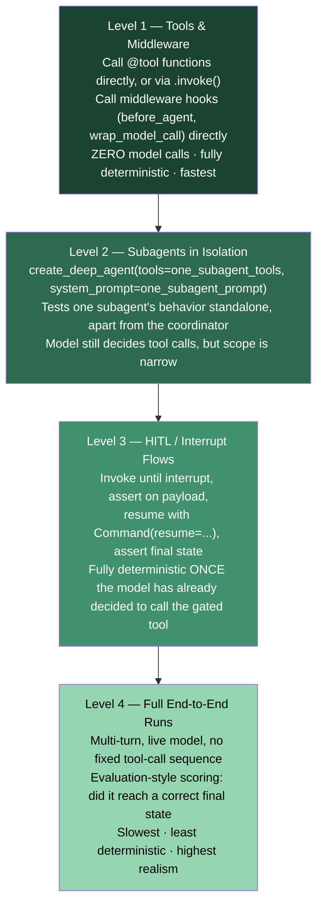

# Testing & Evaluation

## Learning Objectives

By the end of this chapter, you will be able to:

- Explain precisely why naive end-to-end assertions on a deep agent are flaky, and what specifically makes them
  flaky (the model, not the graph, decides control flow)
- Apply a testing pyramid for deep agents: unit-test tools and middleware with zero model calls, test individual
  subagents in isolation via a minimal `create_deep_agent()` call, test HITL/interrupt flows deterministically,
  and reserve full end-to-end multi-turn runs for evaluation-style scoring rather than exact-path assertions
- Write pytest tests for a custom `@tool`-decorated function, both by calling the underlying function directly
  and via `.invoke()` on the tool object
- Write pytest tests for a custom middleware hook (`before_agent`, `wrap_model_call`) by constructing a fake
  state/request object and calling the hook directly, without running a full agent
- Test filesystem-tool behavior deterministically against the default `StateBackend` by inspecting the returned
  state's `files` key — with no real disk I/O
- Build a standalone `create_deep_agent()` call using just one subagent's `tools`/`system_prompt` to unit-test
  that subagent's behavior in isolation from the full coordinator
- Test both the approve and reject paths of a human-in-the-loop interrupt deterministically: invoke to the
  interrupt, assert on the payload, resume with `Command(resume=...)`, assert on the final state
- Mock a chat model to return a fixed sequence of tool calls, turning a full agent run into a fully deterministic
  regression test
- Describe, at a conceptual level, how LangSmith dataset-based evaluation answers "is this agent still good"
  rather than "did this exact test pass," and where that fits in a CI/CD pipeline relative to unit tests

---

## Prerequisites for This Chapter

This chapter assumes you already have real, working fluency with **pytest and conventional Python testing** —
fixtures, mocking/monkeypatching, parametrization, assertion style. None of that is re-taught here; this chapter
is entirely about what's *specific* to testing a deep agent on top of skills you already have.

It also assumes:

- **Chapter 5 (Filesystem-Backed Context)** and **Chapter 6 (Backends & Storage Architecture)** — you should
  already know that the default `StateBackend` stores files as a `files` key in LangGraph state, checkpointed
  like any other state, and that this is what makes filesystem-tool testing cheap: no real disk is involved.
- **Chapter 8 (Subagent Orchestration)** — the `SubAgent`/`CompiledSubAgent`/`AsyncSubAgent` distinction, and the
  fact that each `SubAgent` becomes its own independently compiled graph internally. This chapter's subagent
  testing section depends directly on that fact.
- **Chapter 9 (Human-in-the-Loop)** — `interrupt_on`, `InterruptOnConfig`, the four decisions
  (`approve`/`edit`/`reject`/`respond`), and the exact resume mechanics:
  `agent.invoke(Command(resume={"decisions": [...]}), config=config)` with the same `thread_id`. This chapter's
  Hands-On Exercise is a direct pytest-ification of Chapter 9's Deployment Agent.
- **Chapter 13 (Custom Tools & Middleware)** — writing your own `AgentMiddleware` subclass and its hooks
  (`before_agent`, `wrap_model_call`, `modify_request`). This chapter assumes you can already write such a
  middleware; it only adds how to test one without running a full agent.

This chapter does not re-explain LangGraph's `CompiledStateGraph.invoke()`/`.stream()` API, `Command(resume=...)`,
or ordinary pytest mechanics — see the prerequisite chapters above and your own existing LangGraph/pytest
experience for any of that.

---

## 1. The Core Testing Challenge: The Model Decides Control Flow

Here is the one fact that shapes every technique in this chapter: **a deep agent's control flow is not fully
determined by your code.** In a normal FastAPI service, given a fixed input, the code path taken is deterministic
— you wrote the `if`/`else`. In a deep agent, given a fixed input, *which tools get called, in what order, with
what arguments, and how many times* is a decision the **model** makes at inference time. Two runs with identical
input can produce a different sequence of tool calls, a different number of turns, or a different final wording,
even against the same model and temperature-zero settings, because you are not the one writing the control flow —
you're writing the *policy surface* (system prompt, tools, middleware) the model reasons over.

This has one direct, practical consequence for test design: **an assertion like "the agent called `write_todos`
with exactly these three items, in this order, then called `deploy`" is inherently probabilistic** unless you
eliminate the model's actual decision-making from the test. You have exactly two ways to do that:

1. **Mock the chat model** so it deterministically returns a fixed tool-call sequence (Section 7) — the graph
   still runs for real, but the "what should I call next" decision is no longer coming from a live model.
2. **Test at a lower level entirely** — unit-test the tool function, the middleware hook, or a single subagent's
   behavior directly, without a full multi-turn agent run in the loop at all (Sections 3–6).

Anything you test against a *live* model with no fixed tool-call sequence belongs in the fourth, outermost layer
of this chapter's pyramid: **evaluation**, not unit testing — scoring whether the agent *reached a correct final
state*, not asserting on the exact path it took to get there (Section 8).

---

## 2. The Testing Pyramid for Deep Agents

Reframe the classic testing pyramid (many fast unit tests, fewer integration tests, a handful of expensive
end-to-end tests) for a deep agent specifically. The axis that matters here isn't just "speed" — it's **how much
of the test's outcome depends on a live model's decision-making**.



Read the pyramid as an escalating trade of determinism for realism:

- **Level 1** never touches a model at all. Tools and middleware are plain Python — testable with the same
  pytest techniques you already use for any other function or class, and they should make up the bulk of your
  test suite for exactly that reason: fast, deterministic, and catching the majority of real bugs (a tool that
  mishandles an edge-case argument, a middleware hook that truncates the wrong slice of messages).
- **Level 2** brings the model back in, but scoped to one subagent's narrow tool/prompt surface rather than the
  full coordinator's. Because Chapter 8 established that each `SubAgent` becomes its own compiled graph
  internally, you can construct that same graph directly via a minimal `create_deep_agent()` call and exercise it
  alone — smaller surface, easier to reason about than testing it only indirectly through the full multi-subagent
  system.
- **Level 3** looks like it involves a live model, but the part being tested is not: by the time an interrupt
  fires, the model has *already* decided to call the gated tool. Everything from "assert the interrupt payload"
  through "resume and assert the final state" is pure, deterministic code — `Command(resume=...)` and state
  inspection, no model randomness involved in that half of the test.
- **Level 4** is where you accept non-determinism as inherent to what's being tested, and change what you assert
  accordingly — not "did it call these three tools in this order," but "did the conversation end in a state that
  satisfies criteria X" (Section 8's LangSmith discussion).

The practical rule this pyramid implies: **push as much of your test suite as possible into Levels 1–3.** They
are fast, deterministic, and run in CI on every PR. Level 4 answers a different question ("is this agent still
good after a prompt change") and belongs in a different part of your pipeline (Section 9).

---

## 3. Unit-Testing Custom Tools

Tools passed via `create_deep_agent(tools=[...])` are ordinary LangChain tools — `@tool`-decorated functions,
`StructuredTool` instances, or plain callables. Nothing about wrapping one in a deep agent changes how you test
it: call the underlying function directly, or call `.invoke()` on the tool object with a fixed input dict, exactly
as you already would for any LangChain tool.

Take the `deploy` tool from Chapter 9's Deployment Agent project:

```python
from langchain_core.tools import tool


@tool
def deploy(service: str, environment: str, image_tag: str) -> str:
    """Deploy a service to an environment.

    This performs a real, irreversible production deployment when called.
    Always requires explicit human approval before it may run.

    Args:
        service: The service name to deploy, e.g. "billing-api".
        environment: Target environment, e.g. "staging" or "production".
        image_tag: The container image tag to deploy, e.g. "v2.4.1".
    """
    return f"Deployed {service}:{image_tag} to {environment}."
```

### 3.1 Calling `.invoke()` on the tool object

This exercises the tool exactly the way the agent's tool-calling machinery does — through the tool's structured
input schema, argument validation included:

```python
def test_deploy_invoke_returns_expected_message():
    result = deploy.invoke({
        "service": "billing-api",
        "environment": "production",
        "image_tag": "v2.4.1",
    })
    assert result == "Deployed billing-api:v2.4.1 to production."


def test_deploy_invoke_rejects_missing_argument():
    import pytest
    from pydantic import ValidationError

    with pytest.raises(ValidationError):
        deploy.invoke({"service": "billing-api", "environment": "production"})
        # missing image_tag — the tool's generated schema should reject this
        # before the underlying function body ever runs
```

### 3.2 Calling the underlying function directly

For tools where you want to bypass the schema/validation layer entirely and test only the business logic, call
the wrapped function directly via the tool's `.func` attribute:

```python
def test_deploy_func_directly():
    result = deploy.func(service="billing-api", environment="staging", image_tag="v1.0.0")
    assert "staging" in result
    assert "billing-api:v1.0.0" in result
```

Both styles are useful for different things: `.invoke()` tests the tool as the agent will actually call it
(including argument validation); calling `.func` directly tests pure business logic in isolation, the same way
you'd unit-test any plain function. Neither requires a model, a graph, or `create_deep_agent()` at all — this is
the cheapest, fastest layer of the pyramid, and it should carry the majority of your assertions about tool
correctness (error handling, edge-case arguments, idempotency) rather than deferring them to a full agent run.

### 3.3 A tool with real side effects — assert on the effect, not just the return value

For a tool that mutates external state (calls an API, writes to a queue, whatever your `execute`-style tool does
in your own system), mock the collaborator exactly as you would in any other pytest test, and assert on the call
made to it:

```python
from unittest.mock import MagicMock

def test_deploy_calls_deployment_client_with_correct_args(monkeypatch):
    fake_client = MagicMock()
    monkeypatch.setattr("myapp.tools.deployment_client", fake_client)

    deploy.func(service="billing-api", environment="production", image_tag="v2.4.1")

    fake_client.deploy.assert_called_once_with(
        service="billing-api", environment="production", image_tag="v2.4.1",
    )
```

Nothing here is deep-agent-specific — it's the same tool-testing discipline this learner already applies to any
LangChain tool. The point worth internalizing is *where this fits in the pyramid*: every bug you catch at this
layer is a bug you never have to chase through a flaky end-to-end run.

---

## 4. Unit-Testing Custom Middleware

Chapter 13 covers writing custom `AgentMiddleware` subclasses with hooks like `before_agent`, `wrap_model_call`,
and `modify_request`. These hooks are plain Python methods — testable directly, without invoking a full agent, by
constructing a fake state/request object and calling the hook yourself.

Take a small middleware that trims message history before it reaches the model — a simplified stand-in for the
kind of custom middleware Chapter 13 walks through building:

```python
from langchain.agents.middleware import AgentMiddleware


class TrimHistoryMiddleware(AgentMiddleware):
    """Keeps only the most recent `max_messages` messages before each model call."""

    def __init__(self, max_messages: int = 20):
        self.max_messages = max_messages

    def wrap_model_call(self, request, handler):
        if len(request.messages) > self.max_messages:
            request = request.override(messages=request.messages[-self.max_messages:])
        return handler(request)
```

> The exact `ModelRequest`/state object shapes ship with the middleware base classes Chapter 13 introduces in
> full. The fakes below stand in for those real objects — the point of this section is the *calling convention*
> (construct a minimal object with the attributes your hook reads, call the hook directly, assert on what it
> passed downstream), not the precise attribute list of every framework object, which you should verify against
> your installed `deepagents`/`langchain` version.

### 4.1 Testing `wrap_model_call` directly

```python
from types import SimpleNamespace


def make_fake_request(messages):
    """A minimal stand-in for the real ModelRequest object, carrying only
    the attribute this middleware actually reads."""
    return SimpleNamespace(
        messages=messages,
        override=lambda **kwargs: SimpleNamespace(messages=kwargs.get("messages", messages)),
    )


def test_wrap_model_call_trims_long_history():
    middleware = TrimHistoryMiddleware(max_messages=2)
    fake_request = make_fake_request(messages=["msg1", "msg2", "msg3", "msg4"])
    captured = {}

    def fake_handler(request):
        captured["messages"] = request.messages
        return "handler-result"

    result = middleware.wrap_model_call(fake_request, fake_handler)

    assert captured["messages"] == ["msg3", "msg4"]
    assert result == "handler-result"


def test_wrap_model_call_leaves_short_history_untouched():
    middleware = TrimHistoryMiddleware(max_messages=5)
    fake_request = make_fake_request(messages=["msg1", "msg2"])
    captured = {}

    def fake_handler(request):
        captured["messages"] = request.messages
        return "handler-result"

    middleware.wrap_model_call(fake_request, fake_handler)

    assert captured["messages"] == ["msg1", "msg2"]
```

No graph, no model, no `create_deep_agent()` call anywhere in either test — just a Python object and a method
call, exactly like unit-testing any other class in a codebase you already know how to test.

### 4.2 Testing `before_agent`

The same pattern applies to a `before_agent` hook — construct a minimal fake state object with just the fields
your hook reads, call the hook, assert on what it returns or mutates:

```python
class RequireApiKeyMiddleware(AgentMiddleware):
    """Rejects a run before it starts if no api_key is present in the runtime context."""

    def before_agent(self, state, runtime):
        if not getattr(runtime.context, "api_key", None):
            raise ValueError("api_key is required in runtime context")


def test_before_agent_raises_without_api_key():
    import pytest

    middleware = RequireApiKeyMiddleware()
    fake_state = SimpleNamespace(messages=[])
    fake_runtime = SimpleNamespace(context=SimpleNamespace(api_key=None))

    with pytest.raises(ValueError, match="api_key is required"):
        middleware.before_agent(fake_state, fake_runtime)


def test_before_agent_passes_with_api_key():
    middleware = RequireApiKeyMiddleware()
    fake_state = SimpleNamespace(messages=[])
    fake_runtime = SimpleNamespace(context=SimpleNamespace(api_key="sk-test-123"))

    middleware.before_agent(fake_state, fake_runtime)  # should not raise
```

This is the same value proposition as tool testing: a middleware bug (an off-by-one in a trim boundary, a
context field read under the wrong name) is far cheaper to catch here than by running a full agent and noticing
the context window looks wrong three turns later.

---

## 5. Testing Filesystem-Tool Behavior via `StateBackend`

Chapters 5 and 6 established that the default `StateBackend` stores files as a `files` key in LangGraph state —
not on real disk, not in a network-backed store, just a channel-written value in the graph's own state,
checkpointed like everything else. That's what makes filesystem-tool testing cheap: invoke the graph with a fixed
`thread_id`, inspect the returned state's `files` key directly, and assert on exactly what got written — no real
disk I/O involved for most filesystem-tool tests.

```python
from langchain_core.messages import HumanMessage, AIMessage, ToolMessage
from langgraph.checkpoint.memory import MemorySaver
from deepagents import create_deep_agent
```

Because the model decides *whether and when* to call `write_file`, the deterministic version of this test pairs
naturally with the fake-chat-model pattern this chapter builds fully in Section 7. Here's the shape, using a
minimal fake model that's guaranteed to call `write_file` exactly once with fixed arguments — treat this as a
forward reference to Section 7's fuller treatment of the technique, not a new mechanism:

```python
def test_agent_writes_expected_file_to_state(fake_model_that_calls_write_file):
    # fake_model_that_calls_write_file is built the way Section 7 shows —
    # a BaseChatModel subclass returning a fixed AIMessage with a write_file
    # tool call, followed by a plain final AIMessage.
    agent = create_deep_agent(
        model=fake_model_that_calls_write_file,
        checkpointer=MemorySaver(),
    )
    config = {"configurable": {"thread_id": "fs-test-1"}}

    result = agent.invoke(
        {"messages": [HumanMessage(content="Save a deployment note.")]},
        config=config,
    )

    assert "/notes/deploy.md" in result["files"]
    assert result["files"]["/notes/deploy.md"] == "Deployed billing-api v2.4.1 to production."
```

Two things worth internalizing about this test:

- **No mock of the filesystem itself was needed.** `StateBackend` already keeps everything in LangGraph state —
  there's no disk, no network store, nothing to mock at the storage layer. You're asserting directly on the
  state dict `.invoke()` handed back.
- **A `MemorySaver()` (or no checkpointer at all) is sufficient** for a single-shot test like this one — you're
  not exercising crash/resume durability here (that's Chapter 10's territory), just inspecting the state produced
  by one invocation.

If your agent uses a different backend (`FilesystemBackend`, `StoreBackend`, `CompositeBackend` from Chapter 6),
the same *test shape* still applies, but you lose the "no real disk/store" advantage — a `FilesystemBackend` test
genuinely writes to a real directory (use `tmp_path`, as you already would for any code touching real disk), and
a `StoreBackend` test needs a real or in-memory `BaseStore` fixture. `StateBackend`'s state-only nature is what
makes this specific technique free of any I/O setup at all.

---

## 6. Testing Subagents in Isolation

Chapter 8 established a fact this section leans on directly: **each `SubAgent` becomes its own independently
compiled graph internally**, assembled by `deepagents` from that subagent's declarative `tools`/`system_prompt`
the same way the parent agent is assembled. That means you don't have to test a subagent only indirectly, through
the full coordinator's `task` dispatch — you can construct a standalone deep agent using *just* that subagent's
configuration and exercise it directly.

Take the `research` subagent from Chapter 8's Code Review Agent:

```python
research_subagent_tools = [grep, glob, read_file, ls]
research_subagent_system_prompt = (
    "You are a research specialist supporting a code review. Given a "
    "description of an issue, search the codebase using grep/glob/read_file "
    "to find: (1) the specific code implicated, (2) any similar patterns "
    "elsewhere in the codebase, and (3) any existing tests already covering "
    "related behavior. Produce a concise written summary covering all three. "
    "You have no write access; only read/search tools are available to you."
)
```

Build a standalone deep agent from exactly that configuration — no coordinator, no `task` tool, no other
subagents in the picture at all:

```python
from deepagents import create_deep_agent


def build_research_subagent_standalone(model):
    return create_deep_agent(
        model=model,
        tools=research_subagent_tools,
        system_prompt=research_subagent_system_prompt,
    )


def test_research_subagent_never_calls_write_tools(fake_model_for_research):
    # fake_model_for_research is a fixed-sequence fake model (Section 7) whose
    # scripted tool calls only ever hit grep/glob/read_file/ls.
    standalone_research_agent = build_research_subagent_standalone(fake_model_for_research)

    result = standalone_research_agent.invoke({
        "messages": [{
            "role": "user",
            "content": "Investigate the off-by-one bug in paginate().",
        }]
    })

    tool_calls_made = [
        msg.name for msg in result["messages"] if isinstance(msg, ToolMessage)
    ]
    assert all(name in {"grep", "glob", "read_file", "ls"} for name in tool_calls_made)
    assert "write_file" not in tool_calls_made
```

This is a meaningfully different — and cheaper — test than exercising `research` only through the full
coordinator's `task` tool: no coordinator prompt to satisfy, no risk of the parent model routing the task to the
wrong `subagent_type`, no other subagents' behavior able to interfere with the assertion. You're testing exactly
the unit Chapter 8 told you a `SubAgent` actually is — its own compiled graph — in isolation.

The same technique applies to a `coding` or `testing` subagent from that same project: build a standalone deep
agent from just that subagent's `tools`/`system_prompt` (and its `model=` override, if it has one), and assert on
its behavior directly, before ever wiring it into a multi-subagent coordinator.

---

## 7. Testing HITL Flows Deterministically

Chapter 9 established the exact mechanics: `interrupt_on` gates a tool, `agent.invoke()` suspends the graph and
returns an `Interrupt` payload under `result["__interrupt__"]`, and `agent.invoke(Command(resume={"decisions":
[...]}), config=config)` — with the *same* `thread_id` — resumes it. The reason this is testable deterministically,
unlike a full multi-turn run, is that **by the time the interrupt fires, the model has already made its
decision** — it decided to call the gated tool with specific arguments, and that decision is now frozen in the
suspended checkpoint. Everything from that point forward — inspecting the payload, resuming, asserting on the
result — is pure code, no model randomness involved.

This section pytest-ifies Chapter 9's Deployment Agent directly.

### 7.1 Fixture: the Deployment Agent

```python
import pytest
from uuid import uuid4
from langchain_core.messages import HumanMessage
from langchain_core.tools import tool
from langgraph.checkpoint.memory import MemorySaver
from langgraph.types import Command
from langchain.agents.middleware import InterruptOnConfig
from deepagents import create_deep_agent


@tool
def deploy(service: str, environment: str, image_tag: str) -> str:
    """Deploy a service to an environment. Requires human approval."""
    return f"Deployed {service}:{image_tag} to {environment}."


@pytest.fixture
def deployment_agent(fake_model_that_proposes_deploy):
    return create_deep_agent(
        model=fake_model_that_proposes_deploy,
        tools=[deploy],
        system_prompt="You are a deployment assistant.",
        interrupt_on={
            "deploy": InterruptOnConfig(allowed_decisions=["approve", "reject"]),
        },
        checkpointer=MemorySaver(),
    )


@pytest.fixture
def thread_config():
    return {"configurable": {"thread_id": str(uuid4())}}
```

`fake_model_that_proposes_deploy` is built with Section 8's fixed-sequence fake model pattern, scripted to always
propose exactly one `deploy` tool call with known arguments — that's what makes the interrupt payload's contents
predictable enough to assert on precisely, rather than merely asserting "an interrupt happened."

### 7.2 Testing the interrupt fires with the expected payload

```python
def test_deploy_interrupts_with_expected_payload(deployment_agent, thread_config):
    result = deployment_agent.invoke(
        {"messages": [HumanMessage(content="Deploy billing-api version v2.4.1 to production.")]},
        config=thread_config,
    )

    assert "__interrupt__" in result
    interrupt_payload = result["__interrupt__"][0].value[0]
    assert interrupt_payload["action_request"]["action"] == "deploy"
    assert interrupt_payload["action_request"]["args"] == {
        "service": "billing-api",
        "environment": "production",
        "image_tag": "v2.4.1",
    }
    assert interrupt_payload["config"]["allowed_decisions"] == ["approve", "reject"]
```

### 7.3 Testing the approve path

```python
def test_deploy_approve_path_executes_tool(deployment_agent, thread_config):
    deployment_agent.invoke(
        {"messages": [HumanMessage(content="Deploy billing-api version v2.4.1 to production.")]},
        config=thread_config,
    )

    approved_result = deployment_agent.invoke(
        Command(resume={"decisions": [{"type": "approve"}]}),
        config=thread_config,  # SAME thread_id as the interrupting call
    )

    final_message = approved_result["messages"][-1]
    assert "Deployed billing-api:v2.4.1 to production" in final_message.content
    assert "__interrupt__" not in approved_result
```

### 7.4 Testing the reject path

```python
def test_deploy_reject_path_never_executes_tool(deployment_agent, thread_config):
    deployment_agent.invoke(
        {"messages": [HumanMessage(content="Deploy billing-api version v2.4.1 to production.")]},
        config=thread_config,
    )

    rejected_result = deployment_agent.invoke(
        Command(resume={
            "decisions": [{
                "type": "reject",
                "message": "Production deploys are frozen until the incident review completes.",
            }],
        }),
        config=thread_config,  # SAME thread_id
    )

    tool_messages = [
        msg for msg in rejected_result["messages"]
        if getattr(msg, "name", None) == "deploy"
    ]
    assert tool_messages == []  # deploy never actually ran
    assert "frozen" in rejected_result["messages"][-1].content.lower() or \
           "won't deploy" in rejected_result["messages"][-1].content.lower()
```

Both 7.3 and 7.4 are **fully deterministic** given a fake model that reliably proposes the same `deploy` call —
no flakiness, no retries, no "run it three times and hope." That determinism is the entire point of Level 3 in
the pyramid: the interesting, hard-to-get-right part of HITL (does resume actually reconnect to the suspended
checkpoint, does reject actually prevent execution) is pure LangGraph/LangChain mechanics, testable with the same
rigor you'd apply to any other stateful backend code.

---

## 8. Mocking the Chat Model for Deterministic End-to-End Tests

Every section above that needed a "fake model" leaned on the same underlying pattern: replace the live
`BaseChatModel` with a fake that returns a **fixed sequence of tool calls**, so a full agent run — model decides,
tool executes, model decides again — becomes deterministic for one specific, known scenario. This is the
technique that makes a full end-to-end run usable as a **regression test** for a known-good multi-step flow,
rather than only usable as a probabilistic evaluation run.

```python
from itertools import count
from langchain_core.language_models import BaseChatModel
from langchain_core.messages import AIMessage, BaseMessage
from langchain_core.outputs import ChatGeneration, ChatResult


class ScriptedToolCallingChatModel(BaseChatModel):
    """A fake chat model that returns a fixed, ordered sequence of AIMessages,
    regardless of what's actually in the conversation history. Each call to
    _generate pops the next scripted response off the queue.
    """

    scripted_responses: list[AIMessage]

    def __init__(self, scripted_responses: list[AIMessage], **kwargs):
        super().__init__(scripted_responses=scripted_responses, **kwargs)
        self._call_index = count()

    def _generate(self, messages: list[BaseMessage], stop=None, **kwargs) -> ChatResult:
        index = next(self._call_index)
        response = self.scripted_responses[index]
        return ChatResult(generations=[ChatGeneration(message=response)])

    @property
    def _llm_type(self) -> str:
        return "scripted-tool-calling-fake"
```

Script a known-good "propose deploy, then summarize" flow:

```python
import uuid

deploy_proposal = AIMessage(
    content="",
    tool_calls=[{
        "name": "deploy",
        "args": {"service": "billing-api", "environment": "production", "image_tag": "v2.4.1"},
        "id": str(uuid.uuid4()),
    }],
)
final_summary = AIMessage(content="Deployed billing-api:v2.4.1 to production. Deployment complete.")

fake_model = ScriptedToolCallingChatModel(scripted_responses=[deploy_proposal, final_summary])
```

This is exactly the fake model referenced throughout Sections 5–7 (`fake_model_that_calls_write_file`,
`fake_model_for_research`, `fake_model_that_proposes_deploy`) — same class, different scripted sequence per test
scenario. Wire it into `create_deep_agent(model=fake_model, ...)` in place of a real provider string, and the
entire graph runs for real — real middleware, real tool execution, real state transitions — with only the model's
decision-making replaced by a fixed script.

**What this technique is good for**: regression-testing a specific, previously-observed multi-step flow (e.g.
"given this exact input, the agent should propose `deploy`, then, once approved, report success") without paying
for a live model call or accepting run-to-run variance in a CI test. **What it is not good for**: verifying that
the model *actually would* make that decision given the real prompt and real reasoning — that question belongs
to Section 9's evaluation layer, run against a real model.

---

## 9. LangSmith Evaluation, Conceptually

Unit tests (Levels 1–3) answer "does this specific piece of code behave correctly." They cannot answer a
different, equally important question: **"given the current system prompt, tools, and model, does this agent
still produce good outputs across a range of realistic inputs?"** That's an evaluation question, not a unit-test
question, and it's the domain LangSmith — the LangChain ecosystem's eval/observability platform — is built for.

At a conceptual level, LangSmith dataset-based evaluation follows a shape you'll recognize from any ML evaluation
workflow:

- **A dataset** of example inputs paired with expected outputs and/or scoring criteria — e.g. a set of realistic
  user requests to your deployment agent, each with a description of what a "good" final response looks like
  (correctly identified the service/environment/tag, asked for clarification when the request was ambiguous,
  never called `deploy` without going through the approval gate).
- **An evaluator function** that scores a deep agent's actual final output against that example's expected
  output/criteria — this can be exact-match, a rubric, or an LLM-as-judge style evaluator, depending on how
  precisely "correct" can be defined for that example.
- **A run** that invokes the deep agent (a real model, real reasoning, real tool decisions — deliberately *not*
  mocked, unlike Section 8) against every example in the dataset, collects the evaluator's scores, and aggregates
  them into a single run-level result you can compare across prompt versions, model versions, or middleware
  changes over time.

The exact LangSmith SDK calls for constructing datasets, registering evaluator functions, and kicking off a run
are outside what this course's research confirmed in detail — treat the shape above as the conceptual model, and
consult [LangSmith's own documentation](https://docs.smith.langchain.com/) for the exact, current API surface
rather than trusting a specific function signature reproduced secondhand here.

The framing to hold onto: **LangSmith evaluation answers "is this agent still good," while the unit tests in
Sections 3–7 answer "did this exact piece of code just break."** They are complementary, not substitutes for each
other — a passing LangSmith run tells you nothing about whether your `TrimHistoryMiddleware` handles an empty
message list correctly, and a green pytest suite tells you nothing about whether last week's system-prompt edit
made the agent worse at handling ambiguous deployment requests.

---

## 10. CI/CD Framing: What Runs Where

Given the pyramid from Section 2, split your test suite by cost and determinism, and gate your pipeline
accordingly:

| Layer | What it tests | Determinism | Typical placement |
|---|---|---|---|
| Level 1 — Tools & middleware | Pure Python functions/classes, zero model calls | Fully deterministic | Every commit, every PR — fast enough to run on every push |
| Level 2 — Subagents in isolation | A single subagent's compiled graph, scoped tools/prompt | Deterministic with a scripted model; probabilistic with a live one | Every PR, using a scripted model (Section 8) |
| Level 3 — HITL/interrupt flows | Interrupt payload correctness, resume/approve/reject mechanics | Fully deterministic once the tool-call decision is scripted | Every PR — this is genuinely cheap and should never be skipped |
| Level 4 — Full end-to-end, live model | Full multi-turn realism, actual model reasoning | Non-deterministic by nature | Scheduled (nightly/weekly) or as a release gate, not on every PR |
| LangSmith dataset evaluation | Aggregate quality across a range of realistic inputs | Non-deterministic; scored, not pass/fail in the unit-test sense | Scheduled runs, and explicitly before shipping a prompt/model change |

The practical guidance: **every PR should be gated by Levels 1–3 — all of them fast, all of them deterministic,
all of them cheap enough to run on every push with no excuse to skip.** Full end-to-end runs against a live model
and LangSmith dataset evaluations are valuable, but they cost real API spend and take real wall-clock time, and
their non-determinism means a single failing run is not automatically a regression — it might just be model
variance. Treat them as a **quality signal you review before shipping a meaningful change** (a new system prompt,
a model swap, a new tool), not as a blocking gate on every commit the way Levels 1–3 should be.

---

## Real-World Scenario

A platform team ships their Deployment Agent (Chapter 9) to a small internal audience and, following the
temptation every agent team faces, writes exactly one test: a full end-to-end `.invoke()` against the real model,
asserting the final message contains the word "Deployed." It's green in CI for weeks — until a routine model
version bump changes the model's phrasing just enough that the assertion starts failing intermittently, with no
actual behavior regression at all. Worse, nobody ever wrote a test for the *reject* path, so when a later
refactor of the `interrupt_on` config accidentally dropped `"reject"` from `allowed_decisions`, it shipped
unnoticed — the only test in the suite happened to always take the approve path.

The fix, applied in order: Level 1 tests for the `deploy` tool itself (argument validation, business logic) catch
the next tool-level regression instantly and for free. A scripted-model Level 3 test suite (this chapter's
Section 7) locks in both the approve *and* reject paths deterministically — the missing `"reject"` entry now
fails a specific, fast, always-green-or-red test instead of silently shipping. The single flaky end-to-end
assertion is demoted to what it always should have been: one example in a LangSmith dataset, evaluated for
"did the agent correctly propose a deploy plan," reviewed by a human before any model or prompt change ships, not
treated as a CI gate that blocks every PR on live-model variance.

---

## Best Practices

- **Push the majority of your test suite into Levels 1–3.** Tools, middleware, and HITL resume mechanics are
  fully testable without any model non-determinism in the loop — there's rarely a good reason for these to be
  undertested relative to full end-to-end runs.
- **Test both the approve and the reject path for every gated tool**, not just the happy path. A regression in
  `allowed_decisions` or in resume mechanics is just as real a bug on the reject path as on the approve path, and
  it's the one teams skip most often.
- **Use `.invoke()` on a tool for schema/validation coverage, and `.func` for pure business-logic coverage** —
  they test different layers, and both are useful.
- **Build one reusable scripted `BaseChatModel` fake and parametrize its script per test**, rather than
  hand-rolling a new fake class for every scenario — Section 8's `ScriptedToolCallingChatModel` pattern scales to
  any fixed multi-step flow you need to regression-test.
- **Test subagents standalone via a minimal `create_deep_agent(tools=..., system_prompt=...)` call** before (or
  in addition to) testing them only through the full coordinator's `task` dispatch — it isolates failures to the
  right layer immediately.
- **Reserve full end-to-end, live-model runs and LangSmith evaluation for the question they're actually suited
  to** — "is this agent still good" — not as a substitute for deterministic unit coverage of tools, middleware,
  and HITL flows.
- **Gate CI on the deterministic layers; schedule or gate releases on the non-deterministic ones.** A live-model
  end-to-end test failing on every PR due to ordinary model variance trains your team to ignore CI failures,
  which is worse than not having the test at all.

---

## Common Mistakes

- **Writing only flaky end-to-end tests, with no unit tests for tools or middleware.** This is the single most
  common failure mode: the suite looks "thorough" because it exercises the whole agent, but it's slow, flaky, and
  actually covers the *least* deterministic layer while leaving the cheapest, most deterministic bugs (a tool's
  argument-handling edge case, a middleware's off-by-one) completely uncovered.
- **Never testing the reject path of an interrupt.** It's easy to write one HITL test, have it happen to take the
  approve path, and consider HITL "tested" — leaving the reject path (and any `allowed_decisions` regression)
  completely uncovered, as in the Real-World Scenario above.
- **Assuming a LangSmith evaluation score is a substitute for deterministic unit tests.** A good aggregate eval
  score tells you the agent is behaving well *on average, right now, against this model* — it says nothing about
  whether a specific tool handles a specific edge case correctly, and it can mask a real regression in one
  narrow path if the dataset doesn't happen to exercise it.
- **Asserting on an exact tool-call sequence against a live, unmocked model.** This is the textbook flaky test:
  the model is not obligated to call tools in the same order (or at all) on every run, even for the same input.
  Either mock the model (Section 8) or move the assertion to an evaluation-style "did it reach a correct final
  state" check (Section 9).
- **Testing a subagent only indirectly, through the full coordinator.** This makes it impossible to tell, from a
  failing test alone, whether the bug is in the subagent's own logic or in the coordinator's routing/prompt —
  test the subagent standalone (Section 6) in addition to, not instead of, coordinator-level tests.
- **Forgetting that `.func` bypasses schema validation entirely.** A test that only calls `.func` directly can
  miss a real bug in how the tool's generated schema handles malformed model-provided arguments — cover both
  `.invoke()` and `.func` where argument validation matters.

---

## Summary

- A deep agent's control flow is decided by the model, not your code — naive exact-path assertions against a live
  model are inherently probabilistic. Eliminate the model's decision from a test (mock it, or test at a lower
  level) to make it deterministic.
- The testing pyramid for deep agents: unit-test tools and middleware directly (zero model calls, fully
  deterministic) → test individual subagents in isolation via a minimal `create_deep_agent()` call → test
  HITL/interrupt flows deterministically (the model's decision is already frozen by the time the interrupt fires)
  → reserve full end-to-end multi-turn runs for evaluation-style scoring, not exact-path assertions.
- Tools are ordinary LangChain tools — test via `.invoke()` for schema-validated calls, or `.func` for direct
  business-logic testing, exactly as you'd test any LangChain tool.
- Custom middleware hooks (`before_agent`, `wrap_model_call`) are plain methods — call them directly with a
  constructed fake state/request object and assert on the result, no full agent invocation required.
- The default `StateBackend` (Ch. 5–6) stores files as a `files` key in LangGraph state, so filesystem-tool tests
  can invoke the graph and inspect `result["files"]` directly, with no real disk I/O.
- Each `SubAgent` (Ch. 8) is its own compiled graph — construct one standalone via
  `create_deep_agent(tools=subagent_tools, system_prompt=subagent_system_prompt)` to unit-test it apart from the
  full coordinator.
- HITL flows (Ch. 9) are deterministic once the interrupt fires: invoke to the interrupt, assert on the payload,
  resume with `Command(resume=...)` using the same `thread_id`, assert on the final state — test both the
  approve and reject paths.
- A scripted `BaseChatModel` fake returning a fixed sequence of tool calls turns a full agent run into a
  deterministic regression test for a known-good multi-step flow.
- LangSmith dataset-based evaluation answers "is this agent still good" via a dataset, an evaluator function, and
  aggregate scoring — a complement to unit tests, not a substitute for them.
- Gate CI on the deterministic layers (unit tests, middleware tests, HITL flow tests); run expensive,
  non-deterministic full end-to-end/LangSmith evaluation runs on a schedule or as a pre-release quality gate.

---

## Knowledge Check

1. Why is an assertion like "the agent called `write_todos` with exactly these values, then called `deploy`"
   inherently flaky against a live model, and what are the two ways to make such an assertion deterministic?
2. Explain why a test of the HITL *resume* path can be fully deterministic even though the agent as a whole
   involves a non-deterministic model.
3. You want to unit-test one subagent from a multi-subagent coordinator without invoking the coordinator or the
   `task` tool at all. What specific fact about `SubAgent` (from Chapter 8) makes this possible, and what does the
   test construction actually look like?
4. What makes filesystem-tool tests against the default `StateBackend` cheap to write, compared to testing a
   `FilesystemBackend`-backed agent? What would you need to add to test a `FilesystemBackend` agent instead?
5. What is the difference between what a scripted `BaseChatModel` fake tells you and what a LangSmith dataset
   evaluation run tells you? Why can't one substitute for the other?
6. A team's only HITL test always takes the approve path. Describe a specific regression this leaves undetected,
   and how you'd catch it.

---

## Hands-On Exercise

Write a pytest test module for Chapter 9's Deployment Agent that exercises both the approve and reject interrupt
paths deterministically, following Section 7's pattern.

1. **Build a `ScriptedToolCallingChatModel` fake** (Section 8) scripted to always propose exactly one `deploy`
   tool call for `service="billing-api"`, `environment="production"`, `image_tag="v2.4.1"`, followed by a final
   summary `AIMessage` for the approve path, and a *second* scripted sequence (same proposal, different
   downstream summary) for a fresh reject-path run.

2. **Write a `deployment_agent` pytest fixture** that builds the agent via `create_deep_agent(model=<fake>,
   tools=[deploy], interrupt_on={"deploy": InterruptOnConfig(allowed_decisions=["approve", "reject"])},
   checkpointer=MemorySaver())`, matching Section 7.1.

3. **Write `test_deploy_interrupts_with_expected_payload`**: invoke the agent, assert `"__interrupt__"` is
   present, and assert the payload's `action_request["args"]` matches the scripted proposal exactly.

4. **Write `test_deploy_approve_path_executes_tool`**: invoke to the interrupt, resume with
   `Command(resume={"decisions": [{"type": "approve"}]})` on the *same* `thread_id`, and assert the final
   message reflects a completed deployment and that `"__interrupt__"` is absent from the resumed result.

5. **Write `test_deploy_reject_path_never_executes_tool`**: invoke to the interrupt (fresh `thread_id`), resume
   with a `"reject"` decision and a rejection message, and assert no `ToolMessage` named `"deploy"` appears
   anywhere in the resumed result's `messages`.

6. **Bonus — regression-guard the `allowed_decisions` config itself**: write a test that asserts
   `interrupt_payload["config"]["allowed_decisions"] == ["approve", "reject"]` exactly, so that a future edit
   accidentally dropping `"reject"` (or adding `"edit"`/`"respond"` where they don't belong) fails this test
   immediately, the way the Real-World Scenario's team wished they had from the start.

---

## Further Reading

- [DeepAgents Overview (LangChain Docs)](https://docs.langchain.com/oss/python/deepagents/overview) — the
  official conceptual reference this course tracks throughout
- [`langchain-ai/deepagents` GitHub repository](https://github.com/langchain-ai/deepagents) — read the source
  directly for exact tool/middleware/subagent construction details referenced throughout this chapter
- [LangSmith Documentation](https://docs.smith.langchain.com/) — the authoritative reference for dataset
  construction, evaluator functions, and run-based evaluation APIs, for the exact SDK details Section 9
  deliberately did not reproduce
- Related chapter in this course: [Chapter 5 — Filesystem-Backed Context](./05-filesystem-backed-context.md) —
  the filesystem tool surface Section 5's tests exercise
- Related chapter in this course: [Chapter 6 — Backends & Storage Architecture](./06-backends-and-storage-architecture.md)
  — `StateBackend`'s state-only storage model, the reason Section 5's tests need no real disk
- Related chapter in this course: [Chapter 8 — Subagent Orchestration](./08-subagent-orchestration.md) — the
  `SubAgent`-becomes-its-own-compiled-graph fact Section 6 depends on directly
- Related chapter in this course: [Chapter 9 — Human-in-the-Loop](./09-human-in-the-loop.md) — the
  `interrupt_on`/`Command(resume=...)` mechanics Section 7 and the Hands-On Exercise pytest-ify directly
- Related chapter in this course: [Chapter 13 — Custom Tools & Middleware](./13-custom-tools-and-middleware.md) —
  the `AgentMiddleware` hooks Section 4's tests exercise directly

---

<div style="display:flex;justify-content:space-between;align-items:center;">
  <a href="./16-common-mistakes-and-pitfalls.md">← Previous: Common Mistakes & Pitfalls</a>
  <a href="./00-index.md">🏠 Index</a>
  <a href="./18-production-deployment.md">Next: Production Deployment →</a>
</div>
