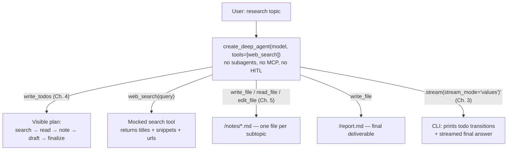
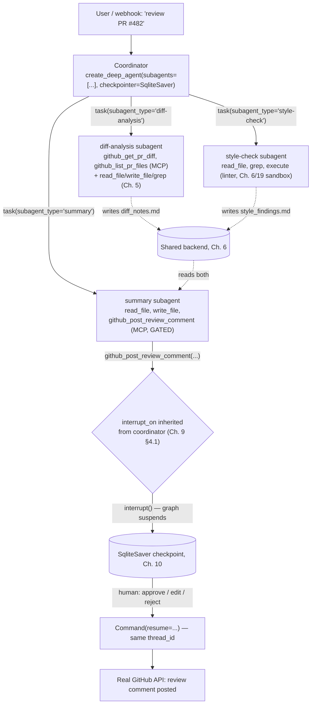
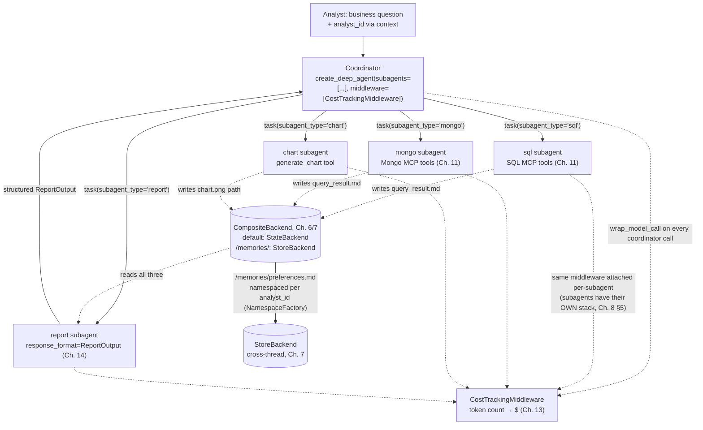
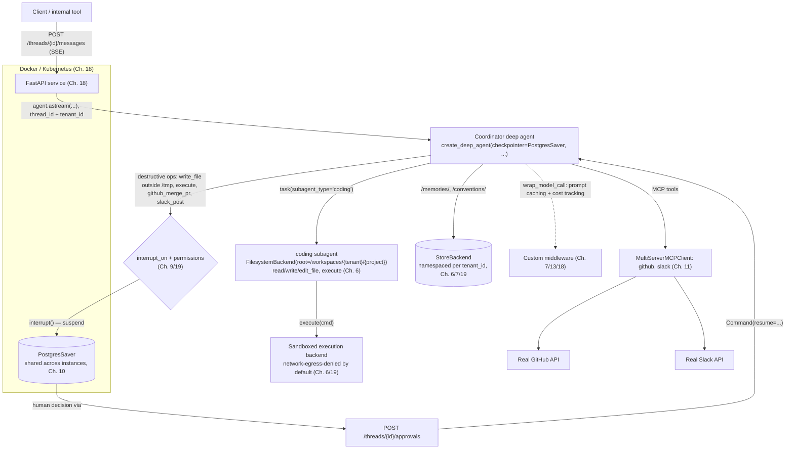

# Capstone Projects

## Learning Objectives

By the end of this chapter, you will be able to:

- Synthesize every mechanism from Chapters 1–19 — middleware assembly, backends, planning, subagents, HITL,
  checkpointing, MCP, custom middleware, `response_format`, testing, deployment, and security — into four
  complete, buildable systems rather than isolated examples
- Choose the correct **tier** of architecture for a given real-world requirement: a single agent with filesystem
  tools, a subagent pipeline with external side effects, a multi-agent analytics system with cross-thread memory
  and cost controls, or a fully productionized multi-tenant platform
- Recognize the specific `create_deep_agent()` parameters each tier actually needs, and — just as
  important — the parameters a simpler tier should deliberately **not** reach for
- Trace, for each project, exactly which earlier chapter's technique is doing the work at each build step, so
  that debugging any of the four projects means opening the one chapter that owns the failing layer
- Avoid the two failure modes that bracket this whole chapter: over-engineering a simple requirement with
  subagents/MCP/HITL it doesn't need, and under-engineering a production system by skipping the security and
  testing discipline Chapters 17–19 already gave you

---

## Prerequisites for This Chapter

This chapter assumes **all of Chapters 1–19**. It introduces no new `deepagents` API surface — every parameter,
middleware, backend, and tool referenced below was covered in an earlier chapter, cited by number as it comes
up. If any citation below doesn't ring a bell, that is the signal to go back to that chapter rather than to
treat this one as a new source of API facts. Specifically, this chapter leans on:

- **Ch. 2–3**: `create_deep_agent()`'s full signature and the middleware-assembly mental model
- **Ch. 4**: `write_todos` / `TodoListMiddleware` for visible planning
- **Ch. 5–6**: the built-in filesystem tools and the four backends (`StateBackend`, `FilesystemBackend`,
  `StoreBackend`, `CompositeBackend`)
- **Ch. 7**: `MemoryMiddleware`, cross-thread memory, `NamespaceFactory`
- **Ch. 8, 12**: `SubAgent`/`CompiledSubAgent`/`AsyncSubAgent`, the `task` tool, coordinator design
- **Ch. 9**: `interrupt_on`, `FilesystemPermission`, `InterruptOnConfig`, subagent HITL inheritance
- **Ch. 10**: checkpointer choice and what a deep agent's checkpointed state actually contains
- **Ch. 11**: `MultiServerMCPClient` and gating MCP tools with the same HITL mechanism as any other tool
- **Ch. 13**: custom `AgentMiddleware` (`wrap_model_call`, `before_agent`, `modify_request`)
- **Ch. 14**: `skills=`, `response_format`, context-engineering tuning
- **Ch. 15–17**: production-grade patterns, common pitfalls, and the testing discipline
- **Ch. 18–19**: FastAPI deployment shape and the security/governance posture

Each project below is deliberately scoped to the mechanisms its tier actually warrants — Project 1 uses none of
Chapters 8, 9, 10, or 11 on purpose; Project 4 uses nearly everything. That contrast is itself the chapter's main
teaching point, made concrete at the end in **Best Practices** and **Common Mistakes**.

---

## Project 1 (Beginner): Autonomous Research Assistant

### Real-World Scenario

An analyst needs a quick, defensible first pass on an unfamiliar topic before a meeting — "summarize the current
state of on-device LLM inference for mobile, with sources" — and wants to see the agent's plan as it works
rather than stare at a spinner, plus a clean Markdown file they can forward afterward. This does not need
multiple agents, external write access, or durability across restarts — it needs one agent, a search tool, a
place to put its notes, and visible progress. This is deliberately the "AI Chatbot / Research Assistant /
Note-taking Agent" tier of toy examples, collapsed into the one project actually worth building.

### Requirements

- A single deep agent (no `subagents=`) combining a (mocked) web-search tool with the built-in filesystem tools
- Visible, incremental planning via `write_todos` — the user should see "searching," "reading," "drafting"
  status changes, not a black box
- Intermediate research notes written to files, not held only in the conversation
- A final Markdown report file as the deliverable
- Basic token/event streaming to a CLI (or notebook) — no FastAPI, no SSE infrastructure

### Architecture



### Folder Structure

```
research_assistant/
├── agent.py                 # create_deep_agent() wiring
├── prompts.py                # RESEARCH_SYSTEM_PROMPT
├── tools/
│   └── search.py              # mocked web_search tool (@tool)
├── cli.py                     # argparse CLI entrypoint, streams to stdout
├── workspace/                 # FilesystemBackend root — notes/*.md, report.md (gitignored)
└── requirements.txt
```

### Implementation Plan

1. **Write the mocked search tool** (`tools/search.py`) as a plain `@tool`-decorated function returning a small
   list of `{title, url, snippet}` dicts — your own tool-authoring knowledge, nothing deep-agent-specific yet.
2. **Call `create_deep_agent(model=..., tools=[web_search])`** with no `subagents=`, no `interrupt_on=`, no
   `checkpointer=` (Ch. 3) — this is the entire agent-construction surface this project needs. Resist adding
   anything else; that restraint *is* the lesson (see Common Mistakes at the end of this chapter).
3. **Write `RESEARCH_SYSTEM_PROMPT`** instructing the model to (a) call `write_todos` first with a plan before
   any research starts, (b) write one note file per subtopic under `/notes/` rather than keeping raw search
   results in the conversation, and (c) only assemble `/report.md` once every todo is `completed` (Ch. 4).
4. **Choose `backend=FilesystemBackend(root_dir="./workspace")`** (Ch. 6) instead of the default `StateBackend` —
   deliberately, so the notes and final report are ordinary files on disk the user can open directly after the
   run ends, with no export step and no checkpointer required (a single `invoke`/`stream` call is the entire
   lifetime of this agent — Ch. 10's durability concerns don't apply here).
5. **Rely on the built-in filesystem tools** (`ls`, `read_file`, `write_file`, `edit_file`) exactly as shipped —
   remind yourself of Ch. 5's rule that `edit_file` requires a prior `read_file` in the same run, since the
   model will hit this if it tries to revise `/report.md` without having re-read it first.
6. **Stream to the CLI** (Ch. 3) with `stream_mode="values"` (or `"updates"`), printing the `todos` key's status
   transitions as they change and the final assistant message once the run completes:

```python
# agent.py
from deepagents import create_deep_agent
from tools.search import web_search
from prompts import RESEARCH_SYSTEM_PROMPT
from deepagents.backends import FilesystemBackend

research_agent = create_deep_agent(
    model="anthropic:claude-sonnet-4-6",
    tools=[web_search],
    system_prompt=RESEARCH_SYSTEM_PROMPT,
    backend=FilesystemBackend(root_dir="./workspace"),
)
```

```python
# cli.py
import argparse
from agent import research_agent

def main():
    parser = argparse.ArgumentParser()
    parser.add_argument("topic")
    args = parser.parse_args()

    last_todos = None
    for chunk in research_agent.stream(
        {"messages": [{"role": "user", "content": f"Research: {args.topic}"}]},
        stream_mode="values",
    ):
        todos = chunk.get("todos")
        if todos and todos != last_todos:
            for item in todos:
                print(f"  [{item['status']}] {item['content']}")
            last_todos = todos

    print("\nDone — see workspace/report.md")

if __name__ == "__main__":
    main()
```

7. **Verify the deliverable directly on disk** — `workspace/report.md` should exist and read as a coherent
   document independent of the conversation transcript, proving the filesystem (not the message list) is where
   the real content lives (Ch. 5's whole point).

### Best Practices

- Keep the system prompt to "plan, then research into files, then draft" — three verbs. A beginner project's
  prompt should be shorter than any subagent's prompt in Project 2, not longer.
- Instruct the model explicitly to write large search results to `/notes/*.md` rather than quoting them at
  length back into the conversation — this is Ch. 5's token-economy lesson, applicable even with zero subagents.
- Don't add a checkpointer for a single-shot CLI run — there's nothing to resume across, and it's pure overhead
  (Ch. 10's lesson: checkpointing solves durability across restarts, not single-run streaming).

### Extensions & Improvements

- Swap the mocked `web_search` for a real provider (Tavily, Bing, etc.) behind the identical tool signature —
  nothing else in this project changes.
- Add `checkpointer=SqliteSaver(...)` (Ch. 10) if you want a long research session to survive a CLI restart.
- Add `memory=["/memories/research_preferences.md"]` (Ch. 7) so the agent remembers a user's preferred source
  types (academic vs. industry blogs) across sessions.
- Once a genuinely distinct "fact-checking" concern appears — a second concern competing for the same system
  prompt's attention — that's the signal to promote this into Project 2's subagent shape, not before.

---

## Project 2 (Intermediate): GitHub PR Reviewer

### Real-World Scenario

A team wants an agent that reviews incoming pull requests: read the diff, flag risky changes, check style
conventions, and post one consolidated review comment — but nobody wants an LLM autonomously posting to a real
GitHub PR without a human confirming it first, and a large PR's review shouldn't be lost if the reviewing process
is interrupted midway. This is the "GitHub PR Reviewer / Documentation Generator / Coding Assistant" tier,
collapsed into one project that actually needs subagents, real external tool access, and a durability story.

### Requirements

- A coordinator deep agent with three subagents: `diff-analysis`, `style-check`, `summary`
- Real GitHub access via an MCP server, wired through `MultiServerMCPClient` (Ch. 11)
- The `summary` subagent's PR-comment-posting call gated behind human approval (Ch. 9) before anything is
  actually posted — a consequential external action
- A `SqliteSaver` checkpointer (Ch. 10) so a long-running review survives a process restart and resumes at the
  same approval gate

### Architecture



### Folder Structure

```
pr_reviewer/
├── app/
│   ├── agent.py                 # coordinator create_deep_agent() wiring
│   ├── prompts.py                # coordinator + each subagent's system_prompt
│   ├── subagents/
│   │   ├── diff_analysis.py
│   │   ├── style_check.py
│   │   └── summary.py
│   └── mcp_client.py             # MultiServerMCPClient config, built once at import time
├── storage/
│   └── reviews.sqlite            # SqliteSaver backing file
├── review_pr.py                  # CLI: `python review_pr.py --pr 482`
├── approve_review.py             # CLI: resumes an interrupted run with a decision
└── requirements.txt
```

### Implementation Plan

1. **Configure `MultiServerMCPClient`** with a `"github"` server entry and call `get_tools()` **once**, at
   import time in `mcp_client.py`, not per request (Ch. 11's explicit warning against re-establishing MCP
   sessions on every call). This yields ordinary `BaseTool` objects — `github_get_pr_diff`,
   `github_list_pr_files`, `github_post_review_comment`, etc.
2. **Classify each MCP tool read vs. write** (Ch. 11) before doing anything else: `github_get_pr_diff` and
   `github_list_pr_files` are read-only; `github_post_review_comment` is the one consequential, side-effecting
   call that must be gated.
3. **Define the `diff-analysis` `SubAgent`** (Ch. 8): `tools=[github_get_pr_diff, github_list_pr_files,
   read_file, write_file, grep, glob, ls]`. Its job is to fetch the diff via MCP, use the filesystem tools to
   inspect the changed files' full contents where the diff alone isn't enough context, and write a
   `/diff_notes.md` summary — not to judge style or post anything.
4. **Define the `style-check` `SubAgent`**: `tools=[read_file, grep, execute]`. `execute` here runs a linter
   against the changed files — this subagent requires a sandbox-capable `backend` (Ch. 6, revisited for security
   in Ch. 19); if your `backend` doesn't support execution, this call fails loudly, which is the intended
   behavior, not a bug.
5. **Define the `summary` `SubAgent`**: `tools=[read_file, write_file, github_post_review_comment]`. It reads
   both `/diff_notes.md` and `/style_findings.md` off the shared backend (Ch. 5/6/8 — none of that content ever
   passed through the coordinator's own context) and drafts the final review comment before posting it.
6. **Wire the coordinator**:

```python
# app/agent.py
from deepagents import create_deep_agent
from langchain.agents.middleware import InterruptOnConfig
from langgraph.checkpoint.sqlite import SqliteSaver
from app.subagents.diff_analysis import diff_analysis_subagent
from app.subagents.style_check import style_check_subagent
from app.subagents.summary import summary_subagent
from app.prompts import COORDINATOR_PROMPT

checkpointer = SqliteSaver.from_conn_string("storage/reviews.sqlite")

pr_reviewer_agent = create_deep_agent(
    model="anthropic:claude-sonnet-4-6",
    subagents=[diff_analysis_subagent, style_check_subagent, summary_subagent],
    system_prompt=COORDINATOR_PROMPT,
    interrupt_on={
        "github_post_review_comment": InterruptOnConfig(
            allowed_decisions=["approve", "edit", "reject"],
        ),
    },
    checkpointer=checkpointer,
)
```

7. **Do not re-declare `interrupt_on` on the `summary` `SubAgent` dict.** None of the three subagents define
   their own `interrupt_on`, so all three **inherit the coordinator's `interrupt_on` in full** (Ch. 9 §4.1) —
   this is exactly why the gate on `github_post_review_comment` fires correctly even though it's the `summary`
   subagent's own compiled graph, not the coordinator's, that calls the tool. Setting even an empty
   `interrupt_on={}` on the `summary` `SubAgent` dict would silently disable this protection (Ch. 8/9's shared
   gotcha) — leave the key out entirely.
8. **Trigger a review and handle the pause**:

```python
# review_pr.py
from app.agent import pr_reviewer_agent

config = {"configurable": {"thread_id": "pr-482"}}
result = pr_reviewer_agent.invoke(
    {"messages": [{"role": "user", "content": "Review PR #482 in acme/widgets"}]},
    config=config,
)
# result contains an interrupt payload once the summary subagent
# attempts github_post_review_comment — nothing has been posted yet.
```

```python
# approve_review.py
from langgraph.types import Command
from app.agent import pr_reviewer_agent

config = {"configurable": {"thread_id": "pr-482"}}  # SAME thread_id
result = pr_reviewer_agent.invoke(
    Command(resume={"decisions": [{"type": "approve"}]}),
    config=config,
)
print(result["messages"][-1].content)
```

9. **Confirm the crash-recovery story**: kill the process between `review_pr.py` and `approve_review.py` and
   restart it — because `checkpointer=SqliteSaver(...)` persists to a real file, the interrupted state (a
   full-multi-day-old PR review, if that's how long it takes a reviewer to get to it) resumes correctly from the
   same `thread_id` (Ch. 10), rather than forcing the whole diff-analysis/style-check pipeline to re-run.

### Best Practices

- Gate by **tool name**, not by which subagent happens to call it — `interrupt_on={"github_post_review_comment":
  ...}` fires regardless of whether the coordinator or the `summary` subagent is the one issuing the call (Ch.
  9/11).
- Keep `diff-analysis` and `style-check` read-only or execute-only — only `summary` should hold a write-capable,
  side-effecting MCP tool. Scoping `tools=[...]` deliberately on each subagent (Ch. 8) is what makes this
  guarantee possible at all.
- Choose `SqliteSaver` deliberately over `MemorySaver` here — a PR review is exactly the kind of workload that
  can legitimately span a human's lunch break or a service restart, and `MemorySaver` loses everything the
  moment the process exits (Ch. 10).
- Build the MCP client once at module import time, and reuse it across requests — not once per invocation (Ch.
  11's stated common mistake).

### Extensions & Improvements

- Add a fourth subagent — the Hands-On Exercise below walks through exactly this.
- Swap `SqliteSaver` for `PostgresSaver` (Ch. 10) once this needs to run behind more than one process — that
  migration is the bridge into Project 4.
- Add `permissions=[FilesystemPermission(operations=["execute"], paths=["/repo/**"], mode="interrupt")]` (Ch. 9)
  if you want *any* linter invocation reviewed, not just the final comment post.
- Add a Slack MCP tool so the coordinator can also notify a channel once a review posts — gated with its own
  `interrupt_on` entry exactly like `github_post_review_comment` (Ch. 11).

---

## Project 3 (Advanced): Autonomous Multi-Agent Data Analyst

### Real-World Scenario

An analytics team already has a working "Enterprise BI Assistant" (Ch. 12) — a coordinator routing business
questions to `sql`, `mongo`, `chart`, and `report` subagents. Three new requirements arrive at once: analysts
want their preferred chart style and default date ranges remembered across sessions, finance wants visibility
into per-query LLM spend before it becomes a surprise line item, and downstream tooling wants the final report
as structured data it can render in a dashboard, not just prose. None of these require a new architecture — they
require extending the existing multi-agent system with cross-thread memory, cost-tracking middleware, and
structured output, which is exactly what makes this the advanced-tier project rather than a rebuild.

### Requirements

- Coordinator + `sql`, `mongo`, `chart`, `report` subagents (Ch. 8/11/12), extending the course's own BI
  Assistant rather than reinventing it
- Cross-thread memory of analyst preferences via `StoreBackend` routed through `CompositeBackend` (Ch. 7)
- Custom `wrap_model_call` middleware that counts tokens and accumulates cost per run (Ch. 13)
- `response_format` structured output on the `report` subagent (Ch. 14)

### Architecture



### Folder Structure

```
data_analyst/
├── app/
│   ├── agent.py                   # coordinator wiring
│   ├── prompts.py
│   ├── subagents/
│   │   ├── sql.py
│   │   ├── mongo.py
│   │   ├── chart.py
│   │   └── report.py               # response_format=ReportOutput
│   ├── schemas.py                  # ReportOutput Pydantic model (Ch. 14)
│   ├── middleware/
│   │   └── cost_tracking.py        # CostTrackingMiddleware (wrap_model_call, Ch. 13)
│   ├── memory/
│   │   └── analyst_namespace.py    # NamespaceFactory keyed on analyst_id
│   ├── backend.py                  # CompositeBackend factory (Ch. 6/7)
│   └── mcp_client.py               # SQL + Mongo MultiServerMCPClient config
└── requirements.txt
```

### Implementation Plan

1. **Start from the Ch. 12 Enterprise BI Assistant** almost unchanged: `MultiServerMCPClient` config for the SQL
   and Mongo servers (Ch. 11), and the `sql`/`mongo`/`chart`/`report` `SubAgent` definitions with their existing
   scoped `tools=[...]` lists (Ch. 8/12).
2. **Define `ReportOutput`** as a Pydantic model — `summary: str`, `key_metrics: dict[str, float]`,
   `chart_paths: list[str]`, `recommendations: list[str]` — and set `response_format=ReportOutput` on the
   `report` `SubAgent`'s dict (`SubAgent`'s optional `response_format` key, Ch. 8's table; mechanics in Ch. 14).
   Downstream tooling now gets a validated object instead of parsing prose.
3. **Wire cross-thread memory** (Ch. 7): construct a durable/`InMemoryStore` `Store`, a `NamespaceFactory` keyed
   on `analyst_id` read from `context` at runtime, and a `CompositeBackend` routing `/memories/` to a
   `StoreBackend(store=store, namespace=analyst_namespace)` with everything else left on the default
   `StateBackend` (Ch. 6 §"CompositeBackend"). Pass `backend=` at `create_deep_agent()` and
   `memory=["/memories/preferences.md"]` so `MemoryMiddleware` injects the analyst's remembered chart style and
   default date range into every coordinator turn.
4. **Write `CostTrackingMiddleware`** (Ch. 13): a custom `AgentMiddleware` implementing `wrap_model_call`, which
   inspects the outgoing request/response token counts and accumulates a running cost total (against a fixed
   per-model price table) into either a state key or a direct write to the store.
5. **Attach `CostTrackingMiddleware` twice, deliberately.** Pass it via `middleware=[CostTrackingMiddleware(...)]`
   on the top-level `create_deep_agent()` call for the coordinator's own model calls — but also pass the **same
   middleware class** (a fresh instance, or one writing to a shared store key) via each `SubAgent`'s own
   `middleware=[...]` key. This is the direct, hands-on consequence of Ch. 8 §5: each subagent gets its **own,
   separate middleware stack**, so a middleware attached only at the top level tracks the coordinator's own
   token spend and misses every subagent's internal model calls entirely — which, for a four-subagent pipeline,
   is most of the actual cost.
6. **Build the coordinator**:

```python
# app/agent.py
from deepagents import create_deep_agent
from app.subagents.sql import sql_subagent
from app.subagents.mongo import mongo_subagent
from app.subagents.chart import chart_subagent
from app.subagents.report import report_subagent
from app.middleware.cost_tracking import CostTrackingMiddleware
from app.backend import build_tenant_memory_backend
from app.prompts import COORDINATOR_PROMPT

backend = build_tenant_memory_backend()

analyst_agent = create_deep_agent(
    model="anthropic:claude-sonnet-4-6",
    subagents=[sql_subagent, mongo_subagent, chart_subagent, report_subagent],
    system_prompt=COORDINATOR_PROMPT,
    backend=backend,
    memory=["/memories/preferences.md"],
    middleware=[CostTrackingMiddleware(price_table=PRICE_TABLE)],
)
```

7. **Instruct the coordinator prompt to parallelize `sql` and `mongo` where the question doesn't depend on one
   result to formulate the other** — both are independent `task` calls the coordinator can issue in the same
   turn's tool-calling round (Ch. 12's coordinator-design pattern), before delegating to `chart` and finally
   `report`.
8. **Invoke with `analyst_id` threaded through `context`**, so the `NamespaceFactory` resolves the correct,
   per-analyst `/memories/` namespace (Ch. 6/7) — verify a second analyst's preferences never leak into the
   first's namespace by inspecting the store directly, bypassing the agent entirely (Ch. 7's own verification
   habit).

### Best Practices

- Namespace `/memories/` by `analyst_id` **from the first line of code**, not as a retrofit (Ch. 7's explicit
  lesson) — commingled preferences across analysts are far more painful to untangle after the fact.
- Attach cost-tracking middleware at **every** level that runs a model call, not just the coordinator — a
  four-subagent pipeline's real spend lives mostly inside the subagents (Ch. 8 §5, Ch. 13).
- Validate `response_format` output before handing it downstream — a `ReportOutput` that fails Pydantic
  validation should surface as a retryable error to the `report` subagent, not get silently coerced (Ch. 14).
- Parallelize independent subagent calls (`sql` + `mongo`) rather than forcing a strictly serial pipeline — the
  coordinator's own message history only grows by two final reports either way (Ch. 8's cost model), so there's
  no context-budget reason to serialize them.

### Extensions & Improvements

- Add an `anomaly-detection` subagent that runs after `sql`/`mongo` and before `chart`, flagging metrics that
  deviate from the analyst's historical baseline (itself readable from `/memories/`).
- Push `CostTrackingMiddleware`'s accumulated totals to a real metrics backend (Prometheus, a billing table) —
  Chapter 18/13 territory, and the natural bridge into Project 4's observability requirements.
- Add a Slack MCP tool so `report`'s structured output can also be rendered as a digest message, gated with
  `interrupt_on` exactly as in Project 2 if it posts anywhere externally.
- Swap the `InMemoryStore` for a production `BaseStore` once analyst preferences must survive a real
  deployment restart — verify that store against `deepagents` in staging first (Ch. 7's explicit caution).

---

## Project 4 (Production-Grade Capstone): Enterprise Deep Coding Platform

### Real-World Scenario

An engineering platform team wants to offer an internal "AI software engineer" service: multiple teams
(tenants) submit coding tasks against their own repositories, the agent makes real filesystem changes, runs
code, opens PRs, and posts to Slack — behind a FastAPI service that's authenticated, checkpointed across
restarts, gated on every destructive action, isolated per tenant, cost-aware, and covered by tests before anyone
trusts it with production repositories. This is explicitly the "AI Software Engineer" tier, built to the
production standard the rest of this course has been building toward, and it is the one project in this chapter
where skipping any of Chapters 17–19 is not a shortcut — it's a production incident waiting to happen.

### Requirements

- FastAPI service (Ch. 18) hosting a deep agent with a `coding` subagent
- Real filesystem access via `FilesystemBackend` rooted at a per-project workspace (Ch. 6)
- An `execute` tool backed by a real sandbox (Ch. 6/19)
- MCP integration for real GitHub/Slack tools (Ch. 11)
- `PostgresSaver` checkpointing for horizontal scaling across multiple service instances (Ch. 10/18)
- `interrupt_on`/`permissions` gating every destructive operation, with a human-approval HTTP endpoint (Ch. 9/19)
- Per-tenant `StoreBackend` namespacing (Ch. 6/7/19)
- Prompt-caching middleware for cost control (Ch. 7/13/18)
- A testing suite (Ch. 17) covering tool/middleware unit tests plus HITL flow tests

### Architecture



### Folder Structure

```
enterprise_coding_platform/
├── app/
│   ├── main.py                      # FastAPI app, startup wiring
│   ├── api/
│   │   ├── chat.py                   # POST /threads/{id}/messages — SSE stream (Ch. 18)
│   │   ├── approvals.py              # POST /threads/{id}/approvals — Command(resume=...)
│   │   └── health.py
│   ├── agents/
│   │   ├── coordinator.py            # create_deep_agent() wiring
│   │   └── subagents/
│   │       └── coding.py
│   ├── backends/
│   │   └── tenant_backend.py         # CompositeBackend + FilesystemBackend + StoreBackend factory
│   ├── mcp/
│   │   └── clients.py                # MultiServerMCPClient: github, slack — built once at startup
│   ├── middleware/
│   │   ├── prompt_cache.py           # wrap_model_call: cache_control breakpoints (Ch. 13)
│   │   └── cost_tracking.py
│   ├── security/
│   │   └── permissions.py            # FilesystemPermission policy, tenant auth dependency (Ch. 19)
│   └── config.py                     # settings via env vars
├── tests/
│   ├── unit/
│   │   ├── test_tools.py              # execute/filesystem tool behavior in isolation (Ch. 17)
│   │   └── test_middleware.py         # prompt-cache + cost-tracking middleware unit tests
│   ├── integration/
│   │   ├── test_hitl_flow.py          # interrupt → approve/reject → resume, both paths (Ch. 17)
│   │   └── test_checkpoint_resume.py  # kill process mid-run, resume from same thread_id (Ch. 10/17)
│   └── conftest.py
├── Dockerfile
├── docker-compose.yml                # app + postgres, local dev
├── k8s/
│   ├── deployment.yaml
│   └── service.yaml
├── pyproject.toml
└── .env.example
```

### Implementation Plan

1. **Stand up the FastAPI skeleton** (Ch. 18): `POST /threads/{thread_id}/messages` streaming via
   `agent.astream(...)` into Server-Sent Events, plus a `GET /health` route.
2. **Wire `PostgresSaver` once at startup**, shared across all requests and all worker processes (Ch. 10/18) —
   this is the checkpointer choice this project's horizontal-scaling requirement forces; `MemorySaver`/
   `SqliteSaver` silently break the moment a second instance can pick up the same `thread_id` (Ch. 10's explicit
   warning).
3. **Build the per-tenant backend factory** (Ch. 6/7/19): a `CompositeBackend` routing `/workspace/` to
   `FilesystemBackend(root_dir=f"/workspaces/{tenant_id}/{project_id}")` — real disk, one directory per
   tenant/project — and `/memories/`/`/conventions/` to a `StoreBackend` namespaced via a `NamespaceFactory`
   keyed on `tenant_id`, so no tenant's coding conventions or workspace can be reached from another tenant's
   request, even accidentally.
4. **Wire the sandboxed `execute` tool** (Ch. 6/19) against a backend that denies network egress by default and
   runs under the resource limits your platform team already enforces for arbitrary code execution — this is
   the same sandboxing discipline Ch. 19 covers, applied for real this time rather than as a warning.
5. **Configure `MultiServerMCPClient`** for `github` and `slack` servers **once at app startup**, stored on
   `app.state`, not reconstructed per request (Ch. 11's stated common mistake, now with real production stakes).
6. **Define the `coding` `SubAgent`** (Ch. 8): `tools=[read_file, write_file, edit_file, execute, grep, glob,
   ls]` plus the GitHub MCP tools it needs (`github_create_branch`, `github_open_pr`, etc.) — scoped narrowly;
   this subagent does not need Slack tools directly if only the coordinator posts status updates.
7. **Classify every destructive operation and gate it** (Ch. 9/19): `permissions=[FilesystemPermission(
   operations=["write", "edit", "delete"], paths=["/workspace/**"], mode="interrupt")]` for filesystem writes
   outside a designated scratch path, plus explicit `interrupt_on={"execute": InterruptOnConfig(
   allowed_decisions=["approve", "edit", "reject"]), "github_merge_pr": InterruptOnConfig(allowed_decisions=
   ["approve", "reject"]), "slack_post_message": True}` at the top-level `create_deep_agent()` call. Recall Ch.
   9 §2.3: an explicit `interrupt_on` entry for a tool also covered by a `permissions` rule wins the merge — use
   that deliberately here to force `approve`/`reject`-only (no silent `edit`) on the highest-stakes calls.
8. **Build the approval endpoint** (`api/approvals.py`): accepts a `{decision, thread_id, tenant_id}` payload,
   authenticates the caller against that `tenant_id`, and issues `agent.ainvoke(Command(resume={"decisions":
   [...]}), config={"configurable": {"thread_id": thread_id}})` against the **same** `thread_id` the original
   request paused on (Ch. 9) — this is the human-approval HTTP surface the requirement calls for.
9. **Write the prompt-caching middleware** (Ch. 7/13/18): a `wrap_model_call` implementation that marks stable,
   large context (tenant conventions loaded via `memory=`, repository-wide context) with cache breakpoints, so
   repeated coding-subagent invocations within a session don't re-pay for identical prompt prefixes.
10. **Author the Dockerfile**: multi-stage build, non-root runtime user, no build tooling in the final image, and
    the sandbox for `execute` isolated from the API container itself rather than sharing its filesystem or
    network namespace (Ch. 19).
11. **Author `docker-compose.yml`** for local development (app + Postgres) and `k8s/deployment.yaml` +
    `service.yaml` for the target environment, with readiness/liveness probes hitting `/health` and horizontal
    pod autoscaling keyed on request concurrency (Ch. 18).
12. **Write the testing suite** (Ch. 17):
    - **Unit** (`tests/unit/`): the `execute` tool against a stubbed sandbox backend, `FilesystemPermission`
      matching logic in isolation, and the prompt-caching/cost-tracking middleware's `wrap_model_call` behavior
      given a fixed fake request/response.
    - **Integration** (`tests/integration/`): `test_hitl_flow.py` drives a full interrupt → `approve` path and a
      full interrupt → `reject` path against a real (test) checkpointer, asserting the destructive action only
      actually fires on the `approve` path; `test_checkpoint_resume.py` starts a run, kills the process
      (or simulates it by discarding the in-memory agent object and rebuilding a fresh one against the same
      `PostgresSaver` connection string), and asserts the resumed run picks up exactly where it left off — the
      same crash-recovery guarantee Project 2 exercised manually, now automated as a regression test.
13. **Wire structured logging and the cost-tracking middleware's output** into whatever the platform team's
    existing observability stack expects (Ch. 13/18) — per-tenant cost visibility is a stated production
    requirement here, not an optional nicety.

### Best Practices

- **Never trust a client-supplied `tenant_id`** — resolve it from an authenticated session/token server-side
  before it ever reaches the `NamespaceFactory` or the `FilesystemBackend` root path (Ch. 19).
- **Deny network egress by default inside the `execute` sandbox**, allow-listing only what a specific coding
  task genuinely needs — the same explicit-allowlist posture Ch. 19 argues for generally, applied concretely
  here.
- **Test both the `approve` and `reject` HITL paths**, not just the happy path — a reviewer's job is largely
  catching the cases where the agent proposed something wrong, and that path needs its own test coverage (Ch.
  17).
- **Build the MCP client and the `PostgresSaver` connection once at startup**, shared across requests — both
  are the same "don't reconstruct per call" lesson from Ch. 10/11, now with real connection-pool exhaustion
  risk if ignored.
- **Keep the coding subagent's `FilesystemBackend` root strictly scoped to that tenant/project's directory** —
  this is the entire isolation guarantee; a shared or misconfigured root defeats every other security control
  in this project.

### Extensions & Improvements

- Add per-tenant rate limiting at the FastAPI layer, ahead of the agent entirely, so one tenant's runaway coding
  session can't starve another's.
- Add a self-hosted/fallback model path for tenants with data-residency constraints that rule out the primary
  provider.
- Build a small internal dashboard reading the cost-tracking middleware's accumulated per-tenant totals directly
  from the store, bypassing the agent — the same "query it without invoking the agent" pattern Ch. 7 taught for
  `StoreBackend`-backed memory.
- Extend the approval endpoint to support the `edit` decision (Ch. 9) for the `execute` gate specifically, so a
  reviewer can approve a modified shell command rather than only approve-as-proposed or reject outright.

---

## Best Practices — Choosing the Right Tier

Across all four projects, the actual design skill this chapter is testing is picking the *minimum* tier that
satisfies a real requirement — not defaulting to the most impressive-looking architecture available. Use this as
a decision checklist against a real requirement in front of you:

| Question | If "no" | If "yes" |
|---|---|---|
| Does the task have more than one genuinely distinct concern competing for one system prompt's attention (research vs. fixing vs. testing)? | Stay at **Project 1**'s single-agent shape | Move to **Project 2**'s subagent shape |
| Does completing the task require an external, consequential side effect (posting, merging, deploying)? | No `interrupt_on`/HITL needed yet | Add HITL gating exactly where that side effect occurs (Project 2) |
| Does the workload need to survive a process restart mid-task? | Skip the checkpointer, or use `MemorySaver` if you want one at all | Choose `SqliteSaver` (single instance) or `PostgresSaver` (multi-instance, Project 4) |
| Does more than one specialized data source or output format need combining into one answer? | A single subagent (or none) suffices | Move to **Project 3**'s multi-subagent coordinator |
| Does anything need to be remembered across *different* threads/sessions/users? | Skip `MemoryMiddleware`/`StoreBackend` | Add cross-thread memory (Project 3) |
| Does the system serve more than one tenant, or make real filesystem/network changes on someone's behalf? | Stop before Project 4's full stack | Build to **Project 4**'s standard — security and testing are not optional past this point |

The pattern underneath the table: every additional mechanism — subagents, MCP, HITL, checkpointing,
cross-thread memory, custom middleware — is a response to a **specific** requirement, never a default. Projects
1 through 4 are not "increasing sophistication for its own sake"; each one adds exactly the mechanism the
previous tier's real-world scenario didn't need and this tier's does.

---

## Common Mistakes

- **Over-engineering Project 1.** Adding `subagents=[...]` to a single-concern research task because "subagents
  seem more advanced" produces a coordinator with nothing meaningful to coordinate, plus the added latency and
  complexity of `task` dispatch for a job one focused agent already does correctly. If a beginner project's
  system prompt is under a paragraph and covers one concern, it does not need subagents (Ch. 8's own framing:
  subagents exist to fix *specific* degradation, not to look sophisticated).
- **Over-engineering with HITL where nothing consequential happens.** Gating a read-only `github_get_pr_diff`
  call behind human approval (Project 2) adds friction with no corresponding safety benefit — `interrupt_on`
  belongs on the tool that actually changes something external, not on every MCP tool indiscriminately (Ch. 9).
- **Under-engineering Project 4 by skipping the security posture.** Shipping the FastAPI service with a
  client-supplied `tenant_id` trusted verbatim, an `execute` sandbox with open network egress, or a
  `FilesystemBackend` root that isn't strictly scoped per tenant turns Ch. 19's warnings into a real incident —
  these are not optional hardening steps for "later," they are the difference between Project 4 and Project 2
  with more MCP servers bolted on.
- **Under-engineering Project 4 by skipping the testing suite.** A production coding agent that can merge PRs
  and run arbitrary code, shipped without an HITL-flow test exercising both `approve` and `reject`, or without a
  checkpoint-resume test, is exactly the kind of system where the first real failure is discovered by a user
  instead of a test (Ch. 17).
- **Forgetting subagent HITL inheritance rules across tiers.** In Project 2 and Project 4 alike, setting even an
  empty `interrupt_on={}` on a write-capable subagent silently disables the coordinator's protection for that
  subagent (Ch. 8 §5, Ch. 9 §4.1) — this mistake gets *more* dangerous, not less, as the stakes rise from
  Project 2's PR comment to Project 4's PR merge.
- **Attaching cost-tracking or prompt-caching middleware only at the top level in Projects 3–4.** Because each
  subagent owns its own separate middleware stack (Ch. 8 §5), a coordinator-only middleware misses most of a
  multi-subagent pipeline's actual token spend — the exact gap Project 3's Implementation Plan calls out
  explicitly.

---

## Summary

- Four tiers, each adding exactly the mechanism its real-world scenario needs and no more: **Project 1**
  (single agent, filesystem tools, `write_todos`, streaming — no subagents, no MCP, no HITL, no checkpointer);
  **Project 2** (subagents, MCP, HITL on one consequential action, `SqliteSaver`); **Project 3** (multi-subagent
  coordinator, cross-thread memory, custom cost-tracking middleware, `response_format`); **Project 4** (FastAPI,
  `FilesystemBackend` per tenant, sandboxed `execute`, MCP, `PostgresSaver`, `interrupt_on`/`permissions` with an
  approval endpoint, per-tenant `StoreBackend` namespacing, prompt caching, a full testing suite).
- Nothing in any of the four projects is a new `deepagents` API — every mechanism traces back to a specific
  chapter (1–19), cited throughout each Implementation Plan.
- Choosing the right tier for a real requirement is itself the skill being tested — use the decision table above
  rather than defaulting to the most sophisticated-looking architecture.
- The two failure modes to avoid symmetrically: over-engineering a simple task with subagents/HITL/MCP it
  doesn't need, and under-engineering a genuinely production, multi-tenant system by skipping the security and
  testing discipline Chapters 17–19 already established.
- A subagent's own middleware stack is separate from its parent's (Ch. 8 §5) — this resurfaces concretely in
  Project 3/4 as "attach cost-tracking and prompt-caching middleware everywhere a model call actually happens,"
  not just at the coordinator.

---

## Knowledge Check

1. Project 1 deliberately uses zero subagents. Name the specific signal in a requirement that would justify
   promoting it into Project 2's subagent shape — and name one thing you should *not* add to Project 1 just
   because Project 2 has it.
2. In Project 2, the `summary` subagent is the one that actually calls `github_post_review_comment`, but
   `interrupt_on` is only ever declared once, on the coordinator's `create_deep_agent()` call. Explain precisely
   why this still gates the subagent's call, and name the one change to the `summary` `SubAgent` dict that would
   silently break this protection.
3. Project 3 attaches `CostTrackingMiddleware` both at the top-level `create_deep_agent()` call and on each
   individual `SubAgent`'s own `middleware=[...]` key. Why is attaching it only at the top level insufficient
   for getting an accurate total spend figure?
4. Why does Project 2 choose `SqliteSaver` while Project 4 requires `PostgresSaver`? What specific deployment
   characteristic of Project 4 makes `SqliteSaver` (or `MemorySaver`) actively wrong there, not just a worse
   choice?
5. In Project 4, a client-supplied `tenant_id` is explicitly called out as untrustworthy input. Trace exactly
   which two mechanisms in the architecture (Ch. 6/7/19) would be compromised if that value were trusted
   verbatim from the request body instead of resolved from an authenticated session.
6. Using the decision table in "Best Practices — Choosing the Right Tier," classify this requirement: "a
   single internal tool that drafts release notes from a changelog file, with no external posting and no need
   to remember anything across runs." Which tier fits, and which mechanisms from the higher tiers should you
   explicitly leave out?

---

## Hands-On Exercise

Take **Project 2 (GitHub PR Reviewer)** and extend it with a **fourth subagent**: `"security-scan"`.

1. **Define the `security-scan` `SubAgent`** (Ch. 8): give it a focused `description` ("Scans changed files for
   hardcoded secrets, unsafe dependency changes, and obviously dangerous patterns (e.g. `eval` on user input).
   Use this after `diff-analysis` reports which files changed, before `summary` drafts the review.") and a
   `system_prompt` that instructs it to be read-only. Scope `tools=[read_file, grep, glob]` — it needs no write
   access and no MCP tools at all.
2. **Update `COORDINATOR_PROMPT`** to insert `security-scan` as a fourth delegation step, running in parallel
   with (or immediately after) `style-check`, and instruct the coordinator that `summary` must incorporate
   `security-scan`'s findings alongside `diff-analysis` and `style-check`'s before drafting the final comment.
3. **Add `security-scan` to `subagents=[...]`** alongside the existing three.
4. **Decide, explicitly, whether `security-scan` finding something severe should itself trigger an approval gate**
   before `summary` is even allowed to post — for example, requiring a human to confirm the review should
   proceed at all if a hardcoded credential was found, rather than only gating the final post. If you add this,
   it's a second `interrupt_on` entry (on whatever tool/condition you use to represent "escalate"), not a
   change to the existing `github_post_review_comment` gate.
5. **Re-run a full review end to end** and verify, by inspecting `result["messages"]`, that the coordinator's
   message history grew by exactly one more `task`-related exchange for `security-scan` — none of its internal
   `grep`/`read_file` calls should be visible outside its own final report (Ch. 8's context-isolation guarantee,
   now verified against your own fourth subagent rather than only the course's three).

---

## Further Reading

- [DeepAgents Overview (LangChain Docs)](https://docs.langchain.com/oss/python/deepagents/overview) — the
  official reference for every `create_deep_agent()` parameter used across all four projects in this chapter
- [`langchain-ai/deepagents` GitHub repository](https://github.com/langchain-ai/deepagents) — read
  `libs/deepagents/deepagents/graph.py`, `middleware/subagents.py`, and `middleware/human_in_the_loop.py`
  directly against any project in this chapter that doesn't behave the way you expect
- Related chapter in this course: [Chapter 8 — Subagent Orchestration](./08-subagent-orchestration.md) and
  [Chapter 12 — Multi-Agent Systems](./12-multi-agent-systems.md) — the coordinator/specialist patterns Projects
  2–4 all build on
- Related chapter in this course: [Chapter 9 — Human-in-the-Loop](./09-human-in-the-loop.md) — the
  `interrupt_on`/`permissions`/subagent-inheritance mechanics Projects 2 and 4 depend on directly
- Related chapter in this course: [Chapter 18 — Production Deployment](./18-production-deployment.md) and
  [Chapter 19 — Security & Governance](./19-security-and-governance.md) — the standard Project 4 is built to

---

<div style="display:flex;justify-content:space-between;align-items:center;">
  <a href="./19-security-and-governance.md">← Previous: Security & Governance</a>
  <a href="./00-index.md">🏠 Index</a>
  <a href="./21-interview-preparation.md">Next: Interview Preparation →</a>
</div>
