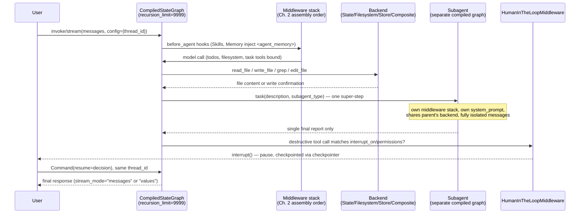

# Interview Preparation

## Learning Objectives

By the end of this chapter, you will be able to:

- Answer conceptual DeepAgents questions with precise mechanism names — middleware, backend, context isolation,
  checkpointing — rather than marketing-level generalities, and defend each answer with a chapter-level citation
- Work through scenario-based "design this" and "debug this" prompts the way an interviewer expects: stating
  assumptions, naming the exact `deepagents`/LangGraph primitive involved, and arriving at a concrete configuration
- Structure an open-ended system-design answer about a production DeepAgents platform as a rubric-driven outline
  instead of free-associating
- Recognize, in under a second, the specific "wrong code" pattern in each of this course's recurring pitfalls, and
  say why it's wrong using the same vocabulary a strong candidate would use
- Narrate a production incident and its fix as a structured story — symptom, root cause, fix, prevention — the
  way a senior engineer would in a behavioral or systems-design interview segment

---

## Prerequisites for This Chapter

This is the **synthesis chapter that closes the course**. It assumes you've completed **Chapters 1–20 in full**
and introduces **no new `deepagents` API surface** whatsoever — every function signature, middleware name,
default value, and failure mode referenced below was already established somewhere in Chapters 1–20, and every
answer below cites the chapter it comes from. If any citation doesn't ring a bell, that is the signal to
re-read that chapter, not to take this chapter's compressed answer as the full story. In particular, this
chapter assumes fluency with:

- Ch. 1's SDK-vs-CLI framing and the three problems DeepAgents solves
- Ch. 2's exact 11-step middleware assembly order and `CompiledStateGraph`/`recursion_limit=9999` internals
- Ch. 3's `create_deep_agent()` signature, argument by argument
- Ch. 4's `write_todos`/`TodoListMiddleware` replace-not-patch semantics
- Ch. 5–6's filesystem tool surface and the four backend classes (`StateBackend`, `FilesystemBackend`,
  `StoreBackend`, `CompositeBackend`) plus `SandboxBackendProtocol`
- Ch. 7's `MemoryMiddleware` vs. `deepagents-code` CLI's `AGENTS.md` distinction
- Ch. 8's subagent shapes (`SubAgent`/`CompiledSubAgent`/`AsyncSubAgent`), the `task` tool, and context isolation
- Ch. 9's `interrupt_on`/`permissions`/`FilesystemPermission` composition, including the non-inheritance rule
- Ch. 10's checkpointer selection and `thread_id` discipline
- Ch. 11's MCP wiring via `langchain-mcp-adapters`
- Ch. 12–14's multi-agent coordination, custom middleware/harness profiles, skills, and structured output
- Ch. 15–16's production defaults and full pitfalls catalog
- Ch. 17–19's testing, deployment, and security practices
- Ch. 20's four capstone tiers, which several scenario questions below reuse as concrete reference architectures

Nothing here is new mechanics. This chapter is rehearsal: the same facts, reshaped into the format an interview
actually tests — spoken or written answers under mild time pressure, not documentation you can re-read mid-answer.

---

## How to Use This Chapter

Work it like an actual interview loop, not a reading assignment:

1. Read a question, **cover the answer, and answer it yourself first** — out loud if you can. Precision under
   time pressure is the actual skill being tested; reading the model answer first only tests recognition.
2. Compare your answer against the model answer's *vocabulary*, not just its conclusion. If you reached the right
   conclusion but said "it remembers stuff across sessions" instead of "`StoreBackend`-scoped, cross-thread,
   accessed via `BaseStore`," that gap is exactly what separates a pass from a strong pass at this level.
3. For scenario and system-design questions, write your answer down before checking. Verbal fluency and written
   structure are different muscles, and interviews test both.

---

## Part 1 — Conceptual & FAQ Questions

Organized by course theme, matching Chapters 1–14's progression.

### Foundations (Ch. 1–3)

**Q1. What is DeepAgents, and how does it relate to LangGraph and `create_agent`?**

`deepagents` is a Python package that provides `create_deep_agent()`, a function that builds an opinionated
**middleware stack on top of `langchain.agents.create_agent`** — itself a thin harness over a LangGraph
`StateGraph` (Ch. 1–2). It is not a new runtime, agent abstraction, or execution engine. `create_deep_agent()`
assembles a fixed set of `AgentMiddleware` instances (filesystem, subagent delegation, planning, memory,
summarization, HITL, and more) in a specific order and calls `create_agent(model, tools, middleware=[...])`
internally, then returns the resulting `CompiledStateGraph` with `recursion_limit` raised to 9999. Every
capability DeepAgents adds is expressible as ordinary LangGraph/LangChain primitives you already know —
`AgentMiddleware` hooks, checkpointers, `BaseStore`, `interrupt()` — composed for you (Ch. 2).

**Q2. What problem does DeepAgents solve that plain LangGraph or `create_agent` doesn't solve on its own?**

Three specific problems that show up once an agent's task runs long (Ch. 1, course overview): **(1)** context-window
exhaustion from verbatim tool output (files, search results, logs) that doesn't need to stay in the message
history forever — solved by filesystem-backed context offloading (Ch. 5–6); **(2)** a single flat tool-calling
loop degrading once too many kinds of subtasks are jammed into one system prompt — solved by subagent delegation
and genuine context isolation (Ch. 8); **(3)** "remembering" anything across a restart or across users requiring
a bespoke, hand-rolled convention every time — solved by `MemoryMiddleware` and the backend architecture (Ch. 6–7).
Plain LangGraph gives you the primitives to solve all three yourself; DeepAgents is the packaged, tested answer so
you don't reinvent it per project.

**Q3. If someone calls DeepAgents "an autonomous agent framework," what's wrong with that framing?**

It hides the one fact that makes it debuggable in production: `create_deep_agent()` returns an ordinary
`CompiledStateGraph`, the exact type `StateGraph(...).compile()` produces anywhere else in LangGraph (Ch. 2).
Calling it "an autonomous agent framework" invites treating it as a black box with its own execution semantics,
when in fact every LangGraph introspection technique — `.get_state()`, `.stream()`, checkpoint inspection —
works unmodified. When something breaks in production, the framing that helps is "which middleware in the known
assembly order produced this behavior," not "what is the framework doing internally."

### Architecture (Ch. 2, 4)

**Q4. Walk through the exact middleware assembly order and explain why `FilesystemMiddleware` and
`SubAgentMiddleware` are structurally required.**

The full order (Ch. 2): **Skills → Filesystem (required) → SubAgent (required) → Summarization →
PatchToolCalls → AsyncSubAgent → your `middleware=[...]` → harness-profile extras → tool-exclusion →
prompt-caching → Memory → HumanInTheLoop.** `FilesystemMiddleware` and `SubAgentMiddleware` are the two pieces
`create_deep_agent()` adds unconditionally — you cannot omit them, and no `HarnessProfile` can exclude them
(attempting to raises `ValueError`, Ch. 2). They're structural because they define what makes an agent "deep" in
this SDK's specific sense: a place to offload context (filesystem) and a way to isolate context per subtask
(subagents). Every other middleware in the stack is either conditional on an argument you pass (`memory=`,
`interrupt_on=`) or auto-added based on model/harness (prompt caching, tool exclusion). Order matters because
earlier middleware needs to see effects of later middleware correctly or vice versa — for instance, Summarization
sits before your custom middleware and HITL so that compaction happens on the raw agent loop, not on top of
whatever your own middleware or approval gates already touched.

**Q5. What is `write_todos`, and why is it surprising that it isn't `deepagents`' own code?**

`write_todos` is the tool surface for `TodoListMiddleware` — which ships from **`langchain`**, not `deepagents`
(Ch. 4). It's inherited "for free" the moment `create_deep_agent()` calls `create_agent()` internally; DeepAgents
doesn't implement its own planning middleware at all. It's surprising because most explanations of "the DeepAgents
planning system" imply it's a bespoke feature of the package, when it's actually a demonstration of the course's
core thesis (Ch. 1–2): DeepAgents composes existing LangChain/LangGraph primitives rather than inventing parallel
ones. Mechanically, it supports exactly three statuses — `pending`, `in_progress`, `completed` — and **replaces
the entire list on every call**; there is no patch/delta operation (Ch. 4).

**Q6. Why does `create_deep_agent()` raise `recursion_limit` from LangGraph's default of 25 to 9999, and is that
safe?**

LangGraph's default of 25 super-steps suits small, fixed-shape workflow graphs. A deep agent's model-call loop
treats each tool call as its own super-step — `write_todos`, `read_file`, a `task` delegation, several
`edit_file` calls — and a genuinely multi-stage task can accumulate 40–80 turns before the model decides it's
done (Ch. 2). At 25, nearly every non-trivial deep-agent task would hit `GraphRecursionError` before finishing.
9999 is "effectively unbounded by default," not "no limit needed" — it's still an ordinary `CompiledStateGraph`
attribute you can override with `.with_config({"recursion_limit": N})` for cost- or latency-bounded production
paths (Ch. 2, 15). It is not a substitute for your own turn/token/cost budgets, which you still enforce via
`interrupt_on`, `execute` timeouts, or application-level turn counting.

### Backends (Ch. 5–6)

**Q7. Explain `StateBackend` vs. `FilesystemBackend` vs. `StoreBackend` vs. `CompositeBackend`, and when you'd
choose each.**

All four implement the same `BackendProtocol` ABC, so the filesystem tools (`ls/read_file/write_file/edit_file/
glob/grep/delete`) behave identically regardless of which is active — only the constructor argument to
`create_deep_agent(backend=...)` changes (Ch. 6).

- **`StateBackend`** (the default): files live in LangGraph state, ephemeral and thread-scoped, checkpointed
  along with `messages`/`todos`. Correct for scratch work — an outline, staged search results — that only needs
  to survive within one conversation.
- **`FilesystemBackend`**: real disk I/O rooted at a `root_dir`, independent of checkpointing entirely. Correct
  when the agent needs to operate on a genuine on-disk artifact — a repo checkout, exported files. `root_dir` is
  a trust boundary: writes land on real disk, so review discipline applies.
- **`StoreBackend`**: routes file operations through a LangGraph `BaseStore`, scoped by a `NamespaceFactory`,
  giving genuine cross-thread durability — the same user (or tenant) coming back in a new `thread_id` sees the
  same files. This is the only one of the four that solves "survive into the next conversation" on its own.
- **`CompositeBackend`**: routes by path prefix, e.g. everything under `/memories/` to a `StoreBackend`, everything
  else to the `StateBackend` default. This is what most real deployments actually want — ephemeral by default,
  with a small, deliberate set of durable exceptions.

The decision collapses to one question: **does this data need to survive past this `thread_id`, and if so, who
else needs to read it?** (Ch. 15's decision tree.)

**Q8. `grep` and regex — what's the gotcha?**

The `grep` filesystem tool performs a **literal-string** search, not a regex match (Ch. 5, 16). Code (or a model)
that pipes a regex pattern into it out of Unix habit will silently return zero matches rather than erroring —
there's no exception to catch, which makes this a quiet failure mode rather than a loud one.

**Q9. What does `execute` need to actually work, and why does it fail by default?**

`execute` requires a backend implementing the stricter `SandboxBackendProtocol` (`execute`/`aexecute` plus an
`id` property), which none of the four base backends implement (Ch. 6). Attaching a plain `StateBackend` or
`FilesystemBackend` and calling `execute` errors deliberately — the SDK will not hand you arbitrary shell
execution by accident. The `id` property matters because a sandbox is a stateful resource (a container, a remote
session) that needs a stable handle for reuse across calls and lifecycle management under concurrent load (Ch. 6,
18).

### Subagents (Ch. 8, 12)

**Q10. How does subagent context isolation actually work, mechanically?**

The parent model emits a single tool call: `task(description="...", subagent_type="...")`. That dispatches to a
**separate compiled graph invocation** — the named subagent's own middleware stack, own system prompt, own
message history — that runs its full internal loop (however many tool calls it needs) completely invisibly to
the parent. Only the subagent's **single final report** is extracted and returned via a `Command` state update
appended to the parent's messages (Ch. 8). The parent's `messages` never contain any of the subagent's
intermediate tool calls or reasoning — that's what "stateless" and "context-isolated" mean concretely here, not
just "it has its own prompt." The parent's recursion budget is charged for exactly one step per `task` call,
regardless of how many internal steps the subagent took (Ch. 2, 8).

**Q11. Do subagents share the parent's backend? Do they share its middleware?**

They share the parent's **`backend`** — so a subagent's `write_file` call lands in the same `StateBackend`/
`StoreBackend`/etc. instance the parent uses, meaning a subagent can leave a file behind for the parent (or a
sibling subagent) to read even though it can't return that content directly in its report (Ch. 8). But each
subagent gets its **own middleware stack**, independently assembled — its own `tools=` scoping, its own
`system_prompt`, its own `model=` override, and critically its own `interrupt_on` if it declares one (see Q14).
Shared storage, isolated execution context — that combination is the whole point.

**Q12. What are the three subagent shapes, and when would you use each?**

`SubAgent` (declarative dict, built via `create_deep_agent()` internally — inherits HITL unless overridden),
`CompiledSubAgent` (a pre-built `CompiledStateGraph` you supply directly — for reusing an existing agent or one
with custom graph structure), and `AsyncSubAgent` (for long-running or externally-orchestrated work, dispatched
without blocking the parent's loop) (Ch. 8, 12). Declarative `SubAgent` is the default choice for most
in-process specialization (research/coding/testing style splits); `CompiledSubAgent` when you already have a
graph built elsewhere you want to plug in as-is; `AsyncSubAgent` when the subagent's work shouldn't block the
coordinator's own turn.

### Memory (Ch. 7)

**Q13. What's the difference between the SDK's `MemoryMiddleware` and the `deepagents-code` CLI's `AGENTS.md`
convention? Why does this distinction matter?**

`MemoryMiddleware` is `create_deep_agent()`'s `memory=[paths]` parameter (Ch. 7): at the `before_agent` hook, it
downloads the listed files via whatever `backend` is configured, concatenates them, strips HTML comments, and
injects an `<agent_memory>` block plus a fixed `<memory_guidelines>` block into the system prompt for that turn.
Updates happen through the ordinary `edit_file` tool — **there is no dedicated save-memory tool**. `AGENTS.md`
and `~/.deepagents/<agent_name>/memories/*.md` are a completely separate thing: a **product convention of the
`deepagents-code` CLI** (a terminal coding agent built on top of the SDK), with fixed file locations baked into
that application, not `create_deep_agent()` API surface at all. `deepagents-code` happens to call
`create_deep_agent(memory=[...])` internally with those specific hardcoded paths — it's one application of the
SDK mechanism, not a different mechanism. This matters because the official docs page for CLI memory
(`docs.langchain.com/oss/python/deepagents/code/memory-and-skills`) documents the CLI, and citing it while
writing SDK code will send you looking for parameters that don't exist. Getting this backwards in an interview —
describing `MemoryMiddleware` as "the AGENTS.md thing" — is a signal the candidate learned DeepAgents from
secondary sources rather than the source/API directly.

**Q14. Why is there no dedicated tool for saving a memory?**

Because `MemoryMiddleware` deliberately reuses the existing `edit_file` filesystem tool (Ch. 5, 7) rather than
adding new API surface — the model persists a new fact by calling `edit_file` on the same source path that was
loaded into `memory=[...]`. This is consistent with the course's recurring theme: DeepAgents composes existing
primitives instead of inventing parallel ones (same pattern as `write_todos` in Q5).

### Human-in-the-Loop & Checkpointing (Ch. 9–10)

**Q15. How does `interrupt_on` interact with subagent inheritance?**

A declarative `SubAgent` **inherits the parent's `interrupt_on` only if it doesn't define its own.** The moment a
`SubAgent` defines `interrupt_on` at all — even for a single tool — it **fully overrides**, not merges with, the
parent's configuration for that subagent (Ch. 9 §4.1). A subagent whose author only intended to add a narrow
`interrupt_on={"execute": ...}` silently strips whatever protection the parent had on `write_file` for that one
subagent, with no error, no warning, nothing that looks obviously wrong in review. `CompiledSubAgent` and
`AsyncSubAgent` never inherit `interrupt_on` under any configuration — HITL for those must be built in at compile
time or on the remote graph itself (Ch. 9 §4.2). This is called out repeatedly across Ch. 9, 15, and 16 as the
single highest-leverage recurring risk in this whole SDK.

**Q16. Why is a checkpointer required for HITL to work at all?**

`interrupt()` pauses the graph mid-execution and relies on the checkpointer to persist the paused state so a
later `Command(resume=...)` call, potentially arriving minutes or hours later from a different process, can pick
up exactly where execution paused (Ch. 9–10, standard LangGraph mechanics DeepAgents doesn't change). Without a
checkpointer — or with `MemorySaver` in a process that exits or restarts — the paused state is gone the instant
the holding process dies, and the resume call has nothing to resume. `thread_id` must be reused **exactly** on
resume; a fresh `thread_id` looks like a brand-new conversation with no pending interrupt at all (Ch. 9–10).

**Q17. How would you choose between `MemorySaver`, `SqliteSaver`, and `PostgresSaver` for a deep agent
specifically (not generically for LangGraph)?**

The LangGraph-level tradeoffs are unchanged (Ch. 10) — `MemorySaver` for dev/test only, `SqliteSaver` for
single-instance deployments, `PostgresSaver` for multi-instance production — but what's newly at stake for a deep
agent is bigger than for a plain chat graph: a crashed `MemorySaver`-backed agent doesn't just lose conversation
history, it loses the entire `todos` plan and, with the default `StateBackend`, every file the agent had written
(Ch. 10). For any FastAPI service behind a load balancer with multiple workers/pods — the target deployment shape
for this learner's background — `PostgresSaver` is the only one of the three where any replica picking up the
same `thread_id` sees consistent `todos`/`files` state.

### MCP & Security (Ch. 11, 19)

**Q18. How would you integrate an existing MCP server into a deep agent?**

There's **no first-class MCP parameter** on `create_deep_agent()` (Ch. 11). You wire it exactly as you would for
any other LangChain/LangGraph agent, using `langchain-mcp-adapters`: construct a `MultiServerMCPClient` with one
config entry per server, call its (async) `get_tools()`/`aget_tools()` to get a flat list of `BaseTool`
instances, and pass that list into the ordinary `tools=` parameter. Because `get_tools()` is async and
`create_deep_agent()` itself is synchronous, the tool-fetching step typically happens once at process/service
startup (or per-request in a FastAPI async handler) rather than inside the synchronous constructor call. MCP
tools compose with everything else `tools=` composes with — subagent-level scoping, `interrupt_on` gating by tool
name — because from `deepagents`' point of view they're just tools; there's nothing MCP-specific about how they
flow through the middleware stack.

**Q19. What's the security risk of `FilesystemBackend` combined with `execute`, and how do you mitigate it?**

`FilesystemBackend` gives a model a real, persistent write surface on the host filesystem; `execute` (with a
`SandboxBackendProtocol`-implementing backend) gives it arbitrary command execution. Together, with no
sandboxing or approval gate, a model can make destructive or silent changes to real infrastructure — this is
called out directly in the SDK's own docstring warning, not just this course's opinion (Ch. 6, 19). Mitigation is
layered, not a single switch: **(1)** sandbox `execute` itself — run it in an isolated container/VM rather than
directly on the host; **(2)** gate destructive tools with `interrupt_on`/`permissions` so a human approves before
anything irreversible happens (Ch. 9); **(3)** scope `root_dir` as narrowly as the task allows rather than
pointing `FilesystemBackend` at a broad or shared volume (Ch. 6); **(4)** audit every subagent's own
`interrupt_on` individually, since none of this inherits/merges automatically (Ch. 9, 15). Treat "sandbox or
HITL, not neither" as a hard requirement whenever both `FilesystemBackend`/broad disk access and `execute` are
present on the same agent.

**Q20. What is `NamespaceFactory` for, and why does it matter for multi-tenant deployments?**

It's the scoping mechanism `StoreBackend` uses to partition cross-thread data — typically by user or tenant ID —
so that `StoreBackend`'s durability doesn't accidentally become a data leak across tenants (Ch. 6, 19). Without
deliberate namespace scoping, a `StoreBackend` or `CompositeBackend` route intended to persist "this user's
memory" can silently become "every user's memory in one shared bucket" the moment two different users' sessions
resolve to the same store namespace. This is a first-class concern in any platform serving more than one customer
out of the same deployment (Ch. 19–20).

---

## Part 2 — Scenario-Based Questions

These are asked as "design this" or "debug this" prompts. The model answers below show the *reasoning path* a
strong candidate walks, not just the final configuration — that reasoning is what's actually being evaluated.

### Scenario 1 — "A user reports their agent's file writes disappear between messages in what should be the
same conversation."

**Approach**: Don't guess at a fix before narrowing the failure. Ask, in order: **(1)** Is `thread_id` actually
identical across those messages? The single most common cause of "the agent forgot everything" is a `thread_id`
that silently changed — a new UUID minted per request instead of reused per conversation (Ch. 10, 16). Check the
request-handling code generating or passing `thread_id` before touching anything else. **(2)** If `thread_id` is
confirmed stable, check backend choice: is this agent on the default `StateBackend`, and does "should be the same
conversation" actually mean "the same `thread_id`," or does the user mean "days later, a new session"? If it's
genuinely the same `thread_id` and files still vanish, `StateBackend` files are checkpointed along with
`messages`/`todos` (Ch. 6, 10) — so the next question is checkpointer choice: is this deployment on `MemorySaver`
in a multi-worker/multi-pod setup, where a different process instance than the one holding the write picks up the
next request for the same `thread_id`? That reproduces exactly this symptom. **(3)** If the user actually means
"the next day, in a genuinely new conversation," that's not a bug at all — `StateBackend` is thread-scoped by
design (Ch. 6), and the fix is a `CompositeBackend` route to `StoreBackend` for whatever paths need to survive
past a single thread, not a bug fix to `StateBackend`. The diagnostic order matters: `thread_id` consistency
first, checkpointer/process-topology second, backend semantics third — most real-world reports of this shape
turn out to be #1 or #2, not a fundamental backend misunderstanding.

### Scenario 2 — "Design a customer-support deep agent: read-only cross-session order-history lookup, plus a
refund-escalation path requiring human approval."

**Approach**: Separate the two capabilities by their actual requirements before writing any code.

- **Order history lookup** needs to be cross-session (a support agent picks up a ticket days later) and
  read-only. That's a `StoreBackend` (or a `CompositeBackend` route to one) scoped by customer/tenant via
  `NamespaceFactory` — not `StateBackend`, which wouldn't survive past the originating thread (Ch. 6). Read-only
  means no `interrupt_on` needed on the lookup tool itself; the risk profile is low.
- **Refund escalation** is destructive/costly and must never proceed without a human. That's an `interrupt_on`
  entry on whatever tool actually issues the refund, with `allowed_decisions=["approve", "reject"]` deliberately
  excluding silent `edit` (Ch. 9, 15) — you don't want a human quietly rewriting a refund amount without a fresh
  approval step, the same reasoning Ch. 9's `deploy` example uses.
- **Checkpointer**: HITL requires one unconditionally (Q16) — `PostgresSaver` for a real multi-instance support
  platform, with `thread_id` mapped to the existing support-ticket ID rather than a throwaway UUID (Ch. 10, 15).

Sketch:

```python
from deepagents import create_deep_agent, FilesystemPermission
from deepagents.backends.composite import CompositeBackend
from deepagents.backends.state import StateBackend
from deepagents.backends.store import StoreBackend
from langgraph.checkpoint.postgres import PostgresSaver

backend = CompositeBackend(
    default=StateBackend(),
    routes={"/orders/": StoreBackend(store=store, namespace=namespace_by_customer)},
)

agent = create_deep_agent(
    model=model,
    tools=[lookup_order_history, issue_refund],
    backend=backend,
    interrupt_on={
        "issue_refund": {"allowed_decisions": ["approve", "reject"]},
    },
    checkpointer=PostgresSaver.from_conn_string(DB_URL),
)
```

A strong answer names *why* each piece is there, not just that it's there — the interviewer is testing whether
you reach for the right primitive because you understand the persistence/risk axis (Ch. 15's decision tree), not
because you memorized a snippet.

### Scenario 3 — "A coordinator's subagent occasionally does something destructive the coordinator didn't intend
to permit — walk through how you'd audit and fix this."

**Approach**: This is Q15/Q11 applied as a live debugging exercise. Don't start by adding more `interrupt_on`
entries to the coordinator — that's very likely not where the gap is. Walk the audit in this order: **(1)**
Identify which subagent performed the destructive action, and open its **own** declarative `SubAgent` definition.
**(2)** Check whether that subagent defines its own `interrupt_on` at all. If it does, that's almost certainly the
bug: a `SubAgent.interrupt_on` **fully overrides** the parent's, it doesn't merge (Ch. 9 §4.1, Q15) — so if that
subagent's `interrupt_on` only names one tool, every other tool the parent thought it was protecting is
unprotected for this specific subagent. **(3)** The fix is to restate every tool the parent protects inside the
subagent's own `interrupt_on`, not to assume inheritance will fill the gap. **(4)** If the offending subagent is a
`CompiledSubAgent` or `AsyncSubAgent` instead of declarative, there's no inheritance to reason about at all — HITL
for those has to be built into the compiled graph itself or the remote system, and its absence there is the root
cause (Ch. 9 §4.2). **(5)** Turn the one-time fix into a standing practice: audit every declarative `SubAgent`
with its own `interrupt_on` as a recurring code-review checklist item (Ch. 15), because this failure mode
reproduces silently every time someone adds a narrow `interrupt_on` to a subagent while thinking about only one
tool.

### Scenario 4 — "Your coding-assistant agent's context window keeps filling up mid-task even though you have
`SummarizationMiddleware` configured — diagnose it."

**Approach**: Separate two axes that are easy to conflate (Ch. 6, 15): summarization compacts `state["messages"]`
message history; it does nothing about how much gets written into messages in the first place. If a subagent (or
the coordinator) is reading large tool outputs — a big log file, a large API payload — directly into the
conversation instead of writing them to a file and reading back only the relevant slice, that's a design problem
eviction/summarization is meant to be a *safety net* for, not a substitute for (Ch. 5, 15). Check
`tool_token_limit_before_evict`/`human_message_token_limit_before_evict` (Ch. 5) — defaults may be poorly tuned
for this workload's actual payload sizes, thrashing (evicting near-constantly, generating pointer noise) or never
firing (payloads that individually don't cross the threshold but accumulate). The fix is rarely "increase the
summarization budget" — it's usually redesigning the subagent to write large outputs to a file and read back only
what's needed (Ch. 5, 15), with eviction thresholds tuned to the workload as the second-order fix.

### Scenario 5 — "A subagent's final report is missing detail the coordinator clearly needs to act on — how do
you fix it without breaking context isolation?"

**Approach**: The instinct to "just have the subagent return more" collides with the entire point of context
isolation (Ch. 8) — a coordinator that gets a subagent's full internal reasoning back has recreated the flat,
undifferentiated-context problem subagents exist to solve. The correct fix is almost always in the subagent's
`system_prompt`: be explicit about exactly what the final report must state (Ch. 8's Code Review Agent examples
are explicit: "name exactly which file...", "state clearly whether tests passed or failed"). If the missing
information is a side effect the coordinator needs to discover independently (e.g., "which files changed"), the
better pattern is often to have the subagent write a structured artifact to the shared `backend` (a summary file
at a known path) that the coordinator then reads itself with `read_file`, rather than trying to cram everything
into one prose report string.

---

## Part 3 — System Design Discussion

### "Design a production, multi-tenant DeepAgents-based coding assistant platform serving thousands of users."

This is intentionally open-ended — the interviewer is grading structure and prioritization, not one correct
answer. Use this as an **answer outline**, referencing the course chapter that backs each decision, rather than
writing full code:

1. **Tenant isolation (Ch. 6, 19)**: every `StoreBackend`/`CompositeBackend` route scoped by a `NamespaceFactory`
   keyed to tenant ID, not just user ID, so a bug in per-user scoping can't cross a tenant boundary entirely.
   State this explicitly as the first architectural decision — retrofitting namespace isolation after launch is
   far more expensive than designing it in.
2. **Backend strategy (Ch. 6, 15)**: `StateBackend` default for ephemeral scratch work per coding session,
   `CompositeBackend` routing durable artifacts (saved snippets, project memory) to `StoreBackend`, and
   `FilesystemBackend` only for the sandboxed execution environment itself — never for direct, unsandboxed host
   access at platform scale.
3. **Checkpointer for horizontal scaling (Ch. 10, 18)**: `PostgresSaver` (or an equivalent real, network-backed
   checkpointer) is non-negotiable the moment more than one process/pod can serve the same `thread_id` —
   `MemorySaver`/`SqliteSaver` are single-instance assumptions that silently break under a load balancer.
   `thread_id` mapped to a durable concept the platform already has (a session or IDE-connection ID), never a
   per-request throwaway.
4. **Sandboxing `execute` (Ch. 6, 19)**: every code-execution path runs inside a `SandboxBackendProtocol`
   implementation backed by real container/VM isolation, with the sandbox's `id` property used for lifecycle
   management — spin-up, reuse across a session's calls, teardown on session end or leak detection — under real
   concurrent load across thousands of users.
5. **Cost control via prompt caching and summarization tuning (Ch. 13–15)**: a long-lived model instance
   constructed once per process (not per-request) to preserve provider-side prompt caching benefits;
   `tool_token_limit_before_evict`/`human_message_token_limit_before_evict` tuned against this platform's real
   payload sizes (large file reads, build logs) rather than left at defaults; per-subagent `model=` overrides
   matching task difficulty (cheap models for mechanical research/grep subagents, the strongest available model
   only where task difficulty demands it).
6. **HITL gating (Ch. 9, 15, 19)**: destructive operations (deploys, force-pushes, anything touching a shared
   branch) gated with `interrupt_on`/`permissions`, `allowed_decisions` matched to each tool's actual blast
   radius, and — critically at this scale — a standing audit process for subagent-level `interrupt_on`
   non-inheritance, since a platform with many subagent types multiplies the chance one of them silently drops
   coverage.
7. **Observability (Ch. 17–18)**: LangSmith or equivalent tracing across the full middleware stack, `todos`
   progress surfaced to users as UI feedback (Ch. 4, 15) rather than just logged, and monitoring specifically for
   `GraphRecursionError` rates (a signal of either genuinely oversized tasks or a design that should be
   decomposed into more subagents, Ch. 2) and checkpointer latency under load.
8. **Self-hosted vs. managed (Ch. 18)**: name the tradeoff explicitly — self-hosting via FastAPI +
   `.astream` + `PostgresSaver` + Docker/K8s gives full control over exactly the tenant-isolation and sandboxing
   requirements above; LangSmith Managed Deep Agents via `deepagents-cli` trades some of that control for
   operational simplicity. A platform with thousands of users and real multi-tenant security requirements is
   the case where self-hosting's control usually wins the tradeoff.

A strong answer visibly moves through this order — isolation and durability first, sandboxing and safety second,
cost and observability last — rather than starting with cost optimization on an architecture that hasn't secured
tenant boundaries yet.

---

## How a Request Flows Through a Deep Agent

The single most useful diagram to reproduce on a whiteboard — it's the backbone for almost every question above.



Talk through it left to right: entry with a `thread_id`-scoped config, middleware running in the fixed assembly
order before the model ever sees a prompt, the model's tool calls resolving against whichever backend is
configured, a `task` call handing off to a fully isolated subagent invocation that returns only a final report,
and any destructive call passing through HITL — which requires the checkpointer to survive the pause at all.

---

## Part 4 — Practical Troubleshooting Exercises

Each of these is a short snippet or symptom pulled from the Ch. 16 pitfalls catalog, reframed as an interview
debugging prompt. State the bug and the fix; don't just say "that's wrong."

**Exercise 1.**

```python
agent = create_deep_agent(tools=[my_tool])
```

*What's wrong?* No `model=` passed at all. `model=None` silently falls back to a deprecated default rather than
raising (Ch. 3, 15) — this is not "using a sensible default," it's depending on an implicit, deprecated fallback
that will surprise whoever next touches this code, or breaks outright on a future SDK version. **Fix**: pass
`model=` explicitly, always — a provider string when nothing provider-specific needs configuring, a live
`BaseChatModel` instance (e.g. `ChatBedrockConverse`) the moment region, guardrails, or retry config matter.

**Exercise 2.**

```python
result = agent.invoke({"messages": [...]}, config={"configurable": {"thread_id": str(uuid.uuid4())}})
# ... interrupt fires, human approves later ...
result2 = agent.invoke(Command(resume={"decision": "approve"}),
                        config={"configurable": {"thread_id": str(uuid.uuid4())}})
```

*What's wrong?* A fresh `uuid4()` is generated for the resume call instead of reusing the exact `thread_id` from
the original invocation (Ch. 9–10, 16). To the checkpointer, this looks like a brand-new conversation with no
pending interrupt — the resume has nothing to attach to. **Fix**: persist the `thread_id` generated at
conversation start (mapped to a real session/ticket concept, not thrown away) and reuse it verbatim on every
subsequent call in that conversation, including every resume.

**Exercise 3.**

```python
results = filesystem_tools.grep(pattern=r"def\s+\w+\(", path="/repo")
```

*What's wrong?* `grep` is a literal-string search, not regex (Ch. 5, 15, 16). This pattern will not match
anything the way a shell-scripting instinct expects — it looks for the literal substring `def\s+\w+\(`
character-for-character. **Fix**: search with the literal substring you actually expect to appear (e.g.
`"def "`), or use `read_file`/`glob` plus your own post-filtering logic if genuine regex matching is required.

**Exercise 4.**

```python
review_subagent: SubAgent = {
    "name": "review",
    "description": "Reviews and merges approved PRs.",
    "system_prompt": "...",
    "tools": [read_file, write_file, execute, merge_pr],
    "interrupt_on": {"merge_pr": {"allowed_decisions": ["approve", "reject"]}},
}

coordinator = create_deep_agent(
    model=model,
    subagents=[review_subagent],
    interrupt_on={
        "write_file": {"allowed_decisions": ["approve", "edit", "reject"]},
        "execute": {"allowed_decisions": ["approve", "reject"]},
        "merge_pr": {"allowed_decisions": ["approve", "reject"]},
    },
)
```

*What's wrong?* The coordinator protects `write_file`, `execute`, and `merge_pr`. The `review` subagent defines
its own `interrupt_on` covering only `merge_pr` — per the non-inheritance rule (Ch. 9 §4.1, Q15), this **fully
overrides** the parent's config for this subagent, meaning `review`'s own `write_file` and `execute` calls are
now completely unprotected, despite the coordinator's config appearing to cover them. **Fix**: restate every tool
the parent protects inside `review_subagent["interrupt_on"]` too, not just the one the author was focused on:
`{"write_file": {...}, "execute": {...}, "merge_pr": {...}}`.

**Exercise 5.**

```python
agent = create_deep_agent(
    model=model,
    memory=["./agent_memory/AGENTS.md"],
    backend=FilesystemBackend(root_dir="./agent_memory"),
)
# team's internal wiki cites docs.langchain.com/oss/python/deepagents/code/memory-and-skills
# for "how the save-memory tool works"
```

*What's wrong?* Two things layered together: there is no dedicated save-memory tool in the SDK — persistence
happens through the ordinary `edit_file` tool (Q14, Ch. 7) — and the cited docs page documents the
**`deepagents-code` CLI's** fixed `AGENTS.md`/`memories/*.md` convention, not `create_deep_agent()` API surface
at all (Ch. 7, Q13). A team whose internal docs point there while writing SDK code will look for parameters
(a "save" tool, fixed file paths) that don't exist in the SDK. **Fix**: document `MemoryMiddleware` against its
actual mechanics — `memory=[paths]`, `<agent_memory>` injection, updates via `edit_file` — and cite the SDK
reference (or this course's Ch. 7), not the CLI product docs.

---

## Part 5 — Real-World Production Case Discussion

*(This section serves double duty as this chapter's Real-World Scenario — a dedicated separate section would
just repeat it, so it's folded in here as guidance for narrating exactly this kind of story in an interview.)*

Interviewers frequently ask "tell me about a production incident you've dealt with" as a structured-communication
test as much as a technical one. Below is guidance for narrating a DeepAgents-shaped incident — practice telling
it in under two minutes, hitting all four beats.

**The shape to use**: symptom → root cause (traced through the exact mechanism, not vibes) → fix → prevention.

**Worked example** (reusing Ch. 15's customer-support case study as narration practice, not a real incident to
claim as your own — adapt the specifics to something you've actually built if asked in a real interview):

- **Symptom**: "Our customer-support deep agent worked fine in the demo, but three things surfaced in the first
  month of real traffic: support staff wanted the agent to remember a customer's plan tier across sessions, an
  MCP-sourced ticket-closing tool got triggered on the wrong ticket during a live demo, and a pod restart during a
  deploy dropped a pending refund approval a support lead was about to act on."
- **Root cause, traced precisely**: "The agent shipped with `StateBackend` by default — which is thread-scoped by
  design, not a bug — so nothing about plan-tier preference could survive past the originating conversation. The
  ticket-closing tool had no `interrupt_on` entry at all, so nothing gated it regardless of risk. And the
  checkpointer was `MemorySaver`, which is fine for local dev but loses every pending interrupt the instant the
  process holding it exits — exactly what a pod restart does."
- **Fix**: "We added a `CompositeBackend` route from `/customers/` to a `StoreBackend` scoped by customer ID for
  the durable preference; added `interrupt_on={"close_ticket": {"allowed_decisions": ["approve", "reject"]}}`
  for the destructive MCP tool; and moved to `PostgresSaver` with `thread_id` mapped to our existing support-
  ticket ID instead of a throwaway UUID."
- **Prevention**: "None of these three fixes needed new DeepAgents mechanics — each one was 'pick the production
  default instead of the zero-config one' arriving a few weeks late instead of during design review. The actual
  process fix was turning the pre-production checklist into a release gate run before the *next* service ships,
  not just a retrospective action item after this one."

Notice what makes this narration strong: every claim names the exact mechanism (`StateBackend`'s thread-scoping,
`interrupt_on` absence, `MemorySaver`'s in-process-only lifetime) rather than saying "the agent forgot things" or
"we didn't have safety checks." That precision, delivered under the pressure of a live interview, is the actual
signal being evaluated — the story's content matters less than whether you can narrate it with load-bearing
vocabulary instead of hand-waving.

---

## What a Strong Candidate Demonstrates

A rubric, distilled from every section above:

- **Precise vocabulary, used correctly, every time.** "Middleware," "backend," "context isolation," "checkpointer,"
  "namespace," "harness profile" — used to mean exactly the mechanism this course defines them as, not as
  interchangeable synonyms for "the agent's internal stuff." A candidate who says "it saves state somewhere" where
  a precise answer would name `StateBackend` vs. `StoreBackend` is giving a weaker answer even if the underlying
  intuition is correct.
- **Ability to trace a request through the exact assembly order.** Not "there's a filesystem thing and a subagent
  thing," but the full ordered sequence (Q4) and *why* each position is chosen relative to the others — this is
  the single most reliable signal of having actually read the source or a course that traced it, versus having
  absorbed a marketing summary.
- **Security awareness by default, not as an afterthought.** Volunteering the sandboxing/HITL requirement for
  `FilesystemBackend`+`execute` (Q19) or the subagent `interrupt_on` non-inheritance risk (Q15) *before* being
  asked "but is that safe?" is a strong-candidate tell. Waiting to be prompted on security is a weaker signal even
  if the answer, once prompted, is correct.
- **The instinct to distinguish SDK API from CLI product conventions.** Correctly separating `MemoryMiddleware`
  from `deepagents-code`'s `AGENTS.md` (Q13) unprompted, or catching a citation of the CLI docs page as wrong
  context for SDK code (Exercise 5), demonstrates the kind of source-level rigor this entire course was built
  around — and its absence is this course's own repeatedly named red flag (see Common Mistakes below).

---

## Best Practices — Structuring Interview Answers

- **State the mechanism before the conclusion.** "It's `StoreBackend`, scoped by `NamespaceFactory`, because
  cross-thread durability requires..." reads as senior; "it persists across sessions" and stopping there reads as
  junior, even when both are technically true.
- **Name the chapter/source you're drawing from when it strengthens the answer.** "This is exactly the
  non-merge behavior Ch. 9 calls out as the highest-leverage subagent risk" signals you learned this from
  tracing real behavior, not guessing in the room.
- **For scenario questions, narrate your diagnostic order, not just your final answer.** Interviewers are often
  grading *how* you narrow a broad symptom to a root cause (Scenario 1's thread_id-first ordering) as much as the
  destination.
- **For system-design questions, give a structured outline before diving into any one piece.** List the
  dimensions (isolation, backend, checkpointer, sandboxing, cost, HITL, observability) up front, then expand each
  briefly — this shows you have the whole shape in mind rather than free-associating into the first idea that
  comes up.
- **When you don't know something, say what you'd check rather than guessing confidently.** "I'd check whether
  `thread_id` is stable before assuming it's a backend bug" is a stronger answer than an overconfident wrong guess
  — this course's own trust model (verify against source, say so when something can't be confirmed) is itself a
  good interview posture to model.

---

## Common Mistakes — Interview-Specific

- **Vague hand-waving instead of precise mechanism names.** Saying "the agent has memory" instead of naming
  `MemoryMiddleware`'s `<agent_memory>` injection and `edit_file`-based updates, or "it delegates to helpers"
  instead of naming the `task` tool and context isolation mechanics — this reads as surface familiarity, not
  depth, to anyone who knows the material.
- **Confusing SDK and CLI in an answer.** Describing `deepagents-code`'s `AGENTS.md` convention as if it were
  `create_deep_agent()`'s memory API (or vice versa) is called out, repeatedly, across this entire course (Ch. 1,
  7, 15) as an immediate red flag — it signals the candidate learned from a docs page or blog post without
  noticing which product it actually documents, rather than from the source.
- **Treating `interrupt_on` as if it merges across parent/subagent boundaries.** This is the single most common
  wrong assumption an otherwise-strong candidate makes under time pressure (Q15) — stating it correctly
  unprompted is a strong positive signal precisely because it's so easy to get wrong.
- **Assuming `recursion_limit=9999` means "deep agents have no cost limits."** It removes an arbitrary ceiling
  tuned for a different graph shape; it says nothing about your own turn/token/cost budgets, which remain your
  responsibility (Ch. 2, Q6).
- **Assuming `grep` is regex because every other `grep` you've used is.** A small detail, but getting it wrong in
  a live coding portion produces a visibly broken demo, not just a wrong verbal answer (Q8, Exercise 3).
- **Over-indexing on "DeepAgents is magic" framing instead of "it's a composition I can trace."** An answer that
  can't get past "it just handles that for you" for `write_todos`, memory, or subagent isolation signals the
  candidate hasn't internalized this course's central thesis (Ch. 1–2) — that every one of these is an ordinary
  LangGraph/LangChain primitive, assembled, not invented.

---

## Summary

- This chapter introduced no new API — it rehearsed Chapters 1–20's material in interview format: FAQ,
  scenario-based design/debug prompts, one open-ended system-design outline, troubleshooting exercises pulled
  from the Ch. 16 pitfalls catalog, and a production-incident narration pattern.
- The recurring theme across every section is the same one the whole course has emphasized: **precise mechanism
  names beat correct-but-vague conclusions.** "`StoreBackend`, scoped by `NamespaceFactory`" beats "it remembers
  things"; "fully overrides, doesn't merge" beats "subagents have their own settings."
- The single most valuable diagram to have ready for a whiteboard is the request-flow sequence diagram above —
  it's the backbone that most FAQ and scenario answers hang off of.
- Two failure modes separate a strong answer from a weak one more than anything else in this material:
  mishandling `interrupt_on`'s non-inheritance across parent/subagent boundaries, and conflating the SDK's
  `MemoryMiddleware` with the `deepagents-code` CLI's `AGENTS.md` convention. Both are named, repeatedly, as this
  course's own recurring red flags — treat catching either one unprompted as a genuine signal of depth.

---

## Knowledge Check

Quiz yourself with these six questions from Part 1 **without looking back** — say your answer out loud, then
check it against the model answer above.

1. (Q4) Walk through the exact 11-step middleware assembly order, and explain why `FilesystemMiddleware` and
   `SubAgentMiddleware` specifically cannot be excluded via any `HarnessProfile`.
2. (Q7) Explain `StateBackend` vs. `FilesystemBackend` vs. `StoreBackend` vs. `CompositeBackend`, and state the
   one question every persistence decision collapses to.
3. (Q10) Trace exactly what happens between a parent's `task(...)` call and a final report landing back in its
   messages — what does the parent see, and what does it never see?
4. (Q13) Explain the difference between `MemoryMiddleware` and the `deepagents-code` CLI's `AGENTS.md`
   convention, and why citing the CLI's docs page while writing SDK code is a mistake.
5. (Q15) How does `interrupt_on` behave when a declarative `SubAgent` defines its own — inherit, merge, or
   override? What's the concrete consequence of getting this wrong?
6. (Q19) What's the security risk of combining `FilesystemBackend`/broad disk access with `execute`, and name at
   least three concrete mitigations.

---

## Hands-On Exercise: The Mock Interview

Do this exercise exactly as described — it's deliberately the same exercise a real interview loop would run.

1. **Set a timer for five minutes.** Without opening Chapter 2, write out (or say out loud, recorded) the
   **complete middleware assembly order** `create_deep_agent()` builds, from first to last, plus one sentence on
   why each middleware sits in that position relative to its neighbors.
2. **Stop. Open Chapter 2, Section 3**, and check your answer against the actual order:
   Skills → Filesystem (required) → SubAgent (required) → Summarization → PatchToolCalls → AsyncSubAgent →
   your `middleware=[...]` → harness-profile extras → tool-exclusion → prompt-caching → Memory → HumanInTheLoop.
3. **Grade yourself on two axes separately**: did you get the *order* right, and did you get the *reasoning* for
   each position right? A candidate who recites the order correctly but can't explain why Summarization precedes
   your custom middleware (so compaction happens on the raw loop before your own middleware or HITL ever sees it)
   has memorized, not understood — the interview usually finds that gap with one follow-up question.
4. **Repeat the same five-minute drill** for the `StateBackend`/`FilesystemBackend`/`StoreBackend`/
   `CompositeBackend` decision tree from Chapter 15, and for the exact sequence in Q10 (parent `task()` call →
   isolated subagent execution → final report only). These three — assembly order, backend decision tree,
   subagent isolation trace — are the three "explain this from memory, precisely" drills most likely to come up
   verbatim in a real technical interview for this material.
5. **Optional, for full rigor**: recruit a peer (or another instance of an LLM) to play interviewer using ten
   questions randomly selected from Part 1–2 above, and grade your answers against the "precise vocabulary +
   correct mechanism" bar this chapter has emphasized throughout, not just "did I reach the right conclusion."

---

## Further Reading

- [DeepAgents Overview (LangChain Docs)](https://docs.langchain.com/oss/python/deepagents/overview) — the
  official conceptual reference this entire course has tracked from Chapter 1 onward
- [`langchain-ai/deepagents` GitHub repository](https://github.com/langchain-ai/deepagents) — read
  `libs/deepagents/deepagents/graph.py` directly if any answer above feels uncertain; it is the ground truth this
  course verified every claim against, and the source an interviewer may expect you to have actually opened
- Related chapter in this course: [Chapter 2 — Architecture & Internals](./02-architecture-and-internals.md) —
  the exact middleware assembly order this chapter's Q4 and Hands-On Exercise are built around
- Related chapter in this course: [Chapter 6 — Backends & Storage Architecture](./06-backends-and-storage-architecture.md)
  and [Chapter 15 — Best Practices](./15-best-practices.md) — the backend decision tree behind Q7 and Scenario 1
- Related chapter in this course: [Chapter 7 — Memory & Persistence](./07-memory-and-persistence.md) — the full
  SDK-vs-CLI distinction behind Q13 and Exercise 5
- Related chapter in this course: [Chapter 8 — Subagent Orchestration](./08-subagent-orchestration.md) — the
  context isolation mechanics behind Q10 and this chapter's sequence diagram
- Related chapter in this course: [Chapter 9 — Human-in-the-Loop](./09-human-in-the-loop.md) — the
  `interrupt_on` non-inheritance rule behind Q15, Scenario 3, and Exercise 4
- Related chapter in this course: [Chapter 16 — Common Mistakes & Pitfalls](./16-common-mistakes-and-pitfalls.md)
  — the full pitfalls catalog this chapter's Part 4 troubleshooting exercises were drawn from
- Related chapter in this course: [Chapter 20 — Capstone Projects](./20-capstone-projects.md) — the reference
  architectures several scenario questions in Part 2 reuse

This is the final chapter of the course. If every Knowledge Check above landed without needing to look back, and
the Hands-On Exercise's five-minute drills came out correct on the first try, that's the course's own signal that
you're ready to demonstrate this material under real interview conditions.

---

<div style="display:flex;justify-content:space-between;align-items:center;">
  <a href="./20-capstone-projects.md">← Previous: Capstone Projects</a>
  <a href="./00-index.md">🏠 Index</a>
  <span></span>
</div>
