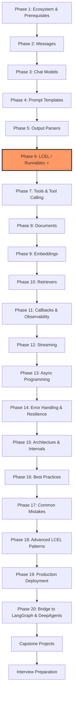

# LangChain Core — From LLM/FastAPI Engineer to Production LCEL Practitioner

## Course Overview

You already know how LLMs work under the hood, how to build APIs with FastAPI, how to wire up MCP servers, and how to orchestrate multi-step workflows with LangGraph. What you're missing is the layer that sits *underneath* LangGraph and most production LLM applications: **LangChain Core** — the set of standard interfaces (`Runnable`, messages, prompts, parsers, tools, retrievers) that make LLM pipelines composable, provider-agnostic, and swappable.

This course does **not** teach LangChain as "import a prebuilt chain and call `.run()`." It teaches LangChain Core as a small number of orthogonal abstractions — messages, models, prompts, parsers, tools, documents, embeddings, retrievers, callbacks, and the `Runnable` protocol (LCEL) — that you compose yourself. Once these clatter into place, LangGraph (which you already use) will make far more sense, because its nodes are just `Runnable`s and its state channels are just typed message accumulators.

By the end, you'll be able to:
- Explain *why* LangChain Core exists and what problem the `Runnable` interface solves
- Compose production pipelines with LCEL instead of writing bespoke glue code
- Swap LLM providers (OpenAI ↔ Anthropic ↔ Gemini ↔ Ollama) by changing one line
- Build retrieval, tool-calling, and streaming pipelines from first principles
- Understand the internal execution model well enough to debug and optimize it
- Deploy a LangChain Core-based service in FastAPI with proper error handling, observability, and testing

## Learning Roadmap

| Phase | Focus | Chapters |
|-------|-------|----------|
| 1 | Ecosystem & prerequisites | 01 |
| 2 | Messages | 02 |
| 3 | Chat models & provider independence | 03 |
| 4 | Prompt templates | 04 |
| 5 | Output parsers | 05 |
| 6 | **LCEL / Runnables (core payoff)** | 06 |
| 7 | Tools & tool calling | 07 |
| 8 | Documents & loaders | 08 |
| 9 | Embeddings & similarity | 09 |
| 10 | Retrievers | 10 |
| 11 | Callbacks & observability | 11 |
| 12 | Streaming | 12 |
| 13 | Async programming | 13 |
| 14 | Error handling & resilience | 14 |
| 15 | Architecture & internals | 15 |
| 16 | Best practices | 16 |
| 17 | Common mistakes & pitfalls | 17 |
| 18 | Advanced LCEL patterns | 18 |
| 19 | Production deployment | 19 |
| 20 | Bridge to LangGraph & DeepAgents | 20 |
| Capstone | 4 projects, beginner → production | 21 |
| Interview prep | FAQ, system design, troubleshooting | 22 |

## Prerequisites

- **Python**: comfortable with classes, decorators, generators, type hints, and `async`/`await`
- **LLM APIs**: you've called OpenAI/Anthropic/similar APIs directly and understand messages, roles, and streaming responses
- **FastAPI**: basic familiarity with routes, request/response models, and async endpoints (assumed from your background)
- **LangGraph/MCP**: not required to start, but Chapter 20 assumes you already know these — this course explicitly builds toward reinforcing that knowledge, not re-teaching it

## Estimated Learning Timeline (3–4 Weeks)

| Week | Chapters | Theme |
|------|----------|-------|
| 1 | 01–05 | Foundations: ecosystem, messages, models, prompts, parsers |
| 2 | 06–10 | The core payoff: LCEL, tools, documents, embeddings, retrievers |
| 3 | 11–15 | Production concerns: callbacks, streaming, async, errors, internals |
| 4 | 16–22 | Best practices, advanced patterns, deployment, capstones, interviews |

## Complete Chapter Index

| # | Chapter | Description |
|---|---------|--------------|
| 00 | [Index](./00-index.md) | This page |
| 01 | [Introduction & Prerequisites](./01-introduction-and-prerequisites.md) | Why LangChain Core exists, ecosystem map, provider independence |
| 02 | [Core Concepts: Messages](./02-core-concepts-messages.md) | HumanMessage, AIMessage, SystemMessage, ToolMessage, FunctionMessage |
| 03 | [Chat Models](./03-chat-models.md) | ChatModel interface, config, streaming, async, swapping providers |
| 04 | [Prompt Templates](./04-prompt-templates.md) | PromptTemplate, ChatPromptTemplate, MessagesPlaceholder, few-shot, partials |
| 05 | [Output Parsers](./05-output-parsers.md) | String, JSON, Pydantic, List, and custom parsers |
| 06 | [LCEL & Runnables](./06-lcel-and-runnables.md) | The Runnable protocol, RunnableSequence/Parallel/Branch/Lambda/Passthrough |
| 07 | [Tools & Tool Calling](./07-tools-and-tool-calling.md) | Tool, StructuredTool, `@tool`, the tool-calling loop |
| 08 | [Documents & Loaders](./08-documents-and-loaders.md) | Document, page_content, metadata, Blob, chunking |
| 09 | [Embeddings & Similarity](./09-embeddings-and-similarity.md) | Embedding models, cosine distance, dense vs sparse vectors |
| 10 | [Retrievers](./10-retrievers.md) | Vector, multi-query, contextual compression, parent-document, self-query retrievers |
| 11 | [Callbacks & Observability](./11-callbacks-and-observability.md) | Callback handlers, events, tracing, LangSmith, cost/token tracking |
| 12 | [Streaming](./12-streaming.md) | Token streaming, `astream_events`, SSE, streaming UIs |
| 13 | [Async Programming](./13-async-programming.md) | `ainvoke`/`astream`/`abatch`, concurrency patterns |
| 14 | [Error Handling & Resilience](./14-error-handling-and-resilience.md) | Retries, fallbacks, timeouts, exception handling |
| 15 | [Architecture & Internals](./15-architecture-and-internals.md) | How Runnable composition, streaming, and batching work internally |
| 16 | [Best Practices](./16-best-practices.md) | Production-grade patterns across every component |
| 17 | [Common Mistakes & Pitfalls](./17-common-mistakes-and-pitfalls.md) | The failure modes that bite in real projects |
| 18 | [Advanced LCEL Patterns](./18-advanced-lcel-patterns.md) | Custom Runnables, RunnableConfig, dynamic routing, message history |
| 19 | [Production Deployment](./19-production-deployment.md) | FastAPI integration, testing, security, scaling, monitoring |
| 20 | [Bridge to LangGraph & DeepAgents](./20-bridge-to-langgraph-and-deepagents.md) | How Core abstractions map onto LangGraph nodes and DeepAgents |
| 21 | [Capstone Projects](./21-capstone-projects.md) | Beginner → production-grade projects |
| 22 | [Interview Preparation](./22-interview-preparation.md) | FAQ, scenario questions, system design, troubleshooting |

## Milestones

- [ ] **Milestone 1 (Week 1)**: Build a chat application using only messages + a chat model, with provider swapping
- [ ] **Milestone 2 (Week 2)**: Compose a full LCEL pipeline (prompt → model → parser → retriever) from scratch
- [ ] **Milestone 3 (Week 3)**: Add streaming, async, callbacks, and retry/fallback logic to that pipeline
- [ ] **Milestone 4 (Week 4)**: Ship a production-grade FastAPI service and complete all four capstone tiers

## Recommended Resources

- [LangChain Core Reference](https://reference.langchain.com/python/langchain-core)
- [LangChain Philosophy & Architecture](https://docs.langchain.com/oss/python/langchain/philosophy)
- [LangChain Core Module Reference](https://reference.langchain.com/python/langchain-core/langchain_core)
- [LangSmith Docs](https://docs.smith.langchain.com/) — observability/tracing referenced in Chapter 11
- Related course in this repo: [RAG Fundamentals to Production](../rag-course/00-index.md) — deeper treatment of retrieval/vector DB internals referenced in Chapters 09–10
- Related course in this repo: [LLM Fundamentals](../llm-fundamentals-course/00-index.md) — the model internals (attention, decoding, tokenization) that Chapter 03 and 06 build on top of

## Learning Priority (80/20)

If time is short, focus on these in order:

1. **Messages & Chat Models** (Ch 2–3)
2. **LCEL / Runnables** (Ch 6) ⭐⭐⭐⭐⭐ — the single highest-leverage chapter in this course
3. **Prompt Templates & Output Parsers** (Ch 4–5)
4. **Tools & Tool Calling** (Ch 7)
5. **Documents & Retrievers** (Ch 8–10)
6. **Streaming & Async** (Ch 12–13)
7. **Callbacks & Observability** (Ch 11)

Mastering LCEL is the biggest single payoff for your background — once you're fluent composing `Runnable`s, LangGraph's node/edge model and DeepAgents' tool orchestration will click into place as special cases of the same idea.

  
  <a href="./00-index.md">🏠 Index</a>
  <a href="./01-introduction-and-prerequisites.md">Next: Introduction & Prerequisites →</a>

