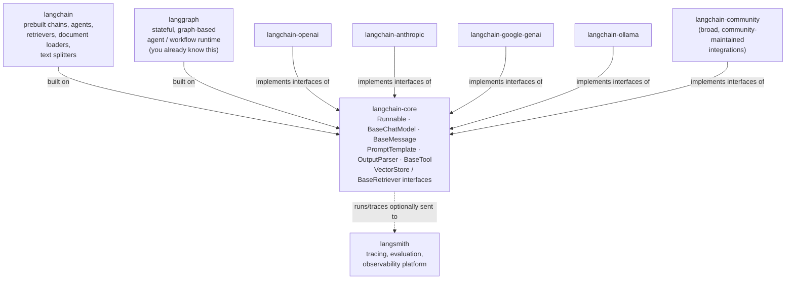

# Chapter 1: Introduction & Prerequisites

> "Program to an interface, not an implementation." — Gang of Four, *Design Patterns* (1994)

## Learning Objectives

By the end of this chapter, you will be able to:

- Explain why `langchain-core` exists as a small, dependency-light package separate from the larger `langchain` framework
- Draw and explain the LangChain ecosystem map: `langchain-core`, `langchain`, `langgraph`, `langsmith`, and provider integration packages
- Articulate the core problem LangChain Core solves — standard interfaces that make swapping LLM providers a one-line change instead of a rewrite
- Recognize the Python and LLM-API prerequisite knowledge this course assumes, and identify any gaps before continuing
- Read and reason about a minimal prompt → model → parser chain built with LCEL (the LangChain Expression Language), even before formally learning `Runnable` in Chapter 3
- Recall why "provider independence" matters commercially, not just architecturally, using a concrete team scenario

---

## Prerequisites for This Chapter

None beyond the course prerequisites listed in the index. Since this is the first chapter, here's a brief restatement of what the rest of this 22-chapter course assumes you already have, so you can calibrate before going further:

- **Python fluency**: comfortable reading and writing classes, decorators, generators, type hints, and `async`/`await` code without them needing to be re-explained.
- **Direct LLM API experience**: you've called a chat completions endpoint yourself — you know what a `messages` array with `role`/`content` fields looks like, you've handled streaming responses, and you understand tokens, temperature, and system prompts at a working level.
- **Basic FastAPI familiarity**: you can stand up a route, a Pydantic request/response model, and an async endpoint without a tutorial.
- **LangGraph and MCP awareness**: this course assumes you already know what LangGraph's graph/state/node model does and what MCP (Model Context Protocol) is for. LangChain Core is the layer *underneath* both of those — this course exists precisely because knowing LangGraph does not mean you know LangChain Core.

If any of the Python or raw-LLM-API points above feel shaky, it's worth firming those up before Chapter 2 — this course will not re-teach them. Section 2 below expands on exactly why each of these matters and gives a quick calibration check for each one.

---

## 1. Why LangChain Core Exists as a Separate Package

### 1.1 The historical problem

In LangChain's early versions, everything lived in one package called `langchain`: prompt templates, chat model wrappers, document loaders, text splitters, vector store clients, agent executors, memory classes — all of it, with all of their combined dependencies, installed together whether you used them or not. Installing `langchain` could pull in HTTP clients for a dozen vector databases you'd never touch, PDF parsing libraries, and provider SDKs for LLMs you had no intention of calling.

This created two compounding problems for anyone building production software:

1. **Dependency bloat and fragility.** A bug fix in an Anthropic integration could force a version bump that broke your Pinecone client, because they all shipped from the same package with the same release cadence. Your `pip install langchain` pulled in the transitive dependencies of *every* integration LangChain had ever added, not just the ones you needed.
2. **No stable foundation.** The actual abstractions that made LangChain useful — "a chat model takes messages and returns a message," "a prompt template takes variables and returns a formatted prompt," "an output parser takes raw model output and returns a structured value" — were entangled with fast-moving, frequently-changing higher-level chain and agent code. A stable interface layer had no separate existence; it changed as often as the experimental chain-building code around it.

### 1.2 The split

LangChain's maintainers addressed this by splitting the single package into layers, with `langchain-core` at the bottom as the **foundation**:

- **`langchain-core`** ships only the interfaces, base classes, and the LCEL runtime (the `Runnable` protocol and the `|` pipe operator you'll use constantly from Chapter 3 onward). It has a handful of small, stable dependencies — Pydantic, PyYAML, `tenacity` for retries, `jsonpatch` for streaming diffs — and deliberately **no** HTTP client, **no** provider SDK, and **no** vector database driver bundled in.
- **`langchain`** depends on `langchain-core` and adds higher-level, opinionated implementations built on top of those interfaces: prebuilt retrieval chains, agents, document loaders, text splitters, and other convenience code that changes far more often as best practices evolve.
- **Provider integration packages** (`langchain-openai`, `langchain-anthropic`, and similar) each depend on `langchain-core` and *implement* its interfaces for one specific provider, pulling in only that provider's SDK as a dependency.

The result: installing `langchain-core` alone is cheap and stable. You add exactly the integration packages you need, and nothing more. If you only ever call OpenAI, you never install Anthropic's SDK transitively — and vice versa.

### 1.3 "LangChain Core" vs. "LangChain" — the distinction that matters for this course

This distinction is the single most important thing to internalize before Chapter 2, because the rest of this course is scoped entirely to the "Core" layer:

| | `langchain-core` | `langchain` |
|---|---|---|
| **What it is** | The interface/abstraction layer: `Runnable`, `BaseChatModel`, `BaseMessage` and subclasses, prompt templates, output parsers, `BaseTool`, `VectorStore`/`BaseRetriever` interfaces, callbacks | A framework of prebuilt implementations built on top of those interfaces: ready-made retrieval chains, agents, document loaders, text splitters, memory |
| **How often it changes** | Slowly and carefully — it's a foundation other packages depend on | Faster — reflects evolving best practices and new patterns |
| **Dependency footprint** | Minimal (no provider SDKs) | Larger, pulls in whatever chain/agent code you use |
| **What you're learning in this course** | This — everything from Chapter 2 through Chapter 22 | Out of scope, except where explicitly contrasted for context |

A useful mental shortcut: **`langchain-core` is a set of contracts. `langchain` is one particular (very popular) set of programs written against those contracts.** LangGraph, which you already know, is *another* program written against those same contracts — a `CompiledGraph` in LangGraph is itself a `Runnable`, the exact same interface a plain LCEL chain implements. That's not a coincidence; it's the entire point of having a shared core.

---

## 2. What This Course Assumes You Already Know (Prerequisites in Detail)

Before diving into the ecosystem map, it's worth being explicit about the baseline this course is calibrated against, since every later chapter builds on it without re-explaining it.

### 2.1 Python fluency

You should be unsurprised by code like this — it will appear routinely from Chapter 3 onward without commentary:

```python
from typing import AsyncIterator
from functools import wraps

def logged(fn):
    @wraps(fn)
    async def wrapper(*args, **kwargs):
        print(f"calling {fn.__name__}")
        return await fn(*args, **kwargs)
    return wrapper

@logged
async def stream_tokens(prompt: str) -> AsyncIterator[str]:
    for word in prompt.split():
        yield word
```

If decorators (`@logged`), `async`/`await`, async generators (`yield` inside an `async def`), and type hints (`AsyncIterator[str]`) all read naturally, you're calibrated correctly. LangChain Core leans on all four constantly: `Runnable.stream()`/`Runnable.astream()` are generators under the hood, tool definitions frequently use decorators (`@tool`), and nearly every interface has both a sync and an async variant.

### 2.2 Direct LLM API experience

You should already be comfortable with the shape of a raw chat completions call — something like this, made directly against a provider SDK, no framework involved:

```python
from openai import OpenAI

client = OpenAI()
response = client.chat.completions.create(
    model="gpt-4o-mini",
    messages=[
        {"role": "system", "content": "You are terse."},
        {"role": "user", "content": "What is 2+2?"},
    ],
    stream=False,
)
print(response.choices[0].message.content)
```

Specifically, you should already know: what the `role`/`content` message structure means, why `system` differs from `user` and `assistant`, what streaming responses look like at the wire level, and roughly how tokens, context windows, and temperature affect behavior. Chapter 2 builds LangChain Core's message types (`HumanMessage`, `AIMessage`, `SystemMessage`) directly on top of this mental model — if the snippet above needs unpacking, pause here first.

### 2.3 Basic FastAPI familiarity

You don't need FastAPI expertise, but you should be unsurprised by:

```python
from fastapi import FastAPI
from pydantic import BaseModel

app = FastAPI()

class ChatRequest(BaseModel):
    question: str

@app.post("/chat")
async def chat(req: ChatRequest) -> dict:
    return {"answer": f"You asked: {req.question}"}
```

This matters because later chapters (particularly the production-deployment chapters near the end of this course) wire LCEL chains directly into FastAPI routes, using `Runnable.ainvoke()` inside an `async def` endpoint and `Runnable.astream()` for server-sent-event streaming responses. If Pydantic models and async routes are unfamiliar, that's worth shoring up before Chapter 18 onward, though it won't block Chapters 1–10.

### 2.4 What you do *not* need yet

You do **not** need prior exposure to `langchain-core` itself, prior exposure to `langchain` (the framework), or any vector database experience — those are exactly what this course teaches, starting from zero. Your LangGraph and MCP knowledge is context, not a strict prerequisite for this chapter, but it will make Chapter 3's `Runnable` interface feel immediately familiar, since `CompiledGraph` implements it too.

---

## 3. The LangChain Ecosystem Map

With the Core/framework distinction from Section 1 in hand, here's the full picture of how the pieces relate.



### 3.1 Reading the map

- **`langchain-core`** sits at the center because everything else either *depends on* it (implements its base classes) or *observes* it (traces what runs through it). Nothing in this diagram is a dependency of `langchain-core` — the arrows all point inward or outward from it, never through it sideways. That one-directional dependency graph is what keeps the foundation stable while everything built on it can move fast.
- **`langchain`** is the "batteries included" framework: retrieval-augmented generation chains, agent executors, memory abstractions, and dozens of document loaders and text splitters, all written against `langchain-core`'s interfaces.
- **`langgraph`**, which you already have working knowledge of, is a workflow/orchestration runtime for stateful, cyclic, multi-step agent behavior — nodes, edges, persisted state, human-in-the-loop interrupts. It is built on `langchain-core`, and a compiled LangGraph graph is itself a `Runnable`, meaning it can be composed inside an LCEL chain (or vice versa) — a point this course returns to explicitly in later chapters on composition.
- **`langsmith`** is the observability and evaluation platform (SDK plus a hosted or self-hosted backend): traces of every step a `Runnable` executes, latency and token-usage breakdowns, dataset-based evaluation, and prompt versioning. It plugs in via `langchain-core`'s callback system rather than being a hard dependency — you can use `langchain-core` fully without ever touching LangSmith, and add it later with an API key and an environment variable, not a code rewrite.
- **Provider integration packages** (`langchain-openai`, `langchain-anthropic`, `langchain-google-genai`, `langchain-ollama`, and many more) are thin adapters: each one implements `langchain-core`'s `BaseChatModel` (and, where relevant, embedding and other interfaces) for one specific provider's API, translating that provider's request/response shapes into the shared `BaseMessage`/`AIMessage` types. `langchain-community` is a broader, less tightly curated grab-bag of integrations (older or lower-traffic providers, niche tools) maintained with looser guarantees than the officially blessed provider packages.

### 3.2 Why this layering is the whole point

Notice what the diagram implies: `langchain-openai` and `langchain-anthropic` share no dependency on each other. They are two independent implementations of the *same contract* defined once, in `langchain-core`. Your application code — the prompt templates, the chain composition, the output parsing — talks only to that shared contract. It has no idea, and no need to know, which provider is actually running underneath. That property is the subject of Section 4.

---

## 4. The Core Problem: Provider Independence via Standard Interfaces

### 4.1 The problem, stated plainly

If you write application code directly against a specific provider's SDK — say, `openai`'s `client.chat.completions.create(...)` — every part of your codebase that constructs messages, reads responses, or handles streaming is now shaped around that one SDK's conventions. Anthropic's SDK has a different response shape (`message.content` is a list of content blocks, not a single string). Google's Gemini SDK differs again. Ollama's local server has its own client conventions. None of these are wrong — they're just *different*, because each provider designed its SDK independently, with no obligation to match anyone else's.

The consequence: switching providers, or even running the same logic against two providers to compare cost and quality, means touching every call site that constructed a request or parsed a response. What should be a business decision ("this model is 60% cheaper and good enough for this task") becomes an engineering project.

### 4.2 The formal fix: a standard interface

`langchain-core` defines `BaseChatModel` as an abstract contract: something that accepts a list of `BaseMessage` objects (or a formatted prompt) and returns an `AIMessage`, with standard methods for synchronous, asynchronous, batched, and streaming invocation. `ChatOpenAI`, `ChatAnthropic`, `ChatGoogleGenerativeAI`, and `ChatOllama` are four *different implementations* of that *one interface* — each living in its own integration package, each translating the shared message types into whatever wire format its provider actually expects, and translating the provider's response back into the shared `AIMessage` type.

Because your application code is written against `BaseChatModel`, not against any one provider's SDK, this becomes possible:

```python
from langchain_openai import ChatOpenAI
# from langchain_anthropic import ChatAnthropic
# from langchain_ollama import ChatOllama

# model = ChatAnthropic(model="claude-sonnet-4-5")
# model = ChatOllama(model="llama3.1")
model = ChatOpenAI(model="gpt-4o-mini")

response = model.invoke("Explain provider independence in one sentence.")
print(response.content)
```

Only the constructor line changes. `response` is an `AIMessage` in every case; `.content` behaves the same way; `.invoke()`, `.stream()`, `.batch()`, `.ainvoke()` all exist on every implementation because they all satisfy the same `BaseChatModel` contract. This is what "provider independence" means in concrete terms — not a marketing phrase, but a specific, checkable property: *swap the class, keep everything downstream unchanged.*

### 4.3 Where the abstraction has limits (a fair caveat)

It's worth being honest about this early rather than letting you discover it the hard way in Chapter 9 or 14: the standard interface covers the *shape* of the interaction (messages in, message out; tool-calling; streaming), but it cannot fully hide differences in *model behavior and capability*. Not every model supports every feature identically — structured output, parallel tool calls, and vision inputs vary by provider and even by model version. Swapping the class is genuinely a one-line change to *make the code run*; getting equivalent *quality* out of the new model may still require prompt or parameter tuning. LangChain Core solves the integration-code rewrite problem; it does not, and cannot, solve the "different models behave differently" problem. Keep this distinction in mind — it will come up again when this course covers tool calling (Chapter 11) and structured output (Chapter 10).

---

## 5. A First Taste: Prompt → Model → Parser

You now have enough context to read a minimal, complete LCEL chain — the pattern you'll build dozens of variations of starting in Chapter 3. This section explains it at a conceptual level only; the `Runnable` interface and the `|` operator get a full formal treatment in Chapter 3, and prompt templates and output parsers get their own dedicated chapters (4 and 7).

```python
from langchain_core.prompts import ChatPromptTemplate
from langchain_core.output_parsers import StrOutputParser
from langchain_openai import ChatOpenAI

# 1. A prompt template: takes named variables, produces a formatted
#    list of messages (a system message plus a filled-in human message).
prompt = ChatPromptTemplate.from_messages([
    ("system", "You are a concise assistant. Answer in one sentence."),
    ("human", "{question}"),
])

# 2. A chat model: implements BaseChatModel. Takes messages, returns
#    an AIMessage. Swappable for ChatAnthropic/ChatOllama/etc. (Section 4).
model = ChatOpenAI(model="gpt-4o-mini")

# 3. An output parser: takes the raw AIMessage and extracts something
#    simpler — here, just the plain text string.
parser = StrOutputParser()

# The `|` operator composes these three Runnables into one pipeline.
chain = prompt | model | parser

result = chain.invoke({"question": "What is LangChain Core, in one sentence?"})
print(result)
```

### 5.1 Walking through it by hand

Trace what happens when `chain.invoke({"question": "..."})` runs, one stage at a time:

1. **`prompt`** receives the dictionary `{"question": "What is LangChain Core, in one sentence?"}`, substitutes it into the `"{question}"` placeholder, and produces a formatted list of messages: a `SystemMessage` and a `HumanMessage`.
2. **`model`** receives that list of messages as its input (this is exactly what `BaseChatModel.invoke()` expects), sends the corresponding request to OpenAI's API under the hood, and returns an `AIMessage` object wrapping the model's reply.
3. **`parser`** receives that `AIMessage`, and `StrOutputParser` does exactly one thing: it pulls out `.content` and returns the plain string.

The output of stage 1 becomes the input to stage 2; the output of stage 2 becomes the input to stage 3. That's the entire mechanical meaning of the `|` operator here — it's building a pipeline where each stage's output type matches the next stage's expected input type. Nothing about `chain.invoke(...)` is magic: it is calling `prompt.invoke(...)`, feeding that result into `model.invoke(...)`, and feeding *that* result into `parser.invoke(...)`, in sequence. Chapter 3 formalizes this as the `Runnable` protocol and shows why every stage — not just this chain as a whole — exposes the identical `.invoke()`/`.batch()`/`.stream()`/`.ainvoke()` family of methods.

### 5.2 Why this is worth seeing before Chapter 3

Two things about this snippet are worth flagging now, precisely because they'll otherwise look like unexplained magic later:

- Every one of `prompt`, `model`, `parser`, and `chain` supports the *same* set of methods (`invoke`, `batch`, `stream`, and their `a`-prefixed async equivalents). That uniformity — not any single method — is what LCEL is actually selling.
- Nothing about `prompt` or `parser` mentions OpenAI. Only `model`'s constructor does. This is Section 4's provider-independence property, made concrete: replace `ChatOpenAI(model="gpt-4o-mini")` with `ChatAnthropic(model="claude-sonnet-4-5")`, and lines 1–3 of the walkthrough above are completely unaffected.

---

## 6. Where This Course Goes From Here

A brief map so you know what to expect over the next 21 chapters, without front-loading detail that belongs in later chapters:

- **Chapters 2–5** build the vocabulary: messages, prompt templates, the `Runnable`/LCEL composition model in full, and chat model configuration.
- **Chapters 6–9** cover output parsing, structured output, tool calling, and retrievers/vector store interfaces — the building blocks for RAG- and agent-style chains built purely with LangChain Core (no LangGraph yet).
- **Chapters 10–15** go deeper on production concerns: streaming, batching, callbacks and tracing (LangSmith), error handling, retries/fallbacks, and testing chains.
- **Chapters 16–22** cover composition at scale, integration with FastAPI and LangGraph, deployment, and patterns for maintaining large LCEL codebases.

Every chapter from here on assumes you've read the ones before it; this course is written to be read in order, not sampled.

---

## 7. Real-World Scenario

**Scenario:** A five-person applied-AI team at a mid-size SaaS company built their first production chatbot 18 months ago, directly against the `openai` Python SDK. Prompt construction, message history management, streaming response handling, and function-calling logic are all written by hand around `openai`'s specific request/response shapes, scattered across roughly 30 call sites in the codebase — some in the FastAPI backend, some in a background-job worker, some in an internal admin tool.

The team now wants to A/B test a cheaper model — a self-hosted open-weight model served through Ollama — against GPT-4o-mini for a subset of traffic, to see if quality holds up at a fraction of the cost. They estimate the work at two to three weeks: every one of those 30 call sites constructs an `openai`-shaped request and parses an `openai`-shaped response; none of that code has any concept of "a different provider." Streaming logic, retry logic, and function-calling parsing were all written once, coupled tightly to `openai`'s SDK conventions, and never touched since. The A/B test — meant to be a two-day experiment — instead requires a multi-week refactor to even become *possible*, and the team quietly shelves the idea rather than justify the engineering cost for what might turn out to be a "no."

**What LangChain Core would have changed:** had the original chatbot been built against `BaseChatModel` (via `langchain-openai`'s `ChatOpenAI`) instead of the raw `openai` SDK, every one of those 30 call sites would be working with the same `HumanMessage`/`AIMessage` types and the same `.invoke()`/`.stream()` methods regardless of provider. Running the A/B test would mean instantiating a second model object — `ChatOllama(model="llama3.1")` — and routing a percentage of requests to it, with zero changes to prompt construction, streaming handling, or downstream parsing anywhere else in the codebase. The two- or three-week refactor collapses to a configuration change: which model object a given request is routed to.

**Lesson:** the cost of *not* having a standard interface is invisible until the day you need to change providers — and by then, it's been silently compounding for 18 months across every call site that never had to know it was coupled to one vendor's SDK. LangChain Core's value isn't that it lets you use OpenAI (you could always do that directly) — it's that it keeps the door open to *not* being stuck with that one decision forever.

---

## 8. Best Practices

- **Install only what you use.** Add `langchain-core` plus the specific provider packages your project needs (`langchain-openai`, `langchain-anthropic`, etc.) rather than reaching for the full `langchain` package out of habit — keep your dependency footprint matched to your actual usage.
- **Write application code against the base interfaces**, not against a specific provider's return types. Treat `response.content` (available on every `BaseChatModel`'s output) as your contract, not provider-specific fields that only exist on one implementation.
- **Keep model instantiation in one place** (a config module, a factory function, a dependency-injection point in FastAPI) so that swapping providers really is a one-line change in practice, not just in theory.
- **Distinguish "Core" concerns from "framework" concerns early.** If you find yourself reaching for a prebuilt chain or agent from the `langchain` package, know that you're stepping outside what this course covers — that's fine, but recognize the boundary you're crossing.
- **Treat LangSmith as optional and additive.** Because it plugs in via callbacks rather than being a hard dependency, you can build and ship without it, and add tracing later purely through configuration (an API key and an environment variable) without touching chain code.
- **Read provider integration package docs for capability gaps.** Before assuming two models are drop-in equivalents, check whether both support the specific feature you rely on (structured output, parallel tool calls, vision) — the standard interface guarantees a consistent *shape*, not identical *capability*.

---

## 9. Common Mistakes

- **Confusing `langchain-core` with `langchain`.** Assuming that a class or feature from the higher-level `langchain` framework (a prebuilt agent, a specific document loader) is part of Core, and being surprised when it isn't available with just `langchain-core` installed.
- **Coupling application code to provider-specific response shapes** even while nominally using LangChain — for example, manually inspecting a provider's raw SDK response object instead of the shared `AIMessage`/`.content` interface, which quietly reintroduces the exact lock-in this layer exists to prevent.
- **Assuming "swap the provider" means "swap and get identical output."** The interface guarantees the code runs; it does not guarantee the new model performs equivalently on your task — always validate quality after a provider swap, not just that it executes without errors.
- **Installing `langchain` (the full framework) when only `langchain-core` plus one integration package was actually needed**, inflating dependency size and update surface for no functional benefit.
- **Treating LangGraph and LangChain Core as competing tools** rather than layered ones — LangGraph is built on top of Core's `Runnable` interface, not a replacement for it; a `CompiledGraph` and an LCEL chain can compose with each other.
- **Skipping the message-model prerequisite** (Section 2.2) and trying to learn `HumanMessage`/`AIMessage` from Chapter 2 without having ever seen a raw provider `role`/`content` payload — the abstraction is much easier to appreciate once you've felt the problem it solves firsthand.

---

## Summary

- **`langchain-core`** is a small, dependency-light package containing only interfaces and abstractions — `Runnable`, `BaseChatModel`, `BaseMessage`, prompt templates, output parsers, tools, and retriever/vector-store interfaces — deliberately separated from the larger, faster-moving `langchain` framework of prebuilt chains and agents.
- The **ecosystem** consists of `langchain-core` at the center, `langchain` and `langgraph` built on top of it as two different "programs" written against its contracts, `langsmith` observing it via callbacks for tracing and evaluation, and a family of provider integration packages (`langchain-openai`, `langchain-anthropic`, `langchain-google-genai`, `langchain-ollama`, `langchain-community`) each implementing its interfaces for one specific LLM provider.
- The **core problem solved** is provider independence: because every chat model implementation satisfies the same `BaseChatModel` contract and speaks the same `HumanMessage`/`AIMessage` types, switching providers is a change to one constructor call, not a rewrite of every call site — though model *capability* differences still require validation after a swap.
- This course assumes **Python fluency** (classes, decorators, generators, type hints, async/await), **direct LLM API experience** (messages, roles, streaming), and **basic FastAPI familiarity** — no prior `langchain-core` or `langchain` knowledge is assumed.
- A minimal LCEL chain — **`prompt | model | parser`** — composes a prompt template, a chat model, and an output parser into a single pipeline where each stage's output becomes the next stage's input; every stage shares the same `invoke`/`batch`/`stream` method family, a property formalized in Chapter 3.

---

## Knowledge Check

1. In your own words, explain why `langchain-core` ships without any provider SDK as a dependency, while `langchain-openai` does. What problem does this split solve that a single combined package could not?
2. A colleague says "LangGraph replaces LangChain Core." Using what you now know about the ecosystem map, explain why that statement is inaccurate.
3. Walk through what happens, stage by stage, when `.invoke()` is called on a chain built as `prompt | model | parser`. What does each stage receive as input, and what does it hand off as output?
4. Suppose your team swaps `ChatOpenAI` for `ChatAnthropic` in a chain built entirely against `langchain-core` interfaces. List what changes in the code, and separately list what is *not* guaranteed to stay the same just because the code still runs.
5. Where does LangSmith fit into the ecosystem map, and why is it described as "additive" rather than a hard dependency of `langchain-core`?
6. Revisit the Real-World Scenario in Section 7. If the original chatbot team's code had been written against `BaseChatModel` from day one, estimate — in your own words — how the two-to-three-week refactor estimate would have changed, and why.

---

## Hands-On Exercise

You will not run any code for this exercise — the goal is to reason through the design, not execute it (later chapters, starting with Chapter 3, will have you actually run chains).

1. On paper (or in a scratch file), sketch the ecosystem map from Section 3 from memory, without looking back at the diagram. Label each package with its one-sentence role.
2. Take the "hello world" chain from Section 5 and rewrite it, on paper, to swap `ChatOpenAI` for a hypothetical `ChatAnthropic` call. Write out, line by line, exactly which lines change and which stay identical.
3. Write a short paragraph (5–8 sentences) describing a real or plausible scenario from your own work — similar to Section 7 — where being coupled to one LLM provider's SDK would slow down or block a decision your team wanted to make. Be specific about which call sites or files would need to change.
4. List, from memory, the three prerequisite areas this course assumes (Section 2) and rate your own confidence in each from 1–5. For anything below a 4, note one concrete thing you'd want to review before Chapter 2.

---

## Further Reading

- [LangChain Core API Reference](https://reference.langchain.com/python/langchain-core) — the authoritative reference for every class and interface introduced conceptually in this chapter
- [LangChain Philosophy](https://docs.langchain.com/oss/python/langchain/philosophy) — the maintainers' own explanation of the design principles behind the Core/framework split and the standard-interface approach

---

<div style="display:flex;justify-content:space-between;align-items:center;">
  <span></span>
  <a href="./00-index.md">🏠 Index</a>
  <a href="./02-core-concepts-messages.md">Next: Core Concepts: Messages →</a>
</div>
