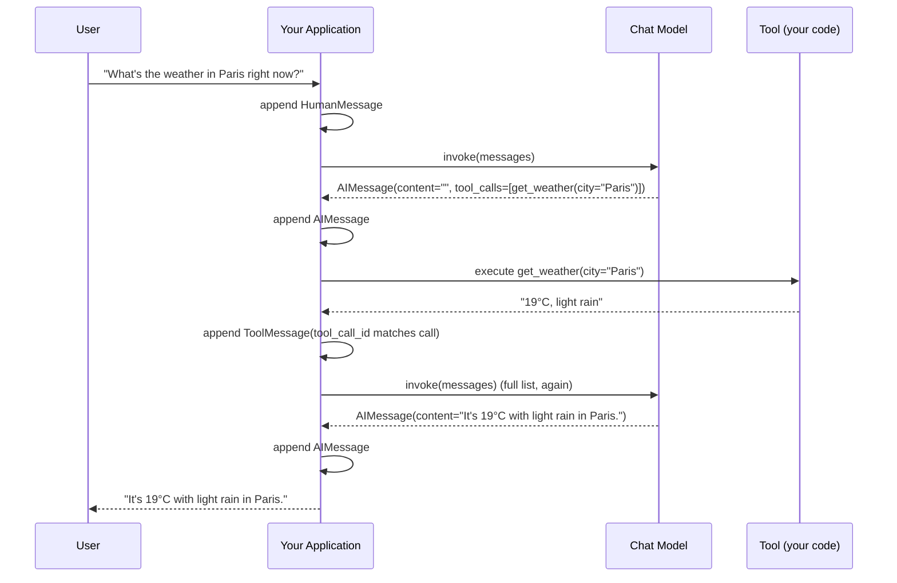

# Chapter 2: Core Concepts — Messages

> "The message is the unit of conversation. Get the unit wrong, and everything built on top of it — memory, agents, tools, streaming — inherits the mess." — a lesson every LangChain user learns the hard way, usually around 2 a.m. while debugging a malformed payload.

## Learning Objectives

By the end of this chapter, you will be able to:

- Explain why LangChain represents conversations as typed message objects instead of raw provider JSON/dicts, and what that buys you in a multi-provider codebase
- Identify the four message types you'll use constantly — `SystemMessage`, `HumanMessage`, `AIMessage`, `ToolMessage` — and state exactly when each one appears in a conversation
- Read and construct an `AIMessage`, distinguishing `.content`, `.tool_calls`, and `.additional_kwargs`
- Correctly wire a tool call → tool result round trip using `ToolMessage` and `tool_call_id`
- Recognize `FunctionMessage` as a deprecated, pre-tool-calling mechanism and explain why `ToolMessage` replaced it
- Hand-trace how a message list grows, turn by turn, across a multi-turn conversation — including one that involves a tool call
- Build a minimal, provider-agnostic chat loop using nothing but message objects and a chat model's `.invoke()` method

---

## Prerequisites for This Chapter

This chapter builds directly on **[Chapter 1: Introduction & Prerequisites](./01-introduction-and-prerequisites.md)**, where you learned:

- Why LangChain Core exists as a thin, standardized abstraction layer over dozens of LLM providers, rather than you hand-rolling provider-specific request/response handling
- The overall shape of this course: Core primitives first (messages, chat models, prompts, output parsers), then composition (LCEL), then production concerns (streaming, retries, observability)
- That you already know LLMs, FastAPI, MCP, and LangGraph — this course assumes that background and will not re-explain what an LLM or a tool call *is*, only how LangChain Core *represents* them

No new setup is required. This chapter is conceptual and works entirely with in-memory Python objects — there is no network call, API key, or installed provider package needed to follow along. Everything shown constructs and inspects `langchain_core.messages` objects directly.

---

## 1. Why Not Just Use Dicts?

### 1.1 The naive approach

If you've called a raw chat completion API before (OpenAI's, Anthropic's, or anything OpenAI-compatible), you already know the shape conversations take on the wire: a list of dicts, each with a `role` and `content`.

```python
messages = [
    {"role": "system", "content": "You are a helpful assistant."},
    {"role": "user", "content": "What's the weather in Bengaluru?"},
    {"role": "assistant", "content": None, "tool_calls": [
        {"id": "call_abc123", "type": "function",
         "function": {"name": "get_weather", "arguments": '{"city": "Bengaluru"}'}}
    ]},
    {"role": "tool", "tool_call_id": "call_abc123", "content": "28°C, partly cloudy"},
]
```

This works. It's also exactly why you shouldn't build on it directly. Every field name, nesting shape, and required key above is **OpenAI's specific wire format**. Anthropic's Messages API nests tool calls differently (as `content` blocks with `type: "tool_use"`, not a parallel `tool_calls` array). Google's Gemini API uses yet another shape. If your application code manipulates these dicts directly, it is silently coupled to one provider's schema — and swapping providers means rewriting every place that touches a message.

### 1.2 What a typed abstraction buys you

LangChain Core's answer is `BaseMessage` and its subclasses: real Python classes with typed attributes, not loosely-shaped dicts. This gives you three concrete things a dict cannot:

1. **Type safety and IDE support.** `AIMessage(content="hi").tool_calls` is a real attribute your editor can autocomplete and your type checker can verify exists. `msg["tool_calls"]` on a dict is a runtime gamble — it exists only if whoever built that dict remembered to include it, and a typo in the key (`"tool_call"` vs `"tool_calls"`) fails silently or with a confusing `KeyError` three layers deep in your call stack.

2. **Provider-agnostic serialization.** You construct one `HumanMessage("What's the weather?")` and pass it to a `ChatOpenAI`, `ChatAnthropic`, or `ChatGoogleGenerativeAI` instance interchangeably. Each chat model's internal adapter is responsible for translating the standardized `BaseMessage` list into that provider's exact wire format on the way out, and translating the provider's raw response back into a standardized `AIMessage` on the way in. Your application code never touches provider-specific JSON at all.

3. **A home for tool-call metadata that isn't just text.** A model's decision to call a tool is not "content" in the conversational sense — it's structured intent (which tool, with which arguments). Cramming that into a content string (as some early, pre-standardization integrations did) forces you to parse strings to recover structure you already had. `AIMessage.tool_calls` keeps that structure intact as a typed list of dicts from the moment the model responds.

### 1.3 The formal picture

Think of it as two layers with a translation boundary between them:

```
Your application code
        │
        │  works only with BaseMessage subclasses
        ▼
┌───────────────────────────────┐
│   LangChain Core Messages     │   SystemMessage, HumanMessage,
│   (standardized, typed)       │   AIMessage, ToolMessage
└───────────────────────────────┘
        │
        │  each chat model integration translates in both directions
        ▼
┌───────────────────────────────┐
│  Provider wire format         │   OpenAI JSON, Anthropic JSON,
│  (provider-specific dicts)    │   Gemini protobuf-ish JSON, ...
└───────────────────────────────┘
```

You live entirely above that boundary. The chapters ahead — Chat Models (Chapter 3), Prompt Templates (Chapter 4), and everything built with LCEL — all pass `BaseMessage` objects around. Get comfortable with this layer now, because it is the one piece of vocabulary that touches every other chapter in this course.

---

## 2. `BaseMessage`: The Common Parent

Every message type in LangChain Core inherits from `BaseMessage`, which standardizes a small set of attributes shared by all of them:

| Attribute | Type | Meaning |
|---|---|---|
| `content` | `str \| list[str \| dict]` | The main payload — plain text, or a list of content blocks for multimodal input (Section 8) |
| `additional_kwargs` | `dict` | A catch-all for provider-specific fields that don't map to a standardized attribute — the "escape hatch" (Section 5.3) |
| `response_metadata` | `dict` | Normalized metadata *about* the response — token usage, model name, finish reason, latency — populated on messages returned by a model, empty on messages you construct yourself |
| `type` | `str` | A fixed discriminator string per subclass — `"human"`, `"ai"`, `"system"`, `"tool"` — used internally for (de)serialization and pattern matching |
| `name` | `str \| None` | An optional identifier, useful for multi-agent setups where you need to know *which* participant a message came from beyond just its role |
| `id` | `str \| None` | An optional unique identifier for the message, useful for tracing, deduplication, or referencing a specific message in UI state |

You will almost never instantiate `BaseMessage` directly — it exists so that code which only needs to work generically ("iterate over a conversation and print each message's content") can do so without a chain of `isinstance` checks:

```python
from langchain_core.messages import BaseMessage

def render_conversation(messages: list[BaseMessage]) -> str:
    lines = []
    for m in messages:
        lines.append(f"[{m.type}] {m.content}")
    return "\n".join(lines)
```

That function works identically whether the list contains `HumanMessage`, `AIMessage`, `SystemMessage`, or `ToolMessage` objects — it only relies on the contract `BaseMessage` guarantees. This is the same "program to an interface, not an implementation" instinct you already apply with FastAPI's `Request`/`Response` base types or LangGraph's typed state — LangChain just applies it to the conversation itself.

---

## 3. `SystemMessage` — Steering the Model

A `SystemMessage` carries instructions *about how the model should behave*, not conversational content from a participant. It's the same concept as OpenAI's `"role": "system"` or Anthropic's separate `system` parameter — LangChain unifies both under one type regardless of how the underlying provider transmits it.

```python
from langchain_core.messages import SystemMessage

system_prompt = SystemMessage(
    content=(
        "You are a concise technical support agent for a SaaS product. "
        "Always ask a clarifying question before proposing a fix if the "
        "user's report is ambiguous."
    )
)
```

Two details worth internalizing:

- **Position matters, but LangChain doesn't enforce it.** By convention, a `SystemMessage` goes first in the list. LangChain won't stop you from putting one in the middle of a conversation, but most chat model integrations either ignore a misplaced one or hoist it to the top/into the provider's dedicated system slot — behavior that's provider-specific enough that you shouldn't rely on it. Put your system message first and be done with it.
- **It's not required.** A message list with no `SystemMessage` at all is perfectly valid — the model just falls back to its default behavior. You'll almost always want one in production, though, since it's your primary lever for tone, constraints, and role-setting before any prompt-templating machinery (Chapter 4) exists to help you.

---

## 4. `HumanMessage` — User Input

A `HumanMessage` represents a turn from the end user (or, in an agentic pipeline, from whatever upstream process is standing in for the user).

```python
from langchain_core.messages import HumanMessage

user_turn = HumanMessage(content="Can you summarize this support ticket?")
```

There's nothing exotic here — this is the simplest of the four core types. Its importance comes entirely from *position*: a `HumanMessage` is what triggers the model to produce a response. In the conversation-flow diagram later in this chapter, `HumanMessage` is always the input side of the arrow into the model.

One subtlety worth flagging now and expanding on in Section 8: `content` doesn't have to be a plain string. A `HumanMessage` can carry a list of content blocks — text plus an image, for instance — which is exactly how you send multimodal input to a vision-capable model through the same unified interface.

---

## 5. `AIMessage` — The Model's Response

`AIMessage` is the richest of the four types, because it's the one carrying everything the model can produce: text, a decision to call one or more tools, or both.

### 5.1 The plain case

```python
from langchain_core.messages import AIMessage

reply = AIMessage(content="Bengaluru is currently 28°C and partly cloudy.")
```

When a chat model integration (Chapter 3) invokes a provider and gets back a plain text answer, this is what it hands you — an `AIMessage` with `content` set to the model's text and everything else at its default (empty).

### 5.2 `.tool_calls` — when the model wants to act, not answer

When a model decides to call a tool instead of (or in addition to) answering in text, that decision lands in the `tool_calls` attribute — a list of dicts, each shaped like:

```python
{
    "name": "get_weather",
    "args": {"city": "Bengaluru"},
    "id": "call_abc123",
    "type": "tool_call",
}
```

```python
from langchain_core.messages import AIMessage

reply = AIMessage(
    content="",
    tool_calls=[
        {
            "name": "get_weather",
            "args": {"city": "Bengaluru"},
            "id": "call_abc123",
            "type": "tool_call",
        }
    ],
)

for call in reply.tool_calls:
    print(call["name"], call["args"])
# get_weather {'city': 'Bengaluru'}
```

Notice `content` is an empty string here. This is normal and important: many providers return no text at all when the model's entire response *is* a tool call — there's nothing conversational to say yet, only an action to take. Code that blindly does `print(ai_message.content)` after every model call will print nothing on a tool-call turn and needs to check `.tool_calls` too. This is one of the most common early bugs when building tool-using agents by hand (Section on Common Mistakes revisits this).

A model can also return **both** — some text *and* one or more tool calls in the same `AIMessage` — for providers that support "thinking out loud, then calling a tool." Always check `.tool_calls` regardless of whether `.content` is empty.

### 5.3 `.content` vs. `.additional_kwargs`

These two attributes are easy to confuse because both can hold "extra stuff the model said," but they serve different purposes:

- **`.content`** is the standardized, cross-provider payload — text (or content blocks). Every chat model integration guarantees this field is populated consistently regardless of which provider you're using.
- **`.additional_kwargs`** is a deliberate escape hatch: a dict holding whatever *provider-specific, non-standardized* fields came back in the raw response that don't have a first-class home elsewhere in `AIMessage`. Historically, before `tool_calls` was standardized across LangChain, OpenAI's legacy function-calling payload showed up here as `additional_kwargs["function_call"]`. Today you're more likely to see things like provider-specific reasoning traces, safety annotations, or beta-feature fields that haven't been promoted to a standardized attribute yet.

```python
reply = AIMessage(
    content="The answer is 42.",
    additional_kwargs={"some_provider_specific_field": "raw value from the API"},
)

print(reply.content)             # "The answer is 42."
print(reply.additional_kwargs)   # {'some_provider_specific_field': 'raw value from the API'}
```

**The practical rule:** write your application logic against `.content` and `.tool_calls` — the standardized attributes — and only reach into `.additional_kwargs` when you have a specific, documented reason tied to one provider. Code that depends on `.additional_kwargs` contents is no longer provider-agnostic, which defeats a core reason you adopted LangChain Core in the first place.

There's a sibling attribute, `.response_metadata` (inherited from `BaseMessage`, Section 2), which is where *normalized* response metadata lives — token counts, model name, finish reason. Don't confuse the two: `additional_kwargs` is "raw provider extras attached to the message content," `response_metadata` is "standardized facts about how the response was generated."

---

## 6. `ToolMessage` — Feeding Tool Results Back

Once your application code executes the tool the model asked for (Section 5.2), the result has to go back into the conversation so the model can use it. That's what `ToolMessage` is for.

```python
from langchain_core.messages import ToolMessage

tool_result = ToolMessage(
    content="28°C, partly cloudy",
    tool_call_id="call_abc123",
)
```

The one field that makes `ToolMessage` work correctly is **`tool_call_id`**, and it must match the `id` field from the specific tool call in the preceding `AIMessage.tool_calls` entry exactly. This is not cosmetic — it's how the model (and the provider's API, which validates this pairing) knows *which* of potentially several parallel tool calls this result answers. If a model requested three tool calls in one turn (common with modern function-calling APIs), you must send back three `ToolMessage` objects, each with the `tool_call_id` matching its corresponding call — get one wrong, and most providers will reject the request outright with a validation error, since an unmatched tool call is treated as a malformed conversation, not a soft warning.

`ToolMessage` also accepts an optional `name` (the tool's name, useful for logging/tracing) and an optional `artifact` field — a place to attach a rich, non-string payload (e.g., a DataFrame, an image, structured JSON) that's meant for your application code to consume directly, separate from the `content` string that actually gets sent back to the model as the tool's textual result.

```python
tool_result = ToolMessage(
    content="Found 3 matching rows.",     # what the model sees
    tool_call_id="call_abc123",
    name="query_database",
    artifact={"rows": [{"id": 1}, {"id": 2}, {"id": 3}]},  # what your app sees
)
```

This split matters in practice: the model only ever reads `content`, so it needs to be a concise, model-digestible string. `artifact` lets you carry the full structured result alongside it for your own downstream code (rendering a table in a UI, logging, etc.) without polluting what gets sent back into the LLM's context window.

---

## 7. `FunctionMessage` — Legacy, and Why It Was Superseded

Before OpenAI (and subsequently other providers) standardized *parallel* tool calls with a matching `tool_call_id`, there was an earlier, single-function mechanism called "function calling," and LangChain's original counterpart to today's `ToolMessage` was `FunctionMessage`:

```python
from langchain_core.messages import FunctionMessage

# Legacy — you will see this in older codebases and tutorials, but should not
# write new code against it.
legacy_result = FunctionMessage(content="28°C, partly cloudy", name="get_weather")
```

`FunctionMessage` identifies which function produced a result purely by **`name`** — there is no call-id concept, because the original API it modeled could only request *one* function call per model turn. That design breaks down the moment a provider supports the model requesting several tool calls in a single response (routine today): with only a `name` to go on, there's no reliable way to say which of several concurrent calls to the *same* tool a given result belongs to.

`ToolMessage` fixes exactly this by keying results to `tool_call_id` instead of `name`, which uniquely identifies one specific call even when a model calls the same tool multiple times in one turn. Every modern chat model integration in LangChain (Chapter 3) produces `AIMessage.tool_calls`, not the old function-call shape, and expects `ToolMessage` replies, not `FunctionMessage`. Treat `FunctionMessage` as read-only historical knowledge for recognizing it in older code — do not use it in anything you write in this course or in production going forward.

---

## 8. Multimodal Content: Text and Image Blocks

So far every `content` example has been a plain string. `content` can also be a **list of content blocks**, which is how you attach non-text input (most commonly images, but also audio or file references depending on the provider) to a message while keeping the same `HumanMessage`/`AIMessage` types.

```python
from langchain_core.messages import HumanMessage

multimodal_input = HumanMessage(
    content=[
        {"type": "text", "text": "What's unusual about this chart?"},
        {
            "type": "image_url",
            "image_url": {"url": "https://example.com/quarterly-revenue.png"},
        },
    ]
)
```

Each block is a small dict with a `"type"` discriminator (`"text"`, `"image_url"`, and others depending on provider capability) plus type-specific fields. The chat model integration for whichever vision-capable provider you're using (GPT-4o-class models, Claude's vision-capable models, Gemini, etc.) translates this standardized block list into that provider's specific multimodal payload shape.

Two things to keep in mind at this stage of the course (multimodal handling gets a full treatment in a later chapter):

- **Not every model supports every block type.** A text-only model will either error or silently ignore an `image_url` block — check the chat model's documented capabilities before assuming multimodal input works.
- **`content` as a string is really just shorthand** for the common case of a single text block. `HumanMessage(content="hi")` and `HumanMessage(content=[{"type": "text", "text": "hi"}])` are conceptually equivalent; LangChain lets you use the plain string form because it's the overwhelming majority case and typing out a one-element list every time would be needless ceremony.

---

## 9. The Conversation Flow: A Growing List of Messages

Here is the entire mental model for how LangChain represents a conversation, distilled to one sentence:

> **A conversation is a `list[BaseMessage]`, and each turn appends to that list.**

There is no hidden conversation-state object, no session abstraction at the Core level — just a Python list you own and grow. The basic single-turn cycle:

```
User types something
        │
        ▼
  HumanMessage(content="...")   ──┐
                                  │  appended to the list
        ▼                        │
   [SystemMessage, HumanMessage] │
        │                        │
        ▼                        │
     chat_model.invoke(messages) │
        │                        │
        ▼                        │
  AIMessage(content="...")   ─────┘
        │
        ▼
  append to the list → ready for the next turn
```

Multi-turn conversation is nothing more than repeating this: append the new `HumanMessage`, call the model with the *entire* list so far (not just the latest message — the model has no memory of its own; the list *is* the memory), append the resulting `AIMessage`, repeat.

```python
from langchain_core.messages import SystemMessage, HumanMessage, AIMessage

conversation: list = [
    SystemMessage(content="You are a terse assistant. Answer in one sentence."),
]

conversation.append(HumanMessage(content="What is the capital of Japan?"))
# ... call the model, get back an AIMessage ...
conversation.append(AIMessage(content="The capital of Japan is Tokyo."))

conversation.append(HumanMessage(content="What's its population?"))
# The model sees the ENTIRE list above when answering this — that's how it
# knows "its" refers to Tokyo.
```

This is the same trick every stateful chat product relies on, whether or not it's built with LangChain: the "memory" is not the model remembering anything between calls (chat completion APIs are stateless per request) — it's your code re-sending the full transcript every time. LangChain's contribution here is making that transcript a list of well-typed objects instead of a list of raw dicts, so every other piece of the stack (prompt templates in Chapter 4, memory/checkpointing in later chapters, LCEL chains) can consume and produce that list with a shared, predictable shape.

---

## 10. Worked Example: Hand-Tracing a 3-Turn Conversation

Let's trace a realistic conversation step by step, showing the *exact* message list at each point in time. The scenario: a user asks a general question, then asks a follow-up that requires a tool call, then asks one more follow-up. This exercise is worth doing slowly — being able to picture the list at any point is the single most useful skill this chapter can give you, since debugging a broken agent almost always starts with "what did the message list actually look like right before this went wrong?"

**Setup — turn 0, before any user input:**

```python
messages = [
    SystemMessage(content="You are a helpful assistant with access to a get_weather tool."),
]
```

**Turn 1 — user asks a plain question:**

```python
messages.append(HumanMessage(content="What's the capital of France?"))
```

List so far:

```
[0] SystemMessage: "You are a helpful assistant with access to a get_weather tool."
[1] HumanMessage:  "What's the capital of France?"
```

The model is invoked with this two-message list. It has no reason to call a tool — this is general knowledge — so it answers directly:

```python
messages.append(AIMessage(content="The capital of France is Paris."))
```

List after turn 1:

```
[0] SystemMessage: "You are a helpful assistant with access to a get_weather tool."
[1] HumanMessage:  "What's the capital of France?"
[2] AIMessage:      "The capital of France is Paris."
```

**Turn 2 — user asks something requiring the tool:**

```python
messages.append(HumanMessage(content="What's the weather like there right now?"))
```

List so far:

```
[0] SystemMessage: "You are a helpful assistant with access to a get_weather tool."
[1] HumanMessage:  "What's the capital of France?"
[2] AIMessage:      "The capital of France is Paris."
[3] HumanMessage:  "What's the weather like there right now?"
```

Note "there" only resolves to Paris *because* messages `[1]` and `[2]` are still in the list — this is exactly the memory-via-full-transcript mechanism from Section 9. The model, seeing it has a `get_weather` tool available (tool binding is covered properly in Chapter 3), decides to call it instead of answering in text:

```python
messages.append(
    AIMessage(
        content="",
        tool_calls=[
            {"name": "get_weather", "args": {"city": "Paris"},
             "id": "call_xyz789", "type": "tool_call"}
        ],
    )
)
```

List so far:

```
[0] SystemMessage: "You are a helpful assistant with access to a get_weather tool."
[1] HumanMessage:  "What's the capital of France?"
[2] AIMessage:      "The capital of France is Paris."
[3] HumanMessage:  "What's the weather like there right now?"
[4] AIMessage:      content="" tool_calls=[get_weather(city="Paris") id=call_xyz789]
```

Your application code (not the model) now actually executes `get_weather(city="Paris")`, gets back `"19°C, light rain"`, and reports the result using a `ToolMessage` whose `tool_call_id` matches `call_xyz789` exactly:

```python
messages.append(ToolMessage(content="19°C, light rain", tool_call_id="call_xyz789"))
```

List so far:

```
[0] SystemMessage: "You are a helpful assistant with access to a get_weather tool."
[1] HumanMessage:  "What's the capital of France?"
[2] AIMessage:      "The capital of France is Paris."
[3] HumanMessage:  "What's the weather like there right now?"
[4] AIMessage:      content="" tool_calls=[get_weather(city="Paris") id=call_xyz789]
[5] ToolMessage:    "19°C, light rain"  (tool_call_id=call_xyz789)
```

The model is invoked *again* with this now six-message list. This time it has both the original question and the tool's result available, so it produces a natural-language answer:

```python
messages.append(AIMessage(content="It's currently 19°C with light rain in Paris."))
```

List after turn 2:

```
[0] SystemMessage: "You are a helpful assistant with access to a get_weather tool."
[1] HumanMessage:  "What's the capital of France?"
[2] AIMessage:      "The capital of France is Paris."
[3] HumanMessage:  "What's the weather like there right now?"
[4] AIMessage:      content="" tool_calls=[get_weather(city="Paris") id=call_xyz789]
[5] ToolMessage:    "19°C, light rain"  (tool_call_id=call_xyz789)
[6] AIMessage:      "It's currently 19°C with light rain in Paris."
```

**Turn 3 — a simple follow-up, no tool needed:**

```python
messages.append(HumanMessage(content="Thanks! Is that warmer than yesterday?"))
```

The model sees all seven prior messages plus this new one. It has no way to know "yesterday's" temperature (nothing in the list mentions it, and the tool only reported "right now"), so a well-behaved model will say as much rather than guess:

```python
messages.append(
    AIMessage(content="I don't have yesterday's weather data to compare — "
                       "would you like me to look it up if there's a tool for that?")
)
```

Final list — nine messages, three user turns, every tool call correctly paired with its result:

```
[0] SystemMessage
[1] HumanMessage   "What's the capital of France?"
[2] AIMessage      "The capital of France is Paris."
[3] HumanMessage   "What's the weather like there right now?"
[4] AIMessage      tool_calls=[get_weather(city="Paris") id=call_xyz789]
[5] ToolMessage    "19°C, light rain"  (tool_call_id=call_xyz789)
[6] AIMessage      "It's currently 19°C with light rain in Paris."
[7] HumanMessage   "Thanks! Is that warmer than yesterday?"
[8] AIMessage      "I don't have yesterday's weather data..."
```

Notice this list is a complete, self-contained audit trail of the entire interaction — every decision the model made (including the tool call it chose to make) and every fact it was given (including the tool's result) is a distinct, typed entry. That property — a conversation as a serializable, replayable list of typed objects — is exactly what the Real-World Scenario below depends on.

---

## 11. Sequence Diagram: The Full Round Trip



Two calls to the model happen in this single user-visible turn: one that produces the tool call, and one that produces the final natural-language answer *after* seeing the tool's result. This two-call pattern (invoke → tool call → execute → invoke again with the result appended) is the foundation every tool-using agent is built on, whether hand-rolled with a `while` loop or orchestrated by a framework like LangGraph. LangChain Core gives you the typed vocabulary (`AIMessage.tool_calls`, `ToolMessage.tool_call_id`); it's up to your application loop (or an orchestration layer built on top) to actually drive the two invocations and the tool execution in between.

---

## Real-World Scenario

**Scenario:** You're building a customer-facing chat application. Product requires two things that seem unrelated at first but turn out to be the same underlying requirement: (1) conversation history must survive a server restart — users should be able to close their laptop and resume a conversation from exactly where they left off — and (2) the company wants the freedom to switch the underlying LLM provider (say, from an OpenAI model to an Anthropic model) for cost or quality reasons, without a rewrite, and ideally without users noticing anything except maybe a quality change.

**Why typed messages make this straightforward:** Because your conversation state is a `list[BaseMessage]` — plain Python objects with a small, stable set of attributes — persisting it is a serialization problem you solve exactly once:

```python
from langchain_core.messages import messages_to_dict, messages_from_dict

# Persist: turn the typed message list into plain dicts (JSON-serializable),
# and write that to your database/cache/file alongside a conversation ID.
serialized = messages_to_dict(messages)
# save_to_database(conversation_id, serialized)

# ... time passes, the server restarts, the user comes back ...

# Restore: rebuild the exact typed message list from the stored dicts.
# loaded = load_from_database(conversation_id)
restored_messages = messages_from_dict(serialized)
```

`restored_messages` is not "a list of dicts that looks like messages" — it's the real `HumanMessage`/`AIMessage`/`ToolMessage`/`SystemMessage` objects, indistinguishable from the ones you'd have built live during the original conversation. That's only possible because the message types carry their own `type` discriminator (Section 2) and a stable attribute set that the (de)serialization helpers know how to round-trip faithfully — a `.tool_calls` list survives the trip intact, not flattened into an ambiguous string.

Now the provider-swap requirement: because that restored list is expressed in LangChain's standardized types — not "OpenAI's chat completion format" — you can hand it to a `ChatOpenAI` instance today and a `ChatAnthropic` instance tomorrow, and each one's integration layer (Chapter 3) handles translating the standardized list into its own wire format. If your persisted history had instead been raw OpenAI-shaped dicts (`{"role": "assistant", "tool_calls": [...]}` in OpenAI's exact nested shape), replaying it against Anthropic's API would require you to hand-write a translation layer *and* keep it correct as both providers' formats evolve independently. With typed messages, that translation is a solved problem you get for free, once, from the framework — not a maintenance burden you own per provider, per format version.

The deeper lesson: portability isn't something you bolt on later. It's a direct consequence of choosing, from the very first message you construct, a representation that isn't tied to any one provider's wire format. That choice is exactly what this chapter has been about.

---

## Best Practices

- **Always start a conversation with a `SystemMessage`** in production applications — relying on a model's default behavior is rarely what your product actually wants, and an explicit system message is your cheapest, earliest lever for steering tone and constraints.
- **Check `.tool_calls` before assuming `.content` has your answer.** An `AIMessage` with an empty `content` string is not an error — it usually means the model chose to act instead of speak. Handle both cases.
- **Never fabricate a `tool_call_id`.** Always copy it verbatim from the `AIMessage.tool_calls` entry you're responding to. A mismatched or invented ID will cause most providers to reject the conversation outright, and the resulting error message rarely points back to the real cause.
- **Persist and pass around `list[BaseMessage]`, not custom dict shapes.** The moment you invent your own conversation-state schema "for simplicity," you lose the free provider-portability and the (de)serialization helpers this chapter's Real-World Scenario relies on.
- **Prefer the standardized attributes (`.content`, `.tool_calls`) over `.additional_kwargs`** in your application logic; reach into `additional_kwargs` only for a specific, documented, provider-specific need, and isolate that code so it's easy to find and remove later.
- **Treat `FunctionMessage` as read-only legacy knowledge.** If you see it in a tutorial or an older codebase, mentally translate it to "this predates standardized parallel tool calls" and write new code against `ToolMessage` instead.
- **Send the entire running message list on every model call, not just the newest message.** The model has no memory between calls; the list *is* the memory, and truncating it changes what the model can "remember" about the conversation.

---

## Common Mistakes

- **Assuming `.content` is always non-empty.** Code that does `if ai_message.content:` to decide "did the model answer?" will silently skip legitimate tool-call turns, since `content` is routinely `""` when the entire response is a tool call.
- **Mismatched or reused `tool_call_id` values across multiple tool calls in one turn.** When a model requests several tool calls in a single `AIMessage`, each needs its own `ToolMessage` reply with the exact matching ID — mixing them up (or replying to only one) produces a malformed conversation that most providers reject.
- **Reaching for `FunctionMessage` in new code** because an old tutorial or Stack Overflow answer used it — it doesn't support the parallel-tool-call reality of modern models and should not appear in code written today.
- **Building your own ad hoc dict-based message format** "just for this one project" instead of using `BaseMessage` subclasses from the start — this quietly reintroduces every problem Section 1 described, and it's far more expensive to migrate away from later than to avoid up front.
- **Depending on `.additional_kwargs` contents in core application logic.** It's an escape hatch for provider-specific extras, not a stable, standardized field — code that branches on its contents is implicitly single-provider code wearing a multi-provider framework's clothes.
- **Forgetting that a multi-turn conversation requires re-sending the full message list every time**, and instead sending only the latest `HumanMessage" — this produces a model that appears to have amnesia after the first turn, because from the model's perspective, that latest message *is* the entire conversation.
- **Confusing `response_metadata` with `additional_kwargs`.** The former is normalized, standardized metadata about how a response was generated (token counts, model name); the latter is raw, non-standardized provider extras. Treating them as interchangeable leads to code that breaks the moment you switch providers.

---

## Summary

- LangChain represents conversations as a `list` of typed `BaseMessage` objects rather than raw provider dicts, giving you type safety, provider-agnostic serialization, and a structured home for tool-call metadata.
- The four core message types map directly onto conversational roles: **`SystemMessage`** (instructions), **`HumanMessage`** (user input), **`AIMessage`** (model output, including optional `.tool_calls`), and **`ToolMessage`** (a tool's result, tied back via `tool_call_id`).
- On `AIMessage`, distinguish **`.content`** (standardized text/blocks, can be empty on a pure tool-call turn), **`.tool_calls`** (structured, typed tool-call requests), and **`.additional_kwargs`** (an escape hatch for non-standardized provider extras) — don't conflate the three.
- **`FunctionMessage`** is a legacy type from before standardized, parallel tool calling; **`ToolMessage`** with `tool_call_id` supersedes it and is what every modern integration expects.
- Message `content` can be a plain string or a list of content blocks, which is how multimodal (text + image) input travels through the same unified message types.
- A conversation is nothing more than a growing list: append a `HumanMessage`, invoke the model with the *entire* list, append the resulting `AIMessage` (and any `ToolMessage` round trips along the way), repeat — this list is both the model's "memory" and, because it's built from typed, serializable objects, a portable audit trail that survives persistence and provider swaps alike.

---

## Knowledge Check

1. A teammate writes `if ai_message.content: respond_to_user(ai_message.content)` and reports that their tool-using agent "randomly does nothing" on certain turns. Diagnose the bug using what you learned about `AIMessage.content` and `.tool_calls`.
2. Explain, in your own words, why `ToolMessage.tool_call_id` exists and what specifically breaks if a model requests two tool calls in one turn but your code only sends back one `ToolMessage`.
3. What is the practical difference between `additional_kwargs` and `response_metadata` on an `AIMessage`, and why does mixing them up tend to produce code that isn't actually provider-agnostic?
4. Why was `FunctionMessage` superseded by `ToolMessage`? What specific capability of modern chat completion APIs does the old design fail to support?
5. Trace what happens to a message list across two user turns if your application code accidentally sends only the latest `HumanMessage` to the model instead of the full running list. What symptom would a user observe?
6. A `HumanMessage`'s `content` is set to a list containing a `{"type": "text", ...}` block and a `{"type": "image_url", ...}` block. What determines whether the model actually "sees" the image, and what would you expect to happen if you sent this to a text-only model?

---

## Hands-On Exercise

Build a minimal, **in-memory command-line chat application using only message objects** — no chains, no LCEL, no chat model call required (you may stub the model call, since this exercise is about message-list mechanics, not invoking a real provider; Chapter 3 covers actually calling a model).

**Requirements:**

1. Maintain a single Python list, `conversation: list[BaseMessage]`, starting with one `SystemMessage` of your choosing (pick a persona/behavior for your assistant).
2. Write a `fake_llm_call(messages: list[BaseMessage]) -> AIMessage` stub function that inspects the latest `HumanMessage`'s content and returns a hardcoded `AIMessage` — for at least one specific input string, have it return an `AIMessage` with a populated `tool_calls` list (invent a plausible tool, e.g. `lookup_order_status`), and for every other input return a plain text `AIMessage`.
3. Write the driving loop: read a line of user input, wrap it in a `HumanMessage`, append it, call `fake_llm_call`, append the result. If the result has `tool_calls`, simulate executing the tool (return a hardcoded string), append a matching `ToolMessage` with the correct `tool_call_id`, call `fake_llm_call` again, and append that final `AIMessage`. Print the assistant's final text to the user either way.
4. After at least 3 user turns (including the one that triggers the tool call), print the entire `conversation` list, one message per line, formatted as `[type] content` (and for tool-call `AIMessage`s, also show the tool name and args).
5. **Bonus:** Use `messages_to_dict`/`messages_from_dict` (Real-World Scenario) to serialize your final `conversation` list to a Python dict/JSON-serializable structure, print it, then deserialize it back and verify (by comparing `type` and `content` fields) that you recovered an equivalent list of typed messages.

**What you should notice while doing this:** how little "framework" is actually involved — you own the list, you own the loop, and the message types are just well-shaped data structures. That simplicity is the point; the more powerful pieces coming in later chapters (chat models actually calling providers, prompt templates, LCEL composition) are all built as thin layers on top of exactly this list-of-messages foundation, never a replacement for it.

---

## Further Reading

- [LangChain Python API Reference — `langchain_core.messages`](https://python.langchain.com/api_reference/core/messages.html) — authoritative attribute-level reference for `BaseMessage`, `HumanMessage`, `AIMessage`, `SystemMessage`, `ToolMessage`, and `FunctionMessage`
- [LangChain Conceptual Guide — Messages](https://python.langchain.com/docs/concepts/messages/) — the official conceptual overview this chapter builds on, including multimodal content block conventions
- [LangChain Conceptual Guide — Tool Calling](https://python.langchain.com/docs/concepts/tool_calling/) — deeper treatment of the `AIMessage.tool_calls` → `ToolMessage` round trip previewed in Sections 5–7
- [OpenAI — Function Calling Guide](https://platform.openai.com/docs/guides/function-calling) — useful for seeing the raw provider wire format that LangChain's `AIMessage`/`ToolMessage` abstract away
- [Anthropic — Tool Use Documentation](https://docs.anthropic.com/en/docs/build-with-claude/tool-use) — a second provider's raw wire format, useful for appreciating just how different two providers' native shapes are before standardization

---

<div style="display:flex;justify-content:space-between;align-items:center;">
  <a href="./01-introduction-and-prerequisites.md">← Previous: Introduction & Prerequisites</a>
  <a href="./00-index.md">🏠 Index</a>
  <a href="./03-chat-models.md">Next: Chat Models →</a>
</div>
