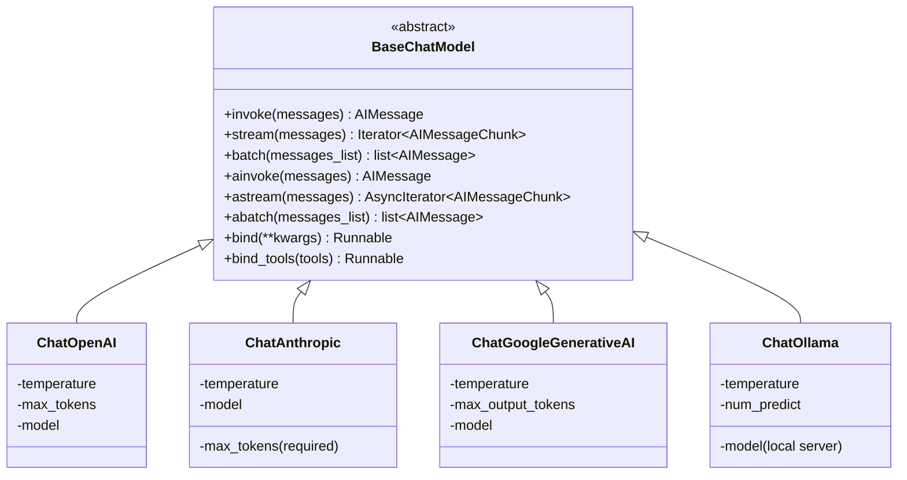

# Chapter 3: Chat Models

> "Program to an interface, not an implementation." — Gang of Four, *Design Patterns* (1994)

## Learning Objectives

By the end of this chapter, you will be able to:

- Explain what `BaseChatModel` is and why every LangChain chat model — `ChatOpenAI`, `ChatAnthropic`, `ChatGoogleGenerativeAI`, `ChatOllama`, and dozens more — implements the same contract
- Invoke a chat model synchronously (`.invoke()`), in batches (`.batch()`), and as a stream (`.stream()`), and read the return type of each correctly
- Configure temperature, `max_tokens`, `top_p`, stop sequences, and provider-specific extras through one consistent constructor pattern
- Consume a token stream as `AIMessageChunk` objects and explain what the `+` operator does when chunks accumulate
- Use the async twins (`.ainvoke()`, `.astream()`, `.abatch()`) correctly inside a FastAPI request handler, and explain why this matters for concurrency
- Attach tools and runtime configuration to a model with `.bind_tools()` and `.bind()`, understanding this is a preview of Chapter 7
- Swap the underlying LLM provider in a working LCEL pipeline by changing a single line of code, and explain the production value of that property

---

## Prerequisites for This Chapter

This chapter builds directly on **[Chapter 2: Core Concepts — Messages](./02-core-concepts-messages.md)**, where you learned:

- The message type hierarchy — `SystemMessage`, `HumanMessage`, `AIMessage`, `ToolMessage` — and why LangChain represents a conversation as a typed list rather than a raw list of dicts
- That an `AIMessage` is what a model *returns*, carrying not just `.content` but also `.response_metadata`, `.usage_metadata`, and (as of Chapter 7) `.tool_calls`
- How message objects normalize the shape differences between providers' raw JSON wire formats into one Python object you can pass around your codebase unchanged

This chapter turns that message vocabulary into action. Messages are the *nouns* of LangChain Core; chat models are the first *verb* — the thing that actually takes a list of messages in and produces a new `AIMessage` out. Everything from here forward (prompt templates in Chapter 4, output parsers in Chapter 5, LCEL composition in Chapter 6) exists to build pipelines that feed a `BaseChatModel` and shape what comes back.

No new setup is required beyond what Chapter 2 assumed: Python 3.9+, and awareness that `langchain-openai`, `langchain-anthropic`, `langchain-google-genai`, and `langchain-community` (for Ollama) are separate installable packages, each providing one provider-specific class that implements the shared interface this chapter is about. Code in this chapter is illustrative — read it as you would read a diagram, not as something you need to run.

---

## 1. The `BaseChatModel` Interface: One Contract, Many Providers

### 1.1 The problem this interface solves

Imagine you're the FastAPI engineer this course assumes you are. Your service calls OpenAI's `chat.completions.create(...)`. Six months later, a client mandates Anthropic's Claude for a data-residency reason, or you simply want to A/B test GPT-4o against Claude for quality. If your code calls the OpenAI SDK directly, that migration touches every file that builds a request payload, every place that parses `response.choices[0].message.content` versus Anthropic's `response.content[0].text`, and every retry/streaming code path — because the *shape of the request and the response* differs per SDK, not just the model name.

LangChain Core's answer is `BaseChatModel`: an abstract base class that every chat model integration subclasses. It guarantees that no matter which provider you're talking to, your code calls the *same five methods* and receives the *same message types* back. The provider-specific SDK calls, authentication, retry logic, and request/response translation all live inside the subclass — invisible to your pipeline code.

```
Your code:      model.invoke([HumanMessage("Hello")])
                              │
                              ▼
                    BaseChatModel.invoke()          <- same for every provider
                              │
              ┌───────────────┼────────────────┬──────────────┐
              ▼               ▼                ▼              ▼
        ChatOpenAI      ChatAnthropic    ChatGoogleGenerativeAI  ChatOllama
    (calls OpenAI API) (calls Anthropic) (calls Gemini API)   (calls local Ollama)
              │               │                │              │
              └───────────────┴────────────────┴──────────────┘
                              │
                              ▼
                    Always returns: AIMessage
```

### 1.2 The core methods, formally

`BaseChatModel` defines a small, consistent surface. These are the methods you'll use in nearly every LangChain program you write:

| Method | Input | Output | When to use |
|---|---|---|---|
| `.invoke(messages)` | `list[BaseMessage]` (or a string, or a `PromptValue`) | a single `AIMessage` | One request, wait for the full response |
| `.stream(messages)` | same | an iterator of `AIMessageChunk` | One request, consume tokens as they arrive |
| `.batch(list_of_messages)` | `list[list[BaseMessage]]` | `list[AIMessage]` | Many independent requests, run concurrently, return together |
| `.ainvoke(messages)` | same as `.invoke` | `AIMessage` (awaited) | Same as `.invoke`, but non-blocking |
| `.astream(messages)` | same as `.stream` | async iterator of `AIMessageChunk` | Same as `.stream`, but non-blocking |
| `.abatch(list_of_messages)` | same as `.batch` | `list[AIMessage]` (awaited) | Same as `.batch`, but non-blocking |

Every one of these methods exists on `ChatOpenAI`, `ChatAnthropic`, `ChatGoogleGenerativeAI`, and `ChatOllama` with identical signatures. What differs between providers is *what happens inside the method* — the HTTP call, the request JSON shape, how the provider streams bytes over the wire — never the shape of what you hand in or get back.

```python
from langchain_openai import ChatOpenAI
from langchain_core.messages import HumanMessage, SystemMessage

model = ChatOpenAI(model="gpt-4o-mini", temperature=0)

response = model.invoke([
    SystemMessage(content="You are a terse assistant. Answer in one sentence."),
    HumanMessage(content="Why is the sky blue?"),
])

print(type(response))     # <class 'langchain_core.messages.ai.AIMessage'>
print(response.content)   # "The sky appears blue because molecules in the atmosphere
                           #  scatter shorter (blue) wavelengths of sunlight more than
                           #  longer wavelengths, a phenomenon called Rayleigh scattering."
```

Note what `.invoke()` accepted: a plain Python `list` of message objects from Chapter 2, not a provider-specific request object. That list is the universal input format across every chat model in LangChain Core.

### 1.3 `.batch()`: many requests, one call

`.batch()` is not a loop you write yourself — it's a method that takes a list of message-lists and runs them with managed concurrency (a thread pool under the hood, or true async concurrency for `.abatch()`), returning results in the same order they were submitted:

```python
questions = [
    [HumanMessage(content="Capital of France?")],
    [HumanMessage(content="Capital of Japan?")],
    [HumanMessage(content="Capital of Peru?")],
]

results = model.batch(questions)
for r in results:
    print(r.content)
# "The capital of France is Paris."
# "The capital of Japan is Tokyo."
# "The capital of Peru is Lima."
```

Reasoning through this by hand: three independent HTTP requests go out, LangChain manages the concurrency and result ordering for you, and you get back a `list[AIMessage]` aligned index-for-index with your input. Contrast this with hand-rolling `asyncio.gather()` over three raw SDK calls yourself — `.batch()` gives you that same concurrency for free, with automatic retry and rate-limit backoff built into the base class, configurable via `max_concurrency` in the call's config.

### 1.4 Why "abstract base class" is the right description

`BaseChatModel` is not a runtime dispatcher or a factory — it's a Python ABC (`abc.ABC`) that every provider integration inherits from. It supplies the shared machinery (`.invoke()`, `.batch()`, retry/rate-limit handling, callback firing for observability) as *concrete* methods, and requires each subclass to implement only the provider-specific core — most importantly a method that does the actual generation (conceptually, "given these messages and these parameters, call the provider and produce a result"). Everything else — streaming support, batching, async wrappers — is derived automatically from that one primitive by the base class, unless a provider overrides it for a genuinely faster native implementation (e.g., true server-sent-event streaming instead of a fallback that fakes streaming by chunking a complete response).

This is why adding a new provider to LangChain's ecosystem is a bounded amount of work — implement the core generation method and the streaming method against `BaseChatModel`'s contract, and you inherit dozens of behaviors (retries, callbacks, batching, async) for free.

---

## 2. Model Configuration: One Constructor Pattern, Many Providers Underneath

### 2.1 The parameters every provider exposes

Despite wildly different backend APIs, chat model constructors in LangChain expose a common vocabulary of sampling parameters, because nearly every major LLM provider supports some version of the same underlying sampling controls:

```python
from langchain_openai import ChatOpenAI

model = ChatOpenAI(
    model="gpt-4o-mini",
    temperature=0.2,      # randomness: 0 = near-deterministic, higher = more varied
    max_tokens=500,       # cap on the length of the generated response
    top_p=0.9,            # nucleus sampling: consider only the top 90% probability mass
    stop=["\n\nHuman:"],  # stop sequences: cut generation short if this text appears
    timeout=30,           # seconds to wait before giving up on the HTTP call
    max_retries=2,        # automatic retries on transient errors (rate limits, timeouts)
)
```

| Parameter | Plain-language meaning | Typical range |
|---|---|---|
| `temperature` | How much randomness to inject when picking the next token. `0` is close to always picking the most likely token (deterministic-ish); `1.0`+ is noticeably more creative/varied | `0.0` – `1.0` (some providers allow up to `2.0`) |
| `max_tokens` | Hard ceiling on how many tokens the model is allowed to generate in the response | Depends on model context window and use case |
| `top_p` | An alternative/complementary randomness control: only sample from the smallest set of tokens whose cumulative probability reaches this threshold | `0.0` – `1.0`, often left at provider default |
| `stop` | A list of strings that, if generated, immediately halt generation (the stop string itself is excluded from the output) | Use-case specific, e.g., stopping a role-play format before the model impersonates the next speaker |
| `model_kwargs` / provider-specific fields | An escape hatch for passing parameters LangChain hasn't (yet) promoted to a first-class constructor argument | Provider-specific |

### 2.2 Same names, different plumbing underneath

Here's the detail worth internalizing: **`temperature=0.2` means something implemented completely differently depending on the provider**, but you write the same keyword argument in every case.

```python
from langchain_openai import ChatOpenAI
from langchain_anthropic import ChatAnthropic
from langchain_google_genai import ChatGoogleGenerativeAI
from langchain_community.chat_models import ChatOllama

openai_model = ChatOpenAI(model="gpt-4o-mini", temperature=0.2, max_tokens=500)
anthropic_model = ChatAnthropic(model="claude-3-5-sonnet-latest", temperature=0.2, max_tokens=500)
gemini_model = ChatGoogleGenerativeAI(model="gemini-1.5-pro", temperature=0.2, max_tokens=500)
ollama_model = ChatOllama(model="llama3.1", temperature=0.2, num_predict=500)
```

Reasoning through what LangChain does under the hood for each of these constructor calls:

- **`ChatOpenAI`** maps `temperature` and `max_tokens` almost verbatim onto OpenAI's Chat Completions request body (`temperature`, `max_tokens` fields).
- **`ChatAnthropic`** maps `temperature` onto Anthropic's Messages API `temperature` field, but Anthropic *requires* `max_tokens` on every request (there is no "default" length cap the way OpenAI allows) — LangChain's wrapper supplies a sane default if you omit it, papering over a real API-level difference.
- **`ChatGoogleGenerativeAI`** translates both parameters into Gemini's `generation_config` object, a nested structure that looks nothing like OpenAI's flat request body — the translation happens invisibly inside the class.
- **`ChatOllama`** talks to a *local* Ollama server rather than a cloud API, and translates `max_tokens` into Ollama's own `num_predict` option name — notice the constructor keyword itself differs here (`num_predict`, not `max_tokens`) because Ollama's native option name is different enough that LangChain didn't alias it, which is a useful reminder that the unification is deep but not absolute: **always check the specific integration's parameter reference when a value doesn't behave as expected.**

### 2.3 `model_kwargs`: the escape hatch

No unified interface can anticipate every provider-specific knob (OpenAI's `frequency_penalty`, Anthropic's `top_k`, Gemini's `safety_settings`, and so on indefinitely). Rather than never supporting these, most LangChain chat model classes accept a catch-all:

```python
model = ChatOpenAI(
    model="gpt-4o-mini",
    temperature=0.7,
    model_kwargs={"frequency_penalty": 0.5, "presence_penalty": 0.3},
)
```

Anything placed in `model_kwargs` is passed through largely unmodified into the provider's raw request payload. This is the pressure valve that keeps the abstraction from becoming a straitjacket: the 90% common case (`temperature`, `max_tokens`, `top_p`, `stop`) is a first-class, portable constructor argument; the remaining provider-specific 10% is still reachable, just less portable across providers by design — because that 10% often *doesn't have* a provider-independent equivalent.

### 2.4 Runtime overrides with `.bind()`

Constructor arguments fix configuration for the lifetime of the model object. Sometimes you want to override a parameter for one particular chain without constructing a whole new model instance. `.bind()` returns a new **runnable** wrapping the model with additional keyword arguments merged in at call time:

```python
base_model = ChatOpenAI(model="gpt-4o-mini", temperature=0.7)

strict_model = base_model.bind(stop=["\n\n"], max_tokens=100)

# base_model is untouched; strict_model is a new, separately configured runnable
response = strict_model.invoke([HumanMessage(content="Tell me about Paris.")])
```

You'll meet `.bind()` again in Section 5 as the general mechanism that `.bind_tools()` is built on top of.

---

## 3. Streaming at the Chat-Model Level

### 3.1 Why streaming exists

A `.invoke()` call blocks until the entire response is generated, which for a long answer can be several seconds of dead air from the caller's point of view. `.stream()` instead returns an iterator that yields pieces of the response as the provider produces them — the same experience as watching ChatGPT's UI print word-by-word instead of waiting for a blank screen to suddenly fill.

```python
for chunk in model.stream([HumanMessage(content="Write a haiku about databases.")]):
    print(chunk.content, end="", flush=True)
```

Reasoning through what happens here token by token: each `chunk` is not an `AIMessage` — it's an `AIMessageChunk`, a distinct class designed specifically for partial results. Printed one at a time with no separator, you'd see something like:

```
Rows
 and
 columns
 hold
 the
 truth
,
 quietly
 waiting
 for
 the
 query
 to
 ask
.
```

(Real provider token boundaries rarely align neatly with whole words — this is illustrative of the *shape* of streaming, not an exact token-by-token transcript from any specific model.)

### 3.2 `AIMessageChunk` and the `+` operator

`AIMessageChunk` is a subclass of `AIMessage` built to be **incrementally combinable**. It overrides Python's `+` operator so that adding two chunks together produces a new chunk whose `.content` is the concatenation, and whose metadata fields (token usage counters, tool-call fragments, etc.) are merged sensibly rather than overwritten:

```python
full_chunk = None
for chunk in model.stream([HumanMessage(content="Count to three.")]):
    full_chunk = chunk if full_chunk is None else full_chunk + chunk

print(full_chunk.content)   # "One, two, three."
print(type(full_chunk))     # <class 'langchain_core.messages.ai.AIMessageChunk'>
```

Walking through this by hand: suppose the provider streams three chunks with `.content` values `"One"`, `", two"`, `", three."` respectively.

- `full_chunk` starts as `None`.
- First iteration: `full_chunk = chunk` → `full_chunk.content == "One"`.
- Second iteration: `full_chunk = full_chunk + chunk` → the `+` operator concatenates content, producing `"One, two"`. If both chunks carried partial `usage_metadata` (e.g., a running output-token count), the combined chunk's usage metadata reflects the merged total, not just the second chunk's value.
- Third iteration: `full_chunk.content == "One, two, three."`.

This is the same accumulation pattern LangChain uses internally to assemble a complete `AIMessage`-equivalent result out of a stream when downstream code (like an output parser in Chapter 5) needs the *whole* response rather than incremental pieces. It's also exactly how streamed tool-call arguments get reassembled — a tool call's JSON arguments frequently arrive split across many chunks, and the `+` operator's merge logic is what stitches the fragments back into valid JSON by the time streaming ends (detailed in Chapter 7).

### 3.3 What "streaming" does *not* guarantee

A subtlety worth flagging explicitly: not every provider integration streams *true* incremental tokens from the network. Some earlier or simpler integrations implement `.stream()` by calling the provider's non-streaming endpoint and then chunking the already-complete response before yielding it — which gives you the same iterator *interface* but none of the latency benefit. When first-token latency matters (e.g., a chat UI where users are watching), verify that the specific provider integration you're using performs genuine server-sent-event streaming against the provider's streaming endpoint, not a client-side fake.

### 3.4 Streaming inside an LCEL pipeline

One more property to note now and revisit fully in Chapter 6: `.stream()` isn't limited to bare chat models. Any LCEL pipeline (prompt → model → parser, chained with the `|` operator) can be streamed end-to-end, and LangChain propagates chunks through each stage as they become available rather than materializing the whole prompt-to-output pipeline in memory first:

```python
chain = prompt | model | parser   # LCEL composition — Chapter 6 goes deep here

for piece in chain.stream({"topic": "databases"}):
    print(piece, end="", flush=True)
```

Streaming being a first-class citizen of the *entire pipeline*, not bolted onto just the model call, is one of LCEL's defining design decisions.

---

## 4. Async Invocation: `.ainvoke()` and `.astream()`

### 4.1 Why this matters specifically for a FastAPI service

You already know from building FastAPI services that a synchronous, blocking call inside an `async def` request handler stalls the entire event loop — while one request waits on a slow synchronous LLM call, every *other* concurrent request to your service is frozen behind it, because `def` handlers run in FastAPI's thread pool but a blocking call made incorrectly from an `async def` route (or a synchronous call awaited improperly) can still serialize work that should have been concurrent.

`.ainvoke()`, `.astream()`, and `.abatch()` are the coroutine-native twins of `.invoke()`, `.stream()`, and `.batch()`. They perform the same HTTP call to the provider but do so via `async`/`await`, which means the event loop is free to service other requests while waiting on the network:

```python
from fastapi import FastAPI
from langchain_openai import ChatOpenAI
from langchain_core.messages import HumanMessage

app = FastAPI()
model = ChatOpenAI(model="gpt-4o-mini", temperature=0)

@app.post("/ask")
async def ask(question: str):
    response = await model.ainvoke([HumanMessage(content=question)])
    return {"answer": response.content}
```

Reasoning through the concurrency payoff: if this endpoint receives 50 simultaneous requests and each LLM call takes 2 seconds, using `.ainvoke()` lets FastAPI's event loop juggle all 50 in-flight network waits concurrently — total wall-clock time approaches "slowest single call," not "sum of all 50 calls." Calling the *synchronous* `.invoke()` from inside an `async def` handler instead would block the event loop for the full 2 seconds per request, serializing what should have been parallel I/O and defeating the entire point of an async framework.

### 4.2 Streaming responses over HTTP with `.astream()`

Streaming and async compose naturally for a token-by-token HTTP response, which is exactly the shape FastAPI's `StreamingResponse` expects:

```python
from fastapi.responses import StreamingResponse

@app.post("/ask-stream")
async def ask_stream(question: str):
    async def token_generator():
        async for chunk in model.astream([HumanMessage(content=question)]):
            yield chunk.content

    return StreamingResponse(token_generator(), media_type="text/plain")
```

This is the same pattern that powers "typing" chat UIs: the client opens the HTTP connection once, and tokens arrive incrementally as the provider produces them, with the event loop never blocked waiting on the full response.

### 4.3 Async batch fan-out

`.abatch()` gives you concurrent fan-out without hand-writing `asyncio.gather()`:

```python
questions = [[HumanMessage(content=q)] for q in ["Q1?", "Q2?", "Q3?"]]
results = await model.abatch(questions, config={"max_concurrency": 5})
```

`max_concurrency` caps how many in-flight requests run simultaneously — important when a provider's rate limits would otherwise reject a burst of, say, 200 simultaneous calls. This is the async-native equivalent of the synchronous `.batch()` from Section 1.3, and it's the method you reach for when a single request needs to fan out to the model multiple times concurrently (e.g., generating N candidate answers to rerank).

### 4.4 A rule of thumb

Inside any `async def` FastAPI route, default to the `a`-prefixed methods (`.ainvoke()`, `.astream()`, `.abatch()`). Reserve the synchronous methods for scripts, notebooks, CLI tools, and background workers that aren't sharing an event loop with other concurrent request handlers.

---

## 5. Binding Tools and Config: A Preview

### 5.1 `.bind()` revisited

Section 2.4 introduced `.bind()` as a way to lock in extra keyword arguments without mutating the original model object. The general shape is: `.bind()` returns a new runnable that, at invocation time, merges your bound arguments into the call. This generality is what makes it the foundation for tool binding.

### 5.2 `.bind_tools()`: giving a model a menu of callable functions

`.bind_tools()` is a specialized convenience built on top of `.bind()`. It takes a list of tool definitions (Python functions decorated with `@tool`, Pydantic models, or raw JSON schemas — all covered in depth in **Chapter 7**) and returns a new model runnable that, on every call, tells the provider "here are the functions you're allowed to request; decide whether calling one of them is appropriate for this input":

```python
from langchain_core.tools import tool

@tool
def get_weather(city: str) -> str:
    """Look up the current weather for a given city."""
    return f"It's sunny in {city}."

model_with_tools = model.bind_tools([get_weather])

response = model_with_tools.invoke([HumanMessage(content="What's the weather in Lima?")])
print(response.tool_calls)
# [{'name': 'get_weather', 'args': {'city': 'Lima'}, 'id': 'call_abc123', ...}]
```

Reasoning through what changed here versus a bare `.invoke()` call: the returned `AIMessage` now (potentially) carries a populated `.tool_calls` list instead of, or alongside, plain text `.content`. The model itself never executes `get_weather` — it only *requests* that your code call it, with the arguments it decided on. Your application code is responsible for running the actual function and feeding the result back as a `ToolMessage` (Chapter 2's message type built for exactly this) in a follow-up turn.

This chapter deliberately stops here. The full lifecycle — parallel tool calls, forcing a specific tool, structured-output-via-tool-calling, and the agentic loop that repeatedly calls the model until it stops requesting tools — is **Chapter 7: Tool Calling**'s entire subject. What matters for now is the interface-level fact: `.bind_tools()` is provider-independent in the same way `.invoke()` is. `ChatOpenAI`, `ChatAnthropic`, and `ChatGoogleGenerativeAI` all translate the same tool schema into whatever wire format their provider's function-calling API expects, and all return the result normalized into the same `.tool_calls` shape on the returned `AIMessage`.

---

## 6. The Provider-Independence Payoff: One Pipeline, Four Providers

This is the section that makes the whole chapter concrete. Consider a small LCEL pipeline — a prompt template feeding a chat model (full depth on prompt templates arrives in Chapter 4; for now, read `prompt | model` as "format this template, then send the result to the model"):

```python
from langchain_core.prompts import ChatPromptTemplate

prompt = ChatPromptTemplate.from_messages([
    ("system", "You are a concise assistant."),
    ("human", "Explain {topic} in exactly two sentences."),
])
```

Now build the *identical* chain against four different providers, changing only the line that constructs the model:

```python
from langchain_openai import ChatOpenAI
from langchain_anthropic import ChatAnthropic
from langchain_google_genai import ChatGoogleGenerativeAI
from langchain_community.chat_models import ChatOllama

configs = {
    "openai":    ChatOpenAI(model="gpt-4o-mini", temperature=0),
    "anthropic": ChatAnthropic(model="claude-3-5-sonnet-latest", temperature=0),
    "gemini":    ChatGoogleGenerativeAI(model="gemini-1.5-pro", temperature=0),
    "ollama":    ChatOllama(model="llama3.1", temperature=0),
}

for name, model in configs.items():
    chain = prompt | model
    result = chain.invoke({"topic": "database indexing"})
    print(f"--- {name} ---")
    print(result.content)
    print()
```

Reasoning through this line by line: `prompt | model` builds an LCEL `Runnable` regardless of which of the four model objects is on the right-hand side, because every one of them satisfies the same `BaseChatModel` (and, more generally, `Runnable`) interface. `chain.invoke({"topic": "database indexing"})` formats the template into a message list, then calls that model's `.invoke()` — the exact method signature from Section 1 — and returns an `AIMessage` in every single case. The `.content` attribute is populated by every provider identically as a plain Python string, regardless of whether the raw wire response underneath was OpenAI's JSON, Anthropic's `content` block array, Gemini's `candidates` structure, or Ollama's local JSON-lines protocol.

**What changed:** one constructor line per provider.
**What stayed identical:** the prompt template, the LCEL composition operator, the invocation call, and the shape of the object you get back.

That is the entire value proposition of `BaseChatModel` stated as a worked example rather than a claim.



---

## Real-World Scenario

**Scenario:** A customer-support automation team runs a production FastAPI service that classifies incoming support tickets and drafts reply suggestions, backed entirely by `ChatOpenAI` calling `gpt-4o-mini`. At 9:14 AM, OpenAI has a regional API outage — requests either time out after 30 seconds or return 503s. The service's error rate spikes; every ticket in the queue starts failing, and support agents notice replies simply stop being generated.

Because the team built their pipeline directly against the OpenAI Python SDK two years ago — constructing raw `client.chat.completions.create(...)` calls scattered across a dozen files, each hand-parsing `response.choices[0].message.content` — there is no clean seam to swap in a different provider. Failing over to Anthropic as a stopgap would mean rewriting every call site: different client construction, different request payload shape, different response parsing, different streaming protocol. Estimated time to ship a safe hotfix: most of a day, done carefully under incident pressure, with a real risk of introducing a second, unrelated bug into rushed code.

**Now contrast this with a team that built the same service on top of `BaseChatModel` from day one.** Their prompt-and-parsing logic is written against `ChatOpenAI` purely as *an instance of `BaseChatModel`* — every call site uses `.ainvoke()`, works with `AIMessage` objects, and never touches an OpenAI-specific response shape directly. The fix during the outage is almost mechanical:

```python
# Before the incident:
model = ChatOpenAI(model="gpt-4o-mini", temperature=0)

# During the incident — failover to a backup provider:
model = ChatAnthropic(model="claude-3-5-sonnet-latest", temperature=0)
```

Every prompt template, every LCEL chain, every parser downstream continues to work unmodified, because they were never coupled to OpenAI's request/response shape in the first place — only to the `BaseChatModel` contract this chapter describes. The team ships the failover in minutes: swap the constructor line, redeploy, watch the error rate recover. Ticket processing resumes while OpenAI's status page is still showing "investigating."

This exact pattern — detect a provider degradation and automatically retry against a backup model — is formalized in **Chapter 14: Fallbacks and Retries**, where you'll learn `.with_fallbacks()`, which can make this failover *automatic* rather than a manual redeploy. But the fallback mechanism in Chapter 14 only works *because* every chat model shares this chapter's interface: you cannot build an automatic fallback between two providers whose call signatures and response shapes are incompatible. This chapter is the prerequisite architecture; Chapter 14 is the automation built on top of it.

**Lesson:** the cost of coupling your codebase to a specific provider's SDK is invisible on a calm day and catastrophic during an outage. `BaseChatModel` isn't an academic abstraction — it's the difference between a five-minute redeploy and a stressful afternoon of emergency rewrites.

---

## Best Practices

- **Always construct models against the LangChain integration package (`ChatOpenAI`, `ChatAnthropic`, etc.), never the provider's raw SDK client**, even if you only ever intend to use one provider — the option to swap later costs nothing extra today and everything extra later.
- **Use the `a`-prefixed async methods (`.ainvoke()`, `.astream()`, `.abatch()`) inside any `async def` FastAPI route.** A blocking `.invoke()` call inside an async handler quietly serializes concurrent requests that should have run in parallel.
- **Set `temperature=0` for deterministic tasks** (classification, extraction, structured data generation) and reserve higher temperatures for open-ended generation — and remember this parameter name is portable across providers even though the underlying sampling implementation differs.
- **Pin explicit model version strings** (e.g., `"gpt-4o-mini-2024-07-18"` rather than a rolling alias) in production, so a provider's silent default-model upgrade doesn't change your system's behavior without your knowledge.
- **Prefer `.batch()`/`.abatch()` over hand-written loops** when making multiple independent calls — you get managed concurrency, ordering guarantees, and configurable `max_concurrency` for free.
- **Treat `model_kwargs` (or any provider-specific constructor field) as a portability cost you're consciously accepting** — every parameter that lives outside the common vocabulary in Section 2.1 is a parameter you'll have to re-derive for each new provider you add.
- **Verify whether `.stream()` on a given integration is genuinely incremental** before depending on low first-token latency in a user-facing UI; some integrations only fake streaming over an already-complete response.

---

## Common Mistakes

- **Calling the synchronous `.invoke()` from inside an `async def` FastAPI handler.** This compiles and runs without error, so it's easy to miss in review — but it blocks the event loop and silently serializes what should have been concurrent request handling, showing up only under load as mysterious latency spikes.
- **Assuming a constructor keyword is universal without checking.** `max_tokens` works across OpenAI, Anthropic, and Gemini's LangChain wrappers, but Ollama's native option is `num_predict`. Copy-pasting a constructor call between providers without checking each integration's parameter reference produces a silently-ignored keyword or, in stricter integrations, a hard error.
- **Forgetting that `AIMessageChunk` is not the same class as `AIMessage`.** Code that expects `.tool_calls` or `.content` to behave exactly like a complete `AIMessage` while iterating a `.stream()` call can break subtly, since a chunk's `.tool_calls` may only contain a fragment of a tool call's arguments until enough chunks have been merged with `+`.
- **Treating `.bind()` as mutating the original model object.** `model.bind(...)` returns a *new* runnable; the original `model` variable is untouched. Code that calls `model.bind(stop=[...])` and then continues using `model` expecting the bound arguments to apply has misunderstood the method.
- **Building tool-calling logic directly against one provider's function-calling response shape** instead of using `.bind_tools()` and the normalized `.tool_calls` attribute — this quietly reintroduces the exact provider lock-in this chapter's interface is designed to prevent, right at the one place (tool calling) where provider wire formats differ the most.
- **Not setting `max_retries`/`timeout` explicitly and assuming provider defaults are production-appropriate.** Default timeouts are often tuned for interactive testing, not for a production service's SLA; leaving them unexamined is a common source of hard-to-diagnose tail latency.

---

## Summary

- **`BaseChatModel`** is the abstract base class every LangChain chat model integration implements, guaranteeing the same core methods (`.invoke()`, `.stream()`, `.batch()`, and their async twins) and the same return types (`AIMessage`, `AIMessageChunk`) regardless of provider.
- **Configuration parameters** — `temperature`, `max_tokens`, `top_p`, `stop`, `timeout`, `max_retries` — are exposed through one consistent constructor vocabulary, even though each provider's LangChain wrapper translates them into a different underlying request shape; `model_kwargs` is the escape hatch for anything provider-specific.
- **Streaming** yields `AIMessageChunk` objects one at a time; the `+` operator merges chunks together, which is both how you can reassemble a full response from a stream and how streamed tool-call arguments get stitched back into valid structured data.
- **Async methods** (`.ainvoke()`, `.astream()`, `.abatch()`) are essential inside FastAPI's `async def` routes — calling the synchronous variants there blocks the event loop and defeats concurrent request handling.
- **`.bind()`** attaches extra call-time configuration to a model without mutating the original object; **`.bind_tools()`** is the specialized version that attaches a set of callable tools, previewed here and covered fully in Chapter 7.
- The entire chapter's payoff: **the same LCEL pipeline code runs unmodified against `ChatOpenAI`, `ChatAnthropic`, `ChatGoogleGenerativeAI`, or `ChatOllama`** by changing only the model-construction line — the property that turns a provider outage from a rewrite into a redeploy (Chapter 14 automates this further with fallbacks).

---

## Knowledge Check

1. List the six core methods on `BaseChatModel` covered in this chapter and, for each, state its return type and whether it blocks the event loop if called from inside an `async def` FastAPI route.
2. Explain, in your own words, what the `+` operator does when applied to two `AIMessageChunk` objects, and why this matters for reassembling a streamed tool call's arguments.
3. A colleague writes `response = model.invoke(...)` inside an `async def` FastAPI endpoint and is confused why the service's throughput collapses under concurrent load. Diagnose the mistake and propose the fix.
4. You need to pass Anthropic's `top_k` parameter, which isn't part of LangChain's common constructor vocabulary. How would you supply it, and what portability trade-off does this introduce if you later swap to a different provider?
5. Why does `ChatAnthropic` require `max_tokens` to be set on every request, while `ChatOpenAI` does not strictly require it? What does this reveal about the limits of the "one consistent constructor pattern" claim in Section 2?
6. Walk through what changes and what stays the same when you take a working `prompt | model` LCEL chain built against `ChatOpenAI` and re-point it at `ChatGoogleGenerativeAI`. Then explain how this property specifically helped the team in the Real-World Scenario during the OpenAI outage.

---

## Hands-On Exercise

Write a single script, `compare_providers.py`, that sends the **same prompt** to **two different chat model providers** (for example, `ChatOpenAI` and `ChatAnthropic`, or any two you have credentials configured for) and diffs the outputs.

**Requirements:**

1. Define one `ChatPromptTemplate` (or a plain `list[BaseMessage]`, if you'd rather not get ahead of Chapter 4) containing a single instruction, e.g., *"Summarize the benefits of database indexing in exactly three bullet points."*
2. Construct two model instances from two different provider integrations, both with `temperature=0` for a fair, low-randomness comparison.
3. Invoke both models with the identical formatted prompt using `.invoke()`, capturing each returned `AIMessage`.
4. Print both `.content` values side by side, and compute a simple diff — even a naive word-level diff using Python's built-in `difflib.unified_diff` is sufficient — highlighting where the two providers' answers agree and where they diverge.
5. Print each response's `.response_metadata` (introduced in Chapter 2) and note which provider-specific fields appear only on one side (e.g., token usage field names, stop reason field names) — this is a concrete, hands-on look at where the "common interface" ends and provider-specific detail begins.
6. **Bonus:** repeat the comparison using `.stream()` instead of `.invoke()` for both providers, and time how long each takes to produce its *first* chunk versus its *last* chunk — a hands-on measurement of first-token latency, relevant to the streaming discussion in Section 3.3.

Think through, in writing, what your diff would look like *before* running anything: do you expect the bullet points to be near-identical in content but differently worded, given both models are answering the same factual prompt at `temperature=0`? What would a large, structural divergence between the two outputs suggest about your prompt's ambiguity, versus a purely stylistic divergence?

---

## Further Reading

- [LangChain Python API Reference — `BaseChatModel`](https://python.langchain.com/api_reference/core/language_models/langchain_core.language_models.chat_models.BaseChatModel.html) — the authoritative method signatures and class hierarchy
- [LangChain Chat Models Conceptual Guide](https://python.langchain.com/docs/concepts/chat_models/) — the official conceptual overview this chapter's interface section is grounded in
- [LangChain Streaming Conceptual Guide](https://python.langchain.com/docs/concepts/streaming/) — deeper coverage of chunking behavior across chat models and full LCEL chains
- [LangChain Tool Calling Conceptual Guide](https://python.langchain.com/docs/concepts/tool_calling/) — the concept `.bind_tools()` previews here, expanded fully in Chapter 7
- [`langchain-anthropic` Integration Docs](https://python.langchain.com/docs/integrations/chat/anthropic/) — provider-specific parameter notes, including the `max_tokens` requirement discussed in Section 2.2
- [`langchain-google-genai` Integration Docs](https://python.langchain.com/docs/integrations/chat/google_generative_ai/) — Gemini-specific configuration mapping
- [Ollama Integration Docs (`langchain-community`)](https://python.langchain.com/docs/integrations/chat/ollama/) — parameter names for local model serving, including `num_predict`
- FastAPI's [Concurrency and async/await documentation](https://fastapi.tiangolo.com/async/) — background on why blocking calls inside `async def` routes degrade throughput, referenced in Section 4.1

---

<div style="display:flex;justify-content:space-between;align-items:center;">
  <a href="./02-core-concepts-messages.md">← Previous: Core Concepts: Messages</a>
  <a href="./00-index.md">🏠 Index</a>
  <a href="./04-prompt-templates.md">Next: Prompt Templates →</a>
</div>
