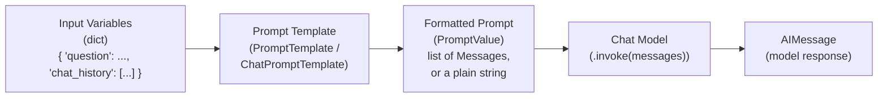

# Chapter 4: Prompt Templates

> "A prompt hardcoded in three different files is not one prompt. It's three prompts that happen to agree with each other today."

## Learning Objectives

By the end of this chapter, you will be able to:

- Explain why raw f-string prompt construction breaks down as an application grows, in terms of validation, reuse, and composability
- Build single-string prompts with `PromptTemplate` and understand its `.format()` / `.invoke()` contract
- Build multi-message prompts with `ChatPromptTemplate.from_messages()`, using both `(role, template)` tuples and message objects
- Use `MessagesPlaceholder` to inject a variable-length list of prior messages into an otherwise fixed template
- Construct few-shot prompts with `FewShotPromptTemplate` / `FewShotChatMessagePromptTemplate`, and describe conceptually how example selectors choose which examples to show
- Use `.partial()` to bind some variables early (e.g., a fixed persona) while leaving others to be filled per request
- Trace the full data flow from raw variables through a prompt template to the formatted message list the model actually receives

---

## Prerequisites for This Chapter

This chapter builds directly on **[Chapter 3: Chat Models](./03-chat-models.md)**, where you learned:

- The `BaseChatModel` interface and the standard message types — `SystemMessage`, `HumanMessage`, `AIMessage`, `ToolMessage` — that every LangChain chat model consumes and produces
- That a chat model's `.invoke()` method expects a **list of messages**, not a single opaque string
- How to construct that list by hand, one `HumanMessage(content=...)` at a time

That last point is exactly where this chapter picks up. Building a message list by hand works for a one-off script. It does not work once you have multiple prompts, each with several variables, each needing to be tested, versioned, and reused across a codebase. Prompt templates are LangChain Core's answer to "how do I stop hand-assembling message lists everywhere."

No new setup is required beyond what Chapter 3 already established — the `langchain-core` package and a configured chat model. Every code example below is illustrative and reasoned through by hand; none of it needs to be executed to follow along.

---

## 1. Why Hardcoded Strings Break Down

### 1.1 The tempting starting point

Every LangChain project starts here, and there's nothing wrong with it — at first:

```python
def build_prompt(question: str, context: str) -> str:
    return f"""You are a helpful assistant. Use the context below to answer the question.

Context:
{context}

Question:
{question}

Answer:"""
```

This works. It's readable. It ships a feature. The trouble starts when the application grows past a single prompt.

### 1.2 Where the cracks appear

**No validation.** If a caller forgets to pass `context` and instead interpolates `None`, Python happily produces `"Context:\nNone\n\nQuestion:..."` — a malformed prompt sent straight to a paid API call, discovered only when the model's answer looks strange. Nothing stops you from typo-ing a variable name either; `f"{contex}"` raises a `NameError` at call time, not at prompt-definition time, so the bug surfaces as far from its source as possible.

**No reuse across prompt *shapes*.** F-strings couple the template text to the specific variables available in whatever function happens to be building it. If a second function elsewhere needs the same "context + question" pattern but slightly different phrasing, the natural path is copy-paste. Six months later, one of the two copies gets tweaked for a bug fix and the other doesn't, and now you have two prompts silently diverging with no record that they were ever supposed to be the same.

**No composability.** Real chat prompts aren't one string — they're a *sequence of messages* with different roles: a system message describing the assistant's behavior, some prior conversation turns, and the new user message. Building that with f-strings means manually constructing a list:

```python
messages = [
    SystemMessage(content="You are a SQL expert..."),
    HumanMessage(content=chat_history_turn_1),
    AIMessage(content=chat_history_turn_1_response),
    HumanMessage(content=f"Question: {question}"),
]
```

This is doable for one prompt. It becomes unmanageable once you have a dozen prompts each needing a slightly different message shape, and it offers no clean way to swap in a different persona, insert few-shot examples, or unit-test the prompt logic independently of the surrounding business logic.

**No introspection.** An f-string can't tell you what variables it expects. You can't ask it "what inputs do you need?" programmatically, which matters the moment you want to build tooling around your prompts — a prompt registry, a testing harness, or a UI that lets non-engineers edit prompt copy without touching Python variable names.

LangChain's prompt templates solve all four problems by making the prompt a **first-class object** — something with a declared input schema, a `.format()`/`.invoke()` method, and a place in the same Runnable composition model you'll formalize in Chapter 6 (LCEL). This chapter shows you the object; later chapters show you how naturally it slots into a chain.

---

## 2. `PromptTemplate`: Single-String Prompts

### 2.1 The basic shape

`PromptTemplate` is the simplest building block: a single string with named `{placeholders}`, plus metadata about which variables it expects.

```python
from langchain_core.prompts import PromptTemplate

template = PromptTemplate.from_template(
    "You are a helpful assistant. Use the context below to answer the question.\n\n"
    "Context:\n{context}\n\n"
    "Question:\n{question}\n\n"
    "Answer:"
)

print(template.input_variables)
# ['context', 'question']
```

`from_template` parses the string, finds every `{name}` placeholder, and records them as `input_variables`. This is the introspection f-strings couldn't give you: you can now ask a prompt object what it needs before you ever call it.

### 2.2 Formatting: `.format()` vs `.invoke()`

There are two ways to render the template with actual values, and the distinction matters:

```python
# .format() returns a plain Python string
rendered_str = template.format(
    context="LangChain Core provides base abstractions for LLM apps.",
    question="What does LangChain Core provide?",
)
# rendered_str is a str, ready to hand to something expecting raw text

# .invoke() returns a StringPromptValue — a Runnable-compatible wrapper
prompt_value = template.invoke({
    "context": "LangChain Core provides base abstractions for LLM apps.",
    "question": "What does LangChain Core provide?",
})
print(type(prompt_value))     # StringPromptValue
print(prompt_value.to_string())  # same text as .format() above
```

`.format()` is the direct, string-in/string-out method — convenient for quick scripts or debugging. `.invoke()` is the method that matters in production: it makes `PromptTemplate` a **Runnable**, meaning it accepts the standard `.invoke(input_dict)` call signature shared by every other LangChain Core component (chat models, output parsers, retrievers). That shared interface is precisely what lets you pipe a prompt template directly into a chat model with the `|` operator in Chapter 6 — `prompt | model` only works because both sides speak the same Runnable protocol. `PromptTemplate` also returns a `PromptValue` object rather than a bare string specifically so downstream code can ask for either representation: `.to_string()` for a plain-text call, or `.to_messages()` (wrapping the string in a single `HumanMessage`) for a chat-model call — one prompt object, two possible consumers.

### 2.3 Missing or extra variables are caught early

```python
try:
    template.format(context="only context, no question")
except KeyError as e:
    print(f"Missing variable: {e}")
# Missing variable: 'question'
```

This is the validation an f-string never gave you — a clear, immediate error naming exactly which variable is missing, rather than a silently malformed prompt shipped to the model.

---

## 3. `ChatPromptTemplate`: Multi-Message Prompts

Most production LLM applications talk to **chat models**, not raw completion models, which means the real unit of a prompt is a *list of messages*, not a single string. `ChatPromptTemplate` is the templated equivalent of the message list you built by hand in Chapter 3.

### 3.1 `from_messages()` with role tuples

The most common construction path is a list of `(role, template_string)` tuples:

```python
from langchain_core.prompts import ChatPromptTemplate

chat_template = ChatPromptTemplate.from_messages([
    ("system", "You are a concise, expert {domain} assistant."),
    ("human", "{question}"),
])

result = chat_template.invoke({
    "domain": "Kubernetes",
    "question": "What does a readiness probe do?",
})

for msg in result.to_messages():
    print(type(msg).__name__, "->", msg.content)
# SystemMessage -> You are a concise, expert Kubernetes assistant.
# HumanMessage -> What does a readiness probe do?
```

Each tuple's first element is a role string (`"system"`, `"human"`, `"ai"`, or `"placeholder"` — covered in Section 4) and the second is a template string using the same `{variable}` syntax as `PromptTemplate`. Internally, `ChatPromptTemplate` converts each tuple into the appropriate message template class (`SystemMessagePromptTemplate`, `HumanMessagePromptTemplate`, etc.) and, on `.invoke()`, renders all of them and returns a `ChatPromptValue`.

### 3.2 Tuples vs. explicit message template objects

The tuple shorthand above is sugar over more explicit classes, which you'll see in library code and occasionally need directly for finer control:

```python
from langchain_core.prompts import (
    ChatPromptTemplate,
    SystemMessagePromptTemplate,
    HumanMessagePromptTemplate,
)

chat_template = ChatPromptTemplate.from_messages([
    SystemMessagePromptTemplate.from_template(
        "You are a concise, expert {domain} assistant."
    ),
    HumanMessagePromptTemplate.from_template("{question}"),
])
```

These two constructions produce an identical `ChatPromptTemplate`. Prefer the tuple form for readability in application code; reach for the explicit classes when you need to build a message template with non-default settings (e.g., a custom prompt formatting behavior) that the tuple shorthand doesn't expose.

### 3.3 Mixing in fixed, non-templated messages

Not every message needs placeholders. You can mix in a plain message object — useful for a fixed instruction that never varies and shouldn't accidentally be treated as containing template syntax (important if the fixed text itself happens to contain literal curly braces, e.g., a JSON example):

```python
from langchain_core.messages import SystemMessage

chat_template = ChatPromptTemplate.from_messages([
    SystemMessage(content="Always respond in valid JSON. Never include prose."),
    ("human", "{question}"),
])
```

A plain `SystemMessage` object is inserted as-is on every render — no formatting pass is attempted on its content, which avoids `KeyError`s if that fixed text happens to contain stray `{` or `}` characters.

### 3.4 `PromptTemplate` vs. `ChatPromptTemplate` at a glance

| | `PromptTemplate` | `ChatPromptTemplate` |
|---|---|---|
| Renders to | A single string (`StringPromptValue`) | A list of messages (`ChatPromptValue`) |
| Use with | Legacy/completion-style LLMs, or any place a plain string is needed | Chat models (the overwhelming majority of modern LLM usage) |
| Structure | One block of text with `{placeholders}` | Multiple messages, each with a role and its own template |
| Typical use in this course | Building blocks inside a larger chat template, or simple non-chat utilities | The default choice for essentially every real application from here on |

In practice, once you're building anything beyond a toy script, you will reach for `ChatPromptTemplate` almost exclusively — it's the shape that matches how chat models actually work, and it composes cleanly with everything covered in the rest of this chapter.

---

## 4. `MessagesPlaceholder`: Injecting Variable-Length History

### 4.1 The problem it solves

A `ChatPromptTemplate` built from `from_messages()` has a **fixed number of message slots** — you declared exactly two messages above, a system message and a human message. But a real chat application's conversation history has an *unknown, growing* number of turns: zero on the first message, two after one exchange, twenty after a long session. You cannot express "insert N prior messages, where N varies per request" using a fixed list of `(role, template)` tuples — there's no `{variable}` placeholder that expands into *multiple messages* on its own.

`MessagesPlaceholder` is exactly that: a slot in the template that says "insert a list of messages here, supplied at render time," rather than "insert one string here."

### 4.2 Basic usage

```python
from langchain_core.prompts import ChatPromptTemplate, MessagesPlaceholder
from langchain_core.messages import HumanMessage, AIMessage

chat_template = ChatPromptTemplate.from_messages([
    ("system", "You are a helpful assistant."),
    MessagesPlaceholder(variable_name="chat_history"),
    ("human", "{question}"),
])

history = [
    HumanMessage(content="My name is Priya."),
    AIMessage(content="Nice to meet you, Priya!"),
]

result = chat_template.invoke({
    "chat_history": history,
    "question": "What's my name?",
})

for msg in result.to_messages():
    print(type(msg).__name__, "->", msg.content)
# SystemMessage -> You are a helpful assistant.
# HumanMessage -> My name is Priya.
# AIMessage -> Nice to meet you, Priya!
# HumanMessage -> What's my name?
```

Notice the shape: `chat_history` was a *list of two messages*, but on render it expanded into two separate entries in the final message list — not one message whose content is a string representation of a list. This is the key behavior `MessagesPlaceholder` provides that no ordinary `{variable}` placeholder can: it splices a list into the surrounding list, in place.

### 4.3 The tuple shorthand for placeholders

`ChatPromptTemplate.from_messages()` also accepts a `("placeholder", "{variable_name}")` tuple as sugar for `MessagesPlaceholder(variable_name="variable_name")`:

```python
chat_template = ChatPromptTemplate.from_messages([
    ("system", "You are a helpful assistant."),
    ("placeholder", "{chat_history}"),
    ("human", "{question}"),
])
```

Both forms are equivalent; the explicit `MessagesPlaceholder` class is more discoverable for readers unfamiliar with the shorthand, and it exposes an `optional` parameter (see below), so prefer it in library-style code where clarity matters more than brevity.

### 4.4 Making the placeholder optional

If a given call site sometimes has no history at all (e.g., the very first turn of a conversation), pass `optional=True` so the key can be omitted from the input dictionary entirely rather than requiring an explicit empty list:

```python
MessagesPlaceholder(variable_name="chat_history", optional=True)
```

With `optional=True`, calling `.invoke({"question": "Hi there"})` — with no `chat_history` key at all — succeeds and simply contributes zero messages at that slot. Without `optional=True`, omitting the key raises a `KeyError`, forcing every caller to remember to pass `"chat_history": []` on the first turn.

### 4.5 Why this matters, and the tie back to Chapter 2

Chapter 2 introduced the idea that a chat model has no memory of its own — every call is stateless, and "conversation" is an illusion maintained entirely by the caller re-sending the full message history on every turn. `MessagesPlaceholder` is the templating mechanism that makes that pattern practical to implement: instead of manually splicing a growing list of messages into position on every request, you declare *once*, in the template, exactly where history belongs relative to the system message and the new user turn — and then simply pass a different `chat_history` list on each call. This is also the exact seam where memory/history-management utilities (covered later in this course) plug in: they are, at their core, just producers of the list you hand to this placeholder.

---

## 5. Few-Shot Prompting

### 5.1 Why few-shot examples belong in the template, not the f-string

Few-shot prompting — showing the model a handful of input/output examples before asking it to handle a new case — reliably improves output consistency for structured or unusual tasks (a fixed output format, a specific tone, a narrow classification scheme). Done by hand, few-shot examples usually end up as another blob glued into an f-string, with the same problems as Section 1: no validation that each example has the right fields, no reuse of the same example set across prompts, and no clean way to change *how many* examples are shown or *which* ones, without editing prompt text directly.

LangChain provides two purpose-built classes: `FewShotPromptTemplate` for plain-string prompts, and `FewShotChatMessagePromptTemplate` for chat-message prompts.

### 5.2 `FewShotPromptTemplate`

```python
from langchain_core.prompts import PromptTemplate, FewShotPromptTemplate

example_prompt = PromptTemplate.from_template(
    "Input: {input}\nOutput: {output}"
)

examples = [
    {"input": "happy", "output": "sad"},
    {"input": "tall", "output": "short"},
    {"input": "fast", "output": "slow"},
]

few_shot_template = FewShotPromptTemplate(
    examples=examples,
    example_prompt=example_prompt,
    prefix="Give the antonym of every word.",
    suffix="Input: {adjective}\nOutput:",
    input_variables=["adjective"],
)

print(few_shot_template.format(adjective="big"))
```

Rendered output:

```
Give the antonym of every word.

Input: happy
Output: sad

Input: tall
Output: short

Input: fast
Output: slow

Input: big
Output:
```

Each example is itself rendered through `example_prompt`, so the example formatting is defined once and applied consistently — change the phrasing of `example_prompt` and every example reformats identically, something error-prone to guarantee by hand once you have more than two or three examples.

### 5.3 `FewShotChatMessagePromptTemplate`

The chat-message equivalent produces alternating human/AI message pairs rather than a single formatted text block — appropriate when your target is a chat model and you want the examples to look like a real prior exchange rather than text embedded inside one message:

```python
from langchain_core.prompts import (
    ChatPromptTemplate,
    FewShotChatMessagePromptTemplate,
)

examples = [
    {"input": "2+2", "output": "4"},
    {"input": "3+5", "output": "8"},
]

example_prompt = ChatPromptTemplate.from_messages([
    ("human", "{input}"),
    ("ai", "{output}"),
])

few_shot_prompt = FewShotChatMessagePromptTemplate(
    examples=examples,
    example_prompt=example_prompt,
)

final_prompt = ChatPromptTemplate.from_messages([
    ("system", "You are a calculator that only outputs numbers."),
    few_shot_prompt,
    ("human", "{input}"),
])

for msg in final_prompt.invoke({"input": "10+15"}).to_messages():
    print(type(msg).__name__, "->", msg.content)
# SystemMessage -> You are a calculator that only outputs numbers.
# HumanMessage -> 2+2
# AIMessage -> 4
# HumanMessage -> 3+5
# AIMessage -> 8
# HumanMessage -> 10+15
```

A `FewShotChatMessagePromptTemplate` can be dropped directly into a `ChatPromptTemplate.from_messages()` list, exactly like a `MessagesPlaceholder` — it, too, expands into multiple messages at render time rather than occupying a single slot.

### 5.4 Example selectors: choosing examples dynamically (a preview)

The examples above are static — the same three or four examples on every call, regardless of the actual input. That's fine for a small, stable example set. It stops working once you have a library of hundreds of examples and want to show the model only the handful most relevant to the *current* input.

That's the job of an **example selector**, passed via `example_selector=` instead of a static `examples=` list. Conceptually, the most common strategy is **semantic similarity selection**: embed every candidate example (using the embedding models you'll study in depth in **Chapter 9**), embed the current input the same way, and select the `k` examples whose embeddings are closest to the input's embedding — the same nearest-neighbor idea that powers retrieval-augmented generation, just applied to prompt construction instead of document retrieval. LangChain Core ships `SemanticSimilarityExampleSelector` for exactly this pattern, backed by any vector store. This chapter only asks you to recognize the concept and know where it plugs in; Chapter 9 gives you the embeddings background needed to reason about it properly, and a later chapter revisits example selectors once vector stores are on the table.

---

## 6. Partial Prompts: Binding Some Variables Early

### 6.1 The problem: not every variable is known at the same time

A prompt template often has variables that fall into two very different categories:

- Values known **once, at application startup or configuration time** — a fixed persona, a system-level instruction, today's date, a tenant name.
- Values known **only per individual request** — the user's actual question, the retrieved context, the current turn's input.

Passing every variable through a single `.invoke()` call at request time works, but it means every call site needs to know about *and correctly supply* the "fixed" values too, even though they never change. That's needless repetition, and it's a place for inconsistency to creep in — one call site might use a slightly different phrasing for the persona than another.

### 6.2 `.partial()` fills in a subset now, the rest later

```python
from langchain_core.prompts import PromptTemplate

template = PromptTemplate.from_template(
    "You are acting as {persona}. Today's date is {date}.\n\nUser: {question}"
)

# Bind persona and date once, e.g. at module load time.
partial_template = template.partial(persona="a senior backend engineer", date="2026-07-18")

print(partial_template.input_variables)
# ['question']  -- persona and date are no longer required inputs

print(partial_template.format(question="Should I use a queue here?"))
# You are acting as a senior backend engineer. Today's date is 2026-07-18.
#
# User: Should I use a queue here?
```

After `.partial()`, the resulting template's `input_variables` shrinks — `persona` and `date` have been baked in, and only `question` remains for callers to supply. This is not just convenience: it changes the *shape of the contract* your prompt template exposes to the rest of the codebase, which is exactly the point.

### 6.3 Partials with a function, not just a static value

`.partial()` also accepts a zero-argument callable instead of a fixed value, evaluated lazily every time the template is rendered — useful for values like the current timestamp that shouldn't be frozen at definition time:

```python
from datetime import date

partial_template = template.partial(
    persona="a senior backend engineer",
    date=lambda: date.today().isoformat(),
)
```

Every `.format()` / `.invoke()` call now re-evaluates `date()` fresh, rather than reusing whatever date happened to be current when `.partial()` was first called.

### 6.4 Partials on `ChatPromptTemplate`

The same method exists on `ChatPromptTemplate`, and this is where it earns its keep in real applications — binding a fixed system persona once, so every call site downstream only ever has to think about the per-request variables:

```python
from langchain_core.prompts import ChatPromptTemplate

base_template = ChatPromptTemplate.from_messages([
    ("system", "You are {persona}. Respond in a {tone} tone."),
    ("human", "{question}"),
])

support_bot = base_template.partial(
    persona="a customer support agent for CloudNine Storage",
    tone="empathetic and reassuring",
)

# Every call site downstream only ever supplies `question`.
result = support_bot.invoke({"question": "My upload keeps failing at 80%."})
```

`support_bot` is now a fully independent, reusable template object — it can be imported, tested, and swapped elsewhere in the codebase without any caller needing to know or repeat the persona and tone strings. This is precisely the pattern behind the Real-World Scenario in Section 8.

---

## 7. The Data Flow: Variables → Template → Messages → Model

Every prompt template in this chapter, regardless of which class you used, follows the same three-stage pipeline. Making this explicit now pays off directly in Chapter 6, where `prompt | model` becomes the first real LCEL chain you build — that `|` is simply wiring stage 2's output directly into stage 3's input.



Walking through each stage:

1. **Input variables** — a plain Python `dict` carrying whatever the template needs: a user's question, retrieved context, conversation history, or nothing at all if everything was already bound via `.partial()`.
2. **Prompt template** — the reusable, declared object from this chapter. It knows exactly which keys it expects (`input_variables`) and how to arrange them into text and message roles.
3. **Formatted prompt (`PromptValue`)** — the rendered result: a `StringPromptValue` for `PromptTemplate`, a `ChatPromptValue` for `ChatPromptTemplate`. This object can render itself either as a plain string (`.to_string()`) or as a list of messages (`.to_messages()`), decoupling the template's output from any one consumer's expected shape.
4. **Chat model** — consumes the message list exactly as introduced in Chapter 3, with no awareness that a template produced it. From the model's perspective, a hand-built message list and a template-rendered one are indistinguishable.
5. **`AIMessage`** — the model's response, ready either to be shown to a user, parsed (Chapter 5), or appended back onto `chat_history` for the next turn's `MessagesPlaceholder`.

The critical property of this pipeline is that **stages 2 through 4 are all Runnables** — objects sharing the same `.invoke()` interface. That uniformity is what lets you compose them with `|` instead of writing glue code between each stage, which is the entire subject of Chapter 6.

---

## 8. Worked Example: A SQL-Generating Assistant Prompt

Let's build a realistic prompt for an assistant that turns natural-language questions into SQL, maintains conversation context (so a follow-up question like "now filter to last month" makes sense), and never invents column names.

### 8.1 Building the template

```python
from langchain_core.prompts import ChatPromptTemplate, MessagesPlaceholder

sql_prompt = ChatPromptTemplate.from_messages([
    ("system",
     "You are an expert SQL assistant for a PostgreSQL database. "
     "The database has one relevant table: orders(id, customer_id, amount, status, created_at). "
     "Only use columns from this table. Respond with a single SQL query and nothing else."),
    MessagesPlaceholder(variable_name="chat_history", optional=True),
    ("human", "{question}"),
])

print(sql_prompt.input_variables)
# ['chat_history', 'question']
```

### 8.2 Rendering it for a sample input

Suppose this is the third turn of a conversation. The user already asked two prior questions, and now asks a follow-up:

```python
from langchain_core.messages import HumanMessage, AIMessage

history = [
    HumanMessage(content="How many orders were placed in total?"),
    AIMessage(content="SELECT COUNT(*) FROM orders;"),
    HumanMessage(content="Now break that down by status."),
    AIMessage(content="SELECT status, COUNT(*) FROM orders GROUP BY status;"),
]

result = sql_prompt.invoke({
    "chat_history": history,
    "question": "Now filter that to only orders from the last 30 days.",
})
```

### 8.3 The exact rendered message list

Calling `result.to_messages()` produces the following list, in order — this is precisely what gets sent to the chat model:

```
[
  SystemMessage(
    content="You are an expert SQL assistant for a PostgreSQL database. "
            "The database has one relevant table: orders(id, customer_id, amount, status, created_at). "
            "Only use columns from this table. Respond with a single SQL query and nothing else."
  ),
  HumanMessage(content="How many orders were placed in total?"),
  AIMessage(content="SELECT COUNT(*) FROM orders;"),
  HumanMessage(content="Now break that down by status."),
  AIMessage(content="SELECT status, COUNT(*) FROM orders GROUP BY status;"),
  HumanMessage(content="Now filter that to only orders from the last 30 days.")
]
```

Notice what the template accomplished: the system message stayed identical and correctly positioned first regardless of how long the conversation grows; the four prior history messages were spliced in, in their original order, exactly where `MessagesPlaceholder` was declared; and the new question landed last, as a fresh `HumanMessage`. None of that positional logic had to be re-implemented by the caller — it was fixed once, in the template definition, and every subsequent call only supplies `chat_history` and `question`. Given this message list, a real model can correctly infer that "that" in the new question refers to the status breakdown from two turns earlier, and produce something like `SELECT status, COUNT(*) FROM orders WHERE created_at >= NOW() - INTERVAL '30 days' GROUP BY status;` — a query it could only get right *because* the full history was included in the exact shape and order the template guarantees.

---

## Real-World Scenario

**Scenario:** A mid-sized SaaS company's LLM features — a support-ticket summarizer, an onboarding email drafter, and a SQL-generating internal tool — were each built by a different engineer, on a different sprint, in a different service. Each engineer wrote their own prompt the fastest way available: an f-string constant sitting near the top of whatever file called the model.

```python
# somewhere in ticket_summarizer.py
SUMMARY_PROMPT = "Summarize this support ticket in 2 sentences: {ticket}"

# somewhere else entirely, in email_service.py
EMAIL_PROMPT = "Write a professional onboarding email for {user_name} at {company}."

# and in sql_tool.py
SQL_PROMPT = f"You are a SQL expert. Schema: {schema}\nQuestion: {question}\nSQL:"
```

This works fine for months. Then three things happen in the same quarter:

1. **A prompt regression slips through unnoticed.** An engineer fixing an unrelated bug in `ticket_summarizer.py` tweaks `SUMMARY_PROMPT`'s wording slightly to fix a formatting complaint, not realizing the exact phrasing had been carefully tuned against a set of eval examples six months earlier. There is no test that pins the prompt's expected behavior, because the prompt is just a string sitting inline with unrelated business logic — nothing signals "this string is load-bearing and needs its own test."
2. **The team wants to A/B test two system personas for the onboarding email** (formal vs. friendly) but discovers the persona text is woven directly into `EMAIL_PROMPT`'s f-string, intermixed with per-user variables. Separating "the fixed persona" from "the per-request inputs" means manually refactoring the string — exactly the `.partial()` use case from Section 6, done the hard way, under time pressure.
3. **A new engineer is asked to add conversation memory to the SQL tool** so it can handle follow-up questions. `SQL_PROMPT` is a single string with no concept of a message list at all, let alone a slot for history — supporting it requires rewriting the tool's prompt construction from scratch, discovering only then that chat models actually expect a message list, and that this could have been designed in from the start.

**The fix:** the team consolidates every prompt into a shared `prompts.py` module of named `ChatPromptTemplate` objects, one per use case, each with clearly declared `input_variables`:

```python
# prompts.py
from langchain_core.prompts import ChatPromptTemplate, MessagesPlaceholder

TICKET_SUMMARY_PROMPT = ChatPromptTemplate.from_messages([
    ("system", "Summarize support tickets in exactly 2 sentences. Be neutral and factual."),
    ("human", "{ticket}"),
])

ONBOARDING_EMAIL_PROMPT = ChatPromptTemplate.from_messages([
    ("system", "You are {persona}. Write a {tone} onboarding email."),
    ("human", "New user: {user_name} at {company}."),
])

SQL_ASSISTANT_PROMPT = ChatPromptTemplate.from_messages([
    ("system", "You are a SQL expert. Schema: {schema}"),
    MessagesPlaceholder(variable_name="chat_history", optional=True),
    ("human", "{question}"),
])
```

Two persona variants for the email prompt now become two `.partial()` calls, not two copy-pasted f-strings:

```python
formal_email_prompt = ONBOARDING_EMAIL_PROMPT.partial(
    persona="a formal corporate HR representative", tone="formal"
)
friendly_email_prompt = ONBOARDING_EMAIL_PROMPT.partial(
    persona="a warm, casual teammate", tone="friendly and casual"
)
```

Each template now lives in one place, independent of the business logic that calls it. Each can be unit-tested by rendering it against fixed inputs and asserting on the resulting message list — no live API call required, since a `ChatPromptTemplate`'s `.invoke()` is pure string manipulation. Swapping personas, adding conversation history, or changing the system instruction becomes a one-line change in `prompts.py`, reviewable in a pull request like any other code, rather than an archaeological dig through service files to find every place a prompt string might be hiding.

**Lesson:** a prompt is application logic, not incidental string formatting. The moment more than one person or more than one call site depends on a prompt's exact wording, it deserves the same treatment as any other piece of shared logic: a name, a declared interface (`input_variables`), a single source of truth, and a test.

---

## Best Practices

- **Centralize prompts as named template objects**, not inline f-strings scattered across call sites — treat a prompt module the same way you'd treat a schema module or a config module.
- **Prefer `ChatPromptTemplate` by default** for anything talking to a modern chat model; reach for plain `PromptTemplate` only for genuinely single-string use cases or as a sub-component.
- **Use `MessagesPlaceholder` for anything that grows** — conversation history, retrieved documents formatted as messages, or any other variable-length message sequence. Don't try to cram a growing list into a single `{variable}` string slot.
- **Use `.partial()` to separate "configuration-time" values from "request-time" values** — personas, tones, system-level constants — so callers only ever need to supply what actually varies per request.
- **Keep example sets for few-shot prompting in the same versioned location as the templates that use them**, so a change to the examples is reviewable and testable alongside the prompt it supports.
- **Write unit tests that render templates against fixed inputs** and assert on the resulting message list — this catches accidental wording regressions without needing a live model call.
- **Treat prompt changes like code changes**: review them, version them, and consider what existing evaluation examples (Chapter 13 territory, previewed here) might be affected before merging.

---

## Common Mistakes

- **Building message lists by hand indefinitely** instead of adopting `ChatPromptTemplate` once a project has more than one or two prompts — it works at first, then quietly becomes an unmaintainable pile of list-construction code duplicated across the codebase.
- **Forgetting `optional=True` on a `MessagesPlaceholder`** used for chat history, then hitting a `KeyError` on every "first turn" call site that has no history yet to supply.
- **Mixing fixed and per-request variables in the same `.invoke()` call every time**, rather than binding the fixed ones once with `.partial()` — leads to every call site repeating (and risking drift in) values that should never change.
- **Treating a `PromptValue`'s string form and message form as interchangeable without checking which one a given model integration expects** — passing a `.to_string()` result to a chat model, or a `.to_messages()` result where a plain string was expected, produces confusing errors far from the actual mistake.
- **Embedding literal curly braces in template text without escaping them** (e.g., a JSON example inside a template string) — `{` and `}` need to be doubled (`{{`, `}}`) inside a template string meant to render literally, or the template parser will mistake them for placeholders.
- **Copy-pasting a prompt to tweak it "just for this one case"** instead of parameterizing the original with an extra variable or a `.partial()` — this is the same divergence problem as hardcoded f-strings, just one abstraction layer later.
- **Static few-shot examples that never get revisited** as the application's real input distribution shifts — a fixed example set chosen during initial development can quietly stop representing the cases users actually send.

---

## Summary

- Hardcoded f-string prompts break down under real application growth because they offer no validation, no reuse across call sites, no clean way to build multi-message chat prompts, and no introspection into what variables a prompt expects.
- **`PromptTemplate`** templates a single string with named `{placeholders}`, exposing `.format()` for plain strings and `.invoke()` for the Runnable-compatible `PromptValue` interface.
- **`ChatPromptTemplate.from_messages()`** builds multi-message prompts from `(role, template)` tuples, explicit message template objects, or fixed message objects — the default choice for chat-model applications.
- **`MessagesPlaceholder`** injects a variable-length list of messages (most commonly conversation history) into an otherwise fixed template shape, splicing multiple messages into the render rather than occupying a single string slot.
- **Few-shot prompting** via `FewShotPromptTemplate` / `FewShotChatMessagePromptTemplate` externalizes example management from prompt text; **example selectors** (previewed here, detailed with embeddings in Chapter 9) extend this to dynamically choosing the most relevant examples per input.
- **`.partial()`** binds a subset of variables early — typically fixed configuration like a persona — leaving the rest to be supplied per request, shrinking each template's effective input contract.
- Every prompt template follows the same pipeline: **variables → template → formatted `PromptValue` (string or message list) → chat model**, and because every stage is a Runnable, this pipeline is exactly what `|` composes in Chapter 6's LCEL chains.

---

## Knowledge Check

1. List three concrete failure modes of hardcoded f-string prompts that a `PromptTemplate` or `ChatPromptTemplate` object solves, and explain, for each, *why* the templated version prevents it.
2. What is the practical difference between `template.format(...)` and `template.invoke(...)` on a `PromptTemplate`? Why does the second one matter for chains built in later chapters?
3. Explain, using the SQL assistant worked example, exactly where in the rendered message list a `MessagesPlaceholder` value gets inserted, and what would go wrong if you used a regular `{chat_history}` string placeholder instead.
4. A colleague wants to A/B test a "formal" versus "casual" persona for the same prompt template without duplicating the template's other variables. Which method from this chapter solves this cleanly, and how?
5. Describe, at a conceptual level (no code required), how a semantic-similarity example selector decides which few-shot examples to show for a given input, and name the chapter where you'll learn the embeddings mechanics behind it.
6. In the Real-World Scenario, three separate problems emerged from scattered f-string prompts. Pick one and explain how centralizing prompts as `ChatPromptTemplate` objects in a shared module would have prevented it from reaching production.

---

## Hands-On Exercise

**Goal:** Build a reusable **Email Generator** prompt template that supports multiple tones and personas via `.partial()`, matching a common real-world need: one underlying prompt, several pre-configured variants.

**Tasks:**

1. Define a base `ChatPromptTemplate` named `EMAIL_PROMPT` with:
   - A system message templated as: `"You are {persona}. Write emails in a {tone} tone. Keep emails under 150 words."`
   - A human message templated as: `"Write an email to {recipient} about: {topic}"`
2. Verify (by reasoning through it, no execution needed) that `EMAIL_PROMPT.input_variables` contains exactly four names: `persona`, `tone`, `recipient`, `topic`.
3. Create two partially-bound variants using `.partial()`:
   - `sales_email_prompt`: persona = `"an enthusiastic sales representative"`, tone = `"upbeat and persuasive"`
   - `support_email_prompt`: persona = `"a calm, senior customer support specialist"`, tone = `"empathetic and reassuring"`
4. For each variant, confirm (by reasoning) what its remaining `input_variables` list looks like after partial binding.
5. Render `sales_email_prompt` by hand for `recipient="a prospective enterprise client"` and `topic="a 20% discount on annual plans expiring this Friday"`. Write out the exact resulting `SystemMessage` and `HumanMessage` content, word for word, as `ChatPromptTemplate` would produce them.
6. **Bonus:** Add a `MessagesPlaceholder(variable_name="prior_emails", optional=True)` between the system message and the human message, so the template can optionally include earlier emails in the same thread for context. Explain in one or two sentences why `optional=True` is essential here rather than making `prior_emails` a required input.

---

## Further Reading

- [LangChain Python API Reference — `PromptTemplate`](https://python.langchain.com/api_reference/core/prompts/langchain_core.prompts.prompt.PromptTemplate.html) — full parameter and method reference
- [LangChain Python API Reference — `ChatPromptTemplate`](https://python.langchain.com/api_reference/core/prompts/langchain_core.prompts.chat.ChatPromptTemplate.html) — construction options, including `from_messages` and partials
- [LangChain Python API Reference — `MessagesPlaceholder`](https://python.langchain.com/api_reference/core/prompts/langchain_core.prompts.chat.MessagesPlaceholder.html) — the `optional` parameter and rendering behavior
- [LangChain Conceptual Guide — Prompt Templates](https://python.langchain.com/docs/concepts/prompt_templates/) — conceptual overview tying templates into the broader Runnable model
- [LangChain Python API Reference — `FewShotChatMessagePromptTemplate`](https://python.langchain.com/api_reference/core/prompts/langchain_core.prompts.few_shot.FewShotChatMessagePromptTemplate.html) — few-shot construction for chat prompts
- [LangChain Conceptual Guide — Example Selectors](https://python.langchain.com/docs/concepts/example_selectors/) — the selection strategies previewed in Section 5.4, expanded with embeddings context in Chapter 9

---

<div style="display:flex;justify-content:space-between;align-items:center;">
  <a href="./03-chat-models.md">← Previous: Chat Models</a>
  <a href="./00-index.md">🏠 Index</a>
  <a href="./05-output-parsers.md">Next: Output Parsers →</a>
</div>
