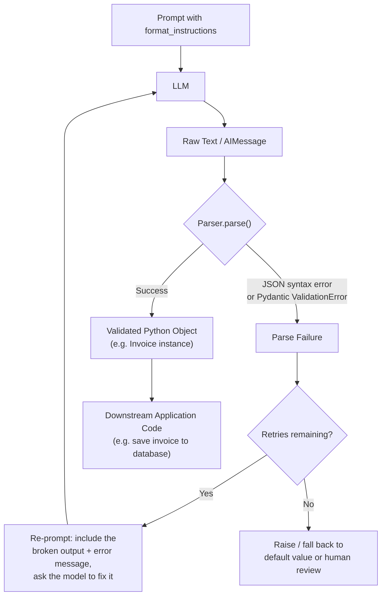

# Chapter 5: Output Parsers

> "A chat model's only real output is a string. Everything else is a contract you impose on that string." — paraphrased from the LangChain maintainers

## Learning Objectives

By the end of this chapter, you will be able to:

- Explain why LLM output — fundamentally unstructured text — needs a dedicated parsing layer before it can safely enter application code
- Use `StrOutputParser` to extract plain text from a chat model's message object, and explain why this trivial-looking parser is a load-bearing piece of every LCEL chain
- Parse JSON out of LLM responses with `JsonOutputParser`, including the streaming/partial-JSON case
- Define a Pydantic schema, generate format instructions with `PydanticOutputParser`, and trace the full round trip from schema to validated object
- Use `.with_structured_output()` on a chat model and explain why tool-calling-based structured output is generally more reliable in production than prompt-based parsing
- Parse simple delimited lists with `CommaSeparatedListOutputParser`
- Write a custom parser by subclassing `BaseOutputParser` for a bespoke output format (e.g., extracting a fenced code block)
- Diagnose and prevent the most common production failure mode in this chapter: malformed LLM output silently corrupting downstream data because nothing validated it at the boundary

---

## Prerequisites for This Chapter

This chapter builds on **[Chapter 4: Prompt Templates](./04-prompt-templates.md)**, where you learned:

- How `PromptTemplate` and `ChatPromptTemplate` turn a static string into a reusable, variable-driven template
- How `partial()` and input variables let you inject content into a prompt at construction time or at invocation time
- That a prompt template's job ends the moment it hands a fully-formed prompt to the model — it says nothing about what shape the model's *reply* will take

That last point is exactly the gap this chapter fills. A prompt template controls what goes **into** the LLM. An output parser controls what comes **out**. You already know, from working with raw chat completions in FastAPI services, that a chat model's response is fundamentally a string (wrapped in an `AIMessage` in LangChain's case) — there is no built-in guarantee that string is JSON, a list, or anything else machine-readable, no matter how firmly the prompt asked for it. Output parsers are LangChain Core's answer to "how do I turn that string into a Python object I can actually use?"

No new setup is required beyond what Chapter 1 already established (a working `langchain-core` install and an API key for whichever chat model provider you're using in examples).

---

## 1. The Problem: LLMs Only Speak Text

### 1.1 Why this is harder than it sounds

An LLM API call, at the protocol level, returns a string of tokens. Even "JSON mode" or "function calling" features — which do constrain the model's output — still ultimately hand your code a string (or a structured field that was itself produced by the model choosing tokens). Your application code, meanwhile, almost never wants a string. It wants:

- A Python `dict` it can `.get("amount")` from
- A validated `Invoice` object with typed fields it can pass to an ORM
- A `list[str]` it can iterate over
- A single boolean or enum value it can branch on

The gap between "the model produced some tokens that look like they contain the answer" and "my code has a typed, validated object" is real work, and it is where a surprising number of production LLM bugs live. Consider this raw model output, entirely plausible from a real chat completion:

```
Sure! Here's the invoice data you requested:

```json
{
  "vendor": "Acme Corp",
  "amount": 1200.50,
  "due_date": "2026-08-01"
}
```

Let me know if you need anything else!
```

A naive `json.loads(response)` on this string throws immediately — the JSON is wrapped in conversational filler and Markdown code fences. This is normal, expected LLM behavior, not a bug in the model. **Output parsers exist to absorb this messiness in one reusable place**, instead of every call site in your codebase writing its own ad-hoc string-cleanup logic.

### 1.2 The core data flow

Every output parser in LangChain Core, no matter how simple or elaborate, implements the same conceptual pipeline:

```
LLM  →  Raw Text (or AIMessage)  →  Parser  →  Python Object
```

The parser is the single seam between "whatever the model felt like producing" and "the typed data your business logic depends on." Section 8 gives this flow a full diagram, including what happens when parsing fails.

### 1.3 The `BaseOutputParser` contract

Every parser in this chapter is, at some level, an implementation of LangChain Core's `BaseOutputParser` (or the more general `Runnable` interface — a preview of Chapter 6, since parsers are themselves runnables and slot directly into LCEL chains with the `|` operator). The contract is small:

```python
from langchain_core.output_parsers import BaseOutputParser

class BaseOutputParser(Runnable):
    def parse(self, text: str) -> Any:
        """Parse the raw text output of an LLM call into a structured object."""
        ...

    def get_format_instructions(self) -> str:
        """Return instructions to inject into the prompt, telling the model
        how to format its output so this parser can read it back."""
        ...
```

Two methods, two responsibilities: `get_format_instructions()` shapes the *request* (what you ask the model to produce), and `parse()` shapes the *response* (what you do with what comes back). Keeping both together on one object is deliberate — the format instructions and the parsing logic must always agree with each other, and coupling them in a single class prevents them from drifting out of sync.

---

## 2. `StrOutputParser`: The Simplest Parser

### 2.1 What it does

`StrOutputParser` is almost embarrassingly simple: given a chat model's `AIMessage` (or a plain string), it returns `message.content` as a string.

```python
from langchain_core.output_parsers import StrOutputParser
from langchain_core.messages import AIMessage

parser = StrOutputParser()

message = AIMessage(content="The capital of France is Paris.")
result = parser.invoke(message)

print(result)          # "The capital of France is Paris."
print(type(result))    # <class 'str'>
```

That's the entire parser. No regex, no schema, no validation. So why does it deserve its own section — and why is it the single most commonly used parser in real LangChain codebases?

### 2.2 Why it matters: normalizing the interface

Recall that a chat model's `.invoke()` call doesn't return a plain string — it returns an `AIMessage` object, which carries `.content`, but also `.additional_kwargs`, `.response_metadata`, tool call information, and more. If you're piping the model's output into more application code (or, critically, into an LCEL chain — Chapter 6), you usually don't want to carry that whole message object forward. You want the text.

`StrOutputParser` is the standard, idiomatic way to say "give me just the text" at the end of a chain:

```python
chain = prompt | model | StrOutputParser()
answer: str = chain.invoke({"topic": "octopuses"})
```

Without the parser, `chain.invoke(...)` would return an `AIMessage`; with it, you get a plain `str` — exactly what a downstream function expecting text (a summarizer, a database write, an API response body) wants. This looks trivial in isolation, but it is the single most common final link in production LCEL chains, which is why it earns a mention before anything else: **it's the "identity function with the right shape" that makes chains composable with ordinary Python code.** You'll see this pattern constantly once Chapter 6 introduces the `|` (pipe) operator for composing runnables.

### 2.3 When you *don't* want it

If you need the model's tool calls, token usage metadata, or `response_metadata` (e.g., to log cost per call), stripping down to `.content` throws that information away. In those cases you keep working with the raw `AIMessage` and extract what you need manually, rather than reaching for `StrOutputParser`.

---

## 3. `JsonOutputParser`: Parsing JSON Out of LLM Output

### 3.1 The basic case

`JsonOutputParser` does two things `StrOutputParser` doesn't: it tolerates the Markdown-fence wrapping shown in Section 1.1, and it parses the result into a Python `dict` (or list) rather than leaving it as a string.

```python
from langchain_core.output_parsers import JsonOutputParser

parser = JsonOutputParser()

raw_text = """Sure! Here's the invoice data you requested:

```json
{
  "vendor": "Acme Corp",
  "amount": 1200.50,
  "due_date": "2026-08-01"
}
```

Let me know if you need anything else!"""

result = parser.parse(raw_text)
print(result)
# {'vendor': 'Acme Corp', 'amount': 1200.5, 'due_date': '2026-08-01'}
print(type(result))   # <class 'dict'>
```

Internally, `JsonOutputParser` strips Markdown code fences (looking for ` ```json ... ``` ` or a bare ` ``` ... ``` ` block) and any leading/trailing conversational text, then hands the remaining substring to a JSON parser. This single behavior — "find the JSON object embedded in a chattier response and ignore the surrounding prose" — is why `JsonOutputParser` is reached for far more often than a bare `json.loads()` call.

### 3.2 Format instructions

Like every parser, `JsonOutputParser` can describe itself for injection into a prompt:

```python
print(parser.get_format_instructions())
```

```
Return a JSON object.
```

On its own this is a fairly generic instruction. `JsonOutputParser` becomes considerably more useful when given a Pydantic model to describe the *shape* of the expected JSON (it accepts an optional `pydantic_object` argument, producing instructions much like Section 5's `PydanticOutputParser` — the two parsers are closely related, and `JsonOutputParser` with a schema is a lighter-weight alternative when you want a `dict` back rather than a validated Pydantic instance).

### 3.3 Streaming and partial JSON

This is `JsonOutputParser`'s most distinctive feature. When a chain streams tokens (covered fully in Chapter 6's discussion of `.stream()`), the model produces its JSON object one token at a time — meaning at any given moment mid-stream, the accumulated text so far is *invalid, incomplete* JSON:

```
{"vendor": "Acme Corp", "amount": 12
```

A naive `json.loads()` on that partial string raises a `JSONDecodeError` on every single intermediate chunk. `JsonOutputParser` is built to handle this: when used in a streaming context, it repairs incomplete JSON on the fly (closing unterminated strings, arrays, and objects) and yields the *best-effort partial dict* at each step, filling in fields as they complete:

```python
chain = prompt | model | JsonOutputParser()

for chunk in chain.stream({"vendor_hint": "Acme Corp"}):
    print(chunk)

# {}
# {'vendor': 'Acme'}
# {'vendor': 'Acme Corp'}
# {'vendor': 'Acme Corp', 'amount': 12}
# {'vendor': 'Acme Corp', 'amount': 1200.5}
# {'vendor': 'Acme Corp', 'amount': 1200.5, 'due_date': '2026-08-01'}
```

This is genuinely useful for streaming a partially-built object to a UI (e.g., progressively rendering an invoice form as fields arrive) instead of waiting for the entire response before showing anything. The trade-off: every intermediate dict is provisional by definition — never treat a mid-stream chunk as final, only the last one emitted after the stream closes.

---

## 4. List Parsers: `CommaSeparatedListOutputParser`

Not every structured output needs full JSON. Sometimes you just want a list of short items — keywords, tags, categories — and asking the model for JSON is more ceremony than the task warrants. `CommaSeparatedListOutputParser` handles this common, lighter-weight case.

```python
from langchain_core.output_parsers import CommaSeparatedListOutputParser

parser = CommaSeparatedListOutputParser()

print(parser.get_format_instructions())
```

```
Your response should be a list of comma separated values, eg: `foo, bar, baz`
```

```python
raw_text = "Python, JavaScript, Go, Rust"
result = parser.parse(raw_text)
print(result)          # ['Python', 'JavaScript', 'Go', 'Rust']
print(type(result))    # <class 'list'>
```

Parsing is simply `text.split(",")` with whitespace stripped from each item — no JSON, no schema, minimal room for the model to get the format wrong. This makes it a good default for any "give me a short list of X" prompt where a full Pydantic schema would be overkill. LangChain Core ships sibling parsers for related shapes (e.g., numbered lists), following the same "cheap format, forgiving parser" philosophy.

---

## 5. `PydanticOutputParser`: The Full Round Trip

This is the parser that matters most for production systems, because it's the one that gives you **validation**, not just parsing. JSON parsing tells you the text was *well-formed*; Pydantic validation tells you the text was *correct* — right field names, right types, required fields present.

### 5.1 Defining the schema

```python
from pydantic import BaseModel, Field
from typing import List


class LineItem(BaseModel):
    description: str = Field(description="What the line item is for")
    quantity: int = Field(description="Number of units")
    unit_price: float = Field(description="Price per unit in USD")


class Invoice(BaseModel):
    vendor: str = Field(description="Name of the vendor issuing the invoice")
    amount: float = Field(description="Total invoice amount in USD")
    due_date: str = Field(description="Payment due date in YYYY-MM-DD format")
    line_items: List[LineItem] = Field(description="Individual billed items")
```

This is an ordinary Pydantic model — nothing LangChain-specific about it yet. `Field(description=...)` is standard Pydantic; those descriptions matter more than usual here, because they're about to be surfaced to the LLM as instructions (Section 5.2).

### 5.2 Creating the parser and generating format instructions

```python
from langchain_core.output_parsers import PydanticOutputParser

parser = PydanticOutputParser(pydantic_object=Invoice)

print(parser.get_format_instructions())
```

This produces something close to the following (LangChain generates this from the Pydantic model's JSON schema):

```
The output should be formatted as a JSON instance that conforms to the JSON schema below.

As an example, for the schema {"properties": {"foo": {"title": "Foo", "description": "a list of strings", "type": "array", "items": {"type": "string"}}}, "required": ["foo"]}
the object {"foo": ["bar", "baz"]} is a well-formatted instance of the schema. The object {"properties": {"foo": ["bar", "baz"]}} is not well-formatted.

Here is the output schema:
```
{"description": "", "properties": {"vendor": {"description": "Name of the vendor issuing the invoice", "title": "Vendor", "type": "string"}, "amount": {"description": "Total invoice amount in USD", "title": "Amount", "type": "number"}, "due_date": {"description": "Payment due date in YYYY-MM-DD format", "title": "Due Date", "type": "string"}, "line_items": {"description": "Individual billed items", "items": {"$ref": "#/$defs/LineItem"}, "title": "Line Items", "type": "array"}}, "required": ["vendor", "amount", "due_date", "line_items"]}
```
```

This is the format instructions in full: a generic explanation of "JSON conforming to a schema," plus the actual JSON Schema derived from your `Invoice` model, including every field's type and description. Crucially, **you never hand-write this text** — it's generated automatically from the Pydantic class, so if you add a field to `Invoice`, the instructions update automatically the next time you call `get_format_instructions()`. This is the mechanism that keeps the prompt and the parser in sync (Section 1.3's promise, realized).

### 5.3 Injecting format instructions into the prompt

```python
from langchain_core.prompts import ChatPromptTemplate

prompt = ChatPromptTemplate.from_messages([
    ("system", "Extract invoice details from the text below.\n\n{format_instructions}"),
    ("human", "{invoice_text}"),
]).partial(format_instructions=parser.get_format_instructions())
```

Recall `partial()` from Chapter 4: it bakes a value into the template at construction time so callers only need to supply `invoice_text` at invocation time. This is *the* standard pattern for wiring a parser into a prompt — `format_instructions` is a variable name you'll see repeatedly in LangChain code, but it's just a convention, not a magic keyword.

### 5.4 The full round trip, traced by hand

Put together, the round trip looks like this:

```
Schema (Invoice class)
   │  parser.get_format_instructions()
   ▼
Format Instructions (JSON Schema text)
   │  prompt.partial(format_instructions=...)
   ▼
Prompt (system message with schema + human message with invoice text)
   │  model.invoke(prompt_value)
   ▼
Raw Text (AIMessage.content — the model's attempt at matching the schema)
   │  parser.parse(raw_text)
   ▼
Validated Pydantic Object (Invoice instance)
```

Now trace a concrete example. Suppose the human message is:

```
Acme Corp
Invoice #4471
2 x Widget Assembly @ $450.00 = $900.00
1 x Shipping & Handling @ $50.50 = $50.50
Total due: $950.50
Due 2026-08-01
```

A well-behaved model, guided by the format instructions from Section 5.2, might return:

```json
{
  "vendor": "Acme Corp",
  "amount": 950.50,
  "due_date": "2026-08-01",
  "line_items": [
    {"description": "Widget Assembly", "quantity": 2, "unit_price": 450.00},
    {"description": "Shipping & Handling", "quantity": 1, "unit_price": 50.50}
  ]
}
```

Calling `parser.parse(raw_text)` does two things in sequence, and it's worth separating them mentally even though the call looks atomic:

1. **JSON parsing** — the string is valid JSON, so `json.loads()` succeeds and produces a plain `dict`.
2. **Pydantic validation** — that `dict` is fed into `Invoice(**dict)`. Pydantic checks: is `vendor` a string? Yes. Is `amount` coercible to `float`? Yes. Is `due_date` present and a string? Yes. Is `line_items` a list of objects each matching `LineItem`'s shape (`description: str`, `quantity: int`, `unit_price: float`)? Yes, both entries qualify.

The result is a live Python object:

```python
result: Invoice = parser.parse(raw_text)

result.vendor              # "Acme Corp"
result.amount               # 950.5
result.due_date              # "2026-08-01"
result.line_items[0].description   # "Widget Assembly"
result.line_items[0].quantity      # 2
sum(li.quantity * li.unit_price for li in result.line_items)  # 950.5
```

Notice what you get for free that `JsonOutputParser` alone would not have given you: `result` is a real `Invoice` instance, not a `dict`, so `result.line_items[0].quantity` is guaranteed to be an actual `int` (Pydantic coerces or rejects, it doesn't silently pass through a string), and any code downstream can rely on that type without a defensive `isinstance` check.

### 5.5 What happens when the model gets it wrong

Suppose instead the model returns:

```json
{
  "vendor": "Acme Corp",
  "amount": "nine hundred fifty dollars and fifty cents",
  "due_date": "2026-08-01",
  "line_items": []
}
```

`json.loads()` still succeeds — this is syntactically valid JSON. But `Invoice(**dict)` raises a Pydantic `ValidationError`: `amount` cannot be coerced from the string `"nine hundred fifty dollars and fifty cents"` into a `float`. This is precisely the boundary this chapter cares about most: the failure is caught **before** `950.5`-shaped garbage silently enters an accounting system as `0.0` or a string that later breaks arithmetic. Section 8 covers what a production chain does with this exception (retry), and Section 10 walks through the cost of skipping this validation step entirely.

### 5.6 `.with_structured_output()`: the modern alternative

Everything in Sections 5.1–5.5 relies on **prompting** the model to produce matching JSON, then parsing text after the fact. Modern chat models expose a more direct mechanism: **tool calling** (or provider-native "structured output" / "JSON mode" APIs). LangChain Core exposes this uniformly across providers via `.with_structured_output()`, available directly on any chat model:

```python
structured_model = model.with_structured_output(Invoice)

result: Invoice = structured_model.invoke(
    "Acme Corp\n2 x Widget Assembly @ $450.00\n1 x Shipping @ $50.50\nDue 2026-08-01"
)

print(type(result))     # <class '__main__.Invoice'>
print(result.vendor)    # "Acme Corp"
```

No prompt template needs `{format_instructions}` injected, and no separate `.parse()` call is needed — `with_structured_output()` returns a new runnable that internally: (1) converts your Pydantic model into a tool/function schema, (2) forces the model to "call" that tool with arguments matching the schema, and (3) parses the tool call arguments back into your Pydantic object, all in one step. The model provider's own constrained-decoding or function-calling machinery — not a hand-written prompt convention — is what enforces the shape.

### 5.7 Why `.with_structured_output()` tends to win in production

The reason this matters is reliability, not convenience:

- **Prompt-based parsing (`PydanticOutputParser`) asks nicely.** The format instructions are just more text in the prompt; a model can (and, at scale, occasionally will) ignore them, wrap the JSON in extra prose despite instructions not to, use the wrong field name, or omit a required field. Nothing *forces* compliance — the parser only detects noncompliance after the fact.
- **Tool-calling-based structured output (`.with_structured_output()`) constrains generation itself.** Many providers implement function/tool calling with grammar-constrained decoding or a dedicated output channel separate from conversational text, meaning the model is architecturally steered (in some cases guaranteed) to emit arguments matching the schema. There's no conversational filler to strip, no Markdown fence to find, no risk of "Sure! Here's your JSON:" preceding the payload.
- **Fewer moving parts.** One method call replaces "write format instructions into the prompt, remember to inject them, call the model, call the parser, handle the parser's exceptions" with a single composed runnable.

**When you'd still reach for a manual parser instead:**

- The model or provider you're using doesn't support tool calling or structured output natively (some open-source/local models via certain integrations).
- You need the *specific* prompt-engineering control of showing the model a JSON Schema and free-form instructions — e.g., research or fine-tuning contexts where you're deliberately testing how well a model follows format instructions unaided.
- You're parsing a legacy or bespoke text format that has nothing to do with JSON at all (Section 6) — tool calling doesn't help you extract a fenced code block or a semicolon-delimited log line.
- You want `JsonOutputParser`'s streaming partial-parse behavior (Section 3.3), which not every `.with_structured_output()` backend supports identically.

**The practical rule of thumb:** default to `.with_structured_output()` whenever your model provider supports it and your target shape is a Pydantic model. Reach for `PydanticOutputParser` (or a custom parser) when you need fine control over the prompt itself, need streaming partials, or are working with a model/output format that tool calling doesn't cover.

---

## 6. Custom Parsers: Subclassing `BaseOutputParser`

Sometimes the output isn't JSON, a Pydantic-shaped object, or a comma list — it's some bespoke text convention the model was asked to follow. A common example: asking a model to return a code block and extracting just the code, ignoring any explanation around it.

### 6.1 Subclassing `BaseOutputParser`

```python
from langchain_core.output_parsers import BaseOutputParser
import re


class CodeBlockOutputParser(BaseOutputParser[str]):
    """Extracts the contents of the first fenced code block from LLM output."""

    def parse(self, text: str) -> str:
        match = re.search(r"```(?:\w+)?\n(.*?)```", text, re.DOTALL)
        if match is None:
            raise ValueError(f"No fenced code block found in output: {text!r}")
        return match.group(1).strip()

    def get_format_instructions(self) -> str:
        return (
            "Return your answer as a single fenced code block, "
            "e.g. ```python\\n<code here>\\n```. Do not include any text "
            "outside the code block."
        )
```

Usage is identical to any built-in parser:

```python
parser = CodeBlockOutputParser()

raw_text = """Here's the function you asked for:

```python
def add(a, b):
    return a + b
```

Let me know if you want tests too!"""

code = parser.parse(raw_text)
print(code)
# def add(a, b):
#     return a + b
```

The pattern to internalize: a custom parser is just a class with a `parse(text) -> T` method and a `get_format_instructions()` method describing the convention to the model. There's no limit on `T` — it can be a string (as above), a `dict`, a dataclass, a Pydantic model, or a domain-specific object (an AST node, a SQL query object, a coordinate pair) as long as `parse()` knows how to build it from text.

### 6.2 `RunnableLambda`: a lighter-weight alternative

Chapter 6 introduces `RunnableLambda` in depth — for now, know that it wraps a plain Python function so it can be composed with `|` inside an LCEL chain, without the ceremony of a full `BaseOutputParser` subclass:

```python
from langchain_core.runnables import RunnableLambda

def extract_code_block(text: str) -> str:
    match = re.search(r"```(?:\w+)?\n(.*?)```", text, re.DOTALL)
    if match is None:
        raise ValueError(f"No fenced code block found in output: {text!r}")
    return match.group(1).strip()

extract_code = RunnableLambda(extract_code_block)

chain = prompt | model | StrOutputParser() | extract_code
```

**When to pick which:** reach for `RunnableLambda` when the parsing logic is a one-off function you won't reuse elsewhere and don't need `get_format_instructions()` for. Reach for a `BaseOutputParser` subclass when the format is something you'll parse repeatedly across a codebase, want to unit-test as its own object, or want format instructions bundled with the parsing logic so the two never drift apart (Section 1.3).

---

## 7. Comparing the Parser Family

| Parser | Output type | Handles Markdown fences? | Validates types? | Best for |
|---|---|---|---|---|
| `StrOutputParser` | `str` | N/A | No | Final step of a chain that just needs plain text |
| `JsonOutputParser` | `dict` / `list` | Yes | No (structural only) | Loosely-shaped JSON, streaming partial objects |
| `CommaSeparatedListOutputParser` | `list[str]` | No | No | Short keyword/tag lists |
| `PydanticOutputParser` | Pydantic model instance | Yes | Yes (full validation) | Any output that must match a strict, typed schema |
| `.with_structured_output()` | Pydantic model instance (or `dict`/`TypedDict`) | N/A (tool-calling, not text scraping) | Yes | Production structured extraction when the provider supports tool calling |
| Custom (`BaseOutputParser` subclass / `RunnableLambda`) | Anything | You decide | You decide | Bespoke formats — fenced code, custom delimiters, legacy text conventions |

---

## 8. The Data Flow, Including Retry on Parse Failure

Parsing failures are not exceptional in the way a network timeout is exceptional — they're a routine, expected outcome of asking a probabilistic model to follow a formatting convention. Production chains need an explicit retry path, not just a `try/except` that gives up.



Two implementation notes worth calling out explicitly:

- **`OutputFixingParser` and `RetryOutputParser`** are LangChain Core/LangChain utilities built exactly for the `G → H → B` loop in the diagram: they wrap a base parser, and on failure, send the broken output plus the validation error back to the LLM with a request to fix it, then re-parse the corrected response. This automates the retry path rather than requiring you to hand-write a loop around every parser call.
- **`.with_structured_output()` reduces how often you land in the `F` branch at all** (Section 5.7), but does not eliminate it — providers can still occasionally return arguments that fail your Pydantic model's validation (e.g., a date string in the wrong format), so the retry path is still worth having even when you've adopted the more reliable mechanism.

---

## 9. Real-World Scenario

**Scenario:** A fintech startup builds an invoice-extraction pipeline: incoming vendor invoices (scanned PDFs, run through OCR) are sent to an LLM with a prompt asking it to extract `vendor`, `amount`, `due_date`, and `line_items` as JSON. The team, moving fast, parses the response with a bare `json.loads()` and writes the resulting `dict` directly into the accounting system's `payments` table — no schema, no validation, just "if it parses as JSON, trust it."

For the first few weeks, everything looks fine. Then a support ticket arrives: a vendor was paid $12,000 instead of $1,200.00. Investigation reveals the LLM had returned:

```json
{
  "vendor": "Acme Corp",
  "amount": "1,200.00",
  "due_date": "08/01/2026",
  "line_items": []
}
```

Two silent corruptions happened at once:

1. **`amount` was returned as the string `"1,200.00"`**, not a number. `json.loads()` parsed this without complaint — it's perfectly valid JSON, just the wrong *type* for the field's intended meaning. Downstream code that expected a float did a naive numeric coercion on the string, and a locale-unaware parser dropped the comma incorrectly, turning `"1,200.00"` into `1200000` cents or `120000` depending on which layer mishandled it — the exact mechanism varied ticket to ticket, which is itself a symptom of the real problem: nothing was validating the shape at the boundary, so every downstream layer had to invent its own defensive coercion, inconsistently.
2. **`due_date` was returned as `"08/01/2026"`** — US month/day format — while the accounting system's date parser assumed ISO `YYYY-MM-DD`. Some invoices got silently misdated by months, throwing off payment scheduling and aging reports.

Neither failure raised an exception. `json.loads()` doesn't know or care that `amount` should be numeric or that `due_date` should follow a specific format — it only guarantees the text was syntactically valid JSON. The bad data flowed straight into the accounting system and stayed there until a human noticed a payment was wrong by an order of magnitude.

**The fix:** the team replaced the bare `json.loads()` call with a `PydanticOutputParser` (`Invoice` schema from Section 5.1), with `amount: float` and `due_date` validated against an explicit `YYYY-MM-DD` pattern using a Pydantic field validator. Once in place, the exact same malformed LLM response now fails loudly at the parser boundary — `ValidationError: amount is not a valid float` — before a single row is written to the `payments` table. The failed extraction is routed to a human-review queue instead of the database, and the retry loop from Section 8 gives the pipeline one automatic chance to get a corrected response before falling back to that queue.

**Lesson:** "it parsed as JSON" and "it matches the schema my downstream code depends on" are different claims, and conflating them is exactly how silent data corruption enters a system that otherwise looks like it's working correctly. Validation belongs at the parser boundary — the earliest point where you can still cheaply say "this is wrong" instead of discovering it three systems downstream as a support ticket.

---

## 10. Best Practices

- **Prefer `.with_structured_output()` for anything going into a database, an API response, or another system of record.** It's the most reliable mechanism available today for getting a validated object back from a chat model, and it should be your default, not your fallback.
- **Never treat "valid JSON" as "correct data."** `JsonOutputParser` (and a bare `json.loads()`) only guarantee syntax. Always validate types and required fields with a Pydantic schema (`PydanticOutputParser` or `.with_structured_output()`) before the data reaches anything that persists or acts on it — this is the single lesson of Section 9.
- **Always inject format instructions into the prompt when using a prompt-based parser**, and keep them close to the schema (`parser.get_format_instructions()` generated fresh, never hand-copied into the prompt text) so the two never drift apart.
- **Build a retry path for parse failures**, whether via `OutputFixingParser`/`RetryOutputParser` or a hand-written loop — treat a parse failure as an expected, recoverable event, not an unhandled exception that crashes a request.
- **Use `StrOutputParser` as the default final step of any LCEL chain** that doesn't need structured output — it's the cheap, idiomatic way to normalize a chain's output type to plain text.
- **Reach for `JsonOutputParser`'s streaming mode deliberately**, and only treat the *final* emitted chunk as authoritative — never act on an intermediate partial object as if it were complete.
- **Write custom parsers as classes, not inline lambdas, once the format is reused** across more than one call site — bundling `parse()` and `get_format_instructions()` together prevents the two from silently falling out of sync as requirements evolve.
- **Log both the raw model output and the parsed result** in production, at least during rollout — when a parse failure happens at 2am, you want the exact string the model returned, not just "ValidationError."

---

## 11. Common Mistakes

- **Calling `json.loads()` directly on chat model output** without stripping Markdown fences or conversational filler — fails on the very first response that includes "Sure! Here's the JSON:" before the payload, which is common, not rare.
- **Treating a `dict` from `JsonOutputParser` as if it were validated**, when it has only been parsed. A `dict` can have the right keys and the wrong types (a string where a number was expected), and code that assumes otherwise fails downstream in ways that are hard to trace back to the LLM call.
- **Hand-writing format instructions instead of generating them from the schema.** When someone edits the Pydantic model but forgets to update a hand-typed instructions string, the prompt and the parser silently disagree, and failures become mysterious and intermittent.
- **No retry path on parse failure.** A single malformed response crashes the request (or worse, propagates a partially-constructed object) instead of giving the model one more chance to self-correct, which is often all it takes.
- **Assuming `.with_structured_output()` makes validation failures impossible.** It makes them rarer, not impossible — a date field can still arrive in the wrong format, and code that skips a `try/except` around the call is one edge case away from an unhandled exception in production.
- **Ignoring streaming partial JSON's provisional nature** — rendering a mid-stream chunk from `JsonOutputParser` to a user as if it were the final answer, then having fields change or appear out of order as the stream continues, producing a confusing flicker in the UI.
- **Using `CommaSeparatedListOutputParser` for items that might themselves contain commas** (e.g., addresses, monetary amounts formatted with thousands separators) — the naive split-on-comma breaks silently, producing more list items than intended.

---

## Summary

- LLMs fundamentally return unstructured text; **output parsers** are the dedicated layer that turns that text into typed Python objects your application code can trust.
- `StrOutputParser` extracts plain text from an `AIMessage` — trivial in isolation, but the standard final step of most LCEL chains (previewed here, formalized in Chapter 6).
- `JsonOutputParser` tolerates Markdown-fenced and conversationally-wrapped JSON, parses it into a `dict`/`list`, and supports **streaming partial JSON** for progressive rendering — but performs no type validation.
- `PydanticOutputParser` provides the full round trip — **Schema → format_instructions → Prompt → LLM → raw text → Parser → validated Pydantic object** — and is the parser of choice whenever correctness, not just syntactic validity, matters.
- `.with_structured_output()` uses tool-calling (or provider-native structured output) to constrain generation directly, and is generally **more reliable in production** than prompt-based parsing because it doesn't rely on the model voluntarily following textual instructions.
- Custom parsers, via `BaseOutputParser` subclasses or lightweight `RunnableLambda` wrapping, handle bespoke formats (fenced code blocks, delimited text) that no built-in parser covers.
- The core data flow is **LLM → Raw Text → Parser → Python Object**, with an essential retry loop for the routine case where parsing fails.
- Validation at the parser boundary is not optional polish — it is what stands between a probabilistic model's occasional formatting mistakes and silent corruption of downstream systems of record, as the invoice-extraction scenario in Section 9 demonstrates directly.

---

## Knowledge Check

1. Explain, in your own words, the difference between "the text parsed successfully as JSON" and "the parsed data is correct." Why does conflating the two lead to the failure mode described in Section 9?
2. Walk through the full round trip for `PydanticOutputParser`, naming each of the six stages between the Pydantic schema and the final validated object.
3. Why is `.with_structured_output()` generally considered more reliable than `PydanticOutputParser` for production use? Under what circumstances would you still choose a manual parser instead?
4. `JsonOutputParser` used in streaming mode can emit an intermediate chunk like `{'vendor': 'Acme'}` before the full object has arrived. What mistake would a UI make if it treated that chunk as final, and how should it instead be handled?
5. You need to extract a SQL query that the model wraps in a fenced code block, ignoring any explanation text around it. Would you reach for `JsonOutputParser`, `PydanticOutputParser`, or a custom parser — and why?
6. Describe the retry loop in the Section 8 diagram in your own words: what triggers it, what gets sent back to the LLM, and what happens if retries are exhausted?

---

## Hands-On Exercise

**Build an Invoice Extractor using `PydanticOutputParser`.**

1. Define an `Invoice` Pydantic model with fields `vendor: str`, `amount: float`, `due_date: str`, and `line_items: List[LineItem]`, where `LineItem` has `description: str`, `quantity: int`, and `unit_price: float` (use Section 5.1 as your starting point, but write it out yourself rather than copying).
2. Construct a `PydanticOutputParser` from your `Invoice` model and print its `get_format_instructions()` output. Confirm it reflects every field and description you defined.
3. Build a `ChatPromptTemplate` with a system message that includes `{format_instructions}` (injected via `.partial()`) and a human message placeholder for `{invoice_text}`.
4. By hand (no code execution — reason through it on paper or in comments), trace what the parser would do with each of these three raw model outputs:
   - A well-formed JSON object matching the schema exactly.
   - A JSON object wrapped in "Here's the extracted data:" text and a Markdown code fence.
   - A JSON object where `amount` is the string `"$1,200.50"` instead of a number.
5. For the third case, write out the exact Pydantic `ValidationError` message you'd expect, and describe what your pipeline should do next (retry, human-review queue, or reject) and why.
6. **Bonus:** Rewrite the same extractor using `model.with_structured_output(Invoice)` instead of the prompt + `PydanticOutputParser` combination, and write a short comparison (3-5 sentences) of what changed in your code and what you gained or lost.

---

## Further Reading

- [LangChain Output Parsers Documentation](https://python.langchain.com/docs/concepts/output_parsers/) — official conceptual guide to the parser family covered in this chapter
- [LangChain: Structured Output Guide](https://python.langchain.com/docs/how_to/structured_output/) — official how-to for `.with_structured_output()` across providers
- [Pydantic Documentation: Models & Validation](https://docs.pydantic.dev/latest/concepts/models/) — the validation engine underlying `PydanticOutputParser` and `.with_structured_output()`
- [LangChain: `JsonOutputParser` API Reference](https://python.langchain.com/api_reference/core/output_parsers/langchain_core.output_parsers.json.JsonOutputParser.html) — implementation details, including streaming/partial-parse behavior
- [LangChain: `OutputFixingParser` and Retry Parsing](https://python.langchain.com/docs/how_to/output_parser_fixing/) — automated retry-on-failure wrapping for any base parser
- [OpenAI: Function Calling / Structured Outputs Guide](https://platform.openai.com/docs/guides/structured-outputs) — provider-side mechanics behind tool-calling-based structured output

---

<div style="display:flex;justify-content:space-between;align-items:center;">
  <a href="./04-prompt-templates.md">← Previous: Prompt Templates</a>
  <a href="./00-index.md">🏠 Index</a>
  <a href="./06-lcel-and-runnables.md">Next: LCEL & Runnables →</a>
</div>
