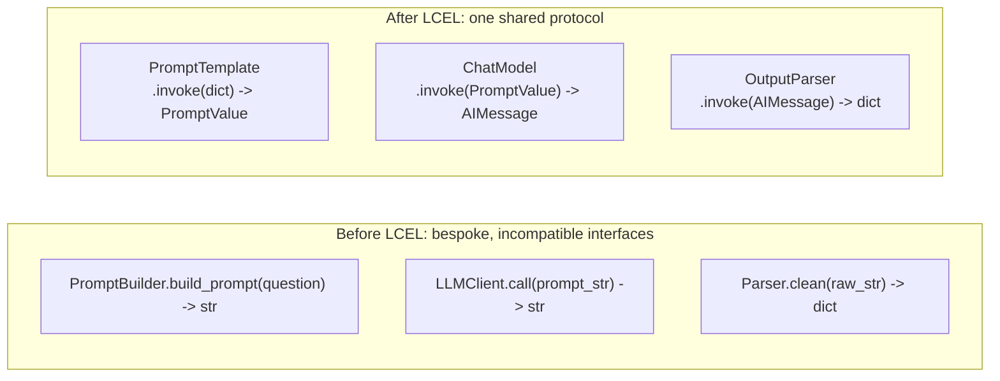
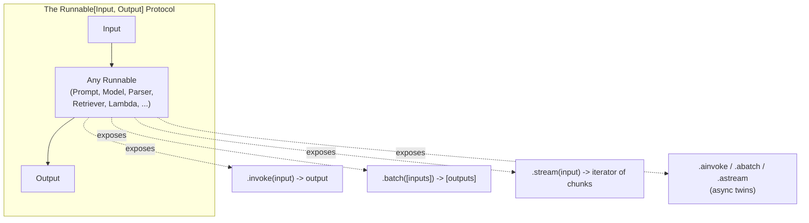
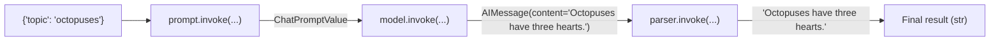
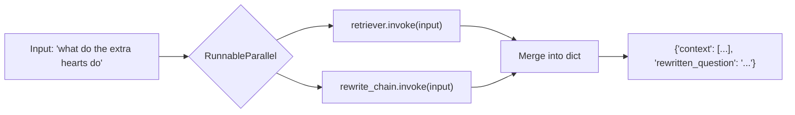
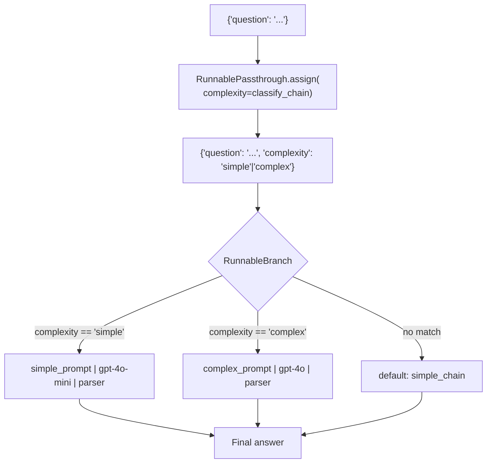
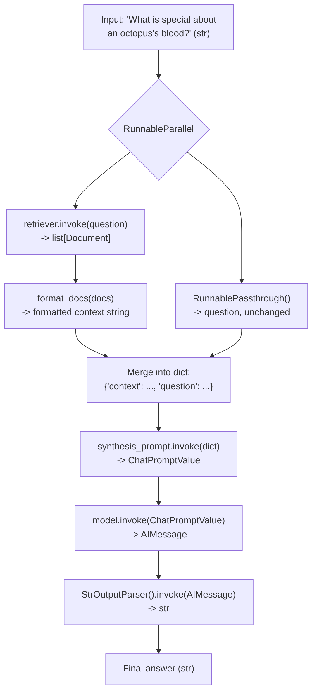

# Chapter 6: LCEL & Runnables

> "Write programs that do one thing and do it well. Write programs to work together." — Doug McIlroy, on the Unix philosophy that LCEL's `|` operator directly borrows from.

## Learning Objectives

By the end of this chapter, you will be able to:

- Explain the `Runnable` protocol precisely: the six methods (`invoke`, `batch`, `stream`, `ainvoke`, `abatch`, `astream`) that every LangChain Core component implements
- Explain, mechanically, what `prompt | model | parser` desugars to and what happens when `.invoke()` is called on the result
- Wrap arbitrary Python functions as pipeline stages using `RunnableLambda`, including handling multiple/no arguments
- Run independent computations concurrently and merge their outputs using `RunnableParallel` and the dict-literal shorthand
- Forward original input alongside derived values using `RunnablePassthrough` and `RunnablePassthrough.assign()`
- Build conditional routing logic between multiple prompt/model pairs using `RunnableBranch`
- Explain why streaming and batching "just work" across a composed chain without extra code, as a direct consequence of the uniform interface
- Build a complete, production-shaped RAG chain from scratch using nothing but Runnable primitives, and trace exactly what data flows through each stage
- Recognize and avoid the composition mistakes that most commonly break new LCEL chains

---

## Prerequisites for This Chapter

This chapter builds directly on **[Chapter 5: Output Parsers](./05-output-parsers.md)**, where you learned:

- How a parser turns raw model output (a string, or a message with a `tool_calls` payload) into a structured Python object
- That parsers, like prompts and models, are just another link in a chain — you've already been calling `prompt | model | parser` in examples without a full explanation of *why* that syntax works
- That LangChain Core components compose left-to-right, output-to-input

This chapter is where that composition mechanism finally gets named, formalized, and pushed to its limits. Everything before this chapter — `PromptTemplate`, chat models, output parsers — was, not by accident, quietly designed around one shared interface. This chapter reveals that interface: the **`Runnable` protocol**. Once it clicks, you'll see that a prompt, a model, a parser, a retriever, and even an arbitrary Python function are, from the pipeline's point of view, indistinguishable — they're all just "a thing with an `.invoke()` method." That realization is the single highest-leverage idea in this entire course.

**A scope note before you start:** this chapter teaches you how to *use* LCEL fluently and correctly. It deliberately does **not** explain how `RunnableSequence` implements streaming internally, how batching parallelizes calls, or how the underlying execution graph is built and traced. Those internals — genuinely fascinating, and worth understanding once you're comfortable using the abstraction — are the entire subject of **Chapter 15: Architecture & Internals**. If you find yourself wondering "but *how* does a generator get passed between two arbitrary objects?", hold that question; it has a satisfying answer, just not in this chapter.

---

## 1. The Problem LCEL Solves: Life Before a Uniform Interface

### 1.1 What chains looked like without a shared protocol

Imagine you're an engineer in 2022, building an LLM pipeline the "obvious" way — plain Python functions and classes, no framework opinions:

```python
def answer_question(question: str) -> str:
    # Step 1: build a prompt
    prompt_text = f"Answer the following question concisely:\n\n{question}"

    # Step 2: call the model
    raw_response = call_llm_api(prompt_text)

    # Step 3: parse the output
    cleaned = raw_response.strip().strip('"')

    return cleaned
```

This works. It is also a dead end, for reasons that only show up once the pipeline grows:

- **No streaming.** `call_llm_api` returns a complete string. To support token-by-token streaming to a UI, you'd need to rewrite this function (and every function that calls it) to work with generators instead of return values — a different code path, not a flag you flip.
- **No batching.** If you need to answer 100 questions, you either loop sequentially (slow) or hand-roll your own concurrency (`asyncio.gather`, thread pools) — bespoke, and easy to get subtly wrong (rate limits, error handling per-item).
- **No composability.** Want to add a retrieval step before the prompt? You edit the function body. Want to swap the parser? Edit again. Every change is a surgical edit to a monolithic function, not a substitution of one interchangeable piece for another.
- **No uniform observability.** Tracing what happened at each stage (for debugging or for tools like LangSmith) means manually adding logging at every step, by hand, in every pipeline you write.

Every team that builds LLM pipelines this way eventually reinvents some version of "steps as objects with a common `run()` method" — because that pattern is what unlocks composition. LangChain's answer is the **Runnable protocol**, and LCEL (**LangChain Expression Language**) is the small, deliberately boring syntax for wiring `Runnable`s together.

### 1.2 The core insight, stated directly

> **Every meaningful building block in LangChain Core — prompts, chat models, output parsers, retrievers, even tools — implements the exact same interface.** That interface has a name (`Runnable`) and a fixed set of methods. Because they all share it, they all compose with each other identically, regardless of what they do internally.

This is the single idea this whole chapter unpacks. It's not a minor implementation detail — it's the reason LangChain Core code reads the way it does, and it's why the pipe operator (`|`) is more than syntactic sugar.



The left side shows three components with three unrelated method names and three unrelated signatures — you cannot swap them, chain them generically, or reason about them uniformly. The right side shows the same three roles, but every component exposes `.invoke()`. That single shared method name is what makes `prompt | model | parser` a meaningful, general operation rather than a special case hardcoded for exactly these three types.

---

## 2. The `Runnable` Protocol, Precisely

### 2.1 The six methods

Every `Runnable` — regardless of what it actually does — exposes this interface:

| Method | Signature (conceptually) | Purpose |
|---|---|---|
| `.invoke(input, config=None)` | `Input -> Output` | Run once, synchronously, on a single input; return the complete result |
| `.batch(inputs, config=None)` | `list[Input] -> list[Output]` | Run on a list of inputs, executed concurrently where possible; return a list of results in the same order |
| `.stream(input, config=None)` | `Input -> Iterator[Output-chunk]` | Run once, synchronously, yielding partial results incrementally as they become available |
| `.ainvoke(input, config=None)` | `Input -> Awaitable[Output]` | Async twin of `.invoke()` |
| `.abatch(inputs, config=None)` | `list[Input] -> Awaitable[list[Output]]` | Async twin of `.batch()` |
| `.astream(input, config=None)` | `Input -> AsyncIterator[Output-chunk]` | Async twin of `.stream()` |

Notice the pattern: three *capabilities* (invoke, batch, stream), each available in a synchronous and an asynchronous flavor. A component author only has to implement the core logic once; LangChain Core's `Runnable` base class provides sensible default implementations of the others (e.g., a naive `.batch()` that just calls `.invoke()` in a loop, and a naive `.stream()` that just yields the single complete `.invoke()` result as one chunk) so that *every* `Runnable` works with *every* method from day one, even before it has a specialized implementation.

```python
from langchain_core.prompts import ChatPromptTemplate
from langchain_core.output_parsers import StrOutputParser
from langchain_openai import ChatOpenAI

prompt = ChatPromptTemplate.from_template("Tell me a fact about {topic}.")
model = ChatOpenAI(model="gpt-4o-mini")
parser = StrOutputParser()

# Every one of these is a Runnable — same method names, different behavior:
prompt.invoke({"topic": "octopuses"})       # -> ChatPromptValue
model.invoke([...])                          # -> AIMessage
parser.invoke(AIMessage(content="..."))      # -> str
```

Nothing here has been "chained" yet — this section is deliberately about the *shared interface itself*, in isolation, before composition enters the picture.

### 2.2 Why this matters more than it looks like it should

The value of a shared protocol isn't visible from any single component — it's visible in what becomes possible when you have *many* of them. Once every piece exposes `.invoke()`, `.batch()`, and `.stream()`:

- You can write a function that accepts "any `Runnable`" and calls `.invoke()` on it, without caring whether it's a prompt, a model, a parser, or something a teammate wrote last week.
- You can compose two `Runnable`s into a new object that is *itself* a `Runnable` — meaning composed chains can be composed again, arbitrarily deep, with no special-casing.
- Capabilities you never explicitly coded for — batching, streaming, async — propagate through composition automatically (Section 8).

### 2.3 The `Runnable` protocol as a diagram



Hold onto this diagram — every remaining primitive in this chapter (`RunnableSequence`, `RunnableParallel`, `RunnableLambda`, `RunnableBranch`, `RunnablePassthrough`) is *itself* just another box that fits into this exact same shape. That uniformity is the whole trick.

---

## 3. The Pipe Operator and `RunnableSequence`

### 3.1 What `|` actually is

In plain Python, `a | b` calls `a.__or__(b)`. LangChain Core's `Runnable` base class overrides `__or__` (and `__ror__`, for when the left-hand operand isn't itself a `Runnable`) so that writing:

```python
chain = prompt | model | parser
```

is exactly equivalent to writing:

```python
from langchain_core.runnables import RunnableSequence

chain = RunnableSequence(first=prompt, middle=[model], last=parser)
```

`RunnableSequence` is itself a `Runnable` — it implements `.invoke()`, `.batch()`, `.stream()`, and the async twins. That's the load-bearing detail: **composing Runnables produces another Runnable**, not some other kind of object. This is why you can keep piping indefinitely (`a | b | c | d | e`) and why a previously-built chain can be dropped into a *new* chain as if it were a single primitive component.

### 3.2 Tracing `.invoke()` through a sequence, step by step

Take the three-stage chain above and call it with a concrete input:

```python
chain = prompt | model | parser
result = chain.invoke({"topic": "octopuses"})
```

Here is exactly what happens, in order:

1. `RunnableSequence.invoke({"topic": "octopuses"})` is called.
2. It calls `prompt.invoke({"topic": "octopuses"})`. The prompt template fills its placeholder and returns a `ChatPromptValue` (an object wrapping a list of messages).
3. The **output of step 2 becomes the input of step 3, unmodified.** `model.invoke(<that ChatPromptValue>)` is called. The chat model sends the messages to the LLM API and returns an `AIMessage`.
4. Again, the output becomes the next input: `parser.invoke(<that AIMessage>)` is called. `StrOutputParser` extracts `.content` and returns a plain Python `str`.
5. That final string is returned as the result of `chain.invoke(...)`.



Notice the rule that governs the *entire* chapter: **the output type of each step must be a type the next step's `.invoke()` knows how to accept as input.** `RunnableSequence` does no type checking or conversion of its own — it is purely a relay. If you pipe two components whose types don't line up (say, a parser that returns a `dict` into a prompt template expecting specific keys it doesn't have), you get a runtime error at the mismatched boundary, not a friendly compile-time warning. Keeping this input/output contract straight, stage by stage, is the core skill of writing LCEL chains — everything else is vocabulary.

### 3.3 `.batch()` and `.stream()` on a sequence — no new code required

Because `chain` is a `RunnableSequence`, and `RunnableSequence` is a `Runnable`, it automatically supports:

```python
# Run the same chain over multiple inputs, concurrently where the underlying
# components support it (e.g., the model call is I/O-bound and parallelizable):
results = chain.batch([
    {"topic": "octopuses"},
    {"topic": "black holes"},
    {"topic": "sourdough bread"},
])
# -> ["Octopuses have three hearts.", "Black holes bend light.", "Sourdough uses wild yeast."]

# Stream partial output as the model generates it, token by token:
for chunk in chain.stream({"topic": "octopuses"}):
    print(chunk, end="", flush=True)
# -> "Octo" "puses " "have " "three " "hearts" "."
```

You did not write batching or streaming logic anywhere. This is Section 8's payoff arriving early as a preview — hold the thought; we'll explain precisely why it works once all the primitives are on the table.

---

## 4. `RunnableLambda`: Wrapping Arbitrary Python Functions

Real pipelines nearly always need a step that is neither a prompt, a model, nor a parser — some custom glue logic: reformatting a string, extracting a field from a dict, calling an internal API, doing basic validation. `RunnableLambda` is how a plain Python function becomes a first-class citizen of an LCEL chain.

### 4.1 Basic usage

```python
from langchain_core.runnables import RunnableLambda

def uppercase_topic(input_dict: dict) -> dict:
    return {"topic": input_dict["topic"].upper()}

shout_topic = RunnableLambda(uppercase_topic)

shout_topic.invoke({"topic": "octopuses"})
# -> {"topic": "OCTOPUSES"}
```

`shout_topic` now has `.invoke()`, `.batch()`, `.stream()` — the full protocol — even though `uppercase_topic` is a completely ordinary function that knows nothing about LangChain.

### 4.2 The implicit wrapping shortcut

In practice, you rarely construct `RunnableLambda` explicitly, because LCEL auto-wraps plain functions when they appear on either side of a `|`:

```python
chain = RunnableLambda(uppercase_topic) | prompt | model | parser

# Equivalent — LangChain wraps the bare function for you automatically
# when it detects a callable being piped:
chain = uppercase_topic | prompt | model | parser
```

Both forms behave identically; the explicit form is clearer when you want to name the step or reuse it elsewhere, and it is required in contexts where auto-wrapping isn't triggered (e.g., passing a function as a *value* inside a `RunnableParallel` dict is auto-wrapped too, but it's worth knowing the explicit constructor exists for cases where you need to be unambiguous).

### 4.3 Functions with more than one argument, or none

`RunnableLambda` always wraps a function that takes exactly one input value (which can, of course, be a dict carrying multiple logical fields) and returns exactly one output value. If your logic naturally wants multiple arguments, accept a dict and unpack it inside the function:

```python
def combine_context_and_question(inputs: dict) -> str:
    return f"Context:\n{inputs['context']}\n\nQuestion: {inputs['question']}"

combine_step = RunnableLambda(combine_context_and_question)
combine_step.invoke({"context": "Octopuses are cephalopods.", "question": "What are they?"})
# -> "Context:\nOctopuses are cephalopods.\n\nQuestion: What are they?"
```

### 4.4 A caution: side effects and non-determinism inside lambdas

`RunnableLambda` will happily wrap a function that calls an external API, writes to a database, or has other side effects. That's often exactly what you want (e.g., a custom retrieval call, a logging hook). But remember that `.batch()` may execute your function concurrently across multiple inputs — a function that isn't safe to run concurrently (e.g., it mutates shared global state) will misbehave under `.batch()` in ways that never show up under `.invoke()`. Keep `RunnableLambda` functions either pure or explicitly concurrency-safe.

---

## 5. `RunnableParallel`: Running Multiple Branches on the Same Input

### 5.1 The problem it solves

Sometimes a chain doesn't need one linear pipeline — it needs to compute several independent things **from the same input**, and merge the results into a single dict before continuing. Sequential composition (`|`) can't express "do these two things at once and combine them"; that's what `RunnableParallel` is for.

### 5.2 Explicit construction

```python
from langchain_core.runnables import RunnableParallel

parallel_step = RunnableParallel(
    context=retriever,
    rewritten_question=rewrite_question_chain,
)

parallel_step.invoke("What are octopus hearts for?")
```

Both `retriever` and `rewrite_question_chain` receive the **same input** (`"What are octopus hearts for?"`), run independently (concurrently, where the underlying implementations support it), and their outputs are merged into a single dict keyed by the names you gave them:

```python
{
    "context": [Document(...), Document(...), ...],   # from retriever.invoke(...)
    "rewritten_question": "What is the physiological purpose of an octopus's hearts?",  # from rewrite_question_chain.invoke(...)
}
```

### 5.3 The dict-literal shorthand

Writing `RunnableParallel(...)` explicitly is correct but rarely necessary — LCEL auto-converts a plain Python dict appearing inside a pipe sequence into a `RunnableParallel`:

```python
# Explicit
chain = RunnableParallel(context=retriever, rewritten_question=rewrite_question_chain) | synthesis_prompt

# Equivalent, and by far the more common style in real code
chain = {
    "context": retriever,
    "rewritten_question": rewrite_question_chain,
} | synthesis_prompt
```

This shorthand is everywhere in LangChain Core codebases — recognizing `{"key": some_runnable, ...}` as "this is a `RunnableParallel`, not just a literal dict" is an essential reading skill for this ecosystem.

### 5.4 Worked example: parallel retrieval + query reformulation before synthesis

A common production pattern: reformulate a possibly-ambiguous user question into a clearer search query, **while simultaneously** retrieving context for the *original* question, then feed both into a final synthesis step.

```python
from langchain_core.prompts import ChatPromptTemplate
from langchain_core.output_parsers import StrOutputParser
from langchain_core.runnables import RunnableParallel, RunnableLambda

rewrite_prompt = ChatPromptTemplate.from_template(
    "Rewrite the following question to be a precise, standalone search query:\n\n{question}"
)
rewrite_chain = rewrite_prompt | model | StrOutputParser()

# `retriever` is any Runnable that implements .invoke(str) -> list[Document]
# (retrievers are covered in depth in Chapter 9; for now, treat it as
# "a Runnable that turns a query string into relevant documents").

parallel_prep = RunnableParallel(
    context=retriever,
    rewritten_question=rewrite_chain,
)

result = parallel_prep.invoke("what do the extra hearts do")
```

Trace what happens on `.invoke("what do the extra hearts do")`:

1. `RunnableParallel` receives the single string input.
2. It dispatches that **same string** to both branches:
   - `retriever.invoke("what do the extra hearts do")` runs, returning a list of `Document` objects retrieved by (imperfect, since the phrasing is casual) lexical/semantic match.
   - `rewrite_chain.invoke("what do the extra hearts do")` runs *concurrently*, producing something like `"What is the physiological function of an octopus's additional hearts?"`.
3. Both results are collected into one dict:

```python
{
    "context": [Document(page_content="Octopuses have three hearts..."), ...],
    "rewritten_question": "What is the physiological function of an octopus's additional hearts?",
}
```

That dict is then ready to feed into a final synthesis prompt that references both `{context}` and `{rewritten_question}` — exactly the shape you'll build out fully in Section 9's end-to-end example.

### 5.5 `RunnableParallel` as a diagram



---

## 6. `RunnablePassthrough`: Carrying the Original Input Forward

### 6.1 The problem it solves

`RunnableParallel` lets you compute several *derived* values from an input. But very often you also need the **original, unmodified input** to survive alongside those derived values — for example, a RAG chain needs both the retrieved context *and* the user's original question, because the final prompt references both. `RunnablePassthrough` is a `Runnable` whose `.invoke(x)` simply returns `x` unchanged — an identity function dressed up as a first-class pipeline component so it can sit inside a `RunnableParallel` dict.

```python
from langchain_core.runnables import RunnablePassthrough

RunnablePassthrough().invoke("hello")
# -> "hello"   (unchanged)
```

That looks trivial in isolation — its value only appears once you use it *inside* a parallel step:

```python
setup_and_retrieve = RunnableParallel(
    context=retriever,
    question=RunnablePassthrough(),
)

setup_and_retrieve.invoke("What are octopus hearts for?")
# -> {
#      "context": [Document(...), ...],       # from retriever
#      "question": "What are octopus hearts for?",  # original input, unchanged
#    }
```

Now both the retrieved documents *and* the original question are available, side by side, as a dict ready to be fed into a final prompt template that has `{context}` and `{question}` placeholders.

### 6.2 `RunnablePassthrough.assign()`: adding fields without discarding existing ones

Plain `RunnablePassthrough()` forwards the *entire* input unchanged as a single value. Frequently you instead want to take an **incoming dict** and *add* new computed keys to it while keeping all the existing keys intact — that's what `.assign()` does:

```python
chain_step = RunnablePassthrough.assign(
    summary=lambda x: summarize(x["context"])
)

chain_step.invoke({"context": "long document text...", "question": "..."})
# -> {
#      "context": "long document text...",   # preserved, unchanged
#      "question": "...",                     # preserved, unchanged
#      "summary": "short summary...",          # newly added
#    }
```

Under the hood, `.assign(**kwargs)` builds a `RunnableParallel` that merges the *original input dict* with a new dict built from the keyword-argument Runnables — each of which receives the *same original input dict* as its argument. It's the tool of choice for pipelines that accumulate state across several steps without losing earlier fields, which is exactly the shape of most multi-step LCEL chains once they grow past a toy example.

### 6.3 `RunnablePassthrough` vs. plain `RunnableParallel` values

A subtlety worth stating explicitly: inside a `RunnableParallel` dict (or the dict-literal shorthand), any value that is *not* itself a `Runnable` — including a bare function — gets auto-wrapped (functions become `RunnableLambda`; a raw non-callable value would be an error, since every value must be able to accept the shared input). `RunnablePassthrough()` is simply the standard, named idiom for "the identity function" in that position — you *could* write `RunnableLambda(lambda x: x)` instead, and it would behave identically, but `RunnablePassthrough()` communicates intent far more clearly to the next reader of your code.

---

## 7. `RunnableBranch`: Conditional Routing

### 7.1 The problem it solves

Every primitive so far runs the *same* fixed set of steps on every input. Real systems often need to route different inputs down different paths — e.g., a cheap, fast prompt/model pair for simple queries, and a more expensive, careful prompt/model pair for complex ones. `RunnableBranch` implements this as a sequence of `(condition, runnable)` pairs plus a default, evaluated in order.

### 7.2 Basic construction

```python
from langchain_core.runnables import RunnableBranch

branch = RunnableBranch(
    (lambda x: x["complexity"] == "simple", simple_chain),
    (lambda x: x["complexity"] == "complex", complex_chain),
    default_chain,   # falls through here if no condition above matched
)
```

Each condition is a plain Python callable that receives the branch's input and returns a truthy/falsy value. `RunnableBranch.invoke(x)` evaluates the conditions **in order** and runs the `.invoke()` of the first matching branch's `Runnable`; if none match, it runs the final `default_chain`.

### 7.3 Worked example: routing simple vs. complex queries

```python
from langchain_core.prompts import ChatPromptTemplate
from langchain_core.output_parsers import StrOutputParser
from langchain_core.runnables import RunnableBranch, RunnableLambda
from langchain_openai import ChatOpenAI

# Step 1: a lightweight classifier chain that labels the query.
classify_prompt = ChatPromptTemplate.from_template(
    "Classify this question as exactly one word, 'simple' or 'complex':\n\n{question}"
)
fast_model = ChatOpenAI(model="gpt-4o-mini", temperature=0)
classify_chain = classify_prompt | fast_model | StrOutputParser()

# Step 2: two different prompt/model pairs for the two paths.
simple_prompt = ChatPromptTemplate.from_template("Answer briefly: {question}")
simple_chain = simple_prompt | ChatOpenAI(model="gpt-4o-mini") | StrOutputParser()

complex_prompt = ChatPromptTemplate.from_template(
    "Answer thoroughly, showing your reasoning step by step: {question}"
)
complex_chain = complex_prompt | ChatOpenAI(model="gpt-4o") | StrOutputParser()

# Step 3: attach the classification as a new field, then branch on it.
routed_chain = (
    RunnablePassthrough.assign(complexity=classify_chain)
    | RunnableBranch(
        (lambda x: "simple" in x["complexity"].lower(), (lambda x: {"question": x["question"]}) | simple_chain),
        (lambda x: "complex" in x["complexity"].lower(), (lambda x: {"question": x["question"]}) | complex_chain),
        (lambda x: {"question": x["question"]}) | simple_chain,   # default: treat unknowns as simple
    )
)

routed_chain.invoke({"question": "What is the capital of France?"})
# classify_chain likely returns "simple" -> routes to simple_chain -> cheap model, short answer

routed_chain.invoke({"question": "Explain how transformer attention scales with sequence length and why this motivated architectures like sparse and linear attention."})
# classify_chain likely returns "complex" -> routes to complex_chain -> stronger model, detailed answer
```

Trace the first call step by step:

1. Input: `{"question": "What is the capital of France?"}`.
2. `RunnablePassthrough.assign(complexity=classify_chain)` runs `classify_chain.invoke(<same input dict>)`, which sends the question through `classify_prompt`, `fast_model`, and the string parser, producing `"simple"`. The result is merged into the original dict: `{"question": "...", "complexity": "simple"}`.
3. `RunnableBranch` evaluates its first condition: `"simple" in "simple".lower()` → `True`. It runs the first branch's `Runnable`, which reshapes the dict down to just `{"question": ...}` and pipes it through `simple_chain`.
4. `simple_chain` produces a short, cheap answer, which is the final output.



This is a genuinely production-representative pattern: cheap/fast model for triage, more expensive model reserved for queries that actually need it — a real cost and latency optimization, expressed in about ten lines of composition with no bespoke `if/else` scaffolding to maintain.

---

## 8. Streaming and Batching Propagate Automatically

### 8.1 The payoff, stated plainly

This is the section that justifies everything above it. Because **every** primitive in this chapter — `RunnableSequence`, `RunnableParallel`, `RunnableLambda`, `RunnableBranch`, `RunnablePassthrough` — implements the *same* `Runnable` protocol, composing them produces a *new* object that *also* implements the full protocol. You never write separate "streaming version" or "batch version" code paths. You write the chain once, with `.invoke()` in mind, and `.batch()` and `.stream()` work on the exact same object for free.

```python
rag_chain = setup_and_retrieve | synthesis_prompt | model | StrOutputParser()

# Same chain object, three different execution modes, zero extra code:
answer = rag_chain.invoke("What are octopus hearts for?")

answers = rag_chain.batch([
    "What are octopus hearts for?",
    "How do octopuses camouflage?",
    "Why do octopuses have blue blood?",
])

for token in rag_chain.stream("What are octopus hearts for?"):
    print(token, end="", flush=True)
```

### 8.2 The intuition for *why* this works (without touching internals)

Think of each `Runnable` in a sequence as a worker at a station on an assembly line who can operate in one of two modes:

- **Batch mode:** wait for the complete part from the upstream station, do your full job, hand off the complete result.
- **Streaming mode:** as soon as the upstream station hands you the *first piece* of a part, start working on it and pass along *your* first piece of output immediately, without waiting for the whole part to arrive.

`RunnableSequence.stream()` puts every station into streaming mode simultaneously: as the model produces its first output token, that token is immediately handed to the parser, which (for a simple pass-through parser like `StrOutputParser`) immediately yields it onward — so tokens reach your `for` loop as they're generated, not after the whole response completes. This is why streaming through `prompt | model | parser` shows the model's output appearing incrementally, even though *you* never wrote a single line of "streaming logic" — you only ever called `.stream()` on the finished chain.

`.batch()` follows the analogous idea for multiple independent inputs at once: rather than looping and waiting for each `.invoke()` in turn, `RunnableSequence.batch()` (and the underlying components' own `.batch()` implementations, notably chat models) dispatch multiple requests concurrently and collect results as they complete, which is dramatically faster than a naive Python `for` loop calling `.invoke()` repeatedly, especially for I/O-bound work like remote LLM API calls.

**Important honesty note:** not every component streams equally well. A component whose core computation is inherently "all or nothing" (e.g., a classifier `RunnableLambda` that needs the *complete* input text before it can decide anything) cannot produce meaningful partial output no matter how the pipeline around it is structured — it will simply pass along one "chunk" that is the whole result. Streaming quality is about *what each stage is capable of producing incrementally*, not something LCEL invents out of nothing. What LCEL guarantees is that the *calling convention* — `.stream()` returns an iterator, always — is uniform, so your calling code never has to know or care which stages are truly incremental and which are not.

### 8.3 Async twins work identically

Everything above has an async mirror, useful inside FastAPI request handlers or any `asyncio`-based service (a natural fit, given this course assumes FastAPI familiarity):

```python
answer = await rag_chain.ainvoke("What are octopus hearts for?")
answers = await rag_chain.abatch(["question 1", "question 2", "question 3"])

async for token in rag_chain.astream("What are octopus hearts for?"):
    print(token, end="", flush=True)
```

Inside a FastAPI endpoint, this means you can expose a streaming LLM response to a client using a `StreamingResponse` wrapped around `rag_chain.astream(...)`, with essentially no LangChain-specific plumbing beyond that one call — the composed chain already knows how to stream.

*The exact mechanics of how a synchronous `.stream()` generator is threaded through several composed objects, or how `.batch()` schedules concurrent work under the hood, are explained properly in Chapter 15. For now, trust the guarantee and use it.*

---

## 9. Full Worked Example: Building a RAG Chain, Piece by Piece

Let's assemble everything in this chapter into one realistic, end-to-end LCEL chain, and trace a concrete question through every stage.

### 9.1 The pieces

```python
from langchain_core.prompts import ChatPromptTemplate
from langchain_core.output_parsers import StrOutputParser
from langchain_core.runnables import RunnableParallel, RunnablePassthrough, RunnableLambda
from langchain_openai import ChatOpenAI

model = ChatOpenAI(model="gpt-4o-mini", temperature=0)

# `retriever` is assumed to already exist (built in Chapter 9), exposing
# .invoke(query: str) -> list[Document].

def format_docs(docs: list) -> str:
    return "\n\n".join(doc.page_content for doc in docs)

synthesis_prompt = ChatPromptTemplate.from_template(
    """Answer the question using ONLY the context below. If the context
doesn't contain the answer, say you don't know.

Context:
{context}

Question: {question}

Answer:"""
)
```

### 9.2 Assembling the chain

```python
rag_chain = (
    RunnableParallel(
        context=retriever | RunnableLambda(format_docs),
        question=RunnablePassthrough(),
    )
    | synthesis_prompt
    | model
    | StrOutputParser()
)
```

Read this the way you'd read a Unix pipeline, left to right, top to bottom:

1. `RunnableParallel(...)` — takes the raw input (a plain string question) and produces a dict with two keys, computed concurrently:
   - `context`: pipe the question through `retriever` (question → list of `Document`), then through `format_docs` (list of `Document` → single formatted string).
   - `question`: pass the original question through unchanged, via `RunnablePassthrough()`.
2. `synthesis_prompt` — consumes that `{"context": ..., "question": ...}` dict, filling both placeholders in the template, producing a `ChatPromptValue`.
3. `model` — consumes the `ChatPromptValue`, returns an `AIMessage`.
4. `StrOutputParser()` — consumes the `AIMessage`, returns a plain `str`.

### 9.3 Tracing a concrete question through every stage

Let's invoke it with `"What is special about an octopus's blood?"` and trace the data at each boundary.

```python
answer = rag_chain.invoke("What is special about an octopus's blood?")
```

**Stage 1 — `RunnableParallel` receives the input:**

```
Input: "What is special about an octopus's blood?"
```

Branch `context`:

```
retriever.invoke("What is special about an octopus's blood?")
  -> [
       Document(page_content="Octopus blood is blue because it uses
                               copper-based hemocyanin instead of iron-based
                               hemoglobin to transport oxygen."),
       Document(page_content="Hemocyanin is less efficient at oxygen
                               transport in warm, low-oxygen water, which is
                               part of why octopuses have three hearts."),
     ]

format_docs(<those two Documents>)
  -> "Octopus blood is blue because it uses copper-based hemocyanin instead
      of iron-based hemoglobin to transport oxygen.\n\nHemocyanin is less
      efficient at oxygen transport in warm, low-oxygen water, which is part
      of why octopuses have three hearts."
```

Branch `question`:

```
RunnablePassthrough().invoke("What is special about an octopus's blood?")
  -> "What is special about an octopus's blood?"      (unchanged)
```

Merged output of `RunnableParallel`:

```python
{
    "context": "Octopus blood is blue because it uses copper-based hemocyanin ...",
    "question": "What is special about an octopus's blood?",
}
```

**Stage 2 — `synthesis_prompt` receives that dict:**

```
ChatPromptValue wrapping a system/human message whose text reads:

  "Answer the question using ONLY the context below. If the context
   doesn't contain the answer, say you don't know.

   Context:
   Octopus blood is blue because it uses copper-based hemocyanin instead of
   iron-based hemoglobin to transport oxygen.

   Hemocyanin is less efficient at oxygen transport in warm, low-oxygen
   water, which is part of why octopuses have three hearts.

   Question: What is special about an octopus's blood?

   Answer:"
```

**Stage 3 — `model` receives that `ChatPromptValue`:**

```
AIMessage(content="Octopus blood is blue rather than red because it relies
on copper-based hemocyanin instead of iron-based hemoglobin to carry
oxygen. This is also connected to why octopuses evolved three hearts —
hemocyanin is less efficient at oxygen transport in warmer, low-oxygen
water.")
```

**Stage 4 — `StrOutputParser` receives that `AIMessage`:**

```
"Octopus blood is blue rather than red because it relies on copper-based
hemocyanin instead of iron-based hemoglobin to carry oxygen. This is also
connected to why octopuses evolved three hearts — hemocyanin is less
efficient at oxygen transport in warmer, low-oxygen water."
```

That final string is what `rag_chain.invoke(...)` returns to the caller.

### 9.4 The full data flow as a diagram



### 9.5 What streaming looks like on this exact chain

Because every stage above is a `Runnable`, `rag_chain.stream(...)` works with zero modification:

```python
for chunk in rag_chain.stream("What is special about an octopus's blood?"):
    print(chunk, end="", flush=True)
# -> "Octo" "pus " "blood " "is " "blue " "rather " "than " "red " "because " ...
```

The `RunnableParallel` stage (retrieval + passthrough) is not itself incremental — a retriever needs to finish searching before it has any documents to return, so that part of the pipeline behaves like a single blocking step regardless of streaming mode. But once the model starts generating tokens, those tokens flow through `StrOutputParser` and out to your `for` loop incrementally, because both the model and the parser support genuine incremental streaming. This matches the honesty note from Section 8.2: streaming quality is a property of each stage, and LCEL's job is only to make the *calling convention* for all of them identical.

---

## 10. Real-World Scenario

**Scenario:** A mid-sized SaaS company has an internal support-ticket triage assistant, built eighteen months ago, before the team had heard of LangChain. It's structured as a tangle of nested function calls:

```python
def handle_ticket(ticket_text):
    keywords = extract_keywords(ticket_text)
    similar_tickets = search_similar_tickets(keywords)
    context = build_context_string(similar_tickets)
    if is_urgent(ticket_text):
        prompt = build_urgent_prompt(ticket_text, context)
        response = call_gpt4(prompt)
    else:
        prompt = build_standard_prompt(ticket_text, context)
        response = call_gpt4_mini(prompt)
    return postprocess(response)
```

It works, but the team is now stuck on three fronts:

1. **Product wants streaming.** Support agents want to see the AI-drafted response appear token by token in the UI, the way ChatGPT does, instead of staring at a spinner for 4-8 seconds. Adding this means rewriting `call_gpt4`, `call_gpt4_mini`, and `postprocess` to all understand generators instead of return values — and anything upstream of them that assumes a complete string. It's not a one-line change; it's a rewrite of the data flow through the whole function.
2. **Infra wants a caching layer**, to avoid re-calling the LLM for near-duplicate tickets. But there's no single seam in `handle_ticket` where a cache could sit generically — caching would have to be bolted onto `call_gpt4` and `call_gpt4_mini` separately, and any future model call added later would need the same caching logic copy-pasted in again.
3. **A new engineer wants to A/B test** swapping `build_standard_prompt` for a different prompt template on 10% of traffic. Doing this safely means threading a new conditional through `handle_ticket`, being careful not to break the urgent/non-urgent branching that's already there.

Each of these asks is small in isolation, but the *code shape* makes all three expensive: there is no seam. Every capability has to be manually re-implemented inside a monolithic function, because nothing in this code exposes a uniform interface that generic capabilities (streaming, caching, branching, batching) could attach to.

**The migration:** the team rewrites the pipeline using LCEL primitives from this chapter, keeping the exact same logical steps:

```python
retrieve_context = extract_keywords_chain | search_similar_tickets_runnable | RunnableLambda(build_context_string)

triage_chain = (
    RunnableParallel(
        context=retrieve_context,
        ticket=RunnablePassthrough(),
        urgency=classify_urgency_chain,   # a small classifier chain, like Section 7's
    )
    | RunnableBranch(
        (lambda x: x["urgency"] == "urgent", urgent_prompt | gpt4_model | StrOutputParser()),
        standard_prompt | gpt4_mini_model | StrOutputParser(),   # default
    )
)
```

What this buys them, immediately and without further rewrites:

- **Streaming** is now `triage_chain.stream(ticket_text)` — free, because `RunnableBranch`, `RunnableParallel`, prompts, models, and parsers all already support `.stream()`.
- **Caching** can be added by wrapping just the model objects (`gpt4_model`, `gpt4_mini_model`) with a caching layer, or by inserting a caching `Runnable` at one well-defined seam — because every component is a `Runnable`, "wrap this one component with caching behavior" is a local, contained change rather than a pipeline-wide rewrite.
- **A/B testing prompts** becomes swapping which `Runnable` sits in a given slot of the `RunnableBranch` or `RunnableParallel` — a substitution, not a rewrite, because every slot expects "any `Runnable` with this input/output shape," not a specific hardcoded function.
- **Batching** ticket backlogs (e.g., a nightly reprocessing job) becomes `triage_chain.batch(list_of_tickets)` instead of a hand-rolled `asyncio.gather` or thread pool.

**Lesson:** the value of LCEL isn't that it makes any *individual* step easier to write than plain Python — a `RunnableLambda` wrapping `build_context_string` isn't inherently better than calling `build_context_string` directly. The value is that once every step shares one interface, capabilities like streaming, batching, caching, and swapping become *properties of the composition mechanism itself*, available uniformly to every chain you'll ever build, rather than being re-invented, inconsistently, inside every bespoke pipeline function.

---

## 11. Best Practices

- **Think in terms of input/output types at every `|` boundary.** Before piping `a | b`, know exactly what `a.invoke(...)` returns and confirm `b.invoke(...)` accepts that as input. This one habit prevents the large majority of LCEL runtime errors.
- **Reach for `RunnableParallel`'s dict shorthand by default**, and only construct `RunnableParallel(...)` explicitly when you need to name it, reuse it, or configure it beyond the shorthand's reach.
- **Use `RunnablePassthrough.assign()` when you need to accumulate fields**, rather than manually re-threading every earlier key through subsequent `RunnableLambda`s — it's less code and less error-prone than reconstructing the dict by hand at each step.
- **Keep `RunnableLambda` functions small, pure, and concurrency-safe**, since `.batch()` may invoke them concurrently across multiple inputs.
- **Put the cheapest/fastest check first in a `RunnableBranch`**, since conditions are evaluated in order and short-circuit on the first match — this has a real latency impact when a branch's condition itself involves an LLM call.
- **Always provide a default branch to `RunnableBranch`.** An input that matches no condition and has no default will raise at runtime; a default makes the chain total (defined for every input) rather than partial.
- **Test the whole assembled chain's `.invoke()` first**, before relying on `.batch()` or `.stream()` in production — confirm correctness on the synchronous path, then verify streaming/batching behavior separately, since they exercise different code paths in the underlying components (Section 8.2).
- **Name intermediate chains** (`retrieve_context = ... `, `classify_chain = ...`) instead of writing one giant nested expression — LCEL's composability is most valuable when the pieces are legible on their own, not just when the final one-liner looks clever.

---

## 12. Common Mistakes

- **Piping mismatched types.** The most common LCEL error: piping a component that outputs a `dict` into one expecting a plain string (or vice versa), producing a runtime `TypeError` or a confusing `KeyError` deep inside a prompt template's `.format()` call. Always know the exact output type of the step you're piping *from*.
- **Forgetting that `RunnablePassthrough()` forwards the input as a single value, not a dict merge.** `RunnablePassthrough()` inside a `RunnableParallel` dict puts the *entire original input* under that one key — it does not automatically spread dict keys into the surrounding structure. Use `.assign()` when you want to add keys to an existing dict rather than nest the whole input under a new key.
- **Forgetting `RunnableLambda` wrapping is one-argument-in, one-value-out.** A function like `def combine(a, b):` cannot be piped directly — it must accept a single dict and unpack fields itself (Section 4.3).
- **Assuming every chain streams token-by-token just because `.stream()` doesn't error.** `.stream()` is always callable, but a chain whose bottleneck stage cannot produce partial output (e.g., a classification `RunnableLambda`, or a step that must see the full input before doing anything) will only yield one chunk containing everything — a "successful" call that doesn't behave the way you expected. Check where genuine incremental output is possible before promising streaming UX to a team.
- **Building `RunnableBranch` conditions that overlap or that never fall through correctly**, so the "wrong" branch (typically the first one whose condition is loosely written) fires for inputs it wasn't intended to catch. Write conditions to be mutually exclusive where possible, and always sanity-check with a default.
- **Treating `.batch()` as automatically safe for functions with shared mutable state.** Concurrent execution during `.batch()` can expose race conditions in `RunnableLambda` functions that were only ever tested via sequential `.invoke()` calls.
- **Over-nesting expressions until they're unreadable.** `(prompt1 | RunnableParallel(a=(x | y | z), b=RunnableBranch(...)) | prompt2 | model)` written as one line is a common code smell — break it into named intermediate chains (see Best Practices) so each piece can be read, tested, and reused independently.

---

## Summary

- Every meaningful component in LangChain Core — prompts, chat models, output parsers, retrievers, and custom functions wrapped in `RunnableLambda` — implements the same **`Runnable` protocol**: `.invoke()`, `.batch()`, `.stream()`, and their async twins `.ainvoke()`, `.abatch()`, `.astream()`.
- `a | b` is syntactic sugar for `Runnable.__or__`, which builds a `RunnableSequence` — itself a `Runnable` — whose `.invoke()` feeds each step's output directly into the next step's input, left to right.
- `RunnableLambda` wraps arbitrary one-argument Python functions so custom logic can sit inside a pipeline as a first-class step; LCEL auto-wraps plain callables when they appear next to a `|`.
- `RunnableParallel` (and its dict-literal shorthand `{"key": runnable, ...}`) runs multiple `Runnable`s concurrently on the same input and merges their outputs into a single dict.
- `RunnablePassthrough` forwards input unchanged so it can sit alongside derived values inside a `RunnableParallel`; `RunnablePassthrough.assign()` adds new computed keys to an incoming dict while preserving the existing ones.
- `RunnableBranch` evaluates `(condition, runnable)` pairs in order and routes execution to the first match, falling back to a required default — the standard tool for conditional pipelines like simple/complex query routing.
- Because composition always produces another `Runnable`, streaming and batching propagate through arbitrarily deep chains automatically — you write the chain once and get `.stream()`, `.batch()`, and their async twins for free, though the *quality* of streaming still depends on which individual stages can genuinely produce partial output.
- The full internal mechanics of how this composition, streaming, and batching are actually implemented are deferred to **Chapter 15: Architecture & Internals** — this chapter is about using the abstraction fluently, not building it.

---

## Knowledge Check

1. Name all six methods of the `Runnable` protocol and, in one sentence each, explain what distinguishes `.invoke()`, `.batch()`, and `.stream()` from one another.
2. `chain = prompt | model | parser` is sugar for what constructor call? Trace, step by step, exactly what object is passed as input to `model.invoke()` and what type it is.
3. You have `retriever` (a `Runnable` mapping a query string to a list of `Document`) and you want the final prompt to receive both the retrieved context (formatted as a string) and the original question, unchanged. Write the `RunnableParallel`/`RunnablePassthrough` expression that produces the dict `{"context": ..., "question": ...}`, and explain what each piece does.
4. What is the difference between `RunnablePassthrough()` and `RunnablePassthrough.assign(...)`? Give an example input/output for each that makes the difference concrete.
5. A junior engineer writes a `RunnableLambda` that wraps `def combine(question, context): return f"{question}: {context}"` and tries to pipe two upstream branches directly into it as two separate arguments. Explain why this fails and how to fix it.
6. Design a `RunnableBranch` with three routes: `"urgent"`, `"billing"`, and a default `"general"` path, each going to a different prompt/model pair. What happens if you omit the default, and an input's classification doesn't match `"urgent"` or `"billing"` exactly (e.g., due to inconsistent capitalization from the classifier)?
7. Explain, without referencing Chapter 15's internals, *why* a chain built purely from prompts, models, parsers, and the primitives in this chapter automatically supports `.stream()`, even though you never wrote any streaming-specific code.
8. In the Real-World Scenario, the original `handle_ticket` function technically already "worked." Articulate precisely what capability the *code structure itself* was missing — not what feature was missing from the product — that made adding streaming, caching, and A/B testing each expensive.

---

## Hands-On Exercise: Build the "AI Pipeline Builder"

This is the course's flagship Chapter 6 project: a single multi-step LCEL chain that exercises `RunnableParallel`, `RunnablePassthrough`, and `RunnableBranch` together, mirroring a realistic production shape.

**Goal:** build a document Q&A assistant that:

1. Takes a user's question (a plain string) as input.
2. **In parallel:** retrieves relevant context (you may stub a `retriever` `RunnableLambda` that returns a couple of hardcoded `Document`-like objects if you don't have a real retriever wired up yet — retrievers are covered fully in Chapter 9) *and* classifies the question's difficulty as `"simple"` or `"complex"` using a small classifier chain, while also preserving the original question via `RunnablePassthrough()`.
3. **Branches** on the classification: `"simple"` questions go to a short, direct answer prompt paired with a cheap/fast model; `"complex"` questions go to a "think step by step, cite the context explicitly" prompt paired with a stronger model; anything else falls to a sensible default.
4. Parses the final model output down to a plain string.

**Requirements:**

- Use the dict-literal shorthand for the parallel step, not the explicit `RunnableParallel(...)` constructor, to practice reading/writing the idiomatic form.
- Use `RunnablePassthrough.assign()` at least once, to add the difficulty classification onto the original input dict without losing the question or context fields.
- Include an explicit default branch in your `RunnableBranch` and write down, in a comment, what input would trigger it.
- Write out, in a Markdown table or numbered list (you do not need to execute the code), a full trace of what value exists at each stage of the chain for the sample question **"Summarize this document in one sentence"** (treat it as `"simple"`) and for **"Compare and contrast the three main arguments in section 4 with the counterarguments in section 6"** (treat it as `"complex"`).
- Add a short paragraph explaining which part of your chain would need to change if you later wanted to add a third difficulty tier, `"ambiguous"`, that first asks the user a clarifying question instead of answering — and confirm that this change is additive (a new branch) rather than a rewrite of the existing branches.

**Stretch goal:** sketch (in comments, no need to execute) how you would add a caching `Runnable` in front of just the "complex" path's model call, without touching the "simple" path at all — and explain why the uniform `Runnable` interface is what makes that localized change possible.

---

## Further Reading

- [LangChain Core: LangChain Expression Language (LCEL) — official conceptual guide](https://python.langchain.com/docs/concepts/lcel/) — the canonical explanation of the `|` operator and composition semantics
- [LangChain Core: `Runnable` interface reference](https://python.langchain.com/docs/concepts/runnables/) — the full method list and configuration options (`config`, `RunnableConfig`) not covered in depth in this chapter
- [LangChain Core API reference: `langchain_core.runnables`](https://python.langchain.com/api_reference/core/runnables.html) — source-level documentation for `RunnableSequence`, `RunnableParallel`, `RunnableLambda`, `RunnableBranch`, `RunnablePassthrough`, and related classes
- [LangChain blog: "LangChain Expression Language (LCEL)"](https://blog.langchain.dev/) — the original announcement post explaining the motivation for LCEL over the earlier `Chain` class hierarchy
- Doug McIlroy's Unix pipe philosophy (widely quoted in software engineering literature) — useful outside context for why "compose small uniform units via a pipe" is a durable, general design pattern, not something unique to LangChain

---

<div style="display:flex;justify-content:space-between;align-items:center;">
  <a href="./05-output-parsers.md">← Previous: Output Parsers</a>
  <a href="./00-index.md">🏠 Index</a>
  <a href="./07-tools-and-tool-calling.md">Next: Tools & Tool Calling →</a>
</div>
