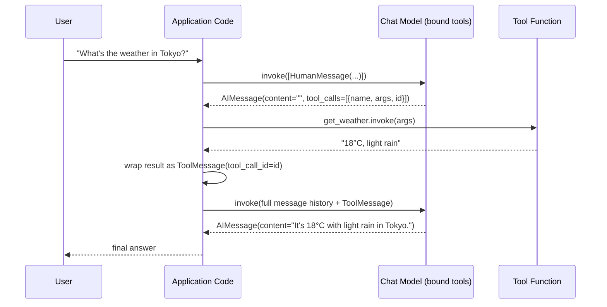

# Chapter 7: Tools & Tool Calling

> "A tool is just a function with a passport." — how to think about `@tool`

## Learning Objectives

By the end of this chapter, you will be able to:

- Explain what a "tool" is in LangChain Core, and why it's really just a Python function plus a machine-readable name, description, and argument schema
- Convert any typed, documented Python function into a `StructuredTool` using the `@tool` decorator, and explain exactly how the docstring and type hints become the JSON schema an LLM sees
- Distinguish `Tool` (single-string input, legacy) from `StructuredTool` (multi-argument, schema-validated) and know when each is used
- Bind tools to a chat model with `model.bind_tools([...])` and trace how that changes the shape of the model's output
- Hand-trace the full tool-calling loop message by message: query → `AIMessage` with `tool_calls` → tool execution → `ToolMessage` → final `AIMessage`
- Handle parallel tool calls and tool-execution errors without breaking the conversation state
- Explain how LangChain's in-process `@tool` abstraction relates to, and can wrap, an MCP-exposed tool

---

## Prerequisites for This Chapter

This chapter builds on **[Chapter 6: LCEL & Runnables](./06-lcel-and-runnables.md)**, where you learned:

- Every LangChain Core component — prompts, models, parsers — implements the same `Runnable` interface (`invoke`, `batch`, `stream`, and their async twins)
- The `|` operator composes runnables into a `RunnableSequence`, letting you build pipelines declaratively instead of writing glue code
- `RunnableLambda`, `RunnablePassthrough`, and `RunnableParallel` let you inject plain functions and fan-out/fan-in data through a chain

You'll also draw on two things from earlier in the course: the `BaseChatModel` interface from **Chapter 3**, and the message type hierarchy (`SystemMessage`, `HumanMessage`, `AIMessage`, `ToolMessage`) from **Chapter 2**. If those are hazy, a quick skim back is worth it — this chapter is where `AIMessage.tool_calls` and `ToolMessage` finally get used for real. You should also already know, from your MCP background, the general concept of a "tool" as something an LLM can invoke — this chapter's job is to show you the LangChain-Core-specific, in-process version of that idea.

No new setup is required. Code in this chapter is illustrative — reasoned through by hand, not executed — since the concepts translate directly onto any `ChatOpenAI`, `ChatAnthropic`, or other `BaseChatModel` subclass you already configured in earlier chapters.

---

## 1. What Is a "Tool," Really?

### 1.1 The problem tools solve

An LLM is a text-in, text-out function. It cannot query a database, call a weather API, or run arithmetic reliably — it can only generate plausible-looking text. If you ask a raw LLM "what's 847 × 293?", it may guess a wrong number that merely *looks* right. If you ask it "what's the weather in Tokyo right now?", it will confidently hallucinate an answer, because it has no way to reach outside its own weights.

A **tool** closes that gap. In LangChain Core, a tool is:

> A Python callable, wrapped with a **name**, a **description**, and a **typed argument schema**, so that an LLM can be shown "here is what this function does and what arguments it needs" and can then *request* that the function be called — without the LLM ever executing any code itself.

That last clause matters and is easy to get backwards if you're coming from an MCP mental model where a server actually executes requests. In LangChain Core, the LLM never runs your tool. It only ever produces **structured text** saying "please call `get_weather` with `{"city": "Tokyo"}`." Your application code is the one that reads that request, actually calls the Python function, and feeds the result back in. The LLM is a *requester*, never an *executor*.

### 1.2 The three parts of a tool

Every LangChain tool, regardless of how it's constructed, exposes three things to the model:

| Part | Purpose | Where it comes from |
|---|---|---|
| **`name`** | A short identifier the model uses to refer to the tool | The function's name (or an explicit override) |
| **`description`** | Natural-language explanation of *what the tool does and when to use it* | The function's docstring |
| **`args_schema`** | A JSON Schema describing the required arguments, their types, and descriptions | The function's type hints (and optionally a Pydantic model) |

These three pieces get serialized into the same kind of JSON structure that sits behind function calling / tool calling in modern LLM APIs (OpenAI's `tools` parameter, Anthropic's `tools` parameter, and so on). LangChain's job is to build that JSON for you from ordinary Python, and to route the model's response back into Python objects you can act on.

```python
# Conceptually, a tool becomes something like this JSON, handed to the model:
{
    "name": "get_weather",
    "description": "Get the current weather for a given city.",
    "parameters": {
        "type": "object",
        "properties": {
            "city": {"type": "string", "description": "The city to look up, e.g. 'Tokyo'"}
        },
        "required": ["city"]
    }
}
```

The model never sees your Python source code. It only ever sees this schema. Everything else in this chapter is about how that schema gets generated, how the model's *decision to call it* comes back to you, and how you close the loop.

---

## 2. The `@tool` Decorator

### 2.1 From plain function to `StructuredTool`

The most common way to define a tool in LangChain Core is the `@tool` decorator from `langchain_core.tools`. You write an ordinary Python function — type-hinted, docstringed — and the decorator wraps it into a `StructuredTool` instance automatically.

```python
from langchain_core.tools import tool

@tool
def get_weather(city: str) -> str:
    """Get the current weather conditions for a given city.

    Args:
        city: The name of the city to look up, e.g. "Tokyo" or "Paris".
    """
    # In a real implementation this would call a weather API.
    # Hard-coded here purely for illustration.
    fake_data = {
        "tokyo": "18°C, light rain",
        "paris": "22°C, sunny",
    }
    return fake_data.get(city.lower(), "No data available for that city.")
```

After decoration, `get_weather` is no longer a plain function — it's a `StructuredTool` object. Calling `get_weather("Tokyo")` directly no longer works the way you'd expect from an ordinary function; instead you'd call `get_weather.invoke({"city": "Tokyo"})`, because `StructuredTool` is itself a `Runnable` (yes — tools plug into the same LCEL world from Chapter 6). Let's inspect what the decorator extracted:

```python
print(get_weather.name)
# "get_weather"

print(get_weather.description)
# "Get the current weather conditions for a given city."

print(get_weather.args)
# {'city': {'title': 'City', 'type': 'string'}}
```

### 2.2 How the docstring becomes the description

The decorator reads the function's `__doc__` and uses the **first line/summary** (or the whole docstring, depending on formatting) as the `description` field the model sees. This is not cosmetic — **the description is the single most important signal the model uses to decide *when* to call this tool at all.** A vague description like `"Weather tool"` gives the model almost nothing to reason about; a precise one like `"Get the current weather conditions for a given city. Use this whenever the user asks about temperature, rain, or general weather for a specific place."` tells the model exactly what triggers it.

Google-style `Args:` sections in the docstring (as shown above) are conventionally used to enrich individual parameter descriptions when you back a tool with a Pydantic schema (Section 2.4). With the plain-decorator, no-schema form, LangChain primarily surfaces the top-level docstring as the description and relies on your type hints for structure — so writing both a clear summary *and* per-argument type hints matters.

### 2.3 How type hints become the JSON schema

The decorator inspects the function's **type hints** and constructs a Pydantic model under the hood, which is then serialized into the JSON Schema the model receives. This is the same translation FastAPI does for path/query parameters, if you've used that before — familiar territory, just aimed at an LLM instead of an HTTP client.

```python
@tool
def convert_currency(amount: float, from_currency: str, to_currency: str) -> str:
    """Convert an amount of money from one currency to another.

    Args:
        amount: The numeric amount to convert.
        from_currency: The 3-letter ISO currency code to convert from, e.g. "USD".
        to_currency: The 3-letter ISO currency code to convert to, e.g. "JPY".
    """
    ...
```

This produces a schema roughly equivalent to:

```json
{
    "type": "object",
    "properties": {
        "amount": {"type": "number"},
        "from_currency": {"type": "string"},
        "to_currency": {"type": "string"}
    },
    "required": ["amount", "from_currency", "to_currency"]
}
```

Three arguments, three types, all required (Python has no default values here). If you want optional arguments, give them defaults exactly as you would in normal Python:

```python
@tool
def search_products(query: str, max_results: int = 5) -> list[str]:
    """Search the product catalog and return matching product names.

    Args:
        query: The search term, e.g. "wireless headphones".
        max_results: Maximum number of results to return. Defaults to 5.
    """
    ...
```

`max_results` becomes an optional property in the schema with a default of `5`. The model can omit it, and your function will receive the Python default when it does.

### 2.4 Precise schemas with a Pydantic `args_schema`

For tools with several arguments, validation rules, or reused schemas across multiple tools, pass an explicit Pydantic model instead of relying purely on inline type hints:

```python
from pydantic import BaseModel, Field
from langchain_core.tools import tool

class WeatherInput(BaseModel):
    city: str = Field(description="The city to look up, e.g. 'Tokyo'.")
    units: str = Field(
        default="celsius",
        description="Temperature units to return: 'celsius' or 'fahrenheit'.",
    )

@tool("get_weather", args_schema=WeatherInput)
def get_weather(city: str, units: str = "celsius") -> str:
    """Get the current weather conditions for a given city."""
    ...
```

This is the pattern to reach for the moment "a docstring `Args:` block" starts feeling flimsy — Pydantic's `Field(description=...)` is a first-class, structurally validated place to put per-argument guidance, and it's what Section 8's Real-World Scenario hinges on.

---

## 3. `Tool` vs. `StructuredTool`

LangChain Core actually ships two related abstractions, and knowing which one you're looking at (especially in older code or tutorials) avoids real confusion.

### 3.1 `Tool` — the legacy, single-string-input tool

`Tool` (from `langchain_core.tools`) predates structured, multi-argument function calling in LLM APIs. It represents a tool whose entire input is **one string** and whose output is **one string**:

```python
from langchain_core.tools import Tool

def search_wikipedia(query: str) -> str:
    """A function that takes one string and returns one string."""
    ...

wiki_tool = Tool(
    name="wikipedia_search",
    description="Search Wikipedia for a topic and return a summary.",
    func=search_wikipedia,
)
```

This shape maps naturally onto early "ReAct"-style agents, where the LLM was prompted to emit free-form text like `Action: wikipedia_search, Action Input: "Ada Lovelace"`, and the framework parsed that string with regex before calling the tool. It's still supported for backward compatibility and for genuinely single-argument tools, but it cannot represent a function that needs multiple typed arguments (like `convert_currency` above) without you manually packing everything into one string and unpacking it yourself — brittle, and exactly the kind of parsing headache structured tool calling was invented to eliminate.

### 3.2 `StructuredTool` — the modern, multi-argument tool

`StructuredTool` is what `@tool` produces by default today, and what you should reach for by default. It supports **any number of typed arguments**, each independently validated against the Pydantic schema, and it maps directly onto the native "tool calling" / "function calling" features of modern LLM APIs — the model returns a structured JSON object of arguments, not a string you have to parse yourself.

```python
from langchain_core.tools import StructuredTool

def convert_currency(amount: float, from_currency: str, to_currency: str) -> str:
    ...

currency_tool = StructuredTool.from_function(
    func=convert_currency,
    name="convert_currency",
    description="Convert an amount of money from one currency to another.",
)
```

`StructuredTool.from_function(...)` is the explicit, class-based equivalent of what `@tool` does implicitly. Reach for it when you want to construct a tool from a function you don't control the definition of (e.g., a third-party function you're wrapping) and can't simply decorate at its definition site.

### 3.3 Quick comparison

| | `Tool` | `StructuredTool` (via `@tool`) |
|---|---|---|
| Input shape | Single string | Multiple typed arguments |
| Schema | None (or manually attached) | Auto-derived Pydantic model from type hints |
| Maps to native function calling? | Awkwardly — needs string packing | Directly |
| Typical era / use case | Legacy ReAct-style agents, single-arg utilities | Everything you build today |
| How you create one | `Tool(name=..., func=..., description=...)` | `@tool` decorator or `StructuredTool.from_function(...)` |

For the rest of this course, "tool" means `StructuredTool` unless stated otherwise — it's the abstraction that composes cleanly with `bind_tools`, described next.

---

## 4. Binding Tools to a Model

### 4.1 `bind_tools`: teaching a `BaseChatModel` about your tools

Recall from **Chapter 3** that every chat model in LangChain Core — `ChatOpenAI`, `ChatAnthropic`, and every other provider integration — implements the shared `BaseChatModel` interface. `bind_tools` is a method on that interface (implemented per-provider under the hood, translating to each provider's native tool-calling API format) that returns a **new runnable** wrapping the model, configured to advertise your tools with every request:

```python
from langchain_openai import ChatOpenAI

model = ChatOpenAI(model="gpt-4o", temperature=0)

tools = [get_weather, convert_currency]
model_with_tools = model.bind_tools(tools)
```

`model_with_tools` is still a `Runnable[..., AIMessage]` — nothing about the LCEL contract from Chapter 6 changes. You can still `.invoke(...)`, `.stream(...)`, or compose it with `|` into a chain exactly as before. The *only* difference is that every request sent to the underlying API now includes the JSON tool schemas from Section 1.2, and the model is now permitted to answer with a request to call one of those tools instead of (or in addition to) plain text.

```python
from langchain_core.messages import HumanMessage

response = model_with_tools.invoke([
    HumanMessage(content="What's the weather in Tokyo?")
])
```

Binding does **not** execute anything and does **not** change your prompt template — it's a separate, additive layer of configuration on top of the model, which is why it composes so cleanly with everything else you've learned: bind once, then use the bound model anywhere a plain model would go, including inside an LCEL chain.

### 4.2 What changes in the response

Without tools bound, `model.invoke(...)` returns an `AIMessage` whose `content` is a plain string. With tools bound, and when the model *decides* a tool call is warranted, the returned `AIMessage` instead has:

- `content` — often an empty string (the model produced no direct text answer, only a tool request)
- `.tool_calls` — a list of tool-call requests, each with `name`, `args` (a dict), and `id`

```python
print(response.content)
# ""  (empty — the model chose to call a tool instead of answering directly)

print(response.tool_calls)
# [
#   {
#     "name": "get_weather",
#     "args": {"city": "Tokyo"},
#     "id": "call_abc123"
#   }
# ]
```

This `.tool_calls` attribute is what the rest of this chapter is built around — it's the bridge between "the model decided to act" and "your code actually acts."

### 4.3 Forcing or restricting tool choice

Most providers also let you constrain *which* tool (if any) the model must use, via a `tool_choice` argument to `bind_tools`:

```python
# Force the model to always call a specific tool
model.bind_tools([get_weather], tool_choice="get_weather")

# Force the model to call *some* tool (not answer with plain text)
model.bind_tools(tools, tool_choice="any")

# Default: let the model decide, including deciding not to call anything
model.bind_tools(tools, tool_choice="auto")
```

Use `tool_choice` sparingly — forcing a call bypasses the model's judgment about whether a tool is even relevant, which is usually the opposite of what you want. It's most useful for narrow, deterministic sub-flows (e.g., "always structure the final output through this one formatting tool").

---

## 5. The Tool-Calling Loop, End to End

This is the core mechanic of the chapter, and it directly reuses the message types from **Chapter 2**. There is no magic "agent" object required to understand it — it's a plain loop you can write by hand.

### 5.1 The five steps

1. **You send messages + bound tools to the model.** A list of `BaseMessage` objects (system/human/prior AI/tool messages) goes in, tools were already registered via `bind_tools`.
2. **The model decides whether a tool call is needed.** If not, it returns a normal `AIMessage` with text content and empty `tool_calls`, and you're done. If a tool is needed, it returns an `AIMessage` with (possibly empty) `content` and a non-empty `.tool_calls` list.
3. **Your application code executes each requested tool.** For each entry in `.tool_calls`, look up the matching tool object by `name`, call `.invoke(args)` on it, and capture the return value.
4. **Wrap each result in a `ToolMessage`.** Critically, set `tool_call_id` to the `id` from the corresponding tool call — this is how the model matches a result back to its own request when there were multiple calls.
5. **Append everything to the message history and send it back.** The model now sees its own tool call, plus the tool's answer, and produces a final `AIMessage` with a real text answer.

### 5.2 Sequence diagram



### 5.3 Writing the loop in code

```python
from langchain_core.messages import HumanMessage, ToolMessage

tools_by_name = {t.name: t for t in tools}  # {"get_weather": ..., "convert_currency": ...}

messages = [HumanMessage(content="What's the weather in Tokyo?")]

# Step 1-2: ask the model
ai_message = model_with_tools.invoke(messages)
messages.append(ai_message)

# Step 3-4: execute every requested tool call, wrap results
for call in ai_message.tool_calls:
    tool = tools_by_name[call["name"]]
    result = tool.invoke(call["args"])
    messages.append(
        ToolMessage(content=str(result), tool_call_id=call["id"])
    )

# Step 5: send the enriched history back for a final answer
final_message = model_with_tools.invoke(messages)
print(final_message.content)
# "It's currently 18°C with light rain in Tokyo."
```

Notice the shape of `messages` growing with each round: `[Human, AI(tool_calls), Tool, Tool, ..., AI(final)]`. This *is* the conversation — nothing is hidden from the model. Every tool call and every tool result becomes a permanent, visible part of the message history for the rest of that conversation, exactly the same list structure you learned to build in Chapter 2.

---

## 6. Worked Example: Calculator + Weather, Hand-Traced

Let's build two tools and trace a real query through the entire loop by hand — no code execution, pure reasoning, exactly as you'd want to be able to do when debugging a production agent.

### 6.1 Defining the tools

```python
from langchain_core.tools import tool

@tool
def calculator(expression: str) -> str:
    """Evaluate a basic arithmetic expression, e.g. '12 * (3 + 4)'.

    Args:
        expression: A valid arithmetic expression using +, -, *, /, and parentheses.
    """
    try:
        # NOTE: eval() is used here only for illustration; production code
        # should use a safe expression parser (see Section 7's error handling
        # discussion and Chapter 14's guardrails coverage).
        return str(eval(expression))
    except Exception as e:
        return f"Error evaluating expression: {e}"

@tool
def get_weather(city: str) -> str:
    """Get the current weather conditions for a given city.

    Args:
        city: The city name, e.g. "Tokyo" or "Paris".
    """
    fake_data = {"tokyo": "18°C, light rain", "paris": "22°C, sunny"}
    return fake_data.get(city.lower(), "No data available for that city.")

tools = [calculator, get_weather]
model_with_tools = model.bind_tools(tools)
tools_by_name = {t.name: t for t in tools}
```

### 6.2 The query

```
"Is it warmer in Tokyo right now than 15 degrees?"
```

This query needs the weather tool (not the calculator) — a reasonable comparison the model can do itself once it has the number. Let's trace the message list step by step.

**Turn 1 — the human message goes in:**

```python
messages = [
    HumanMessage(content="Is it warmer in Tokyo right now than 15 degrees?")
]
```

**Turn 2 — model reasons: "I don't know Tokyo's current temperature; I have a `get_weather` tool; I should call it."** It returns:

```python
AIMessage(
    content="",
    tool_calls=[
        {"name": "get_weather", "args": {"city": "Tokyo"}, "id": "call_9f2a"}
    ]
)
```

Note: the model correctly picked `get_weather`, not `calculator` — because the *description* of `get_weather` ("Get the current weather conditions for a given city") matches the intent of the query far better than the calculator's description, and there's no arithmetic expression to evaluate yet. This is the description doing its job (Section 2.2).

Append it: `messages = [Human, AIMessage(tool_calls=[...])]`.

**Turn 3 — application code executes the tool:**

```python
call = ai_message.tool_calls[0]                     # {"name": "get_weather", "args": {"city": "Tokyo"}, "id": "call_9f2a"}
tool = tools_by_name[call["name"]]                    # the get_weather StructuredTool
result = tool.invoke(call["args"])                    # "18°C, light rain"
```

**Turn 4 — wrap and append:**

```python
messages.append(ToolMessage(content="18°C, light rain", tool_call_id="call_9f2a"))
```

`messages` is now: `[Human, AIMessage(tool_calls), ToolMessage("18°C, light rain")]`.

**Turn 5 — send back to the model.** The model now has everything it needs: the original question, its own request, and the tool's answer. It reasons "18°C is warmer than 15°C" *itself* (no calculator needed for a single comparison) and produces:

```python
AIMessage(content="Yes — it's currently 18°C in Tokyo, which is warmer than 15 degrees.")
```

`final_message.content` is what you'd show the user. `ai_message.tool_calls` is now empty on this last message, which is exactly how your loop knows to stop (Section 5.3's loop would exit here since there's nothing new to execute).

If the user instead asked *"What's 18 + 15?"*, the same loop would route to `calculator` instead, with `args = {"expression": "18 + 15"}` — same mechanism, different tool selected purely from matching the query's intent against each tool's description and schema.

---

## 7. Parallel Tool Calls

### 7.1 Why a single `AIMessage` can request multiple calls

Modern tool-calling APIs let the model return **more than one tool call in a single response** when it judges that several independent pieces of information are needed at once. For example:

```
"What's the weather in Tokyo and in Paris?"
```

A well-tuned model recognizes these as two independent lookups and returns both in one `AIMessage`:

```python
AIMessage(
    content="",
    tool_calls=[
        {"name": "get_weather", "args": {"city": "Tokyo"}, "id": "call_1"},
        {"name": "get_weather", "args": {"city": "Paris"}, "id": "call_2"},
    ]
)
```

### 7.2 Executing parallel calls

Your loop from Section 5.3 already handles this correctly as written — it iterates over every entry in `ai_message.tool_calls`, regardless of how many there are, and appends one `ToolMessage` per call:

```python
for call in ai_message.tool_calls:
    tool = tools_by_name[call["name"]]
    result = tool.invoke(call["args"])
    messages.append(ToolMessage(content=str(result), tool_call_id=call["id"]))
```

Executed sequentially like this, two independent I/O-bound tool calls (e.g., two API requests) pay their latency cost one after another. If the tools are independent — as they are here, one lookup doesn't depend on the other's result — there's no reason to wait; running them concurrently is a pure latency win with no change in correctness. **Chapter 13** covers LangChain Core's async story (`ainvoke`, `abatch`, `asyncio` integration) in depth, but the shape of the fix previews cleanly here:

```python
import asyncio

async def execute_call(call):
    tool = tools_by_name[call["name"]]
    result = await tool.ainvoke(call["args"])
    return ToolMessage(content=str(result), tool_call_id=call["id"])

tool_messages = await asyncio.gather(*(execute_call(c) for c in ai_message.tool_calls))
messages.extend(tool_messages)
```

The important invariant, sequential or concurrent: **every `tool_call_id` gets exactly one matching `ToolMessage`, and order in the final message list doesn't have to match the order tool calls were issued** — the model matches results to requests by `id`, not by position.

### 7.3 Merging results back

"Merging" here is simple by design — you don't need to combine the two weather results into one string yourself. You append **both** `ToolMessage` objects to the history and let the model synthesize the combined answer on the next turn:

```python
# messages = [Human, AIMessage(2 tool_calls), ToolMessage(Tokyo), ToolMessage(Paris)]
final_message = model_with_tools.invoke(messages)
print(final_message.content)
# "Tokyo is 18°C with light rain, while Paris is 22°C and sunny."
```

The model does the synthesis work; your job is only to make sure each result is correctly attributed via `tool_call_id` so the model doesn't confuse which number belongs to which city.

---

## 8. Error Handling Inside Tools

### 8.1 What happens if a tool raises

If your tool function raises an uncaught exception during `.invoke(...)`, that exception propagates up through your application loop like any normal Python exception — it does **not** automatically become part of the conversation, and the model never gets to see it unless you catch it yourself. Left unhandled, an exception here typically **crashes the whole request** — the user gets a 500 error instead of an answer, and the model never has a chance to recover or apologize.

### 8.2 The two common strategies

**Strategy 1 — catch the exception and return an error string as the tool's result.** This turns a hard failure into a soft one: the model receives a `ToolMessage` describing the problem and can decide what to do next (retry with different arguments, apologize to the user, try a different tool).

```python
@tool
def divide(a: float, b: float) -> str:
    """Divide a by b."""
    try:
        return str(a / b)
    except ZeroDivisionError:
        return "Error: cannot divide by zero."
```

```python
messages.append(ToolMessage(content="Error: cannot divide by zero.", tool_call_id=call["id"]))
```

The model, seeing this as a normal tool result (just one that describes a failure), typically responds gracefully: *"I can't divide by zero — could you provide a different value?"* This is almost always the right default for tools whose failure modes are predictable (bad input, not-found lookups, rate limits) — it keeps the conversation alive and gives the model a chance to self-correct or inform the user clearly.

**Strategy 2 — let the exception propagate and handle it at the application layer.** Appropriate for failures that are *not* the model's problem to reason about — a database connection pool exhausted, an internal auth token expired, a bug in your own code. In these cases, wrapping the failure as a friendly `ToolMessage` would mislead the model into thinking it's a fixable input problem when it isn't. Instead, catch it outside the tool-execution loop, log it properly, and return a generic apology or retry the whole request — the same resilience patterns you'd apply to any external API call.

```python
try:
    result = tool.invoke(call["args"])
except Exception as exc:
    # Log the real exception for observability, but decide deliberately
    # whether the model should see a soft error or the request should fail.
    logger.exception("Tool %s failed", call["name"])
    result = "An internal error occurred while running this tool. Please try again."
messages.append(ToolMessage(content=str(result), tool_call_id=call["id"]))
```

This distinction — model-recoverable input errors vs. application-level infrastructure errors — is worth internalizing now; **Chapter 14 (Error Handling, Retries & Fallbacks)** builds a full production-grade retry/fallback strategy on exactly this split.

---

## 9. LangChain Tools vs. MCP

You already know MCP (Model Context Protocol) from your prior experience, so it's worth being precise about where it overlaps with what this chapter covers, and where it doesn't — they solve adjacent but distinct problems.

| | LangChain `@tool` | MCP |
|---|---|---|
| **Scope** | In-process Python abstraction | Cross-process / cross-server protocol |
| **Discovery** | You import and list Python objects directly (`tools = [get_weather, calculator]`) | A client discovers tools dynamically by querying a running MCP server |
| **Transport** | None — it's a function call in the same Python process | JSON-RPC over stdio, HTTP/SSE, or other transports, across a process or network boundary |
| **Schema format** | Derived from Python type hints / Pydantic models into JSON Schema | Declared explicitly by the server, transmitted as JSON Schema over the wire |
| **Who defines it** | You, in your own codebase | Potentially a third party running a standalone server you don't control |

The key insight: **these are not competitors — they operate at different layers, and one very commonly wraps the other.** A LangChain `@tool`-decorated function can simply be a thin client that, when invoked, makes an MCP call to a remote server and returns the result:

```python
@tool
def search_docs_via_mcp(query: str) -> str:
    """Search internal documentation using the docs MCP server."""
    # Under the hood, this might use an MCP client session to call
    # a tool exposed by a separate, already-running MCP server —
    # LangChain doesn't need to know or care that MCP is involved.
    result = mcp_client.call_tool("search_docs", {"query": query})
    return result.content
```

From the model's perspective, calling `search_docs_via_mcp` looks exactly like calling `get_weather` — same schema shape, same `.tool_calls` mechanism, same `ToolMessage` wrapping. MCP's job (standardizing discovery and transport across process/organization boundaries) is fully hidden behind the LangChain tool's Python interface. If your team already has MCP servers running, you don't have to reimplement their logic in-process — you write one thin `@tool` wrapper per MCP tool you want the model to have access to, and everything else in this chapter applies unchanged. (LangChain also ships adapter packages that auto-generate these wrapper tools from a running MCP server's tool list, but understanding the underlying mechanism — a normal `@tool` function that happens to make an MCP call inside — is what actually matters here.)

---

## 10. Real-World Scenario

**Scenario:** A team ships an internal support agent with a tool for looking up customer orders:

```python
@tool
def lookup_order(id, date) -> str:
    """Look up an order."""
    ...
```

In testing, the agent frequently calls this tool with garbage arguments: `id="the customer's most recent order"`, or `date="last week"`, or sometimes it invents an `id` value outright when the user never gave one. Support staff describe it as "the bot making things up," and the initial assumption is that it's an LLM hallucination problem requiring a bigger or better model.

**Root cause, once inspected:** the tool's docstring is `"Look up an order."` — no explanation of what `id` should look like, no units, no format, no indication that `date` is optional or what format it expects. The parameters have **no type hints at all**, so the schema the model receives is nearly empty:

```json
{
    "properties": {
        "id": {"title": "Id"},
        "date": {"title": "Date"}
    }
}
```

There's no `"type": "string"`, no description, nothing telling the model that `id` should be a specific order-ID format (e.g., `"ORD-48213"`), or that `date` should be an ISO date string, or that both fields are supposed to come from context already provided by the user rather than invented. Faced with an underspecified schema and a user who says "check my last order," the model does the only thing it can: it pattern-matches on the tool name and guesses plausible-sounding argument values — which look exactly like hallucination from the outside, but are really a *schema-hallucination* problem, caused by the tool description leaving the model nothing solid to ground its arguments in.

**The fix:**

```python
from pydantic import BaseModel, Field

class LookupOrderInput(BaseModel):
    order_id: str = Field(
        description=(
            "The exact order ID, in the format 'ORD-XXXXX' (e.g., 'ORD-48213'). "
            "Do not guess this value — if the user has not provided it or it isn't "
            "present in the conversation, ask the user for it instead of calling this tool."
        )
    )
    order_date: str | None = Field(
        default=None,
        description="Optional ISO-8601 date (YYYY-MM-DD) to narrow the search. Omit if not specified by the user.",
    )

@tool("lookup_order", args_schema=LookupOrderInput)
def lookup_order(order_id: str, order_date: str | None = None) -> str:
    """Look up a specific customer order by its exact order ID.

    Only call this tool once you have a real order ID from the user or the
    conversation history. Never invent or guess an order ID.
    """
    ...
```

Three changes did the real work: (1) explicit types (`str`, `str | None`) so the model knows the expected shape, not just a bare name; (2) a `Field(description=...)` on each argument that states the exact expected format *and* explicitly instructs the model not to guess; (3) a docstring that states the precondition ("only call this once you have a real order ID") rather than a one-line stub. After this change, the model reliably asks a clarifying question ("Could you share your order ID?") instead of inventing one — because it now has a concrete, well-specified contract to reason against instead of an empty schema it has to fill in from vibes.

**Lesson:** a vague tool schema doesn't make the model call the tool less confidently — it makes the model *fill the gaps with plausible-sounding noise*, which reads exactly like hallucination but is really an under-specification bug in your tool definition. Precise type hints and descriptions are not documentation nicety here; they are the primary lever you have over tool-argument correctness.

---

## 11. Best Practices

- **Write the docstring for the model, not for a human maintainer.** State clearly what the tool does *and* when it should (and shouldn't) be called — the description is the model's only signal for tool selection.
- **Type-hint every argument.** An untyped argument produces a near-empty schema entry, and the model has almost nothing to validate its own generated arguments against.
- **Use `Field(description=...)` for anything the type alone doesn't convey** — expected formats, units, valid ranges, and explicit "don't guess this" instructions for fields that must come from user input.
- **Keep tool functions narrow and single-purpose.** A tool that does five unrelated things behind one name is hard for the model to reason about and hard for you to test.
- **Always match `ToolMessage.tool_call_id` to the originating `tool_calls[i]["id"]`**, especially under parallel calls — mismatches silently corrupt which result the model thinks belongs to which request.
- **Decide error-handling strategy per tool, deliberately** — return a graceful error string for user-input-shaped failures; let the exception surface to your own logging/retry layer for infrastructure-shaped failures (Section 8).
- **Prefer `StructuredTool` (`@tool`) over legacy `Tool`** for anything with more than one argument — it maps directly onto native provider function-calling APIs and avoids manual string-packing.
- **Test tool selection with adversarial and ambiguous queries**, not just the happy path — that's exactly where vague schemas show their cracks, as Section 10 demonstrates.

---

## 12. Common Mistakes

- **Vague or missing docstrings.** `"Do stuff with orders."` gives the model no basis for deciding when to call the tool or what arguments to pass — see Section 10 in full.
- **Missing or wrong type hints**, producing an incomplete JSON Schema and unpredictable argument coercion (e.g., the model passing a string where an `int` was expected because nothing told it otherwise).
- **Forgetting to match `tool_call_id`** when handling multiple parallel tool calls, causing the model to receive results in a way it can't correctly attribute back to its own requests.
- **Letting tool exceptions crash the whole request** instead of deciding deliberately whether to surface a graceful `ToolMessage` error or handle the failure at the application layer.
- **Treating `bind_tools` as mutating the original model object.** It doesn't — `model.bind_tools(tools)` returns a *new* runnable; forgetting to use the returned object (and calling `.invoke` on the original `model` instead) means your tools are silently never sent to the API at all.
- **Assuming the model always calls a tool when one is relevant.** Tool calling is a judgment call by the model, not a guarantee — always check whether `ai_message.tool_calls` is non-empty before assuming a tool was invoked, rather than assuming the loop will always take the tool-call branch.
- **Conflating MCP tool discovery with LangChain's `@tool` mechanism**, and assuming you need an MCP server running just to give a model a Python function — for in-process tools, that's unnecessary machinery; MCP earns its keep only when tools genuinely live in another process or need to be discovered dynamically by external clients.

---

## Summary

- A LangChain **tool** is a Python callable wrapped with a `name`, `description`, and typed `args_schema` — three pieces of metadata that let an LLM *request* a call without ever executing code itself.
- The **`@tool` decorator** turns a type-hinted, docstringed function into a `StructuredTool` automatically; the docstring becomes the model-facing description, and type hints (or an explicit Pydantic `args_schema`) become the JSON Schema.
- **`Tool`** is the legacy single-string-input abstraction; **`StructuredTool`** is the modern multi-argument abstraction that maps directly onto native provider function-calling APIs — default to `StructuredTool` today.
- **`model.bind_tools([...])`** returns a new `Runnable` wrapping any `BaseChatModel` (Chapter 3), configured to advertise your tools; the model's response then may carry `.tool_calls` instead of, or alongside, plain text.
- The **tool-calling loop** is: send messages → model returns `AIMessage` with `tool_calls` → your code executes each tool → wrap each result in a `ToolMessage` keyed by `tool_call_id` → append to history → send back → model produces a final text `AIMessage`.
- A single `AIMessage` can request **multiple parallel tool calls**; execute them (optionally concurrently via `ainvoke`/`asyncio.gather`, previewing Chapter 13) and append one `ToolMessage` per call, matched by ID — the model handles synthesizing the combined answer.
- Tool errors should be handled deliberately: return a **graceful error string** for input-shaped failures the model can reason about and recover from; let **infrastructure-shaped failures** propagate to your own error-handling layer (previewing Chapter 14).
- LangChain's `@tool` is an **in-process, Python-level abstraction**; **MCP** solves cross-process discovery and transport — a LangChain tool can trivially wrap a call into an MCP-exposed tool, and the two compose rather than compete.

---

## Knowledge Check

1. Explain, in your own words, why the LLM never actually "executes" a LangChain tool — what exactly does it produce instead, and who is responsible for running the real Python function?
2. A tool function has the signature `def lookup(x, y): ...` with no type hints and a one-word docstring. Predict, specifically, what will go wrong when a model tries to call it, and why.
3. Walk through the exact sequence of message types (`HumanMessage`, `AIMessage`, `ToolMessage`, ...) that would appear in the conversation history for a query that triggers two parallel tool calls.
4. Why must `ToolMessage.tool_call_id` match the originating tool call's `id`, rather than LangChain just matching results to calls by their position in the list?
5. Describe a tool failure mode that should be caught and returned to the model as an error string, and a different failure mode that should instead propagate to your application's own error handling — explain the difference in reasoning behind each choice.
6. Your team has an MCP server exposing a `run_report` tool. Describe, at a high level, how you would make that tool available to a LangChain-bound chat model, and what LangChain does and does not need to know about MCP to make this work.

---

## Hands-On Exercise

Build a small toolset and wire up the complete tool-calling loop, extending the course's running roadmap of tools (Calculator, Weather, Database Query, File Reader):

1. **Define four `@tool`-decorated functions:**
   - `calculator(expression: str) -> str` — evaluates a basic arithmetic expression (reuse Section 6.1's version, including its `try`/`except` error handling).
   - `get_weather(city: str) -> str` — returns weather for a small hard-coded set of cities, with a graceful "no data" fallback for unknown cities.
   - `query_database(table: str, filter_expr: str | None = None) -> str` — simulates looking up rows from a named in-memory table (a Python dict of lists of dicts is enough), returning a clear error string if `table` doesn't exist.
   - `read_file(path: str) -> str` — simulates reading a file from a small hard-coded in-memory filesystem (a `dict[str, str]` mapping fake paths to fake contents), returning a graceful "file not found" string rather than raising, for any path not in the dict.

2. **Give each function a precise docstring and fully typed arguments**, following Section 2's and Section 10's guidance — write the description as if a model with no other context must decide, from the description alone, when this tool (and not one of the other three) is the right one to call.

3. **Bind all four tools to a chat model** with `model.bind_tools([...])` and construct an initial `messages` list containing a single `HumanMessage` with a query that plausibly needs **two** of the four tools in sequence (for example: "Read the config file at `/etc/app/config.txt` and tell me if the `timeout` value in it is greater than 30").

4. **Hand-trace the full loop**, writing out each intermediate state of `messages` exactly as in Section 6.2 — including the `AIMessage` with its `tool_calls`, each `ToolMessage` with the correct `tool_call_id`, and the final `AIMessage`.

5. **Deliberately break one tool's docstring** (strip it down to one vague word, remove the type hints) and re-trace the same query by hand. Write down, specifically, what argument values you'd expect the model to guess, and why — connecting this back to Section 10's Real-World Scenario.

6. **Bonus:** Modify your loop to handle a query that triggers two parallel tool calls (e.g., "What's the weather in Tokyo and read the file at `/etc/app/config.txt`"), and write out the resulting message list, paying close attention to matching each `ToolMessage.tool_call_id` to the right originating call.

---

## Further Reading

- [LangChain Python API Reference — `langchain_core.tools`](https://python.langchain.com/api_reference/core/tools.html) — official reference for `tool`, `Tool`, `StructuredTool`, and related classes
- [LangChain Conceptual Guide — Tools](https://python.langchain.com/docs/concepts/tools/) — conceptual overview of tool definition and the tool-calling contract
- [LangChain Conceptual Guide — Tool Calling](https://python.langchain.com/docs/concepts/tool_calling/) — the model-facing tool-calling protocol, message flow, and provider differences
- [Pydantic Documentation — Fields](https://docs.pydantic.dev/latest/concepts/fields/) — `Field(description=...)` and validation options used to build precise `args_schema` definitions
- [OpenAI Function Calling Guide](https://platform.openai.com/docs/guides/function-calling) — the underlying native API concept that LangChain's tool binding translates into
- [Model Context Protocol Specification](https://modelcontextprotocol.io/) — for revisiting how MCP's cross-process tool discovery and transport relate to LangChain's in-process tool abstraction

---

<div style="display:flex;justify-content:space-between;align-items:center;">
  <a href="./06-lcel-and-runnables.md">← Previous: LCEL & Runnables</a>
  <a href="./00-index.md">🏠 Index</a>
  <a href="./08-documents-and-loaders.md">Next: Documents & Loaders →</a>
</div>
