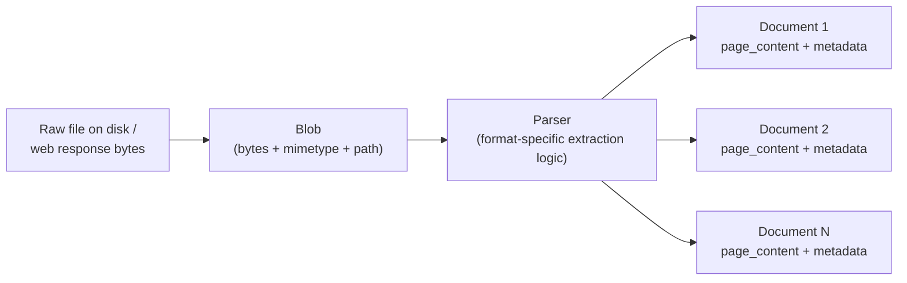
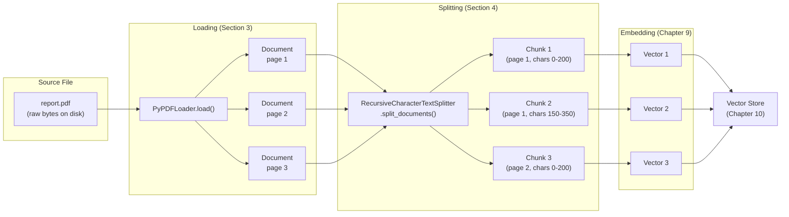

# Chapter 8: Documents & Loaders

> "Garbage in, garbage out — except in RAG, it's usually 'metadata dropped in, citations wrong out.'"

## Learning Objectives

By the end of this chapter, you will be able to:

- Explain the `Document` object's two-field design (`page_content` + `metadata`) and why this simple structure became the universal currency of every LangChain retrieval pipeline
- Distinguish `Blob` (raw, unparsed binary/file content) from `Document` (parsed, structured text + metadata)
- Describe the loader pattern — `.load()` vs `.lazy_load()` — and explain what a PDF loader, a Markdown loader, and a web page loader each place into `page_content` versus `metadata`
- Reason through how `RecursiveCharacterTextSplitter` decides where to cut text, and what `chunk_size` and `chunk_overlap` actually control
- Trace the full data flow from a source file through loading, splitting, and embedding, and identify where information can be silently lost
- Explain why metadata propagation through chunking is a first-class production concern, not an afterthought
- Build (on paper) a loader + splitter pipeline that preserves source metadata all the way to the final chunk

---

## Prerequisites for This Chapter

This chapter builds directly on **[Chapter 7: Tools & Tool Calling](./07-tools-and-tool-calling.md)**, where you learned:

- How to wrap arbitrary Python functions as `Tool` objects the LLM can invoke, with typed inputs validated by Pydantic schemas
- The request/response contract between an LLM and a tool: the model decides *what* to call, LangChain Core's tool-calling machinery handles *how* it gets called and how the result flows back into the conversation
- That LCEL runnables compose predictably regardless of what's inside them — a tool call is just another `Runnable` in a chain

Up to this point, every input to your chains has been something you typed directly: a prompt variable, a string, a dict. Starting in this chapter, we turn to a different problem: **getting real-world content — PDFs, Markdown files, web pages — into a shape LangChain can reason about at all.** This is the on-ramp to Retrieval-Augmented Generation (RAG), and everything here exists to answer one question: *how do you turn "a folder full of files" into "a list of well-formed Python objects with text and metadata," reliably enough that a production system can trust them?*

No new setup is required. This chapter is conceptual and code-illustrative — no installation or execution is needed to follow along.

---

## 1. The `Document` Object: The Universal Currency of Retrieval

### 1.1 The problem it solves

Every loader in LangChain — regardless of whether it reads a PDF, a Notion page, a Slack export, or a SQL table — needs to hand its output to the rest of the pipeline (splitters, embedders, vector stores, retrievers) in a *single, predictable shape*. Without that shape, every downstream component would need a custom adapter for every possible upstream source — an O(n×m) integration problem. LangChain Core solves this with one deliberately minimal class:

```python
class Document:
    page_content: str
    metadata: dict
```

That's it. Two fields. A `Document` is nothing more than "some text" plus "a dictionary describing where that text came from and anything else worth remembering about it." Everything else in the retrieval stack — text splitters (Section 4), embedding models (Chapter 9), vector stores (Chapter 10), retrievers — is written against this one interface. Because every loader converts its native format into `Document` objects, a vector store never needs to know whether the text originally came from a PDF, a webpage, or a database row.

### 1.2 `page_content`: what the model will actually read

`page_content` is a plain Python string. It is the material that eventually gets embedded (Chapter 9) and, later, stuffed into a prompt as retrieved context (Chapter 11 onward). There is no required structure inside it — no schema, no markup convention — it is just text, though loaders differ in how "clean" that text is:

```python
Document(
    page_content="Q3 revenue grew 12% year-over-year, driven primarily by...",
    metadata={"source": "q3_earnings.pdf", "page": 4},
)
```

### 1.3 `metadata`: everything you need to know *about* the text

`metadata` is a plain Python dict — untyped, unstructured by design, and entirely up to the loader (and you) to populate. Common keys you'll see across loaders:

| Key | Typical value | Populated by |
|---|---|---|
| `source` | file path or URL | almost every loader |
| `page` | integer page number | PDF loaders |
| `title` | document/page title | web and Markdown loaders |
| `last_modified` | timestamp | file-system-aware loaders |
| `author` | string | PDF/DOCX loaders with document properties |
| custom tags | anything you add | your own post-processing step |

Why does this matter so much? Because `metadata` is the *only* place information about provenance survives once `page_content` gets chopped into chunks, embedded into vectors, and scattered across a vector store index. When a RAG answer needs to say "according to page 4 of the Q3 earnings report," that page number has to have survived, untouched, from the original PDF loader all the way through chunking, embedding, storage, and retrieval. Lose it once, anywhere in that chain, and it's gone for good — you cannot reconstruct "which page was this from?" after the fact by looking at the text alone. This single point — metadata as a first-class citizen, not an afterthought — is worth internalizing now; it resurfaces as the central lesson of the Real-World Scenario in Section 7 and again when you build retrievers in Chapter 10.

### 1.4 Why this design ties forward to Chapters 9-10

Every embedding model in Chapter 9 accepts `page_content` as its input and is indifferent to whatever is in `metadata`. Every vector store in Chapter 10 stores the vector *alongside* the full `Document` (content + metadata) so that a similarity search returns not just "here's a similar vector" but "here's the actual text and where it came from." The `Document` object is the load-bearing joint between "raw content" and "queryable knowledge" — get comfortable with it now, because you will not stop seeing it for the rest of this course.

---

## 2. `Blob`: The Layer Beneath `Document`

### 2.1 Why we need something *more* raw than `Document`

`Document` already assumes text has been extracted. But before you can extract text from a PDF, you first need the *raw bytes* of that PDF file — and at that stage, you don't yet know how many pages it has, what its text looks like, or even whether it's really a PDF and not a renamed image. LangChain Core models this pre-parsing stage with a separate, lower-level abstraction: `Blob`.

```python
class Blob:
    data: bytes | None       # raw content, if loaded into memory
    path: str | None         # filesystem path, if not yet read
    mimetype: str | None     # e.g. "application/pdf", "text/markdown"
    metadata: dict           # source-level metadata (path, encoding, etc.)
```

A `Blob` represents "a chunk of raw content that exists somewhere (memory or disk), with just enough metadata to know what it is" — but *no* parsed structure yet. Think of it as the equivalent of an HTTP response body before you've decided whether to parse it as JSON, XML, or plain text.

### 2.2 The relationship between `Blob` and `Document`

```
raw file bytes  →  Blob  →  [parser]  →  one or more Document objects
```

A **`BlobParser`** (or a loader's internal parsing logic) takes a `Blob` and produces `Document` objects — this is where the actual "extract text from PDF bytes" or "strip HTML tags from a web page" work happens. Most of the time, as an application developer, you never touch `Blob` directly — you call a loader's `.load()` method and get `Document` objects straight out. But understanding that `Blob` exists explains *why* some loaders can lazily stream large files (they read the `Blob` incrementally, e.g., page-by-page for a PDF, rather than materializing the entire file's bytes and all its `Document` objects in memory at once) — which is exactly what `.lazy_load()` (Section 3.2) is built on.



---

## 3. Document Loaders: The `.load()` / `.lazy_load()` Pattern

### 3.1 The common interface

Every document loader in LangChain — whatever format it targets — implements the same small interface:

```python
class BaseLoader:
    def load(self) -> list[Document]:
        """Load all documents into memory and return them as a list."""
        ...

    def lazy_load(self) -> Iterator[Document]:
        """Yield documents one at a time, without loading everything into memory."""
        ...
```

`.load()` is the convenient, everyday method: call it, get a Python list of `Document` objects back, move on. `.lazy_load()` returns a generator/iterator instead — useful when you're loading something large (a 2,000-page PDF, a directory of ten thousand Markdown files, a paginated web crawl) and want to start processing the first `Document` before the rest have even been parsed, or want to avoid holding the entire corpus in memory simultaneously. Behind the scenes, `.load()` on most loaders is implemented as nothing more than `list(self.lazy_load())` — a convenience wrapper, not a fundamentally different code path.

### 3.2 PDF loader (conceptually)

A PDF loader (e.g., `PyPDFLoader` in `langchain-community`) opens a PDF file and, for each page, extracts the text on that page into its own `Document`:

```python
from langchain_community.document_loaders import PyPDFLoader

loader = PyPDFLoader("q3_earnings.pdf")
docs = loader.load()

print(len(docs))          # e.g. 12 — one Document per page
print(docs[3].page_content[:80])
# "Q3 revenue grew 12% year-over-year, driven primarily by..."
print(docs[3].metadata)
# {"source": "q3_earnings.pdf", "page": 3}
```

What goes where:

- **`page_content`**: the extracted, plain-text contents of that single page — tables and layout are typically flattened into linear text, and this flattening can be lossy (multi-column layouts, in particular, can interleave text incorrectly).
- **`metadata`**: at minimum `source` (the file path) and `page` (0-indexed or 1-indexed page number, depending on the loader). Some PDF loaders also surface document-level metadata (title, author, creation date) pulled from the PDF's internal properties, if present.

Notice that a single PDF file produces **multiple `Document` objects** — one per page — not one giant `Document` for the whole file. This page-level granularity is exactly what later lets you answer "which page did this come from?"

### 3.3 Markdown loader (conceptually)

A Markdown loader (e.g., `UnstructuredMarkdownLoader` or a simple custom loader built on Python's `pathlib`) reads a `.md` file and typically produces a **single `Document`** for the whole file (unless you configure it to split by heading):

```python
from langchain_community.document_loaders import UnstructuredMarkdownLoader

loader = UnstructuredMarkdownLoader("release-notes.md")
docs = loader.load()

print(len(docs))          # 1 — the whole file as one Document
print(docs[0].metadata)
# {"source": "release-notes.md"}
```

What goes where:

- **`page_content`**: the Markdown file's text, usually with formatting syntax (`#`, `**`, `` ``` ``) either stripped or partially preserved, depending on the loader's mode. Some Markdown loaders preserve heading structure as separate elements internally before flattening to plain text.
- **`metadata`**: at minimum `source` (the file path). No inherent "page" concept exists for Markdown the way it does for PDF — a Markdown file doesn't have pages until *you* decide to introduce some other unit of location (e.g., section heading, line number) as custom metadata.

This is an important asymmetry to notice: PDF loaders give you "page" for free because the format has real page boundaries; Markdown does not, so if you want fine-grained citations for Markdown-sourced content, you have to construct that metadata yourself (e.g., during a custom loading or chunking step) or use a splitter that's heading-aware.

### 3.4 Web page loader (conceptually)

A web loader (e.g., `WebBaseLoader`) fetches a URL over HTTP and extracts the visible text from the HTML:

```python
from langchain_community.document_loaders import WebBaseLoader

loader = WebBaseLoader("https://example.com/blog/langchain-intro")
docs = loader.load()

print(len(docs))          # 1 — one Document per URL, typically
print(docs[0].metadata)
# {"source": "https://example.com/blog/langchain-intro",
#  "title": "An Introduction to LangChain",
#  "language": "en"}
```

What goes where:

- **`page_content`**: the extracted, de-HTML-ified body text of the page — navigation bars, scripts, and boilerplate are usually (imperfectly) stripped, leaving the main article/content text.
- **`metadata`**: typically `source` (the URL fetched), and, when discoverable, `title` (from the HTML `<title>` tag) and `language` (from `<html lang="...">` or similar signals). Unlike PDF, there is no "page number" — the natural unit here is "one Document per URL," though a loader given a list of URLs will produce one `Document` per URL in the list.

### 3.5 The common thread

Across all three loader types, the pattern never changes: **loaders differ wildly in what they put in `page_content` and how they populate `metadata`, but the output shape is always a list of `Document` objects.** That's the entire value proposition — you write your splitter, your embedding step, and your retriever *once*, against `Document`, and it works whether the underlying source was a PDF, a Markdown file, or a scraped web page.

---

## 4. Text Splitting: Why Documents Are Usually Too Big to Use Directly

### 4.1 The problem

A loaded `Document` can be a single page of a PDF (a few hundred words) or an entire Markdown file (thousands of words). Neither embedding models nor LLM context windows want documents at that granularity, for two distinct reasons:

1. **Embedding models have both a maximum input length and a "sweet spot" below it.** Cram an entire 3,000-word document into a single embedding call and you get back one vector that represents the *average* meaning of the whole thing — a query about one specific paragraph buried in the middle competes, in that single vector, against every other paragraph's content. The more topics packed into one chunk, the blurrier (less discriminative) its embedding becomes.
2. **LLM context windows are finite and shared.** If your retriever returns "relevant documents" but each one is several pages long, you can fit far fewer of them into the prompt (Chapter 11), and you pay for (and dilute attention across) far more irrelevant surrounding text per retrieved item.

The fix: split each `Document` into smaller **chunks** — each chunk becomes its own new `Document`, embedded and stored independently — so that retrieval can return the four or five *specific* paragraphs that actually answer a query, not four or five entire pages.

### 4.2 `RecursiveCharacterTextSplitter`, conceptually

The default, most commonly reached-for splitter in LangChain is `RecursiveCharacterTextSplitter`. Its logic is straightforward once you see it:

1. It's given an ordered list of **separators**, from "biggest structural break" to "smallest," with a sensible default of `["\n\n", "\n", " ", ""]` — paragraph breaks first, then line breaks, then word boundaries, then (as a last resort) individual characters.
2. It tries to split the text using the **first** separator (`"\n\n"`, i.e., paragraph breaks). If the resulting pieces are still larger than `chunk_size`, it recurses into the *next* separator (`"\n"`) for just those oversized pieces, and so on down the list — hence "recursive."
3. It never splits *mid-word* or *mid-paragraph* if a cleaner split point is available higher up the separator list — it only falls back to more aggressive splitting where the coarser separator wasn't enough to get pieces under `chunk_size`.
4. Adjacent chunks are stitched together with a configurable amount of **overlap** (`chunk_overlap`), so that a chunk boundary that lands in the middle of an idea still gives the neighboring chunk enough surrounding context to make sense on its own.

```python
from langchain_text_splitters import RecursiveCharacterTextSplitter

splitter = RecursiveCharacterTextSplitter(
    chunk_size=200,      # target maximum characters per chunk
    chunk_overlap=50,    # characters repeated between consecutive chunks
)

chunks = splitter.split_documents(docs)   # takes Document objects, returns Document objects
```

### 4.3 Why `chunk_size` matters

`chunk_size` is the target upper bound on chunk length (measured in characters by default, though token-aware variants exist and are usually preferable in production — more in Chapter 9). Too small, and each chunk loses surrounding context (a sentence fragment about "the policy" without ever stating *which* policy). Too large, and you're back to the "blurry embedding, wasted context window" problem from Section 4.1. There is no universal correct value — it depends on your embedding model's ideal input length and how self-contained your source paragraphs naturally are — but 200-50 is a useful *illustrative* pair for hand-tracing the algorithm, which we'll do in Section 6.

### 4.4 Why `chunk_overlap` matters

Without overlap, a chunk boundary that happens to fall in the middle of a sentence or a cause-and-effect pair produces two chunks that are each individually confusing:

```
Chunk A: "...the incident was caused by a misconfigured load balancer that"
Chunk B: "began dropping healthy nodes from rotation during peak traffic..."
```

Neither chunk, read alone, fully explains what happened — the causal link is severed at the boundary. `chunk_overlap` repeats the last N characters of one chunk at the start of the next, so each chunk carries a bit of trailing context from its predecessor:

```
Chunk A: "...the incident was caused by a misconfigured load balancer that"
Chunk B: "a misconfigured load balancer that began dropping healthy nodes..."
                    ^^^^^^^^^^^^^^^^^^^^^^^^^^^^^^ (the overlapping 50 chars)
```

Now Chunk B is comprehensible on its own even without Chunk A present in the retrieved set — which matters a great deal, because retrieval (Chapter 10) does not guarantee that neighboring chunks are retrieved together. Overlap is your insurance policy against a retriever grabbing an isolated chunk that's missing its lead-in.

---

## 5. The Full Data Flow: PDF → Documents → Chunks → Embeddings



This is the single most important diagram in this chapter — everything from Chapter 9 onward assumes this pipeline already ran. Notice the shape at each stage: **one file → several page-level Documents → several chunk-level Documents → the same number of vectors.** Metadata (`source`, `page`, and now also chunk-level detail) is expected to survive every arrow in this diagram unchanged. That's the guarantee your retriever will lean on in Chapter 10, and it's the guarantee that fails in the scenario below when someone builds a "custom" loading step that doesn't uphold it.

---

## 6. Metadata Propagation: Why It's Not Optional

When `RecursiveCharacterTextSplitter.split_documents()` splits a `Document` into multiple chunks, it does not throw away the original `Document`'s metadata — each resulting chunk is a **new `Document`** that **inherits a copy of the parent's metadata**, typically with a couple of splitter-added keys layered in (for instance, a running character-offset index, if the splitter is configured to add one). Concretely:

```python
parent = Document(
    page_content="... 400 characters of page-3 text ...",
    metadata={"source": "q3_earnings.pdf", "page": 3},
)

# after splitting into two chunks:
chunk_a = Document(
    page_content="... first ~200 chars ...",
    metadata={"source": "q3_earnings.pdf", "page": 3},   # inherited, unchanged
)
chunk_b = Document(
    page_content="... overlapping ~200 chars ...",
    metadata={"source": "q3_earnings.pdf", "page": 3},   # inherited, unchanged
)
```

Both chunks still know they came from page 3 of `q3_earnings.pdf`, even though neither chunk alone is the full page. This is what lets a RAG answer, several pipeline stages later, say "according to page 3" — the citation is reconstructed by reading `metadata["page"]` off whichever chunk the retriever happened to return, not by re-parsing the original PDF at answer time. If a custom loading or preprocessing step ever produces plain strings instead of `Document` objects (e.g., someone writes `text = pdf_page.extract_text()` and passes bare strings into the splitter instead of `Document` objects with metadata attached), that provenance information has no vehicle to travel in — it's gone the moment the text becomes "just a string." Preserving metadata isn't a nice-to-have feature of the pipeline; it *is* the citation feature.

---

## 7. Worked Example: Loading and Splitting a 3-Page Markdown Document

### 7.1 The source document

Suppose we have a Markdown file, `onboarding-guide.md`, three logical "pages" worth of content (Markdown has no real page breaks, so imagine this is how a human would naturally paginate it when printing):

```markdown
# Onboarding Guide

## Getting Started

Welcome to the platform. Before you begin, make sure you have received
your login credentials from IT. Your account will be provisioned within
one business day of your start date.

## Setting Up Your Environment

Install the required tools listed in the setup checklist. Run the
bootstrap script from the shared drive to configure your local
environment automatically. Contact the platform team if the script
fails on your machine.

## First Week Checklist

Complete the mandatory security training within your first three days.
Schedule a 1:1 with your manager before the end of week one.
```

A Markdown loader (Section 3.3) reads this file and — because it treats the whole file as one unit by default — produces a **single `Document`**:

```python
docs = loader.load()
# docs == [
#   Document(
#     page_content="# Onboarding Guide\n\n## Getting Started\n\nWelcome ...",
#     metadata={"source": "onboarding-guide.md"},
#   )
# ]
```

### 7.2 Hand-tracing the splitter on one paragraph

Let's zoom into just the "Setting Up Your Environment" paragraph and hand-trace `RecursiveCharacterTextSplitter(chunk_size=200, chunk_overlap=50)` against it. Here is the raw text (count is approximate, for illustration — we'll treat each line below as contributing to a running character count):

```
"Install the required tools listed in the setup checklist. Run the
bootstrap script from the shared drive to configure your local
environment automatically. Contact the platform team if the script
fails on your machine."
```

This paragraph is roughly 230 characters long — just over our `chunk_size=200` limit. The splitter's algorithm (Section 4.2) proceeds:

1. **Try `"\n\n"` (paragraph breaks) first.** There's only one paragraph here (no blank-line break inside it), so this separator produces one piece — still ~230 characters, over the 200 limit.
2. **Recurse to `"\n"` (line breaks).** The paragraph splits into 3 lines. The splitter now **greedily packs** lines together until adding the next one would exceed `chunk_size`:
   - Line 1 + Line 2 ≈ 130 characters — under 200, so far so good.
   - Adding Line 3 would push it past 200, so the splitter **closes this chunk** at "Install the required tools ... your local" (~130-190 chars, ending mid-thought around the newline).
3. **Start the next chunk with `chunk_overlap=50`**: the splitter backs up ~50 characters from the end of Chunk 1 and starts Chunk 2 there, then continues packing forward — picking up "...configure your local\nenvironment automatically. Contact the platform team if the script\nfails on your machine." until it runs out of text (this final chunk is under 200 characters, so it isn't split further).

The resulting two `Document` chunks (illustrative character offsets):

```python
chunk_1 = Document(
    page_content=(
        "Install the required tools listed in the setup checklist. Run the "
        "bootstrap script from the shared drive to configure your local"
    ),
    metadata={"source": "onboarding-guide.md", "start_index": 0},
)

chunk_2 = Document(
    page_content=(
        "configure your local\nenvironment automatically. Contact the platform "
        "team if the script\nfails on your machine."
    ),
    metadata={"source": "onboarding-guide.md", "start_index": 145},
)
```

Notice: (a) both chunks carry `source: "onboarding-guide.md"`, inherited unchanged from the parent `Document`; (b) `start_index` (an optional metadata field some splitters add when configured with `add_start_index=True`) records *where in the original text* this chunk began — a poor-man's substitute for "page number" when your source format has no native page concept, exactly the gap flagged in Section 3.3; (c) the phrase "configure your local" appears in *both* chunks — that's the 50-character overlap doing its job, ensuring Chunk 2 doesn't open on a dangling reference ("...automatically") with no idea what "automatically" refers to.

Run the same process across the full three-section document and you'd end up with roughly 5-7 chunks total, each one a `Document` whose `metadata["source"]` still reads `"onboarding-guide.md"` — traceable back to the original file no matter how many pieces it was cut into.

---

## 8. Real-World Scenario

**Scenario:** A support-ticket RAG system ingests a library of product manuals (a mix of PDFs and Markdown release notes). To handle a PDF format the built-in loader parsed poorly (a manual with heavy embedded tables), an engineer writes a **custom preprocessing step**: they open the PDF with a low-level PDF library directly, extract all text with a hand-rolled function, concatenate every page into one giant string, run *that* through the text splitter, and only then wrap the resulting chunks in `Document` objects with a single flat `metadata={"source": "manual.pdf"}` — no `page` key, because by the time the splitter ran, the page boundaries had already been flattened away into one undifferentiated string.

Weeks later, a support agent asks the RAG assistant, "Where in the manual does it describe the reset procedure?" The system retrieves the right chunk and generates a correct-sounding answer — but when the agent asks "which page is that on, so I can screenshot it for the customer?", the assistant has no way to answer. The information genuinely does not exist anywhere in the system anymore: it was discarded the moment the custom preprocessing script concatenated all pages into a single string *before* the `Document` boundaries (and their `page` metadata) were established. Re-running the retrieval doesn't help — the retriever can only return what's in the vector store's metadata, and `page` was never in there to begin with.

**The fix:** the team rewrites the ingestion step to load the PDF with the standard per-page loader *first* (preserving one `Document`, and one `page` number, per page), and only *then* runs the splitter over that list of page-level `Document` objects — letting `split_documents()` propagate the `page` metadata into each resulting chunk automatically, exactly as shown in Section 6. Retrieval quality doesn't change at all (the text being searched is identical), but the system can now answer "which page" correctly, because the metadata was never given a chance to disappear.

**Lesson:** metadata loss is invisible at write time and only becomes visible when someone asks a question that depends on it. Treat `Document.metadata` as a first-class part of your data model — reviewed and tested — not as debug scaffolding that's fine to discard in a "quick" custom loading script.

---

## 9. Best Practices

- **Always load through `Document`/loader abstractions, not ad hoc string extraction**, even when you have to write a custom loader for an unsupported format — implement the `BaseLoader` interface so metadata propagation and downstream compatibility come for free.
- **Split *after* loading structured `Document`s, never before** — always call the splitter's `.split_documents()` (which operates on `Document` objects and propagates metadata) rather than splitting a raw string and re-wrapping the pieces yourself.
- **Preserve the finest-grained provenance the source format offers** — page number for PDFs, heading/section for structured Markdown, URL (and ideally anchor/section) for web pages — because you cannot add this back after the fact once flattened.
- **Add a `start_index` (or equivalent offset) when your source has no natural page concept**, so you can at least point back to "roughly where in the document" a chunk came from.
- **Match `chunk_size` to your embedding model's effective input window** (previewed here, covered in full in Chapter 9) rather than picking a number arbitrarily.
- **Set `chunk_overlap` to a meaningful fraction of `chunk_size`** (commonly 10-25%) — enough to preserve cross-boundary context, not so much that you're needlessly duplicating most of the corpus.
- **Test your splitter output by reading a handful of chunks yourself** before wiring up embeddings — if a human can't make sense of an isolated chunk, an LLM working only from that chunk usually can't either.
- **Prefer `.lazy_load()` for large corpora** so you can stream-process ingestion (chunk, embed, and store incrementally) instead of holding the entire loaded corpus in memory at once.

---

## 10. Common Mistakes

- **Writing a custom loading/extraction step that produces bare strings instead of `Document` objects**, silently discarding `source`/`page`/`title` metadata before the splitter or embedder ever sees the content (the exact failure in Section 8).
- **Splitting text before wrapping it in `Document` objects**, then trying to reattach metadata afterward by guesswork — often impossible to do correctly once the original boundaries are gone.
- **Choosing `chunk_overlap=0`** to save on storage/embedding cost, then being surprised when isolated retrieved chunks read as incoherent fragments missing their lead-in context.
- **Setting `chunk_size` far larger than the embedding model's effective sweet spot**, producing blurry, low-discrimination embeddings that retrieve poorly even though nothing "failed" outright.
- **Assuming all loaders produce one `Document` per file.** PDF loaders typically produce one per *page*; some web and CSV loaders produce one per *row*/*record*. Always check `len(docs)` against your mental model before building on top of it.
- **Ignoring the difference between `.load()` and `.lazy_load()`** and calling `.load()` on a corpus too large to fit comfortably in memory, causing avoidable OOM failures during ingestion.
- **Assuming Markdown has "pages"** the way PDF does, and being surprised when metadata has no `page` key for Markdown-sourced chunks — if page-like citations matter for Markdown content, you must construct that granularity yourself (e.g., splitting by heading and recording the heading as metadata).

---

## Summary

- A **`Document`** is LangChain's universal unit of retrievable content: `page_content` (the text) plus `metadata` (a dict of provenance and descriptive information) — every loader, splitter, embedder, and vector store in this course is built against this one shape.
- **`Blob`** is the lower-level abstraction representing raw, unparsed bytes (plus a mimetype and path) before a parser turns them into one or more `Document` objects — it's why loaders can stream large files lazily instead of materializing everything in memory.
- **Document loaders** all expose `.load()` (eager, returns a list) and `.lazy_load()` (streaming, returns an iterator); a **PDF loader** typically yields one `Document` per page with `page` in metadata, a **Markdown loader** typically yields one `Document` per file with no inherent page concept, and a **web loader** typically yields one `Document` per URL with `title`/`source` in metadata.
- **`RecursiveCharacterTextSplitter`** cuts oversized `Document`s into chunks by trying separators from coarsest (`"\n\n"`) to finest (character-level) until pieces fit under `chunk_size`, and stitches consecutive chunks together with `chunk_overlap` so no chunk loses the context needed to stand on its own.
- The core pipeline — **PDF → page-level Documents → chunk-level Documents → embeddings (Chapter 9) → vector store (Chapter 10)** — only works end to end if metadata survives every stage unchanged.
- **Metadata is not optional decoration.** It is the only mechanism by which a RAG system can answer "where did this come from?" after the text has been split, embedded, and scattered across a vector index — losing it during a custom loading step is a silent, hard-to-detect failure that only surfaces when someone asks a citation-dependent question.
- For a deeper treatment of chunking strategies and loader internals, see the sibling course's **[RAG Course, Chapter 0: Index](../rag-course/00-index.md)**, which covers this material in significantly more depth from the retrieval-systems perspective.

---

## Knowledge Check

1. Why does LangChain define `Document` as just two fields (`page_content`, `metadata`) instead of a richer, format-specific structure per source type? What would break (or become harder) if every loader returned its own custom object shape instead?
2. Explain the difference between `Blob` and `Document` in your own words, and describe a concrete scenario where a loader would need to work with a `Blob` before it can produce any `Document` objects.
3. A PDF loader returns 40 `Document` objects from a single 40-page PDF. A Markdown loader returns exactly 1 `Document` from a 40-section Markdown file. Explain why this difference exists, and what you would need to do if you wanted the Markdown loader's output to have similarly fine-grained, citable metadata.
4. Walk through, step by step, how `RecursiveCharacterTextSplitter` decides where to cut a 500-character paragraph given `chunk_size=200` and its default separator list `["\n\n", "\n", " ", ""]`.
5. Why does `chunk_overlap` exist at all — what specific failure mode does it prevent, and why can't you fix that failure mode simply by increasing `chunk_size` instead?
6. Describe, concretely, the exact point in a custom ingestion pipeline where `page` metadata could be silently lost, and what change to that pipeline would have prevented it.

---

## Hands-On Exercise

**Goal:** Design (on paper — no code execution required) a "PDF Reader + Markdown Loader" ingestion pipeline that preserves metadata all the way through chunking, per this course's roadmap toward Chapter 9's embedding step.

**Tasks:**

1. Sketch the loader stage: for a folder containing both `.pdf` and `.md` files, describe which loader class you'd use for each extension, and write out (as a Python dict literal, by hand) the `metadata` you'd expect on the first `Document` returned for a sample file of each type.
2. Sketch the splitter stage: choose a `chunk_size` and `chunk_overlap` you think is reasonable for a corpus of technical product manuals, and justify the choice in 2-3 sentences (what would go wrong if `chunk_size` were 10x larger? What would go wrong if `chunk_overlap` were 0?).
3. Hand-trace the splitter (as done in Section 7.2) against a paragraph of your own choosing (3-5 sentences, write it out), showing the resulting chunk boundaries and the overlapping text between consecutive chunks.
4. For your traced chunks, write out the final list of `Document` objects (content + metadata) exactly as they would be handed to an embedding step in Chapter 9 — make sure every chunk's metadata still identifies its source file (and page, if it's from your PDF example).
5. **Bonus:** Identify one place in your design where metadata could accidentally be dropped if someone "simplified" the pipeline later (mirroring Section 8's scenario), and write one sentence describing a safeguard (e.g., a test, an assertion, a code review checklist item) that would catch that regression before it reached production.

---

## Further Reading

- LangChain Core API reference for `Document`, `BaseLoader`, and `BaseBlobParser` — the canonical class definitions referenced throughout this chapter
- `langchain-text-splitters` package documentation for `RecursiveCharacterTextSplitter` and its sibling splitters (character-based, token-based, and Markdown-header-aware variants)
- `langchain-community` document loaders reference — the catalog of PDF, Markdown, web, and hundreds of other format-specific loaders
- **[RAG Course, Chapter 0: Index](../rag-course/00-index.md)** in this repository — for a deeper, retrieval-systems-focused treatment of chunking strategies, loader internals, and how chunk quality drives retrieval accuracy
- **Chapter 9: Embeddings & Similarity** (next in this course) — where the chunks produced in this chapter become the vectors stored and searched in Chapter 10

---

<div style="display:flex;justify-content:space-between;align-items:center;">
  <a href="./07-tools-and-tool-calling.md">← Previous: Tools & Tool Calling</a>
  <a href="./00-index.md">🏠 Index</a>
  <a href="./09-embeddings-and-similarity.md">Next: Embeddings & Similarity →</a>
</div>
