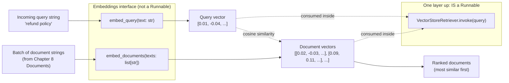

# Chapter 9: Embeddings & Similarity

> "Don't derive the math here — you already have a whole chapter for that. This chapter is about the *interface* LangChain Core wraps around it, and why that interface is shaped the way it is."

## Learning Objectives

By the end of this chapter, you will be able to:

- Explain the `Embeddings` base interface in LangChain Core and its two core methods, `embed_query` and `embed_documents`
- Justify *why* the interface deliberately distinguishes a single query from a batch of documents, instead of exposing one generic `embed(text)` method
- Swap embedding providers (`OpenAIEmbeddings`, `HuggingFaceEmbeddings`, `OllamaEmbeddings`) behind the same interface, mirroring the chat-model-swapping pattern from Chapter 3
- Recall, at a practical (not derivational) level, why cosine similarity is the standard comparison metric, and why dimensionality and normalization matter operationally
- Wrap any `Embeddings` instance in `CacheBackedEmbeddings` to avoid redundant, costly re-embedding of unchanged documents
- Explain why `Embeddings` itself sits outside the strict `Runnable`/`.invoke()` world in LangChain Core, while retrievers built on top of it are full Runnables — setting up Chapter 10
- Build a small semantic search script that embeds a handful of documents and ranks them against a query by cosine similarity

---

## Prerequisites for This Chapter

This chapter builds on **[Chapter 8: Documents & Loaders](./08-documents-and-loaders.md)**, where you learned:

- The `Document` object — LangChain Core's standard container for a piece of text plus its `metadata`
- How loaders turn raw sources (files, APIs, databases) into lists of `Document` objects
- That by the end of the loading (and, upstream of this course's scope, splitting) phase, you have a pile of `Document` objects ready to be indexed

This chapter picks up exactly where that pile of documents leaves off. A `Document` is still just text — a computer cannot compare "meaning" between two `Document.page_content` strings directly. To make that comparison possible, every document (and every incoming query) has to pass through an **embedding model**, which converts text into a fixed-length vector of numbers. LangChain Core does not implement any embedding model itself; it defines a single, small interface — `Embeddings` — that every provider implements, so that the rest of your pipeline never has to know or care which specific model is doing the work underneath.

If you want the mathematical foundations of what an embedding *is*, why cosine similarity is the default metric, and how to evaluate embedding model quality, that ground was covered thoroughly in the sibling RAG course's **[Embeddings Fundamentals](../rag-course/04-embeddings-fundamentals.md)** chapter. This chapter assumes you either already read that or are comfortable treating embeddings as "a black box that turns text into a vector of numbers where similar meaning means nearby vectors," and instead focuses on **how LangChain Core packages that black box as a stable, swappable interface**, and how that interface fits into the LCEL world you've been building since Chapter 4.

No new setup is required. If you want to trace through the code examples by hand, no execution is necessary — every example in this chapter is illustrative pseudocode reasoned through on paper, not a live script.

---

## 1. The Problem: Every Provider Has a Different SDK

Recall the chat-model story from Chapter 3: OpenAI's SDK, Anthropic's SDK, and a local Ollama server all expose subtly different Python APIs for "send messages, get a response." LangChain Core's `BaseChatModel` interface hid those differences behind one shape: `.invoke(messages) -> AIMessage`.

Embedding providers have the exact same problem, just one layer earlier in the pipeline. Compare (illustrative, not executed):

```python
# Raw OpenAI SDK
from openai import OpenAI
client = OpenAI()
resp = client.embeddings.create(model="text-embedding-3-small", input="hello world")
vector = resp.data[0].embedding

# Raw sentence-transformers (typical HuggingFace path)
from sentence_transformers import SentenceTransformer
model = SentenceTransformer("all-MiniLM-L6-v2")
vector = model.encode("hello world")

# Raw Ollama HTTP call
import requests
resp = requests.post(
    "http://localhost:11434/api/embeddings",
    json={"model": "nomic-embed-text", "prompt": "hello world"},
)
vector = resp.json()["embedding"]
```

Three different call shapes, three different return types, three different places to remember "did I pass a list or a string?" If your retrieval pipeline is written directly against any one of these, migrating providers — or even just A/B testing two of them — means rewriting every call site. LangChain Core's answer is the same pattern you already trust from chat models: define one abstract base class, and let every provider implement it.

---

## 2. The `Embeddings` Base Interface

At its core, `Embeddings` (from `langchain_core.embeddings`) is a small abstract base class with exactly two required methods:

```python
from abc import ABC, abstractmethod


class Embeddings(ABC):
    """Interface for embedding models."""

    @abstractmethod
    def embed_documents(self, texts: list[str]) -> list[list[float]]:
        """Embed a list of documents (batch)."""

    @abstractmethod
    def embed_query(self, text: str) -> list[float]:
        """Embed a single piece of query text."""

    # Async counterparts, with default implementations that
    # delegate to the sync methods via a thread pool unless a
    # provider overrides them with a native async client call.
    async def aembed_documents(self, texts: list[str]) -> list[list[float]]:
        ...

    async def aembed_query(self, text: str) -> list[float]:
        ...
```

That's the entire contract. No `.invoke()`, no `Runnable` inheritance, no streaming — just "give me a batch of vectors" and "give me one vector." Every concrete embedding class in the LangChain ecosystem — `OpenAIEmbeddings`, `HuggingFaceEmbeddings`, `OllamaEmbeddings`, `CohereEmbeddings`, `FakeEmbeddings` (used in tests), and dozens more from `langchain-community` and partner packages — implements exactly these four methods (two sync, two async) and nothing else is required of them.

```python
from langchain_openai import OpenAIEmbeddings

embeddings = OpenAIEmbeddings(model="text-embedding-3-small")

query_vector = embeddings.embed_query("What is the return policy?")
# -> [0.0123, -0.0456, ..., 0.0089]   (a single flat list of floats)

doc_vectors = embeddings.embed_documents([
    "Returns are accepted within 30 days of purchase.",
    "Shipping takes 3-5 business days.",
])
# -> [[0.0111, ...], [0.0298, ...]]   (a list of lists — one vector per input string)
```

Notice the shapes carefully: `embed_query` takes a `str` and returns `list[float]` — a single vector. `embed_documents` takes `list[str]` and returns `list[list[float]]` — a batch of vectors, one per input string, in the same order. Getting these two shapes confused (e.g., passing a single string wrapped in a list to `embed_query`, or a bare string to `embed_documents`) is a common source of type errors when hand-rolling embedding calls, which is exactly the kind of friction the interface is designed to remove: as long as you call the right method for the right situation, the shape is guaranteed.

---

## 3. Why Two Methods Instead of One `embed(text)`?

This is the detail most engineers coming from raw SDKs miss, and it's worth dwelling on because it's a genuine, practical reason — not API design for its own sake.

Many embedding models are trained **asymmetrically**: they expect queries and documents to look slightly different on the way in, even though both come out as vectors in the same space. Two concrete examples:

- **E5-family models** (`intfloat/e5-large-v2`, `multilingual-e5-*`) are trained with an explicit text prefix convention: every document gets prefixed with `"passage: "` and every query gets prefixed with `"query: "` before being embedded. Skip this and the model still *runs* — it just silently produces a lower-quality space, because the model was never shown un-prefixed text during training.
- **Instructor-family models** go further, expecting a natural-language instruction prepended to the text describing the *task* — e.g., `"Represent this sentence for retrieval: ..."` — and that instruction can differ for the query side versus the document side of a retrieval task.

If LangChain Core exposed one generic `embed(text)` method, every provider that needs this asymmetry would have to smuggle in a side channel (a flag, a kwarg, a second hidden method) to know which prefix to apply — and callers would have to remember to pass it correctly every single time. By splitting the interface into `embed_query` and `embed_documents` from the start, the *provider implementation* owns the responsibility of applying the right prefix/instruction internally, and the *caller* only has to know one simple rule:

> **Embedding one incoming search query? Call `embed_query`. Embedding a batch of documents you're about to store? Call `embed_documents`.**

```python
class HuggingFaceEmbeddings(Embeddings):
    query_instruction: str = ""
    embed_instruction: str = ""

    def embed_query(self, text: str) -> list[float]:
        # Applies query_instruction internally before encoding.
        return self._client.encode(self.query_instruction + text).tolist()

    def embed_documents(self, texts: list[str]) -> list[list[float]]:
        # Applies embed_instruction internally, and takes advantage
        # of true batching for throughput.
        prefixed = [self.embed_instruction + t for t in texts]
        return self._client.encode(prefixed).tolist()
```

(Illustrative simplification of the real `langchain_huggingface` implementation — the point is that the prefix logic lives once, inside the class, invisible to every caller.)

There's a second, more mundane reason for the split: **batching**. `embed_documents` is called with potentially thousands of strings at index time, and a well-behaved implementation sends them to the provider in efficient batches (respecting API rate limits or GPU memory limits) and returns them in the original order. `embed_query` is called with exactly one string, at request time, where latency — not throughput — is what matters. Providers are free to optimize each path differently because the interface tells them, unambiguously, which situation they're in.

Models that don't have this query/document asymmetry (plenty of them don't) are free to implement `embed_query` as a one-element call to the same underlying encoder used by `embed_documents` — the interface doesn't *force* asymmetry, it just makes room for providers that need it.

---

## 4. Provider-Agnostic Embeddings: The Swap Story, Again

This is the same story as Chapter 3's chat-model swapping, transplanted one layer down the pipeline. Every one of these produces an object satisfying the `Embeddings` interface:

```python
# Option A: OpenAI, API-based
from langchain_openai import OpenAIEmbeddings
embeddings = OpenAIEmbeddings(model="text-embedding-3-small")

# Option B: HuggingFace, self-hosted / local
from langchain_huggingface import HuggingFaceEmbeddings
embeddings = HuggingFaceEmbeddings(model_name="sentence-transformers/all-MiniLM-L6-v2")

# Option C: Ollama, local server
from langchain_ollama import OllamaEmbeddings
embeddings = OllamaEmbeddings(model="nomic-embed-text")
```

Everything downstream — the retriever built on top (Chapter 10), the vector store it queries, the chain that wraps it — is written against `embeddings.embed_query(...)` and `embeddings.embed_documents(...)`, and never imports `OpenAIEmbeddings` or `HuggingFaceEmbeddings` by name. That's the entire point: your indexing pipeline and your retrieval chain can be written once, against the abstract type, and the concrete provider becomes a single configuration line — often driven by an environment variable or settings object, exactly like the chat model factory from Chapter 3.

```python
def get_embeddings(provider: str) -> Embeddings:
    if provider == "openai":
        return OpenAIEmbeddings(model="text-embedding-3-small")
    if provider == "huggingface":
        return HuggingFaceEmbeddings(model_name="sentence-transformers/all-MiniLM-L6-v2")
    if provider == "ollama":
        return OllamaEmbeddings(model="nomic-embed-text")
    raise ValueError(f"Unknown embeddings provider: {provider}")
```

**But** — and this is the caveat this chapter's Real-World Scenario is built around — "swappable interface" does *not* mean "swappable at zero cost." Unlike chat models, where swapping providers mid-conversation is mostly a quality/cost trade-off, swapping embedding providers mid-project has a hard structural consequence: **the vectors themselves live in a different, incompatible coordinate space.** The interface hides the *code* differences beautifully. It cannot, and does not try to, hide the *mathematical* difference between two models' output spaces. Section 7 walks through exactly what goes wrong when a team forgets this.

---

## 5. A Practical Recap: Cosine Similarity, Dimensionality, Normalization

The full mathematical treatment — cosine similarity vs. dot product vs. Euclidean distance, why the distributional hypothesis makes embeddings work at all, and how to evaluate embedding model quality with MTEB — lives in **[the RAG course's Embeddings Fundamentals chapter](../rag-course/04-embeddings-fundamentals.md)**. Go there for the derivations. Here, we recap only what you need to reason about the `Embeddings` interface in practice.

**Cosine similarity** is the standard way to compare two embedding vectors:

```
cosine(A, B) = (A · B) / (‖A‖ · ‖B‖)
```

It ranges from -1 (opposite) to 1 (identical direction), and it's the default because it measures *direction* — meaning — while ignoring vector *length*, which tends to correlate with irrelevant things like text length rather than semantic content. Most embedding providers either train their models with cosine similarity as the intended metric, or return vectors already normalized to unit length (in which case cosine similarity and dot product produce identical rankings, and dot product is cheaper to compute — no square roots).

**Dense vs. sparse vectors**, briefly: everything in this chapter is a **dense** vector — every one of the (say) 1536 numbers is typically non-zero, and meaning is encoded in the overall geometric pattern across all dimensions at once. This is what `OpenAIEmbeddings`, `HuggingFaceEmbeddings`, and `OllamaEmbeddings` all produce. **Sparse** vectors (as produced by classic lexical methods like TF-IDF/BM25, or newer learned-sparse models like SPLADE) are mostly zeros, with non-zero weights only at dimensions corresponding to specific vocabulary terms actually present in the text — closer in spirit to "which words appeared and how much they mattered" than "where does this text sit in meaning-space." The `Embeddings` interface in LangChain Core is designed around dense vectors; sparse and hybrid retrieval are handled by separate abstractions layered on top of retrievers, which is out of scope for this LCEL-focused course.

**Why dimensionality matters practically, not just mathematically:**

- Every vector store index is configured for a **fixed dimensionality** at creation time. `OpenAIEmbeddings(model="text-embedding-3-small")` produces 1536-dimensional vectors; `HuggingFaceEmbeddings(model_name="...MiniLM-L6-v2")` produces 384-dimensional vectors. You cannot mix them in one index — either the write fails outright, or (worse) the store accepts it via truncation/padding and returns meaningless similarity scores.
- Higher dimensionality generally costs more storage and slightly more search latency, for a (diminishing) quality gain. This is purely an infrastructure trade-off you make once, when choosing a provider — not something the `Embeddings` interface itself has an opinion about.

**Why normalization matters practically:**

- If your vector store's configured distance metric is dot product (common, because it's cheap), and your embedding model does *not* return unit-normalized vectors, similarity rankings will be skewed by each vector's raw magnitude rather than pure semantic direction. Most modern embedding providers normalize internally or document whether you need to; check the provider's docs rather than assuming.
- Some `Embeddings` implementations expose a `normalize_embeddings` constructor argument for exactly this reason (common in `HuggingFaceEmbeddings`, which wraps `sentence-transformers`) — worth knowing it exists, not worth deriving here.

---

## 6. Caching Embeddings: `CacheBackedEmbeddings`

Embedding the same document twice is pure waste: it costs API money (for hosted providers) or GPU/CPU time (for self-hosted ones), and produces the exact same vector both times, since embedding is a deterministic function of the input text for any given model version. This happens more often than it sounds — re-running an ingestion script during development, re-indexing a corpus where only a handful of documents changed, or a retrieval pipeline that re-embeds a popular recurring query on every request.

LangChain Core (via `langchain.embeddings.CacheBackedEmbeddings`, built on `langchain_core` caching primitives) solves this by wrapping *any* `Embeddings` instance in a transparent cache:

```python
from langchain.embeddings import CacheBackedEmbeddings
from langchain.storage import LocalFileStore
from langchain_openai import OpenAIEmbeddings

underlying_embeddings = OpenAIEmbeddings(model="text-embedding-3-small")
store = LocalFileStore("./embedding_cache/")

cached_embeddings = CacheBackedEmbeddings.from_bytes_store(
    underlying_embeddings,
    store,
    namespace=underlying_embeddings.model,  # keeps caches separate per model
)

# First call: cache miss for every doc, hits OpenAI's API, writes results to store.
vectors = cached_embeddings.embed_documents([
    "Returns are accepted within 30 days.",
    "Shipping takes 3-5 business days.",
])

# Second call, same documents: every one is a cache hit, no API call is made.
vectors_again = cached_embeddings.embed_documents([
    "Returns are accepted within 30 days.",
    "Shipping takes 3-5 business days.",
])
```

The mechanism is straightforward: each input text is hashed into a cache key (scoped by the `namespace`, which is why passing the model name matters — it prevents a cache entry produced by one model from being served for a different model), and the resulting vector is stored as bytes in whatever `ByteStore` backend you configure — `LocalFileStore` for a local disk cache, or a Redis-backed store for a shared cache across worker processes. On the next call with the same text, `CacheBackedEmbeddings` checks the store first; only genuine misses go to the underlying provider.

Critically, `CacheBackedEmbeddings` **is itself an `Embeddings`** — it implements `embed_query` and `embed_documents` with the identical signatures as anything else in this chapter. Every piece of downstream code that accepts an `Embeddings` (a retriever, an indexing pipeline, a vector store constructor) accepts a `CacheBackedEmbeddings` without modification. Caching is a wrapper, applied transparently through the same interface — the exact decorator-like pattern you've now seen repeatedly across this course (runnables composing runnables, retry/fallback wrappers around chat models).

A subtlety worth flagging: `embed_query` is intentionally **not cached by default** in `CacheBackedEmbeddings` (only `embed_documents` is cached out of the box, since queries are typically unique per user request and caching them provides little benefit while consuming cache storage). If you have a workload with genuinely repeated queries — an FAQ bot, for instance — you can construct a variant that caches the query path too, but that's a deliberate opt-in, not the default behavior.

---

## 7. How Embeddings Fit Into the LCEL / Runnable World

Here's a fact that trips people up after eight chapters of "everything is a Runnable": **`Embeddings` is not a `Runnable`.** It does not have `.invoke()`, `.batch()`, or `.stream()`. You cannot drop an `Embeddings` instance directly into an LCEL pipe chain with `|` the way you can a prompt template, a chat model, or an output parser.

This is a deliberate, narrow design choice, not an oversight. `Embeddings` models two very specific operations — "embed one query" and "embed a batch of documents" — each with its own distinct input/output shape (`str -> list[float]` vs. `list[str] -> list[list[float]]`). A generic `Runnable[Input, Output]` expects one uniform shape for `.invoke()`, and forcing the query/document asymmetry from Section 3 into that single shape would reintroduce exactly the ambiguity the two-method split was designed to avoid. So LangChain Core keeps `Embeddings` as its own small, purpose-built interface, sitting one layer *below* the `Runnable` abstraction rather than inside it.

Where the `Runnable` world re-enters is one level up: **retrievers**. A `VectorStoreRetriever` (or any other retriever built on top of a vector store) is constructed *using* an `Embeddings` instance internally — the vector store calls `embed_query` on your search string and `embed_documents` when documents are indexed — but the retriever itself fully implements `Runnable[str, list[Document]]`. That means once you have a retriever, `.invoke()`, `.batch()`, LCEL composition with `|`, automatic tracing, and every other Runnable capability from Chapters 4-7 apply to it directly.

```python
# Embeddings alone: NOT a Runnable — no .invoke()
vector = embeddings.embed_query("refund policy")   # plain method call

# A retriever built on those embeddings: IS a Runnable
retriever = vector_store.as_retriever()
docs = retriever.invoke("refund policy")            # .invoke() works here
chain = retriever | format_docs | prompt | llm       # composes with | here
```

So the mental model for this chapter is: `Embeddings` is plumbing — an internal dependency that vector stores and retrievers consume — not a pipeline stage you compose directly. Chapter 10 is where that plumbing gets wrapped into `Runnable` retrievers you can drop straight into an LCEL chain, exactly like every other component in this course.



---

## 8. Worked Example: Ranking Documents by Cosine Similarity

Let's hand-trace the whole pipeline with tiny, illustrative 4-dimensional vectors — real embedding models return hundreds or thousands of dimensions, but the arithmetic generalizes identically, just with more terms in each sum. Nothing here is executed code; every number is chosen by hand to make the ranking obvious.

Suppose we have three short documents about a company's shipping and returns policy, already run through `embed_documents`:

```python
documents = [
    "Returns are accepted within 30 days of purchase.",   # doc_0
    "Our shipping takes 3-5 business days.",               # doc_1
    "We offer a 30-day money-back guarantee.",             # doc_2
]

# Illustrative 4-dim vectors standing in for what embed_documents(...) would return.
doc_vectors = [
    [0.90, 0.10, 0.05, 0.10],   # doc_0: "returns / 30 days"
    [0.05, 0.95, 0.10, 0.05],   # doc_1: "shipping / days"
    [0.85, 0.15, 0.10, 0.05],   # doc_2: "money-back / 30 days" — close to doc_0
]
```

A user asks a question, which goes through `embed_query` instead:

```python
query = "What is your return policy?"

query_vector = [0.88, 0.12, 0.06, 0.08]   # embed_query(query), illustrative
```

Now compute cosine similarity between the query vector and each document vector by hand, using `cosine(A, B) = (A·B) / (‖A‖ ‖B‖)`:

**Against doc_0** `[0.90, 0.10, 0.05, 0.10]`:
```
A · B = (0.88*0.90) + (0.12*0.10) + (0.06*0.05) + (0.08*0.10)
      = 0.792 + 0.012 + 0.003 + 0.008 = 0.815

‖query‖  = sqrt(0.88² + 0.12² + 0.06² + 0.08²) = sqrt(0.7744+0.0144+0.0036+0.0064) = sqrt(0.7988) ≈ 0.894
‖doc_0‖  = sqrt(0.90² + 0.10² + 0.05² + 0.10²) = sqrt(0.81+0.01+0.0025+0.01)       = sqrt(0.8325) ≈ 0.912

cosine(query, doc_0) ≈ 0.815 / (0.894 * 0.912) ≈ 0.815 / 0.815 ≈ 1.00 (very close to 1 — near-identical direction)
```

**Against doc_1** `[0.05, 0.95, 0.10, 0.05]`:
```
A · B = (0.88*0.05) + (0.12*0.95) + (0.06*0.10) + (0.08*0.05)
      = 0.044 + 0.114 + 0.006 + 0.004 = 0.168

‖doc_1‖ = sqrt(0.05²+0.95²+0.10²+0.05²) = sqrt(0.0025+0.9025+0.01+0.0025) = sqrt(0.9175) ≈ 0.958

cosine(query, doc_1) ≈ 0.168 / (0.894 * 0.958) ≈ 0.168 / 0.856 ≈ 0.20 (far apart — low similarity)
```

**Against doc_2** `[0.85, 0.15, 0.10, 0.05]`:
```
A · B = (0.88*0.85) + (0.12*0.15) + (0.06*0.10) + (0.08*0.05)
      = 0.748 + 0.018 + 0.006 + 0.004 = 0.776

‖doc_2‖ = sqrt(0.85²+0.15²+0.10²+0.05²) = sqrt(0.7225+0.0225+0.01+0.0025) = sqrt(0.7575) ≈ 0.870

cosine(query, doc_2) ≈ 0.776 / (0.894 * 0.870) ≈ 0.776 / 0.778 ≈ 1.00 (also very close to 1)
```

**Ranking** the three documents by similarity to the query "What is your return policy?":

| Rank | Document | Cosine similarity (approx.) |
|---|---|---|
| 1 | doc_0 — "Returns are accepted within 30 days of purchase." | ~1.00 |
| 2 | doc_2 — "We offer a 30-day money-back guarantee." | ~1.00 |
| 3 | doc_1 — "Our shipping takes 3-5 business days." | ~0.20 |

This matches intuition exactly: doc_0 and doc_2 are both about returns/refunds, so they cluster tightly around the query's direction even though they share almost no exact wording ("returns... 30 days" vs. "money-back guarantee"). doc_1, about shipping timelines, sits in a clearly different direction and is correctly ranked last. A real vector store performs precisely this comparison — just across every stored document vector, using an indexed nearest-neighbor search instead of the by-hand loop above, and returning the top-k as `Document` objects for a retriever to hand off to your LCEL chain.

---

## 9. Real-World Scenario

**Scenario:** A mid-sized SaaS company builds an internal support-ticket search tool on top of LangChain, using `OpenAIEmbeddings(model="text-embedding-3-small")` to index roughly 200,000 historical tickets into a vector store. It works well for months.

Then the finance team flags rising OpenAI API costs, and an engineer is asked to cut spend. Their fix: swap `OpenAIEmbeddings` for a self-hosted `HuggingFaceEmbeddings(model_name="sentence-transformers/all-MiniLM-L6-v2")` — free to run once the model is downloaded, no per-call charges. Because both classes satisfy the exact same `Embeddings` interface, the code change is genuinely tiny:

```python
# Before
embeddings = OpenAIEmbeddings(model="text-embedding-3-small")

# After — looks like a clean, safe swap
embeddings = HuggingFaceEmbeddings(model_name="sentence-transformers/all-MiniLM-L6-v2")
```

The engineer updates the query-time embedding call, ships it, and moves on — the interface made the change look complete. It was not. Two problems surface within days, in order of how visibly they break things:

1. **Dimension mismatch, loud failure (the lucky case).** `text-embedding-3-small` returns 1536-dimensional vectors; `all-MiniLM-L6-v2` returns 384-dimensional vectors. The vector store's index was created for 1536 dimensions, so new queries embedded at 384 dimensions are rejected outright, or — depending on the store — coerced/padded in a way that produces nonsense comparisons instead of a clean error.
2. **Coordinate-space mismatch, silent failure (the dangerous case).** Even after an engineer "fixes" the dimension problem by reconfiguring the index for 384 dimensions, the 200,000 *already-indexed* tickets are still OpenAI vectors sitting in the store, while every new incoming query is now a MiniLM vector. Comparing a MiniLM query vector against an OpenAI document vector via cosine similarity is not "less accurate" — it is **meaningless**. The two models were never trained together and don't share a coordinate system; a high or low similarity score between them is coincidence, not signal. Search results degrade toward random, but nothing throws an exception — support agents just start noticing that "the search tool feels worse lately," a much harder signal to trace back to a specific commit than a stack trace would have been.

**The fix:** the team re-embeds the **entire 200,000-ticket corpus** with the new `HuggingFaceEmbeddings` model, rebuilds the vector index from scratch at the correct (384) dimensionality, and only after that full re-index completes do they cut over the query-time embedding call. Until the re-index finishes, they keep serving search from the old OpenAI-embedded index with the old query path, rather than flipping the switch early and serving a corrupted mixed index in production.

**Lesson:** the `Embeddings` interface guarantees that swapping providers is a *small code change*. It does not, and cannot, guarantee that swapping providers is a *safe operational change*. Any change to the embedding model is a full re-indexing event — budget for it, version it, and treat "which embedding model produced this vector" as data that belongs with the vector, not something you infer from whatever the current config file happens to say.

---

## 10. Best Practices

- **Call `embed_query` for search-time input and `embed_documents` for indexing-time batches — never mix them up**, even for models where the two currently behave identically; a future model swap may introduce the asymmetry from Section 3 without warning.
- **Always use one `Embeddings` instance, from one provider and one model version, across an entire index's lifetime.** Treat any change here as a corpus-wide re-indexing event, never an in-place patch (Section 9).
- **Pin the model name explicitly** (e.g., `OpenAIEmbeddings(model="text-embedding-3-small")` rather than relying on a default) so an upstream default change doesn't silently shift your vector space out from under you.
- **Wrap production embedding calls in `CacheBackedEmbeddings`** with a persistent `ByteStore`, scoped by model name in the `namespace`, to avoid paying to re-embed unchanged documents on every ingestion run.
- **Record which embedding model produced each stored vector**, either via the vector store's own metadata or your own tracking, so a future provider swap is a deliberate, auditable decision rather than a guess.
- **Verify the provider's normalization behavior** rather than assuming — check whether the `Embeddings` implementation returns unit-normalized vectors, especially if your vector store's configured distance metric is dot product.
- **Never compose an `Embeddings` instance directly into an LCEL `|` chain** expecting Runnable behavior — build a retriever on top of it first (Chapter 10) if you need `.invoke()`/`.batch()`/composability.

---

## 11. Common Mistakes

- **Treating provider swaps as free because the interface made the code change small.** The interface hides SDK differences, not the underlying vector-space incompatibility — see Section 9.
- **Forgetting to re-embed the existing corpus after a model change**, leaving old and new vectors mixed in one index, producing silently degraded (not obviously broken) search quality.
- **Calling `embed_documents` on a single query string** (or `embed_query` on a batch), which either throws a type error or, worse, silently skips a query-specific prefix/instruction the model needed for good results.
- **Assuming `Embeddings` is a `Runnable`** and trying to pipe it directly with `|` into an LCEL chain — it isn't; only retrievers built on top of it are.
- **Caching `embed_query` results for genuinely unique, per-user queries**, wasting cache storage for entries that will essentially never be hit again — `CacheBackedEmbeddings` caches `embed_documents` by default for exactly this reason.
- **Ignoring the `namespace` argument when constructing `CacheBackedEmbeddings`**, which can let a cache entry produced by one model get served for a different model if you ever change providers without also changing the cache directory/namespace.
- **Not checking dimensionality before configuring a vector store index**, discovering the mismatch only when writes start failing (the lucky case) or, worse, when the store silently accepts mismatched vectors (the dangerous case).

---

## Summary

- The `Embeddings` base interface in LangChain Core defines exactly two required methods: `embed_query(text: str) -> list[float]` for a single search query, and `embed_documents(texts: list[str]) -> list[list[float]]` for a batch of documents.
- The split exists because many models treat queries and documents asymmetrically (prefix or instruction conventions like E5's `"query: "`/`"passage: "`), and because batching strategy differs between index-time throughput and query-time latency.
- `OpenAIEmbeddings`, `HuggingFaceEmbeddings`, and `OllamaEmbeddings` all satisfy the same interface, letting you swap providers behind a single factory function — mirroring the chat-model swapping pattern from Chapter 3.
- Cosine similarity remains the standard comparison metric for the dense vectors these providers produce; dimensionality and normalization are practical, operational concerns (fixed index configuration, distance-metric assumptions) rather than abstract math — the full derivation lives in the sibling RAG course.
- `CacheBackedEmbeddings` wraps any `Embeddings` instance in a transparent cache keyed by text and model namespace, avoiding redundant re-embedding costs while preserving the exact same interface for downstream code.
- `Embeddings` itself is not a `Runnable` — it has no `.invoke()` — but retrievers built on top of an `Embeddings` instance and a vector store are full `Runnable[str, list[Document]]` objects, which is where Chapter 10 picks up.
- Swapping embedding providers mid-project requires re-embedding the entire corpus; skipping this step mixes incompatible vector spaces and produces silent, hard-to-diagnose search quality degradation.

---

## Knowledge Check

1. Write the exact method signatures for `embed_query` and `embed_documents`. Why does `embed_documents` take and return a *list* while `embed_query` takes and returns a single item?
2. Name a specific embedding model family that applies different text prefixes for queries versus documents, and explain what happens to retrieval quality (not correctness — quality) if that prefix convention is silently skipped.
3. You need to swap your production embedding provider from `OpenAIEmbeddings` to `OllamaEmbeddings` to cut costs. List every step required to do this safely, beyond just changing the constructor call.
4. What does the `namespace` argument to `CacheBackedEmbeddings.from_bytes_store` protect against, and what could go wrong if you reused the same cache directory across two different embedding models without changing it?
5. Explain, in your own words, why `Embeddings` is not a `Runnable` in LangChain Core, while a retriever built on top of one is. What would be lost if `Embeddings` tried to force both `embed_query` and `embed_documents` into a single `.invoke()` method?
6. A colleague wants to compare a query vector produced by `text-embedding-3-large` against document vectors produced by `text-embedding-3-small`, stored in the same index. What two distinct problems does this create, and which one fails loudly versus silently?

---

## Hands-On Exercise

Build a small **semantic search / similarity search script** — conceptually, not necessarily executed — over roughly 10 short documents.

**Setup:**

1. Define a list of ~10 short `Document`-style strings (reuse the `Document` object from Chapter 8 if you like), covering at least two or three distinct topics — for example, a mix of "return/refund policy," "shipping and delivery," and "account/login help" sentences, so that clustering is visible in your results.
2. Choose one `Embeddings` implementation (pick any of `OpenAIEmbeddings`, `HuggingFaceEmbeddings`, or `OllamaEmbeddings` in your write-up — no need to actually run it) and reason through:
   - Call `embed_documents` once on all ~10 strings to obtain your document vectors.
   - Write 2-3 example user queries, one per topic cluster.

**Tasks:**

1. For each query, call `embed_query` (by hand-reasoning, as in Section 8 — you don't need real numbers, illustrative ones are fine) and compute cosine similarity against every one of the ~10 document vectors.
2. Rank the documents for each query from most to least similar, and write down the ranking.
3. Confirm that documents from the *same* topic cluster as the query rank at the top, and documents from unrelated clusters rank at the bottom — exactly like doc_0/doc_2 vs. doc_1 in Section 8's worked example.
4. Wrap your chosen `Embeddings` instance in `CacheBackedEmbeddings` (write out the constructor call with a `LocalFileStore` and a sensible `namespace`) and explain, in a sentence or two, exactly which of your calls above would be served from cache versus which would still hit the underlying provider on a second run of your script.
5. **Bonus:** Rewrite the same script's `get_embeddings()` factory function so it can produce any of the three providers from Section 4 based on a single string argument, and note which single line would need to change in production to move providers — and which non-code steps (from Section 9's Real-World Scenario) you'd still have to do before flipping that line in a live system.

---

## Further Reading

- [Sibling RAG course — Embeddings Fundamentals](../rag-course/04-embeddings-fundamentals.md) — the full mathematical treatment: cosine similarity vs. dot product vs. Euclidean distance derivations, the distributional hypothesis, the embedding model landscape (OpenAI, BGE, E5, GTE, Jina, Nomic, Instructor), and how to read an MTEB leaderboard
- [LangChain Python API Reference — `Embeddings`](https://python.langchain.com/api_reference/core/embeddings/langchain_core.embeddings.embeddings.Embeddings.html) — the official interface definition this chapter is built around
- [LangChain Python API Reference — `CacheBackedEmbeddings`](https://python.langchain.com/api_reference/langchain/embeddings/langchain.embeddings.cache.CacheBackedEmbeddings.html) — constructor options, `ByteStore` backends, and namespace behavior
- [LangChain Documentation — Text Embedding Models](https://python.langchain.com/docs/concepts/embedding_models/) — conceptual overview and the list of supported integrations (OpenAI, HuggingFace, Ollama, Cohere, and more)
- [intfloat/e5-large-v2 Model Card (Hugging Face)](https://huggingface.co/intfloat/e5-large-v2) — the query/passage prefix convention referenced in Section 3
- Chapter 3 of this course (Chat Models) — the original "provider-agnostic interface" pattern this chapter mirrors one layer down the pipeline
- Chapter 10 of this course (Retrievers) — where `Embeddings` gets wrapped into a full `Runnable`

---

<div style="display:flex;justify-content:space-between;align-items:center;">
  <a href="./08-documents-and-loaders.md">← Previous: Documents & Loaders</a>
  <a href="./00-index.md">🏠 Index</a>
  <a href="./10-retrievers.md">Next: Retrievers →</a>
</div>
