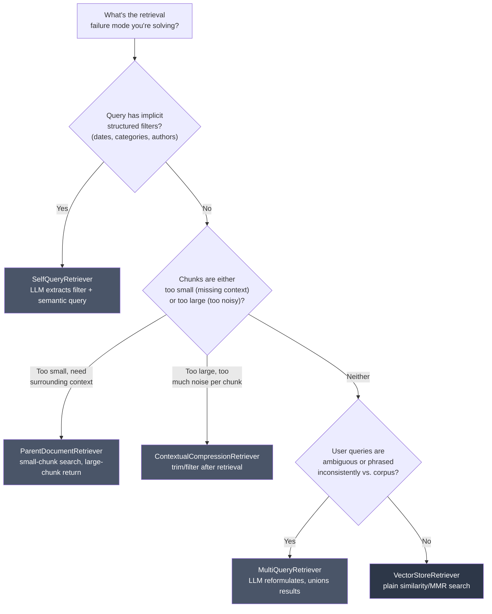

# Chapter 10: Retrievers

> "The best answer in your vector store is worthless if the retriever hands the LLM the wrong three paragraphs." — every RAG engineer, eventually

## Learning Objectives

By the end of this chapter, you will be able to:

- Explain why a LangChain `Retriever` is just a `Runnable` whose output type is `List[Document]`, and why that single fact is what lets it slot into any LCEL chain from Chapter 6
- Configure a `VectorStoreRetriever` with `search_kwargs` (`k`, score thresholds, metadata filters) and know exactly what `.invoke(query)` does under the hood
- Use `MultiQueryRetriever` to combat ambiguous or under-specified user questions by having an LLM generate multiple reformulations
- Use `ContextualCompressionRetriever` to strip irrelevant sentences/documents out of retrieved context before it burns tokens in your prompt
- Explain and trace through the small-chunk-index / large-chunk-return pattern implemented by `ParentDocumentRetriever`
- Use `SelfQueryRetriever` to let an LLM translate natural-language filter intent ("papers from 2023 about transformers") into a structured metadata filter plus a semantic query
- Compose any retriever into a complete LCEL RAG chain using `RunnableParallel` and `RunnablePassthrough`, and choose the right retriever strategy for a given failure mode

---

## Prerequisites for This Chapter

This chapter builds directly on **[Chapter 9: Embeddings & Similarity](./09-embeddings-and-similarity.md)**, where you learned:

- How `Embeddings` objects turn text into vectors, and how a vector store performs approximate nearest-neighbor search over those vectors
- That similarity search returns `Document` objects ranked by a distance/similarity score
- That "which vector store" and "how similarity is computed" are separable concerns from "how the query gets executed"

This chapter is about that last point. Chapter 9 gave you a vector store that *can* answer "give me the 4 closest chunks to this query vector." A **retriever** is the thing that decides *how* to ask that question — sometimes literally, sometimes after rewriting the query five different ways, sometimes trimming the answer down before it goes any further. If Chapter 9 was about the storage and math, this chapter is about the strategy layer sitting on top of it — and, critically, about the fact that this strategy layer is a first-class `Runnable`, which means everything you learned about `.pipe()`, `RunnableParallel`, and `RunnablePassthrough` in **Chapter 6: LCEL — The Runnable Protocol** applies to it without modification.

No new setup is required beyond what earlier chapters assumed: a vector store populated with embedded documents (Chapter 9) and an LLM you can call from LCEL (Chapter 5). Code in this chapter is illustrative — reasoned through by hand, not executed — so no installation steps are needed to follow along.

---

## 1. The Central Insight: A Retriever Is a Runnable

### 1.1 The interface, stripped down

Every retriever class in LangChain Core inherits from `BaseRetriever`, which itself inherits from `Runnable[str, List[Document]]`. That inheritance is not decoration — it's the entire reason retrievers integrate so cleanly into LCEL. Concretely, it means:

```python
from langchain_core.retrievers import BaseRetriever
from langchain_core.documents import Document

retriever: BaseRetriever = ...  # any concrete retriever

# These are equivalent entry points, exactly like every other Runnable
docs: list[Document] = retriever.invoke("What is our refund policy?")
docs_batch: list[list[Document]] = retriever.batch(["query 1", "query 2"])
async for doc in retriever.astream("What is our refund policy?"):
    ...  # retrievers rarely stream meaningfully, but the interface is still honored
```

Compare this to Chapter 6's `PromptTemplate` and `ChatModel` runnables: same `.invoke()`/`.batch()`/`.stream()` surface, same ability to compose with `|`, same automatic tracing hooks (previewed here, covered fully in Chapter 11). A retriever is simply a `Runnable[str, List[Document]]` — input a string, output a list of `Document` objects, nothing more exotic than that.

### 1.2 Why this matters more than it sounds

If retrievers were a bespoke, non-`Runnable` class with a `.get_relevant_documents(query)` method and nothing else (which, historically, is roughly what they *were* before LangChain unified everything under the Runnable protocol), you would need special-case glue code every time you wanted to use one inside a chain. Instead, because a retriever is a `Runnable`, this works exactly like piping any two functions together:

```python
from langchain_core.output_parsers import StrOutputParser
from langchain_core.prompts import ChatPromptTemplate

prompt = ChatPromptTemplate.from_template(
    "Answer the question using only this context:\n{context}\n\nQuestion: {question}"
)

# retriever -> format -> prompt -> llm -> parser, all standard LCEL composition
chain = retriever | (lambda docs: "\n\n".join(d.page_content for d in docs))
```

No special adapter. No "retriever wrapper node." It's the same `|` operator from Chapter 6, applied to a different kind of `Runnable`. Keep this fact in your head for the rest of the chapter: every variant discussed below — `VectorStoreRetriever`, `MultiQueryRetriever`, `ContextualCompressionRetriever`, `ParentDocumentRetriever`, `SelfQueryRetriever` — is a drop-in `Runnable[str, List[Document]]`. They differ wildly in *what happens inside* `.invoke()`, but never in the shape of the interface. That uniformity is the entire design philosophy of LangChain Core, applied here to search strategy.

### 1.3 The abstract method you'd implement yourself

If you ever need a custom retriever, this is the entire contract:

```python
from langchain_core.retrievers import BaseRetriever
from langchain_core.documents import Document
from langchain_core.callbacks import CallbackManagerForRetrieverRun


class KeywordRetriever(BaseRetriever):
    documents: list[Document]

    def _get_relevant_documents(
        self, query: str, *, run_manager: CallbackManagerForRetrieverRun
    ) -> list[Document]:
        query_words = set(query.lower().split())
        return [
            doc for doc in self.documents
            if query_words & set(doc.page_content.lower().split())
        ]
```

Subclass `BaseRetriever`, implement `_get_relevant_documents`, and `Runnable.invoke()`/`.batch()`/`.stream()`/tracing all come for free — the base class handles the plumbing. This is exactly the same pattern Chapter 6 introduced for custom `Runnable`s: implement the one method that defines your logic, inherit the rest.

---

## 2. VectorStoreRetriever: The Baseline Case

### 2.1 What it is

`VectorStoreRetriever` is the thin `Runnable` wrapper every vector store exposes via `.as_retriever()`. It does exactly what Chapter 9's similarity search did — nothing more — but repackaged behind the standard retriever interface so it composes with LCEL.

```python
from langchain_core.vectorstores import VectorStore

vector_store: VectorStore = ...  # populated in Chapter 9

retriever = vector_store.as_retriever(
    search_type="similarity",
    search_kwargs={"k": 4},
)

docs = retriever.invoke("What is our refund policy?")
# docs is a List[Document], length <= 4, ranked by similarity
```

### 2.2 `search_kwargs` you'll actually use

| Key | Effect |
|---|---|
| `k` | Number of documents to return. Default is usually 4. Higher `k` gives the LLM more context but risks noise and token cost. |
| `score_threshold` | With `search_type="similarity_score_threshold"`, discards results below a similarity cutoff — useful when "no good match" should mean "return nothing" rather than "return the 4 least-bad matches." |
| `filter` | A metadata filter (syntax is vector-store-specific — Chroma, Pinecone, and pgvector each accept slightly different filter dict shapes) applied *before or alongside* the vector search, e.g. `{"filter": {"category": "billing"}}`. |
| `fetch_k` | For MMR search (`search_type="mmr"`), the number of candidates fetched before diversity re-ranking trims down to `k`. |

```python
retriever = vector_store.as_retriever(
    search_type="mmr",
    search_kwargs={"k": 4, "fetch_k": 20, "lambda_mult": 0.5},
)
```

`search_type="mmr"` (Maximal Marginal Relevance) fetches `fetch_k` candidates by similarity, then greedily selects `k` of them that balance relevance against *diversity* from each other — controlled by `lambda_mult` (1.0 = pure relevance, 0.0 = pure diversity). This matters when your top-4 similarity hits are four near-duplicate paragraphs saying the same thing; MMR trades a little relevance for coverage.

### 2.3 What `.invoke()` does internally

There is no magic here, and that's the point of introducing this retriever first: `.invoke(query)` calls the vector store's embedding function on `query` (the *same* embedding model used at index time — Chapter 9's cardinal rule), runs an ANN similarity search against the stored vectors, and returns the top `k` `Document` objects as a plain Python list. Every fancier retriever in this chapter is built by wrapping, chaining, or replacing this baseline step — never by discarding it, since somewhere at the bottom of every strategy below there is still a vector similarity search doing the actual candidate lookup.

---

## 3. MultiQueryRetriever: Fighting Query Ambiguity with an LLM

### 3.1 The problem it solves

A single vector similarity search is only as good as the phrasing of the query it's given. A user asking *"how do I get my money back?"* might miss a document chunk phrased as *"refund eligibility and processing timelines"* — same meaning, different wording, and even semantic embeddings (Chapter 9) aren't perfectly invariant to phrasing, especially for short, ambiguous, or jargon-light queries. One vector search is one roll of the dice on how well the query's embedding lands near the right chunk.

### 3.2 The strategy

`MultiQueryRetriever` wraps a base retriever with an LLM step that runs *before* retrieval:

1. Take the user's query.
2. Ask an LLM to generate several alternative phrasings of the same underlying question (typically 3-5).
3. Run the base retriever (usually a `VectorStoreRetriever`) once per phrasing.
4. Union the results across all reformulations, de-duplicating documents that came back for more than one phrasing.

```python
from langchain.retrievers.multi_query import MultiQueryRetriever
from langchain_openai import ChatOpenAI

llm = ChatOpenAI(model="gpt-4o-mini", temperature=0)

multiquery_retriever = MultiQueryRetriever.from_llm(
    retriever=vector_store.as_retriever(search_kwargs={"k": 4}),
    llm=llm,
)

docs = multiquery_retriever.invoke("how do I get my money back?")
```

Internally, `from_llm` wires up a prompt roughly equivalent to:

```python
QUERY_PROMPT = ChatPromptTemplate.from_template(
    "You are an AI assistant. Generate 3 different versions of the given "
    "question to retrieve relevant documents from a vector database. "
    "Provide these alternative questions separated by newlines.\n"
    "Original question: {question}"
)
```

The LLM's output is parsed line-by-line into a list of query strings, each one is run through the base retriever independently, and the resulting `Document` lists are flattened and de-duplicated (typically by `page_content` or a content hash) before being returned as one combined list.

### 3.3 Why de-duplication matters

Without de-duplication, a chunk that legitimately matches 3 out of 4 reformulations would appear 3 times in the final list — wasting prompt tokens on a repeat and, in poorly written downstream code, silently inflating that chunk's apparent "vote" if you later did any kind of scoring or counting. `MultiQueryRetriever` handles this for you, so the union step returns each distinct document once no matter how many reformulations surfaced it.

### 3.4 The cost trade-off

This retriever costs one extra LLM call per query (for the reformulations) plus `N` vector searches instead of 1, where `N` is the number of reformulations. That's a real latency and cost increase — appropriate when queries are genuinely ambiguous or your corpus uses inconsistent terminology, wasteful for a narrow, well-phrased-query domain where a single similarity search already performs well. Don't reach for `MultiQueryRetriever` as a default; reach for it when you've *observed* single-query retrieval missing relevant chunks due to phrasing mismatch.

---

## 4. ContextualCompressionRetriever: Trimming Noise Before It Reaches the Prompt

### 4.1 The problem it solves

Similarity search retrieves whole `Document` chunks. A chunk can be relevant *overall* while containing a lot of irrelevant sentences — think of a 500-word onboarding FAQ paragraph where only one sentence answers the user's specific question about API rate limits. Feeding the entire chunk to the LLM wastes context window budget and can actively distract the model, a phenomenon sometimes called "lost in the middle": the more irrelevant tokens surrounding the true answer, the harder it is for the LLM to locate and weight it correctly.

### 4.2 The strategy

`ContextualCompressionRetriever` wraps a base retriever with a **compressor** step that runs *after* retrieval, before the documents are returned to the caller:

```python
from langchain.retrievers import ContextualCompressionRetriever
from langchain.retrievers.document_compressors import LLMChainExtractor

base_retriever = vector_store.as_retriever(search_kwargs={"k": 6})

compressor = LLMChainExtractor.from_llm(llm)

compression_retriever = ContextualCompressionRetriever(
    base_compressor=compressor,
    base_retriever=base_retriever,
)

docs = compression_retriever.invoke("What is the API rate limit for the free tier?")
```

`.invoke()` on this retriever does two steps under the hood:

1. Call `base_retriever.invoke(query)` — get back, say, 6 whole chunks via ordinary similarity search.
2. Pass each retrieved document, together with the original query, through `base_compressor.compress_documents(docs, query)` — which, for `LLMChainExtractor`, asks an LLM to extract *only the sentences relevant to the query* from each document, discarding the rest. A document with zero relevant content can be filtered out entirely rather than returned empty.

Common compressor implementations:

| Compressor | Mechanism |
|---|---|
| `LLMChainExtractor` | LLM call per document; extracts only the relevant span of text |
| `LLMChainFilter` | LLM call per document; binary keep/discard decision (no trimming, just filtering out irrelevant whole documents) |
| `EmbeddingsFilter` | No LLM call — re-embeds each retrieved chunk and the query, discards chunks below a similarity threshold; cheaper and faster than the LLM-based compressors, at the cost of coarser (whole-document, not sentence-level) filtering |

You can also chain multiple compressors together with `DocumentCompressorPipeline` (e.g., an `EmbeddingsFilter` to cheaply discard obviously-irrelevant chunks first, then an `LLMChainExtractor` on the survivors) to balance cost against precision.

### 4.3 Why this reduces context-window waste

Every token that reaches the final prompt costs money (Chapter 5's token-cost discussion) and consumes a share of the LLM's limited attention. A base retriever returning 6 full chunks at ~300 tokens each is 1,800 tokens of context, much of it irrelevant filler. `ContextualCompressionRetriever` can reduce that to the ~400 tokens that actually answer the question — smaller prompt, lower cost, and empirically better answer quality because the signal-to-noise ratio in the context has improved.

---

## 5. ParentDocumentRetriever: Small Chunks for Search, Large Chunks for Context

### 5.1 The tension it resolves

Chunking (a topic your embeddings intuition from Chapter 9 depends on) creates a dilemma:

- **Small chunks** embed and match *precisely* — a single sentence's vector isn't diluted by surrounding unrelated sentences, so similarity search is sharp and specific.
- **Large chunks** give the LLM enough surrounding context to actually answer the question well — a single matched sentence, handed to the LLM in isolation, often lacks the surrounding explanation, caveats, or antecedents needed to answer correctly.

You want the precision of small chunks for the *search* step and the context of large chunks for the *generation* step. `ParentDocumentRetriever` gives you both by decoupling what gets indexed from what gets returned.

### 5.2 The two-store architecture

```python
from langchain.retrievers import ParentDocumentRetriever
from langchain.storage import InMemoryStore
from langchain_text_splitters import RecursiveCharacterTextSplitter

parent_splitter = RecursiveCharacterTextSplitter(chunk_size=2000)
child_splitter = RecursiveCharacterTextSplitter(chunk_size=200)

store = InMemoryStore()  # docstore: parent_id -> full parent Document

retriever = ParentDocumentRetriever(
    vectorstore=vector_store,       # holds embedded CHILD chunks only
    docstore=store,                 # holds full PARENT documents, keyed by id
    child_splitter=child_splitter,
    parent_splitter=parent_splitter,  # optional: also split large source docs into mid-size "parents"
)

retriever.add_documents(source_documents)
```

`add_documents` does the indexing work: each source document is split into parent-sized sections (via `parent_splitter`, if given), each parent section is further split into small child chunks (via `child_splitter`), each child chunk is embedded and stored in `vectorstore` with metadata pointing back to its parent's ID, and the full parent section text is stored separately in `docstore` under that ID. Only the *small* chunks ever get embedded and searched; the *large* parents just sit in a plain key-value store, never touched by the vector index.

### 5.3 What happens on `.invoke()`

1. Embed the query and run similarity search against `vectorstore` — this matches against small, precise child chunks, so the match is sharp.
2. For each matching child chunk, read off its parent ID from metadata.
3. Look up the corresponding full parent `Document` in `docstore`.
4. De-duplicate parent IDs (multiple matched children can share one parent) and return the parent `Document` objects — not the children.

### 5.4 Worked example: tracing a single query through it

Say a source document is a technical section titled "3. Data Retention Policy," split by `parent_splitter` into one parent chunk (that whole section, ~1,800 characters covering three paragraphs), which `child_splitter` further breaks into three small child chunks — one per paragraph:

```
Parent P1 (full section, ~1,800 chars):
  "3. Data Retention Policy
   [Paragraph 1] Customer account data is retained for the
   duration of the active subscription plus 30 days...
   [Paragraph 2] Billing records are retained for 7 years to
   comply with financial regulations...
   [Paragraph 3] Deleted account data is purged from backups
   within 90 days of the deletion request, except where legal
   hold requirements apply..."

Child chunks stored in vectorstore, each tagged with metadata {"parent_id": "P1"}:
  C1 = Paragraph 1  (account data retention)
  C2 = Paragraph 2  (billing record retention)
  C3 = Paragraph 3  (deletion / purge timeline)
```

A user asks: *"How long until my data is actually deleted after I close my account?"*

- The query embeds closest to **C3** (paragraph 3 — deletion/purge timeline) because that paragraph's vocabulary and meaning most directly overlap with "deleted," "purge," and "90 days."
- `vectorstore.similarity_search` returns `C3` as the top hit, with metadata `{"parent_id": "P1"}`.
- `ParentDocumentRetriever` reads `parent_id = "P1"` off `C3`'s metadata, looks it up in `docstore`, and retrieves the *entire* Parent P1 document — all three paragraphs, not just paragraph 3.
- The final `Document` handed to the LLM includes paragraph 2's billing retention detail and paragraph 1's account data detail alongside the matched deletion timeline — so if the user's next question is a follow-up about billing records, or if the LLM needs the surrounding definitions to phrase a precise answer, that context is already present, even though the *search* only "saw" paragraph 3.

This is the essence of the pattern: **the vector index found paragraph 3 with pinpoint accuracy because it only had to match one small paragraph's meaning against the query — but the retriever handed back the whole section**, trading search precision for generation completeness, without sacrificing either.

### 5.5 When parent size still matters

`ParentDocumentRetriever` doesn't eliminate the chunking trade-off — it relocates it. If your parent sections are entire 50-page chapters, you've just reintroduced the "too much irrelevant context" problem one level up. In practice, `parent_splitter` is tuned to produce parents in the range of one paragraph-cluster to one section (a few hundred to a couple thousand characters) — big enough to preserve local context, small enough to still be a reasonable single unit to hand an LLM.

---

## 6. SelfQueryRetriever: Turning Natural Language Into Structured Filters

### 6.1 The problem it solves

Some user queries aren't purely semantic — they carry implicit *structured* constraints embedded in natural language:

> "Find me papers from 2023 about transformers, but not anything by the original Vaswani et al. authors."

A plain vector similarity search embeds the whole sentence and searches for semantically similar text — it has no native concept of "year = 2023" or "exclude author X" as a hard filter. It might retrieve papers *about* transformers reasonably well, but it cannot reliably enforce "2023 only" as a precise metadata constraint; the year "2023" just becomes more text pulled into the embedding, diluted alongside everything else.

### 6.2 The strategy

`SelfQueryRetriever` uses an LLM to parse the query into two separate parts before touching the vector store:

1. A **semantic query** — the residual natural-language portion that should still go through similarity search (e.g., "transformers").
2. A **structured filter** — extracted constraints expressed in the vector store's metadata filter syntax (e.g., `year == 2023 AND author != "Vaswani"`).

```python
from langchain.retrievers.self_query.base import SelfQueryRetriever
from langchain_core.structured_query import AttributeInfo

metadata_field_info = [
    AttributeInfo(name="year", description="The publication year of the paper", type="integer"),
    AttributeInfo(name="author", description="Primary author of the paper", type="string"),
    AttributeInfo(name="topic", description="Primary subject area", type="string"),
]

document_content_description = "Academic papers on machine learning topics"

self_query_retriever = SelfQueryRetriever.from_llm(
    llm=llm,
    vectorstore=vector_store,
    document_contents=document_content_description,
    metadata_field_info=metadata_field_info,
)

docs = self_query_retriever.invoke(
    "Find me papers from 2023 about transformers, not by Vaswani"
)
```

### 6.3 What happens under the hood

`from_llm` builds a query-construction prompt that describes the available metadata fields (`metadata_field_info`) and asks the LLM to output a structured query — conceptually similar to Chapter 8's structured-output patterns, just targeting a `StructuredQuery` object instead of an arbitrary Pydantic model. That structured output is then translated by a vector-store-specific **query translator** into the native filter syntax for whatever backend you're using (Chroma, Pinecone, Weaviate, and others each have their own filter dialect, and LangChain ships a translator per backend). The retriever then runs the semantic portion of the query through the usual similarity search, *with* the structured filter applied, so the vector store only considers documents matching `year == 2023` and excludes the specified author before ranking by similarity at all.

### 6.4 Why this beats stuffing everything into embedding text

You could try to solve this by embedding "year: 2023" as literal text into every chunk and hoping the embedding model learns to treat it specially — but embeddings represent *semantic* similarity, not exact-match logical constraints. A query for "papers from 2023" would still return semantically similar papers from 2021 or 2022 with high similarity scores, since "2023" isn't weighted as a hard boolean condition in vector space. `SelfQueryRetriever` fixes this by moving exact constraints out of the embedding space entirely and into the metadata-filtering layer, which supports precise equality/range/boolean logic the way a database `WHERE` clause does — because, underneath, that's exactly what it becomes.

---

## 7. Decision Tree: Choosing a Retriever Strategy



These strategies are not mutually exclusive — a production system frequently layers them (e.g., `ContextualCompressionRetriever` wrapping a `ParentDocumentRetriever`, or `SelfQueryRetriever` wrapping a base retriever that itself does MMR search). Treat the tree above as "which problem am I solving first," not "pick exactly one forever."

---

## 8. Composing a Retriever Into a Full LCEL RAG Chain

This is where Chapter 6's `RunnableParallel` and `RunnablePassthrough` earn their keep. The classic RAG chain needs to do two things with the same input query simultaneously: retrieve context from it, *and* pass it through unchanged so the final prompt template has both `{context}` and `{question}` available.

### 8.1 The chain, built piece by piece

```python
from langchain_core.runnables import RunnableParallel, RunnablePassthrough
from langchain_core.output_parsers import StrOutputParser
from langchain_core.prompts import ChatPromptTemplate

retriever = vector_store.as_retriever(search_kwargs={"k": 4})

def format_docs(docs: list) -> str:
    return "\n\n".join(doc.page_content for doc in docs)

prompt = ChatPromptTemplate.from_template(
    "Answer the question based only on the following context:\n\n"
    "{context}\n\n"
    "Question: {question}\n\n"
    "If the context doesn't contain the answer, say you don't know."
)

rag_chain = (
    RunnableParallel(
        context=retriever | format_docs,
        question=RunnablePassthrough(),
    )
    | prompt
    | llm
    | StrOutputParser()
)

answer = rag_chain.invoke("What is our refund policy?")
```

### 8.2 Tracing the data flow

1. `rag_chain.invoke("What is our refund policy?")` calls the top-level `RunnableParallel`, which — as established in Chapter 6 — runs both of its branches **concurrently** against the same input string.
2. Branch `context`: the input string flows into `retriever` (any retriever from this chapter — swap in `MultiQueryRetriever` or `ContextualCompressionRetriever` here with zero other changes, precisely because all of them share the same `Runnable[str, List[Document]]` interface established in Section 1), producing a `List[Document]`, which then flows into `format_docs`, collapsing it into one joined string.
3. Branch `question`: the input string flows through `RunnablePassthrough()` completely unchanged — it exists purely to make the original query available downstream under the `question` key.
4. `RunnableParallel` merges both branches' outputs into a single dict: `{"context": "<joined chunk text>", "question": "What is our refund policy?"}`.
5. That dict flows into `prompt`, whose `{context}` and `{question}` placeholders (Chapter 4/5) are filled from the dict's matching keys.
6. The filled prompt flows into `llm`, producing a `ChatMessage`/`AIMessage` response.
7. `StrOutputParser()` (Chapter 8) unwraps that into a plain string, which is the final return value of `.invoke()`.

### 8.3 Swapping retriever strategies without touching the rest of the chain

Because every retriever discussed in this chapter honors the exact same `Runnable[str, List[Document]]` contract, the entire chain above is retriever-agnostic. Upgrading from a naive `VectorStoreRetriever` to a `ContextualCompressionRetriever` is a one-line change:

```python
rag_chain = (
    RunnableParallel(
        context=compression_retriever | format_docs,   # <- only this line changed
        question=RunnablePassthrough(),
    )
    | prompt
    | llm
    | StrOutputParser()
)
```

Nothing about `prompt`, `llm`, `format_docs`, or the surrounding `RunnableParallel` structure needs to change. This is the payoff of the Runnable protocol from Chapter 6 applied concretely: retrieval strategy becomes a swappable component, not a rewrite.

---

## Real-World Scenario

**Scenario:** A company builds an internal FAQ chatbot over its HR and IT policy documents, using a straightforward `VectorStoreRetriever` with `k=4` feeding directly into an LCEL chain like the one in Section 8.1. In early testing, it looks fine. In production, employees start complaining that answers are "kind of right but also weirdly padded with unrelated stuff," and occasionally the bot answers a *different* question than the one asked.

**Root cause investigation:** The team pulls the raw retrieved documents for a failing query — *"How many sick days do I get?"* — and finds the top-4 chunks include:

1. A paragraph that actually answers the question (10 sick days/year).
2. A paragraph from the same FAQ page about *vacation* days (topically adjacent, embeds moderately close, but answers a different question).
3. A paragraph about the *process* for requesting sick leave (relevant-ish, but not what was asked).
4. A paragraph about parental leave (weakly related through shared "leave" vocabulary, but not relevant here).

All 1,800-ish tokens of that combined context get stuffed into the prompt. The LLM, faced with four paragraphs of similar-sounding leave-policy text, sometimes answers correctly, sometimes blends in the vacation-day number, and sometimes hedges with "it depends on the type of leave" — even though the sick-day answer was sitting right there in chunk 1.

**The fix:** the team wraps the base retriever in a `ContextualCompressionRetriever` using an `LLMChainExtractor`. Now, before any of the four chunks reach the final prompt, each one is passed through a compression step that extracts only the query-relevant sentence(s) — chunk 1 survives nearly whole ("10 sick days per year"), chunks 2 and 4 are filtered out entirely (no sentence in them answers "how many sick days"), and chunk 3's process-oriented text is trimmed down to nothing relevant enough to keep. The final context handed to the LLM is one clean sentence instead of four noisy paragraphs, and the wrong-number blending stops happening.

**A complementary fix the team also considers:** if the underlying issue were instead that sick/vacation/parental leave were all crammed into *one giant chunk* (rather than four separate ones matching by weak overlap), the better tool would have been `ParentDocumentRetriever` — index small, leave-type-specific child chunks for precise matching, but return a parent section scoped narrowly enough to avoid pulling in unrelated leave categories. The two techniques solve adjacent but distinct symptoms: compression trims noise *within and across already-retrieved chunks*; parent/child chunking prevents *unrelated content from ever being chunked together* with what you actually want to match on.

**Lesson:** "increase k" and "write a better prompt" are the two most common instinctive reactions to a noisy-answer bug, and both are treating the symptom. The actual defect is almost always upstream, in what the retriever handed to the LLM in the first place — and the fix is choosing (or composing) the right retriever strategy, not tuning the prompt around bad context.

---

## Best Practices

- **Default to `VectorStoreRetriever`** until you have a concrete, observed failure mode (noisy context, ambiguous queries, missing surrounding context, or implicit filters) — every fancier retriever adds latency and/or LLM calls, so justify the cost with evidence.
- **Prefer `ContextualCompressionRetriever` with `EmbeddingsFilter`** as a first, cheap line of defense against noisy retrieval before reaching for the pricier `LLMChainExtractor`/`LLMChainFilter`, and consider chaining both via `DocumentCompressorPipeline`.
- **Tune `k` deliberately, not by habit.** A `k` that was fine for short chunks may flood the prompt once chunk size grows, or vice versa — retune whenever chunking strategy changes.
- **Use `ParentDocumentRetriever` when your chunk size decision feels like it's fighting itself** — i.e., you keep splitting the difference between "too small to have context" and "too large to match precisely." That tension is the signal this pattern exists to resolve.
- **Reserve `SelfQueryRetriever` for corpora with genuinely useful, well-populated metadata** (dates, categories, authors, tags) — it's only as good as the `metadata_field_info` you give it and the metadata actually present on your documents.
- **Cap `MultiQueryRetriever`'s reformulation count** and monitor its added latency/cost in production; 3-5 reformulations is typical, more rarely pays for itself.
- **Compose retrievers rather than picking exactly one forever** — e.g., `ContextualCompressionRetriever` wrapping `ParentDocumentRetriever`, since the two solve orthogonal problems (return size vs. return precision).
- **Trace the raw retrieved documents whenever answer quality complaints come in**, before touching the prompt — Section "Real-World Scenario" above is the textbook case for why this is the first diagnostic step, not the last.

---

## Common Mistakes

- **Reaching for `MultiQueryRetriever` or `SelfQueryRetriever` by default**, adding LLM-call latency and cost to every query when a plain `VectorStoreRetriever` would have worked fine — always start simple and add complexity only against an observed failure.
- **Confusing `ContextualCompressionRetriever`'s job with a reranker's job.** Compression trims/filters content *within* already-retrieved documents; it doesn't change *which* documents were retrieved in the first place or their order. If the base retriever's top-k missed the right document entirely, no compressor recovers it.
- **Setting `ParentDocumentRetriever`'s parent chunks too large**, silently reintroducing the "too much noise per chunk" problem one level up — the pattern reduces the chunking trade-off, it doesn't eliminate the need to size parents sensibly.
- **Feeding `SelfQueryRetriever` a `metadata_field_info` that doesn't match your documents' actual metadata keys/types**, causing the LLM to hallucinate a plausible-looking filter that silently matches zero (or the wrong) documents.
- **Forgetting that `MultiQueryRetriever`'s de-duplication is by content, not by relevance** — the union step doesn't re-rank; a chunk surfaced by only one of five reformulations is treated the same as one surfaced by all five once returned.
- **Assuming every retriever streams token-by-token like an LLM does.** Retrievers implement `.stream()` because they're `Runnable`s, but for most implementations it just yields the full `List[Document]` result once — don't design UI around incremental retrieval output that isn't actually incremental.
- **Not re-checking retriever choice after a chunking strategy change** (Chapter 5-adjacent territory) — a `k` value or compression threshold tuned for 200-token chunks will behave very differently once someone changes chunk size to 800 tokens.

---

## Summary

- A LangChain **retriever** is a `Runnable[str, List[Document]]` — `.invoke(query)` returns a list of `Document` objects — which is exactly why it composes with `|`, `RunnableParallel`, and every other LCEL primitive from Chapter 6 without special-case glue code.
- **`VectorStoreRetriever`** is the baseline: a thin `Runnable` wrapper around the similarity search you built in Chapter 9, configured via `search_kwargs` (`k`, `filter`, `score_threshold`, MMR's `fetch_k`/`lambda_mult`).
- **`MultiQueryRetriever`** uses an LLM to generate multiple reformulations of an ambiguous query, retrieves for each, and de-duplicates the union — trading extra LLM calls and vector searches for robustness against phrasing mismatch.
- **`ContextualCompressionRetriever`** wraps a base retriever with a compression step (`LLMChainExtractor`, `LLMChainFilter`, or the cheaper `EmbeddingsFilter`) that trims or discards irrelevant content *after* retrieval, reducing token waste and noise before the prompt.
- **`ParentDocumentRetriever`** indexes small child chunks for precise similarity matching but returns their larger parent section for full context — resolving the small-vs-large chunk-size tension by decoupling what's searched from what's returned.
- **`SelfQueryRetriever`** uses an LLM to split a natural-language query into a semantic portion and a structured metadata filter, translated into the vector store's native filter syntax — turning "papers from 2023 about transformers" into an exact `year == 2023` constraint plus a semantic search for "transformers."
- All five compose cleanly into a full RAG chain via `RunnableParallel` (to fan the query out to both retrieval and pass-through branches) and `RunnablePassthrough` (to preserve the original question alongside the retrieved context) — and because every retriever shares the same interface, swapping strategies is a one-line change.

---

## Knowledge Check

1. Explain precisely why `BaseRetriever` inheriting from `Runnable[str, List[Document]]` is what allows `retriever | format_docs | prompt | llm` to work without any adapter code. What would break if retrievers only exposed a bespoke `.get_relevant_documents()` method instead?
2. A user's query "how do I get my money back?" fails to retrieve a chunk phrased as "refund eligibility and processing timelines" using plain `VectorStoreRetriever`. Which retriever from this chapter addresses this specific failure mode, and what does it actually do differently under the hood?
3. Walk through what happens, step by step, when a query matches a small child chunk in a `ParentDocumentRetriever` setup — from the vector search hit through to the final `Document` returned to the caller.
4. Why can't you solve "return only papers published in 2023" by just embedding the year as text into each chunk and relying on semantic similarity? What does `SelfQueryRetriever` do instead, and why is that mechanically different from a similarity comparison?
5. A colleague says `ContextualCompressionRetriever` is "basically a reranker." Explain why this is inaccurate — what specifically can a reranker fix that contextual compression cannot, and vice versa?
6. In the RAG chain from Section 8.1, explain what would break (and what would still work) if you replaced `RunnableParallel(context=..., question=RunnablePassthrough())` with just `retriever | format_docs` piped straight into `prompt`, without preserving the original question.

---

## Hands-On Exercise

**Project: Company FAQ Bot / Knowledge Base Search**

Using the LCEL patterns from this chapter and Chapter 6, design (in code, reasoned through by hand — no execution required) a retrieval-augmented FAQ bot over a small internal knowledge base (e.g., 20-30 short policy/FAQ documents covering HR, IT, and expense-reimbursement topics).

**Tasks:**

1. Assume you already have a populated `vector_store` (from Chapter 9) containing embedded FAQ chunks. Build a baseline `VectorStoreRetriever` with `k=4` and write the full LCEL RAG chain from Section 8.1 around it (`RunnableParallel` + `RunnablePassthrough` + prompt + LLM + `StrOutputParser`).
2. Write out, by hand, what you'd expect `.invoke("How many sick days do I get?")` to return at each stage of the chain — the raw `List[Document]` from the retriever, the joined string from `format_docs`, the filled prompt, and the final answer string — using invented but plausible chunk content.
3. Now assume you discover (as in the Real-World Scenario) that your baseline retrieval mixes sick-leave, vacation, and parental-leave content together in the top-4 results. Rewrite the chain's `context` branch to use a `ContextualCompressionRetriever` with an `LLMChainExtractor` wrapping the base retriever, and describe in writing what changes about the documents reaching the prompt.
4. Your knowledge base grows to include documents tagged with `department` and `last_updated_year` metadata. Sketch (code + `AttributeInfo` list) how you'd configure a `SelfQueryRetriever` so a query like "IT policies updated in 2024" correctly filters by both fields instead of relying on semantic similarity alone.
5. **Bonus:** Identify one FAQ topic in your knowledge base where a single chunk is too short to fully answer a likely follow-up question (e.g., a one-line "sick days: 10/year" chunk that omits the accrual/rollover rules documented two paragraphs later in the same source page). Sketch how you'd restructure indexing with `ParentDocumentRetriever` — including your choice of parent vs. child chunk size — to fix it, and explain your reasoning for the sizes you picked.

---

## Further Reading

- [LangChain Retrievers Conceptual Guide](https://python.langchain.com/docs/concepts/retrievers/) — the official conceptual overview of the `BaseRetriever` interface and its Runnable integration
- [MultiQueryRetriever How-To Guide](https://python.langchain.com/docs/how_to/MultiQueryRetriever/) — usage details and prompt customization
- [Contextual Compression How-To Guide](https://python.langchain.com/docs/how_to/contextual_compression/) — compressor types, including `LLMChainExtractor`, `LLMChainFilter`, and `EmbeddingsFilter`
- [ParentDocumentRetriever How-To Guide](https://python.langchain.com/docs/how_to/parent_document_retriever/) — the small-chunk-index/large-chunk-return pattern with full setup code
- [Self-Querying Retriever How-To Guide](https://python.langchain.com/docs/how_to/self_query/) — `AttributeInfo`, query construction, and the list of vector stores with supported query translators
- Liu et al., *"Lost in the Middle: How Language Models Use Long Contexts"* (2023) — the research underpinning why trimming irrelevant context (Section 4) measurably improves LLM answer quality, not just cost
- Carbonell & Goldstein, *"The Use of MMR, Diversity-Based Reranking for Reordering Documents and Producing Summaries"* (1998) — the original Maximal Marginal Relevance paper behind `search_type="mmr"` in Section 2

---

<div style="display:flex;justify-content:space-between;align-items:center;">
  <a href="./09-embeddings-and-similarity.md">← Previous: Embeddings & Similarity</a>
  <a href="./00-index.md">🏠 Index</a>
  <a href="./11-callbacks-and-observability.md">Next: Callbacks & Observability →</a>
</div>
