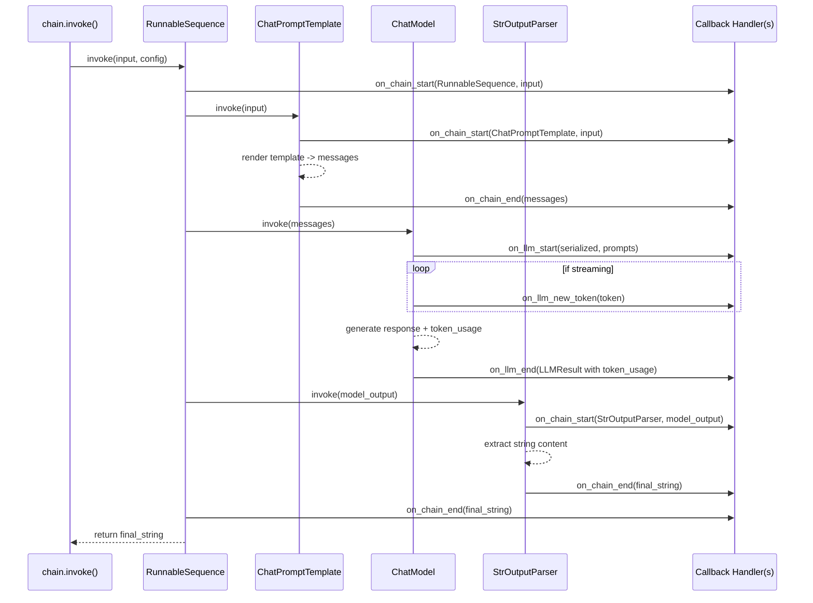

# Chapter 11: Callbacks & Observability

> "You can't fix what you can't see." — every on-call engineer, eventually

## Learning Objectives

By the end of this chapter, you will be able to:

- Explain what the LangChain callback system is and why every `Runnable` emits lifecycle events automatically as data flows through a composed chain
- Enumerate the core callback hooks (`on_llm_start`, `on_llm_new_token`, `on_llm_end`, `on_chain_start`/`on_chain_end`, `on_tool_start`/`on_tool_end`, `on_retriever_start`/`on_retriever_end`) and what each one receives
- Attach callbacks at two different scopes — construction time vs. request time via `config={"callbacks": [...]}` — and explain why a FastAPI service should almost always prefer the latter
- Build a custom `BaseCallbackHandler` subclass that logs step-by-step timing for a chain
- Implement a token-usage and running-cost tracker that accumulates numbers across a multi-step LCEL chain
- Describe what LangSmith adds on top of raw callbacks (tracing UI, run comparison, prompt version diffing) and how to enable it via environment variables
- Use `RunnableConfig`'s `run_name`, `tags`, and `metadata` to make individual runs identifiable in logs and traces

---

## Prerequisites for This Chapter

This chapter builds on **[Chapter 10: Retrievers](./10-retrievers.md)**, where you composed a `Runnable` retriever into an LCEL chain (`retriever | prompt | model | parser`) and treated the whole pipeline as a single callable unit you could `.invoke()`.

That framing — "a chain is just a `Runnable` you call" — is exactly what makes this chapter possible. Every chapter so far has focused on making chains *work*. This chapter is about making them *legible*: once a chain has four or five composed steps, "why was this slow?" and "why did this answer look wrong?" stop being answerable by staring at the final output. You need visibility into what happened at each intermediate step — which prompt was rendered, which model call was made, how many tokens it consumed, how long each stage took — without bolting `print()` statements into library internals you don't own.

LangChain Core ships exactly that visibility layer as a first-class citizen: the **callback system**. It is not a bolt-on logging library; it's threaded through the `Runnable` protocol itself, so it works identically whether your chain has one step or twelve, and whether you wrote the steps yourself or imported them from a retriever, a tool, or a third-party integration.

No new setup is required. Every code example in this chapter is illustrative — read it and reason through it, rather than running it.

---

## 1. The Callback System: A Chain's Nervous System

### 1.1 The problem it solves

Recall from earlier chapters that an LCEL chain like

```python
chain = prompt | model | parser
```

is really a `RunnableSequence` — an object that, when you call `.invoke(input)`, calls `prompt.invoke()`, feeds its output into `model.invoke()`, feeds *that* output into `parser.invoke()`, and returns the final result. From the outside, `.invoke()` looks like one atomic function call. That's great for composability, but terrible for debugging: if the whole chain takes 4.2 seconds, is that 4.1 seconds of model latency and 0.1 seconds of parsing, or is the prompt template itself doing something slow (e.g., fetching few-shot examples from a database)? A single wall-clock number tells you nothing about *where* the time went.

The callback system solves this by having every `Runnable` **announce** what it's doing as it does it. Before a step runs, it fires a `*_start` event. After a step finishes, it fires a `*_end` event (or `*_error` if it raised). Anyone who registers a **callback handler** receives every one of these events, for every step, across the entire chain — automatically, with zero changes to the chain's own code.

### 1.2 The formal model

A **callback handler** is an object implementing some subset of a fixed set of hook methods, one per lifecycle event type. LangChain Core defines the full interface as `BaseCallbackHandler`. The core hooks you'll use constantly:

| Hook | Fires when | Key arguments received |
|---|---|---|
| `on_chain_start` | Any `Runnable` (chain, sequence, custom step) begins execution | serialized chain description, input dict |
| `on_chain_end` | That `Runnable` finishes successfully | the output |
| `on_chain_error` | That `Runnable` raises an exception | the exception |
| `on_llm_start` | A chat model / LLM call begins | serialized model description, the rendered prompt(s) |
| `on_llm_new_token` | A single streamed token arrives (only when streaming) | the token string |
| `on_llm_end` | The model call finishes | an `LLMResult` containing generations *and* `response_metadata`/`llm_output` (token usage lives here) |
| `on_llm_error` | The model call raises | the exception |
| `on_tool_start` | A tool invocation begins | tool name, input string/dict |
| `on_tool_end` | The tool invocation finishes | the tool's output |
| `on_retriever_start` | A retriever's `.invoke()` begins | the query |
| `on_retriever_end` | The retriever returns documents | the list of `Document` objects |

Each hook also receives bookkeeping arguments you'll use to correlate events: `run_id` (a UUID unique to *this specific execution* of *this specific step*) and `parent_run_id` (the `run_id` of whichever step invoked this one). This parent/child relationship is what lets a callback handler reconstruct the full tree of a nested chain — "this LLM call happened *inside* this chain step, which happened *inside* this outer chain" — purely from the stream of flat events, without needing the chain's source code.

### 1.3 Why this "just works" across composed chains

The critical design point: **you never call these hooks yourself.** They are invoked internally by the `Runnable` base class machinery every time `.invoke()`, `.batch()`, or `.stream()` runs. When you write:

```python
chain = prompt | retriever | model | parser
```

each of `prompt`, `retriever`, `model`, and `parser` is a `Runnable`, and `RunnableSequence.invoke()` propagates one shared `CallbackManager` through every child step as it executes them in order. Register a handler once, at the top level, and it transparently receives events from every step nested arbitrarily deep — including steps inside a `RunnableParallel`, inside a retriever's internal calls, inside a tool your agent invokes. You get whole-chain observability by attaching one object in one place, which is precisely the leverage that makes this system worth learning before you build anything with real production traffic.

---

## 2. Passing Callbacks: Construction Time vs. Request Time

There are two places you can hand a callback handler to LangChain, and the difference between them matters a great deal once you're serving multiple concurrent requests.

### 2.1 Construction-time callbacks

You can pass `callbacks=[...]` directly when constructing a model or chain component:

```python
from langchain_openai import ChatOpenAI

model = ChatOpenAI(
    model="gpt-4o-mini",
    callbacks=[MyLoggingHandler()],
)
```

This handler is now permanently bound to that specific `model` object. Every invocation of `model`, for the lifetime of the process, will fire events into it. This is fine for a Jupyter notebook, a one-off script, or a global handler you genuinely want attached to *everything* forever (e.g., a process-wide metrics exporter that never needs per-call context).

### 2.2 Request-time (runtime) callbacks

The far more common — and far more important — pattern is passing callbacks through `config` at call time:

```python
chain.invoke(
    {"question": "What is LCEL?"},
    config={"callbacks": [MyLoggingHandler()]},
)
```

Here, the handler is scoped to *this single call*. It receives every event fired by every step of `chain` during this one execution and then is discarded.

### 2.3 Why request-scoped callbacks matter for a FastAPI service

This is the distinction that actually bites in production, and it maps directly onto something you already know from building FastAPI services: request-scoped state versus process-global state.

Picture a FastAPI endpoint serving many concurrent users against one shared, module-level chain object:

```python
from fastapi import FastAPI

app = FastAPI()
chain = build_rag_chain()  # built once at startup, reused across requests

@app.post("/ask")
async def ask(payload: dict):
    request_id = payload["request_id"]
    handler = RequestTracingHandler(request_id=request_id)
    result = await chain.ainvoke(
        {"question": payload["question"]},
        config={"callbacks": [handler], "run_name": "ask-endpoint"},
    )
    return {"answer": result, "trace": handler.events}
```

If you had instead attached `RequestTracingHandler` at **construction time** on the shared `chain`, every concurrent request would share the *same handler instance*. Under concurrent load, events from request A and request B would interleave into the same handler state — exactly the kind of shared-mutable-state bug you'd flag immediately in a FastAPI handler that stored per-request data in a global dict instead of a request-scoped object. Passing the handler through `config` at `.invoke()`/`.ainvoke()` time gives each request its own isolated handler instance, tagged with that request's own ID, with no risk of cross-contamination between concurrent users — the same reason you'd never store a request's user ID in a module-level variable.

This is also why `config` is the mechanism the rest of this chapter leans on: it's the *only* way to get per-request identity into a chain that was built once, at startup, and reused for the life of the process — which is exactly how you'll deploy every chain in this course.

---

## 3. Building a Custom Callback Handler

Let's build a minimal, genuinely useful handler: one that logs the start and end of every step in a chain, along with how long each step took.

### 3.1 The handler

```python
import time
import uuid
from typing import Any
from langchain_core.callbacks import BaseCallbackHandler


class TimingLoggerHandler(BaseCallbackHandler):
    """Logs start/end and elapsed time for every chain and LLM step."""

    def __init__(self) -> None:
        self._start_times: dict[uuid.UUID, float] = {}

    def on_chain_start(
        self, serialized: dict, inputs: dict, *, run_id: uuid.UUID, **kwargs: Any
    ) -> None:
        self._start_times[run_id] = time.perf_counter()
        name = serialized.get("name", "chain")
        print(f"[START] chain={name} run_id={run_id}")

    def on_chain_end(
        self, outputs: dict, *, run_id: uuid.UUID, **kwargs: Any
    ) -> None:
        elapsed = time.perf_counter() - self._start_times.pop(run_id, time.perf_counter())
        print(f"[END]   chain run_id={run_id} took={elapsed:.3f}s")

    def on_llm_start(
        self, serialized: dict, prompts: list[str], *, run_id: uuid.UUID, **kwargs: Any
    ) -> None:
        self._start_times[run_id] = time.perf_counter()
        print(f"[START] llm run_id={run_id} prompt_preview={prompts[0][:60]!r}")

    def on_llm_end(self, response, *, run_id: uuid.UUID, **kwargs: Any) -> None:
        elapsed = time.perf_counter() - self._start_times.pop(run_id, time.perf_counter())
        print(f"[END]   llm run_id={run_id} took={elapsed:.3f}s")
```

### 3.2 Wiring it into a chain

```python
from langchain_core.prompts import ChatPromptTemplate
from langchain_core.output_parsers import StrOutputParser
from langchain_openai import ChatOpenAI

prompt = ChatPromptTemplate.from_template("Summarize in one sentence: {text}")
model = ChatOpenAI(model="gpt-4o-mini")
parser = StrOutputParser()

chain = prompt | model | parser

result = chain.invoke(
    {"text": "LangChain Core provides a composable Runnable protocol..."},
    config={"callbacks": [TimingLoggerHandler()]},
)
```

### 3.3 Hand-traced output

Reasoning through what fires, in order, for this three-step chain:

```
[START] chain=RunnableSequence run_id=aaa...   (the whole chain begins)
[START] chain=ChatPromptTemplate run_id=bbb...  (prompt rendering begins)
[END]   chain run_id=bbb... took=0.001s          (rendering a template is near-instant)
[START] llm run_id=ccc...                        (the model call begins)
[END]   llm run_id=ccc... took=0.842s            (this is almost certainly the bulk of total latency)
[START] chain=StrOutputParser run_id=ddd...      (parsing the model's message into a string)
[END]   chain run_id=ddd... took=0.000s
[END]   chain=RunnableSequence run_id=aaa... took=0.845s
```

Notice what this buys you for free: without changing a single line of `prompt`, `model`, or `parser`, you now know that of the 845ms total, essentially all of it (842ms) was the LLM call, and templating/parsing were both sub-millisecond. That's the entire value proposition of this chapter in one trace — attribution of latency to a specific step, without instrumenting the step itself.

---

## 4. Token Counting and Cost Tracking

The `on_llm_end` hook is the one hook you'll reach for most in production, because the `LLMResult` object it receives carries **usage metadata** — how many tokens the prompt consumed, how many the completion consumed, and (for many providers) the model name, which lets you compute cost.

### 4.1 Where the numbers live

Most chat model integrations (including `langchain_openai.ChatOpenAI`) attach token counts to `response.llm_output["token_usage"]` (or, on newer message objects, `response_metadata["token_usage"]`), typically shaped like:

```python
{
    "prompt_tokens": 128,
    "completion_tokens": 42,
    "total_tokens": 170,
}
```

A handler reading `on_llm_end` can pull this dict out, look up the applicable per-token price for the model that was called, and accumulate a running total — across as many LLM calls as the chain makes, even if those calls are spread across several distinct steps.

### 4.2 A `TokenUsageCallbackHandler` worked example

Here is a handler that tracks cumulative prompt tokens, completion tokens, and cost across an entire chain execution, regardless of how many LLM calls happen inside it.

```python
from langchain_core.callbacks import BaseCallbackHandler

# Illustrative pricing, dollars per 1,000 tokens (check current provider pricing in practice)
PRICE_PER_1K_PROMPT = 0.00015
PRICE_PER_1K_COMPLETION = 0.00060


class TokenUsageCallbackHandler(BaseCallbackHandler):
    def __init__(self) -> None:
        self.prompt_tokens = 0
        self.completion_tokens = 0
        self.total_cost_usd = 0.0
        self.call_count = 0

    def on_llm_end(self, response, **kwargs) -> None:
        usage = (response.llm_output or {}).get("token_usage")
        if usage is None:
            return  # some providers/streaming modes may not report usage

        p_tokens = usage.get("prompt_tokens", 0)
        c_tokens = usage.get("completion_tokens", 0)

        self.prompt_tokens += p_tokens
        self.completion_tokens += c_tokens
        self.call_count += 1

        step_cost = (
            (p_tokens / 1000) * PRICE_PER_1K_PROMPT
            + (c_tokens / 1000) * PRICE_PER_1K_COMPLETION
        )
        self.total_cost_usd += step_cost

        print(
            f"[LLM call #{self.call_count}] "
            f"+{p_tokens} prompt / +{c_tokens} completion tokens, "
            f"step_cost=${step_cost:.6f}, running_total=${self.total_cost_usd:.6f}"
        )
```

### 4.3 Hand-traced running totals across a 3-step LCEL chain

Consider a chain with **three sequential LLM calls** — say, a query-rewriting step, a retrieval-augmented answer step, and a final polishing/formatting step:

```python
rewrite_chain = rewrite_prompt | model | StrOutputParser()
answer_chain = answer_prompt | model | StrOutputParser()
polish_chain = polish_prompt | model | StrOutputParser()

full_chain = (
    {"rewritten_query": rewrite_chain, "original": lambda x: x["question"]}
    | answer_prompt_step
    | answer_chain
    | polish_chain
)

usage_handler = TokenUsageCallbackHandler()
result = full_chain.invoke(
    {"question": "How does LCEL handle retries?"},
    config={"callbacks": [usage_handler]},
)
```

Reasoning through the three `on_llm_end` firings in order:

| Step | prompt_tokens | completion_tokens | step cost | running `total_cost_usd` |
|---|---|---|---|---|
| 1. Query rewrite | 40 | 15 | (40/1000)(0.00015) + (15/1000)(0.00060) = $0.000015 | $0.000015 |
| 2. RAG answer generation | 850 | 180 | (850/1000)(0.00015) + (180/1000)(0.00060) = $0.000236 | $0.000251 |
| 3. Answer polishing | 210 | 60 | (210/1000)(0.00015) + (60/1000)(0.00060) = $0.0000675 | $0.0003185 |

After the chain finishes, `usage_handler.prompt_tokens == 1100`, `usage_handler.completion_tokens == 255`, and `usage_handler.total_cost_usd ≈ $0.000319` — a single, accurate cost figure for the *entire* three-call chain, computed without touching `rewrite_chain`, `answer_chain`, or `polish_chain`'s own code. Notice also how lopsided the cost is: step 2 (the actual RAG generation, with a large retrieved context in the prompt) accounts for roughly 74% of total cost, even though it's only one of three LLM calls — exactly the kind of per-step breakdown a single aggregate "$0.000319 total" number would hide.

---

## 5. LangSmith: What It Adds on Top of Raw Callbacks

Everything in Sections 1-4 is callback-based tracing you built and own yourself. **LangSmith** is LangChain's managed observability platform, and it is built *on the same callback system* — it works by registering its own callback handler behind the scenes and shipping every event to a hosted backend with a UI on top. Conceptually, it gives you three things that a hand-rolled `print()`-based handler does not:

1. **Automatic, zero-code tracing.** Instead of manually attaching a handler to every `config={"callbacks": [...]}` call, you enable LangSmith with two environment variables, and *every* chain, tool, and retriever call in the process gets traced automatically:

   ```bash
   export LANGCHAIN_TRACING_V2=true
   export LANGCHAIN_API_KEY="ls__..."
   export LANGCHAIN_PROJECT="my-rag-service"   # optional, groups traces
   ```

   With these set, no code change is required in the chains themselves — the tracing is injected at the `Runnable` execution layer, the same layer that fires `on_chain_start`/`on_llm_start`/etc. for any handler you'd write by hand.

2. **A UI for inspecting individual runs as a tree.** Because every event carries `run_id`/`parent_run_id` (Section 1.2), LangSmith reconstructs the full nested call tree for a single request — prompt in, exact rendered text, model call, exact response, token usage, latency per step — browsable visually, rather than as a scroll of `print()` lines you have to mentally reassemble.

3. **Comparing runs and prompt versions.** Because traces are persisted (not just printed to a log that scrolls away), you can compare two runs of "the same" chain side by side — e.g., before and after a prompt template edit — and see exactly which step's output changed and by how much, which is materially harder to do with ephemeral console logging.

The important conceptual takeaway: **LangSmith is not a separate instrumentation system you learn from scratch.** It rides on the exact same `on_chain_start`/`on_llm_end`/etc. event stream this chapter has been building handlers against. Everything you learned about hooks, `run_id`, and parent/child relationships in Sections 1-3 is directly transferable — LangSmith is simply a very well-built callback handler, plus a hosted UI, that you get by setting two environment variables instead of writing `TimingLoggerHandler` yourself.

---

## 6. `RunnableConfig`: `run_name`, `tags`, and `metadata`

Every `.invoke()`/`.ainvoke()`/`.stream()` call accepts a `config: RunnableConfig` dict, and beyond `callbacks`, three fields exist specifically to make individual runs identifiable later — in your own logging handler, or in a LangSmith trace:

```python
result = chain.invoke(
    {"question": "What is LCEL?"},
    config={
        "run_name": "faq-endpoint-answer",
        "tags": ["endpoint:faq", "env:prod", "model:gpt-4o-mini"],
        "metadata": {"user_id": "u_48213", "request_id": "req_9f21"},
    },
)
```

- **`run_name`** overrides the default (often unhelpfully generic, like `"RunnableSequence"`) name shown for this run in traces/logs — set it to something a human can scan quickly, like `"faq-endpoint-answer"`.
- **`tags`** are a list of short strings you attach for later filtering — e.g., "show me every trace tagged `env:prod` where the model call took over 2 seconds." Tags propagate to every nested step's events automatically, so tagging the outer `.invoke()` call is enough to tag the whole run tree.
- **`metadata`** is an arbitrary key-value dict for structured context that isn't necessarily a filter dimension but is useful to have attached — a user ID, a request ID, an experiment/variant name, whatever your application already tracks per request.

Tying this back to Section 2.3: in a FastAPI handler, this is exactly where the request ID (or user ID, or A/B test bucket) you already have on hand belongs — pass it through `config["metadata"]` on every `.invoke()` call, and every downstream trace and every custom callback handler you write receives it for free, with no global state and no risk of leaking between concurrent requests.

---

## 7. Callback Event Lifecycle Across a Composed Chain



Two things worth reading carefully out of this diagram. First, the **outer** `on_chain_start`/`on_chain_end` pair (for `RunnableSequence` itself) wraps every inner event — its `run_id` becomes the `parent_run_id` for the prompt, model, and parser events, which is exactly the tree structure LangSmith's UI (Section 5) visualizes. Second, `on_llm_new_token` only fires at all when the chain is actually invoked in streaming mode (`.stream()`/`.astream()`, covered next chapter) — a plain `.invoke()` call still fires exactly one `on_llm_start` and one `on_llm_end`, with no intermediate token events, because the full response is materialized before returning.

---

## Real-World Scenario

**Scenario:** A team ships a customer-support RAG assistant as a FastAPI service. It composes a chain roughly like `retriever | prompt | model | parser`, wrapped with an additional query-rewriting step in front and a citation-formatting step at the end — five steps total. In testing, response times hover around 1.5 seconds and everyone is happy.

Two weeks after launch, support tickets start arriving: "the assistant sometimes takes 8-10 seconds to respond." The on-call engineer opens the service logs and finds exactly one line per request: `POST /ask 200 OK 8412ms`. That's it. No breakdown. The team's first three guesses, tried one at a time in production over two days:

1. **"It must be the vector database."** They add manual timing around the retriever call. Retrieval consistently takes 80-150ms — not the bottleneck, but a day is spent confirming this because the retriever is buried three layers deep in a wrapper class, and adding print statements requires redeploying twice to get the placement right.
2. **"It must be network latency to the model provider."** They check outbound network metrics. Normal. Another half-day spent ruling this out.
3. **"It must be the query-rewriting step doing something unexpected."** They add ad hoc logging inside that step's function. It's consistently fast (under 200ms). Another half-day.

By day three, someone finally reaches for LangChain's callback system instead of guessing step by step: they attach a lightweight timing handler (structurally identical to `TimingLoggerHandler` in Section 3) via `config={"callbacks": [...]}` on the endpoint's `.invoke()` call, redeploy once, and let it run for an hour under normal traffic. The very first slow trace it captures shows the answer immediately: the **citation-formatting step** — the last step in the chain, added late and never load-tested in isolation — calls out to an internal document-metadata API to resolve citation titles, and that internal API has no timeout configured. Under load, that API occasionally queues requests for 7+ seconds, and because it's the *last* step in the chain, its slowness was invisible to every one of the team's earlier per-component checks, none of which had thought to instrument that specific step.

With the callback trace in hand, the fix is a five-minute change: add a strict timeout and a fallback ("show the answer without resolved citation titles") to that one step. Total time from "trace attached" to "root cause confirmed": about twenty minutes. Total time burned guessing beforehand: two and a half days.

**Lesson:** a single end-to-end latency number for a multi-step chain is close to useless for debugging, because it tells you *that* something is slow but not *which* of N steps is responsible — and guessing step-by-step with ad hoc logging doesn't scale past two or three steps. Callback-based tracing (whether hand-rolled or via LangSmith) gives you the per-step breakdown for free, for every request, without redeploying every time your hypothesis about the bottleneck changes.

---

## Best Practices

- **Prefer request-scoped callbacks (`config={"callbacks": [...]}`) over construction-time callbacks** for anything serving concurrent requests — this is the single most important rule in this chapter, and violating it silently corrupts per-request state under load (Section 2.3).
- **Always read token usage from `on_llm_end`, not from the final chain output** — intermediate LLM calls inside a multi-step chain don't otherwise surface their usage to the caller, so a handler is the only reliable place to capture it.
- **Tag every production run with `run_name`, `tags`, and `metadata`** that include request/user identifiers — this costs one line at the call site and pays for itself the first time you need to filter traces during an incident.
- **Enable LangSmith tracing in staging before you need it in an incident.** Discovering `LANGCHAIN_TRACING_V2` exists *while* debugging a production outage is strictly worse than having traces already flowing when the outage starts.
- **Keep custom callback handlers cheap and non-blocking.** A handler runs synchronously inline with the chain's execution (unless explicitly async) — a slow `on_llm_end` implementation (e.g., a blocking network call to a metrics backend) becomes part of your chain's latency, ironically defeating the purpose of adding observability.
- **Handle missing usage metadata gracefully.** Not every provider or every streaming mode populates `token_usage` — check for `None` before indexing into it, exactly as shown in `TokenUsageCallbackHandler` (Section 4.2).
- **Attach one callback handler at the top of a chain, not one per step.** Because handlers propagate through `RunnableSequence`/`RunnableParallel` automatically (Section 1.3), attaching separately at each step is redundant work that produces duplicate events.

---

## Common Mistakes

- **Attaching a stateful handler at construction time on a shared chain object.** Under concurrent FastAPI traffic, this causes cross-request data to interleave into one handler instance — the exact bug described in Section 2.3, and the most common way teams get burned by this system.
- **Assuming `on_llm_end`'s `token_usage` is always present.** Some providers, some models, and some streaming configurations omit it; code that indexes into `token_usage["prompt_tokens"]` without a `None`-check will raise on those calls.
- **Confusing `run_id` with `parent_run_id`**, leading to a mis-assembled call tree in a custom handler — remember `parent_run_id` points to the *invoking* step, not the step itself.
- **Doing expensive work inside a callback hook** (e.g., writing to a slow external database synchronously on every `on_llm_end`) and being surprised when overall chain latency increases after "just adding some logging."
- **Relying only on the final aggregate latency number** instead of per-step timing, which — as the Real-World Scenario shows — can turn a twenty-minute root-cause investigation into a multi-day guessing exercise.
- **Forgetting that `on_llm_new_token` only fires in streaming mode.** A handler that expects token-by-token events during a plain `.invoke()` call will simply never see them; this is a frequent point of confusion when readers first try to build a live token counter.
- **Not testing a custom callback handler in isolation before wiring it into a production chain.** A handler with a bug in `on_chain_error` (e.g., one that itself raises) can mask or compound the original error you were trying to observe.

---

## Summary

- The **callback system** lets any object implementing `BaseCallbackHandler` receive lifecycle events (`on_chain_start`/`_end`, `on_llm_start`/`_new_token`/`_end`, `on_tool_start`/`_end`, `on_retriever_start`/`_end`) from every step of a composed chain automatically, without modifying the chain's own code.
- Callbacks can be attached at **construction time** (permanent, process-wide) or **request time** via `config={"callbacks": [...]}` (scoped to one call) — the latter is essential for correctness in a concurrent FastAPI service, since it isolates per-request state.
- A custom handler is a small class overriding the hooks you care about — a **timing logger** (Section 3) attributes latency to individual steps; a **`TokenUsageCallbackHandler`** (Section 4) accumulates `prompt_tokens`/`completion_tokens`/cost across every LLM call in a chain by reading `on_llm_end`'s response metadata.
- **LangSmith** is a managed observability layer built on this same callback system — enabling it via `LANGCHAIN_TRACING_V2`/`LANGCHAIN_API_KEY` gives you automatic tracing, a run-inspection UI, and prompt/run comparison, without writing your own handler.
- **`RunnableConfig`**'s `run_name`, `tags`, and `metadata` fields let you annotate individual runs with human-readable names, filterable labels, and structured context (request IDs, user IDs) that propagate through every nested step.
- The core production lesson: a single aggregate latency/cost number for a multi-step chain hides *where* time and money are being spent; callback-based per-step attribution is what turns "the assistant is sometimes slow" into a twenty-minute fix instead of a multi-day investigation.

---

## Knowledge Check

1. Explain, in your own words, why every `Runnable` in a composed chain fires callback events automatically, without the chain author writing any logging code. What part of the `Runnable` protocol makes this possible?
2. A colleague attaches their custom `RequestMetricsHandler` using `ChatOpenAI(model="gpt-4o-mini", callbacks=[handler])` inside a FastAPI service that handles many requests concurrently. What specifically will go wrong, and how would you fix it?
3. Write out (in prose or pseudocode) how you would use `run_id` and `parent_run_id` from a stream of flat callback events to reconstruct which LLM call happened inside which chain step, for a chain with two nested sub-chains.
4. Why does `on_llm_end`'s response sometimes not contain `token_usage`? What should a well-written `TokenUsageCallbackHandler` do in that case?
5. What does LangSmith add on top of a hand-rolled callback handler, and what does it *not* replace — i.e., why do you still need to understand `BaseCallbackHandler` even if your team plans to use LangSmith exclusively?
6. In the Real-World Scenario, the team spent two and a half days checking the retriever, network latency, and the query-rewriting step before finding the actual bottleneck in the citation-formatting step. What earlier action, taken before the incident, would have prevented that multi-day guessing process entirely?

---

## Hands-On Exercise

**Build a Token & Cost Dashboard for a multi-step chain.**

You will design (on paper/in Markdown, reasoning through the code by hand — do not execute it) a `TokenUsageCallbackHandler` extension that produces a small per-request "dashboard" summary, suitable for logging or returning alongside an API response.

**Tasks:**

1. Extend the `TokenUsageCallbackHandler` from Section 4.2 to also track **per-step** breakdowns, not just the running total — i.e., in addition to `self.total_cost_usd`, maintain a `self.steps: list[dict]` where each entry records `{"call_number": int, "prompt_tokens": int, "completion_tokens": int, "cost_usd": float}` for each `on_llm_end` firing.
2. Add a `summary()` method that returns a dict shaped like:
   ```python
   {
       "total_prompt_tokens": ...,
       "total_completion_tokens": ...,
       "total_cost_usd": ...,
       "call_count": ...,
       "steps": [ ... ],  # the per-step breakdown from task 1
   }
   ```
3. Using the three-step chain from Section 4.3 (query rewrite → RAG answer → polish) and its hand-traced token counts, hand-write what `summary()` would return after the full chain finishes. Show the exact dict, matching the numbers from the Section 4.3 table.
4. Design a FastAPI endpoint (sketch the function signature and body; do not run it) that attaches a fresh `TokenUsageCallbackHandler` instance per request via `config={"callbacks": [...]}`, invokes the chain, and returns both the chain's answer *and* the handler's `summary()` dict in the JSON response — so a caller can see exactly what a given request cost.
5. Answer in writing: why must the handler be instantiated **inside** the request-handling function (one new instance per request) rather than created once at module load time and reused? Tie your answer back to Section 2.3.
6. **Bonus:** Extend your design to also tag each request with `config={"tags": [...], "metadata": {...}}` including a request ID, and describe how you'd use that request ID to correlate a specific dashboard entry back to a specific LangSmith trace if the team later enables LangSmith.

---

## Further Reading

- [LangChain Python API Reference — `BaseCallbackHandler`](https://python.langchain.com/api_reference/core/callbacks/langchain_core.callbacks.base.BaseCallbackHandler.html) — the full interface, including every hook method and its exact signature
- [LangChain Documentation — Callbacks](https://python.langchain.com/docs/concepts/callbacks/) — conceptual overview of the callback system and how it threads through `Runnable` execution
- [LangChain Documentation — How to pass callbacks in at runtime](https://python.langchain.com/docs/how_to/callbacks_runtime/) — the `config={"callbacks": [...]}` pattern covered in Section 2
- [LangSmith Documentation](https://docs.smith.langchain.com/) — setup, tracing concepts, run comparison, and dataset-based evaluation
- [LangChain Python API Reference — `RunnableConfig`](https://python.langchain.com/api_reference/core/runnables/langchain_core.runnables.config.RunnableConfig.html) — the full set of config fields, including `run_name`, `tags`, `metadata`, and `callbacks`
- [OpenAI API Reference — Usage object](https://platform.openai.com/docs/api-reference/chat/object) — the shape of the token usage data that flows into `on_llm_end`'s `llm_output`

---

<div style="display:flex;justify-content:space-between;align-items:center;">
  <a href="./10-retrievers.md">← Previous: Retrievers</a>
  <a href="./00-index.md">🏠 Index</a>
  <a href="./12-streaming.md">Next: Streaming →</a>
</div>
