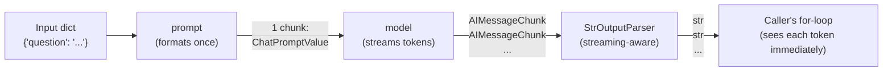
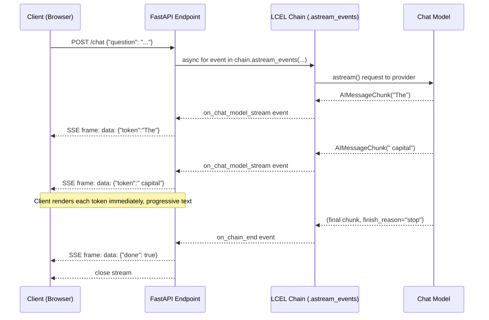

# Chapter 12: Streaming

> "The perceived speed of a system is often determined not by its total latency, but by the latency to its first meaningful response." — a paraphrase of an old systems-design maxim, doubly true for chat UIs.

## Learning Objectives

By the end of this chapter, you will be able to:

- Explain why streaming is a perceived-latency optimization rather than a total-latency optimization, and quantify why it matters for chat UX
- Use `.stream()` to consume token-level `AIMessageChunk` objects and merge them with the `+` operator into a final message
- Use `.astream()` inside an `async def` FastAPI route to stream tokens without blocking the event loop
- Use `.astream_events()` to get a single unified async generator of structured lifecycle events (`on_chain_start`, `on_llm_stream`, `on_tool_start`, etc.) and explain how it differs from the raw callback handlers of Chapter 11
- Trace how streaming propagates automatically through a composed LCEL chain (`prompt | model | StrOutputParser()`) without any extra code
- Wire a LangChain streaming call into a FastAPI `StreamingResponse` using the Server-Sent Events (SSE) protocol
- Identify the points in a chain where streaming necessarily "resets" — steps that must buffer the full upstream output before they can run at all

---

## Prerequisites for This Chapter

This chapter builds on **[Chapter 11: Callbacks & Observability](./11-callbacks-and-observability.md)**, where you learned:

- How to attach `BaseCallbackHandler` subclasses to a `Runnable` via `.with_config(callbacks=[...])` to observe execution as a side channel
- The full catalog of callback lifecycle hooks (`on_chain_start`, `on_llm_new_token`, `on_tool_end`, and so on) and how they fire during a chain's execution
- That callbacks are primarily an **observability** mechanism — logging, tracing, metrics — not a data-flow mechanism

Streaming is closely related but answers a different question. Callbacks let you *watch* a chain run, usually for logging or tracing purposes, and you generally don't reconstruct the model's output from them by hand. Streaming, by contrast, is about *delivering the actual output* to the caller — usually an end user staring at a chat window — incrementally, as it's produced, instead of all at once at the end. `.astream_events()`, which you'll meet in Section 4, is in fact built on top of the same callback infrastructure from Chapter 11, repackaged into a single ergonomic async generator. So this chapter is where callbacks and streaming meet.

You should also recall from **Chapter 3** that a chat model's output type is `AIMessage`, and from **Chapter 6** that LCEL composes `Runnable` objects with the pipe operator (`|`). This chapter assumes both are second nature.

No new setup is required — everything here works with the same `ChatOpenAI` (or equivalent) instance and FastAPI project you've been using since earlier chapters.

---

## 1. Why Streaming Matters: Perceived Latency

### 1.1 The problem streaming solves

A typical LLM completion — a few paragraphs of text — might take 3 to 8 seconds to generate in full, depending on model size, output length, and provider load. If your application calls `.invoke()` and waits for that entire response before showing the user anything, the user stares at a blank screen or a spinner for the whole duration. Every extra second here is a second of the user wondering if the app is broken.

**Streaming does not make the model faster.** The total time to generate the *last* token of a long response is roughly the same whether you stream or not — arguably a hair slower with streaming, due to the overhead of sending many small chunks over the network instead of one large payload. What streaming changes is *when the user sees the first byte of output*:

```
Without streaming (.invoke()):
  |--------------------- 4200ms -----------------------|
  [ ... nothing rendered ... ]                    [ full answer appears at once ]

With streaming (.stream()):
  |--------------------- 4200ms -----------------------|
  [200ms][first token]  [token][token][token]...   [last token, ~4200ms]
         ^ user starts reading here
```

That "200ms" figure is not arbitrary — it's roughly the time for the first network round-trip plus the time for the model to produce its first output token, which for most hosted chat models is on the order of a few hundred milliseconds. Compare that to waiting 4+ full seconds for the entire response. The *total* wall-clock time to finish is nearly identical; the *perceived* wait — the time before the user sees any evidence the system is working — drops by an order of magnitude.

### 1.2 Why this matters more for chat than for batch work

Not every LLM call needs to stream. A nightly batch job that summarizes 10,000 support tickets and writes results to a database has no human watching in real time — `.invoke()` (or better, `.batch()`, covered alongside async patterns in Chapter 13) is the right tool, and streaming would add complexity for zero benefit. Streaming earns its keep specifically in **interactive, human-facing** contexts:

- Chat interfaces (the ChatGPT-style "typing" effect)
- Live coding assistants showing generated code as it's written
- Voice assistants that begin synthesizing speech from the first sentence instead of the whole response
- Any UI where a human is watching the screen and waiting

The rule of thumb: **if a human is looking at a spinner, stream. If a machine is waiting on a batch result, don't bother.**

---

## 2. Token-Level Streaming with `.stream()`

### 2.1 Recap from Chapter 3: `AIMessageChunk`

In Chapter 3 you learned that invoking a chat model with `.invoke()` returns a single `AIMessage`. When you instead call `.stream()`, the model returns a **generator of `AIMessageChunk` objects** — one chunk per (roughly) token or small group of tokens, arriving as the provider produces them:

```python
from langchain_openai import ChatOpenAI

model = ChatOpenAI(model="gpt-4o-mini")

for chunk in model.stream("Tell me a one-sentence fact about Mars."):
    print(chunk)
```

```
content='' additional_kwargs={} response_metadata={} id='run-...'
content='Mars' ...
content=' is' ...
content=' often' ...
content=' called' ...
content=' the' ...
content=' "' ...
content='Red' ...
content=' Planet' ...
content='"' ...
content=' due' ...
content=' to' ...
content=' iron' ...
content=' oxide' ...
content=' on' ...
content=' its' ...
content=' surface' ...
content='.' ...
content='' response_metadata={'finish_reason': 'stop', ...}
```

`AIMessageChunk` is a subclass of `AIMessage` — it carries the same `content`, `additional_kwargs`, and `response_metadata` fields, but is designed to represent a **partial** message rather than a complete one.

### 2.2 The `+` operator: merging chunks

The detail that makes streaming usable rather than just a firehose of fragments is that `AIMessageChunk` implements Python's `__add__` method, so you can combine chunks with the `+` operator:

```python
final = None
for chunk in model.stream("Say hi in three words."):
    final = chunk if final is None else final + chunk

print(final)
# AIMessageChunk(content='Hello there, friend!', response_metadata={'finish_reason': 'stop', ...})
```

Adding two chunks concatenates their `content` strings and merges their metadata dictionaries (later non-empty values typically win for fields like `response_metadata`, which is usually only populated on the final chunk). This is why LangChain represents streamed output as `AIMessageChunk` rather than plain strings: chunks are **algebraic** — you can fold an entire stream down to one object using nothing but repeated addition, and that final object behaves like the `AIMessage` you'd have gotten from `.invoke()`.

A useful mental model: `.stream()` is to `.invoke()` what a running total is to a final sum. Each chunk is a partial sum; adding chunks together as they arrive reconstructs the total, but you get to observe the partial sums along the way — which is exactly what a chat UI needs to render "in-progress" text.

### 2.3 Streaming through `StrOutputParser`

In practice, you rarely stream raw `AIMessageChunk` objects to a UI — you want plain text. `StrOutputParser`, introduced in Chapter 6, is streaming-aware: when placed at the end of a chain, it extracts `.content` from each incoming chunk and yields plain `str` fragments instead of `AIMessageChunk` objects:

```python
from langchain_core.output_parsers import StrOutputParser
from langchain_core.prompts import ChatPromptTemplate

prompt = ChatPromptTemplate.from_template("Answer briefly: {question}")
chain = prompt | model | StrOutputParser()

for piece in chain.stream({"question": "What is the capital of France?"}):
    print(repr(piece))
```

```
''
'The'
' capital'
' of'
' France'
' is'
' Paris'
'.'
```

Note that plain strings don't support the same `+`-merging trick automatically producing a rich object back — but you can still reconstruct the full text trivially with `"".join(pieces)`, since strings concatenate naturally.

---

## 3. Async Streaming with `.astream()`

### 3.1 Why async matters here

Every synchronous `Runnable` method in LangChain Core has an async twin: `.invoke()` → `.ainvoke()`, `.batch()` → `.abatch()`, and — the one this chapter cares about — `.stream()` → `.astream()`. The async versions matter enormously the moment you're serving multiple concurrent users from a single FastAPI process (the subject of **Chapter 19: Async Programming's FastAPI integration**, and previewed fully in **Chapter 13**).

If your FastAPI route is `async def` and you call the *synchronous* `.stream()` inside it, you block the single-threaded event loop for the entire duration of each token wait — meaning while one user's response is streaming, **no other request on that worker can make progress**, defeating the purpose of using `async def` in the first place. `.astream()` yields control back to the event loop between chunks, so the server can interleave work across many concurrent streaming clients on one process.

```python
async def generate_answer(question: str):
    chain = prompt | model | StrOutputParser()
    async for piece in chain.astream({"question": question}):
        yield piece
```

The shape is identical to `.stream()` — same chunk semantics, same `+`-mergeable `AIMessageChunk` objects when you don't have a string-producing parser at the end — the only difference is `async for` instead of `for`, and it must be awaited/iterated from within an `async def` context (or an async generator, as above).

### 3.2 A note on providers without native async streaming

Most first-party integrations (OpenAI, Anthropic, and the other major providers supported by LangChain Core) implement genuine async streaming under the hood — an `httpx.AsyncClient` or provider SDK's async streaming call. For providers or custom `Runnable` implementations that only support synchronous I/O, LangChain Core falls back to running the sync version in a background thread pool executor so `.astream()` still works without blocking the loop, just with slightly more overhead than a native implementation. Either way, from the caller's perspective the interface — `async for chunk in runnable.astream(...)` — is identical, which is the whole point of the `Runnable` abstraction from Chapter 6: you don't need to know which path is taken underneath.

---

## 4. `.astream_events()`: The Unified Event Stream

### 4.1 The problem it solves

`.stream()` and `.astream()` give you the *final output* of the chain, streamed incrementally. But what if your chain has multiple steps — a retriever, a prompt template, a model, a tool call — and your UI wants to show **what's happening at each stage**, not just the model's token stream? For example, a UI that wants to display "Searching documents…" while the retriever runs, then switch to showing tokens as the model streams its answer.

Chapter 11 covered callbacks, which *can* observe every one of those stages (`on_retriever_start`, `on_chain_start`, `on_llm_new_token`, `on_tool_end`, etc.) — but using them requires writing a `BaseCallbackHandler` subclass, wiring it into `.with_config(callbacks=[...])`, and typically routing the handler's captured state back out through some side channel (a queue, a shared object) so the code awaiting the chain can read it. That's a fair amount of plumbing for what is fundamentally a "give me a stream of what happened" request.

`.astream_events()` collapses all of that into a single async generator that yields structured event dictionaries directly — no handler class, no side channel:

```python
async for event in chain.astream_events({"question": "What is LangChain?"}, version="v2"):
    print(event["event"], "-", event.get("name"))
```

```
on_chain_start - RunnableSequence
on_prompt_start - ChatPromptTemplate
on_prompt_end - ChatPromptTemplate
on_chat_model_start - ChatOpenAI
on_chat_model_stream - ChatOpenAI
on_chat_model_stream - ChatOpenAI
on_chat_model_stream - ChatOpenAI
...
on_chat_model_end - ChatOpenAI
on_parser_start - StrOutputParser
on_parser_stream - StrOutputParser
on_parser_end - StrOutputParser
on_chain_end - RunnableSequence
```

### 4.2 Anatomy of an event

Each yielded item is a dictionary with a consistent shape:

```python
{
    "event": "on_chat_model_stream",
    "name": "ChatOpenAI",
    "run_id": "e3b0c442-...",
    "tags": [...],
    "metadata": {...},
    "data": {"chunk": AIMessageChunk(content="Paris")},
}
```

- **`event`** — the lifecycle stage, following the pattern `on_<component>_<start|stream|end|error>`
- **`name`** — which `Runnable` in your chain fired it (useful when a chain has several components of different types)
- **`run_id`** — a unique ID for that specific component's execution, letting you correlate a `_start` event with its matching `_end`/`_stream` events even inside a complex chain
- **`data`** — the actual payload: `{"input": ...}` on start events, `{"chunk": ...}` on stream events, `{"output": ...}` on end events

Filtering for just the events your UI cares about is then a plain `if` statement:

```python
async for event in chain.astream_events({"question": q}, version="v2"):
    kind = event["event"]
    if kind == "on_retriever_start":
        yield sse_event("status", "Searching documents...")
    elif kind == "on_chat_model_stream":
        token = event["data"]["chunk"].content
        if token:
            yield sse_event("token", token)
    elif kind == "on_chain_end":
        yield sse_event("done", "")
```

### 4.3 How this differs from raw callbacks (Chapter 11)

| | Callbacks (Chapter 11) | `.astream_events()` |
|---|---|---|
| **Interface** | Subclass `BaseCallbackHandler`, override specific `on_*` methods | Single `async for` loop over one generator |
| **Wiring** | Pass via `.with_config(callbacks=[handler])`, or globally | Call `.astream_events(...)` directly, no separate handler object |
| **Getting data out** | Handler methods have no return value used by the caller — you must stash state on the handler instance (or push to a queue) and read it from elsewhere | Events are the return values, yielded in order, consumed inline where you need them |
| **Best for** | Cross-cutting concerns unrelated to the immediate caller: tracing to LangSmith, metrics emission, audit logging — things that happen *regardless* of who's watching | Building a response to *this specific request*, right here, right now — e.g., assembling an HTTP streaming response |
| **Under the hood** | Handlers are invoked directly during execution | LangChain runs the chain with an internal callback handler, then republishes each callback firing as an event on the async generator — it's callbacks, ergonomically repackaged |

The practical guidance: use callback handlers (Chapter 11) for the "fire and forget, someone else consumes this later" cases like tracing and logging, and reach for `.astream_events()` when you're writing the code that directly serves a single request and needs to react to what's happening *inline*, in order, as part of building the response. Many production systems use both simultaneously — a LangSmith tracer attached via callbacks running in the background, and `.astream_events()` driving the actual HTTP response — and they don't conflict, because `.astream_events()` is built on the same underlying event dispatch as the callback system.

### 4.4 A word on the `version` parameter

You'll notice `version="v2"` in the examples above. LangChain Core's event schema went through a `v1` → `v2` revision to fix inconsistencies in how nested chains reported events; `v2` is the stable, recommended schema for any chain built with recent LangChain Core versions, and is what this chapter assumes throughout. Passing no version (or `v1`) exists mainly for backward compatibility with code written against the older schema — always pass `version="v2"` explicitly in new code so you're not depending on whatever the library's current default happens to be.

---

## 5. How Streaming Propagates Through an LCEL Chain

### 5.1 The recap from Chapter 6

You learned in Chapter 6 that LCEL composes `Runnable` objects with `|`, and that the resulting `RunnableSequence` implements `.invoke()`, `.batch()`, and `.stream()` uniformly across arbitrarily deep compositions. Here's the detail this chapter adds: **streaming isn't bolted onto `RunnableSequence` as a special case — it's a natural consequence of how `RunnableSequence.stream()` is implemented.**

Consider the canonical three-step chain:

```python
chain = prompt | model | StrOutputParser()
```

When you call `chain.stream(inputs)`, `RunnableSequence` does *not* run `prompt`, wait for it to finish, then run `model` to completion, then run the parser to completion. Instead, it pipes each step's output generator into the next step's input, chunk by chunk, as they become available:

1. `prompt.invoke(inputs)` runs first — a prompt template formats instantly (no streaming needed; it isn't token-generating, it just does string substitution) and produces one complete `ChatPromptValue`.
2. That single value is handed to `model.stream(...)`, which is where actual incremental generation happens — the model itself yields a generator of `AIMessageChunk` objects as tokens arrive from the provider.
3. `RunnableSequence` doesn't wait for that generator to finish. It forwards **each individual chunk**, as it arrives, into `StrOutputParser`'s streaming-aware transform, which extracts `.content` from that one chunk and yields the resulting string fragment immediately.
4. Your `for piece in chain.stream(...)` loop receives that string fragment the instant the parser produces it — often within milliseconds of the model producing the underlying token.

The result: a 3-step composed chain streams token-by-token exactly as if you'd called `model.stream()` directly, because every step in the chain that is capable of forwarding partial output does so, and `RunnableSequence` simply relays chunks through the pipeline rather than buffering at each stage.

### 5.2 The mechanism: `.transform()`

The formal machinery behind this is a method every `Runnable` implements called `.transform()` (and its async counterpart `.atransform()`), which takes an **iterator of input chunks** and yields an **iterator of output chunks** — as opposed to `.invoke()`, which takes one complete input and returns one complete output. `RunnableSequence.stream()` is implemented, at its core, as chaining each component's `.transform()` into the next:

```
prompt.stream(inputs)   →  (one chunk: the fully-formatted prompt value)
        │
        ▼
model.transform(prompt_chunks)   →  many chunks: AIMessageChunk, AIMessageChunk, ...
        │
        ▼
parser.transform(model_chunks)  →  many chunks: str, str, str, ...
```

Steps that don't naturally produce multiple chunks (like `ChatPromptTemplate`, which does one atomic string-formatting operation) simply produce a single chunk and let the next step handle it — there's no penalty for a non-streaming step sitting *before* a streaming one in the chain, only for one sitting *after* (Section 6 covers exactly that case).



### 5.3 Why this matters for chain design

The practical implication: **you get streaming for free across an LCEL chain, as long as every component either streams its own output or is a fast, atomic, non-blocking transformation.** You don't write special "streaming mode" code for your chain — the same `prompt | model | StrOutputParser()` definition used for `.invoke()` in earlier chapters works for `.stream()` and `.astream()` unmodified. This is one of LCEL's biggest ergonomic wins over hand-rolled orchestration code, where adding streaming support typically means rewriting your pipeline as a generator function from scratch.

---

## 6. Wiring Streaming into FastAPI with Server-Sent Events (SSE)

### 6.1 Why SSE

To get streamed tokens from your FastAPI backend to a browser, you need a transport that supports partial, incrementally-flushed HTTP responses. **Server-Sent Events (SSE)** is the standard, simple choice: it's plain HTTP with the `Content-Type: text/event-stream` header, the connection stays open, and the server pushes newline-delimited `data: ...` frames as they become available. Unlike WebSockets, SSE is unidirectional (server → client only) and needs no special protocol upgrade — which is exactly the shape a "stream tokens to a chat window" use case needs, and it's natively supported by the browser's `EventSource` API with zero extra client libraries.

### 6.2 The sequence, end to end



### 6.3 Worked code example

```python
import json
from fastapi import FastAPI
from fastapi.responses import StreamingResponse
from pydantic import BaseModel
from langchain_openai import ChatOpenAI
from langchain_core.prompts import ChatPromptTemplate
from langchain_core.output_parsers import StrOutputParser

app = FastAPI()

model = ChatOpenAI(model="gpt-4o-mini")
prompt = ChatPromptTemplate.from_template("Answer concisely: {question}")
chain = prompt | model | StrOutputParser()


class ChatRequest(BaseModel):
    question: str


def sse_pack(event: str, data: dict) -> str:
    """Format one Server-Sent Events frame."""
    return f"event: {event}\ndata: {json.dumps(data)}\n\n"


async def event_generator(question: str):
    async for event in chain.astream_events({"question": question}, version="v2"):
        kind = event["event"]

        if kind == "on_chat_model_stream":
            token = event["data"]["chunk"].content
            if token:
                yield sse_pack("token", {"content": token})

        elif kind == "on_chain_end" and event["name"] == "RunnableSequence":
            yield sse_pack("done", {"finished": True})


@app.post("/chat")
async def chat(request: ChatRequest):
    return StreamingResponse(
        event_generator(request.question),
        media_type="text/event-stream",
        headers={
            "Cache-Control": "no-cache",
            "Connection": "keep-alive",
            "X-Accel-Buffering": "no",  # disable proxy buffering (e.g. behind nginx)
        },
    )
```

A few details worth internalizing:

- `StreamingResponse` takes any async generator and flushes each yielded chunk to the client as soon as it's produced — it does not wait for the generator to finish.
- The `event_generator` function filters `.astream_events()`'s full firehose down to just the two event types the UI cares about (`on_chat_model_stream` for tokens, `on_chain_end` for completion) — everything else (prompt formatting events, internal run bookkeeping) is silently dropped, which is exactly the filtering pattern from Section 4.2.
- The `X-Accel-Buffering: no` header matters in real deployments: reverse proxies like nginx buffer responses by default, which would silently defeat streaming by holding the whole response until it's complete before forwarding it — a classic "streaming works on localhost but not in production" bug.
- On the browser side, this maps directly onto `EventSource` or, more commonly for POST-based chat UIs, a `fetch()` call reading the response body via `ReadableStream` and splitting on `data:` frame boundaries — outside LangChain Core's scope, but worth knowing the client-side shape mirrors the server-side one exactly.

This is the same pattern you'll extend in **Chapter 19: Async Programming**, where the FastAPI integration goes deeper into connection lifecycle, request cancellation (what happens when the client disconnects mid-stream), and concurrency limits under load.

---

## 7. What Does NOT Stream Well: Where Chains "Reset"

### 7.1 The core constraint

Streaming propagates through a chain (Section 5) *only as long as every step can act on partial input*. The moment a step in the chain needs to see the **complete** output of the previous step before it can do anything useful, streaming necessarily stops at that point — the chain silently falls back to buffering everything up to that step, running it once the full input is available, and only resumes chunk-by-chunk output if a later step can stream again.

Two everyday examples:

**A JSON-parsing output parser.** If your chain ends in a parser that expects fully-formed JSON — say, `JsonOutputParser` used strictly, or a Pydantic-validating parser — it generally cannot validate or parse a half-written JSON object. `{"name": "Ma` is not valid JSON; the parser needs the closing `}` before it can do its job. So even though the *model* streams tokens, the parser must accumulate the full text before producing (usually) a single output, and your `.stream()` loop for that chain effectively yields one item at the very end — no different, from the caller's perspective, than calling `.invoke()`. (Some structured-output parsers do implement best-effort partial JSON parsing that repairs and re-parses incrementally — worth checking a given parser's docs — but the *general* rule is: parsing a strict grammar out of an incomplete string does not work.)

**A retriever step.** A retriever (Chapter 8's territory) takes a complete query string, embeds it, searches a vector store, and returns a complete list of documents — there is no meaningful "partial" retrieval result to stream chunk-by-chunk. If your chain is `retriever | prompt | model | parser`, the *retriever* portion is always a single blocking step: streaming only becomes visible to the caller starting from `model`'s output onward. The chain as a whole still streams the model's tokens fine, but the very beginning of the response will have a small delay (however long the retriever takes) before the first token appears, because nothing streams until the retriever finishes.

### 7.2 Visualizing the reset point

```
retriever  →   prompt   →    model     →    parser
[ blocks ]    [instant]    [ streams ]     [ streams ]
     └── nothing emitted until this finishes ──┘
                              └── tokens flow from here onward ──┘
```

Contrast this with a chain like `prompt | model | JsonOutputParser()` used on a full JSON object:

```
prompt    →    model     →      parser
[instant]    [ streams ]    [ BUFFERS until valid JSON, then emits once ]
```

Here, even though the model is streaming tokens internally, the *caller* sees no output until the parser has the full text — the streaming "resets" at the parser boundary.

### 7.3 The practical implication for chain design

When designing a chain you intend to stream to a UI, put the "must-see-everything" steps as **early** in the chain as possible (retrieval, complex pre-processing, safety filters that need the full model output before releasing it) and keep the **user-visible final leg** as a pure pass-through of tokens — usually `model | StrOutputParser()` — so users see progressive text as soon as generation starts, rather than a chain that silently buffers the entire model response and dumps it all at once, defeating the purpose of streaming even though `.stream()` is technically being called.

---

## 8. Worked Example: Hand-Tracing a Token Stream

Let's trace, step by step, what actually happens when you stream the completion "The capital of France is Paris." — assuming (for illustration) the model tokenizes and emits roughly word-by-word.

```python
chunks = []
for chunk in model.stream("What is the capital of France? Answer in one short sentence."):
    chunks.append(chunk)
    print(f"received: {chunk.content!r}")
```

Hand-traced output, chunk by chunk:

| Step | `chunk.content` | Running merge (`sum` of chunks so far) |
|---|---|---|
| 1 | `""` | `""` |
| 2 | `"The"` | `"The"` |
| 3 | `" capital"` | `"The capital"` |
| 4 | `" of"` | `"The capital of"` |
| 5 | `" France"` | `"The capital of France"` |
| 6 | `" is"` | `"The capital of France is"` |
| 7 | `" Paris"` | `"The capital of France is Paris"` |
| 8 | `"."` | `"The capital of France is Paris."` |
| 9 | `""` (carries `response_metadata={'finish_reason': 'stop'}`) | `"The capital of France is Paris."` |

Reconstructing the final message with the `+` operator from Section 2.2:

```python
final_message = chunks[0]
for c in chunks[1:]:
    final_message = final_message + c

print(final_message.content)
# "The capital of France is Paris."
print(final_message.response_metadata)
# {'finish_reason': 'stop', ...}
```

Notice two things that trip people up the first time:

1. **The very first chunk often has empty content.** Providers frequently emit an initial chunk carrying only metadata (like the model name or a run identifier) before the first real token — your UI code should not assume chunk 1 always has visible text.
2. **The very last chunk usually carries the metadata, not new text.** `response_metadata` (containing `finish_reason`, token usage on some providers, etc.) is typically only fully populated on the final chunk, which is why the merge-with-`+` approach — accumulating across *all* chunks — is more robust than reading metadata off any single chunk in isolation.

This hand trace is exactly what `StrOutputParser` automates for you at scale in Section 2.3 (extracting just `.content` per chunk) and what `.astream_events()` surfaces as a sequence of `on_chat_model_stream` events in Section 4 — same underlying chunk sequence, three different ways of consuming it depending on what your code needs.

---

## Real-World Scenario

**Scenario:** A team ships the first version of an internal support chatbot. It works, but every single message feels sluggish: a user types a question, hits enter, and then stares at a spinning loader for **4 full seconds** before the answer appears all at once. Support tickets start coming in complaining the chatbot feels "frozen" or "broken," even though it always eventually responds correctly.

**Root cause:** The backend route looked like this:

```python
@app.post("/chat")
async def chat(request: ChatRequest):
    response = await chain.ainvoke({"question": request.question})
    return {"answer": response}
```

`.ainvoke()` is the async equivalent of `.invoke()` — it doesn't block the event loop (good), but it still waits for the model to generate the **entire** response before returning anything to the client. The frontend, in turn, was written to expect one JSON blob back, so it had no way to render partial output even if the backend had sent it. Every one of those 4 seconds was spent with the model generating tokens the user could have already been reading — the *system* wasn't slow in any unusual way (4 seconds is a normal generation time for a moderately long answer), the *experience* was slow because none of that work was visible until it was 100% finished.

**The fix:** two changes, mirroring Sections 4 and 6 of this chapter:

1. Swap `.ainvoke()` for `.astream_events()` inside an SSE-emitting generator, exactly as built in Section 6.3.
2. Update the frontend to consume the SSE stream and append each `token` event's content to the message bubble as it arrives, instead of waiting for one final payload.

**Result:** the *total* time to fully render an answer stayed roughly the same (~4 seconds, sometimes marginally longer due to per-chunk transport overhead) — but the **first token now appears in under 300ms**, and the user watches text accumulate continuously rather than staring at a static spinner. Support tickets about the bot "feeling frozen" dropped to zero within a week of shipping the change, despite no improvement whatsoever in the model's actual generation speed. The lesson the team took away: perceived latency and total latency are different metrics, and for chat UIs, the first one is usually what users actually complain about.

---

## Best Practices

- **Default to streaming for anything a human watches in real time.** Chat UIs, live code generation, and voice assistants should stream by default; batch and background jobs generally should not bother.
- **Use `.astream()` (not `.stream()`) inside `async def` FastAPI routes** so a slow generation on one request doesn't stall every other concurrent request on the same worker process.
- **Reach for `.astream_events()` when you need to react to intermediate chain stages** (retrieval status, tool calls, sub-chain boundaries), not just final tokens — it replaces a hand-written callback handler with a single, ordered, inline-consumable generator.
- **Always pass `version="v2"` explicitly** to `.astream_events()` — don't depend on whatever the library's current default happens to be.
- **Filter the event stream to only what your UI needs.** `.astream_events()` emits a lot of internal bookkeeping events; forward only `on_chat_model_stream` (and whichever `_start`/`_end` events your UI actually renders) to the client, both to reduce bandwidth and to avoid leaking internal chain structure to the frontend.
- **Disable proxy buffering explicitly in production** (`X-Accel-Buffering: no` for nginx, or the equivalent for your load balancer) — streaming that works perfectly on localhost is a common thing to silently break behind a reverse proxy that buffers responses by default.
- **Design the tail of your chain to be pass-through-streamable.** Put steps that must see complete output (retrievers, strict JSON parsers, safety/moderation filters) as early in the chain as your logic allows, so the user-facing final leg is a pure token relay.
- **Reconstruct the final message via `+`-merging chunks, not by re-calling the model.** If you need both the streamed experience *and* the final complete message (e.g., to log it or store it in chat history), accumulate the streamed chunks into the final object rather than issuing a second, redundant call.

---

## Common Mistakes

- **Calling `.stream()` (sync) inside an `async def` FastAPI route.** This blocks the event loop for the full duration of generation, stalling every other concurrent request on that worker — use `.astream()` instead.
- **Assuming every step in a chain streams.** A retriever, a strict JSON parser, or any custom step that must see the complete input before running will silently buffer at that point, and the "streaming" chain will emit nothing until that step finishes — often mistaken for a bug rather than an inherent property of the step.
- **Forwarding the entire `.astream_events()` firehose to the client unfiltered.** This leaks internal chain structure (component names, run IDs, prompt formatting events) to the frontend and wastes bandwidth; filter server-side to just the event types the UI actually consumes.
- **Forgetting proxy/CDN buffering in production.** A streaming endpoint that works locally can appear completely non-streaming in production because an intermediate proxy buffers the whole response before forwarding it — always verify streaming behavior through the actual production network path, not just localhost.
- **Reading `response_metadata` off an arbitrary single chunk** instead of the fully-merged message — metadata like `finish_reason` and token usage is typically only complete on the final chunk, so inspecting it mid-stream can give you `None` or a partial value.
- **Streaming when nobody's watching.** Adding `.astream()` and event-plumbing complexity to a backend batch job that writes results to a database provides no benefit — streaming is a UX optimization for a human observer, not a general performance technique.
- **Confusing "streaming" with "faster."** Streaming does not reduce the total time to generate a response; it only changes when the user starts seeing output. Teams sometimes over-promise "streaming will speed things up" when the actual win is entirely about perceived latency.

---

## Summary

- Streaming is a **perceived-latency** optimization: it doesn't shorten total generation time, but it delivers the first token in roughly 200ms instead of making users wait for the entire response, which is what chat UIs are actually judged on.
- `.stream()` yields `AIMessageChunk` objects that implement the `+` operator, letting you fold a token stream back into a single final message identical in shape to what `.invoke()` would have returned.
- `.astream()` is the async twin, required inside `async def` FastAPI routes so one client's generation doesn't block every other concurrent request on the event loop.
- `.astream_events()` provides a single unified async generator of structured lifecycle events (`on_chain_start`, `on_chat_model_stream`, `on_tool_start`, etc.), built on the same callback machinery from Chapter 11 but ergonomically repackaged for inline consumption rather than handler-class plumbing.
- LCEL chains stream automatically: `RunnableSequence` relays each component's output chunks into the next component's `.transform()`, so a 3-step chain like `prompt | model | StrOutputParser()` streams token-by-token without any special-cased streaming code.
- SSE (`text/event-stream`) is the standard transport for pushing a LangChain stream into a browser via FastAPI's `StreamingResponse` — remember to disable proxy buffering in production.
- Streaming has a natural limit: any step that must see the **complete** upstream output before it can run (strict JSON parsers, retrievers) forces the chain to buffer up to that point, resetting the streaming benefit until a later step can resume forwarding chunks.

---

## Knowledge Check

1. A teammate says "streaming makes the model respond faster." Correct this statement precisely — what metric does streaming actually improve, and by roughly how much in a typical chat scenario?
2. Explain what the `+` operator does when applied to two `AIMessageChunk` objects, and why this design lets you reconstruct a complete `AIMessage`-equivalent from a token stream.
3. Why must a FastAPI route that calls `.stream()` (rather than `.astream()`) inside an `async def` function be considered a bug in a production multi-user server, even if it "works" in local testing with one client?
4. Describe, in your own words, the difference between what a `BaseCallbackHandler` (Chapter 11) gives you and what `.astream_events()` gives you, given that both are built on the same underlying event dispatch.
5. You have a chain `retriever | prompt | model | JsonOutputParser()`. At which point(s) does streaming necessarily "reset," and what would a user actually see while waiting for a response, end to end?
6. A production streaming endpoint works perfectly on `localhost` but the browser receives the entire response in one burst in production. What's the most likely infrastructure-level cause, and what header addresses it?

---

## Hands-On Exercise

Build a small **Streaming FastAPI endpoint** that mimics the token-by-token feel of a ChatGPT-style UI backend.

**Requirements:**

1. Define an LCEL chain: `prompt | model | StrOutputParser()`, where the prompt template accepts a `{question}` variable and instructs the model to answer in 2-3 sentences.
2. Write an `async def event_generator(question: str)` function that calls `chain.astream_events(..., version="v2")`, filters for `on_chat_model_stream` events, and yields each token as an SSE frame (`event: token`, JSON payload `{"content": "..."}`).
3. Emit a final `event: done` frame once `on_chain_end` fires for the outer chain.
4. Expose a `POST /chat` FastAPI route returning a `StreamingResponse` with `media_type="text/event-stream"`, wrapping your generator, and setting the headers discussed in Section 6.3 (`Cache-Control`, `Connection`, `X-Accel-Buffering`).
5. **Trace it by hand** (do not execute code): for the input question `"What is the capital of Japan?"`, sketch out — as a numbered list, like Section 8's table — what the first 5 SSE frames sent to the client would plausibly look like, assuming the model answers "Tokyo is the capital of Japan."
6. **Extend it:** add a second chain stage that runs the model's answer through a translation prompt into French *before* the final parser (`prompt | model | translate_prompt | model2 | StrOutputParser()`, roughly). Reason through, in writing, whether tokens from the *first* model call would be visible to the streaming client, and why or why not, referencing Section 7's discussion of where chains "reset."

---

## Further Reading

- LangChain Python API reference — `Runnable.stream`, `Runnable.astream`, and `Runnable.astream_events` method documentation, for the authoritative, version-specific signatures
- LangChain Python API reference — `AIMessageChunk` class documentation, covering the `__add__` merge behavior in detail
- MDN Web Docs — *Server-Sent Events* — the underlying `text/event-stream` protocol and the browser `EventSource` API
- Starlette documentation — `StreamingResponse`, the ASGI primitive FastAPI's streaming responses are built on
- **Chapter 6: LCEL & Runnable Composition** (earlier in this course) — the `Runnable` interface and pipe-operator composition that streaming builds on top of
- **Chapter 11: Callbacks & Observability** (earlier in this course) — the callback lifecycle events that `.astream_events()` republishes as a generator
- **Chapter 19: Async Programming** (later in this course) — deeper FastAPI integration: request cancellation mid-stream, concurrency limits, and connection lifecycle under load

---

<div style="display:flex;justify-content:space-between;align-items:center;">
  <a href="./11-callbacks-and-observability.md">← Previous: Callbacks & Observability</a>
  <a href="./00-index.md">🏠 Index</a>
  <a href="./13-async-programming.md">Next: Async Programming →</a>
</div>
