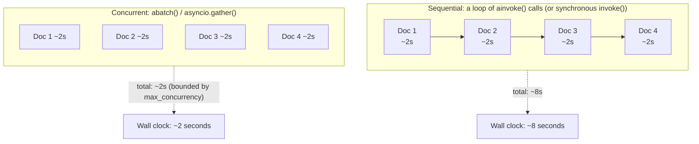

# Chapter 13: Async Programming

> "The single most expensive thing your LLM app does is wait." — every engineer who has profiled an LLM service under load

## Learning Objectives

By the end of this chapter, you will be able to:

- Explain why async matters specifically for LLM applications, in terms of I/O-bound network calls and event-loop concurrency, not just as a generic "Python performance trick"
- Enumerate the full async surface of `Runnable` — `ainvoke()`, `astream()`, `abatch()`, `abatch_as_completed()` — and explain why every LCEL-composed chain gets all four for free
- Distinguish `abatch()` from a Python loop of `ainvoke()` calls, and configure `max_concurrency` to bound fan-out against a provider's rate limits
- Choose correctly between `asyncio.gather` (independent chains) and `RunnableParallel` (concurrent steps inside one chain)
- Identify the "blocking the event loop" trap that occurs when synchronous `.invoke()` is called inside an async FastAPI route, and fix it
- Build a multi-model comparison tool that queries several chat models concurrently and collects all results
- Build a bounded-concurrency parallel summarization pipeline using `abatch()` with `max_concurrency`

---

## Prerequisites for This Chapter

This chapter builds directly on **[Chapter 12: Streaming](./12-streaming.md)**, where you learned:

- How `.stream()` and `.astream()` yield incremental chunks instead of waiting for a full response
- That every `Runnable` in LCEL exposes both a synchronous and an asynchronous version of its core methods
- How streaming interacts with LCEL composition — chunks flow through `RunnableSequence` and `RunnableParallel` without the whole chain needing to buffer

Chapter 12 showed you the *streaming* half of the sync/async story: get partial output sooner. This chapter shows you the *concurrency* half: serve many requests, or run many independent LLM calls, at the same time, without adding more hardware. If Chapter 12 was about latency for one user, Chapter 13 is about throughput for many users — the concern that actually determines whether your FastAPI service falls over at 50 concurrent requests or comfortably handles 500.

You already know `asyncio`, `async def`, and FastAPI's async route handlers from your prior engineering experience. This chapter does not re-teach `asyncio` from scratch — it teaches you specifically how LangChain Core's `Runnable` interface plugs into that model, and where the sharp edges are.

No new setup is required beyond what earlier chapters established. All code below is illustrative — reasoned through by hand, not executed.

---

## 1. Why Async Matters Specifically for LLM Apps

### 1.1 The shape of the problem

Every call to a chat model — OpenAI, Anthropic, a local vLLM server, anything — is fundamentally the same operation from your process's point of view: you send some bytes over a socket, and then you **wait**. The model provider's servers take anywhere from a few hundred milliseconds to tens of seconds to generate a response, and during that entire window, your Python process is doing precisely nothing except holding the connection open.

This is the textbook definition of an **I/O-bound** workload, as opposed to a **CPU-bound** one. Your process isn't busy computing — it's blocked waiting on the network. That distinction matters enormously for how you should architect an LLM service, because I/O-bound waits are exactly what `asyncio` was built to overlap.

```
Synchronous view of one request:
    [ send request ]--------[ waiting for model response, ~2000ms ]--------[ receive response ]
    CPU usage during the wait: ~0%
```

If your FastAPI route calls `.invoke()` (the synchronous method) on a chain, the thread handling that request sits idle for the entire 2000ms, unable to do anything else. If you're running a single-threaded async event loop (which is exactly what FastAPI's `async def` routes assume), that idle thread is *the only thread you have* — so nothing else can happen either, for anyone, until that call returns. That's the crux of the problem this chapter solves.

### 1.2 What async buys you

If instead your route calls `.ainvoke()` (the asynchronous method), the coroutine yields control back to the event loop the moment it starts waiting on the network. The event loop is then free to start processing a second request, a third, a fourth — each one submitting its own network call and yielding back in turn. When the first model response arrives, the event loop resumes that specific coroutine exactly where it left off.

```
Async view of three concurrent requests on ONE event loop:
    Request A: [ send ]----------------------[ resume, receive ]
    Request B:      [ send ]----------------------[ resume, receive ]
    Request C:           [ send ]----------------------[ resume, receive ]
    Wall-clock time for all three: ~2000ms (roughly the time for ONE request)
```

Nothing about the model provider got faster — each individual call still takes ~2000ms. What changed is that your single worker process now spends that 2000ms usefully, juggling many requests instead of serving them one at a time. This is precisely the concurrency model you already rely on in a FastAPI service that talks to a database or an external API — LLM calls are just another (usually slower) instance of the same pattern, and it's the single highest-leverage performance change available to an LLM-serving FastAPI app, because it requires no new infrastructure — only calling the async method you already have.

### 1.3 Why this isn't "just" a nice-to-have for LLM apps

Two properties of LLM calls make this more consequential than for a typical REST backend calling a fast database:

- **The wait is long.** A cache lookup might block for 2ms; an LLM completion might block for 2-20 seconds, especially with longer outputs or reasoning models. Every millisecond blocked synchronously is a millisecond your event loop cannot serve anyone else.
- **The wait is common, not exceptional.** In a typical RAG or agent endpoint, the LLM call *is* the request — there's little other work happening. A blocked LLM call blocks almost the entire request lifecycle, not just a small slice of it.

Put those together, and a single synchronous `.invoke()` inside an async route isn't a minor inefficiency — it can single-handedly determine whether your service serves 5 requests/second or 500.

---

## 2. The Async Surface of `Runnable`

### 2.1 Every Runnable ships both interfaces

Recall from earlier chapters that every LCEL component — a prompt template, a chat model, an output parser, and any chain built by composing them with `|` — implements the `Runnable` interface. That interface defines a **synchronous** method and its **asynchronous** counterpart for each core operation:

| Synchronous | Asynchronous | Purpose |
|---|---|---|
| `invoke()` | `ainvoke()` | Run once, get one result |
| `stream()` | `astream()` | Run once, get results incrementally as chunks |
| `batch()` | `abatch()` | Run over a list of inputs, get a list of results |
| — | `abatch_as_completed()` | Run over a list of inputs, get results as each one finishes (order not guaranteed) |

You met `stream()`/`astream()` in Chapter 12. This chapter focuses on `ainvoke()`, `abatch()`, and `abatch_as_completed()` — the concurrency-oriented members of the family.

### 2.2 Where the async implementation actually comes from

For a component that wraps a genuinely async-capable client — a chat model whose underlying HTTP client supports `async`/`await` — `ainvoke()` performs a real non-blocking network call. For a component with no meaningful async behavior of its own (a pure-Python function wrapped in `RunnableLambda`, for instance), LangChain Core still provides an `ainvoke()` by running the synchronous version in a background thread via `asyncio`'s default executor, so the interface is always present even when the underlying work is synchronous under the hood. The practical implication: calling `ainvoke()` on *any* `Runnable` is always safe and always non-blocking from the event loop's perspective, even if the component internally has no "real" async implementation — you never need to check first.

### 2.3 Composition gives you async for free

This is the payoff of LCEL's design, and it's worth pausing on because it's easy to underappreciate. Consider a familiar three-stage chain:

```python
from langchain_core.prompts import ChatPromptTemplate
from langchain_core.output_parsers import StrOutputParser
from langchain_openai import ChatOpenAI

prompt = ChatPromptTemplate.from_template("Summarize this in one sentence:\n\n{text}")
model = ChatOpenAI(model="gpt-4o-mini")
parser = StrOutputParser()

chain = prompt | model | parser
```

`chain` here is a `RunnableSequence` built by composing three `Runnable` objects. You did not write a single line of async code. And yet:

```python
result = await chain.ainvoke({"text": "..."})
```

works correctly, out of the box. `RunnableSequence.ainvoke()` is implemented generically: it calls `ainvoke()` on the first component, awaits the result, feeds it into `ainvoke()` on the second component, awaits that, and so on. Because `prompt`, `model`, and `parser` each already expose `ainvoke()` (the prompt template's is thread-offloaded since formatting a template is synchronous CPU work; the model's is a real non-blocking network call; the parser's is thread-offloaded again), the composition "just works" all the way through, with zero additional code from you.

This is the single most important idea in this chapter: **you get `ainvoke()`, `astream()`, `abatch()`, and `abatch_as_completed()` on every chain you build, automatically, as a structural consequence of LCEL composition** — not something you opt into per chain. The only discipline required of you is to *call* the async methods instead of the sync ones once you're inside an async codebase (Section 5).

### 2.4 A quick look at `abatch_as_completed()`

`abatch()` (covered in depth in Section 3) returns results in the same order as the inputs, once *all* of them are done. `abatch_as_completed()` instead yields `(index, result)` tuples as each individual input finishes, in whatever order they actually complete:

```python
async for index, result in chain.abatch_as_completed(list_of_inputs):
    print(f"Input {index} finished first among the remaining ones: {result}")
```

Reach for this when you want to start acting on results the moment they're available — for example, streaming partial progress back to a UI as each of several document summaries completes — rather than waiting for the slowest one to hold up the whole batch.

---

## 3. `abatch()` vs. a Loop of `ainvoke()` Calls

### 3.1 They are not the same thing

A very natural first instinct, coming from synchronous Python, is to process a list of inputs like this:

```python
# Works, but leaves concurrency on the table
results = []
for item in items:
    result = await chain.ainvoke(item)
    results.append(result)
```

This is a real bug in waiting — each `await` fully completes before the next one starts. Yes, it's non-blocking with respect to the *rest of your application* (the event loop can serve other requests while this loop awaits), but the loop itself is still **sequential**: item 2 doesn't even start until item 1's model call has finished. For 10 documents at 2 seconds each, this loop takes roughly 20 seconds wall-clock, even though the event loop was never technically "blocked."

`abatch()` is the fix:

```python
results = await chain.abatch(items)
```

`abatch()` dispatches all the underlying `ainvoke()` calls **concurrently** (subject to a concurrency cap — see 3.3) and returns once every one of them has completed, in input order. For the same 10 documents at 2 seconds each, `abatch()` can complete in something close to 2 seconds total, because all 10 network calls are in flight simultaneously rather than one after another.

### 3.2 Why this matters beyond just "less code"

Some model provider SDKs additionally take advantage of `abatch()` to batch multiple inputs into fewer underlying HTTP requests where the provider's API supports it, saving connection overhead beyond what naive concurrent single-item calls would achieve. Even where the provider doesn't offer true request-level batching, `abatch()` still gets you the concurrency benefit of firing many requests in parallel rather than serializing them — the provider-level batching is a bonus you get automatically when it's available, not something you have to detect or configure yourself.

### 3.3 `max_concurrency`: the fan-out control valve

Unbounded concurrency is dangerous against real model provider APIs. If you `abatch()` a list of 500 documents with no limit, you can fire 500 simultaneous requests, and most providers will respond with `429 Too Many Requests` for the excess — burning through your rate limit, wasting retries, and potentially getting your API key temporarily throttled.

`abatch()` (and `abatch_as_completed()`) accept a `config` argument with a `max_concurrency` option for exactly this reason:

```python
results = await chain.abatch(
    items,
    config={"max_concurrency": 5},
)
```

This caps the number of in-flight calls to 5 at any given moment — as soon as one finishes, the next queued item starts, keeping a steady stream of at most 5 concurrent requests rather than a flood of 500. Think of it as a semaphore around your batch: throughput scales with the cap, but so does the demand you place on the provider's rate limit, so `max_concurrency` is where you dial in that trade-off deliberately rather than by accident.

**Rule of thumb:** consult your model provider's documented rate limit (requests per minute, tokens per minute), estimate your average request cost, and set `max_concurrency` conservatively below the point where you'd start seeing `429`s — then increase it incrementally while watching for rate-limit errors, rather than guessing a large number upfront.

---

## 4. `asyncio.gather` vs. `RunnableParallel`: Two Different Concurrency Boundaries

By this point in the course you've used `RunnableParallel` (Chapter 6) to run multiple steps *concurrently within a single chain* — for example, fetching context and rephrasing a question at the same time before feeding both into a final prompt. This chapter introduces a second concurrency tool, `asyncio.gather`, and it's important to draw a clean line between when each one is the right call.

### 4.1 `RunnableParallel`: concurrent steps inside one chain

`RunnableParallel` is an LCEL construct — it's part of the chain's *definition*. You use it when several branches all need to run off the *same input* and their outputs need to be combined downstream, as a single logical unit:

```python
from langchain_core.runnables import RunnableParallel

analysis_chain = RunnableParallel(
    summary=summarize_chain,
    sentiment=sentiment_chain,
    keywords=keyword_chain,
) | combine_prompt | model | parser
```

`invoke()`/`ainvoke()` on `analysis_chain` runs `summarize_chain`, `sentiment_chain`, and `keyword_chain` concurrently under the hood (async execution fans them out with `asyncio` internally), collects all three outputs into a dict, and passes that dict onward to `combine_prompt`. From the outside, `analysis_chain` is still just *one* `Runnable` with *one* `ainvoke()` call — the concurrency is an implementation detail of that single chain's internal structure.

### 4.2 `asyncio.gather`: concurrent, independent chains

`asyncio.gather` is not an LCEL concept at all — it's plain Python `asyncio`, and you reach for it when you have **multiple separate `ainvoke()` calls that have nothing structurally to do with each other**, and you simply want them to run at the same time because your surrounding application logic calls for it:

```python
import asyncio

# Three unrelated documents, each independently summarized
results = await asyncio.gather(
    summarize_chain.ainvoke({"text": doc_1}),
    summarize_chain.ainvoke({"text": doc_2}),
    summarize_chain.ainvoke({"text": doc_3}),
)
```

Here there is no single chain that "knows about" all three documents — you, the caller, are choosing to run three independent invocations concurrently. `asyncio.gather` is the general-purpose async tool for this, and it works identically whether the coroutines happen to be LangChain `ainvoke()` calls or anything else async in Python.

### 4.3 The decision rule

| Question | Answer → Tool |
|---|---|
| Are the concurrent operations *part of one chain's definition*, sharing the same input and feeding a common downstream step? | **`RunnableParallel`** |
| Are you calling `ainvoke()` on the *same chain* over a *list of inputs*? | **`abatch()`** (Section 3) |
| Are the concurrent operations *separate, ad-hoc invocations* — possibly of different chains entirely — that your surrounding application code decides to run together? | **`asyncio.gather`** |

A useful gut check: if you find yourself writing `RunnableParallel` with branches that don't actually share the same input, or that don't feed into a common next step, you're probably looking for `asyncio.gather` (or `abatch`) called from your application code instead — forcing unrelated, ad-hoc concurrency into the chain's structure just to get parallelism is a sign you've reached for the wrong tool.

---

## 5. Mixing Sync and Async: The Blocking Trap

### 5.1 What actually happens when you call `.invoke()` inside an async route

This is the mistake this chapter most wants you to never make in production. Consider a FastAPI route:

```python
@app.post("/chat")
async def chat(request: ChatRequest):
    # BUG: .invoke() is synchronous
    response = chain.invoke({"question": request.question})
    return {"answer": response}
```

`chain.invoke()` is a **blocking, synchronous** call. Inside an `async def` route, calling it does not raise an error and does not behave "asynchronously by association" just because it's inside an async function — Python doesn't work that way. The call runs to completion on the current thread, synchronously, and while it's running (waiting on the network for the model's response), the event loop is **frozen**. No other coroutine — no other request, no health check, no background task — can make progress, because the single thread running the event loop is stuck inside `invoke()`'s blocking wait.

```
One worker, event loop frozen by a sync .invoke() call:

Request A (sync .invoke): [ send ]══════ BLOCKED, event loop frozen ══════[ receive ]
Request B (arrives during A):                     ...waiting for the event loop to free up...
Request C (arrives during A):                              ...also waiting...
```

Under low traffic you might never notice — one user, one blocked call, nobody else waiting. Under real concurrent load, this is exactly the failure mode in the Real-World Scenario below: request latencies climb in lockstep with request volume, because every request queues up behind whichever one currently holds the event loop hostage.

### 5.2 The fix: `ainvoke()` throughout

```python
@app.post("/chat")
async def chat(request: ChatRequest):
    response = await chain.ainvoke({"question": request.question})
    return {"answer": response}
```

The change is one word (`ainvoke` instead of `invoke`, plus `await`), and the effect is qualitative, not incremental: the event loop is now free to serve other requests for the entire duration of this one's model call.

### 5.3 The discipline: async all the way down

The subtlety worth internalizing is that this fix only works if **every** blocking operation in the call path is replaced with its async equivalent — a single leftover synchronous call anywhere in the chain undoes the benefit. If your chain includes a custom `RunnableLambda` that calls a synchronous requests.get() to fetch something from an internal API, that synchronous call blocks the event loop exactly the same way `.invoke()` did, even if everything around it is `async`. Practical guidance:

- Use `ainvoke()`/`abatch()`/`astream()` uniformly in any code path reachable from an async FastAPI route.
- If you must call a genuinely synchronous library function (a sync DB driver, a CPU-heavy computation, a sync-only third-party SDK) from inside an async context, offload it explicitly with `asyncio.to_thread(...)` (or `loop.run_in_executor`) rather than calling it directly — this is the same pattern LangChain Core itself uses internally to give synchronous components an `ainvoke()`.
- Don't assume a library "must be async-safe" just because you're calling it from inside `async def` — verify, especially for custom tools, retrievers, or output parsers you've written yourself.

If your entire service is synchronous (a traditional WSGI-style app, a script, a batch job with no event loop to protect), none of this applies — `.invoke()` and `.batch()` are perfectly appropriate there, and reaching for async plumbing you don't need only adds complexity. The rule is specifically about async event-loop contexts, where a single blocking call has an outsized, service-wide cost.

---

## 6. Sequential vs. Concurrent Execution: A Visual Comparison



Four documents, ~2 seconds of model latency each. The sequential path pays the full cost of every call, one after another — 8 seconds total. The concurrent path overlaps the waiting time across all four calls, and finishes in roughly the time of the single slowest call — about 2 seconds. This is the entire business case for this chapter in one picture: async doesn't make any individual model call faster, it lets you stop paying for their wait time serially.

---

## 7. Worked Example: Multi-Model Comparison Tool

A common real-world need: send the same prompt to several different chat models and compare their answers side by side — for model evaluation, A/B testing, or giving end users a choice of provider. Doing this sequentially with `.invoke()` three times would take the sum of all three latencies; doing it concurrently with `asyncio.gather` takes roughly the time of the *slowest* one.

```python
import asyncio
from langchain_core.prompts import ChatPromptTemplate
from langchain_openai import ChatOpenAI
from langchain_anthropic import ChatAnthropic
from langchain_google_genai import ChatGoogleGenerativeAI

prompt = ChatPromptTemplate.from_template(
    "Answer concisely: {question}"
)

models = {
    "gpt-4o-mini": ChatOpenAI(model="gpt-4o-mini"),
    "claude-haiku": ChatAnthropic(model="claude-3-5-haiku-latest"),
    "gemini-flash": ChatGoogleGenerativeAI(model="gemini-1.5-flash"),
}

# Build one chain per model, all sharing the same prompt
chains = {name: prompt | model for name, model in models.items()}


async def compare_models(question: str) -> dict[str, str]:
    names = list(chains.keys())
    coroutines = [chains[name].ainvoke({"question": question}) for name in names]

    # Run all three model calls concurrently; each takes as long as it takes,
    # but we only wait as long as the slowest one, not the sum of all three.
    responses = await asyncio.gather(*coroutines, return_exceptions=True)

    results = {}
    for name, response in zip(names, responses):
        if isinstance(response, Exception):
            results[name] = f"ERROR: {response}"
        else:
            results[name] = response.content
    return results


# Usage inside an async context:
# results = await compare_models("What causes tides?")
# for model_name, answer in results.items():
#     print(f"{model_name}: {answer}")
```

**Design notes worth calling out:**

- `return_exceptions=True` is deliberate: without it, `asyncio.gather` raises as soon as *any one* coroutine fails, cancelling the others and losing whatever they'd already produced. With it, a failure from one provider (say, Anthropic returns a rate-limit error) surfaces as an exception object in that slot of the results list, while the other two models' successful responses are preserved. This matters a great deal for a comparison tool — one flaky provider shouldn't take down the whole comparison.
- Each `chains[name]` is a fully independent `RunnableSequence` (a different model wired to the same prompt) — there is no shared chain definition here, which is exactly the "ad-hoc independent invocations" case from Section 4 that calls for `asyncio.gather` rather than `RunnableParallel` or `abatch()` (which assumes one chain applied to many *inputs*, not many *chains* applied to one input).
- Wall-clock time for `compare_models` is approximately `max(latency_gpt, latency_claude, latency_gemini)`, not the sum — the entire point of running them concurrently.

---

## 8. Worked Example: Parallel Summarization with Bounded Concurrency

Now the complementary case: **one** chain, applied across **many** inputs — summarizing a list of documents. This is the textbook `abatch()` use case, and because document counts in production can be large (dozens, hundreds), bounding concurrency with `max_concurrency` is essential to avoid overwhelming the provider's rate limit.

```python
import asyncio
from langchain_core.prompts import ChatPromptTemplate
from langchain_core.output_parsers import StrOutputParser
from langchain_openai import ChatOpenAI

summarize_prompt = ChatPromptTemplate.from_template(
    "Summarize the following document in 2-3 sentences:\n\n{document}"
)
model = ChatOpenAI(model="gpt-4o-mini")
summarize_chain = summarize_prompt | model | StrOutputParser()


async def summarize_documents(documents: list[str], max_concurrency: int = 5) -> list[str]:
    inputs = [{"document": doc} for doc in documents]

    # abatch fans out up to `max_concurrency` requests at a time; as soon as
    # one finishes, the next queued input starts. Results come back in the
    # same order as `inputs`, regardless of which finished first.
    summaries = await summarize_chain.abatch(
        inputs,
        config={"max_concurrency": max_concurrency},
    )
    return summaries


# Usage inside an async context, for say 50 documents:
# summaries = await summarize_documents(documents, max_concurrency=5)
# for original, summary in zip(documents, summaries):
#     print(summary)
```

**Why `max_concurrency=5` and not "as many as possible":** if these 50 documents were fired off with no cap, you'd have 50 simultaneous requests hitting the provider at once — very likely tripping rate limits and producing a wave of `429` errors that then need retrying (Chapter 14 covers retry strategies in depth). Capping at 5 means at most 5 requests are in flight at any moment; as each completes, the next queued document starts immediately, keeping throughput high without ever exceeding the concurrency the provider can comfortably absorb. In practice, you'd tune this number against the specific provider's documented rate limit and your account tier — 5 is a reasonable, conservative starting point for most APIs, not a universal constant.

**If you need results as they arrive** (for example, to stream progress updates to a UI as each document finishes, rather than waiting for the full batch), swap `abatch()` for `abatch_as_completed()`:

```python
async def summarize_documents_streaming(documents: list[str], max_concurrency: int = 5):
    inputs = [{"document": doc} for doc in documents]
    async for index, summary in summarize_chain.abatch_as_completed(
        inputs,
        config={"max_concurrency": max_concurrency},
    ):
        print(f"Document {index} summarized: {summary}")
```

Note that results here arrive in *completion* order, not *input* order — document 3 might finish before document 1 if it happened to be shorter or the model responded faster. If your downstream logic needs to preserve input order, capture the `index` and reassemble afterward; if you only care about surfacing progress as it happens, this is often exactly what you want.

---

## Real-World Scenario

**Scenario:** A team ships a FastAPI-based document Q&A service. Locally, with one developer hitting the API at a time, everything works beautifully — responses come back in 1-2 seconds, exactly as expected. In production, load testing at just 20 concurrent users reveals a serious problem: p50 latency is fine, but p95 latency balloons past 15 seconds, and under slightly higher load, requests start timing out entirely. CPU usage on the server is barely above idle the whole time — which is confusing, because a CPU-bound bottleneck was the first suspect.

Someone finally reads through the route handler:

```python
@app.post("/ask")
async def ask(request: QuestionRequest):
    # The whole team missed this for weeks: .invoke(), not .ainvoke()
    answer = qa_chain.invoke({"question": request.question})
    return {"answer": answer}
```

The route is declared `async def`, which everyone had assumed made it non-blocking by default — a very common and understandable misconception. But the actual model call inside it uses the synchronous `.invoke()`. Every single request to `/ask`, for the roughly 2-8 seconds it takes the model to respond, **completely freezes the event loop** — meaning every *other* concurrent request to `/ask` (or to any other route on the same worker) is stuck waiting behind it, unable to even start its own model call until the current one finishes. With one worker process and low CPU usage but sky-high latency under concurrency, this is close to a textbook signature of a blocked event loop — the process isn't "busy," it's stuck waiting, one request at a time, on a single thread.

**The fix** is exactly the one-line-looking change from Section 5, applied throughout the request path (the retriever call and any other chain step in the route also had to be checked and switched to their async equivalents):

```python
@app.post("/ask")
async def ask(request: QuestionRequest):
    answer = await qa_chain.ainvoke({"question": request.question})
    return {"answer": answer}
```

**The result:** re-running the same load test at 20 concurrent users, p95 latency dropped from over 15 seconds to roughly 3 seconds — close to the latency of a single request, because the event loop could now genuinely serve requests concurrently instead of queueing them behind each other. The team also added `max_concurrency` bounds to their batch summarization endpoints (a separate part of the same service) after this incident, having learned the broader lesson: async correctness in an LLM service isn't an optimization to consider later, it's a load-bearing requirement from day one, and it hides in plain sight because everything works fine until concurrency arrives.

---

## Best Practices

- **Use `ainvoke()`, `astream()`, `abatch()`, and `abatch_as_completed()` throughout any code path reachable from an async framework** (FastAPI, aiohttp, etc.) — never mix in a synchronous `.invoke()` "just this once," since one blocking call undoes the benefit for every concurrent request on that worker.
- **Prefer `abatch()` over a loop of `ainvoke()` calls** whenever you're applying the same chain to a list of inputs — the loop is sequential in spirit even though each call is individually non-blocking.
- **Always set `max_concurrency`** on `abatch()`/`abatch_as_completed()` when processing more than a handful of inputs, sized conservatively against your provider's documented rate limits, and increase it incrementally while monitoring for `429`s rather than guessing high.
- **Reach for `asyncio.gather` when concurrency spans independent chains or independent invocations**, not just independent inputs to the same chain — that's the signal you want ad-hoc application-level concurrency rather than an LCEL-level construct.
- **Reach for `RunnableParallel` when the concurrent steps are part of one chain's definition**, sharing the same input and feeding a common downstream step — keep that concurrency in the chain, not scattered across your route handler.
- **Use `return_exceptions=True` with `asyncio.gather`** whenever one failed coroutine (e.g., one model provider erroring out) shouldn't cancel and discard the results of the others.
- **Offload genuinely synchronous, blocking calls** (legacy SDKs, sync DB drivers, CPU-heavy work) with `asyncio.to_thread(...)` when they must be called from an async context, rather than calling them directly and blocking the loop.
- **Load-test under realistic concurrency, not just single-request latency**, since blocking-event-loop bugs are invisible in single-user testing and only appear once multiple requests compete for the same event loop.

---

## Common Mistakes

- **Calling `.invoke()` inside an `async def` route and assuming the `async` keyword alone makes it non-blocking.** It doesn't — `async def` only means the function *can* be awaited and *can* yield control; it does nothing to a synchronous call made inside it, which still blocks the entire event loop for its full duration.
- **Looping over `ainvoke()` instead of using `abatch()`** for a list of inputs, leaving most of the available concurrency on the table while believing you've "gone async" because each individual call uses `await`.
- **Omitting `max_concurrency` on large batches**, flooding the provider with simultaneous requests and triggering a wave of `429` rate-limit errors that then require retry logic to clean up — entirely avoidable by bounding fan-out upfront.
- **Reaching for `RunnableParallel` to run unrelated, ad-hoc chains concurrently**, forcing independent operations into a chain's static structure instead of using `asyncio.gather` from application code, where that kind of dynamic, one-off concurrency actually belongs.
- **Using `asyncio.gather` without `return_exceptions=True`** when partial failure is acceptable, and being surprised when one failed call silently cancels and discards results already computed by the others.
- **Assuming a custom `RunnableLambda` or a hand-written tool is "async-safe" just because it's called via `ainvoke()`**, without verifying that everything inside it is actually non-blocking — a synchronous network call buried inside a lambda blocks the event loop exactly as much as a top-level `.invoke()` would.
- **Never load-testing under concurrency**, so a blocking-event-loop bug ships to production invisibly and only surfaces once real concurrent traffic arrives, by which point it looks like a mysterious, hard-to-reproduce performance regression.

---

## Summary

- LLM calls are **I/O-bound**, not CPU-bound — the process spends nearly all its time waiting on the network, which is exactly the workload `asyncio` is designed to overlap across many concurrent requests on a single worker.
- Every `Runnable` exposes `ainvoke()`, `astream()`, `abatch()`, and `abatch_as_completed()`, and **LCEL-composed chains get all four automatically** through generic composition — you never write async plumbing yourself to get this.
- **`abatch()` runs the underlying calls concurrently**, unlike a sequential loop of `ainvoke()` calls, and its `max_concurrency` config option bounds fan-out to avoid flooding a provider's rate limit.
- **`asyncio.gather` is for independent, ad-hoc chains or invocations**; **`RunnableParallel` is for concurrent steps that are structurally part of one chain**, sharing an input and feeding a common downstream step — pick based on whether the concurrency belongs in the chain's definition or in your calling code.
- **A single synchronous `.invoke()` call inside an async route freezes the entire event loop** for its duration, blocking every other concurrent request on that worker — the fix is `ainvoke()` used consistently through the whole request path, not just at the top level.
- Multi-model comparison (`asyncio.gather` over independent chains) and bounded parallel summarization (`abatch()` with `max_concurrency`) are the two canonical patterns that cover the large majority of real-world concurrency needs in LangChain Core applications.

---

## Knowledge Check

1. Explain, in terms of what the CPU and network are actually doing, why an LLM call is I/O-bound rather than CPU-bound, and why that distinction is what makes `asyncio` effective here.
2. You have a chain built from a prompt template, a chat model, and an output parser, and you've never written any async code for it. Why does `await chain.ainvoke(...)` work correctly anyway?
3. A colleague writes `for item in items: result = await chain.ainvoke(item)` to process a list of 20 items and says "this is already async." What's wrong with that claim, and what should they use instead?
4. You need to summarize 200 documents through the same chain. Explain what `max_concurrency` controls in this scenario and what happens at both extremes — setting it to `1` and setting it to `200`.
5. You need to send one prompt to four different chat model providers and collect all four answers, tolerating any single provider failing without losing the other three. Which concurrency tool do you reach for, and what specific option makes the failure-tolerance work?
6. A FastAPI route is declared `async def` but its p95 latency collapses catastrophically under concurrent load while CPU usage stays low. What's the most likely root cause, and how would you confirm it by reading the code?

---

## Hands-On Exercise

Build both worked examples from this chapter as complete, runnable (conceptually — reason through them by hand) modules:

**Part 1 — Multi-Model Comparison Tool**

1. Define a single `ChatPromptTemplate` and wire it to at least three different chat model instances (they can be different models from the same provider if you don't have multiple provider API keys available, e.g., `gpt-4o-mini` vs. `gpt-4o`).
2. Write an `async def compare_models(question: str)` function that uses `asyncio.gather` with `return_exceptions=True` to query all models concurrently and return a dictionary of `{model_name: answer_or_error}`.
3. Reason through, on paper, what the total wall-clock time would be if one model takes 1s, one takes 3s, and one takes 8s to respond — compare that to what a sequential version calling `.invoke()` three times in a row would take.
4. Modify your function so that if one model's call fails, the other two results are still returned successfully — confirm your `return_exceptions=True` handling actually achieves this by tracing through the code by hand.

**Part 2 — Parallel Summarization Pipeline**

1. Build a `summarize_chain` (prompt | model | output parser) and write an `async def summarize_documents(documents, max_concurrency)` function using `abatch()`.
2. Reason through the wall-clock time for summarizing 30 documents, each taking ~2 seconds, under three different `max_concurrency` values: `1`, `5`, and `30`. What does each value imply about total time and simultaneous load on the provider?
3. Rewrite the function using `abatch_as_completed()` instead, and explain in writing how the output order would differ from the `abatch()` version, and in what real scenario that difference would actually matter to a caller.
4. **Bonus:** sketch (in comments, not necessarily runnable) how you would combine both patterns — comparing multiple models' summaries for each of several documents — and identify which parts of that combined problem call for `asyncio.gather`, which call for `abatch()`, and whether `RunnableParallel` has any role in it.

---

## Further Reading

- [LangChain Python API Reference — Runnable Interface](https://python.langchain.com/api_reference/core/runnables/langchain_core.runnables.base.Runnable.html) — the authoritative reference for `ainvoke`, `astream`, `abatch`, and `abatch_as_completed` signatures and defaults
- [LangChain Core Documentation — Async Programming with LangChain](https://python.langchain.com/docs/concepts/async/) — conceptual overview of sync/async parity across the library
- [Python `asyncio` documentation — Coroutines and Tasks](https://docs.python.org/3/library/asyncio-task.html) — official reference for `asyncio.gather`, `asyncio.to_thread`, and the event loop model this chapter builds on
- [FastAPI documentation — Concurrency and async/await](https://fastapi.tiangolo.com/async/) — FastAPI's own explanation of what `async def` does and does not give you for free
- [LangChain Python API Reference — RunnableParallel](https://python.langchain.com/api_reference/core/runnables/langchain_core.runnables.base.RunnableParallel.html) — formal reference for the construct contrasted with `asyncio.gather` in Section 4

---

<div style="display:flex;justify-content:space-between;align-items:center;">
  <a href="./12-streaming.md">← Previous: Streaming</a>
  <a href="./00-index.md">🏠 Index</a>
  <a href="./14-error-handling-and-resilience.md">Next: Error Handling & Resilience →</a>
</div>
