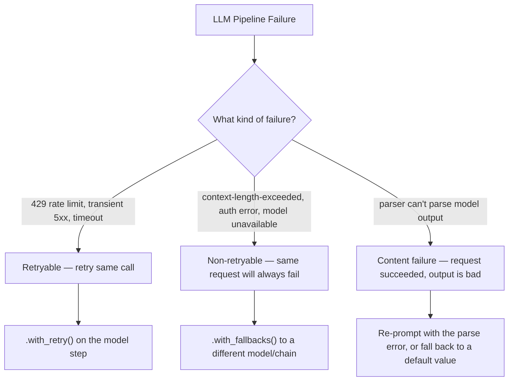
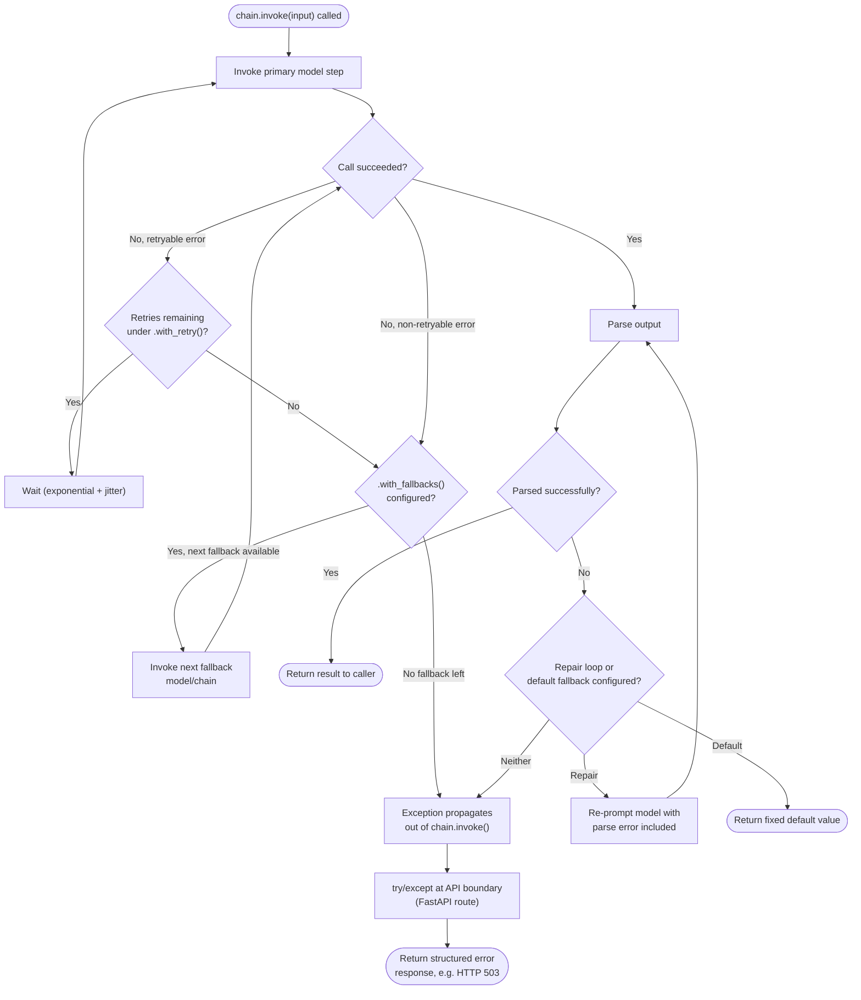

# Chapter 14: Error Handling & Resilience

> "Everything fails, all the time." — Werner Vogels, CTO, Amazon

## Learning Objectives

By the end of this chapter, you will be able to:

- Explain why LLM pipelines fail in ways ordinary web services don't — rate limits, transient outages, malformed structured output, slow generations, and context-length errors
- Configure `.with_retry()` on any Runnable, choosing the right `stop_after_attempt`, backoff strategy, and exception filter for the failure mode you're guarding against
- Configure `.with_fallbacks()` to chain a primary model with one or more fallback models or chains, including a final static "safe response" fallback
- Set request-level timeouts on a chat model and reason about what happens when a timeout fires partway through a multi-step chain
- Recover gracefully from output-parser failures — either by retrying the LLM call with the parser's error fed back in, or by falling back to a fixed default value
- Decide, for a given failure, whether it belongs at the per-step layer (`.with_retry()` / `.with_fallbacks()`) or the API boundary layer (`try`/`except` around `.invoke()`)
- Design a layered resilience strategy for a production chain and trace exactly what happens on a 429 error and on a persistent provider outage

---

## Prerequisites for This Chapter

This chapter builds on **[Chapter 13: Async Programming](./13-async-programming.md)**, where you learned:

- How `ainvoke`, `abatch`, and `astream` let a chain serve concurrent requests without blocking a thread on network I/O
- That every Runnable exposes both a sync and an async execution path, and that FastAPI production deployments (previewed there, covered fully in **Chapter 19**) should use the async path end to end

Async programming solves the *throughput* problem: how do you serve many requests at once without wasting threads waiting on the network? This chapter solves the *reliability* problem: what do you do when one of those network calls doesn't come back cleanly? A chain that's perfectly async but has no retry or fallback strategy will simply propagate every provider hiccup straight to your users, at scale, all at once. The two concerns compose — an async chain still needs `.with_retry()` and `.with_fallbacks()` wrapped around its steps — and this chapter is where you add that missing layer.

No new setup is required. The `.with_retry()` and `.with_fallbacks()` methods are available on every `Runnable` in the `langchain-core` package you've already been using since Chapter 1.

---

## 1. Why LLM Pipelines Fail Differently Than Typical Web Services

### 1.1 The failure modes you already know

A typical CRUD web service calling a typical REST backend fails in familiar ways: the database connection drops, a downstream service returns a 500, a request times out because a query is slow. You've built retry logic and circuit breakers for these before.

### 1.2 The failure modes LLM pipelines add on top

An LCEL chain calling a hosted LLM provider inherits all of the above, **plus** a set of failure modes that are much more frequent and much more central to the workload itself:

- **Rate limits (HTTP 429).** LLM providers meter usage in requests-per-minute and tokens-per-minute. A traffic spike, a burst of concurrent users, or simply having too low a tier on your account will trip this constantly — and unlike a typical backend service you control, you cannot just "scale out" your way past someone else's quota.
- **Transient provider outages.** Every major LLM API (OpenAI, Anthropic, and others) has intermittent regional or global blips — a `500`, a `503`, or a connection reset that resolves itself in seconds if you simply try again. These are far more common than outages from, say, a well-provisioned internal microservice.
- **Malformed or unparseable structured output.** Chapter 5 showed you how output parsers turn raw LLM text into typed Python objects. LLMs are probabilistic text generators, not deterministic serializers — they will occasionally emit output that's *almost* valid JSON, or valid JSON with a field renamed, or a stray sentence before the JSON block. A parser failure here is a *content* failure, not a *network* failure, and it needs a different remedy.
- **Timeouts on slow generations.** A model producing a long completion, or a provider under heavy load, can take far longer to respond than a typical API call — sometimes tens of seconds. Your chain needs an opinion on how long is too long, because "hang forever" is not an acceptable production behavior.
- **Context-length-exceeded errors.** If upstream retrieval (Chapter 7-ish territory) or a long conversation history pushes your prompt past the model's context window, the provider rejects the request outright. This is a *deterministic* failure — retrying the identical request will fail identically — so it needs to be handled differently from a transient error.

The throughline: **retryable failures** (429s, transient 5xxs, timeouts) call for retry logic; **non-retryable failures** (context-length-exceeded, a fundamentally broken API key) call for fallback logic or an immediate error; and **content failures** (bad structured output) call for a completely different remedy — feeding the error back to the model, covered in Section 5. Conflating these three categories is the single most common mistake in this chapter, and Section 6 is built entirely around telling them apart.



---

## 2. `.with_retry()`: Automatic Retries on Every Runnable

### 2.1 The mental model

Because every LangChain Core component — a chat model, a prompt template, a parser, an entire composed chain — implements the `Runnable` interface (Chapter 2), every one of them inherits a common set of resilience methods for free. `.with_retry()` is one of them. Calling it doesn't retry *your code*; it wraps the Runnable in a new Runnable that catches exceptions from `.invoke()`/`.ainvoke()` and re-executes the underlying call according to a policy you specify.

```python
from langchain_openai import ChatOpenAI

model = ChatOpenAI(model="gpt-4o-mini")

resilient_model = model.with_retry(
    stop_after_attempt=3,
)
```

`resilient_model` behaves exactly like `model` in every way — same `.invoke()`, same `.batch()`, same streaming — except that if the underlying call raises an exception, it will be retried up to the configured attempt count before finally propagating the error.

### 2.2 Configuring what triggers a retry

By default, `.with_retry()` retries on a broad set of exceptions, but you should be deliberate about *which* exceptions deserve a retry. Retrying a request that will deterministically fail again (a context-length error, an invalid-API-key auth error) just wastes time and money before you ultimately still fail — worse, it delays the user-visible error by however long your retry/backoff schedule takes.

```python
import openai

resilient_model = model.with_retry(
    retry_if_exception_type=(
        openai.RateLimitError,       # 429 — the provider is asking us to slow down
        openai.APITimeoutError,      # request timed out
        openai.APIConnectionError,   # transient network/connection issue
    ),
    stop_after_attempt=4,
)
```

Notice what's deliberately **excluded**: `openai.AuthenticationError` (a bad API key will never fix itself on retry) and `openai.BadRequestError` (which is what a context-length-exceeded error typically surfaces as — the request itself is invalid, not the network). Retrying those just adds latency to an error that was always going to happen.

### 2.3 Backoff: `wait_exponential_jitter`

Retrying immediately after a 429 is close to the worst thing you can do — you're hitting a rate limit *because* you sent too many requests too fast, and firing the retry instantly just adds to that same burst. `.with_retry()` supports exponential backoff with jitter out of the box:

```python
resilient_model = model.with_retry(
    stop_after_attempt=4,
    wait_exponential_jitter=True,     # default: True
    exponential_jitter_params={
        "initial": 1,       # first retry waits ~1s
        "max": 20,          # cap the wait at 20s per attempt
        "exp_base": 2,      # each attempt roughly doubles the wait
        "jitter": 3,        # up to 3s of randomness added, to avoid thundering herd
    },
)
```

**Why jitter matters, concretely:** imagine 50 concurrent requests all hit a 429 at the same moment because of a traffic spike. Without jitter, all 50 would back off for exactly the same interval and then retry **simultaneously**, recreating the exact same burst that caused the rate limit in the first place — a classic *thundering herd*. Adding a random jitter component spreads those 50 retries out over a window instead of a single instant, which is what actually lets the request rate fall below the provider's threshold.

### 2.4 What `.with_retry()` does not do

It's worth being explicit about the boundary here, because it trips people up: `.with_retry()` retries the **same call with the same inputs**. It has no concept of "try a different model" — that's `.with_fallbacks()`, next. And it has no concept of "the output came back but it's the wrong shape" — a successful HTTP response with unparseable JSON inside it is not an exception at the model-Runnable level at all; it's an exception thrown later by the parser step, which is a separate concern (Section 5).

---

## 3. `.with_fallbacks()`: Chaining Backup Models and Chains

### 3.1 The mental model

`.with_retry()` answers "what if this call fails transiently?" `.with_fallbacks()` answers a different question: "what if this call — even after retries — never succeeds? Is there a *different* thing I can try instead?" This is where Chapter 3's provider-independence story pays off directly: because `ChatOpenAI`, `ChatAnthropic`, and every other chat model implement the identical `Runnable` interface, you can hand `.with_fallbacks()` a completely different provider's model and the chain doesn't need to know or care.

```python
from langchain_openai import ChatOpenAI
from langchain_anthropic import ChatAnthropic

primary = ChatOpenAI(model="gpt-4o-mini").with_retry(stop_after_attempt=3)
backup = ChatAnthropic(model="claude-3-5-haiku-20241022").with_retry(stop_after_attempt=2)

resilient_model = primary.with_fallbacks([backup])
```

When you call `resilient_model.invoke(...)`:

1. `primary` is invoked (with its own retry policy already active).
2. If `primary` still raises an exception after exhausting its retries, `.with_fallbacks()` catches it and invokes `backup` with the *same input* instead.
3. If `backup` succeeds, its output is returned as if nothing went wrong. The caller of `resilient_model` never sees the primary's failure at all.
4. If `backup` also raises, the exception from the **last** fallback in the chain is the one that ultimately propagates.

### 3.2 Chaining multiple fallbacks, ending in a static response

`.with_fallbacks()` accepts a list, and you can chain as many tiers as you want — including a final tier that isn't a model call at all, but a hard-coded `RunnableLambda` that always succeeds, guaranteeing your API never returns a hard 500 to the end user.

```python
from langchain_core.runnables import RunnableLambda
from langchain_core.messages import AIMessage

def canned_response(_input) -> AIMessage:
    return AIMessage(
        content=(
            "I'm having trouble reaching our AI provider right now. "
            "Please try again in a few minutes."
        )
    )

static_fallback = RunnableLambda(canned_response)

resilient_model = (
    primary
    .with_fallbacks([backup, static_fallback])
)
```

The decision tree this builds: try OpenAI (with its own retries) → if that's exhausted, try Anthropic (with its own retries) → if that's exhausted, return a fixed, always-succeeding message. The static fallback is not a "nicer error" — it's a completely different code path that cannot itself fail, which is exactly the property you want at the very end of a fallback chain. Whatever comes after this in your API layer (Chapter 19) can treat the whole thing as if it always returns *some* `AIMessage`, never an exception.

### 3.3 `.with_fallbacks()` on a whole chain, not just the model

Because fallbacks operate at the `Runnable` level, you're not limited to falling back on a single model call — you can fall back on an **entire alternate chain** if, say, your primary approach uses a complex prompt/parser combination that itself might fail in ways a simpler backup chain wouldn't.

```python
primary_chain = prompt | primary | parser
backup_chain = simpler_prompt | backup | simpler_parser

resilient_chain = primary_chain.with_fallbacks([backup_chain])
```

This is the pattern to reach for when the backup isn't just "the same prompt on a different model" but "a deliberately simpler, more failure-resistant path" — for example, a backup chain that asks for plain text instead of structured JSON, trading capability for reliability when things are already going wrong.

### 3.4 Passing exception info into the fallback

Sometimes the fallback needs to know *why* the primary failed — for example, to log it, or to change behavior based on the failure type. `.with_fallbacks()` supports this via `exception_key`:

```python
def backup_with_context(input_and_error: dict) -> AIMessage:
    error = input_and_error["error"]
    print(f"Primary model failed, falling back. Reason: {error}")
    return AIMessage(content="Here's a fallback response.")

resilient_model = primary.with_fallbacks(
    [RunnableLambda(backup_with_context)],
    exception_key="error",
)
```

With `exception_key` set, each fallback receives a dict of `{"input": <original input>, "error": <the exception that triggered this fallback>}` instead of just the raw input — useful for observability (Chapter 20 territory) without writing a custom wrapper.

---

## 4. Timeouts: Bounding How Long You'll Wait

### 4.1 Setting a request-level timeout

Every chat model constructor accepts a `timeout` (or provider-specific equivalent) that bounds how long a single request is allowed to run before it's aborted and an exception raised:

```python
model = ChatOpenAI(
    model="gpt-4o-mini",
    timeout=15,      # seconds — abort if no response within 15s
    max_retries=0,   # disable the client library's own built-in retries;
                     # we'll control retries explicitly with .with_retry()
)
```

**Why disable `max_retries` on the client itself?** Most provider SDKs (including `openai`) ship their own internal retry loop, separate from LangChain's `.with_retry()`. If you leave both active, you get retries stacked on retries with no single place that controls the policy — a timeout of 15 seconds combined with the SDK's own 2 internal retries can silently turn into 45+ seconds of wall-clock latency before your code even sees an exception to act on. The clean pattern is: set the provider SDK's own retry count to 0 (or 1), and let `.with_retry()` be the single, visible, tunable place where retry policy lives.

### 4.2 What happens when a timeout fires mid-chain

A timeout on the model step behaves exactly like any other exception raised by that step: it propagates up through the chain the same way a `RateLimitError` would. If the model step is wrapped in `.with_retry()`, the timeout is retried according to that policy (assuming the timeout exception type is included in `retry_if_exception_type`). If retries are exhausted, and `.with_fallbacks()` is configured, control passes to the next model/chain in the fallback list — which gets its **own** independent timeout budget. This matters: a fallback model is not bound by however long the primary model's timeout took to fire; it starts its own clock from zero.

```python
model = ChatOpenAI(model="gpt-4o-mini", timeout=15, max_retries=0)

resilient_model = model.with_retry(
    stop_after_attempt=3,
    retry_if_exception_type=(TimeoutError, Exception),  # broad for illustration
).with_fallbacks([
    ChatAnthropic(model="claude-3-5-haiku-20241022", timeout=15, max_retries=0),
])
```

Worst-case latency for this configuration is roughly: `3 attempts × ~15s timeout (plus backoff waits) + 1 fallback attempt × ~15s`. This is the number you should actually compute and check against your own API's SLA — it's easy to configure retries and fallbacks that are individually reasonable but compound into a response time your callers will consider "hung," even though nothing technically errored.

### 4.3 A timeout further downstream: streaming

If you're streaming a response (`.stream()` / `.astream()`, Chapter 13), a timeout that fires *after* the first tokens have already been sent to the client is a different situation than one that fires before anything is sent — you can't "fall back" mid-stream without confusing or duplicating output the client already received. The practical rule: timeouts and fallbacks are cleanest to reason about *before* streaming begins. Once you've committed to streaming a response to a caller, a failure partway through should typically be surfaced as a stream error/terminator, not silently patched over with a fallback that would produce a second, disconnected response.

---

## 5. Handling Parser Failures Gracefully

### 5.1 Why this is a different kind of failure

Recall Chapter 5: an output parser (whether a `PydanticOutputParser`, a `StrOutputParser` doing structured extraction, or a tool-calling-based structured output) takes the model's raw text and coerces it into a typed object. When the model's output doesn't match the expected shape, the parser raises — commonly `OutputParserException` (or, if you're using Pydantic-based validation, a `ValidationError` wrapped by the parser). This is not a network failure and it will not be fixed by `.with_retry()` alone, because retrying the identical prompt against a model that has some baseline error rate will often just reproduce a similarly malformed response.

### 5.2 Option A: retry the LLM call with the parse error fed back in

The most effective remedy is also the most instructive one about how these components compose: catch the parser exception, construct a *new* prompt that includes the original request, the model's bad output, and the specific parsing error, and ask the model to correct itself.

```python
from langchain_core.output_parsers import PydanticOutputParser
from langchain_core.prompts import ChatPromptTemplate
from pydantic import BaseModel

class Extraction(BaseModel):
    name: str
    age: int

parser = PydanticOutputParser(pydantic_object=Extraction)

base_prompt = ChatPromptTemplate.from_messages([
    ("system", "Extract the person's name and age as JSON. {format_instructions}"),
    ("human", "{text}"),
])

retry_prompt = ChatPromptTemplate.from_messages([
    ("system", "Extract the person's name and age as JSON. {format_instructions}"),
    ("human", "{text}"),
    ("ai", "{bad_output}"),
    ("human",
     "That output failed to parse with this error:\n{error}\n"
     "Please correct it and return only valid JSON matching the schema."),
])

def extract_with_repair(text: str, model, max_attempts: int = 2) -> Extraction:
    format_instructions = parser.get_format_instructions()
    chain = base_prompt | model | StrOutputParser()

    raw_output = chain.invoke({"text": text, "format_instructions": format_instructions})

    for attempt in range(max_attempts):
        try:
            return parser.parse(raw_output)
        except Exception as parse_error:
            if attempt == max_attempts - 1:
                raise
            repair_chain = retry_prompt | model | StrOutputParser()
            raw_output = repair_chain.invoke({
                "text": text,
                "format_instructions": format_instructions,
                "bad_output": raw_output,
                "error": str(parse_error),
            })
```

This pattern — showing the model its own broken output alongside the exact error message — is dramatically more effective than a blind retry, because it gives the model concrete signal about *what specifically* to fix ("field `age` should be an integer, got a string") rather than just asking it to try again from scratch. Note that LangChain also ships a purpose-built helper for this exact pattern, `OutputFixingParser` (and its more capable sibling `RetryWithErrorOutputParser`), which wraps a base parser and an LLM to automate this repair loop rather than you hand-rolling it as above — the manual version here exists so you understand what those helpers are actually doing under the hood.

### 5.3 Option B: a fixed default fallback value

Sometimes correctness of the structured output matters less than the pipeline never breaking — for example, an optional "sentiment" field feeding an analytics dashboard where a missing value is fine but an unhandled exception taking down the whole request is not. In that case, skip the repair loop entirely and fall back to a safe default:

```python
def extract_with_default(text: str, model) -> Extraction:
    try:
        chain = base_prompt | model | parser
        return chain.invoke({
            "text": text,
            "format_instructions": parser.get_format_instructions(),
        })
    except Exception:
        return Extraction(name="unknown", age=0)
```

Or, equivalently and more idiomatically within LCEL, by using `.with_fallbacks()` directly on the parsing chain, with the fallback being a `RunnableLambda` that returns the default object:

```python
chain = base_prompt | model | parser
resilient_chain = chain.with_fallbacks([
    RunnableLambda(lambda _input: Extraction(name="unknown", age=0))
])
```

**Choosing between Option A and Option B** comes down to one question: *is a corrected answer worth the extra latency and LLM call it costs to get?* For a user-facing extraction where accuracy matters (say, extracting structured order details before charging a customer), Option A is worth the cost. For a best-effort enrichment field that degrades gracefully, Option B's fixed default is simpler, faster, and cheaper — and just as important, it's *deterministic*: it will never itself throw.

---

## 6. Where Should Exception Handling Live? Two Layers, Two Jobs

By this point you have three tools — `.with_retry()`, `.with_fallbacks()`, and a `try`/`except` around the whole chain — and it's tempting to reach for all three everywhere. They belong at different layers, doing different jobs.

### 6.1 Per-step resilience: `.with_retry()` / `.with_fallbacks()`

This layer belongs **inside the chain definition**, attached to the specific step that can fail in a specific way. It's where you encode domain knowledge about *that step*: "the model call can hit a 429, so retry it with backoff"; "the model call can be down entirely, so fall back to a second provider"; "the parser can fail to parse, so repair or default it." This is proactive, targeted, and keeps the chain self-healing without the caller needing to know anything went wrong.

```python
chain = (
    prompt
    | model.with_retry(stop_after_attempt=3).with_fallbacks([backup_model])
    | parser
)
```

### 6.2 API-boundary resilience: `try`/`except` around `.invoke()`

This layer belongs **outside the chain**, at the point where your application (a FastAPI route, in **Chapter 19**) calls `.invoke()` or `.ainvoke()` on the fully-assembled chain. Its job is different: it's the last line of defense for *anything* the per-step handling didn't anticipate or couldn't recover from — and its responsibility is to translate a Python exception into a well-formed API response (an HTTP 503 with a retry-after header, a structured error JSON body, a logged incident) rather than let a raw stack trace leak to the caller.

```python
from fastapi import HTTPException

@app.post("/extract")
async def extract_endpoint(payload: RequestModel):
    try:
        result = await resilient_chain.ainvoke({"text": payload.text})
        return {"result": result}
    except Exception as exc:
        # Every per-step retry and fallback has already been exhausted by now.
        logger.error("Chain invocation failed after all retries/fallbacks", exc_info=exc)
        raise HTTPException(
            status_code=503,
            detail="AI service temporarily unavailable. Please try again shortly.",
        )
```

### 6.3 The rule of thumb

Put resilience **as close as possible to the specific failure it addresses**, and reserve the outer `try`/`except` for translating whatever's left into a clean API contract — never as the primary mechanism for recovering from an expected, specific failure mode. If you find yourself writing custom retry loops inside a bare `except` block at the API boundary, that logic almost always belongs one layer down, as a `.with_retry()` on the specific step, where it can be scoped to the right exception types and won't accidentally re-run steps that already succeeded (like a database write that happened earlier in the same request).

---

## 7. The Full Decision Tree for a Single Invocation

Putting Sections 2, 3, and 6 together, here is what actually happens, end to end, for one call into a fully resilient chain:



---

## 8. Worked Example: Tracing a Chain Through Two Failure Scenarios

Let's define one chain and hand-trace its behavior under two different real failures.

```python
from langchain_openai import ChatOpenAI
from langchain_anthropic import ChatAnthropic
from langchain_core.prompts import ChatPromptTemplate
from langchain_core.output_parsers import StrOutputParser
from langchain_core.runnables import RunnableLambda
from langchain_core.messages import AIMessage
import openai

prompt = ChatPromptTemplate.from_messages([
    ("system", "You are a helpful support assistant."),
    ("human", "{question}"),
])

primary_model = ChatOpenAI(model="gpt-4o-mini", timeout=15, max_retries=0).with_retry(
    stop_after_attempt=3,
    retry_if_exception_type=(
        openai.RateLimitError,
        openai.APITimeoutError,
        openai.APIConnectionError,
    ),
    wait_exponential_jitter=True,
)

backup_model = ChatAnthropic(model="claude-3-5-haiku-20241022", timeout=15)

static_fallback = RunnableLambda(
    lambda _input: AIMessage(content="Our AI assistant is temporarily unavailable.")
)

resilient_model = primary_model.with_fallbacks([backup_model, static_fallback])

chain = prompt | resilient_model | StrOutputParser()
```

### 8.1 Scenario 1 — a transient 429 rate-limit error

`chain.invoke({"question": "How do I reset my password?"})` is called during a moment of high traffic.

1. The prompt renders normally; `primary_model` sends the request to OpenAI.
2. OpenAI returns HTTP 429. The `openai` client raises `openai.RateLimitError`.
3. `.with_retry()` catches it — `RateLimitError` is in the configured `retry_if_exception_type` list — and it's attempt 1 of 3, so it waits (exponential backoff with jitter, roughly 1-2 seconds) and retries.
4. Suppose the second attempt also hits a 429 (the spike hasn't subsided). Attempt 2 of 3: backoff again (roughly 2-4 seconds), retry.
5. Third attempt succeeds — the spike has passed, or this particular request slipped through under the now-reduced concurrent load.
6. The model's response flows into `StrOutputParser()`, parsing trivially (it's already a string), and the caller receives a normal successful response.

**Total added latency:** roughly 3-6 seconds of backoff waiting, invisible to the caller except as slightly slower response time — no error surfaced at all. This is `.with_retry()` doing exactly its job: absorbing a transient condition without the caller ever knowing it happened.

### 8.2 Scenario 2 — a persistent provider outage

Now suppose OpenAI is experiencing a genuine, sustained outage — every request for the next 20 minutes fails.

1. `primary_model` sends the request. OpenAI's API is down; the call raises `openai.APIConnectionError` (or times out and raises `openai.APITimeoutError` after 15 seconds).
2. `.with_retry()` retries 3 times total, each with backoff — burning perhaps 20-30 seconds of wall-clock time — and all three attempts fail identically, because the outage hasn't resolved.
3. After the third failed attempt, `.with_retry()` gives up and re-raises the exception. This is where `.with_fallbacks()` takes over: it catches that exception and invokes `backup_model` (`ChatAnthropic`) with the *same* rendered prompt.
4. Anthropic's API is healthy (a single provider's outage is, correctly, assumed to be independent of a different provider's infrastructure). The request succeeds, and its response flows into `StrOutputParser()`.
5. The caller receives a normal, correct answer — generated by Claude instead of GPT, but from the caller's point of view, indistinguishable from a successful primary call. They never see an error.

**If Anthropic were *also* down** (a much rarer, but not impossible, correlated-failure scenario — e.g., a shared upstream cloud provider outage), step 4 would instead raise, `.with_fallbacks()` would move to `static_fallback`, which cannot itself fail, and the caller would receive: `"Our AI assistant is temporarily unavailable."` — a clean, honest degraded response instead of a 500 error or a hung connection.

**Total added latency in the outage case:** roughly 20-30 seconds (the exhausted primary retries) before the fallback kicks in and returns within a couple more seconds. That's a meaningful wait, but it's the difference between "slow but you got an answer" and the 20-minute full outage in the Real-World Scenario below.

---

## Real-World Scenario

**What happened:** A mid-sized SaaS company had shipped an AI-powered support-ticket triage feature built on a single LCEL chain calling `ChatOpenAI` directly, with no retry and no fallback configured — the team had prioritized shipping the feature and treated resilience as a "we'll add it later" item. During a product launch that drove a 6x spike in concurrent users, ticket volume surged and the triage chain started firing dozens of requests per second at OpenAI. Within minutes, the account's requests-per-minute quota was exceeded and OpenAI began returning `429` on nearly every call.

Because there was no retry logic, every `429` propagated straight up as an unhandled exception through the FastAPI route, which returned a bare `500 Internal Server Error` with no graceful degradation. Because there was no fallback, there was no secondary path to route around the failure. The triage feature — and, because of how the team had wired error propagation, several unrelated parts of the app that shared the same request-handling middleware — went fully unavailable for **20 minutes**, until the traffic spike subsided naturally and the rate limit window reset on its own.

**Root cause, precisely:** the team had correctly identified that they needed an LLM provider, correctly chosen a good model, and correctly built the chain — but had implicitly assumed the provider call would either succeed or fail in a way indistinguishable from any other backend call, with no plan for the specific, well-known failure mode of rate limiting under load.

**How the tools in this chapter would have changed the outcome:**

- **`.with_retry()` with exponential backoff and jitter** on the model step would have absorbed the vast majority of the 429s automatically — spreading the retried requests out over time instead of hammering the API at the same rate that caused the problem, and succeeding on a later attempt as headroom opened up.
- **`.with_fallbacks()`** to a second provider (or even a second OpenAI project/API key with a separate quota) would have routed excess traffic around the exhausted quota entirely, keeping the feature fully functional — just served, for a window, by a different model.
- **A static fallback response** as the last tier would have guaranteed that even in the worst case — both providers saturated — users saw a polite "try again shortly" message rather than a raw `500`, and critically, would not have taken down unrelated parts of the app, because the exception would never have escaped the chain in the first place.
- **A `try`/`except` at the API boundary**, even as a bare minimum, would have converted the unhandled 500s into a controlled `503` with a clear message — a much smaller, better-contained incident even without the retry/fallback improvements above.

The company's actual post-incident fix was almost exactly the configuration built up across Sections 2, 3, and 6 of this chapter: retry with backoff on the model step, a fallback to a second provider, a static final fallback, and a `try`/`except` at the FastAPI boundary translating anything that still got through into a clean `503`. The next comparable traffic spike, months later, degraded gracefully instead of causing an outage — some requests were slower, some were served by the fallback model, but nothing went down.

---

## Best Practices

- **Separate retryable, non-retryable, and content failures explicitly** in your `retry_if_exception_type` configuration — retrying an auth error or a context-length error wastes time on a request that was always going to fail.
- **Always use exponential backoff with jitter for rate-limit errors**, never a fixed or zero-delay retry — a fixed delay retried by many concurrent callers recreates the exact burst that caused the 429 in the first place.
- **Disable (or minimize) the underlying provider SDK's own built-in retries** when you configure `.with_retry()` yourself, so there's one visible, tunable place where retry policy lives instead of two stacked, invisible ones.
- **End every fallback chain in something that cannot itself fail** — a static canned response via `RunnableLambda` — so a chain wrapped in `.with_fallbacks()` has a documented, guaranteed worst case rather than an unbounded one.
- **Compute your worst-case latency budget** (retries × timeout, plus fallback attempts × timeout) explicitly, and check it against your actual API SLA — a technically-correct resilience configuration can still produce a response time your callers will treat as a failure.
- **Prefer repairing parser failures with the error fed back to the model** when correctness matters; reserve fixed default fallback values for optional, best-effort fields where a wrong-but-harmless placeholder is an acceptable outcome.
- **Keep the outer `try`/`except` at the API boundary thin** — it should translate remaining exceptions into a clean response contract, not implement retry/fallback logic that belongs one layer down, closer to the specific failure.
- **Log every fallback activation and every parser repair attempt** (Chapter 20's observability territory) — a chain that's silently degrading to a backup model or a default value every request is a production issue hiding behind a green dashboard.

---

## Common Mistakes

- **Retrying non-retryable errors.** Including `openai.BadRequestError` (which covers things like context-length-exceeded) in `retry_if_exception_type` just delays an error that was never going to succeed, burning latency and, if retries make additional calls, money.
- **No jitter on backoff.** Fixed-delay retries across many concurrent requests synchronize into repeated bursts, keeping the rate limit tripped indefinitely instead of letting it clear.
- **Double retry loops.** Leaving both the provider SDK's own `max_retries` and LangChain's `.with_retry()` active stacks two retry policies on top of each other, producing latency and behavior that's much harder to reason about or tune than either one alone.
- **A fallback chain with no terminal static response.** If every tier of `.with_fallbacks()` is itself an LLM call, a correlated outage across all configured providers still produces an unhandled exception with no guaranteed graceful degradation.
- **Treating a parser failure like a network failure.** Wrapping only the model step in `.with_retry()` and assuming that covers "the chain might fail" ignores that a *successful* model call can still produce output the parser can't handle — a different failure needing a different remedy (Section 5).
- **Putting all resilience logic at the API boundary.** A single `try`/`except` around `.invoke()` that catches everything and returns a generic error message forfeits every opportunity to recover gracefully — no retry absorbs a transient blip, no fallback serves a degraded-but-successful response, and users see failures far more often than necessary.
- **Ignoring the compounded latency of retries and fallbacks stacked together.** Three retries at a 15-second timeout each, followed by a fallback with its own three retries, can silently produce a 90-second worst case that violates your API's actual latency expectations even though every individual setting looks reasonable in isolation.
- **Assuming a single provider's outage implies all providers are down.** This is the exact assumption that makes `.with_fallbacks()` to a second provider valuable — provider outages are, in the overwhelming majority of cases, independent events.

---

## Summary

- LLM pipelines fail in ways ordinary web services don't as often: rate limits (429s), transient provider outages, malformed structured output, slow generations, and context-length-exceeded errors — and each category calls for a different remedy.
- **`.with_retry()`**, available on every `Runnable`, retries a failed call according to a configurable attempt count, exception filter, and exponential-backoff-with-jitter schedule — the right tool for transient, retryable failures like 429s and connection blips.
- **`.with_fallbacks()`**, also available on every `Runnable`, chains a primary Runnable with one or more backups that activate only after the primary (and its own retries) are exhausted — the right tool for sustained failures, including switching providers entirely, ending optionally in a static, unfailable response.
- **Timeouts** bound how long any single request is allowed to run; a timeout that fires is just another exception subject to the same retry/fallback machinery, and each fallback tier gets its own independent timeout budget.
- **Parser failures** are content failures, not network failures — recover either by re-prompting the model with the parse error included (better correctness, more cost) or by falling back to a fixed default value (simpler, cheaper, less accurate).
- **Resilience belongs in layers**: `.with_retry()`/`.with_fallbacks()` live inside the chain, close to the specific failure they address; a `try`/`except` at the API boundary is the last line of defense, translating whatever still gets through into a clean response contract — not the primary recovery mechanism.
- A well-configured chain degrades gracefully under load or partial outage instead of going fully down — the difference between the 20-minute outage in this chapter's Real-World Scenario and a brief, mostly invisible dip in quality.

---

## Knowledge Check

1. A model call raises `openai.BadRequestError` because the assembled prompt exceeds the model's context window. Should this exception be included in `.with_retry()`'s `retry_if_exception_type`? Explain why or why not.
2. Explain, in your own words, why exponential backoff *without* jitter can fail to resolve a rate-limit situation even after many retries across many concurrent requests.
3. You configure `primary_model.with_retry(stop_after_attempt=3).with_fallbacks([backup_model])`. Trace what happens, step by step, if the primary model fails on all 3 attempts and the backup model succeeds on its first attempt.
4. Why does a parser failure (the model returned text that doesn't match your Pydantic schema) require different handling than a `RateLimitError`? Name the two remedies discussed in this chapter and the trade-off between them.
5. You've configured a chain with 3 retries at a 15-second timeout on the primary model, falling back to a backup model with 2 retries at a 15-second timeout each. What is the theoretical worst-case latency before the caller gets any response (success or final error)? Is that acceptable for a synchronous API endpoint with a 10-second client timeout?
6. A teammate proposes handling all LLM-related failures with a single `try`/`except Exception` block wrapped around the FastAPI route's call to `chain.invoke()`, and nothing else. What specific failure-recovery capabilities does this design forfeit compared to the layered approach in Section 6?

---

## Hands-On Exercise

**Build a "Reliable AI API" — a chain with retry and fallback configured end to end.**

1. Define a simple LCEL chain: a prompt template asking a chat model to answer a short factual question, piped into a chat model, piped into `StrOutputParser()`.
2. Wrap the model step in `.with_retry()`:
   - `stop_after_attempt=3`
   - `wait_exponential_jitter=True`
   - `retry_if_exception_type` restricted to rate-limit, timeout, and connection-related exceptions for your provider's SDK (do not include auth or bad-request errors)
3. Wrap the retried model in `.with_fallbacks()` with two tiers:
   - A second chat model from a different provider (e.g., primary `ChatOpenAI`, fallback `ChatAnthropic`) — reuse Chapter 3's provider-independence pattern so both models are interchangeable Runnables
   - A final `RunnableLambda` static fallback returning a fixed `AIMessage` explaining that the service is temporarily degraded
4. Set an explicit `timeout` on both the primary and fallback model constructors, and disable each provider SDK's own internal retry count (set it to 0 or 1), so `.with_retry()` is the single source of truth for retry behavior.
5. On paper (no code execution), hand-trace your configuration through three scenarios, writing out each step the way Section 8 did:
   - A single transient 429 that resolves on the second attempt
   - A persistent outage on the primary provider that the fallback provider handles successfully
   - A correlated outage where both providers fail, landing on the static fallback
6. Compute your configuration's theoretical worst-case latency (as in Knowledge Check question 5) and write one sentence stating whether it fits inside a hypothetical 30-second API gateway timeout.
7. **Bonus:** sketch (in prose or as a Mermaid diagram) how you would additionally handle a structured-output parser on top of this chain — would you choose the re-prompt-with-error repair strategy or a fixed default value, and why, for a made-up use case of your choosing?

---

## Further Reading

- [LangChain Python API Reference: `Runnable.with_retry`](https://python.langchain.com/api_reference/core/runnables/langchain_core.runnables.base.Runnable.html#langchain_core.runnables.base.Runnable.with_retry) — full parameter reference for retry configuration
- [LangChain Python API Reference: `Runnable.with_fallbacks`](https://python.langchain.com/api_reference/core/runnables/langchain_core.runnables.base.Runnable.html#langchain_core.runnables.base.Runnable.with_fallbacks) — full parameter reference for fallback configuration, including `exception_key`
- [LangChain Documentation: "Fallbacks"](https://python.langchain.com/docs/how_to/fallbacks/) — conceptual guide and additional worked examples of fallback chains
- [LangChain Documentation: "Retries"](https://python.langchain.com/docs/how_to/output_parser_retry/) — covers `OutputFixingParser` and `RetryWithErrorOutputParser` for automated parser-repair loops
- [OpenAI API Reference: Error Codes](https://platform.openai.com/docs/guides/error-codes) — canonical list of provider error types, including which are transient vs. deterministic
- Google SRE Book, Chapter 22, *"Addressing Cascading Failures"* — the classic reference on retry storms, backoff, and jitter, applicable well beyond LLM systems

---

<div style="display:flex;justify-content:space-between;align-items:center;">
  <a href="./13-async-programming.md">← Previous: Async Programming</a>
  <a href="./00-index.md">🏠 Index</a>
  <a href="./15-architecture-and-internals.md">Next: Architecture & Internals →</a>
</div>
