# Chapter 17: Common Mistakes & Pitfalls

> "It works on my machine" has a production-grade cousin: "it works in the notebook." This chapter is about everything that changes between the two.

## Learning Objectives

By the end of this chapter, you will be able to:

- Recognize the twelve highest-frequency LangChain Core failure modes that silently degrade correctness, security, cost, or availability in production
- Diagnose *under what conditions* each mistake actually manifests — many of these pass every unit test and demo, then fail only under concurrency, scale, or adversarial input
- Distinguish bugs that throw a loud exception from bugs that fail silently (wrong answers, dropped history, meaningless similarity scores) — the latter are far more dangerous
- Rewrite each anti-pattern into its production-safe equivalent using idiomatic LangChain Core APIs (`RunnableConfig`, `.with_retry()`, `.with_fallbacks()`, `PydanticOutputParser`, `BaseChatModel`, `MessagesPlaceholder`)
- Trace how multiple small mistakes compound into a single cascading production incident, and reason about which fix resolves which symptom
- Apply a consolidated pre-ship checklist to catch these mistakes in code review, before they reach production

---

## Prerequisites for This Chapter

This chapter assumes you have completed **[Chapter 16: Best Practices](./16-best-practices.md)** and, by extension, all of Chapters 1–16. Where Chapter 16 told you what *to* do — the positive patterns for structuring prompts, chains, tools, retrievers, and error handling — this chapter is its mirror image: a deep-dive catalog of what goes wrong when those patterns are skipped, and precisely how the resulting failures present themselves in a running system.

Every mistake below is tagged with the chapter where the underlying concept was introduced, since the fix always routes back to a rule you already learned:

| Concept | Introduced in |
|---|---|
| Messages & chat history | Chapters 2, 4 |
| Chat models & provider abstraction | Chapter 3 |
| Tool design | Chapter 7 |
| Output parsers & structured output | Chapter 5 |
| LCEL composition | Chapter 6 |
| Document loading & chunking | Chapter 8 |
| Embeddings & vector stores | Chapter 9 |
| Streaming | Chapter 12 |
| Async & concurrency | Chapter 13 |
| Error handling, retries, fallbacks | Chapter 14 |
| Custom Runnables & config propagation | Chapter 15 |
| Composition & readability | Chapter 16 |

If any of those feel unfamiliar, it's worth a quick re-read of the relevant chapter before continuing — the goal here isn't to reteach the concept, it's to show you the exact shape of the bug you get when the concept is misapplied.

---

## 1. Async & Concurrency Mistakes

These are the mistakes most likely to be invisible in development and catastrophic under load. Both failures below share a root cause: LangChain Core gives you async-native and concurrency-aware primitives, but nothing forces you to use them — the sync, unbounded version will run without complaint until traffic arrives.

### 1.1 Mistake: sync `.invoke()` inside an async FastAPI route

```python
# WRONG
from fastapi import FastAPI
from langchain_openai import ChatOpenAI

app = FastAPI()
llm = ChatOpenAI(model="gpt-4o-mini")

@app.post("/chat")
async def chat(prompt: str):
    # .invoke() is synchronous — it blocks the calling thread
    # for the full duration of the network round-trip to the provider.
    response = llm.invoke(prompt)
    return {"answer": response.content}
```

**Why it breaks:** an `async def` route is expected to run cooperatively on the event loop — while it's waiting on I/O, the loop should be free to service other requests on the same worker. `.invoke()` performs a blocking HTTP call under the hood; calling it inside `async def` freezes the *entire event loop*, not just this one request, for as long as the provider takes to respond (routinely 1–5+ seconds for a chat completion).

A single request in local testing looks completely fine — latency is identical whether you block or not, because there's nothing else competing for the loop. **The bug only manifests under concurrent load**: the moment a second request arrives while the first is mid-flight, it queues behind the blocked loop instead of being served in parallel. Health checks stall, unrelated requests time out, and P99 latency explodes disproportionately to traffic — a classic symptom load testing catches and manual testing never does.

```python
# RIGHT
@app.post("/chat")
async def chat(prompt: str):
    response = await llm.ainvoke(prompt)
    return {"answer": response.content}
```

**The fix:** every `Runnable` exposes an async twin (`ainvoke`, `abatch`, `astream`). Providers with native async HTTP clients use it directly; integrations without native async support fall back to running the sync call in a thread pool executor so the event loop is never blocked. Either way, `await llm.ainvoke(...)` yields control back to the loop during the network wait. The rule of thumb: **inside an `async def`, never call a bare `.invoke()`/`.batch()`/`.stream()` on a `Runnable` — always the `a`-prefixed variant.**

### 1.2 Mistake: no `max_concurrency` on `.batch()` / `.abatch()`

```python
# WRONG
emails = load_pending_support_emails()          # could be 5, could be 5,000
prompts = [build_triage_prompt(e) for e in emails]

results = await llm.abatch(prompts)
```

**Why it breaks:** with no `RunnableConfig`, `abatch` schedules every input as concurrently as the event loop will allow — there is no built-in ceiling protecting the provider (or you) from firing thousands of simultaneous requests. Rate-limited providers respond with a wall of `429`s the instant batch size crosses their concurrent-request or tokens-per-minute quota.

This is a textbook "works in staging, fails in production" bug: a developer tests with a 5–10 item sample batch, which comfortably fits under any provider's limits, and the code ships. It only manifests once real volume — the 5,000-email backlog, the Black Friday traffic spike — passes through the same code path, at which point it fails *all at once*, mid-batch, often taking down unrelated calls sharing the same API key.

```python
# RIGHT
from langchain_core.runnables import RunnableConfig

results = await llm.abatch(
    prompts,
    config=RunnableConfig(max_concurrency=10),
)
```

**The fix:** always set `max_concurrency` explicitly, sized to the provider's published rate limit with headroom for other traffic sharing the same key. This alone doesn't make a batch bulletproof — pair it with retry/backoff (Section 8) so that even a bounded batch degrades gracefully instead of failing outright when a transient error slips through.

---

## 2. Runnable Construction Mistakes

Custom `Runnable`s and hand-assembled LCEL chains are where LangChain Core gives you the most rope. Both mistakes below are invisible to *output correctness* — the chain still returns the right answer — which is exactly why they survive code review and only surface later, in an incident or a maintenance nightmare.

### 2.1 Mistake: a custom `RunnableLambda` that doesn't forward `RunnableConfig`

```python
# WRONG
from langchain_core.runnables import RunnableLambda

def enrich(input: dict) -> dict:
    # classifier is itself a Runnable, invoked with no config —
    # its execution becomes invisible to the parent's tracing and
    # cancellation.
    category = classifier.invoke(input["text"])
    return {**input, "category": category}

enrich_step = RunnableLambda(enrich)
chain = retriever | enrich_step | prompt | llm
```

**Why it breaks:** every `Runnable` call in a chain is passed a `RunnableConfig` carrying callbacks (for tracing/LangSmith), tags, metadata, and a cancellation signal, and the framework only injects it into your function if the function's signature declares a parameter for it. Here, `enrich` never receives (or forwards) that config, so the nested `classifier.invoke(...)` call runs as an orphaned execution: it doesn't appear as a child span in LangSmith traces, doesn't inherit tags/metadata set on the parent run, and — critically — doesn't respect cancellation. If the parent request is cancelled (client disconnect, upstream timeout), the classifier call keeps running to completion anyway, burning provider quota and holding a connection open for no one.

This surfaces in two specific, easy-to-miss ways: an incident review where "the trace shows retrieval then the LLM call, but the classifier step is just... missing," and a resource leak under load where cancelled requests don't actually free up provider capacity, quietly compounding the concurrency problems from Section 1.

```python
# RIGHT
from langchain_core.runnables import RunnableLambda, RunnableConfig

def enrich(input: dict, config: RunnableConfig) -> dict:
    category = classifier.invoke(input["text"], config=config)
    return {**input, "category": category}

enrich_step = RunnableLambda(enrich)
```

**The fix:** any custom function wrapped in `RunnableLambda` that itself calls other `Runnable`s must accept `config: RunnableConfig` and explicitly pass it through to every nested call. This is the single detail that keeps tracing, callback propagation, and cooperative cancellation intact across custom code — treat it as non-negotiable whenever a `RunnableLambda` body contains another `.invoke()`.

### 2.2 Mistake: over-nesting LCEL into an unreadable one-liner

```python
# WRONG
chain = (
    {"context": retriever | (lambda docs: "\n\n".join(d.page_content for d in docs)),
     "question": RunnablePassthrough()}
    | ChatPromptTemplate.from_messages([("system", SYS), ("human", "{question}")])
    | llm.bind(temperature=0.2)
    | StrOutputParser()
    | (lambda text: {"answer": text, "meta": extract_meta(text)})
    | RunnableLambda(lambda d: d["answer"] if not d["meta"].get("needs_review") else flag_for_review(d))
)
```

**Why it breaks:** nothing here is functionally wrong — it will produce correct output. The failure is organizational, and it manifests the moment something goes wrong in production: every step in a LangSmith trace shows up as an anonymous lambda, so an on-call engineer staring at the trace UI during an incident cannot tell which of the five nested steps is misbehaving without re-deriving the whole expression from scratch. It also fails the moment anyone tries to unit test "just the formatting step" in isolation — there is no name to import, because it was never given one. Six months later, the original author has the same trouble reading it as anyone else would.

```python
# RIGHT
def format_docs(docs: list[Document]) -> str:
    return "\n\n".join(d.page_content for d in docs)

format_context = RunnableLambda(format_docs).with_config(run_name="format_docs")
retrieve_and_format = retriever | format_context

prompt = ChatPromptTemplate.from_messages([("system", SYS), ("human", "{question}")])

def postprocess(text: str) -> dict:
    return {"answer": text, "meta": extract_meta(text)}

postprocess_step = RunnableLambda(postprocess).with_config(run_name="postprocess")

rag_chain = (
    {"context": retrieve_and_format, "question": RunnablePassthrough()}
    | prompt
    | llm.bind(temperature=0.2)
    | StrOutputParser()
    | postprocess_step
)
```

**The fix:** name every non-trivial step, assign each a `run_name` via `.with_config(...)`, and compose the top-level chain out of those named pieces rather than inline lambdas. This is the same "named sub-chains" discipline from **Chapter 16**, restated here because it's the single most common regression once a chain grows past 3–4 steps under deadline pressure.

---

## 3. Tool Security Mistakes

### 3.1 Mistake: interpolating raw LLM-controlled text into SQL or shell commands

```python
# WRONG
from langchain_core.tools import tool
import sqlite3

@tool
def lookup_customer(customer_name: str) -> str:
    """Look up a customer's order history by name."""
    conn = sqlite3.connect("orders.db")
    query = f"SELECT * FROM orders WHERE customer_name = '{customer_name}'"
    cursor = conn.execute(query)
    return str(cursor.fetchall())
```

**Why it breaks:** `customer_name` is an argument the *model* chooses to pass — and the model's choice can be influenced by anything it has read, including a poisoned web page, a malicious PDF, or a crafted user message (indirect prompt injection). String-interpolating that value directly into a SQL statement is textbook SQL injection: an adversarial value like `x'; DROP TABLE orders; --` executes as SQL, not data. This is not a hypothetical — it's OWASP's top-ranked risk for LLM-integrated systems (excessive agency / insecure tool output handling), and it manifests specifically whenever the agent has autonomous tool-calling ability and any part of its context is attacker-influenced, which in a production agent is nearly always true (documents it retrieves, tool results it reads, even other users' shared conversation history in a multi-tenant system).

```python
# RIGHT
from langchain_core.tools import tool
import sqlite3

@tool
def lookup_customer(customer_name: str) -> str:
    """Look up a customer's order history by name."""
    conn = sqlite3.connect("orders.db")
    cursor = conn.execute(
        "SELECT * FROM orders WHERE customer_name = ?",
        (customer_name,),
    )
    return str(cursor.fetchall())
```

**The fix:** always use parameterized queries (`?` placeholders, never f-strings) so LLM-supplied values are bound strictly as data, never as executable syntax — the database driver enforces this boundary, not the model's good behavior. The identical principle applies to shell commands: use `subprocess.run([...])` with an explicit argument list and `shell=False`, never build a command string by concatenation. More broadly, prefer narrow, purpose-built tool functions (`lookup_customer_by_id`, `get_order_status`) over general-purpose "run this SQL" or "run this shell command" tools that hand an LLM a general-purpose interpreter — the narrower the tool's surface area, the smaller the injection blast radius, and pair this with least-privilege database credentials scoped to only what the tool needs.

---

## 4. Structured Output Validation Mistakes

### 4.1 Mistake: trusting unvalidated JSON in a path that touches real data

```python
# WRONG
from langchain_core.output_parsers import JsonOutputParser

parser = JsonOutputParser()
chain = prompt | llm | parser

result = chain.invoke({"query": "Refund order 48213 for $129.00"})
process_refund(account_id=result["account_id"], amount=result["amount"])
```

**Why it breaks:** `JsonOutputParser` does best-effort extraction of whatever JSON-shaped text the model produced — useful for rendering to a UI, but it enforces no schema. It doesn't guarantee `amount` is numeric rather than a string, doesn't guarantee `account_id` is even present (a missing key raises a bare `KeyError` deep inside business logic), and doesn't reject an impossible value like a negative refund or an account ID the model hallucinated because it lost track of conversation context. Because `process_refund` is a side-effecting, money-moving function, any of these failure modes converts a language-model quirk directly into a real-world consequence.

This is the most dangerous category of bug in the whole chapter precisely because it often **doesn't throw an exception at all** — a well-formed but wrong JSON object (right shape, wrong values) sails straight through and executes. It manifests disproportionately on edge-case or out-of-distribution inputs (unusual phrasing, ambiguous amounts, adversarial input) that didn't appear in your test prompts.

```python
# RIGHT
from pydantic import BaseModel, Field, PositiveFloat
from langchain_core.output_parsers import PydanticOutputParser

class RefundRequest(BaseModel):
    account_id: str = Field(min_length=1)
    order_id: str
    amount: PositiveFloat  # rejects zero/negative refunds at validation time

parser = PydanticOutputParser(pydantic_object=RefundRequest)
chain = prompt | llm | parser

result: RefundRequest = chain.invoke({"query": "Refund order 48213 for $129.00"})
process_refund(account_id=result.account_id, amount=result.amount)

# Better still, where the provider supports it: skip free-text JSON entirely.
structured_llm = llm.with_structured_output(RefundRequest)
chain = prompt | structured_llm
result: RefundRequest = chain.invoke({"query": "Refund order 48213 for $129.00"})
```

**The fix:** any output that drives a side-effecting operation must pass through a schema with real constraints (`PydanticOutputParser` or, preferably, `.with_structured_output()` bound directly to the chat model). Field-level validators like `PositiveFloat` turn an entire class of dangerous outputs into a clean `ValidationError` raised *before* `process_refund` is ever called, instead of a silent bad refund or an obscure `KeyError` three stack frames deep. `.with_structured_output()` is strictly preferable when the provider supports it, since it uses native tool-calling/JSON-mode rather than hoping the model's free text happens to parse.

---

## 5. Message & Model Abstraction Mistakes

### 5.1 Mistake: silently dropping conversation history

```python
# WRONG
from langchain_core.prompts import ChatPromptTemplate

prompt = ChatPromptTemplate.from_messages([
    ("system", "You are a helpful assistant."),
    ("human", "{input}"),
])

def turn(user_input: str) -> str:
    chain = prompt | llm | StrOutputParser()
    return chain.invoke({"input": user_input})   # prior turns never enter the prompt
```

**Why it breaks:** the template has exactly one slot, `{input}`, with no placeholder for anything that happened earlier in the conversation. Every call to `turn()` reconstructs a brand-new, memoryless prompt, so from the model's point of view *every message is the first message* — even though the surrounding application logic believes it is running a stateful, multi-turn session. There is no exception, no error log, nothing to grep for: the model answers each turn fluently and confidently, it just answers as if the earlier turns never happened. This passes single-turn testing and demos perfectly and only manifests once a real multi-turn conversation is exercised — a user says "make it shorter" and the model has no idea what "it" refers to, or the assistant re-asks for information the user already provided two messages ago. It's often first reported by an end user, not caught by an automated test, because most test suites default to single-shot prompts.

```python
# RIGHT
from langchain_core.prompts import ChatPromptTemplate, MessagesPlaceholder

prompt = ChatPromptTemplate.from_messages([
    ("system", "You are a helpful assistant."),
    MessagesPlaceholder("history"),
    ("human", "{input}"),
])

chain = prompt | llm | StrOutputParser()

def turn(user_input: str, history: list) -> str:
    response = chain.invoke({"input": user_input, "history": history})
    history.append(("human", user_input))
    history.append(("ai", response))
    return response
```

**The fix:** reserve an explicit `MessagesPlaceholder("history")` slot in the template, and make sure every call site actually supplies (and appends to) the accumulated message list. In production, prefer `RunnableWithMessageHistory` (Chapters 2/4) backed by a per-session store over hand-rolled history lists — it removes the "did every call site remember to append" foot-gun entirely by making history management automatic and keyed by session ID.

### 5.2 Mistake: hardcoding a single provider throughout business logic

```python
# WRONG
from langchain_openai import ChatOpenAI

def summarize(text: str) -> str:
    return ChatOpenAI(model="gpt-4o-mini").invoke(f"Summarize: {text}").content

def classify(text: str) -> str:
    return ChatOpenAI(model="gpt-4o-mini").invoke(f"Classify: {text}").content

def extract(text: str) -> str:
    return ChatOpenAI(model="gpt-4o-mini").invoke(f"Extract entities: {text}").content
```

**Why it breaks:** this doesn't "break" in the sense of throwing an error today — it breaks in the sense of a cost that only becomes visible later, when there's a business reason to change providers: a regulatory requirement for an in-region or self-hosted model, a vendor outage requiring failover, a pricing renegotiation, or simply an A/B test comparing model quality. What should be a one-line configuration change instead becomes a multi-file find-and-replace across every function that instantiates `ChatOpenAI` directly, each of which has to be located, edited, and re-tested individually — and it's easy to miss one, leaving a production system running an inconsistent mix of providers.

```python
# RIGHT
from langchain_core.language_models import BaseChatModel

def summarize(llm: BaseChatModel, text: str) -> str:
    return llm.invoke(f"Summarize: {text}").content

def classify(llm: BaseChatModel, text: str) -> str:
    return llm.invoke(f"Classify: {text}").content

def extract(llm: BaseChatModel, text: str) -> str:
    return llm.invoke(f"Extract entities: {text}").content

# One composition root decides the concrete provider — everything else
# depends only on the abstract interface.
from langchain_openai import ChatOpenAI
llm: BaseChatModel = ChatOpenAI(model="gpt-4o-mini")
```

**The fix:** write business logic against `BaseChatModel` (Chapter 3) — the abstract interface every provider integration implements — and instantiate the concrete provider class in exactly one place (a composition root or dependency-injection boundary). Since `.invoke()`, `.batch()`, `.stream()`, `.bind()`, `.with_structured_output()`, and `.with_fallbacks()` are all defined at the `BaseChatModel` level, swapping providers becomes a one-line change with zero ripple into business logic.

---

## 6. Data & Retrieval Mistakes

### 6.1 Mistake: mixing vectors from two different embedding models

```python
# WRONG
from langchain_openai import OpenAIEmbeddings
from langchain_community.embeddings import HuggingFaceEmbeddings

# indexing job, run once, months ago
index_embeddings = OpenAIEmbeddings(model="text-embedding-3-small")
vectorstore.add_documents(docs, embedding=index_embeddings)

# query path, added later by a different engineer with a different default
query_embeddings = HuggingFaceEmbeddings(model_name="BAAI/bge-base-en-v1.5")
results = vectorstore.similarity_search_by_vector(
    query_embeddings.embed_query(user_question)
)
```

**Why it breaks:** the stored document vectors and the query vector now come from two different models with different dimensionality and different learned coordinate systems. Comparing them is not "slightly less accurate" — it's mathematically meaningless, like comparing GPS coordinates against coordinates from an unrelated map projection. There is typically no exception (many vector store clients don't validate embedding-source consistency), just uniformly poor, seemingly random retrieval quality. It manifests weeks after the change, once someone finally notices retrieval "feels off," and it's usually misdiagnosed first as a chunking or prompt problem because nobody suspects the embeddings pipeline, since nothing in the code path raised an error.

```python
# RIGHT
# shared_config.py — the single source of truth for embeddings, imported everywhere
from langchain_openai import OpenAIEmbeddings
EMBEDDINGS = OpenAIEmbeddings(model="text-embedding-3-small")

# ingest.py
from shared_config import EMBEDDINGS
vectorstore.add_documents(docs, embedding=EMBEDDINGS)

# retrieval_chain.py
from shared_config import EMBEDDINGS  # same object, same model, same dimensions
retriever = vectorstore.as_retriever()
```

**The fix:** define the embeddings object exactly once, in a shared module imported by both the ingestion pipeline and the retrieval path, and pin the model name explicitly (Chapter 9). Treat any embedding model change — even a "minor" version bump — as a full corpus re-index, never an in-place swap.

### 6.2 Mistake: chunking without preserving metadata

```python
# WRONG
from langchain_text_splitters import RecursiveCharacterTextSplitter

splitter = RecursiveCharacterTextSplitter(chunk_size=500, chunk_overlap=50)
chunks = splitter.split_text(raw_document_text)   # returns list[str] — bare strings
vectorstore.add_texts(chunks)
```

**Why it breaks:** `split_text` returns plain strings with no link back to the source document — no filename, page number, section, or tenant identifier travels with the chunk. Once embedded and stored, there is no way to answer "where did this come from" at generation time, so a RAG answer can present a claim with no citation, and any access-control filtering (e.g., "only search this customer's documents" in a multi-tenant system) is structurally impossible, because there was never a field to filter on. This doesn't error at chunking time or query time — it manifests later as a product or compliance failure: a user asks for a source and the system has none to give, or worse, a missing tenant filter surfaces one customer's private data in another customer's retrieval results, because tenant identity was discarded at the very first step of the pipeline.

```python
# RIGHT
from langchain_core.documents import Document
from langchain_text_splitters import RecursiveCharacterTextSplitter

splitter = RecursiveCharacterTextSplitter(chunk_size=500, chunk_overlap=50)
source_doc = Document(
    page_content=raw_document_text,
    metadata={"source": "handbook.pdf", "page": 12, "tenant_id": "acme-corp"},
)
chunks: list[Document] = splitter.split_documents([source_doc])
# every chunk inherits source_doc.metadata automatically
vectorstore.add_documents(chunks)
```

**The fix:** always chunk `Document` objects with `split_documents(...)`, never raw strings with `split_text(...)`, so metadata (`source`, `page`, `tenant_id`, timestamps, author) propagates onto every resulting chunk. At query time, that metadata drives both citations in the final answer and metadata filters that keep multi-tenant data properly isolated.

---

## 7. Streaming Mistakes

### 7.1 Mistake: assuming `.stream()` gives speed for a step that structurally can't stream

```python
# WRONG
chain = prompt | llm | JsonOutputParser() | RunnableLambda(lambda d: d["items"])

for chunk in chain.stream({"question": "List 5 fruits as JSON"}):
    print(chunk, end="", flush=True)   # expecting incremental fruit names
```

**Why it breaks:** `.stream()` does propagate token-by-token output from the chat model itself, but the final `RunnableLambda` indexes `d["items"]` — and you cannot index into a JSON object that hasn't finished arriving. Any step that structurally requires a *complete* value before it can proceed — a full-object key lookup, a classification over the entire completed answer, an LLM-as-judge scoring the finished response — collapses everything *downstream of it* back to batch behavior, even though everything *upstream* of that step genuinely streamed token-by-token internally. In practice this looks like streaming that appears to "stall" and then dump everything at once partway through, which is confusing precisely because part of the pipeline really was streaming a moment earlier — the reset isn't a bug in the streaming implementation, it's a structural property of the pipeline's shape.

```python
# RIGHT
# Stream only the genuinely-streamable prefix; treat the JSON-consuming
# step as an explicit batch step once the full text is available.
raw_chain = prompt | llm | StrOutputParser()

full_text = ""
for chunk in raw_chain.stream({"question": "List 5 fruits as JSON"}):
    full_text += chunk
    print(chunk, end="", flush=True)   # tokens genuinely stream here

import json
items = json.loads(full_text)["items"]
```

**The fix:** identify the boundary in your chain where a step genuinely requires complete input, and design around it deliberately rather than being surprised by it — stream raw tokens to the user for perceived responsiveness up to that boundary, then run the structure-dependent step once as a clean batch operation. If incremental structured output is a hard requirement, LangChain's `JsonOutputParser` does support partial/incremental parsing when it is the *terminal* step of `.stream()` — but any further non-partial-aware transform chained after it (like the `d["items"]` lambda above) still collapses the stream back to batch. Know which category each step in your chain falls into before promising a caller "this streams."

---

## 8. Production Resilience Mistakes

### 8.1 Mistake: no retry or fallback on a production-facing chain

```python
# WRONG
chain = prompt | llm | StrOutputParser()

@app.post("/summarize")
async def summarize(text: str):
    result = await chain.ainvoke({"text": text})
    return {"summary": result}
```

**Why it breaks:** any transient failure from the provider — a `429` rate-limit, a `503` during a provider-side incident, a momentary network blip — propagates as a raw, unhandled exception out of the route handler, which FastAPI turns into an opaque `500 Internal Server Error` for the end user. This manifests precisely under the conditions where resilience matters most: elevated load (more likely to trip rate limits) and provider incidents (exactly when you most need to degrade gracefully instead of failing outright). It is invisible in low-traffic local testing and appears exactly when the system is under the most stress and the most scrutiny.

```python
# RIGHT
from fastapi import HTTPException
from langchain_anthropic import ChatAnthropic

resilient_llm = llm.with_retry(
    stop_after_attempt=3,
    wait_exponential_jitter=True,
).with_fallbacks([ChatAnthropic(model="claude-3-5-haiku-latest")])

chain = prompt | resilient_llm | StrOutputParser()

@app.post("/summarize")
async def summarize(text: str):
    try:
        result = await chain.ainvoke({"text": text})
        return {"summary": result}
    except Exception:
        raise HTTPException(status_code=503, detail="Service temporarily unavailable")
```

**The fix:** `.with_retry(...)` adds automatic exponential-backoff retry so a single transient `429` self-heals within the same request instead of surfacing to the user; `.with_fallbacks([...])` lets a secondary provider absorb the request if the primary is persistently unavailable, turning a full outage into a degraded — but still successful — response. The outer `try`/`except` is the last line of defense, converting any remaining terminal failure into a clean, well-typed `503` rather than an unhandled `500` that leaks an internal stack trace to the client (Chapter 14).

---

## Categorizing the Failure Modes

```mermaid
flowchart TD
    ROOT["Chapter 17 Failure Modes"]

    ROOT --> MSG["Message & Prompt Mistakes"]
    MSG --> M6["#6 Dropped conversation history<br/>(no MessagesPlaceholder)"]
    MSG --> M12["#12 Hardcoded provider<br/>(not coded to BaseChatModel)"]
    MSG --> M4["#4 Untrusted JSON trusted as valid<br/>(no schema validation)"]

    ROOT --> EXEC["Execution / Async Mistakes"]
    EXEC --> M1["#1 Sync .invoke() in async route<br/>(blocks the event loop)"]
    EXEC --> M2["#2 RunnableConfig not forwarded<br/>(broken tracing & cancellation)"]
    EXEC --> M5["#5 No max_concurrency on batch<br/>(rate-limit flooding)"]
    EXEC --> M9["#9 Over-nested LCEL one-liner<br/>(untraceable, untestable)"]
    EXEC --> M11["#11 Streaming past a non-streamable step<br/>(structural, not a bug)"]

    ROOT --> DATA["Data / Retrieval Mistakes"]
    DATA --> M7["#7 Embedding model mismatch<br/>index vs. query"]
    DATA --> M10["#10 Chunking drops metadata<br/>(no citations, no tenant filter)"]

    ROOT --> PROD["Production / Resilience Mistakes"]
    PROD --> M8["#8 No retry/fallback<br/>(429 becomes user-facing 500)"]
    PROD --> M3["#3 Raw text interpolated into SQL/shell<br/>(prompt-injection RCE)"]

    style ROOT fill:#4a5568,color:#fff
    style MSG fill:#2c5282,color:#fff
    style EXEC fill:#9c4221,color:#fff
    style DATA fill:#276749,color:#fff
    style PROD fill:#822727,color:#fff
```



Notice the pattern across all four groups: **almost none of these throw an exception at the moment the mistake is written.** They pass code review, they pass the demo, they pass the first week in production. They surface only under a specific triggering condition — concurrent load, a provider outage, a multi-turn conversation, an adversarial input, a model swap — which is exactly why they're worth cataloging deliberately rather than trusting you'll "just notice" them.

---

## Real-World Scenario

**The chain:** a customer-support summarization endpoint, built as an FastAPI service, that accepts an inbound support ticket and returns a one-paragraph summary for the human agent's dashboard.

```python
llm = ChatOpenAI(model="gpt-4o-mini")
chain = prompt | llm | StrOutputParser()

@app.post("/summarize")
async def summarize(ticket_text: str):
    result = llm.invoke(ticket_text)          # Mistake #1: sync call in async route
    return {"summary": result.content}
```

It shipped after passing every test: correct summaries, fast responses, clean logs — because tests ran one request at a time, exactly the condition under which sync-in-async is invisible.

**The incident timeline:**

- **T+0:00** — Marketing launches a campaign; inbound ticket volume triples. A batch backfill job also kicks off, calling the same `/summarize` endpoint via `abatch` for 3,000 historical tickets, with no `max_concurrency` set (**Mistake #5**).
- **T+0:02** — The backfill job fires all 3,000 requests as fast as the event loop will schedule them. The OpenAI account's requests-per-minute quota is exhausted within seconds; the provider starts returning `429`s.
- **T+0:03** — Because the endpoint has no retry or fallback (**Mistake #8**), every `429` propagates straight out of the route handler as an unhandled exception. FastAPI converts each one into a `500`. The on-call dashboard lights up with a wall of 500s — indistinguishable, from the outside, from the service being completely broken.
- **T+0:04** — Meanwhile, live customer traffic hitting the same `/summarize` endpoint is *also* affected, but for a different, compounding reason: because each request uses `llm.invoke()` synchronously inside an `async def` (**Mistake #1**), every live request that happens to land while a backfill request is still in flight blocks behind it on the same worker's event loop. Live users see the request simply hang, then time out — a *different* symptom (timeout, not `500`) from the same underlying incident, which makes the incident harder to triage because two failure signatures are showing up simultaneously.
- **T+0:12** — On-call initially suspects a full OpenAI outage (all evidence points that way: 500s and timeouts together). They check the provider status page — it's green. This is the first clue the problem is local, not upstream.
- **T+0:20** — Logs are correlated: every `500` traces back to a `429` from the batch job; every timeout traces back to a live request stuck behind a synchronous `invoke()` call during the backfill's peak concurrency. Two distinct root causes, one shared symptom window.
- **T+0:35** — **Fix 1 applied:** the backfill job is killed and relaunched with `RunnableConfig(max_concurrency=10)`. The `429` storm stops within a minute — this resolves the `500`s.
- **T+0:40** — **Fix 2 applied:** `llm.invoke()` in the route handler is replaced with `await llm.ainvoke()`. Live requests immediately stop blocking behind each other — this resolves the timeouts, independent of whether the backfill is running.
- **T+0:50** — **Fix 3 applied (preventive):** `.with_retry()` and `.with_fallbacks([...])` are added to the chain so that any *future* transient `429` — from this or the next batch job someone inevitably forgets to bound — degrades to a slower response instead of a `500`.

**Lesson:** the three mistakes were independent in cause but compounding in effect. Fixing only the concurrency limit (#5) would have stopped the `500` storm but left live traffic vulnerable to blocking on the *next* burst of concurrent load. Fixing only the sync/async issue (#1) would have kept live traffic responsive but done nothing about the `429` storm hitting the batch job itself. It took all three fixes — bounded concurrency, non-blocking async calls, and retry/fallback — to make the system resilient to a repeat of any single triggering condition, which is exactly why Section 9's checklist treats them as a bundle to verify together, not one-at-a-time boxes to tick.

---

## Best Practices

If you remember nothing else from this chapter, verify these before any LangChain Core chain reaches production:

- **Never call a bare `.invoke()`/`.batch()`/`.stream()` inside an `async def`** — always the `a`-prefixed variant (`ainvoke`/`abatch`/`astream`).
- **Every custom `RunnableLambda` that calls another `Runnable` must accept and forward `config: RunnableConfig`** — otherwise tracing, callbacks, and cancellation silently break.
- **Set `max_concurrency` explicitly on every `.batch()`/`.abatch()` call**, sized to your provider's actual rate limit, not left to default to "as fast as possible."
- **Never string-interpolate LLM-controlled values into SQL or shell commands** — use parameterized queries and argument-list subprocess calls, always.
- **Validate structured output with `PydanticOutputParser` or `.with_structured_output()`** before it reaches any side-effecting function — never trust raw `JsonOutputParser` output for money-moving or state-changing operations.
- **Always reserve a `MessagesPlaceholder` for history** in any multi-turn prompt, and verify every call site actually populates it.
- **Code business logic against `BaseChatModel`, not a concrete provider class** — instantiate the concrete provider in exactly one composition-root location.
- **Use the same embeddings object/config for indexing and querying**, defined once in a shared module, and treat any embedding model change as a full re-index.
- **Chunk `Document` objects with `split_documents()`, never raw strings with `split_text()`** — metadata must survive chunking for citations and tenant isolation.
- **Know which step in your chain structurally can't stream**, and design the consumer around that boundary instead of being surprised when the stream "resets."
- **Attach `.with_retry()` and `.with_fallbacks()` to every production-facing chain**, and convert terminal failures into a clean typed error response, never a leaked `500`.
- **Name every non-trivial LCEL step** (`run_name=...`) and compose top-level chains from named sub-chains, not nested inline lambdas.

---

## Common Mistakes

| # | Mistake | One-line fix |
|---|---|---|
| 1 | Sync `.invoke()` inside an async FastAPI route | Use `await llm.ainvoke(...)` instead |
| 2 | Custom `RunnableLambda` doesn't forward `RunnableConfig` | Accept `config: RunnableConfig` and pass it to every nested call |
| 3 | Raw user text interpolated into SQL/shell inside a `@tool` | Use parameterized queries / argument-list subprocess calls |
| 4 | Trusting unvalidated `JsonOutputParser` output for real data | Use `PydanticOutputParser` or `.with_structured_output()` with real constraints |
| 5 | No `max_concurrency` on `.batch()`/`.abatch()` | Pass `RunnableConfig(max_concurrency=N)` sized to your rate limit |
| 6 | Rebuilding prompts without a history slot, dropping context | Add `MessagesPlaceholder("history")` and always populate it |
| 7 | Mixing vectors from two different embedding models | Define embeddings once in a shared module; re-index on any model change |
| 8 | No retry/fallback, so a transient 429 becomes a user-facing 500 | Add `.with_retry()` and `.with_fallbacks([...])` |
| 9 | Over-nested LCEL one-liner with anonymous lambdas | Name sub-chains and tag them with `run_name` |
| 10 | Chunking raw strings, losing source metadata | Chunk `Document` objects via `split_documents()` |
| 11 | Assuming `.stream()` speeds up a structurally non-streamable step | Stream only the genuinely streamable prefix; batch the rest |
| 12 | Hardcoding a single provider throughout business logic | Code against `BaseChatModel`; instantiate the provider in one place |

---

## Summary

- Most LangChain Core production failures share a signature: **they don't throw an exception where the mistake was written** — they pass tests, demos, and code review, and manifest only under a specific triggering condition (concurrent load, a provider outage, a multi-turn conversation, an adversarial input, a model swap).
- **Execution/async mistakes** (sync-in-async, missing config propagation, unbounded batch concurrency, over-nested chains, naive streaming assumptions) mostly surface under load or during debugging, not during correctness testing.
- **Message/prompt mistakes** (dropped history, untrusted structured output, hardcoded providers) surface as silently wrong behavior — the system never crashes, it just gets quietly worse.
- **Data/retrieval mistakes** (embedding mismatch, lost chunk metadata) degrade retrieval quality or citation ability without ever raising an error, making them the hardest category to diagnose after the fact.
- **Production/resilience mistakes** (no retry/fallback, tool injection) turn transient provider hiccups or adversarial input into full user-facing outages or security incidents.
- Real incidents rarely come from one isolated mistake — they come from **two or three of these compounding simultaneously**, each contributing a different symptom, which is what makes them hard to triage under pressure and why the pre-ship checklist in this chapter treats them as a bundle to verify together.

---

## Knowledge Check

1. A teammate's PR adds `result = llm.invoke(user_message)` inside an `async def` FastAPI handler, and all existing tests pass. Explain precisely why the tests passing tells you nothing about whether this is safe to ship, and describe the load-testing scenario that would actually reveal the bug.

2. Spot the bug:
   ```python
   def summarize_step(input: dict) -> dict:
       summary = summarizer_chain.invoke(input["text"])
       return {"summary": summary}

   pipeline = retriever | RunnableLambda(summarize_step) | formatter
   ```
   What specifically goes missing from a LangSmith trace of `pipeline`, and what happens if the top-level request is cancelled mid-flight?

3. A `@tool` function builds a shell command like `f"grep {pattern} logs.txt"` and runs it via `subprocess.run(cmd, shell=True)`, where `pattern` is an argument the LLM supplies. Identify the vulnerability class and rewrite the tool to close it.

4. Your team's chain uses `JsonOutputParser()` to extract a `{"discount_percent": ...}` field that is then applied directly to a customer's invoice. List at least three distinct ways this can go wrong that a `PydanticOutputParser` with a proper schema would catch, and explain what each corresponding validation rule would look like.

5. A conversational agent's `ChatPromptTemplate` has only a `{user_input}` variable and no `MessagesPlaceholder`. Explain why this bug is unlikely to be caught by a test suite composed entirely of single-turn test cases, and describe the specific multi-turn test that would catch it.

6. During a provider outage, an endpoint with no `.with_retry()` or `.with_fallbacks()` starts returning `500`s to end users. Your fix adds both. Explain the difference in what each one protects against, and describe a failure scenario where retry alone would *not* be sufficient but retry + fallback together would be.

---

## Hands-On Exercise

Below is a single buggy chain lifted (with names changed) from a real internal tool. It contains **at least four** of the mistakes from this chapter. Find and fix at least three of them, and for each one you fix, write one sentence explaining what specific production symptom your fix prevents.

```python
from fastapi import FastAPI
from langchain_openai import ChatOpenAI
from langchain_core.prompts import ChatPromptTemplate
from langchain_core.output_parsers import JsonOutputParser
from langchain_core.runnables import RunnableLambda

app = FastAPI()
llm = ChatOpenAI(model="gpt-4o-mini")

prompt = ChatPromptTemplate.from_messages([
    ("system", "You are a billing assistant. Always respond with JSON: "
               "{{\"account_id\": ..., \"adjustment_amount\": ...}}"),
    ("human", "{request}"),
])

parser = JsonOutputParser()

def apply_step(d: dict) -> dict:
    # calls another chain internally but doesn't pass config through
    validated = validation_chain.invoke(d)
    return validated

chain = (
    prompt
    | llm
    | parser
    | RunnableLambda(apply_step)
)

@app.post("/adjust-billing")
async def adjust_billing(request: str):
    result = chain.invoke({"request": request})
    apply_account_adjustment(
        account_id=result["account_id"],
        amount=result["adjustment_amount"],
    )
    return {"status": "applied", **result}
```

**Tasks:**

1. Identify all the mistakes you can find from this chapter's catalog (there are at least four).
2. Fix at least three of them, showing the corrected code.
3. For the mistake(s) you didn't fix, explain in one sentence each what the fix *would* look like and why it still matters even though you didn't implement it here.
4. **Bonus:** this endpoint calls `apply_account_adjustment` — a real money-moving side effect. Given everything in Section 4, what's the minimum schema (with field-level constraints) you'd want on the validated output before it's safe to reach that line?

---

## Further Reading

- [LangChain Python API Reference — Runnables](https://python.langchain.com/api_reference/core/runnables.html) — canonical docs for `RunnableConfig`, `.with_retry()`, `.with_fallbacks()`, `max_concurrency`, and async execution
- [LangChain Python API Reference — Output Parsers](https://python.langchain.com/api_reference/core/output_parsers.html) — `PydanticOutputParser`, `JsonOutputParser`, and structured-output guidance
- [OWASP Top 10 for Large Language Model Applications](https://owasp.org/www-project-top-10-for-large-language-model-applications/) — the canonical reference for prompt injection, excessive agency, and insecure output handling (relevant to Sections 3 and 4)
- [LangSmith Tracing Documentation](https://docs.smith.langchain.com/) — how `RunnableConfig` propagation drives trace visibility, referenced in Section 2
- Pydantic Documentation, [Validators](https://docs.pydantic.dev/latest/concepts/validators/) — field-level constraint patterns used in Section 4's `RefundRequest` example
- Python `asyncio` documentation, [Concurrency and Multithreading](https://docs.python.org/3/library/asyncio-eventloop.html) — background on why blocking calls inside `async def` starve the event loop (Section 1)
- **[Chapter 13: Async & Concurrency](./13-async-and-concurrency.md)**, **[Chapter 14: Error Handling, Retries & Fallbacks](./14-error-handling-retries-and-fallbacks.md)**, and **[Chapter 16: Best Practices](./16-best-practices.md)** — the positive-pattern counterparts to every mistake cataloged in this chapter

---

<div style="display:flex;justify-content:space-between;align-items:center;">
  <a href="./16-best-practices.md">← Previous: Best Practices</a>
  <a href="./00-index.md">🏠 Index</a>
  <a href="./18-advanced-lcel-patterns.md">Next: Advanced LCEL Patterns →</a>
</div>
