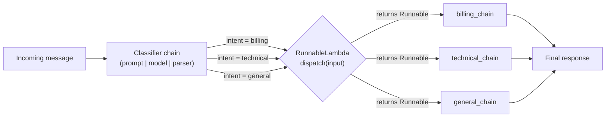

# Chapter 18: Advanced LCEL Patterns

> "Composition is the only scalability mechanism in software." — attributed to countless systems engineers, rediscovered independently by every generation

## Learning Objectives

By the end of this chapter, you will be able to:

- Subclass `Runnable` directly when `RunnableLambda` cannot express what you need — custom `.batch()` behavior, custom streaming, or internal state
- Wrap any chain with `RunnableWithMessageHistory` to get automatic, per-session conversation memory backed by a pluggable history store
- Build chains that pick a *different Runnable at invocation time* based on input, going beyond `RunnableBranch`'s static conditions
- Make a chain's model, prompt, or other parameters swappable **per invocation** using `.with_config()`, `.configurable_fields()`, and `.configurable_alternatives()`
- Compose retrievers, tools, and sub-chains into a single top-level Runnable that represents an entire RAG + tool-calling pipeline
- Recognize the recursion/self-reference pattern in LCEL, and identify the exact point where it strains the abstraction badly enough that you should reach for LangGraph instead
- Design a production-grade intent router as one composed, configurable, session-aware Runnable

---

## Prerequisites for This Chapter

This chapter assumes you've internalized **[Chapter 17: Common Mistakes & Pitfalls](./17-common-mistakes-and-pitfalls.md)**, and it leans heavily on two earlier chapters:

- **Chapter 6 (LCEL Fundamentals)** — you should be completely comfortable with the pipe operator, `RunnableSequence`, `RunnableParallel`, `RunnableLambda`, `RunnablePassthrough`, and `RunnableBranch`. Everything here is built on top of those primitives; we will not re-explain them.
- **Chapter 15 (Internals)** — you should understand that every `Runnable` implements the same small set of methods (`invoke`, `batch`, `stream`, `ainvoke`, `abatch`, `astream`), that composition via `|` produces a `RunnableSequence` whose `invoke` is just a loop calling each step's `invoke` in turn, and that the `config` object (with `callbacks`, `tags`, `configurable`, `run_name`, etc.) is threaded through every level of a chain automatically.

If either of those feels shaky, this chapter will be difficult to follow — the patterns below are precisely what happens when you take the primitives from Chapter 6 and combine them with the mechanical understanding from Chapter 15. Nothing here is a "new API surface" so much as a new way of arranging what you already know.

One framing to hold in your head throughout this chapter: LCEL's job is to let you describe a **static graph of Runnables** that gets executed once per call. Every pattern in this chapter pushes on that assumption in a different direction — custom execution semantics, external state, runtime-selected structure, runtime-selected parameters, and (in Section 6) actual control flow. The chapter ends exactly where that pushing stops being worth it.

---

## 1. Building a Fully Custom Runnable by Subclassing

### 1.1 Why `RunnableLambda` isn't always enough

`RunnableLambda` wraps a plain Python function and gives it the `Runnable` interface for free. That covers the overwhelming majority of custom logic you'll ever need. But `RunnableLambda`'s default `batch()` implementation just calls your function once per input in a loop (optionally in a thread pool) — it has no idea whether your function could serve a *batch* more efficiently (e.g., issuing one HTTP request for 20 items instead of 20 requests). Similarly, its default streaming behavior is to run the whole function to completion and then yield one final chunk — it cannot know how to yield intermediate output if your logic is capable of producing it incrementally.

Subclass `Runnable` directly when you need any of the following:

- **True batched execution** — a single network call, a single SQL query with an `IN (...)` clause, or a single vectorized NumPy/tensor operation serving many inputs at once, instead of N sequential calls.
- **Custom streaming semantics** — your step can genuinely produce partial output token-by-token or item-by-item, and you want `.stream()` on the whole chain to reflect that instead of blocking until your step finishes.
- **Internal state that must persist across the object's lifetime** — a connection pool, a cache, a rate limiter, or a counter that isn't appropriate to model as a config-time parameter.
- **Non-default `RunnableConfig` handling** — reading `config["configurable"]` for custom keys, propagating `config["callbacks"]` manually into a nested call, or supporting `config["max_concurrency"]` differently.

### 1.2 The minimal interface

At minimum you subclass `langchain_core.runnables.Runnable` and implement `invoke()`. The base class then synthesizes reasonable defaults for `batch()`, `stream()`, and the async variants from your synchronous `invoke()`. If you want better behavior for those, override them explicitly.

```python
from typing import Any, Iterator, List, Optional
from langchain_core.runnables import Runnable, RunnableConfig
from langchain_core.runnables.utils import Input, Output


class BatchedEmbeddingLookup(Runnable[str, List[float]]):
    """
    A custom Runnable that looks up (or computes) embeddings, but does so
    efficiently in batches instead of one HTTP call per input — something
    RunnableLambda's default .batch() cannot express, because it would
    call the wrapped function once per item.
    """

    def __init__(self, embedding_client, cache: Optional[dict] = None):
        self._client = embedding_client
        self._cache: dict = cache if cache is not None else {}

    def invoke(self, input: str, config: Optional[RunnableConfig] = None) -> List[float]:
        # Single-item path just delegates to the batch path for consistency.
        return self.batch([input], config=config)[0]

    def batch(
        self,
        inputs: List[str],
        config: Optional[RunnableConfig] = None,
        *,
        return_exceptions: bool = False,
        **kwargs: Any,
    ) -> List[List[float]]:
        # Split into cached vs. uncached, issue exactly ONE network call
        # for everything not already cached — this is the whole point of
        # subclassing instead of using RunnableLambda.
        to_fetch = [text for text in inputs if text not in self._cache]
        if to_fetch:
            fetched = self._client.embed_documents(to_fetch)
            for text, vector in zip(to_fetch, fetched):
                self._cache[text] = vector
        return [self._cache[text] for text in inputs]
```

Notice what changed: `batch()` is no longer "call `invoke()` N times." It looks at the *whole list* of inputs, dedupes against a cache, and issues a single underlying call for whatever remains. A chain built from `RunnableLambda(embed_one_at_a_time)` cannot do this — its `batch()` is mechanically defined as "map `invoke` over the list," full stop.

### 1.3 Custom streaming

If your step can genuinely produce output incrementally, override `stream()` (and `astream()` for the async path):

```python
class WordByWordFormatter(Runnable[str, str]):
    """
    Streams a formatted response one word at a time instead of returning
    the whole string in one final chunk — useful when a downstream
    consumer (e.g., a websocket to a UI) wants to render progressively
    even though this step itself is a pure, non-LLM transformation.
    """

    def invoke(self, input: str, config: Optional[RunnableConfig] = None) -> str:
        return input.strip()

    def stream(
        self,
        input: str,
        config: Optional[RunnableConfig] = None,
        **kwargs: Any,
    ) -> Iterator[str]:
        for word in input.strip().split(" "):
            yield word + " "
```

When this Runnable is composed inside a `RunnableSequence` with `|`, calling `.stream()` on the *whole chain* will call this step's `.stream()` rather than its `.invoke()`, letting the incremental output flow all the way through to the caller — exactly the mechanism you studied in Chapter 15 for how streaming propagates through a sequence.

### 1.4 When this is overkill

Don't reach for a full subclass just because a lambda "feels informal." If your function is a pure, cheap, one-input-to-one-output transformation with no batching win and no streaming story, `RunnableLambda` is simpler, has less surface area to maintain, and is what the next engineer will expect to see. Subclassing is justified by a genuine behavioral requirement (batching, streaming, state), not by preference for object-oriented style.

---

## 2. `RunnableWithMessageHistory`: Formalizing Conversation State

### 2.1 The problem it solves

Back in Chapters 2 and 4 you managed conversation history by hand: appending `HumanMessage`/`AIMessage` objects to a list and passing that list into the prompt on every call. That works, but it means every call site is responsible for (a) knowing which conversation it's continuing, (b) fetching the right history, (c) appending the new turn, and (d) persisting the updated history afterward. `RunnableWithMessageHistory` takes that bookkeeping out of the call site and pushes it into a wrapper around the chain.

The wrapper needs two things from you:

1. **The chain to wrap** — any Runnable whose prompt has a placeholder for history (typically a `MessagesPlaceholder`).
2. **A `get_session_history` function** — given a session identifier, returns a `BaseChatMessageHistory` object (an object that knows how to load and append messages for that specific session).

### 2.2 Worked example: in-memory history store

```python
from langchain_core.chat_history import BaseChatMessageHistory, InMemoryChatMessageHistory
from langchain_core.runnables.history import RunnableWithMessageHistory
from langchain_core.prompts import ChatPromptTemplate, MessagesPlaceholder
from langchain_core.output_parsers import StrOutputParser
from langchain_openai import ChatOpenAI

# 1. The underlying chain: a prompt with a history placeholder, a model, a parser.
prompt = ChatPromptTemplate.from_messages([
    ("system", "You are a concise, helpful support assistant."),
    MessagesPlaceholder(variable_name="history"),
    ("human", "{input}"),
])
model = ChatOpenAI(model="gpt-4o-mini")
base_chain = prompt | model | StrOutputParser()

# 2. A pluggable store: session_id -> BaseChatMessageHistory.
#    In production this would be backed by Redis, Postgres, DynamoDB, etc.
#    (Chapter 19 covers durable backends.) Here, a plain dict is enough
#    to demonstrate the mechanism.
_session_store: dict[str, BaseChatMessageHistory] = {}

def get_session_history(session_id: str) -> BaseChatMessageHistory:
    if session_id not in _session_store:
        _session_store[session_id] = InMemoryChatMessageHistory()
    return _session_store[session_id]

# 3. Wrap the chain.
chain_with_history = RunnableWithMessageHistory(
    base_chain,
    get_session_history,
    input_messages_key="input",
    history_messages_key="history",
)
```

Calling it now looks like this:

```python
response_1 = chain_with_history.invoke(
    {"input": "My order #4471 hasn't arrived."},
    config={"configurable": {"session_id": "user-882"}},
)

response_2 = chain_with_history.invoke(
    {"input": "It was supposed to ship five days ago."},
    config={"configurable": {"session_id": "user-882"}},
)
```

The second call's prompt automatically includes the first turn as prior history — `RunnableWithMessageHistory` fetched `user-882`'s history object, read whatever was stored, injected it into the `history` placeholder, ran the chain, and then **appended both the human input and the AI output back into that same history object** after the call completed. None of that bookkeeping lives at the call site anymore.

### 2.3 What's actually happening under the hood

`RunnableWithMessageHistory` is itself a `Runnable` — it composes around your chain rather than replacing it. Conceptually, its `invoke()` does:

```python
def invoke(self, input, config):
    session_id = config["configurable"]["session_id"]
    history = self.get_session_history(session_id)

    full_input = {**input, self.history_messages_key: history.messages}
    output = self.bound_chain.invoke(full_input, config)

    history.add_user_message(input[self.input_messages_key])
    history.add_ai_message(output)  # or however the output maps to a message
    return output
```

This is a simplified sketch, but the shape is exact: **read history in, run the wrapped chain, write history out.** It is precisely the manual pattern from Chapter 2/4, lifted into a reusable wrapper so you write it once instead of at every call site.

### 2.4 The `session_id` requirement

`RunnableWithMessageHistory` requires `session_id` (or whatever keys your `get_session_history` function's signature declares) to be passed via `config["configurable"]`, not via the input dict. This is a deliberate design choice: `config` represents *how this call should be executed* (which session, which callbacks, which run name), while the input dict represents *what data flows through the chain*. Conflating the two — for example, trying to pass `session_id` inside the input payload — is a common source of confusion covered further in Section 8.

### 2.5 Multi-key history (user + conversation)

Real systems sometimes need history scoped by more than one dimension — e.g., both `user_id` and `conversation_id`. `get_session_history` can accept multiple parameters, and you declare them via `history_factory_config`:

```python
from langchain_core.runnables import ConfigurableFieldSpec

def get_session_history(user_id: str, conversation_id: str) -> BaseChatMessageHistory:
    key = f"{user_id}:{conversation_id}"
    if key not in _session_store:
        _session_store[key] = InMemoryChatMessageHistory()
    return _session_store[key]

chain_with_history = RunnableWithMessageHistory(
    base_chain,
    get_session_history,
    input_messages_key="input",
    history_messages_key="history",
    history_factory_config=[
        ConfigurableFieldSpec(
            id="user_id",
            annotation=str,
            name="User ID",
            description="Unique identifier for the user.",
            default="",
            is_shared=True,
        ),
        ConfigurableFieldSpec(
            id="conversation_id",
            annotation=str,
            name="Conversation ID",
            description="Unique identifier for the conversation thread.",
            default="",
            is_shared=True,
        ),
    ],
)
```

Both fields must now be supplied via `config["configurable"]` on every call.

---

## 3. Dynamic Chain Construction: Runtime Routing Beyond `RunnableBranch`

### 3.1 The limitation of `RunnableBranch`

`RunnableBranch` (Chapter 6) evaluates a fixed, ordered list of `(condition, runnable)` pairs at **construction time** — you hand it the exact set of conditions and target chains up front, and it picks among them at invocation time. That's static routing: the *set* of possible destinations is fixed when you build the chain; only *which one* gets picked varies per call.

Dynamic chain construction goes one step further: a `RunnableLambda` can return **an entirely different Runnable object**, constructed on the fly, and LCEL will execute whatever comes back. The set of possible destinations doesn't have to be enumerated as a fixed branch list — it can be computed, looked up, or even built fresh each call.

### 3.2 The mechanism

This works because of a rule you learned in Chapter 15: if a `RunnableLambda`'s wrapped function returns a `Runnable` instance, LCEL detects this and **invokes the returned Runnable with the same input**, rather than treating it as a literal return value. This is the load-bearing detail that makes dynamic dispatch possible:

```python
from langchain_core.runnables import RunnableLambda

def route(input: dict):
    intent = input["intent"]
    if intent == "billing":
        return billing_chain      # a Runnable — will be invoked automatically
    elif intent == "technical":
        return technical_chain    # a Runnable — will be invoked automatically
    else:
        return general_chain      # a Runnable — will be invoked automatically

router = RunnableLambda(route)
```

`router.invoke({"intent": "billing", "message": "..."})` calls `route(...)`, gets back `billing_chain`, and then LCEL invokes `billing_chain` with the *original input dict* — not with the `billing_chain` object itself as some kind of literal payload. This is the crucial difference from `RunnableBranch`: the destination isn't chosen from a hand-authored, exhaustive branch list validated at construction time — it's computed by arbitrary Python code, which means it can look up a chain from a registry, build one dynamically from a template, or even select a chain an LLM classifier just decided on.

### 3.3 Dispatch driven by an LLM classifier

This is the pattern that matters most in production: a first LLM call classifies intent, and the classification result selects which of several differently-prompted chains handles the actual response.

```python
from langchain_core.prompts import ChatPromptTemplate
from langchain_core.output_parsers import StrOutputParser
from langchain_core.runnables import RunnableLambda, RunnablePassthrough

classifier_prompt = ChatPromptTemplate.from_template(
    "Classify the user's message into exactly one category: "
    "billing, technical, or general. Respond with only the category word.\n\n"
    "Message: {message}"
)
classifier_chain = classifier_prompt | model | StrOutputParser()

def dispatch(input: dict):
    category = input["intent"].strip().lower()
    return {
        "billing": billing_chain,
        "technical": technical_chain,
    }.get(category, general_chain)

full_router = (
    RunnablePassthrough.assign(intent=classifier_chain)
    | RunnableLambda(dispatch)
)
```

`RunnablePassthrough.assign(intent=classifier_chain)` (Chapter 6) runs the classifier and merges its output into the input dict under the `intent` key, without dropping the original `message` field. `RunnableLambda(dispatch)` then reads that `intent` key and returns the matching sub-chain, which is invoked with the same enriched dict. One top-level `.invoke()` call now performs classification *and* dispatch *and* generation, entirely inside LCEL's execution model.

### 3.4 `.configurable_alternatives()` as a declarative alternative

Section 3.3's `dispatch()` function makes the routing decision *from data in the input* at every call. `.configurable_alternatives()` (covered in depth in Section 4) solves a related but distinct problem: letting the **caller** pick among pre-registered alternatives via `config`, rather than having the chain's own logic decide from the payload. Use dynamic-lambda dispatch when the decision depends on the content of the request (classification, feature flags evaluated against payload fields); use `configurable_alternatives` when the decision is an operational knob the caller sets explicitly (which model tier, which prompt version).

---

## 4. Runtime Configuration: `.with_config()`, `.configurable_fields()`, `.configurable_alternatives()`

### 4.1 The problem: construction-time vs. invocation-time parameters

By default, once you build `prompt | model | parser`, the `model` object's parameters (temperature, model name, etc.) are baked in at construction time. If a caller wants `gpt-4o-mini` for one request and `gpt-4o` for another, the naive approach is building two separate chains — which duplicates the prompt and parser wiring for no good reason. LangChain Core solves this by letting you mark specific fields as **configurable**, so a value can be overridden per call via the `config` argument to `.invoke()`, without touching how the chain was constructed.

### 4.2 `.with_config()`: binding config values without touching input

The simplest tool is `.with_config()`, which returns a new Runnable pre-bound to certain config values (tags, run name, `max_concurrency`, callbacks, or `configurable` values) — useful for setting defaults or for attaching metadata to a specific chain instance without threading it through every `.invoke()` call:

```python
tagged_chain = base_chain.with_config(
    {"run_name": "support-router", "tags": ["production", "v2"]}
)
```

### 4.3 `.configurable_fields()`: exposing a construction parameter as a runtime knob

```python
from langchain_core.runnables import ConfigurableField
from langchain_openai import ChatOpenAI

model = ChatOpenAI(model="gpt-4o-mini", temperature=0).configurable_fields(
    model=ConfigurableField(
        id="model_name",
        name="Model Name",
        description="Which chat model to use for this request.",
    ),
    temperature=ConfigurableField(
        id="model_temperature",
        name="Temperature",
        description="Sampling temperature for this request.",
    ),
)

chain = prompt | model | StrOutputParser()
```

Now any caller can override those fields per invocation:

```python
# Uses the default: gpt-4o-mini, temperature 0
result_default = chain.invoke({"message": "..."})

# Overrides both fields for just this call
result_override = chain.invoke(
    {"message": "..."},
    config={"configurable": {"model_name": "gpt-4o", "model_temperature": 0.7}},
)
```

Nothing about the chain's structure changed between these two calls — the same `chain` object serves both, and the override lives entirely in the `config` dict passed at invocation time. This is exactly the mechanism named in the chapter brief: a caller passing `config={"configurable": {"model_name": "gpt-4o-mini"}}` to override the default model per request.

### 4.4 `.configurable_alternatives()`: swapping the whole component, not just a field

`.configurable_fields()` tweaks parameters *of* a component (same `ChatOpenAI` instance, different `temperature`). `.configurable_alternatives()` swaps in an entirely different **component** — useful when the alternatives aren't just different parameter values but genuinely different objects (a different model provider, a different prompt template, a different retriever):

```python
from langchain_core.runnables import ConfigurableField
from langchain_anthropic import ChatAnthropic
from langchain_openai import ChatOpenAI

model = ChatOpenAI(model="gpt-4o-mini", temperature=0).configurable_alternatives(
    ConfigurableField(id="llm_provider"),
    default_key="openai_mini",
    openai_full=ChatOpenAI(model="gpt-4o", temperature=0),
    anthropic=ChatAnthropic(model="claude-sonnet-4-5", temperature=0),
)

chain = prompt | model | StrOutputParser()

# Default path: openai_mini
chain.invoke({"message": "..."})

# Explicitly route this one call to Anthropic instead
chain.invoke(
    {"message": "..."},
    config={"configurable": {"llm_provider": "anthropic"}},
)
```

This same mechanism works for prompts, retrievers, or any other Runnable component — a common production use is swapping between a "conservative" system prompt and an "experimental" one behind a feature flag, purely via `config`, without deploying a code change or maintaining two parallel chain objects.

### 4.5 Where the override actually lives

It's worth being precise about what changes and what doesn't, since this trips people up (see Chapter 17's discussion of config vs. input confusion, revisited here):

| What you want to vary | Mechanism | Where the value is supplied |
|---|---|---|
| A parameter of an existing component (temperature, model name string) | `.configurable_fields()` | `config["configurable"][field_id]` |
| The component itself (swap `ChatOpenAI` for `ChatAnthropic`, swap prompt templates) | `.configurable_alternatives()` | `config["configurable"][alternatives_id]` |
| Which sub-chain runs, based on the payload's *content* | Dynamic `RunnableLambda` dispatch (Section 3) | Computed from the input dict, not from `config` |
| Per-call metadata (tags, run name, callbacks) | `.with_config()` or the `config` kwarg directly | `config["tags"]`, `config["run_name"]`, etc. |

The distinction between "varies by payload content" (Section 3) and "varies by operator/caller intent" (Section 4) is the difference between routing and configuration — both use `RunnableConfig`-adjacent machinery, but they answer different questions.

---

## 5. Composing a "Mega-Runnable": RAG + Tool-Calling as One Unit

Individually, a retriever, a set of tools, and an LLM chain are each just Runnables (or tool objects with a `Runnable`-compatible interface). The payoff of LCEL's uniform interface is that an entire pipeline — retrieve context, decide whether a tool call is needed, call the tool, fold the result back in, generate a final answer — can be expressed as **one composed Runnable** that supports `.invoke()`, `.batch()`, and `.stream()` like any of its parts.

```python
from langchain_core.runnables import RunnableLambda, RunnablePassthrough
from langchain_core.output_parsers import StrOutputParser
from langchain_core.prompts import ChatPromptTemplate

# Assume `retriever` is a Runnable (e.g., from a vector store, Chapter 9-11)
# and `lookup_order_status` is a @tool-decorated function (Chapter 13-style tools).

def format_docs(docs) -> str:
    return "\n\n".join(d.page_content for d in docs)

def maybe_call_tool(input: dict) -> dict:
    """
    Decides, from the classified intent, whether a tool call is needed
    before generation. This keeps the tool-invocation decision inside
    the same Runnable graph instead of pushed out to caller code.
    """
    if input["intent"] == "order_status" and input.get("order_id"):
        tool_result = lookup_order_status.invoke({"order_id": input["order_id"]})
        return {**input, "tool_result": tool_result}
    return {**input, "tool_result": None}

answer_prompt = ChatPromptTemplate.from_template(
    "Context:\n{context}\n\n"
    "Tool result (if any): {tool_result}\n\n"
    "Question: {question}\n\n"
    "Answer using the context and tool result if present."
)

rag_and_tools_chain = (
    RunnablePassthrough.assign(
        context=(lambda x: x["question"]) | retriever | format_docs,
    )
    | RunnableLambda(maybe_call_tool)
    | answer_prompt
    | model
    | StrOutputParser()
)
```

Walking through what a single `rag_and_tools_chain.invoke(...)` call does:

1. `RunnablePassthrough.assign(context=...)` runs the retriever against the question and merges formatted context into the dict, while keeping every original key (`question`, `intent`, `order_id`) intact — the assign-and-merge pattern from Chapter 6, now composing a retriever instead of a plain function.
2. `RunnableLambda(maybe_call_tool)` inspects the (already-classified, in this example, upstream) intent and conditionally invokes a tool, merging its result back into the same dict.
3. The prompt consumes `context`, `tool_result`, and `question` together.
4. The model generates a final answer, and the parser extracts plain text.

The entire pipeline — retrieval, conditional tool use, and generation — is one object. It streams token-by-token from the final LLM call, can be batched across many questions, can be configured with `.configurable_alternatives()` for the model (Section 4), and can be wrapped in `RunnableWithMessageHistory` (Section 2) if it needs to be conversational. This composability is the entire value proposition of LCEL: none of those capabilities had to be re-implemented for the composite chain — they were inherited automatically from the parts.

---

## 6. Recursion and Self-Referential Chains — and Where LCEL Starts to Strain

### 6.1 The pattern

Sometimes a single pass isn't enough: you want a chain to critique and refine its own output, or keep retrying a sub-task until some condition is met. The most direct way to express "run this chain again with adjusted input" inside LCEL is a `RunnableLambda` with an internal loop:

```python
def refine_until_good(input: dict, max_iterations: int = 3) -> str:
    draft = writer_chain.invoke(input)
    for _ in range(max_iterations):
        critique = critic_chain.invoke({"draft": draft})
        if critique["verdict"] == "good":
            break
        draft = writer_chain.invoke({**input, "feedback": critique["feedback"]})
    return draft

self_refining_chain = RunnableLambda(refine_until_good)
```

This works, and for a small, fixed number of iterations with simple pass/fail logic, it's a perfectly reasonable use of `RunnableLambda` — you are, after all, "just" wrapping a plain Python function, and plain Python functions are allowed to contain loops.

### 6.2 Where it starts to strain

The trouble begins as soon as the loop needs any of the following, which is almost immediately in real agentic systems:

- **Branching control flow with more than two outcomes** (retry, escalate to a human, call a different tool, give up and return a partial answer) — the `if/elif/else` inside your lambda starts to look like a state machine you're maintaining by hand in Python control flow, not in any framework-visible structure.
- **Persisted, inspectable intermediate state** — LCEL's tracing (Chapter 16-adjacent observability tooling) sees the lambda as one opaque step. Every intermediate `draft` and `critique` inside the loop is invisible to LangSmith/callbacks unless you manually instrument each iteration yourself.
- **Resumability** — if the process crashes after iteration 2 of 3, there is no framework-native way to resume from the saved state; you'd have to build your own checkpointing around the loop.
- **Cycles that vary in shape depending on runtime results** — e.g., a tool-calling agent loop where the *number and order* of tool calls isn't known ahead of time and depends on what the model decides at each step. Modeling this as nested conditionals inside one Python function becomes a maintenance burden fast: every new "what if the model wants to call two tools before answering" case is another branch bolted onto the same lambda.
- **Human-in-the-loop pauses** — the loop has to genuinely suspend, wait for external input, and resume later. A `for` loop inside a synchronous function cannot suspend across a request boundary without significant custom machinery (queues, background workers, resumable state serialization).

None of this is *impossible* in LCEL — Python can express any control flow. The problem is that LCEL's abstraction (a declarative pipe-composed graph, transparent to tracing and streaming) is being asked to host something LCEL was never designed to represent: **a graph with cycles, explicit state, and conditional edges decided at runtime.** Once you're manually threading a state dict through a hand-written loop, catching exceptions to decide whether to retry, and writing your own logging around each iteration just to see what happened, you have — in effect — reimplemented a graph execution engine, badly, inside a single Python function.

### 6.3 The honest signal

A useful rule of thumb: if you find yourself writing a `while` loop or recursive function inside a `RunnableLambda` that calls back into *chains built with LCEL themselves*, and that loop has more than one exit condition, that is the signal. It means what you actually want is explicit graph structure — nodes, edges, conditional edges, and a shared, typed state object that a framework tracks for you, with built-in support for cycles, persistence, and interruption. That is precisely what **LangGraph** (Chapter 20) is built for: the same Runnable-compatible building blocks you've learned in this course, but assembled into a graph where cycles, branching, and state are first-class, framework-visible concepts instead of a Python `for` loop hidden inside a lambda. This chapter's Section 6 is deliberately the last stop before that: everything up to here is comfortably inside LCEL's design center; genuine multi-step agentic looping is the boundary where reaching for a different tool stops being optional.

---

## 7. Worked Example: A Customer-Support Intent Router

Let's assemble Sections 2–4 into the pattern the chapter brief asks for directly: a router that classifies an incoming support message as `billing`, `technical`, or `general`, dispatches to three differently-prompted sub-chains, and does it all as a single top-level Runnable.

### 7.1 The three sub-chains

```python
from langchain_core.prompts import ChatPromptTemplate
from langchain_core.output_parsers import StrOutputParser
from langchain_openai import ChatOpenAI

model = ChatOpenAI(model="gpt-4o-mini", temperature=0)

billing_prompt = ChatPromptTemplate.from_messages([
    ("system", "You are a billing support specialist. Be precise about "
               "charges, refunds, and invoices. Ask for an order or invoice "
               "number if one isn't provided."),
    ("human", "{message}"),
])
billing_chain = billing_prompt | model | StrOutputParser()

technical_prompt = ChatPromptTemplate.from_messages([
    ("system", "You are a technical support engineer. Diagnose the issue "
               "step by step and ask for logs or error messages if useful."),
    ("human", "{message}"),
])
technical_chain = technical_prompt | model | StrOutputParser()

general_prompt = ChatPromptTemplate.from_messages([
    ("system", "You are a friendly general support agent. Answer helpfully "
               "and route the user to the right team if you cannot help."),
    ("human", "{message}"),
])
general_chain = general_prompt | model | StrOutputParser()
```

### 7.2 The classifier

```python
classifier_prompt = ChatPromptTemplate.from_template(
    "Classify the following support message into exactly one category: "
    "billing, technical, or general. Respond with only the single word.\n\n"
    "Message: {message}"
)
classifier_chain = classifier_prompt | model | StrOutputParser()
```

### 7.3 The dispatcher and the top-level Runnable

```python
from langchain_core.runnables import RunnableLambda, RunnablePassthrough

def dispatch(input: dict):
    category = input["intent"].strip().lower()
    return {
        "billing": billing_chain,
        "technical": technical_chain,
        "general": general_chain,
    }.get(category, general_chain)  # unknown/unexpected labels fall back safely

support_router = (
    RunnablePassthrough.assign(intent=classifier_chain)
    | RunnableLambda(dispatch)
)
```

`support_router` is now a single Runnable. Calling `support_router.invoke({"message": "I was charged twice for my subscription"})` runs the classifier, gets back `"billing"`, and dispatches to `billing_chain` — all inside one `.invoke()` call, one `.stream()` call, or one `.batch()` call across many messages at once.

### 7.4 Mermaid diagram: the dynamic-routing pattern



The key detail the diagram captures: `dispatch()` doesn't itself generate the response — it **returns a Runnable**, and LCEL invokes that returned Runnable with the original input. The classifier and the dispatcher are separate steps; the dispatcher's only job is to choose *which* fully-formed sub-chain handles this request.

### 7.5 Adding runtime-configurable models (Section 4) on top

Because `support_router` is built entirely from ordinary Runnables, nothing stops you from making the underlying model swappable per call, exactly as in Section 4.3 — just build `model` with `.configurable_fields()` before wiring the prompts to it, and every sub-chain inherits the override automatically:

```python
from langchain_core.runnables import ConfigurableField

model = ChatOpenAI(model="gpt-4o-mini", temperature=0).configurable_fields(
    model=ConfigurableField(id="model_name"),
)
# billing_prompt | model | StrOutputParser(), etc. — unchanged from above

support_router.invoke(
    {"message": "My API integration keeps returning 500 errors"},
    config={"configurable": {"model_name": "gpt-4o"}},
)
```

The classifier, all three sub-chains, and the final answer generation all use whichever model the caller specified for that request — no branching logic anywhere had to know about the override; it flows through `config` automatically, exactly as Chapter 15 described.

---

## Real-World Scenario

A mid-sized SaaS company's platform team set out to build an "agentic troubleshooting assistant" entirely in LCEL. The first version was exactly the router pattern from Section 7 — classify, dispatch, answer — and it worked well. Encouraged, the team then tried to extend it into a genuine multi-step agent: given a customer's technical issue, the assistant should (1) search the knowledge base, (2) decide if it needs to run a diagnostic tool, (3) run zero or more tools depending on what the first tool returned, (4) ask the customer a clarifying question if the tool results were ambiguous, (5) loop back to step 2 if new information came in, and (6) only then compose a final answer.

They implemented this as a single large `RunnableLambda` containing a `while` loop, a hand-rolled state dictionary (`state = {"tool_calls": [], "kb_results": [], "pending_question": None, ...}`) threaded through every iteration, and a set of nested `if/elif` branches to decide what to do next based on the current state. To support "ask a clarifying question and wait for the customer's reply," they had to serialize the state dict to a database row, return early, and write a second entry point that could deserialize it and resume the loop — essentially building a bespoke, undocumented state machine runtime by hand.

Within two months, the function had grown past 300 lines, tracing showed only one opaque "step" in LangSmith for the entire multi-turn interaction (making debugging painful — nobody could see which tool call happened when without adding manual logging at every branch), and every new requirement ("what if the KB search returns nothing," "what if the customer says 'never mind'," "what if two tools both want to run") meant carefully editing deeply nested conditionals without breaking the existing paths. Onboarding a new engineer to the function took a full day because the control flow lived entirely in imperative Python rather than in any structure a diagram or the framework could show.

The team's own retrospective diagnosis: they had built a graph — nodes (KB search, tool calls, clarification, answer composition), edges (which step follows which), and shared state (accumulated tool results, pending questions) — and then hidden that graph inside a single Python function instead of representing it explicitly. Once they re-implemented the same behavior in **LangGraph** (Chapter 20), each step became an explicit node, the looping and conditional paths became explicit edges (including a real cycle back to "call another tool"), the state became a typed, framework-tracked object instead of an ad hoc dict, and the "wait for the customer" pause became native support for interrupting and resuming a graph run — instead of a bespoke serialize-to-a-database-row hack. Tracing improved immediately, because LangGraph surfaces each node's execution individually rather than collapsing the whole loop into one opaque lambda call.

**Lesson:** LCEL is superb at expressing pipelines — sequences, fan-outs, and even runtime-selected branches. It is the wrong tool for expressing a control loop with cycles, persisted state, and mid-run interruption. The moment your `RunnableLambda` starts looking like a hand-written interpreter for a state machine, that is the signal to stop extending it and move the same logic into LangGraph, where cycles and state are first-class rather than smuggled in through Python control flow.

---

## Best Practices

- **Prefer `RunnableLambda` until you have a concrete reason to subclass `Runnable`.** Subclass only when you need real batching, real streaming, or persistent internal state — not for stylistic preference.
- **Keep `RunnableWithMessageHistory`'s `get_session_history` function cheap and side-effect-free beyond storage lookup** — it may be called on every single invocation, including retries.
- **Treat `config["configurable"]` as the channel for operator/caller intent (which model, which session, which prompt variant), and the input dict as the channel for request data.** Mixing the two is a common source of the config/input confusion flagged in Chapter 17.
- **Use `.configurable_alternatives()` for swapping whole components (models, prompts, retrievers) and `.configurable_fields()` for tweaking parameters of an existing component** — pick based on whether the alternatives are genuinely different objects or just different values.
- **Reserve dynamic `RunnableLambda` dispatch for decisions driven by request content** (classification results, payload fields); reserve `.configurable_alternatives()` for decisions driven by the caller's operational choice.
- **Give every meaningful sub-chain a `run_name` via `.with_config()`** so tracing tools show which branch actually executed for a given request — this matters enormously once you have three or more sub-chains behind a router.
- **Treat any loop inside a `RunnableLambda` as provisional** — fine for a fixed, small number of iterations with simple exit conditions; a signal to move to LangGraph the moment the loop needs more than one exit condition, persisted state across turns, or mid-run interruption.

---

## Common Mistakes

- **Subclassing `Runnable` when `RunnableLambda` would do.** This adds boilerplate (implementing `invoke`, managing `Input`/`Output` generics) without any behavioral benefit, and makes the code harder for teammates to reason about than a plain function.
- **Forgetting to pass `session_id` (or your custom key) via `config["configurable"]`** when calling a chain wrapped in `RunnableWithMessageHistory` — this raises an error or silently resolves to an unintended default session, depending on how `get_session_history` is written.
- **Assuming a returned Runnable from a `RunnableLambda` is invoked with a different input than what the lambda received.** It is invoked with the *same* input the lambda was given — if your dispatch function needs to transform the payload before handing it to the target chain, that transformation must happen inside the target chain (or a preceding step), not implicitly.
- **Mixing up `.configurable_fields()` and `.configurable_alternatives()`.** Using fields to try to swap an entire model class, or alternatives to try to tweak a single numeric parameter, works against the grain of each API and produces confusing configuration surfaces.
- **Letting a `RunnableLambda` loop grow past a small, fixed iteration count with simple exit logic.** Once branching, persisted cross-turn state, or mid-run pauses enter the picture, continuing to extend the lambda (rather than moving to LangGraph) produces exactly the unmaintainable state machine described in the Real-World Scenario.
- **Building a "mega-Runnable" without giving each stage a `run_name` or tag.** As the composed chain grows (retriever + tool call + generation), untagged tracing makes it very hard to tell which stage failed or was slow.
- **Assuming `.configurable_alternatives()` overrides propagate to sub-chains built *before* the configurable component was defined.** The configurable field/alternative must be part of the object that's actually wired into the prompt/chain — building `model` with `.configurable_fields()` after already composing it into a chain elsewhere won't retroactively apply.

---

## Summary

- When `RunnableLambda` can't express the behavior you need — genuine batched execution, genuine incremental streaming, or persistent internal state — subclass `Runnable` directly and override `invoke()`, `batch()`, and/or `stream()` deliberately.
- `RunnableWithMessageHistory` formalizes the manual history-management pattern from Chapters 2 and 4: it wraps any chain, reads history in via a pluggable `get_session_history` function keyed by `session_id` (or a custom multi-key scheme), runs the chain, and writes the new turn back out — automatically, on every call.
- Dynamic chain construction — a `RunnableLambda` that **returns a different Runnable** based on input — goes beyond `RunnableBranch`'s static condition list, and is the natural mechanism for LLM-classified intent routing: classify, then dispatch to whichever sub-chain the classification selects.
- `.with_config()`, `.configurable_fields()`, and `.configurable_alternatives()` make construction-time choices (model, temperature, prompt variant) overridable **per invocation** via `config["configurable"]`, without rebuilding or duplicating the chain.
- Retrievers, tools, and sub-chains can all be composed into one top-level "mega-Runnable" representing an entire RAG-plus-tool-calling pipeline — inheriting `.invoke()`, `.batch()`, and `.stream()` automatically from its parts, with no extra plumbing.
- A `RunnableLambda` containing an internal loop can express simple, fixed-iteration self-refinement — but genuine multi-step agentic looping (branching control flow, persisted cross-turn state, mid-run interruption) strains LCEL's abstraction past its design center. That exact strain is what **LangGraph** (Chapter 20) exists to resolve with explicit nodes, edges, and state.
- The customer-support intent router (Section 7) demonstrates the whole toolkit together: a classifier chain, a dynamic dispatcher choosing among three differently-prompted sub-chains, and (optionally) a runtime-configurable model — all as one composed, traceable Runnable.

---

## Knowledge Check

1. You need a custom step that issues one batched embedding API call for a list of 50 inputs instead of 50 separate calls. Why does `RunnableLambda`'s default `.batch()` fail to give you this, and what specifically must you override on a `Runnable` subclass to fix it?
2. Explain, in terms of what happens to `history_messages_key` and `input_messages_key`, exactly what `RunnableWithMessageHistory` does to the input dict before calling the wrapped chain, and what it does to the history store afterward.
3. Why must `session_id` be passed through `config["configurable"]` rather than as a field in the input dictionary? What principle about `config` vs. input does this reflect?
4. Describe the mechanism that makes `RunnableLambda(dispatch)`-style dynamic routing work: what does LCEL do differently when a wrapped function's return value is itself a `Runnable`, versus a plain value?
5. Give one example where you'd choose `.configurable_fields()` over `.configurable_alternatives()`, and one example where you'd choose the reverse. What's the underlying distinction driving the choice?
6. A teammate has built a `RunnableLambda` with a `while` loop implementing a multi-step agent, complete with a hand-maintained state dictionary and several nested `if/elif` branches for deciding the next action. List at least three concrete symptoms from this chapter's Real-World Scenario that indicate this logic should move to LangGraph, and explain what LangGraph would represent explicitly that the lambda currently hides.

---

## Hands-On Exercise

Build the customer-support intent router from Section 7, then wrap it with conversation memory, so it behaves as a single, session-aware, composed Runnable.

**Tasks:**

1. Implement the three sub-chains (`billing_chain`, `technical_chain`, `general_chain`), each with a distinctly different system prompt reflecting its specialty, as in Section 7.1.
2. Implement `classifier_chain` (Section 7.2) and the `dispatch()` function plus `support_router` (Section 7.3), combining them into one top-level Runnable via `RunnablePassthrough.assign(intent=classifier_chain) | RunnableLambda(dispatch)`.
3. Give each of the three sub-chains a distinct prompt that also incorporates a `MessagesPlaceholder("history")`, so the router can carry conversation context across turns within a category.
4. Wrap `support_router` in `RunnableWithMessageHistory`, using an in-memory `get_session_history` function keyed by `session_id`, so that a multi-turn conversation ("I was double-charged" → "yes, order #4471" → "when will the refund process?") stays coherent across calls to the same session.
5. Make the underlying `model` configurable via `.configurable_fields()` for `model` (name) and `temperature`, and confirm — by tracing through the composition in your head, since you should not execute code for this exercise — that a `config={"configurable": {"model_name": ..., "session_id": ...}}` override on a single `.invoke()` call correctly threads both the session lookup and the model override through every sub-chain without any sub-chain needing to know about either mechanism explicitly.
6. **Bonus (design-only, no code):** Sketch, in prose or a Mermaid diagram, what would have to change if you wanted the router to also decide — based on the technical sub-chain's response — whether to loop back and call a diagnostic tool, and then loop back to the classifier again if the tool result suggests a different category. Identify which part of this new requirement is the one Section 6 warns strains LCEL's abstraction, and explain why.

---

## Further Reading

- [LangChain Python API Reference — `Runnable`](https://python.langchain.com/api_reference/core/runnables/langchain_core.runnables.base.Runnable.html) — the full base class interface for subclassing
- [LangChain Python API Reference — `RunnableWithMessageHistory`](https://python.langchain.com/api_reference/core/runnables/langchain_core.runnables.history.RunnableWithMessageHistory.html) — official reference for session-scoped conversation memory
- [LangChain Documentation — Configurable Runnables (`configurable_fields` / `configurable_alternatives`)](https://python.langchain.com/docs/how_to/configure/) — the canonical how-to guide for runtime configuration
- [LangChain Documentation — Dynamically Route Logic Based on Input](https://python.langchain.com/docs/how_to/routing/) — official coverage of both `RunnableBranch` and lambda-based dynamic routing
- [LangChain Python API Reference — `RunnableLambda`](https://python.langchain.com/api_reference/core/runnables/langchain_core.runnables.base.RunnableLambda.html) — details on how returned Runnables are detected and invoked
- **Chapter 20: LangGraph Fundamentals** (this course) — where the cyclical, stateful patterns hinted at in Section 6 are given a proper, explicit representation

---

<div style="display:flex;justify-content:space-between;align-items:center;">
  <a href="./17-common-mistakes-and-pitfalls.md">← Previous: Common Mistakes & Pitfalls</a>
  <a href="./00-index.md">🏠 Index</a>
  <a href="./19-production-deployment.md">Next: Production Deployment →</a>
</div>
