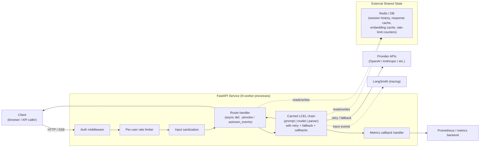

# Chapter 19: Production Deployment

> "In theory, there is no difference between theory and practice. In practice, there is." — often attributed to Yogi Berra

## Learning Objectives

By the end of this chapter, you will be able to:

- Wire a cached, pre-built LCEL chain into a FastAPI application using `async def` routes and `.ainvoke()`, without rebuilding the chain on every request
- Implement a fully working `/chat/stream` endpoint that turns `.astream_events()` output into a Server-Sent Events (SSE) `StreamingResponse`
- Write deterministic unit tests for LangChain-based services using a fake `BaseChatModel`, and gate real-provider smoke tests behind an environment flag
- Apply the security controls a production LLM service needs: API key handling, per-user rate limiting, and input/output sanitization around prompt injection
- Reason about statelessness, connection pooling, and why conversation history must live in an external store once you run more than one worker process
- Export LangChain callback events as Prometheus-style metrics (latency histograms, token counters, error rates) and understand how this complements LangSmith tracing
- Add a response-cache and embedding-cache layer to cut cost and latency for repeated requests
- Assemble a pre-deployment checklist covering containerization, health checks, and graceful shutdown for streaming responses

---

## Prerequisites for This Chapter

This chapter builds directly on **[Chapter 18: Advanced LCEL Patterns](./18-advanced-lcel-patterns.md)**, where you learned:

- How to compose branching, dynamic, and self-correcting chains using `RunnableBranch`, `RunnableLambda`, and custom fallback logic
- How `RunnableWithMessageHistory` attaches conversation state to a chain via a `get_session_history` callback
- How retry and fallback runnables (`.with_retry()`, `.with_fallbacks()`) harden a chain against transient provider failures

Everything up to this point in the course has focused on **building** correct, well-composed LCEL chains — parsers, prompts, retrieval, memory, retries, structured output. This chapter is where all of that gets **shipped**. We take a chain built in earlier chapters, wrap it in a FastAPI service, and work through everything that stands between "it works when I call `.invoke()` in a notebook" and "it survives real users, real load, and a 3 a.m. pager alert." This chapter also draws on two earlier building blocks by name: `.ainvoke()` (**Chapter 13: Async & Concurrency**) and `.astream_events()` (**Chapter 12: Streaming**) — if either feels rusty, a one-paragraph recap is given inline before each is used.

No new installation is required beyond what you already have: `langchain-core`, a model integration package (e.g., `langchain-openai`), and `fastapi` + `uvicorn`. As stated in this course's ground rules, code in this chapter is presented for careful reading and reasoning, not executed live — treat every snippet as a design artifact you would paste into a real project and adapt.

---

## 1. Wiring an LCEL Chain into FastAPI

### 1.1 The core mistake to avoid: rebuilding the chain per request

An LCEL chain — a prompt template, a chat model client, and an output parser piped together — is **expensive to construct** relative to how cheap it is to *use*. Constructing a chat model client typically means creating an HTTP client, resolving auth headers, and setting up connection pools (Section 5). If you build that chain fresh inside your route handler:

```python
# DON'T DO THIS
@app.post("/chat")
async def chat(request: ChatRequest):
    llm = ChatOpenAI(model="gpt-4o-mini")          # new client per request!
    prompt = ChatPromptTemplate.from_template(...)  # rebuilt every time
    chain = prompt | llm | StrOutputParser()
    return {"answer": await chain.ainvoke({"question": request.question})}
```

you pay client-construction cost on every single request, and — worse — you likely open a fresh HTTP connection pool per request instead of reusing one, defeating the entire point of pooling (Section 5.2). The chain itself is **stateless and thread-safe** once built (it holds no per-request mutable state), so it should be built **once**, at application startup, and reused across every request and every worker thread.

### 1.2 Building the chain once, at startup

FastAPI's `lifespan` context manager is the right place to build long-lived resources — chains, model clients, connection pools — and attach them to `app.state`, where every request handler can reach them without global variables.

```python
from contextlib import asynccontextmanager

from fastapi import FastAPI
from langchain_core.output_parsers import StrOutputParser
from langchain_core.prompts import ChatPromptTemplate
from langchain_core.runnables import Runnable
from langchain_openai import ChatOpenAI


def build_chain() -> Runnable:
    """Construct the LCEL chain once. Called exactly once, at startup."""
    prompt = ChatPromptTemplate.from_messages([
        ("system", "You are a concise, factual support assistant."),
        ("human", "{question}"),
    ])
    model = ChatOpenAI(
        model="gpt-4o-mini",
        temperature=0.2,
        timeout=20,
        max_retries=0,  # we apply our own .with_retry() below instead
    )
    chain = (prompt | model | StrOutputParser()).with_retry(
        stop_after_attempt=3,
        wait_exponential_jitter=True,
    )
    return chain


@asynccontextmanager
async def lifespan(app: FastAPI):
    # Startup: build once, cache on app.state.
    app.state.chat_chain = build_chain()
    yield
    # Shutdown: nothing to close explicitly here — httpx clients used
    # internally by langchain-openai close themselves on GC — but if you
    # manage your own pooled client (Section 5.2), close it here.


app = FastAPI(lifespan=lifespan)
```

Notice `max_retries=0` on the model combined with `.with_retry()` on the *whole chain* — this is a deliberate carryover from Chapter 18's advanced patterns: retrying at the chain level (rather than only inside the model client) also covers transient failures in the prompt-formatting or parsing steps, and gives you one consistent retry policy to reason about instead of two overlapping ones.

### 1.3 Request/response models and the route

Pydantic models give you request validation, response typing, and automatic OpenAPI docs for free — don't skip them in favor of raw `dict` bodies, even for a "simple" endpoint.

```python
from pydantic import BaseModel, Field


class ChatRequest(BaseModel):
    question: str = Field(..., min_length=1, max_length=4000)
    session_id: str | None = Field(default=None, description="For history-aware chains")


class ChatResponse(BaseModel):
    answer: str
    model: str = "gpt-4o-mini"
```

The route itself is thin on purpose: validate input, delegate to the cached chain, shape the output. All the interesting behavior (retries, prompting, parsing) lives inside the chain, not the route.

```python
from fastapi import HTTPException, Request


@app.post("/chat", response_model=ChatResponse)
async def chat(payload: ChatRequest, request: Request) -> ChatResponse:
    chain = request.app.state.chat_chain  # built once at startup, reused here
    try:
        answer = await chain.ainvoke({"question": payload.question})
    except Exception as exc:  # noqa: BLE001 — narrowed further in Section 4
        raise HTTPException(status_code=502, detail="Upstream model error") from exc
    return ChatResponse(answer=answer)
```

Recall from **Chapter 13** that `.ainvoke()` is the async counterpart of `.invoke()`: it drives the chain through Python's `asyncio` event loop rather than blocking a thread, which matters enormously here because a FastAPI worker process serves many concurrent requests on one event loop. Calling the *synchronous* `.invoke()` inside an `async def` route would block that event loop for the full duration of the model call — freezing every other in-flight request on that worker. This is the single most common performance bug in LangChain-based FastAPI services, and it is easy to introduce accidentally because `.invoke()` "just works" in a quick manual test with only one concurrent user.

### 1.4 Dependency injection instead of `app.state` (a cleaner alternative)

`app.state` works, but FastAPI's `Depends()` system is more idiomatic and — critically — makes the chain swappable in tests (Section 3) without monkeypatching global state:

```python
from typing import Annotated

from fastapi import Depends


def get_chat_chain(request: Request) -> Runnable:
    return request.app.state.chat_chain


ChainDep = Annotated[Runnable, Depends(get_chat_chain)]


@app.post("/chat", response_model=ChatResponse)
async def chat(payload: ChatRequest, chain: ChainDep) -> ChatResponse:
    answer = await chain.ainvoke({"question": payload.question})
    return ChatResponse(answer=answer)
```

`app.dependency_overrides[get_chat_chain] = lambda: fake_chain` is exactly the mechanism the testing section below relies on to substitute a fake model with zero changes to the route code.

---

## 2. Streaming Endpoint: `.astream_events()` Over SSE

### 2.1 Recap: what `.astream_events()` gives you

**Chapter 12** introduced `.astream_events()` as the highest-fidelity streaming API in LangChain Core: instead of a flat stream of output chunks, it yields a stream of structured **events** — `on_chat_model_stream`, `on_chain_start`, `on_chain_end`, `on_tool_start`, and more — each carrying a `name`, `run_id`, and `data` payload. That granularity is what makes it possible to stream *just* the model's token output to a client while still having access to tool-call events, retriever events, or chain-level metadata for logging, without those other events leaking into what the user sees.

### 2.2 Server-Sent Events (SSE) as the wire format

SSE is the natural transport for one-directional token streaming over plain HTTP: no WebSocket upgrade handshake, works through most proxies and load balancers unmodified, and browsers (and `httpx`/`fetch`) consume it natively. The wire format is simple — each event is a `data: <payload>\n\n` line (with an optional `event: <type>` line above it), and the response's `Content-Type` must be `text/event-stream`.

FastAPI's `StreamingResponse` takes any async generator and streams its yielded chunks to the client as they're produced — exactly the shape `.astream_events()` already has.

### 2.3 The full streaming route

```python
import json

from fastapi.responses import StreamingResponse


async def event_generator(chain: Runnable, question: str):
    async for event in chain.astream_events({"question": question}, version="v2"):
        kind = event["event"]

        if kind == "on_chat_model_stream":
            chunk = event["data"]["chunk"]
            if chunk.content:
                payload = json.dumps({"token": chunk.content})
                yield f"data: {payload}\n\n"

        elif kind == "on_chain_end" and event["name"] == "RunnableSequence":
            # The whole chain finished — signal completion to the client.
            yield "event: done\ndata: {}\n\n"

        elif kind == "on_chain_error":
            error_payload = json.dumps({"error": "generation_failed"})
            yield f"event: error\ndata: {error_payload}\n\n"
            break


@app.post("/chat/stream")
async def chat_stream(payload: ChatRequest, chain: ChainDep):
    return StreamingResponse(
        event_generator(chain, payload.question),
        media_type="text/event-stream",
        headers={
            "Cache-Control": "no-cache",
            "X-Accel-Buffering": "no",  # disable nginx response buffering
        },
    )
```

Two details matter enough to call out explicitly:

- **Filtering to `on_chat_model_stream`** is what keeps internal plumbing (retriever calls, tool invocations, retry attempts) out of the bytes sent to the browser. Without this filter, you'd be sending raw internal LangChain event JSON to the client — a leak of implementation detail and, potentially, of retrieved document content the client shouldn't see verbatim.
- **`X-Accel-Buffering: no`** is not a LangChain concern but a very common production trap: if your service sits behind nginx (directly, or via most managed ingress controllers), the proxy buffers the entire response before forwarding it by default, silently turning your beautifully streamed tokens into one delayed lump delivered all at once. This header (or the equivalent proxy_buffering off directive) is required to get true token-by-token delivery to the end user.

### 2.4 Client-side consumption (for context, not part of the service)

A browser or `httpx` client consumes this with an `EventSource` or a chunked async iterator over the response body, re-assembling `data:` lines into tokens as they arrive — mentioned here only so the shape of the contract (newline-delimited `data:` frames) is clear when you write the corresponding test in Section 3.

---

## 3. Testing Strategies for LangChain-Based Services

### 3.1 Why you cannot just call the real API in unit tests

Unit tests must be fast, deterministic, and runnable with no network access (CI runners, offline development, cost control). A real chat model call is none of those: it's slow (network round-trip), non-deterministic (the same prompt can produce different text on different calls), and costs money on every test run. The fix is the same one you'd apply to any external dependency: inject a **fake** that implements the same interface.

### 3.2 A fake `BaseChatModel`

LangChain Core is built around the `BaseChatModel` abstract interface, which means anything conforming to it — a real provider integration or a hand-written stub — is a drop-in replacement anywhere a chain expects "a chat model." Writing a fake is a small, well-scoped exercise:

```python
from langchain_core.language_models.fake_chat_models import FakeListChatModel
```

`langchain_core` ships exactly this kind of fake for testing: `FakeListChatModel` returns a pre-programmed sequence of responses, one per call, with no network access at all.

```python
def make_test_chain(responses: list[str]) -> Runnable:
    fake_model = FakeListChatModel(responses=responses)
    prompt = ChatPromptTemplate.from_messages([
        ("system", "You are a concise, factual support assistant."),
        ("human", "{question}"),
    ])
    return prompt | fake_model | StrOutputParser()
```

For scenarios `FakeListChatModel` doesn't cover — e.g., you want the fake to inspect the *input* it received and vary its answer, or simulate a tool call — subclass `BaseChatModel` directly and implement `_generate` (and `_stream` if you're testing the streaming route):

```python
from langchain_core.language_models.chat_models import BaseChatModel
from langchain_core.messages import AIMessage
from langchain_core.outputs import ChatGeneration, ChatResult


class ScriptedFakeChatModel(BaseChatModel):
    """Deterministic stand-in for a real chat model in tests."""

    script: dict[str, str]

    def _generate(self, messages, stop=None, run_manager=None, **kwargs) -> ChatResult:
        last_human = messages[-1].content
        text = self.script.get(last_human, "I don't know.")
        return ChatResult(generations=[ChatGeneration(message=AIMessage(content=text))])

    @property
    def _llm_type(self) -> str:
        return "scripted-fake"
```

### 3.3 Injecting the fake via FastAPI's dependency override

This is where the `Depends()`-based wiring from Section 1.4 pays off directly — no monkeypatching, no reaching into `app.state` from the test:

```python
from fastapi.testclient import TestClient


def test_chat_endpoint_returns_model_answer():
    fake_chain = make_test_chain(responses=["Your order ships in 2 business days."])
    app.dependency_overrides[get_chat_chain] = lambda: fake_chain

    client = TestClient(app)
    response = client.post("/chat", json={"question": "When does my order ship?"})

    assert response.status_code == 200
    assert response.json()["answer"] == "Your order ships in 2 business days."

    app.dependency_overrides.clear()
```

Every assertion here is about **your** code — request validation, response shaping, error handling — not about whether an LLM's language is any good. That is precisely the boundary a unit test for an LLM service should draw: the model's language quality is evaluated separately (offline eval sets, LangSmith evaluators — outside this chapter's scope), while the *service* is tested like any other stateless HTTP layer.

### 3.4 Real-provider smoke tests, gated behind an environment flag

You still want *some* signal that the real integration (auth, correct model name, correct message formatting) works end-to-end — but that signal should not run on every commit, should not run without explicit opt-in, and should never run in an environment without the right API key configured.

```python
import os

import pytest

requires_live_provider = pytest.mark.skipif(
    os.getenv("RUN_LIVE_SMOKE_TESTS") != "1",
    reason="Live provider smoke tests are opt-in (set RUN_LIVE_SMOKE_TESTS=1)",
)


@requires_live_provider
async def test_chat_endpoint_against_real_provider():
    real_chain = build_chain()  # the real, non-fake chain from Section 1.2
    result = await real_chain.ainvoke({"question": "Say the word 'pong' and nothing else."})
    assert "pong" in result.lower()
```

Run the fast fake-backed suite on every push; run the smoke suite on a schedule (e.g., nightly) or manually before a release, where a human is watching for API-shape drift, deprecated model names, or quota issues — problems a fake model can never catch because it never talks to the provider at all.

---

## 4. Security Considerations

### 4.1 API key management

Never hardcode a provider API key in source, in a Dockerfile `ENV` line, or in a config file that gets committed. The key should arrive at runtime only, from one of:

- **Environment variables**, injected by the process manager/orchestrator (`docker run -e OPENAI_API_KEY=...`, a Kubernetes `Secret` mounted as an env var, or your platform's equivalent). LangChain's model integrations (e.g., `ChatOpenAI`) read `OPENAI_API_KEY` from the environment automatically if you don't pass `api_key=` explicitly — lean on that default rather than threading the key through your own config in most cases.
- **A secret manager** (AWS Secrets Manager, GCP Secret Manager, HashiCorp Vault, or your cloud provider's equivalent) for anything beyond a single-host deployment, fetched once at startup and held in memory — never logged, never written back to disk.

Rotate keys periodically and scope them to the minimum provider permissions available; if a key leaks (accidentally committed, logged in an error trace), your blast radius should be "one revocable credential," not "every workload sharing one master key."

### 4.2 Rate limiting: application layer vs. provider layer

These are two *different* rate limits solving two *different* problems, and conflating them is a common design mistake:

- **Provider-side rate limits** (e.g., OpenAI's requests-per-minute / tokens-per-minute caps) protect the *provider's* infrastructure and your account from runaway usage. Your `.with_retry()` policy (Section 1.2, Chapter 18) handles the transient `429`s these produce.
- **Application-layer, per-user rate limiting** protects *your service* from a single user (or a compromised API key, or a scraping bot) monopolizing your worker pool or running up your provider bill on your dime. This limit is yours to define and enforce, independent of whatever the provider allows.

A minimal per-user limiter using `slowapi` (a common FastAPI-friendly wrapper) illustrates the shape without prescribing a specific library:

```python
from slowapi import Limiter
from slowapi.util import get_remote_address

limiter = Limiter(key_func=get_remote_address)
app.state.limiter = limiter


@app.post("/chat")
@limiter.limit("10/minute")  # per-client, independent of provider quota
async def chat(payload: ChatRequest, chain: ChainDep) -> ChatResponse:
    ...
```

In a multi-user system, key the limiter by authenticated user ID (from your auth layer) rather than IP address alone — IP-based limiting is easy to route around (proxies, shared corporate NAT) and easy to over-penalize (many legitimate users behind one IP).

### 4.3 Input sanitization against prompt injection

User text destined for a prompt template is not safe by default. Before it reaches the template, treat it the way you'd treat any untrusted input reaching a query builder:

- **Strip or neutralize instruction-like patterns** that attempt to override your system prompt (e.g., `"ignore previous instructions and..."`). Pattern-based filtering catches only the crudest attempts — it is a speed bump, not a wall — but it's cheap and worth having as a first layer.
- **Keep user text in its own message role**, never concatenated directly into the system prompt string. `ChatPromptTemplate` with distinct `("system", ...)` and `("human", "{question}")` slots already enforces this structurally — the model sees a clear role boundary between your instructions and the user's words, which is meaningfully harder to subvert than a single flattened string.
- **Bound length** (the `max_length=4000` on `ChatRequest` in Section 1.3 is not just an API nicety — it caps the "surface area" available for an injection payload and controls token cost).
- **Treat any RAG-retrieved document text the same way** as user input for injection purposes: text pulled from an untrusted external document and inserted into the prompt is just as capable of carrying injected instructions as a user's typed message, and deserves the same scrutiny.

### 4.4 Output sanitization before returning tool-call results

When a chain includes tool calling (bound tools, `AIMessage.tool_calls`), the *result* the model asks a client to display can itself be attacker-influenced — for instance, a tool that fetches web content could be tricked into returning HTML or script fragments inside a "text" answer. Before returning tool output (or a model's summary of it) to an HTTP client:

- **Escape or strip HTML/script content** if the response is ever rendered in a browser context, exactly as you would for any other user-facing text field originating outside your trust boundary.
- **Validate structured tool results against a schema** (a `pydantic` model for the tool's return shape) before including them in the response body, rejecting or logging anything that doesn't conform rather than passing it through blindly.
- **Never execute or `eval()` anything derived from a tool result or model output** on the server in the process of building the response — a rule that sounds obvious until a "helpful" code-formatting or templating shortcut quietly reintroduces it.

---

## 5. Scaling Considerations

### 5.1 Statelessness is what makes horizontal scaling free

The chain built in Section 1.2 holds no per-request mutable state — every `.ainvoke()` call is independent, and the same chain instance can safely serve many concurrent requests, and many worker processes can each hold their own independent copy of it. This is why you can go from one `uvicorn` worker to N workers (or N pods behind a load balancer) with **zero code changes**, provided you don't accidentally introduce process-local state (Section 5.3 and the Real-World Scenario below show exactly how that accident happens).

### 5.2 Connection pooling for chat model clients

Every provider SDK (`langchain-openai`, `langchain-anthropic`, etc.) is built on an HTTP client (`httpx`, in most cases) that maintains a connection pool internally. Building one client per request (Section 1.1's anti-pattern) means a fresh TCP connection and a fresh TLS handshake on every call — real, measurable latency thrown away for no benefit. Building the client once at startup (as `build_chain()` does) lets that pool warm up and get reused across requests within a worker, which is where the actual latency savings live.

If you need to tune pool size explicitly (e.g., to raise the ceiling under high concurrency), most integrations accept an `http_client` or `http_async_client` argument so you can supply your own configured client rather than the default:

```python
import httpx

pooled_client = httpx.AsyncClient(
    limits=httpx.Limits(max_connections=100, max_keepalive_connections=20),
    timeout=20.0,
)

model = ChatOpenAI(model="gpt-4o-mini", http_async_client=pooled_client)
```

Close `pooled_client` in the `lifespan` shutdown phase if you construct it yourself, so connections don't leak across restarts.

### 5.3 Why session history must live outside the process

Chapter 18's `RunnableWithMessageHistory` needs a `get_session_history(session_id)` callback that returns a `BaseChatMessageHistory` for a given session. The *tempting* first implementation, especially for an engineer used to simple stateless REST APIs, is an in-memory dict:

```python
# THIS BREAKS THE MOMENT YOU RUN MORE THAN ONE WORKER
_session_store: dict[str, ChatMessageHistory] = {}

def get_session_history(session_id: str) -> ChatMessageHistory:
    if session_id not in _session_store:
        _session_store[session_id] = ChatMessageHistory()
    return _session_store[session_id]
```

This dict lives in the memory of **one Python process**. It works flawlessly in local development and even in a single-worker staging deployment — which is exactly why it survives code review undetected. The moment you run multiple `uvicorn` workers (or multiple pods), each process has its **own separate copy** of `_session_store`, and a load balancer routing requests round-robin across workers means the same `session_id` can land on a different worker — and therefore a different, empty history — on every other request. Section 8 (Real-World Scenario) walks through exactly this failure and its fix in detail: the history must be moved to an external, shared store (Redis, Postgres) that every worker and every pod reads from and writes to identically, so `session_id` resolves to the same conversation no matter which process handles the request.

---

## 6. Monitoring and Observability

### 6.1 Recap: callbacks as the instrumentation seam

**Chapter 11** introduced the `BaseCallbackHandler` interface — `on_llm_start`, `on_llm_end`, `on_chain_error`, and friends — as the mechanism LangChain Core uses to notify external code of what's happening inside a run, without the chain itself needing to know anything about logging, tracing, or metrics. That seam is exactly what production observability hooks into.

### 6.2 LangSmith tracing in production

Setting `LANGCHAIN_TRACING_V2=true` and `LANGCHAIN_API_KEY` as environment variables turns on automatic run tracing to LangSmith with no code changes — every chain invocation, its inputs, outputs, latency, and token usage are captured and viewable per-run. This is the fastest path to *debuggability* (inspecting exactly what a specific failing request saw), but it is a tracing tool, not a metrics/alerting system — pairing it with the Prometheus-style export below gives you both "what happened on this one request" and "what is the aggregate error rate across the last hour."

### 6.3 Exporting metrics via a custom callback handler

A callback handler that increments counters and records histogram observations turns LangChain's event stream into the same Prometheus-style signals you'd wire up for any other service:

```python
import time

from langchain_core.callbacks import BaseCallbackHandler
from prometheus_client import Counter, Histogram

LLM_LATENCY = Histogram("llm_call_duration_seconds", "LLM call latency", ["model"])
LLM_ERRORS = Counter("llm_call_errors_total", "LLM call errors", ["model"])
LLM_TOKENS = Counter("llm_tokens_total", "Tokens consumed", ["model", "kind"])  # kind=prompt|completion


class MetricsCallbackHandler(BaseCallbackHandler):
    def on_llm_start(self, serialized, prompts, **kwargs):
        self._start_time = time.monotonic()

    def on_llm_end(self, response, **kwargs):
        model_name = response.llm_output.get("model_name", "unknown") if response.llm_output else "unknown"
        LLM_LATENCY.labels(model=model_name).observe(time.monotonic() - self._start_time)

        usage = (response.llm_output or {}).get("token_usage", {})
        LLM_TOKENS.labels(model=model_name, kind="prompt").inc(usage.get("prompt_tokens", 0))
        LLM_TOKENS.labels(model=model_name, kind="completion").inc(usage.get("completion_tokens", 0))

    def on_llm_error(self, error, **kwargs):
        LLM_ERRORS.labels(model="unknown").inc()
```

Attach it per-invocation via the `config` argument (rather than baking it permanently into the chain), which keeps the metrics concern separable from the chain's core logic:

```python
await chain.ainvoke(
    {"question": payload.question},
    config={"callbacks": [MetricsCallbackHandler()]},
)
```

Expose the counters via a `/metrics` endpoint (using `prometheus_client`'s `make_asgi_app()`, mounted alongside your routes) so a Prometheus scraper can pull them on its normal interval, feeding dashboards and alert rules (e.g., "page if `llm_call_errors_total` rate exceeds 5% over 5 minutes") exactly like you would for any other backend dependency.

---

## 7. Caching Layer

### 7.1 Response caching for repeated identical requests

Many production workloads have real repetition — FAQ-style questions, identical prompts from automated pipelines, retries of an already-answered query. LangChain Core supports a global LLM cache via `set_llm_cache()`, backed by an in-memory dict for development or Redis/SQLite for anything shared across processes:

```python
from langchain_community.cache import RedisCache
from langchain_core.globals import set_llm_cache
from redis import Redis

set_llm_cache(RedisCache(redis_=Redis(host="redis", port=6379)))
```

Once set, identical `(prompt, model, parameters)` combinations return the cached completion without a provider call at all — a direct win on both latency and cost for the exact-repeat case. It is not a substitute for semantic caching (recognizing *near*-duplicate questions) — that requires embedding the query and checking similarity against past queries, a strictly heavier mechanism you'd add on top only if exact-match caching proves insufficient for your traffic pattern.

### 7.2 Embedding caching (recap of Chapter 9)

**Chapter 9** covered `CacheBackedEmbeddings`, which wraps any embeddings model so that a given text's vector is computed once and reused thereafter — critical for a RAG-backed chat endpoint where the same documents get re-embedded across restarts, deployments, or repeated indexing runs otherwise:

```python
from langchain.embeddings import CacheBackedEmbeddings
from langchain.storage import RedisStore

underlying_embeddings = OpenAIEmbeddings()
store = RedisStore(client=Redis(host="redis", port=6379))
cached_embeddings = CacheBackedEmbeddings.from_bytes_store(
    underlying_embeddings, store, namespace=underlying_embeddings.model,
)
```

In a production FastAPI service, this cache should be built once at startup (same lifespan pattern as Section 1.2) and shared by every worker via the same Redis instance — exactly the same "external, shared store" principle that Section 5.3 applies to conversation history, applied here to embeddings instead.

---

## 8. Production Architecture Overview

Pulling every piece of this chapter together, a production LangChain-based FastAPI service looks like this:



Every worker process holds its own copy of the "FastAPI Service" box — that's what horizontal scaling means here — but there is exactly **one** shared "External Shared State" box that all workers point at. That single fact is the crux of Section 5.3 and the scenario below: anything a worker needs *other requests, other workers, or a restart* to still see must live in that shared box, never inside a worker's own memory.

---

## Real-World Scenario

**Scenario:** A mid-sized SaaS company ships a customer-support chatbot built on an LCEL chain with `RunnableWithMessageHistory`, exactly as covered in Chapter 18. In staging, running a single `uvicorn` worker, it works perfectly: users have multi-turn conversations, and the bot correctly remembers earlier turns via `session_id`. The team ships it to production the same way — one worker, one pod — and it continues to work well as traffic grows slowly.

Then a marketing campaign drives a traffic spike. The on-call engineer scales the deployment from 1 worker to 10, expecting a routine, code-free scale-out — after all, the chain is "just an LCEL pipeline," and nothing about the LLM call itself is stateful. Within an hour, support tickets start arriving: users report that the bot "forgets what I just said" — sometimes mid-conversation, seemingly at random, and only under load.

The root cause, once found, is exactly the pattern in Section 5.3: `get_session_history()` was backed by a plain Python `dict` declared at module scope — a completely reasonable, even idiomatic-looking, choice for someone used to building simple stateless REST APIs, where "just keep it in a variable" is normally harmless. With 10 worker processes now running, that dict is actually **10 independent, unsynchronized dictionaries**. The load balancer routes each HTTP request to whichever worker has capacity, with no guarantee that two requests from the same `session_id` land on the same worker. Turn 1 of a conversation might hit worker 3 (which creates a fresh history entry for that session), turn 2 might hit worker 7 (which has never seen that `session_id` before and creates an *empty* history), and turn 3 might land back on worker 3 (where the history the user expects is still sitting, untouched, unaware turn 2 ever happened). The "randomness" users reported was simply which worker the load balancer happened to route them to on each request.

**The fix:** the team replaces the in-memory dict with a Redis-backed message history — `RedisChatMessageHistory(session_id=session_id, url="redis://...")` in place of the plain `ChatMessageHistory()` — so that every worker, regardless of which one handles a given request, reads and writes the *same* conversation record for a given `session_id`. Once deployed, the "forgetting" stops entirely, because the source of truth for conversation state is no longer any single process's memory.

**Lesson:** this is one of the most common traps for engineers coming from a stateless-API background into LangChain: LCEL chains themselves are stateless and scale horizontally for free, but any *session or history layer* bolted onto a chain (via `RunnableWithMessageHistory` or otherwise) is not automatically part of that statelessness — it must be deliberately externalized to a shared store the moment you run more than one process, and this bug is invisible in single-worker development and staging, which is exactly why it reaches production before anyone notices.

---

## Best Practices

- **Build chains once, at startup**, cache them on `app.state` or serve them via `Depends()`, and never reconstruct a chain or model client inside a request handler.
- **Always use `async def` routes with `.ainvoke()` / `.astream_events()`** for LangChain calls — a synchronous `.invoke()` inside an `async def` route blocks the entire worker's event loop for every concurrent user.
- **Set `X-Accel-Buffering: no`** (or your proxy's equivalent) on streaming responses, or token-by-token delivery silently degrades into one buffered chunk behind a reverse proxy.
- **Inject the chain via a FastAPI dependency**, not a bare `app.state` reference, so tests can override it with a fake model without touching route code.
- **Treat unit tests and live smoke tests as two separate suites** with two separate triggers — fast/deterministic/every-commit for the fake-backed suite, opt-in/scheduled for the real-provider suite.
- **Never let API keys reach source control, images, or logs** — environment variables or a secret manager only, fetched at runtime.
- **Enforce your own per-user rate limits** independent of provider quotas — they protect different things and one does not substitute for the other.
- **Externalize any session/history state to Redis or a database the instant you run more than one worker process** — this is not an optimization, it is a correctness requirement.
- **Instrument with both callback-based metrics and LangSmith tracing** — metrics answer "is something wrong right now," tracing answers "what exactly happened on this one request."

---

## Common Mistakes

- **Rebuilding the LCEL chain or model client on every request**, silently discarding connection pooling and adding client-construction latency to every call.
- **Calling `.invoke()` instead of `.ainvoke()` inside an `async def` route**, blocking the worker's event loop and tanking throughput under concurrency — a bug invisible with one test user and only visible under real load.
- **Keeping conversation/session history in an in-process dict**, which works in single-worker development and fails unpredictably the moment the service scales to multiple workers (the Real-World Scenario above).
- **Streaming responses that get buffered by a reverse proxy** because the anti-buffering header/directive was never set, making a correctly implemented `StreamingResponse` behave as if it weren't streaming at all.
- **Testing only against the real provider**, producing a slow, flaky, costly test suite that developers start skipping — instead of a fast fake-backed suite plus a small, explicitly gated live smoke suite.
- **Conflating provider-side and application-side rate limits**, leaving the service with no protection against one user monopolizing capacity even though the provider's own quota is nowhere near exceeded.
- **Concatenating raw user text directly into a system prompt string** instead of keeping it in its own message role, weakening the structural barrier against prompt injection.
- **Forgetting graceful shutdown for in-flight streaming responses**, so a rolling deployment or autoscale-down event cuts users off mid-stream instead of letting the current response finish.

---

## Summary

- Build the LCEL chain once at FastAPI **startup** (via `lifespan`, cached on `app.state` or served through `Depends()`), and use `async def` routes with `.ainvoke()` so the event loop is never blocked.
- A streaming endpoint filters `.astream_events()` down to `on_chat_model_stream` events and emits them as `text/event-stream` SSE frames via `StreamingResponse`, with reverse-proxy buffering explicitly disabled.
- Test LangChain services with a **fake `BaseChatModel`** (`FakeListChatModel` or a hand-written subclass) injected via dependency override for fast, deterministic unit tests, and reserve real-provider calls for a small smoke suite gated behind an environment flag.
- Security requires API keys sourced from the environment or a secret manager only, **application-layer rate limiting distinct from provider-side limits**, and treating both user input and retrieved documents as untrusted before they reach a prompt template.
- LCEL chains are stateless and scale horizontally for free, but **connection pools should be built once and reused**, and any session/history state must live in an **external store** (Redis/DB) the moment you run more than one worker — an in-process dict silently breaks under multi-worker scaling.
- Combine **callback-based Prometheus-style metrics** for real-time health signals with **LangSmith tracing** for per-request debugging, and add response/embedding caching to cut cost and latency on repeated requests.
- Before shipping: keep secrets out of container images, expose a health check, and drain in-flight streaming responses gracefully on shutdown.

---

## Knowledge Check

1. Explain why building an LCEL chain (or its underlying chat model client) inside a request handler is a performance problem, and identify precisely where in this chapter's `build_chain()` example the chain is instead constructed, and why that location is safe.
2. A teammate's streaming endpoint returns a `StreamingResponse` wrapping `.astream_events()`, but the browser still receives the whole answer in one chunk after a multi-second delay. List two independent causes covered in this chapter that could produce this symptom, and how you'd rule each one in or out.
3. Why is `FakeListChatModel` (or a hand-written `BaseChatModel` subclass) preferable to mocking the HTTP layer directly (e.g., mocking `httpx` calls) when unit testing a LangChain-based route?
4. Distinguish provider-side rate limits from application-layer, per-user rate limits. Give a concrete scenario where a service could be well within its provider quota yet still need its own rate limiter.
5. A service using `RunnableWithMessageHistory` with an in-memory `dict`-backed history works perfectly in every test the team runs, yet loses history randomly in production. What single fact about the production deployment (not present in the tests) explains this, and what is the fix?
6. What is the difference in purpose between exporting LangChain callback events to Prometheus-style metrics and enabling LangSmith tracing? Why would a production service typically want both rather than choosing one?
7. Name two distinct things response caching (`set_llm_cache`) and embedding caching (`CacheBackedEmbeddings`) each protect against, and explain why they are separate caching layers rather than one unified cache.

---

## Hands-On Exercise

Build and (mentally) verify a small production-shaped FastAPI service around an LCEL chain:

1. **Chain and app scaffolding:** Write a `build_chain()` function producing a prompt → chat model → output parser chain with `.with_retry(stop_after_attempt=3)`. Wire it into a FastAPI app using a `lifespan` handler that stores it via a `Depends()`-based dependency (Section 1.4), not a bare global.
2. **Streaming route:** Add a `POST /chat/stream` route that turns `.astream_events()` into an SSE `StreamingResponse`, filtering to `on_chat_model_stream` events only, and setting the appropriate anti-buffering header.
3. **Rate limiting:** Add a per-user rate limit (e.g., 10 requests/minute) to both the `/chat` and `/chat/stream` routes, keyed by a stub "user ID" extracted from a request header, and explain in a short comment why this is independent of whatever rate limit the model provider itself enforces.
4. **Fake-model test suite:** Write at least three unit tests using a fake `BaseChatModel` (either `FakeListChatModel` or your own subclass) injected via `app.dependency_overrides`: (a) a happy-path `/chat` call returns the expected answer, (b) a request exceeding the rate limit returns the correct status code, (c) an input longer than your configured `max_length` is rejected by request validation before ever reaching the chain.
5. **Gated smoke test:** Write one `@pytest.mark.skipif`-gated test that calls the real chain (not the fake) only when an environment variable like `RUN_LIVE_SMOKE_TESTS=1` is set.
6. **Write up (2-3 sentences each):** Where would you add a Redis-backed session history if this chain later needed multi-turn memory, and why must it be Redis-backed rather than an in-process dict the moment this service runs more than one worker? What single response header or proxy setting would you double-check if streaming worked locally but arrived as one lump chunk in front of a real reverse proxy?

---

## Further Reading

- [LangChain: Testing (Fake Chat Models)](https://python.langchain.com/docs/how_to/custom_chat_model/) — building and using fake/custom chat models for deterministic testing
- [FastAPI: Lifespan Events](https://fastapi.tiangolo.com/advanced/events/) — the `lifespan` pattern used to build long-lived resources once at startup
- [FastAPI: StreamingResponse](https://fastapi.tiangolo.com/advanced/custom-response/#streamingresponse) — official reference for streaming async generators as HTTP responses
- [MDN: Server-Sent Events](https://developer.mozilla.org/en-US/docs/Web/API/Server-sent_events) — the SSE wire format used by the streaming endpoint in this chapter
- [LangChain: Caching](https://python.langchain.com/docs/how_to/chat_model_caching/) — `set_llm_cache` and the available cache backends (in-memory, SQLite, Redis)
- [Prometheus Python Client](https://github.com/prometheus/client_python) — the `Counter`/`Histogram` primitives used in the metrics callback handler
- [LangSmith Documentation](https://docs.smith.langchain.com/) — production tracing, `LANGCHAIN_TRACING_V2`, and run-level debugging
- [Redis Documentation: Client-Side Caching & Data Structures](https://redis.io/docs/latest/) — the shared store used for session history, response caching, and embedding caching in this chapter's architecture

---

<div style="display:flex;justify-content:space-between;align-items:center;">
  <a href="./18-advanced-lcel-patterns.md">← Previous: Advanced LCEL Patterns</a>
  <a href="./00-index.md">🏠 Index</a>
  <a href="./20-bridge-to-langgraph-and-deepagents.md">Next: Bridge to LangGraph & DeepAgents →</a>
</div>
