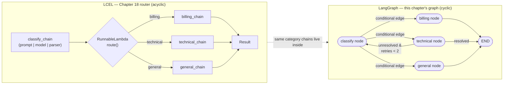

# Chapter 20: Bridge to LangGraph & DeepAgents

> "First learn the tool. Then notice you already knew the machine it snaps into." — course maxim, coined for this chapter

## Learning Objectives

By the end of this chapter, you will be able to:

- Explain a LangGraph node as "a function from state to partial state update," and identify where an LCEL Runnable typically sits inside that function
- Articulate precisely why LangGraph exists on top of LCEL rather than replacing it — in terms of cycles, persisted state, and checkpointing
- Translate any LCEL construct you've learned in this course (`RunnableSequence`, `RunnableParallel`, `RunnableBranch`, `RunnableWithMessageHistory`, callbacks, retries/fallbacks) into its closest LangGraph equivalent, and vice versa
- Recognize `ToolNode` as an automated version of the manual tool-calling loop from Chapter 7, not a new concept
- Describe, in one paragraph, how an MCP server's tools flow through LangChain Core's `@tool` abstraction into a LangGraph `ToolNode`
- Explain DeepAgents as "LangGraph plus sensible agentic defaults," and name the Core abstractions that still sit underneath it
- Port a pure-LCEL router (Chapter 18) into a minimal LangGraph graph, identifying exactly what changes and what is reused verbatim

---

## Prerequisites for This Chapter

This chapter builds on **[Chapter 19: Production Deployment](./19-production-deployment.md)**, where you took LCEL chains — built, traced, evaluated, and hardened across Chapters 1-18 — and shipped them behind FastAPI with proper streaming, observability, and deployment hygiene.

This chapter makes a different kind of assumption than every other chapter in the course. Every prior chapter assumed you knew *nothing* about LangChain Core and taught it from first principles. This chapter assumes the reverse: that you **already know LangGraph** — you've built graphs, wired conditional edges, used checkpointers for persistence, and probably built at least one tool-calling agent loop with `ToolNode` or by hand. It also assumes you already know **MCP** (Model Context Protocol) — how a server exposes tools over a standard transport, and how a client discovers and calls them.

Nothing here re-teaches LangGraph from scratch or re-teaches MCP from scratch. If either topic is unfamiliar, this chapter will read as dense — go build one small graph and one small MCP server first, then come back. What this chapter *does* is the opposite of teaching: it takes everything you learned in Chapters 1-19 about LCEL — the Runnable protocol, composition operators, branching, parallelism, memory, callbacks, retries — and shows you precisely where each piece already lives inside the LangGraph programs you've been writing all along, usually without a name for it. The payoff is realizing you weren't learning two unrelated frameworks. You were learning the load-bearing layer underneath the one you already had.

---

## 1. A LangGraph Node Is (Usually) Just a Function Wrapped Around an LCEL Runnable

Strip away the graph machinery and look at what a single LangGraph node actually is:

```python
def my_node(state: State) -> dict:
    # do something with state
    # return a partial update
    ...
```

That's the entire contract: a callable that accepts the current state and returns a `dict` of the fields it wants to update. LangGraph handles merging that partial update into the full state, routing to the next node, and (if configured) checkpointing the result. Nothing about the *body* of that function is prescribed by LangGraph.

In almost every non-trivial LangGraph program you've written, the body of that function is exactly what Chapters 6 and 18 spent hundreds of lines teaching you to build: an LCEL `Runnable`, invoked synchronously or asynchronously, sometimes with `.batch()`, sometimes wrapped in `.with_retry()` or `.with_fallbacks()`.

```python
from langchain_core.prompts import ChatPromptTemplate
from langchain_core.output_parsers import StrOutputParser
from langchain_openai import ChatOpenAI

summarize_chain = (
    ChatPromptTemplate.from_template("Summarize this ticket in one sentence:\n\n{ticket}")
    | ChatOpenAI(model="gpt-4o-mini", temperature=0)
    | StrOutputParser()
)

def summarize_node(state: State) -> dict:
    summary = summarize_chain.invoke({"ticket": state["ticket_text"]})
    return {"summary": summary}
```

`summarize_chain` here is precisely the `RunnableSequence` you built by hand in Chapter 6 with the `|` operator. It has every property you already know: it composes via `Runnable.invoke`/`ainvoke`/`stream`, it participates in the callback system (Chapter 11), it can be given retries and fallbacks (Chapter 14), and it can be traced end-to-end in LangSmith exactly the way you traced it as a standalone chain in Chapter 15. Wrapping it in `summarize_node` does not change any of that — it only gives LangGraph a place to plug the result into the graph's `State` object and decide what happens next.

This is the single idea this whole chapter radiates out from: **the graph is the orchestration layer; the Runnables inside each node are the computation layer**, and you spent nineteen chapters learning the computation layer in depth. LangGraph gave you the orchestration layer for free, because you already knew how to use it — this chapter is just naming what was implicit.

---

## 2. Why LangGraph Exists on Top of LCEL, Not Instead of It

If LCEL Runnables are so capable — composable, streamable, batchable, retryable, observable — why does LangGraph exist at all? Chapter 18 planted the seed for the answer when it described "recursion strain": the moment an LCEL chain's control flow (`RunnableBranch`, recursive `RunnableLambda` calls, manual `while` loops around `.invoke()`) starts creeping past two or three levels of nested conditionals just to express "keep going until the model stops calling tools."

LCEL is, at its core, a way to describe and execute a **DAG** — a directed graph with no cycles, evaluated once, front to back (Chapter 6). That shape covers an enormous fraction of real LLM applications: a prompt into a model into a parser, a retrieval step feeding a generation step, several independent branches fanned out and joined. Even the dynamic routing in Chapter 18 — `RunnableBranch` or a routing `RunnableLambda` — is still fundamentally a DAG: you pick *which* linear path to take, but you don't come back and revisit an earlier step.

Three things a DAG cannot express cleanly, and that agentic and conversational systems need constantly:

1. **Genuine cycles.** "Call the model, and if it asks for a tool, call the tool, and go back and call the model again, and keep doing that until it produces a final answer" is a loop with a data-dependent exit condition, not a fixed sequence of steps. You *can* fake this in LCEL with a recursive `RunnableLambda` that calls itself, but you're fighting the abstraction — there is no first-class notion of "go back to an earlier step," only "call a function that happens to look like an earlier step."
2. **Long-running, non-linear back-and-forth.** A multi-turn agent that may re-plan, backtrack, retry a failed tool call with different arguments, or hand off to a different sub-routine based on what it just learned needs explicit branching *back*, not just branching *forward*. LCEL's composition operators describe a shape decided at chain-construction time; they don't describe a shape that changes at run time based on how many iterations have elapsed or what state has accumulated.
3. **Explicit, persisted state across many steps.** `RunnableWithMessageHistory` (Chapter 18) already showed you the seam: LCEL chains are otherwise stateless, so state has to be bolted on from outside. That works well for "conversation history," but it doesn't generalize to arbitrary structured state — a scratchpad, a plan, a set of retrieved documents, a retry counter — that many different nodes need to read and write over an unbounded number of steps, with the ability to pause and resume from a durable snapshot.

LangGraph's answer to all three is deliberately minimal and reuses what you already know rather than replacing it:

- An explicit **`State`** object (typically a `TypedDict` or Pydantic model) that every node reads from and writes partial updates to — the generalized, structured version of the message history `RunnableWithMessageHistory` bolted onto a chain.
- A **graph of nodes and edges**, where edges can be **conditional** (a routing function decides the next node, generalizing `RunnableBranch`) and, critically, can point **backward**, creating a real cycle instead of a simulated one.
- A **checkpointer** that persists the state object after every node runs, giving you pause/resume, replay, and time-travel debugging — durability that no amount of LCEL composition provides on its own, because LCEL chains are ephemeral: they run start to finish and hold no state once `.invoke()` returns.

So the honest framing is: LangGraph does not replace LCEL's execution model, it wraps a **stateful, cyclic control layer** around Runnables that were already doing the actual work. You reach for LangGraph exactly when a DAG stops being the right shape for your control flow — not because LCEL was "wrong" for everything that came before it.

---

## 3. Mapping Table: LCEL Concept → LangGraph Equivalent

This is the reference table to keep beside you while reading or writing LangGraph code. Every row names something you built by hand earlier in this course and its structural analogue in a graph.

| LCEL concept (this course) | LangGraph equivalent | What actually changes |
|---|---|---|
| `RunnableSequence` (`a \| b \| c`, Ch. 6) | A linear chain of nodes connected by plain (unconditional) edges | Nothing computationally — each node's body can literally be one leg of the old sequence; the graph just makes the hand-off between steps addressable and inspectable |
| `RunnableBranch` / dynamic routing `RunnableLambda` (Ch. 18) | A routing node plus a **conditional edge** (`add_conditional_edges`) | The routing decision moves from "returns which Runnable to call" to "returns the name of the next node"; the branches themselves stay as ordinary Runnables inside their target nodes |
| `RunnableParallel` (Ch. 6) | Parallel node fan-out with a join node collecting results into `State` | LCEL's dict-shaped parallel output becomes a graph join step that merges multiple nodes' partial state updates before the next node runs |
| `RunnableWithMessageHistory` (Ch. 18) | The graph's persisted `State` schema plus a **checkpointer** | Message history stops being a bolt-on wrapper around one chain and becomes one field among many in a state object that any node can read/write, durable across process restarts |
| Callbacks / `BaseCallbackHandler` (Ch. 11) | Same callback system, threaded through automatically by LangGraph's own streaming and tracing | You do not learn a second callback API — LangGraph nodes are Runnables underneath, so the handlers, events, and LangSmith traces from Chapter 11 keep firing exactly as they did for standalone chains |
| `.with_retry()` / `.with_fallbacks()` (Ch. 14) | Per-node retry policies (`RetryPolicy` on a node) / a fallback node reached via a conditional edge | Retries can still be attached directly to the Runnable inside a node (nothing stops you); LangGraph additionally offers node-level retry policies so a *whole node's* failure (not just one Runnable call) can trigger a controlled re-attempt |
| A recursive `RunnableLambda` simulating a loop (the "recursion strain" pattern, Ch. 18) | A real cycle — a conditional edge that points back to an earlier node | This is the row that matters most: LangGraph turns a workaround into a first-class, boundable ( `recursion_limit` ), inspectable construct |
| `.invoke()` / `.stream()` / `.batch()` on the whole chain (Ch. 5-6) | `graph.invoke()` / `graph.stream()` / `graph.batch()` on the compiled graph | Same verbs, same streaming semantics you already internalized — a compiled `StateGraph` *is* a `Runnable` (it implements the same protocol from Chapter 5), which is exactly why these verbs exist on it unchanged |

That last row is worth dwelling on: a compiled LangGraph graph is itself an instance of the `Runnable` protocol you spent Chapter 5 studying. You can `.invoke()` it, `.stream()` it, drop it into an `RunnableParallel` alongside other chains, or bind callbacks to it, because it *is* one, structurally. LangGraph is not a parallel universe with its own execution protocol bolted on from scratch — it is built as a Runnable that happens to internally manage a state machine instead of a fixed pipeline.

---

## 4. Tools Inside LangGraph: `ToolNode` Is Chapter 7's Loop, Automated

Chapter 7 walked you through the raw mechanics of tool calling by hand:

1. Bind tool schemas to a model with `.bind_tools([...])`.
2. Invoke the model; inspect `response.tool_calls`.
3. For each tool call, look up the matching Python function, call it with the parsed arguments, and wrap the result in a `ToolMessage` carrying the matching `tool_call_id`.
4. Append the `ToolMessage`(s) back onto the message list and call the model again.
5. Repeat until the model responds with no further tool calls.

That five-step loop, written by hand, looks roughly like this (a compressed recall of Chapter 7's pattern):

```python
messages = [HumanMessage(content=user_input)]
llm_with_tools = llm.bind_tools([search_orders, issue_refund])

response = llm_with_tools.invoke(messages)
messages.append(response)

while response.tool_calls:
    for call in response.tool_calls:
        tool_fn = tools_by_name[call["name"]]
        result = tool_fn.invoke(call["args"])
        messages.append(ToolMessage(content=str(result), tool_call_id=call["id"]))
    response = llm_with_tools.invoke(messages)
    messages.append(response)
```

`ToolNode` in LangGraph is this loop's *tool-execution half*, packaged as a ready-made node: give it the same list of `@tool`-decorated callables from Chapter 7, and it takes a state containing the latest AI message, executes every tool call found on it (in parallel, with error handling built in), and returns the resulting `ToolMessage`s as a state update — step 3 above, automated and hardened. You still write the model-calling node yourself (or use a prebuilt one), and you still write the conditional edge that inspects `response.tool_calls` to decide "route to `ToolNode`" vs. "route to end" — that conditional edge *is* the `while response.tool_calls:` check from the manual loop, just expressed as a graph edge instead of a Python loop condition.

```python
from langgraph.prebuilt import ToolNode
from langgraph.graph import StateGraph, END

tool_node = ToolNode([search_orders, issue_refund])  # same @tool objects from Chapter 7

def should_continue(state: State) -> str:
    last_message = state["messages"][-1]
    return "tools" if last_message.tool_calls else END

graph = StateGraph(State)
graph.add_node("agent", call_model_node)
graph.add_node("tools", tool_node)
graph.add_conditional_edges("agent", should_continue, {"tools": "tools", END: END})
graph.add_edge("tools", "agent")   # <-- the cycle: back to the model after tools run
```

Nothing in this graph invents a new idea about tool calling. `search_orders` and `issue_refund` are still the exact `@tool`-decorated functions (or `StructuredTool` instances) from Chapter 7, with the exact same Pydantic-derived argument schemas, the exact same `.invoke()` contract. `ToolNode` did not change what a tool *is* — it changed who writes the boilerplate around calling one.

---

## 5. MCP Tools Inside This Stack

You already know what MCP gives you: a standard client/server protocol so a tool (a database query, a filesystem operation, a SaaS API call) can be defined once, in one server process, and consumed by any MCP-aware client without bespoke integration code per client. The bridge back to everything in this course is short: LangChain's MCP adapter connects to an MCP server, lists its exposed tools, and wraps each one as an ordinary LangChain tool object — the same `@tool`-shaped, schema-carrying callable you built by hand in Chapter 7, indistinguishable at the call site from a tool you defined locally with `@tool`. Once wrapped, an MCP-derived tool can be `.bind_tools()`-ed onto a model exactly like `search_orders` above, or handed straight to a `ToolNode` in a list alongside your local tools — the graph does not know or care that the tool's implementation lives behind a network call to an external MCP server rather than in a function in your own codebase. MCP solves *tool distribution and standardization*; LangChain Core's tool abstraction is the common interface that lets MCP-sourced tools and hand-written tools sit side by side in the same `bind_tools()` list or the same `ToolNode`, and LangGraph is what sequences the calls to either kind identically.

---

## 6. DeepAgents: LangGraph With Sensible Agentic Defaults

Every LangGraph agent you've built by hand — the tool loop above, a planner/executor split, a supervisor delegating to sub-agents — has a recognizable set of recurring parts: a planning step, a way to spawn and manage sub-agents for sub-tasks, a scratchpad or file system the agent can read and write across steps, and a main loop tying it together. **DeepAgents** is a library built on top of LangGraph that packages these recurring parts as sensible, ready-made defaults, so you stop re-deriving the same planner/executor/file-system scaffolding by hand for every new agent.

Concretely, DeepAgents typically gives you, out of the box:

- A **planning tool** the agent can call to write out and revise a structured task list, rather than every project inventing its own ad hoc "scratchpad" prompt convention.
- **Sub-agent spawning**, so a top-level agent can delegate a bounded sub-task to a freshly-scoped agent instance (with its own tools and context) and receive back just the result — a pattern you would otherwise hand-build as a graph-within-a-node.
- A **virtual file system** the agent can read from and write to as working memory across many steps, addressing the same "state that needs to survive many turns" problem Section 2 raised, but exposed as file-like tool calls rather than raw state fields.
- A default **main agent loop**, which is — unsurprisingly, by now — a LangGraph graph with a model-calling node, a `ToolNode`-like tool-execution node, and a cycle between them, preconfigured with the planning and file-system tools already bound.

The framing to hold onto: DeepAgents is an *opinionated scaffold*, not a new execution substrate. Underneath its planning tool call, its sub-agent handoff, and its file read/write tool calls, the substrate is exactly what Chapters 1-19 taught: `AIMessage`/`ToolMessage`/`HumanMessage` objects (Chapter 3), `@tool`-shaped callables with schemas (Chapter 7), Runnables composed with LCEL inside each node (Chapters 5-6), and a `StateGraph` with a cycle sequencing the whole thing (Chapter 18's foreshadowing, resolved in Section 2 of this chapter). Reach for DeepAgents when you want a well-tested default shape for "general-purpose autonomous agent" and don't want to re-invent planning/sub-agent/file-system plumbing; reach for hand-rolled LangGraph when your control flow doesn't fit that shape, or when you want to understand and control every edge in the graph yourself. Either way, nothing you learned about Core abstractions stops applying — DeepAgents simply pre-wires more of the graph for you.

---

## 7. Worked Example: Porting Chapter 18's Customer-Support Router to LangGraph

Chapter 18 built a pure-LCEL customer-support router: a classification step decided which of several category-specific chains (`billing_chain`, `technical_chain`, `general_chain`) should handle an incoming ticket, dispatched with `RunnableBranch` (or a routing `RunnableLambda`), and each branch was itself an ordinary LCEL chain — a prompt, a model, a parser.

```python
# Recall from Chapter 18 (pure LCEL)
def route(input: dict) -> Runnable:
    category = input["category"]
    if category == "billing":
        return billing_chain
    elif category == "technical":
        return technical_chain
    return general_chain

full_chain = (
    {"category": classify_chain, "ticket": lambda x: x["ticket"]}
    | RunnableLambda(route)
)
```

This works well as long as a ticket is handled in one pass: classify once, dispatch once, done. The wall Chapter 18 foreshadowed appears the moment product wants: "if the technical chain can't resolve it, escalate back through classification with an added note, and try again, up to N times" — a cycle. Forcing that into the LCEL version means a recursive `RunnableLambda` calling `full_chain.invoke()` again from inside itself, with a manually threaded retry counter — exactly the "recursion strain" pattern this chapter has been naming.

Here is the same logic as a minimal LangGraph graph. Notice what changes and, more importantly, what does not.

**What changes:**

- An explicit `State` schema now names every field the graph threads through: the ticket text, the classified category, the response, and a retry counter.
- The classification step and each category handler become **nodes** — thin functions that call the state's dict and return a partial update.
- The `RunnableBranch`/`route()` dispatch logic becomes a **conditional edge** function, returning the name of the next node instead of a Runnable to execute.
- A cycle becomes possible: an unresolved technical ticket can route back to `classify` with an incremented retry counter, something the LCEL version could only fake.

**What stays identical:**

- `classify_chain`, `billing_chain`, `technical_chain`, and `general_chain` are **the exact same LCEL Runnables from Chapter 18**, unmodified. They are still prompts piped into models piped into parsers. Nothing about their internals changes.

```python
from typing import TypedDict, Optional
from langgraph.graph import StateGraph, END

class SupportState(TypedDict):
    ticket: str
    category: Optional[str]
    response: Optional[str]
    retries: int

def classify_node(state: SupportState) -> dict:
    category = classify_chain.invoke({"ticket": state["ticket"]})  # unchanged Ch. 18 chain
    return {"category": category}

def billing_node(state: SupportState) -> dict:
    return {"response": billing_chain.invoke({"ticket": state["ticket"]})}  # unchanged

def technical_node(state: SupportState) -> dict:
    result = technical_chain.invoke({"ticket": state["ticket"]})  # unchanged
    return {"response": result, "retries": state["retries"] + 1}

def general_node(state: SupportState) -> dict:
    return {"response": general_chain.invoke({"ticket": state["ticket"]})}  # unchanged

def route_after_classify(state: SupportState) -> str:
    # this function replaces Chapter 18's RunnableBranch / route() logic
    return {"billing": "billing", "technical": "technical"}.get(state["category"], "general")

def route_after_technical(state: SupportState) -> str:
    # the genuinely new capability: a real cycle, bounded by a retry count
    if "unresolved" in state["response"].lower() and state["retries"] < 2:
        return "classify"
    return END

graph = StateGraph(SupportState)
graph.add_node("classify", classify_node)
graph.add_node("billing", billing_node)
graph.add_node("technical", technical_node)
graph.add_node("general", general_node)

graph.set_entry_point("classify")
graph.add_conditional_edges("classify", route_after_classify,
                             {"billing": "billing", "technical": "technical", "general": "general"})
graph.add_edge("billing", END)
graph.add_conditional_edges("technical", route_after_technical,
                             {"classify": "classify", END: END})
graph.add_edge("general", END)

support_graph = graph.compile()
```

The category-specific LCEL chains did not get rewritten, ported, or re-implemented in a "LangGraph-flavored" way — they were dropped, verbatim, into node function bodies. The only genuinely new code is the `State` schema and the two routing functions, and the only genuinely new *capability* is the cycle in `route_after_technical`, which the pure-LCEL version in Chapter 18 had no clean way to express.

---

## 8. Diagram: LCEL DAG vs. an Equivalent LangGraph Graph With a Cycle



The two graphs use the same three category-specific chains (left box and right box both reference identical logic for billing/technical/general). The structural difference is entirely in the arrows: the LCEL diagram has no path leading back to an earlier box — data only ever flows left to right — while the LangGraph diagram has one edge, from `technical node` back to `classify node`, that a pure DAG cannot draw. That single backward arrow is the entire reason to reach for LangGraph over LCEL for this use case.

---

## Real-World Scenario

A support-automation team had built exactly the pure-LCEL router from Chapter 18 and shipped it behind FastAPI (Chapter 19). It performed well for months on single-pass tickets: classify, dispatch, respond, done. Then product asked for a feature the team initially underestimated: when the technical-support chain couldn't resolve an issue on the first attempt — say, it needed a piece of information the customer hadn't provided, or its initial classification turned out to be wrong once the technical chain actually engaged with the ticket — the system should be able to **re-classify with the new information and try a different specialist chain**, up to a small retry budget, before finally escalating to a human.

The first attempt at this feature was a recursive `RunnableLambda` that called the top-level chain again from inside itself, threading a hand-rolled retry counter through a mutable closure. It worked in the happy path, but broke down under real traffic: retries under concurrent requests occasionally clobbered each other's counters, there was no way to inspect *how many times* a given ticket had looped without adding custom logging at every recursion point, and a bug in the retry-termination condition once caused an infinite loop that only stopped when the process's Python recursion limit was hit — with no clean way to bound or observe it beforehand, and no persisted record of the ticket's path through the retries when the crash happened.

The team migrated to LangGraph. Critically, the migration touched almost none of the actual business logic: `classify_chain`, `billing_chain`, `technical_chain`, and `general_chain` — the LCEL Runnables that had been tested, evaluated (Chapter 13-equivalent work), and traced in LangSmith (Chapter 15) for months — moved into node functions unchanged. The only new code was a `SupportState` `TypedDict`, two routing functions, and the graph wiring shown in Section 7 of this chapter. In exchange, they gained: a `recursion_limit` that hard-bounds the loop instead of relying on hand-rolled counters; a checkpointer that persists the ticket's state after every node, so a crash mid-loop resumes instead of restarting from scratch; and LangGraph's native step-by-step tracing, which made "why did this ticket loop three times before escalating" answerable by reading the graph's run history instead of grepping custom log statements. The rewrite took under a day, most of which was writing the `State` schema and the two routing functions — because the actual language-model logic had already been built correctly, as reusable Core abstractions, back in Chapter 18.

---

## Best Practices

- **Reach for LangGraph only when you hit one of the three walls in Section 2** — a real cycle, arbitrary long-running back-and-forth, or state that must persist and be inspectable across many steps. If your flow is a DAG, an LCEL chain is simpler to write, test, and reason about; don't add graph machinery preemptively.
- **Keep the Runnables inside your nodes exactly as portable as they were as standalone chains.** A node's body should still be `some_chain.invoke(...)` — testable, traceable, and swappable in isolation — not business logic rewritten inline as a wall of `if`/`else` that only exists inside the node function.
- **Design the `State` schema deliberately, the way you'd design an API contract.** Every field is something every node can read and write; treat additions to it with the same care you'd give to changing a shared database schema, since sprawling, loosely-typed state is the fastest way to make a graph hard to reason about.
- **Set a `recursion_limit` on every graph with a cycle**, and design your conditional edges to have an unambiguous, testable exit condition — the same discipline you already apply to any `while` loop, now made a first-class, enforced graph property instead of an easily-forgotten manual check.
- **Reuse the same tool objects across raw tool-calling loops, `ToolNode`, and MCP-sourced tools.** A `@tool`-decorated function should be definable once and usable in a hand-rolled Chapter 7 loop, inside a `ToolNode`, or bound directly to a model — don't maintain parallel copies of the same tool for different call sites.
- **Choose DeepAgents when you want its specific defaults (planning, sub-agents, file-system state), and hand-rolled LangGraph when you don't.** Adopting DeepAgents for a narrow, well-understood workflow just to avoid writing a three-node graph adds more scaffolding than the problem needs.
- **Keep observability continuous across the boundary.** Because a compiled graph and the Runnables inside it share the same callback system (Chapter 11) and the same LangSmith integration (Chapter 15), verify traces still show full node-by-node and chain-by-chain detail after a migration — losing that granularity usually means a node's body stopped being an inspectable Runnable and became an opaque black-box function.

---

## Common Mistakes

- **Reaching for LangGraph by default, for every project, "just in case."** Most LLM applications are legitimately DAG-shaped; wrapping a linear chain in graph nodes and edges adds indirection and state-management overhead with no corresponding benefit.
- **Rewriting working LCEL chains from scratch when porting to LangGraph**, instead of dropping them unchanged into node bodies. The chains already work and are already tested — the migration in Section 7 and the Real-World Scenario both hinge on *not* touching them.
- **Treating a conditional edge's routing function as fundamentally different from `RunnableBranch`'s routing function.** Both answer the same question ("given the current input/state, which path runs next?"); confusing yourself into thinking LangGraph's routing logic is a new concept to learn from scratch, rather than the same decision expressed as a graph-native return value, slows the transition down.
- **Forgetting a `recursion_limit` (or an equivalent hard bound) on a graph with a cycle**, reproducing the exact "runaway loop with no ceiling" failure mode the Real-World Scenario describes, just inside LangGraph instead of inside a recursive `RunnableLambda`.
- **Bypassing the shared tool abstraction** by writing one tool implementation for a hand-rolled Chapter 7 loop and a separate, near-duplicate implementation for use inside a `ToolNode` — a maintenance burden that disappears entirely once you remember both call sites accept the same `@tool` object.
- **Assuming DeepAgents replaces the need to understand LangGraph or LCEL.** Its planning tool, sub-agent handoff, and file-system tools are themselves built from `StateGraph`, `@tool` callables, and LCEL Runnables — debugging unexpected DeepAgents behavior without that mental model means debugging blind.
- **Conflating MCP with LangChain's tool abstraction.** MCP standardizes how a tool is *exposed and transported*; the `@tool`-shaped callable is how LangChain represents any tool, MCP-sourced or not, to a model or a `ToolNode`. Treating an MCP tool as needing a wholly different integration path than a local `@tool` function leads to unnecessary custom glue code.

---

## Summary

- A LangGraph **node** is typically a plain function that reads `state` and returns a partial update, and its body is very often exactly the LCEL Runnable `.invoke()` pattern from Chapters 5-6 — the graph did not replace the chain, it gave the chain a place to live inside a larger control structure.
- LangGraph exists on top of LCEL because LCEL is a **DAG execution model**: excellent for linear-or-branching pipelines, but structurally unable to express genuine **cycles**, unbounded agentic back-and-forth, or **persisted, structured state** across many steps — the three walls foreshadowed by Chapter 18's "recursion strain."
- Every LCEL construct from this course has a direct LangGraph analogue: `RunnableSequence` → linear node chain, `RunnableBranch` → conditional edge, `RunnableParallel` → parallel nodes with a join, `RunnableWithMessageHistory` → persisted `State` + checkpointer, callbacks and retries → the same underlying systems, extended to the node/graph level.
- **`ToolNode`** is the automated form of the manual tool-calling loop taught in Chapter 7 — same `@tool` objects, same `ToolMessage` contract, with the execution boilerplate handled for you.
- **MCP** standardizes tool exposure and transport; LangChain's `@tool` abstraction is the common interface an MCP-sourced tool and a hand-written tool both implement, which is why either can be bound to a model or dropped into a `ToolNode` identically.
- **DeepAgents** is a higher-level library built on LangGraph, pre-wiring planning, sub-agent delegation, and file-system-backed state as sensible defaults — but the substrate underneath is still messages, `@tool` callables, LCEL Runnables inside nodes, and a `StateGraph` with a cycle.
- Porting an LCEL router to LangGraph (Section 7) changes the control-flow scaffolding — a `State` schema, node wrappers, conditional edges — while leaving the actual LCEL chains untouched, which is exactly what made the Real-World Scenario's migration fast and low-risk.

---

## Knowledge Check

1. A colleague says, "LangGraph nodes are a completely different programming model from LCEL — you have to throw out your chains and start over." Using Section 1's example, explain precisely why this is wrong.
2. Name the three capabilities a pure LCEL DAG structurally cannot provide, and match each one to the LangGraph feature that provides it.
3. In the mapping table (Section 3), which LCEL construct maps to a *conditional edge*, and which one maps to *per-node retry policies*? Explain the difference between attaching a retry to a Runnable directly versus attaching a `RetryPolicy` to a node.
4. Explain, in your own words, why `ToolNode` is described as "the same loop from Chapter 7, automated" rather than a new concept. What part of the manual loop does it *not* automate for you (i.e., what do you still have to write yourself)?
5. An MCP server exposes a `get_account_balance` tool. Describe, step by step, what has to happen before that tool can be called from inside a LangGraph `ToolNode`.
6. In Section 7's ported graph, list every piece of code that is new relative to Chapter 18's pure-LCEL version, and every piece of code that is unchanged. Why does that split matter for how much risk a migration like this carries?

---

## Hands-On Exercise

Using Section 7 as your reference, port the Chapter 18 customer-support router into your own minimal 3-node LangGraph graph. Work through it on paper/in a text editor (no execution required):

1. **Define the state.** Write a `TypedDict` (or Pydantic model) named `SupportState` with at least: `ticket: str`, `category: Optional[str]`, `response: Optional[str]`.
2. **Write exactly three nodes.** Collapse Section 7's four nodes into three by merging `billing_node` and `general_node`'s pattern: a `classify_node` (calls the classification chain), a `handle_node` (calls whichever category chain applies, decided *inside* the node body rather than via a separate conditional edge — note this is a legitimate alternative design choice, and explain in a sentence why you might prefer it or the four-node version from Section 7), and an `escalate_node` (a placeholder that returns a "routed to human" response).
3. **Write one conditional edge function** that inspects `state["category"]` after `classify_node` runs and decides whether to go to `handle_node` or straight to `escalate_node` (e.g., an "urgent" category always escalates immediately, skipping automated handling).
4. **Wire the graph**: entry point, the conditional edge from `classify_node`, and edges from `handle_node`/`escalate_node` to `END`.
5. **Answer in writing:** In your 3-node design, which parts are new relative to Chapter 18, and which parts (if you reuse the actual `classify_chain`/category chains from that chapter) are completely unchanged? Does your 3-node collapse make the graph easier or harder to extend later with a retry cycle like Section 7's `route_after_technical`? Why?

---

## Further Reading

- LangGraph official documentation — `StateGraph`, conditional edges, checkpointers, and `recursion_limit` configuration
- LangGraph `prebuilt` module documentation — `ToolNode`, `create_react_agent`, and other ready-made node/graph patterns built from Core abstractions
- DeepAgents project documentation — the default planning tool, sub-agent spawning API, and virtual file-system tools it provides on top of LangGraph
- Model Context Protocol (MCP) specification — server/client architecture, tool discovery, and transport mechanisms
- LangChain Core documentation on the `Runnable` interface — worth re-reading once more now that you've seen a compiled `StateGraph` implements the same protocol
- Chapter 18 of this course, **Advanced LCEL Patterns** — the router, memory, and recursion-strain material this chapter builds directly on

---

<div style="display:flex;justify-content:space-between;align-items:center;">
  <a href="./19-production-deployment.md">← Previous: Production Deployment</a>
  <a href="./00-index.md">🏠 Index</a>
  <a href="./21-capstone-projects.md">Next: Capstone Projects →</a>
</div>
