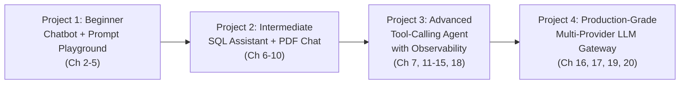
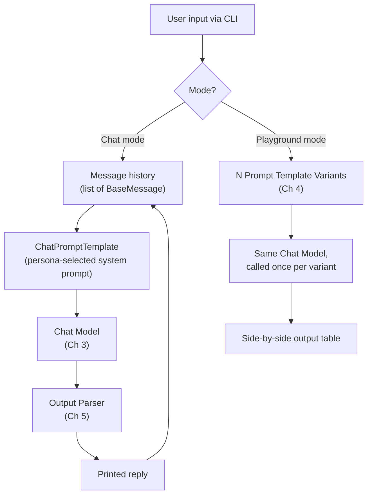
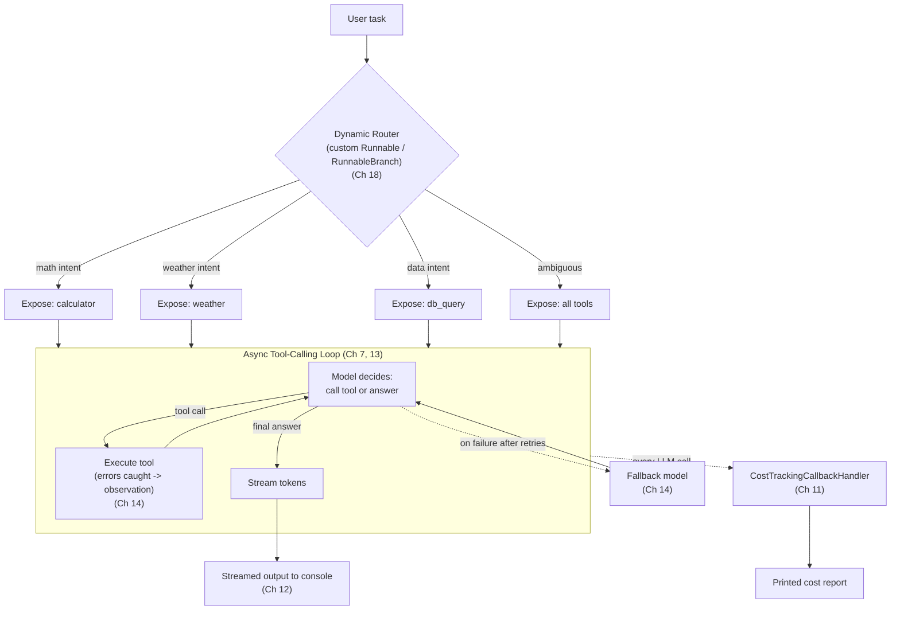
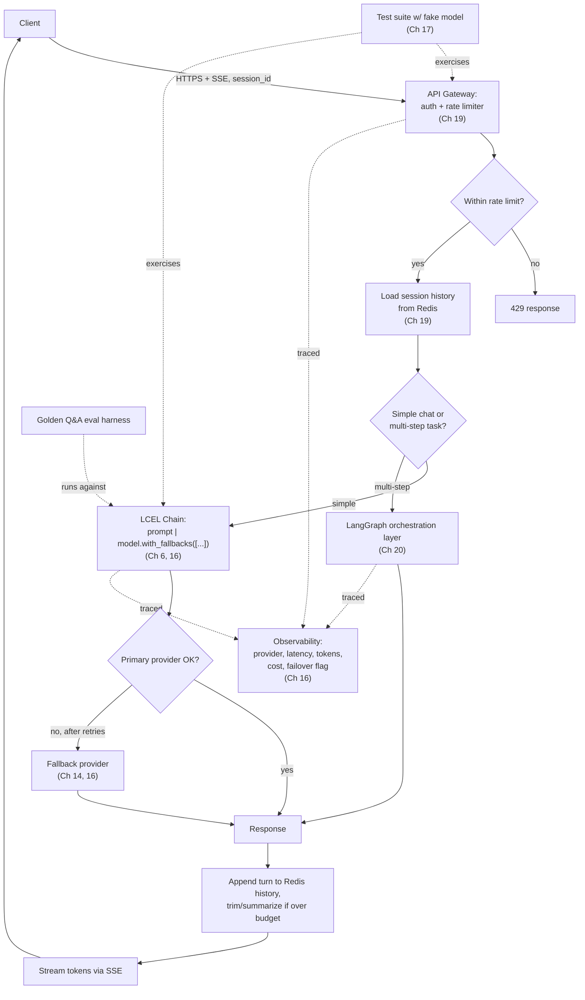

```mermaid
flowchart TB
    subgraph SQLPath["SQL Assistant (LCEL Chain)"]
        Q1[NL Question + Schema] --> P1["ChatPromptTemplate\n+ format instructions"]
        P1 --> M1["Chat Model"]
        M1 --> Parse1["PydanticOutputParser\n(SQLQuery object)"]
        Parse1 --> Render["Deterministic renderer:\nobject -> SQL string"]
        Render --> Exec{"Dry run or Execute?"}
        Exec -->|execute| DB[(SQLite / mock DB)]
        Exec -->|dry run| Print[Printed SQL]
    end

    subgraph PDFPath["PDF Chat (LCEL RAG Chain)"]
        Doc[PDF file] --> Load["DocumentLoader + Splitter\n(Ch 8)"]
        Load --> Embed["Embeddings\n(Ch 9)"]
        Embed --> VS[(Vector Store)]
        VS --> Retr["Retriever\n(Ch 10)"]
        Q2[User question] --> Retr
        Retr --> RP["RunnableParallel:\ncontext + question"]
        RP --> Prompt2["Prompt with context"]
        Prompt2 --> M2["Chat Model"]
        M2 --> Parser2["StrOutputParser"]
        Parser2 --> Ans["Answer + source citations"]
    end
```

# Chapter 21: Capstone Projects

> "Tell me and I forget, teach me and I may remember, involve me and I learn." — attributed to Benjamin Franklin

## Learning Objectives

By the end of this chapter, you will be able to:

- Select a capstone project scoped to your current comfort level with LangChain Core, and explain why that tier is the right starting point
- Translate the LCEL, tool-calling, retrieval, streaming, and observability concepts from Chapters 1-20 into a concrete architecture, folder structure, and phased implementation plan
- Identify which earlier chapter teaches each component of a non-trivial LangChain system, so you can look up depth on demand instead of re-deriving it from memory
- Assemble prompt engineering, output parsing, retrieval, tool calling, async streaming, and resilience patterns into one working, demoable system
- Design a production-shaped FastAPI service around an LLM: provider failover, rate limiting, session-scoped memory, and observability
- Evaluate your own (or a teammate's) LangChain project against a production-readiness bar, not just a "does it run" bar
- Recognize the natural on-ramp from LCEL chains and agents into LangGraph-based orchestration for genuinely multi-step workflows

---

## Prerequisites for This Chapter

This chapter assumes the **entire course, Chapters 1-20**. It builds most directly on **[Chapter 20: Bridge to LangGraph & DeepAgents](./20-bridge-to-langgraph-and-deepagents.md)**, where you learned when a linear LCEL chain or a single-loop agent stops being the right abstraction, and how LangGraph's stateful graph model picks up from there.

Every implementation step in every project below cites the specific earlier chapter that teaches the underlying concept. If a step feels unfamiliar, that citation is your lookup table — go back, refresh, and return. This chapter does not teach any new LangChain API surface; it only asks you to combine what you already have.

No new setup is required beyond what earlier chapters already assumed (a Python 3.10+ environment, `langchain-core` plus one or two provider integration packages, and API keys for whichever chat model provider you've been using). Nothing in this chapter needs to be executed as you read it — treat every code and folder-structure block as a blueprint to build from afterward, not a transcript of a session that already ran.

---

## How the Four Projects Map to the Course

Reading twenty chapters builds vocabulary; building four projects builds proof — to yourself, to a teammate reviewing your design, to a hiring manager skimming your GitHub. These specs are meant to be built, not skimmed. Each one escalates in exactly the order the course itself escalated: message plumbing → composable chains and retrieval → resilient tool-using agents → a deployable service.

| Tier | Project | Chapters Exercised | Estimated Time |
|---|---|---|---|
| Beginner | AI Chatbot + Prompt Playground | 2-5 (Messages, Chat Models, Prompt Templates, Output Parsers) | 3-6 hours |
| Intermediate | SQL Assistant + PDF Chat | 6-10 (LCEL, Tools, Documents, Embeddings, Retrievers) | 8-14 hours |
| Advanced | Tool-Calling Agent with Observability | 7, 11-15, 18 (Tools, Callbacks, Streaming, Async, Error Handling, Architecture, Advanced LCEL) | 15-25 hours |
| Production-Grade Capstone | Multi-Provider LLM Gateway | 16, 17, 19, 20 (Best Practices, Common Mistakes, Production Deployment, LangGraph Bridge) — plus nearly everything preceding | 25-40+ hours |



**How to approach these sequentially.** You do not have to build all four to get value from this chapter, but each one deliberately leaves a gap that the next one fills — treat that as the point, not an oversight. Project 1 gets your hands used to `HumanMessage`/`AIMessage` objects, prompt templates, and parsers, but it never has to survive a badly-formatted LLM response or a slow network call — that discomfort is manufactured on purpose in Project 2, where a `PydanticOutputParser` has to validate a generated SQL query before anything is allowed to run against a real (or mocked) database. Project 2, in turn, never has to worry about an LLM that decides *when* to call a tool, or a request that legitimately takes ten seconds and needs to stream partial output — that's Project 3's job, where you wire up callbacks, async streaming, and retry/fallback logic around a multi-tool agent. Project 3, finally, is still a single-process script; it has no notion of concurrent users, provider outages, or session-scoped history — Project 4 forces you to confront all three inside an actual FastAPI service with tests and a fake model.

If you already have production LangChain experience, feel free to start at Project 3 or 4 directly — but skim Projects 1 and 2 regardless, since their folder structures and implementation plans double as a quick refresher of exactly which chapter to reopen if a Project 4 detail (say, prompt template partials, or `PydanticOutputParser` retry behavior) turns out rustier than expected.

---

## 1. AI Chatbot + Prompt Playground (Beginner)

A CLI-driven chatbot that holds a real conversation using proper message objects, supports swappable "personas" via prompt templates, and includes a second mode — the **prompt playground** — for running several prompt variants against the same user input and comparing the outputs side by side. This project exists to make Chapters 2-5 feel like muscle memory: constructing message histories correctly, calling a chat model, templating prompts (including partials and few-shot examples), and parsing output into something more useful than a raw string.

### Requirements

**Functional**
- A REPL-style CLI chat loop that maintains conversation history as a list of `BaseMessage` objects (`SystemMessage`, `HumanMessage`, `AIMessage`) across turns
- At least three swappable **personas** (e.g., "concise technical assistant," "Socratic tutor," "sarcastic pirate") implemented as distinct `ChatPromptTemplate` system prompts, selectable via a CLI flag or in-chat command (`/persona tutor`)
- A **prompt playground** mode: given one fixed user input, run it through 2+ prompt template variants (e.g., zero-shot vs. few-shot, or plain instruction vs. chain-of-thought-style instruction) against the same chat model and print outputs side by side for comparison
- At least one structured output feature: parse the model's reply into a typed object using an output parser (e.g., extract `{sentiment, summary}` from a review-analysis persona) rather than treating every reply as a raw string
- A `/reset` command that clears history, and a `/history` command that prints the current message list

**Non-functional**
- Must run as a plain Python script/CLI — no web framework needed for this tier
- Conversation history must not silently grow unbounded across a long session (at minimum, print a warning past a configurable turn count; a real trimming strategy is optional here and revisited properly in later projects)
- All prompts must live in template objects, never as inline f-strings concatenated into the model call

### Architecture



### Folder Structure

```
chatbot-prompt-playground/
├── src/
│   ├── personas.py             # ChatPromptTemplate definitions per persona
│   ├── chat_loop.py             # REPL: history management, /commands
│   ├── playground.py            # runs N prompt variants against one input
│   ├── parsers.py               # StrOutputParser / PydanticOutputParser setups
│   └── models.py                 # chat model client construction (temperature, provider)
├── prompts/
│   ├── concise_assistant.txt
│   ├── socratic_tutor.txt
│   └── pirate.txt
├── main.py                        # CLI entry point, argument parsing
├── requirements.txt
└── README.md
```

### Implementation Plan

1. **Construct the chat model client** with an explicit provider, model name, and temperature — never rely on a library default (Chapter 3).
2. **Model conversation history explicitly** as a growing `list[BaseMessage]`, starting with a `SystemMessage`, and pass the *entire* list to the model on every turn rather than re-sending only the latest user message (Chapter 2).
3. **Build each persona as a `ChatPromptTemplate`** with a distinct system message, and make persona-switching swap the template, not the history-management code (Chapter 4).
4. **Add few-shot examples to at least one persona's template** using `FewShotChatMessagePromptTemplate` (or manually inserted example message pairs) and observe how output style changes versus the zero-shot version (Chapter 4).
5. **Wire in an output parser** for the structured-output feature: define a small Pydantic model (e.g., `class ReviewAnalysis(BaseModel): sentiment: str; summary: str`) and use a `PydanticOutputParser` (or `.with_structured_output(...)` if your chat model integration supports it) so the reply is a validated object, not a hand-parsed string (Chapter 5).
6. **Build the prompt playground as a separate entry point**: take one fixed input, run it through each registered prompt variant against the same model instance, and print a comparison table of outputs — this is the fastest way to *feel* how much prompt phrasing changes output quality (Chapter 4).
7. **Add `/reset` and `/history` CLI commands**, and a simple turn-count warning so you internalize, hands-on, why unbounded history is a problem before Project 4 forces you to solve it with real memory/session storage.

### Illustrative Sketch: Playground Comparison

The playground mode's core idea, reasoned through by hand (not executed) — one input, several prompt variants, one model, a side-by-side comparison:

```python
variants = {
    "zero_shot": ChatPromptTemplate.from_messages([
        ("system", "Answer the question directly and concisely."),
        ("human", "{question}"),
    ]),
    "chain_of_thought": ChatPromptTemplate.from_messages([
        ("system", "Think step by step before giving your final answer."),
        ("human", "{question}"),
    ]),
    "few_shot_style": FEW_SHOT_TEMPLATE,  # built with FewShotChatMessagePromptTemplate
}

def run_playground(question: str) -> dict[str, str]:
    results = {}
    for name, template in variants.items():
        chain = template | model | StrOutputParser()
        results[name] = chain.invoke({"question": question})
    return results
```

Every variant reuses the *same* `model` instance and the *same* raw `question` — the only independent variable is the prompt template, which is exactly what makes the comparison meaningful.

### Best Practices

- Keep every prompt in its own template object or file — never string-concatenate a persona description directly into a message at call time.
- Always pass the full message history to the model; passing only the latest user turn silently breaks multi-turn coherence and is a common first-week mistake.
- When comparing playground variants, hold the model, temperature, and input constant and vary *only* the prompt template — otherwise you can't attribute the output difference to the prompt.
- Validate structured output with a real parser rather than eyeballing whether the reply "looks like" the format you asked for.

### Extensions & Improvements

- Add a fourth persona that uses `.with_structured_output()` for every turn (not just one feature), and compare development ergonomics against manually wiring a `PydanticOutputParser`.
- Persist conversation history to a local JSON file between runs, and reload it on startup — a lightweight preview of Project 4's session-scoped memory.
- Add a simple token-count display per turn using your model provider's tokenizer, to build intuition for context-window budgeting before it becomes a production concern.

---

## 2. SQL Assistant + PDF Chat (Intermediate)

Two features built as proper LCEL pipelines rather than imperative scripts: a **natural-language-to-SQL assistant** that translates a plain-English question into a validated, structured query object, and a **PDF chat** feature that answers questions grounded in the contents of an uploaded PDF using retrieval composed entirely with the pipe (`|`) operator. This project is where LCEL (Chapter 6) stops being a syntax curiosity and starts being how you actually build things — every sub-part below should be expressed as a chain, not a sequence of manual function calls.

### Requirements

**Functional — SQL Assistant**
- Accept a natural-language question (e.g., "how many orders shipped to California last month?") and an in-context description of a database schema
- Translate it into a structured query object — not a raw SQL string — validated by a `PydanticOutputParser` (e.g., `class SQLQuery(BaseModel): table: str; columns: list[str]; filters: list[str]; explanation: str`)
- Render the validated object into an actual SQL string as a separate, deterministic step (never let the LLM's raw text be the thing that reaches the database)
- Run the rendered query against a real (or mocked/in-memory SQLite) database and return results, or — for read-only safety — support a "dry run" mode that only prints the rendered SQL without executing it

**Functional — PDF Chat**
- Ingest a PDF, split it into chunks using a real `DocumentLoader` + text splitter pipeline (Chapter 8)
- Embed chunks and store them in a vector store, and construct a `Retriever` from it (Chapter 9)
- Compose a full RAG chain with LCEL: retriever → prompt-with-context → chat model → output parser, all wired with `|` and `RunnableParallel`/`RunnablePassthrough` where needed (Chapter 10)
- Return an answer that cites which chunk(s)/page(s) it drew from

**Non-functional**
- The SQL assistant must never execute a query that wasn't produced through the validated Pydantic object — no falling back to "just run whatever text the model returned" on parse failure
- The PDF chat retriever configuration (chunk size, top-k, embedding model) must be defined once, in one place, and referenced everywhere it's used — not duplicated between ingestion and query time (a direct callback to the model-mismatch pitfall from the embeddings/retrieval chapters)

### Architecture



### Folder Structure

```
sql-assistant-pdf-chat/
├── sql_assistant/
│   ├── schema.py                 # Pydantic SQLQuery model + format instructions
│   ├── chain.py                    # LCEL chain: prompt | model | parser
│   ├── render_sql.py                # SQLQuery object -> deterministic SQL string
│   └── db.py                          # SQLite connection / mock execution
├── pdf_chat/
│   ├── ingest.py                  # load + split + embed + store, single config source
│   ├── retriever.py                 # retriever construction, top-k config
│   ├── rag_chain.py                   # LCEL: retriever | prompt | model | parser
│   └── config.py                        # shared chunk_size, embedding model, top_k
├── data/
│   └── sample.pdf
├── main.py                          # CLI: `sql "question"` or `pdf-chat "question"`
├── requirements.txt
└── README.md
```

### Implementation Plan

1. **Define the `SQLQuery` Pydantic schema** (table, columns, filters, an `explanation` field for auditability) and generate its format instructions via `PydanticOutputParser.get_format_instructions()` (Chapter 5, applied inside the LCEL context of Chapter 6).
2. **Build the SQL-generation chain purely with LCEL**: `prompt | model | parser`, where the prompt template includes the schema description and the parser's format instructions as partial variables (Chapter 4, Chapter 6).
3. **Write a deterministic renderer** that turns the validated `SQLQuery` object into an actual SQL string using plain Python string building or a query-builder library — this step must never involve the LLM again, precisely so a parsing failure can be caught *before* anything reaches a database (Chapter 6's emphasis on composing deterministic and non-deterministic steps explicitly).
4. **Add a dry-run flag** that prints the rendered SQL without executing it, and a real-execution path against an in-memory SQLite database seeded with sample data, so you can verify the end-to-end translation actually produces correct results.
5. **Build the PDF ingestion pipeline**: load the PDF with a `DocumentLoader`, split it with a text splitter using one explicit chunk size/overlap, embed the chunks with one explicit embedding model, and store them in a vector store (Chapter 8, Chapter 9).
6. **Construct a `Retriever`** from the vector store with an explicit `k` (top-k) value, and confirm retrieval quality manually before wiring it into a chain — print the retrieved chunks for a few test questions first (Chapter 10).
7. **Compose the full RAG chain with LCEL primitives**: use `RunnableParallel` to fan the incoming question out to both the retriever (producing `context`) and `RunnablePassthrough()` (producing `question`), feed both into a context-aware prompt template, then `| model | StrOutputParser()` (Chapter 6, Chapter 10).
8. **Add citation support**: return the source chunk metadata (page number, chunk index) alongside the generated answer, not just the plain text response.
9. **Centralize retrieval configuration** (chunk size, embedding model name, `k`) in one config module imported by both `ingest.py` and `retriever.py`, so indexing-time and query-time settings can never silently drift apart.

### Illustrative Sketch: The SQL Generation Chain

Reasoned through by hand, this is the shape the SQL-assistant chain should take — every step composed with `|`, the parser's failure mode explicit rather than swallowed:

```python
class SQLQuery(BaseModel):
    table: str
    columns: list[str]
    filters: list[str]
    explanation: str

parser = PydanticOutputParser(pydantic_object=SQLQuery)

prompt = ChatPromptTemplate.from_messages([
    ("system", "Given the schema below, produce a structured query object.\n"
               "Schema: {schema}\n{format_instructions}"),
    ("human", "{question}"),
]).partial(format_instructions=parser.get_format_instructions())

sql_chain = prompt | model | parser  # raises OutputParserException on malformed output

def render_sql(query: SQLQuery) -> str:
    cols = ", ".join(query.columns)
    where = " AND ".join(query.filters) if query.filters else "1=1"
    return f"SELECT {cols} FROM {query.table} WHERE {where};"

validated = sql_chain.invoke({"schema": SCHEMA_TEXT, "question": "orders shipped to CA last month"})
sql_text = render_sql(validated)   # deterministic — the LLM never touches this step
```

Note the boundary: everything left of `render_sql` is LLM-influenced and validated; everything at and after `render_sql` is plain, deterministic Python. That boundary is the entire safety argument for this feature.

### Best Practices

- Never let raw LLM text reach a SQL execution path — always go through the validated Pydantic object and a deterministic renderer.
- Default to "dry run" for the SQL assistant during development; only wire up real execution against a database you're comfortable resetting.
- Print retrieved chunks during development before trusting the final generated answer — most "the RAG answer is wrong" bugs are retrieval bugs in disguise.
- Keep chunking and embedding configuration in exactly one place, imported everywhere, to avoid the index/query mismatch pitfall.
- Compose with LCEL primitives (`RunnableParallel`, `RunnablePassthrough`, `|`) rather than writing manual glue functions — it keeps every step inspectable and independently testable.

### Extensions & Improvements

- Add a schema-introspection step that reads real table/column metadata from the SQLite database instead of hardcoding the schema description in the prompt.
- Add a re-ranking step after retrieval (a second, more expensive relevance pass over the top-N retrieved chunks) and measure whether answer quality improves on ambiguous questions.
- Support multi-PDF chat by namespacing the vector store per document set and letting the user pick which corpus to query.
- Add a chain-level fallback: if `PydanticOutputParser` parsing fails on the SQL assistant's first attempt, retry once with the parser's error message fed back into the prompt (a preview of the retry patterns formalized in Project 3).

---

## 3. Tool-Calling Agent with Observability (Advanced)

A multi-tool agent — calculator, weather lookup, and database query tool — with real streaming output, custom callback-based cost tracking, retry/fallback resilience around flaky model calls, and at least one custom `Runnable` subclass or dynamic routing pattern. This project is where the course's "advanced" chapters (callbacks, streaming, async, error handling, architecture, advanced LCEL) stop being separate topics and become one system you have to hold in your head simultaneously.

### Requirements

**Functional**
- At least three tools, defined with `@tool` (or `StructuredTool`) with clear docstrings and typed arguments: a `calculator` tool (safe arithmetic evaluation, not raw `eval`), a `weather` tool (can be a stub/mocked API), and a `db_query` tool (queries a small local database, reusing patterns from Project 2)
- A tool-calling agent loop that lets the model decide which tool(s) to call, executes them, and continues until it produces a final answer (Chapter 7)
- **Full streaming responses**: both intermediate tool-call events and the final answer's tokens must stream to the console/consumer incrementally, not arrive as one blocking response (Chapter 12)
- **Custom callback-based cost tracking**: a `BaseCallbackHandler` subclass that captures token usage per LLM call and accumulates an estimated dollar cost across the whole agent run, printed at the end (Chapter 11)
- **Retry and fallback resilience**: model calls must be wrapped with retry logic for transient errors (Chapter 14), and the agent must have a configured fallback model (a cheaper/faster backup) that kicks in if the primary model call exhausts its retries
- **At least one custom `Runnable` subclass or dynamic routing pattern** from Chapter 18 — e.g., a custom `Runnable` that dynamically selects which tool subset to expose to the model based on a lightweight intent classification step, implemented as a `RunnableLambda`-based router or a `RunnableBranch`

**Non-functional**
- The agent must run fully async (`ainvoke`/`astream`, not sync calls wrapped in a thread) end to end (Chapter 13)
- Tool execution errors (e.g., a malformed calculator expression) must be caught and returned to the model as an observation, never allowed to crash the agent loop (Chapter 14)
- The cost tracker's numbers must be traceable back to individual LLM calls in a log, not just a single opaque total

### Architecture



### Folder Structure

```
tool-calling-agent-observability/
├── tools/
│   ├── calculator.py            # @tool, safe arithmetic (no eval())
│   ├── weather.py                # @tool, mocked/stub API
│   └── db_query.py                 # @tool, reuses Project 2 patterns
├── agent/
│   ├── router.py                  # custom Runnable / RunnableBranch, intent-based tool selection
│   ├── agent_loop.py                # async tool-calling loop
│   ├── resilience.py                  # retry policy + fallback model wiring
│   └── streaming.py                     # astream_events consumer, console renderer
├── observability/
│   ├── cost_callback.py            # BaseCallbackHandler subclass, token/cost accounting
│   └── logs/
├── main.py                          # async entry point
├── requirements.txt
└── README.md
```

### Implementation Plan

1. **Define each tool with `@tool` and a precise docstring** describing exactly when the model should call it and what arguments it expects — vague docstrings are the most common cause of an agent calling the wrong tool (Chapter 7).
2. **Implement the calculator tool with a safe expression evaluator** (a restricted parser, not `eval()`), and make it raise a caught, descriptive error on malformed input rather than crashing (Chapter 7, Chapter 14).
3. **Build the async tool-calling loop** using `ainvoke`/`abind_tools` (or your integration's async tool-calling surface): send the task and tool schemas, inspect the response for tool calls, execute them concurrently where independent, append results as tool messages, and repeat until a final answer or a hard iteration cap (Chapter 7, Chapter 13).
4. **Wrap every tool execution in a try/except boundary** that converts exceptions into a structured observation message fed back to the model, so a bad calculator expression becomes "the tool reported an error: ..." rather than a stack trace (Chapter 14).
5. **Add streaming** using `astream_events` (or `astream` with a custom event-to-console renderer) so both tool-call events (which tool, with what arguments) and the final answer's tokens appear incrementally as they're produced (Chapter 12).
6. **Write a `CostTrackingCallbackHandler`** subclassing `BaseCallbackHandler`, implementing `on_llm_end` (or the equivalent for your integration) to read token usage off the response and accumulate a running estimated cost using your provider's published per-token pricing; attach it via the `callbacks=[...]` argument on every relevant call (Chapter 11).
7. **Add retry logic** around the primary model call (exponential backoff on transient errors — timeouts, rate limits) using `.with_retry(...)` or an equivalent wrapper, and a **fallback model** using `.with_fallbacks([...])` that only engages once retries are exhausted (Chapter 14).
8. **Build the dynamic router** as either a custom `Runnable` subclass (implementing `invoke`/`ainvoke` to run a lightweight intent classification prompt and return a filtered tool list) or a `RunnableBranch` that inspects the incoming task and picks a branch — wire it *before* the agent loop so only the relevant tool subset is exposed to the model on each run (Chapter 18).
9. **Log every LLM and tool call** (timestamp, inputs, outputs, latency, cost contribution) to a structured log file so the cost report and any debugging session can be reconstructed after the fact.
10. **Test failure paths deliberately**: force a tool error, force a simulated primary-model failure to confirm the fallback engages, and confirm the router correctly narrows tool exposure for a few representative task phrasings.

### Illustrative Sketch: Cost-Tracking Callback and Resilience Wiring

Reasoned through by hand — a callback handler that accumulates cost across every LLM call in the run, plus retry/fallback composition around the primary model:

```python
class CostTrackingCallbackHandler(BaseCallbackHandler):
    def __init__(self) -> None:
        self.total_tokens = 0
        self.total_cost_usd = 0.0
        self.calls: list[dict] = []

    def on_llm_end(self, response, **kwargs) -> None:
        usage = response.llm_output.get("token_usage", {})
        prompt_toks = usage.get("prompt_tokens", 0)
        completion_toks = usage.get("completion_tokens", 0)
        cost = prompt_toks * PRICE_PER_PROMPT_TOKEN + completion_toks * PRICE_PER_COMPLETION_TOKEN
        self.total_tokens += prompt_toks + completion_toks
        self.total_cost_usd += cost
        self.calls.append({"prompt_tokens": prompt_toks, "completion_tokens": completion_toks, "cost_usd": cost})

cost_tracker = CostTrackingCallbackHandler()

resilient_model = (
    primary_model
    .with_retry(stop_after_attempt=3, wait_exponential_jitter=True)
    .with_fallbacks([fallback_model])
)

response = await resilient_model.ainvoke(
    messages,
    config={"callbacks": [cost_tracker]},
)
```

`with_retry` absorbs transient failures against the *primary* model; `with_fallbacks` only engages once retries are exhausted — the two are complementary layers, not substitutes for each other, and both must fire before the request is allowed to fail outright.

### Best Practices

- Write tool docstrings as if explaining to a new teammate exactly when to reach for this tool — the model relies on that description as much as the argument schema.
- Never let a tool's internal exception propagate uncaught into the agent loop; always convert it into an observation the model can reason about.
- Test your retry/fallback wiring by *deliberately* triggering failures (a bad API key, a monkey-patched exception) rather than trusting it works because it compiles.
- Keep the cost callback's calculation logic separate from its logging/printing logic, so pricing updates don't require touching the accounting code.
- Cap agent iterations explicitly and make the "giving up" path visible in the streamed output, not a silent timeout.

### Extensions & Improvements

- Add a fourth tool that requires human approval before executing (e.g., anything that would "send an email") as a taste of human-in-the-loop gating, ahead of formal LangGraph interrupt patterns (Chapter 20).
- Extend the cost tracker to also record wall-clock latency per call and produce a simple per-run summary table (tokens, cost, latency, tool-call count).
- Swap the intent-classification router for a small embedding-similarity router (nearest labeled example wins) and compare routing accuracy and latency against the LLM-classification version.
- Add a second fallback tier (primary → secondary → offline canned response) and measure how gracefully the agent degrades under a simulated full-provider outage.

---

## 4. Multi-Provider LLM Gateway (Production-Grade Capstone)

This is the "everything together" project, and deliberately the most detailed spec in this chapter — it is meant to be the centerpiece of your LangChain portfolio, a system a teammate could plausibly deploy and operate. It is a FastAPI service that routes chat requests across multiple LLM providers with automatic failover, enforces rate limits, stores session-scoped conversation history in Redis, exposes full observability, ships with a test suite built around a fake/deterministic model, and optionally hands off complex multi-step requests to a LangGraph orchestration layer.

### Requirements

**Functional**
- A FastAPI backend exposing a streaming chat endpoint (Server-Sent Events or chunked HTTP) backed by a chat model, with session identifiers scoping conversation history (Chapter 19)
- **Multi-provider routing with automatic failover**: configure at least two chat model providers (e.g., a primary and a secondary/backup), and route requests to the primary, automatically failing over to the secondary on error, timeout, or rate-limit response, using `.with_fallbacks(...)` composed at the LCEL level (Chapter 16, Chapter 19)
- **Rate limiting**: both requests-per-minute and tokens-per-minute limits, enforced per API key/session, with clear `429`-style responses when exceeded (Chapter 19)
- **Session-scoped conversation history in Redis**: conversation turns persisted per session ID, loaded at the start of each request and appended to after each response, with a defined trimming/summarization strategy once history exceeds a configured budget (Chapter 19, building on the message-history practices of Chapter 2)
- **Full observability**: structured request tracing (prompt, response, provider used, latency, token counts, estimated cost, whether a failover occurred) emitted per request, plus a minimal evaluation harness (a golden Q&A set runnable on demand) (Chapter 16)
- **A test suite built around a fake model**: use a deterministic fake `BaseChatModel` implementation (or your framework's test-double chat model) to unit-test the routing, failover, rate-limiting, and history logic without making real API calls (Chapter 17's emphasis on avoiding the "our tests all secretly hit a real LLM API" mistake)
- **Optional LangGraph orchestration layer**: for requests classified as "multi-step" (e.g., "look up my last three orders, summarize them, then draft a refund email"), hand off to a small LangGraph graph rather than a single LCEL chain, and route back to the plain LCEL path for simple chat (Chapter 20)

**Non-functional**
- Must run in Docker via `docker-compose` (API service + Redis), with all model choices, provider credentials, rate limits, and Redis connection details externalized to environment variables — no hardcoded values
- Must survive a scripted burst-load test without crashing, and rate limiting must visibly engage under that load
- Provider failover must be observable in the trace log for every request where it occurred — a silent failover is treated as a bug, not a feature
- The fake-model test suite must run in CI without any network access or real API keys

### Architecture



### Folder Structure

```
multi-provider-llm-gateway/
├── api/
│   ├── main.py                    # FastAPI app, SSE streaming endpoint
│   ├── auth.py                     # API key validation
│   ├── rate_limiter.py               # token-bucket, per-key RPM/TPM
│   └── router.py                       # simple-chat vs. LangGraph dispatch
├── llm/
│   ├── providers.py                # provider clients + with_fallbacks() wiring
│   ├── chain.py                      # core LCEL chat chain
│   └── fake_model.py                   # deterministic fake BaseChatModel for tests
├── memory/
│   ├── redis_history.py            # session-scoped history load/append
│   └── trimming.py                    # trim/summarize strategy once over budget
├── orchestration/
│   ├── graph.py                    # LangGraph multi-step orchestration layer
│   └── classify_intent.py            # simple vs. multi-step classifier
├── observability/
│   ├── tracing.py                  # structured per-request trace emission
│   └── eval/
│       ├── golden_qa.jsonl
│       └── run_eval.py
├── tests/
│   ├── test_routing_failover.py    # uses fake_model, no network
│   ├── test_rate_limiter.py
│   ├── test_redis_history.py
│   └── test_graph_orchestration.py
├── docker/
│   ├── Dockerfile
│   └── docker-compose.yaml           # api + redis
├── load_test/
│   └── burst_test.py
├── .env.example
└── README.md
```

### Implementation Plan

1. **Stand up the plain FastAPI streaming endpoint first, against a single provider, with no fallback/rate-limiting/Redis yet** — a minimal `/chat` route that streams tokens as they're generated, so you have a known-good baseline before adding resilience layers on top (Chapter 19).
2. **Wire multi-provider failover at the LCEL level**: construct the primary model's chain and attach `.with_fallbacks([secondary_chain])`, and confirm — with a deliberately broken primary API key in a dev environment — that requests transparently succeed via the secondary (Chapter 14, Chapter 16).
3. **Add the rate limiter** as request-scoped middleware (a token-bucket algorithm tracking both request count and token count per API key), returning a clear `429` with a `Retry-After` hint once exceeded (Chapter 19).
4. **Add Redis-backed session history**: on each request, load the session's message list from Redis keyed by `session_id`, append the new turn after the response completes, and implement a trimming strategy (e.g., keep the last N turns plus a running summary) once history exceeds a configured token budget — revisit Chapter 2's message-object discipline here, now backed by real persistence instead of an in-memory list (Chapter 19).
5. **Add structured observability**: wrap every LLM call in a trace capturing which provider actually served the request, latency, token counts, estimated cost, and an explicit `failover_occurred: bool` flag, and emit these as structured log lines (or to a lightweight trace store) (Chapter 16).
6. **Build the fake-model test suite before writing more production code**: implement a deterministic fake `BaseChatModel` (or your framework's equivalent) that returns scripted responses (including a scriptable "raise an error" mode to exercise failover), and write tests for routing/failover, rate limiting, and Redis history logic that run with zero network access (Chapter 17).
7. **Build the minimal evaluation harness**: a golden set of 15-30 representative Q&A pairs with expected answers or rubrics, runnable on demand, reporting pass/fail — run it before and after any prompt or provider change, not just once at the end (Chapter 16).
8. **Add the intent classifier and LangGraph orchestration layer**: a lightweight step that flags a request as "simple chat" or "multi-step task," routing the latter into a small LangGraph graph (with its own nodes for each sub-step) instead of a single LCEL chain, while simple chat continues through the fast LCEL path unchanged (Chapter 20).
9. **Containerize with Docker Compose** (API service + Redis), externalizing every tunable value (provider credentials, rate limits, Redis URL, cache/history TTLs) to environment variables, and confirm the full stack comes up with one command (Chapter 16, Chapter 19).
10. **Load-test it**: script a burst of concurrent requests against the running container and confirm the rate limiter engages correctly, providers fail over as expected under simulated primary outage, and the system degrades gracefully (clear error responses) rather than crashing.
11. **Document your trade-offs in the README** — which providers you chose and why, your history-trimming strategy, what you deferred (e.g., semantic caching, a third fallback tier) and why — this is what actually demonstrates production judgment to a reader.

### Illustrative Sketch: Gateway Endpoint with Failover and Session History

Reasoned through by hand — the shape of the FastAPI route tying provider failover, Redis-backed history, and tracing together:

```python
chat_chain = prompt_template | primary_model.with_fallbacks([secondary_model]) | StrOutputParser()

@app.post("/chat")
async def chat(request: ChatRequest, api_key: str = Depends(verify_api_key)):
    await rate_limiter.check(api_key)  # raises HTTPException(429) if exceeded

    history = await redis_history.load(request.session_id)
    history = trimming.trim_if_needed(history, token_budget=MAX_HISTORY_TOKENS)

    async def event_stream():
        full_response = ""
        with trace_context(session_id=request.session_id) as trace:
            async for chunk in chat_chain.astream(
                {"history": history, "question": request.message}
            ):
                full_response += chunk
                yield f"data: {chunk}\n\n"
            trace.record(
                provider=trace.provider_used,        # set by a callback on the fallback model
                failover_occurred=trace.failover_used,
                tokens=trace.token_count,
                cost_usd=trace.estimated_cost,
            )
        await redis_history.append(request.session_id, request.message, full_response)

    return StreamingResponse(event_stream(), media_type="text/event-stream")
```

The important detail is ordering: rate limiting happens *before* any model call is attempted, history is loaded and trimmed *before* the chain runs, and the Redis append happens only *after* the full response has streamed — a mid-stream client disconnect should never leave a half-written turn in history.

### Best Practices

- Build and validate each layer (single-provider chat → failover → rate limiting → Redis history → observability → LangGraph routing) independently before wiring them all together; debugging a fully-integrated system with no isolated layer tests is dramatically harder than debugging one layer at a time.
- Treat provider failover as something that must be *provable*, not assumed — every trace log entry should say plainly which provider served a given request.
- Write the fake-model test suite early, not as an afterthought bolted on at the end — it is what lets you safely test failure paths (timeouts, malformed responses, rate-limit errors) that are awkward or expensive to trigger against a real provider.
- Externalize every tunable value to configuration; you will change rate limits, providers, and TTLs more than once, and hardcoding them turns every adjustment into a code deploy.
- Keep your golden evaluation set under version control alongside the code, and treat a failing golden-set run the same way you'd treat a failing unit test — as a merge blocker, not a nice-to-have.

### Extensions & Improvements

- Add a third, cheaper provider and implement cost-aware routing (route simple queries to the cheapest capable provider, escalate only when needed), measuring the resulting cost savings against the golden set's quality bar.
- Add a semantic response cache in front of the LCEL chain (in addition to Redis history) and document, explicitly, the staleness risk you're accepting in exchange for latency/cost savings.
- Extend the LangGraph orchestration layer with a human-in-the-loop interrupt for any multi-step task that would take an irreversible action (e.g., actually sending the drafted refund email), rather than auto-executing every step.
- Deploy the stack to a real (even low-traffic) cloud environment and add a second, independent LLM-as-judge evaluation pass alongside the golden-set harness, noting where the two evaluation methods agree and disagree.

---

## Real-World Scenario

These four tiers are not an arbitrary teaching device — they mirror the maturity curve a real engineering team actually walks through when adopting LangChain in production, almost without exception.

A team's first LangChain code is nearly always something like Project 1: a prototype chatbot bolted onto an internal tool, built by one engineer over an afternoon, using whatever prompt phrasing happened to work in a notebook. It ships, people like it, and someone asks "can it answer questions about our own documents?" — which pushes the team into Project 2's territory: LCEL chains, a real retriever, and the first encounter with an LLM output that needs to be *validated*, not just displayed, because now a generated SQL-like query or a retrieved-context answer is feeding something downstream that other people rely on.

The next request is inevitably "can it also *do* things, not just answer questions?" — book the meeting, check the order status, run the calculation — and that's Project 3's territory: tools, and with tools comes the uncomfortable discovery that agents fail in more interesting ways than plain chat did. Silent tool crashes, unbounded loops, and opaque per-request costs force the team to bolt on callbacks, retries, and streaming, usually *after* an incident, rarely before.

Only once a system has survived that stage does a team typically get asked to make it a real service other teams or external customers can depend on — Project 4's territory, where "it works when I run it" gives way to "it works when a provider has an outage during peak traffic, at 3 AM, for a customer in a different timezone, while the rate limiter is under load." Building the four projects in order isn't just pedagogically convenient — it's a faithful compression of the actual path most teams take, discomfort included.

---

## Best Practices

A consolidated, cross-project checklist worth keeping open while you build any of the four:

- **Compose with LCEL, don't script around it.** Every chain should be legible as a single `|`-composed pipeline (or `RunnableParallel`/`RunnableBranch` combination), not a sequence of manual function calls that happen to call LangChain objects internally.
- **Validate structured output before it reaches anything consequential** — a database, a tool execution, a downstream service. `PydanticOutputParser` (or `.with_structured_output()`) exists precisely so "the model said so" is never the last line of defense.
- **Match retrieval configuration between indexing and querying**, always, in one shared config location — this single discipline prevents the most common and most silent class of RAG bugs.
- **Never let a tool's internal failure crash the agent loop.** Catch it, convert it to an observation, let the model decide what to do next.
- **Make resilience observable.** A retry that silently succeeds and a failover that silently engages are both invisible unless you deliberately log them — and an invisible failover is a debugging trap waiting for the next incident.
- **Test with a fake/deterministic model wherever real API calls would make tests slow, flaky, or expensive** — this is what makes a CI-safe test suite possible at all for LLM-backed systems.
- **Externalize configuration.** Model names, quantization/provider choices, rate limits, TTLs, and chunk sizes belong in environment variables or config files, never hardcoded — you will change every one of them at least once.
- **Write down your trade-offs.** A README that says "we chose exact-match caching only, deferred semantic caching due to staleness risk" demonstrates more engineering judgment than any amount of extra code.

---

## Common Mistakes

- **Jumping straight to Project 4 without building the intermediate skills.** A production gateway built by someone who has never personally debugged a mismatched embedding model (Project 2) or an agent stuck in a silent retry loop (Project 3) tends to reproduce exactly those failures in production instead of in a low-stakes practice project.
- **Treating the "beginner" tier as beneath you and skipping it.** Project 1 looks trivial on paper, but skipping it means skipping the one place where sloppy message-history handling (Chapter 2) gets caught cheaply, before it's buried under three more layers of complexity in Project 4.
- **Letting the LLM's raw text reach a database, a tool execution, or a live send-action** without going through a validated structured-output step first — this is the single most common corner cut under deadline pressure, and the single most consequential one to cut.
- **Building all layers of Project 3 or 4 simultaneously** instead of validating each one (tool execution, streaming, retries, routing; or provider failover, rate limiting, Redis history, observability) in isolation first — a fully-tangled system with no isolated failure point is far harder to debug than any individual layer.
- **Skipping the fake-model test suite** and writing tests that quietly hit a real provider API — these tests are slow, cost money, flake on transient network issues, and cannot safely exercise failure paths like "the provider times out" without genuinely waiting for a timeout.
- **Declaring victory the moment the happy path works**, without deliberately triggering the failure paths (a bad tool argument, an intentionally broken primary provider key, a burst of concurrent requests) that the project's non-functional requirements actually asked for.
- **Hardcoding configuration that should be externalized** (model names, rate limits, Redis URLs) — turning every future tuning pass into a code change and redeploy instead of a config update.

---

## Summary

- The four capstone projects escalate exactly along the course's own arc: message/prompt/parser fundamentals (Project 1) → composable LCEL chains with retrieval and validated structured output (Project 2) → resilient, observable, tool-using agents (Project 3) → a deployable, multi-provider, tested production service (Project 4).
- Every implementation step in every project cites the specific earlier chapter that teaches it — use those citations as your lookup table when a step feels unfamiliar, rather than re-deriving it from memory.
- The most important discipline threaded through all four tiers is the same one: **never let raw, unvalidated LLM output reach something consequential** — a database, a tool execution, a live send-action, or an unmonitored production request.
- The Multi-Provider LLM Gateway (Project 4) is deliberately the most detailed spec: it is the project most worth finishing and polishing for a portfolio, since it demonstrates the full stack — LCEL composition, retrieval, tool calling, streaming, resilience, rate limiting, session memory, observability, testing, and an optional LangGraph orchestration layer — working together as one deployable system.
- Building beats reading for both retention and proof of skill — treat these four specs as a checklist to work through, not a description to admire.

---

## Knowledge Check

1. Project 2's SQL assistant renders the validated `SQLQuery` object into a SQL string as a separate, deterministic step rather than asking the LLM to output SQL text directly. Explain why that extra indirection is worth the added complexity.
2. In Project 3, why does the implementation plan insist on wrapping every tool execution in a try/except boundary that returns an observation to the model, rather than simply letting a failed tool call raise and end the agent loop?
3. For Project 4, if you only had budget for one provider (no real failover target), which specific requirements and implementation steps would you have to redesign or drop, and what would you tell a reviewer about that trade-off?
4. A reviewer looks at your Project 4 submission and asks, "What would break first if traffic increased 50x?" Walk through your architecture diagram and identify the most likely first bottleneck, and which chapter's concepts you'd reach for to address it.
5. Why does Project 4's implementation plan explicitly build the fake-model test suite (step 6) before the evaluation harness (step 7), rather than treating "testing" as one generic step done at the end?
6. Explain, in your own words, why building Project 1 before Project 4 is not merely a pacing convenience but actually reduces the number of production bugs you're likely to ship in Project 4.

---

## Hands-On Exercise

The four projects above **are** the hands-on exercise for this chapter. There is no separate toy exercise to do instead of them.

1. Pick at least **one tier above your current comfort level** — if you've only ever written a basic chatbot, commit to Project 2 or 3; if you already ship agentic tools at work, commit to Project 4.
2. Before writing any code, sketch your own architecture diagram and folder structure for your chosen project, then compare it against the spec above — differences are not necessarily wrong, but be able to explain them.
3. Build the project in the order given in its Implementation Plan, resisting the urge to jump ahead to the "interesting" step before the foundational one is working and verified.
4. For whichever project you build, deliberately trigger at least one failure path called out in its Requirements (a malformed tool argument, a broken primary provider credential, a burst of concurrent requests) and confirm the system behaves the way its non-functional requirements demand — don't just confirm the happy path.
5. Write a short README section documenting one trade-off you made and why, in the spirit of Project 4's Best Practices — this habit is worth carrying into every real project afterward, not just this one.

---

## Further Reading

- [LangChain Python API Reference](https://python.langchain.com/api_reference/) — canonical reference for every class and method cited across these four projects
- [LangChain Expression Language (LCEL) documentation](https://python.langchain.com/docs/concepts/lcel/) — the composition model underlying every architecture diagram in this chapter
- [FastAPI documentation](https://fastapi.tiangolo.com/) — quickstart for Project 4's API layer, including Server-Sent Events streaming patterns
- [Redis documentation](https://redis.io/docs/latest/) — quickstart for Project 4's session-scoped history store
- [LangGraph documentation](https://langchain-ai.github.io/langgraph/) — for Project 4's optional multi-step orchestration layer, and a deeper follow-up to Chapter 20
- [Pydantic documentation](https://docs.pydantic.dev/) — underlying validation library for every `PydanticOutputParser` used across these projects
- ["How to Write a Great README"](https://github.com/matiassingers/awesome-readme) — a curated list of strong open-source README examples, directly relevant to presenting these projects as portfolio pieces

---

<div style="display:flex;justify-content:space-between;align-items:center;">
  <a href="./20-bridge-to-langgraph-and-deepagents.md">← Previous: Bridge to LangGraph & DeepAgents</a>
  <a href="./00-index.md">🏠 Index</a>
  <a href="./22-interview-preparation.md">Next: Interview Preparation →</a>
</div>
