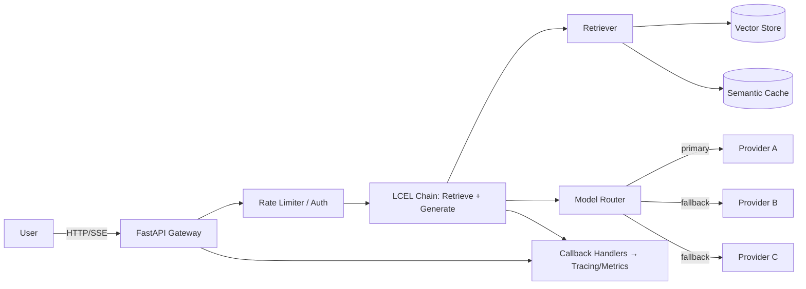

# Chapter 22: Interview Preparation

> "You don't rise to the level of your goals. You fall to the level of your training." — adapted from Archilochus

## Learning Objectives

By the end of this chapter, you will be able to:

- Answer the most common conceptual LangChain Core interview questions with model answers that demonstrate depth, not memorization
- Reason out loud through realistic debugging and system-design scenarios the way a senior engineer would, showing your thought process rather than just a final answer
- Walk an interviewer through a complete production RAG system design, touching architecture, retrieval strategy, resilience, and observability in one coherent narrative
- Diagnose broken or underperforming LCEL snippets on the spot, drawing on the mistake catalog built up across the course
- Explain how a real system evolves through maturity stages — prototype, hardened service, multi-provider platform — and what breaks at each transition
- Recall the entire 21-chapter arc of this course as a single mental map, organized by concern rather than by chapter number
- Walk into an interview room with a structured, provider-independent way of talking about LangChain that signals production experience, not tutorial-following

---

## Prerequisites for This Chapter

This chapter assumes you have completed the **entire course, Chapters 1–21**, and builds most directly on **[Chapter 21: Capstone Projects](./21-capstone-projects.md)**, where you assembled everything — LCEL composition, retrieval, resilience, observability, and the LangGraph bridge — into complete, tiered systems.

This is not a chapter that teaches new mechanics. It is a chapter that teaches **recall and articulation** — the skill of taking everything you already know and producing it, under time pressure, in the specific shapes that interviews demand: a crisp verbal answer, a live debugging trace, a whiteboard architecture, a diagnosis of a broken snippet. If a question below references a concept that feels unfamiliar, that is a signal to revisit the corresponding chapter before your interview, not a gap in this chapter.

No new setup is required. There is no code to run in this chapter — every snippet is a worked thought exercise, read and reasoned through, exactly as you would do at a whiteboard or in a phone screen with no IDE.

---

## 1. Frequently Asked Questions

These are organized by the same topic areas the course itself used. For each, a **model answer** — the kind of answer that shows you understand the "why," not just the "what."

### 1.1 Foundations & LCEL Philosophy

**Q1: What problem does LCEL solve that motivated its creation?**

Before LCEL, chaining LLM steps meant writing bespoke glue code: call the prompt formatter, pass the result to the model client, pass that result to a parser, and hand-roll async, batching, streaming, and retries yourself for every single chain. Every team reinvented this, inconsistently, and none of it composed — a chain built for synchronous `.invoke()` had no free path to streaming or batching.

LCEL's insight is that **prompt → model → parser** is fundamentally a pipeline of components that all satisfy the same interface. If every component implements `invoke`, `batch`, `stream`, and their async counterparts, then composing two components together automatically produces a new component that *also* implements all four — for free, without any additional code from the chain author. LCEL is a declarative composition layer over a uniform `Runnable` protocol. The problem it solves isn't "how do I call an LLM" — it's "how do I compose LLM-shaped steps so that streaming, batching, async, retries, and tracing are properties of the composition, not something each chain author reimplements."

**Q2: Explain the Runnable protocol. What's the minimum a class must implement to be composable in an LCEL chain?**

`Runnable` is the interface everything in LCEL implements: prompts, models, parsers, retrievers, and your own custom logic. At minimum, a `Runnable` needs `invoke(input, config=None)` for synchronous single-item execution. From that alone, the base class can derive naive default implementations of `batch` (loop over invoke), `ainvoke` (thread-pool wrap), `astream` (yield the single invoke result once), and so on — but a well-behaved implementation typically overrides `stream`/`astream` if it can genuinely produce incremental output (like a chat model streaming tokens), and overrides `batch`/`abatch` if it can genuinely parallelize (like an embeddings API that accepts a list). The protocol matters because the `|` (pipe) operator just wires two `Runnable`s together into a `RunnableSequence` — it works on *anything* satisfying the interface, whether that's a built-in prompt template or a hand-written `RunnableLambda`.

**Q3: `RunnableSequence` vs. `RunnableParallel` — what's the structural difference, and how does data flow through each?**

`RunnableSequence` (what you get from `a | b | c`) feeds output to input serially: `a`'s output becomes `b`'s input, `b`'s output becomes `c`'s input. It models a pipeline.

`RunnableParallel` (a dict of runnables, or `RunnableParallel(x=chain_x, y=chain_y)`) fans the *same* input out to every branch simultaneously and collects a dict of `{x: result_x, y: result_y}`. It models a fan-out/gather step — commonly used to run retrieval and question-passthrough side by side before feeding both into a prompt template that needs `{context}` and `{question}`.

The distinction matters operationally too: a `RunnableSequence`'s total latency is the *sum* of its steps' latencies; a `RunnableParallel`'s total latency is the *max* of its branches' latencies (assuming true concurrent execution under `ainvoke`), which is why fan-out is the default answer whenever independent sub-tasks can run at the same time.

**Q4: `RunnableParallel` vs. plain `asyncio.gather` — when would you reach for each?**

They solve overlapping problems but at different layers. `asyncio.gather` is a general Python primitive: give it a list of coroutines, get results back concurrently. It knows nothing about `RunnableConfig`, tracing, retries, or the rest of the LangChain ecosystem — you're on your own for propagating callbacks, run IDs, and tags into each coroutine.

`RunnableParallel` is `asyncio.gather` *specialized for the Runnable ecosystem*: it automatically propagates `RunnableConfig` (so LangSmith traces show each branch nested correctly under the parent run, and per-branch callbacks still fire), integrates with `.batch()` semantics, and composes with `|` like any other step in a chain.

Use `RunnableParallel` whenever the parallel branches are themselves `Runnable`s inside an LCEL chain — you want tracing, config propagation, and pipe-composability for free. Reach for raw `asyncio.gather` when you're orchestrating plain async Python functions that aren't part of an LCEL chain at all — e.g., fetching from three unrelated internal microservices with no need for LangSmith visibility into each call.

**Q5: Walk me through what happens, step by step, when you call `.invoke()` on a `prompt | model | parser` chain.**

This is the single most common "do you actually understand the internals" question. A strong answer walks through it mechanically:

1. `prompt | model | parser` builds a `RunnableSequence` at chain-construction time — no execution happens yet, this is just wiring three `Runnable`s together with `steps = [prompt, model, parser]`.
2. Calling `.invoke(input_dict, config)` on the sequence creates (or reuses) a `RunnableConfig` carrying callbacks, tags, metadata, and a run ID, then calls `prompt.invoke(input_dict, config)`.
3. The prompt template formats `input_dict` into either a string or a list of chat messages, emitting `on_prompt_start`/`on_prompt_end` callback events tagged with the run's context.
4. The prompt's output becomes the *input* to `model.invoke(prompt_output, config)`. The model wraps the call in `on_chat_model_start`/`on_llm_end` events, performs the actual network call to the provider, and returns an `AIMessage` (or similar).
5. That `AIMessage` becomes the input to `parser.invoke(ai_message, config)`, which extracts/transforms it — e.g., `StrOutputParser` pulls out `.content`, or a structured parser validates against a schema and raises if it fails.
6. The final parsed value is returned as the result of the outer `.invoke()` call, and the sequence's own `on_chain_end` callback fires, closing out the run tree that LangSmith (or any other callback handler) will have been receiving events from the whole way through.

The key insight to voice out loud: **the same `RunnableConfig` object (or a shallow-merged copy of it) is threaded through every step**, which is exactly how a single trace in LangSmith ends up showing a nested tree of prompt → model → parser instead of three disconnected, unrelated log entries.

### 1.2 Streaming & Async

**Q6: How does streaming work through a composed LCEL chain — does every step in the chain stream, or just the model?**

Streaming in LCEL is implemented via `.stream()`/`.astream()`, and it composes *transparently* through a `RunnableSequence` as long as each step is willing to pass partial output onward. In the common `prompt | model | parser` shape:

- The `prompt` step is not itself streamed — it runs once, synchronously, to produce the full formatted prompt (there's nothing to stream about formatting a string).
- The `model` step is where real incremental streaming happens: the chat model opens a streaming connection to the provider and yields `AIMessageChunk` objects as tokens arrive.
- Each chunk is passed *individually* through the remaining downstream steps. If the parser is a "transform-capable" parser (like `StrOutputParser`), it processes each incoming chunk and yields partial output immediately rather than buffering until the end.

The subtlety worth stating explicitly: not every `Runnable` can meaningfully stream. A step that needs the *entire* upstream output before it can do anything (e.g., a step that computes an embedding of the full generated answer) will necessarily buffer all incoming chunks internally before producing its own single output — it breaks the "chunk-by-chunk" illusion at that point in the pipeline, even though the chain as a whole still exposes a `.stream()` interface. Understanding this is what separates "I called `.stream()` and it worked" from actually reasoning about where in a chain buffering happens.

**Q7: What's the risk of a custom `RunnableLambda` that doesn't forward `RunnableConfig`?**

This is a classic "gotcha" question testing whether you've been bitten by it. When you write your own function and wrap it as `RunnableLambda(my_func)`, LangChain passes `config` as a second parameter if your function's signature accepts it. If you write `my_func(x)` instead of `my_func(x, config)` — or if you write `my_func(x, config)` but never pass `config` onward when your function internally calls *other* runnables — you silently break three things at once:

1. **Tracing goes dark.** LangSmith will show your `RunnableLambda` as a single opaque black box instead of a nested tree of whatever it called internally, because the child calls never received the parent's callback handlers.
2. **Cancellation and timeouts stop propagating.** If the outer chain enforces a timeout or the caller cancels the async task, any child runnable invoked without the forwarded config isn't part of that cancellation scope in the way it should be.
3. **Tags and metadata are lost.** Any tags/metadata set at the top of the chain (e.g., `{"tags": ["user:123", "experiment:v2"]}`) won't show up on the nested calls, breaking any filtering you were relying on in LangSmith or your logging pipeline.

The fix is mechanical but easy to forget under deadline pressure: always accept `config` in custom runnables that call other runnables, and always pass it through explicitly — `sub_chain.invoke(value, config=config)`, never `sub_chain.invoke(value)`.

**Q8: Explain the difference between `.batch()` and calling `.invoke()` in a loop.**

Superficially they look identical — both process a list of inputs and return a list of outputs. The difference is *how* the work is scheduled. `.batch()` is a declared contract that the runnable *may* execute all items concurrently (or truly batched, for providers whose APIs accept multiple inputs in one HTTP call) rather than one-at-a-time. Under the hood, the default `Runnable.batch()` implementation uses a thread pool (or, for `abatch`, `asyncio.gather`) to fire off all invocations concurrently, subject to a `max_concurrency` you can set in the config.

A naive `for x in inputs: results.append(chain.invoke(x))` is strictly sequential — total time is the sum of every individual call's latency. `.batch()` with adequate concurrency turns that sum into something close to the *max* of the individual latencies (bounded by rate limits and `max_concurrency`), which is a dramatic difference at scale — the gap between waiting 50 seconds and waiting 2 seconds for 50 short LLM calls.

### 1.3 Observability & Resilience

**Q9: What's the difference between a callback handler and LangSmith tracing?**

A **callback handler** is the general mechanism: any object implementing methods like `on_chain_start`, `on_llm_end`, `on_tool_error`, etc., that gets invoked at each lifecycle event as data flows through a `Runnable`. Callback handlers are a pluggable, provider-agnostic extension point — you can write one that logs to stdout, pushes metrics to Prometheus, redacts PII before writing to a file, or does nothing but count tokens.

**LangSmith tracing** is one specific, first-party consumer of that callback mechanism: a hosted (or self-hosted) service that receives the same lifecycle events and renders them as a nested, navigable trace tree in a UI, alongside latency, token usage, and cost per step. Enabling LangSmith is typically just setting environment variables (project name, API key, tracing flag) — under the hood, it registers its own callback handler that gets attached to every run's `RunnableConfig` automatically.

The reason to know the distinction cold: **you are never locked into LangSmith**. If your production compliance requirements forbid sending prompts to a third-party service, you can write a custom callback handler that ships the same events to your own observability stack (Datadog, an internal Kafka topic, whatever) — the callback protocol is the actual extension point, and LangSmith is a convenience built on top of it, not a hard dependency.

**Q10: How do you handle a provider outage in a production LangChain service?**

A layered answer, from cheapest/fastest mitigation to most expensive, demonstrates seniority here:

1. **Timeouts at the model level**, so a hung request doesn't tie up a worker/connection indefinitely — every chat model should be constructed with an explicit timeout, not the client's default.
2. **Retries with exponential backoff and jitter** for transient errors (5xx, rate limits, connection resets) — LangChain's `with_retry()` wraps a runnable to retry a bounded number of times before giving up, which handles blips but not sustained outages.
3. **Fallbacks to a secondary provider**, via `with_fallbacks()` — if the primary provider's chain raises after exhausting retries, the fallback chain (same interface, different provider) is invoked transparently. This is where the course's provider-independence theme pays off directly: because every model is wrapped behind the same `Runnable`/chat-model interface, a fallback chain is just another `prompt | model_b | parser` built against a different provider's chat model class, not a rewritten code path.
4. **Circuit breaking at the request layer**, so that once a provider is confirmed down, subsequent requests fail fast to the fallback immediately instead of paying the full retry-and-timeout cost on every single request during the outage window.
5. **Graceful degradation as the last resort** — returning a cached/stale answer, a "service temporarily degraded" message, or falling back to a smaller/cheaper local model, rather than a raw 500 to the end user.

The strongest answers explicitly separate "retry" (same provider, assume transient) from "fallback" (different provider, assume sustained) — conflating them is a common tell that a candidate has only read about resilience, not built it.

**Q11: When would you reach for LangGraph instead of plain LCEL?**

LCEL's composition model is fundamentally a **DAG of runnables evaluated once, forward**: data flows from input to output through a fixed graph shape, decided at chain-construction time (even `RunnableBranch`'s conditional routing is just picking *which* pre-built path to take, not building new structure at runtime). This is a great fit for anything expressible as "steps that run in a determined order, possibly with fan-out and branching."

LangGraph earns its keep once you need any of:

- **Cycles** — a step that may need to loop back to an earlier step (e.g., "critique the answer, and if it fails the critique, regenerate," repeated until a check passes or a max-iteration cap is hit). LCEL has no native looping construct; LangGraph models this natively as a graph with edges that can point backward.
- **Long-running, interruptible state** — a multi-turn agent that needs to persist its state across a human-in-the-loop pause (waiting for approval, waiting for a tool result that arrives asynchronously) benefits from LangGraph's checkpointing, which serializes and restores the graph's state, something LCEL has no concept of.
- **Dynamic control flow decided at runtime** by the LLM itself — a ReAct-style agent that decides after each step whether to call another tool, ask the user a question, or finish, is naturally a graph whose *traversal* is decided by model output at each node, not a fixed DAG.

A precise way to phrase the boundary in an interview: **LCEL composes steps; LangGraph orchestrates state machines.** Most production systems use both — LCEL chains as the well-tested, streaming-friendly building blocks *inside* individual LangGraph nodes, exactly as covered in the course's LangGraph bridge chapter.

**Q12: How would you test an LCEL chain that calls a real LLM, without making real API calls in CI?**

The layered testing strategy: unit tests substitute a `FakeListChatModel` or similar test double wherever a real chat model would go, so you can assert on prompt formatting, parser behavior, and branching logic deterministically and instantly, without network calls or nondeterministic model output. Integration tests, run less frequently (nightly, or gated behind a label), hit the real provider against a small fixed set of canary prompts and assert on structural properties (valid JSON, expected keys present) rather than exact text, since LLM output isn't byte-stable across runs. Evaluation-style tests (LLM-as-judge or rule-based scoring against a golden dataset) are a separate, slower-running suite altogether, tracking quality drift over time rather than pass/fail correctness. The point to make explicit: because every LangChain component honors the same `Runnable` interface, swapping a fake model in for a real one at test time requires no changes to the chain's composition — that substitutability is a direct dividend of the protocol-based design from Chapter 2.

---

## 2. Scenario-Based Questions

Interviewers ask these to see *how* you think, not just whether you land on the right answer. Structure your response as a visible process: symptom → hypotheses ranked by likelihood → how you'd confirm each → fix.

### Scenario A: "Your RAG chatbot is returning irrelevant answers. Walk me through your debugging process."

A strong answer moves from cheapest-to-check to most-expensive-to-check, and treats the RAG pipeline as a sequence of independently verifiable stages rather than one opaque black box:

1. **Isolate retrieval from generation first.** Before touching prompts, print the raw chunks the retriever returned for a handful of representative failing queries. If the retrieved chunks are already irrelevant, the bug lives in retrieval, not generation — don't waste time tweaking the prompt for a problem the prompt can't fix.
2. **Check the embedding/query mismatch class of bugs.** Was the corpus re-embedded with the same model currently used at query time? A silent model or dimension mismatch produces exactly this symptom — retrieval that looks "randomly bad" rather than "systematically wrong."
3. **Inspect chunking.** Are chunks too large (diluting the relevant sentence with unrelated surrounding text, dragging down similarity scores) or too small (losing necessary context, so a technically-relevant chunk reads as noise to the retriever)? Look at 3-5 actual stored chunks for a failing query directly.
4. **Check the similarity metric and index configuration.** Is the vector store configured with the distance metric the embedding model expects (cosine vs. dot product vs. L2), and are vectors normalized consistently at both index and query time?
5. **Only once retrieval is confirmed good, look at generation.** Is the prompt template actually inserting the retrieved context in the format the model expects? Is `k` (number of chunks retrieved) too low, cutting off a correct chunk that ranked 4th when only 3 are used? Is the model being asked to synthesize from context that's technically present but buried among too many distractor chunks?
6. **Add an evaluation harness**, even a lightweight one — a handful of labeled query→expected-chunk pairs — so future retrieval changes are measured against Recall@K rather than debugged anecdotally forever.

The signal an interviewer is listening for: you separated retrieval from generation as the very first move, because conflating them is the single most time-wasting mistake in RAG debugging.

### Scenario B: "Your streaming endpoint works locally but hangs in production behind a load balancer. What do you check?"

This scenario tests infrastructure awareness beyond the LangChain code itself:

1. **Buffering at the proxy/load balancer layer.** Many reverse proxies (and some ASGI server configurations) buffer the entire response before forwarding it, defeating streaming entirely — the client hangs waiting for the first byte because the LB is waiting for the *last* byte. Check whether the LB/proxy has response buffering disabled for this route, and whether `Content-Encoding` (e.g., gzip) is being applied in a way that forces full buffering.
2. **Server-Sent Events / chunked transfer headers.** Confirm the response actually sets the headers a streaming response needs (`Content-Type: text/event-stream` for SSE, no `Content-Length` header alongside chunked transfer) — an easy thing to get right locally (where the client and server share a process boundary loosely) and wrong in production behind infrastructure that infers behavior from headers.
3. **Timeouts stacked at multiple layers.** A load balancer often has its own idle-connection timeout, separate from the app server's and separate from the LangChain model's timeout. If the LLM takes 40 seconds to produce the first token but the LB kills idle connections after 30, the client sees a hang-then-drop that looks identical to an application bug.
4. **Whether the FastAPI handler is actually async all the way through.** A synchronous generator wrapped in an async endpoint, or a call to `.stream()` instead of `.astream()` inside an `async def` route, blocks the event loop and can silently serialize concurrent requests — fine with one local client, catastrophic with production concurrency.
5. **Confirm locally with the same topology**, not just the same code: run behind a local nginx or the same LB in a staging environment before concluding the fix works, since "works on localhost" specifically excludes the layer that's failing.

### Scenario C: "A teammate wants to add a new LLM provider. Walk through the changes needed in a well-architected LangChain Core codebase."

This scenario directly rewards the provider-independence architecture emphasized throughout the course:

1. **If the codebase was built correctly, this should be a narrow, additive change** — not a refactor. Look for where chat models are constructed: ideally behind a single factory function or a config-driven selection (`get_chat_model(provider="anthropic")`), not scattered as `ChatOpenAI(...)` literals throughout the codebase.
2. **Add the new provider's chat model class** to that factory, wire up its credentials/config the same way the others are wired (environment variables, secrets manager — consistent with existing providers), and confirm it satisfies the same interface (which, if it's a real LangChain integration package, it does by construction).
3. **Add it to the fallback chain**, if the system uses `with_fallbacks()` for resilience — deciding fallback *order* is itself a design decision worth discussing (cheapest-first vs. most-reliable-first vs. matched-by-capability).
4. **Confirm tool-calling / structured-output parity**, since not every provider supports the same tool-calling schema or JSON mode semantics — this is the most likely spot for the "narrow, additive change" assumption to break, if the new provider has quirks (e.g., different function-calling format) that the existing structured-output parsing code implicitly assumed away.
5. **Run the existing test suite against the new provider**, especially any evaluation/golden-dataset tests, since a different provider can produce structurally valid but qualitatively different output that changes downstream metrics even when nothing is "broken."
6. **Update observability tagging** so traces/metrics can be sliced by provider — you want to be able to answer "is provider B slower/more expensive/lower quality than provider A" from your dashboards on day one, not reconstruct it later from logs.

The answer that most impresses an interviewer names the specific place in the codebase where a *poorly* architected system would instead require touching a dozen files — that contrast is what demonstrates you understand *why* the abstraction exists, not just that it does.

### Scenario D: "A structured-output chain that was working fine starts intermittently raising validation errors after a routine model upgrade. Diagnose it."

1. **Confirm it's actually intermittent and not deterministic on certain inputs** — log every raw model output (before parsing) for a day and check whether failures cluster around particular input shapes (very long context, specific characters, particular requested schemas) or are truly random.
2. **Check whether the new model version changed its default formatting behavior** — a common cause is the model now wrapping JSON output in markdown code fences, adding a conversational preamble ("Sure, here's the JSON:"), or using slightly different key ordering/casing than the schema strictly expects, and the parser was written to expect the old model's exact output shape rather than being robust to reasonable variation.
3. **Check the retry/temperature configuration** — if temperature isn't pinned near 0 for structured-output tasks, sampling variance alone can intermittently produce malformed output, and this is more likely to surface after a version bump if the new model's sampling behavior shifted even slightly at the same temperature setting.
4. **Verify whether the schema validation itself is too strict** for legitimate variation (e.g., rejecting an extra field the model added that doesn't actually break anything downstream) versus catching genuinely malformed output — over-strict validation on a new model that behaves slightly differently but harmlessly will look identical to a real degradation.
5. **The fix, once diagnosed, is rarely "roll back the model forever"** — it's typically tightening the prompt's output-format instructions, adding a repair step (re-ask the model to fix its own malformed output, a cheap and often-effective pattern), or loosening validation to accept semantically-equivalent variation, then re-running the evaluation suite to confirm the fix doesn't regress quality elsewhere.

---

## 3. System Design Discussion

**Prompt:** *"Design a production RAG-based customer support system serving 10,000 daily users across 3 LLM providers, with a sub-second p50 latency target."*

Treat this like a real design conversation — state assumptions out loud, then build up layer by layer.

**Clarify scale and requirements first.** 10,000 daily users, assume a support-chat usage pattern (a handful of turns per session, bursty during business hours), sub-second p50 for the *user-perceived first token*, not necessarily the full answer — that framing matters, because it pushes the design toward streaming as a requirement, not a nice-to-have.

**Architecture, recapping the course's production shape:**



- **Gateway (FastAPI):** terminates the request, authenticates, applies per-user rate limiting, and opens a streaming (SSE or chunked) response back to the client immediately, forwarding tokens as the chain produces them — this is where the sub-second p50-to-first-token target is actually met or missed.
- **Retrieval layer:** a hybrid retriever (dense + lexical) over a vector store sized for the support corpus, with a **semantic cache** in front of it — a large fraction of support questions are near-duplicates of previous ones ("how do I reset my password"), so a cache keyed on query-embedding similarity above a threshold can serve a meaningful fraction of requests without touching the LLM at all, which is often the single biggest lever for both latency and cost at this scale.
- **Model router with three providers:** the router isn't just "provider A, then fallback to B, then C on failure" — at 10,000 daily users, it's also a place to route by *task shape*: cheap/fast provider for simple FAQ-style answers (perhaps detected via a lightweight classifier or confidence signal from retrieval), and a stronger/slower provider reserved for complex multi-turn troubleshooting, with the same fallback chain protecting against any single provider's outage.
- **Resilience:** every provider call wrapped with `with_retry()` for transient failures and `with_fallbacks()` across providers for sustained ones (Q10 above); circuit breaking so a confirmed-down provider is skipped without paying its timeout cost on every request during an incident.
- **Observability:** callback handlers feeding LangSmith (or an internal equivalent) tagged by provider, by user cohort, and by whether the semantic cache served the request — because the question "which provider is slow/expensive/low-quality right now" needs to be answerable from a dashboard, not reconstructed from logs during an incident.
- **Scaling considerations:** the FastAPI gateway scales horizontally behind a load balancer (stateless per-request, with session/memory state externalized to a store like Redis rather than kept in-process — critical for a multi-instance deployment); the vector store scales independently and is the more likely bottleneck at growth, since embedding lookups don't parallelize across instances the same trivial way stateless API replicas do; connection pooling and concurrency limits to each of the three providers need per-provider tuning, since providers differ in their rate-limit generosity.

**Where sub-second p50 is genuinely at risk, stated honestly:** retrieval itself (vector search plus any reranking step) has to complete, end to end, in well under the token-streaming budget, since it happens *before* the model call starts — this is exactly why the semantic cache matters as much as the model router does, and why reranking (if used) needs its own latency budget scrutinized rather than being treated as "free" quality improvement.

A strong closing line for this kind of question: name the one thing you'd measure first in production to know if the design is working — here, that's p50/p95 time-to-first-token broken out by cache hit vs. miss and by provider, because that single metric tells you simultaneously whether the cache is earning its keep and whether any one provider is dragging down the aggregate.

---

## 4. Practical Troubleshooting Exercises

Each of these presents a snippet or symptom. Diagnose it the way you would live, out loud, before checking the diagnosis underneath.

### Exercise 1

```python
def format_and_log(input_dict):
    print(f"Processing: {input_dict}")
    return prompt.invoke(input_dict)

chain = RunnableLambda(format_and_log) | model | StrOutputParser()
result = chain.invoke({"question": "What is LCEL?"}, config={"callbacks": [my_handler]})
```

**Diagnosis:** `format_and_log` takes only `input_dict`, so it never receives (and therefore never forwards) `config`. The inner call `prompt.invoke(input_dict)` runs with no config at all, meaning `my_handler` never sees the prompt step, and any tags/metadata set on the outer call are invisible to it — the trace will show a gap between the `RunnableLambda`'s own span and whatever happened inside it. The fix is to accept and forward config explicitly: `def format_and_log(input_dict, config): ...; return prompt.invoke(input_dict, config=config)`. This is Q7 from Section 1 made concrete.

### Exercise 2

```python
chain = prompt | model.bind(temperature=0.9) | JsonOutputParser()

for i in range(3):
    print(chain.invoke({"topic": "customer refund policy"}))
```

Symptom reported: about one in five runs raises a JSON parsing error in production, but it "always works" in the developer's manual testing.

**Diagnosis:** `temperature=0.9` is a high sampling temperature for a task that needs strictly valid, parseable JSON — the developer's manual testing simply didn't hit the unlucky sampling draw often enough to notice. The fix isn't to catch-and-retry blindly (though a repair-retry is a reasonable belt-and-suspenders addition); it's to recognize that structured-output tasks should run at low or zero temperature, since the goal is reliable format compliance, not creative variation. If some temperature is genuinely desired for the *content*, consider separating concerns: generate content at higher temperature into a plain string, then a second low-temperature pass to force it into the required schema — rather than asking one call to be both creative and perfectly structured.

### Exercise 3

```python
async def get_answer(question: str):
    retriever_results = retriever.invoke(question)
    docs_text = "\n".join(d.page_content for d in retriever_results)
    response = await chain.ainvoke({"context": docs_text, "question": question})
    return response
```

Symptom reported: under load testing with 50 concurrent requests, throughput is far lower than expected, and CPU/network utilization looks unexpectedly idle.

**Diagnosis:** `retriever.invoke(question)` is a *synchronous* call inside an `async def` function. It blocks the event loop for its full duration — no other coroutine can make progress while it runs, even though the surrounding function is declared `async`. Under concurrent load, every request's retrieval step ends up serialized behind the others despite the `await chain.ainvoke(...)` further down looking correctly async. The fix is `await retriever.ainvoke(question)`, using the async retriever interface throughout — a reminder that declaring a function `async def` doesn't make everything inside it non-blocking; every I/O-bound call inside it needs its own `await` on a truly async implementation.

### Exercise 4

```python
retriever = vectorstore.as_retriever(search_kwargs={"k": 4})
chain = (
    {"context": retriever, "question": RunnablePassthrough()}
    | prompt
    | model
    | StrOutputParser()
)
```

Symptom reported: this chain worked correctly against small test documents, but in production, answers frequently ignore clearly relevant information that the team confirmed *is* in the vector store.

**Diagnosis:** the dict step passes `retriever`'s raw output — a list of `Document` objects — directly as `{"context": [...]}` into the prompt template, which likely expects `context` to be a formatted string, not a Python list repr. Depending on how the prompt template stringifies the input, the model may be receiving something like `[Document(page_content='...', metadata={...}), Document(...)]` — noisy, truncated-looking, and burying the actual page content inside repr syntax rather than clean text. The fix is to insert a formatting step between retrieval and the prompt: `{"context": retriever | RunnableLambda(format_docs), "question": RunnablePassthrough()}`, where `format_docs` joins `d.page_content for d in docs` into a clean string — the same pattern as Scenario A's Section 5 debugging step, underscoring that "check what the model actually received" is the highest-leverage debugging move in this whole course.

---

## 5. Real-World Production Case Studies

These are illustrative composites — patterns seen repeatedly across teams building LLM systems — not a specific named company, presented to show how a system evolves through the maturity tiers implied by Chapter 21's capstone structure, and what typically breaks at each transition.

### Case Study A: The prototype that couldn't survive its first traffic spike

A small team built an internal documentation Q&A bot as a weekend prototype: a single `prompt | model | StrOutputParser()` chain behind a bare FastAPI endpoint, no streaming, no retries, hardcoded to one provider. It worked flawlessly in the demo. Two weeks after a company-wide rollout announcement, the endpoint started returning 502s during the morning traffic peak. The root causes, once investigated, were entirely predictable in hindsight: no timeout was set on the model client (so a single slow provider response held a worker thread indefinitely), no concurrency limit existed anywhere in the stack (so a burst of requests exhausted the provider's rate limit simultaneously, and every single one failed with no retry logic to smooth it over), and the lack of streaming meant every request held its connection open for the full generation time, compounding the thread-exhaustion problem under load. The fix wasn't a rewrite — it was adding exactly the resilience layer covered in Chapter 14 (timeouts, bounded retries, a fallback provider) and switching the endpoint to stream. **Lesson:** the gap between "demo works" and "survives real traffic" is almost entirely the resilience and streaming layer, not the core chain logic — and it's invisible until the first real spike exposes it.

### Case Study B: The multi-provider migration that broke structured output silently

A team running a production support-ticket classifier (structured JSON output routing tickets to departments) decided to add a second LLM provider purely for cost reasons — routing a fraction of low-stakes traffic to a cheaper model. Classification accuracy silently dropped by several points, but no errors were raised anywhere: the new provider's function-calling/structured-output implementation had subtly different behavior around optional fields, occasionally omitting a field the schema marked optional-but-expected, which the validator accepted as valid (since it was genuinely optional) but which downstream routing logic treated as "unclassified" and silently misrouted. It took a week of anecdotal customer complaints before anyone connected the accuracy dip to the provider split, because no per-provider evaluation metric existed — the team's evaluation harness measured aggregate accuracy only. The fix was adding provider as a dimension in the evaluation and observability stack (Chapter 11's tracing tags, applied specifically to segment metrics by provider) so a quality regression tied to one provider would show up in a dashboard within hours instead of surfacing through support tickets weeks later. **Lesson:** provider-independence at the code level (the whole point of the `Runnable` abstraction) does not imply behavioral-equivalence between providers — that has to be actively measured, per provider, forever, not assumed once at integration time.

### Case Study C: The chain that grew into an agent, painfully, because nobody planned for it

A customer-facing assistant started as a clean LCEL RAG chain: retrieve, then generate. Over several product cycles, requirements grew — "also check the user's account status via an internal API before answering," "also let the model decide whether to escalate to a human," "also retry with a different retrieval strategy if the first attempt's answer gets a low user rating." Each requirement was bolted on as another `RunnableBranch` or nested `RunnableLambda`, and by the third addition, the "chain" was an unreadable tangle of conditionals with implicit, undocumented ordering dependencies between branches, and — critically — no way to let the model *loop back* and try again within a single turn, since LCEL's DAG shape has no native cycle. The team's eventual fix, and the natural one, was recognizing they had organically built something that wanted to be a state machine with conditional edges and retries, which is precisely what LangGraph is for (Chapter 20's bridge) — they migrated the branching logic into a small LangGraph graph with 4-5 nodes, kept every individual LCEL chain from the original system intact as node implementations (no need to rewrite tested logic), and immediately gained the looping and human-in-the-loop capability the tangled `RunnableBranch` version could never cleanly express. **Lesson:** the signal that you've outgrown plain LCEL isn't "the chain got complicated" — it's specifically "the control flow needs to loop, pause for external input, or be decided dynamically at runtime by the model's own output." That's the exact line the course draws between Chapters 1-19 and Chapter 20.

---

## 6. The Whole Course as a Concept Map

Interviews reward the ability to place any single question in its larger context — "this is a retrieval question," "this is a resilience question" — rather than answering in a vacuum. Here is the entire course, organized by concern rather than by chapter number, as a map for recall.

```mermaid
flowchart TB
    subgraph FOUND["Foundations"]
        C1["Ch 1: Why LCEL — the problem it solves"]
        C2["Ch 2: The Runnable protocol"]
        C3["Ch 3: Prompts & templates"]
        C4["Ch 4: Chat models & provider abstraction"]
        C5["Ch 5: Output parsers & structured output"]
    end

    subgraph COMP["Composition (LCEL)"]
        C6["Ch 6: The pipe operator & RunnableSequence"]
        C7["Ch 7: RunnableParallel / Branch / Lambda"]
        C8["Ch 8: RunnableConfig, callbacks, context propagation"]
        C9["Ch 9: Memory & conversational state"]
        C13["Ch 13: Streaming & batching internals"]
        C16["Ch 16: Async & concurrency patterns"]
    end

    subgraph DATA["Data & Retrieval"]
        C10["Ch 10: Retrieval & RAG integration"]
        C12["Ch 12: Tool calling & function binding"]
        C18["Ch 18: Caching & cost optimization"]
    end

    subgraph PROD["Production Concerns"]
        C11["Ch 11: Observability & LangSmith tracing"]
        C14["Ch 14: Resilience — retries, fallbacks, timeouts"]
        C15["Ch 15: Testing & evaluation"]
        C17["Ch 17: Common mistakes & anti-patterns"]
        C19["Ch 19: Production architecture & FastAPI deployment"]
    end

    subgraph BEYOND["Beyond Core"]
        C20["Ch 20: LangGraph bridge — cycles & state machines"]
        C21["Ch 21: Capstone projects"]
        C22["Ch 22: Interview preparation (you are here)"]
    end

    FOUND --> COMP
    COMP --> DATA
    DATA --> PROD
    PROD --> BEYOND
```



The mental shortcut worth carrying into any interview: **Foundations** gives you the vocabulary (Runnable, prompt, model, parser). **Composition** gives you the grammar (how pieces combine — sequence, parallel, branch, config propagation, memory, streaming, async). **Data & Retrieval** gives you the domain knowledge RAG and tool-using systems need. **Production Concerns** gives you everything that separates a demo from a service — observability, resilience, testing, and the mistake patterns that recur across all of it. **Beyond Core** is where you learned the boundary of LCEL itself and how to extend past it. Any interview question can be located on this map before you answer it — naming which quadrant a question lives in, out loud, is itself a strong opening move that buys you thinking time and signals structure.

---

## Real-World Scenario

Section 5 above covers three full case studies. One more focused vignette, sized for a single interview answer:

**A candidate is asked:** "Tell me about a time you had to debug a production LLM system issue." A weak answer describes a bug and a fix with no structure. A strong answer — modeled on Case Study A above — narrates it in four beats: **symptom** (502s during peak traffic, no error pattern obvious from surface logs), **hypothesis-and-elimination** (ruled out the model logic itself first, since it worked identically under low load — pointed toward an infrastructure/concurrency cause rather than a chain-logic bug), **root cause** (missing timeouts plus missing concurrency limits, compounded by a non-streaming endpoint holding connections open), **fix and verification** (added timeouts, bounded retries, a fallback provider, switched to streaming, then re-ran the same load test that originally triggered the incident to confirm the fix, rather than assuming it was fixed). That four-beat shape — symptom, hypothesis, root cause, verified fix — is the shape every debugging answer in this chapter has followed, deliberately, because it's the shape interviewers are listening for.

---

## Best Practices

An interview-day checklist for how to carry this course's material into the room:

- **State assumptions before answering system-design questions.** Scale, latency target, and consistency requirements change the right answer completely — asking "what's the expected traffic pattern?" before diving into architecture reads as senior, not evasive.
- **Separate diagnosis from fix, out loud.** Narrate your hypotheses in order of likelihood before jumping to a solution — this is what turns a guess into a demonstrated debugging process (Section 2 and Section 4 above are written in exactly this shape for a reason).
- **Lead with the provider-independence framing whenever relevant.** This course's central architectural theme — that prompts, models, and parsers are interchangeable behind a uniform interface — is a differentiator versus candidates whose only experience is with one vendor's SDK. Say explicitly when a design choice exists *because* of that abstraction (fallback chains, provider-routed cost optimization, testable chains via fake models).
- **Name the LCEL/LangGraph boundary precisely** rather than vaguely — "LCEL composes fixed-shape pipelines, LangGraph orchestrates state machines with cycles and runtime-decided control flow" is a complete, confident answer; "LangGraph is for more complex stuff" is not.
- **Quantify wherever you can**, even roughly — "batching turns the sum of latencies into roughly the max" is more convincing than "batching is faster."
- **Volunteer the trade-off, not just the choice.** Every answer in this chapter that says "use X" also says "instead of Y, because Z" — that contrast is what interviewers are actually grading.
- **If you don't know something, say what you'd do to find out**, rather than guessing confidently — "I'd check the provider's docs for their function-calling schema differences" is a legitimate, senior-sounding answer to a question you can't answer from memory.

---

## Common Mistakes

Interview-specific misconceptions that reliably signal a candidate hasn't gone past tutorial-level LangChain usage:

- **Conflating "LangChain" with "prompt engineering."** LangChain Core's value is composition, streaming, async, provider abstraction, and observability infrastructure — not writing better prompts. A candidate who only talks about prompt wording when asked about LangChain hasn't engaged with what the framework actually provides.
- **Not knowing the difference between "LangChain" (the whole ecosystem — community integrations, LangGraph, LangSmith, LangServe) and "LangChain Core" (the `Runnable` protocol and LCEL specifically).** These are different packages with different stability guarantees, and conflating them makes it hard to answer precise questions about what's actually being used in a given system.
- **Describing `RunnableParallel` and `asyncio.gather` as interchangeable** with no mention of config propagation, tracing, or ecosystem integration (Q4) — a common shallow answer that misses the actual reason `RunnableParallel` exists as a distinct concept.
- **Treating retries and fallbacks as the same resilience mechanism.** Retrying the same provider and failing over to a different provider address different failure modes (transient vs. sustained) and conflating them in an answer is a reliable tell.
- **Claiming a chain "streams" without being able to say which step in the chain actually produces incremental output** — streaming is a property of specific steps composing correctly (Q6), not a blanket property of "using LangChain."
- **Overreaching into LangGraph for problems that don't need it** — describing every multi-step system as needing a graph, when a fixed-order LCEL sequence with no cycles or dynamic control flow would be simpler, more testable, and easier to reason about. Reaching for the more powerful tool by default, rather than by need, is itself a signal of inexperience, not expertise.
- **Forgetting that structured output reliability is a temperature/prompt-design problem as much as a parsing problem** — blaming "the parser" for failures that actually originate from high-temperature sampling or ambiguous prompt instructions (Exercise 2).

---

## Summary

This chapter, and this course, close on the same idea they opened on: LangChain Core's entire value proposition is a **uniform `Runnable` interface that makes composition, streaming, batching, async, retries, fallbacks, and tracing properties of how you wire components together — not something you reimplement per chain.** Every question and scenario in this chapter is really just that one idea, examined from a different angle: interviewers ask about `RunnableParallel` vs. `asyncio.gather` to see if you understand what the abstraction buys you; they ask about provider outages and provider swaps to see if you've internalized provider-independence as an architectural property, not a marketing claim; they ask about LangGraph to see if you know the abstraction's boundary as precisely as its interior.

Across the 21 chapters before this one, you built that understanding in layers: the **Foundations** (Chapters 1-5) gave you the vocabulary; **Composition** (Chapters 6-9, 13, 16) gave you the grammar for wiring pieces together correctly, including the config-propagation discipline that silently breaks so many custom components; **Data & Retrieval** (Chapters 10, 12, 18) gave you the domain knowledge for RAG and tool-using systems; **Production Concerns** (Chapters 11, 14, 15, 17, 19) gave you everything that separates a working demo from a system that survives real traffic, real outages, and real cost pressure; and **Beyond Core** (Chapters 20-21) showed you where LCEL's DAG model ends and LangGraph's state-machine model begins, then let you build complete systems that exercise the whole stack.

An interview is a compressed, high-pressure version of exactly the reasoning you've been practicing throughout this course: given a symptom, a requirement, or a broken snippet, work outward from what you know about the `Runnable` protocol, and reason to an answer rather than recalling one. That's a skill, not a script — and skills only get sharper with deliberate practice, which is exactly what the exercises below and Chapter 21's capstones are for.

---

## Knowledge Check

1. Explain, in your own words, why the `Runnable` protocol being uniform across prompts, models, parsers, and your own custom code is the single architectural decision that makes almost everything else in this course possible. Give two concrete capabilities that would break or require reimplementation without it.
2. A colleague proposes replacing a `with_fallbacks()`-protected model call with a bare `try/except` around a single provider call, arguing it's simpler. What do they lose?
3. Walk through, step by step, what happens to a `RunnableConfig` object as it flows through a `prompt | model | parser` chain, and explain precisely what breaks if a custom `RunnableLambda` inserted between `prompt` and `model` fails to forward it.
4. You inherit a system with a deeply nested `RunnableBranch` that has grown to eight conditional paths, some of which need to re-run an earlier step based on the model's own output. What two specific properties of this requirement tell you it's a LangGraph candidate rather than a "just add one more branch" fix?
5. A production RAG system's retrieval quality degrades gradually over several months with no single deploy correlated to the drop. List three hypotheses you'd investigate, ordered by how cheap each is to check first.
6. Explain the difference between a chain that "supports streaming" at the API level and a chain that "actually streams" in practice for a given input, and describe one composition pattern from this course that would silently turn the latter back into the former.

---

## Hands-On Exercise

Run yourself through a mock interview, without looking at the model answers above until you've committed to your own:

1. **Pick three FAQ questions** from Section 1 — at least one from Foundations/LCEL, one from Streaming/Async, and one from Observability/Resilience — and answer each one out loud (or written, timed to about 90 seconds each, as if a real interviewer were listening) before checking your answer against the model answer above. Note specifically what you left out, not just what you got wrong.
2. **Pick one scenario question** from Section 2 and narrate your full debugging process out loud, in the symptom → hypothesis → root cause → fix shape used throughout this chapter, before reading the model answer. Time yourself — aim for under four minutes for the full narration.
3. **Compare and self-grade** using these criteria: did you state assumptions before diving in where relevant (system-design and scenario questions especially)? Did you separate diagnosis from fix rather than jumping straight to a solution? Did you name a trade-off, not just a choice? Did you connect your answer back to the broader architectural theme (provider-independence, the `Runnable` protocol, or the LCEL/LangGraph boundary) where it was relevant to do so?
4. **Bonus:** find a friend, colleague, or another engineer familiar with LangChain and have them cold-ask you one FAQ question and one scenario question you haven't specifically prepared, drawn from anywhere in this chapter. Answering material you've reviewed but not specifically rehearsed is the closest rehearsal gets to the real thing.

---

## Further Reading

- **[Course Index](./00-index.md)** — the full 22-chapter map of this course, for revisiting any chapter referenced in this one before your interview
- **[Chapter 21: Capstone Projects](./21-capstone-projects.md)** — the natural next step for continued hands-on practice: rebuilding or extending a capstone tier is a better rehearsal for system-design interviews than re-reading notes
- **[RAG Course Index](../rag-course/00-index.md)** — deeper treatment of retrieval, chunking, embeddings, and evaluation for anyone whose interview loop leans heavily on RAG-specific system design
- **[LLM Fundamentals Course Index](../llm-fundamentals-course/00-index.md)** — the underlying model behavior (sampling, context windows, tokenization, function-calling formats) that several of this chapter's troubleshooting exercises assume

### Where to Go From Here

If this chapter is the last thing you read before an interview, you've done the reviewing out of order — go back to **[Chapter 20](./20-langgraph-bridge.md)** and **[Chapter 21](./21-capstone-projects.md)** first. Chapter 20 is where the LCEL-vs-LangGraph boundary this chapter keeps returning to was actually built up carefully, with worked examples; Chapter 21 is where you exercised the entire stack — composition, retrieval, resilience, observability — end to end, under conditions closer to a real system than any single chapter could provide alone. Interview preparation is not a substitute for that practice; it's a way of making sure the practice is retrievable under pressure. The most reliable way to improve on everything in this chapter is not to re-read it, but to go back and extend a capstone: add a fourth provider, introduce a deliberate outage and watch your fallback chain catch it, or take a fixed LCEL chain and migrate its control flow into LangGraph the way Case Study C describes. That's where the answers in this chapter stop being things you remember and start being things you've actually done.

---

<div style="display:flex;justify-content:space-between;align-items:center;">
  <a href="./21-capstone-projects.md">← Previous: Capstone Projects</a>
  <a href="./00-index.md">🏠 Index</a>
  <span></span>
</div>
