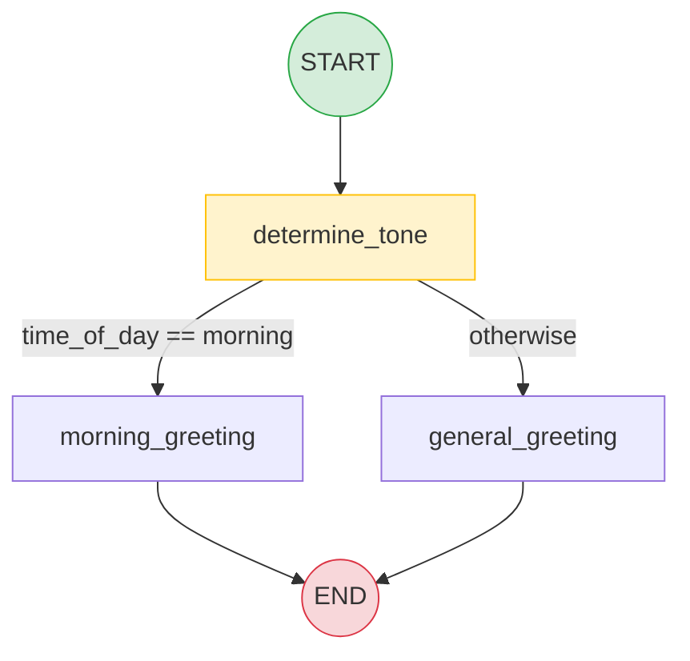

# Chapter 1: Introduction & Prerequisites

> "A chain is a fixed path. A graph is a space of possible paths." — this is the entire reason LangGraph exists.

## Learning Objectives

By the end of this chapter, you will be able to:

- Explain precisely why LCEL chains and hand-rolled `while` loops break down once a workflow needs branching, retries, cycles, or long-running state
- Describe LangGraph's core mental model — a state machine of **State → Node → Update State → Next Node → Repeat** — without writing a line of code
- Define, precisely, the vocabulary you'll use for the rest of this course: `Graph`, `StateGraph`, `State`, `Node`, `Edge`, `START`, `END`, `compile()`, `invoke()`
- Trace state as it flows through a minimal `START → Node A → Node B → END` graph
- Articulate how LangGraph sits *above* LangChain Core — nodes wrap Runnables, LangGraph orchestrates them
- Apply clear decision criteria for choosing an LCEL chain versus a LangGraph graph for a given problem
- Set up a LangGraph project from scratch: correct packages, project layout, and a working "hello graph"
- Preview the three mini projects (Greeting, Calculator, Translation) that anchor the hands-on thread of this course, and build the first one end-to-end

---

## Prerequisites for the Chapter

This is the first content chapter of the course, so there's no prior LangGraph chapter to build on — but it assumes real, working fluency in the tools that came before LangGraph in your career:

- **LangChain Core (Runnables/LCEL)**: you should already be comfortable with `Runnable`, the pipe (`|`) operator, `RunnableLambda`, `RunnablePassthrough`, `RunnableParallel`, prompt templates, chat models, output parsers, and `.invoke()`/`.stream()`/`.batch()` on a chain. If any of that is fuzzy, work through the companion [LangChain Core course](../langchain-core-course/00-index.md) first — this chapter constantly contrasts LangGraph against that foundation and won't re-teach it.
- **Python**: type hints (including `Annotated`), `TypedDict`, dataclasses, and basic `async`/`await` syntax. LangGraph's state definitions lean heavily on typed dictionaries and Pydantic models, both introduced properly in Chapter 2, but you should recognize the syntax on sight.
- **General agent/LLM vocabulary**: what a "tool call" is, what a "system prompt" is, and the rough shape of the ReAct-style reasoning loop (think → act → observe → repeat). You don't need to have built one yet — Chapter 8 covers tool-calling patterns in depth.
- **Command line comfort**: creating virtual environments and installing packages with `pip`.

No LangGraph-specific knowledge is assumed. That's exactly what this chapter builds from zero.

---

## 1. Why LangGraph Exists

### 1.1 What plain LCEL chains are good at

An LCEL chain is a **fixed, linear (or simple branching) pipeline** of Runnables composed with `|`:

```python
chain = prompt | model | output_parser
result = chain.invoke({"topic": "space travel"})
```

This is genuinely excellent for what it is: a **directed acyclic pipeline** where data flows in one direction, through a known, static sequence of transformations, exactly once. `RunnableParallel` lets you fan out to several branches and merge results; `RunnableBranch` (or a `RunnableLambda` doing manual dispatch) gives you a *little* conditional logic. For "prompt in, structured answer out" use cases — summarization, extraction, classification, single-shot RAG — a chain is the right level of abstraction, and reaching for anything heavier is over-engineering.

### 1.2 Where chains hit a wall

The trouble starts the moment your workflow needs any of the following, all of which are common in real agentic systems:

**Cycles.** A ReAct agent doesn't run once — it calls a tool, looks at the result, decides whether to call another tool or stop, and repeats. That's a loop, not a pipeline. LCEL's composition operators build **acyclic** graphs; there is no `|` syntax for "go back to the previous step conditionally." You end up hand-rolling a `while True` loop around the chain, which brings you to the next problem.

**Conditional branching that depends on runtime output.** "If the model produced a tool call, go run the tool; if it produced a final answer, stop; if it asked a clarifying question, wait for the human" is a three-way branch decided by *inspecting the LLM's output at runtime*. `RunnableBranch` supports condition-based branching, but nothing in Core is designed to make that branching **resumable**, **inspectable**, or **combinable with loops** — it's a one-shot conditional, not a persistent execution graph.

**Long-lived, evolving state.** A chain's "state" is whatever gets passed as input and threaded through each step's output — there's no first-class notion of a growing conversation history, a running list of tool results, or a set of fields that different steps read and write independently. You can smuggle state through a dictionary that flows step to step, but nothing enforces *how* concurrent branches merge their updates to that dictionary, and nothing persists it across process restarts.

**Durability across failures.** If your process crashes mid-chain, the chain is gone. There's no built-in mechanism to say "resume exactly where you left off, with the exact state you had, three tool calls into a five-tool-call agent run." For a request/response chain that takes two seconds, that's fine — replay the whole thing. For a workflow that runs for minutes or hours, involves external side effects (sending an email, charging a card), or needs to survive a container restart, replaying from scratch is unacceptable — you might double-charge the card.

**Human-in-the-loop pauses.** Many production workflows need to stop, wait — possibly for hours or days — for a human to approve, correct, or supply information, and then resume with full context intact. A Python function call has no way to "pause" and give control back to an external caller for an indefinite time and then pick up later with local variables intact. You'd need to serialize your entire call stack manually, which nobody does by hand.

**Hand-rolled `while` loops as the "solution".** The natural workaround engineers reach for is:

```python
state = {"messages": [...], "iterations": 0}
while True:
    response = model_chain.invoke(state)
    if response.tool_calls:
        state["messages"].append(response)
        for call in response.tool_calls:
            result = run_tool(call)
            state["messages"].append(result)
    else:
        break
    state["iterations"] += 1
    if state["iterations"] > MAX_ITER:
        break
```

This *works*, in the sense that it runs. But every production concern is now something **you** must build and maintain by hand: How do you persist `state` so a crash doesn't lose it? How do you pause this loop for a human review step without blocking a thread for hours? How do you stream partial progress to a UI while the loop is running? How do you visualize this control flow for a teammate, or unit-test one iteration of the loop in isolation? How do you run two independent branches of tool calls concurrently and merge their results deterministically? Every one of these becomes bespoke, project-specific infrastructure — and every team that builds agents ends up reinventing a worse version of the same thing.

### 1.3 The problem a dedicated orchestration graph solves

LangGraph's premise is: **model the workflow explicitly as a graph of nodes and edges, with a well-defined state object that flows between them, and let a runtime own the execution loop, the persistence, the branching, and the pausing** — so you write *what each step does* and *how steps connect*, and the framework handles *running it correctly, durably, and observably*.

Concretely, LangGraph gives you, "for free," things the hand-rolled loop above must reinvent:

| Concern | Hand-rolled loop | LangGraph |
|---|---|---|
| Cycles / retries | Manual `while`/`break` logic | Native — edges can point back to earlier nodes |
| Conditional branching | Nested `if`/`else` inside the loop | Declarative `add_conditional_edges` |
| State shape & merging | Ad hoc dict mutation | Typed `State` schema with **reducers** (Chapter 6) governing merges |
| Crash recovery | None, unless you build it | **Checkpointers** persist state after every step (Chapter 9) |
| Human pauses | Not really possible without external orchestration | `interrupt()` pauses the graph; `Command(resume=...)` continues it (Chapter 12) |
| Observability | `print` statements | Structured execution, LangSmith tracing (Chapter 20) |
| Streaming | Manual generator plumbing | Built-in `stream_mode`s (Chapter 11) |
| Concurrency | Manual `asyncio.gather` + manual merge logic | Fan-out/fan-in with reducer-based merging (Chapter 13) |

This is the same shift you've already lived through once in your career: FastAPI didn't give you new HTTP semantics that raw sockets couldn't express — it gave you a **framework** that handled routing, validation, and serialization so you stopped hand-writing that plumbing for every endpoint. LangGraph is that same move for **stateful, cyclic, agentic workflows** that plain LCEL chains and Python loops were never designed to own.

---

## 2. The Core Mental Model: LangGraph as a State Machine

Before any code, internalize this loop. It is the single idea every other concept in this course is built on top of:

```
        ┌─────────────────────────────────────────────┐
        │                                               │
        ▼                                               │
   ┌─────────┐      ┌──────┐      ┌──────────────┐      │
   │  STATE  │ ───▶ │ NODE │ ───▶ │ UPDATE STATE │ ─────┘
   └─────────┘      └──────┘      └──────────────┘
        │                                │
        │                                ▼
        │                        ┌───────────────┐
        └──────────────────────▶ │  NEXT NODE?    │
                                 │ (edge / router) │
                                 └───────────────┘
                                        │
                                        ▼
                                    ...repeat...
                                        │
                                        ▼
                                     ┌─────┐
                                     │ END │
                                     └─────┘
```

Read it as a sentence: **the graph holds a State; a Node receives the current State, does some work, and returns an update; LangGraph merges that update into the State; an Edge decides which Node runs next; repeat until an Edge points to END.**

Every single LangGraph application you will ever build — a two-node greeting bot, a twenty-node multi-agent research platform — is this loop, just with more nodes, richer state, and smarter edges. Nothing conceptually new gets added later in the course; later chapters deepen *each piece* of this loop (how state merges — Chapter 6; how nodes are structured — Chapter 3; how edges route dynamically — Chapters 4-5), but the loop itself doesn't change.

Two things about this loop are easy to under-appreciate on first read, so make them explicit:

1. **The State is the single source of truth.** Nodes don't pass data directly to each other (no `nodeA_output` variable handed to `nodeB`). Every node reads from, and writes back to, one shared State object. This is what makes the graph inspectable, checkpointable, and resumable — at any point in execution, "what has happened so far" is entirely captured by the current value of State.
2. **A Node's job is narrow: read State in, return a partial update out.** It does not decide what happens next — that's the Edge's job. This separation (nodes do work, edges decide flow) is what makes conditional routing, cycles, and human-in-the-loop pauses possible without rewriting node logic.

---

## 3. Core Concepts, Defined Precisely

You'll meet these names constantly for the rest of the course. Get precise definitions now so nothing later is vague.

### 3.1 Graph

The overall structure: a set of **Nodes** connected by **Edges**, plus a **State** schema that defines what data flows between them. Conceptually, it's a directed graph (with cycles allowed, unlike an LCEL chain) describing every possible path your workflow can take.

### 3.2 StateGraph

The concrete Python class you use to *build* a Graph: `langgraph.graph.StateGraph`. You instantiate it with a state schema, register nodes and edges on it, then call `.compile()` to turn the *definition* into a *runnable* object. Think of `StateGraph` as the builder/blueprint, and the compiled graph as the executable artifact — the same relationship a FastAPI `APIRouter` has to the running ASGI app once mounted.

### 3.3 State

A schema (a `TypedDict`, a `dataclass`, or a Pydantic `BaseModel` — Chapter 2 covers the trade-offs) describing the shape of the data that flows through the graph. It is the *only* channel through which nodes communicate. A minimal example:

```python
from typing import TypedDict

class GreetingState(TypedDict):
    name: str
    greeting: str
```

Every node receives an instance of this shape (or a dict conforming to it) and returns a **partial update** — just the keys it wants to change, not the whole object.

### 3.4 Nodes

A Node is a Python callable (usually a plain function, but it can wrap an LCEL Runnable, an async function, or a class with `__call__`) that:

- Takes the current State (and optionally a `config`) as input
- Does some unit of work — call an LLM, call a tool, hit a database, run business logic
- Returns a **dict of updates** to merge into State

```python
def build_greeting(state: GreetingState) -> dict:
    return {"greeting": f"Hello, {state['name']}!"}
```

A node never mutates State in place and never decides "what runs next" — it just answers "given what I was handed, what changed?" Chapter 3 goes deep on node design patterns (LLM nodes, tool nodes, database/API nodes, and the execution contract nodes must honor).

### 3.5 Edges

An Edge connects one node's output to the next node that should run. LangGraph has two kinds:

- **Normal edges** (`add_edge`): unconditional — "after Node A, always run Node B."
- **Conditional edges** (`add_conditional_edges`): a routing function inspects the current State and returns the name of whichever node should run next (or `END`). This is how branching and cycles are expressed declaratively, instead of as nested `if` statements inside a hand-rolled loop.

### 3.6 START and END

Two special sentinel nodes, imported from `langgraph.graph`, that mark the graph's entry and exit points. `START` is where execution always begins; any edge pointing to `END` terminates that execution path. Every graph needs at least one edge from `START` and at least one path that reaches `END` (or an explicit recursion limit will eventually stop it — covered in Chapter 7).

### 3.7 compile()

`StateGraph.compile()` validates the graph definition (checking, among other things, that every node is reachable and the state schema is consistent) and returns a `CompiledGraph` — the actual runnable object. You build the graph's *shape* with `add_node`/`add_edge` calls, then `compile()` locks it into something you can invoke, stream, or persist. This is also where you attach a **checkpointer** for durable execution (`.compile(checkpointer=...)`, previewed in Section 7, covered fully in Chapter 9).

### 3.8 invoke()

The method you call on a compiled graph to run it synchronously start-to-finish: `compiled_graph.invoke(initial_state)`. It runs the State → Node → Update → Next Node loop internally until an edge routes to `END`, then returns the final State. LangGraph also exposes `.stream()` (Chapter 11) for observing intermediate steps as they happen, and async equivalents (`.ainvoke()`, `.astream()`) for use inside FastAPI async routes — directly relevant given this course assumes FastAPI familiarity.

---

## 4. Basic Architecture Walkthrough: START → Node A → Node B → END

Let's trace state through the simplest possible non-trivial graph — two nodes in sequence — before writing any LLM-calling code. This is deliberately boring so the *mechanics* are crystal clear.

```python
from typing import TypedDict
from langgraph.graph import StateGraph, START, END


class PipelineState(TypedDict):
    raw_text: str
    cleaned_text: str
    word_count: int


def clean_node(state: PipelineState) -> dict:
    cleaned = state["raw_text"].strip().lower()
    return {"cleaned_text": cleaned}


def count_node(state: PipelineState) -> dict:
    count = len(state["cleaned_text"].split())
    return {"word_count": count}


builder = StateGraph(PipelineState)
builder.add_node("clean", clean_node)
builder.add_node("count", count_node)

builder.add_edge(START, "clean")
builder.add_edge("clean", "count")
builder.add_edge("count", END)

graph = builder.compile()

result = graph.invoke({"raw_text": "  Hello LangGraph World  "})
print(result)
# {'raw_text': '  Hello LangGraph World  ', 'cleaned_text': 'hello langgraph world', 'word_count': 3}
```

Trace it exactly as the mental model predicts:

1. **State enters** at `START` as `{"raw_text": "  Hello LangGraph World  "}`. Note `cleaned_text` and `word_count` aren't provided yet — `TypedDict` doesn't require every key to be present at every point, only that when a key *is* present, its type matches (Chapter 2 covers this precisely, including how to make fields required vs. optional).
2. **`START → clean`** is a normal edge, so `clean_node` runs next, unconditionally.
3. **`clean_node` receives the full State**, reads `raw_text`, and returns `{"cleaned_text": "hello langgraph world"}` — only the key it changed.
4. **LangGraph merges** that update into State. State is now `{"raw_text": ..., "cleaned_text": "hello langgraph world"}`.
5. **`clean → count`** fires next. `count_node` receives the *updated* State (it can see `cleaned_text`), computes a word count, and returns `{"word_count": 3}`.
6. **State merges again** → `{"raw_text": ..., "cleaned_text": ..., "word_count": 3}`.
7. **`count → END`** fires, execution stops, and `invoke()` returns the final, fully-populated State.

Notice what didn't happen: `clean_node` never called `count_node` directly, never returned control flow instructions, and never knew what ran after it. It just transformed State. The *graph definition* — the `add_edge` calls — owns the flow. That decoupling is what lets you later swap a normal edge for a conditional one (Chapter 4) without touching a single node's internals.

---

## 5. How LangGraph Relates to LangChain Core

This is the relationship engineers coming from LangChain Core most often get backwards, so state it precisely: **LangGraph does not replace LCEL — it orchestrates it.** A Node's body is very often just an LCEL Runnable invoked directly:

```python
from langchain_core.prompts import ChatPromptTemplate
from langchain_core.output_parsers import StrOutputParser
from langchain_openai import ChatOpenAI

summarize_chain = (
    ChatPromptTemplate.from_template("Summarize in one sentence:\n\n{text}")
    | ChatOpenAI(model="gpt-4o-mini")
    | StrOutputParser()
)

def summarize_node(state: DocState) -> dict:
    summary = summarize_chain.invoke({"text": state["document"]})
    return {"summary": summary}
```

`summarize_chain` here is *exactly* the kind of Runnable you already know how to build. The node is a thin adapter: unpack what the chain needs out of State, call `.invoke()` on the chain, repack the result as a State update. Nothing about LCEL changes inside LangGraph — prompt templates, output parsers, `RunnableParallel`, streaming callbacks, all of it works precisely as it does today.

The layering, top to bottom, looks like this:

```
┌─────────────────────────────────────────────┐
│  LangGraph                                    │
│  orchestration: state, control flow,          │
│  cycles, persistence, human-in-the-loop       │
│  ┌─────────────────────────────────────────┐  │
│  │  Node                                     │  │
│  │  ┌───────────────────────────────────┐   │  │
│  │  │  LangChain Core (LCEL)             │   │  │
│  │  │  composition: prompt | model |      │   │  │
│  │  │  parser, Runnables, tools           │   │  │
│  │  └───────────────────────────────────┘   │  │
│  └─────────────────────────────────────────┘  │
└─────────────────────────────────────────────┘
```

A useful analogy from your existing FastAPI experience: **Core is your Pydantic models and business-logic functions; LangGraph is FastAPI's routing and dependency-injection layer.** You still write the business logic the same way — LangGraph decides when it runs, what it sees, and how its outputs propagate. You will not stop writing LCEL chains once you learn LangGraph; you'll write the *same* chains, now inside nodes, orchestrated by something purpose-built for stateful control flow instead of a bare Python loop.

---

## 6. When to Use LangGraph vs. When a Plain LCEL Chain Is Enough

LangGraph is not a strict upgrade you should reach for by default — it introduces real complexity (a state schema to design, a graph to reason about, a compile step, potentially a checkpointer and persistence backend) that is pure overhead for a workflow that doesn't need it. Use this decision guidance:

**A plain LCEL chain is enough when:**
- The workflow is a **single pass**: input → transform(s) → output, no loops.
- Any branching is **static and known in advance** (e.g., `RunnableBranch` picking one of three fixed prompts based on a classifier field) rather than something the LLM decides dynamically at each step.
- You don't need to **pause** execution and resume later (no human approval gate, no waiting on an external async event).
- You don't need to **survive a crash mid-execution** — if it fails, re-running the whole chain from scratch is acceptable.
- There's no need to persist intermediate state beyond the lifetime of a single request/response cycle.
- Example: a RAG chain (retrieve → stuff context → generate) or a classify-then-format pipeline. Building this in LangGraph is legal and sometimes done for consistency with a larger system, but it's not buying you anything a chain doesn't already give you.

**Reach for LangGraph when any of these are true:**
- The workflow needs to **loop** — an agent calling tools repeatedly until it decides it's done (the canonical ReAct pattern, Chapter 8).
- The next step depends on **runtime-decided branching** — "the model's own output determines what happens next," not a value you can switch on cleanly before the call.
- You need **durable execution**: the workflow must resume after a crash, a redeploy, or a long delay, without losing state or re-doing completed work (Chapter 9).
- You need a **human-in-the-loop** pause — the workflow must stop, potentially for a long time, wait for external input, then resume with full context (Chapter 12).
- Multiple **independent branches** need to run concurrently and their results merged deterministically (Chapter 13).
- You're coordinating **multiple specialized agents** that hand off work to each other (Chapter 14).
- You want first-class **streaming of intermediate progress** (not just token streaming, but "which node just finished, what did it produce") to a UI (Chapter 11).
- You want the workflow's structure to be **visualizable and testable** as a graph, independent of the LLM calls inside it (Chapter 17).

A practical rule of thumb: **if you catch yourself writing a `while` loop around an `.invoke()` call, or nesting more than one runtime-dependent `if` to decide what runs next, that's the signal to reach for LangGraph** rather than adding another layer of hand-written control flow around a chain.

---

## 7. Installation and Minimal Project Setup

### 7.1 Packages

```bash
python -m venv .venv
source .venv/bin/activate        # Windows: .venv\Scripts\activate

pip install langgraph langchain-core
# Add whichever model provider integration you're using, e.g.:
pip install langchain-openai
# or: pip install langchain-anthropic
```

- **`langgraph`** — the orchestration library itself: `StateGraph`, `START`, `END`, checkpointers, `interrupt`, `Command`, and the execution runtime.
- **`langchain-core`** — the Runnable/LCEL primitives your nodes will wrap (prompts, messages, output parsers, the `Runnable` protocol).
- **A provider integration package** (`langchain-openai`, `langchain-anthropic`, etc.) — only needed once a node actually calls an LLM; the first mini project below doesn't need one at all.

For later chapters you'll add persistence backends as needed — `langgraph-checkpoint-sqlite` or `langgraph-checkpoint-postgres` (Chapter 9) — but skip those for now; `MemorySaver`, used below, ships in `langgraph` core with no extra install.

### 7.2 Recommended project layout

A layout that scales cleanly from "one file" to "production service behind FastAPI" (Chapter 19 revisits this in full):

```
my-langgraph-app/
├── .venv/
├── requirements.txt
├── app/
│   ├── __init__.py
│   ├── state.py          # State schema(s) — TypedDict / dataclass / Pydantic
│   ├── nodes.py           # Node functions
│   ├── edges.py           # Routing / conditional-edge functions
│   ├── graph.py            # StateGraph wiring: add_node/add_edge/compile
│   └── main.py             # Entry point — builds the graph, calls invoke()
└── tests/
    └── test_graph.py
```

The key discipline this layout enforces, even for a two-node toy graph: **keep State schemas, node logic, and graph wiring in separate modules.** It costs nothing at this scale and pays off the moment a graph grows past a handful of nodes — you'll thank yourself in Chapter 15 when subgraphs make `graph.py` a composition of smaller graphs rather than one sprawling file.

### 7.3 A minimal "hello graph" sanity check

Before building anything from the mini projects, confirm the setup works with the smallest possible graph — a single node:

```python
# app/main.py
from typing import TypedDict
from langgraph.graph import StateGraph, START, END


class HelloState(TypedDict):
    message: str


def say_hello(state: HelloState) -> dict:
    return {"message": f"{state['message']} — LangGraph is working."}


builder = StateGraph(HelloState)
builder.add_node("hello", say_hello)
builder.add_edge(START, "hello")
builder.add_edge("hello", END)

graph = builder.compile()

if __name__ == "__main__":
    print(graph.invoke({"message": "Hello"}))
    # {'message': 'Hello — LangGraph is working.'}
```

If this prints the expected dict, your environment is correctly set up and every concept in Section 3 and Section 4 above is now something you've seen run.

---

## Examples

### Example 1 — The Greeting Workflow (complete, minimal, fully worked)

**What it teaches:** the absolute basics — a state schema with more than one field, two sequential nodes, and a conditional edge that picks between two possible next nodes based on data already in State. This is the smallest graph that exercises *every* concept from Section 3 at once, including conditional routing, without touching an LLM.

```python
from typing import TypedDict, Literal
from langgraph.graph import StateGraph, START, END


class GreetingState(TypedDict):
    name: str
    time_of_day: Literal["morning", "afternoon", "evening"]
    greeting: str


def determine_tone(state: GreetingState) -> dict:
    # A node can also just pass state through unchanged if it only exists
    # to compute something a later routing function will read.
    return {}


def morning_greeting(state: GreetingState) -> dict:
    return {"greeting": f"Good morning, {state['name']}! Ready to build some graphs?"}


def general_greeting(state: GreetingState) -> dict:
    return {"greeting": f"Hello, {state['name']}! Good {state['time_of_day']} to you."}


def route_by_time(state: GreetingState) -> str:
    if state["time_of_day"] == "morning":
        return "morning_greeting"
    return "general_greeting"


builder = StateGraph(GreetingState)
builder.add_node("determine_tone", determine_tone)
builder.add_node("morning_greeting", morning_greeting)
builder.add_node("general_greeting", general_greeting)

builder.add_edge(START, "determine_tone")
builder.add_conditional_edges(
    "determine_tone",
    route_by_time,
    {
        "morning_greeting": "morning_greeting",
        "general_greeting": "general_greeting",
    },
)
builder.add_edge("morning_greeting", END)
builder.add_edge("general_greeting", END)

graph = builder.compile()

if __name__ == "__main__":
    result_1 = graph.invoke({"name": "Priya", "time_of_day": "morning", "greeting": ""})
    print(result_1)
    # {'name': 'Priya', 'time_of_day': 'morning', 'greeting':
    #  'Good morning, Priya! Ready to build some graphs?'}

    result_2 = graph.invoke({"name": "Arjun", "time_of_day": "evening", "greeting": ""})
    print(result_2)
    # {'name': 'Arjun', 'time_of_day': 'evening', 'greeting':
    #  'Hello, Arjun! Good evening to you.'}
```

Two details worth calling out explicitly, since they're easy to misread on a first pass:

- `add_conditional_edges("determine_tone", route_by_time, {...})` takes the *source* node, a *routing function* that inspects State and returns a string key, and a *mapping* from that key to an actual destination node name. The mapping is what LangGraph validates at `compile()` time — if `route_by_time` could return a string not present in the mapping, `compile()` won't catch that (it's a runtime concern), but every string it *can* return must map to a real node or `END`.
- `determine_tone` here does no state-mutating work at all — it exists purely so the conditional edge has a clean node to attach to. This is a common, legitimate pattern for a "decision point" node; Chapter 5 shows how `Command` can later collapse this router-plus-node pattern into a single node when the branching logic naturally belongs *inside* the node that just ran.

### Example 2 — The Calculator Workflow (preview)

**What it teaches:** cycles. Unlike the Greeting workflow, the Calculator workflow processes a *sequence* of operations by looping back through the same node — an `apply_operation` node that pops the next operation off a list in State, applies it to a running total, and routes back to itself via a conditional edge until the list is empty, then routes to `END`. This is your first taste of the "edges can point backward" capability that plain LCEL fundamentally cannot express, and it's the natural bridge into Chapter 4 (Edges & Routing), where self-looping conditional edges are covered in full, and Chapter 7 (Compilation & Execution), where you'll learn how `recursion_limit` protects you if a loop's exit condition is ever wrong.

### Example 3 — The Translation Workflow (preview)

**What it teaches:** wiring a real LCEL Runnable (an LLM call through a prompt template) inside a node, and — because translation is naturally a fan-out task (the same source text, translated into several target languages independently) — a first, gentle preview of parallel branches merging back into shared State. It foreshadows two chapters at once: Chapter 3 (structuring an LLM-calling node cleanly) and Chapter 13 (Parallel Execution), where you'll learn the reducer machinery (Chapter 6) needed to merge concurrent nodes' updates into a single State without one branch's write clobbering another's.

These three projects escalate deliberately: Greeting teaches static structure and conditional routing; Calculator introduces cycles; Translation introduces real LLM nodes and concurrency. Keep the Greeting workflow's code handy — Chapter 2 rebuilds its State schema three different ways (`TypedDict`, `dataclass`, Pydantic `BaseModel`) to compare trade-offs directly on code you already understand.

---

## Diagrams



This is the Greeting workflow from Example 1, drawn as a graph rather than as code — notice it's the exact same shape as the mental model from Section 2 (State flows in, a node runs, a routing decision is made, another node runs, State flows out), just with a concrete conditional branch instead of the generic "next node?" box.

---

## Real-World Scenarios

**Scenario 1 — Customer support triage bot.** A support team wants a bot that reads an incoming ticket, classifies its urgency, and either answers immediately (for FAQ-shaped questions), escalates to a human (for anything flagged high-severity), or asks the customer a clarifying question and waits for their reply before proceeding. The "answer immediately" path is a plain LCEL chain in disguise — but the moment "wait for the customer's reply, then resume with everything remembered" enters the picture, you're describing exactly what `interrupt()` and a checkpointer exist for (Chapter 9, Chapter 12). Teams that try to build this with a bare chain end up storing conversation state in a database table by hand and re-hydrating it manually on every request — reinventing, badly, what a checkpointer does for free.

**Scenario 2 — Refactoring an existing FastAPI/MongoDB/Bedrock assistant.** This course's own capstone premise (Chapter 21) is realistic: an existing production assistant built as a FastAPI service, storing conversation history in MongoDB, calling Bedrock-hosted models directly with hand-written retry and branching logic scattered across route handlers. The pain isn't that it doesn't work — it's that every new capability (a new tool, a new approval step, a new fallback path) means touching branching logic buried in imperative code, with no single place that shows the whole control flow. Migrating the core agent loop to a `StateGraph` doesn't change what the assistant does; it makes the *shape* of what it does inspectable, testable per-node, and durable via a checkpointer swapped in for the hand-rolled MongoDB persistence — the exact trade another team makes when they leave a hand-written HTTP router for FastAPI.

**Scenario 3 — A batch document-processing pipeline that never needs LangGraph.** A nightly job reads 10,000 PDFs, extracts text, embeds it, and writes vectors to a store. There's no branching that depends on runtime LLM output, no need to pause for a human, and a full re-run on failure is cheap (it's a nightly batch job, not a live conversation). This is a textbook case where an LCEL chain (or even a plain Python script calling that chain in a loop over static, known inputs) is the right level of complexity — wrapping it in a `StateGraph` would add ceremony without adding capability. Recognizing this case matters as much as recognizing when you *do* need LangGraph.

---

## Best Practices

- **Match the tool to the control-flow shape, not to hype.** Default to LCEL for single-pass pipelines; reach for LangGraph specifically when you need cycles, runtime-dependent branching, durability, or human pauses (Section 6). Using LangGraph for everything adds unnecessary state-schema and compile-step overhead to workflows that don't need it.
- **Design the State schema before writing a single node.** Every node's contract is "what fields do I read, what fields do I write" — you cannot design that sensibly if the schema is still shifting under you. Chapter 2 treats this as the highest-leverage design decision in the whole course.
- **Keep nodes narrow and side-effect-obvious.** A node should read State, do one clearly-named unit of work, and return an update — resist the urge to have one node silently do three unrelated things, since it defeats testability and makes the graph diagram lie about what's actually happening.
- **Let edges own the "what runs next" decision, not nodes.** Even when it's tempting to hard-code a call to the next step inside a node function, express it as an edge — that's what keeps the control flow declarative, visualizable, and swappable (a normal edge today can become a conditional edge tomorrow without touching node internals).
- **Start every new graph with the "hello graph" sanity check pattern from Section 7.3** before adding LLM calls, tools, or persistence — isolate environment/setup problems from logic problems.
- **Separate State, nodes, and graph wiring into different modules** from day one (Section 7.2), even for a two-node toy graph — the discipline is free now and expensive to retrofit later.
- **Treat `compile()` as a real validation step, not ceremony.** Read any error it raises carefully — a misspelled node name in an edge, or a State schema mismatch, is exactly the class of bug `compile()` exists to catch before you ever call `invoke()`.

---

## Common Mistakes

- **Reaching for LangGraph on day one for a task that's actually a single-pass chain.** This is the most common overcorrection for engineers newly excited about LangGraph — a classify-then-respond pipeline with no loops and no pauses doesn't need a `StateGraph`; it needs `prompt | model | parser`.
- **Treating a node's return value as "the new State" instead of "an update to merge."** A node that returns `{"greeting": "..."}` is not discarding every other field in State — it's patching just that key. New arrivals sometimes return a full, hand-reconstructed copy of State out of habit (from working with immutable-update patterns elsewhere), which is harmless here but signals a misunderstanding that will bite once reducers (Chapter 6) enter the picture.
- **Forgetting an edge to `END`.** Every path through the graph must eventually reach `END` (or hit the recursion limit) — a node with no outgoing edge, added by oversight, leaves `compile()` unable to determine the graph is well-formed, or leaves execution stuck.
- **Confusing a Node with an Edge.** A node does work and returns a state update; it does not choose what runs next. A routing function passed to `add_conditional_edges` chooses what runs next; it should not perform side effects or mutate state. Mixing the two responsibilities into one function is the single most common structural mistake in early LangGraph code (Chapter 5's `Command` pattern is the sanctioned way to combine them when you deliberately want to).
- **Skipping the State schema and just passing raw dicts everywhere.** `TypedDict`/`dataclass`/Pydantic schemas exist so tooling (and your own future self) can tell what fields a node expects and produces. Untyped dicts compile and run, but every one of your nodes becomes an undocumented contract with the rest of the graph.
- **Assuming `.invoke()` streams progress.** It runs the whole graph to completion and returns the final State only — if you want to observe intermediate steps as they happen, that's `.stream()` (Chapter 11), not `.invoke()`.
- **Not pinning package versions.** LangGraph's API has evolved across minor versions (e.g., how `Command` and `interrupt` are imported and used). Pin `langgraph` and `langchain-core` versions in `requirements.txt` from the start of a project so a `pip install -U` elsewhere doesn't silently change behavior underneath you.

---

## Summary

- Plain LCEL chains excel at single-pass, acyclic pipelines but structurally cannot express cycles, runtime-dependent branching, durable crash recovery, or human-in-the-loop pauses — hand-rolled `while` loops "solve" this but force you to reinvent persistence, streaming, and observability from scratch, badly, every time.
- LangGraph's core mental model is a loop: **State → Node → Update State → Next Node (via an Edge) → Repeat**, terminating when an edge routes to `END`. Every LangGraph application, no matter how large, is this same loop.
- The precise vocabulary — **Graph** (the overall structure), **StateGraph** (the builder class), **State** (the typed schema flowing between nodes), **Node** (a function: State in, partial update out), **Edge** (normal or conditional, decides what runs next), **START/END** (entry/exit sentinels), **compile()** (validates and produces a runnable), **invoke()** (runs it to completion) — is the shared language for the rest of this course.
- LangGraph does not replace LangChain Core; it **orchestrates** it. Nodes routinely wrap ordinary LCEL Runnables (`prompt | model | parser`) — you keep writing the chains you already know, now inside a node, with LangGraph owning control flow, state, and persistence around them.
- Choose LangGraph when a workflow needs cycles, runtime-decided branching, durability, human pauses, concurrent fan-out/fan-in, multi-agent coordination, or fine-grained streaming/observability — otherwise, a plain LCEL chain is the right, simpler tool.
- The three mini projects that anchor the rest of this course — **Greeting** (static structure, conditional routing), **Calculator** (cycles), and **Translation** (real LLM nodes plus a preview of parallel fan-out) — each isolate one new capability so you build intuition incrementally rather than all at once.

---

## Knowledge Check

1. A hand-rolled `while` loop around an LCEL chain can technically implement an agentic tool-calling loop. List at least four production concerns that loop leaves entirely on your shoulders, that LangGraph provides as part of the framework.
2. Walk through, step by step, what happens to State in a `START → clean_node → count_node → END` graph when `clean_node` returns `{"cleaned_text": "..."}` — specifically, what happens to fields already in State that `clean_node` did not mention in its return value?
3. Explain the division of responsibility between a Node and an Edge. What goes wrong, conceptually, if a node function starts deciding "what node should run next" instead of just returning a state update?
4. Give one realistic workflow where a plain LCEL chain is the correct, sufficient choice, and one where it is not — and justify each using the criteria from Section 6, not just "LangGraph is more powerful."
5. In the layering diagram from Section 5, where does an LCEL `Runnable` like `prompt | model | parser` typically live relative to a LangGraph Node? Can a single node call more than one Runnable, or use one conditionally? Justify your answer from what a node's contract actually requires.
6. What does `compile()` do that `add_node`/`add_edge` calls alone do not, and why does that matter before you ever call `.invoke()`?

---

## Hands-on Exercises

1. **Build and extend the Greeting workflow.** Type in Example 1's code exactly as written (by hand, from your own understanding — don't just copy-paste) and confirm you can trace, in your own words, every step State goes through for both `graph.invoke()` calls shown. Then extend it: add a third `time_of_day` value, `"night"`, with its own dedicated node and greeting message, updating the conditional edge's routing function and mapping accordingly.
2. **Design (don't yet build) the Calculator workflow's State schema and node signatures.** Given a workflow that must apply a sequence of operations like `[("add", 5), ("multiply", 3), ("subtract", 2)]` to a running total, write out the `TypedDict` you'd use for its State, and the function signature (inputs/outputs only, pseudocode body is fine) for the single node that will be visited repeatedly in a loop. Identify precisely which State field the conditional edge must inspect to decide "loop again" versus "route to `END`."
3. **Decision-criteria drill.** For each of the following, decide "plain LCEL chain" or "LangGraph graph," and justify using the specific criteria from Section 6 (not general intuition): (a) a single endpoint that classifies a support ticket into one of five fixed categories and returns the label; (b) an onboarding assistant that asks a user five questions one at a time, waiting for their answer before asking the next, and can be resumed the next day if the user closes the browser; (c) a nightly script that summarizes yesterday's 500 support tickets into one digest email; (d) an agent that repeatedly searches the web and reads pages until it's confident it has enough information to answer a research question, and must survive a container restart mid-research.

---

## Further Reading

- [LangGraph Documentation](https://docs.langchain.com/oss/python/langgraph/overview) — the official conceptual and API reference this course tracks
- [LangGraph Application Structure Guide](https://docs.langchain.com/oss/python/langgraph/application-structure) — official guidance on project layout, referenced in Section 7.2
- [LangGraph GitHub Repository](https://github.com/langchain-ai/langgraph) — source code, issue tracker, and release notes for tracking API changes across versions
- [LangChain Expression Language (LCEL) Documentation](https://python.langchain.com/docs/concepts/lcel/) — the composition layer LangGraph nodes build on, referenced throughout Section 5
- Related course in this repo: [LangChain Core — From LLM/FastAPI Engineer to Production LCEL Practitioner](../langchain-core-course/00-index.md) — the prerequisite this chapter assumes throughout
- [LangSmith Documentation](https://docs.smith.langchain.com/) — observability tooling that becomes directly relevant once graphs grow past a handful of nodes (Chapter 20)

---

<div style="display:flex;justify-content:space-between;align-items:center;">
  <span></span>
  <a href="./00-index.md">🏠 Index</a>
  <a href="./02-stategraph-and-state-management.md">Next: StateGraph & State Management →</a>
</div>
