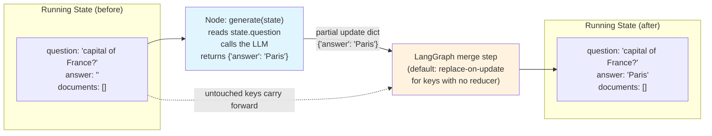

# Chapter 2: StateGraph & State Management

> "State is the only thing nodes are allowed to talk to each other through." — the one sentence that unlocks the rest of this course

## Learning Objectives

By the end of this chapter, you will be able to:

- Explain, precisely, what "state" means in LangGraph and why it is the single mental model underlying every other feature in the framework
- Define a graph's state schema three different ways — `TypedDict`, Python `dataclass`, and Pydantic `BaseModel` — and choose correctly between them based on validation, defaults, serialization, and IDE-support trade-offs
- Design a realistic multi-field state schema (`messages`, `question`, `answer`, `documents`, `tool_results`) and justify why each field exists and how it gets populated
- Describe exactly how LangGraph merges a node's return value into the running state, including the default "last write wins" replace behavior for a key with no reducer
- Practice "immutable thinking": treat the state object a node receives as read-only, and understand precisely what breaks — aliasing bugs, corrupted checkpoints, unreproducible replay — when you mutate it in place instead
- Constrain a graph's public surface with a separate input schema and output schema, distinct from the full internal/overall schema it tracks
- Recognize when and why a subgraph might use its own private state schema, without yet needing the full subgraph mechanics (Chapter 15)
- Build a working state schema for a multi-turn conversational agent that tracks message history, a running summary, and user metadata

---

## Prerequisites for the Chapter

Before this chapter, you should have read **[Chapter 1: Introduction & Prerequisites](./01-introduction-and-prerequisites.md)**, where you learned:

- Why LangGraph exists: LangChain Core gives you Runnables, chains, and tools, but nothing to manage *branching, looping, and shared memory* across a multi-step process — that's the gap LangGraph fills
- The core framing: a LangGraph graph is a **state machine** — a set of nodes (units of computation) connected by edges (control flow), all coordinated through one shared state object
- When LangGraph is (and isn't) the right tool compared to a plain LCEL chain

You should also be comfortable with, from your existing background:

- **Python type hints**, `TypedDict`, `dataclasses`, and Pydantic `BaseModel` at a basic level (you don't need to be an expert in any one of them — this chapter teaches the parts that matter for LangGraph specifically)
- **LangChain Core messages** (`HumanMessage`, `AIMessage`, `SystemMessage`, `ToolMessage`) from your prior LangChain experience
- Basic familiarity with the idea of a **reducer** function from functional programming (`fold`/`reduce` — combining an accumulator with a new value); you don't need LangGraph's specific reducers yet, they get a full chapter (**Chapter 6**) — this chapter only needs you to recognize the *concept*

No installation is required beyond what Chapter 1 already set up (`pip install langgraph langchain-core`). Every code example in this chapter is written by hand against the LangGraph Python API and is meant to be read and reasoned about, not necessarily executed verbatim — treat it the way you'd read a spec, watching for the *shape* of the pattern rather than copy-pasting blindly.

---

## 1. The Core Idea: State Is the Graph's Single Shared Memory

Here is the one idea this entire chapter exists to drill in, so let's state it as plainly as possible before adding any nuance:

> **State is a single, shared, structured object that flows through every node in the graph. Each node reads whatever slice of it that node cares about, does some work, and returns a partial update describing what changed. Nodes never mutate the state object directly — LangGraph applies the update on the node's behalf.**

If you're coming from FastAPI or a typical microservice background, the closest analogy is a **request context object** that gets threaded through a chain of middleware — except here, the "middleware" (nodes) can branch, loop, run in parallel, and the "request" can pause for days waiting on a human, then resume exactly where it left off. If you're coming from Redux or any flux-style frontend architecture, the analogy is even closer: state is a single source of truth, and "nodes" are like reducers that describe *changes*, not mutations, in response to "actions" (the graph's execution steps).

Why does LangGraph insist on this discipline rather than just letting nodes read and write a shared mutable object directly (the way you might pass a `dict` around in ordinary Python code and mutate it freely)? Three reasons, each of which becomes a full feature later in the course:

1. **Checkpointing (Chapter 9).** LangGraph can serialize the state after every step and persist it, so a crashed or paused run can resume exactly where it left off. That only works if state changes are *tracked as discrete update events* — a snapshot before, a snapshot after. If nodes silently mutated a live object, there would be no clean "before" to snapshot.
2. **Concurrency and parallel execution (Chapter 13).** When multiple nodes run in the same super-step (fan-out), each one needs to compute its update independently, without racing on a shared mutable object. Returning a partial update instead of mutating means LangGraph can safely collect updates from parallel branches and merge them deterministically.
3. **Debuggability and time-travel.** Because every step is "old state + this node's declared update = new state," you can inspect, log, and even replay the exact sequence of updates that produced a given final state. That's the foundation for LangSmith tracing (Chapter 20) and for human-in-the-loop review (Chapter 12), where you may need to rewind to a prior state and try again.

Concretely, a node in LangGraph is just a Python function (or callable) with this shape:

```python
def my_node(state: State) -> dict:
    # Read whatever fields you need from `state`.
    question = state["question"]

    # Do some work — call an LLM, hit a database, run a tool.
    answer = f"You asked: {question}"

    # Return ONLY the keys you want to change. Nothing else is touched.
    return {"answer": answer}
```

Three things to notice, because they are the crux of everything else in this chapter:

- The function receives the **full current state** as its argument — it can read anything.
- It returns a **dict containing only the keys it wants to update** — not the full state, and never the object it was given, mutated.
- Any key *not* present in the returned dict is left completely alone. If `my_node` doesn't mention `"documents"` in its return value, `documents` keeps whatever value it already had.

This is the entire contract. Every node in every graph you'll ever build in LangGraph follows this same read-full-state, return-partial-update pattern. Master this, and nodes (Chapter 3), edges (Chapter 4), reducers (Chapter 6), and even multi-agent handoffs (Chapter 14) become variations on a theme you already understand.

---

## 2. Three Ways to Define a State Schema

Before you can write a single node, you need to define the **shape** of your state — its schema. LangGraph supports three approaches, and unlike many "pick any, they're equivalent" framework choices, the differences here have real production consequences: validation behavior, default-value handling, serialization for checkpointing, and how much your IDE can help you.

### 2.1 `TypedDict` — the default, lightweight choice

```python
from typing import TypedDict


class State(TypedDict):
    question: str
    answer: str
    documents: list[str]
```

A node working against this schema receives a plain Python `dict` at runtime and returns a plain `dict`:

```python
def retrieve(state: State) -> dict:
    docs = search_index(state["question"])
    return {"documents": docs}
```

**What you get:**

- Zero runtime overhead — it's a plain `dict` under the hood, so no validation cost per node call.
- Full static-typing support in your editor (autocomplete on `state["question"]`, type errors if you access a key that doesn't exist) — *as long as your type checker actually runs*; `TypedDict` gives you no runtime protection.
- The lowest ceremony of the three options — this is why almost every LangGraph tutorial and the official docs default to `TypedDict` for introductory examples.

**What you don't get:**

- **No runtime validation.** If a node accidentally returns `{"answr": "..."}` (a typo) instead of `{"answer": "..."}`, LangGraph will happily add a new, unrelated key to the state dict. Nothing raises an error — you'll only notice later when `answer` is mysteriously still empty three nodes downstream.
- **No default values.** Every key must be supplied by whatever populates the initial state (or a node), because `TypedDict` is a structural type hint, not a class with a constructor. There's no way to say "`documents` defaults to `[]` if nobody sets it" at the schema level — you have to handle missing keys defensively (`state.get("documents", [])`) in every node that reads it.

### 2.2 Python `dataclass` — defaults and attribute access

```python
from dataclasses import dataclass, field


@dataclass
class State:
    question: str = ""
    answer: str = ""
    documents: list[str] = field(default_factory=list)
```

Now the state object supports **default values** directly in the schema — critical for optional fields like `documents`, which shouldn't need to be explicitly initialized to `[]` every single time you invoke the graph. Note the use of `field(default_factory=list)`: exactly like ordinary Python dataclasses, you cannot use a mutable default (`documents: list[str] = []`) because dataclasses (correctly) forbid mutable default arguments — the classic Python foot-gun where every instance would share the same list object.

Nodes still return plain dicts (LangGraph merges dict updates into the dataclass instance for you), but *reading* state inside a node uses attribute access instead of subscript access:

```python
def retrieve(state: State) -> dict:
    docs = search_index(state.question)   # attribute access, not state["question"]
    return {"documents": docs}
```

**What you get over `TypedDict`:**

- **Default values**, so partially-specified initial states (or states with optional fields) just work.
- **Attribute access** (`state.question`), which many engineers find more ergonomic and more consistent with the rest of idiomatic Python code, and which plays nicely with `__post_init__` for any light validation or derived-field logic you want to bolt on.
- Still essentially free at runtime — dataclasses have negligible overhead over a plain class.

**What you still don't get:**

- **No runtime type/value validation.** A dataclass's type hints are exactly that — hints. Nothing stops a node from returning `{"question": 42}` and having `42` silently stored where a `str` was expected. You'd only find out when something downstream calls a string method on it and raises a `TypeError` — an unhelpful error message steps removed from the real problem.

### 2.3 Pydantic `BaseModel` — validation at the schema boundary

```python
from pydantic import BaseModel, Field


class State(BaseModel):
    question: str = ""
    answer: str = ""
    documents: list[str] = Field(default_factory=list)
```

This looks nearly identical to the dataclass version, but the runtime behavior is meaningfully different: **Pydantic validates every field against its declared type whenever an instance is constructed.** If a node's returned update tries to set `question` to something that isn't coercible to a `str`, or `documents` to something that isn't a list, Pydantic raises a `ValidationError` immediately, at the point of the bad update — not silently, and not three nodes later.

```python
def retrieve(state: State) -> dict:
    docs = search_index(state.question)   # attribute access, like dataclasses
    return {"documents": docs}
```

**What you get over both previous options:**

- **Real runtime validation** — type coercion and rejection happen automatically. This matters enormously once your graph accepts input from an untrusted or loosely-typed source (an HTTP request body in a FastAPI route, a webhook payload, output parsed from an LLM), which describes the overwhelming majority of production LangGraph deployments.
- **Rich validators**: `@field_validator`, `Field(min_length=..., pattern=...)`, cross-field validation via `@model_validator` — the same Pydantic toolkit you already use for FastAPI request/response models.
- **First-class JSON Schema generation** (`State.model_json_schema()`), useful for documenting a graph's expected shape, generating API contracts, or validating configuration.

**What it costs you:**

- **Runtime overhead.** Validation on every state construction is not free — for graphs with many nodes and high call volume, this is measurable, though rarely the bottleneck compared to LLM call latency.
- **Slightly more ceremony** than a dataclass for the same schema, and Pydantic-specific gotchas (e.g., mutable-default handling, `model_config` for arbitrary types) that add a small learning curve if you haven't used Pydantic v2 extensively.

### 2.4 Choosing between them

| Dimension | `TypedDict` | `dataclass` | Pydantic `BaseModel` |
|---|---|---|---|
| Runtime validation | None | None | Full (type coercion + rejection) |
| Default values | No (must supply every key) | Yes (`field(default_factory=...)`) | Yes (`Field(default_factory=...)`) |
| Access style | `state["key"]` | `state.key` | `state.key` |
| IDE/static-type support | Good (if you run a type checker) | Good | Good |
| Serialization for checkpointing | Trivial (already dict-like) | Needs conversion | Trivial (`.model_dump()`) |
| Runtime cost per node | Lowest | Very low | Higher (validation cost) |
| Best for | Prototyping, simple graphs, official examples | Internal graphs where you trust node outputs | Graphs with external/untrusted input, FastAPI-adjacent services, anything you'd want a JSON Schema for |

**Practical rule of thumb:** start with `TypedDict` while you're learning or prototyping — it's what you'll see in most LangGraph documentation and keeps friction lowest. Reach for a `dataclass` when you want ergonomic attribute access and defaults but don't need validation. Reach for Pydantic `BaseModel` the moment your graph's entry point is a boundary that receives data you don't fully control — an HTTP request, a webhook, parsed LLM output — which, in production systems, is most of the time. Since you're coming from a FastAPI background, Pydantic will likely feel like the natural default for anything customer-facing, exactly as it does for your request/response models today.

One more detail worth internalizing now, because it trips people up later: **regardless of which schema style you choose, a node's *return value* is conventionally still a plain `dict`** of the keys it's updating — you don't return a full new `State(...)` instance. LangGraph takes that dict and merges it into whichever schema type you declared, applying dataclass/Pydantic construction and validation (if applicable) at that point. The schema type governs how the *overall* state object behaves and is read; it does not change the update contract nodes follow.

---

## 3. Anatomy of a Real State Schema

Toy examples with two or three fields are fine for learning the mechanics, but real graphs accumulate state that reflects everything the workflow needs to remember across many nodes. Let's build the schema you'll extend throughout this course — a retrieval-and-tool-augmented chat graph — and justify every field:

```python
from typing import Annotated, Any
from typing_extensions import TypedDict
from langchain_core.messages import AnyMessage
from langgraph.graph.message import add_messages


class State(TypedDict):
    messages: Annotated[list[AnyMessage], add_messages]
    question: str
    answer: str
    documents: list[str]
    tool_results: dict[str, Any]
```

| Field | Purpose | Populated by |
|---|---|---|
| `messages` | The full conversational history — every `HumanMessage`, `AIMessage`, `SystemMessage`, and `ToolMessage` exchanged so far. This is the field an LLM node actually sends to the model. | Appended to by nearly every node that talks to the user or the LLM; almost never fully replaced |
| `question` | The user's current turn, extracted and normalized from `messages` (e.g., stripped, possibly rewritten by a query-rewriting node). Kept separate from `messages` because downstream nodes (retrieval, tools) usually want *just the current ask*, not the entire transcript | A "parse input" node early in the graph |
| `answer` | The graph's final response for this turn, before it's wrapped into an `AIMessage` and appended to `messages` | A "generate" node near the end of the graph |
| `documents` | Retrieved context (e.g., RAG chunks) relevant to `question`, kept as a distinct field so retrieval logic, prompt-assembly logic, and generation logic can each be a separate node with a single responsibility | A "retrieve" node, conditionally invoked |
| `tool_results` | A dict of raw results from any tools invoked this turn (calculator output, an API response, a database query result), separate from `documents` because tool results are usually structured data, not retrieved text passages | A "tool execution" node (Chapter 8 covers this via `ToolNode`) |

Notice the design principle at work: **each field represents one distinct "thing the graph needs to remember," and each field is written by a small number of nodes with a clear responsibility.** This is exactly the same discipline you already apply when designing a database schema or a FastAPI Pydantic model — normalize your state the way you'd normalize a table, and avoid one giant catch-all field that every node reads and writes.

Notice too the `messages` field's type: `Annotated[list[AnyMessage], add_messages]`. That `Annotated[...]` wrapper is your first glimpse of a **reducer** — a function LangGraph consults when merging an update into that specific key. `add_messages` is a built-in reducer that *appends* new messages (and intelligently updates existing ones by ID) rather than replacing the whole list. We are not teaching reducers in depth here — that's the entirety of **Chapter 6** — but you need this one fact now: **without a reducer annotation, a key is replaced wholesale on every update; `messages` is annotated specifically because "replace the whole conversation history every time" would be a disastrous default.** Every other field above (`question`, `answer`, `documents`, `tool_results`) uses the *default* merge behavior, which the next section explains in full.

---

## 4. How State Updates Work: Partial Updates and Default Merging

When a node returns a dict, LangGraph merges it into the running state key by key. For any key that has **no reducer annotation** (the default for every plain field you declare), the merge rule is simple:

> **Default behavior: the new value completely replaces the old value for that key.** This is often called "last write wins."

```python
# Running state before this node executes:
# {"question": "What's the capital of France?", "answer": "", "documents": []}

def generate(state: State) -> dict:
    return {"answer": "Paris is the capital of France."}

# Running state after this node executes:
# {"question": "What's the capital of France?",
#  "answer": "Paris is the capital of France.",   <- replaced
#  "documents": []}                                <- untouched, not mentioned in the update
```

Two behaviors to internalize:

1. **Keys present in the returned dict are replaced outright**, not merged field-by-field if the value happens to be a container. If `documents` currently holds `["doc_a", "doc_b"]` and a node returns `{"documents": ["doc_c"]}`, the new state's `documents` is `["doc_c"]` — `doc_a` and `doc_b` are gone. LangGraph does **not** know to "append to the list" unless you've told it to via a reducer (Chapter 6). This surprises engineers coming from Redux/immer-style frameworks, where deep-merging is sometimes the default — LangGraph's default is shallow replacement, full stop.
2. **Keys absent from the returned dict are left completely untouched.** A node that returns `{"answer": "..."}` has zero effect on `question`, `documents`, or `tool_results` — they carry over from the prior state unchanged. This is what makes "return only what changed" both safe and efficient: you never need to laboriously copy forward every field you didn't touch.

This default — replace-on-update for un-annotated keys, append/merge only where a reducer says so — is intentional and important to hold onto: **the default is the *simple* case (a single writer replaces a value), and reducers are the *opt-in* mechanism for the more complex cases** (multiple writers, accumulation, deduplication, custom merge logic), which is exactly why they get their own chapter rather than being explained fully here. For now, treat any field without an `Annotated[...]` reducer as "whoever writes to this last, wins," and treat `messages`-style fields (append-only logs) as the main exception you already know to reach for `add_messages`.

---

## 5. Immutable Thinking: Treat Incoming State as Read-Only

Here's the rule, stated as bluntly as possible:

> **Inside a node, the `state` argument you receive is read-only. Never assign to its attributes or mutate its containers in place. Always return a new partial dict describing the change instead.**

This isn't a style preference — LangGraph's execution model actively assumes you follow it, and violating it produces some of the hardest-to-debug failures you'll encounter in this course. Let's walk through exactly why, using a `TypedDict` example first because the failure mode is starkest there (a `TypedDict` state is a literal Python `dict`, so nothing stops you from mutating it — that's the whole danger).

### 5.1 The tempting, wrong way

```python
def add_document(state: State) -> dict:
    # WRONG: mutating the incoming state directly.
    state["documents"].append("new_doc")   # in-place mutation of a list LangGraph gave you
    return {"documents": state["documents"]}
```

This *looks* like it works, and in a single-node, single-threaded, no-checkpointing toy script, it might even appear to "just work." Here is what actually breaks, each of which becomes a real production bug the moment your graph grows past a toy example:

**1. Aliasing bugs.** The `state` dict a node receives may be the *same object* LangGraph is holding as its authoritative "current state" for this super-step (implementation detail, but a real one) — or it may be shared with a parallel branch executing concurrently in the same super-step (Chapter 13). If you mutate `state["documents"]` in place, you may be silently corrupting a list another node is *simultaneously* reading, before that other node's own read has completed. The bug won't reproduce reliably, because it depends on execution timing — the worst kind of bug to chase.

**2. Breaking checkpointing and replay.** LangGraph's checkpointer (Chapter 9) works by serializing state snapshots *between* super-steps — "here is the state before this step, here is the declared update, here is the state after." If a node mutates the incoming object in place rather than returning a declared update, the "before" snapshot LangGraph thinks it captured may already reflect the "after" — because it was the same object, mutated, not a distinct new value. This silently corrupts the audit trail that lets you resume a crashed run or "time-travel" to a previous checkpoint and try a different path (a feature you'll rely on constantly starting in Chapter 9). The bug is invisible in casual testing and only surfaces the day you actually need to replay a run — exactly when you can least afford it.

**3. Undermining reducers.** Even for fields *with* a reducer (like `messages` and `add_messages`), the reducer is designed to receive the *old* value and the *new, separately-returned* value and combine them. If you've already mutated the old value in place before returning it, the reducer may see the same (already-mutated) list on both sides of the merge, producing duplicated entries, silently dropped updates, or — depending on the reducer's internal logic — an outright exception.

### 5.2 The correct way

```python
def add_document(state: State) -> dict:
    # RIGHT: read state, compute a new value, return only the update.
    updated_documents = state["documents"] + ["new_doc"]   # `+` creates a new list
    return {"documents": updated_documents}
```

Or, if you're accumulating documents across multiple retrieval calls in the same node:

```python
def retrieve(state: State) -> dict:
    new_docs = search_index(state["question"])
    # Build a fresh list; never call .append()/.extend() on state["documents"] itself.
    return {"documents": [*state["documents"], *new_docs]}
```

The pattern generalizes beyond lists: for dicts, use `{**state["tool_results"], "new_key": value}` instead of `state["tool_results"]["new_key"] = value`; for any nested structure, treat every container you read from `state` as frozen, and build brand-new containers for anything you're returning.

### 5.3 Why this maps to a mental model you already know

If you've worked with React, Redux, or any immutable-state frontend architecture, this is precisely the discipline `reducer` functions and `setState` enforce: never mutate the previous state object, always return a new one. If you've worked with pure functional programming, this is just "no side effects, only return values." LangGraph is, at its core, asking every node to be as close to a **pure function** — `(state) -> partial_update` — as your business logic allows. The LLM call, database query, or tool invocation inside the node can absolutely have side effects (that's the whole point of a workflow engine) — but the *state handling itself* should be side-effect-free and referentially transparent. Internalize this now, because subgraphs (Chapter 15), parallel fan-out (Chapter 13), and checkpointed human-in-the-loop review (Chapter 12) all quietly depend on every node honoring this contract.

---

## 6. Input Schema vs. Output Schema vs. Overall Schema

So far, every example has used one schema for everything: what a node reads, what a node writes, and what the graph as a whole accepts and returns. In production, you frequently want to **narrow the graph's public surface** — accept a small, clean set of fields from the caller, and return a small, clean set of fields to the caller — while internally tracking a much richer state object that nodes pass around as scratch space.

LangGraph supports this directly by letting you declare distinct **input** and **output** schemas alongside the full **overall** schema:

```python
from typing import Annotated, Any
from typing_extensions import TypedDict
from langchain_core.messages import AnyMessage
from langgraph.graph.message import add_messages
from langgraph.graph import StateGraph, START, END


class InputState(TypedDict):
    """What a caller must supply to invoke this graph."""
    question: str


class OutputState(TypedDict):
    """What a caller receives back — nothing more."""
    answer: str


class OverallState(TypedDict):
    """The full internal state every node can read and write."""
    messages: Annotated[list[AnyMessage], add_messages]
    question: str
    answer: str
    documents: list[str]
    tool_results: dict[str, Any]


builder = StateGraph(OverallState, input=InputState, output=OutputState)

# ... builder.add_node(...), builder.add_edge(...) as usual, using OverallState internally ...

graph = builder.compile()

# Callers only see the InputState/OutputState surface:
result = graph.invoke({"question": "What's the capital of France?"})
# result == {"answer": "Paris is the capital of France."}
# `messages`, `documents`, and `tool_results` were used internally by nodes,
# but are NOT part of what invoke() returns, because they aren't in OutputState.
```

Why this matters in practice:

- **API contract stability.** If `OverallState` is what you return, every internal field you add (a new scratch field for an experimental retrieval strategy, a debug trace list) becomes part of your graph's *public* contract the moment some downstream caller starts depending on it, whether you intended that or not. An explicit `OutputState` keeps your internal refactoring free from breaking callers.
- **Validation at the boundary, not in every node.** If you're using Pydantic for `InputState`, malformed input is rejected the instant `invoke()` is called, before any node runs — you don't need every node to defensively check that `question` is actually a string.
- **Clean documentation.** `InputState` and `OutputState`, especially as Pydantic models, double as living API documentation (`InputState.model_json_schema()`) for whoever calls your graph — a FastAPI route handler, a teammate on another squad, or your future self in six months.
- **This is exactly the request/response-model pattern you already use in FastAPI** — a route's request body model, response model, and internal service-layer data structures are routinely three different shapes. LangGraph's input/output/overall split is the same idea applied to a graph.

A subtlety worth naming explicitly: **nodes are still written against the overall schema**, not the input or output schema — `InputState` and `OutputState` only affect what `invoke()` (and `stream()`) accept and return at the graph's outer boundary. Internally, every node still sees the full `OverallState`, including fields that never leave the graph.

---

## 7. Multiple State Schemas in One Graph

The input/output split above is one case of a more general capability: **a single graph doesn't have to use exactly one schema for every node.** LangGraph lets individual nodes declare their own narrower state type (as long as it's structurally compatible — same field names and types for whatever subset they touch), and — more significantly — a **subgraph** invoked from within a larger graph can use a completely different, "private" state schema of its own.

Why would you want that? Imagine a top-level customer-support graph whose overall state includes `messages`, `question`, and `answer`, and one step of that graph delegates to a specialized "document research" subgraph that internally needs a much richer scratch state — `search_queries`, `candidate_documents`, `relevance_scores`, `citation_map` — none of which the parent graph, or any *other* part of the workflow, has any business seeing or depending on. Rather than bloating the parent's `OverallState` with fields only one internal step cares about, the subgraph declares its own private schema, and only a small, explicit slice of data crosses the boundary between parent and subgraph state — much like keeping a helper microservice's internal data model out of the primary service's public schema.

This chapter isn't the place for the full mechanics of wiring parent state to subgraph state (invocation, state transformation at the boundary, and shared-vs-private key handling all get a complete treatment in **Chapter 15: Subgraphs & Composition**). The one idea to take away now: **"one schema per graph" is the common case and a fine default, but it is not a hard rule — schemas can be scoped as narrowly as a single subgraph's internal concerns**, exactly the way you'd scope a Pydantic model to a specific FastAPI route rather than reusing one giant "God model" everywhere.

---

## 8. Project: Conversation State Manager

Let's apply everything in this chapter to a concrete, realistic build: the state schema for a multi-turn chat application that needs to track (1) the full message history, (2) a running summary of the conversation so far — useful for keeping prompts short in long conversations — and (3) metadata about the user.

### 8.1 Designing the schema

```python
from typing import Annotated, Any, Optional
from typing_extensions import TypedDict
from langchain_core.messages import AnyMessage
from langgraph.graph.message import add_messages


class UserMetadata(TypedDict):
    user_id: str
    display_name: str
    preferred_language: str


class ConversationState(TypedDict):
    # Append-only conversation log — uses the built-in reducer so every
    # node that adds a message doesn't have to reconstruct the whole list.
    messages: Annotated[list[AnyMessage], add_messages]

    # A running, LLM-generated summary of everything said so far.
    # Deliberately uses the DEFAULT (replace) merge behavior: each time we
    # regenerate the summary, it should fully REPLACE the old one, not append to it.
    running_summary: str

    # Static-ish metadata about the user, set once near the start of the
    # conversation and rarely, if ever, updated afterward.
    user_metadata: UserMetadata

    # How many user turns have happened — used to decide when to re-summarize.
    turn_count: int
```

Notice the deliberate contrast between `messages` (needs a reducer — it's an accumulating log) and `running_summary` (must NOT use an append-style reducer — a new summary should fully replace the old one, which is exactly the default behavior you get by *not* annotating it). This is a good moment to notice reducers are a field-by-field decision, not an all-or-nothing setting for the whole schema — a preview of the nuance Chapter 6 covers in full.

### 8.2 Nodes that populate each field

```python
from langchain_core.messages import HumanMessage, AIMessage, SystemMessage
from langchain_openai import ChatOpenAI

llm = ChatOpenAI(model="gpt-4o-mini")


def respond(state: ConversationState) -> dict:
    """Generate the assistant's reply for this turn."""
    # Ground the model in the running summary (if any) plus recent messages,
    # rather than replaying the entire history every time.
    context: list[AnyMessage] = []
    if state["running_summary"]:
        context.append(SystemMessage(
            content=f"Conversation summary so far: {state['running_summary']}"
        ))
    context.extend(state["messages"])

    ai_reply = llm.invoke(context)

    # Only the new message is returned — add_messages appends it for us.
    return {"messages": [ai_reply], "turn_count": state["turn_count"] + 1}


def maybe_summarize(state: ConversationState) -> dict:
    """Every 5 turns, compress the conversation into a fresh running summary."""
    if state["turn_count"] % 5 != 0:
        return {}   # No update this turn — leave running_summary untouched.

    summary_prompt = [
        SystemMessage(content="Summarize this conversation in 2-3 sentences."),
        *state["messages"],
    ]
    summary = llm.invoke(summary_prompt)

    # Full replacement of running_summary — this is the default merge behavior
    # doing exactly what we want: the old summary is discarded, not appended to.
    return {"running_summary": summary.content}


def load_user_metadata(state: ConversationState) -> dict:
    """Runs once, near the start, to populate user_metadata from a profile store."""
    profile = fetch_user_profile(state["user_metadata"]["user_id"])
    return {
        "user_metadata": {
            "user_id": profile.id,
            "display_name": profile.display_name,
            "preferred_language": profile.language,
        }
    }
```

Notice `maybe_summarize` returning `{}` when it has nothing to update — an empty dict is a completely valid, common return value, and it's the cleanest way to express "this node ran, but none of the fields it's responsible for changed this time." Nothing about the rest of the state is affected.

### 8.3 Wiring it into a graph

```python
from langgraph.graph import StateGraph, START, END

builder = StateGraph(ConversationState)

builder.add_node("respond", respond)
builder.add_node("maybe_summarize", maybe_summarize)

builder.add_edge(START, "respond")
builder.add_edge("respond", "maybe_summarize")
builder.add_edge("maybe_summarize", END)

graph = builder.compile()
```

### 8.4 Running it, turn by turn

Without a checkpointer (Chapter 9 introduces persistence properly), each `invoke()` call is independent — so to simulate a multi-turn conversation *right now*, we manually feed the previous call's full output back in as the next call's input, which is itself an illustrative exercise in "immutable thinking": we're never mutating the old state dict, only building a new one from it.

```python
state = {
    "messages": [],
    "running_summary": "",
    "user_metadata": {"user_id": "u_42", "display_name": "", "preferred_language": ""},
    "turn_count": 0,
}

# Turn 1
state = graph.invoke({**state, "messages": [HumanMessage(content="Hi, I'm planning a trip to Japan.")]})

# Turn 2 — note we pass the ENTIRE previous state back in, plus the new message.
state = graph.invoke({**state, "messages": [HumanMessage(content="What's the best time to visit Kyoto?")]})
```

This manual "carry the whole state forward yourself" step is exactly the tedious, error-prone bookkeeping that **Chapter 9's checkpointers** exist to eliminate — a `MemorySaver` or database-backed checkpointer will persist `ConversationState` after every turn and let you resume it by `thread_id` alone, with no manual state-threading required. Understanding *why* that's valuable, though, requires first understanding — as you now do — exactly what shape of object is being persisted and resumed, and exactly how each node contributes to it.

---

## Examples

**Example 1 — TypedDict without a reducer overwriting silently.**

```python
class State(TypedDict):
    tags: list[str]

def node_a(state: State) -> dict:
    return {"tags": ["urgent"]}

def node_b(state: State) -> dict:
    # BUG: intends to ADD a tag, but this REPLACES the whole list —
    # there is no reducer on `tags`, so default replace-on-update applies.
    return {"tags": ["reviewed"]}

# After node_a then node_b: state["tags"] == ["reviewed"]  -- "urgent" is gone.
```

**Example 2 — Pydantic catching a bad update at the boundary.**

```python
from pydantic import BaseModel, Field

class State(BaseModel):
    retry_count: int = 0

def flaky_node(state: State) -> dict:
    return {"retry_count": "not-a-number"}   # bug: should be an int

# When LangGraph merges this update into the Pydantic-backed state,
# construction re-validates the model and raises a ValidationError
# immediately — versus a TypedDict/dataclass schema, where "not-a-number"
# would be silently stored and fail much later, far from the real bug.
```

**Example 3 — Correct in-place-safe accumulation pattern.**

```python
def collect_result(state: State) -> dict:
    # Never: state["tool_results"][tool_name] = result
    return {"tool_results": {**state["tool_results"], tool_name: result}}
```

---

## Diagrams

The following diagram shows one super-step of graph execution: a node receives the current state, computes a partial update, and LangGraph — not the node — is responsible for merging that update into the new running state, which is what the next node sees.



The key thing this diagram makes visible: the node never touches `S1` directly, and never produces `S2` directly either — it only ever produces the small update dict in the middle. LangGraph owns the merge. This is exactly why "immutable thinking" (Section 5) isn't optional style guidance — it's the only way a node's behavior stays consistent with what LangGraph's execution engine actually does on its behalf.

---

## Real-World Scenarios

**Scenario: the "silently overwritten list" incident.**

A team builds a customer-support triage graph whose state includes a `flags: list[str]` field (e.g., `"escalate"`, `"needs_manager"`, `"refund_eligible"`), populated by several independent classifier nodes running in sequence — a sentiment-analysis node, a policy-violation node, and a refund-eligibility node — each of which is supposed to *add* its own flag if triggered. Nobody puts a reducer on `flags`, because in early testing, only one classifier ever fired per test conversation, so nobody noticed each node was actually *replacing* the flags list rather than appending to it.

In production, a genuinely bad conversation triggers all three classifiers. The refund-eligibility node runs last and returns `{"flags": ["refund_eligible"]}` — which, under the default replace-on-update behavior, wipes out the `"escalate"` and `"needs_manager"` flags the earlier two nodes had set. The conversation is auto-resolved as a routine refund, and a genuinely urgent, policy-violating conversation never reaches a human reviewer. The bug isn't a crash — nothing raises an exception, nothing logs an error — it's a silent, wrong business outcome that only surfaces when a customer escalates externally weeks later.

**The fix:** annotate `flags` with a reducer that appends and deduplicates (`Annotated[list[str], operator.add]` for simple append, or a small custom reducer for dedup) — exactly the kind of default-vs-explicit-merge decision this chapter equips you to recognize *before* shipping, not after a customer complaint.

**Scenario: mutating shared state under parallel fan-out.**

A research-assistant graph fans out to three parallel "source-checking" nodes (Chapter 13 covers this pattern in depth), each of which reads `state["documents"]` to decide what to verify and is *supposed* to append its verification result to `state["tool_results"]`. One node is written carelessly:

```python
def verify_source(state: State) -> dict:
    state["tool_results"]["source_check"] = run_check(state["documents"])  # mutation!
    return {"tool_results": state["tool_results"]}
```

Because all three parallel nodes execute against state within the same super-step, this in-place mutation occasionally causes one branch's write to clobber another's, depending on execution timing — a race condition that passes in local testing (where timing happens to be favorable) and fails intermittently in production under real load. The team spends a day suspecting the LLM API before realizing the actual defect is the mutation itself, not anything LLM-related. Rewriting the node to build a new dict (`{**state["tool_results"], "source_check": ...}`) and returning that, rather than mutating and returning the same shared object, eliminates the race entirely.

---

## Best Practices

- **Treat every field's mutability like a database migration decision.** Before adding a field, ask: "does this need a reducer (accumulates, has multiple writers) or is default replace-on-update correct (single writer, always-fresh value)?" Getting this wrong is invisible until multiple nodes write the same key in the same run.
- **Prefer Pydantic `BaseModel` for any state schema that touches an untrusted boundary** — a FastAPI route, a webhook, parsed LLM/tool output — and reserve `TypedDict`/`dataclass` for purely internal scratch state you fully control.
- **Never mutate anything you read off `state`.** Build new lists (`[*old, new]`), new dicts (`{**old, "k": v}`), and new nested structures every time. Make this a lint-level habit, not something you remember only when debugging a race condition after the fact.
- **Use `input`/`output` schemas to keep your graph's public contract narrow and stable**, especially once other services or teammates start calling your graph — treat it exactly like you'd treat a FastAPI response model versus your internal ORM objects.
- **Design state fields the way you'd design database columns**: one clear owner (or a well-understood small set of writers) per field, a clear purpose, and a clear answer to "what happens if two nodes write this in the same run?"
- **Return `{}` explicitly when a node has nothing to update**, rather than reconstructing and re-returning fields it didn't actually change — it's clearer to read and avoids accidentally reintroducing stale data.
- **Keep subgraph-private state private.** Don't let a specialized subgraph's internal scratch fields leak into the parent graph's overall schema just because it was convenient once — it will become a maintenance liability the moment the subgraph's internals change (full treatment in Chapter 15).

---

## Common Mistakes

- **Assuming a field is append-only without adding a reducer.** This is by far the most common LangGraph state bug — an un-annotated `list` or `dict` field silently replaces rather than accumulates the moment more than one node writes to it.
- **Mutating `state` in place inside a node** (`state["x"].append(...)`, `state.x = ...`), which "works" in casual single-threaded testing and then produces aliasing bugs under parallel execution, or corrupts checkpoint/replay integrity, neither of which shows up until you actually rely on the feature it broke.
- **Returning the entire state object instead of a partial update.** Some engineers, out of an abundance of caution, return `{**state, "answer": new_answer}` "just to be safe." This isn't wrong, exactly, but it's needless, defeats the purpose of a lean update contract, and — worse — if `state` itself is stale or was captured before a concurrent update, you can accidentally clobber a field another branch had legitimately changed.
- **Choosing `TypedDict` for a graph whose entry point accepts raw external input**, then discovering type errors three nodes deep instead of at the boundary, because nothing validated the input on the way in.
- **Conflating "input schema" with "overall schema."** Nodes are written against the full overall schema, not the narrower input/output schema — a common early confusion is expecting a node to only see `InputState`'s fields.
- **Forgetting mutable default pitfalls in `dataclass`/Pydantic schemas** — writing `documents: list[str] = []` instead of `field(default_factory=list)` / `Field(default_factory=list)`, which in a dataclass raises an error immediately (a small mercy), but in hand-rolled alternatives can silently share one list across every graph instance.
- **Letting one giant state schema serve every subgraph and every node**, rather than scoping private, subgraph-specific concerns out of the shared overall schema — this is the state-management equivalent of a single "God object" class that every part of a large codebase reaches into.

---

## Summary

- **State is the single shared memory flowing through a LangGraph graph.** Nodes read the full current state and return only a partial update describing what changed — they never mutate the state object they were given.
- LangGraph supports three schema styles — **`TypedDict`** (lightweight, no validation, subscript access), **`dataclass`** (adds defaults, attribute access, still no validation), and **Pydantic `BaseModel`** (adds real runtime validation and JSON Schema generation, at some runtime cost) — chosen based on whether your graph's boundary touches untrusted input.
- A realistic schema (`messages`, `question`, `answer`, `documents`, `tool_results`) normalizes state the way a well-designed database schema normalizes tables — one clear purpose and a small set of writers per field.
- **Default merge behavior for any key without a reducer is full replacement ("last write wins")** — accumulation, deduplication, or any richer merge logic requires an explicit reducer, which gets its own full treatment in Chapter 6.
- **"Immutable thinking" is not optional style** — mutating incoming state in place causes aliasing bugs under parallel execution and silently corrupts the checkpoint/replay guarantees the rest of this course depends on.
- **Input and output schemas let you narrow a graph's public contract** independently of the richer overall schema nodes use internally — the same discipline as separating a FastAPI request/response model from internal service data structures.
- **Subgraphs may use their own private state schema**, keeping internal scratch concerns out of the parent graph's overall schema (full mechanics in Chapter 15).

---

## Knowledge Check

1. A node returns `{"documents": ["new_doc"]}` when the current state already has `documents = ["old_doc"]`, and `documents` has no reducer annotation. What is `documents` after this update, and why?
2. Explain, in your own words, why mutating `state["messages"].append(...)` directly inside a node is dangerous even if your tests pass — name the two specific downstream systems (introduced in later chapters) that this can silently break.
3. You're building a graph whose entry point is a FastAPI endpoint accepting arbitrary JSON from external clients. Which of the three state schema styles should you choose for the graph's `input` schema, and what specific capability makes it the right choice here?
4. What is the difference between a graph's `input`/`output` schema and its overall schema? Do nodes read and write against the input/output schema, or the overall schema?
5. In the Conversation State Manager project, why does `running_summary` deliberately use the *default* replace-on-update behavior instead of a reducer, while `messages` deliberately does not?
6. A teammate proposes always returning `{**state, "field": new_value}` from every node "to be extra safe." Explain what's redundant about this and describe a scenario (parallel execution) where it can actively cause a bug rather than prevent one.

---

## Hands-on Exercises

1. **Schema conversion drill.** Take the `ConversationState` schema from Section 8.1 (currently a `TypedDict`) and rewrite it twice — once as a `dataclass`, once as a Pydantic `BaseModel`. For each version, rewrite the `maybe_summarize` node to use the correct access style (`state["running_summary"]` vs. `state.running_summary`), and write one sentence per version explaining a concrete scenario where that version's specific trade-off (validation, defaults, access style) would matter in production.

2. **Find and fix the reducer bug.** Given this schema and these two nodes, identify the bug, explain why it doesn't show up in single-node testing, and fix it using an appropriate reducer:

   ```python
   class State(TypedDict):
       warnings: list[str]

   def check_length(state: State) -> dict:
       return {"warnings": ["message too long"]}

   def check_toxicity(state: State) -> dict:
       return {"warnings": ["potentially offensive content"]}
   ```

   Trace through what `state["warnings"]` contains after both nodes run in sequence, before and after your fix.

3. **Design an input/output-constrained graph.** Design (schema only — you don't need to write the full node logic) an `OverallState`, `InputState`, and `OutputState` for a document-classification graph that: accepts only `{"document_text": str}` from callers, internally tracks `document_text`, `extracted_entities: list[str]`, `classification_scores: dict[str, float]`, and `raw_llm_response: str`, and returns only `{"category": str, "confidence": float}` to callers. Justify, for each internal-only field, why it should NOT appear in `OutputState`.

---

## Further Reading

- [LangGraph Documentation — Graph API, State](https://docs.langchain.com/oss/python/langgraph/overview) — official reference for `StateGraph`, schema declaration, and state merging
- [LangGraph Application Structure Guide](https://docs.langchain.com/oss/python/langgraph/application-structure) — how state schemas fit into a full application's layout
- [LangGraph GitHub Repository](https://github.com/langchain-ai/langgraph) — source of truth for exact merge and validation behavior across versions
- [Python `typing.TypedDict` documentation](https://docs.python.org/3/library/typing.html#typing.TypedDict) — the standard-library reference for `TypedDict` semantics
- [Python `dataclasses` documentation](https://docs.python.org/3/library/dataclasses.html) — including the mutable-default-argument protections referenced in Section 2.2
- [Pydantic v2 Documentation](https://docs.pydantic.dev/latest/) — validators, `Field`, `model_config`, and JSON Schema generation used in Section 2.3
- Related chapter in this course: **[Chapter 6: Reducers](./06-reducers.md)** — the full treatment of custom and built-in merge strategies only introduced here
- Related chapter in this course: **[Chapter 9: Checkpointing & Durable Execution](./09-checkpointing-and-durable-execution.md)** — why immutable state handling is a prerequisite for durable, resumable graphs
- Related chapter in this course: **[Chapter 15: Subgraphs & Composition](./15-subgraphs-and-composition.md)** — the full mechanics of private subgraph state schemas only previewed here

---

<div style="display:flex;justify-content:space-between;align-items:center;">
  <a href="./01-introduction-and-prerequisites.md">← Previous: Introduction & Prerequisites</a>
  <a href="./00-index.md">🏠 Index</a>
  <a href="./03-nodes.md">Next: Nodes →</a>
</div>
