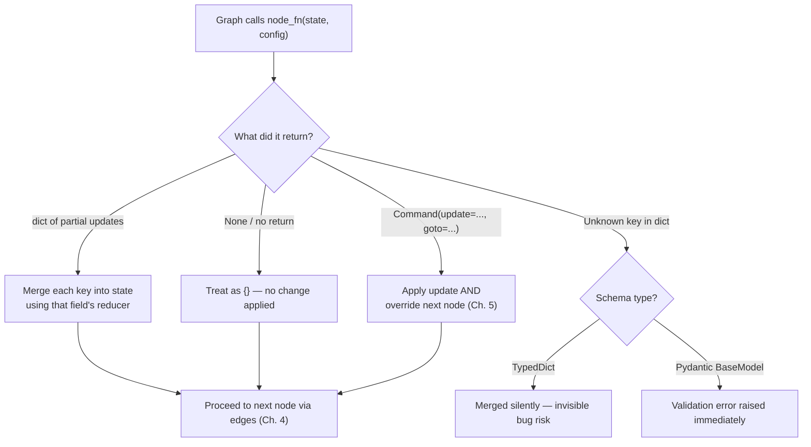
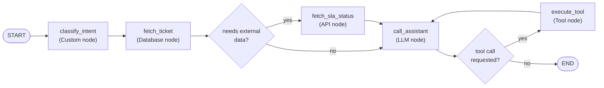

# Chapter 3: Nodes

> "A graph is nothing but nodes agreeing to disagree about state, one super-step at a time."

## Learning Objectives

By the end of this chapter, you will be able to:

- Define precisely what a LangGraph node is at the Python level: a callable with signature `(state) -> dict`, and how it differs from a plain LangChain `Runnable`
- Register nodes with `add_node()` and understand what a node name actually controls in a compiled graph
- Write five distinct categories of production node — LLM, Tool, Database, API, and pure business-logic — each with real, hand-written code
- Decide correctly between a synchronous and an asynchronous node function based on whether the node's work is I/O-bound or CPU-bound
- State the full node execution contract: what a node may legally return, what happens when it returns `None`, and what happens when it returns keys that don't belong to the state schema
- Read `thread_id`, `user_id`, and callbacks out of `RunnableConfig` inside a node, and understand why this is the correct way to pass per-invocation context instead of global variables
- Organize dozens of nodes in a large graph without name collisions, using naming conventions and node factories (closures) for parameterized, reusable node logic
- Build a complete, working MongoDB query node end-to-end, and sketch equivalent SQL, weather-API, and search nodes

---

## Prerequisites for the Chapter

This chapter assumes you've internalized the mental model from **Chapter 2: StateGraph & State Management**:

- Your graph has a **state schema** (a `TypedDict`, `dataclass`, or Pydantic `BaseModel`) that defines every field the graph is allowed to carry between steps
- State updates are **merged**, not overwritten wholesale — each field either replaces the previous value or is combined with it via a **reducer** (e.g., `add_messages` for chat history)
- You think of the graph as **immutable-by-convention**: a node never mutates the state object it receives; it *returns* the delta it wants applied

If any of that is unfamiliar, go back to Chapter 2 before continuing — this chapter builds directly on top of that state model and assumes you can already declare a `StateGraph(MyState)` and read/write typed fields.

You should also already be comfortable, from your LangChain Core background, with: `Runnable.invoke()`, `ChatModel.bind_tools()`, LangChain `Tool`/`@tool` objects, and `RunnableConfig` as a concept (even if you haven't used it deeply). This chapter reuses all of that vocabulary rather than re-teaching it.

No new installation is required beyond what Chapter 1 set up (`langgraph`, `langchain`, plus a chat model provider SDK). Where this chapter's examples touch MongoDB or SQL, treat those snippets as illustrative — the point is the *node shape*, not a driver tutorial.

---

## 1. What a Node Actually Is

Strip away the diagrams and the term "node" resolves to something very ordinary:

> **A node is a Python callable that takes the current state and returns a partial update to that state.**

That's the entire contract. No base class to inherit, no decorator required, no special return type beyond "something dict-shaped." In its most minimal form:

```python
def greet(state: dict) -> dict:
    return {"greeting": f"Hello, {state['name']}!"}
```

You attach it to a graph with `add_node`:

```python
from langgraph.graph import StateGraph

graph = StateGraph(dict)
graph.add_node("greet", greet)
```

`add_node(name, fn)` does two things: it registers `fn` under the string identifier `name`, and it makes `name` addressable from edges (`add_edge("greet", "next_step")`) and from conditional routing functions (Chapter 4). The name is not derived from the function — you choose it explicitly, and by convention it's a short snake_case verb phrase describing what the node *does* (`fetch_weather`, `summarize_documents`), not what it *is* (`node1`, `weather_step`).

### 1.1 Node vs. Runnable

If you've spent time in LangChain Core, you already know `Runnable` — the `invoke`/`ainvoke`/`stream`/`batch` protocol that chains, prompts, models, and tools all implement. A natural question: is a LangGraph node a `Runnable`?

**It can be, but it doesn't have to be.** `add_node` accepts:

- A plain function or lambda: `(state) -> dict` or `(state, config) -> dict`
- Any object implementing `Runnable` (a chain, a prompt | model pipe, a bound tool) — LangGraph calls `.invoke(state, config)` on it internally
- An async function: `async def (state) -> dict`

This is deliberate. Most of your existing LCEL chains (`prompt | model | parser`) can be dropped into a graph as a node *unchanged*, provided their output is coerced into a dict-shaped state update (often via a trailing `RunnableLambda` or by making the node a thin wrapper function that calls `.invoke()` on the chain and reshapes the result). In practice, the overwhelming majority of production nodes are written as plain functions, because the dict-in/dict-out contract is simpler to reason about, test, and debug than threading a full Runnable pipeline through the state-merge semantics of a graph. Reserve raw `Runnable` registration for genuinely simple pass-through cases; wrap anything nontrivial in a function so you control exactly what enters and leaves the state.

### 1.2 The signature, formally

A node function has one of these shapes:

```python
def node(state: State) -> dict: ...

def node(state: State, config: RunnableConfig) -> dict: ...

async def node(state: State) -> dict: ...

async def node(state: State, config: RunnableConfig) -> dict: ...
```

`state` is always positional and always first — it is an instance of whatever type you passed to `StateGraph(...)` in Chapter 2 (a `dict` for `TypedDict` schemas, an object for `dataclass`/Pydantic schemas). LangGraph inspects the function's parameter names at registration time; if a parameter literally named `config` appears, the current `RunnableConfig` for this invocation is injected automatically. Some LangGraph versions extend this same name-based injection to a `store` parameter (the cross-thread memory store from Chapter 10) and a `writer` parameter (a `StreamWriter` for custom streaming payloads, Chapter 11) — you don't wire these manually; you simply add the parameter and the runtime supplies it. This is worth remembering now because it means a node's signature is partly *declarative*: adding `config: RunnableConfig` to a function you didn't need config in yesterday is enough to start receiving it today, with zero other changes.

---

## 2. The Node Execution Contract

This is the part engineers coming from plain LCEL chains most often get wrong, because a chain's contract ("return whatever the next step in the pipe expects") is looser than a graph node's contract.

### 2.1 What a node is allowed to return

A node may return exactly one of:

1. **A `dict` (or dict-like mapping) of partial state updates.** Keys must correspond to fields declared in your state schema. Only the keys you include are touched; every other field of the state is left as-is for this step. This is the overwhelmingly common case and everything in this chapter uses it.
2. **A `Command` object** — an instruction that can bundle a state update *and* control where execution goes next (`Command(update={...}, goto="next_node")`), bypassing normal edges entirely. This is the subject of **Chapter 5: Commands & Dynamic Control**; for now, know that it exists as an alternative return type with a superset of a plain dict's capability.

There is no third option. A node cannot return a list, a string, an integer, or a fully-replaced state object — only a partial-update mapping or a `Command`.

### 2.2 What happens if a node returns `None`

Practically, a node that returns `None` (including a function with no `return` statement at all — the Python default) is treated as contributing **no update** to the state for that step; the graph proceeds as if the node had returned `{}`. This is convenient for "fire-and-forget" nodes like logging or metrics emission that read state but don't need to change it.

Don't lean on this as a style choice, though. Relying on implicit `None` behavior has two costs: it's easy to accidentally fall through every branch of an `if/elif` and return nothing when you meant to return an update (a classic bug that silently drops data instead of erroring), and it makes the function's contract less self-documenting to the next engineer who reads it. **Return `{}` explicitly** when a node genuinely has nothing to add — it costs nothing and states your intent.

### 2.3 What happens if a node returns a malformed update

"Malformed" splits into two failure modes, and which one you hit depends on the state schema type from Chapter 2:

- **Unknown keys** (a key in the returned dict that isn't declared anywhere in the state schema). With a `TypedDict` schema, this is the dangerous case: `TypedDict` provides no runtime validation, so LangGraph may accept and merge the stray key into the working state dict without complaint. That key is now live in your state — invisible to your type checker, invisible to anyone reading the schema, and a source of exactly the kind of bug that surfaces three weeks later as "why does the state have a `resutl` key with a typo in it." With a **Pydantic `BaseModel`** schema, an unknown key raises a validation error immediately at the point of merge, because Pydantic validates on construction. This is one of the strongest practical arguments for Pydantic state schemas in anything beyond a prototype, and it's worth revisiting your Chapter 2 schema choice with this failure mode in mind.
- **Type/reducer mismatches** — a key exists in the schema, but the value's shape is incompatible with its reducer. The canonical example is the `messages` field using `add_messages`: that reducer expects a message or list of messages. Returning `{"messages": "hello"}` (a bare string, not wrapped in a message object or list) will surface an error when the reducer tries to process it, not before. More generally, if a field is annotated with `operator.add` as its reducer and holds a list, returning an `int` for that key raises a `TypeError` at merge time, because `list + int` is not defined. These errors surface at graph *execution* time, not at node *definition* time — there's no static check catching this before you invoke the graph, which is why testing nodes in isolation (Chapter 17) matters more here than it does for a typical Python function.

The practical rule: **treat your state schema as an API contract for every node**, not just documentation. A node should only ever return keys it was designed to write, with values whose shape matches that field's declared reducer.

---

## 3. Sync vs. Async Node Functions

LangGraph supports both `def` and `async def` node functions in the same graph, and you will genuinely need both in most real graphs. The decision isn't stylistic — it follows directly from what the node spends its time doing.

| Node does... | Bound by | Prefer |
|---|---|---|
| Calling a chat model API | Network I/O | `async def` |
| Querying MongoDB / Postgres | Network I/O | `async def` (with an async driver) |
| Calling an external REST API (weather, search) | Network I/O | `async def` |
| Pure in-memory transformation (parsing, formatting, math) | CPU | `def` (sync) is fine — no benefit to async |
| Heavy local computation (embedding a large batch locally, image processing) | CPU | `def`, and consider a worker/thread pool outside the graph if it blocks too long |

The reason this matters: LangGraph's execution engine is built on an async event loop internally. When you invoke a compiled graph with `.invoke()`/`.stream()` (the synchronous entry points), LangGraph runs synchronous nodes directly and can run coroutine nodes too — it manages the loop for you either way. But when many nodes across a graph are I/O-bound and synchronous, each one blocks the underlying thread for the full duration of its network call. In a graph that fans out to several independent API/DB nodes (parallel execution, Chapter 13), synchronous I/O nodes execute strictly one after another; **async I/O nodes running under `.ainvoke()`/`.astream()` can be scheduled concurrently**, which is the entire performance argument for using them.

Concretely: a node that calls `await client.chat.completions.create(...)` or `await collection.find_one(...)` yields control back to the event loop while waiting on the socket, letting LangGraph make progress on sibling nodes in the same super-step. A synchronous `requests.get(...)` call inside a node blocks the whole thread for that duration — fine for a simple linear graph invoked once, costly the moment you have fan-out or a high-throughput server calling the graph from FastAPI request handlers.

```python
# Sync node — acceptable for low-concurrency or CPU-bound work
def compute_summary_stats(state: dict) -> dict:
    values = state["measurements"]
    return {
        "mean": sum(values) / len(values),
        "max": max(values),
        "min": min(values),
    }

# Async node — correct choice for I/O-bound work
async def fetch_user_profile(state: dict, config: RunnableConfig) -> dict:
    user_id = config["configurable"]["user_id"]
    async with httpx.AsyncClient() as client:
        response = await client.get(f"https://api.example.com/users/{user_id}")
        response.raise_for_status()
        return {"user_profile": response.json()}
```

**Practical guidance for a real service:** if your graph will be invoked from a FastAPI async route (the overwhelmingly common deployment shape covered in Chapter 19), write every I/O-bound node as `async def` from day one and invoke the compiled graph with `ainvoke`/`astream`. Mixing sync I/O nodes into an otherwise-async FastAPI service reintroduces blocking calls on your event loop — one of the most common performance regressions engineers coming from Flask/sync backgrounds introduce without noticing.

---

## 4. Accessing Config Inside a Node

Every node can optionally receive a `RunnableConfig` as its second parameter — the same `RunnableConfig` type you already know from LangChain Core's `Runnable.invoke(input, config)`. LangGraph populates it per-invocation and threads it through automatically to every node, so you never pass it explicitly node-to-node; you supply it once, at the top, when you call the graph:

```python
result = graph.invoke(
    {"messages": [HumanMessage("What's my order status?")]},
    config={
        "configurable": {
            "thread_id": "user-4821-session-1",
            "user_id": "4821",
        },
        "callbacks": [my_tracer],
    },
)
```

Inside any node, that same config is available:

```python
def load_order_history(state: dict, config: RunnableConfig) -> dict:
    user_id = config["configurable"]["user_id"]
    thread_id = config["configurable"]["thread_id"]
    orders = order_db.find_by_user(user_id)
    return {"order_history": orders}
```

The `configurable` sub-dict is where LangGraph expects **your** custom, per-invocation values: `thread_id` (which checkpoint lineage this run belongs to — central to Chapter 9), `user_id`, tenant IDs, feature flags, model overrides — anything that varies per call but isn't part of the graph's *state* per se. Keep this distinction crisp: **state** is data the graph reads and writes as it runs (it flows forward through nodes and gets checkpointed); **config** is context supplied from the outside at invocation time that nodes may *read* but don't write back into (it doesn't flow through reducers, and a node returning changes to `config` has no effect — config isn't part of the state schema at all).

The other config key worth knowing now: `callbacks`. Anything from LangChain's callback/tracing ecosystem (LangSmith tracing, custom logging handlers, token-usage counters) is registered here, and every LLM call or tool invocation your node makes using that `config` object will automatically emit events through those callbacks — provided you actually forward `config` into calls that accept it:

```python
def call_llm(state: dict, config: RunnableConfig) -> dict:
    response = chat_model.invoke(state["messages"], config=config)
    return {"messages": [response]}
```

Forgetting to pass `config` along to the inner `.invoke()` call is a common, silent mistake: the node still works, but LangSmith traces lose the parent-child relationship between the graph run and the underlying LLM call, and any callback-based token/cost tracking simply doesn't fire for that call. Treat `config` as something you thread through *every* nested Runnable call inside a node, the same reflex you'd have passing a request-scoped logger through a call stack.

---

## 5. Node Types by Role

Nodes are undifferentiated at the type level — `add_node` doesn't care what a node "is." But in practice, almost every node in a real graph falls into one of five roles. Recognizing which role you're writing clarifies what belongs inside the function and what doesn't.

### 5.1 LLM Node

Wraps a single chat-model call. Takes the running message history (or a constructed prompt) from state, invokes the model, and appends the result back into state.

```python
from langchain_core.messages import SystemMessage
from langchain_core.runnables import RunnableConfig
from langchain_anthropic import ChatAnthropic

llm = ChatAnthropic(model="claude-sonnet-4-5")

SYSTEM_PROMPT = SystemMessage(
    "You are a concise support assistant. Answer only from the provided context."
)

async def call_assistant(state: dict, config: RunnableConfig) -> dict:
    messages = [SYSTEM_PROMPT, *state["messages"]]
    response = await llm.ainvoke(messages, config=config)
    return {"messages": [response]}
```

Note what this node does *not* do: it doesn't decide what happens next (that's an edge's job, Chapter 4), and it doesn't manage message history bookkeeping beyond returning the new message — assuming `messages` is annotated with the `add_messages` reducer, the returned single-element list is appended, not used to replace the whole history.

### 5.2 Tool Node

Executes a tool (a LangChain `@tool`-decorated function or `BaseTool`) given arguments that were already decided upstream — typically by an LLM's tool call, but arguments can also come from deterministic logic. A hand-written tool node inspects the tool call, invokes the tool, and packages the result as a `ToolMessage`:

```python
from langchain_core.messages import ToolMessage

async def execute_tool(state: dict) -> dict:
    last_message = state["messages"][-1]
    tool_call = last_message.tool_calls[0]  # simplified: handles one call
    tool = TOOLS_BY_NAME[tool_call["name"]]

    result = await tool.ainvoke(tool_call["args"])

    return {
        "messages": [
            ToolMessage(content=str(result), tool_call_id=tool_call["id"])
        ]
    }
```

This is exactly the pattern LangGraph's prebuilt `ToolNode` automates for you (handling multiple parallel tool calls, error formatting, and more) — covered in depth in **Chapter 8: Tool Calling Patterns**. Writing it by hand once, as above, is worth doing regardless, because it makes the underlying contract (tool call in, `ToolMessage` out) concrete before you start trusting a helper class to do it for you.

### 5.3 Database Node

Queries a database and folds the results into state. The defining trait: it's I/O-bound, so it should be `async def` whenever the driver supports it, and it should isolate connection/credential management outside the node body (never open a fresh connection per invocation in a hot path — inject a client/pool instead; see the Mongo example in Section 7 for the complete pattern).

```python
async def fetch_recent_orders(state: dict, config: RunnableConfig) -> dict:
    user_id = config["configurable"]["user_id"]
    cursor = orders_collection.find({"user_id": user_id}).sort("created_at", -1).limit(5)
    orders = [doc async for doc in cursor]
    return {"recent_orders": orders}
```

### 5.4 API Node

Calls an external REST service. Same I/O-bound reasoning as the database node — use an async HTTP client, handle non-2xx responses explicitly (don't let a node silently swallow a failed API call and write `None` into state; raise, or write an explicit error field the graph can branch on in Chapter 4), and keep response parsing inside the node so downstream nodes receive already-shaped data rather than a raw `httpx.Response`.

```python
import httpx

async def fetch_weather(state: dict) -> dict:
    city = state["city"]
    async with httpx.AsyncClient(timeout=10.0) as client:
        response = await client.get(
            "https://api.weatherprovider.com/v1/current",
            params={"q": city},
        )
        response.raise_for_status()
        payload = response.json()

    return {
        "weather": {
            "city": city,
            "temp_c": payload["current"]["temp_c"],
            "condition": payload["current"]["condition"]["text"],
        }
    }
```

### 5.5 Custom / Business-Logic Node

Pure Python — no I/O, no model call, just a transformation of state you already have. These nodes are the easiest to unit test (no mocking required) and should be `def`, not `async def` — marking a node `async` when it does no `await`ing anywhere inside it gains you nothing and adds needless ceremony.

```python
def apply_discount_policy(state: dict) -> dict:
    order_total = state["order_total"]
    is_first_order = state["order_count"] == 1

    discount = 0.10 if is_first_order else 0.0
    final_total = round(order_total * (1 - discount), 2)

    return {
        "discount_applied": discount,
        "final_total": final_total,
    }
```

This category also covers validation/guard nodes (checking a field is present before letting the graph proceed), formatting nodes (turning model output into the shape a frontend expects), and aggregation nodes (combining outputs from a fan-out step, previewed in Chapter 13).

---

## 6. Node Naming and Organizing a Large Graph

A graph with 5 nodes barely needs conventions. A graph with 60 nodes across a multi-agent system (Chapter 14) or a large business workflow will punish you for skipping them.

### 6.1 Naming conventions

- **Use verb-first snake_case**: `fetch_weather`, `query_orders_db`, `summarize_thread`, `route_by_intent`. This reads naturally in edge definitions (`add_edge("fetch_weather", "format_response")`) and in LangSmith traces, where the node name is the label you see in the UI.
- **Prefix by subsystem in large graphs**: once you have multiple logical clusters of nodes (e.g., a billing subgraph and a support subgraph composed together, Chapter 15), prefix names to keep them scannable: `billing.fetch_invoice`, `billing.apply_credit`, `support.fetch_ticket`. This is a convention, not a language feature — `add_node` just sees a string — but it pays for itself the moment you're scrolling through a LangSmith trace of 40 nodes trying to find the one that misbehaved.
- **Never name a node identically to a state field.** It's legal (they occupy different namespaces), but it reads confusingly in code and diagrams — a reader sees `"messages"` in an edge definition and has to stop and figure out whether that's the field or a node.
- **Reserve names LangGraph itself uses**: `START` and `END` are reserved sentinel node identifiers exported by `langgraph.graph` for the implicit entry/exit points of a graph — don't shadow them with your own node named `"START"` or `"END"`.

### 6.2 Naming collisions

`add_node` raises an error if you register two different callables under the same name — it will not silently let the second overwrite the first (behavior worth confirming against your installed version, since strictness here has tightened across LangGraph releases). In a codebase where node registration is spread across multiple modules (common once a graph grows past a dozen nodes and you split node definitions into `nodes/llm.py`, `nodes/db.py`, `nodes/tools.py`), the practical failure mode isn't the error itself — it's *silent* duplication avoided by two engineers independently picking `"validate"` as a node name in two different subsystems. The subsystem-prefix convention from 6.1 exists specifically to make collisions structurally unlikely, not just to look tidy.

### 6.3 Node factories for parameterized nodes

Sometimes you need "the same node logic" multiple times with different configuration — querying different MongoDB collections, calling different tools with different fixed arguments, hitting different regions of the same API. Don't copy-paste the function body three times; write a **factory function that returns a closure**:

```python
def make_collection_query_node(collection_name: str, query_field: str):
    """Returns a node function bound to a specific MongoDB collection."""
    collection = db[collection_name]

    async def query_node(state: dict) -> dict:
        filter_value = state[query_field]
        cursor = collection.find({"_id": filter_value})
        docs = [doc async for doc in cursor]
        return {f"{collection_name}_results": docs}

    return query_node

graph.add_node("query_users", make_collection_query_node("users", "user_id"))
graph.add_node("query_invoices", make_collection_query_node("invoices", "invoice_id"))
```

The closure captures `collection_name`, `query_field`, and `collection` at creation time, so each registered node is independently configured while sharing one implementation. This pattern scales cleanly to dozens of near-identical nodes (one per table, one per API region, one per tenant-specific endpoint) without duplicating logic that would otherwise drift out of sync across copies. It's the same closure-over-configuration idiom you already use for FastAPI dependency factories or parameterized LangChain tool constructors — nothing LangGraph-specific about the technique itself, just a very common place to reach for it.

---

## Examples

The following four project sketches show each node role from Section 5 applied to something you'd actually build. The Mongo node is worked all the way through as a complete, runnable-shape example; the others are sketched at the level of detail needed to implement them yourself.

### Complete Example: Mongo Node

State schema and full node, including error handling and config-driven connection reuse:

```python
from typing import TypedDict
from motor.motor_asyncio import AsyncIOMotorClient
from langchain_core.runnables import RunnableConfig

class SupportState(TypedDict):
    ticket_id: str
    user_id: str
    ticket: dict
    error: str | None

# Created once, outside the node — never open a new connection per invocation.
mongo_client = AsyncIOMotorClient("mongodb://localhost:27017")
db = mongo_client["support_platform"]
tickets_collection = db["tickets"]

async def fetch_ticket(state: SupportState, config: RunnableConfig) -> dict:
    """Load the support ticket referenced by state['ticket_id'], scoped to the
    requesting user via config, and write it into state['ticket'].
    """
    ticket_id = state["ticket_id"]
    user_id = config["configurable"]["user_id"]

    try:
        doc = await tickets_collection.find_one(
            {"_id": ticket_id, "user_id": user_id}
        )
    except Exception as exc:
        return {"error": f"Mongo query failed: {exc}"}

    if doc is None:
        return {"error": f"No ticket {ticket_id} found for user {user_id}"}

    doc["_id"] = str(doc["_id"])  # ObjectId isn't JSON/state-schema friendly
    return {"ticket": doc, "error": None}

# Registration
from langgraph.graph import StateGraph

graph = StateGraph(SupportState)
graph.add_node("fetch_ticket", fetch_ticket)
```

Three details in this example matter more than they look:

1. **The Mongo client is a module-level singleton**, created once at import time, not inside the node. Motor's client manages a connection pool internally; recreating it per-invocation defeats pooling and adds connection-setup latency to every single graph run.
2. **`user_id` is read from `config`, not from `state`.** It's per-invocation context supplied by the caller (e.g., a FastAPI route reading it off an authenticated session), not something the graph itself derives or mutates — exactly the state-vs-config distinction from Section 4.
3. **Failure is expressed as a state field (`error`), not a thrown exception that crashes the run.** A conditional edge downstream (Chapter 4) can branch on `state["error"]` and route to a "ticket not found" response node instead of an LLM call that would otherwise hallucinate an answer from an empty `ticket` field. Deciding when to fail loudly (raise, let Chapter 18's retry/error-handling machinery catch it) versus fail into state (return an error field and let routing handle it) is a real design decision — the second approach is generally preferable for *expected* failure modes like "not found," and exceptions should be reserved for *unexpected* ones like a dropped connection.

### Sketch: SQL Node

```python
import asyncpg

pool: asyncpg.Pool | None = None  # initialized once at app startup

async def fetch_customer_orders(state: dict) -> dict:
    customer_id = state["customer_id"]
    async with pool.acquire() as conn:
        rows = await conn.fetch(
            "SELECT id, total, status FROM orders WHERE customer_id = $1 ORDER BY created_at DESC LIMIT 10",
            customer_id,
        )
    return {"orders": [dict(row) for row in rows]}
```

Same shape as the Mongo node: a shared pool created outside the node, a parameterized query (never string-format user input into SQL), and results converted into plain dicts before entering state — driver-specific row types (`asyncpg.Record`, MongoDB's `ObjectId`) should never leak into your state schema, since they may not serialize cleanly through checkpointing (Chapter 9) or streaming (Chapter 11).

### Sketch: Weather Node

Shown in full in Section 5.4 (`fetch_weather`). The generalization worth internalizing: any "call one external API, reshape the JSON, write a typed field" node follows the identical skeleton — async client, explicit timeout, `raise_for_status()`, then a hand-picked subset of the response written into state rather than the raw payload.

### Sketch: Search Node

```python
async def web_search(state: dict) -> dict:
    query = state["search_query"]
    results = await search_client.search(query, max_results=5)
    return {
        "search_results": [
            {"title": r.title, "url": r.url, "snippet": r.snippet}
            for r in results
        ]
    }
```

If you're using a LangChain-community search tool (e.g., a Tavily or DuckDuckGo wrapper) rather than a raw client, this collapses further into a thin adapter around the tool's `.ainvoke()` call — structurally a Tool Node (Section 5.2) that happens to always call the same, fixed tool rather than one selected dynamically by an LLM.

---

## Diagrams

How a single super-step handles one node's execution, from the graph's perspective:



And how the five node roles typically compose inside one graph handling a support request:



---

## Real-World Scenarios

**Scenario 1 — The blocking node that quietly throttled a FastAPI service.** A team building a customer-support assistant behind FastAPI wrote every node as `async def` except one: a legacy SQL lookup node that called a synchronous ORM method (`session.query(...).all()`) inside an `async def` node without `await`ing anything or offloading it to a thread. The node "worked" in every test, because tests ran one request at a time. In production, under concurrent load, that one synchronous call blocked the single-threaded event loop for its full duration on every request, serializing what should have been concurrent graph runs and creating request queuing that looked, from the outside, like the LLM API had gotten slow. The fix wasn't rewriting the ORM call as async (the driver didn't support it) — it was wrapping the blocking call with `asyncio.to_thread(...)` inside the node so it ran off the event loop, restoring true concurrency for the rest of the async graph.

**Scenario 2 — A stray key that survived three deploys.** A node meant to write `{"summary": text}` had a typo — `{"summry": text}` — introduced during a refactor. Because the state schema was a `TypedDict`, nothing raised. The bug went unnoticed for weeks because a downstream formatting node happened to use `state.get("summary", "")`, which silently fell back to an empty string rather than erroring, and the resulting blank summaries were initially attributed to "the model sometimes doesn't summarize well." Switching the state schema to a Pydantic `BaseModel` during an unrelated hardening pass caused the typo to raise immediately on the very first test run — the validation was free once the schema type changed; the mistake had been sitting there the whole time, waiting for a schema strict enough to catch it.

**Scenario 3 — Node factories cutting real duplication.** An internal analytics platform needed to query the same warehouse via a different pre-aggregated table depending on which dashboard triggered the graph (daily, weekly, monthly rollups). The first implementation copy-pasted three nearly identical async query nodes. Six weeks later, a schema change (a renamed column) required editing all three by hand, and one was missed — producing a dashboard that silently served an outdated column for a week before anyone noticed the discrepancy. Refactoring to a single `make_rollup_query_node(table_name)` factory (Section 6.3) collapsed the three copies into one implementation and one place to apply future schema changes.

---

## Best Practices

- **Match sync/async to the actual work.** `async def` for anything that awaits a network call (LLM, DB, HTTP); plain `def` for pure computation. Never mark a node `async` "just in case" — it adds no benefit and can mask an accidentally-blocking call inside it.
- **Return `{}` explicitly instead of implicitly returning `None`** when a node has no update to contribute — self-documenting and avoids the "fell through every branch" bug class.
- **Only return keys the node owns.** A node's contract should be knowable by reading its `return` statements — resist the temptation to bundle unrelated updates into one node "while you're in there."
- **Thread `config` into every nested `Runnable`/tool/model call inside a node.** Skipping this silently breaks LangSmith trace parenting and callback-based cost/usage tracking.
- **Never construct a DB client or HTTP client inside the node body.** Create it once, at module scope or during app startup, and reference it from the node — the same pooling discipline you already apply in FastAPI dependency injection.
- **Convert driver-specific types before they enter state.** `ObjectId`, `asyncpg.Record`, raw `httpx.Response` objects — normalize to `dict`/`str`/primitives so state stays serializable for checkpointing and streaming.
- **Prefer expressing expected failures as state fields (e.g., `error: str | None`)** and let a conditional edge route on them, reserving raised exceptions for genuinely unexpected failures.
- **Use node factories the moment you copy-paste a second near-identical node.** One implementation, parameterized by closure, beats two copies that will eventually drift.
- **Adopt a naming convention (verb-first, subsystem-prefixed) before your graph passes ~15 nodes**, not after — retrofitting names across edges, tests, and LangSmith dashboards is far more expensive than starting with them.

---

## Common Mistakes

- **Writing a synchronous, blocking I/O call inside an `async def` node without `await`ing it or offloading it.** This silently serializes what should be concurrent work and is one of the hardest performance bugs to spot, since nothing errors.
- **Returning `None` from a branch that was supposed to return an update**, usually from an incomplete `if/elif` chain missing a final `else`, silently dropping a state field the rest of the graph depends on.
- **Letting unknown/typo'd keys slip into a `TypedDict`-schema state** with no validation to catch them — a strong argument for Pydantic schemas the moment a graph reaches production.
- **Forgetting to pass `config` down into inner `.invoke()`/`.ainvoke()` calls**, breaking LangSmith trace linkage and callback-driven telemetry without any visible error.
- **Opening a new DB or HTTP client connection inside the node body on every invocation**, adding connection-setup latency to every graph run and eventually exhausting connection limits under load.
- **Leaking driver-native objects (`ObjectId`, ORM row objects) into state**, causing serialization failures the first time checkpointing or streaming tries to persist or emit that state.
- **Copy-pasting near-identical node logic instead of reaching for a node factory**, guaranteeing the copies drift the first time one needs a fix.
- **Colliding node names across subsystems in a large graph**, either erroring outright or (worse, depending on version behavior) silently registering the wrong callable under a name another part of the codebase also expected to own.

---

## Summary

- A **node** is a plain Python callable (or `Runnable`) with the shape `(state) -> dict`, optionally accepting `config: RunnableConfig` as a second parameter; it's registered into a graph with `add_node(name, fn)`.
- Nodes fall into five recurring roles in real systems: **LLM nodes** (wrap a chat model call), **Tool nodes** (execute a tool given decided arguments), **Database nodes** (query Mongo/SQL and write results into state), **API nodes** (call external REST services), and **Custom/business-logic nodes** (pure Python transforms).
- Use **`async def`** for any node whose work is I/O-bound (DB, HTTP, LLM calls) so LangGraph can schedule concurrent work; use plain **`def`** for CPU-bound, no-I/O logic.
- A node may legally return **a dict of partial state updates** or a **`Command`** (Chapter 5) — nothing else. Returning `None` is treated as an empty update; returning unknown keys or reducer-incompatible values either merges silently (`TypedDict`) or raises immediately (Pydantic), depending on your state schema.
- `RunnableConfig`, injected automatically when a node declares a `config` parameter, is the correct channel for per-invocation context (`thread_id`, `user_id`, `callbacks`) — distinct from **state**, which flows through the graph and gets checkpointed.
- In large graphs, adopt **verb-first, subsystem-prefixed naming** to avoid collisions, and use **node factories (closures)** to parameterize repeated node logic instead of copy-pasting near-identical functions.

---

## Knowledge Check

1. Explain, in your own words, why a LangGraph node's return type contract (dict or `Command` only) is stricter than a general LCEL Runnable's output contract. Why does that extra strictness exist?
2. You have a node that calls a synchronous ORM method inside an `async def` function, with no `await` anywhere in its body. What goes wrong under concurrent load, and what's the fix?
3. A node returns `{"resutl": summary_text}` (typo) into a state field that was supposed to be `result`. Describe what happens differently depending on whether the state schema is a `TypedDict` versus a Pydantic `BaseModel`, and explain why that difference exists.
4. Where should `user_id` live for a given graph invocation — in `state` or in `config`? Justify your answer, and describe one concrete bug that results from putting it in the wrong place.
5. Write a one-paragraph justification for when you'd reach for a node factory (closure) instead of writing three separate, nearly-identical node functions.
6. A Mongo query node returns raw `ObjectId` values inside a document written into state. Name two downstream subsystems (covered in later chapters) that this is likely to break, and explain why.

---

## Hands-on Exercises

1. **Build and classify five nodes.** Write one node for each of the five roles in Section 5 (LLM, Tool, Database — a SQLite table is fine if you don't have Mongo/Postgres handy, API, Custom) against a small shared state schema of your own design. For each, decide and justify sync vs. async, and write a one-line docstring stating exactly which state keys it reads and which it writes.
2. **Break the contract on purpose.** Take one of your nodes from Exercise 1 and modify it to return `None` under some condition, and separately, to return an extra key not in your state schema. Run the graph (or trace through it by hand if you're using a `TypedDict` schema without executing) and document what actually happens in each case. Then convert your state schema to a Pydantic `BaseModel` and repeat — note exactly where behavior changes.
3. **Refactor into a factory.** Write two near-identical async database nodes that differ only in which collection/table they query. Refactor them into a single node factory function (per Section 6.3) that produces both, and add a third variant (a new table) with no duplicated logic. Confirm all three can be registered under distinct node names without collision.

---

## Further Reading

- [LangGraph Documentation — Graph API: Nodes](https://docs.langchain.com/oss/python/langgraph/graph-api) — official reference for `add_node`, node signatures, and config/store/writer injection
- [LangGraph Application Structure Guide](https://docs.langchain.com/oss/python/langgraph/application-structure) — how node modules are typically organized in a production LangGraph project layout
- [LangChain Core — RunnableConfig](https://docs.langchain.com/oss/python/langchain/runnables) — the `RunnableConfig` type this chapter's node signatures build on
- [Motor (async MongoDB driver) Documentation](https://motor.readthedocs.io/) — reference for the async Mongo client pattern used in the worked example
- [asyncpg Documentation](https://magicstack.github.io/asyncpg/current/) — reference for the async PostgreSQL pattern in the SQL node sketch
- [httpx Documentation](https://www.python-httpx.org/async/) — the async HTTP client used in the API/weather node examples
- Related chapter in this course: **[Chapter 5: Commands & Dynamic Control](./05-commands-and-dynamic-control.md)** — the `Command` return type foreshadowed throughout this chapter
- Related chapter in this course: **[Chapter 8: Tool Calling Patterns](./08-tool-calling-patterns.md)** — the prebuilt `ToolNode` that automates the hand-written tool node from Section 5.2

---

<div style="display:flex;justify-content:space-between;align-items:center;">
  <a href="./02-stategraph-and-state-management.md">← Previous: StateGraph & State Management</a>
  <a href="./00-index.md">🏠 Index</a>
  <a href="./04-edges-and-routing.md">Next: Edges & Routing →</a>
</div>
