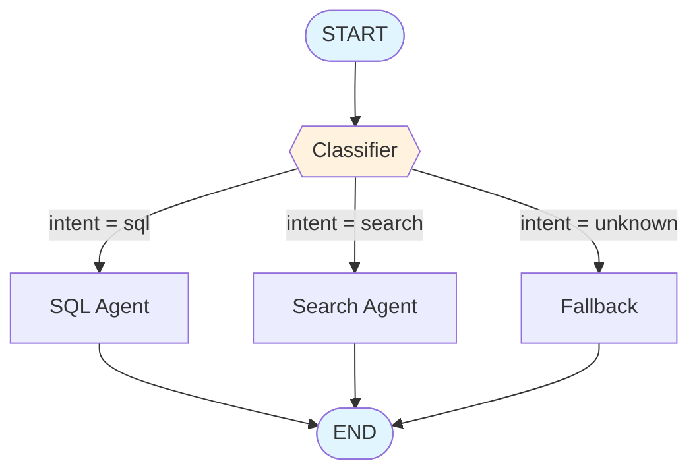
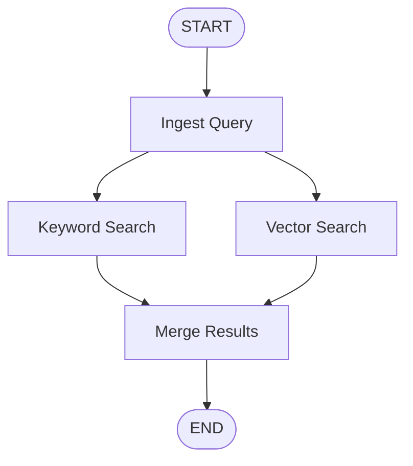
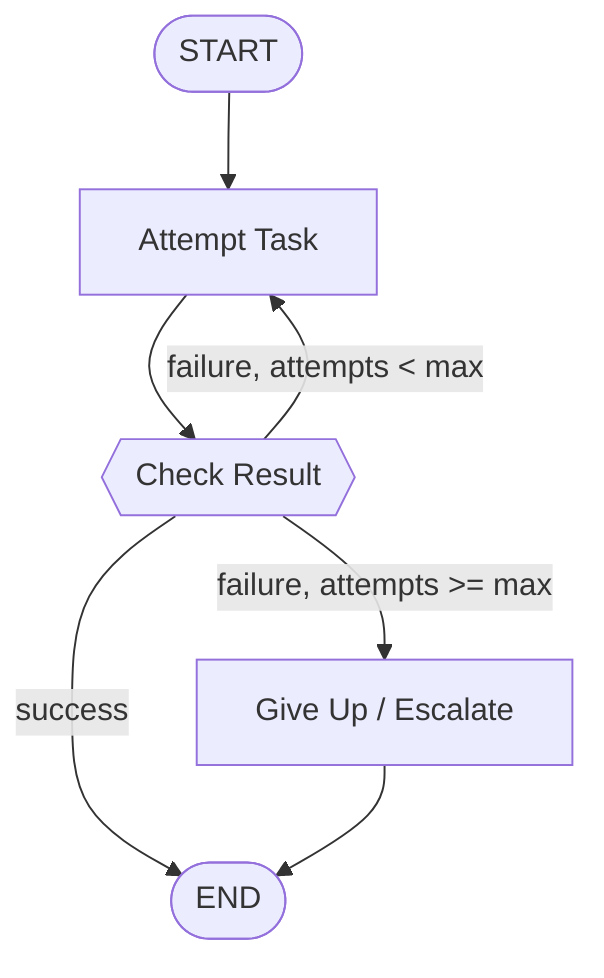

# Chapter 4: Edges & Routing

> "A graph is not a flowchart drawn for humans to admire — it's a set of decisions a machine has to make, deterministically, every single time." — a lesson every LangGraph engineer learns the hard way, usually via a `GraphRecursionError`

## Learning Objectives

By the end of this chapter, you will be able to:

- Explain the difference between a **normal edge** (`add_edge`) and a **conditional edge** (`add_conditional_edges`), and know precisely when to reach for each
- Write a **routing function** that inspects graph state and returns the name of the next node (or several node names at once) to execute
- Build a full **Intent Router**: a classifier node that dispatches to a SQL Agent or a Search Agent based on the user's query, wired together with `add_conditional_edges` and a `path_map`
- Implement **dynamic routing** — routing functions that compute a destination at runtime rather than choosing from a hardcoded pair — and distinguish this from true per-item fan-out (`Send`, covered fully in Chapter 13)
- Recognize the structural relationship between conditional edges and `Command` (Chapter 5): both decide "what happens next," but they live in different places and solve different problems
- Diagnose and avoid the three most common routing bugs: missing a path to `END`, unintentional infinite loops, and `path_map` mismatches that blow up at runtime

---

## Prerequisites for the Chapter

This chapter assumes you've completed:

- **Chapter 2 (StateGraph & State Management)** — you should be comfortable defining a state schema (`TypedDict`, dataclass, or Pydantic model) and understand that state updates are merged via reducers, not mutated in place
- **Chapter 3 (Nodes)** — you know that a node is just a callable (`state -> partial state update`), that nodes are registered with `graph.add_node(name, fn)`, and that a node's return value is what gets merged into the graph's state

If you can currently answer "what does a node receive and what must it return?" without hesitation, you're ready. This chapter answers the complementary question: **once a node finishes, how does the graph decide which node runs next?** That decision is entirely the job of edges — nodes never call each other directly. A node in LangGraph has no idea what runs after it; that responsibility is deliberately factored out into the graph's edge structure (or, as you'll preview in Chapter 5, into a `Command` a node returns). Keeping "what does this step do" (nodes) separate from "what happens after this step" (edges) is the single most important architectural idea in this chapter.

No new installation is required beyond what Chapters 1–3 already set up (`langgraph`, `langchain-core`, and an LLM client of your choice).

---

## 1. From Nodes to Flow: What Edges Actually Are

### 1.1 The graph is a directed graph, literally

A `StateGraph` is, underneath the abstractions, a directed graph in the graph-theory sense: nodes are vertices, and edges are directed connections between them. When you call `.compile()`, LangGraph doesn't just record "these nodes exist" — it builds an execution plan from the edges you declared, starting at the special `START` sentinel and (in a well-formed graph) always able to reach the special `END` sentinel.

```python
from langgraph.graph import StateGraph, START, END
```

`START` and `END` are not real nodes with logic attached — they're markers. `START` is where `.invoke()`/`.stream()` injects the initial state into the graph. `END` is where execution for a given path terminates. Every node you write must, directly or through a chain of edges, be reachable from `START` and have some route to `END` — otherwise you've built a node that either never runs or never lets the graph finish.

### 1.2 Two kinds of edges, one job

LangGraph gives you exactly two primitives for wiring nodes together, and the entirety of this chapter is understanding when to use which:

| Edge type | API | "Next node" decided by | Use when |
|---|---|---|---|
| **Normal edge** | `graph.add_edge(a, b)` | Fixed at graph-definition time | The transition is always the same, no matter what's in state |
| **Conditional edge** | `graph.add_conditional_edges(source, routing_fn, path_map)` | Computed at runtime, by inspecting state | The next node depends on data — a classification, a flag, a retry count, an LLM's tool call |

Both ultimately do the same thing — they tell the execution engine which node(s) to schedule next — but a normal edge answers that question once, when you build the graph, while a conditional edge answers it fresh on every execution, based on the state that node just produced.

---

## 2. Normal Edges: `add_edge(a, b)`

### 2.1 Semantics: unconditional, always-taken

```python
graph.add_edge("retrieve_documents", "generate_answer")
```

This says, unconditionally: *whenever `retrieve_documents` finishes, run `generate_answer` next.* There is no branching, no inspection of state, no possibility of going anywhere else. If you've worked with state machines or even basic pipeline DAGs (Airflow tasks, CI/CD stage dependencies), this is exactly that mental model — a static dependency edge.

Normal edges are the right tool whenever the transition really is fixed. A huge fraction of real graphs are mostly normal edges, with conditional edges reserved for the handful of places where the workflow genuinely branches. Don't reach for a conditional edge "just in case" — if a node has exactly one possible successor, `add_edge` is simpler, faster to reason about, and impossible to misconfigure with a bad `path_map`.

### 2.2 `START` and `END` are just nodes you connect with normal edges

```python
graph.add_edge(START, "classifier")   # entry point
graph.add_edge("sql_agent", END)      # exit point
graph.add_edge("search_agent", END)   # another exit point
```

Note that **multiple nodes can each have a normal edge into `END`** — that's not a special case, it's just an ordinary edge whose target happens to be the terminal sentinel. Similarly, exactly one (or more, if you want a graph with multiple valid entry points based on how it's invoked) node can be the target of an edge from `START`.

### 2.3 Fan-out and fan-in with normal edges

Normal edges aren't restricted to one-to-one. You can fan a single node out to multiple downstream nodes:

```python
graph.add_edge("ingest_query", "keyword_search")
graph.add_edge("ingest_query", "vector_search")
```

Both `keyword_search` and `vector_search` will run — this is *unconditional parallel fan-out*, not a decision between them. LangGraph schedules both in the same super-step because they have no data dependency on each other, only on `ingest_query`. (Chapter 13 covers this execution model — the "super-step" — and reducer-based merging in full depth; the important thing here is that unconditional fan-out is a normal-edge pattern, not a conditional-edge pattern, because *every* run takes *both* branches, always.)

You can equally fan multiple nodes **in** to one:

```python
graph.add_edge("keyword_search", "merge_results")
graph.add_edge("vector_search", "merge_results")
```

`merge_results` runs once both of its predecessors have completed, receiving the combined state update from both (again, reducers govern exactly how those two partial updates combine — see Chapter 6).

The distinguishing question for "do I need a conditional edge here?" is always: **does every execution take this path, or does it depend on the data?** Fan-out via `add_edge` means *every* run visits every branch. The moment "it depends" enters the picture, you need `add_conditional_edges`.

---

## 3. Conditional Edges: `add_conditional_edges(source, routing_function, path_map)`

### 3.1 Anatomy

```python
graph.add_conditional_edges(
    source,           # the node whose output triggers routing
    routing_function,  # state -> str (or list[str])
    path_map,         # optional: dict mapping routing_function's return value(s) to real node names
)
```

Conceptually: after `source` finishes and its state update is merged, LangGraph calls `routing_function(state)`. Whatever that function returns tells LangGraph which node (or nodes) to run next. This is the entire mechanism behind every branch, every classifier dispatch, and every retry loop you'll build in LangGraph.

### 3.2 The routing function contract

A routing function is a plain callable with a simple, strict contract:

- **Input:** the current graph state (the same state type your nodes receive)
- **Output:** either
  - a single string — the key to look up in `path_map` (or, if `path_map` is omitted, a real node name), or
  - a list of strings — triggers fan-out to every named destination in the same super-step

```python
from typing import Literal

def route_after_classifier(state: State) -> Literal["sql", "search"]:
    if state["intent"] == "database_query":
        return "sql"
    return "search"
```

Typing the return value with `Literal[...]` is a strong convention worth adopting immediately: it documents every possible destination right at the function signature, and most editors/type-checkers will flag it if you add a new branch in the function body but forget to update the `Literal`, or vice versa.

A routing function must be **pure with respect to graph execution** — it should read state and return a decision. It should not perform side effects (no LLM calls, no DB writes, no mutating state). If routing requires an LLM call (e.g., "classify this query"), that classification belongs in a regular node (like the Classifier node in Section 4) that writes its result into state; the routing function then just reads that already-computed field. Keeping routing functions pure keeps them fast, deterministic to test, and free of hidden failure modes.

### 3.3 `path_map`: translating logical decisions into real node names

`path_map` is the layer of indirection between "what the routing function conceptually decided" and "which literal node name LangGraph should schedule." It's optional, but you should treat it as required in anything beyond a toy example, for reasons explained below.

**Without a `path_map`** (routing function returns real node names directly):

```python
def route(state: State) -> str:
    return "sql_agent" if state["intent"] == "sql" else "search_agent"

graph.add_conditional_edges("classifier", route)
```

This works, but it tightly couples your routing logic to the literal node names used elsewhere in the graph. Rename `sql_agent` to `sql_execution_agent` and you must remember to update every routing function that hardcodes the old string — an easy thing to miss in a large graph.

**With a `path_map`** (the recommended default):

```python
def route(state: State) -> Literal["sql", "search"]:
    return "sql" if state["intent"] == "sql" else "search"

graph.add_conditional_edges(
    "classifier",
    route,
    {
        "sql": "sql_agent",
        "search": "search_agent",
    },
)
```

Now the routing function speaks in **logical labels** ("sql", "search") and the `path_map` is the single place that translates those labels into **actual node names**. Rename a node, and you change one line in the `path_map` — not every routing function that might reference it. It also makes graphs self-documenting: reading the `add_conditional_edges` call tells you every possible destination for this branch point without having to read the routing function's full implementation.

`path_map` also accepts a **list of node names** instead of a dict, for the case where the routing function's return values *are* already the real node names but you want LangGraph's graph-visualization tooling (`.get_graph().draw_mermaid()`, Studio, etc.) to know the full set of possible destinations up front:

```python
graph.add_conditional_edges(
    "classifier",
    route,                      # returns "sql_agent" or "search_agent" directly
    ["sql_agent", "search_agent"],
)
```

This is purely a visualization/introspection aid — it doesn't change runtime behavior — but it matters in practice: without a `path_map` (dict or list), LangGraph cannot statically know every node a conditional edge might reach, and diagrams generated from the compiled graph will under-draw the branch. If you care about accurate auto-generated diagrams (and in any team-maintained codebase, you should), always supply a `path_map`.

### 3.4 What compilation does with this

At `.compile()` time, LangGraph validates that:

- every node referenced in a `path_map` (or returned by an un-mapped routing function, insofar as it's statically declared) exists in the graph, and
- every node is reachable from `START`.

It does **not** validate, at compile time, that a routing function can never return a string outside its declared `path_map` — that's a runtime contract, and violating it is one of the most common production bugs in this chapter (Section 7.3).

---

## 4. Dynamic Routing: Computed Destinations and Fan-Out

Everything in Section 3 used a routing function with a small, fixed set of possible outputs. But the routing function is just Python — it can compute a destination in far more general ways.

### 4.1 Computed destinations, not just fixed branches

```python
def route_by_retry_count(state: State) -> Literal["retry", "escalate", "give_up"]:
    attempts = state.get("attempts", 0)
    if state["last_result"] == "success":
        return "escalate"       # not really an error path, just an example of >2 branches
    if attempts < 3:
        return "retry"
    return "give_up"
```

The routing function isn't limited to reading one field and doing an `if/else` — it can combine several pieces of state, apply thresholds, look at a rolling history, or invoke arbitrary (side-effect-free) Python logic to arrive at a destination. The "destination" is *computed*, not chosen from a hardcoded pair, which is what makes this dynamic rather than merely conditional.

### 4.2 Fan-out via conditional edges: returning a list

A routing function may return a **list of node names** (or list of `path_map` keys) instead of a single string. LangGraph interprets this as "schedule all of these in the same super-step" — a conditional, data-dependent fan-out:

```python
def route_to_relevant_tools(state: State) -> list[str]:
    destinations = []
    if state["needs_pricing_lookup"]:
        destinations.append("pricing_agent")
    if state["needs_inventory_lookup"]:
        destinations.append("inventory_agent")
    if not destinations:
        destinations.append("fallback_agent")
    return destinations

graph.add_conditional_edges(
    "triage",
    route_to_relevant_tools,
    ["pricing_agent", "inventory_agent", "fallback_agent"],
)
```

This is meaningfully different from the unconditional fan-out in Section 2.3: there, *every* run took both branches, always, because they were wired with static `add_edge` calls. Here, the *set* of branches taken depends on state — one run might trigger only `pricing_agent`, another might trigger both, another might fall through to `fallback_agent` alone. That data-dependence is exactly what conditional edges are for.

### 4.3 Where this stops being enough — and where `Send` picks up

This list-returning pattern fans out to a **fixed, known set of node names** — you still enumerate `pricing_agent`, `inventory_agent`, `fallback_agent` by name in your graph and `path_map`. It does not let you spin up, say, "one node invocation per item in a list whose length you only know at runtime" — e.g., "run a `summarize_document` node once per document, for however many documents the previous node retrieved." That's a fundamentally different shape of problem: you need the *same* node to run multiple times, each with a different slice of state, and the number of times isn't known until runtime.

That capability exists in LangGraph, but it isn't a conditional edge — it's the `Send` primitive (`from langgraph.types import Send`), which a routing function (or a node, via `Command`) can return to dynamically dispatch N parallel invocations of a node, each carrying its own private state payload. This chapter's conditional-edge fan-out is "pick which of these known nodes to run"; `Send`'s job is "run this one node an unknown number of times, once per item." We'll build this fully in **Chapter 13 (Parallel Execution)** as the map-reduce pattern — file the distinction away now so you reach for the right tool later: fixed set of named destinations → conditional edge with a list return; unknown-cardinality per-item fan-out → `Send`.

---

## 5. Branching Patterns: If/Else, Switch, and Fallbacks

Real graphs tend to reuse a small handful of branching shapes over and over. Naming them makes them easy to recognize and reuse.

### 5.1 Binary if/else routing

The simplest and most common shape — exactly two possible destinations:

```python
def route_on_confidence(state: State) -> Literal["auto_approve", "human_review"]:
    return "auto_approve" if state["confidence"] >= 0.9 else "human_review"

graph.add_conditional_edges(
    "score_response",
    route_on_confidence,
    {"auto_approve": "finalize", "human_review": "await_approval"},
)
```

### 5.2 Multi-way switch-style routing

More than two branches, dispatched from a single categorical value — the Intent Router in Section 6 is the canonical example, but the shape generalizes to any enum-like field:

```python
def route_by_category(state: State) -> Literal["billing", "technical", "sales", "unknown"]:
    return state.get("category", "unknown")

graph.add_conditional_edges(
    "categorize",
    route_by_category,
    {
        "billing": "billing_agent",
        "technical": "tech_support_agent",
        "sales": "sales_agent",
        "unknown": "general_agent",
    },
)
```

This is functionally a `switch` statement, expressed as data — the routing function does the categorization (or, more commonly, just reads a category that an upstream node already computed), and `path_map` is the dispatch table.

### 5.3 Default / fallback destinations

Every multi-way router should have an explicit "I don't know what to do with this" branch, rather than assuming the categorical field will always be one of the values you anticipated:

```python
def route_by_category(state: State) -> str:
    category = state.get("category")
    if category in {"billing", "technical", "sales"}:
        return category
    return "unknown"   # explicit fallback, not an accident
```

Defensive routing like this matters more than it looks — `category` might come from an LLM classification call, and LLMs occasionally return values slightly outside your expected enum (extra whitespace, a synonym, a hallucinated category). An explicit fallback branch turns "the graph crashes with a `path_map` mismatch in production" (Section 7.3) into "the graph gracefully routes to a general-purpose handler." Section 7 covers exactly what happens when you skip this.

---

## 6. Conditional Edges vs. `Command` — A Preview

You'll meet `Command` properly in **Chapter 5**, but it's worth placing it next to conditional edges now, because the two solve overlapping problems from opposite directions, and picking the wrong one for your situation is a common early-LangGraph design mistake.

| | Conditional edge (`add_conditional_edges`) | `Command` (Chapter 5) |
|---|---|---|
| **Where routing logic lives** | Outside the node, in a separate routing function registered on the graph | Inside the node — the node itself returns the destination |
| **Node's job** | Pure state transformation only; has no idea what runs next | State transformation *and* routing decision, combined |
| **Best for** | Keeping business logic (classification, decision-making) cleanly separated from control flow, especially when the same routing logic might apply after multiple different nodes | A node that already knows, as a direct consequence of its own work (e.g., a tool call result, an LLM's decision), exactly what should happen next — no separate inspection needed |
| **Testability** | Routing function is tested in isolation from any node, trivially — call it with a fake state dict | Routing decision is entangled with the node's business logic in the same test |
| **Readability of the graph definition** | The `add_conditional_edges` call is a single, explicit place to read every possible destination | Destinations are discoverable only by reading the node's implementation |

The short version: **conditional edges keep "what to do" and "what happens next" in separate places** — a node computes and returns state, and a dedicated routing function (registered separately, on the graph) decides where that state goes next. **`Command` collapses those two decisions into the node itself** — the node returns both a state update and an explicit `goto` destination in one object, skipping the separate `add_conditional_edges` registration entirely.

Neither is strictly "better" — they're different factorizations of the same underlying need. A rule of thumb that holds up well in practice: reach for conditional edges when the routing decision is naturally a *separate concern* from the node's core job (a classifier's job is to classify, not to know that "sql" routes to a node literally named `sql_agent`); reach for `Command` when the node's own logic *is* the routing decision (a tool-calling agent node that decides, based on the model's response, whether to go to a tool-execution node or straight to `END`). Chapter 5 works through this trade-off with full worked examples in both directions.

---

## 7. Common Pitfalls in Routing Logic

### 7.1 Forgetting a path to `END`

If some reachable node in your graph has no outgoing edge — normal or conditional — at all, `.compile()` will typically raise an error, because that node is a dead end with no declared exit. The more insidious version of this bug is a conditional edge whose `path_map` covers every *expected* branch but never includes a route to `END`:

```python
# Missing: what happens when the loop should stop?
def route_after_retry(state: State) -> Literal["retry"]:
    return "retry"

graph.add_conditional_edges("retry_node", route_after_retry, {"retry": "retry_node"})
```

This compiles fine — every declared branch has a valid destination — but there's no exit condition anywhere, which leads directly into the next pitfall.

### 7.2 Infinite routing loops

A conditional edge that always routes back into the same node (or a cycle of nodes) with no terminating condition will run until LangGraph's **recursion limit** kicks in and raises a `GraphRecursionError`. This is the most common way a "the graph seems to hang" bug actually manifests — it's not hanging, it's looping until it hits the configured step ceiling (default 25 super-steps, adjustable via the `recursion_limit` config at invoke time, covered in Chapter 7).

The fix is always the same: make sure the routing function's condition for staying in the loop is guaranteed to eventually become false.

```python
def route_after_retry(state: State) -> Literal["retry", "give_up"]:
    if state["success"]:
        return "give_up"          # not an error path — just "stop looping"
    if state["attempts"] >= MAX_ATTEMPTS:
        return "give_up"          # the guard that actually terminates the loop
    return "retry"
```

Every retry/refinement loop in LangGraph needs a counter or a success flag that's checked by the routing function, and that counter must be incremented by a node inside the loop. It's easy to write the increment logic and forget to actually read it in the routing function (or vice versa) — when you review a loopy graph, explicitly trace: *what state field terminates this loop, which node increments/sets it, and does the routing function check it before deciding to loop again?*

### 7.3 `path_map` mismatches

This is the pitfall unique to conditional edges, and it's a runtime failure, not a compile-time one: the routing function returns a string that isn't a key in the `path_map` you supplied.

```python
def route(state: State) -> str:
    return state["intent"]   # trusts an upstream classifier completely

graph.add_conditional_edges(
    "classifier",
    route,
    {"sql": "sql_agent", "search": "search_agent"},
)
```

If `state["intent"]` ever comes back as `"database"` instead of `"sql"` (a synonym an LLM classifier produced, a typo in a prompt template, a new intent category someone added upstream without updating this `path_map`), LangGraph has no destination to route to and raises an error at that point in execution — potentially in production, on a real user request, after the classifier has already run and consumed an LLM call.

The defense is the fallback pattern from Section 5.3: never let a routing function return a raw, unvalidated upstream value directly. Always normalize it against the exact set of keys in your `path_map`, with an explicit default:

```python
VALID_INTENTS = {"sql", "search"}

def route(state: State) -> Literal["sql", "search"]:
    intent = state["intent"]
    return intent if intent in VALID_INTENTS else "search"   # safe default
```

Treat every `path_map` as a contract, and treat every routing function as responsible for enforcing that contract against whatever upstream data it's reading — not merely for expressing the "happy path" branching logic.

---

## Examples

### The Intent Router — full worked example

This is the running example promised in the learning objectives: a **Classifier** node inspects an incoming user query, decides whether it's a database question or a general information question, and a conditional edge routes accordingly to a **SQL Agent** or a **Search Agent**.

```python
from typing import Literal, TypedDict
from langgraph.graph import StateGraph, START, END
from langchain_core.messages import BaseMessage, AIMessage, HumanMessage


class RouterState(TypedDict):
    query: str
    intent: Literal["sql", "search", "unknown"]
    response: str


# --- Node: Classifier -------------------------------------------------------
# In a real system this would call an LLM with structured output (a Pydantic
# schema or `with_structured_output`) to classify the query. We keep the
# logic explicit here so the routing mechanics stay front and center.

def classifier_node(state: RouterState) -> dict:
    query = state["query"].lower()
    sql_signals = ("how many", "count", "average", "total", "select", "database", "table")
    if any(signal in query for signal in sql_signals):
        intent = "sql"
    elif query.strip():
        intent = "search"
    else:
        intent = "unknown"
    return {"intent": intent}


# --- Node: SQL Agent ---------------------------------------------------------

def sql_agent_node(state: RouterState) -> dict:
    # Real implementation: build a SQL query (or call a text-to-SQL chain),
    # execute it against a database, and format the result.
    answer = f"[SQL Agent] Ran a structured query for: {state['query']!r}"
    return {"response": answer}


# --- Node: Search Agent -------------------------------------------------------

def search_agent_node(state: RouterState) -> dict:
    # Real implementation: call a retriever or web-search tool, then an LLM
    # to synthesize an answer from the retrieved context.
    answer = f"[Search Agent] Retrieved and summarized context for: {state['query']!r}"
    return {"response": answer}


# --- Node: Fallback (handles the "unknown" intent) --------------------------

def fallback_node(state: RouterState) -> dict:
    return {"response": "I couldn't understand that query — could you rephrase it?"}


# --- Routing function ---------------------------------------------------------

def route_after_classifier(state: RouterState) -> Literal["sql", "search", "unknown"]:
    # Pure read of already-computed state — no side effects, no LLM calls here.
    return state["intent"]


# --- Graph assembly ------------------------------------------------------------

graph = StateGraph(RouterState)

graph.add_node("classifier", classifier_node)
graph.add_node("sql_agent", sql_agent_node)
graph.add_node("search_agent", search_agent_node)
graph.add_node("fallback", fallback_node)

graph.add_edge(START, "classifier")

graph.add_conditional_edges(
    "classifier",
    route_after_classifier,
    {
        "sql": "sql_agent",
        "search": "search_agent",
        "unknown": "fallback",
    },
)

graph.add_edge("sql_agent", END)
graph.add_edge("search_agent", END)
graph.add_edge("fallback", END)

app = graph.compile()

# --- Running it ------------------------------------------------------------

result = app.invoke({"query": "How many orders were placed last month?", "intent": "unknown", "response": ""})
print(result["intent"])    # "sql"
print(result["response"])  # "[SQL Agent] Ran a structured query for: 'How many orders were placed last month?'"

result = app.invoke({"query": "What is the capital of Australia?", "intent": "unknown", "response": ""})
print(result["intent"])    # "search"
print(result["response"])  # "[Search Agent] Retrieved and summarized context for: ..."
```

Notice the structure this example demonstrates end-to-end:

1. `START` connects unconditionally (normal edge) to `classifier`.
2. `classifier` runs, writing an `intent` field into state — it does not decide what runs next; it only classifies.
3. `add_conditional_edges("classifier", route_after_classifier, path_map)` inspects that freshly-written `intent` field and dispatches to exactly one of three real node names.
4. Every terminal node (`sql_agent`, `search_agent`, `fallback`) has a normal edge straight to `END` — three separate exits, all valid, all reachable.

This is the minimum viable shape of nearly every "router" pattern you'll build in LangGraph: **one node whose only job is to classify, one conditional edge whose only job is to dispatch based on that classification, and N terminal (or continuing) nodes that do the actual work.**

### A multi-way switch with a fallback

Extending the same shape to more categories is purely additive — you add a node, add a `path_map` entry, and the routing function's job doesn't change in kind, only in the size of the mapping it consults:

```python
def route_by_department(state: RouterState) -> Literal["billing", "technical", "sales", "fallback"]:
    valid = {"billing", "technical", "sales"}
    intent = state.get("intent", "")
    return intent if intent in valid else "fallback"

graph.add_conditional_edges(
    "categorize",
    route_by_department,
    {
        "billing": "billing_agent",
        "technical": "tech_support_agent",
        "sales": "sales_agent",
        "fallback": "general_agent",
    },
)
```

---

## Diagrams

The Intent Router's control flow, as declared by the code in the Examples section above:



The dashed decision diamond (`Classifier`) is where `add_conditional_edges` lives conceptually — one node, three possible outgoing paths, each labeled with the `path_map` key that selects it. Everything downstream of the diamond converges back to a single `END`, which is the normal-edge fan-in pattern from Section 2.3 applied to graph termination.

For contrast, here's the shape of an unconditional fan-out/fan-in (Section 2.3) next to it — notice it has no decision diamond at all, because *every* run takes *both* branches:



And the retry-loop shape from Section 7.2, showing where the terminating condition must live for the loop to be safe:



---

## Real-World Scenarios

**Scenario 1 — the intent router that quietly stopped working.** A team ships an Intent Router nearly identical to this chapter's worked example, backed by an LLM classifier instead of keyword matching, in front of a customer support assistant. It works flawlessly in staging. Two months later, a new prompt-engineering pass tweaks the classifier's system prompt to be "more natural" — and it starts occasionally returning `"database"` instead of `"sql"`, a synonym that reads identically to a human reviewer but isn't a key in the `path_map`. In production, this surfaces as an intermittent `KeyError`/routing error on a small percentage of otherwise well-formed requests — the classic **`path_map` mismatch** from Section 7.3, made worse because the failure only appears for the specific fraction of queries where the LLM happens to phrase its classification that way, making it maddening to reproduce locally. The fix that actually sticks isn't "tell the LLM to only say 'sql'" (prompts are not contracts) — it's adding the explicit normalization/fallback guard from Section 7.3 so any unrecognized classification degrades gracefully to the search agent instead of crashing the request.

**Scenario 2 — the "smart" refinement loop that never stopped.** An engineer builds a graph where a `draft_answer` node writes a response, a `critique` node scores it, and a conditional edge routes back to `draft_answer` whenever the critique score is below a threshold — intended as a self-refinement loop, conceptually similar to reflection patterns popular in agent design. In testing with a handful of easy queries, the loop always converges within 1–2 iterations and looks great. In production, a genuinely hard or ambiguous query never crosses the score threshold, and the loop runs until LangGraph's recursion limit fires a `GraphRecursionError` — burning dozens of LLM calls (and the associated cost and latency) before failing loudly. The actual bug wasn't the scoring logic; it was that the routing function checked *only* the critique score and never checked an attempt counter, so there was no hard ceiling independent of the (unreliable) quality signal. The fix combines both: route back to `draft_answer` only while `score < threshold` **and** `attempts < MAX_ATTEMPTS`, with the second condition guaranteed to eventually force an exit regardless of how the score behaves.

**Scenario 3 — turning a conditional edge into a `Command` mid-project.** A team initially builds a tool-calling agent with a conditional edge: an `agent` node calls an LLM, and a separate routing function inspects `state["messages"][-1]` to decide between `"tools"` (if the LLM requested a tool call) and `END` (if it produced a final answer) — the canonical ReAct-loop shape covered fully in Chapter 8. Later, the team wants the agent node itself to sometimes force a jump straight to a human-approval node, based on internal logic that has nothing to do with tool calls (e.g., detecting a sensitive topic). Bolting a third branch onto the external routing function works, but it means the routing function now needs to duplicate business logic that conceptually belongs inside the agent node. This is exactly the seam where teams migrate from a conditional edge to `Command` (Chapter 5): once a node's own logic needs to make an increasingly rich routing decision, moving the decision *into* the node (via `Command(goto=..., update=...)`) is often cleaner than growing an external routing function to match it.

---

## Best Practices

- **Prefer normal edges whenever the transition truly never varies.** Reach for `add_conditional_edges` only when the next node genuinely depends on state — don't build conditional infrastructure for a decision that's actually always the same.
- **Always supply a `path_map`**, even when your routing function already returns real node names. It documents every possible destination in one place, decouples routing logic from literal node names, and keeps auto-generated graph diagrams accurate.
- **Type the routing function's return value with `Literal[...]`.** It turns "which branches exist" into something your editor and type-checker can verify against the `path_map`, catching drift between the two as you evolve the graph.
- **Keep routing functions pure.** No LLM calls, no DB writes, no side effects — only reads of state that some upstream node already computed. This keeps them trivially unit-testable (call with a fake state dict, assert on the return value) and keeps control flow easy to reason about.
- **Always include an explicit fallback/default branch** in any multi-way router, and normalize whatever value you're routing on against the exact key set of your `path_map` before returning it — never trust an upstream value (especially an LLM output) to always land inside your expected enum.
- **Every loop needs an escape hatch independent of the "quality" signal that's supposedly ending it.** Pair any content-based loop condition (a score, a classification) with a hard attempt counter, and make sure the routing function actually checks the counter.
- **Draw the graph before you ship it.** Use `.get_graph().draw_mermaid()` (or the equivalent Studio visualization) on the compiled graph and manually verify every path reaches `END` — this catches dead ends and missing exits far faster than reading code.
- **Decide deliberately between a conditional edge and `Command`** (Chapter 5) rather than defaulting to whichever one you learned first — use the comparison in Section 6 as your checklist.

---

## Common Mistakes

- **Missing a route to `END`.** A node with only conditional outgoing edges whose `path_map` never includes `"end": END` (or an equivalent) leaves the graph with no way to terminate down that path — often only discovered when a specific, previously-untested state value triggers it in production.
- **Infinite/unbounded routing loops.** A conditional edge that routes back into a cycle with a termination condition that isn't guaranteed to eventually flip (Section 7.2) — the graph doesn't "hang," it burns through the recursion limit and raises `GraphRecursionError`, usually after consuming real LLM cost and latency first.
- **`path_map` mismatches.** The routing function returns a string that isn't a key in `path_map` — most often because an upstream value (an LLM classification, a user-supplied field) drifted outside the exact set of values the routing function's author anticipated (Section 7.3).
- **Putting side effects inside a routing function.** Calling an LLM, hitting a database, or mutating external state from inside the function passed to `add_conditional_edges` makes routing decisions slow, hard to test in isolation, and liable to run more than once if LangGraph needs to re-evaluate the routing step (e.g., during certain replay/resume scenarios covered in Chapter 9).
- **Confusing unconditional fan-out with conditional fan-out.** Wiring a "sometimes both, sometimes neither" branch with static `add_edge` calls (which always fire) instead of a conditional edge returning a list — or the reverse, adding conditional-edge machinery for a fan-out that should always happen unconditionally.
- **Reaching for a full `Send`-based dynamic fan-out (Chapter 13) when a simple list-returning conditional edge would do.** If your set of possible destination nodes is small, fixed, and known at graph-definition time, a conditional edge with a list return (Section 4.2) is simpler and sufficient — `Send` earns its complexity only when the *number* of parallel invocations is unknown until runtime.
- **Letting a routing function's logic silently diverge from its `Literal` type hint** as the graph evolves — adding a new branch in the function body without updating the type hint (or the `path_map`) removes the main safety net this pattern is supposed to provide.

---

## Summary

- **Normal edges** (`add_edge(a, b)`) declare a fixed, always-taken transition between two nodes, decided once at graph-definition time — the right default whenever a transition never varies, including unconditional fan-out/fan-in between multiple nodes.
- **Conditional edges** (`add_conditional_edges(source, routing_function, path_map)`) compute the next node (or nodes) at runtime by calling a routing function against the current state; `path_map` translates the routing function's logical return values into real node names and should be supplied even when technically optional.
- A **routing function** should be pure — reading already-computed state and returning a decision, never performing side effects itself — and its return type should be annotated with `Literal[...]` to keep it in sync with its `path_map`.
- **Dynamic routing** lets a routing function compute a destination from arbitrary logic, and returning a **list** of destinations triggers conditional fan-out to a known, fixed set of nodes; true per-item, unknown-cardinality fan-out is the job of `Send`, covered fully in Chapter 13.
- **Branching patterns** — if/else, multi-way switch, and default/fallback — are all the same underlying mechanism (`add_conditional_edges` + `path_map`) applied at different scales; every multi-way router should have an explicit fallback branch.
- **Conditional edges and `Command`** (full treatment in Chapter 5) are two different factorizations of the same "what happens next" decision: conditional edges keep routing logic external and separately testable; `Command` lets a node decide its own destination inline, which is often cleaner once the routing decision is entangled with the node's own business logic.
- The three pitfalls to actively guard against every time you write a conditional edge: **a missing path to `END`**, **an infinite loop with no counter-based escape hatch**, and **a `path_map` mismatch** from trusting an unvalidated upstream value.

---

## Knowledge Check

1. You have a node that always transitions to exactly one other node, regardless of any state. Which edge type should you use, and why would using `add_conditional_edges` here be worse, not just unnecessary?
2. Write a routing function (with a `Literal` return type) and its corresponding `path_map` for a three-way router that dispatches to `"refund_agent"`, `"complaint_agent"`, or `"general_agent"` based on a `state["category"]` field, with an explicit fallback for any unrecognized category.
3. A colleague's graph has a conditional edge whose routing function returns `state["next_step"]` directly, with no `path_map` and no validation. Identify two distinct ways this can fail in production, and explain how you'd defend against each.
4. Explain, in your own words, why a routing function should never make an LLM call or write to a database. What specifically goes wrong (in terms of testability and correctness) if it does?
5. You're building a refinement loop: a `generate` node produces a draft, a `critique` node scores it, and a conditional edge sends it back to `generate` if the score is too low. What two independent conditions should the routing function check before deciding to loop again, and why is checking only one of them dangerous?
6. Describe, at a conceptual level (you'll implement this fully in Chapter 5), how a `Command`-based node would replace a conditional edge for the tool-calling ReAct pattern (agent → tools or agent → `END`). What moves from the graph definition into the node?

---

## Hands-On Exercises

1. **Build the Intent Router from scratch.** Using the worked example in this chapter as a reference (but writing your own classifier logic — try a slightly different keyword set or category scheme), implement a `StateGraph` with a classifier node and at least three downstream agents dispatched via `add_conditional_edges` with an explicit `path_map`. Run it against at least six test queries covering every branch, including at least one query designed to hit your fallback path. Print the compiled graph's Mermaid diagram (`app.get_graph().draw_mermaid()`) and verify by eye that every node has a path to `END`.

2. **Break it, then fix it.** Take your graph from Exercise 1 and deliberately introduce a `path_map` mismatch: change the classifier so that, for one specific test query, it returns a category string that isn't a key in your `path_map` (simulating an LLM classifier drifting outside its expected enum). Run the graph and observe the exact failure. Then apply the normalization/fallback fix from Section 7.3 and confirm the same input now degrades gracefully instead of failing.

3. **Build a bounded retry loop.** Implement the shape from the retry-loop diagram in this chapter: an `attempt` node that simulates a task that "succeeds" only after a random or state-tracked number of tries, a `check_result` node/routing function that inspects both the result and an attempt counter, and a conditional edge that loops back to `attempt` while attempts remain, routes to `END` on success, and routes to a `give_up` node once a `MAX_ATTEMPTS` ceiling is hit. Deliberately set `MAX_ATTEMPTS` very high and remove the attempt-counter check to reproduce a `GraphRecursionError`, then restore the check and confirm the loop terminates correctly. This is the fastest way to build real intuition for why every loop needs an escape hatch independent of the condition it's nominally waiting on.

---

## Further Reading

- [LangGraph Documentation — Graph API: Edges](https://docs.langchain.com/oss/python/langgraph/graph-api) — official reference for `add_edge`, `add_conditional_edges`, and `path_map` semantics
- [LangGraph Documentation — Application Structure](https://docs.langchain.com/oss/python/langgraph/application-structure) — how graphs, nodes, and edges fit into a full LangGraph application
- [LangGraph GitHub Repository](https://github.com/langchain-ai/langgraph) — source of truth for the exact current signatures of `StateGraph.add_conditional_edges` and `Send`
- [LangSmith Documentation](https://docs.smith.langchain.com/) — tracing a compiled graph's execution is the fastest way to see exactly which routing decision fired and why, especially when debugging a `path_map` mismatch
- Related chapter in this course: **Chapter 5 — Commands & Dynamic Control**, for the full `Command`/`goto`/`update` treatment previewed in Section 6
- Related chapter in this course: **Chapter 13 — Parallel Execution**, for the full `Send`-based map-reduce fan-out pattern foreshadowed in Section 4.3

---

<div style="display:flex;justify-content:space-between;align-items:center;">
  <a href="./03-nodes.md">← Previous: Nodes</a>
  <a href="./00-index.md">🏠 Index</a>
  <a href="./05-commands-and-dynamic-control.md">Next: Commands & Dynamic Control →</a>
</div>
