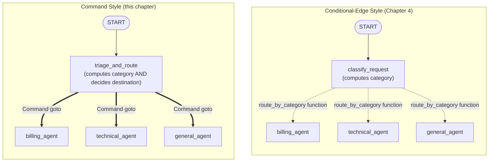
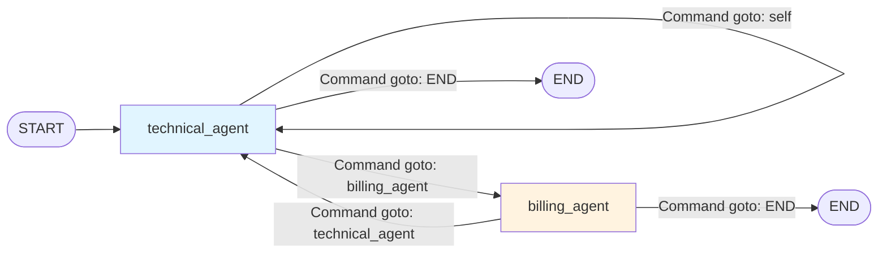

# Chapter 5: Commands & Dynamic Control

> "The best abstractions collapse two decisions into one, without hiding either of them." — a paraphrase of every good API design principle you've ever read

## Learning Objectives

By the end of this chapter, you will be able to:

- Explain what a `Command` object is and why it exists as an alternative to conditional edges
- Return `Command(update={...}, goto="node_name")` from a node to simultaneously mutate state and choose the next node in a single unit of code
- Articulate, with concrete criteria, when to prefer conditional edges (Chapter 4) versus Command-based routing for a given piece of routing logic
- Correctly use every `goto` target LangGraph supports: a single node name, `END`, and — with a one-line preview of Chapter 15 — a node in a parent graph via `Command(goto=..., graph=Command.PARENT)`
- Reason precisely about how `Command`'s `update` field merges into graph state, including how it interacts with reducers (a full preview of Chapter 6)
- Recognize `Command` as the mechanism that powers agent handoffs in multi-agent systems (a preview of Chapter 14), where an LLM's own reasoning — not external routing code — decides the next destination
- Build a single node that replaces a classifier-node + conditional-edge pair, collapsing two units of code into one

---

## Prerequisites for the Chapter

This chapter builds directly on **Chapter 4: Edges & Routing**, where you learned:

- **Normal edges** (`add_edge(source, target)`) — unconditional, fixed transitions between two nodes
- **Conditional edges** (`add_conditional_edges(source, routing_function, path_map)`) — a separate routing function inspects state *after* a node finishes and returns the name of the next node (or a list of names, for fan-out), decoupling "what a node computes" from "where the graph goes next"
- That routing functions are ordinary Python callables: they take the current state and return a string (or list of strings) naming a destination node, and LangGraph looks that name up via an optional `path_map` dictionary before making the jump
- That this separation is a deliberate design choice — a graph's shape (which nodes can lead to which) is inspectable and testable independently from what any individual node's business logic does

It also assumes the state-management model from **Chapter 2** (state schemas as `TypedDict`/dataclass/Pydantic models, with node return values merged into state) and the node execution contract from **Chapter 3** (a node is a callable that receives state and returns a partial update).

This chapter's central move is to show you the other half of the coin: sometimes the cleanest design is *not* to separate "compute" from "route," but to fuse them, because the routing decision only makes sense as an output of the node's own computation. `Command` is the object that lets you do that.

No new installation is required beyond what you already have (`langgraph`, `langchain-core`, and an LLM provider package such as `langchain-anthropic` or `langchain-openai`).

---

## 1. The Problem: Two Units of Code for One Decision

### 1.1 Recap — the classifier + conditional edge pattern

In Chapter 4, a typical dynamic-routing graph looked like this:

```python
from typing import TypedDict, Literal
from langgraph.graph import StateGraph, START, END

class State(TypedDict):
    request: str
    category: str
    response: str

def classify_request(state: State) -> dict:
    # Node 1: pure computation, no routing decision here
    category = run_classifier(state["request"])
    return {"category": category}

def route_by_category(state: State) -> Literal["billing_agent", "technical_agent", "general_agent"]:
    # A *separate* function: pure routing, no computation here
    if state["category"] == "billing":
        return "billing_agent"
    elif state["category"] == "technical":
        return "technical_agent"
    return "general_agent"

builder = StateGraph(State)
builder.add_node("classify_request", classify_request)
builder.add_node("billing_agent", billing_agent)
builder.add_node("technical_agent", technical_agent)
builder.add_node("general_agent", general_agent)

builder.add_edge(START, "classify_request")
builder.add_conditional_edges(
    "classify_request",
    route_by_category,
    {"billing_agent": "billing_agent", "technical_agent": "technical_agent", "general_agent": "general_agent"},
)
```

This is clean, and for the reasons covered in Chapter 4, it's often the *right* design: the routing function is independently testable (`assert route_by_category({"category": "billing"}) == "billing_agent"` requires no LLM call, no I/O, nothing), and it can be reused across multiple source nodes if more than one part of your graph needs to make the same category-based decision.

### 1.2 The friction point

But look closely at what `classify_request` and `route_by_category` actually do: they operate on the *exact same piece of information*. The classifier computes `category`. The router immediately re-reads `category` from state to decide where to go. There is no independent reuse happening — `route_by_category` is only ever called after `classify_request`, and nothing else in the graph calls it. You've paid the cost of two units of code (a node function plus a routing function, plus the `path_map` wiring in `add_conditional_edges`) to express what is conceptually a single decision: *"having figured out the category, go to the matching agent."*

This friction gets worse in agentic settings. Imagine an LLM-driven node where the model itself, mid-generation, decides "this request needs a specialist — hand it to the billing agent." The *routing decision is already inside the node's output* — it's part of what the LLM produced, not something a downstream function needs to re-derive by re-inspecting state. Writing a separate `route_by_category`-style function to re-parse the LLM's decision out of state is redundant busywork; the node already knows where to go the moment it finishes.

### 1.3 Introducing `Command`

LangGraph's answer is the **`Command`** object. Instead of a node returning a plain dict (a state update) and a separate conditional edge inspecting the result, a node can return a `Command` that carries *both* the state update *and* the next destination in one value:

```python
from langgraph.types import Command
from typing import Literal

def triage_and_route(state: State) -> Command[Literal["billing_agent", "technical_agent", "general_agent"]]:
    category = run_classifier(state["request"])
    destination = {
        "billing": "billing_agent",
        "technical": "technical_agent",
        "general": "general_agent",
    }[category]
    return Command(update={"category": category}, goto=destination)
```

One function. One return value. No `add_conditional_edges` call, no separate routing function, no `path_map`. The node *is* the router. This is the core idea of this chapter — everything below is elaboration, comparison, and nuance around this one collapse.

---

## 2. The `Command` Object: Anatomy and Semantics

### 2.1 Import and shape

```python
from langgraph.types import Command
```

`Command` is a small, typed container with (practically speaking) three fields you'll use constantly and one you'll use rarely in this chapter:

| Field | Type (informal) | Purpose |
|---|---|---|
| `update` | `dict` (or any partial state shape) | The state update — merges into graph state exactly like a node's plain-dict return value |
| `goto` | `str` \| `Sequence[str]` \| `Send` \| `Sequence[Send]` | The next node(s) to execute |
| `graph` | `str` (usually `Command.PARENT`) | Escapes routing up to the *parent* graph when called from inside a subgraph — Chapter 15 |
| `resume` | any | Used when resuming a graph paused by `interrupt()` — Chapter 12, not covered here |

A node returns a `Command` instead of a plain dict whenever it needs to say "here is my state update, *and* here is where execution should go next." You do not have to supply both fields — `Command(goto="some_node")` with no `update` is legal (pure routing, no state change), and in principle `Command(update={...})` with no `goto` behaves like a normal dict return followed by whatever edges are already defined from that node.

### 2.2 The type annotation convention: `Command[Literal[...]]`

Notice the return type in the example above: `Command[Literal["billing_agent", "technical_agent", "general_agent"]]`. This isn't decorative. Because a `Command`-returning node has **no corresponding `add_conditional_edges` call**, LangGraph has no static, declarative record of which nodes it might jump to — that information only exists at runtime, inside the function body. Annotating the return type with `Command[Literal[...]]` gives LangGraph (and your type checker) a way to recover that information statically:

- `graph.get_graph().draw_mermaid()` and similar visualization tools use the annotation to draw the edges out of a Command-returning node, exactly as if you'd called `add_edge` for each listed destination.
- Static type checkers (mypy, pyright) will flag a typo like `goto="biling_agent"` as a type error if the `Literal` doesn't include that string — a class of bug that a bare `add_conditional_edges` `path_map` mismatch would only surface at runtime.

The routing itself works at runtime **regardless of whether you add this annotation** — LangGraph resolves `goto` dynamically by looking up the node name in the compiled graph. But skipping the annotation means you lose graph visualization accuracy and static safety for no benefit, so treat it as a required convention, not an optional nicety.

### 2.3 `goto` semantics

`goto` accepts:

- **A single node name** (`str`) — the common case: `Command(goto="billing_agent")`.
- **`END`** — terminate the graph from this node, optionally carrying a final state update: `Command(update={"response": final_text}, goto=END)`. Import `END` the same way you did for conditional edges: `from langgraph.graph import END`.
- **A list of node names** — fan out to multiple nodes in the same super-step (parallel execution), analogous to a conditional edge returning a list. Full treatment of coordinating parallel branches and merging their results is Chapter 13.
- **`Send` objects** (`Command(goto=[Send("worker", {"item": x}) for x in items])`) — dynamic map-style fan-out where each parallel invocation gets its *own* input payload rather than sharing the parent's state. This is the map-reduce pattern; it gets full treatment in Chapters 13 and 16. Mentioned here only so the shape of `goto` doesn't surprise you later.
- **A node name in a *parent* graph**, when combined with `graph=Command.PARENT` (Section 4.3 below) — used from inside a subgraph to break out and route a node in the graph that embeds it. Full subgraph treatment is Chapter 15; this chapter only establishes that the mechanism exists.

### 2.4 `update` semantics — it merges exactly like a normal return value

This is the detail engineers most often get wrong when they first meet `Command`, so state it precisely:

> **`Command(update={...})` is merged into graph state through the exact same code path as a plain-dict node return.** Wrapping the update in a `Command` object changes *where the routing decision comes from* — it does not change *how the state update is applied*.

Concretely: if your state schema declares a field with a reducer —

```python
from typing import Annotated
import operator

class State(TypedDict):
    messages: Annotated[list, operator.add]
    category: str
```

— then `Command(update={"messages": [new_message]}, goto="next_node")` **appends** `new_message` to the existing `messages` list, because `operator.add` is the configured reducer for that key, exactly as it would if the node had returned `{"messages": [new_message]}` as a plain dict with no `Command` involved at all. A field with no reducer (like `category` above) is simply **overwritten** by the new value, again identical to plain-dict behavior. `Command` does not introduce a new merge strategy, a new conflict-resolution rule, or a new timing — it rides the same reducer machinery you'll study in full in **Chapter 6**. If you understand how a node's plain-dict return merges into state today, you already understand how `Command.update` merges into state; the only new thing to learn is `goto`.

This matters because it means you can freely refactor a node from "returns a dict, routing decided elsewhere" to "returns a `Command`, routing decided here" (or back) without touching your state schema or your reducers at all. The two styles are interchangeable at the state-merge layer; they differ only in how the *next node* gets chosen.

### 2.5 What `Command` replaces, and what it doesn't

To be precise about scope: `Command` replaces the *combination* of a node's return statement and the `add_conditional_edges` call that would otherwise follow it. It does **not** replace `add_node` — every node a `Command` might `goto` still needs to be registered with `builder.add_node(...)` in the usual way. And it does not replace unconditional `add_edge` calls for parts of your graph where the next step truly never varies — using `Command` there would just be routing logic dressed up for no reason, since there's no decision being made.

---

## 3. Conditional Edges vs. Command-Based Routing: A Full Comparison

Both mechanisms answer the same question — "which node runs next?" — from different sides of the state boundary. Here is the decision laid out in full.

### 3.1 Side-by-side comparison

| Dimension | Conditional Edges (Chapter 4) | Command-Based Routing (this chapter) |
|---|---|---|
| **Where the routing logic lives** | A separate function, registered via `add_conditional_edges` | Inline, inside the node's own function body |
| **Where the routing decision comes from** | Re-derived by inspecting state *after* the node ran | Produced directly by the node as part of its own output |
| **Reusability of the routing function** | High — the same routing function can be attached to multiple source nodes, or unit-tested in isolation with a hand-built state dict | Low — the decision is coupled to that one node's logic; there's nothing separate to reuse |
| **Testability** | Routing function can be tested with zero side effects (no LLM call, no I/O) | Testing the routing decision requires exercising (or mocking) the whole node, since the decision is embedded in its logic |
| **Graph visualization** | Automatic and complete from `path_map` | Requires the `Command[Literal[...]]` return-type annotation to render correctly |
| **Best fit** | Routing logic that is naturally *separate* from computation — e.g., "if validation failed, retry; else continue" where the check is independent of what the node computed | Routing logic that is *intrinsic* to the node's own computation — e.g., "the LLM decided which specialist to hand off to" |
| **Code units per decision** | Two (node + routing function) | One (node only) |
| **Typical use case in this course** | Deterministic branching based on state flags, retry loops, validation gates | LLM-driven handoffs, agent-to-agent dispatch, "smart" nodes that both act and decide |

### 3.2 The deciding question

When you're staring at a node and wondering whether to reach for a conditional edge or a `Command`, ask:

> **"Is the routing decision something I'd compute by re-reading state after the node finishes — or is it something the node already knows the moment it's done?"**

- If it's the former — the decision logically belongs to a *different* piece of code than the one that produced the state, even if today only one node happens to produce that state — use a **conditional edge**. You're keeping "compute" and "route" separate on principle, and you'll benefit from that separation the moment a second node needs the same routing rule, or the moment you want to unit-test the routing rule without mocking an LLM.
- If it's the latter — the node's own internal reasoning (frequently, an LLM's own output) *is* the routing decision, and there is no meaningful separate rule to extract — use **`Command`**. Writing a routing function here would just be redundant code re-parsing something the node already decided.

### 3.3 The LLM-handoff argument, spelled out

This is the case where `Command` earns its keep most clearly. Consider a supervisor agent in a multi-agent system (full treatment in **Chapter 14**) whose entire job is: *read the conversation, decide which specialist agent should handle it next, and say so.* With conditional edges, you'd need to:

1. Have the supervisor node call the LLM and stuff its decision into a state field (e.g., `state["next_agent"] = "billing_agent"`).
2. Write a separate routing function that reads `state["next_agent"]` back out and returns it.

Step 2 adds no value — it's a pass-through that exists purely because conditional edges require a function that operates on the *post-node* state. With `Command`, the supervisor node simply says where to go as part of finishing its own turn:

```python
def supervisor(state: AgentState) -> Command[Literal["billing_agent", "technical_agent", "researcher_agent"]]:
    response = supervisor_llm.invoke(state["messages"])
    next_agent = parse_handoff_decision(response)  # extracted from the LLM's own output
    return Command(
        update={"messages": [response]},
        goto=next_agent,
    )
```

The routing decision and the computation that produced it are the same event. `Command` lets your code reflect that directly instead of round-tripping the decision through a state field just to satisfy the shape conditional edges expect.

### 3.4 They compose — this isn't an either/or for the whole graph

Most real graphs use both. A validation gate that deterministically retries on failure is a great fit for a conditional edge. The agent node three steps later that decides which specialist to hand a request to is a great fit for `Command`. Nothing prevents mixing styles across different nodes in the same `StateGraph` — the choice is made per-node, based on the question in Section 3.2, not as a global architectural commitment.

---

## 4. `goto` Targets in Depth: Nodes, `END`, and Parent Graphs

### 4.1 Routing to a single node

The overwhelmingly common case, already shown above:

```python
return Command(update={"category": "billing"}, goto="billing_agent")
```

`"billing_agent"` must be a node name registered in the *same* graph via `add_node("billing_agent", ...)`. If it isn't — a typo, or a node you forgot to register — this fails at runtime when the graph tries to resolve the destination, which is exactly the class of error the `Command[Literal[...]]` annotation (Section 2.2) helps your type checker catch before you ever run the graph.

### 4.2 Routing to `END`

```python
from langgraph.graph import END

def finalize(state: State) -> Command[Literal["__end__"]]:
    return Command(update={"response": build_final_response(state)}, goto=END)
```

`END` is the same sentinel you already used with `add_edge(some_node, END)` in Chapter 4 — it's not a real node, just a signal that this branch of execution is finished. A `Command`-returning node can terminate the graph exactly as an edge-based node can, just by naming `END` as its destination.

### 4.3 Routing to a parent graph (brief preview of Chapter 15)

When a `StateGraph` is nested inside another graph as a **subgraph**, a node inside that subgraph normally can only `goto` nodes that live in the same subgraph — it has no visibility into the parent graph's node names by default. `Command` provides an escape hatch for the case where a subgraph node needs to hand control directly back to a specific node in the graph that embeds it, bypassing the subgraph's own remaining nodes entirely:

```python
from langgraph.types import Command

def subgraph_node(state: SubState) -> Command[Literal["parent_node_name"]]:
    return Command(
        update={"result": compute_result(state)},
        goto="parent_node_name",
        graph=Command.PARENT,
    )
```

Setting `graph=Command.PARENT` tells LangGraph "resolve `goto` against the *parent* graph's node namespace, not this subgraph's." This is a narrow, advanced mechanism — most subgraphs never need it, since the default (subgraph runs to its own completion, then control returns to wherever the parent graph's edge pointed) covers the overwhelming majority of composition patterns. It's introduced here only so the full shape of `Command` doesn't surprise you later; the state-sharing rules, invocation patterns, and design trade-offs for subgraphs get complete treatment in **Chapter 15: Subgraphs & Composition**.

---

## 5. Dynamic Transitions for Multi-Agent Handoffs (Preview of Chapter 14)

The single most consequential real-world use of `Command` is implementing **agent handoffs** in a multi-agent system — and it's worth walking through *why* the pattern looks the way it does before Chapter 14 builds a full system around it.

### 5.1 The handoff problem

In a multi-agent architecture, you typically have several specialized agents (a billing agent, a technical-support agent, a research agent, and so on) plus some mechanism deciding, turn by turn, which agent should act next. The naive approach — a fixed, hand-coded sequence of agents — collapses the moment a real conversation needs to branch: a technical question might turn out to actually be a billing dispute halfway through, and the *only* entity with enough context to notice that is the agent currently holding the conversation, because the handoff signal is buried in what the LLM just said, not in some externally observable state flag.

### 5.2 The handoff as a `Command`

Each agent node, after doing its own work, inspects its own LLM output for a handoff signal (this is frequently implemented as a **structured output field** or a dedicated **handoff tool call** — both are covered in depth in Chapter 14) and returns a `Command` that both records what it did *and* names the next agent:

```python
from typing import Literal
from langgraph.types import Command
from langgraph.graph import END

def technical_agent(state: AgentState) -> Command[Literal["billing_agent", "researcher_agent", "__end__"]]:
    response = technical_llm.invoke(state["messages"])

    if response.tool_calls and response.tool_calls[0]["name"] == "handoff_to_billing":
        return Command(
            update={"messages": [response]},
            goto="billing_agent",
        )
    if is_final_answer(response):
        return Command(
            update={"messages": [response]},
            goto=END,
        )
    # No handoff, no final answer -> loop back to itself for another turn
    return Command(
        update={"messages": [response]},
        goto="technical_agent",
    )
```

Notice the shape: **one** node, **one** function, and every possible next step — another agent, itself again, or termination — is decided at the point where the decision is actually made, using information (the LLM's own tool call) that a downstream conditional-edge function would otherwise have to re-derive from state. This is the pattern Chapter 14 formalizes into a full supervisor/swarm architecture, including how handoff *tools* (functions decorated with `@tool` that themselves return `Command` objects, executed inside a `ToolNode`) let the LLM trigger a handoff using the same tool-calling mechanism it already uses for every other action — a preview worth flagging now: yes, a tool function can return a `Command`, and when it does, `ToolNode` propagates that `Command`'s `update` and `goto` exactly as if the enclosing agent node had returned it directly. That's the mechanism underneath most production LangGraph multi-agent handoff implementations you'll encounter.

### 5.3 Why this couldn't be a conditional edge

Try to imagine the conditional-edge version of `technical_agent` above. You would need `technical_agent` to write its handoff decision into a state field, and then a separate routing function to read that field back out — for a decision that exists nowhere except inside the LLM response `technical_agent` just received. There's no independent rule to extract ("if category == X, route to Y") because the "rule" *is* "whatever the LLM decided just now, expressed as a tool call." This is precisely the case Section 3.3 described in the abstract; multi-agent handoffs are its most common concrete instance in production LangGraph systems.

---

## 6. Project: Smart Workflow Router

Let's build the complete example this chapter has been circling: a customer-support triage system, first the conditional-edge way, then refactored to collapse it into a single `Command`-returning node.

### 6.1 State schema

```python
from typing import TypedDict, Literal

class SupportState(TypedDict):
    request: str        # the incoming customer message
    category: str        # "billing" | "technical" | "general"
    priority: str         # "low" | "medium" | "high"
    response: str         # the final reply to send back
```

### 6.2 Before: classifier node + conditional edge

```python
from langgraph.graph import StateGraph, START, END
import json

def classify_request(state: SupportState) -> dict:
    result = triage_llm.invoke(
        f"""Classify this customer request. Respond with only a JSON object:
{{"category": "billing"|"technical"|"general", "priority": "low"|"medium"|"high"}}

Request: {state['request']}"""
    )
    parsed = json.loads(result.content)
    return {"category": parsed["category"], "priority": parsed["priority"]}

def route_by_category(state: SupportState) -> Literal["billing_agent", "technical_agent", "general_agent"]:
    return {
        "billing": "billing_agent",
        "technical": "technical_agent",
        "general": "general_agent",
    }[state["category"]]

def billing_agent(state: SupportState) -> dict:
    return {"response": billing_llm.invoke(state["request"]).content}

def technical_agent(state: SupportState) -> dict:
    return {"response": technical_llm.invoke(state["request"]).content}

def general_agent(state: SupportState) -> dict:
    return {"response": general_llm.invoke(state["request"]).content}

builder = StateGraph(SupportState)
builder.add_node("classify_request", classify_request)
builder.add_node("billing_agent", billing_agent)
builder.add_node("technical_agent", technical_agent)
builder.add_node("general_agent", general_agent)

builder.add_edge(START, "classify_request")
builder.add_conditional_edges(
    "classify_request",
    route_by_category,
    {
        "billing_agent": "billing_agent",
        "technical_agent": "technical_agent",
        "general_agent": "general_agent",
    },
)
builder.add_edge("billing_agent", END)
builder.add_edge("technical_agent", END)
builder.add_edge("general_agent", END)

graph = builder.compile()
```

Four functions (`classify_request`, `route_by_category`, plus the three agents), one `add_conditional_edges` call with a three-entry `path_map`. Functionally correct, and arguably still the right call if you expected `route_by_category` to be reused elsewhere. But in this system, nothing else ever calls it — it exists solely to shuttle `state["category"]` back out to LangGraph.

### 6.3 After: a single `Command`-returning router node

```python
from langgraph.graph import StateGraph, START, END
from langgraph.types import Command
from typing import Literal
import json

def triage_and_route(state: SupportState) -> Command[Literal["billing_agent", "technical_agent", "general_agent"]]:
    """Classifies the request AND decides where it goes next -- one node, one decision."""
    result = triage_llm.invoke(
        f"""Classify this customer request. Respond with only a JSON object:
{{"category": "billing"|"technical"|"general", "priority": "low"|"medium"|"high"}}

Request: {state['request']}"""
    )
    parsed = json.loads(result.content)
    category = parsed["category"]
    priority = parsed["priority"]

    destination = {
        "billing": "billing_agent",
        "technical": "technical_agent",
        "general": "general_agent",
    }[category]

    return Command(
        update={"category": category, "priority": priority},
        goto=destination,
    )

def billing_agent(state: SupportState) -> dict:
    return {"response": billing_llm.invoke(state["request"]).content}

def technical_agent(state: SupportState) -> dict:
    return {"response": technical_llm.invoke(state["request"]).content}

def general_agent(state: SupportState) -> dict:
    return {"response": general_llm.invoke(state["request"]).content}

builder = StateGraph(SupportState)
builder.add_node("triage_and_route", triage_and_route)
builder.add_node("billing_agent", billing_agent)
builder.add_node("technical_agent", technical_agent)
builder.add_node("general_agent", general_agent)

builder.add_edge(START, "triage_and_route")
# Note: no add_conditional_edges call for triage_and_route's outgoing routing --
# the Command object returned by the node handles it directly.
builder.add_edge("billing_agent", END)
builder.add_edge("technical_agent", END)
builder.add_edge("general_agent", END)

graph = builder.compile()
```

Same behavior, same state schema, same three destination agents — but `classify_request` and `route_by_category` have collapsed into `triage_and_route`, and the `add_conditional_edges`/`path_map` wiring is gone entirely. The routing decision (`destination = {...}[category]`) lives exactly where the information needed to make it was just produced, instead of being written to state and immediately re-read by a separate function one line of graph-wiring code later.

### 6.4 What you'd add for a priority-aware escalation (optional extension)

A natural next step: high-priority requests should skip straight to a human-escalation node regardless of category. With `Command`, this is a one-line change to the same function, because the destination is just computed logic:

```python
def triage_and_route(state: SupportState) -> Command[Literal["billing_agent", "technical_agent", "general_agent", "human_escalation"]]:
    result = triage_llm.invoke(...)
    parsed = json.loads(result.content)
    category, priority = parsed["category"], parsed["priority"]

    if priority == "high":
        destination = "human_escalation"
    else:
        destination = {
            "billing": "billing_agent",
            "technical": "technical_agent",
            "general": "general_agent",
        }[category]

    return Command(update={"category": category, "priority": priority}, goto=destination)
```

With conditional edges, this same change would require touching *two* places (the classifier, if `priority` weren't already computed there, and the routing function's branching logic) plus the `path_map`. With `Command`, it's a single `if` added to the one place the decision already lives.

---

## Examples

A few additional, smaller patterns worth having on hand.

**Pure routing, no state change:**

```python
def gatekeeper(state: State) -> Command[Literal["process", "reject"]]:
    if not state["request"].strip():
        return Command(goto="reject")  # no update needed -- state is untouched
    return Command(goto="process")
```

**Looping a node back onto itself (retry-style) with an accumulating counter that uses a reducer:**

```python
from typing import Annotated
import operator

class RetryState(TypedDict):
    attempts: Annotated[int, operator.add]
    result: str

def attempt_call(state: RetryState) -> Command[Literal["attempt_call", "__end__"]]:
    try:
        result = flaky_api_call()
        return Command(update={"result": result}, goto=END)
    except TransientError:
        if state["attempts"] >= 3:
            return Command(update={"attempts": 1, "result": "failed after 3 attempts"}, goto=END)
        return Command(update={"attempts": 1}, goto="attempt_call")
```

Here `Command(update={"attempts": 1}, ...)` **adds** 1 to the running total via `operator.add`, rather than overwriting `attempts` to `1` — a direct illustration of Section 2.4's point that `Command.update` respects reducers exactly as a plain-dict return would.

**Mixed graph — conditional edge for a deterministic gate, `Command` for an agentic decision, in the same `StateGraph`:**

```python
builder.add_conditional_edges(
    "validate_input",
    lambda s: "process" if s["is_valid"] else "reject_input",
)
builder.add_node("process", supervisor_node)  # supervisor_node returns Command(...)
```

`validate_input`'s branching is a plain boolean check with nothing to reuse elsewhere — a conditional edge is the natural fit. `supervisor_node`'s branching is an LLM handoff decision — `Command` is the natural fit. Both live in the same graph without conflict.

---

## Diagrams

The shape of the graph itself changes when you switch styles, even though the runtime behavior is identical. Compare the two:



Two separate graph elements (a node plus a dotted routing-function edge) collapse into one node with solid `Command`-driven edges. The destination nodes themselves — `billing_agent`, `technical_agent`, `general_agent` — are unchanged in both versions.

A second diagram shows the multi-agent handoff flow from Section 5, including the loop-back and termination paths a single `Command`-returning agent node can express:



Every arrow in this diagram is produced by a `Command` returned from inside `technical_agent` or `billing_agent` — there is no `add_conditional_edges` call anywhere in this graph's construction.

---

## Real-World Scenarios

**Scenario 1 — the reused-validator regression.** A team building an order-processing graph initially used a conditional edge for "is this order valid?" because the same `route_by_validity` function was shared by two entry points: a `new_order` node and a `resubmit_order` node, both of which needed identical valid/invalid branching. Later, a new engineer, having just learned about `Command` in a different chapter of their own onboarding material, refactored `new_order` to return a `Command` directly to "simplify" it — without noticing that `resubmit_order` relied on the *same* `route_by_validity` function being registered as a conditional edge target. The refactor left `resubmit_order` still pointing at a routing function that no longer matched the graph's actual shape, and validation started silently taking the wrong branch for resubmitted orders only. The fix was to leave `route_by_validity` as a conditional edge (correctly reused across two nodes, exactly per Section 3.2's criterion) and revert the `Command` refactor for `new_order`. **Lesson:** before converting a conditional edge to `Command`, check whether its routing function is actually reused elsewhere — if it is, that reuse is the reason to keep it separate.

**Scenario 2 — the missing `Literal` annotation.** An engineer building a five-agent handoff system wrote each agent node returning `Command(goto=next_agent_name)` but skipped the `Command[Literal[...]]` return-type annotation on all five, treating it as boilerplate. The graph ran correctly in production — routing is resolved at runtime regardless of the annotation — but the team's `graph.get_graph().draw_mermaid()` diagram, embedded in their onboarding docs and their LangSmith trace visualizations, showed all five agents as dead-end nodes with no outgoing edges, because there was nothing static for the visualizer to read. New team members repeatedly misread the system as a simple five-way fan-out with no handoffs, and had to be corrected in person before the annotations were finally added and the diagrams became trustworthy again. **Lesson:** the `Literal` annotation isn't just a typing nicety — treat it as part of the node's public contract, on par with the function signature itself.

**Scenario 3 — the multi-agent support desk.** A SaaS company's support system uses exactly the "Smart Workflow Router" pattern from Section 6, but at a larger scale — a single `triage_and_route` node classifies incoming tickets across eleven categories and routes directly to eleven specialist agents, each of which can further hand off to a "human escalation" node via its own `Command`. Replacing the original classifier-plus-eleven-way-conditional-edge design with a single `Command`-returning node reduced the routing-and-classification code from roughly 90 lines (a classifier function, a routing function, and an 11-entry `path_map`) to about 30 lines, and — because the classification and routing decision were now the same LLM call's output — eliminated an entire class of bug where the classifier's category string and the router's `path_map` keys drifted out of sync after a category was renamed in one place but not the other.

---

## Best Practices

- **Always annotate Command-returning nodes with `Command[Literal["dest_a", "dest_b", ...]]`.** It costs one line, buys you accurate graph visualization, and lets a type checker catch destination typos before runtime — do this every time, not just when convenient.
- **Reach for `Command` when the routing decision is intrinsic to the node's own computation** — most clearly, LLM-driven handoffs where the destination is extracted from the model's own output, tool call, or structured response. Reach for a **conditional edge** when the routing rule is independent of any one node's logic and could plausibly be reused or unit-tested on its own.
- **Keep a node's return type consistent.** If a node sometimes returns a `Command` and sometimes returns a plain dict, you now need normal edges or conditional edges configured for the plain-dict branches too — this hybrid is legal but easy to get wrong; prefer making every branch of a given node return a `Command` once you've decided that node owns its own routing.
- **Remember `Command.update` uses the same reducers as everything else** (Section 2.4) — don't reach for a special merge trick when working with `Command`; whatever your state schema's `Annotated[...]` reducer does for a plain-dict return, it does identically here.
- **Don't reach for `Command(graph=Command.PARENT)` casually.** It's a deliberate escape hatch for subgraph composition (Chapter 15), not a general "jump anywhere" mechanism — most subgraphs should never need it, and using it without understanding the parent/child state boundary is a common source of confusing bugs.
- **In multi-agent handoff nodes, always give the LLM a bounded, explicit set of valid destinations** (via a structured output schema or a small, enumerated set of handoff tools) rather than parsing free-form text to decide `goto` — this keeps the `Literal` annotation honest and prevents the model from "inventing" a destination node name that doesn't exist in the graph.
- **Test Command-returning nodes by asserting on the returned object**, not just on side effects: `cmd = triage_and_route(fake_state); assert cmd.goto == "billing_agent"; assert cmd.update["category"] == "billing"`. This keeps the routing decision testable even though it now lives inside the node.

---

## Common Mistakes

- **Writing a routing function *and* a `Command` for the same decision.** If a node returns `Command(goto=...)`, an `add_conditional_edges` call on that same node is redundant at best and silently ignored/conflicting at worst — pick one mechanism per node's outgoing routing, not both.
- **Forgetting to register a `goto` destination with `add_node`.** `Command(goto="billing_agent")` only works if `"billing_agent"` was added via `builder.add_node("billing_agent", ...)` somewhere in the same graph — this is not automatic just because the string appears in a `Literal` annotation.
- **Skipping the `Command[Literal[...]]` annotation** and then being confused when `graph.get_graph().draw_mermaid()` shows an incomplete or dead-end graph shape — the annotation is what feeds the visualizer, not the runtime `goto` value.
- **Treating `Command.update` as if it bypassed reducers.** It doesn't — a list field with an append-style reducer still appends when updated via `Command`, and a naive assumption that `Command` "just sets" a value can produce surprising results on reducer-backed fields (Section 2.4, and full detail in Chapter 6).
- **Converting a shared conditional edge to `Command` without checking for reuse.** As in Real-World Scenario 1, a routing function used by more than one source node loses that shared behavior the moment one of its callers switches to inline `Command` routing — audit for reuse before refactoring.
- **Using `graph=Command.PARENT` without understanding subgraph state boundaries.** Routing into a parent graph from a subgraph interacts with how state is shared or isolated between the two (Chapter 15) — using it prematurely, before you understand that boundary, is a common source of "why did my parent graph's state not update the way I expected" bugs.
- **Letting an LLM produce unconstrained destination names for a handoff.** If the model can emit any string as its intended next agent (rather than choosing from a small, explicit, tool-defined or schema-constrained set), a hallucinated destination name will fail at `goto` resolution time, deep inside a production run, in a way a `Literal`-based type check could never have caught in advance.

---

## Summary

- A **`Command`** object, returned from a node, carries both a state **`update`** and a **`goto`** destination in one value — collapsing what conditional edges express as a node plus a separate routing function into a single unit of code.
- **Conditional edges** remain the better fit when routing logic is naturally *separate* from computation — independently testable, potentially reused across multiple source nodes. **`Command`** is the better fit when the routing decision is *intrinsic* to the node's own logic — most commonly, an LLM deciding where to hand off based on its own output.
- `goto` can target a **single node name**, **`END`**, or — via `Command(goto=..., graph=Command.PARENT)` — a node in a **parent graph** from inside a subgraph (full treatment in Chapter 15); it can also accept a list of node names or `Send` objects for dynamic fan-out (Chapters 13 and 16).
- `Command`'s **`update`** field merges into state through the exact same mechanism as a plain-dict node return — including full interaction with **reducers** (Chapter 6) — so nothing about how state merges changes when you switch from a plain-dict return to a `Command`.
- `Command` is the mechanism underneath **multi-agent handoffs** (Chapter 14): an agent node inspects its own reasoning (often a tool call) and routes directly to the next specialist, with no external routing function re-deriving a decision the node already made.
- The **Smart Workflow Router** project demonstrated the collapse directly: a `classify_request` node plus a `route_by_category` conditional edge became a single `triage_and_route` node returning `Command(update={...}, goto=...)`, with identical runtime behavior and less code to keep in sync.

---

## Knowledge Check

1. Explain, in your own words, exactly what problem `Command` solves that conditional edges (Chapter 4) do not already solve well. Under what condition would converting a conditional edge to `Command` be a *regression* rather than an improvement?
2. Write a node function `escalate_or_continue` that returns a `Command`: if `state["priority"] == "critical"`, route to `"human_escalation"`; otherwise route back to `"agent_loop"`. Include the correct `Command[Literal[...]]` return-type annotation.
3. A state schema declares `attempts: Annotated[int, operator.add]`. A node returns `Command(update={"attempts": 1}, goto="retry_node")`. After this node runs three times in a row, what is the value of `state["attempts"]`, assuming it started at 0? Explain why, referencing how `Command.update` interacts with reducers.
4. What is the purpose of annotating a node's return type as `Command[Literal["node_a", "node_b"]]`, given that the routing itself works at runtime even without this annotation? Name two concrete things you lose by omitting it.
5. In a multi-agent handoff system, why is it generally a bad idea to let an LLM emit an arbitrary free-text string as the name of the next agent to hand off to? Connect your answer to both `goto` resolution and the `Literal` annotation.
6. Describe, at a high level (without writing subgraph code), what `Command(goto="some_node", graph=Command.PARENT)` is for, and why a plain `Command(goto="some_node")` without the `graph` argument would not achieve the same thing from inside a subgraph.

---

## Hands-on Exercises

1. **Refactor a conditional-edge graph.** Take the "Before" version of the Smart Workflow Router from Section 6.2 (classifier node + `route_by_category` conditional edge) and rewrite it, on paper or in a real file, as the "After" version using a single `Command`-returning `triage_and_route` node. Then extend it with a fourth category, `"urgent"`, that routes to a new `escalation_agent` node — make the change in both versions and compare how many lines/places you had to touch in each.

2. **Build a self-looping retry node.** Design a state schema with an `Annotated[int, operator.add]` `attempts` field and write a node `fetch_with_retry` that: attempts a (simulated) flaky operation, returns `Command(goto="fetch_with_retry")` to retry on failure (incrementing `attempts` by 1 each time via the reducer), and returns `Command(goto=END)` once it either succeeds or `attempts` reaches 3. Trace through, by hand, what `state["attempts"]` equals after each of the three possible failure/success timelines.

3. **Design a three-agent handoff graph.** Sketch (as code, not necessarily runnable without an LLM) a three-agent system — `researcher_agent`, `writer_agent`, `editor_agent` — where each agent node returns a `Command` that either hands off to the next agent in the pipeline, sends the draft back to `writer_agent` for revision, or terminates with `goto=END` once `editor_agent` approves the draft. Draw the resulting graph as a mermaid `flowchart`, labeling every edge with the `Command` decision that produces it (as in the Section "Diagrams" example). Identify which of these three transitions, if any, would have been *equally* natural to express as a conditional edge instead, and justify your answer using the criterion from Section 3.2.

---

## Further Reading

- [LangGraph Documentation — Command](https://docs.langchain.com/oss/python/langgraph/graph-api) — official reference covering `Command`, `goto`, `update`, and the `Command.PARENT` sentinel
- [LangGraph Documentation — Multi-Agent Systems](https://docs.langchain.com/oss/python/langgraph/multi-agent) — handoff patterns built on `Command`, previewed here and covered fully in Chapter 14
- [LangGraph Documentation — Application Structure](https://docs.langchain.com/oss/python/langgraph/application-structure) — how compiled graphs, nodes, and edges (including `Command`-driven ones) fit into a deployable application
- [LangGraph GitHub Repository](https://github.com/langchain-ai/langgraph) — source of truth for `Command`'s exact fields and the `Send` type used in dynamic fan-out
- Related chapter in this course: **Chapter 4: Edges & Routing** — the conditional-edge mechanism `Command` is compared against throughout this chapter
- Related chapter in this course: **Chapter 6: Reducers** — the full merge-strategy mechanics that `Command.update` relies on
- Related chapter in this course: **Chapter 14: Multi-Agent Systems** — the complete supervisor/handoff architecture this chapter's Section 5 previewed

---

<div style="display:flex;justify-content:space-between;align-items:center;">
  <a href="./04-edges-and-routing.md">← Previous: Edges & Routing</a>
  <a href="./00-index.md">🏠 Index</a>
  <a href="./06-reducers.md">Next: Reducers →</a>
</div>
