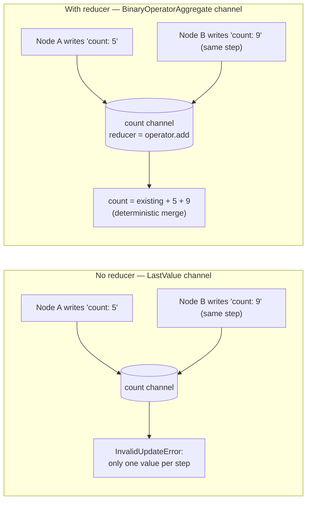
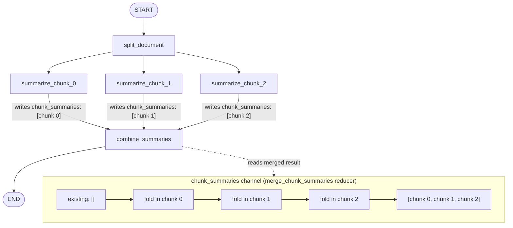

# Chapter 6: Reducers

> "State is not what a node returns. State is what the channel decides to keep." — a lesson every LangGraph engineer learns the hard way, usually while debugging a message history that keeps vanishing.

## Learning Objectives

By the end of this chapter, you will be able to:

- Explain precisely why LangGraph's default state-update behavior is **replace, not merge**, and identify the failure modes this causes once you introduce loops or parallel branches
- Attach a reducer to a state key using `Annotated[Type, reducer_fn]`, and use the two most common built-ins: `add_messages` and `operator.add`
- Describe exactly how `add_messages` appends, updates-by-id, deletes (via `RemoveMessage`), and coalesces streamed message chunks into a single message
- Write a correct custom reducer with the signature `(existing_value, new_value) -> merged_value`, including handling the "no prior value yet" case
- Explain what actually happens — not "a race condition," but a specific, named runtime error — when two parallel branches write to the same un-reduced key in the same super-step, and how a reducer turns that error into a well-defined merge
- State and justify the determinism/purity requirement for reducers in the context of checkpointing and replay
- Build a fan-out/fan-in graph ("Parallel Document Summarizer") where multiple nodes write to the same state key concurrently and a custom reducer combines their output deterministically

---

## Prerequisites for the Chapter

This chapter assumes you've internalized the material from the earlier chapters in this course:

- **Chapter 2 (StateGraph & State Management)**: your graph's state is a single schema (`TypedDict`, `dataclass`, or Pydantic model) shared by every node, and each node returns a **partial update** — a dict containing only the keys it wants to change, not the full state.
- **Chapter 3 (Nodes)**: a node is just a function `(state, config) -> partial_update`. LangGraph is responsible for taking that partial update and folding it into the shared state.
- **Chapter 4 (Edges & Routing)**: a single node can have multiple outgoing edges, which is how "fan-out" (one node triggering several next nodes in the same super-step) becomes possible — this is the scenario that makes reducers non-optional.
- **Chapter 5 (Commands & Dynamic Control)**: `Command(update=..., goto=...)` is just another way of producing a partial update; everything in this chapter about reducers applies identically whether the update came from a plain return dict or a `Command`.

You do **not** need to have read Chapter 13 (Parallel Execution) yet — this chapter introduces just enough about concurrent super-steps to motivate reducers, and Chapter 13 will build on top of that foundation with fan-out patterns, `Send`, and map-reduce-style graphs.

Environment: Python 3.10+, `langgraph` and `langchain-core` installed. No new setup beyond what earlier chapters required. All code in this chapter is illustrative — written by hand against the LangGraph API — and is meant to be read and adapted, not copy-pasted and run blindly.

---

## 1. The Problem: LangGraph Overwrites by Default

### 1.1 What actually happens when a node returns an update

Every LangGraph node returns a partial dict, e.g. `{"count": 5}`. What LangGraph does with that dict is easy to get wrong intuitively if you're coming from a mental model of "state is just a Python object I mutate." Here's the actual mechanism:

1. Each key in your state schema is backed by a **channel**.
2. By default — for any key you declare *without* extra annotation — the channel type is `LastValue`. A `LastValue` channel's update rule is trivial: **whatever value arrives most recently replaces whatever was there before.** No merging, no appending, no history.
3. When a node returns `{"count": 5}`, LangGraph writes `5` into the `count` channel, discarding whatever `count` held previously.

This is *by design*, not an oversight. Most state keys genuinely want overwrite semantics — a `status` field, a `current_step` field, a `retry_count` you're deliberately resetting. Overwrite-by-default keeps the mental model simple: **a node's return value is the new truth for that key.**

### 1.2 Where overwrite breaks down

The trouble starts the moment you want a key to **accumulate** rather than **replace**. The textbook example is conversation history:

```python
from typing_extensions import TypedDict
from langchain_core.messages import BaseMessage

class State(TypedDict):
    messages: list[BaseMessage]   # NOT yet annotated — this is the broken version
```

Imagine a simple two-node loop: a `chatbot` node calls the LLM and appends its reply, and an `human_input` node adds the next user message, looping back and forth. If each node does the "obvious" thing —

```python
def chatbot(state: State) -> dict:
    reply = llm.invoke(state["messages"])
    return {"messages": [reply]}   # returns ONLY the new message
```

— then, because `messages` is an un-annotated (`LastValue`) channel, every turn **replaces the entire history with a single-message list.** After two turns, your "conversation" state contains exactly one message: the most recent one. Every prior human message and every prior AI reply is gone. Nothing crashes. Nothing warns you. Your chatbot just silently has amnesia after every single turn — a bug that's brutally easy to miss in a demo where you only ever look at the *last* printed message, and brutally expensive once it reaches a user who notices the assistant has forgotten what they said two messages ago.

The naive workaround — have every node manually read the full existing list and return the concatenation —

```python
def chatbot(state: State) -> dict:
    reply = llm.invoke(state["messages"])
    return {"messages": state["messages"] + [reply]}   # manual concatenation
```

— technically fixes single-writer overwrite, but it pushes an easy-to-forget, easy-to-get-wrong responsibility onto every node author, and it **completely falls apart the instant two nodes write to `messages` in the same super-step** (Section 5). You'd need every node to somehow know about every other node's concurrent write to compute the "correct" concatenation — which is exactly the kind of coordination problem LangGraph is supposed to remove from you.

### 1.3 The actual fix: tell the channel how to merge, once

The right fix isn't "remember to concatenate in every node." It's: **declare, once, at the schema level, that this key merges by appending rather than replacing** — and let LangGraph enforce that rule for every node, every turn, forever. That declaration is a **reducer**, and you attach it with `Annotated`.

```
Without a reducer:                      With a reducer:

  existing: [A, B]                        existing: [A, B]
  node returns: [C]                       node returns: [C]
         │                                       │
         ▼                                       ▼
  channel OVERWRITES                      channel MERGES via reducer(existing, new)
  new state: [C]          ✗                new state: [A, B, C]      ✓
```

---

## 2. Attaching a Reducer with `Annotated`

### 2.1 The mechanism

Python's `typing.Annotated` lets you attach arbitrary metadata to a type hint without changing the type itself: `Annotated[X, metadata]` is still `X` as far as type checkers are concerned, but LangGraph inspects that metadata when it builds your graph's channels. If the second argument to `Annotated` is a two-argument callable, LangGraph uses it as the **reducer function** for that key, and builds a `BinaryOperatorAggregate` channel instead of a `LastValue` channel for it.

```python
from typing import Annotated
from typing_extensions import TypedDict
from langchain_core.messages import BaseMessage
from langgraph.graph.message import add_messages

class State(TypedDict):
    messages: Annotated[list[BaseMessage], add_messages]
```

That's the entire fix for Section 1.2's bug. Nodes go back to returning *only* the new message(s):

```python
def chatbot(state: State) -> dict:
    reply = llm.invoke(state["messages"])
    return {"messages": [reply]}   # add_messages appends this, it does not replace
```

Because `messages` is now backed by a reducer channel, LangGraph computes `add_messages(existing_messages, [reply])` under the hood and stores *that* as the new value — existing history plus the new reply, not just the new reply.

### 2.2 `operator.add` — the simplest possible reducer

Not every accumulating key needs message-aware logic. For plain lists (or strings, or numbers) where "merge" just means "concatenate" or "sum," Python's own `operator.add` is a perfectly valid reducer, because list concatenation and numeric addition are both spelled `+`, and `operator.add(a, b)` is exactly `a + b`.

```python
import operator
from typing import Annotated
from typing_extensions import TypedDict

class State(TypedDict):
    logs: Annotated[list[str], operator.add]
    total_tokens: Annotated[int, operator.add]

def node_a(state: State) -> dict:
    return {"logs": ["node_a ran"], "total_tokens": 120}

def node_b(state: State) -> dict:
    return {"logs": ["node_b ran"], "total_tokens": 85}
```

If `node_a` and `node_b` both fire in the same super-step, `logs` ends up as `["node_a ran", "node_b ran"]` (order depends on write order — see Section 5.3) and `total_tokens` ends up as `205` — both computed by folding every pending write through `operator.add` against the existing value. This is the single most common "I just need concatenation/summation" reducer, and you should reach for it before writing a custom one.

A subtlety worth internalizing: `operator.add` on lists requires **both sides to be lists**. A node that returns `{"logs": "node_a ran"}` (a bare string, not `["node_a ran"]`) will crash the reducer with a `TypeError`, because `list + str` is not defined in Python. This is a common early mistake — always wrap the new value in a single-element list to match the accumulator's type.

---

## 3. `add_messages` in Depth

`add_messages` is the reducer you will use in nearly every chat-oriented graph, so it's worth understanding precisely what it does beyond "it appends."

### 3.1 Append, by default

Given an existing list of messages and a new list (or single message — `add_messages` accepts either a single `BaseMessage`-like object or a sequence, and normalizes both into a list internally), the default behavior is exactly what you'd hope: the new messages are appended to the end of the existing list, preserving order.

### 3.2 Message IDs: update instead of duplicate

Every `BaseMessage` has an `id` field. `add_messages` uses that `id` to distinguish "this is a brand-new message" from "this is an updated version of a message already in history":

- If an incoming message's `id` does **not** match any existing message's `id`, it is **appended**.
- If an incoming message's `id` **does** match an existing message's `id`, the existing message is **replaced in place** (same position in the list), not duplicated.
- If a message has no `id` at all, LangGraph assigns it a fresh UUID before merging, so plain `HumanMessage("hi")` / `AIMessage("hello")` objects you construct by hand still merge correctly — you don't need to manage IDs yourself for the common case.

Conceptually (simplified — this illustrates the logic, not the literal source):

```python
def add_messages(existing: list[BaseMessage], new: list[BaseMessage]) -> list[BaseMessage]:
    existing = _ensure_ids(existing)
    new = _ensure_ids(new)
    by_id = {m.id: i for i, m in enumerate(existing)}
    merged = list(existing)
    for m in new:
        if isinstance(m, RemoveMessage):
            merged = [x for x in merged if x.id != m.id]
        elif m.id in by_id:
            merged[by_id[m.id]] = m          # update-in-place
        else:
            merged.append(m)                 # append
    return merged
```

This update-by-id behavior is what makes "edit a previous AI message and regenerate," "correct a tool call result," or "silently patch message #3 in a long history" possible without rebuilding the entire list yourself — you construct a message with the **same `id`** as the one you want to replace, return it, and `add_messages` does the surgical replacement.

### 3.3 Deletion via `RemoveMessage`

`langchain_core.messages.RemoveMessage(id=...)` is a sentinel message type that `add_messages` interprets as "delete the message with this `id` from history" rather than "append this." This is the mechanism behind trimming conversation history (covered in depth in Chapter 10, Memory Management) — a node can return `{"messages": [RemoveMessage(id=old_msg.id)]}` to prune a message without touching anything else in the list.

### 3.4 Merging streamed chunks

When you stream token-by-token from a chat model (Chapter 11, Streaming) inside a node, the LLM client yields a sequence of `AIMessageChunk` objects, not one complete `AIMessage`. Every chunk belonging to the same generation shares the same `id`. Because `add_messages` treats same-`id` writes as "update, not append," if your node (or LangGraph's internal streaming machinery) feeds those chunks through the `messages` channel one at a time, they collapse into a single, progressively-completing message in state rather than fragmenting your history into dozens of partial entries — one real `AIMessage` per turn, exactly as if it had arrived all at once. This is the same append-vs-update logic from Section 3.2, just applied at token granularity instead of full-message granularity.

---

## 4. Writing a Custom Reducer

Built-ins cover the two most common cases (append-list, sum/concatenate). Everything else — merging dictionaries, keeping the best of several candidate results, deduplicating structured records — needs a **custom reducer**: a plain Python function matching one contract.

### 4.1 The contract

```python
def my_reducer(existing_value: T, new_value: T) -> T:
    """
    existing_value: whatever is currently stored in the channel
                     (the type's "zero value" / default on the very first write —
                      for a list-typed key this is typically []; for a dict-typed
                      key, typically {}; check your schema's default).
    new_value:       whatever the node (or one of several concurrent nodes) just
                      returned for this key in the current super-step.
    returns:         the merged value LangGraph stores back into the channel.
    """
    ...
```

Two rules make a reducer safe to use in production:

1. **It must be a pure function of its two arguments.** No network calls, no reading global mutable state, no `datetime.now()`, no randomness (Section 6 explains exactly why).
2. **It must handle whatever "no prior value" looks like for your schema** — usually an empty list, empty dict, or `None` — since the very first write to a key has nothing meaningful to merge against.

### 4.2 Worked example: merging confidence-scored dicts

Suppose you're building a fact-extraction pipeline where several nodes each try to extract a value for the same field (say, a customer's account tier) from different sources — a CRM lookup, a document parse, an LLM inference — and each candidate comes with a confidence score. You want the state to always hold the **highest-confidence candidate seen so far**, not just whichever node happened to write last.

```python
from typing import Annotated, TypedDict, Optional


class Candidate(TypedDict):
    value: str
    confidence: float
    source: str


def keep_highest_confidence(
    existing: Optional[Candidate],
    new: Candidate,
) -> Candidate:
    """Reducer: keep whichever candidate has the higher confidence score."""
    if existing is None:
        return new
    return new if new["confidence"] > existing["confidence"] else existing


class ExtractionState(TypedDict):
    document: str
    account_tier: Annotated[Optional[Candidate], keep_highest_confidence]


def crm_lookup_node(state: ExtractionState) -> dict:
    return {"account_tier": {"value": "gold", "confidence": 0.62, "source": "crm"}}


def document_parse_node(state: ExtractionState) -> dict:
    return {"account_tier": {"value": "platinum", "confidence": 0.81, "source": "doc_parse"}}


def llm_inference_node(state: ExtractionState) -> dict:
    return {"account_tier": {"value": "gold", "confidence": 0.74, "source": "llm"}}
```

If all three nodes run in the same super-step (fan-out from a single upstream node), LangGraph folds their writes through `keep_highest_confidence` in sequence, and regardless of the order those three folds happen in, the final `account_tier` value is the `document_parse_node` candidate (`0.81` confidence) — because the reducer's logic (`new if new > existing else existing`) is **commutative**: the maximum of three numbers doesn't depend on the order you compare them in. That commutativity is not an accident — it's a design requirement for reducers used under parallel writes (Section 5.3).

### 4.3 Worked example: merging dictionaries key-by-key

A different, equally common need: several nodes each contribute *different keys* to a shared dictionary (e.g., a "report" object being assembled by independent analysis nodes), and you want a shallow merge rather than one node's dict replacing another's wholesale.

```python
from typing import Annotated, TypedDict


def merge_dicts(existing: dict, new: dict) -> dict:
    """Shallow-merge two dicts; keys in `new` win on conflict."""
    merged = dict(existing)
    merged.update(new)
    return merged


class ReportState(TypedDict):
    topic: str
    report: Annotated[dict, merge_dicts]


def sentiment_node(state: ReportState) -> dict:
    return {"report": {"sentiment": "positive", "sentiment_score": 0.87}}


def keyword_node(state: ReportState) -> dict:
    return {"report": {"keywords": ["pricing", "onboarding", "support"]}}
```

After both nodes run, `report` contains `{"sentiment": "positive", "sentiment_score": 0.87, "keywords": [...]}` — a genuine merge, not one node's output clobbering the other's, which is exactly what would happen with a plain (un-annotated) `dict` key today.

---

## 5. Reducers Under Parallel Execution

This is the section that explains why reducers are covered in Chapter 6 rather than being a footnote — and it previews the exact mechanics Chapter 13 (Parallel Execution) builds on.

### 5.1 Super-steps, briefly

LangGraph executes a graph as a sequence of **super-steps**. Within a single super-step, every node scheduled to run executes (conceptually) concurrently, and *all* of their writes are collected before being applied to state together, at the end of the step — not one node's writes fully landing before the next node starts. If your graph fans out from one node to three parallel nodes (via three outgoing edges), all three run within the *same* super-step.

### 5.2 What actually happens without a reducer

This is the detail most engineers get wrong when first reasoning about it: it is **not** a silent race condition where whichever node happens to finish last wins. LangGraph explicitly detects the conflict. If two or more nodes in the same super-step write to the same channel and that channel has no reducer (i.e., it's the default `LastValue` channel, which is only defined to accept a single value per step), LangGraph raises an explicit runtime error — an `InvalidUpdateError` (LangGraph's channel machinery reports it as "at key '...': can only receive one value per step") — rather than silently keeping one write and discarding the other.

This is actually a good design decision to understand deeply: **LangGraph fails loudly on an ambiguous concurrent write instead of guessing.** The failure mode you need to worry about isn't corruption — it's your graph crashing in exactly the fan-out scenarios you're trying to build, until you add a reducer.

### 5.3 What happens with a reducer

Declaring a reducer for that key is what makes concurrent writes to it *legal* in the first place. Instead of "exactly one value per step, or error," a `BinaryOperatorAggregate` channel accepts **any number of writes per step** and folds them all through your reducer function, seeded with the channel's existing value:

```
merged = reducer(reducer(reducer(existing, write_1), write_2), write_3)
```

The order writes are folded in follows LangGraph's deterministic scheduling of tasks within the step (based on graph structure, not wall-clock thread completion) — it is *reproducible* given the same graph and inputs, but you should not design a reducer that depends on a specific fold order being "the right one." That's precisely why Section 4.2's `keep_highest_confidence` and `operator.add`-style reducers are good citizens: max and sum are both associative and commutative, so the fold produces the same final answer regardless of which of the three concurrent writes gets folded in first, second, or third. `add_messages`'s append behavior is order-*sensitive* (message order matters!), but LangGraph's deterministic scheduling makes that order stable and predictable across runs of the same graph, which is what you actually need for a chat history — reproducibility, not literal write-order independence.

---

## 6. Reducers, Checkpointing, and Replay

LangGraph's durable execution model (Chapter 9) persists a checkpoint after every super-step, recording enough information to resume — or **replay** — the graph's execution from any prior point. This has a direct, non-optional consequence for how you're allowed to write reducers.

### 6.1 Why replay matters here

When LangGraph resumes a thread from a checkpoint (after a crash, after a human-in-the-loop `interrupt()`, or when you deliberately time-travel via `update_state`/`get_state_history` for debugging), it can reconstruct a channel's current value by re-applying the reducer across the sequence of writes associated with that channel, rather than only ever trusting a single frozen snapshot value. Internally, LangGraph tracks per-channel writes and versions specifically so that channel values can be recomputed deterministically. That means your reducer function is not guaranteed to run **exactly once** per logical write over the lifetime of a thread — it may run again during recovery or replay.

### 6.2 The two hard requirements this creates

- **Determinism.** Given the same `(existing_value, new_value)` pair, your reducer must always produce the same output. No `random.random()`, no `datetime.now()`, no depending on dict key insertion order in a way that isn't actually guaranteed, no reading from a mutable global that could have changed between the original run and the replay.
- **No side effects.** A reducer must not call an external API, write to a database, send a notification, or mutate anything outside its own return value. If replay re-invokes your reducer, a side-effecting reducer means **that side effect happens again** — a second Slack notification, a second charge to a payment API, a duplicated row in an audit log. This is the single most dangerous mistake you can make with reducers in a production system, precisely because it will not show up in normal testing — it only manifests the first time a real crash-and-resume or replay path is exercised, usually in production, usually at the worst time.

A useful mental model: **treat a reducer exactly like a pure reducer in Redux/state-management terms** — a colleague coming from frontend state-management patterns will recognize this immediately. `(state, action) => newState`, always pure, always safe to call twice with the same inputs and get the same answer.

---

## 7. Project: Parallel Document Summarizer

Let's put every idea in this chapter together in one graph: a document gets split into chunks, several summarizer nodes run **concurrently** — each summarizing a different chunk — and their outputs are merged into a single combined list via a custom reducer, then stitched into one final summary.

### 7.1 State design

```python
from typing import Annotated, TypedDict
from langchain_core.messages import BaseMessage


class ChunkSummary(TypedDict):
    chunk_id: int
    summary: str
    word_count: int


def merge_chunk_summaries(
    existing: list[ChunkSummary],
    new: list[ChunkSummary],
) -> list[ChunkSummary]:
    """
    Accumulate chunk summaries from however many summarizer nodes fired
    this super-step. Idempotent by chunk_id: if a chunk_id we've already
    recorded shows up again (e.g., a node re-runs after a crash/replay,
    or a retry re-executes a task), we replace rather than duplicate —
    this keeps the reducer safe under the replay semantics from Section 6.
    """
    merged = {c["chunk_id"]: c for c in existing}
    for c in new:
        merged[c["chunk_id"]] = c
    return [merged[k] for k in sorted(merged)]


class SummarizerState(TypedDict):
    document: str
    chunks: list[str]
    chunk_summaries: Annotated[list[ChunkSummary], merge_chunk_summaries]
    final_summary: str
```

Notice the idempotency detail baked into `merge_chunk_summaries`: it keys by `chunk_id` and overwrites on conflict rather than blindly appending. That single design choice means if LangGraph ever has to re-run a summarizer task during a crash-recovery replay, the reducer produces the same final list instead of a list with a duplicated entry for that chunk — exactly the determinism/idempotency discipline Section 6 demands.

### 7.2 Splitting the document

```python
def split_document(state: SummarizerState) -> dict:
    text = state["document"]
    # Naive fixed-size split for illustration; a real pipeline would use
    # the chunking strategies from the companion RAG course.
    size = max(1, len(text) // 3)
    chunks = [text[i : i + size] for i in range(0, len(text), size)][:3]
    return {"chunks": chunks}
```

### 7.3 Three concurrent summarizer nodes

Each summarizer node is responsible for exactly one chunk and writes exactly one entry into `chunk_summaries`. Because `chunk_summaries` is reducer-backed, all three can safely fire in the same super-step.

```python
from langchain_core.messages import HumanMessage

def _summarize_chunk(chunk_id: int, chunk_text: str, llm) -> ChunkSummary:
    prompt = [
        HumanMessage(
            content=f"Summarize the following passage in 2-3 sentences:\n\n{chunk_text}"
        )
    ]
    response = llm.invoke(prompt)
    return {
        "chunk_id": chunk_id,
        "summary": response.content,
        "word_count": len(chunk_text.split()),
    }


def summarize_chunk_0(state: SummarizerState) -> dict:
    if len(state["chunks"]) <= 0:
        return {"chunk_summaries": []}
    return {"chunk_summaries": [_summarize_chunk(0, state["chunks"][0], llm)]}


def summarize_chunk_1(state: SummarizerState) -> dict:
    if len(state["chunks"]) <= 1:
        return {"chunk_summaries": []}
    return {"chunk_summaries": [_summarize_chunk(1, state["chunks"][1], llm)]}


def summarize_chunk_2(state: SummarizerState) -> dict:
    if len(state["chunks"]) <= 2:
        return {"chunk_summaries": []}
    return {"chunk_summaries": [_summarize_chunk(2, state["chunks"][2], llm)]}
```

(`llm` is any chat model client already bound in your module, e.g. `ChatAnthropic(model="claude-...")` — omitted here since this course treats model setup as prior knowledge from the LangChain Core companion course.)

### 7.4 Combining into a final summary

```python
def combine_summaries(state: SummarizerState) -> dict:
    ordered = sorted(state["chunk_summaries"], key=lambda c: c["chunk_id"])
    combined_text = "\n\n".join(
        f"[Section {c['chunk_id'] + 1}] {c['summary']}" for c in ordered
    )
    return {"final_summary": combined_text}
```

### 7.5 Wiring the fan-out/fan-in graph

```python
from langgraph.graph import StateGraph, START, END

builder = StateGraph(SummarizerState)

builder.add_node("split_document", split_document)
builder.add_node("summarize_chunk_0", summarize_chunk_0)
builder.add_node("summarize_chunk_1", summarize_chunk_1)
builder.add_node("summarize_chunk_2", summarize_chunk_2)
builder.add_node("combine_summaries", combine_summaries)

builder.add_edge(START, "split_document")

# Fan-out: one node feeds three, all three run in the SAME super-step.
builder.add_edge("split_document", "summarize_chunk_0")
builder.add_edge("split_document", "summarize_chunk_1")
builder.add_edge("split_document", "summarize_chunk_2")

# Fan-in: all three feed the same downstream node.
builder.add_edge("summarize_chunk_0", "combine_summaries")
builder.add_edge("summarize_chunk_1", "combine_summaries")
builder.add_edge("summarize_chunk_2", "combine_summaries")

builder.add_edge("combine_summaries", END)

graph = builder.compile()

result = graph.invoke({
    "document": "... a long document ...",
    "chunks": [],
    "chunk_summaries": [],
    "final_summary": "",
})
print(result["final_summary"])
```

Without `Annotated[list[ChunkSummary], merge_chunk_summaries]` on `chunk_summaries`, this exact graph would raise `InvalidUpdateError` the first time it actually ran — all three summarizer nodes write to `chunk_summaries` in the same super-step, and a plain `LastValue` channel only tolerates one write per step. The reducer isn't a nice-to-have here; it's what makes fan-out into a shared accumulating key *possible at all*. Chapter 13 extends this exact pattern with `Send` to fan out over a dynamic, runtime-determined number of chunks instead of three hardcoded nodes.

---

## Examples

Quick, self-contained snippets you can adapt directly, each isolating one reducer idea from the sections above.

**Counting how many times a node has run, safely under parallel branches:**

```python
import operator
from typing import Annotated
from typing_extensions import TypedDict

class State(TypedDict):
    visits: Annotated[int, operator.add]

def any_node(state: State) -> dict:
    return {"visits": 1}   # each run contributes +1, regardless of how many run concurrently
```

**Deduplicating a set-like list without a real Python `set` (state must stay JSON-serializable for checkpointing):**

```python
from typing import Annotated

def add_unique(existing: list[str], new: list[str]) -> list[str]:
    seen = list(existing)
    for item in new:
        if item not in seen:
            seen.append(item)
    return seen

class State(TypedDict):
    tags: Annotated[list[str], add_unique]
```

**Replacing one message in history by id (the mechanism behind "edit and regenerate"):**

```python
edited = AIMessage(content="corrected answer", id=original_message.id)
return {"messages": [edited]}   # add_messages replaces in place, does not duplicate
```

---

## Diagrams





The first diagram makes the Section 5 contrast concrete: identical concurrent writes, but one path is a hard error and the other is a deterministic merge — the only difference is whether the channel has a reducer. The second diagram is the project graph from Section 7: three nodes fan out from `split_document` and fan back into `combine_summaries`, with the reducer silently doing the accumulation work in between.

---

## Real-World Scenarios

**Scenario 1 — the "vanishing history" bug in production.** A team ships a customer-support chatbot built on a two-node loop (`assistant` ↔ `await_reply`) using a plain `list[BaseMessage]` state key, no `Annotated`. In local testing with a single exchange, it looks perfect: one question, one answer, done. In production, a QA engineer runs a five-turn conversation and notices the assistant repeatedly asks the customer to "please restate your issue" — because by turn three, `state["messages"]` really does contain only the single most recent message; every earlier turn's context has been silently overwritten out of existence. The fix is exactly Section 2.1: `Annotated[list[BaseMessage], add_messages]`. No node logic needs to change — only the schema annotation — because the nodes were already returning just the new message; they were relying on a merge that was never actually happening.

**Scenario 2 — a fan-out research agent that crashes on the happy path.** An engineer builds a research assistant that dispatches three parallel sub-queries to different tools (web search, internal docs, a SQL lookup) and wants all three results collected into one `findings: list[dict]` key. The graph compiles fine and crashes the very first time it's invoked with `InvalidUpdateError: at key 'findings': can only receive one value per step` — because three nodes fire in the same super-step against a plain, un-reduced list key. This is Section 5.2's exact failure mode, and it's a good failure: it happens on the very first real run, loudly, with a message that names the offending key, rather than silently dropping two of the three findings the way many other frameworks' "last write wins" semantics would.

**Scenario 3 — a reducer with a side effect causes duplicate emails after a crash.** A billing-notification graph's `notifications_sent` reducer function, in addition to appending to a list, also calls `send_email()` directly inside the reducer "for convenience." The graph runs fine for weeks. Then a worker process crashes mid-super-step and LangGraph resumes the thread from the last checkpoint, re-deriving channel state — and the customer receives the same "your invoice is ready" email a second time, because the side-effecting reducer ran again during recovery. The fix is Section 6.2: side effects belong in **nodes**, which LangGraph's execution model is designed to make idempotent/resumable-safe (and which you control explicitly, e.g., with idempotency keys), never inside the reducer function itself, which you don't get to control the invocation count of.

---

## Best Practices

- **Default to overwrite; opt into a reducer deliberately.** Not every key should accumulate — only annotate the keys that genuinely need merge semantics (message history, running totals, accumulated results from fan-out). Over-annotating makes state harder to reason about.
- **Prefer built-ins first.** Reach for `add_messages` for anything message-shaped and `operator.add` for simple list/number accumulation before writing a custom reducer — less code you have to prove correct yourself.
- **Make custom reducers commutative and associative whenever the key can receive concurrent writes.** If the merge order could plausibly vary (parallel branches), your reducer's result should not depend on that order, exactly like `max()`/`sum()`/set-union don't.
- **Handle the empty/initial case explicitly.** Your reducer will be called with whatever your schema's default value is on the very first write — test that path deliberately (`existing=[]`, `existing={}`, or `existing=None`, matching your schema).
- **Keep reducers pure and fast.** No I/O, no side effects, no non-determinism — they may be invoked more than once per logical write during checkpoint replay (Section 6), and they run on every super-step's hot path.
- **Design for idempotency when a key can be re-populated on retry/replay**, the way `merge_chunk_summaries` in Section 7.1 keys by `chunk_id` — this protects you even in the (rarer) case where the same task's write shows up twice.
- **Unit-test reducers directly, with no graph involved.** A reducer is just a plain function `(existing, new) -> merged` — call it directly with hand-crafted inputs in your test suite (Chapter 17) instead of only exercising it indirectly through a full `graph.invoke()`.
- **Reserve `RemoveMessage` (not manual list surgery) for trimming message history** so you stay inside `add_messages`'s well-defined update/delete contract instead of hand-rolling logic that fights the reducer.

---

## Common Mistakes

- **Forgetting the annotation entirely** and being confused when an accumulating key mysteriously "resets" every turn — this is Section 1.2's bug, and it is the single most common reducer-related mistake in LangGraph code.
- **Wrapping the wrong type** — e.g., returning `{"logs": "done"}` instead of `{"logs": ["done"]}` against an `operator.add`-reduced `list[str]` key, which throws a `TypeError` because `list.__add__` doesn't know how to add a bare string.
- **Writing a non-commutative custom reducer and using it under parallel writes**, then being surprised the result differs subtly between runs (or seems "right" in testing with one writer and "wrong" once a second concurrent writer is added) — order-dependence is invisible until you actually have concurrent writers.
- **Putting side effects (API calls, DB writes, sending notifications) inside a reducer function** rather than in a node — safe until the first crash-and-resume or replay, at which point the side effect can fire again (Scenario 3 above).
- **Assuming a reducer applies to a whole node's return dict** rather than per-key — each key in your schema has its own independent channel and its own (possibly absent) reducer; annotating one key does nothing for its neighbors.
- **Treating "no reducer + parallel writers" as a silent race** instead of what it actually is — a loud `InvalidUpdateError`. Engineers who expect silent last-write-wins semantics (common in other state-management systems) sometimes add a reducer purely to "fix a crash" without understanding *why* the crash was the correct, intentional behavior in the first place.
- **Letting an `add_messages`-reduced history grow unbounded** across a long-running thread without ever trimming it (via `RemoveMessage` or a summarization node), eventually blowing past the model's context window — a reducer accumulates faithfully; it does not know when "enough" is enough (that's a memory-management concern, Chapter 10).

---

## Summary

- LangGraph channels default to **overwrite (`LastValue`)** semantics: a node's return value for a key replaces whatever was there. This is fine for status/control keys and actively wrong for anything meant to accumulate, like message history.
- A **reducer** is attached to a state key via `Annotated[Type, reducer_fn]`, switching that key's channel from `LastValue` to `BinaryOperatorAggregate`, which folds every pending write through `reducer_fn` against the existing value.
- **`add_messages`** is the canonical reducer for chat history: it appends new messages, replaces messages in place when the incoming `id` matches an existing one (enabling edits/regeneration), deletes messages via `RemoveMessage`, and coalesces streamed `AIMessageChunk`s sharing an `id` into one complete message.
- **`operator.add`** is the simplest reducer for plain list concatenation or numeric summation — reach for it before writing custom logic.
- A **custom reducer** is just a pure function `(existing_value, new_value) -> merged_value` — worked examples in this chapter covered highest-confidence selection and shallow dict merging.
- Reducers matter most under **parallel execution**: without one, two nodes writing to the same key in the same super-step raise an explicit `InvalidUpdateError`, not a silent race — the reducer is what makes concurrent writes to a shared key *legal* and deterministic in the first place.
- Because LangGraph may **re-apply reducers during checkpoint replay/recovery**, reducers must be **deterministic and free of side effects** — side effects belong in nodes, never in the merge function.
- The **Parallel Document Summarizer** project tied all of this together: three summarizer nodes fan out from one split node and write concurrently into a single `chunk_summaries` key, merged by a custom, idempotent, `chunk_id`-keyed reducer, then combined into one final summary.

---

## Knowledge Check

1. Explain, precisely, what happens to a state key's value across two consecutive node executions if that key is declared as a plain `list[BaseMessage]` with no `Annotated` reducer, and each node returns only the single new message it produced. Why does this look correct in a one-turn test but fail in a five-turn conversation?
2. What is the exact runtime behavior — not "a race condition" — when two nodes in the same super-step write to the same state key that has no reducer? Why is this behavior arguably better than silent last-write-wins?
3. Write the function signature every custom reducer must satisfy, and explain what value `existing_value` will hold the very first time your reducer is invoked for a freshly initialized key.
4. Describe two distinct things `add_messages` does beyond plain list appending, and give a concrete scenario where each one matters.
5. Why must a reducer be deterministic and side-effect-free? Connect your answer specifically to what LangGraph's checkpointing/replay mechanism does with channel writes.
6. In the Parallel Document Summarizer project, why does `merge_chunk_summaries` key its merge by `chunk_id` instead of simply doing `existing + new`? What specific failure does the `chunk_id`-keyed approach prevent that plain concatenation would not?

---

## Hands-on Exercises

1. **Break it, then fix it.** Build a two-node looping graph (`ask` → `answer` → `ask` → ...) with a plain, un-annotated `messages: list[BaseMessage]` key. Run it for three simulated turns and print `state["messages"]` after each turn to confirm history is being overwritten rather than accumulated. Then add `Annotated[list[BaseMessage], add_messages]` and re-run, confirming the full history is now preserved.
2. **Trigger and resolve `InvalidUpdateError`.** Build a graph where one node fans out to two nodes that both write to the same plain (non-reduced) `list[str]` key in the same super-step. Confirm it raises `InvalidUpdateError` when invoked. Then add `Annotated[list[str], operator.add]` to the key and confirm the graph now runs successfully, and inspect the merged result.
3. **Extend the Parallel Document Summarizer.** Starting from Section 7's graph, (a) change `split_document` to split into a variable number of chunks based on document length rather than a hardcoded three, (b) write a new custom reducer that, in addition to merging `chunk_summaries`, also tracks a running `Annotated[int, operator.add]` total word count across all chunks, and (c) modify `combine_summaries` to include that total word count in its output. Write a standalone unit test that calls your reducer function directly (no graph) with at least three different `(existing, new)` input pairs, including the empty-list initial case.

---

## Further Reading

- [LangGraph Documentation — Low Level Concepts: State and Reducers](https://docs.langchain.com/oss/python/langgraph/overview) — the official reference for channel types and the `Annotated` reducer mechanism
- [LangGraph Application Structure Guide](https://docs.langchain.com/oss/python/langgraph/application-structure) — how state schemas and reducers fit into a full application
- [LangGraph GitHub Repository](https://github.com/langchain-ai/langgraph) — source for `add_messages`, `RemoveMessage`, and the channel implementations (`LastValue`, `BinaryOperatorAggregate`) referenced throughout this chapter
- Python `typing.Annotated` documentation (`docs.python.org`) — the general-purpose typing mechanism LangGraph repurposes for reducer metadata
- Python `operator` module documentation — `operator.add` and other binary operators usable directly as reducers
- Related chapter in this course: **Chapter 13, Parallel Execution** — extends fan-out/fan-in with `Send` and dynamic, runtime-determined branch counts, building directly on this chapter's reducer foundation
- Related chapter in this course: **Chapter 9, Checkpointing & Durable Execution** — the persistence layer that makes Section 6's replay behavior, and therefore the determinism requirement, concrete

---

<div style="display:flex;justify-content:space-between;align-items:center;">
  <a href="./05-commands-and-dynamic-control.md">← Previous: Commands & Dynamic Control</a>
  <a href="./00-index.md">🏠 Index</a>
  <a href="./07-compilation-and-execution.md">Next: Compilation & Execution →</a>
</div>
