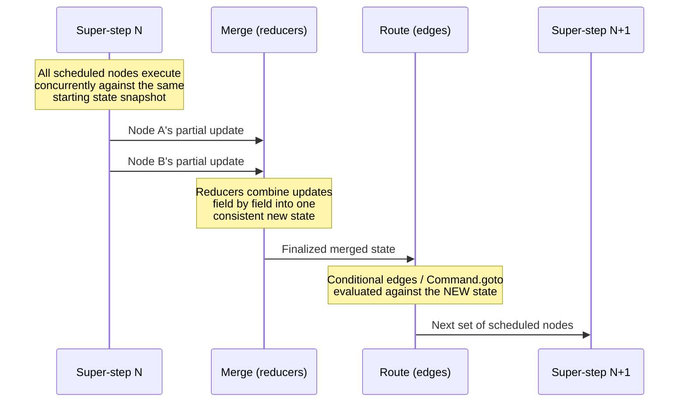
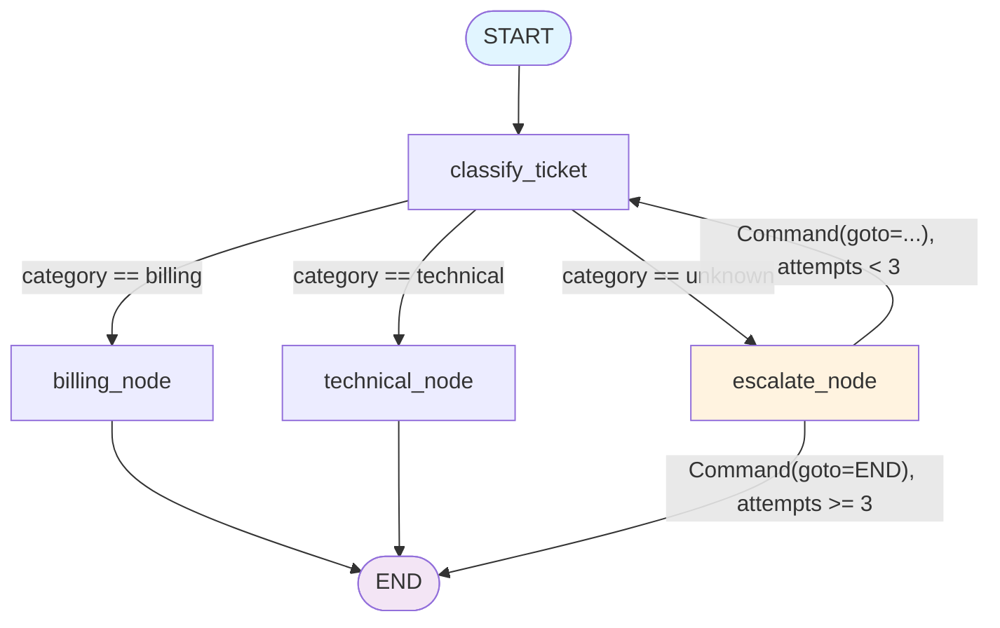
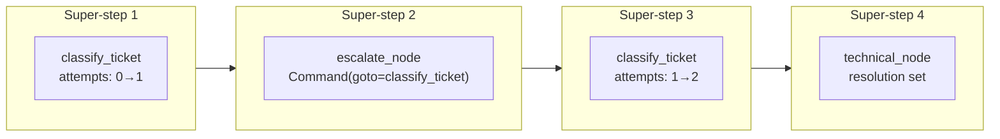

# Chapter 7: Compilation & Execution

> "A graph is a blueprint. A compiled graph is a building." — every StateGraph you have written so far, waiting to be occupied.

## Learning Objectives

By the end of this chapter, you will be able to:

- Explain precisely what `.compile()` does to a `StateGraph` builder, including the structural validation it performs and what it deliberately does *not* validate
- Describe the Pregel-inspired "super-step" execution model that governs every LangGraph run, and explain why it makes concurrent node execution deterministic
- Choose the correct invocation method — `invoke()`, `stream()`, or `batch()` (and their async counterparts) — for a given use case
- Explain what `recursion_limit` protects against, how graphs end up looping in the first place, and how to design loop-exit conditions instead of relying on the limit as your only safety net
- Generate and read a Mermaid or ASCII visualization of a compiled graph, and use it to debug non-obvious routing
- Use `stream_mode="debug"` and state inspection techniques to answer "why did my graph do X?"
- Assemble a complete, compiled, invokable graph that combines a typed state schema, multiple nodes, a conditional edge, a `Command`-based node, and a reducer — the full toolkit from Chapters 2–7 working together

---

## Prerequisites for the Chapter

This chapter closes out Phase 1 and assumes you're comfortable with everything built so far:

- **Chapter 2 (StateGraph & State Management)**: defining a state schema with `TypedDict`, `dataclass`, or Pydantic, and the `StateGraph` builder object
- **Chapter 3 (Nodes)**: nodes as plain callables that accept state and return partial updates
- **Chapter 4 (Edges & Routing)**: `add_edge`, `add_conditional_edges`, and routing functions
- **Chapter 5 (Commands & Dynamic Control)**: `Command(update=..., goto=...)` as a way for a node to combine a state update and a routing decision in one return value
- **Chapter 6 (Reducers)**: how `Annotated[Type, reducer_fn]` fields control *how* concurrent or repeated updates to the same key are merged, rather than simply overwritten

If any of those feel shaky, this chapter will still make sense, but the capstone at the end will land much harder if you've internalized them — it deliberately uses all five.

You'll also want a working mental model of LangChain's `Runnable` interface (`invoke`/`ainvoke`/`stream`/`astream`/`batch`/`abatch`), since a compiled LangGraph graph *is* a `Runnable` and reuses that exact vocabulary — one of the more pleasant continuities between LangChain Core and LangGraph.

No new installation is required beyond the `langgraph` package you've been using since Chapter 2. Graph visualization (Section 5) optionally benefits from `pip install grandalf` for ASCII rendering, mentioned inline where relevant.

---

## 1. From Builder to Runnable: What `.compile()` Actually Does

Every graph you've built in this course so far has gone through the same two-phase lifecycle:

1. **Build phase**: you construct a `StateGraph(SomeState)`, call `add_node(...)` repeatedly, wire nodes together with `add_edge(...)` and `add_conditional_edges(...)`, and mark an entry point. During this phase, `StateGraph` is a **mutable builder** — a description of a graph, not something you can run.
2. **Compile phase**: you call `.compile()`, which validates that description and returns a `CompiledStateGraph` — an **immutable, runnable** object that implements the `Runnable` interface you already know from LangChain Core.

```python
from typing import TypedDict
from langgraph.graph import StateGraph, START, END

class State(TypedDict):
    input: str
    output: str

def echo(state: State) -> dict:
    return {"output": state["input"].upper()}

builder = StateGraph(State)
builder.add_node("echo", echo)
builder.add_edge(START, "echo")
builder.add_edge("echo", END)

graph = builder.compile()   # StateGraph -> CompiledStateGraph
```

`builder` is disposable once you've called `.compile()` — you generally don't keep mutating it afterward and re-run the same builder instance. `graph`, the compiled object, is what you actually invoke, stream, or batch against, and what you hand to a checkpointer-backed server process for the rest of this course.

### 1.1 Why compilation is a separate step at all

You might reasonably ask: why not just run the builder directly? Two reasons, both of which matter a great deal once you reach production chapters:

- **Validation needs a complete picture.** A conditional edge's routing function can only be checked against a known set of destination nodes once *all* nodes and edges have been declared. Compiling eagerly on every `add_node` call would mean validating against a graph that isn't finished yet.
- **Runtime configuration is bound at compile time.** Checkpointers, stores, and interrupt points (below) are attached during `.compile()`, not per-invocation. This lets LangGraph precompute execution metadata once — which nodes are checkpoint boundaries, which nodes can be interrupted — rather than re-deriving it on every call.

### 1.2 Structural validation: what `.compile()` catches

`.compile()` performs a static analysis pass over your declared nodes and edges *before* any node logic ever runs. Concretely, it checks:

| Check | Failure mode if violated |
|---|---|
| **Entry point exists** | If nothing wires `START` to any node (no `add_edge(START, ...)` and no equivalent entry point set), compile raises immediately — LangGraph has no idea where execution begins. |
| **Every referenced node was actually added** | If a conditional edge's mapping (or a plain edge) names a destination like `"summarize"` but you never called `add_node("summarize", ...)`, compile raises a clear error rather than letting you discover it as a runtime `KeyError`. |
| **No orphaned/unreachable nodes** | A node added via `add_node` but never wired into any edge or conditional-edge mapping — i.e., nothing can ever route to it — is flagged. It exists in the graph object but can never execute, which is almost always a bug (a typo in an edge target, a node you meant to wire up and forgot). |
| **Declared dynamic destinations match `Command` usage** | If a node returns `Command(goto=...)`, LangGraph wants you to declare the possible destinations ahead of time (via a `Literal` type hint on the node's return annotation, or the `ends=` argument to `add_node`). This lets the *static* graph structure — and its visualization — account for *dynamic* routing decisions made at runtime. |

What `.compile()` **does not** and **cannot** check, because it has no way to execute your Python at build time:

- Whether a conditional edge's routing function will, at runtime, return a value *outside* the mapping you declared for it. That's a runtime error (`InvalidUpdateError`/`KeyError`-style failure raised the moment the router actually returns the unexpected string), not a compile-time one.
- Whether your node functions raise exceptions, return malformed updates, or violate your state schema's types. Python is not statically typed at this level; `TypedDict`/Pydantic annotations are documentation and (for Pydantic) *runtime* validation, not something `.compile()` inspects ahead of time.
- Whether your graph *terminates*. A graph with a cycle that never reaches `END` compiles perfectly fine — LangGraph has no way to prove termination for arbitrary Python routing logic (this is the halting problem, not a bug). This is precisely why `recursion_limit` (Section 4) exists as a runtime backstop.

This distinction — **compile-time structural validation vs. runtime behavioral validation** — is worth internalizing early. `.compile()` is a linter for your graph's wiring, not a proof that your graph is correct.

### 1.3 What you can pass to `.compile()`

Beyond the graph structure itself, `.compile()` accepts several keyword arguments that configure how the compiled graph behaves at runtime. You'll use all of these heavily starting in Chapter 9, but you should know their names and purpose now, since they attach at this exact step:

```python
graph = builder.compile(
    checkpointer=None,        # persistence backend — Chapter 9
    store=None,               # cross-thread long-term memory — Chapter 10
    interrupt_before=None,    # list of node names to pause before — Chapter 12
    interrupt_after=None,     # list of node names to pause after — Chapter 12
    debug=False,              # verbose step-by-step logging while running
)
```

- **`checkpointer`**: a persistence backend (in-memory, SQLite, Postgres, ...) that snapshots state after every super-step, enabling crash recovery and multi-turn conversations. Without one, a compiled graph is entirely stateless between separate `invoke()` calls — nothing survives after the call returns.
- **`store`**: a separate persistence layer for state that should outlive a single thread/conversation (user profiles, long-term memory) rather than being scoped to one execution.
- **`interrupt_before` / `interrupt_after`**: lists of node names where execution should pause and hand control back to the caller — the foundation of human-in-the-loop review workflows.
- **`debug`**: when `True`, prints granular tracing information for every super-step as the graph runs — a lightweight alternative to `stream_mode="debug"` (Section 6) for quick local debugging.

Because these are compile-time arguments, switching checkpointers or interrupt points means recompiling the graph — you cannot bolt a checkpointer onto an already-compiled graph after the fact. This is an intentional design choice: it keeps a compiled graph's runtime behavior fully determined by its compile-time configuration, with no mutable "settings" to accidentally change mid-flight.

---

## 2. The Pregel Execution Model: Super-Steps

This is the single most important mental model in this chapter, and arguably in the entire execution engine phase of this course. Get this right and concepts in Chapters 11 and 13 (streaming and parallel execution) will feel like natural consequences rather than new rules to memorize.

### 2.1 Where the model comes from

LangGraph's execution engine is explicitly modeled on **Pregel**, Google's 2010 framework for large-scale graph processing (the name is a nod to Euler's Bridges of Königsberg problem, first posed in the city then called Königsberg, later Pregel). Pregel popularized the **Bulk Synchronous Parallel (BSP)** model: computation proceeds in discrete, synchronized rounds, rather than nodes reacting to each other in an uncoordinated, arbitrarily-ordered stream of events.

LangGraph borrows this idea wholesale and calls each round a **super-step**.

### 2.2 What happens inside one super-step

At the start of any super-step, LangGraph has a set of nodes that are **scheduled to run** — determined by the routing decisions made at the end of the *previous* super-step (or, for the very first super-step, by the graph's entry point). The super-step then proceeds through three conceptual phases:

1. **Execute**: every scheduled node runs. If multiple nodes are scheduled in the same super-step (a fan-out, covered fully in Chapter 13), they run concurrently — LangGraph does not force artificial sequencing between them. Each node receives the state as it existed *at the start of this super-step* and returns a partial update (a plain dict, or a `Command`).
2. **Merge**: once *every* node scheduled for this super-step has finished, all of their partial updates are combined into a single new state, one field at a time, using each field's reducer (Chapter 6). A field with no custom reducer is simply overwritten by whichever update touched it last; a field annotated with a reducer like `add_messages` or `operator.add` has its updates combined according to that function's logic.
3. **Route**: with the merged state now finalized, LangGraph evaluates the outgoing edges (including any conditional edge routing functions, and any `Command(goto=...)` a node returned) to determine which node(s) are scheduled for the *next* super-step. If no nodes are scheduled — every active branch has routed to `END` — execution halts and the final merged state is returned.



### 2.3 Why this makes parallelism deterministic

Here is the payoff for understanding this model, and it's worth stating precisely: **within a single super-step, no node can observe another node's update.** Every node scheduled in the same super-step sees the identical starting state, does its work independently, and hands back an update. Only after *all* of them are done does the merge phase run — and the merge phase is not "whoever finishes first wins," it's a well-defined reduction over every update from every node in that step, using the reducer you declared for each field.

This is exactly why Chapter 13's fan-out/fan-in patterns are safe and reproducible even though the underlying node execution may happen on different threads, processes, or with real network-call latency: determinism comes from the *merge* semantics being fixed by your reducers, not from controlling the wall-clock order in which concurrent nodes happen to finish. Two nodes racing to append to a list-typed state field via `operator.add` will always both end up in the merged list — the reducer doesn't care which one's HTTP response came back a few milliseconds earlier.

Contrast this with a naive "shared mutable object updated as soon as each node finishes" model (the trap many hand-rolled orchestration frameworks fall into): under that model, the final state depends on execution timing, and the same graph can silently produce different results run to run. LangGraph's super-step boundary is what removes that class of bug entirely, structurally, rather than asking you to be careful.

### 2.4 Super-steps and sequential graphs

For a plain linear graph — the kind you've been writing since Chapter 2, where exactly one node is scheduled at a time — each super-step happens to contain exactly one node. In that case "super-step" and "node execution" are the same thing, which is why the concept is easy to overlook early in the course. It stops being interchangeable the moment you fan out to multiple nodes in one step (Chapter 13) or reason precisely about `recursion_limit` (Section 4, next) — which counts super-steps, not node calls.

---

## 3. Invocation Methods: How You Actually Run a Compiled Graph

A `CompiledStateGraph` implements the same `Runnable` surface as every LCEL chain you've built in LangChain Core, so the method names should already feel familiar. What's new is understanding what each one means specifically in terms of super-steps.

### 3.1 `invoke()` / `ainvoke()` — run to completion, get the final state

```python
result = graph.invoke({"input": "hello"})
# result is the fully merged state after the LAST super-step before END

result = await graph.ainvoke({"input": "hello"})   # async equivalent
```

`invoke()` runs super-step after super-step internally, with no visibility into intermediate ones, and returns only the final merged state once no more nodes are scheduled (every active branch reached `END`) or the `recursion_limit` is hit. This is the method you'll reach for by default for request/response style usage — a single synchronous "give me the answer" call, exactly like invoking a plain LCEL chain.

Use `ainvoke()` any time you're inside an async context (a FastAPI route handler, for instance) — it participates properly in the event loop instead of blocking it, which matters as soon as your nodes make network calls (LLM completions, tool calls, database queries).

### 3.2 `stream()` / `astream()` — incremental results, super-step by super-step

```python
for chunk in graph.stream({"input": "hello"}, stream_mode="updates"):
    print(chunk)   # one dict per super-step: {node_name: partial_update}

async for chunk in graph.astream({"input": "hello"}, stream_mode="updates"):
    print(chunk)
```

`stream()` yields one item per super-step as it completes, rather than waiting for the whole graph to finish. This is the foundation of responsive UIs — showing a user "thinking..." progress as an agent works through multiple tool calls, rather than a single opaque wait. `stream_mode` controls *what shape* each yielded item takes (`"values"` for full state snapshots, `"updates"` for just the delta, `"messages"` for token-level LLM output, `"debug"` for rich per-step tracing). This chapter previews the mechanism only enough to place it correctly relative to `invoke()` and `batch()`; Chapter 11 is entirely devoted to streaming, including all `stream_mode` values and how to wire streamed output into a FastAPI `StreamingResponse` or an MCP-style event feed.

### 3.3 `batch()` / `abatch()` — many independent inputs, one call

```python
results = graph.batch([
    {"input": "hello"},
    {"input": "world"},
    {"input": "again"},
])
# results is a list, same order as the inputs, one final state per input

results = await graph.abatch([...])   # async equivalent
```

`batch()` runs multiple, *independent* invocations of the same compiled graph — there is no shared state or interaction between the different inputs. Internally, LangGraph is free to run these concurrently (subject to any configured concurrency limits), which is the whole point: if you have a thousand support tickets to triage with the same graph, `batch()` lets the runtime parallelize across inputs rather than you writing your own `asyncio.gather` loop around a thousand `ainvoke()` calls. Each item in the returned list corresponds positionally to the same index in the input list, regardless of which finished executing first internally — another instance of the same "final ordering doesn't depend on completion timing" property you saw in Section 2.3, just at the batch level instead of the super-step level.

### 3.4 Choosing among them

| Method | When to use |
|---|---|
| `invoke` / `ainvoke` | Single input, you only need the final result (typical request/response API endpoint) |
| `stream` / `astream` | Single input, you need incremental visibility (chat UI, progress indicators, long-running agents) |
| `batch` / `abatch` | Multiple independent inputs, no need for incremental visibility on any of them |

A common mistake is reaching for a manual loop of `invoke()` calls when `batch()` was built for exactly that case — you lose whatever internal concurrency LangGraph could have given you for free.

---

## 4. `recursion_limit`: Why Graphs Loop, and How to Bound Them

### 4.1 Why a graph can loop at all

Nothing about the graph model prevents a cycle: a conditional edge or a `Command(goto=...)` can route back to a node you've already visited. This isn't an edge case — it's how you build some of the most important patterns in this course:

- The **ReAct tool-calling loop** (Chapter 8): an agent node calls an LLM, which may request a tool call; a tool node runs it and routes back to the agent node; this repeats until the LLM responds without requesting another tool.
- **Retry-until-valid loops**: a node validates output and routes back to a generation node if validation fails, up to some attempt cap.
- **Self-correction / reflection loops**: a critique node routes back to a drafting node until a quality bar is met.

All of these are legitimate, intentional cycles. The risk is that the *termination condition* for the cycle is expressed in arbitrary Python (an LLM's judgment about whether it needs another tool call, a validation function's opinion about correctness) — and arbitrary Python is exactly what `.compile()` cannot statically prove will eventually terminate (Section 1.2). If the LLM never stops requesting tools, or the validator's bar is never met, the graph loops forever without `recursion_limit` acting as a backstop.

### 4.2 What `recursion_limit` actually counts

`recursion_limit` caps the number of **super-steps** a single execution may run before LangGraph aborts it — not the number of individual node function calls (though, per Section 2.4, those coincide for purely sequential graphs). The default is **25**. Once the limit is reached without the graph having routed every branch to `END`, LangGraph raises a `GraphRecursionError` rather than silently truncating output or returning a partial result — you get a loud, unambiguous failure instead of a graph that mysteriously "gives up" midway.

### 4.3 Setting it

`recursion_limit` is a per-invocation `config` value, not a compile-time argument — you can run the same compiled graph with different limits for different calls:

```python
from langgraph.errors import GraphRecursionError

try:
    result = graph.invoke(
        {"input": "hello"},
        config={"recursion_limit": 50},
    )
except GraphRecursionError:
    # The graph ran 50 super-steps without reaching END.
    # Treat this as a real failure signal, not routine control flow.
    result = {"output": "Unable to complete within the allotted steps."}
```

Raising the limit is sometimes the right call for graphs with legitimately long, multi-round tool-calling sequences (a research agent that might reasonably need 40 tool calls). But raising it should be a conscious decision based on your graph's expected depth, not a reflexive fix applied the first time you hit `GraphRecursionError` in testing.

### 4.4 Designing around it instead of relying on it

Treat `recursion_limit` as a **circuit breaker of last resort** — the thing that stops a genuinely runaway graph from consuming infinite tokens and API spend — not as your primary loop-control mechanism. The robust pattern is to make termination an explicit, state-tracked decision:

```python
class AgentState(TypedDict):
    attempts: Annotated[int, operator.add]
    # ... other fields

def should_continue(state: AgentState) -> str:
    if state["attempts"] >= 5:
        return "give_up"      # force an explicit exit, well under recursion_limit
    return "retry"
```

This way, your graph exits on its own terms, with a meaningful state (`attempts` reached its cap, here's the best partial answer we have) rather than exiting because an unrelated global ceiling was hit and interrupting execution at an arbitrary point with no graceful fallback. `recursion_limit` should almost never be the thing that actually fires in production — if it is, that's a signal your explicit loop-exit condition is missing or broken, not that the limit was set too low.

---

## 5. Visualizing a Compiled Graph

Once a graph has more than two or three nodes with conditional routing, reasoning about "what actually connects to what" purely by re-reading `add_edge`/`add_conditional_edges` calls gets error-prone fast. Every `CompiledStateGraph` can render its own structure.

```python
compiled = graph.get_graph()          # returns a drawable Graph representation

print(compiled.draw_mermaid())        # Mermaid syntax, paste into any Mermaid renderer
compiled.draw_mermaid_png(output_file_path="graph.png")  # rendered image (extra deps)
print(compiled.draw_ascii())          # terminal-friendly ASCII art (needs `grandalf`)
```

- `get_graph()` accepts an `xray=True` argument that expands any subgraphs (Chapter 15) into their full internal structure instead of showing them as a single opaque node — useful once your graphs start composing other graphs.
- `draw_mermaid()` is usually the most practical day-to-day option: paste the output into documentation, a PR description, or a Mermaid live-editor to get an instant visual diff of "did my routing change do what I meant?"
- Because `Command`-based dynamic routing (Chapter 5) only shows up correctly in this visualization when you've declared its possible destinations (via a `Literal` return-type annotation or `ends=` on `add_node`, per Section 1.2), an incomplete or misleading graph diagram is itself a diagnostic signal — it usually means a `Command` node's destinations weren't declared, which is worth fixing regardless of whether you needed the diagram.

**Why this matters for debugging specifically**: the overwhelming majority of "why did my graph route to the wrong node" bugs are visible the instant you look at the diagram — a conditional edge missing a mapping entry, an edge pointing at a node name with a typo that somehow still compiled (because it matched a *different* real node), or a `Command` destination that was never reachable from where you thought it was. Looking at the picture before stepping through a debugger session will save you time more often than not.

---

## 6. Debugging Graph Execution

Even a structurally correct, nicely-visualized graph can behave unexpectedly once real data and real LLM outputs flow through it. Three complementary techniques cover most "why did my graph do X" investigations.

### 6.1 `stream_mode="debug"`

```python
for event in graph.stream({"input": "hello"}, stream_mode="debug"):
    print(event)
```

This is the most granular streaming mode available (previewed here; full treatment of every `stream_mode` value is in Chapter 11). Each yielded event corresponds to a checkpoint-worthy moment in a super-step's lifecycle — which node(s) executed, the state snapshot before and after, and metadata like step number — giving you a complete, ordered trace of exactly what the graph did, in what sequence, without needing an external tracing system. It is verbose by design; reach for it when you need to reconstruct precisely what happened in one specific run, not as your default streaming mode for a production UI.

### 6.2 Inspecting state directly

For simpler cases, `stream_mode="values"` (full merged state after every super-step) is often enough to spot exactly where a field diverged from what you expected — you're reading the actual data, one super-step at a time, rather than a system log about it:

```python
for state in graph.stream({"input": "hello"}, stream_mode="values"):
    print(state["category"], state["attempts"])
```

If the compiled graph has a checkpointer attached (Chapter 9), you can also go back after the fact and call `graph.get_state(config)` for a given thread to retrieve a `StateSnapshot` — the current values, which node(s) would run next, and the checkpoint's metadata — which is invaluable for diagnosing a run *after* it already finished or crashed, without having captured a stream at the time.

### 6.3 Isolating a node

Because every node is "just" a plain Python callable that takes state and returns an update (Chapter 3), the fastest way to rule out "is the bug in this node's logic, or in how the graph routes to it" is to call the node function directly, outside the graph entirely:

```python
# No graph machinery involved at all — pure unit test of one node's logic
result = classify_ticket({"ticket_text": "My invoice is wrong", "attempts": 0, "log": [], "category": "", "resolution": ""})
assert result["category"] == "billing"
```

If the node behaves correctly in isolation but the graph as a whole doesn't, the bug is almost certainly in your edges, conditional routing function, or reducer — not in the node — which narrows your search space immediately. This isolation technique, combined with the visualization in Section 5, resolves the large majority of routing bugs before you ever need `stream_mode="debug"`.

---

## Examples

### Capstone: A Complete Phase-1 Graph

This capstone deliberately uses every piece built across Chapters 2–7 in one small, runnable graph: a support-ticket triage system with a typed state schema, multiple nodes, a conditional edge, a reducer-driven counter and log, a `Command`-based escalation node that can loop back, and finally compilation and invocation.

```python
import operator
from typing import Annotated, Literal, TypedDict

from langgraph.graph import StateGraph, START, END
from langgraph.types import Command


# --- Chapter 2: typed state schema, with Chapter 6 reducers on two fields ---
class TriageState(TypedDict):
    ticket_text: str
    category: str
    resolution: str
    attempts: Annotated[int, operator.add]     # reducer: sums updates instead of overwriting
    log: Annotated[list[str], operator.add]    # reducer: concatenates instead of overwriting


# --- Chapter 3: nodes are plain callables returning partial updates ---
def classify_ticket(state: TriageState) -> dict:
    text = state["ticket_text"].lower()
    if "invoice" in text or "charge" in text or "payment" in text:
        category = "billing"
    elif "error" in text or "crash" in text or "bug" in text:
        category = "technical"
    else:
        category = "unknown"
    return {
        "category": category,
        "attempts": 1,                                   # merged via operator.add
        "log": [f"classified as '{category}'"],           # merged via operator.add
    }


def handle_billing(state: TriageState) -> dict:
    return {
        "resolution": "Routed to billing team with priority flag.",
        "log": ["resolved by billing_node"],
    }


def handle_technical(state: TriageState) -> dict:
    return {
        "resolution": "Filed as a technical incident for engineering.",
        "log": ["resolved by technical_node"],
    }


# --- Chapter 5: a Command-based node combining an update AND a routing decision ---
def escalate(state: TriageState) -> Command[Literal["classify_ticket", "__end__"]]:
    if state["attempts"] < 3:
        # Loop back for another classification attempt rather than giving up.
        return Command(
            update={"log": ["escalate_node: re-attempting classification"]},
            goto="classify_ticket",
        )
    # Out of attempts — terminate the graph with a human-escalation resolution.
    return Command(
        update={
            "resolution": "Escalated to a human agent after repeated unknown categories.",
            "log": ["escalate_node: giving up, routing to a human"],
        },
        goto=END,
    )


# --- Chapter 4: a conditional edge choosing among three branches ---
def route_by_category(state: TriageState) -> str:
    if state["category"] == "billing":
        return "billing"
    if state["category"] == "technical":
        return "technical"
    return "escalate"


builder = StateGraph(TriageState)

builder.add_node("classify_ticket", classify_ticket)
builder.add_node("billing_node", handle_billing)
builder.add_node("technical_node", handle_technical)
builder.add_node("escalate_node", escalate)

builder.add_edge(START, "classify_ticket")
builder.add_conditional_edges(
    "classify_ticket",
    route_by_category,
    {
        "billing": "billing_node",
        "technical": "technical_node",
        "escalate": "escalate_node",
    },
)
builder.add_edge("billing_node", END)
builder.add_edge("technical_node", END)
# No static edge needed from escalate_node — its Command return value
# declares its own destinations ("classify_ticket" or END) dynamically.

graph = builder.compile()

# Sanity-check the routing visually before running (Section 5):
print(graph.get_graph().draw_mermaid())

result = graph.invoke(
    {
        "ticket_text": "The app keeps crashing whenever I open settings",
        "category": "",
        "resolution": "",
        "attempts": 0,
        "log": [],
    },
    config={"recursion_limit": 10},   # generous headroom over the 3-attempt escalate cap
)

print(result["resolution"])
print(result["attempts"])
print(result["log"])
```

**Walking through what happens, super-step by super-step (Section 2):**

1. **Super-step 1**: `classify_ticket` runs against the initial state. `"crashing"` matches the technical keyword check, so `category` becomes `"technical"`, `attempts` merges `0 + 1 = 1`, and `log` gains one entry.
2. **Route**: `route_by_category` reads the just-merged state and returns `"technical"`, which the conditional edge mapping resolves to `technical_node`.
3. **Super-step 2**: `technical_node` runs, setting `resolution` and appending to `log`. It has a static edge to `END`.
4. **Route**: no further nodes are scheduled — execution halts and the final merged state is returned to `invoke()`.

For a ticket whose text matches none of the keyword checks, `category` stays `"unknown"` and the conditional edge instead routes to `escalate_node`, which uses its `Command` return value to loop back to `classify_ticket` (if `attempts < 3`) or terminate with a human-escalation `resolution` (once the cap is reached) — demonstrating the loop-with-explicit-exit pattern from Section 4.4, comfortably inside the `recursion_limit=10` ceiling.

---

## Diagrams

The capstone graph's structure, as it would render from `draw_mermaid()`:



The super-step timeline for a single "unknown category, escalated once, then resolved" run of that same graph:



Notice that each box is a fully separate super-step — merge-then-route happens between every one of them, even though from the outside `invoke()` shows you none of this and simply returns the Step 4 result.

---

## Real-World Scenarios

**Scenario 1 — An "infinite" ReAct agent in staging.** A team builds a tool-calling agent (full pattern in Chapter 8) where an LLM node decides whether to call a tool or answer directly, looping back through a tool-execution node each time. In staging, a subtly-worded prompt causes the LLM to repeatedly call a search tool with near-identical queries, never satisfied enough to stop. Without a raised `recursion_limit`, this hits the default of 25 super-steps and raises `GraphRecursionError` within seconds — loudly, in a log line the on-call engineer can immediately trace to a specific thread. The team's fix isn't to raise the limit; it's to add an explicit `attempts` counter to state (Section 4.4) and route to a "give up gracefully, return best-effort answer" node once a tool has been called more than, say, 6 times with a similar query — turning a hard failure into a graceful degradation, with `recursion_limit` still present as the backstop of last resort.

**Scenario 2 — "Why does my graph skip the review node?"** An engineer adds a human-review node between generation and final output, wires it up with what looks like a correct conditional edge, but testing shows review is silently skipped for every input. Rather than adding print statements, the team runs `graph.get_graph().draw_mermaid()` first and immediately sees the problem in the rendered diagram: the conditional edge's mapping dict has a key that doesn't match any string the routing function actually returns (a leftover from a refactor — the function was updated to return `"needs_review"` but the mapping still keyed off the old string `"review"`). Because this mismatch happens inside a Python dict lookup at runtime, not at `.compile()` time (Section 1.2), it hadn't been caught earlier — the visualization surfaced it in seconds where log-diving might have taken much longer.

**Scenario 3 — Batch-processing a backlog of documents.** A data pipeline needs to run the same compiled summarization graph over 5,000 stored documents overnight. An engineer's first instinct is a Python `for` loop calling `ainvoke()` 5,000 times sequentially. Switching to `graph.abatch(documents)` lets LangGraph's runtime manage concurrency across the independent inputs, cutting wall-clock time substantially without the team hand-rolling their own `asyncio.gather`/semaphore logic — and because each document's execution is fully independent (Section 3.3), there's no risk of one document's state leaking into another's, unlike the super-step-level sharing that happens *within* a single graph run.

---

## Best Practices

- **Compile once, reuse the compiled object.** Don't rebuild and recompile the graph on every request in a web server — build and compile it once at process startup, and invoke the same `CompiledStateGraph` instance repeatedly.
- **Treat `.compile()` errors as real bugs, not noise to suppress.** An "unreachable node" or "unknown destination" error is `.compile()` telling you something in your wiring doesn't match your intent — fix the graph, don't work around the validator.
- **Design explicit loop-exit conditions into state, not just into your reliance on `recursion_limit`.** A state-tracked attempt counter checked by a conditional edge is a feature of your graph's design; `recursion_limit` firing in production should be treated as a bug report, not routine behavior.
- **Visualize before you debug.** Running `get_graph().draw_mermaid()` costs nothing and catches a large fraction of routing bugs before you need to instrument anything.
- **Prefer `batch()`/`abatch()` over manual loops** whenever you have multiple independent inputs — you get LangGraph's internal concurrency handling for free.
- **Reach for `stream_mode="debug"` deliberately, not by default.** It's the right tool for reconstructing exactly what happened in one specific run; it's too verbose to be your everyday development loop.
- **Keep `recursion_limit` proportional to your graph's expected depth**, and set it explicitly per call when a particular workflow (e.g., a long research agent) genuinely needs more headroom than the default 25.

---

## Common Mistakes

- **Assuming `.compile()` validates business logic.** It validates *structure* (reachability, known destinations) — it cannot know that your routing function will return a value at runtime that isn't in your mapping, or that a node's LLM call will never terminate a loop.
- **Reflexively raising `recursion_limit` the first time `GraphRecursionError` appears**, instead of asking whether the graph is missing an explicit termination condition. A raised limit just delays the same failure to a later, more expensive point.
- **Forgetting that `recursion_limit` counts super-steps, not node calls**, and being surprised when a graph with concurrent fan-out branches (Chapter 13) hits the limit "faster" than expected in terms of total node executions — it's the number of *rounds*, not the number of nodes run, that's being capped.
- **Using a raw loop of `invoke()`/`ainvoke()` calls where `batch()`/`abatch()` was the right tool**, losing out on internal concurrency handling for no benefit.
- **Not declaring `Command` destinations ahead of time**, which both weakens `.compile()`'s ability to validate your graph and produces an incomplete or misleading `draw_mermaid()` diagram — undermining exactly the debugging tool you'll want later.
- **Treating `stream_mode="debug"` as the default streaming mode for production UIs.** It's intentionally verbose and meant for investigation, not for driving a chat interface — that's what `"updates"` or `"messages"` mode (Chapter 11) are for.
- **Rebuilding and recompiling a graph on every incoming request** in a server context instead of compiling once at startup — wasted work at best, and it discards the point of compiling ahead of time in the first place.

---

## Summary

- `.compile()` turns a mutable `StateGraph` builder into an immutable, runnable `CompiledStateGraph`, performing static structural validation (entry point exists, all referenced nodes exist, no unreachable nodes) — but it cannot validate runtime behavior like whether a routing function's return value matches its declared mapping, or whether a cycle will ever terminate.
- Compile-time arguments (`checkpointer`, `store`, `interrupt_before`/`interrupt_after`, `debug`) configure how the compiled graph behaves at runtime and are bound once, at compilation — changing them means recompiling.
- Execution proceeds in **super-steps**, borrowed from Google's Pregel/BSP model: all nodes scheduled for a step run against the same starting state, their updates are merged via reducers only once every node in the step finishes, and only the merged state is used to decide the next step's scheduled nodes. This is what makes concurrent execution deterministic regardless of wall-clock completion order.
- `invoke()`/`ainvoke()` return the final state after the whole run; `stream()`/`astream()` yield incremental results super-step by super-step; `batch()`/`abatch()` run multiple independent inputs, letting LangGraph handle concurrency internally.
- `recursion_limit` (default 25) caps the number of super-steps a single run may execute, raising `GraphRecursionError` if exceeded — it exists because arbitrary Python routing logic can create cycles that never terminate, and it should be a backstop, not your primary loop-control mechanism.
- `get_graph().draw_mermaid()` / `.draw_ascii()` render a compiled graph's structure and are often the fastest way to catch routing bugs, especially for conditional edges and `Command`-based dynamic destinations.
- `stream_mode="debug"`, full-state streaming, and isolating individual node functions as plain callables are the three core techniques for answering "why did my graph do X."
- The capstone demonstrates that a typed state schema with reducers, multiple nodes, a conditional edge, and a `Command`-based node compose into one coherent, compiled, invokable graph — the complete Phase 1 toolkit.

---

## Knowledge Check

1. A colleague says ".compile() will catch it if my conditional edge's routing function returns a string that isn't in my mapping dict." Is this true? Explain the distinction between compile-time and runtime validation that answers the question.
2. In your own words, describe what happens during the "merge" phase of a super-step, and explain why it makes concurrent node execution deterministic even though the underlying nodes might finish in different orders on different runs.
3. Your graph has a cycle: a validation node routes back to a generation node if output fails a check. What are two different ways this could end up looping until `GraphRecursionError` fires, and what state-based design change would let the graph exit gracefully well before hitting the limit?
4. You need to summarize 10,000 stored documents using the same compiled graph, with no need to see intermediate progress on any single document. Which invocation method should you use, and why is it a better choice than a loop of `ainvoke()` calls?
5. A `Command`-based node's possible destinations don't show up correctly in `draw_mermaid()`'s output. What's the most likely cause, and what do you need to add to the node to fix it?
6. Explain why `recursion_limit` is described in this chapter as counting "super-steps" rather than "node executions," and give an example of a graph where those two numbers would differ.

---

## Hands-on Exercises

1. **Build and break the capstone.** Take the capstone graph from the Examples section and modify `classify_ticket` so that it *always* returns `category: "unknown"` regardless of ticket text. Trace through, on paper, exactly how many super-steps run before the graph terminates, and what the final `attempts` and `log` values will be. Then lower `recursion_limit` to `3` in the `invoke()` config and predict whether `GraphRecursionError` fires — explain your reasoning from the super-step count, not just a guess.

2. **Visualize a routing bug on purpose.** Starting from the capstone graph, deliberately introduce a mismatch: change `route_by_category` to return `"needs_review"` when the category is `"unknown"`, but leave the conditional edge's mapping dict unchanged (still expecting `"escalate"`). Write out what error you'd expect at runtime (not at compile time — explain why compile doesn't catch this), and describe what calling `graph.get_graph().draw_mermaid()` before running would or wouldn't have told you about the problem in advance.

3. **Design a bounded retry loop from scratch.** Without looking at the capstone, design (on paper or in code) a three-node graph: `generate` (produces a draft answer), `validate` (a conditional edge or `Command`-based node that checks some simple condition, e.g. draft length > 20 characters), and `finalize` (a terminal node). Wire it so that a failed validation routes back to `generate`, but ensure — using a reducer-backed counter in state, not `recursion_limit` alone — that after 4 failed attempts the graph routes to `finalize` anyway with a best-effort result instead of relying on `GraphRecursionError` to stop it.

---

## Further Reading

- [LangGraph Documentation — Graph API Overview](https://docs.langchain.com/oss/python/langgraph/overview) — official reference for `StateGraph`, `.compile()`, and the compiled graph's runtime interface
- [LangGraph Application Structure Guide](https://docs.langchain.com/oss/python/langgraph/application-structure) — how compiled graphs fit into a deployable application, previewed further in Chapter 19
- [LangGraph GitHub Repository](https://github.com/langchain-ai/langgraph) — source of truth for exact `compile()` signature, `stream_mode` values, and `Command` semantics as the library evolves
- Malewicz et al., *"Pregel: A System for Large-Scale Graph Processing"* (2010) — the original paper describing the Bulk Synchronous Parallel super-step model LangGraph's execution engine is built on
- [LangSmith Documentation](https://docs.smith.langchain.com/) — for tracing and visualizing real graph executions beyond local `stream_mode="debug"` output, covered fully in Chapter 20

---

<div style="display:flex;justify-content:space-between;align-items:center;">
  <a href="./06-reducers.md">← Previous: Reducers</a>
  <a href="./00-index.md">🏠 Index</a>
  <a href="./08-tool-calling-patterns.md">Next: Tool Calling Patterns →</a>
</div>
