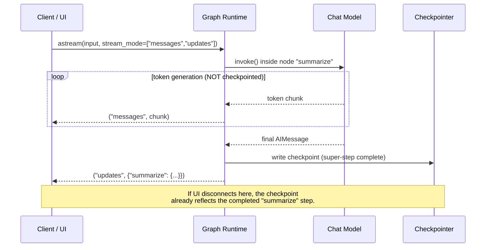
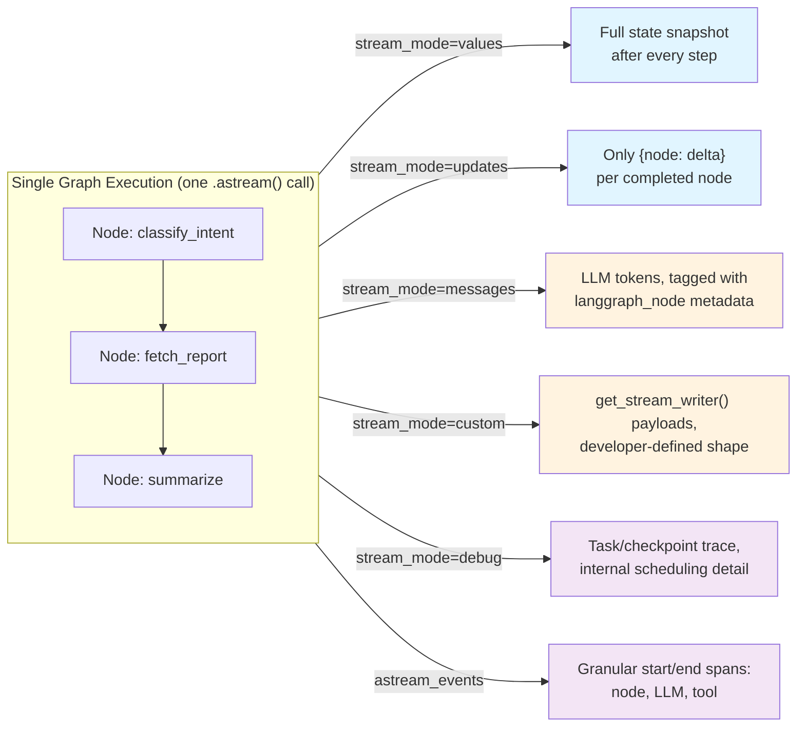

# Chapter 11: Streaming

> "The user doesn't want the answer. The user wants to watch the answer arrive." — every product manager who has ever shipped a chat UI

## Learning Objectives

By the end of this chapter, you will be able to:

- Explain why LangGraph's streaming API is a **superset** of the token-level streaming you already know from LangChain Core, not a replacement for it
- Choose the correct `stream_mode` — `values`, `updates`, `messages`, `custom`, or `debug` — for a given UI or observability requirement, and combine several at once
- Trace exactly how a chat model's token stream, invoked deep inside a single node, surfaces through `graph.stream()`, and how to tell which node (or which of several concurrently running nodes) a given token came from
- Stream individual state-key changes to drive a progress indicator ("searching…", "summarizing…", "done") without waiting for the full run to finish
- Use `astream_events()` to capture granular start/end events for nodes, tool calls, and LLM calls — the building block for rich UIs and structured logs
- Reason about how `stream_mode` and streamed events propagate out of nested subgraphs, and what changes when a node itself is a compiled subgraph
- Build a ChatGPT-style streaming chat endpoint that shows both live tokens and a "thinking…" status, backed by a real LangGraph agent
- Explain precisely how streaming interacts with checkpointing — what is durable, what is not, and what happens when a client disconnects mid-response

---

## Prerequisites for the Chapter

This chapter assumes you have completed:

- **Chapter 7 (Compilation & Execution)** — you understand the super-step execution loop: LangGraph runs nodes in discrete steps, and a "super-step" is the unit of work that can contain one or more nodes executing (sequentially or in parallel) before the graph checkpoints and moves on.
- **Chapter 8 (Tool Calling Patterns)** — you've built a node that calls a chat model bound to tools and routes to a `ToolNode`.
- **Chapter 9 (Checkpointing & Durable Execution)** — you know what a checkpointer is, that it persists state after every super-step, and that `thread_id` is how a run's history is addressed.
- **Chapter 10 (Memory Management)** — you're comfortable with thread-scoped state versus long-term memory stores.

You should also already know, from the companion **LangChain Core** course, how token-level streaming works at the single-Runnable level: `model.stream(...)`, `chain.astream(...)`, and `astream_events()` on a single chain, including the difference between `.stream()` (yields the object's own output type, chunk by chunk) and `astream_events()` (yields a structured event envelope with `event`, `name`, `data`, etc.). This chapter does not re-teach that foundation — it shows you what LangGraph adds on top of it once your single chain becomes a graph of many nodes with its own persisted state.

No new setup is required beyond a working LangGraph installation and an LLM provider you can call. The worked example additionally uses FastAPI for the streaming HTTP endpoint, consistent with this course's assumption that you're comfortable with basic FastAPI routes.

---

## 1. From Token Streaming to Full-Graph Streaming: What's New Here

In LangChain Core, "streaming" meant one thing: tokens arriving incrementally from a single Runnable, usually a chat model at the end of a chain. You'd call `chain.astream(input)` and get partial `AIMessageChunk` objects until the model finished generating.

A LangGraph graph is not one Runnable — it's a **stateful, multi-step program**. Over the course of a single `.invoke()`, a graph might: route through a decision node, call a tool, call an LLM twice, update five different state keys, and loop back through a conditional edge three times. Token-level output from the final LLM call is just one of many things happening. If streaming only exposed tokens, you'd have no visibility into everything else the graph is doing while the user waits.

LangGraph's `.stream()` / `.astream()` therefore expose **multiple simultaneous views of the same execution**, selected via the `stream_mode` parameter:

| What you want to observe | stream_mode |
|---|---|
| The full state after each step | `"values"` |
| Just what changed each step | `"updates"` |
| LLM tokens from any node, as they're generated | `"messages"` |
| Arbitrary developer-defined progress events | `"custom"` |
| Verbose internal execution trace | `"debug"` |

Crucially, `"messages"` mode gives you exactly the token-level experience you already know from LangChain Core — a chat model's `.stream()` output threaded through automatically — but it arrives *alongside* everything else the graph exposes. That's the superset relationship: every node in your graph can still stream tokens the way a bare chain would, and LangGraph additionally tells you which node those tokens came from, what state changed around them, and lets you tap developer-defined signals that have no equivalent at the single-chain level. Nothing from your LangChain Core streaming knowledge is invalidated; it's now one channel among several.

---

## 2. The `stream_mode` Parameter: Five Views Into the Same Execution

Every example below assumes a compiled graph `app = graph.compile(checkpointer=checkpointer)` and a config carrying a `thread_id`:

```python
config = {"configurable": {"thread_id": "session-42"}}
```

### 2.1 `stream_mode="values"` — the full state, after each step

This is the closest mode to "just show me what `.invoke()` would have returned, but incrementally." After every super-step, LangGraph yields the **entire current state** as it stands at that point.

```python
for state in app.stream(
    {"messages": [{"role": "user", "content": "Summarize our Q3 numbers"}]},
    config=config,
    stream_mode="values",
):
    print(state.keys())
    print(state["messages"][-1])
```

```text
dict_keys(['messages'])
HumanMessage(content='Summarize our Q3 numbers')
dict_keys(['messages'])
AIMessage(content='', tool_calls=[{'name': 'fetch_report', ...}])
dict_keys(['messages', 'report_data'])
ToolMessage(content='{"revenue": ...}', tool_call_id='...')
dict_keys(['messages', 'report_data', 'summary'])
AIMessage(content='Q3 revenue grew 12% QoQ...')
```

Each yielded value is a **complete snapshot**, not a diff — convenient when your UI just needs "the latest truth" (e.g., re-rendering a message list) and doesn't care which specific key changed. The trade-off: for large state objects, re-sending the whole state every step is wasteful if you only care about one field.

### 2.2 `stream_mode="updates"` — only what changed

`"updates"` yields a dictionary shaped `{node_name: <that node's return value>}` for each node as it finishes — i.e., exactly the partial update dict the node returned, not the merged state.

```python
for update in app.stream(input_message, config=config, stream_mode="updates"):
    for node_name, node_output in update.items():
        print(f"[{node_name}] -> {node_output}")
```

```text
[classify_intent] -> {'intent': 'financial_summary'}
[fetch_report]    -> {'report_data': {'revenue': 4_200_000, 'qoq_growth': 0.12}}
[summarize]       -> {'messages': [AIMessage(content='Q3 revenue grew 12% QoQ...')]}
```

This is the mode you reach for most often in production: it's compact (no redundant re-transmission of unchanged fields), and it maps naturally onto a UI event log — each event *is* a discrete thing that just happened. Note that if two nodes execute **in parallel within the same super-step** (Chapter 13), you'll receive one `updates` event per node, each keyed by its own node name — they don't get merged into a single event, even though they share a super-step and their outputs will be merged into state by your reducers (Chapter 6) before the next step begins.

### 2.3 `stream_mode="messages"` — token streaming from any node

`"messages"` mode is where LangGraph exposes the LangChain Core streaming you already know, but generalized across the whole graph. Every time a chat model invoked *inside any node* produces a token, that token surfaces here — regardless of which node, how deep in the graph, or how many nodes have already run.

```python
for chunk, metadata in app.stream(input_message, config=config, stream_mode="messages"):
    print(metadata["langgraph_node"], repr(chunk.content))
```

```text
classify_intent '' 
classify_intent 'financial'
classify_intent '_summary'
summarize ''
summarize 'Q3'
summarize ' revenue'
summarize ' grew'
summarize ' 12%'
...
```

Each event is a `(message_chunk, metadata)` tuple:

- `message_chunk` is a standard `AIMessageChunk` (or similar), identical in shape to what `model.stream()` would give you directly — this is the payload continuity with LangChain Core.
- `metadata` is a dict describing *where in the graph* this chunk came from, including `langgraph_node` (the node's name), `langgraph_step` (the super-step index), and the model's own invocation metadata (`ls_model_name`, `ls_provider`, tags, etc.).

This only works for nodes that actually invoke their chat model in streaming mode internally (LangGraph handles this automatically for any `ChatModel.invoke()`/`.ainvoke()` call made inside a node when the graph itself is being streamed with `"messages"` — you do not need to manually call `.stream()` on the model inside the node).

### 2.4 `stream_mode="custom"` — developer-defined signals

Sometimes you want to emit something that isn't a state update and isn't a token — a raw progress signal, a percentage, a log line, a partial tool-call argument you're constructing manually. `"custom"` mode exists for exactly this, via `get_stream_writer()`:

```python
from langgraph.config import get_stream_writer

def fetch_report(state: State) -> dict:
    writer = get_stream_writer()
    writer({"status": "connecting to reporting API..."})
    raw = call_reporting_api(state["query"])
    writer({"status": "parsing report payload..."})
    parsed = parse_report(raw)
    writer({"status": "done"})
    return {"report_data": parsed}
```

```python
for event in app.stream(input_message, config=config, stream_mode="custom"):
    print(event)
```

```text
{'status': 'connecting to reporting API...'}
{'status': 'parsing report payload...'}
{'status': 'done'}
```

`get_stream_writer()` returns a callable you invoke with **any JSON-serializable payload you choose** — the schema is entirely yours. This is the mode you'll use for "searching…" / "summarizing…" style progress UIs where the granularity you want doesn't correspond to a node boundary (e.g., progress *within* a single long-running node). Outside of an active `.stream(..., stream_mode="custom")` call (for example, during a plain `.invoke()`), the writer is a safe no-op — you do not need to guard every call with an `if streaming:` check.

### 2.5 `stream_mode="debug"` — verbose internal execution trace

`"debug"` yields the most granular internal view LangGraph offers: task scheduling, task completion, and checkpoint-write events, each tagged with a `type` field (e.g., `"task"`, `"task_result"`, `"checkpoint"`), the super-step index, timestamps, and the full input/output involved.

```python
for event in app.stream(input_message, config=config, stream_mode="debug"):
    print(event["type"], event.get("step"), event.get("payload", {}).get("name"))
```

```text
task 0 classify_intent
task_result 0 classify_intent
checkpoint 0 None
task 1 fetch_report
task_result 1 fetch_report
checkpoint 1 None
task 2 summarize
task_result 2 summarize
checkpoint 2 None
```

This mode is verbose by design — it's meant for debugging execution order, diagnosing why a node did or didn't run, or building tooling that needs to reconstruct the exact scheduling behavior of the graph (similar in spirit to what LangGraph Studio displays). It is rarely what you wire into an end-user UI; reach for `"updates"` or `"custom"` for that, and reserve `"debug"` for development and incident investigation.

### 2.6 Requesting Multiple Modes at Once

You are not limited to one mode per call. Pass a list, and each yielded item becomes a `(mode, chunk)` tuple so you can tell them apart:

```python
for mode, chunk in app.stream(
    input_message,
    config=config,
    stream_mode=["updates", "messages", "custom"],
):
    if mode == "messages":
        message_chunk, metadata = chunk
        # forward token to UI
    elif mode == "updates":
        # log structured step transitions
        ...
    elif mode == "custom":
        # forward progress event to UI
        ...
```

This is the pattern the worked example in Section 8 relies on: tokens and progress events multiplexed onto one stream, distinguished by the leading `mode` tag.

---

## 3. Token-Level Streaming Mechanics and Concurrent Nodes

### 3.1 How a node's token stream surfaces through the graph

When a node's body calls `llm.invoke(messages)` (or `ainvoke`), and the *graph* is being driven through `.stream(..., stream_mode="messages")`, LangGraph does not wait for that call to complete before emitting anything — it taps into the chat model's own token-by-token generation via the same callback mechanism LangChain Core streaming already uses internally. Concretely:

1. LangGraph attaches a streaming callback handler to the run before executing the graph.
2. When a node's code calls a chat model, that model — being a Runnable — invokes its normal internal token-emission callbacks as it generates.
3. LangGraph's handler intercepts those callback events, tags each token with the identity of the node currently executing (and the run's `langgraph_step`), and re-emits them as `(chunk, metadata)` tuples on the `"messages"` channel of your `.stream()` call.

The practical implication: **you write the node exactly as you would write any LangChain Core code** — a plain `llm.invoke(state["messages"])` call — and you get token streaming "for free" as long as the outer graph call requests `stream_mode="messages"`. You do not need to restructure node code into `async for token in llm.astream(...)` unless you specifically want to react to tokens *inside* the node itself (rare).

### 3.2 Distinguishing tokens from concurrent nodes

Chapter 13 covers fan-out/fan-in in depth, but the streaming implication is worth previewing now: if your graph runs two nodes in parallel within the same super-step — say, `summarize_finance` and `summarize_operations`, each independently calling an LLM — their token streams interleave on the same `"messages"` channel. You distinguish them using the `metadata` dict that accompanies every chunk:

```python
for chunk, metadata in app.stream(input_message, config=config, stream_mode="messages"):
    node = metadata["langgraph_node"]
    if node == "summarize_finance":
        finance_buffer.append(chunk.content)
    elif node == "summarize_operations":
        ops_buffer.append(chunk.content)
```

For finer-grained disambiguation than the node name alone provides — for instance, when the *same* node is invoked multiple times concurrently as part of a `Send`-based map-reduce (Chapter 16) — bind distinguishing tags directly to the model call inside the node:

```python
def summarize_one(state: PerItemState) -> dict:
    tagged_llm = llm.with_config(tags=[f"item:{state['item_id']}"])
    result = tagged_llm.invoke(build_prompt(state))
    return {"summary": result.content}
```

and read `metadata["tags"]` on the receiving end to route each token to the correct UI panel, log stream, or accumulation buffer. Never assume tokens on the `"messages"` channel arrive in a single logical order when concurrency is involved — always key off `langgraph_node` and/or `tags`, not arrival order.

---

## 4. State-Update Streaming for Progress UIs

`stream_mode="updates"` is the natural backbone for a progress indicator, because each event corresponds to a discrete, human-describable milestone: a node just finished. Map node names to user-facing labels and you have a status UI with almost no extra plumbing:

```python
STATUS_LABELS = {
    "classify_intent": "Understanding your question...",
    "fetch_report":    "Looking up the data...",
    "summarize":       "Writing your summary...",
}

async def status_stream(input_message, config):
    async for update in app.astream(input_message, config=config, stream_mode="updates"):
        node_name = next(iter(update))
        yield {"event": "status", "label": STATUS_LABELS.get(node_name, node_name)}
    yield {"event": "status", "label": "Done."}
```

This is coarser-grained than `"custom"` (Section 2.4) — you get one signal per *node*, not per arbitrary milestone inside a node's body. Use `"updates"` for "which step of the pipeline are we on" and reserve `"custom"` for "what's happening inside this specific, possibly slow, step." Many production UIs combine both, which is exactly what the worked example in Section 8 does.

It's also worth watching *specific keys* rather than whole updates when a node writes to several state fields but the UI only cares about one:

```python
async for update in app.astream(input_message, config=config, stream_mode="updates"):
    for node_name, partial_state in update.items():
        if "citations" in partial_state:
            render_citations(partial_state["citations"])
```

---

## 5. Fine-Grained Event Streaming with `astream_events`

`stream_mode` gives you graph-level views (state, tokens, custom signals). `astream_events()` — inherited from the Runnable interface you already used in LangChain Core, since a compiled LangGraph graph *is itself a Runnable* — gives you a much finer-grained **event log** of everything that happened during the run: every node's start and end, every LLM call's start/stream/end, every tool call's start/end, in one unified schema.

```python
async for event in app.astream_events(input_message, config=config, version="v2"):
    kind = event["event"]
    name = event["name"]
    node = event.get("metadata", {}).get("langgraph_node")

    if kind == "on_chain_start" and node:
        print(f">>> entering node: {node}")
    elif kind == "on_chat_model_stream":
        token = event["data"]["chunk"].content
        if token:
            print(token, end="", flush=True)
    elif kind == "on_tool_start":
        print(f"\n[tool call] {name} args={event['data'].get('input')}")
    elif kind == "on_tool_end":
        print(f"[tool result] {name} -> {event['data'].get('output')}")
    elif kind == "on_chain_end" and node:
        print(f"<<< leaving node: {node}")
```

```text
>>> entering node: classify_intent
<<< leaving node: classify_intent
>>> entering node: fetch_report
[tool call] fetch_report args={'query': 'Q3 revenue'}
[tool result] fetch_report -> {'revenue': 4200000, 'qoq_growth': 0.12}
<<< leaving node: fetch_report
>>> entering node: summarize
Q3 revenue grew 12% QoQ, driven primarily by...
<<< leaving node: summarize
```

The event envelope (`event`, `name`, `run_id`, `tags`, `metadata`, `data`) is identical in shape to what you saw in the LangChain Core course for a single chain — LangGraph just populates it with `langgraph_node` / `langgraph_step` in `metadata`, so the same event schema now spans an entire multi-node graph instead of one Runnable.

### When to reach for `astream_events` instead of `stream_mode`

| Need | Use |
|---|---|
| "Show tokens and progress in a chat UI" | `stream_mode=["messages", "custom"]` |
| "Log every tool call's exact arguments and output for auditing" | `astream_events()`, filter `on_tool_start`/`on_tool_end` |
| "Build a trace viewer showing nested start/end spans" | `astream_events()` |
| "Drive a simple step-progress bar" | `stream_mode="updates"` |

`astream_events()` is strictly more granular (and therefore more verbose and slightly more expensive to iterate) than `stream_mode`. Prefer `stream_mode` for anything you're shipping to end users, and reach for `astream_events()` when you need observability/logging detail that spans tool- and model-level boundaries specifically.

---

## 6. Streaming Across Subgraphs and Tool Calls

Chapter 15 covers subgraph composition in full; here's what matters for streaming specifically. When a node in your graph is itself a **compiled subgraph** (a full `StateGraph` invoked as a node), its internal execution — its own nodes, its own LLM calls — is, by default, **invisible** to the parent's stream: from the parent's point of view, the subgraph node is a single opaque unit that starts and eventually returns an update, exactly like any other node.

To see inside it, pass `subgraphs=True`:

```python
for namespace, chunk in app.stream(
    input_message,
    config=config,
    stream_mode="updates",
    subgraphs=True,
):
    if namespace:
        print(f"(subgraph {namespace}) -> {chunk}")
    else:
        print(f"(top-level) -> {chunk}")
```

With `subgraphs=True`, every yielded item becomes a `(namespace, chunk)` tuple. `namespace` is an empty tuple `()` for events from the top-level graph, and a non-empty tuple identifying the path into the nested graph (e.g., `("research_subgraph:abc123",)`) for events emitted from inside it. This composes with every `stream_mode` covered above — including `"messages"`, which means token-level streaming from an LLM call buried three subgraphs deep still surfaces at the top level, tagged with the namespace path that got you there.

The same mechanism applies to tool calls that themselves invoke an LLM internally (for example, a tool implemented as its own small LangGraph agent, or a tool that wraps a retrieval-augmented sub-chain) — as long as the underlying call is a streaming-capable Runnable and the outer `.stream()` requests the right mode, its tokens and updates surface the same way. We'll build and stream a real multi-graph system in Chapter 15; for now, the takeaway is: **`stream_mode` and event granularity are properties of the outermost `.stream()`/`.astream()` call, and `subgraphs=True` is the only thing standing between you and visibility into nested execution.**

---

## 7. Streaming and Checkpointing: Durable Streams

This is the interplay the task description specifically calls out, and it deserves precision rather than hand-waving.

### 7.1 What gets checkpointed, and when

Recall from Chapter 9: a checkpointer persists the **full graph state** after every completed super-step, keyed by `thread_id`. This happens regardless of whether the run is being streamed — streaming is a read-side concern (what you observe while the run executes); checkpointing is a write-side concern (what gets durably saved as the run executes). They are related but not the same mechanism, and understanding the boundary between them is what lets you reason correctly about disconnects.

The granularity of checkpointing is the **super-step**, not the token. Concretely:

- A checkpoint is written **after** a node (or set of parallel nodes in one super-step) finishes and its output has been merged into state.
- Tokens streamed via `stream_mode="messages"` from *inside* a node's LLM call happen **before** that node's super-step completes — they are not individually checkpointed. Only the node's *final*, complete output (the full `AIMessage` it eventually returns) becomes part of the checkpointed state.



### 7.2 What happens on disconnect, mid-node

If a client disconnects **while tokens are still streaming from an in-progress node**, no checkpoint yet exists for that node's output — because the super-step hasn't completed. What happens next depends on your deployment model:

- **Embedded / local execution** (you're driving `.stream()` yourself in a Python process, e.g. inside a FastAPI request handler): the run *is* the generator being iterated. If the client's HTTP connection drops and nothing keeps consuming the generator, execution typically stops with it — the in-progress node's work (and its partial tokens) is lost. On the client's next request with the **same `thread_id`**, LangGraph resumes from the **last successfully written checkpoint** — i.e., it re-runs the interrupted node from scratch (with the same inputs, since nothing about that node's prior state was saved), not from the middle of the token stream.
- **LangGraph Platform / a persistent server process**: the run executes independently of any single client connection — the server keeps driving the graph even if the original HTTP/WebSocket connection drops, and checkpoints continue to be written as super-steps complete. A reconnecting client can retrieve the latest state via `get_state(config)` and, on platforms that support it, re-attach to an in-flight run's output stream rather than starting a fresh `.stream()` call.

The practical rule that follows from this: **design nodes that make LLM calls to be safely re-runnable.** Since a disconnect mid-node means that node re-executes in full on resume, a node with side effects (charging a card, sending an email, appending to an external log) needs those side effects to be idempotent or otherwise guarded — the same durable-execution discipline from Chapter 9, now specifically motivated by the streaming case rather than a crash.

### 7.3 Designing for resumable streaming UIs

For a genuinely resumable chat UI, combine two things you already have:

1. **Checkpointed state** as the source of truth for "what's been said so far" — on reconnect, call `app.get_state(config)` to fetch the last durable snapshot and render it immediately (no gap, no re-asking the model for a summary of what happened).
2. **A fresh `.stream()` call on the same `thread_id`** to resume forward execution — LangGraph will skip any super-steps already reflected in the last checkpoint and continue from there, re-executing only the node that was interrupted.

This is also why it's good practice to have the client **buffer streamed tokens locally** as they arrive (e.g., accumulate into a string as `"messages"` chunks arrive) rather than relying solely on the server to replay a partial response — the server's durable unit is the whole node's output, not the individual token, so a mid-token disconnect means the *node* replays, and the cleanest user experience is simply re-rendering the final message once it reappears in the resumed stream.

---

## 8. Worked Example: A ChatGPT-Like Streaming Chat Endpoint

Let's put all four mechanisms — token streaming, custom progress events, state updates, and checkpointing — together into one realistic system: a FastAPI endpoint backing a chat UI that (a) streams the assistant's answer token by token, and (b) shows a "thinking…" / "searching…" indicator while tools run.

### 8.1 The graph

```python
from typing import Annotated, TypedDict
from langgraph.graph import StateGraph, START, END
from langgraph.graph.message import add_messages
from langgraph.checkpoint.postgres import PostgresSaver
from langgraph.config import get_stream_writer
from langchain_core.messages import AnyMessage
from langchain_openai import ChatOpenAI
from my_tools import web_search  # a @tool-decorated function

class ChatState(TypedDict):
    messages: Annotated[list[AnyMessage], add_messages]

llm = ChatOpenAI(model="gpt-4o", temperature=0)
llm_with_tools = llm.bind_tools([web_search])

def agent(state: ChatState) -> dict:
    writer = get_stream_writer()
    writer({"status": "thinking"})
    response = llm_with_tools.invoke(state["messages"])
    return {"messages": [response]}

def run_tools(state: ChatState) -> dict:
    writer = get_stream_writer()
    last = state["messages"][-1]
    outputs = []
    for call in last.tool_calls:
        writer({"status": "searching", "query": call["args"].get("query")})
        result = web_search.invoke(call["args"])
        outputs.append({"role": "tool", "content": result, "tool_call_id": call["id"]})
    return {"messages": outputs}

def should_continue(state: ChatState) -> str:
    last = state["messages"][-1]
    return "tools" if getattr(last, "tool_calls", None) else END

graph = StateGraph(ChatState)
graph.add_node("agent", agent)
graph.add_node("tools", run_tools)
graph.add_edge(START, "agent")
graph.add_conditional_edges("agent", should_continue, {"tools": "tools", END: END})
graph.add_edge("tools", "agent")

checkpointer = PostgresSaver.from_conn_string("postgresql://localhost/langgraph")
app = graph.compile(checkpointer=checkpointer)
```

Two things are worth noticing about this graph's design specifically because we intend to stream it:

- `agent` emits a `"thinking"` custom event *before* calling the LLM, so the UI has something to show during the (potentially multi-second) latency before the first token arrives.
- `run_tools` emits a `"searching"` custom event per tool call, so a multi-tool turn shows per-call progress rather than one opaque "working…" spinner.

### 8.2 The FastAPI streaming endpoint

We multiplex `"messages"` (tokens) and `"custom"` (status events) onto a single Server-Sent Events (SSE) response, encoding each as a small JSON envelope the frontend can switch on.

```python
import json
from fastapi import FastAPI
from fastapi.responses import StreamingResponse

api = FastAPI()

def sse(event: dict) -> str:
    return f"data: {json.dumps(event)}\n\n"

@api.post("/chat/{thread_id}")
async def chat(thread_id: str, user_message: str):
    config = {"configurable": {"thread_id": thread_id}}
    input_message = {"messages": [{"role": "user", "content": user_message}]}

    async def event_generator():
        async for mode, chunk in app.astream(
            input_message,
            config=config,
            stream_mode=["messages", "custom"],
        ):
            if mode == "custom":
                yield sse({"type": "status", **chunk})

            elif mode == "messages":
                message_chunk, metadata = chunk
                if metadata.get("langgraph_node") != "agent":
                    continue  # only stream the agent's own tokens, not tool internals
                if message_chunk.content:
                    yield sse({"type": "token", "content": message_chunk.content})

        yield sse({"type": "done"})

    return StreamingResponse(event_generator(), media_type="text/event-stream")
```

### 8.3 What the client sees, turn by turn

For a user question that requires one web search before answering:

```text
data: {"type": "status", "status": "thinking"}

data: {"type": "status", "status": "searching", "query": "current LangGraph release version"}

data: {"type": "status", "status": "thinking"}

data: {"type": "token", "content": "The"}

data: {"type": "token", "content": " latest"}

data: {"type": "token", "content": " stable"}

data: {"type": "token", "content": " release..."}

data: {"type": "done"}
```

The frontend renders `"status"` events as a transient "thinking…" / "searching for '...'" indicator that disappears the moment the first `"token"` event arrives, then appends `"token"` content to the growing assistant bubble exactly the way ChatGPT's own UI does. Because `stream_mode="messages"` filters by `metadata["langgraph_node"]`, tokens generated as a side effect of any future node you add to this graph (e.g., a separate "critique" node during development) won't leak into the user-facing stream unless you explicitly allow them.

### 8.4 Why this is safely resumable

Because `app` is compiled with a `PostgresSaver`, every completed super-step — the `agent` node's full response, the `tools` node's full result — is durably persisted under `thread_id`. If the client's connection drops mid-token-stream, the in-progress node re-executes on the next request against the same `thread_id` (Section 7.2); prior turns already reflected in checkpoints are not repeated. A production version of this endpoint would typically add a `GET /chat/{thread_id}/state` route backed by `app.get_state(config)` so a reconnecting client can immediately re-render everything already committed, then re-issue the `POST` to resume forward streaming.

---

## Examples

Quick-reference snippets for picking the right mode without re-reading the full section:

```python
# "I just want the final answer, streamed as it's generated"
async for chunk, meta in app.astream(inp, config=cfg, stream_mode="messages"):
    if meta["langgraph_node"] == "final_answer" and chunk.content:
        print(chunk.content, end="")

# "I want to know which step just finished, for a progress bar"
async for update in app.astream(inp, config=cfg, stream_mode="updates"):
    print("step complete:", list(update.keys())[0])

# "I want a snapshot of the whole state after every step, for a debug panel"
async for state in app.astream(inp, config=cfg, stream_mode="values"):
    render_debug_panel(state)

# "I want to log every tool call's arguments and result"
async for event in app.astream_events(inp, config=cfg, version="v2"):
    if event["event"] in ("on_tool_start", "on_tool_end"):
        audit_log.write(event)

# "I want my own arbitrary progress signal from inside a long-running node"
def slow_node(state):
    writer = get_stream_writer()
    for i, item in enumerate(state["items"]):
        writer({"progress": i / len(state["items"])})
        process(item)
    return {"done": True}
```

---

## Diagrams

The mermaid diagram below maps the mental model of this chapter: one execution, five independent lenses, each exposing a different slice of the same underlying run.



---

## Real-World Scenarios

**Scenario 1: Customer support copilot with a live "researching" indicator.** A support tool built on LangGraph routes a ticket through an intent classifier, a knowledge-base retriever, and an answer-drafting node. Early versions streamed only `"messages"` tokens from the final node — support agents stared at a blank screen for 4-6 seconds while retrieval ran, since retrieval itself produces no tokens. Adding `stream_mode=["messages", "updates"]` and mapping the `retrieve_kb` node's `updates` event to a "Searching knowledge base…" label eliminated the dead-air period entirely, without changing a single line of the actual retrieval logic — a pure streaming-layer fix.

**Scenario 2: Multi-agent research assistant with parallel sub-agents.** A supervisor graph fans out to three specialist agents in parallel (Chapter 13/14 territory) — a "market" agent, a "competitor" agent, and a "financials" agent — each independently calling an LLM to draft its section. Naively streaming `"messages"` produced an unreadable interleaving of three different sections' tokens in one text area. The fix was to tag each sub-agent's model call with `.with_config(tags=["agent:market"])` etc., and have the frontend route chunks to three separate panels keyed by `metadata["tags"]`, giving the appearance of three analysts typing simultaneously, in their own columns.

**Scenario 3: Long-running batch summarization job with reconnect support.** An internal tool summarizes a batch of 200 uploaded documents through a single long-running LangGraph run, checkpointed to Postgres. Analysts frequently closed their laptop mid-run. Because the graph checkpoints after every document's summarization node completes, reopening the browser and re-issuing a request against the same `thread_id` resumed from the last completed document rather than restarting the batch — turning what used to be a "redo everything" failure mode into a "pick up roughly where you left off" one, at the cost of re-doing at most the single in-flight document.

---

## Best Practices

- **Default to `stream_mode="updates"` for production UIs**, and add `"messages"` only for the specific node(s) whose tokens you actually want to expose to end users — don't stream every node's raw LLM output by default, since intermediate "thinking" calls (e.g., a classifier or a critique step) are rarely meant for the end user's eyes.
- **Always filter `"messages"` chunks by `metadata["langgraph_node"]`** (and `tags` for concurrent same-node invocations) before rendering — never assume the token stream corresponds to only the node you care about.
- **Use `get_stream_writer()` for progress inside a node, and `"updates"` for progress between nodes.** Mixing the two purposes into one channel makes UI code harder to reason about.
- **Treat `astream_events()` as your observability/logging tool, not your primary UI feed** — it's more granular (and heavier) than most user-facing streams need, and is a better fit for structured audit logs or trace viewers.
- **Design nodes that call LLMs or tools to be idempotent/re-runnable**, since a disconnect mid-node means that node's entire body re-executes on resume — this is a direct consequence of checkpointing at super-step granularity, not token granularity.
- **Buffer streamed tokens on the client** as they arrive rather than assuming the server can always resume mid-sentence; the server can only guarantee resumption at the last completed node.
- **Use `subgraphs=True` deliberately, not by default** — it changes your chunk shape to `(namespace, chunk)` tuples, which will silently break code written to expect bare chunks if toggled on later without updating consumers.
- **Pin `version="v2"` explicitly when calling `astream_events()`** so a future LangChain Core default change doesn't alter your event schema underneath you.

---

## Common Mistakes

- **Assuming `"values"` mode is cheap.** For large state objects (long message histories, big retrieved documents), re-sending the full state on every step is significant overhead compared to `"updates"`. Default to `"updates"` unless you specifically need full snapshots.
- **Forgetting that `"messages"` mode streams tokens from *every* node's LLM calls, not just the "final" one.** Without filtering on `metadata["langgraph_node"]`, a classifier node's raw (and often ugly, JSON-shaped) output ends up in the user-facing chat bubble alongside the real answer.
- **Calling `get_stream_writer()` and expecting it to work outside of a `stream_mode="custom"` (or list-including-`"custom"`) call.** It's a safe no-op elsewhere by design — but that also means a developer who forgot to include `"custom"` in the list won't see an error, just silently missing progress events, which can look like a bug in the node itself.
- **Confusing `stream_mode` with `astream_events()`** and reaching for the much heavier event-stream API when a simple `"updates"` or `"messages"` loop would do — this adds unnecessary filtering logic and CPU overhead to a hot path.
- **Assuming a disconnected client's in-progress node "picks up where it left off."** It doesn't — the durable unit is the super-step, so the whole interrupted node re-executes on resume. Side-effecting nodes that aren't idempotent can double-charge, double-send, or double-log under this assumption.
- **Not passing `subgraphs=True` and then wondering why a nested graph's tokens or updates never appear in the parent's stream.** By default, subgraph internals are opaque to the parent's `.stream()` call.
- **Streaming raw tool-call arguments or intermediate JSON structures directly to end users** because they happened to be picked up by an unfiltered `"messages"` or `"updates"` stream — always curate what a UI is allowed to render, rather than piping every internal event through unfiltered.

---

## Summary

- LangGraph's streaming API is a **superset** of the single-Runnable token streaming you already know: `stream_mode="messages"` gives you that exact experience, generalized across every node in a multi-step graph, tagged with which node produced each token.
- `stream_mode` offers five complementary views of one execution: **`values`** (full state per step), **`updates`** (only what changed), **`messages`** (LLM tokens with node metadata), **`custom`** (developer-defined signals via `get_stream_writer()`), and **`debug`** (verbose internal scheduling trace) — and you can request several at once as a list, receiving `(mode, chunk)` tuples.
- Token chunks on the `"messages"` channel carry `metadata["langgraph_node"]` (and optionally custom `tags`) so you can correctly attribute tokens to their source node even under concurrent, parallel node execution.
- `astream_events()` — the same Runnable-level event API from LangChain Core — now spans the whole graph, surfacing node-, tool-, and model-level start/end spans in one unified schema, ideal for logging and rich trace UIs rather than end-user chat feeds.
- `subgraphs=True` is required to see streamed output from inside nested/composed graphs (Chapter 15); without it, a subgraph node behaves as one opaque unit from the parent's streaming point of view.
- Checkpointing operates at **super-step granularity**, not token granularity: streamed tokens are not themselves durable, but a node's completed output is checkpointed the moment its super-step finishes. A client disconnecting mid-response causes the in-progress node to re-execute in full on resume — design nodes accordingly.
- A production-grade streaming chat interface combines `"messages"` for live tokens, `"custom"` for progress/status indicators, and a checkpointer for resumability — exactly the pattern built in Section 8.

---

## Knowledge Check

1. You already know `chain.astream()` from LangChain Core. Explain precisely what LangGraph's `stream_mode="messages"` adds on top of that single-chain behavior, and what stays exactly the same.
2. A teammate streams a graph with `stream_mode="values"` and complains the payload size is much larger than they expected for a simple 3-node chat graph. What's happening, and which `stream_mode` would you recommend instead, with a one-sentence justification?
3. Your graph fans out to four parallel nodes in one super-step, each calling an LLM. Describe two different mechanisms available in the `metadata` of a `"messages"` chunk that let you correctly attribute each token to its source, and explain when you'd need the second one instead of just the first.
4. Explain the difference between `stream_mode="updates"` and `astream_events()` filtered to `on_chain_end` events — both notionally tell you "a node just finished." What does one give you that the other doesn't?
5. A client disconnects while your `summarize` node's chat model is mid-way through generating tokens. On reconnect with the same `thread_id`, what exactly re-executes, and what does not? Why is this true given how checkpointing is scoped?
6. Why does `get_stream_writer()` need no `if streaming:` guard around every call site, even though the same node function might sometimes run under a plain `.invoke()` with no active stream?

---

## Hands-on Exercises

1. **Build a multiplexed status + token stream.** Take (or build) a two-node graph — a tool-calling node and a final-answer node — and write a `.stream()` loop that requests `stream_mode=["custom", "messages", "updates"]` simultaneously. Emit a custom `{"status": "..."}` event from inside the tool node via `get_stream_writer()`, and print a clearly distinguishable line for each of the three event types as they arrive. Confirm you can see status events arrive *before* any tokens from the final node.

2. **Attribute tokens under concurrency.** Construct a graph where a single node fans out to three parallel branches (a preview of Chapter 13's `Send` API — a simple hardcoded fan-out into three static nodes is fine for this exercise), each invoking an LLM with a distinct `.with_config(tags=[...])`. Stream with `stream_mode="messages"` and demonstrate that you can correctly split the interleaved token stream back into three separate, correctly-ordered text buffers using only the `metadata` dict.

3. **Simulate a mid-stream disconnect and observe resume behavior.** Using a graph compiled with a real checkpointer (SQLite is fine for this exercise), start a `.stream()` call with `stream_mode="updates"`, and deliberately break out of the loop (e.g., with a `break` after the first event) before the run completes, simulating a dropped client. Then call `app.get_state(config)` with the same `thread_id` to inspect what was actually persisted, and re-invoke `.stream()` on the same thread to observe which node(s) re-execute versus which are skipped because they're already reflected in the checkpoint.

---

## Further Reading

- [LangGraph Streaming Documentation](https://docs.langchain.com/oss/python/langgraph/streaming) — official reference for `stream_mode`, `get_stream_writer()`, and `astream_events()`
- [LangGraph Documentation — Overview](https://docs.langchain.com/oss/python/langgraph/overview)
- [LangGraph Application Structure Guide](https://docs.langchain.com/oss/python/langgraph/application-structure)
- [LangGraph GitHub Repository](https://github.com/langchain-ai/langgraph) — source for the exact event/metadata shapes referenced in this chapter
- Chapter 9 of this course, **Checkpointing & Durable Execution** — the persistence model this chapter's Section 7 builds on
- Chapter 13 of this course, **Parallel Execution** — full treatment of the concurrent-node scenarios previewed in Section 3.2
- Chapter 15 of this course, **Subgraphs & Composition** — full treatment of the `subgraphs=True` mechanics previewed in Section 6
- Related course in this repo: [LangChain Core — token streaming and `astream_events` fundamentals](../langchain-core-course/00-index.md)

---

<div style="display:flex;justify-content:space-between;align-items:center;">
  <a href="./10-memory-management.md">← Previous: Memory Management</a>
  <a href="./00-index.md">🏠 Index</a>
  <a href="./12-human-in-the-loop.md">Next: Human-in-the-Loop →</a>
</div>
