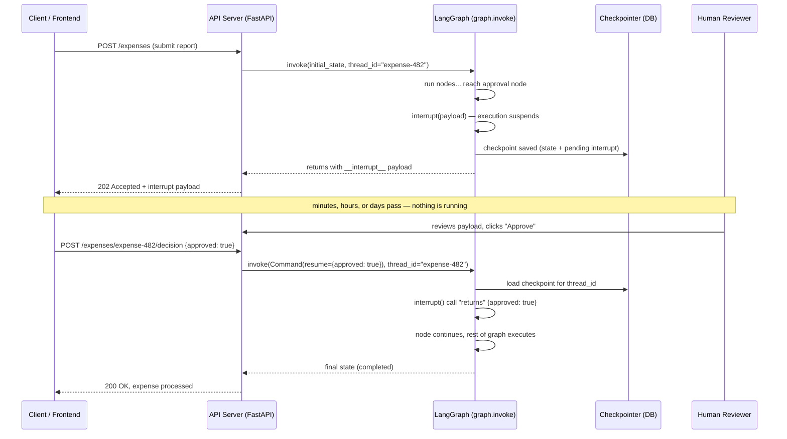
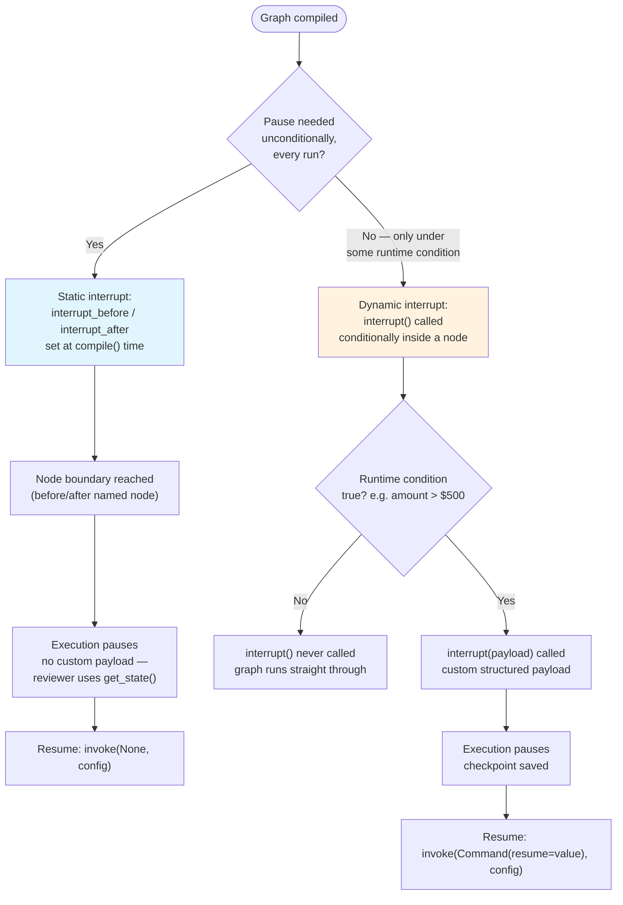

# Chapter 12: Human-in-the-Loop

> "The question isn't whether an agent *can* act autonomously. It's whether it *should*, for this particular action, right now." — a lesson every team learns the first time an agent does something expensive by itself.

## Learning Objectives

By the end of this chapter, you will be able to:

- Explain why production AI systems need a human checkpoint for high-stakes actions, and why polling/webhook-based "approval queues" are a worse solution than LangGraph's native primitive
- Use `interrupt()` to pause graph execution at an exact point inside a node, and understand precisely what "pause" means at the runtime level (not polling, not a blocked thread — a genuine suspension backed by a checkpoint)
- Resume paused execution with `Command(resume=<value>)` and trace exactly how the resume value re-enters the node's logic
- Distinguish **static interrupts** (`interrupt_before` / `interrupt_after`, set at compile time) from **dynamic interrupts** (`interrupt()`, called conditionally at runtime), and choose the right one for a given requirement
- Implement the complete request → pause → review → resume lifecycle across a process boundary (e.g., a FastAPI request today, an approval tomorrow, a resume call next week)
- Build two production-shaped approval workflows end to end: an expense-approval graph and a deployment-approval graph
- Recognize and avoid the two most common human-in-the-loop bugs: losing `thread_id` continuity across the pause/resume boundary, and duplicating side effects because of node replay semantics

---

## Prerequisites for the Chapter

This chapter assumes you are comfortable with:

- **[Chapter 2: StateGraph & State Management](./02-stategraph-and-state-management.md)** — defining state with `TypedDict`/`dataclass`/Pydantic and how nodes return partial state updates
- **[Chapter 5: Commands & Dynamic Control](./05-commands-and-dynamic-control.md)** — the `Command` object as a way for a node to control both state updates *and* control flow in one return value; this chapter reuses `Command` for a new purpose (resuming, not routing)
- **[Chapter 9: Checkpointing & Durable Execution](./09-checkpointing-and-durable-execution.md)** — this is the load-bearing prerequisite. Human-in-the-loop is built entirely on top of checkpointing: a graph can only "pause indefinitely and resume later" because a checkpointer persists its state after every super-step. If you skipped Chapter 9, go back — nothing in this chapter works without a configured checkpointer (`MemorySaver`, `SqliteSaver`, or `PostgresSaver`) and a stable `thread_id`.
- **[Chapter 11: Streaming](./11-streaming.md)** — useful context for how a client observes a graph run in progress, since a UI built around human approval typically streams progress up to the interrupt point, then waits.
- Basic familiarity with FastAPI request/response cycles — several examples in this chapter model an approval workflow as two separate HTTP requests (a "submit" call and a much later "approve" call), which is exactly how you'd wire this into a real API.

No new installation is required beyond what Chapter 9 already set up (`langgraph`, plus a checkpointer backend of your choice).

---

## 1. Why Human-in-the-Loop Matters for Production AI Systems

Every framework that lets an LLM call tools is, implicitly, betting that full autonomy is safe. Most of the time it is: looking up a customer record, searching documentation, drafting an email are all reversible or low-cost if wrong. But agent systems increasingly get connected to actions that are not reversible or not cheap:

- **Spending money** — issuing a refund, approving an expense report, placing a purchase order
- **Sending communications** — emailing a customer, posting to a public channel, notifying a regulator
- **Modifying production systems** — deploying code, rotating credentials, scaling infrastructure
- **Deleting or mutating data** — dropping a table, archiving a customer account, purging records

For these categories, "the LLM was 95% confident" is not a sufficient safety bar. The industry answer is **human-in-the-loop (HITL)**: insert a mandatory (or conditional) human checkpoint before the consequential step, and don't proceed until a person has reviewed and approved it.

The hard part has never been the *idea* of a human checkpoint — every team eventually builds one. The hard part is the **plumbing**. Naive implementations end up looking like:

1. Agent decides on an action, writes a row to an `approvals` table with status `pending`.
2. A background worker polls that table every few seconds.
3. A UI shows pending approvals; a human clicks "approve."
4. Some other worker process picks up the approved row and re-invokes... what, exactly? You have to manually reconstruct the agent's entire context — conversation history, intermediate reasoning, partial results — from scratch, because the original process that was "waiting" for approval is long gone (it can't literally block a web request thread for hours or days).

This is where LangGraph's checkpointing (Chapter 9) turns into a first-class HITL capability rather than a workaround. Because the graph's **entire state is durably persisted after every super-step**, "pause indefinitely, wait for a human, then resume exactly where you left off" stops being an application you have to build and becomes a method you call. There is no polling loop, no manually-reconstructed context, no separate approvals table you have to keep in sync with graph state — the checkpoint *is* the approvals record, and resuming *is* re-invoking the graph with the same `thread_id`.

This is one of the clearest differentiators between LangGraph and building agents directly on top of a raw LLM API or a lighter orchestration layer: most alternatives treat "pause for hours/days waiting on a human" as an exceptional, bolt-on case. LangGraph treats it as an ordinary consequence of the fact that state is already checkpointed — you get it for (almost) free.

---

## 2. The `interrupt()` Function: Pausing Execution Mid-Node

`interrupt()` is a function you call **inside a node**. When execution reaches it, the graph genuinely stops — not a `while True: check_status(); sleep(1)` polling loop, not a blocked thread waiting on a condition variable, but a full suspension of the graph run. Control returns to whoever called `invoke()`/`stream()`, the process can exit entirely, and the graph's state remains exactly as it was, persisted by the checkpointer, until someone calls back in with a resume value.

```python
from langgraph.types import interrupt
from typing import TypedDict


class ExpenseState(TypedDict):
    employee: str
    amount: float
    memo: str
    approved: bool | None


def request_approval(state: ExpenseState) -> dict:
    # Anything before this line runs every time the node executes,
    # including on replay after resume (see Section 6 — this matters).
    decision = interrupt(
        {
            "question": "Approve this expense?",
            "employee": state["employee"],
            "amount": state["amount"],
            "memo": state["memo"],
        }
    )
    # Execution below this line only happens *after* a resume.
    return {"approved": decision}
```

What actually happens when the graph reaches `interrupt(payload)`:

1. The current node's execution is suspended at that exact call.
2. The `payload` you passed is packaged into an `Interrupt` object and attached to the graph's run result.
3. The checkpointer has already saved the state as of the start of this super-step (checkpointing in LangGraph happens at super-step boundaries — see Chapter 9), so there is a durable record of "we are about to run this node, and it interrupted."
4. Control returns to the caller. If you called `graph.invoke(...)`, the call **returns** (it does not hang) — but the returned value signals that the run stopped on an interrupt rather than completing normally.
5. No thread, coroutine, or process is left running. You can shut down your entire application and resume the graph a week later, as long as the checkpointer's backing store (SQLite file, Postgres database, etc.) still has the checkpoint.

Inspecting an interrupted run:

```python
config = {"configurable": {"thread_id": "expense-482"}}

result = graph.invoke(
    {"employee": "Priya", "amount": 750.00, "memo": "Conference travel", "approved": None},
    config=config,
)

print(result["__interrupt__"])
# [Interrupt(value={'question': 'Approve this expense?', 'employee': 'Priya',
#                    'amount': 750.0, 'memo': 'Conference travel'},
#            resumable=True, ns=['request_approval:8f3a...'])]
```

You can also inspect it later, out of band, without re-invoking anything:

```python
snapshot = graph.get_state(config)
print(snapshot.next)          # ('request_approval',)  <- the node waiting to resume
print(snapshot.tasks[0].interrupts)   # the same Interrupt payload
```

This is the mechanism a review UI would use: render `snapshot.tasks[0].interrupts[0].value` as an approval card, without needing any bespoke "approvals" schema of your own.

A node can call `interrupt()` more than once (e.g., to collect several pieces of human input in sequence). LangGraph matches resume values to `interrupt()` calls **in the order they are reached during execution**, which means the calls must happen in a deterministic sequence on replay — don't put `interrupt()` behind logic that could execute a different number of times or in a different order between the original run and the replay after resume.

---

## 3. Resuming Execution with `Command(resume=...)`

`interrupt()` doesn't return a value on the run where it pauses — there's nothing to return yet. It returns a value on the **next** invocation, when you resume with a `Command`:

```python
from langgraph.types import Command

result = graph.invoke(
    Command(resume=True),         # the human's decision
    config={"configurable": {"thread_id": "expense-482"}},  # SAME thread_id
)
```

Conceptually, `Command(resume=True)` makes the paused `interrupt(payload)` call behave as if it had simply returned `True`:

```python
decision = interrupt({...})   # this call "becomes" `decision = True` on resume
```

The node's execution then continues from that point, with `decision` bound to whatever value you passed to `resume=`. It can be a boolean, a string, a dict — anything JSON-serializable that makes sense for your node's logic. A structured decision object is common in real approval workflows:

```python
result = graph.invoke(
    Command(resume={"approved": True, "approver": "manager_42", "note": "Approved, under budget"}),
    config=config,
)
```

Two details that trip people up the first time:

- **The `config` must carry the same `thread_id`** as the original invocation. The checkpointer keys everything off `thread_id`; passing a new/blank thread_id means "start a fresh graph run," not "resume the paused one." (Section 7 covers this pitfall in depth.)
- **You resume by calling `invoke()`/`stream()` again** — there is no separate "resume" API. `Command(resume=...)` passed as the *input* to `invoke()` is what signals "this call is a resume, not a new run." LangGraph inspects the checkpoint for that thread, sees a pending interrupt, and routes the resume value back into the waiting `interrupt()` call instead of starting the graph from its entry point.

If the node has multiple sequential `interrupt()` calls, you resume each one independently — the first `invoke(Command(resume=v1))` satisfies the first `interrupt()`, execution proceeds until the *next* `interrupt()` call (or the node finishes), and if it hits another `interrupt()`, the graph pauses again and you resume again with `Command(resume=v2)`.

---

## 4. Static Interrupts vs. Dynamic Interrupts

LangGraph gives you two different mechanisms for pausing execution, and choosing the right one matters.

### 4.1 Static interrupts: `interrupt_before` / `interrupt_after`

Set at **compile time**, static interrupts pause unconditionally before or after a named node runs, on every single execution, with no logic involved:

```python
graph = builder.compile(
    checkpointer=checkpointer,
    interrupt_before=["execute_deploy"],   # always pause right before this node
)
```

or

```python
graph = builder.compile(
    checkpointer=checkpointer,
    interrupt_after=["draft_response"],    # always pause right after this node
)
```

When a static interrupt fires, there's no custom payload — the caller inspects `graph.get_state(config)` to see the full current state and decide what to show a reviewer. Resuming a static interrupt is simpler too: you don't need `Command(resume=...)` at all (there's no `interrupt()` call waiting for a value); you simply call `graph.invoke(None, config=config)` and the graph proceeds to (or past) the named node.

### 4.2 Dynamic interrupts: `interrupt()` called conditionally

Dynamic interrupts are ordinary Python inside a node — you decide, at runtime, whether to call `interrupt()` at all:

```python
def submit_expense(state: ExpenseState) -> dict:
    if state["amount"] > 500:
        decision = interrupt({
            "reason": "Amount exceeds auto-approval threshold",
            "amount": state["amount"],
        })
        if not decision.get("approved"):
            return {"approved": False}
    # amounts <= $500 (or approved amounts) fall through to here automatically
    return {"approved": True}
```

This is strictly more expressive than a static interrupt: the condition (`amount > 500`) is arbitrary Python, the payload is a curated, structured object tailored to what the reviewer actually needs to see, and different runs of the *same graph* can behave differently — small expenses sail through with zero pause, large ones stop.

### 4.3 Comparison

| | Static (`interrupt_before` / `interrupt_after`) | Dynamic (`interrupt()`) |
|---|---|---|
| **Decided at** | Compile time (fixed in the graph definition) | Runtime (inside node logic, conditionally) |
| **Granularity** | Whole node, every execution | Any point inside a node, only when your condition says so |
| **Payload to reviewer** | None built-in — reviewer inspects full graph state via `get_state()` | Custom structured object you construct, exactly what the reviewer needs |
| **Conditional pausing** (e.g., "only if amount > $500") | Not supported directly — would need a routing node before it | Native — just an `if` statement |
| **Resume mechanism** | `invoke(None, config)` | `invoke(Command(resume=value), config)` |
| **Best for** | Debugging/dev-time step-through, mandatory checkpoints that always apply (e.g., "always let a human see the plan before any tool runs") | Production approval gates with thresholds, business rules, or role-based conditions |
| **Multiple pause points per node** | No — it's before/after the whole node | Yes — call `interrupt()` as many times as needed |

**Rule of thumb:** reach for static interrupts when you're building/debugging a graph and want to single-step through it, or when a checkpoint must be unconditional for compliance reasons ("every deployment, no exceptions, must have a human click approve"). Reach for dynamic interrupts for essentially all threshold-based, role-based, or business-rule-based production approval logic — which is the overwhelming majority of real-world HITL requirements. The two worked examples in this chapter (Section 6) both use dynamic interrupts for exactly that reason: "over $500" and "targeting production" are runtime conditions, not fixed graph structure.

---

## 5. The Full Request → Pause → Review → Resume Lifecycle

Put together, here is the complete round trip, spanning however much wall-clock time is needed for a human to actually look at the request:

1. **Client calls `invoke()`** (or `stream()`) with a fresh `thread_id` and the initial state — e.g., a FastAPI endpoint receiving "submit expense report."
2. **The graph runs** through however many nodes come first — validation, enrichment, maybe an LLM call summarizing the request — until it reaches the node that calls `interrupt()`.
3. **`interrupt()` fires.** The checkpointer has already persisted state. Execution suspends. Control returns to the caller.
4. **`invoke()` returns**, and its result contains an `__interrupt__` entry with the payload. The FastAPI handler returns this to its own caller (e.g., as `202 Accepted` with the interrupt payload in the response body), and the HTTP request/response cycle is now **fully closed** — nothing is being held open.
5. **A human reviews the payload out-of-band** — in an internal approvals UI, a Slack message with Approve/Reject buttons, an email link, whatever your system uses. This can take seconds or weeks; it makes no difference to the graph, because nothing is running or waiting on a thread during this time.
6. **The human's decision is submitted** back to your system — a separate API call, e.g., `POST /expenses/{thread_id}/decision`.
7. **Your server calls `invoke(Command(resume=decision), config={"configurable": {"thread_id": thread_id}})`** — same `thread_id` as step 1.
8. **The graph resumes** inside the node that was paused, with `interrupt()` returning the decision value, and continues executing the rest of the graph normally — possibly hitting further interrupts, possibly running straight to completion.



The key architectural point: **steps 4 and 6 can be arbitrarily far apart in time, and can even be handled by entirely different server processes** (the process that called `invoke()` in step 4 doesn't need to still be alive in step 7) — because the checkpointer, not application memory, is what remembers the graph's state across the gap.

---

## 6. Common Pitfalls: Thread Continuity and Side-Effect Replay

Two mistakes account for nearly all HITL bugs in practice. Both are explained in depth here because Section 8 ("Common Mistakes") only has room to list them — this section explains *why* they happen.

### 6.1 Losing `thread_id` continuity

Every `invoke()`/`stream()` call that's meant to be part of the same paused conversation **must** pass the identical `thread_id` used originally:

```python
# Original call
config = {"configurable": {"thread_id": "expense-482"}}
graph.invoke(initial_state, config=config)

# Resume call — MUST reuse "expense-482", not a new UUID
graph.invoke(Command(resume=decision), config=config)
```

If you generate a new `thread_id` for the resume call (a common mistake when the "submit" and "decide" steps are handled by different API endpoints, written at different times, by different people), the graph doesn't resume anything — it starts a brand-new run from the entry point with `Command(resume=...)` as its *initial input*, which usually fails outright (the entry node isn't expecting a `Command` object as raw state) or, worse, silently produces a nonsensical run.

**The fix in practice:** persist `thread_id` as a first-class field alongside whatever business record represents the paused request (the expense report's ID, the deployment request's ID). When the approval decision comes in, look up the `thread_id` from that record — never regenerate it, never let the client supply an arbitrary one.

### 6.2 Side effects re-running after resume

This is the subtler and more dangerous pitfall. **LangGraph does not checkpoint execution mid-node.** Checkpoints are taken at super-step boundaries — before and after a node runs — not at every line inside it. When you resume a paused node, LangGraph re-executes that node's function **from the top**, and the `interrupt()` call that previously paused now returns the resume value instead of pausing again.

That means **any code before the `interrupt()` call runs again on resume** — including side effects like sending an email, calling a billing API, or writing an audit log entry.

```python
# WRONG — the notification fires twice: once on the original run
# (before the pause), and again on replay after resume.
def submit_expense(state: ExpenseState) -> dict:
    send_email(state["employee"], "Your expense is under review")   # BUG: runs again on resume
    decision = interrupt({"amount": state["amount"]})
    return {"approved": decision}
```

Trace it through: first execution reaches `send_email(...)`, sends it, then reaches `interrupt(...)` and pauses. Later, `Command(resume=...)` re-invokes the node — execution starts from the top of the function *again*, so `send_email(...)` fires a second time, and only then does the (now-resolved) `interrupt(...)` call return the resume value.

**Two ways to structure around this:**

**Option A — put side effects strictly after the `interrupt()` call**, so they only ever execute once the decision is known (which is usually where they belong anyway — you don't want to notify anyone until you know the outcome):

```python
def submit_expense(state: ExpenseState) -> dict:
    decision = interrupt({"amount": state["amount"], "memo": state["memo"]})
    if decision.get("approved"):
        charge_corporate_card(state["amount"])   # only runs once, after resume
    return {"approved": decision.get("approved", False)}
```

This works because `charge_corporate_card(...)` is only reached *after* `interrupt()` has already returned a value — which only happens on the resumed execution, and the function isn't re-entered a second time after that point within the same node call.

**Option B — split into two nodes**: an "await approval" node that does nothing but call `interrupt()` (pure, side-effect-free, safe to replay any number of times), followed by a separate "apply decision" node that performs the actual side effect exactly once, since a node with no incoming interrupt inside it never replays past its own natural single execution:

```python
def await_approval(state: ExpenseState) -> dict:
    decision = interrupt({"amount": state["amount"], "memo": state["memo"]})
    return {"approved": decision.get("approved", False)}

def apply_decision(state: ExpenseState) -> dict:
    if state["approved"]:
        charge_corporate_card(state["amount"])
    return {}

builder.add_node("await_approval", await_approval)
builder.add_node("apply_decision", apply_decision)
builder.add_edge("await_approval", "apply_decision")
```

Option B is generally the more robust pattern for anything beyond a trivial side effect, because it keeps the "can safely replay" node and the "runs exactly once" node structurally separate rather than relying on careful code ordering inside one function.

**A third, complementary safety net:** make side effects themselves **idempotent** where possible (e.g., include an idempotency key derived from `thread_id` + node name when calling a payment API), so that even if a bug does cause a re-execution, the downstream system safely no-ops on the duplicate rather than double-charging or double-emailing.

---

## Examples

### Example 1: Expense Approval Workflow

A complete graph that auto-approves small expenses and pauses for human review on anything over $500.

```python
from typing import TypedDict, Literal
from langgraph.graph import StateGraph, START, END
from langgraph.types import interrupt, Command
from langgraph.checkpoint.memory import MemorySaver


class ExpenseState(TypedDict):
    employee: str
    amount: float
    memo: str
    approved: bool
    approver: str | None


APPROVAL_THRESHOLD = 500.00


def review_expense(state: ExpenseState) -> dict:
    """Auto-approve small amounts; pause for a human above the threshold."""
    if state["amount"] <= APPROVAL_THRESHOLD:
        return {"approved": True, "approver": "auto-approval"}

    decision = interrupt(
        {
            "type": "expense_approval",
            "employee": state["employee"],
            "amount": state["amount"],
            "memo": state["memo"],
            "threshold": APPROVAL_THRESHOLD,
        }
    )
    # Only reached after Command(resume=...) — safe, no side effects above this line.
    return {
        "approved": bool(decision.get("approved", False)),
        "approver": decision.get("approver", "unknown"),
    }


def process_payment(state: ExpenseState) -> dict:
    if not state["approved"]:
        return {}
    # Side effect lives here, downstream of the approval decision, so it
    # only ever runs once the outcome is settled — never re-executed by replay.
    print(f"Reimbursing {state['employee']} ${state['amount']:.2f} "
          f"(approved by {state['approver']})")
    return {}


builder = StateGraph(ExpenseState)
builder.add_node("review_expense", review_expense)
builder.add_node("process_payment", process_payment)
builder.add_edge(START, "review_expense")
builder.add_edge("review_expense", "process_payment")
builder.add_edge("process_payment", END)

checkpointer = MemorySaver()
graph = builder.compile(checkpointer=checkpointer)
```

Driving it through a pause and resume:

```python
config = {"configurable": {"thread_id": "expense-482"}}

# Step 1: submit a large expense — this will pause.
result = graph.invoke(
    {"employee": "Priya", "amount": 750.00, "memo": "Conference travel",
     "approved": False, "approver": None},
    config=config,
)
print(result["__interrupt__"][0].value)
# {'type': 'expense_approval', 'employee': 'Priya', 'amount': 750.0,
#  'memo': 'Conference travel', 'threshold': 500.0}

# ... time passes; a manager reviews this payload in an internal tool ...

# Step 2: resume with the manager's decision, using the SAME thread_id.
final = graph.invoke(
    Command(resume={"approved": True, "approver": "manager_42"}),
    config=config,
)
print(final["approved"], final["approver"])
# True manager_42
```

A small expense never pauses at all — `review_expense` returns `{"approved": True, ...}` immediately and the graph runs straight through to `process_payment` in a single `invoke()` call, demonstrating that the dynamic interrupt genuinely is conditional at runtime.

### Example 2: Deployment Approval Workflow

A graph that always pauses before deploying to production, but lets staging deploys through untouched — combining a runtime condition (environment) with a state-carrying interrupt payload rich enough for an SRE to make an informed call.

```python
from typing import TypedDict
from langgraph.graph import StateGraph, START, END
from langgraph.types import interrupt, Command
from langgraph.checkpoint.memory import MemorySaver


class DeployState(TypedDict):
    service: str
    version: str
    environment: str          # "staging" | "production"
    diff_summary: str
    approved: bool
    deployed: bool


def gate_deploy(state: DeployState) -> dict:
    if state["environment"] != "production":
        return {"approved": True}

    decision = interrupt(
        {
            "type": "deployment_approval",
            "service": state["service"],
            "version": state["version"],
            "environment": state["environment"],
            "diff_summary": state["diff_summary"],
        }
    )
    if not decision.get("approved"):
        return {"approved": False}
    return {"approved": True}


def execute_deploy(state: DeployState) -> dict:
    if not state["approved"]:
        return {"deployed": False}
    # Real deploy action — placed after the gate, so it fires exactly once,
    # only after a human (for production) or the auto-pass (for staging)
    # has settled the `approved` flag.
    print(f"Deploying {state['service']} {state['version']} to {state['environment']}")
    return {"deployed": True}


builder = StateGraph(DeployState)
builder.add_node("gate_deploy", gate_deploy)
builder.add_node("execute_deploy", execute_deploy)
builder.add_edge(START, "gate_deploy")
builder.add_edge("gate_deploy", "execute_deploy")
builder.add_edge("execute_deploy", END)

checkpointer = MemorySaver()
deploy_graph = builder.compile(checkpointer=checkpointer)
```

A FastAPI sketch showing the two-endpoint shape this naturally maps to:

```python
from fastapi import FastAPI
from pydantic import BaseModel

app = FastAPI()

class DeployRequest(BaseModel):
    service: str
    version: str
    environment: str
    diff_summary: str

class DeployDecision(BaseModel):
    approved: bool

@app.post("/deployments/{thread_id}")
def submit_deploy(thread_id: str, req: DeployRequest):
    config = {"configurable": {"thread_id": thread_id}}
    result = deploy_graph.invoke(
        {**req.model_dump(), "approved": False, "deployed": False},
        config=config,
    )
    if "__interrupt__" in result:
        return {"status": "pending_approval", "payload": result["__interrupt__"][0].value}
    return {"status": "completed", "deployed": result["deployed"]}

@app.post("/deployments/{thread_id}/decision")
def decide_deploy(thread_id: str, decision: DeployDecision):
    config = {"configurable": {"thread_id": thread_id}}  # same thread_id from submit
    result = deploy_graph.invoke(
        Command(resume={"approved": decision.approved}),
        config=config,
    )
    return {"status": "completed", "deployed": result["deployed"]}
```

Note how `thread_id` is threaded through the URL path in both endpoints — this is the concrete embodiment of "never let the resume call drift to a different thread_id" from Section 6.1: the client that received the pending-approval response is the one responsible for supplying the same `thread_id` back on the decision call, typically because your persistence layer stored it alongside the deployment request record.

---

## Diagrams

Static vs. dynamic interrupt decision flow, and where each one intercepts the graph:



---

## Real-World Scenarios

**Scenario 1 — Customer support refund agent.** A support agent built on LangGraph handles refund requests autonomously up to $50 (common, low-risk, high-volume) but must pause for a supervisor's approval above that, and *always* pauses (regardless of amount) if the customer's account is flagged as high-risk. This is a dynamic interrupt with a compound condition (`amount > 50 or state["risk_flag"]`), and the interrupt payload includes the full refund justification the LLM generated, so the supervisor isn't just clicking blind — they see the agent's reasoning alongside the dollar amount.

**Scenario 2 — Infrastructure-as-code agent.** An agent proposes Terraform plan changes in response to natural-language infra requests ("scale the checkout service to handle Black Friday traffic"). The graph always interrupts before calling `terraform apply` (arguably a case for a static `interrupt_before=["apply_changes"]`, since *no* apply should ever be unattended), while the earlier `terraform plan` step and cost-estimate step run fully autonomously. This illustrates static interrupts earning their keep: a compliance requirement ("no unattended applies, full stop") is better expressed as a structural guarantee than as an `if` statement a future refactor could accidentally weaken.

**Scenario 3 — Multi-day approval chains.** A contract-review agent flags risky clauses and routes the contract to a legal reviewer, who might take two business days to respond. The `thread_id` here is naturally the contract's own ID in the surrounding system, and the checkpointer backend is PostgreSQL (Chapter 9), not the in-memory `MemorySaver` used in this chapter's examples — durability across a two-day gap, a service restart, or a deploy of your own application, is exactly the property `MemorySaver` does *not* provide and a real backend does. This scenario is the clearest illustration of why HITL and checkpointing are inseparable in LangGraph: the "wait two days" requirement is trivial specifically because the graph's state lives in a database, not in a process's memory.

---

## Best Practices

- **Always pair `interrupt()` with a durable checkpointer** in anything beyond a local demo. `MemorySaver` is fine for the examples in this chapter but loses all pending interrupts the moment your process restarts — use `SqliteSaver` or `PostgresSaver` (Chapter 9) for anything that needs to survive a deploy or a crash.
- **Persist `thread_id` alongside your own business record** (the expense ID, the deployment ID, the contract ID) so the code path that submits the approval decision can look it up reliably, rather than trusting a client to supply it correctly.
- **Keep everything before an `interrupt()` call side-effect-free**, or push side effects strictly after it (Section 6.2). When in doubt, split into an "await decision" node and an "apply decision" node — it's more explicit and harder to get wrong than careful ordering inside one function.
- **Make the interrupt payload self-sufficient for the reviewer.** Don't make a human reviewer go dig through logs to understand what they're approving — include the amount, the reasoning, the diff, whatever context lets them decide from the payload alone.
- **Prefer dynamic interrupts for business-rule-driven gates** (thresholds, roles, risk flags) and reserve static interrupts for structural, compliance-grade, "this must never be skipped" checkpoints.
- **Design resume values as structured objects**, not bare booleans, once your workflow has more than one reviewer role or more than one possible outcome (`{"approved": bool, "approver": str, "note": str}` rather than a lone `True`/`False`) — you'll thank yourself when you need an audit trail later.
- **Treat the interrupt payload schema like an API contract.** If a UI renders these payloads, changing the shape of what you pass to `interrupt()` is a breaking change for that UI — version it deliberately.
- **Use `graph.get_state(config)` for observability**, not just for driving resumes — it's the natural way to build a dashboard of "everything currently awaiting human review across all threads" (iterate known thread_ids and check `snapshot.next`/`snapshot.tasks`).

---

## Common Mistakes

- **Generating a new `thread_id` for the resume call.** The single most common HITL bug. If the "submit" and "approve" steps are different services or even just different code paths, it's easy for the resume call to accidentally use a fresh UUID instead of looking up the original. The result is either an outright error or, worse, a silently broken new run.
- **Side effects before `interrupt()` re-running on resume.** Sending a notification, writing an audit log, or calling a billing API *before* the `interrupt()` line means it fires twice — once on the original pass, once again on replay after resume — because LangGraph re-executes the node function from the top rather than resuming mid-function.
- **Forgetting that `invoke()` returns rather than blocks on interrupt.** Some engineers expect `interrupt()` to behave like `input()` — blocking the calling code until a value shows up. It does not. `invoke()` returns immediately with an `__interrupt__` payload; you must build the "wait for a human, then call back in" logic yourself (typically as two separate API endpoints, as in Example 2).
- **Using a static interrupt where a conditional gate was actually needed.** `interrupt_before=["node"]` pauses *every single time*, with no way to skip it for low-risk cases — if you actually wanted "only pause above $500," you need a dynamic `interrupt()` call with an `if`, not a static compile-time interrupt.
- **Not persisting enough context in the interrupt payload**, forcing a reviewer to context-switch into logs or another system to understand what they're being asked to approve — this defeats much of the UX benefit of having a structured HITL step at all.
- **Assuming `MemorySaver` is sufficient for production.** It's an in-memory checkpointer — perfect for the code examples in this chapter, unacceptable for a real approval that might need to survive an app restart, a deploy, or more than one server process.
- **Resuming with the wrong shape of value.** If your node does `decision.get("approved")`, calling `Command(resume=True)` will `AttributeError` (`True` has no `.get`) rather than working — keep the resume value's shape consistent with what the paused `interrupt()` call expects to unpack.

---

## Summary

- Human-in-the-loop exists because not every AI decision should be fully autonomous — actions that spend money, communicate externally, touch production systems, or delete data warrant a mandatory or conditional human checkpoint.
- `interrupt(payload)`, called inside a node, genuinely suspends graph execution at that point — not a polling loop, a real stop — and surfaces `payload` to the caller via the run result's `__interrupt__` entry.
- `Command(resume=value)` resumes a paused thread; the original `interrupt()` call behaves as though it returned `value`, and the node's logic continues from there.
- **Static interrupts** (`interrupt_before`/`interrupt_after`, set at `compile()` time) pause unconditionally, every run, before/after a named node — no custom payload, resumed with a plain `invoke(None, config)`. **Dynamic interrupts** (`interrupt()` called conditionally) pause only when your runtime logic says so, carry a custom structured payload, and are resumed with `Command(resume=...)`.
- The full lifecycle — client invokes, graph runs to the interrupt, invoke returns, a human reviews out-of-band (possibly much later, possibly from an entirely different process), the client resumes with the same `thread_id` — is only possible because checkpointing (Chapter 9) makes the pause durable rather than something held in memory.
- The two dangerous pitfalls are losing `thread_id` continuity across the pause/resume boundary, and placing side effects before an `interrupt()` call inside a node — since the node replays from the top on resume, anything before that call runs again unless you structure it to run only after the decision is known (or split it into a separate downstream node).

---

## Knowledge Check

1. Explain, in your own words, why `interrupt()` is described as "genuinely stopping" execution rather than the graph polling for a decision in the background. What would change about your system's architecture if it *were* a polling implementation instead?
2. A teammate writes a node that calls `send_confirmation_email(state["user"])` immediately before `interrupt({"amount": state["amount"]})`. What bug will this introduce, and what are the two structural fixes described in this chapter?
3. You need every deployment to production, with no exceptions, to require a human click — this is a compliance requirement, not a business-logic threshold. Would you reach for `interrupt_before`/`interrupt_after` or a conditional `interrupt()` call, and why?
4. Walk through what happens, step by step, if the code that handles an approval decision constructs `config = {"configurable": {"thread_id": str(uuid4())}}` instead of looking up the original thread_id. Will the resume call fail loudly, or silently do something else? Why?
5. Why does human-in-the-loop specifically require a checkpointer backed by durable storage (SQLite/Postgres) rather than `MemorySaver`, in any workflow where approvals might take hours or days?
6. Design (in words, not code) the interrupt payload you'd construct for a "delete customer data" approval gate. What fields would you include so a reviewer never needs to leave the approval UI to make an informed decision?

---

## Hands-on Exercises

1. **Extend the expense approval graph.** Starting from Example 1, add a second threshold: expenses over $5,000 must be approved by *two* people in sequence (finance, then a VP), using two sequential `interrupt()` calls inside the same node (or across two nodes). Verify that resuming the first `interrupt()` correctly leaves the second one still pending, and that the graph only completes after both resumes.

2. **Fix an intentionally broken node.** Write a node that calls `write_audit_log(state)` (simulate with a `print` and an in-memory counter) *before* calling `interrupt()`, then drive it through an interrupt/resume cycle and confirm — by inspecting the counter — that the audit log write happened twice. Refactor the node using both fix strategies from Section 6.2 (side effect after `interrupt()`, and splitting into two nodes) and confirm each produces exactly one log write.

3. **Build the FastAPI two-endpoint pattern for real.** Using the Deployment Approval graph from Example 2, wire up the two FastAPI endpoints shown in that section against a `SqliteSaver` checkpointer instead of `MemorySaver`. Submit a production deployment, restart your Python process entirely, then call the decision endpoint from a fresh process and confirm the graph still resumes correctly — this demonstrates that the pause survives a process restart, which `MemorySaver` alone could not do.

---

## Further Reading

- [LangGraph Documentation — Human-in-the-Loop](https://docs.langchain.com/oss/python/langgraph/overview) — official conceptual and API reference for `interrupt()`, `Command`, and the interrupt/resume lifecycle
- [LangGraph Application Structure Guide](https://docs.langchain.com/oss/python/langgraph/application-structure) — how HITL patterns fit into a deployed LangGraph application's structure
- [LangGraph GitHub Repository](https://github.com/langchain-ai/langgraph) — source for `interrupt`, `Command`, and the checkpointer interfaces referenced throughout this chapter
- **[Chapter 9: Checkpointing & Durable Execution](./09-checkpointing-and-durable-execution.md)** — the prerequisite mechanism that makes indefinite pausing possible; revisit it if any part of "why does resume work across a restart" felt hazy
- **[Chapter 5: Commands & Dynamic Control](./05-commands-and-dynamic-control.md)** — the general `Command` object, of which `Command(resume=...)` used throughout this chapter is one specific application
- **[Chapter 19: Production Deployment](./19-production-deployment.md)** — for wiring these FastAPI-style approval endpoints into a real deployed service with proper authentication on the decision endpoint

---

<div style="display:flex;justify-content:space-between;align-items:center;">
  <a href="./11-streaming.md">← Previous: Streaming</a>
  <a href="./00-index.md">🏠 Index</a>
  <a href="./13-parallel-execution.md">Next: Parallel Execution →</a>
</div>
