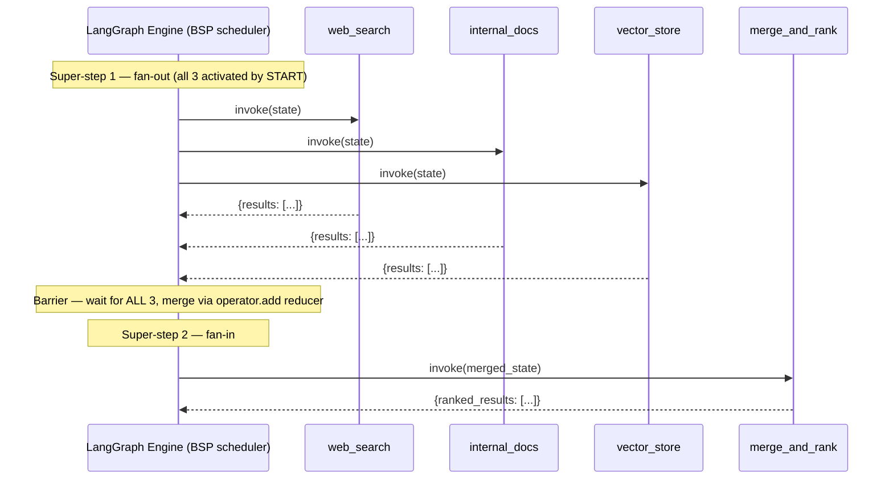
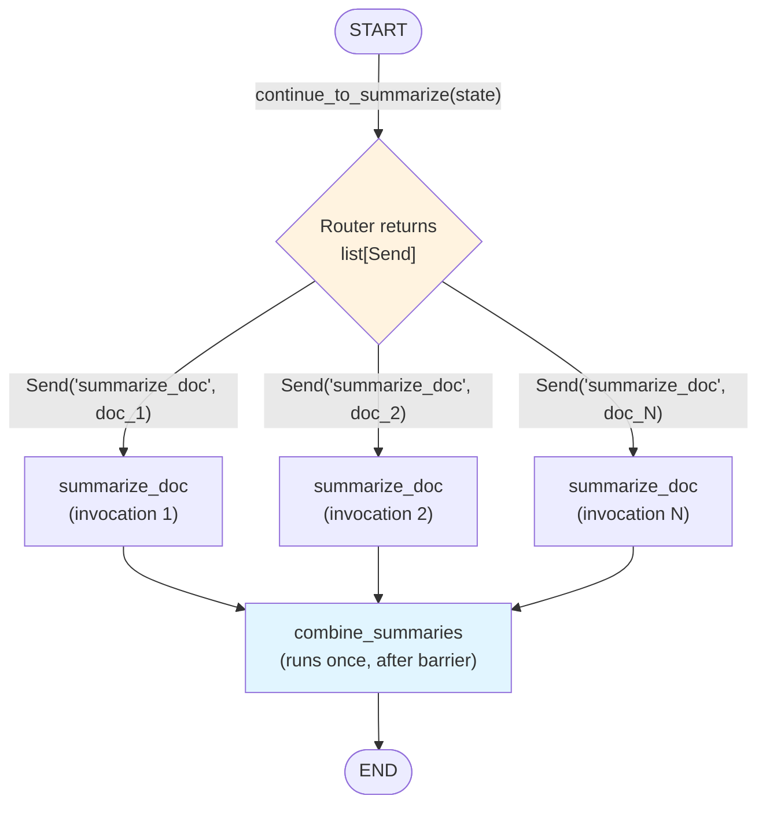

# Chapter 13: Parallel Execution

## Learning Objectives

By the end of this chapter, you will be able to:

- Explain precisely how LangGraph's super-step execution model enables true concurrent execution of multiple nodes, and why that concurrency is a natural consequence of the graph's Pregel-style Bulk Synchronous Parallel (BSP) design rather than a bolt-on feature
- Build a **static fan-out** graph where a fixed, known-at-definition-time set of nodes (e.g., Research, Search, Database, APIs) execute concurrently from a single super-step
- Build a **dynamic fan-out** graph using the `Send` API to spawn a runtime-determined number of parallel node invocations — the map-reduce pattern
- Explain **fan-in** as a synchronization barrier: how the engine waits for every concurrent branch to complete before advancing, and why this makes reducers (Chapter 6) mandatory rather than optional the moment you introduce parallel writes
- Diagnose and fix the single most common parallel-execution bug in LangGraph: an `InvalidUpdateError` caused by two concurrent branches writing to the same state key without a reducer
- Reason about performance and cost trade-offs unique to parallel graphs — LLM provider rate limits, database/API connection pool exhaustion, and tail latency from the slowest branch in a fan-in
- Design and implement two production-shaped systems: a **Parallel Search** aggregator and a **Multi-source QA** synthesizer, both built on fan-out/fan-in

---

## Prerequisites for the Chapter

This chapter is the opening chapter of **Phase 3: Advanced Patterns**, and it leans directly on two earlier chapters:

- **Chapter 7 (Compilation & Execution)** — you should already be comfortable with the idea that `graph.compile()` produces a runnable object whose `.invoke()` method executes the graph as a sequence of discrete **super-steps**, not as a single monolithic function call. If that term is fuzzy, Section 1 below re-derives it from scratch before building on it.
- **Chapter 6 (Reducers)** — you should already know that a state field can be annotated with a reducer function (e.g., `Annotated[list, operator.add]`) that controls how a new value is *combined with* the existing value, rather than replacing it outright. Parallel execution is the chapter where reducers stop being a nice-to-have and become load-bearing infrastructure — skip that chapter first if you haven't internalized how `Annotated` reducers work.

You should also be comfortable with:

- Python's `asyncio` model and the general idea of concurrent (not necessarily parallel-on-CPU) execution — LangGraph's concurrency is I/O-bound concurrency (waiting on LLM calls, HTTP requests, DB queries), the same category of problem `asyncio.gather` or a `ThreadPoolExecutor` solves in plain Python
- `TypedDict` state schemas and node functions that return partial state updates (Chapters 2–3)
- Conditional edges via `add_conditional_edges` (Chapter 4)

No new installation is required beyond the LangGraph package you've been using since Chapter 1. All code in this chapter is written by hand as illustrative reference — read it for the pattern, not as copy-paste-ready production code.

---

## 1. Recap: The Super-Step Model, and Where Parallelism Lives

LangGraph's execution engine is a **Pregel-style Bulk Synchronous Parallel (BSP)** system — the same execution model Google's Pregel paper (2010) popularized for large-scale graph processing, and the model Apache Spark's GraphX and Flink's Gelly also borrow from. Understanding this model is the entire key to understanding parallel execution, so it's worth re-deriving precisely.

When you call `graph.invoke(input)`, the engine does **not** walk the graph node-by-node like a call stack. Instead, execution proceeds in discrete rounds called **super-steps**:

1. At the start of a super-step, the engine has a set of nodes that are **active** — meaning something wrote to a channel (state key) that triggers them, in the *previous* super-step (or, for the first super-step, the nodes reachable directly from `START`).
2. **Every active node in the current super-step runs.** If there are four active nodes, all four run — concurrently, using the framework's internal task executor (an async event loop or thread pool, depending on how your nodes are defined and how you invoke the graph).
3. The engine waits for **all** active nodes in that super-step to finish. This is the "synchronous" part of BSP — it's a hard barrier. No node from super-step *N+1* starts before every node in super-step *N* has returned.
4. All the state updates produced by that super-step's nodes are merged into a single new state snapshot, using each field's reducer (identity/overwrite by default, or a custom reducer if the field is `Annotated`).
5. The engine computes the next set of active nodes based on the graph's edges and the just-applied state, and the cycle repeats — that's super-step *N+1*.

The crucial insight for this chapter: **concurrency in LangGraph is not something you turn on — it is the default consequence of more than one node being active in the same super-step.** If your graph is a straight line (A → B → C), each super-step has exactly one active node, so execution looks sequential. The instant your graph has a node with two or more outgoing edges to distinct downstream nodes, both downstream nodes become active in the *same* super-step — and the engine runs them concurrently without you writing a single line of `asyncio.gather` or threading code. Parallel execution in LangGraph is really just **graph topology plus the BSP scheduler already covered in Chapter 7** — this chapter is about deliberately shaping that topology.

```
Super-step 0:  [START]                              →  A becomes active
Super-step 1:  [A runs]                              →  writes trigger B, C, D
Super-step 2:  [B, C, D run concurrently]  ◄── fan-out, this chapter's subject
               (barrier: wait for all three)
Super-step 3:  [E runs]                              ◄── fan-in, merged via reducers
```

---

## 2. Fan-Out: One Node, Many Concurrent Successors

**Fan-out** is the pattern where a single node has edges to more than one distinct downstream node, causing all of those downstream nodes to become active — and therefore to execute concurrently — in the same super-step.

Mechanically, fan-out requires nothing exotic: it's just multiple calls to `add_edge` from the same source.

```python
from langgraph.graph import StateGraph, START, END

builder = StateGraph(ResearchState)

builder.add_node("research", research_node)
builder.add_node("search", search_node)
builder.add_node("database", database_node)
builder.add_node("apis", api_node)
builder.add_node("synthesize", synthesize_node)

# Fan-out: START has four outgoing edges, so all four nodes
# become active in the same super-step and run concurrently.
builder.add_edge(START, "research")
builder.add_edge(START, "search")
builder.add_edge(START, "database")
builder.add_edge(START, "apis")
```

There is nothing in this code that says "run these in parallel." The parallelism is an emergent property of the graph shape: `START` has four outgoing edges, so all four targets are activated by the same write, and the super-step scheduler runs all of them before advancing. Contrast this with:

```python
builder.add_edge(START, "research")
builder.add_edge("research", "search")
builder.add_edge("search", "database")
builder.add_edge("database", "apis")
```

Same four nodes, same node functions — but now each edge activates exactly one downstream node per super-step, so execution is strictly sequential. **The topology, not the node code, determines concurrency.** This is a different mental model than a typical Python service, where you explicitly write `await asyncio.gather(...)` to get concurrency; in LangGraph, you draw the concurrency into the graph, and the engine finds and exploits it automatically.

A node can also fan out **conditionally** — a router function attached via `add_conditional_edges` can return a list of destination node names instead of a single string, activating all of them:

```python
def route_to_all_sources(state: ResearchState) -> list[str]:
    # A static list known at definition time -- still fan-out,
    # just decided at runtime rather than hard-coded as edges.
    return ["research", "search", "database", "apis"]

builder.add_conditional_edges(START, route_to_all_sources,
                               ["research", "search", "database", "apis"])
```

This is still **static** fan-out in the sense this chapter uses the term: the *set of possible destinations* is fixed and enumerated at graph-definition time (the third argument to `add_conditional_edges`), even though the specific subset activated can vary per invocation. True *dynamic* fan-out — where the *number* of parallel invocations is unbounded and unknown until runtime — needs the `Send` API, covered in Section 5.

---

## 3. Fan-In: Barriers and Reducer-Based Merging

**Fan-in** is the mirror image of fan-out: multiple nodes all have edges into the same downstream node. The super-step barrier (Section 1, step 3) is what makes fan-in behave correctly: the downstream node does **not** run once per incoming edge. It becomes active exactly once, in the super-step *after* every one of its upstream branches has completed and written its update.

```python
builder.add_edge("research", "synthesize")
builder.add_edge("search", "synthesize")
builder.add_edge("database", "synthesize")
builder.add_edge("apis", "synthesize")
```

Given the fan-out from Section 2, this produces the following execution timeline:

- **Super-step 1**: `research`, `search`, `database`, `apis` all run concurrently.
- **Barrier**: the engine waits until all four have returned — even if `database` finishes in 50ms and `apis` takes 3 seconds, `synthesize` will not start until `apis` also finishes.
- **Super-step 2**: `synthesize` runs exactly once, with a state snapshot that reflects all four branches' writes merged together.

That merge step is where **reducers** (Chapter 6) go from "nice to have" to "mandatory." Here is the failure mode if you skip them. Suppose your state schema looks like this:

```python
class ResearchState(TypedDict):
    query: str
    findings: list[dict]   # <-- no Annotated reducer!
```

`findings` uses the default channel behavior: **LastValue** — a channel that holds a single value and accepts **at most one write per super-step**. If `research`, `search`, `database`, and `apis` *each* return `{"findings": [...]}` in the same super-step, the engine receives four concurrent writes to the same `LastValue` channel. LangGraph does not silently pick one and discard the rest — it raises immediately:

```
InvalidUpdateError: At key 'findings': Can receive only one value per step.
Use an Annotated key to handle multiple values.
```

This is the "conflict" this chapter's callback to Chapter 6 refers to: concurrent writers to an un-reduced key are a **hard runtime error**, not a quiet bug, *provided* you're on a plain field. (Some hand-written custom reducers or externally-mutated objects can still produce a silent last-write-wins effect if you're not careful — see Common Mistakes — so "always define a reducer for any key more than one concurrent branch might write" is the safe rule regardless of exactly how the failure manifests.) The fix is exactly the tool from Chapter 6: annotate the field with a reducer that knows how to combine multiple concurrent writes into one:

```python
from typing import Annotated
import operator

class ResearchState(TypedDict):
    query: str
    findings: Annotated[list[dict], operator.add]   # concatenates lists
```

Now, when `research`, `search`, `database`, and `apis` all return `{"findings": [x]}`, `{"findings": [y]}`, etc. in the same super-step, LangGraph calls `operator.add` pairwise across all the concurrent writes (conceptually `[] + [x] + [y] + [z] + [w]`) and the merged `findings` list contains all four branches' results by the time `synthesize` runs. This is the general contract:

> **Any state key that more than one concurrently-active node might write to in the same super-step must have a reducer.** Keys written by only one branch at a time (e.g., each branch writes to its own uniquely-named key) don't need one — the conflict only exists when two or more *simultaneous* writers target the *same* key.

---

## 4. Static Fan-Out vs. Dynamic Fan-Out: Two Different Problems

It's worth being precise about the distinction this chapter is built around, because the two cases call for genuinely different graph-construction techniques.

| | Static fan-out | Dynamic fan-out (`Send`) |
|---|---|---|
| **Number of parallel branches** | Fixed, known when you write the graph (e.g., always exactly 4: Research, Search, Database, APIs) | Variable, known only at runtime (e.g., "however many documents are in the list this invocation") |
| **How branches are declared** | `add_edge` (or a conditional edge returning a fixed list of names) to distinct, individually-named nodes | A single node type, invoked once per runtime item via `Send` objects |
| **Node identity** | Each branch is a semantically distinct node (`research`, `database`, ...) doing different work | Every parallel invocation runs the *same* node function on a different slice of data — the map half of map-reduce |
| **Graph shape** | Fixed shape drawn once, visible in the compiled graph diagram | Same fixed shape in the diagram (one "worker" node), but it fans out to N runtime instances invisible to the static diagram |
| **Typical use case** | "Always gather from these four known sources" | "Summarize each of these N retrieved documents" / "Score each of these N candidate answers" |

Static fan-out is what Section 2 already covered — you enumerate the parallel nodes by name in the graph definition, the same way you'd enumerate microservice calls in a fixed fan-out `asyncio.gather(fetch_a(), fetch_b(), fetch_c())`. It's the right tool whenever the *set* of parallel operations is a property of your system design, not your data.

Dynamic fan-out is a different shape of problem entirely: the *data itself* determines how many parallel units of work exist. You cannot `add_edge` your way to "one edge per item in a list whose length isn't known until the graph runs" — there's no way to declare an edge to a node that doesn't exist yet. This is exactly the gap the `Send` API closes.

---

## 5. The `Send` API in Depth

`Send` is LangGraph's mechanism for spawning a **runtime-determined number** of parallel invocations of the *same* node, each with its own distinct input. It is the primitive behind the classic **map-reduce** pattern: map a function over N items in parallel, then reduce (merge) the N results back into one.

```python
from langgraph.types import Send
```

A `Send` object is a small, self-contained instruction to the engine: *"activate this node, and pass it exactly this piece of state, independent of whatever the overall graph state currently holds."*

```python
Send(node="summarize_doc", arg={"content": "the text of one document..."})
```

You don't construct a `Send` inside a normal node's return value (a normal node returns a dict of state updates). Instead, you return a **list of `Send` objects** from a routing function attached with `add_conditional_edges` — the same mechanism used for conditional routing in Chapter 4, except this router returns `Send` instances instead of node-name strings:

```python
def continue_to_summarize(state: OverallState) -> list[Send]:
    return [
        Send("summarize_doc", {"content": doc})
        for doc in state["documents"]
    ]
```

If `state["documents"]` has 3 items, this returns 3 `Send` objects and `summarize_doc` becomes active 3 times in the same super-step — each with a *different*, isolated input (`{"content": doc}` for that specific document), not the full `OverallState`. If the list has 300 items, you get 300 concurrent invocations, still in one super-step, still without changing a single line of the node function or the graph's static structure. **The graph diagram itself never changes** — it always shows one `summarize_doc` node — but at runtime that one node fans out to however many `Send` calls the router produced. This is the core reason `Send` matters: it decouples "how many parallel workers exist" from "how the graph is drawn," which static `add_edge` fan-out cannot do.

Two details that trip up engineers coming from a normal Python fan-out background:

1. **The target node's input is *only* what you put in the `Send`'s `arg` dict**, not the full overall state, unless you explicitly include the fields you need. This is a deliberate isolation boundary — it keeps each parallel worker's input small and makes it obvious exactly what data crossed the fan-out boundary, similar to how you'd deliberately narrow the payload passed into a worker task in a job queue rather than handing it your entire application state.
2. **Results still merge through reducers**, exactly as in static fan-out. Whatever key `summarize_doc` writes to needs an `Annotated` reducer if more than one `Send` invocation writes to it concurrently — which, by definition, dynamic fan-out always does.

---

## 6. Full Worked Example: Map-Reduce Document Summarization with `Send`

This is the canonical dynamic fan-out shape: "summarize each of N documents in parallel," where N is whatever the caller passes in at runtime.

```python
from typing import TypedDict, Annotated
import operator

from langgraph.graph import StateGraph, START, END
from langgraph.types import Send
from langchain_anthropic import ChatAnthropic

llm = ChatAnthropic(model="claude-sonnet-4-5")


# --- State schemas -----------------------------------------------------

class OverallState(TypedDict):
    documents: list[str]                      # input: N documents, N unknown ahead of time
    summaries: Annotated[list[str], operator.add]   # reducer: concatenate concurrent writes
    final_report: str                         # written once, by a single downstream node


class DocState(TypedDict):
    # The isolated payload each parallel `summarize_doc` invocation receives --
    # deliberately narrow, not the full OverallState.
    content: str


# --- Nodes ---------------------------------------------------------------

def summarize_doc(state: DocState) -> dict:
    """Runs once per document, N times concurrently in the same super-step."""
    prompt = (
        "Summarize the following document in 2-3 sentences, "
        "focused on concrete facts:\n\n" + state["content"]
    )
    response = llm.invoke(prompt)
    # Each concurrent invocation writes ONE summary; the reducer concatenates
    # all of them into `summaries` once the super-step barrier clears.
    return {"summaries": [response.content]}


def combine_summaries(state: OverallState) -> dict:
    """Runs once, after every summarize_doc invocation has completed."""
    bullet_points = "\n".join(f"- {s}" for s in state["summaries"])
    return {"final_report": bullet_points}


# --- Routing function that performs the dynamic fan-out -------------------

def continue_to_summarize(state: OverallState) -> list[Send]:
    return [
        Send("summarize_doc", {"content": doc})
        for doc in state["documents"]
    ]


# --- Graph assembly --------------------------------------------------------

builder = StateGraph(OverallState)
builder.add_node("summarize_doc", summarize_doc)
builder.add_node("combine_summaries", combine_summaries)

# Dynamic fan-out: the number of "summarize_doc" activations equals
# len(state["documents"]) at runtime, not a number baked into the graph.
builder.add_conditional_edges(START, continue_to_summarize, ["summarize_doc"])

# Fan-in: every summarize_doc invocation (however many there were) feeds
# into the same downstream node, which runs exactly once after the barrier.
builder.add_edge("summarize_doc", "combine_summaries")
builder.add_edge("combine_summaries", END)

graph = builder.compile()

result = graph.invoke({
    "documents": [
        "Q3 revenue grew 12% year-over-year, driven by...",
        "The engineering team migrated the primary datastore to...",
        "Customer churn declined for the third consecutive quarter...",
    ]
})
print(result["final_report"])
```

Walk through what happens at runtime with these three documents:

1. **Super-step 1**: `START` activates the router `continue_to_summarize`, which reads `len(state["documents"]) == 3` and returns three `Send("summarize_doc", {...})` objects.
2. **Super-step 2**: `summarize_doc` becomes active **three times**, each with a different `content` value, and all three run concurrently (three LLM calls in flight at once). Each returns `{"summaries": [one_summary]}`.
3. **Barrier**: the engine waits for all three LLM calls to return, then applies `operator.add` across the three concurrent writes — `summaries` ends up holding all three summaries, in the order the engine received the writes (LangGraph does not guarantee wall-clock completion order maps to list order in every version, so if downstream order matters, carry an explicit index/id alongside each summary rather than relying on list position).
4. **Super-step 3**: `combine_summaries` becomes active exactly once, sees `summaries` with all three entries populated, and writes `final_report`.

Swap the input to 300 documents and not one line of this code changes — the router simply returns 300 `Send` objects instead of 3, and the engine fans out to 300 concurrent `summarize_doc` invocations (subject to the concurrency controls discussed next).

---

## 7. Performance and Cost Considerations for Parallel Graphs

Concurrency is "free" in the sense that LangGraph's scheduler gives it to you automatically from graph topology, but the *work* that concurrency triggers is never free. Three concrete constraints dominate in practice.

### 7.1 LLM provider rate limits

Every LLM API enforces limits, typically expressed as requests-per-minute (RPM) and tokens-per-minute (TPM). A `Send`-based fan-out over 300 documents means up to 300 near-simultaneous completion requests. Even if your account's RPM ceiling is generous, TPM is usually the binding constraint for anything beyond short prompts, and a burst of 300 concurrent calls will almost always trigger `429 Too Many Requests` responses well before the average, non-parallel throughput would.

Practical mitigations:

- **Bound the concurrency explicitly.** LangGraph's `invoke`/`stream`/`ainvoke` calls accept a `config` dict, and `max_concurrency` in that config caps how many tasks the internal executor runs at once *within a super-step* — it does not change your graph, only how much of the fan-out the engine executes simultaneously:

  ```python
  result = graph.invoke(
      {"documents": big_list_of_300_docs},
      config={"max_concurrency": 8},
  )
  ```

  With this in place, LangGraph still recognizes 300 active `summarize_doc` tasks in the super-step, but only runs 8 at a time, queuing the rest — the same idea as `asyncio.Semaphore(8)` wrapped around a `gather`, but expressed as executor configuration rather than code inside your nodes.
- **Batch items before dispatching `Send`.** Instead of one `Send` per document, group documents into chunks of, say, 10 and summarize each chunk in one call — trading some per-call quality/precision for a 10x reduction in call count.
- **Respect provider-side retry-after semantics.** If you do hit 429s, make sure your LLM client's retry/backoff configuration (most LangChain chat model wrappers expose `max_retries` and honor `Retry-After` headers) is tuned for burst traffic, not just steady-state traffic — a naive fixed backoff across 300 simultaneously-throttled calls can create a synchronized "thundering herd" retry storm that just re-triggers the same 429s.

### 7.2 Database and API connection pools

The same reasoning applies to nodes that hit a database or internal API rather than an LLM. If four static fan-out branches each open a database connection, and your connection pool (e.g., SQLAlchemy's `pool_size`, or a MongoDB driver's `maxPoolSize`) is sized for sequential access patterns, a burst of concurrent graph invocations (multiple users, each triggering a 4-way fan-out) can exhaust the pool — new requests block waiting for a free connection, or fail outright with a pool-timeout exception.

The sizing exercise is straightforward but easy to skip: if your graph fans out to *K* concurrent DB-touching nodes, and you expect *C* concurrent graph invocations under load, your connection pool needs headroom for roughly `K × C` simultaneous connections (with slack for retries and other services sharing the same pool) — not just `C`. Dynamic fan-out via `Send` makes this arithmetic harder because *K* is runtime-dependent; this is another argument for capping `max_concurrency` on any graph whose fan-out width touches a shared, finite resource like a connection pool, not just on LLM-calling graphs.

### 7.3 Tail latency from the slowest branch

Because fan-in is a hard barrier, **the wall-clock time of a fan-in step equals the time of its slowest branch, not its average branch.** Four branches that each normally take ~300ms will make your `synthesize` step take ~300ms — until the one day the `database` branch times out after 10 seconds, and your entire graph invocation now takes 10 seconds even though three of the four branches were fast. Reasoning about parallel-graph latency means reasoning about your *slowest* dependency's worst case, not your average case — the same lesson that applies to `asyncio.gather` in any other Python service. Per-branch timeouts (Chapter 18 covers this in the broader error-handling context) and a documented fallback value for a timed-out branch (e.g., `database` contributes an empty list rather than blocking `synthesize` indefinitely) are the standard mitigation.

---

## Examples

### Project: Parallel Search

**Goal:** query multiple search backends concurrently (say, a web search API, an internal document index, and a vector store) and merge their results into one ranked list, faster than querying them one at a time.

```python
from typing import TypedDict, Annotated
import operator

from langgraph.graph import StateGraph, START, END


class SearchState(TypedDict):
    query: str
    results: Annotated[list[dict], operator.add]   # each backend appends its hits
    ranked_results: list[dict]


def web_search_node(state: SearchState) -> dict:
    hits = web_search_client.search(state["query"], top_k=5)   # illustrative call
    return {"results": [{"source": "web", **h} for h in hits]}


def internal_docs_node(state: SearchState) -> dict:
    hits = document_index.search(state["query"], top_k=5)
    return {"results": [{"source": "internal_docs", **h} for h in hits]}


def vector_store_node(state: SearchState) -> dict:
    hits = vector_store.similarity_search(state["query"], k=5)
    return {"results": [{"source": "vector_store", **h} for h in hits]}


def merge_and_rank(state: SearchState) -> dict:
    # A simple example ranker: sort the merged results by their own
    # backend-reported relevance score, descending.
    ranked = sorted(state["results"], key=lambda r: r.get("score", 0), reverse=True)
    return {"ranked_results": ranked[:10]}


builder = StateGraph(SearchState)
builder.add_node("web_search", web_search_node)
builder.add_node("internal_docs", internal_docs_node)
builder.add_node("vector_store", vector_store_node)
builder.add_node("merge_and_rank", merge_and_rank)

# Static fan-out: three known search backends, always queried together.
builder.add_edge(START, "web_search")
builder.add_edge(START, "internal_docs")
builder.add_edge(START, "vector_store")

# Fan-in: merge_and_rank waits for all three backends.
builder.add_edge("web_search", "merge_and_rank")
builder.add_edge("internal_docs", "merge_and_rank")
builder.add_edge("vector_store", "merge_and_rank")
builder.add_edge("merge_and_rank", END)

graph = builder.compile()

output = graph.invoke({"query": "connection pool exhaustion troubleshooting"})
for r in output["ranked_results"]:
    print(r["source"], r.get("score"), r.get("title"))
```

Without the `Annotated[list[dict], operator.add]` reducer on `results`, this graph would raise `InvalidUpdateError` the first time it ran — all three search nodes write to `results` in the same super-step. This is exactly the scenario the fan-in reducer discussion in Section 3 was building toward.

### Project: Multi-source QA

**Goal:** answer a user's question by concurrently querying an unstructured document store, a SQL database, and an internal REST API, then synthesizing a single coherent answer from all three sources — even though the three sources have entirely different shapes (text passages, rows, JSON).

```python
from typing import TypedDict, Annotated, Optional
import operator

from langgraph.graph import StateGraph, START, END
from langchain_anthropic import ChatAnthropic

llm = ChatAnthropic(model="claude-sonnet-4-5")


class QAState(TypedDict):
    question: str
    doc_context: Annotated[list[str], operator.add]
    sql_context: Annotated[list[str], operator.add]
    api_context: Annotated[list[str], operator.add]
    answer: Optional[str]


def query_documents(state: QAState) -> dict:
    passages = vector_store.similarity_search(state["question"], k=4)
    return {"doc_context": [p.page_content for p in passages]}


def query_sql(state: QAState) -> dict:
    # In production: an LLM-generated, validated, read-only query,
    # or a fixed parameterized query template -- see Chapter 8 for
    # tool-calling patterns that generate this safely.
    rows = sql_db.run(build_safe_query(state["question"]))
    return {"sql_context": [str(row) for row in rows]}


def query_internal_api(state: QAState) -> dict:
    response = internal_api_client.get("/lookup", params={"q": state["question"]})
    return {"api_context": [response.text]}


def synthesize_answer(state: QAState) -> dict:
    context = (
        "Document excerpts:\n" + "\n".join(state["doc_context"]) +
        "\n\nDatabase rows:\n" + "\n".join(state["sql_context"]) +
        "\n\nAPI results:\n" + "\n".join(state["api_context"])
    )
    prompt = (
        f"Using ONLY the context below, answer the question.\n\n"
        f"Question: {state['question']}\n\nContext:\n{context}"
    )
    response = llm.invoke(prompt)
    return {"answer": response.content}


builder = StateGraph(QAState)
builder.add_node("query_documents", query_documents)
builder.add_node("query_sql", query_sql)
builder.add_node("query_internal_api", query_internal_api)
builder.add_node("synthesize_answer", synthesize_answer)

builder.add_edge(START, "query_documents")
builder.add_edge(START, "query_sql")
builder.add_edge(START, "query_internal_api")

builder.add_edge("query_documents", "synthesize_answer")
builder.add_edge("query_sql", "synthesize_answer")
builder.add_edge("query_internal_api", "synthesize_answer")

builder.add_edge("synthesize_answer", END)

graph = builder.compile()

result = graph.invoke({"question": "Why did our checkout API latency spike last Tuesday?"})
print(result["answer"])
```

Notice each source gets its **own** state key (`doc_context`, `sql_context`, `api_context`) rather than all three writing into one shared `context` key. This sidesteps the need to reason about interleaving three heterogeneous data shapes through a single reducer, and it makes `synthesize_answer`'s job explicit: read three clearly-labeled context lists rather than one commingled list where the source of each item is ambiguous. This is a deliberate design choice worth calling out — when branches produce structurally different data, prefer separate keys over forcing everything through one reducer.

---

## Diagrams

Static fan-out / fan-in, as a super-step timeline (the "Parallel Search" project from above):



Dynamic fan-out with `Send` — the graph's static shape never changes, but the number of concurrent worker activations is decided at runtime:



---

## Real-World Scenarios

**Scenario 1 — The rate-limit storm.** A team builds a "research assistant" feature that fans out with `Send` over every URL found by an initial search step, running a `scrape_and_summarize` node once per URL. In testing with 5-10 URLs, it works flawlessly and feels satisfyingly fast. In production, a broad query returns 240 URLs, the router emits 240 `Send` objects, and the graph attempts 240 near-simultaneous LLM summarization calls. The team's LLM provider account has a TPM ceiling tuned for their historical sequential usage pattern; within seconds, the majority of the 240 calls come back as `429` errors. Their LLM client's default retry logic (fixed 1-second backoff, 3 retries) retries all 240 failed calls at roughly the same moment, which is still well above the TPM ceiling — a synchronized retry storm that never actually converges. The fix has three parts: cap `max_concurrency` in the invoke config to a number comfortably under the provider's burst tolerance (e.g., 10), switch the retry policy to exponential backoff with jitter so retries desynchronize, and pre-filter/deduplicate URLs before the fan-out so 240 rarely happens in the first place. The lesson generalizes: **`Send` makes it trivially easy to construct a fan-out whose width is entirely a function of upstream data you don't control** — always assume that width can spike, and always bound it explicitly rather than trusting it'll usually be small.

**Scenario 2 — The silent tail-latency bottleneck.** A "Multi-source QA" system (like the project above) queries a document store, a SQL warehouse, and an internal API concurrently, and users report the feature "feels slow" despite the team's dashboards showing the LLM synthesis call itself is fast. Tracing (Chapter 20 covers this properly) reveals the SQL branch occasionally takes 8-12 seconds when the analytics warehouse is under batch-job load, while the other two branches consistently finish in under 500ms — and because `synthesize_answer` is a fan-in barrier, the entire request waits for the slowest branch every single time, even though two-thirds of the context was ready in half a second. The fix: add a per-branch timeout around the SQL node (Chapter 18) with a documented fallback (`sql_context: []` plus a note in the synthesized answer that database context was unavailable), so the fan-in barrier is bounded by an explicit maximum rather than by whatever the warehouse happens to be doing that day. This is the parallel-execution-specific version of a lesson every backend engineer already knows from `Promise.all`/`asyncio.gather`: **a fan-in's latency is its slowest branch's latency, and an unbounded slow branch is an unbounded latency budget.**

---

## Best Practices

- **Choose static fan-out when the set of parallel branches is a design decision, and `Send` when it's a data-dependent quantity.** If you find yourself trying to `add_edge` in a loop over data read from state at import time, that's a signal you actually need `Send`.
- **Always annotate any state key that more than one concurrently-active node might write to.** Treat this as a checklist item every time you add a new fan-out branch — it's the single most common source of `InvalidUpdateError`.
- **Prefer separate, uniquely-named keys per branch over one shared key when branches produce structurally different data** (as in the Multi-source QA project) — it keeps the fan-in node's logic explicit and avoids forcing a reducer to merge apples and oranges.
- **Bound concurrency explicitly with `max_concurrency`** whenever a fan-out's width can scale with data (any `Send`-based graph, and any static fan-out invoked at meaningful request volume) rather than trusting the default executor behavior to be safe for your provider's rate limits or your connection pool's size.
- **Size connection pools and rate-limit budgets for `K × C`**, not `C` — the number of concurrent branches per invocation multiplied by the number of concurrent invocations your service handles, not just the invocation count alone.
- **Give every fan-out branch that touches an external dependency a timeout and an explicit fallback value**, so the fan-in barrier has a bounded worst case instead of inheriting whatever the slowest dependency's worst case happens to be that day.
- **Keep `Send` payloads narrow.** Pass only the fields the worker node actually needs, not the entire overall state — it keeps the isolation boundary between the dispatcher and its workers clear and avoids inadvertently duplicating large state blobs across hundreds of concurrent invocations.
- **Design node functions to be safe to run concurrently and safe to retry** — avoid mutating shared external resources with side effects that aren't idempotent, since a retried or re-scheduled parallel branch may run more than once in failure-recovery scenarios (Chapter 9, Chapter 18).

---

## Common Mistakes

- **Writing to the same state key from two or more concurrently-active nodes without a reducer.** This is the headline mistake of this entire chapter — it manifests as an `InvalidUpdateError` the moment more than one branch fires in the same super-step, often the first time a code path that "worked in testing" (where only one branch happened to write) hits a real fan-out with multiple simultaneous writers.
- **Assuming a specific completion order across parallel branches.** Nothing about fan-out guarantees `research` finishes before `search`, or that reducer-merged list entries land in a predictable order. If downstream logic needs to know which branch produced which entry, carry an explicit tag/id in the data itself rather than relying on position or timing.
- **Unbounded `Send` fan-out over attacker- or user-controlled data.** A router that does `[Send("worker", {"item": x}) for x in state["items"]]` with no cap on `len(state["items"])` turns any upstream data source that can grow unexpectedly (a scraped URL list, a user-uploaded file with thousands of rows) into an uncapped concurrency spike against your LLM provider or your database.
- **Mutating a shared mutable object across concurrent branches instead of returning a new state slice.** If a node holds a reference to a list or dict from the incoming state and mutates it in place rather than returning a new value, concurrent branches sharing that reference can race with each other in ways that bypass the reducer entirely and produce nondeterministic results.
- **Believing the `Send` target automatically receives the full graph state.** It only receives the `arg` dict you constructed. Code that expects `state["question"]` to be present inside a `Send`-dispatched worker node will fail with a `KeyError` unless you explicitly included `question` in that `Send`'s payload.
- **Ignoring tail latency in fan-in design.** A fan-in step is only as fast as its slowest concurrent branch; a single flaky or occasionally-slow dependency among four fast ones silently sets the whole graph's latency ceiling if no per-branch timeout exists.
- **Fanning out to more concurrent DB/API connections than your connection pool supports**, causing pool-exhaustion errors or timeouts under load that never appeared in single-user local testing (where fan-out width was small relative to the pool).

---

## Summary

- LangGraph's execution engine is a **Pregel-style BSP scheduler** (recap of Chapter 7): work proceeds in **super-steps**, and every node active in the same super-step runs concurrently, followed by a hard synchronization barrier before the next super-step begins. Parallel execution is an emergent property of graph topology, not a special mode you opt into.
- **Fan-out** is a single node (or `START`) having edges to multiple distinct downstream nodes, activating all of them in the same super-step. **Fan-in** is multiple nodes converging on the same downstream node, which runs exactly once, after the barrier confirms every upstream branch has completed.
- **Reducers (Chapter 6) are mandatory, not optional, for any state key more than one concurrent branch might write to.** Without one, concurrent writes to the same key raise `InvalidUpdateError` — a hard, explicit failure, not a silent overwrite, provided you're relying on the default `LastValue` channel behavior.
- **Static fan-out** (fixed, known-at-definition-time parallel nodes, wired with `add_edge`) is the right tool when the set of parallel operations is a design decision. **Dynamic fan-out via the `Send` API** is the right tool for the map-reduce pattern — spawning a runtime-determined number of parallel invocations of the *same* node, one per item in a list whose length isn't known until the graph runs.
- A `Send("worker_node", {"item": x})` object activates `worker_node` once per `Send` returned by a routing function attached with `add_conditional_edges`, each with an isolated payload; results merge back through the same reducer mechanism as static fan-out.
- Parallel graphs introduce real-world constraints that sequential graphs don't: **LLM provider rate limits** (bounded with `max_concurrency` and backoff/jitter), **database/API connection pool sizing** (`K × C` arithmetic), and **tail latency from the slowest branch** in any fan-in (bounded with per-branch timeouts and fallbacks).
- The **Parallel Search** and **Multi-source QA** patterns are the two canonical shapes of static fan-out/fan-in in production: aggregate-and-rank from homogeneous sources, and synthesize-from-heterogeneous-sources, respectively.

---

## Knowledge Check

1. Explain, in terms of the super-step model, why a graph shaped `A → B`, `A → C` causes `B` and `C` to run concurrently, while a graph shaped `A → B → C` does not — even though both graphs contain the exact same three nodes.
2. A teammate adds a fourth static fan-out branch to an existing three-branch research graph and doesn't touch the state schema. On the very first test run, the graph raises `InvalidUpdateError` at a state key named `findings`. What exactly happened, and what's the one-line fix?
3. Describe the difference between static fan-out and dynamic fan-out with `Send` in terms of what is "known at graph-definition time" versus "known only at runtime." Give an example use case for each that would be awkward or impossible to implement with the other technique.
4. In the map-reduce `Send` example in Section 6, what data does `summarize_doc` actually receive as its input state, and why does it not simply receive the full `OverallState`?
5. Your `Send`-based fan-out summarizes a variable number of documents per request, and you've observed occasional `429` errors from your LLM provider under load. Name two independent mitigations from Section 7.1 you could apply, and explain what each one actually bounds.
6. A fan-in node that merges four concurrent branches occasionally takes 12 seconds even though three of the four branches reliably finish in under a second. Explain why this happens in terms of the barrier semantics of fan-in, and describe the standard mitigation.

---

## Hands-on Exercises

1. **Build the Parallel Search project.** Implement the graph from the Examples section with three "backends" (they can be simple mock functions that `time.sleep` a random short duration and return canned results — no real search API required). Verify that: (a) removing the `Annotated[list[dict], operator.add]` reducer from `results` causes an `InvalidUpdateError` when you invoke the graph, and (b) restoring the reducer fixes it. Then instrument each mock backend with a timestamp print at start and end, and confirm from the printed timestamps that all three run concurrently rather than sequentially.

2. **Build the Multi-source QA project with a `Send`-based twist.** Instead of exactly three fixed sources, generalize `query_documents` into a `Send`-based fan-out that queries N different document collections (e.g., "product_docs", "legal_docs", "support_tickets" — however many are configured at runtime), each via its own `Send("query_collection", {"collection_name": name, "question": q})` invocation, merging all their results into one reducer-backed key alongside the (still-static) SQL and API branches. This exercise deliberately mixes static and dynamic fan-out in one graph — a common real-world combination.

3. **Simulate and fix a rate-limit storm.** Write a mock "LLM client" function that raises an exception (simulating a `429`) if more than `K` calls are in flight simultaneously (track in-flight count with a shared counter guarded by a lock/semaphore for the simulation). Build a `Send`-based fan-out over 50 synthetic "documents" calling this mock client with no concurrency limit and observe it fail. Then apply `config={"max_concurrency": <K-1>}` on `graph.invoke(...)` and confirm the failures disappear. Write a short note on how you'd choose the right `max_concurrency` value against a real provider's published rate limits.

---

## Further Reading

- [LangGraph Documentation — Graph API overview](https://docs.langchain.com/oss/python/langgraph/overview) — official reference for `StateGraph`, `add_edge`, and `add_conditional_edges`
- [LangGraph Application Structure Guide](https://docs.langchain.com/oss/python/langgraph/application-structure) — how graph topology decisions (including fan-out/fan-in shape) affect application structure at scale
- [LangGraph GitHub Repository](https://github.com/langchain-ai/langgraph) — source of truth for the `Send` type (`langgraph.types.Send`) and the Pregel-based executor implementation
- Malewicz et al., *"Pregel: A System for Large-Scale Graph Processing"* (2010) — the original Bulk Synchronous Parallel paper that LangGraph's super-step execution model is directly descended from
- Valiant, L. G., *"A Bridging Model for Parallel Computation"* (1990) — the foundational BSP paper defining the compute/communicate/barrier-synchronize cycle underlying super-step execution
- Related chapter in this course: **[Chapter 6: Reducers](./06-reducers.md)** — full treatment of reducer semantics, custom reducer functions, and channel types
- Related chapter in this course: **[Chapter 7: Compilation & Execution](./07-compilation-and-execution.md)** — the super-step loop, recursion limits, and `.compile()`/`.invoke()` mechanics this chapter builds on
- Related chapter in this course: **[Chapter 18: Error Handling & Resilience](./18-error-handling-and-resilience.md)** — per-branch timeouts, retries, and fallback strategies referenced in Section 7.3

---

<div style="display:flex;justify-content:space-between;align-items:center;">
  <a href="./12-human-in-the-loop.md">← Previous: Human-in-the-Loop</a>
  <a href="./00-index.md">🏠 Index</a>
  <a href="./14-multi-agent-systems.md">Next: Multi-Agent Systems →</a>
</div>
