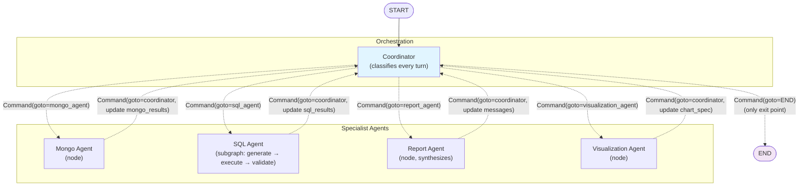
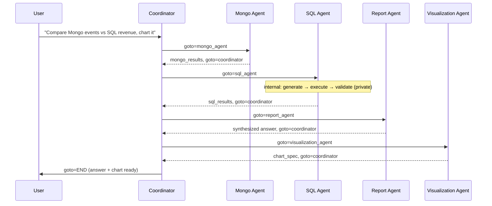

# Chapter 14: Multi-Agent Systems

> "A team of specialists, each doing one thing well, beats a generalist trying to do everything." — the entire premise of this chapter

## Learning Objectives

By the end of this chapter, you will be able to:

- Explain, with concrete symptoms, why a single agent's tool list and system prompt eventually become a reliability liability, and recognize the warning signs in your own systems
- Design a coordinator/supervisor node that uses `Command(goto=...)` to dispatch a request to the right specialized sub-agent
- Decide, for any given sub-agent, whether it should be a single node or a compiled subgraph
- Design a multi-agent state schema that correctly separates **shared** state (conversation, cross-agent results) from **agent-private** state (internal tool-call scratchpads)
- Implement both major handoff styles — **supervisor-decides** (centralized classification) and **explicit handoff** (agents nominate their own successor via handoff tools) — and articulate the trade-offs between them
- Architect a production-shaped multi-agent system — the "Multi-Agent Analytics Assistant" — with a Coordinator, a Mongo Agent, a SQL Agent, a Report Agent, and a Visualization Agent
- Diagnose and prevent the three most common multi-agent failure modes: state key collisions, infinite handoff loops, and unclear termination ownership

---

## Prerequisites for the Chapter

This chapter assumes you're comfortable with everything through Phase 3's parallel-execution material. Specifically:

- **Chapter 2 (StateGraph & State Management)** and **Chapter 6 (Reducers)** — you need to understand `TypedDict` state schemas and reducers like `add_messages`, because multi-agent state design is really just reducer design applied across agent boundaries.
- **Chapter 3 (Nodes)** — a sub-agent, in the simplest case, is just a node with an LLM call and some tool calls inside it. Nothing new is required to build one.
- **Chapter 5 (Commands & Dynamic Control)** — this chapter leans on `Command(goto=..., update=...)` constantly. If the mental model of "a node can decide its own successor and mutate state in the same return statement" isn't solid yet, go back to Chapter 5 before continuing; the coordinator pattern below is that mechanism applied at the architectural level rather than the single-branch level.
- **Chapter 8 (Tool Calling Patterns)** — you should already know `bind_tools`, `ToolNode`, and the ReAct loop; specialized agents are ReAct loops with a deliberately narrow toolset.
- **Chapter 9 (Checkpointing)** — production multi-agent systems run inside a single checkpointed thread across many turns and handoffs; understanding that the checkpoint captures the *whole graph's* state, not just one agent's, matters for the pitfalls discussed later.
- **Chapter 13 (Parallel Execution)** is a useful contrast, not a hard dependency: parallel execution fans the *same* task out to multiple concurrent nodes and merges results with reducers. Multi-agent systems instead route a *single* task to exactly one (or a short sequence of) specialized agents. Both use the same state-schema machinery; the difference is fan-out-and-merge versus classify-and-dispatch.

No new installation is required beyond what earlier chapters already set up (`langgraph`, `langchain-core`, and whichever chat model integration you're using — this chapter's examples use a generic `init_chat_model`-style call and, where relevant, `ChatBedrockConverse`, to mirror the AWS Bedrock-based stack this course assumes many readers are refactoring).

---

## 1. Why Multi-Agent: The Single-Agent Ceiling

Every LangGraph system in this course so far has had one "brain" — one system prompt, one bound tool list, one node (or ReAct loop) deciding what to do next. That works remarkably well until the assistant's job grows. Consider a realistic trajectory, one many production teams live through:

**Month 1**: An assistant answers questions about MongoDB-backed operational data — devices, users, events. Three tools, a tight 200-word system prompt. Reliable.

**Month 3**: The team adds SQL analytics — a data warehouse with aggregated metrics. Now the agent has 3 Mongo tools + 4 SQL tools. The system prompt grows to explain when to use which store ("if the question is about a specific device's live status, use Mongo; if it's about trends over the last quarter, use the warehouse..."). Still mostly reliable, but the model occasionally reaches for the wrong tool.

**Month 6**: Someone asks for chart output. Two more tools appended (`generate_bar_chart`, `generate_time_series`). The prompt now has a paragraph about when to visualize versus when to answer in text.

**Month 9**: Product wants narrative "report" style answers that combine multiple data sources with commentary. No new tools this time, but a much longer set of instructions bolted onto the same prompt describing tone, structure, and citation style for reports.

By month 9 you have one agent with 9+ tools, a 1500-word system prompt trying to cover four distinct jobs, and a support team starting to notice a pattern: the assistant sometimes queries SQL when the user clearly meant live Mongo state, sometimes emits a chart nobody asked for, sometimes skips the report-style synthesis the user wanted. None of these are model bugs — they are **prompt and tool-list bloat**. Every added instruction has to compete for the model's attention with every other instruction already there, and every added tool increases the chance of a wrong tool-call at decision time. This is the same problem you'd see in a human org chart: one person can be a competent generalist for a while, but past a certain scope, you don't get a better generalist by handing them a longer job description — you hire specialists.

### 1.1 The symptoms that tell you it's time to split

You don't need a hard rule ("more than N tools → split"), but these symptoms are reliable signals:

| Symptom | What it means |
|---|---|
| The system prompt has multiple "if the user is asking about X, do Y; if about Z, do W" branches | You've encoded routing logic in prose instead of in code — the LLM is now doing your `if` statements probabilistically |
| Tool-call accuracy (right tool, right arguments) degrades as you add unrelated tools | Tool selection is itself a classification problem, and classification accuracy drops as class count and inter-class similarity grow |
| Changing behavior for one domain (e.g., "make SQL answers cite the query") risks regressing an unrelated domain (e.g., Mongo answers) | Everything shares one prompt, so every edit is a shared-blast-radius edit |
| You keep adding "don't do X unless Y" guardrail sentences | You're patching over misclassification with more prose, which itself competes for attention budget |
| Testing requires exercising every domain to catch a regression in any one domain | There's no isolation boundary — one system, one giant test surface |

### 1.2 The fix: narrow, focused specialists

The multi-agent answer is the same one your org chart already uses: decompose the single generalist into narrow specialists, each with:

- A **short, single-purpose system prompt** ("You answer questions about live operational data in MongoDB. You do not have access to historical aggregates.")
- A **small, coherent tool list** (2–5 tools that all belong to the same domain)
- A **clear contract**: what it's given, what it's expected to return, and who it hands control back to

...and a **coordinator** in front of them that does nothing except decide which specialist should handle the current step. This buys you three things directly:

1. **Reliability** — each agent's decision space (which tool, which argument) is small and internally consistent, so tool-call accuracy goes up.
2. **Maintainability** — you can rewrite the SQL agent's prompt to fix a SQL-specific bug without touching the Mongo agent's prompt or its tests.
3. **Testability** — each agent is independently unit-testable (a theme this course returns to in Chapter 17) with a narrow, enumerable set of expected behaviors, instead of one sprawling integration test that has to cover every domain at once.

The cost is real too — you now have an orchestration layer to design and more moving parts to reason about. That orchestration layer is the subject of the rest of this chapter.

---

## 2. Modeling Agents: Nodes vs. Subgraphs

Once you've decided to split a monolithic agent into specialists, you have a modeling choice for *each* specialist: is it simple enough to be a single node, or does it need the full machinery of a compiled subgraph?

**A node-modeled agent** is a single Python function (or a single `create_react_agent`-style prebuilt) that does an LLM call, maybe executes a handful of tool calls inline or via an internal loop bounded by a fixed number of iterations, and returns a `Command` pointing back to the coordinator. It has no independent graph structure — from the parent graph's point of view, it's one super-step (or a small, fixed number of super-steps if it loops internally using plain Python, not LangGraph edges).

**A subgraph-modeled agent** is its own compiled `StateGraph` — with its own nodes, its own conditional edges, potentially its own retry loops, its own checkpointing behavior — that is added to the parent graph as a single node (`builder.add_node("sql_agent", sql_subgraph)`). From the parent's perspective it still looks like one node; internally, it can be arbitrarily complex.

Chapter 15 covers subgraph mechanics — state schema translation, private vs. shared channels between parent and child, and streaming through subgraph boundaries — in full depth. For this chapter, what matters is the **decision rule**:

| Signal | Model as a node | Model as a subgraph |
|---|---|---|
| Internal steps | One LLM call, maybe one round of tool calls | Multiple LLM calls with real branching (generate → validate → retry) |
| Retry/self-correction logic | None, or a fixed small Python loop | Needs LangGraph-level conditional routing to retry a step |
| Internal state | Fits entirely in the parent's state schema | Needs private fields the parent shouldn't see (e.g., a query-attempt counter, intermediate failed SQL strings) |
| Reusability | Used only inside this one graph | Valuable to compile and reuse independently, or unit test in isolation (Chapter 17) |
| Team ownership | One person/team owns the whole agent | A dedicated team owns this agent as its own artifact with its own release cycle |

A good rule of thumb for this course's running example: the **Mongo Agent**, which does one bounded lookup against a known set of collections, is simple enough to be a single node. The **SQL Agent**, which realistically needs to generate a query, execute it, check whether the result looks sane, and retry with a corrected query on failure, has real internal branching — that's a subgraph. You'll see both modeled explicitly in Section 6 and the Examples section below.

---

## 3. The Coordinator/Supervisor Pattern

The coordinator (sometimes called a supervisor) is a node whose entire job is routing. It doesn't answer the user's question itself; it looks at the current state — usually the latest human message plus whatever results have accumulated so far — and decides which specialist should act next, using the `Command(goto=...)` mechanism from Chapter 5.

```python
from typing import Annotated, Literal, Optional
from typing_extensions import TypedDict

from langchain_core.messages import AIMessage, BaseMessage, SystemMessage
from langgraph.graph import END, START, StateGraph
from langgraph.graph.message import add_messages
from langgraph.types import Command


class AnalyticsState(TypedDict):
    messages: Annotated[list[BaseMessage], add_messages]
    next_agent: Optional[str]
    mongo_results: Optional[dict]
    sql_results: Optional[dict]
    chart_spec: Optional[dict]
    active_agent: Optional[str]
    handoff_count: int


COORDINATOR_SYSTEM_PROMPT = """You are the routing coordinator for an analytics assistant.
You never answer the user directly. Your only job is to decide which specialist
should act next, given the conversation so far and what has already been gathered.

Specialists available:
- MONGO: live/operational data stored in MongoDB (devices, users, current status, recent events)
- SQL: historical/aggregated analytics from the SQL data warehouse (trends, rollups, revenue)
- REPORT: synthesizes MongoDB and/or SQL findings into a single narrative answer for the user
- VIZ: turns tabular results already gathered into a chart specification
- DONE: the user's question has been fully answered and no further work is needed

Respond with exactly one word: MONGO, SQL, REPORT, VIZ, or DONE.
"""

ROUTE_TO_NODE = {
    "MONGO": "mongo_agent",
    "SQL": "sql_agent",
    "REPORT": "report_agent",
    "VIZ": "visualization_agent",
    "DONE": END,
}

MAX_HANDOFFS = 8  # circuit breaker — see Section 9


def coordinator(state: AnalyticsState) -> Command[
    Literal["mongo_agent", "sql_agent", "report_agent", "visualization_agent", "__end__"]
]:
    if state.get("handoff_count", 0) >= MAX_HANDOFFS:
        return Command(
            goto=END,
            update={
                "messages": [
                    AIMessage(content="I wasn't able to fully resolve this request — "
                                       "please rephrase or narrow your question.")
                ]
            },
        )

    decision = routing_llm.invoke(
        [SystemMessage(content=COORDINATOR_SYSTEM_PROMPT), *state["messages"]]
    )
    route = decision.content.strip().upper()
    target = ROUTE_TO_NODE.get(route, END)

    return Command(
        goto=target,
        update={
            "active_agent": target,
            "handoff_count": state.get("handoff_count", 0) + 1,
        },
    )
```

Two things worth calling out about this node, both direct extensions of Chapter 5:

1. **No static edges are needed from the coordinator.** Because `coordinator` returns a `Command(goto=...)`, you never call `add_conditional_edges("coordinator", ...)`. The routing decision and the state update happen atomically, in one return statement, exactly like the dynamic single-branch routing you saw in Chapter 5 — just applied at the scale of "which entire agent handles this," rather than "which of two branches inside one node."
2. **The coordinator is itself a narrow specialist.** Notice its own system prompt is short and single-purpose too — it does classification, nothing else. It doesn't know how Mongo queries work or what a SQL retry loop looks like. This is the multi-agent pattern applied recursively: even the orchestrator benefits from having one focused job.

Every specialist, after finishing its work, hands control back to the coordinator rather than to the user or to another specialist directly — that's what makes this the **supervisor pattern** specifically, as opposed to a looser peer-to-peer handoff mesh (discussed in Section 5).

---

## 4. State Design: What's Shared, What's Private

Multi-agent state design is the single most consequential design decision in this chapter, because a bad state schema causes exactly the pitfalls in Section 9 — and it's much harder to fix after the fact than a bad prompt.

### 4.1 Shared state: the conversation and cross-agent results

Some things genuinely belong in the shared state schema, visible to every agent and the coordinator:

- **The conversation** (`messages`, using the `add_messages` reducer) — every agent needs to see what the user actually asked, and the user needs to see the final synthesized answer. This is the one field nearly every multi-agent graph shares unconditionally.
- **Cross-agent results that downstream agents depend on** — in the analytics example, `mongo_results` and `sql_results` are written by their respective agents and *read* by the Report Agent. If they weren't in shared state, the Report Agent would have no way to see what the Mongo Agent found.
- **Routing/coordination metadata** — `active_agent`, `handoff_count`, and similar bookkeeping fields that the coordinator needs to make decisions and that (as you'll see in Section 9) are essential for breaking infinite loops.

### 4.2 Agent-private state: the internal reasoning trace

Some things should emphatically **not** leak into shared state:

- **An agent's internal tool-call trace.** If the SQL Agent tries three different `SELECT` statements before landing on a correct one, the parent graph's `messages` list should not fill up with all three failed attempts, their error messages, and the internal "let me try again" reasoning. The user (and every other agent) only needs the *result* — the final, working query and the rows it returned.
- **Retry/attempt counters scoped to one agent.** A `sql_attempts` counter that the SQL Agent uses internally to cap its own retry loop has no meaning to the Mongo Agent or the coordinator; putting it in shared state just adds a field everyone has to know to ignore.
- **Scratch reasoning that would confuse a different agent's prompt.** If the Mongo Agent's chain-of-thought-style intermediate tool outputs became visible to the Report Agent as if they were part of the "official" conversation, the Report Agent's LLM call would have to wade through noise irrelevant to synthesis.

The mechanism that enforces this boundary is exactly the node-vs-subgraph choice from Section 2: **a subgraph's internal state schema is private by default** — only the fields you explicitly surface back to the parent (via the `Command(update={...})` your wrapper node returns, or via shared-key overlap between parent and child schemas, covered fully in Chapter 15) become visible outside it. This is why the SQL Agent, which needs a private `attempts` counter and a private log of failed query strings, is modeled as a subgraph with its *own* state schema (`SQLAgentState`, distinct from `AnalyticsState`) — and only its final `rows` and `query` cross the boundary into the parent's `sql_results` field. You'll see this boundary drawn explicitly in the Examples section.

### 4.3 A rule of thumb

> If a piece of state answers "what did we find out?" — it's shared. If it answers "how did we get there?" — it's private.

The Mongo Agent's *result* (a list of matching device documents) is shared. The Mongo Agent's *tool-call sequence to get there* is private. The same split applies to every specialist you add.

---

## 5. Handoff Patterns: Supervisor-Decides vs. Explicit Handoff

There are two broad ways to wire up *who decides* the next hop, and it's worth being deliberate about which one you're building, because they have different failure modes.

### 5.1 Supervisor-decides (centralized)

This is the pattern in Section 3: the coordinator alone classifies every single turn. Sub-agents are completely blind to routing — they do their work and unconditionally return to the coordinator via `Command(goto="coordinator")`. The coordinator is the only node that ever decides "who's next."

```python
def mongo_agent(state: AnalyticsState) -> Command[Literal["coordinator"]]:
    result = mongo_llm.bind_tools(MONGO_TOOLS).invoke(
        [SystemMessage(content=MONGO_SYSTEM_PROMPT), *state["messages"]]
    )
    # ... execute any tool calls the model made, collect the final result ...
    return Command(
        goto="coordinator",   # always back to the supervisor — never anywhere else
        update={"mongo_results": extracted_result},
    )
```

**Advantages**: routing logic lives in exactly one place, which makes it easy to reason about, log, and test. Adding a sixth specialist means teaching the coordinator's prompt about a sixth option — no changes needed in any existing specialist.

**Disadvantage**: the coordinator becomes a bottleneck and a single point of misclassification. Every hop costs an extra LLM call (the coordinator's own classification), and if the coordinator's prompt doesn't clearly capture some edge case ("what if both Mongo and SQL data are needed?"), *every* specialist inherits that blind spot, since none of them can route directly to a peer.

### 5.2 Explicit handoff (agents nominate their own successor)

In this style, a specialist's own output — not the coordinator's judgment — determines where control goes next. The common implementation is a **handoff tool**: a tool the agent's LLM can call whose entire effect, when invoked, is to return a `Command` that routes execution, rather than to do any real work.

```python
from typing import Annotated

from langchain_core.tools import tool
from langgraph.prebuilt import InjectedState
from langgraph.types import Command


@tool
def transfer_to_report_agent(
    reason: str,
    state: Annotated[dict, InjectedState],
) -> Command:
    """Call this once you have retrieved the data needed and the user's
    question requires a synthesized narrative answer rather than raw data."""
    return Command(
        goto="report_agent",
        update={"handoff_reason": reason},
        graph=Command.PARENT,  # only needed if this tool is invoked from inside a subgraph
    )
```

Bind `transfer_to_report_agent` (and siblings like `transfer_to_visualization_agent`) alongside an agent's normal domain tools, and the model itself decides — as part of the same tool-calling turn where it, say, queries Mongo — whether the next step should go to the Report Agent, back to the coordinator, or nowhere (because the answer's already complete). The `graph=Command.PARENT` argument matters specifically when the handoff tool lives inside a subgraph-modeled agent: it tells LangGraph to resolve the `goto` target in the *parent* graph's namespace rather than looking for a node with that name inside the subgraph itself — a detail explored fully as part of subgraph composition in Chapter 15.

**Advantages**: fewer hops (no separate "return to coordinator, coordinator re-classifies" round trip), and each agent can make a more informed handoff decision than a centralized classifier looking only at surface-level conversation text, because the agent has full context on what it just did and found.

**Disadvantage**: routing logic is now smeared across every specialist's prompt and toolset instead of living in one place. Adding a sixth specialist means auditing every *existing* specialist to see whether it should also be able to hand off to the new one. Debugging "why did we end up at the Visualization Agent" requires reading whichever specialist made that call, not one central log.

### 5.3 Which one should you use?

| | Supervisor-decides | Explicit handoff |
|---|---|---|
| Where routing logic lives | One place (coordinator prompt) | Spread across every agent's tools/prompt |
| Cost per hop | +1 LLM call (coordinator classification) each time | No extra classification call — the acting agent decides inline |
| Adding a new specialist | Touch only the coordinator | Audit every existing agent that might need to hand off to it |
| Best fit | Small-to-medium agent counts, compliance-sensitive routing, simplicity of debugging | Larger agent meshes, latency-sensitive systems, cases where only the acting agent has enough context to route well |

Most production systems — including the worked example below — default to **supervisor-decides** because it's dramatically easier to reason about, test, and extend, and reserve **explicit handoff** for specific hot paths where the extra coordinator round-trip is a measurable cost (e.g., a high-volume "just fetch data, no synthesis needed" path). Nothing stops you from mixing them: the analytics assistant below uses supervisor-decides as the default, with a couple of specialists using a handoff tool for one specific, well-understood fast path (Mongo/SQL agents that already know they should go straight to the Report Agent when both results are present).

---

## 6. The Multi-Agent Analytics Assistant: Architecture

This is the running example for the chapter — deliberately shaped like a generalized version of a production MongoDB/FastAPI/Bedrock/LangChain/MCP assistant, split into specialists.

### 6.1 The five agents

| Agent | Responsibility | Modeled as | Toolset |
|---|---|---|---|
| **Coordinator** | Classify the current step and route | Node | None (pure classification LLM call) |
| **Mongo Agent** | Answer questions about live/operational MongoDB data | Node (single bounded tool-call round) | 2–3 Mongo query tools, likely backed by an MCP server exposing your existing Mongo tools |
| **SQL Agent** | Answer questions requiring the SQL analytics warehouse, with generate → execute → validate → retry | Subgraph | 1–2 SQL execution tools, plus internal validation logic |
| **Report Agent** | Synthesize Mongo and/or SQL findings into one narrative answer, citing which store each figure came from | Node | None (pure synthesis LLM call over already-gathered results) |
| **Visualization Agent** | Turn tabular results already in state into a chart spec (e.g., Vega-Lite JSON) for the frontend to render | Node | 1 chart-spec-generation tool, or a structured-output call |

### 6.2 A multi-hop request, end to end

A user asks: *"Compare this month's device event volume in Mongo against last quarter's revenue trend in the warehouse, and give me a chart."* This single question genuinely needs all five agents, in sequence, each handing back to the coordinator:

1. **Coordinator** reads the question, decides Mongo data is needed first → routes to `mongo_agent`.
2. **Mongo Agent** queries device event volume, writes `mongo_results`, returns to `coordinator`.
3. **Coordinator** sees `mongo_results` is populated but `sql_results` is not, and the question also references revenue trend → routes to `sql_agent`.
4. **SQL Agent** (internally: generate query → execute → validate row count/shape → retry once if malformed) writes `sql_results`, returns to `coordinator`.
5. **Coordinator** sees both results populated and the question implies a comparison/narrative → routes to `report_agent`.
6. **Report Agent** synthesizes both result sets into one narrative answer, appends it to `messages`, returns to `coordinator`.
7. **Coordinator** sees the question also asked for "a chart" and no `chart_spec` exists yet → routes to `visualization_agent`.
8. **Visualization Agent** builds a chart spec from the already-gathered tabular data, writes `chart_spec`, returns to `coordinator`.
9. **Coordinator** sees the narrative answer exists, the chart spec exists, and nothing else is outstanding → routes to `END`.

Notice that **the coordinator's classification prompt never changes** across these nine steps — it's the same short prompt evaluated repeatedly against a growing state. All the "what's already been done" bookkeeping lives in the state fields (`mongo_results`, `sql_results`, the presence of a synthesized answer, `chart_spec`), not in a lengthening prompt. This is the payoff of the split: the coordinator stays simple even as the overall task complexity grows, because complexity is pushed into state design and specialist boundaries rather than into one prompt trying to track everything in prose.

---

## 7. Two More Project Shapes

The coordinator/specialist pattern generalizes well beyond analytics. Two more shapes worth sketching, both revisited as capstone-style projects later in the course:

### 7.1 Research Assistant (Coordinator + Web-Research Agent + Synthesis Agent)

- **Coordinator**: classifies whether the current turn needs new information gathered from the web, or whether enough has already been gathered to write a final answer.
- **Web-Research Agent**: narrow toolset (a search tool, a page-fetch/summarize tool), single job — go find and summarize relevant source material, write structured findings (with source URLs) into shared state, return to coordinator. Likely modeled as a subgraph if it needs an internal "search → read → decide if enough sources found → search again" loop.
- **Synthesis Agent**: reads all accumulated findings from shared state, writes a cited final answer. Never touches a search tool itself — its only job is composing already-gathered material, exactly like the Report Agent in the analytics example.

The state-sharing rule from Section 4 applies identically: individual search queries, page-fetch failures, and retry attempts are the Web-Research Agent's private business; the structured findings list (source, snippet, relevance) is shared, because Synthesis depends on it.

### 7.2 Code Review Platform (Coordinator + Code-Analysis Agent + Reviewer Agent)

- **Coordinator**: routes based on what stage a pull request is at — needs static analysis, needs a style/logic review, or is ready for a final summary comment.
- **Code-Analysis Agent**: narrow toolset (linter invocation, diff parsing, dependency/complexity checks), produces structured findings (file, line, category, severity) into shared state. A natural subgraph candidate if it needs to run multiple analysis passes and reconcile results before finishing.
- **Reviewer Agent**: reads the structured findings plus the diff itself, and produces prose review comments a human would actually want to read — prioritized, non-redundant, actionable. This agent never runs a linter itself; it consumes what Code-Analysis already found, the same synthesis-agent shape you've now seen three times in this chapter.

The recurring shape across all three projects — analytics, research, code review — is the same: **one or more "gatherer" agents that produce structured findings into shared state, and one "synthesizer" agent that turns those findings into the actual response the user reads**, all orchestrated by a coordinator that never does domain work itself. Once you recognize this shape, most multi-agent design work becomes "which gatherers do I need, and what shared schema do they write into" rather than starting from a blank page each time.

---

## 8. Termination: Whose Job Is It to Say "We're Done"?

Every multi-agent graph needs exactly one place where the decision "no further work is needed, return to the user" is made unambiguously. In the supervisor-decides pattern, that's naturally the coordinator — it's the only node that ever evaluates `DONE` as a possible outcome, and every specialist unconditionally returns to it, so there's no ambiguity about who else might terminate the graph.

The risk arises when you mix in explicit handoffs (Section 5.2) without deciding, up front, whether a specialist is *allowed* to route straight to `END`. If some specialists can end the graph directly and others can't, you've split termination ownership across multiple places, and it becomes much harder to answer "why did the graph stop here" during debugging — you have to check every node's code instead of one coordinator prompt. The safest default, and the one used throughout this chapter's examples: **only the coordinator ever returns `Command(goto=END, ...)`.** Every specialist, no matter how it's modeled, returns to the coordinator, and the coordinator alone owns the termination decision. This single-owner rule is also what makes the infinite-loop circuit breaker in Section 9 straightforward to implement — there's exactly one place to put the guard.

---

## 9. Common Pitfalls in Multi-Agent Coordination

### 9.1 Agents stepping on each other's state keys

If two agents both write to a generically-named field — say, both the Mongo Agent and the SQL Agent write their findings to a single shared `results` key instead of `mongo_results` and `sql_results` — whichever agent runs second silently overwrites the first's output. Nothing raises an error; the Report Agent just synthesizes from incomplete data, and the bug looks like "the report is wrong" rather than "two agents share a key." The fix is naming discipline: give every agent's shared output field an agent-specific name (`mongo_results`, `sql_results`, `chart_spec`), and reserve generically-named fields (`messages`) only for things that are genuinely meant to accumulate across all agents via a reducer.

### 9.2 Infinite handoff loops

This is the multi-agent-specific version of an infinite loop, and it's easy to introduce by accident: Agent A's routing logic says "if the data looks incomplete, send this to B for enrichment"; Agent B's routing logic says "if this doesn't look like something I can enrich, send it back to A." If both conditions can be simultaneously true for the same piece of data (e.g., B considers the data "not enrichable" precisely because A considers it "still incomplete" — a mismatch in what each side considers the terminal condition), you get A → B → A → B forever, burning LLM calls and money until LangGraph's recursion limit kills the run with a `GraphRecursionError`.

```python
# The bug: A and B disagree about what "acceptable" data looks like,
# and neither one has a way to just stop and admit defeat.
def agent_a(state) -> Command[Literal["agent_b", "coordinator"]]:
    if not looks_complete(state["data"]):
        return Command(goto="agent_b")   # "B, please enrich this"
    return Command(goto="coordinator")

def agent_b(state) -> Command[Literal["agent_a", "coordinator"]]:
    if not can_enrich(state["data"]):
        return Command(goto="agent_a")   # "A, this isn't mine to fix"
    # ... enrich ...
    return Command(goto="coordinator")
```

The recursion limit (`config={"recursion_limit": N}`) is a safety net that stops the bleeding, not a design strategy — by the time it fires, you've already spent the tokens for every failed hop. The real fix has two parts: **(1) an explicit hop counter that forces a decision once exceeded** (exactly like `handoff_count` in the coordinator from Section 3 — cap it, and on breach, route to a fallback or to `END` with an honest "couldn't resolve this" message), and **(2) a single-owner termination rule** (Section 8) so there's always a node whose job is to break the cycle rather than perpetuate it. In the supervisor-decides pattern this problem is structurally harder to create in the first place, since specialists never route to each other directly — every hop passes through the coordinator, which is exactly where the hop counter lives.

### 9.3 Unclear ownership of "when are we done"

Covered in depth in Section 8, but worth restating as a pitfall in its own right: if you don't decide, at design time, exactly one place where "the user's question is fully answered" gets evaluated, you'll eventually end up with two different agents both thinking they're allowed to end the conversation — one ending it prematurely (before a requested chart was generated, say) and the other never getting a turn. The symptom in production is usually "the assistant sometimes stops before finishing the whole request," and the root cause is almost always split termination ownership, not a model capability problem.

---

## Examples

The snippets in Sections 3–6 build up the pieces; here they're assembled into one coherent, runnable-shaped graph, including the SQL Agent's subgraph internals (foreshadowing Chapter 15) and the Report Agent's synthesis logic in full.

### The SQL Agent, modeled as a subgraph

The SQL Agent needs real internal branching — generate a query, execute it, check whether the result is sane, retry once on failure — which is exactly the signal from Section 2 that pushes an agent from "node" to "subgraph." Its state schema is deliberately **not** the same as the parent's `AnalyticsState`: it has a private `attempts` counter and a private `last_error` field that the parent graph never sees.

```python
class SQLAgentState(TypedDict):
    messages: Annotated[list[BaseMessage], add_messages]
    query: Optional[str]
    rows: Optional[list[dict]]
    last_error: Optional[str]
    attempts: int


SQL_MAX_ATTEMPTS = 2

SQL_SYSTEM_PROMPT = """You write and refine read-only SQL queries against the
analytics warehouse schema below to answer the user's question.
{schema}
"""


def generate_sql(state: SQLAgentState) -> SQLAgentState:
    prior_error = f"\nThe previous attempt failed with: {state['last_error']}" if state.get("last_error") else ""
    response = sql_llm.invoke(
        [SystemMessage(content=SQL_SYSTEM_PROMPT.format(schema=WAREHOUSE_SCHEMA) + prior_error),
         *state["messages"]]
    )
    return {"query": extract_sql(response.content)}


def execute_sql(state: SQLAgentState) -> SQLAgentState:
    try:
        rows = warehouse_client.execute(state["query"])
        return {"rows": rows, "last_error": None}
    except Exception as exc:
        return {"rows": None, "last_error": str(exc), "attempts": state["attempts"] + 1}


def validate_result(state: SQLAgentState) -> Command[Literal["generate_sql", "__end__"]]:
    if state.get("rows") is not None:
        return Command(goto=END)
    if state["attempts"] >= SQL_MAX_ATTEMPTS:
        return Command(goto=END, update={"rows": []})  # give up gracefully, don't loop forever
    return Command(goto="generate_sql")


sql_subgraph_builder = StateGraph(SQLAgentState)
sql_subgraph_builder.add_node("generate_sql", generate_sql)
sql_subgraph_builder.add_node("execute_sql", execute_sql)
sql_subgraph_builder.add_node("validate_result", validate_result)
sql_subgraph_builder.add_edge(START, "generate_sql")
sql_subgraph_builder.add_edge("generate_sql", "execute_sql")
sql_subgraph_builder.add_edge("execute_sql", "validate_result")
sql_agent_compiled = sql_subgraph_builder.compile()
```

### Wrapping the subgraph as a parent-graph node

The parent graph never talks to `SQLAgentState` directly — a thin wrapper node translates between the parent's `AnalyticsState` and the subgraph's private schema, surfacing only the final `rows` and `query` fields. This is the shared/private boundary from Section 4.2 made concrete.

```python
def sql_agent(state: AnalyticsState) -> Command[Literal["coordinator"]]:
    subgraph_result = sql_agent_compiled.invoke({
        "messages": [state["messages"][-1]],
        "query": None,
        "rows": None,
        "last_error": None,
        "attempts": 0,
    })
    return Command(
        goto="coordinator",
        update={
            "sql_results": {"query": subgraph_result["query"], "rows": subgraph_result["rows"]},
        },
    )
```

Everything the subgraph did internally — the failed first query, the error message, the attempt count — stays inside `subgraph_result` and is discarded here. Only `query` and `rows` cross into shared state.

### The Report Agent: synthesizing across agents

```python
REPORT_SYSTEM_PROMPT = """You are the Report Agent. Write one clear, well-organized
answer to the user's original question using only the findings provided below.
Explicitly note whether each figure comes from live MongoDB operational data
or the SQL analytics warehouse — never blend the two without attribution.
"""


def report_agent(state: AnalyticsState) -> Command[Literal["coordinator"]]:
    findings = []
    if state.get("mongo_results"):
        findings.append(f"MongoDB (operational) findings:\n{state['mongo_results']}")
    if state.get("sql_results"):
        findings.append(f"SQL warehouse (aggregated) findings:\n{state['sql_results']}")

    synthesis = report_llm.invoke([
        SystemMessage(content=REPORT_SYSTEM_PROMPT),
        *state["messages"],
        SystemMessage(content="\n\n".join(findings)),
    ])

    return Command(goto="coordinator", update={"messages": [synthesis]})
```

### Assembling the full graph

```python
graph = StateGraph(AnalyticsState)
graph.add_node("coordinator", coordinator)
graph.add_node("mongo_agent", mongo_agent)
graph.add_node("sql_agent", sql_agent)                 # wrapper around the compiled subgraph
graph.add_node("report_agent", report_agent)
graph.add_node("visualization_agent", visualization_agent)

graph.add_edge(START, "coordinator")
# No conditional edges needed anywhere else — every node routes dynamically
# via Command(goto=...), including the terminal transition to END.

app = graph.compile(checkpointer=checkpointer)

result = app.invoke(
    {"messages": [HumanMessage(content=(
        "Compare this month's device event volume against last quarter's "
        "revenue trend and give me a chart."
    ))], "handoff_count": 0},
    config={"configurable": {"thread_id": "session-42"}, "recursion_limit": 40},
)
```

Note the `recursion_limit` passed at invocation time — a safety net (Section 9.2), not a substitute for the `handoff_count` circuit breaker already built into the coordinator.

---

## Diagrams

The static graph structure — what's wired at compile time — is deliberately minimal (just `START → coordinator`). The interesting behavior is the *dynamic* routing every `Command(goto=...)` performs at runtime:



The multi-hop request from Section 6.2, traced turn by turn:



---

## Real-World Scenarios

**Scenario 1 — the monolithic assistant that outgrew itself.** A team running a MongoDB/FastAPI/Bedrock/LangChain assistant for internal analytics started with four Mongo-backed tools and a tight prompt. Over nine months they added a SQL warehouse integration (five more tools), chart generation (two more tools), and a "give me a report" mode (no new tools, but a much longer prompt describing tone and structure). By the time the assistant had eleven tools and a system prompt north of 1,800 tokens, support tickets started clustering around one theme: "it answered with warehouse data when I asked about right-now device status" and vice versa. An internal audit of traced LLM calls (the kind of tracing covered in Chapter 20) showed the model choosing a SQL tool for questions containing words like "current" and "live" roughly 1 time in 6 — not a huge failure rate in isolation, but enough to erode trust in a system users were starting to rely on for real decisions. The team split the assistant into exactly the five-agent shape described in Section 6: a coordinator plus Mongo, SQL, Report, and Visualization agents. Post-migration, each agent's tool-call accuracy (measured the same way, per-agent) came back above 98%, and — just as importantly — the team could now ship a fix to the SQL agent's prompt (adding an explicit note about a warehouse column that kept getting misused) without re-testing the Mongo or Visualization paths at all, because the specialists were now independently testable.

**Scenario 2 — the infinite handoff loop that shipped to production.** A different team, building a research-assistant-shaped system, wired a Web-Research Agent and a Synthesis Agent to hand off to each other directly (explicit handoff, Section 5.2) rather than routing through a coordinator: the Synthesis Agent would ask the Web-Research Agent for "more sources" whenever it judged the gathered material too thin, and the Web-Research Agent would hand back to Synthesis whenever it judged it had "done enough searching for now." For most queries this worked fine. For a small number of narrow, low-information queries, the two agents' thresholds for "enough" never aligned — Synthesis kept judging the material insufficient, Web-Research kept judging its search budget exhausted for that specific angle and handing back anyway — and the pair looped for dozens of hops before LangGraph's recursion limit finally raised a `GraphRecursionError`, by which point the run had burned a noticeably large multi-dollar LLM bill on a single user request. The fix combined two changes from Section 9: routing was collapsed back to a supervisor-decides pattern with a single coordinator holding a hard-capped `handoff_count`, and — separately — the coordinator was given an explicit fallback behavior on breach ("here's what I found, though I wasn't able to gather more") instead of relying on the recursion limit to fail loudly. The recursion limit had done its job as a safety net, but only after the damage was done; the real fix was giving exactly one node ownership of both the loop-breaking counter and the termination decision.

---

## Best Practices

- **Keep every specialist's system prompt and toolset narrow enough to describe in one sentence.** If you can't summarize an agent's job in a sentence, it's still doing two jobs and should probably be split further.
- **Default to supervisor-decides** unless you have a specific, measured reason (latency, hop count) to introduce explicit handoffs, and even then, keep the coordinator as the sole owner of termination (Section 8).
- **Name shared state fields per-agent** (`mongo_results`, `sql_results`, not `results`) to make key collisions structurally harder to introduce, and treat this as a required step in code review for any PR that adds a new agent.
- **Put a hop/handoff counter in shared state from day one**, even before you think you need one — it's much cheaper to add before an infinite-loop incident than to retrofit after one, and it should be exercised in a test (Chapter 17) as a first-class scenario, not an afterthought.
- **Model an agent as a subgraph the moment it needs its own retry/branching logic**, not before — resist the urge to subgraph everything preemptively, since the extra state-schema translation layer (Section 4.2 / Chapter 15) is real overhead that only pays for itself when there's real internal complexity to hide.
- **Reuse your existing MCP tool servers as the toolset boundary for a specialist.** If your current monolithic assistant already groups tools behind separate MCP servers (a Mongo server, a SQL/warehouse server), that's usually already the correct specialist boundary — the multi-agent refactor is often "one agent per MCP server" more than it is a from-scratch redesign.
- **Trace every handoff** (agent name, reason, and the state diff it produced) so a production incident like Scenario 2 above is diagnosable from logs in minutes, not by re-reading every agent's source code.

---

## Common Mistakes

- **Sharing a generic state key across two agents' outputs** (e.g., both writers using `results`), causing silent overwrites that manifest as "wrong data downstream" bugs with no error and no obvious root cause.
- **Letting more than one node own the termination decision**, so it's unclear from the graph's structure alone which node is allowed to end the conversation — the fix is always to funnel every specialist back through a single coordinator (Section 8).
- **Building explicit handoffs before a coordinator exists**, wiring two or more agents to hand off directly to each other with no shared circuit breaker — the classic setup for the infinite-loop failure mode in Section 9.2.
- **Treating the recursion limit as a design safety mechanism rather than a last-resort safety net.** By the time it fires, the tokens for every failed hop are already spent; the real fix is an explicit, cheap-to-check hop counter evaluated *before* an LLM call is made, not a hard crash after dozens of them.
- **Over-fragmenting agents** — splitting a domain that's genuinely one job (e.g., "look up a Mongo document" and "format it as JSON") into two agents that always run back-to-back adds an orchestration round trip for no reliability gain. Split along real specialization boundaries (different data sources, different output styles), not arbitrarily.
- **Giving every specialist the same broad toolset "just in case,"** which defeats the entire purpose of the split — if the SQL Agent also has Mongo tools bound "for convenience," you've reintroduced Section 1's tool-selection ambiguity inside what was supposed to be a narrow specialist.
- **Leaking an agent's private scratchpad into shared state** (e.g., putting a subgraph's internal retry log into the parent's `messages` list), which pollutes every downstream agent's context with noise irrelevant to its job.

---

## Summary

- A single agent's tool list and system prompt eventually become a **reliability liability** as scope grows — the fix is splitting into narrow, focused specialists, each with a short prompt and a small, coherent toolset.
- The **coordinator/supervisor pattern** puts one routing-only node in front of the specialists, using `Command(goto=...)` (Chapter 5) to dispatch dynamically, with no static conditional edges required.
- Model a specialist as a **single node** when its logic is one bounded LLM/tool-call round; model it as a **subgraph** when it needs real internal branching (generate → validate → retry) — full subgraph mechanics are Chapter 15's subject.
- Multi-agent state design means deciding, per field, what's **shared** (conversation, cross-agent results the Report Agent depends on, routing metadata) versus **agent-private** (internal retry counters, failed intermediate attempts, tool-call scratchpads that only matter to the agent that produced them).
- **Supervisor-decides** centralizes routing in the coordinator and is the safer default; **explicit handoff** (via handoff tools returning `Command`) lets agents nominate their own successor, trading centralized simplicity for fewer round trips.
- The **Multi-Agent Analytics Assistant** — Coordinator + Mongo Agent + SQL Agent + Report Agent + Visualization Agent — is a direct generalization of a production MongoDB/FastAPI/Bedrock/LangChain/MCP assistant into a multi-agent shape, and the same "gatherer agents + one synthesizer agent, orchestrated by a coordinator" shape recurs in a Research Assistant and a Code Review Platform.
- The three pitfalls to design against from day one: **state key collisions** (namespace shared fields per agent), **infinite handoff loops** (a hop counter plus single-owner termination, not just a recursion-limit safety net), and **unclear ownership of "when are we done"** (exactly one node, usually the coordinator, ever returns `Command(goto=END, ...)`).

---

## Knowledge Check

1. A colleague argues that adding a tenth tool to an existing single-agent system is fine "because the model is smart enough to figure out which tool to use." What specific evidence from Section 1 would you use to push back, and what metric would you propose measuring before and after a hypothetical split?
2. Given an agent that (a) makes one LLM call, (b) executes at most one round of tool calls, and (c) never needs to retry or branch internally — should it be modeled as a node or a subgraph? Now change assumption (c) to "it must retry with a corrected query up to twice on failure" — does your answer change, and why?
3. In the Multi-Agent Analytics Assistant, explain why `mongo_results` and `sql_results` are separate shared state fields rather than one combined `results` field, and why the SQL Agent's internal `attempts` counter is *not* a field on `AnalyticsState`.
4. Compare supervisor-decides and explicit handoff for a hypothetical sixth specialist you want to add to the analytics assistant. Under each pattern, exactly which existing code/prompts would you need to touch to wire it in?
5. Two agents, A and B, are wired to hand off to each other directly with no shared coordinator. Describe a concrete condition under which this setup produces an infinite loop, and name the two specific design changes (from Section 9.2) that would fix it.
6. Your production analytics assistant sometimes stops after only the Report Agent runs, even when the user's message explicitly asked for a chart. Using Section 8's termination-ownership framing, what's the most likely root cause, and where would you look first to confirm it?

---

## Hands-on Exercises

1. **Split a monolith.** Take (or sketch, if you don't have the code handy) a single-agent system with at least six tools spanning two unrelated domains — for example, a Mongo-backed lookup domain and a SQL/report-generation domain. Refactor it into a coordinator plus two specialist nodes using `Command(goto=...)`, following Sections 3 and 6. Write a shared state schema with per-agent-named result fields, and confirm — by tracing a few sample questions by hand — that the coordinator routes each one to the correct specialist and that the specialists never write to each other's fields.
2. **Add a subgraph specialist and a synthesizer.** Extend Exercise 1 with a third specialist that needs real internal branching (e.g., "generate a query, execute it, retry once on failure") modeled as a subgraph per Section 2, plus a fourth "synthesizer" node that reads the other two specialists' shared-state outputs and produces one combined answer, following the Report Agent pattern in the Examples section. Confirm that the subgraph's internal retry state (its attempt counter, its failed intermediate attempts) never appears in the parent's shared state — only its final result does.
3. **Break it, then fix it.** Deliberately wire two specialists to hand off directly to each other (explicit handoff, no coordinator in the loop) with conditions that can simultaneously be true for the same input, reproducing the infinite-loop pattern from Section 9.2. Run it with a low `recursion_limit` and observe the `GraphRecursionError`. Then fix it two ways: first by adding a hop counter and a hard cap with a graceful fallback message, and second by collapsing the design back to supervisor-decides with a single coordinator owning termination (Section 8). Compare how much easier the second fix is to reason about and to add a sixth specialist to later.

---

## Further Reading

- [LangGraph Multi-Agent Systems Guide](https://docs.langchain.com/oss/python/langgraph/multi-agent) — official conceptual overview of supervisor, network, and hierarchical multi-agent topologies
- [LangGraph `Command` Reference](https://docs.langchain.com/oss/python/langgraph/graph-api#command) — the full API surface for `Command(goto=..., update=..., graph=...)`, including the `Command.PARENT` behavior used for subgraph handoffs
- [LangGraph Subgraphs Guide](https://docs.langchain.com/oss/python/langgraph/subgraphs) — state schema translation between parent and child graphs, previewed in Section 4.2 and covered fully in Chapter 15
- [`langgraph-supervisor` Package](https://github.com/langchain-ai/langgraph-supervisor-py) — a prebuilt implementation of the supervisor pattern from this chapter, useful as a reference implementation once you understand the pattern by hand
- [`langgraph-swarm` Package](https://github.com/langchain-ai/langgraph-swarm-py) — a prebuilt implementation of the explicit-handoff/peer-to-peer style from Section 5.2, including a `create_handoff_tool` helper matching the pattern shown in this chapter
- Anthropic, ["Building Effective Agents"](https://www.anthropic.com/research/building-effective-agents) — a provider-agnostic discussion of when orchestrator/worker decomposition earns its complexity, directly relevant to the Section 1 decision of when to split

---

<div style="display:flex;justify-content:space-between;align-items:center;">
  <a href="./13-parallel-execution.md">← Previous: Parallel Execution</a>
  <a href="./00-index.md">🏠 Index</a>
  <a href="./15-subgraphs-and-composition.md">Next: Subgraphs & Composition →</a>
</div>
